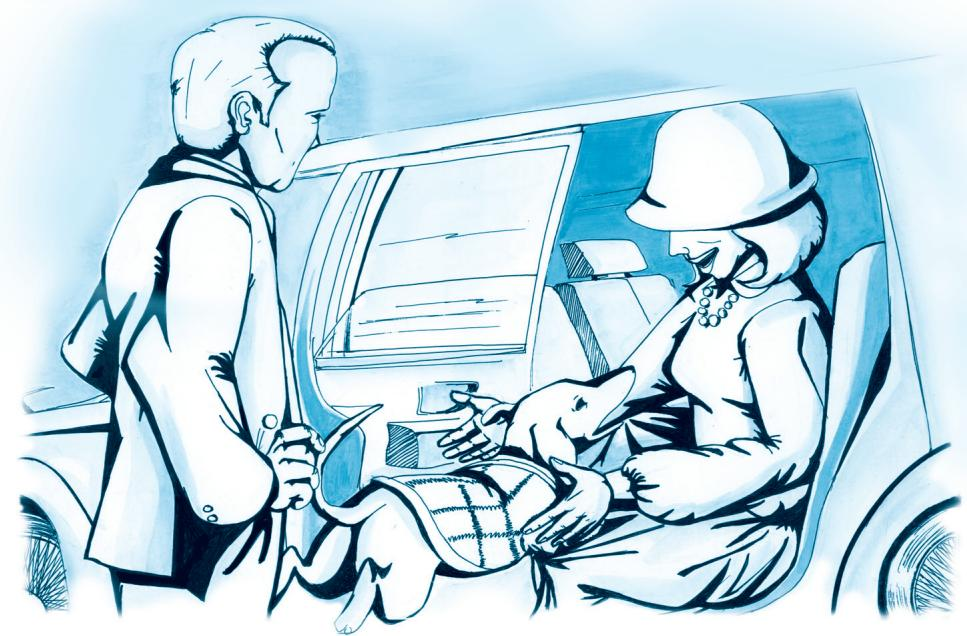
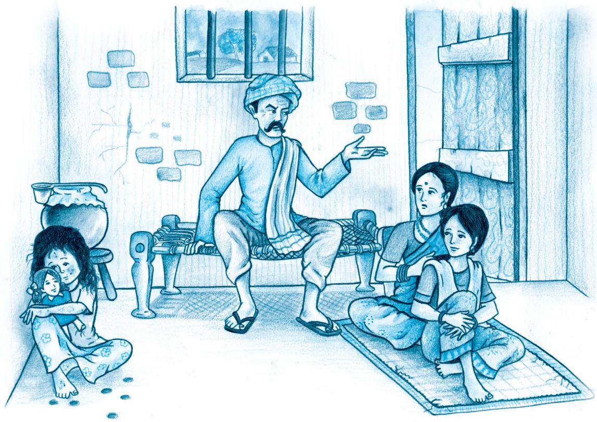
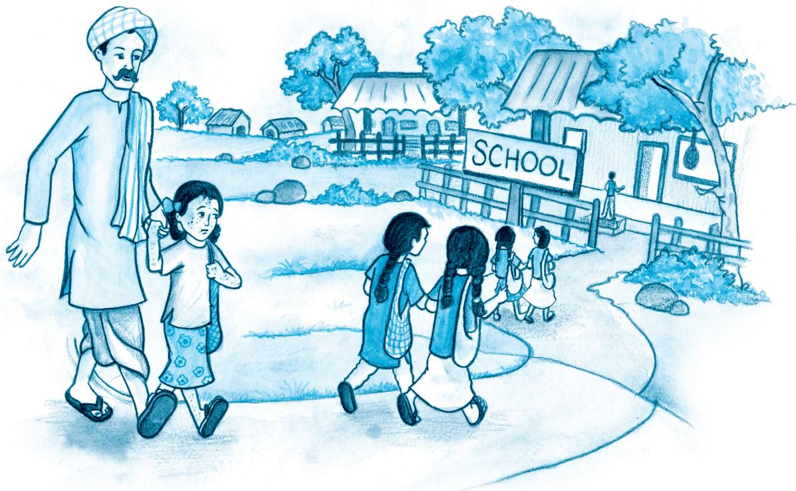

# Chapter 1
# A Triumph of Surgery A Triumph of

1060CH01

Tricki, a small dog, is pampered and overfed by his rich mistress. He falls seriously ill and his mistress consults a veterinary surgeon. Does he perform an operation? Does the dog recover?

## READ AND FIND OUT

Why is Mrs Pumphrey worried about Tricki?   
• What does she do to help him? Is she wise in this?   
Who does ‘I’ refer to in this story?

I WAS really worried about Tricki this time. I had pulled up my car when I saw him in the street with his mistress and I was shocked at his appearance. He had become hugely fat, like a bloated sausage with a leg at each corner. His eyes, bloodshot and rheumy, stared straight ahead and his tongue lolled from his jaws.

Mrs Pumphrey hastened to explain, “He was so listless, Mr Herriot. He seemed to have no energy. I thought he must be suffering from malnutrition, so I have been giving him some little extras between meals to build him up, some malt and cod-liver oil and a bowl of Horlicks at night to make him sleep — nothing much really.”

“And did you cut down on the sweet things as I told you?”

“Oh, I did for a bit, but he seemed to be so weak I had to relent. He does love cream cakes and chocolates so. I can’t bear to refuse him.”

I looked down again at the little dog. That was the trouble. Tricki’s only fault was greed. He had never been known to refuse food; he would tackle a meal at any hour of the day or night. And I wondered about all the things Mrs Pumphrey hadn’t mentioned.

“Are you giving him plenty of exercise?”

“Well, he has his little walks with me as you can see, but Hodgkin, the gardener, has been down with lumbago, so there has been no ring-throwing lately.”

I tried to sound severe: “Now I really mean this. If you don’t cut his food right down and give him more exercise he is going to be really ill. You must harden your heart and keep him on a very strict diet.”

Mrs Pumphrey wrung her hands. “Oh I will, Mr Herriot. I’m sure you are right, but it is so difficult, so very difficult.” She set off, head down, along the road, as if determined to put the new regime into practice immediately.

I watched their progress with growing concern. Tricki was tottering along in his little tweed coat; he had a whole wardrobe of these coats — for the cold weather and a raincoat for the wet days. He struggled on, drooping in his harness. I thought it wouldn’t be long before I heard from Mrs Pumphrey.

The expected call came within a few days. Mrs Pumphrey was distraught. Tricki would eat nothing. Refused even his favourite dishes; and besides, he had bouts of vomiting. He spent all his time lying on a rug, panting. Didn’t want to go for walks, didn’t want to do anything.

I had made my plans in advance. The only way was to get Tricki out of the house for a period. I suggested that he be hospitalised for about a fortnight to be kept under observation.

The poor lady almost swooned. She was sure he would pine and die if he did not see her every day.

But I took a firm line. Tricki was very ill and this was the only way to save him; in fact, I thought it best to take him without delay and,

followed by Mrs Pumphrey’s wailings, I marched out to the car carrying the little dog wrapped in a blanket.

The entire staff was roused and maids rushed in and out bringing his day bed, his night bed, favourite cushions, toys and rubber rings, breakfast bowl, lunch bowl, supper bowl. Realising that my car would never hold all the stuff, I started to drive away. As I moved off, Mrs Pumphrey, with a despairing cry, threw an armful of the little coats through the window. I looked in the mirror before I turned the corner of the drive; everybody was in tears.

Out on the road, I glanced down at the pathetic little animal gasping on the seat by my side. I patted the head and Tricki made a brave effort to wag his tail. “Poor old lad,” I said. “You haven’t a kick in you but I think I know a cure for you.”

## READ AND FIND OUT

• Is the narrator as rich as Tricki’s mistress?   
• How does he treat the dog?   
• Why is he tempted to keep Tricki on as a permanent guest?   
Why does Mrs Pumphrey think the dog’s recovery is “a triumph of surgery”?

At the surgery, the household dogs surged round me. Tricki looked down at the noisy pack with dull eyes and, when put down, lay motionless on the carpet. The other dogs, after sniffing round him for a few seconds, decided he was an uninteresting object and ignored him.

I made up a bed for him in a warm loose box next to the one where the other dogs slept. For two days I kept an eye on him, giving him no food but plenty of water. At the end of the second day he started to show some interest in his surroundings and on the third he began to whimper when he heard the dogs in the yard.

When I opened the door, Tricki trotted out and was immediately engulfed by Joe, the greyhound, and his friends. After rolling him over and thoroughly inspecting him, the dogs moved off down the garden. Tricki followed them, rolling slightly with his surplus fat.

Later that day, I was present at feeding time. I watched while Tristan slopped the food into the bowls. There was the usual headlong rush followed by the sounds of high-speed eating; every dog knew that if he fell behind the others he was liable to have some competition for the last part of his meal.

When they had finished, Tricki took a walk round the shining bowls, licking casually inside one or two of them. Next day, an extra bowl was put out for him and I was pleased to see him jostling his way towards it.

From then on, his progress was rapid. He had no medicinal treatment of any kind but all day he ran about with the dogs, joining in their friendly scrimmages. He discovered the joys of being bowled over, tramped on and squashed every few minutes. He became an accepted member of the gang, an unlikely, silky little object among the shaggy crew, fighting like a tiger for his share at mealtimes and hunting rats in the old henhouse at night. He had never had such a time in his life.

All the while, Mrs Pumphrey hovered anxiously in the background, ringing a dozen times a day for the latest bulletins. I dodged the questions about whether his cushions were being turned regularly or his correct coat worn according to the weather; but I was able to tell her that the little fellow was out of danger and convalescing rapidly.

The word ‘convalescing’ seemed to do something to Mrs Pumphrey. She started to bring round fresh eggs, two dozen at a time, to build up Tricki’s strength. For a happy period my partners and I had two eggs each for breakfast, but when the bottles of wine began to arrive, the real possibilities of the situation began to dawn on the household.

It was to enrich Tricki’s blood. Lunch became a ceremonial occasion with two glasses of wine before and several during the meal.

We could hardly believe it when the brandy came to put a final edge on Tricki’s constitution. For a few nights the fine spirit was rolled around, inhaled and reverently drunk.

They were days of deep content, starting well with the extra egg in the morning, improved and sustained by the midday wine and finishing luxuriously round the fire with the brandy.

It was a temptation to keep Tricki on as a permanent guest, but I knew Mrs Pumphrey was suffering and after a fortnight, felt compelled to phone and tell her that the little dog had recovered and was awaiting collection.

Within minutes, about thirty feet of gleaming black metal drew up outside the surgery. The chauffeur opened the door and I could just make out the figure of Mrs Pumphrey almost lost in the interior. Her hands were tightly clasped in front of her; her lips trembled. “Oh, Mr Herriot, do tell me the truth. Is he really better?”

“Yes, he’s fine. There’s no need for you to get out of the car — I’ll go and fetch him.”

I walked through the house into the garden. A mass of dogs was hurtling round and round the lawn and in their midst, ears flapping, tail waving, was the little golden figure of Tricki. In two weeks he had been transformed into a lithe, hard-muscled animal; he was keeping up well with the pack, stretching out in great bounds, his chest almost brushing the ground.

I carried him back along the passage to the front of the house. The chauffeur was still holding the car door open and when Tricki saw his

mistress he took off from my arms in a tremendous leap and sailed into Mrs Pumphrey’s lap. She gave a startled “Ooh!” And then had to defend herself as he swarmed over her, licking her face and barking.

During the excitement, I helped the chauffeur to bring out the beds, toys, cushions, coats and bowls, none of which had been used. As the car moved away, Mrs Pumphrey leaned out of the window. Tears shone in her eyes. Her lips trembled.

“Oh, Mr Herriot,” she cried, “how can I ever thank you? This is a triumph of surgery!”

JAMES HERRIOT

## GLOSSARY

sausage: finely minced meat stuffed into long cylindrical cases and divided into small lengths by twisting or tying

rheumy: a watery discharge from a mucous membrane especially of the nose or eyes

listless: lacking energy and enthusiasm

lumbago: muscular pain in the lower part of the back (lumbar region)

regime: prescribed course of exercise and diet

distraught: extremely worried

surgery: a place where a doctor, a dentist or a veterinary surgeon treats patients

scrimmage: rough or confused struggle

convalescing: recovering from an illness

lithe: flexible

## Think about itThink about

1. What kind of a person do you think the narrator, a veterinary surgeon, is? Would you say he is tactful as well as full of common sense?   
2. Do you think Tricki was happy to go home? What do you think will happen now?   
3. Do you think this is a real-life episode, or mere fiction? Or is it a mixture of both?

## Talk about itTalk about

1. This episode describes the silly behaviour of a rich woman who is foolishly indulgent, perhaps because she is lonely. Do you think such people are merely silly, or can their actions cause harm to others?   
2. Do you think there are also parents like Mrs Pumphrey?   
3. What would you have done if you were: (i) a member of the staff in Mrs Pumphrey’s household, (ii) a neighbour? What would your life have been like, in general?   
4. What would you have done if you were in the narrator’s place?

## Suggested readingSuggested

‘Rikki Tikki Tawi’ by Rudyard Kipling   
• Dog Stories by James Herriot   
‘A Zoo in My Luggage’ by Gerald Durrell   
• ‘A Tiger Comes to Town’ by R.K. Narayan

## Time

The butterfly counts not months but moments, and has time enough.

Time is a wealth of change, but the clock in its parody makes it mere change and no wealth.

Let your life lightly dance on the edges of Time like dew on the tip ofaleaf.

RABINDRANATH TAGORE

# Chapter 2
# The Thief's Story The Thief's

1060CH02

A young boy makes friends with Anil. Anil trusts him completely and employs him. Does the boy betray his trust?

## READ AND FIND OUT

• Who does ‘I’ refer to in this story?   
• What is he “a fairly successful hand” at?   
• What does he get from Anil in return for his work?

I WAS still a thief when I met Anil. And though only 15, I was an experienced and fairly successful hand.

Anil was watching a wrestling match when I approached him. He was about 25 — a tall, lean fellow — and he looked easy-going, kind and simple enough for my purpose. I hadn’t had much luck of late and thought I might be able to get into the young man’s confidence.

“You look a bit of a wrestler yourself,” I said. A little flattery helps in making friends.

“So do you,” he replied, which put me off for a moment because at that time I was rather thin.

“Well,” I said modestly, “I do wrestle a bit.”

“What’s your name?”

“Hari Singh,” I lied. I took a new name every month. That kept me ahead of the police and my former employers.

After this introduction, Anil talked about the well-oiled wrestlers who were grunting, lifting and throwing each other about. I didn’t have much to say. Anil walked away. I followed casually.

“Hello again,” he said.

I gave him my most appealing smile. “I want to work for you,” I said.

“But I can’t pay you.”

I thought that over for a minute. Perhaps I had misjudged my man. I asked, “Can you feed me?”

“Can you cook?”

“I can cook,” I lied again.

“If you can cook, then may be I can feed you.”

He took me to his room over the Jumna Sweet Shop and told me I could sleep on the balcony. But the meal I cooked that night must have been terrible because Anil gave it to a stray dog and told me to be off. But I just hung around, smiling in my most appealing way, and he couldn’t help laughing.

Later, he patted me on the head and said never mind, he’d teach me to cook. He also taught me to write my name and said he would soon teach me to write whole sentences and to add numbers. I was grateful. I knew that once I could write like an educated man there would be no limit to what I could achieve.

It was quite pleasant working for Anil. I made the tea in the morning and then would take my time buying the day’s supplies, usually making a profit of about a rupee a day. I think he knew I made a little money this way but he did not seem to mind.

Anil made money by fits and starts. He would borrow one week, lend the next. He kept worrying about his next cheque, but as soon as it arrived he would go out and celebrate. It seems he wrote for magazines — a queer way to make a living!

One evening he came home with a small bundle of notes, saying he had just sold a book to a publisher. At night, I saw him tuck the money under the mattress.

I had been working for Anil for almost a month and, apart from cheating on the shopping, had not done anything in my line of work. I had every opportunity for doing so. Anil had given me a key to the door, and I could come and go as I pleased. He was the most trusting person I had ever met.

And that is why it was so difficult to rob him. It’s easy to rob a greedy man, because he can afford to be robbed; but it’s difficult to rob a careless man — sometimes he doesn’t even notice he’s been robbed and that takes all the pleasure out of the work.

Well, it’s time I did some real work, I told myself; I’m out of practice. And if I don’t take the money, he’ll only waste it on his friends. After all, he doesn’t even pay me.

## READ AND FIND OUT

• How does the thief think Anil will react to the theft?   
. What does he say about the different reactions of people when they are robbed?   
• Does Anil realise that he has been robbed?

Anil was asleep. A beam of moonlight stepped over the balcony and fell on the bed. I sat up on the floor, considering the situation. If I took the money, I could catch the 10.30 Express to Lucknow. Slipping out of the blanket, I crept up to the bed. Anil was sleeping peacefully. His face was clear and unlined; even I had more marks on my face, though mine were mostly scars.

My hand slid under the mattress, searching for the notes. When I found them, I drew them out without a sound. Anil sighed in his sleep and turned on his side, towards me. I was startled and quickly crawled out of the room.

When I was on the road, I began to run. I had the notes at my waist, held there by the string of my pyjamas. I slowed down to a walk and counted the notes: 600 rupees in fifties! I could live like an oilrich Arab for a week or two.

When I reached the station I did not stop at the ticket office (I had never bought a ticket in my life) but dashed straight to the platform. The Lucknow Express was just moving out. The train had still to pick up speed and I should have been able to jump into one of the carriages, but I hesitated — for some reason I can’t explain — and I lost the chance to get away.

When the train had gone, I found myself standing alone on the deserted platform. I had no idea where to spend the night. I had no friends, believing that friends were more trouble than help. And I did not want to make anyone curious by staying at one of the small hotels near the station. The only person I knew really well was the man I had robbed. Leaving the station, I walked slowly through the bazaar.

In my short career as a thief, I had made a study of men’s faces when they had lost their goods. The greedy man showed fear; the rich man showed anger; the poor man showed acceptance. But I knew that Anil’s face, when he discovered the theft, would show only a touch of sadness. Not for the loss of money, but for the loss of trust.

I found myself in the maidan and sat down on a bench. The night was chilly — it was early November — and a light drizzle added to my discomfort. Soon it was raining quite heavily. My shirt and pyjamas stuck to my skin, and a cold wind blew the rain across my face.

I went back to the bazaar and sat down in the shelter of the clock tower. The clock showed midnight. I felt for the notes. They were damp from the rain.

Anil’s money. In the morning he would probably have given me two or three rupees to go to the cinema, but now I had it all. I couldn’t cook his meals, run to the bazaar or learn to write whole sentences any more.

I had forgotten about them in the excitement of the theft. Whole sentences, I knew, could one day bring me more than a few hundred rupees. It was a simple matter to steal — and sometimes just as simple to be caught. But to be a really big man, a clever and respected man, was something else. I should go back to Anil, I told myself, if only to learn to read and write.

I hurried back to the room feeling very nervous, for it is much easier to steal something than to return it undetected. I opened the door quietly, then stood in the doorway, in clouded moonlight. Anil was still asleep. I crept to the head of the bed, and my hand came up with the notes. I felt his breath on my hand. I remained still for a minute. Then my hand found the edge of the mattress, and slipped under it with the notes.

I awoke late next morning to find that Anil had already made the tea. He stretched out his hand towards me. There was a fifty-rupee note between his fingers. My heart sank. I thought I had been discovered.

“I made some money yesterday,” he explained. “Now you’ll be paid regularly.”

My spirits rose. But when I took the note, I saw it was still wet from the night’s rain.

“Today we’ll start writing sentences,” he said.

He knew. But neither his lips nor his eyes showed anything. I smiled at Anil in my most appealing way. And the smile came by itself, without any effort.

RUSKIN BOND

## GLOSSARY

flattery: insincere praise

modestly: without boasting; in a humble way

grunting: making low guttural sounds

appealing: attractive

unlined: (here) showing no sign of worry or anxiety

## Think about itThink about

1. What are Hari Singh’s reactions to the prospect of receiving an education? Do they change over time? (Hint: Compare, for example, the thought: “I knew that once I could write like an educated man there would be no limit to what I could achieve” with these later thoughts: “Whole sentences, I knew, could one day bring me more than a few hundred rupees. It was a simple matter to steal — and sometimes just as simple to be caught. But to be a really big man, a clever and respected man, was something else.”) What makes him return to Anil?   
2. Why does not Anil hand the thief over to the police? Do you think most people would have done so? In what ways is Anil different from such employers?

## Talk about itTalk about

1. Do you think people like Anil and Hari Singh are found only in fiction, or are there such people in real life?   
2. Do you think it a significant detail in the story that Anil is a struggling writer? Does this explain his behaviour in any way?   
3. Have you met anyone like Hari Singh? Can you think and imagine the circumstances that can turn a fifteen-year-old boy into a thief?   
4. Where is the story set? (You can get clues from the names of the persons and places mentioned in it.) Which language or languages are spoken in these places? Do you think the characters in the story spoke to each other in English?

## Suggested readingSuggested

• ‘He Said It with Arsenic’ by Ruskin Bond   
‘Vanka’ by Anton Chekhov   
‘A Scandal in Bohemia’ by Arthur Conan Doyle

# Chapter 3
# The Midnight VThe Midnight isitor

1060CH03

Ausable, a secret agent, is expecting to get a very important report. Another secret agent, Max, threatens him with a pistol, demanding the report. Does Ausable outwit him?

## READ AND FIND OUT

• How is Ausable different from other secret agents?   
Who is Fowler and what is his first authentic thrill of the day?

AUSABLE did not fit any description of a secret agent Fowler had ever read. Following him down the musty corridor of the gloomy French hotel where Ausable had a room, Fowler felt let down. It was a small room, on the sixth and top floor, and scarcely a setting for a romantic adventure.

Ausable was, for one thing, fat. Very fat. And then there was his accent. Though he spoke French and German passably, he had never altogether lost the American accent he had brought to Paris from Boston twenty years ago.

“You are disappointed,” Ausable said wheezily over his shoulder. “You were told that I was a secret agent, a spy, dealing in espionage and danger. You wished to meet me because you are a writer, young and romantic. You envisioned mysterious figures in the night, the crack of pistols, drugs in the wine.”

“Instead, you have spent a dull evening in a French music hall with a sloppy fat man who, instead of having messages slipped into his hand by dark-eyed beauties, gets only a prosaic telephone call making an appointment in his room. You have been bored!” The fat man chuckled to himself as he unlocked the door of his room and stood aside to let his frustrated guest enter.

“You are disillusioned,” Ausable told him. “But take cheer, my young friend. Presently you will see a paper, a quite important paper for

which several men and women have risked their lives, come to me. Some day soon that paper may well affect the course of history. In that thought is drama, is there not?”

As he spoke, Ausable closed the door behind him. Then he switched on the light.

And as the light came on, Fowler had his first authentic thrill of the day. For halfway across the room, a small automatic pistol in his hand, stood a man.

Ausable blinked a few times.

“Max,” he wheezed, “you gave me quite a start. I thought you were in Berlin. What are you doing here in my room?”

## READ AND FIND OUT

• How has Max got in?   
• How does Ausable say he got in?

Max was slender, a little less than tall, with features that suggested slightly the crafty, pointed countenance of a fox. There was about him — aside from the gun — nothing especially menacing.

“The report,” he murmured. “The report that is being brought to you tonight concerning some new missiles. I thought I would take it from you. It will be safer in my hands than in yours.”

Ausable moved to an armchair and sat down heavily. “I’m going to raise the devil with the management this time, and you can bet on it,” he said grimly. “This is the second time in a month that somebody has got into my room through that nuisance of a balcony!” Fowler’s eyes went to the single window of the room. It was an ordinary window, against which now the night was pressing blackly.

“Balcony?” Max said, with a rising inflection. “No, a passkey. I did not know about the balcony. It might have saved me some trouble had I known.”

“It’s not my balcony,” Ausable said with extreme irritation. “It belongs to the next apartment.” He glanced explanatorily at Fowler. “You see,” he said, “this room used to be part of a large unit, and the next room — through that door there — used to be the living room. It had the balcony, which extends under my window now. You can get onto it from the empty room two doors down — and somebody did, last month. The management promised to block it off. But they haven’t.”

Max glanced at Fowler, who was standing stiffly not far from Ausable, and waved the gun with a commanding gesture. “Please sit down,” he said. “We have a wait of half an hour, I think.”

“Thirty-one minutes,” Ausable said moodily. “The appointment was for twelve-thirty. I wish I knew how you learned about the report, Max.”

The little spy smiled evilly. “And we wish we knew how your people got the report. But no harm has been done. I will get it back tonight. What is that? Who is at the door?”

Fowler jumped at the sudden knocking at the door. Ausable just smiled. “That will be the police,” he said. “I thought that such an important paper as the one we are waiting for should have a little extra protection. I told them to check on me to make sure everything was all right.”

Max bit his lip nervously. The knocking was repeated.

“What will you do now, Max?” Ausable asked. “If I do not answer the door, they will enter anyway. The door is unlocked. And they will not hesitate to shoot.”

Max’s face was black with anger as he backed swiftly towards the window. He swung a leg over the sill. “Send them away!” he warned. “I will wait on the balcony. Send them away or I’ll shoot and take my chances!”

The knocking at the door became louder and a voice was raised. “Mr Ausable! Mr Ausable!”

Keeping his body twisted so that his gun still covered the fat man and his guest, the man at the window grasped the frame with his free hand to support himself. Then he swung his other leg up and over the window-sill.

The doorknob turned. Swiftly Max pushed with his left hand to free himself from the sill and drop to the balcony. And then, as he dropped, he screamed once, shrilly.

The door opened and a waiter stood there with a tray, a bottle and two glasses. “Here is the drink you ordered for when you returned,” he said, and set the tray on the table, deftly uncorked the bottle, and left the room.

White-faced, Fowler stared after him. “But...” he stammered, “the police...” ”

“There were no police.” Ausable sighed. “Only Henry, whom I was expecting.”

“But won’t that man out on the balcony…?” Fowler began.

“No,” said Ausable, “he won’t return. You see, my young friend, there is no balcony.”

ROBERT ARTHUR

## GLOSSARY

romantic: imaginative; having a fantastic view of reality

passably: just well enough; tolerably well

espionage: spying

sloppy: (here) carelessly dressed

prosaic: ordinary

chuckled: laughed quietly, without opening his mouth

wheezed: spoke breathing noisily and heavily

missiles: weapons directed by remote control or automatically

shrilly: piercingly; in a high pitch

## Think about itThink about

1. “Ausable did not fit any description of a secret agent Fowler had ever read.” What do secret agents in books and films look like, in your opinion? Discuss in groups or in class some stories or movies featuring spies, detectives and secret agents, and compare their appearance with that of Ausable in this story. (You may mention characters from fiction in languages other than English. In English fiction you may have come across Sherlock Holmes, Hercule Poirot, or Miss Marple. Have you watched any movies featuring James Bond?)   
2. How does Ausable manage to make Max believe that there is a balcony attached to his room? Look back at his detailed description of it. What makes it a convincing story?   
3. Looking back at the story, when do you think Ausable thought up his plan for getting rid of Max? Do you think he had worked out his plan in detail right from the beginning? Or did he make up a plan taking advantage of events as they happened?

## Talk about itTalk about

1. In this story, Ausable shows great ‘presence of mind,’ or the ability to think quickly, and act calmly and wisely, in a situation of danger and surprise. Give examples from your own experience, or narrate a story, which shows someone’s presence of mind.   
2. Discuss what you would do in the situations described below. Remember that presence of mind comes out of a state of mental preparedness. If you have thought about possible problems or dangers, and about how to act in such situations, you have a better

chance of dealing with such situations if they do arise.

• A small fire starts in your kitchen.   
• A child starts to choke on a piece of food.   
• An electrical appliance starts to hiss and gives out sparks.   
• A bicycle knocks down a pedestrian.   
• It rains continuously for more than twenty-four hours.   
• A member of your family does not return home at the usual or expected time. You may suggest other such situations.

## Suggested readingSuggested

‘After Twenty Years’ by O. Henry   
• ‘The Stolen Bacillus’ by H.G. Wells   
‘The Face on the Wall’ by E.V. Lucas

## Haiku

An old pond! A frog jumps in - The sound of water.

MATSUO BASHO

Right at my feet - and when did you get here, snail?

IsSA

The above two poems are examples of Haiku. Haiku is a poetic form and a type of poetry from the Japanese culture. Haiku combines form, content, and language in a meaningful, yet compact form. The most common form of Haiku is three short lines. The themes include nature, feelings, or experiences.

# Chapter 4
# A Question of Trust A Question of

1060CH04

It is said that you must set a thief to catch a thief. But it is also said that there is honour among thieves. Which saying does this story illustrate?

## READ AND FIND OUT

What does Horace Danby like to collect?   
• Why does he steal every year?

EVERYONE thought that Horace Danby was a good, honest citizen. He was about fifty years old and unmarried, and he lived with a housekeeper who worried over his health. In fact, he was usually very well and happy except for attacks of hay fever in summer. He made locks and was successful enough at his business to have two helpers. Yes, Horace Danby was good and respectable — but not completely honest.

Fifteen years ago, Horace had served his first and only sentence in a prison library. He loved rare, expensive books. So he robbed a safe every year. Each year he planned carefully just what he would do, stole enough to last for twelve months, and secretly bought the books he loved through an agent.

Now, walking in the bright July sunshine, he felt sure that this year’s robbery was going to be as successful as all the others. For two weeks he had been studying the house at Shotover Grange, looking at its rooms, its electric wiring, its paths and its garden. This afternoon the two servants, who remained in the Grange while the family was in London, had gone to the movies. Horace saw them go, and he felt happy in spite of a little tickle of hay fever in his nose. He came out from behind the garden wall, his tools carefully packed in a bag on his back.

There were about fifteen thousand pounds’ worth of jewels in the Grange safe. If he sold them one by one, he expected to get at least

five thousand, enough to make him happy for another year. There were three very interesting books coming up for sale in the autumn. Now he would get the money he wanted to buy them.

He had seen the housekeeper hang the key to the kitchen door on a hook outside. He put on a pair of gloves, took the key, and opened the door. He was always careful not to leave any fingerprints.

A small dog was lying in the kitchen. It stirred, made a noise, and moved its tail in a friendly way.

“All right, Sherry,” Horace said as he passed. All you had to do to keep dogs quiet was to call them by their right names, and show them love.

The safe was in the drawing room, behind a rather poor painting. Horace wondered for a moment whether he should collect pictures instead of books. But they took up too much room. In a small house, books were better.

There was a great bowl of flowers on the table, and Horace felt his nose tickle. He gave a little sneeze and then put down his bag. He carefully arranged his tools. He had four hours before the servants returned.

The safe was not going to be hard to open. After all, he had lived with locks and safes all his life. The burglar alarm was poorly built. He went into the hall to cut its wire. He came back and sneezed loudly as the smell of the flowers came to him again.

How foolish people are when they own valuable things, Horace thought. A magazine article had described this house, giving a plan of all the rooms and a picture of this room. The writer had even mentioned that the painting hid a safe!

But Horace found that the flowers were hindering him in his work. He buried his face in his handkerchief.

Then he heard a voice say from the doorway, “What is it? A cold or hay fever?”

Before he could think, Horace said, “Hay fever,” and found himself sneezing again.

The voice went on, “You can cure it with a special treatment, you know, if you find out just what plant gives you the disease. I think you’d better see a doctor, if you’re serious about your work. I heard you from the top of the house just now.”

## READ AND FIND OUT

• Who is speaking to Horace Danby?   
Who is the real culprit in the story?

It was a quiet, kindly voice, but one with firmness in it. A woman was standing in the doorway, and Sherry was rubbing against her. She was young, quite pretty, and was dressed in red. She walked to the fireplace and straightened the ornaments there.

“Down, Sherry,” she said. “Anyone would think I’d been away for a month!” She smiled at Horace, and went on, “However, I came back just in time, though I didn’t expect to meet a burglar.”

Horace had some hope because she seemed to be amused at meeting him. He might avoid trouble if he treated her the right way. He replied, “I didn’t expect to meet one of the family.”

She nodded. “I see what an inconvenience it is for you to meet me. What are you going to do?”

Horace said, “My first thought was to run.”

“Of course, you could do that. But I would telephone the police and tell them all about you. They’d get you at once.”

Horace said, “I would, of course, cut the telephone wires first and then...,” he hesitated, a smile on his face, “I would make sure that you could do nothing for some time. A few hours would be enough.”

She looked at him seriously. “You’d hurt me?”

Horace paused, and then said, “I think I was trying to frighten you when I said that.”

“You didn’t frighten me.”

Horace suggested, “It would be nice if you would forget you ever saw me. Let me go.”

The voice was suddenly sharp. “Why should I? You were going to rob me. If I let you go, you’ll only rob someone else. Society must be protected from men like you.”

Horace smiled. “I’m not a man who threatens society. I steal only from those who have a lot of money. I steal for a very good reason. And I hate the thought of prison.”

She laughed, and he begged, thinking that he had persuaded her, “Look, I have no right to ask you for anything, but I’m desperate. Let me go and I promise never to do this kind of thing again. I really mean it.”

She was silent, watching him closely. Then she said, “You are really afraid of going to prison, aren’t you?”

She came over to him shaking her head. “I have always liked the wrong kind of people.”

She picked up a silver box from the table and took a cigarette from it. Horace, eager to please her and seeing that she might help him, took off his gloves and gave her his cigarette lighter.

“You’ll let me go?” He held the lighter towards her.

“Yes, but only if you’ll do something for me.”

“Anything you say.”

“Before we left for London, I promised my husband to take my jewels to our bank; but I left them here in the safe. I want to wear them to a party tonight, so I came down to get them, but…”

Horace smiled. “You’ve forgotten the numbers to open the safe, haven’t you?”

“Yes,” replied the young lady.

“Just leave it to me and you’ll have them within an hour. But I’ll have to break your safe.”

“Don’t worry about that. My husband won’t be here for a month, and I’ll have the safe mended by that time.”

And within an hour Horace had opened the safe, given her the jewels, and gone happily away.

For two days he kept his promise to the kind young lady. On the morning of the third day, however, he thought of the books he wanted and he knew he would have to look for another safe. But he never got the chance to begin his plan. By noon a policeman had arrested him for the jewel robbery at Shotover Grange.

His fingerprints, for he had opened the safe without gloves, were all over the

room, and no one believed him when he said that the wife of the owner of the house had asked him to open the safe for her. The wife herself, a gray-haired, sharp-tongued woman of sixty, said that the story was nonsense.

Horace is now the assistant librarian in the prison. He often thinks of the charming, clever young lady who was in the same profession as he was, and who tricked him. He gets very angry when anyone talks about ‘honour among thieves’.

VICTOR CANNING

## GLOSSARY

hay fever: a disorder affecting the nose and throat, caused by allergy to pollen or dust

## Think about itThink about

1. Did you begin to suspect, before the end of the story, that the lady was not the person Horace Danby took her to be? If so, at what point did you realise this, and how?   
2. What are the subtle ways in which the lady manages to deceive Horace Danby into thinking she is the lady of the house? Why doesn’t Horace suspect that something is wrong?   
3. “Horace Danby was good and respectable — but not completely honest”. Why do you think this description is apt for Horace? Why can’t he be categorised as a typical thief?   
4. Horace Danby was a meticulous planner but still he faltered. Where did he go wrong and why?

## Talk about itTalk about

1. Do you think Horace Danby was unfairly punished, or that he deserved what he got?   
2. Do intentions justify actions? Would you, like Horace Danby, do something wrong if you thought your ends justified the means? Do you think that there are situations in which it is excusable to act less than honestly?

## Suggested readingSuggested Q

• ‘The Unexpected’ by Ella Edkin   
‘The Confession’ by Anton Chekhov   
‘A Case for the Defence’ by Graham Greene

# Chapter 5
# Footprints Footprints withoutwithout Feet

1060CH05

Can a man become invisible? This is the story of a scientist who discovers how to make himself invisible. Does he use, or misuse, his discovery?

## READ AND FIND OUT

• How did the invisible man first become visible?   
• Why was he wandering the streets?

THE two boys started in surprise at the fresh muddy imprints of a pair of bare feet. What was a barefooted man doing on the steps of a house, in the middle of London? And where was the man?

As they gazed, a remarkable sight met their eyes. A fresh footmark appeared from nowhere!

Further footprints followed, one after another, descending the steps and progressing down the street. The boys followed, fascinated, until the muddy impressions became fainter and fainter, and at last disappeared altogether.

The explanation of the mystery was really simple enough. The bewildered boys had been following a scientist who had just discovered how to make the human body transparent.

Griffin, the scientist, had carried out experiment after experiment to prove that the human body could become invisible. Finally he swallowed certain rare drugs and his body became as transparent as a sheet of glass — though it also remained as solid as glass.

Brilliant scientist though he was, Griffin was rather a lawless person. His landlord disliked him and tried to eject him. In revenge Griffin set fire to the house. To get away without being seen he had to remove his clothes. Thus it was that he became a homeless wanderer, without clothes, without money, and quite invisible — until he happened to step in some mud, and left footprints as he walked!

He escaped easily enough from the boys who followed his footprints in London. But his adventures were by no means over. He had chosen a bad time of the year to wander about London without clothes. It was mid-winter. The air was bitterly cold and he could not do without clothes. Instead of walking about the streets he decided to slip into a big London store for warmth.

Closing time arrived, and as soon as the doors were shut Griffin was able to give himself the pleasure of clothing and feeding himself without regard to expense. He broke open boxes and wrappers and fitted himself out with warm clothes. Soon, with shoes, an overcoat and a wide-brimmed hat, he became a fully dressed and visible person. In the kitchen of the restaurant he found cold meat and coffee, and he followed up the meal with sweets and wine taken from the grocery store. Finally he settled down to sleep on a pile of quilts.

If only Griffin had managed to wake up in good time all might have been well. As it was, he did not wake up until the assistants were already arriving next morning. When he saw a couple of them

approaching, he panicked and began to run. They naturally gave chase. In the end he was able to escape only by quickly taking off his newlyfound clothes. So once more he found himself invisible but naked in the chill January air.

This time he decided to try the stock of a theatrical company in the hope of finding not only clothes but also something that would hide the empty space above his shoulders. Shivering with cold he hurried to Drury Lane, the centre of the theatre world.

He soon found a suitable shop. He made his way, invisible, upstairs and came out a little later wearing bandages round his forehead, dark glasses, false nose, big bushy side-whiskers, and a large hat. To escape without being seen, he callously attacked the shopkeeper from behind, after which he robbed him of all the money he could find.

## READ AND FIND OUT

• Why does Mrs Hall find the scientist eccentric?   
• What curious episode occurs in the study?   
• What other extraordinary things happen at the inn?

Eager to get away from crowded London he took a train to the village of Iping, where he booked two rooms at the local inn.

The arrival of a stranger at an inn in winter was in any case an unusual event. A stranger of such uncommon appearance set all tongues wagging. Mrs Hall, the landlord’s wife, made every effort to be friendly. But Griffin had no desire to talk, and told her, “My reason for coming to Iping is a desire for solitude. I do not wish to be disturbed in my work. Besides, an accident has affected my face.”

Satisfied that her guest was an eccentric scientist, and in view of the fact that he had paid her in advance, Mrs Hall was prepared to excuse his strange habits and irritable temper. But the stolen money did not last long, and presently Griffin had to admit that he had no more ready cash. He pretended, however, that he was expecting a cheque to arrive at any moment.

Shortly afterwards a curious episode occurred. Very early in the morning a clergyman and his wife were awakened by noises in the study. Creeping downstairs, they heard the chink of money being taken from the clergyman’s desk.

Without making any noise and with a poker grasped firmly in his hand, the clergyman flung open the door.

“Surrender!”

Then to his amazement he realised that the room appeared to be empty. He and his wife looked under the desk, and behind the curtains, and even up the chimney. There wasn’t a sign of anybody. Yet the desk had been opened and the housekeeping money was missing.

“Extraordinary affair!” the clergyman kept saying for the rest of the day.

But it was not as extraordinary as the behaviour of Mrs Hall’s furniture a little later that morning.

The landlord and his wife were up very early, and were surprised to see the scientist’s door wide open. Usually it was shut and locked, and he was furious if anyone entered his room. The opportunity seemed too good to be missed. They peeped round the door, saw nobody, and decided to investigate. The bedclothes were cold, showing that the scientist must have been up for some time; and stranger still, the clothes and bandages that he always wore were lying about the room.

All of a sudden Mrs Hall heard a sniff close to her ear. A moment later the hat on the bedpost leapt up and dashed itself into her face. Then the bedroom chair became alive. Springing into the air it charged straight at her, legs foremost. As she and her husband turned away in terror, the extraordinary chair pushed them both out of the room and then appeared to slam and lock the door after them.

Mrs Hall almost fell down the stairs in hysterics. She was convinced that the room was haunted by spirits, and that the stranger had somehow caused these to enter into her furniture.

“My poor mother used to sit in that chair,” she moaned. “To think it should rise up against me now!”

The feeling among the neighbours was that the trouble was caused by witchcraft. But witchcraft or not, when news of the burglary at the clergyman’s home became known, the strange scientist was strongly suspected of having had a hand in it. Suspicion grew even stronger when he suddenly produced some ready cash, though he had admitted not long before that he had no money.

The village constable was secretly sent for. Instead of waiting for the constable, Mrs Hall went to the scientist, who had somehow mysteriously appeared from his empty bedroom.

“I want to know what you have been doing to my chair upstairs,” she demanded. “And I want to know how it is you came out of an empty room and how you entered a locked room.”

The scientist was always quick-tempered; now he became furious.

“You don’t understand who or what I am!” he shouted. “Very well — I’ll show you.”

Suddenly he threw off bandages, whiskers, spectacles, and even nose. It took him only a minute to do this. The horrified people in the bar found themselves staring at a headless man!

Mr Jaffers, the constable, now arrived, and was quite surprised to find that he had to arrest a man without a head. But Jaffers was not easily prevented from doing his duty. If a magistrate’s warrant ordered a person’s arrest, then that person had to be arrested, with or without his head.

There followed a remarkable scene as the policeman tried to get hold of a man who was becoming more and more invisible as he threw off one garment after another. Finally a shirt flew into the air, and the constable found himself struggling with someone he could not see at

all. Some people tried to help him, but found themselves hit by blows that seemed to come from nowhere.

In the end Jaffers was knocked unconscious as he made a last attempt to hold on to the unseen scientist.

There were nervous, excited cries of “Hold him!” But this was easier said than done. Griffin had shaken himself free, and no one knew where to lay hands on him.

H.G. WELLS

## Think about itThink about

1. “Griffin was rather a lawless person.” Comment.   
2. How would you assess Griffin as a scientist?

## Talk about itTalk about

1. Would you like to become invisible? What advantages and disadvantages do you foresee, if you did?   
2. Are there forces around us that are invisible, for example, magnetism? Are there aspects of matter that are ‘invisible’ or not visible to the naked eye? What would the world be like if you could see such forces or such aspects of matter?   
3. What makes glass or water transparent (what is the scientific explanation for this)? Do you think it would be scientifically possible for a man to become invisible, or transparent? (Keep in mind that writers of science fiction have often turned out to be prophetic in their imagination!)

## Suggested readingSuggested J

The Invisible Man by H.G. Wells   
• ‘As Far As the Human Eye Can See’ by Isaac Asimov   
• It Happened Tomorrow (ed.) Bal Phondke

# Chapter 6
# The Making of a Scientist The Making of a

1060CH06

Richard Ebright has recieved the Searle Scholar Award and the Schering Plough Award for Biochemistry and Molecular Biology. It was his fascination for butterflies that opened the world of science to him.

## READ AND FIND OUT

• How did a book become a turning point in Richard Ebright’s life?   
• How did his mother help him?

AT the age of twenty-two, a former ‘scout of the year’ excited the scientific world with a new theory on how cells work. Richard H. Ebright and his college room-mate explained the theory in an article in the Proceedings of the National Academy of Science.

It was the first time this important scientific journal had ever published the work of college students. In sports, that would be like making the big leagues at the age of fifteen and hitting a home run your first time at bat*. For Richard Ebright, it was the first in a long string of achievements in science and other fields. And it all started with butterflies.

An only child, Ebright grew up north of Reading, Pennsylvania. “There wasn’t much I could do there,” he said. “I certainly couldn’t play football or baseball with a team of one. But there was one thing I could do — collect things.”

So he did, and did he ever! Beginning in kindergarten, Ebright collected butterflies with the same determination that has marked all his activities. He also collected rocks, fossils, and coins. He became an eager astronomer, too, sometimes star-gazing all night.

From the first he had a driving curiosity along with a bright mind. He also had a mother who encouraged his interest in learning. She took him on trips, bought him telescopes, microscopes, cameras, mounting materials, and other equipment and helped him in many other ways.

“I was his only companion until he started school,” his mother said. “After that I would bring home friends for him. But at night we just did things together. Richie was my whole life after his father died when Richie was in third grade.”

She and her son spent almost every evening at the dining room table. “If he didn’t have things to do, I found work for him — not physical work, but learning things,” his mother said. “He liked it. He wanted to learn.”

And learn he did. He earned top grades in school. “On everyday things he was just like every other kid,” his mother said.

By the time he was in the second grade, Ebright had collected all twentyfive species of butterflies found around his hometown. (See following box.)

## Species and Sub-species of Butterflies Collected in Six Weeks in Reading, Pennsylvania

| Gossamer-Winged 
 Butterflies   | Wood Nymphs 
 and Satyrs   | Brush-footed 
 Butterflies   |
|---------------------------------|----------------------------|------------------------------|
| • white M hairstreak            | • eyed brown               | • variegated fritillary      |
| • acadian hairstreak            | • wood nymph (grayling)    | • Harris's checkerspot       |
| • bronze copper                 | Monarchs                   | • pearl crescent             |
| • bog copper                    | • monarch or milkweed      | • mourning cloak             |
| • purplish copper               | Whites and Sulphurs        | • painted lady               |
| • eastern-tailed blue           | • olympia                  | • buckeye                    |
| • melissa blue                  | • cloudless sulphur        | • viceroy                    |
| • silvery blue                  | • European cabbage         | • white admiral              |
| Snout Butterfly                 |                            | • red-spotted purple         |
|                                 |                            | • hackberry                  |

“That probably would have been the end of my butterfly collecting,” he said. “But then my mother got me a children’s book called The Travels of Monarch X.” That book, which told how monarch butterflies migrate to Central America, opened the world of science to the eager young collector.

At the end of the book, readers were invited to help study butterfly migrations. They were asked to tag butterflies for research by Dr Frederick A. Urquhart of the University of Toronto, Canada. Ebright’s mother wrote to Dr Urquhart, and soon Ebright was attaching light adhesive tags to the wings of monarchs. Anyone who found a tagged butterfly was asked to send the tag to Dr Urquhart.

The butterfly collecting season around Reading lasts six weeks in late summer. (See graph below.) If you’re going to chase them one by one, you won’t catch very many. So the next step for Ebright was to raise a flock of butterflies. He would catch a female monarch, take her eggs, and raise them in his basement through their life cycle, from egg to caterpillar to pupa to adult butterfly. Then he would tag the butterflies’ wings and let them go. For several years his basement was home to thousands of monarchs in different stages of development.

“Eventually I began to lose interest in tagging butterflies. It’s tedious and there’s not much feedback,” Ebright said. “In all the time I did it,” he laughed, “only two butterflies I had tagged were recaptured — and they were not more than seventy-five miles from where I lived.”

## READ AND FIND OUT

What lesson does Ebright learn when he does not win anything at a science fair?   
What experiments and projects does he then undertake?   
What are the qualities that go into the making of a scientist?

Then in the seventh grade he got a hint of what real science is when he entered a county science fair — and lost. “It was really a sad feeling to sit there and not get anything while everybody else had won something,” Ebright said. His entry was slides of frog tissues, which he showed under a microscope. He realised the winners had tried to do real experiments, not simply make a neat display.

Already the competitive spirit that drives Richard Ebright was appearing. “I knew that for the next year’s fair I would have to do a real experiment,” he said. “The subject I knew most about was the insect work I’d been doing in the past several years.”

So he wrote to Dr Urquhart for ideas, and back came a stack of suggestions for experiments. Those kept Ebright busy all through high school and led to prize projects in county and international science fairs.

For his eighth grade project, Ebright tried to find the cause of a viral disease that kills nearly all monarch caterpillars every few years. Ebright thought the disease might be carried by a beetle. He tried raising caterpillars in the presence of beetles. “I didn’t get any real results,” he said. “But I went ahead and showed that I had tried the experiment. This time I won.”

The next year his science fair project was testing the theory that viceroy butterflies copy monarchs. The theory was that viceroys look like monarchs because monarchs don’t taste good to birds. Viceroys,

on the other hand, do taste good to birds. So the more they look like monarchs, the less likely they are to become a bird’s dinner.

Ebright’s project was to see whether, in fact, birds would eat monarchs. He found that a starling would not eat ordinary bird food. It would eat all the monarchs it could get. (Ebright said later research by other people showed that viceroys probably do copy the monarch.) This project was placed first in the zoology division and third overall in the county science fair.

  
How is the monarch butterfly (top) different from the viceroy butterfly (bottom)?

In his second year in high school, Richard Ebright began the research that led to his discovery of an unknown insect hormone. lndirectly, it also led to his new theory on the life of cells.

The question he tried to answer was simple: What is the purpose of the twelve tiny gold spots on a monarch pupa?

“Everyone assumed the spots were just ornamental,” Ebright said. “But Dr Urquhart didn’t believe it.”

To find the answer, Ebright and another excellent science student first had to build a device that showed that the spots were producing a hormone necessary for the butterfly’s full development.

This project won Ebright first place in the county fair and entry into the International Science and Engineering Fair. There he won third place for zoology. He also got a chance to work during the summer at the entomology laboratory of the Walter Reed Army Institute of Research.

As a high school junior, Richard Ebright continued his advanced experiments on the monarch pupa. That year his project won first place at the International Science Fair and gave him another chance to work in the army laboratory during the summer.

In his senior year, he went a step further. He grew cells from a monarch’s wing in a culture and showed that the cells would divide and develop into normal butterfly wing scales only if they were fed the hormone from the gold spots. That project won first place for zoology at the International Fair. He spent the summer after graduation doing further work at the army laboratory and at the laboratory of the U.S. Department of Agriculture.

The following summer, after his freshman year at Harvard University, Ebright went back to the laboratory of the Department of Agriculture and did more work on the hormone from the gold spots. Using the laboratory’s sophisticated instruments, he was able to identify the hormone’s chemical structure.

A year-and-a-half later, during his junior year, Ebright got the idea for his new theory about cell life. It came while he was looking at X-ray photos of the chemical structure of a hormone.

When he saw those photos, Ebright didn’t shout, ‘Eureka!’ or even, ‘I’ve got it!’ But he believed that, along with his findings about insect hormones, the photos gave him the answer to one of biology’s puzzles: how the cell can ‘read’ the blueprint of its DNA. DNA is the substance in the nucleus of a cell that controls heredity. It determines the form and function of the cell. Thus DNA is the blueprint for life.

Ebright and his college room-mate, James R. Wong, worked all that night drawing pictures and constructing plastic models of molecules to show how it could happen. Together they later wrote the paper that explained the theory.

Surprising no one who knew him, Richard Ebright graduated from Harvard with highest honours, second in his class of 1,510. Ebright went on to become a graduate student researcher at Harvard Medical School. There he began doing experiments to test his theory.

If the theory proves correct, it will be a big step towards understanding the processes of life. It might also lead to new ideas for preventing some types of cancer and other diseases. All of this is possible because of Ebright’s scientific curiosity. His high school research into the purpose of the spots on a monarch pupa eventually led him to his theory about cell life.

Richard Ebright has been interested in science since he first began collecting butterflies — but not so deeply that he hasn’t time for other interests. Ebright also became a champion debater and public speaker and a good canoeist and all-around outdoors-person. He is also an expert photographer, particularly of nature and scientific exhibits.

In high school Richard Ebright was a straight-A student. Because learning was easy, he turned a lot of his energy towards the Debating and Model United Nations clubs. He also found someone to admire — Richard A. Weiherer, his social studies teacher and adviser to both clubs. “Mr Weiherer was the perfect person for me then. He opened my mind to new ideas,” Ebright said.

“Richard would always give that extra effort,” Mr Weiherer said. “What pleased me was, here was this person who put in three or four hours at night doing debate research besides doing all his research with butterflies and his other interests.

“Richard was competitive,” Mr Weiherer continued, “but not in a bad sense.” He explained, “Richard wasn’t interested in winning for winning’s sake or winning to get a prize. Rather, he was winning because he wanted to do the best job he could. For the right reasons, he wants to be the best.”

And that is one of the ingredients in the making of a scientist. Start with a first-rate mind, add curiosity, and mix in the will to win for the right reasons. Ebright has these qualities. From the time the book, The Travels of Monarch X, opened the world of science to him, Richard Ebright has never lost his scientific curiosity.

ROBERT W. PETERSON

## GLOSSARY

leagues: groups of sports clubs or teams playing matches among themselves

county: region

starling: common European bird (with black, brown-spotted plumage) which nests near buildings and is a good mimic

entomology: the study of insects

eureka: a cry of triumph at a discovery (originally attributed to Archimedes)

canoeist: a person who paddles a canoe, a light boat

## Think about itThink about

1. How can one become a scientist, an economist, a historian... ? Does it simply involve reading many books on the subject? Does it involve observing, thinking and doing experiments?

2. You must have read about cells and DNA in your science books. Discuss Richard Ebright’s work in the light of what you have studied. If you get an opportunity to work like Richard Ebright on projects and experiments, which field would you like to work on and why?

## Talk about itTalk about

1. Children everywhere wonder about the world around them. The questions they ask are the beginning of scientific inquiry. Given below are some questions that children in India have asked Professor Yash Pal and Dr Rahul Pal as reported in their book, Discovered Questions (NCERT, 2006).

(i) What is DNA fingerprinting? What are its uses?   
(ii) How do honeybees identify their own honeycombs?   
(iii) Why does rain fall in drops?

Can you answer these questions? You will find Professor Yash Pal’s and Dr Rahul Pal’s answers (as given in Discovered Questions) on page 75.

2. You also must have wondered about certain things around you. Share these questions with your class, and try and answer them.

## Suggested readingSuggested

‘Journey by Night’ by Norah Burke   
Children Who Made It Big by Thangamani   
• School Days by Tom Brown

# Chapter 7
# The NecklaceThe

1060CH07

Matilda is invited to a grand party. She has a beautiful dress but no jewellery. She borrows a necklace from a friend ... and loses it. What happens then?

## READ AND FIND OUT

• What kind of a person is Mme Loisel — why is she always unhappy?   
What kind of a person is her husband?

SHE was one of those pretty, young ladies, born as if through an error of destiny, into a family of clerks. She had no dowry, no hopes, no means of becoming known, loved, and married by a man either rich or distinguished; and she allowed herself to marry a petty clerk in the office of the Board of Education. She was simple, but she was unhappy.

She suffered incessantly, feeling herself born for all delicacies and luxuries. She suffered from the poverty of her apartment, the shabby walls and the worn chairs. All these things tortured and angered her.

When she seated herself for dinner opposite her husband who uncovered the tureen with a delighted air, saying, “Oh! the good potpie! I know nothing better than that…,” she would think of elegant dinners, of shining silver; she thought of the exquisite food served in marvellous dishes. She had neither frocks nor jewels, nothing. And she loved only those things.

She had a rich friend, a schoolmate at the convent, who she did not like to visit — she suffered so much when she returned. She wept for whole days from despair and disappointment.

One evening her husband returned elated bearing in his hand a large envelope.

“Here,” he said, “here is something for you.”

She quickly drew out a printed card on which were inscribed these words:

## The Minister of Public Instruction

and

Madame George Ramponneau

ask the honour of M. and Mme Loisel’s company. Monday the honour of M. Loisel’s company. Monday

evening, January 18, at the Minister’s residence.January 18, at the Minister’s

Instead of being delighted, as her husband had hoped, she threw the invitation spitefully upon the table murmuring, “What do you suppose I want with that?”

“But, my dearie, I thought it would make you happy. You never go out, and this is an occasion, and a fine one! Everybody wishes one, and it is very select; not many are given to employees. You will see the whole official world there.”

She looked at him with an irritated eye and declared impatiently, “What do you suppose I have to wear to such a thing as that?”

He had not thought of that; he stammered, “Why, the dress you wear when we go to the theatre. It seems very pretty to

me…” He was silent, stupefied, in dismay, at the sight of his wife weeping. He stammered, “What is the matter? What is the matter?”

By a violent effort, she had controlled her vexation and responded in a calm voice, wiping her moist cheeks, “Nothing. Only I have no dress and consequently I cannot go to this affair. Give your card to some colleague whose wife is better fitted out than I.”

He was grieved, but answered, “Let us see, Matilda. How much would a suitable costume cost, something that would serve for other occasions, something very simple?”

She reflected for some seconds thinking of a sum that she could ask for without bringing with it an immediate refusal and a frightened exclamation from the economical clerk. Finally she said, in a hesitating

voice, “I cannot tell exactly, but it seems to me that four hundred francs ought to cover it.”

He turned a little pale, for he had saved just this sum to buy a gun that he might be able to join some hunting parties the next summer, with some friends who went to shoot larks on Sunday. Nevertheless, he answered, “Very well. I will give you four hundred francs. But try to have a pretty dress.”

## READ AND FIND OUT

What fresh problem now disturbs Mme Loisel?   
• How is the problem solved?

The day of the ball approached and Mme Loisel seemed sad, disturbed, anxious. Nevertheless, her dress was nearly ready. Her husband said to her one evening, “What is the matter with you? You have acted strangely for two or three days.”

And she responded, “I am vexed not to have a jewel, nothing to adorn myself with. I shall have such a poverty-stricken look. I would prefer not to go to this party.”

He replied, “You can wear some natural flowers. In this season they look very chic.”

She was not convinced. “No”, she replied, “there is nothing more humiliating than to have a shabby air in the midst of rich women.”

Then her husband cried out, “How stupid we are! Go and find your friend Mme Forestier and ask her to lend you her jewels.”

She uttered a cry of joy. “It is true!” she said. “I had not thought of that.”

The next day she took herself to her friend’s house and related her story of distress. Mme Forestier went to her closet, took out a large jewel-case, brought it, opened it, and said, “Choose, my dear.”

She saw at first some bracelets, then a collar of pearls, then a Venetian cross of gold and jewels of admirable workmanship. She tried the jewels before the glass, hesitated, but could neither decide to take them nor leave them. Then she asked, “Have you nothing more?”

“Why, yes. Look for yourself. I do not know what will please you.”

Suddenly she discovered, in a black satin box, a superb necklace of diamonds. Her hands trembled as she took it out. She placed it about her throat against her dress, and was ecstatic. Then she asked, in a hesitating voice, full of anxiety, “Could you lend me this? Only this?”

“Why, yes, certainly.”

She fell upon the neck of her friend, embraced her with passion, then went away with her treasure.

The day of the ball arrived. Mme Loisel was a great success. She was the prettiest of all — elegant, gracious, smiling and full of joy. All the men noticed her, asked her name, and wanted to be presented.

She danced with enthusiasm, intoxicated with pleasure, thinking of nothing but all this admiration, this victory so complete and sweet to her heart.

She went home towards four o’clock in the morning. Her husband had been half asleep in one of the little salons since midnight, with three other gentlemen whose wives were enjoying themselves very much.

He threw around her shoulders the modest wraps they had carried whose poverty clashed with the elegance of the ball costume. She wished to hurry away in order not to be noticed by the other women who were wrapping themselves in rich furs.

Loisel detained her, “Wait,” said he. “I am going to call a cab.”

But she would not listen and descended the steps rapidly. When they were in the street, they found no carriage; and they began to seek for one, hailing the coachmen whom they saw at a distance.

They walked along toward the river, hopeless and shivering. Finally they found one of those old carriages that one sees in Paris after nightfall.

It took them as far as their door and they went wearily up to their apartment. It was all over for her. And on his part, he remembered that he would have to be at the office by ten o’clock.

She removed the wraps from her shoulders before the glass, for a final view of herself in her glory. Suddenly she uttered a cry. Her necklace was not around her neck.

## READ AND FIND OUT

What do M. and Mme Loisel do next?   
• How do they replace the necklace?

Loisel already half undressed, asked, “What is the matter?”

She turned towards him excitedly. “I have — I have — I no longer have Mme Forestier’s necklace.”

He arose in dismay, “What! How is that? It is not possible.”

And they looked in the folds of the dress, in the folds of the cloak, in the pockets, everywhere. They could not find it.

He asked, “You are sure you still had it when we left the Minister’s house?”

“Yes, I felt it as we came out.”

“But if you had lost it in the street, we should have heard it fall. It must be in the cab.”

“Yes, it is possible. Did you take the number?”

“No. And you, did you notice what it was?”

“No.”

They looked at each other utterly cast down. Finally Loisel dressed himself again.

“I am going,” he said, “over the track where we went on foot, to see if I can find it.”

And he went. She remained in her evening gown, not having the force to go to bed.

Toward seven o’clock her husband returned. He had found nothing.

He went to the police and to the cab offices, and put an advertisement in the newspapers, offering a reward.

She waited all day in a state of bewilderment before this frightful disaster. Loisel returned in the evening, his face pale; he had discovered nothing.

He said, “Write to your friend that you have broken the clasp of the necklace and that you will have it repaired. That will give us time.”

She wrote as he dictated.

At the end of a week, they had lost all hope. And Loisel, older by five years, declared, “We must replace this jewel.”

In a shop of the Palais-Royal, they found a chaplet of diamonds, which seemed to them exactly like the one they had lost. It was valued at forty thousand francs. They could get it for thirty-six thousand.

Loisel possessed eighteen thousand francs, which his father had left him. He borrowed the rest. He made ruinous promises, took money from usurers and the whole race of lenders. Then he went to get the new necklace, depositing on the merchant’s counter thirty-six thousand francs.

When Mme Loisel took back the jewels to Mme Forestier, the latter said to her in a frigid tone, “You should have returned them to me

sooner, for I might have needed them.”

Mme Forestier did not open the jewel-box as Mme Loisel feared she would. What would she think if she should perceive the substitution? What should she say? Would she take her for a robber?

Mme Loisel now knew the horrible life of necessity. She did her part, however, completely, heroically. It was necessary to pay this frightful debt. She would pay it. They sent away the maid, they changed their lodgings; they rented some rooms in an attic.

She learned the odious work of a kitchen. She washed the dishes. She washed the soiled linen, their clothes and dishcloths, which she hung on the line to dry; she took down the refuse to the street each morning and brought up the water, stopping at each landing to catch her breath. And, clothed like a woman of the people, she went to the grocer’s, the butcher’s and the fruiterer’s, with her basket on her arm, shopping, haggling to the last sou of her miserable money.

The husband worked evenings, putting the books of some merchants in order, and nights he often did copying at five sous a page. And this life lasted for ten years. At the end of ten years, they had restored all.

Mme Loisel seemed old now. She had become a strong, hard woman, the crude woman of the poor household. Her hair badly dressed, her skirts awry, her hands red, she spoke in a loud tone, and washed the floors with large pails of water. But sometimes, when her husband was at the office, she would seat herself before the window and think of that evening party of former times, of that ball where she was so beautiful and so flattered.

How would it have been if she had not lost the necklace? Who knows? How singular is life, and how full of changes! How small a thing will ruin or save one!

One Sunday as she was taking a walk in the Champs-Elysees to rid herself of the cares of the week, she suddenly perceived a woman walking with a child. It was Mme Forestier, still young, still pretty, still attractive. Mme Loisel was affected. Should she speak to her? Yes, certainly. And now that she had paid, she would tell her all. Why not?

She approached her. “Good morning, Jeanne.”

Her friend did not recognise her and was astonished to be so familiarly addressed by this common personage. She stammered, “But, Madame — I do not know — you must be mistaken—”

“No, I am Matilda Loisel.”

Her friend uttered a cry of astonishment, “Oh! my poor Matilda!

How you have changed!”

“Yes, I have had some hard days since I saw you; and some miserable ones — and all because of you ...”

“Because of me? How is that?”

“You recall the diamond necklace that you loaned me to wear to the Minister’s ball?”

“Yes, very well.”

“Well, I lost it.”

“How is that, since you returned it to me?”

“I returned another to you exactly like it. And it has taken us ten years to pay for it. You can understand that it was not easy for us who have nothing. But it is finished and I am decently content.”

Mme Forestier stopped short. She said, “You say that you bought a diamond necklace to replace mine?”

“Yes. You did not perceive it then? They were just alike.”

And she smiled with proud and simple joy. Mme Forestier was touched and took both her hands as she replied, “Oh! My poor Matilda! Mine were false. They were not worth over five hundred francs!”

GUY DE MAUPASSANT

## GLOSSARY

incessantly: continuously

tureen: covered dish from which soup is served at the table

M.: abbreviation for ‘Monsieur’ (form of address for a man in French)

Mme: abbreviation for ‘Madame’ (form of address for a woman in French)

vexation: state of being distressed

ruinous: disastrous

usurers: money-lenders, especially those who lend money on a high rate of interest

sou: a former French coin of low value

awry: not in the correct position or shape; twisted

## Think about itThink about

1. The course of the Loisels’ life changed due to the necklace. Comment.   
2. What was the cause of Matilda’s ruin? How could she have avoided it?   
3. What would have happened to Matilda if she had confessed to her friend that she had lost her necklace?   
4. If you were caught in a situation like this, how would you have dealt with it?

## Talk about itTalk about

1. The characters in this story speak in English. Do you think this is their language? What clues are there in the story about the language its characters must be speaking in?   
2. Honesty is the best policy.   
3. We should be content with what life gives us.

## Suggested readingSuggested

. ‘The Dowry’ by Guy de Maupassant   
• ‘A Cup of Tea’ by Katherine Mansfield   
‘The Bet’ by Anton Chekov

## READ AND FIND OUT

• Why is Bholi’s father worried about her?   
• For what unusual reasons is Bholi sent to school?

HER name was Sulekha, but since her childhood everyone had been calling her Bholi, the simpleton.

She was the fourth daughter of Numberdar Ramlal. When she was ten months old, she had fallen off the cot on her head and perhaps it had damaged some part of her brain. That was why she remained a backward child and came to be known as Bholi, the simpleton.

At birth, the child was very fair and pretty. But when she was two years old, she had an attack of small-pox. Only the eyes were saved, but the entire body was permanently disfigured by deep black pockmarks. Little Sulekha could not speak till she was five, and when at last she learnt to speak, she stammered. The other children often made fun of her and mimicked her. As a result, she talked very little.

Ramlal had seven children — three sons and four daughters, and the youngest of them was Bholi. It was a prosperous farmer’s household and there was plenty to eat and drink. All the children except Bholi were healthy and strong. The sons had been sent to the city to study in schools and later in colleges. Of the daughters, Radha, the eldest, had already been married. The second daughter Mangla’s marriage had also been settled, and when that was done, Ramlal would think of the third, Champa. They were good-looking, healthy girls, and it was not difficult to find bridegrooms for them.

But Ramlal was worried about Bholi. She had neither good looks nor intelligence.

Bholi was seven years old when Mangla was married. The same year a primary school for girls was opened in their village. The Tehsildar sahib came to perform its opening ceremony. He said to Ramlal, “As a revenue official you are the representative of the government in the village and so you must set an example to the villagers. You must send your daughters to school.”

That night when Ramlal consulted his wife, she cried, “Are you crazy? If girls go to school, who will marry them?”

But Ramlal had not the courage to disobey the Tehsildar. At last his wife said, “I will tell you what to do. Send Bholi to school. As it is, there is little chance of her getting married, with her ugly face and lack of sense. Let the teachers at school worry about her.”

## READ AND FIND OUT

• Does Bholi enjoy her first day at school?   
• Does she find her teacher different from the people at home?

The next day Ramlal caught Bholi by the hand and said, “Come with me. I will take you to school.” Bholi was frightened. She did not

know what a school was like. She remembered how a few days ago their old cow, Lakshmi, had been turned out of the house and sold.

“N-n-n-n NO, no-no-no,” she shouted in terror and pulled her hand away from her father’s grip.

“What’s the matter with you, you fool?” shouted Ramlal. “I am only taking you to school.” Then he told his wife, “Let her wear some decent clothes today, or else what will the teachers and the other schoolgirls think of us when they see her?”

New clothes had never been made for Bholi. The old dresses of her sisters were passed on to her. No one cared to mend or wash her clothes. But today she was lucky to receive a clean dress which had shrunk after many washings and no longer fitted Champa. She was even bathed and oil was rubbed into her dry and matted hair. Only then did she begin to believe that she was being taken to a place better than her home!

When they reached the school, the children were already in their classrooms. Ramlal handed over his daughter to the headmistress. Left alone, the poor girl looked about her with fear-laden eyes. There were several rooms, and in each room girls like her squatted on mats, reading from books or writing on slates. The headmistress asked Bholi to sit down in a corner in one of the classrooms.

Bholi did not know what exactly a school was like and what happened there, but she was glad to find so many girls almost of her own age present there. She hoped that one of these girls might become her friend.

The lady teacher who was in the class was saying something to the girls but Bholi could understand nothing. She looked at the pictures on the wall. The colours fascinated her — the horse was brown just like the horse on which the Tehsildar had come to visit their village; the goat was black like the goat of their neighbour; the parrot was green like the parrots she had seen in the mango orchard; and the cow was just like their Lakshmi. And suddenly Bholi noticed that the teacher was standing by her side, smiling at her.

“What’s your name, little one?”

“Bh-Bho-Bho-.” She could stammer no further than that.

Then she began to cry and tears flowed from her eyes in a helpless flood. She kept her head down as she sat in her corner, not daring to look up at the girls who, she knew, were still laughing at her.

When the school bell rang, all the girls scurried out of the classroom, but Bholi dared not leave her corner. Her head still lowered, she kept on sobbing.

“Bholi.”

The teacher’s voice was so soft and soothing! In all her life she had never been called like that. It touched her heart.

“Get up,” said the teacher. It was not a command, but just a friendly suggestion. Bholi got up.

“Now tell me your name.”

Sweat broke out over her whole body. Would her stammering tongue again disgrace her? For the sake of this kind woman, however, she decided to make an effort. She had such a soothing voice; she would not laugh at her.

“Bh-Bh-Bho-Bho-,” she began to stammer.

“Well done, well done,” the teacher encouraged her. “Come on, now — the full name?”

“Bh-Bh-Bho-Bholi.” At last she was able to say it and felt relieved as if it was a great achievement.

“Well done.” The teacher patted her affectionately and said, “Put the fear out of your heart and you will be able to speak like everyone else.”

Bholi looked up as if to ask, ‘Really?’

“Yes, yes, it will be very easy. You just come to school everyday. Will you come?”

Bholi nodded.

“No, say it aloud.”

“Ye-Ye-Yes.” And Bholi herself was astonished that she had been able to say it.

“Didn’t I tell you? Now take this book.”

The book was full of nice pictures and the pictures were in colour — dog, cat, goat, horse, parrot, tiger and a cow just like Lakshmi. And with every picture was a word in big black letters.

“In one month you will be able to read this book. Then I will give you a bigger book, then a still bigger one. In time you will be more learned than anyone else in the village. Then no one will ever be able to laugh at you. People will listen to you with respect and you will be able to speak without the slightest stammer. Understand? Now go home, and come back early tomorrow morning.”

Bholi felt as if suddenly all the bells in the village temple were ringing and the trees in front of the school-house had blossomed into big red flowers. Her heart was throbbing with a new hope and a new life.

## READ AND FIND OUT

• Why do Bholi’s parents accept Bishamber’s marriage proposal?   
• Why does the marriage not take place?

Thus the years passed.

The village became a small town. The little primary school became a high school. There were now a cinema under a tin shed and a cotton ginning mill. The mail train began to stop at their railway station.

One night, after dinner, Ramlal said to his wife, “Then, shall I accept Bishamber’s proposal?”

“Yes, certainly,” his wife said. “Bholi will be lucky to get such a well-to-do bridegroom. A big shop, a house of his own and I hear several thousand in the bank. Moreover, he is not asking for any dowry.”

“That’s right, but he is not so young, you know — almost the same age as I am — and he also limps. Moreover, the children from his first wife are quite grown up.”

“So what does it matter?” his wife replied. “Forty-five or fifty — it is no great age for a man. We are lucky that he is from another village and does not know about her pock-marks and her lack of sense. If we don’t accept this proposal, she may remain unmarried all her life.”

“Yes, but I wonder what Bholi will say.”

“What will that witless one say? She is like a dumb cow.”

“May be you are right,” muttered Ramlal.

In the other corner of the courtyard, Bholi lay awake on her cot, listening to her parents’ whispered conversation.

Bishamber Nath was a well-to-do grocer. He came with a big party of friends and relations with him for the wedding. A brass-band playing a popular tune from an Indian film headed the procession, with the bridegroom riding a decorated horse. Ramlal was overjoyed to see such pomp and splendour. He had never dreamt that his fourth daughter would have such a grand wedding. Bholi’s elder sisters who had come for the occasion were envious of her luck.

When the auspicious moment came the priest said, “Bring the bride.”

Bholi, clad in a red silken bridal dress, was led to the bride’s place near the sacred fire.

“Garland the bride,” one of his friends prompted Bishamber Nath.

The bridegroom lifted the garland of yellow marigolds. A woman slipped back the silken veil from the bride’s face. Bishamber took a quick glance. The garland remained poised in his hands. The bride slowly pulled down the veil over her face.

“Have you seen her?” said Bishamber to the friend next to him. “She has pock-marks on her face.”

“So what? You are not young either.”

“Maybe. But if I am to marry her, her father must give me five thousand rupees.”

Ramlal went and placed his turban — his honour — at Bishamber’s feet. “Do not humiliate me so. Take two thousand rupees.”

“No. Five thousand, or we go back. Keep your daughter.”

“Be a little considerate, please. If you go back, I can never show my face in the village.”

“Then out with five thousand.”

Tears streaming down his face, Ramlal went in, opened the safe and counted out the notes. He placed the bundle at the bridegroom’s feet.

On Bishamber’s greedy face appeared a triumphant smile. He had gambled and won. “Give me the garland,” he announced.

Once again the veil was slipped back from the bride’s face, but this time her eyes were not downcast. She was looking up, looking straight at her prospective husband, and in her eyes there was neither anger nor hate, only cold contempt.

Bishamber raised the garland to place it round the bride’s neck; but before he could do so, Bholi’s hand struck out like a streak of lightning and the garland was flung into the fire. She got up and threw away the veil.

“Pitaji!” said Bholi in a clear loud voice; and her father, mother, sisters, brothers, relations and neighbours were startled to hear her speak without even the slightest stammer.

“Pitaji! Take back your money. I am not going to marry this man.”

Ramlal was thunderstruck. The guests began to whisper, “So shameless! So ugly and so shameless!”

“Bholi, are you crazy?” shouted Ramlal. “You want to disgrace your family? Have some regard for our izzat!”

“For the sake of your izzat,” said Bholi, “I was willing to marry this lame old man. But I will not have such a mean, greedy and contemptible coward as my husband. I won’t, I won’t, I won’t.”

“What a shameless girl! We all thought she was a harmless dumb cow.”

Bholi turned violently on the old woman, “Yes, Aunty, you are right. You all thought I was a dumb–driven cow. That’s why you wanted to hand me over to this heartless creature. But now the dumb cow, the stammering fool, is speaking. Do you want to hear more?”

Bishamber Nath, the grocer, started to go back with his party. The confused bandsmen thought this was the end of the ceremony and struck up a closing song.

Ramlal stood rooted to the ground, his head bowed low with the weight of grief and shame.

The flames of the sacred fire slowly died down. Everyone was gone. Ramlal turned to Bholi and said, “But what about you, no one will ever marry you now. What shall we do with you?”

And Sulekha said in a voice that was calm and steady, “Don’t you worry, Pitaji! In your old age I will serve you and Mother and I will teach in the same school where I learnt so much. Isn’t that right, Ma’am?”

The teacher had all along stood in a corner, watching the drama. “Yes, Bholi, of course,” she replied. And in her smiling eyes was the light of a deep satisfaction that an artist feels when contemplating the completion of her masterpiece.

K.A. ABBAS

## GLOSSARY

simpleton: a foolish person easily tricked by others

numberdar: an official who collects revenue

matted: entangled

squatted: sat on their heels

scurried: ran or moved hurriedly

ginning: separating raw cotton from its seeds

downcast: looking downwards

## Think about itThink about

1. Bholi had many apprehensions about going to school. What made her feel that she was going to a better place than her home?

2. How did Bholi’s teacher play an important role in changing the course of her life?

3. Why did Bholi at first agree to an unequal match? Why did she later reject the marriage? What does this tell us about her?

4. Bholi’s real name is Sulekha. We are told this right at the beginning. But only in the last but one paragraph of the story is Bholi called Sulekha again. Why do you think she is called Sulekha at that point in the story?

5. Bholi’s story must have moved you. Do you think girl children are not treated at par with boys? You are aware that the government has introduced a scheme to save the girl child as the sex ratio is declining. The scheme is called Beti Bachao Beti Padhao, Save the Girl Child. Read about the scheme and design a poster in groups of four and display on the school notice board.

## Talk about itTalk about

1. Bholi’s teacher helped her overcome social barriers by encouraging and motivating her. How do you think you can contribute towards changing the social attitudes illustrated in this story?

2. Should girls be aware of their rights, and assert them? Should girls and boys have the same rights, duties and privileges? What are some of the ways in which society treats them differently? When we speak of ‘human rights’, do we differentiate between girls’ rights and boys’ rights?

3. Do you think the characters in the story were speaking to each other in English? If not, in which language were they speaking? (You can get clues from the names of the persons and the non-English words used in the story.)

## Suggested readingSuggested

‘The Brass Gong’ by Qazi Abdul Sattar   
• ‘Old Man at the Bridge’ by Earnest Hemingway   
. ‘Gandhiji the Teacher’ by Rajkumari Amrit Kaur

# Chapter 9
# The Book That Saved the EarthThe Book That Saved the

  
1060CH10

Mother Goose is a well-known book of nursery rhymes in English. Do you think such a book can save Planet Earth from a Martian invasion? Read this play, set four centuries in the future, and find out.

## Characters

HISTORIAN

LIEUTENANT IOTA

GREAT AND MIGHTY THINK-TANK

SERGEANT OOP

APPRENTICE NOODLE

OFFSTAGE VOICE

CAPTAIN OMEGA

## SCENE 1

## READ AND FIND OUT

• Why was the twentieth century called the ‘Era of the Book’?   
Who tried to invade the earth in the twenty-first century?

TIME : The twenty-fifth century

PLACE : The Museum of Ancient History: Department of the Twentieth Century on the Planet Earth

BEFORE RISE : Spotlight shines on Historian, who is sitting at a table down right, on which is a movie projector. A sign on an easel beside her reads: Museum of Ancient History: Department of the Twentieth Century. She stands and bows to audience.

HISTORIAN

: Good afternoon. Welcome to our Museum of Ancient History, and to my department — curiosities of the good old, far-off twentieth century. The twentieth century was often called the Era of the Book. In those days, there were books about everything, from ant eaters to Zulus. Books taught people how to, and when to, and where to, and why to. They illustrated, educated, punctuated, and even decorated. But the

strangest thing a book ever did was to save the Earth. You haven’t heard about the Martian invasion of 2040? Tsk, tsk. What do they teach children nowadays? Well, you know, the invasion never really happened, because a single book stopped it. What was the book, you ask? A noble encyclopedia? A tome about rockets and missiles? A secret file from outer space? No, it was none of those. It was — but here, let me turn on the historiscope and show you what happened many centuries ago, in 2040. (She turns on projector, and points it left. Spotlight on Historian goes out, and comes up down left on Think-Tank, who is seated on a raised box, arms folded. He has a huge, egg-shaped head, and he wears a long robe decorated with stars and circles.

Apprentice Noodle stands beside him at an elaborate switchboard. A sign on an easel reads:

## MARS SPACE CONTROL

## GREAT AND MIGHTY THINK-TANK, COMMANDER-IN-CHIEF (Bow low before entering)

## NOODLE

: (bowing) O Great and Mighty Think-Tank, most powerful and intelligent creature in the whole universe, what are your orders?

## THINK-TANK

: (peevishly) You left out part of my salutation, Apprentice Noodle. Go over the whole thing again.

## NOODLE

: It shall be done, sir. (in a singsong) O Great and Mighty Think-Tank, Ruler of Mars and her two moons, most powerful and intelligent creature in the whole universe — (out of breath) what-are-your-orders?

## THINK-TANK

: That’s better, Noodle. I wish to be placed in communication with our manned space probe to that ridiculous little planet we are going to put under our generous rulership. What do they call it, again?

## NOODLE

: Earth, your Intelligence.

## THINK-TANK

: Earth — of course. You see how insignificant the place is? But first, something important. My mirror. I wish to consult my mirror.

NOODLE : It shall be done, sir. (He hands Think-Tank a mirror.)

THINK-TANK : Mirror, mirror, in my hand. Who is the most fantastically intellectually gifted being in the land?

OFFSTAGE VOICE : (after a pause) You, sir.

THINK-TANK : (smacking mirror) Quicker. Answer quicker next time. I hate a slow mirror. (He admires himself in the mirror.) Ah, there I am. Are we Martians not a handsome race? So much more attractive than those ugly Earthlings with their tiny heads. Noodle, you keep on exercising your mind, and someday you’ll have a balloon brain just like mine.

NOODLE : Oh, I hope so, Mighty Think-Tank. I hope so.

THINK-TANK : Now, contact the space probe. I want to invade that primitive ball of mud called Earth before lunch.

NOODLE : It shall be done, sir. (He adjusts levers on switchboard. Electronic buzzes and beeps are heard as the curtains open.)

## SCENE 2

## READ AND FIND OUT

• What guesses are made by Think–Tank about the books found on earth?

TIME : A few seconds later

PLACE : Mars Space Control and the Centerville Public Library

AT RISE : Captain Omega stands at centre, opening and closing card catalogue drawers in a confused fashion. Lieutenant Iota is up left, counting books in a bookcase. Sergeant Oop is at right, opening and closing a book, turning it upside down, shaking it and then riffling the pages and shaking his head.

NOODLE : (adjusting knobs) I have a close sighting of the space crew, sir.

(Think-Tank puts on a pair of enormous goggles and turns towards the stage to watch.) They seem to have entered some sort of Earth structure.

THINK-TANK : Excellent. Make voice contact.

## NOODLE

: (speaking into a microphone) Mars Space Control calling the crew of Probe One. Mars Space Control calling the crew of Probe One. Come in, Captain Omega, and give us your location.

## OMEGA

: (speaking into a disk which is on a chain around her neck) Captain Omega to Mars Space Control. Lieutenant Iota, Sergeant Oop, and I have arrived on Earth without incident. We have taken shelter in this (indicates room) — this square place. Have you any idea where we are, Lieutenant Iota?

## IOTA

: I can’t figure it out, Captain. (holding up a book) I’ve counted two thousand of these peculiar items. This place must be some sort of storage barn. What do you think, Sergeant Oop?

## OOP

: I haven’t a clue. I’ve been to seven galaxies, but I’ve never seen anything like this. Maybe they’re hats. (He opens a book and puts it on his head.) Say, maybe this is a haberdashery!

## OMEGA

: (bowing low) Perhaps the Great and Mighty Think-Tank will give us the benefit of his thought on the matter.

## THINK-TANK

: Elementary, my dear Omega. Hold one of the items up so that I may view it closely. (Omega holds a book on the palm of her hand.) Yes, yes, I understand now. Since Earth creatures are always eating, the place in which you find yourselves is undoubtedly a crude refreshment stand.

OMEGA : (to Iota and Oop) He says we’re in a refreshment stand.

OOP : Well, the Earthlings certainly have a strange diet.

THINK-TANK : That item in your hand is called a sandwich.

OMEGA : (nodding) A sandwich.

IOTA : (nodding) A sandwich.

OOP : (taking book from his head) A sandwich?

THINK-TANK : Sandwiches are the main staple of Earth diet. Look at it closely.(Omega squints at book.) There are two slices of what is called bread, and between them is some sort of filling.

OMEGA : That is correct, sir.

THINK-TANK : To confirm my opinion, I order you to eat it.

OMEGA : (gulping) Eat it?

THINK-TANK : Do you doubt the Mighty Think-Tank?

| OMEGA          | : Oh, no, no. But poor Lieutenant Iota has not had her breakfast. Lieutenant Iota, I order you to eat this - this sandwich.                                                                                                                                                             |
|----------------|-----------------------------------------------------------------------------------------------------------------------------------------------------------------------------------------------------------------------------------------------------------------------------------------|
| IOTA           | : (dubiously) Eat it? Oh, Captain! It's a very great honour to be the first Martian to eat a sandwich, I'm sure, but - but how can I be so impolite as to eat before my Sergeant? (handing Oop the book and saying brightly) Sergeant Oop, I order you to eat the sandwich immediately. |
| OOP            | : (making a face) Who, Lieutenant? Me, Lieutenant?                                                                                                                                                                                                                                      |
| IOTA and OMEGA | : (saluting) For the glory of Mars, Oop!                                                                                                                                                                                                                                                |
| OOP            | : Yes, of course! (unhappily) Immediately. (He opens his mouth wide. Omega and Iota watch him breathlessly. He bites down on a corner of the book, and pantomimes chewing and swallowing, while making terrible faces.)                                                                 |
| OMEGA          | : Well, Oop?                                                                                                                                                                                                                                                                            |
| IOTA           | : Well, Oop? (Oop coughs. Omega and Iota pound him on the back.)                                                                                                                                                                                                                        |
| THINK-TANK     | : Was it not delicious, Sergeant Oop?                                                                                                                                                                                                                                                   |
| OOP            | : (saluting) That is correct, sir. It was not delicious. I don't know how the Earthlings can get those sandwiches down without water. They're dry as Martian dust.                                                                                                                      |
| Noodle         | : Sir, sir. Great and Mighty Think-Tank. I beg your pardon, but an insignificant bit of data floated into my mind about those sandwiches.                                                                                                                                               |
| THINK-TANK     | : It can't be worth much, but go ahead. Give us your trifling bit of data.                                                                                                                                                                                                              |
| Noodle         | : Well, sir, I have seen surveyor films of those sandwiches. I noticed that the Earthlings did not eat them. They used them as some sort of communication device.                                                                                                                       |
| THINK-TANK     | : (haughtily) Naturally. That was my next point. These are actually communication sandwiches. Think-Tank is never wrong. Who is never wrong?                                                                                                                                            |
| ALL            | : (saluting) Great and Mighty Think-Tank is never wrong.                                                                                                                                                                                                                                |
| THINK-TANK     | : Therefore, I order you to listen to them.                                                                                                                                                                                                                                             |

OMEGA : Listen to them?

IOTA AND OOP : (to each other, puzzled) Listen to them?

THINK-TANK : Do you have marbles in your ears? I said, listen to them. (Martians bow very low.)

OMEGA : It shall be done, sir. (They each take two books from the case, and hold them to their ears, listening intently.)

IOTA : (whispering to Omega) Do you hear anything?

OMEGA : (whispering back) Nothing. Do you hear anything, Oop?

OOP : (loudly) Not a thing! (Omega and Iota jump in fright.)

OMEGA AND IOTA : Sh-h-h! (They listen intently again.)

THINK-TANK : Well? Well? Report to me. What do you hear?

OMEGA : Nothing, sir. Perhaps we are not on the correct frequency.

IOTA : Nothing, sir. Perhaps the Earthlings have sharper ears than we do.

OOP : I don’t hear a thing. Maybe these sandwiches don’t make sounds.

THINK-TANK : What? Does somebody suggest the Mighty Think-Tank has made a mistake?

OMEGA : Oh, no, sir; no, sir. We’ll keep listening.

NOODLE : Please excuse me, your Brilliance, but a cloudy piece of information is twirling around in my head.

THINK-TANK : Well, twirl it out, Noodle, and I will clarify it for you.

NOODLE : I seem to recall that the Earthlings did not listen to the sandwiches; they opened them and watched them.

THINK-TANK : Yes, that is quite correct, I will clarify that for you, Captain Omega. Those sandwiches are not for ear communication, they are for eye communication. Now, Captain Omega, take that large, colourful sandwich over there. It appears to be important. Tell me what you observe.

(Omega picks up a very large volume of Mother Goose, holding it so that the audience can see the title. Iota looks over her left shoulder, and Oop peers over her right shoulder.)

OMEGA : It appears to contain pictures of Earthlings.

IOTA : There seems to be some sort of code.

THINK-TANK : (sharply interested) Code? I told you this was important. Describe the code.

OOP : It’s little lines and squiggles and dots — thousands of them alongside the pictures.

THINK-TANK : Perhaps the Earthlings are not as primitive as we have thought. We must break the code.

NOODLE : Forgive me, your Cleverness, but did not the chemical department give our space people vitamins to increase their intelligence?

THINK-TANK : Stop! A thought of magnificent brilliance has come to me. Space people, our chemical department has given you vitamins to increase your intelligence. Take them immediately and then watch the sandwich. The meaning of the code will slowly unfold before you.

OMEGA : It shall be done, sir. Remove vitamins. (Crew takes vitamins from boxes on their belts.) Present vitamins. (They hold vitamins out in front of them, stiffly.) Swallow

vitamins. (They pop the vitamins into their mouths and gulp simultaneously. They open their eyes wide, their heads shake, and they put their hands to their foreheads.)

THINK-TANK : Excellent. Now, decipher that code.

ALL : It shall be done, sir. (They frown over the book, turning pages.)

OMEGA : (brightly) Aha!

IOTA : (brightly) Oho!

OOP : (bursting into laughter) Ha, ha, ha.

THINK-TANK : What does it say? Tell me this instant. Transcribe, Omega.

OMEGA : Yes, sir. (She reads with great seriousness.) Mistress Mary, quite contrary, How does your garden grow? With cockle shells and silver bells And pretty maids all in a row.

OOP : Ha, ha, ha. Imagine that. Pretty maids growing in a garden.

THINK-TANK : (alarmed) Stop! This is no time for levity. Don’t you realise the seriousness of this discovery? The Earthlings have discovered how to combine agriculture and mining. They can actually grow crops of rare metals such as silver. And cockle shells. They can grow high explosives, too. Noodle, contact our invasion fleet.

NOODLE : They are ready to go down and take over Earth, sir.

THINK-TANK : Tell them to hold. Tell them new information has come to us about Earth. Iota, transcribe.

IOTA : Yes, sir. (She reads very gravely.) Hey diddle diddle! The cat and the fiddle, The cow jumped over the moon, The little dog laughed to see such sport, And the dish ran away with the spoon.

OOP : (laughing) The dish ran away with the spoon!

## THINK-TANK

: Cease laughter. Desist. This is more and more alarming. The Earthlings have reached a high level of civilisation. Didn’t you hear? They have taught their domesticated animals musical culture and space techniques. Even their dogs have a sense of humour. Why, at this very moment, they may be launching an interplanetary attack of millions of cows! Notify the invasion fleet. No invasion today Oop, transcribe the next code.

## OOP

: Yes, sir. (reading)

Humpty Dumpty sat on the wall,

Humpty Dumpty had a great fall;

All the King’s horses and all the King’s men,

Cannot put Humpty Dumpty together again.

Oh, look, sir. Here’s a picture of Humpty Dumpty. Why, sir, he looks like — he looks like — (turns large picture of Humpty Dumpty towards Think-Tank and the audience)

## THINK-TANK

: (screaming and holding his head) It’s me! It’s my Great and Mighty Balloon Brain. The Earthlings have seen me, and they’re after me. “Had a great fall!” — That means they plan to capture Mars Central Control and me! It’s an invasion of Mars! Noodle, prepare a space capsule for me. I must escape without delay. Space people, you must leave Earth at once, but be sure to remove all traces of your visit. The Earthlings must not know that I know. (Omega, Iota, and Oop rush about, putting books back on shelves.)

## NOODLE

: Where shall we go, sir?

## THINK-TANK

: A hundred million miles away from Mars. Order the invasion fleet to evacuate the entire planet of Mars. We are heading for Alpha Centauri, a hundred million miles away. (Omega, Iota, and Oop run off right as Noodle helps Think-Tank off left and the curtain closes. Spotlight shines on Historian down right.)

## HISTORIAN

: (chuckling) And that’s how one dusty old book of nursery rhymes saved the world from a Martian invasion. As you all know, in the twenty-fifth century, five hundred years after all this happened, we Earthlings resumed contact with Mars, and we even became very friendly with the Martians. By that time, Great and Mighty Think-Tank had been replaced by a very clever Martian — the wise and wonderful Noodle! Oh, yes, we taught the Martians the difference between sandwiches and books. We taught them how to read, too, and we established a model library in their capital city of Marsopolis. But as you might expect, there is still one book that the Martians can never bring themselves to read. You’ve guessed it — Mother Goose! (She bows and exits right.)

## CURTAIN

CLAIRE BOIKO

## GLOSSARY

easel: wooden frame to support a blackboard or a picture

Zulus: an African ethnic group belonging to South Africa

apprentice: learner of a trade who has agreed to work for a certain period of time in return for being taught

peevishly: irritably

riffling: quickly turning over the pages of a book

barn: covered building for storing hay

haberdashery: shop which sells clothing, small articles of dress, pins, cotton, etc.

squiggles: scrawls; illegible writing or markings

decipher: find the meaning of something which is puzzling or difficult to understand

transcribe: write in full form from short-hand

levity: tendency to treat serious matters without respect; lack of seriousness

## Think about itThink about

1. Noodle avoids offending Think-Tank but at the same time he corrects his mistakes. How does he manage to do that?   
2. If you were in Noodle’s place, how would you handle Think-Tank’s mistakes?   
3. Do you think books are being replaced by the electronic media? Can we do away with books altogether?   
4. Why are books referred to as a man’s best companion? Which is your favourite book and why? Write a paragraph about that book.

## Talk about itTalk about

1. In what ways does Think-Tank misinterpret innocent nursery rhymes as threats to the Martians? Can you think of any incidents where you misinterpreted a word or an action? How did you resolve the misunderstanding?   
2. The aliens in this play speak English. Do you think this is their language? What could be the language of the aliens?

## Suggested readingSuggested JJ

‘Diamond Cuts Diamond‘ by J.H. Parker   
‘The Cindrella Story’ by Kenneth Lillington   
• ‘The Fun They Had’ by Isaac Asimov

## Answers given by Professor Yash Pal and Dr Rahul Pal

(see questions on page 38)

(i) DNA exists as strands of bases that carry genetic information specific to each living thing. The sequence of bases of DNA in each of our cells is the same, but differs from that of any other living thing except possibly an identical twin. This difference makes the DNA break at different places when certain proteins called enzymes are added to it, resulting in smaller DNA fragments of different sizes. These fragments migrate at different rates in an electric field, resulting in a unique pattern; this pattern is referred to as a DNA fingerprint.

Our DNA is inherited from our parents. Some parts come from the father and some from the mother. DNA fingerprinting can help identify parentage, since a son or a daughter would always exhibit a pattern identifiable as coming from both parents. DNA fingerprinting analysis is very useful in forensic science; from a single hair or a tiny spot of blood, it is possible to prove the innocence or guilt of a murder suspect. Similarly, it is also possible to identify human remains after violent accidents have caused disfigurement.

It has been suggested that in the not so distant future, a DNA fingerprinting profile of the individual will have to accompany applications for an ID card, a bank account and a driving license. Human right groups say this type of “genetic profiling” constitutes an invasion of privacy. As with a lot of new technology, DNA fingerprinting also has a potential for abuse.

(ii) Honeybees are very sophisticated at position location and navigation. It is known that they use the sun as a guide. They also appear to have a good memory. They convey the information of a new find of food to the hive through an amazingly clever dance language. The dance indicates the direction and distance of the food source with respect to the direction of the sun in the sky! If it is dark inside the hive and a light bulb is switched on, the dance is modified to include the light bulb as a new reference direction! Since bees have pictorial memory of some sort, a direction-finding mechanism and a way of reckoning distance, they are probably better equipped for getting back home than any of us!

(iii) Rain is the result of condensation of vapour when the air is cooled below the dew point. All the vapour in a cloud cannot condense at the same time and turn into a large pool of water. Pockets of air move up independently and slowly cool till condensation begins and water droplets form. It is believed that most raindrops start out as tiny ice crystals — so tiny that they float down, slowly accreting more moisture on the way; at lower altitudes, the crystals melt into water droplets. In colder climates, the crystals reach the ground as snowflakes.

# Suggested Pedagogical Processes

# Learning Outcomes

# The learners may be provided opportunities individually or in groups and encouraged to—

participate in interactive tasks and activities.   
take notes and respond accordingly, making use of appropriate vocabulary, and sense of audience while listening to people around.   
engage themselves in conversation, dialogue, discussion and discourse in peer-peer mode, and with teacher on various themes.   
participate in role play, short speech and skits; interview personalities, common people for the purpose of collecting views on certain relevant issues, during surveys, project works, etc.   
give opinion about classroom transactions, peer feedback with clarity, and provide suggestions for improvement.   
read alternative material such as Braille texts, poems, cartoons, graphic presentations, audio tapes, video tapes, and audio visuals to speak on issues related to society.   
develop familiarity with workplace culture and language and terminology for different vocational skills like carpentry, mobile repairing, tailoring, etc.   
volunteer in organising school functions, assembly, community activities and interactions; prepares schedules, reports, etc.   
read literature from different countries, and appreciate the ideas, issues, and themes given there.   
read texts independently, comprehend, and respond to or ask questions on the text.   
read stories and literary texts — both fiction and non-fiction with understanding for pleasure and enjoyment; discuss on characters,

# The learner—

listens to announcements, instructions, read-aloud texts, audio, videos for information, gist and details; responds by answering questions accordingly.   
listens to and discusses literary / nonliterary inputs in varied contexts to infer, interpret, and appreciate.   
speaks with coherence and cohesion while participating in interactive tasks.   
uses language appropriate to purposes and perspectives.   
talks on key contemporary issues like social justice, environment, gender, etc., in speech and writing.   
participates in bilingual or multilingual discourses on various themes.   
reads, comprehends, and responds to complex texts independently.   
reads stories and literary texts, both fiction and non-fiction, with understanding for pleasure and enjoyment and discusses about these.   
appreciates nuances and shades of literary meanings, talks about literary devices like onomatopoeic sounds, symbols, metaphors, alliterations, comparisons, allusions and the poet’s or the writer’s point of view.   
collects evidences and discusses in groups for reading autobiographies, history and science based literary texts.   
writes paragraphs, narratives, etc., by planning revising, editing, rewriting, and finalising.   
writes reports of functions in school, family, and community activities.   
writes personal, official and business letters, articles, debates, paragraphs based on visual or verbal clues, textual inputs, etc.   
evaluates content presented in print and in different genres/formats

issues, situations; and if there is a problem, work on the solutions.

appreciate nuances and shades of literary meanings in a variety of poems like lyric, ballad, ode, limerick, elegy, etc., and the literary devices like onomatopoeic sounds, symbols, metaphors, alliteration, etc., understand comparisons, allusions, poet’s or writer’s point of view, etc.   
use subject, or contexts, and content related vocabulary to express their understanding of the texts and tasks.   
understand writing is a process-oriented skill which requires drafting, revising, editing for punctuation, grammatical accuracy, spelling, etc.   
understand the grammar in context, functions, and usages noting from examples and discover rules.   
write using symbols, tables, graphs, diagrams, etc.   
contribute in building safe and stress-free environment for learning.   
collect and make use of meaningful resources generated by the learners.   
make use of their experiences and relate with their learning.   
use visual aids, and locally developed learning materials to complement and supplement the textbook and supplementary reader.   
frame questions to assess their comprehension.   
promote core values such as tolerance, appreciation of diversity and civic responsibility through debate, discussion, etc.   
develop critical thinking on issues related to society, family, adolescence, etc. This will lead to develop their abilities for problem-solving, conflict resolution, and work collaboratively.   
use multilingualism and translation as a strategy and resource for understanding and learning and participating in classroom transactions.

and presents content using symbols, graphs, diagrams, etc.

analyses and appreciates a point of view or cultural experience as reflected in the text; presents orally or in writing.   
draws references from books, newspapers, internet, etc., and interprets using analytical skills.   
y	speaks or writes on variety of themes.   
consults or refers to dictionary, periodicals, and books for academic and other purposes; and uses them in speech and writing.   
provides facts and background knowledge in areas such as science and social science and presents view points based on those facts.   
takes down dictation using appropriate punctuation marks and correct spelling of the words dictated.   
takes and makes notes while listening to TV news, discussions, speech, reading aloud or silent reading of texts, etc., and summarises.   
uses grammatical items appropriate to the context in speech and writing.   
uses grammatical items as cues for reading comprehension such as tense, reported speech, conjunctions, and punctuation.   
uses words according to the context and delineate it in speech and writing.   
uses formulaic and idiomatic expressions in speech and writing.   
makes use of collocations and idioms in speech and writing.   
identifies significant literary elements such as figurative language— metaphor, imagery, symbol, simile, intention or point of view, rhyme scheme, etc.   
uses the figurative meaning of words and phrases as given in the texts read.   
assesses one’s own and peers’ work based on developed rubrics.

participate in interdisciplinary tasks, activities and projects.   
connect and apply their learning to activities, routines, and functions at home and in the community.   
maintain diary and journal for recording responses and reflections, develop rubrics with the help of the teacher for self-assessment.   
work on the teacher and peer feedback and self-assessment to improve their performance.   
understand the concept of directions on a given map of a locality, town, city, country, tactile or raised material for children with special needs.   
get familiarised with Sign Language for using with learners with hearing impairment in an inclusive environment in the school.

develops questions for collecting data for survey on relevant issues.   
writes scripts and participates in role play, skit, street plays for the promotion of social issues like Beti Bachao Beti Badhao, Swachh Bharat Abhiyaan, conservation of environment, child labour, drug abuse, and promotion of literacy, etc.   
uses bilingual or multilingual ways to exchange ideas or disseminating information with the help of ICT, PPT, role play, street play, drama, written scripts, etc.   
recognises and appreciates cultural experiences given in the text in a written paragraph, or in narrating the situations and incidents in the class.   
exhibits core values such as tolerance, appreciation of diversity and civic responsibility through debate, discussion, etc.   
learns to use Sign Language to communicate and uses Sign Language with fellow learners with hearing impairment in an inclusive set up.   
reads the poems, stories, texts given in Braille; graphs and maps given in tactile or raised material; interprets, discusses, and writes with the help of a scribe.

# Suggested Pedagogical Processes in an Inclusive Setup

The curriculum of teaching-learning languages is same for all learners in the classroom. Hence, all learners get opportunities to actively participate in the teaching-learning process. There may be some students who have learning difficulties in language, visual-spatial or mixed processing problems. They may require additional teaching support and some adaptations in the curriculum.

There is variability amongst the CWSN and it requires strategies and approaches that will cater to the needs of all learners in an inclusive classroom. The concept of inclusive pedagogy provides a platform for learning and space to children with mental and physical challenges along with other children in the class. This also focuses on working collaboratively in pairs and groups.

By considering the specific requirements of children with special needs, few pedagogical processes for the teachers are suggested below:

Use multiple modes of communication (verbal and nonverbal, graphics, cartoons, speech balloons), pictures, symbols, concrete objects and examples to assist in comprehension would help all children.   
Format (for writing letters, applications, etc.) can be verbally introduced by the teacher.   
New vocabulary introduced may be transcribed in Braille with meanings.   
Describe words like minute, huge, near and far away, sea and sky, small organisms and insects, etc., verbally with detailed information.   
Use audio tapes and storytelling for enhancing pronunciation. Different sounds through audio recordings, such as waterfall, wind, waves, thunder, sounds of animals and means of transport can be used to explain various concepts.   
Encourage all the students in the class to interact with each other and use acting, dramatisation, and role play.   
Prepare visual vocabulary sheet on the topics taught (displaying words with pictures).   
Make visual classroom displays with captions and explanations.   
y	Write footnotes along with examples for comprehension.   
Give repeated exercises on sentence construction so that the child can learn to use words and phrases correctly. Use examples from pictures, news, current events, scrapbook, etc.   
Provide or adapt reading material and resource material at appropriate reading level of the child.   
Illustrate ideas and new vocabulary and make content comprehensible and attractive through the use of cards, colour coding concept maps, hand puppets, use of real life experiences, dramatisation, enacting stories, real objects, and supplementary material.   
Make use of paired reading to promote fluency in reading.