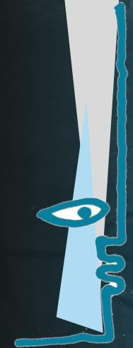

State Council of Educational Research and Training Andhra Pradesh

NCERT

First Flight

Textbook in English for Class X

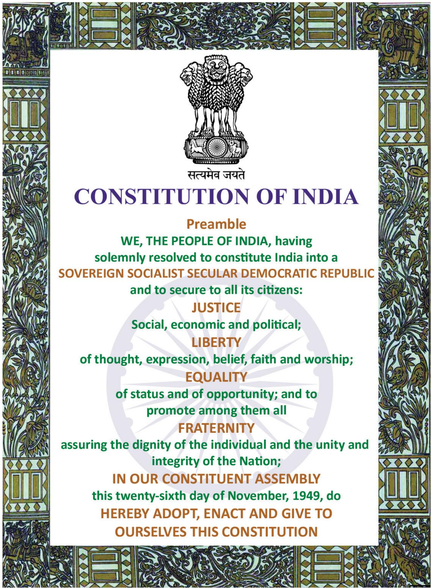

# FUNDAMENTAL DUTIES

# Fundamental duties : It shall be the duty of every citizen of India-

(a) to abide by the Constitution and re spect its ideals and institutions , the National Flag and the National Anthem;   
(b) to cherish and follow the noble ideals which inspired our national struggle for freedom;   
(c) to uphold and protect the sovereignty, unity and integrity of India;   
(d) to defend the country and render national service when called upon to do so ;   
(e) to promote harmony and the spirit of common brotherhood amongst all the people of India transcending religious , linguistic and regional or sectional diversities ; to renounce practices derogatory to the dignity of women;   
(f) to value and preserve the rich heritage of our composite culture ;   
(g) to protect and improve the natural environment including forests , lakes , rivers and wild life, and to have compassion for living creatures ;   
(h) to develop the scientific temper, humanism and the spirit of inquiry and reform;   
(i) to safeguard public property and to abjure violence .   
(j ) to strive towards excellence in all spheres of individual and collective activity so that the nation constantly rises to higher levels of endeavour and achievement;   
(k) who is a parent or guardian to provide opportunities for education to his child or as the case may be ward between the age of six and fourteen years ;

- C onstitution of India,

P art IV A (Article 5 1 A)

# Right of Children to Free and Compulsory Education (RTE) Act 2009

The RTE Act provides for the right of children to free and Compulsory Education to every child in the age group of 6 – 1 4 years which came into force from 1 st April 20 1 0 in Andhra Pradesh.

# Important provisions of RTE Act

• Ensure availability of schools within the reach of the children.   
• Improve School infrastructure facilities .   
• Enroll children in the class appropriate to his / her age .   
• Children have a right to receive special training in order to be at par with other children.   
• Providing appropriate facilities for the education of children with special needs on par with other children.   
• No child shall be liable to pay any kind of fee or charges or expenses which may prevent him or her from pursuing and completing the elementary education. No test for admitting the children in schools .   
• No removal of name and repetition of the child in the same class   
• No child admitted in a school shall be held back in any class or expel from school till the completion of elementary education.   
• No child shall be subj ected to physical punishment or mental harassment.   
• Admission shall not be denied or delayed on the ground that the transfer and other certificates have not been provided on time   
Eligible candidates alone shall be appointed as teachers .   
• The teaching learning process and evaluation procedures shall promote achievement of appropriate competencies .   
• No board examinations shall be conducted to the children till the completion of elementary education.   
• Children can continue in the schools even after 1 4 years until completion of elementary education.   
• No discrimination and related practices towards children belonging to backward and marginalized communities   
• The curriculum and evaluation procedures must be in conformity with the values enshrined in the constitution and make the child free of fear and anxiety and help the child to express views freely. 商国

# First Flight

Textbook in English for Class X

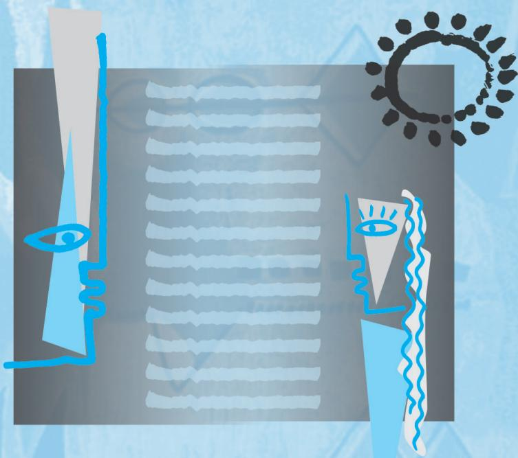

3 NATIONAL COUNCIL OF EDUCATIONAL RESEARCH AND TRAINING

1059 – FIRST FLIGHT

Textbook for Class X

ISBN 81-7450-658-6

# First Edition

February 2007 Magha 1928

# Reprinted

November 2007, January 2009, December 2009, November 2010, January 2012, December 2012, November 2013, November 2014, December 2015, February 2017, November 2017, December 2018, August 2019, January 2021 and November 2021

# Revised Edition

October 2022 Kartika 1944

PD 480T BS

@ National Council of Educa-tional Research and Training, 2007, 2022

# ALL RIGHTS RESERVED

 No part of this publication may be reproduced, stored in a retrieval system or transmitted, in any form or by any means, electronic, mechanical, photocopying, recording or otherwise without the prior permission of the publisher.   
 This book is sold subject to the condition that it shall not, by way of trade, be lent, re-sold, hired out or otherwise disposed of without the publisher’s consent, in any form of binding or cover other than that in which it is published.   
 The correct price of this publication is the price printed on this page, Any revised price indicated by a rubber stamp or by a sticker or by any other means is incorrect and should be unacceptable.

# OFFICES OF THE PUBLICATION DIVISION, NCERT

NCERT Campus

Sri Aurobindo Marg

New Delhi 110 016

108, 100 Feet Road

Hosdakere Halli Extension

Banashankari III Stage

Bengaluru 560 085

Navjivan Trust Building

P.O.Navjivan

Ahmedabad 380 014

CWC Campus

Opp. Dhankal Bus Stop

Panihati

Kolkata 700 114

CWC Complex

Maligaon

Guwahati 781 021

Phone : 011-26562708

Phone : 080-26725740

Phone : 079-27541446

Phone : 033-25530454

Phone : 0361-2674869

# Publication Team

Head, Publication : Anup Kumar

# Rajput

Division

Chief Production : Arun Chitkara

Officer

Chief Business : Vipin Dewan

Manager

Chief Editor (In charge): Bijnan Sutar

Editor

: Vijayam

Sankaranarayanan

Assistant Production : Rajesh Pippal

Officer

Cover, Layout and Illustrations

Nidhi Wadhwa

# First Flight

# Textbook in English for Class X

# Text Book Development Committee

Sri Praveen Prakash IAS

Principal Secretary to Government

Department of School Education, AP

Sri. S. Suresh Kumar IAS

Commissioner of School Education , AP

Sri. B. Srinivasa Rao IAS

State Project Director, Samagra Shiksha, AP

Dr. B. Pratap Reddy MA., B.Ed., Ph.D.

Director, SCERT, AP

Sri. K. Ravindranath Reddy MA., B.Ed.

Director, Government Textbook Press, AP

# Programme Co-ordinator

Dr. G. Kesava Reddy

MSc, MSc, MEd, MPhil, PhD

Prof. C&T, SCERT, AP

# Technical Co-ordinator

Dr. Ch.V.S. Ramesh Kumar

Faculty, SCERT-AP

# Foreword

THE National Curriculum Framework (NCF), 2005, recommends that children’s life at school must be linked to their life outside the school. This principle marks a departure from the legacy of bookish learning which continues to shape our system and causes a gap between the school, home and community. The syllabi and textbooks developed on the basis of NCF signify an attempt to implement this basic idea. They also attempt to discourage rote learning and the maintenance of sharp boundaries between different subject areas. We hope these measures will take us significantly further in the direction of a child-centered system of education outlined in the National Policy of Education (1986).

The success of this effort depends on the steps that school principals and teachers will take to encourage children to reflect on their own learning and to pursue imaginative activities and questions. We must recognise that, given space, time and freedom, children generate new knowledge by engaging with the information passed on to them by adults. Treating the prescribed textbook as the sole basis of examination is one of the key reasons why other resources and sites of learning are ignored. Inculcating creativity and initiative is possible if we perceive and treat children as participants in learning, not as receivers of a fixed body of knowledge.

These aims imply considerable change in school routines and mode of functioning. Flexibility in the daily time-table is as necessary as rigour in implementing the annual calendar so that the required number of teaching days are actually devoted to teaching. The methods used for teaching and evaluation will also determine how effective this textbook proves for making children’s life at school a happy experience, rather than a source of stress or boredom. Syllabus designers have tried to address the problem of curricular burden by restructuring and reorienting knowledge at different stages with greater consideration for child psychology and the time available for teaching. The textbook attempts to enhance this endeavour by giving higher priority and space to opportunities for contemplation and wondering, discussion in small groups, and activities requiring hands-on experience.

The National Council of Educational Research and Training (NCERT) appreciates the hard work done by the textbook development committee responsible for this book. We wish to thank the Chairperson of the advisory group in languages, Professor Namwar Singh, and the Chief Advisor for this book, Professor R. Amritavalli, for guiding the work of this committee. Several teachers contributed to the development of this textbook; we are grateful to their principals for making this possible. We are indebted to the institutions and organisations which have generously permitted us to draw upon their resources, materials and personnel. We are especially grateful to the members of the National Monitoring Committee, appointed by the Department of Secondary and Higher Education, Ministry of Human Resource Development under the Chairpersonship of Professor Mrinal Miri and Professor G.P. Deshpande for their valuable time and contribution. As an organisation committed to systemic reform and continuous improvement in the quality of its products, NCERT welcomes comments and suggestions which will enable us to undertake further revision and refinements.

# Textbook Development Committee

CH AIRPERSON, ADVISORY GROUP IN LANGUAGES

Professor Namwar Singh, formerly Chairman, School of Languages, Jawaharlal Nehru University, New Delhi

CHIEF ADVISOR

R. A mritavalli, Professor, Central Institute of English and Foreign Languages (CIEFL), Hyderabad

CHIEF COORDINATOR

Ram Janma Sharma, Professor and Head, Department of Languages, NCERT, New Delhi

M EMBERS

Kalyani Samantray, Reader, SBW College, Cuttack Kirti Kapur, Lecturer, Department of Languages, NCERT, New Delhi

Lakshmi Rawat, TGT, BRD Sarvodaya Kanya Vidyalaya, Prasad Nagar, Karol Bagh, New Delhi Nasiruddin Khan, Reader, Department of Languages NCERT, New Delhi

Padmini Baruah, Reader, Department of ELT, Guwahati University, Guwahati

Sadhana Agarwal, TGT, SKV Dayanand School, Daryaganj, Delhi

Sadhana Parashar, Education Officer (ELT), CBSE, Community Centre, Preet Vihar, Delhi

Sandhya Sahoo, Reader, Regional Institute of Education (NCERT), Bhubaneswar

Shruti Sircar, Lecturer, Centre for ESL Studies, CIEFL, Hyberabad

MEMBER – CO ORDINATOR

R. Meganathan, Lecturer, Department of Languages, NCERT, New Delhi

# Contents

1. A Letter to God 1

G.L.FUENTES

Dust of Snow 14

ROBERT FROST

Fire and Ice 15

ROBERT FROST

2. Nelson Mandela: Long Walk to Freedom 16

NELSON ROLIHLAHLA MANDELA

A Tiger in the Zoo 29

LESLIE NORRIS

3. Two Stories about Flying 32

I. His First Flight

LIAM O’ FLAHERTY

II. Black Aeroplane

FREDERICK FORSYTH

How to Tell Wild Animals 43

CAROLYN WELLS

The Ball Poem 46

JOHN BERRYMAN

4. From the Diary of Anne Frank 48

ANNE FRANK

Amanda! 61

ROBIN KLEIN

5. Glimpses of India 63

I. A Baker from Goa

LUCIO RODRIGUES

II. Coorg

LOKESH ABROL

III. Tea from Assam

ARUP KUMAR DATTA

The Trees 77

ADRIENNE RICH

6. Mijbil the Otter 80

GAVIN MAXWELL

Fog 93

CARL SANDBURG

7. Madam Rides the Bus 94

VALLIKKANNAN

The Tale of Custard the Dragon 107

OGDEN NASH

8. The Sermon at Benares 111

For Anne Gregory 118

WILLIAM BUTLER YEATS

9. The Proposal 120

ANTON CHEKOV

# BEFORE YOU READ

They say faith can move mountains. But what should we put our faith in? This is the question this story delicately poses.

Lencho is a farmer who writes a letter to God when his crops are ruined, asking for a hundred pesos. Does Lencho’s letter reach God? Does God send him the money? Think what your answers to these questions would be, and guess how the story continues, before you begin to read it.

# Activity

1. One of the cheapest ways to send money to someone is through the post office. Have you ever sent or received money in this way? Here’s what you have to do. (As you read the instructions, discuss with your teacher in class the meanings of these words: counter, counter clerk, appropriate, acknowledgement, counterfoil, record. Consult a dictionary if necessary. Are there words corresponding to these English words in your languages?)

Inside the post office, go to the counter marked ‘Money Order'

Buy a Money Order (MO) form by paying 50 paise to the person behind the counter

Fill in the appropriate boxes in the form (preferably in BLOCK letters)

Pay the counter clerk the amount of money to be sent along with the charges

Take back the MO acknowledgement counterfoil for your record

2. Fill out the Money Order form given below using the clues that follow the form.

• Think about who you will send the money to, and how much. You might want to send money for a magazine subscription, or to a relative or a friend.   
• Or you may fill out the form with yourself as sender and your partner as receiver. Use a part of your pocket money, and submit the form at the nearest post office to see how it’s done. See how your partner enjoys getting money by post!   
• Notice that the form has three parts — the Money Order form, the part for official use and the Acknowledgement. What would you write in the ‘Space for Communication’?

Now complete the following statements.

(i) In addition to the sender, the form has to be signed by the   
(ii) The ‘Acknowledgement’ section of the form is sent back by the post office to the after the signs it.   
(iii) The ‘Space for Communication’ section is used for   
(iv) The form has six sections. The sender needs to fill out sections and the receiver

THE house — the only one in the entire valley — sat on the crest of a low hill. From this height one could see the river and the field of ripe corn dotted with the flowers that always promised a good harvest. The only thing the earth needed was a downpour or at least a shower. Throughout the morning Lencho — who knew his fields intimately — had done nothing else but see the sky towards the north-east.

“Now we’re really going to get some water, woman.”

The woman who was preparing supper, replied, “Yes, God willing”. The older boys were working in the field, while the smaller ones were playing near the house until the woman called to them all, “Come for dinner”. It was during the meal that, just as

# crest

top of a hill

Lencho had predicted, big drops of rain began to fall. In the north-east huge mountains of clouds could be seen approaching. The air was fresh and sweet. The man went out for no other reason than to have the pleasure of feeling the rain on his body, and when he returned he exclaimed, ‘‘These aren’t raindrops falling from the sky, they are new coins. The big drops are ten cent pieces and the little ones are fives.’’

With a satisfied expression he regarded the field of ripe corn with its flowers, draped in a curtain of rain. But suddenly a strong wind began to blow and along with the rain very large hailstones began to fall. These truly did resemble new silver coins. The boys, exposing themselves to the rain, ran out to collect the frozen pearls.

‘‘It’s really getting bad now,’’ exclaimed the man. “I hope it passes quickly.” It did not pass quickly. For an hour the hail rained on the house, the garden, the hillside, the cornfield, on the whole valley. The field was white, as if covered with salt.

Not a leaf remained on the trees. The corn was totally destroyed. The flowers were gone from the plants. Lencho’s soul was filled with sadness. When the storm had passed, he stood in the middle of the field and said to his sons, $^ { * } \mathrm { A }$ plague of locusts would

draped

covered (with cloth)

locusts

insects which fly in big swarms (groups) and destroy crops

have left more than this. The hail has left nothing. This year we will have no corn.’’

That night was a sorrowful one.

“All our work, for nothing.”

‘‘There’s no one who can help us.”

“We’ll all go hungry this year.”

# Oral Comprehension Check

1. What did Lencho hope for?   
2. Why did Lencho say the raindrops were like ‘new coins’?   
3. How did the rain change? What happened to Lencho’s fields?   
4. What were Lencho’s feelings when the hail stopped?

But in the hearts of all who lived in that solitary house in the middle of the valley, there was a single hope: help from God.

“Don’t be so upset, even though this seems like a total loss. Remember, no one dies of hunger.”

“That’s what they say: no one dies of hunger.”

All through the night, Lencho thought only of his one hope: the help of God, whose eyes, as he had been instructed, see everything, even what is deep in one’s conscience. Lencho was an ox of a man, working like an animal in the fields, but still he knew how to write. The following Sunday, at daybreak, he began to write a letter which he himself would carry to town and place in the mail. It was nothing less than a letter to God.

“God,” he wrote, “if you don’t help me, my family and I will go hungry this year. I need a hundred pesos in order to sow my field again and to live until the crop comes, because the hailstorm....”

He wrote ‘To God’ on the envelope, put the letter inside and, still troubled, went to town. At the post office, he placed a stamp on the letter and dropped it into the mailbox.

One of the employees, who was a postman and also helped at the post office, went to his boss laughing heartily and showed him the letter to God. Never in his career as a postman had he known that address. The postmaster — a fat, amiable

# conscience

an inner sense of right and wrong

# peso

currency of several Latin American countries

# amiable

friendly and pleasant

fellow — also broke out laughing, but almost immediately he turned serious and, tapping the letter on his desk, commented, “What faith! I wish I had the faith of the man who wrote this letter. Starting up a correspondence with God!”

So, in order not to shake the writer’s faith in God, the postmaster came up with an idea: answer the letter. But when he opened it, it was evident that to answer it he needed something more than goodwill, ink and paper. But he stuck to his resolution: he asked for money from his employees, he himself gave part of his salary, and several friends of his were obliged to give something ‘for an act of charity’.

It was impossible for him to gather together the hundred pesos, so he was able to send the farmer only a little more than half. He put the money in an envelope addressed to Lencho and with it a letter containing only a single word as a signature: God.

# Oral Comprehension Check

1. Who or what did Lencho have faith in? What did he do?   
2. Who read the letter?   
3. What did the postmaster do then?

The following Sunday Lencho came a bit earlier than usual to ask if there was a letter for him. It was the postman himself who handed the letter to him while the postmaster, experiencing the contentment of a man who has performed a good deed, looked on from his office.

Lencho showed not the slightest surprise on seeing the money; such was his confidence — but he became angry when he counted the money. God could not have made a mistake, nor could he have denied Lencho what he had requested.

Immediately, Lencho went up to the window to ask for paper and ink. On the public writing-table, he started to write, with much wrinkling of his brow, caused by the effort he had to make to e x p r e s s h i s i d e a s . W h e n h e f i n i s h e d , he went to t h e w i n d o w t o b u y a s t a m p w h i c h h e l i c k e d a n d t h e n a f f i x e d t o

contentment satisfaction

the envelope with a blow of his fist. The moment the letter fell into the mailbox the postmaster went to open it. It said: “God: Of the money that I asked for, only seventy pesos reached me. Send me the rest, since I need it very much. But don’t send it to me through the mail because the post office employees are a bunch of crooks. Lencho.”

# Oral Comprehension Check

1. Was Lencho surprised to find a letter for him with money in it?   
2. What made him angry?

# Thinking about the Text

1. Who does Lencho have complete faith in? Which sentences in the story tell you this?   
2. Why does the postmaster send money to Lencho? Why does he sign the letter ‘God’?   
3. Did Lencho try to find out who had sent the money to him? Why/Why not?   
4. Who does Lencho think has taken the rest of the money? What is the irony in the situation? (Remember that the irony of a situation is an unexpected aspect of it. An ironic situation is strange or amusing because it is the opposite of what is expected.)

5. Are there people like Lencho in the real world? What kind of a person would you say he is? You may select appropriate words from the box to answer the question.

greedy naive stupid ungrateful

selfish comical unquestioning

6. There are two kinds of conflict in the story: between humans and nature, and between humans themselves. How are these conflicts illustrated?

# Thinking about Language

I. Look at the following sentence from the story.

Suddenly a strong wind began to blow and along with the rain very large hailstones began to fall.

‘Hailstones’ are small balls of ice that fall like rain. A storm in which hailstones fall is a ‘hailstorm’. You know that a storm is bad weather with strong winds, rain, thunder and lightning.

There are different names in different parts of the world for storms, depending on their nature. Can you match the names in the box with their descriptions below, and fill in the blanks? You may use a dictionary to help you.

gale, whirlwind, cyclone, hurricane, tornado, typhoon

1. A violent tropical storm in which strong winds move in a circle: （   
2. An extremely strong wind : __ a __ __   
3. A violent tropical storm with very strong winds : __ __ p __ __ __ __   
4. A violent storm whose centre is a cloud in the shape of a funnel: n   
5. A violent storm with very strong winds, especially in the western Atlantic Ocean: __ __ r   
6. A very strong wind that moves very fast in a spinning movement and causes a lot of damage: __ __ _

II. Notice how the word ‘hope’ is used in these sentences from the story:

(a) I hope it (the hailstorm) passes quickly.   
(b) There was a single hope: help from God.

In the first example, ‘hope’ is a verb which means you wish for something to happen. In the second example it is a noun meaning a chance for something to happen.

# A

1. Will you get the subjects you want to study in college? I hope so.   
2. I hope you don’t mind my saying this, but I don’t like the way you are arguing.   
3. This discovery will give new hope to HIV/AIDS sufferers.   
4. We were hoping against hope that the judges would not notice our mistakes.   
5. I called early in the hope of speaking to her before she went to school.   
6. Just when everybody had given up hope, the fishermen came back, seven days after the cyclone.

# B

– a feeling that something good will probably happen   
– thinking that this would happen (It may or may not have happened.)   
– stopped believing that this good thing would happen   
– wanting something to happen (and thinking it quite possible)   
– showing concern that what you say should not offend or disturb the other person: a way of being polite   
– wishing for something to happen, although this is very unlikely

# III. Relative Clauses

Look at these sentences

(a) All morning Lencho — who knew his fields intimately — looked at the sky.   
(b) The woman, who was preparing supper, replied, “Yes, God willing.’’

The italicised parts of the sentences give us more information about Lencho and the woman. We call them relative clauses. Notice that they begin with a relative pronoun who. Other common relative pronouns are whom, whose, and which.

The relative clauses in (a) and (b) above are called non-defining, because we already know the identity of the person they describe. Lencho is a particular person, and there is a particular woman he speaks to. We don’t need the information in the relative clause to pick these people out from a larger set.

A non-defining relative clause usually has a comma in front of it and a comma after it (some writers use a dash (—) instead, as in the story). If the relative clause comes at the end, we just put a full stop.

# Join the sentences given below using who, whom, whose, which, as suggested.

1. I often go to Mumbai. Mumbai is the commercial capital of India. (which)   
2. My mother is going to host a TV show on cooking. She cooks very well. (who)

3. These sportspersons are going to meet the President. Their performance has been excellent. (whose)   
4. Lencho prayed to God. His eyes see into our minds. (whose)   
5. This man cheated me. I trusted him. (whom)

Sometimes the relative pronoun in a relative clause remains ‘hidden’. For example, look at the first sentence of the story:

(a) The house — the only one in the entire valley — sat on the crest of a low hill.   
We can rewrite this sentence as:   
(b) The house — which was the only one in the entire valley — sat on the crest of a low hill.   
In (a), the relative pronoun which and the verb was are not present.

# IV. Using Negatives for Emphasis

We know that sentences with words such as no, not or nothing show the absence of something, or contradict something. For example:

(a) This year we will have no corn. (Corn will be absent)   
(b) The hail has left nothing. (Absence of a crop)   
(c) These aren’t raindrops falling from the sky, they are new coins. (Contradicts the common idea of what the drops of water falling from the sky are)

But sometims negative words are used just to emphasise an idea. Look at these sentences from the story:

(d) Lencho…had done nothing else but see the sky towards the northeast. (He had done only this)   
(e) The man went out for no other reason than to have the pleasure of feeling the rain on his body. (He had only this reason)   
(f) Lencho showed not the slightest surprise on seeing the money. (He showed no surprise at all)

Now look back at example (c). Notice that the contradiction in fact serves to emphasise the value or usefulness of the rain to the farmer.

# Find sentences in the story with negative words, which express the following ideas emphatically.

1. The trees lost all their leaves.   
2. The letter was addressed to God himself.   
3. The postman saw this address for the first time in his career.

# V. Metaphors

The word metaphor comes from a Greek word meaning ‘transfer’. Metaphors compare two things or ideas: a quality or feature of one thing is transferred to another thing. Some common metaphors are

• the leg of the table: The leg supports our body. So the object that supports a table is described as a leg.   
• the heart of the city: The heart is an important organ in the centre of our body. So this word is used to describe the central area of a city.

In pairs, find metaphors from the story to complete the table below. Try to say what qualities are being compared. One has been done for you.

<table><tr><td>Object</td><td>Metaphor</td><td>Quality or Feature Compared</td></tr><tr><td>Cloud</td><td>Huge mountains of clouds</td><td>The mass or ‘hugeness’ of mountains</td></tr><tr><td>Raindrops</td><td></td><td></td></tr><tr><td>Hailstones</td><td></td><td></td></tr><tr><td>Locusts</td><td></td><td></td></tr><tr><td></td><td></td><td>An epidemic (a disease) that spreads very rapidly and leaves many people dead</td></tr><tr><td></td><td>An ox of a man</td><td></td></tr></table>

# Speaking

Have you ever been in great difficulty, and felt that only a miracle could help you? How was your problem solved? Speak about this in class with your teacher.

Listen to the letter (given under ‘In This Lesson’) read out by your teacher/on the audio tape. As you listen fill in the table given below.

<table><tr><td>The writer apologises (says sorry) because</td><td></td></tr><tr><td>The writer has sent this to the reader</td><td></td></tr><tr><td>The writer sent it in the month of</td><td></td></tr><tr><td>The reason for not writing earlier</td><td></td></tr><tr><td>Sarah goes to</td><td></td></tr><tr><td>Who is writing to whom?</td><td></td></tr><tr><td>Where and when were they last together?</td><td></td></tr></table>

# Writing

Lencho suffered first due to drought and then by floods. Our country is also facing such situations in the recent years. There is flood and there is drought. There is a need to save water through water harvesting. Design a poster for your area on how to save water during summer and when it is available in excess.

# In This Lesson

# WHAT WE HAVE DONE

• Introduced students to the story that they are going to read.   
• Related a thought-provoking story about the nature of belief.   
• Helped students, through an interesting activity, to understand something that happens in the story — how to send money using a money order.   
• Guided them through the reading activity by providing periodic comprehension checks as they read, and checked for holistic understanding at the end of the reading activity.   
• Provided interesting exercises to strengthen students’ grasp of the specific vocabulary found in the story, and also introduced them to related vocabulary.

Explained specific areas of grammar — non-defining relative clauses and the use of negatives for emphasis — providing illustrations from the text, and exercises for practice.   
• Explained what metaphors are, and helped students identify metaphors in the text by providing clues.   
• Provided a context for authentic speaking.   
• Provided an interesting listening activity.

Given below is the passage for listening activity

Bhatt House

256, Circuit Road

Kanpur, Uttar Pradesh, India

25 January 2006

Dear Arti,

How are you? I’m sorry I haven’t written for a very long time. I think I last sent you a birthday card in the month of September 2005.

We have just moved house (see our new address above). This is our new home. Sarah has just about started going to school. We have admitted her to ‘Little Feet’ as this is very close to our new home.

I’m sitting here by the window sill, writing to you. There is a slight drizzle outside and I’m reminded of the good times we had together at Bangalore last year.

Do write back. Love,

Jaya

# WHAT YOU CAN DO

Before You Read: Encourage students to share their ideas about what will happen in the story.

Activity : Before filling out the form, get the students to read through the form and decide which parts they should fill out, and which parts will be filled in by the postal department. Ask a few students to volunteer to actually send a money order (the amount need not be large) and share the experience with the rest of the class.

Reading: Break the text up into manageable chunks for reading (three paragraphs, for example), and encourage students to read silently, on their own. Give them enough time to read, and then discuss what they have read before going on to the next portion. Use the ‘Oral Comprehension Checks’ in the appropriate places, and use the ‘Thinking about the Text’ questions at the end of the passage to help them go beyond the text.

Grammar: After they have done the exercise, ask students to make their own sentences with non-defining relative clauses — for example, ‘Meena, who’s a very clever girl, is always first in class.’ Or, ‘Our gardener, who knows a lot about plants, loves to talk about them.’

Speaking: Take the first turn — talk to the students about an instance from your own life, or from that of someone you know.

# Dust of Snow Dust of Snow

The way a crow Shook down on me The dust of snow From a hemlock tree

Has given my heart A change of mood And saved some part Of a day I had rued.

ROBERT FROST

# Glossary

hemlock: A poisonous plant (tree) with small white flowers rued: held in regret

# Thinking about the Poem

This poem presents a moment that seems simple, but has a larger significance. [Compare this other quotation from Robert Frost: “Always, always a larger significance... A little thing touches a larger thing.”)

1. What is a “dust of snow”? What does the poet say has changed his mood? How has the poet’s mood changed?

2. How does Frost present nature in this poem? The following questions may help you to think of an answer.

(i) What are the birds that are usually named in poems? Do you think a crow is often mentioned in poems? What images come to your mind when you think of a crow?   
(ii) Again, what is “a hemlock tree”? Why doesn’t the poet write about a more ‘beautiful’ tree such as a maple, or an oak, or a pine?   
(iii) What do the ‘crow’ and ‘hemlock’ represent — joy or sorrow? What does the dust of snow that the crow shakes off a hemlock tree stand for?

3. Have there been times when you felt depressed or hopeless? Have you experienced a similar moment that changed your mood that day?

# F i r eF i r eF i r e andandand I c e I c e I c e

Some say the world will end in fire

Some say in ice.

From what I’ve tasted of desire

I hold with those who favour fire.

But if it had to perish twice,

I think I know enough of hate

To say that for destruction ice

Is also great

And would suffice.

ROBERT FROST

# Glossary

perish: die

suffice: be sufficient

# Thinking about the Poem

1. There are many ideas about how the world will ‘end’. Do you think the world will end some day? Have you ever thought what would happen if the sun got so hot that it ‘burst’, or grew colder and colder?   
2. For Frost, what do ‘fire’ and ‘ice’ stand for? Here are some ideas:

<table><tr><td>greed</td><td>avarice</td><td>cruelty</td><td>lust</td></tr><tr><td>conflict</td><td>fury</td><td>intolerance</td><td>rigidity</td></tr><tr><td>insensitivity</td><td>coldness</td><td>indifference</td><td>hatred</td></tr></table>

3. What is the rhyme scheme of the poem? How does it help in bringing out the contrasting ideas in the poem?

# BEFORE YOU READ

• ‘Apartheid’ is a political system that separates people according to their race. Can you say which of the three countries named below had such a political system until very recently?

(i) United States of America (ii) South Africa (iii) Australia

• Have you heard of Nelson Mandela? Mandela, and his African National Congress, spent a lifetime fighting against apartheid. Mandela had to spend thirty years in prison. Finally, democratic elections were held in South Africa in 1994, and Mandela became the first black President of a new nation.

In this extract from his autobiography, Long Walk to Freedom, Mandela speaks about a historic occasion, ‘the inauguration’. Can you guess what the occasion might be? Check your guess with this news item (from the BBC) of 10 May 1994.

# Mandela Becomes South Africa’s First Black President

Nelson Mandela has become South Africa’s first Black President after more than three centuries of White rule. Mr Mandela’s African National Congress (ANC) party won 252 of the 400 seats in the first democratic elections of South Africa’s history.

The inauguration ceremony took place in the Union Buildings amphitheatre in Pretoria today, attended by politicians and dignitaries from more than 140 countries around the world. “Never, never again will this beautiful land experience the oppression of one by another, ” said Nelson Mandela in his address.

… Jubilant scenes on the streets of Pretoria followed the ceremony with blacks, whites and coloureds celebrating together... More than 100,000 South African men, women and children of all races sang and danced with joy.

# Activity

In Column A are some expressions you will find in the text. Make a guess and match each expression with an appropriate meaning from Column B.

# A

(i) A rainbow gathering of different colours and nations   
(ii) The seat of white supremacy   
(iii) Be overwhelmed with a sense of history   
(iv) Resilience that defies the imagination   
(v) A glimmer of humanity   
(vi) A twilight existence

# B

– A great ability (almost unimaginable) to remain unchanged by suffering (not losing hope, goodness or courage)   
– A half-secret life, like a life lived in the fading light between sunset and darkness   
– A sign of human feeling (goodness, kindness, pity, justice, etc.)   
– A beautiful coming together of various peoples, like the colours in a rainbow   
– The centre of racial superiority   
– Feel deeply emotional, remembering and understanding all the past events that have led up to the moment

TENTH May dawned bright and clear. For the past few days I had been pleasantly besieged by dignitaries and world leaders who were coming to pay their respects before the inauguration. The inauguration would be the largest gathering ever of international leaders on South African soil.

The ceremonies took place in the lovely sandstone amphitheatre formed by the Union Buildings in Pretoria. For decades this had been the seat of white supremacy, and now it was the site of a rainbow gathering of different colours and nations for the installation of South Africa’s first democratic, non-racial government.

On that lovely autumn day I was accompanied by my daughter Zenani. On the podium, Mr de Klerk was first sworn in as second deputy president. Then

(to be) besieged by to be surrounded closely by

# amphitheatre

a building without a roof, with many rows of seats rising in steps (typical of ancient Greece and Rome)

Thabo Mbeki was sworn in as first deputy president. When it was my turn, I pledged to obey and uphold the Constitution and to devote myself to the wellbeing of the Republic and its people. To the assembled guests and the watching world, I said:

Today, all of us do, by our presence here... confer glory and hope to newborn liberty. Out of the experience of an extraordinary human disaster that lasted too long, must be born a society of which all humanity will be proud.

We, who were outlaws not so long ago, have today been given the rare privilege to be host to the nations of the world on our own soil. We thank all of our distinguished international guests for having come to take possession with the people of our country of what is, after all, a common victory for justice, for peace, for human dignity.

We have, at last, achieved our political emancipation. We pledge ourselves to liberate all our people from the continuing bondage of poverty, deprivation, suffering, gender and other discrimination.

Never, never, and never again shall it be that this beautiful land will again experience the oppression of one by another.

The sun shall never set on so glorious a human achievement.

Let freedom reign. God bless Africa!

confer (a formal word)

here, give

# We, who were outlaws

because of its policy of apartheid, many countries had earlier broken off diplomatic relations with South Africa

# emancipation

freedom from restriction

# deprivation

state of not having one's rightful benefits

# discrimination

being treated differently or unfavourably

# Oral Comprehension Check

1. Where did the ceremonies take place? Can you name any public buildings in India that are made of sandstone?   
2. Can you say how 10 May is an ‘autumn day’ in South Africa?

3. At the beginning of his speech, Mandela mentions “an extraordinary human disaster”. What does he mean by this? What is the “glorious … human achievement” he speaks of at the end?   
4. What does Mandela thank the international leaders for?   
5. What ideals does he set out for the future of South Africa?

A few moments later we all lifted our eyes in awe as a spectacular array of South African jets, helicopters and troop carriers roared in perfect formation over the Union Buildings. It was not only a display of pinpoint precision and military force, but a demonstration of the military’s loyalty to democracy, to a new government that had been freely and fairly elected. Only moments before, the highest generals of the South African defence force and police, their chests bedecked with ribbons and medals from days gone by, saluted me and pledged their loyalty. I was not unmindful of the fact that not so many years before they would not have saluted but arrested me. Finally a chevron of Impala jets left a smoke trail of the black, red, green, blue and gold of the new South African flag.

The day was symbolised for me by the playing of our two national anthems, and the vision of whites singing ‘Nkosi Sikelel –iAfrika’ and blacks singing ‘Die Stem’, the old anthem of the Republic. Although that day neither group knew the lyrics of the anthem they once despised, they would soon know the words by heart.

On the day of the inauguration, I was overwhelmed with a sense of history. In the first decade of the twentieth century, a few years after the bitter Anglo-Boer war and before my own birth, the white-skinned peoples of South Africa patched up their differences and erected a system of racial domination against the dark-skinned peoples of their own land. The structure they created formed the basis of one of the harshest, most inhumane, societies the world has ever known. Now, in the last decade of the twentieth century, and my own eighth decade as a man, that system had been

spectacular array an impressive display (colourful and attractive)

not unmindful of conscious of; aware of chevron a pattern in the shape of a V

despised had a very low opinion of

overturned forever and replaced by one that recognised the rights and freedoms of all peoples, regardless of the colour of their skin.

That day had come about through the unimaginable sacrifices of thousands of my people, people whose suffering and courage can never be counted or repaid. I felt that day, as I have on so many other days, that I was simply the sum of all those African patriots who had gone before me. That long and noble line ended and now began again with me. I was pained that I was not able to thank them and that they were not able to see what their sacrifices had wrought.

The policy of apartheid created a deep and lasting wound in my country and my people. All of us will spend many years, if not generations, recovering from that profound hurt. But the decades of oppression and brutality had another, unintended, effect, and that was that it produced the Oliver Tambos, the Walter Sisulus, the Chief Luthulis, the Yusuf Dadoos, the Bram Fischers, the Robert Sobukwes of our time* — men of such extraordinary

wrought (old fashioned, formal word) done, achieved

profound deep and strong

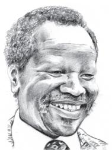  
Oliver Tambo

  
Walter Sisulu

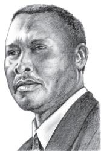  
Chief Luthuli

  
Yusuf Dadoo

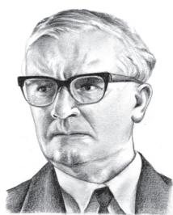  
Bram Fischer

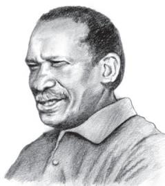  
Robert Sobukwe

courage, wisdom and generosity that their like may never be known again. Perhaps it requires such depths of oppression to create such heights of character. My country is rich in the minerals and gems that lie beneath its soil, but I have always known that its greatest wealth is its people, finer and truer than the purest diamonds.

It is from these comrades in the struggle that I learned the meaning of courage. Time and again, I have seen men and women risk and give their lives for an idea. I have seen men stand up to attacks and torture without breaking, showing a strength and resilience that defies the imagination. I learned that courage was not the absence of fear, but the triumph over it. The brave man is not he who does not feel afraid, but he who conquers that fear.

No one is born hating another person because of the colour of his skin, or his background, or his religion. People must learn to hate, and if they can learn to hate, they can be taught to love, for love comes more naturally to the human heart than its opposite. Even in the grimmest times in prison, when my comrades and I were pushed to our limits, I would see a glimmer of humanity in one of the guards, perhaps just for a second, but it was enough to reassure me and keep me going. Man’s goodness is a flame that can be hidden but never extinguished.

# resilience

the ability to deal with any kind of hardship and recover from its effects

# pushed to our limits

pushed to the last point in our ability to bear pain

# Oral Comprehension Check

1. What do the military generals do? How has their attitude changed, and why?   
2. Why were two national anthems sung?   
3. How does Mandela describe the systems of government in his country (i) in the first decade, and (ii) in the final decade, of the twentieth century?   
4. What does courage mean to Mandela?   
5. Which does he think is natural, to love or to hate?

In life, every man has twin obligations — obligations to his family, to his parents, to his wife and children; and he has an obligation to his people, his community, his country. In a civil and humane

society, each man is able to fulfil those obligations according to his own inclinations and abilities. But in a country like South Africa, it was almost impossible for a man of my birth and colour to fulfil both of those obligations. In South Africa, a man of colour who attempted to live as a human being was punished and isolated. In South Africa, a man who tried to fulfil his duty to his people was inevitably ripped from his family and his home and was forced to live a life apart, a twilight existence of secrecy and rebellion. I did not in the beginning choose to place my people above my family, but in attempting to serve my people, I found that I was prevented from fulfilling my obligations as a son, a brother, a father and a husband.

I was not born with a hunger to be free. I was born free — free in every way that I could know. Free to run in the fields near my mother’s hut, free to swim in the clear stream that ran through my village, free to roast mealies under the stars and ride the broad backs of slow-moving bulls. As long as I obeyed my father and abided by the customs of my tribe, I was not troubled by the laws of man or God.

It was only when I began to learn that my boyhood freedom was an illusion, when I discovered as a young man that my freedom had already been taken from me, that I began to hunger for it. At first, as a student, I wanted freedom only for myself, the transitory freedoms of being able to stay out at night, read what I pleased and go where I chose. Later, as a young man in Johannesburg, I yearned for the basic and honourable freedoms of achieving my potential, of earning my keep, of marrying and having a family — the freedom not to be obstructed in a lawful life.

But then I slowly saw that not only was I not free, but my brothers and sisters were not free. I saw that it was not just my freedom that was curtailed, but the freedom of everyone who looked like I did. That is when I joined the African National Congress, and that is when the hunger for my own freedom became the greater hunger for the freedom

inclinations

natural tendencies

of behaviour

inevitably

unavoidably

illusion

something that

appears to be real

but is not

transitory

not permanent

curtailed

reduced

of my people. It was this desire for the freedom of my people to live their lives with dignity and selfrespect that animated my life, that transformed a frightened young man into a bold one, that drove a law-abiding attorney to become a criminal, that turned a family-loving husband into a man without a home, that forced a life-loving man to live like a monk. I am no more virtuous or self-sacrificing than the next man, but I found that I could not even enjoy the poor and limited freedoms I was allowed when I knew my people were not free. Freedom is indivisible; the chains on anyone of my people were the chains on all of them, the chains on all of my people were the chains on me.

I knew that the oppressor must be liberated just as surely as the oppressed. A man who takes away another man’s freedom is a prisoner of hatred; he is locked behind the bars of prejudice and narrowmindedness. I am not truly free if I am taking away someone else’s freedom, just as surely as I am not free when my freedom is taken from me. The oppressed and the oppressor alike are robbed of their humanity.

prejudice

a strong dislike

without any good

reason

# Oral Comprehension Check

1. What “twin obligations” does Mandela mention?   
2. What did being free mean to Mandela as a boy, and as a student? How does he contrast these “transitory freedoms” with “the basic and honourable freedoms”?   
3. Does Mandela think the oppressor is free? Why/Why not?

# Thinking about the Text

1. Why did such a large number of international leaders attend the inauguration? What did it signify the triumph of?   
2. What does Mandela mean when he says he is “simply the sum of all those African patriots” who had gone before him?   
3. Would you agree that the “depths of oppression” create “heights of character”? How does Mandela illustrate this? Can you add your own examples to this argument?   
4. How did Mandela’s understanding of freedom change with age and experience?   
5. How did Mandela’s ‘hunger for freedom’ change his life?

# Thinking about Language

I. There are nouns in the text (formation, government) which are formed from the corresponding verbs (form, govern) by suffixing -(at)ion or ment. There may be a change in the spelling of some verb – noun pairs: such as rebel, rebellion; constitute, constitution.

1. Make a list of such pairs of nouns and verbs in the text.

<table><tr><td>Noun</td><td>Verb</td></tr><tr><td>rebellion</td><td>rebel</td></tr><tr><td>constitution</td><td>constitute</td></tr><tr><td></td><td></td></tr><tr><td></td><td></td></tr><tr><td></td><td></td></tr><tr><td></td><td></td></tr></table>

2. Read the paragraph below. Fill in the blanks with the noun forms of the verbs in brackets.

Martin Luther King’s (contribute) to our history as an outstanding leader began when he came to the (assist) of Rosa Parks, a seamstress who refused to give up her seat on a bus to a white passenger. In those days American Blacks were confined to positions of second class citizenship by restrictive laws and customs. To break these laws would mean (subjugate) and (humiliate) by the police and the legal system. Beatings, (imprison) and sometimes death awaited those who defied the System. Martin Luther King’s tactics of protest involved non-violent (resist) to racial injustice.

# II. Using the Definite Article with Names

You know that the definite article ‘the’ is not normally used before proper nouns. Nor do proper nouns usually occur in the plural. (We do not say: *The Nelson Mandela, or *Nelson Mandelas.) But now look at this sentence from the text:

… the decades of oppression and brutality … produced the Oliver Tambos, the Walter Sisulus, … of our time.

Used in this way with the and/or in the plural, a proper noun carries a special meaning. For example, what do you think the names above mean? Choose the right answer.

(a) for example Oliver Tambo, Walter Sisulu, …   
(b) many other men like Oliver Tambo, Walter Sisulu …/many men of their type or kind, whose names may not be as well known.

Did you choose option (b)? Then you have the right answer!

# Here are some more examples of ‘the’ used with proper names. Try to say what these sentences mean. (You may consult a dictionary if you wish. Look at the entry for ‘the’.)

1. Mr Singh regularly invites the Amitabh Bachchans and the Shah Rukh Khans to his parties.   
2. Many people think that Madhuri Dixit is the Madhubala of our times.   
3. History is not only the story of the Alexanders, the Napoleons and the Hitlers, but of ordinary people as well.

# III. Idiomatic Expressions

Match the italicised phrases in Column A with the phrase nearest in meaning in Column B. (Hint: First look for the sentence in the text in

# A

1. I was not unmindful of the fact   
2. when my comrades and I were pushed to our limits   
3. to reassure me and keep me going   
4. the basic and honourable freedoms of…earning my keep,…

# B

(i) had not forgotten; was aware of the fact   
(ii) was not careful about the fact   
(iii) forgot or was not aware of the fact   
(i) pushed by the guards to the wall   
(ii) took more than our share of beatings   
(iii) felt that we could not endure the suffering any longer   
(i) make me go on walking   
(ii) help me continue to live in hope in this very difficult situation   
(iii) make me remain without complaining   
(i) earning enough money to live on   
(ii) keeping what I earned   
(iii) getting a good salary

# Speaking

# which the phrase in Column A occurs.)

In groups, discuss the issues suggested in the box below. Then prepare a speech of about two minutes on the following topic. (First make notes for your speech in writing.)

True liberty is freedom from poverty, deprivation and all forms of discrimination.

• causes of poverty and means of overcoming it   
• discrimination based on gender, religion, class, etc.   
constitutionally guaranteed human rights

# Writing

# I. Looking at Contrasts

Nelson Mandela’s writing is marked by balance: many sentences have two parts in balance.

Use the following phrases to complete the sentences given below.

(i) they can be taught to love.

(iv) but he who conquers that fear.

(ii) I was born free.

(v) to create such heights of character.

(iii) but the triumph over it.

1. It requires such depths of oppression   
2. Courage was not the absence of fear   
3. The brave man is not he who does not feel afraid   
4. If people can learn to hate   
5. I was not born with a hunger to be free.

II. This text repeatedly contrasts the past with the present or the future. We can use coordinated clauses to contrast two views, for emphasis or effect. Given below are sentences carrying one part of the contrast. Find in the text the second part of the contrast, and complete each item. Identify the words which signal the contrast. This has been done for you in the first item.

1. For decades the Union Buildings had been the seat of white supremacy, and now ...   
2. Only moments before, the highest generals of the South African defence force and police ... saluted me and pledged their loyalty. ... not so many years before they would not have saluted   
3. Although that day neither group knew the lyrics of the anthem ..., they would soon   
4. My country is rich in the minerals and gems that lie beneath its soil,   
5. The Air Show was not only a display of pinpoint precision and military force, but   
6. It was this desire for the freedom of my people ... that transformed into a bold one, that drove to become a criminal, that turned into a man without a home.

# III. Expressing Your Opinion

Do you think there is colour prejudice in our own country? Discuss this with your friend and write a paragraph of about 100 to 150 words about

this. You have the option of making your paragraph a humorous one.

(Read the short verse given below.)

When you were born you were pink

When you grew up you became white

When you are in the sun you are red

When you are sick you are yellow

When you are angry you are purple

When you are shocked you are grey

And you have the cheek to call me ‘coloured’.

# In This Lesson

# WHAT WE HAVE DONE

Shared Nelson Mandela’s moving description of his inauguration as South Africa’s first black President, and his thoughts on freedom.

# WHAT YOU CAN DO

Divide your class into three groups and give each group one of the following topics to research: (i) black Americans, and their fight against discrimination, (ii) women, and their fight for equality, (iii) the Vietnamese, and their fight for independence.

Choose a student from each group to present a short summary of each topic to the class.

# Homophones

Can you find the words below that are spelt similarly, and sometimes even pronounced similarly, but have very different meanings? Check their pronunciation and meaning in a dictionary.

. The bandage was wound around the wound.   
The soldier decided to desert his dessert in the desert.

# A T i g e r i n t T i g e r tA i n th e Z o o

This poem contrasts a tiger in the zoo with the tiger in its natural habitat. The poem moves from the zoo to the jungle, and back again to the zoo. Read the poem silently once, and say which stanzas speak about the tiger in the zoo, and which ones speak about the tiger in the jungle.

He stalks in his vivid stripes

The few steps of his cage,

On pads of velvet quiet,

In his quiet rage.

He should be lurking in shadow,

Sliding through long grass

Near the water hole

Where plump deer pass.

He should be snarling around houses

At the jungle’s edge,

Baring his white fangs, his claws,

Terrorising the village!

But he’s locked in a concrete cell,

His strength behind bars,

Stalking the length of his cage,

Ignoring visitors.

He hears the last voice at night,

The patrolling cars,

And stares with his brilliant eyes

At the brilliant stars.

# Glossary

snarls: makes an angry, warning sound

# Thinking about the Poem

1. Read the poem again, and work in pairs or groups to do the following tasks.

(i) Find the words that describe the movements and actions of the tiger in the cage and in the wild. Arrange them in two columns.   
(ii) Find the words that describe the two places, and arrange them in two columns.

Now try to share ideas about how the poet uses words and images to contrast the two situations.

2. Notice the use of a word repeated in lines such as these:

(i) On pads of velvet quiet, In his quiet rage.   
(ii) And stares with his brilliant eyes At the brilliant stars.

What do you think is the effect of this repetition?

3. Read the following two poems — one about a tiger and the other about a panther. Then discuss:

Are zoos necessary for the protection or conservation of some species of animals? Are they useful for educating the public? Are there alternatives to zoos?

# The Tiger

The tiger behind the bars of his cage growls, The tiger behind the bars of his cage snarls, The tiger behind the bars of his cage roars. Then he thinks.

It would be nice not to be behind bars all The time

Because they spoil my view I wish I were wild, not on show. But if I were wild, hunters might shoot me, But if I were wild, food might poison me, But if I were wild, water might drown me. Then he stops thinking

And...

The tiger behind the bars of his cage growls, The tiger behind the bars of his cage snarls, The tiger behind the bars of his cage roars.

PETER NIBLETT

# The Panther

His vision, from the constantly passing bars, has grown so weary that it cannot hold anything else. It seems to him there are a thousand bars; and behind the bars, no world. As he paces in cramped circles, over and over, the movement of his powerful soft strides is like a ritual dance around a centre in which a mighty will stands paralysed. Only at times, the curtain of the pupils lifts, quietly. An image enters in, rushes down through the tensed, arrested mus plunges into the heart and is gone.

RAINER MARIA RILKE

4. Take a point of view for or against zoos, or even consider both points of view and write a couple of paragraphs or speak about this topic for a couple of minutes in class.

  
The Greater Cats

The greater cats with golden eyes Stare out between the bars. Deserts are there, and different skies, And night with different stars.

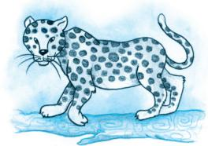

VICTORIA SACKVILLE-WEST

I. His First Flight

II. Black Aeroplane

Liam O' Flaherty

Frederick Forsyth

# BEFORE YOU READ

Since the earliest times, humans have dreamt of conquering the skies. Here are two stories about flying.

I. A young seagull is afraid to fly. How does he conquer his fear?

II. A pilot is lost in storm clouds. Does he arrive safe? Who helps him?

# I

# His First Flight

THE young seagull was alone on his ledge. His two brothers and his sister had already flown away the day before. He had been afraid to fly with them. Somehow when he had taken a little run forward to the brink of the ledge and attempted to flap his wings he became afraid. The great expanse of sea stretched down beneath, and it was such a long way down — miles down. He felt certain that his wings would never support him; so he bent his head and ran away back to the little hole under the ledge where he slept at night. Even when each of his brothers and his little sister, whose wings were far shorter than his own, ran to the brink, flapped their wings, and flew away, he failed to muster up courage to take that plunge which appeared to him so desperate. H i s f a t h e r a n d m o t h e r h a d c o m e a r o u n d

# ledge

a narrow horizontal shelf projecting from a wall or (here) a cliff

calling to him shrilly, upbraiding him, threatening to let him starve on his ledge unless he flew away. But for the life of him he could not move.

That was twenty-four hours ago. Since then nobody had come near him. The day before, all day long, he had watched his parents flying about with his brothers and sister, perfecting them in the art of flight, teaching them how to skim the waves and how to dive for fish. He had, in fact, seen his older brother catch his first herring and devour it, standing on a rock, while his parents circled around raising a proud cackle. And all the morning the whole family had walked about on the big plateau midway down the opposite cliff taunting him with his cowardice.

The sun was now ascending the sky, blazing on his ledge that faced the south. He felt the heat because he had not eaten since the previous nightfall.

He stepped slowly out to the brink of the ledge, and standing on one leg with the other leg hidden under his wing, he closed one eye, then the other,

upbraiding scolding

# (to) skim

to move lightly just above a surface (here, the sea)

# herring

a soft-finned sea fish

and pretended to be falling asleep. Still they took no notice of him. He saw his two brothers and his sister lying on the plateau dozing with their heads sunk into their necks. His father was preening the feathers on his white back. Only his mother was looking at him. She was standing on a little high hump on the plateau, her white breast thrust forward. Now and again, she tore at a piece of fish that lay at her feet and then scrapped each side of her beak on the rock. The sight of the food maddened him. How he loved to tear food that way, scrapping his beak now and again to whet it.

“Ga, ga, ga,” he cried begging her to bring him some food. “Gaw-col-ah,” she screamed back derisively. But he kept calling plaintively, and after a minute or so he uttered a joyful scream. His mother had picked up a piece of the fish and was flying across to him with it. He leaned out

preening

making an effort to

maintain feathers

(to) whet

to sharpen

derisively

in a manner

showing someone

that she/he is stupid

eagerly, tapping the rock with his feet, trying to get nearer to her as she flew across. But when she was just opposite to him, she halted, her wings motionless, the piece of fish in her beak almost within reach of his beak. He waited a moment in surprise, wondering why she did not come nearer, and then, maddened by hunger, he dived at the fish. With a loud scream he fell outwards and downwards into space. Then a monstrous terror seized him and his heart stood still. He could hear nothing. But it only lasted a minute. The next moment he felt his wings spread outwards. The wind rushed against his breast feathers, then under his stomach, and against his wings. He could feel the tips of his wings cutting through the air. He was not falling headlong now. He was soaring gradually downwards and outwards. He was no longer afraid. He just felt a bit dizzy. Then he flapped his wings once and he soared upwards. “Ga, ga, ga, Ga, ga, ga, Gaw-col-ah,” his mother swooped past him, her wings making a loud noise. He answered her with another scream. Then his father flew over him screaming. He saw his two brothers and his sister flying around him curveting and banking and soaring and diving.

Then he completely forgot that he had not always been able to fly, and commended himself to dive and soar and curve, shrieking shrilly.

He was near the sea now, flying straight over it, facing straight out over the ocean. He saw a vast green sea beneath him, with little ridges moving over it and he turned his beak sideways and cawed amusedly.

His parents and his brothers and sister had landed on this green flooring ahead of him. They were beckoning to him, calling shrilly. He dropped his legs to stand on the green sea. His legs sank into it. He screamed with fright and attempted to rise again flapping his wings. But he was tired and weak with hunger and he could not rise, exhausted

# dizzy

an uncomfortable feeling of spinning around and losing one’s balance

# curveting

leaping like a horse

# banking

flying with one wing higher than the other

by the strange exercise. His feet sank into the green sea, and then his belly touched it and he sank no farther. He was floating on it, and around him his family was screaming, praising him and their beaks were offering him scraps of dog-fish.

He had made his first flight.

# Thinking about the Text

1. Why was the young seagull afraid to fly? Do you think all young birds are afraid to make their first flight, or are some birds more timid than others? Do you think a human baby also finds it a challenge to take its first steps?   
2. “The sight of the food maddened him.” What does this suggest? What compelled the young seagull to finally fly?   
3. “They were beckoning to him, calling shrilly.” Why did the seagull’s father and mother threaten him and cajole him to fly?   
4. Have you ever had a similar experience, where your parents encouraged you to do something that you were too scared to try? Discuss this in pairs or groups.   
5. In the case of a bird flying, it seems a natural act, and a foregone conclusion that it should succeed. In the examples you have given in answer to the previous question, was your success guaranteed, or was it important for you to try, regardless of a possibility of failure?

# Speaking

We have just read about the first flight of a young seagull. Your teacher will now divide the class into groups. Each group will work on one of the following topics. Prepare a presentation with your group members and then present it to the entire class.

. Progression of Models of Airplanes   
Progression of Models of Motorcars   
Birds and Their Wing Span   
Migratory Birds — Tracing Their Flights

# Writing

Write a short composition on your initial attempts at learning a skill. You could describe the challenges of learning to ride a bicycle or learning to swim. Make it as humorous as possible.

# II The Black Aeroplane

THE moon was coming up in the east, behind me, and stars were shining in the clear sky above me. There wasn’t a cloud in the sky. I was happy to be alone high up above the sleeping countryside. I was flying my old Dakota aeroplane over France back to England. I was dreaming of my holiday and looking forward to being with my family. I looked at my watch: one thirty in the morning.

‘I should call Paris Control soon,’ I thought. As I looked down past the nose of the aeroplane, I saw the lights of a big city in front of me. I switched on the radio and said, “Paris Control, Dakota DS 088 here. Can you hear me? I’m on my way to England. Over.”

The voice from the radio answered me immediately: “DS 088, I can hear you. You ought to turn twelve degrees west now, DS 088. Over.”

I checked the map and the compass, switched over to my second and last fuel tank, and turned the Dakota twelve degrees west towards England.

‘I’ll be in time for breakfast,’ I thought. A good big English breakfast! Everything was going well — it was an easy flight.

Paris was about 150 kilometres behind me when I saw the clouds. Storm clouds. They were huge. They looked like black mountains standing in front of me across the sky. I knew I could not fly up and over them, and I did not have enough fuel to fly around them to the north or south.

“I ought to go back to Paris,” I thought, but I wanted to get home. I wanted that breakfast.

‘I’ll take the risk,’ I thought, and flew that old Dakota straight into the storm.

Inside the clouds, everything was suddenly black. It was impossible to see anything outside the aeroplane. The old aeroplane jumped and twisted in the air. I looked at the compass. I couldn’t believe

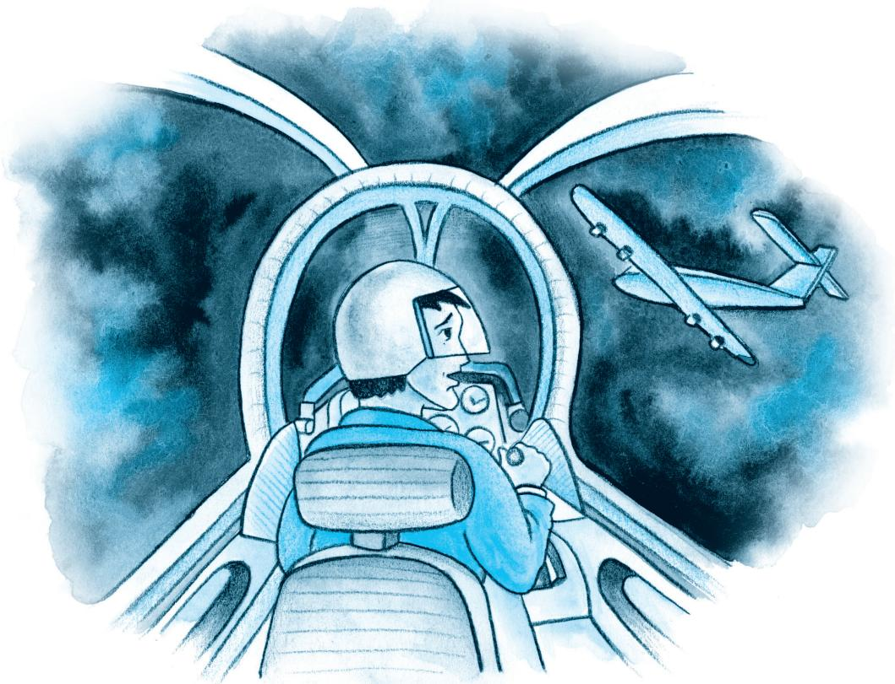

my eyes: the compass was turning round and round and round. It was dead. It would not work! The other instruments were suddenly dead, too. I tried the radio.

“Paris Control? Paris Control? Can you hear me?”

There was no answer. The radio was dead too. I had no radio, no compass, and I could not see where I was. I was lost in the storm. Then, in the black clouds quite near me, I saw another aeroplane. It had no lights on its wings, but I could see it flying next to me through the storm. I could see the pilot’s face — turned towards me. I was very glad to see another person. He lifted one hand and waved.

“Follow me,” he was saying. “Follow me.”

‘He knows that I am lost,’ I thought. ‘He’s trying to help me.’

He turned his aeroplane slowly to the north, in front of my Dakota, so that it would be easier for me to follow him. I was very happy to go behind the strange aeroplane like an obedient child.

After half an hour the strange black aeroplane was still there in front of me in the clouds. Now

there was only enough fuel in the old Dakota’s last tank to fly for five or ten minutes more. I was starting to feel frightened again. But then he started to go down and I followed through the storm.

Suddenly I came out of the clouds and saw two long straight lines of lights in front of me. It was a runway! An airport! I was safe! I turned to look for my friend in the black aeroplane, but the sky was empty. There was nothing there. The black aeroplane was gone. I could not see it anywhere.

I landed and was not sorry to walk away from the old Dakota near the control tower. I went and asked a woman in the control centre where I was and who the other pilot was. I wanted to say ‘Thank you’.

She looked at me very strangely, and then laughed.

“Another aeroplane? Up there in this storm? No other aeroplanes were flying tonight. Yours was the only one I could see on the radar.”

So who helped me to arrive there safely without a compass or a radio, and without any more fuel in my tanks? Who was the pilot on the strange black aeroplane, flying in the storm, without lights?

# Thinking about the Text

1. “I’ll take the risk.” What is the risk? Why does the narrator take it?   
2. Describe the narrator’s experience as he flew the aeroplane into the storm.   
3. Why does the narrator say, “I landed and was not sorry to walk away from the old Dakota…”?   
4. What made the woman in the control centre look at the narrator strangely?   
5. Who do you think helped the narrator to reach safely? Discuss this among yourselves and give reasons for your answer.

# Thinking about Language

I. Study the sentences given below.

(a) They looked like black mountains.   
(b) Inside the clouds, everything was suddenly black.   
(c) In the black clouds near me, I saw another aeroplane.   
(d) The strange black aeroplane was there.

The word ‘black’ in sentences (a) and (c) refers to the very darkest colour. But in (b) and (d) (here) it means without light/with no light.

‘Black’ has a variety of meanings in different contexts. For example:

(a) ‘I prefer black tea’ means ‘I prefer tea without milk’.   
(b) ‘With increasing pollution the future of the world is black’ means ‘With increasing pollution the future of the world is very depressing/ without hope’.

# Now, try to guess the meanings of the word ‘black’ in the sentences given below. Check the meanings in the dictionary and find out whether you have guessed right.

1. Go and have a bath; your hands and face are absolutely black.   
2. The taxi-driver gave Ratan a black look as he crossed the road when the traffic light was green.   
3. The bombardment of Hiroshima is one of the blackest crimes against humanity.   
4. Very few people enjoy Harold Pinter’s black comedy.   
5. Sometimes shopkeepers store essential goods to create false scarcity and then sell these in black.   
6. Villagers had beaten the criminal black and blue.

II. Look at these sentences taken from the lesson you have just read:

(a) I was flying my old Dakota aeroplane.   
(b) The young seagull had been afraid to fly with them.

In the first sentence the author was controlling an aircraft in the air. Another example is: Children are flying kites. In the second sentence the seagull was afraid to move through the air, using its wings.

Match the phrases given under Column A with their meanings given under Column B:

# A

1. Fly a flag   
2. Fly into rage   
3. Fly along   
4. Fly high   
5. Fly the coop

# B

– Move quickly/suddenly   
– Be successful   
– Display a flag on a long pole   
– Escape from a place   
– Become suddenly very angry

III. We know that the word ‘fly’ (of birds/insects) means to move through air using wings. Tick the words which have the same or nearly the same meaning.

swoop

ascend

sink

descend

stay

flit

float

dart

soar

fall

paddle

ride

hover

shoot

sail

flutter

skim

glide

spring

flap

# Writing

Have you ever been alone or away from home during a thunderstorm? Narrate your experience in a paragraph.

# In This Lesson

# WHAT WE HAVE DONE

Provided two stories about flying — one about a bird, another about a human being in a plane.

# WHAT YOU CAN DO

• As they read the story of the seagull, students can be asked to imagine how a baby learns to walk, and compare and contrast the two situations.

• After they read the second story students should be asked for their ideas about the phantom plane: Was it really there or did the pilot imagine it? If the students feel it was really there, who could have been piloting it?   
• Ask students to narrate their own stories about flying. It could be about flying in an airplane, or flying a kite, or about watching a bird flying — in short, anything to do with flight. Give students ten minutes to think quietly about the topic — during this time, they can make notes about what they want to say. Then ask for volunteer speakers.

# Compound Words Whose Parts Mean Just the Opposite or Something Else

Quicksand works slowly   
· There in no egg in eggplant nor ham in hamburger; neither apple nor pine in pineapple.   
. Boxing rings are square

# How How How ttt TTTell Wi l d i l di l d A n i m a l s A n i m a l s A n i m a l s

This humorous poem suggests some dangerous ways to identify (or ‘tell’) wild animals! Read it aloud, keeping to a strong and regular rhythm.

If ever you should go by chance

To jungles in the east;

And if there should to you advance

A large and tawny beast,

If he roars at you as you’re dyin’

You’ll know it is the Asian Lion...

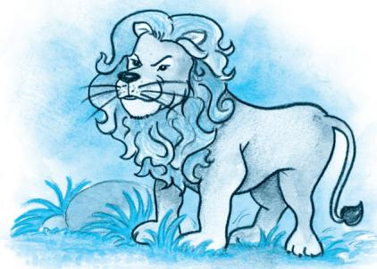

Or if some time when roaming round,

A noble wild beast greets you,

With black stripes on a yellow ground,

Just notice if he eats you.

This simple rule may help you learn

The Bengal Tiger to discern.

If strolling forth, a beast you view,

Whose hide with spots is peppered,

As soon as he has lept on you,

You’ll know it is the Leopard.

’Twill do no good to roar with pain,

He’ll only lep and lep again.

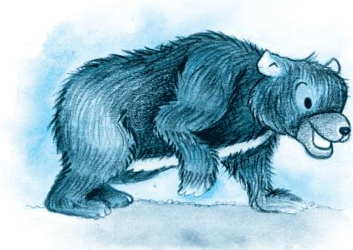

If when you’re walking round your yard You meet a creature there, Who hugs you very, very hard, Be sure it is a Bear. If you have any doubts, I guess He’ll give you just one more caress.

Though to distinguish beasts of pre A novice might nonplus, The Crocodile you always may Tell from the Hyena thus: Hyenas come with merry smiles; But if they weep they’re Crocodiles.

The true Chameleon is small, A lizard sort of thing; He hasn’t any ears at all, And not a single wing. If there is nothing on the tree, ’Tis the chameleon you see.

CAROLYN WELLS

# Glossary

ground: background

discern: make out; identify

hide: animal skin

peppered: here, covered with spots

caress: a gentle, loving touch

novice: someone new to a job

(be) nonplus (sed) (usually only in the passive): (be) puzzle(d), confuse(d), surprise(d)

# Thinking about the Poem

1. Does ‘dyin’ really rhyme with ‘lion’? Can you say it in such a way that it does?   
2. How does the poet suggest that you identify the lion and the tiger? When can you do so, according to him?   
3. Do you think the words ‘lept‘ and ‘lep’ in the third stanza are spelt correctly? Why does the poet spell them like this?   
4. Do you know what a ‘bearhug’ is? It’s a friendly and strong hug — such as bears are thought to give, as they attack you! Again, hyenas are thought to laugh, and crocodiles to weep (‘crocodile tears’) as they swallow their victims. Are there similar expressions and popular ideas about wild animals in your own language(s)?   
5. Look at the line “A novice might nonplus”. How would you write this ‘correctly’? Why is the poet’s ‘incorrect’ line better in the poem?   
6. Can you find other examples of poets taking liberties with language, either in English or in your own language(s)? Can you find examples of humorous poems in your own language(s)?   
7. Much of the humour in the poem arises from the way language is used, although the ideas are funny as well. If there are particular lines in the poem that you especially like, share these with the class, speaking briefly about what it is about the ideas or the language that you like or find funny.

# English is funny, because...

# We have noses that run and feet that smell

# The The B a l l B a l l Poem Poem

A boy loses a ball. He is very upset. A ball doesn’t cost much, nor is it difficult to buy another ball. Why then is the boy so upset? Read the poem to see what the poet thinks has been lost, and what the boy has to learn from the experience of losing something.

What is the boy now, who has lost his ball, What, what is he to do? I saw it go Merrily bouncing, down the street, and then Merrily over — there it is in the water! No use to say ‘O there are other balls’: An ultimate shaking grief fixes the boy As he stands rigid, trembling, staring down All his young days into the harbour where His ball went. I would not intrude on him; A dime, another ball, is worthless. Now He senses first responsibility In a world of possessions. People will take Balls, balls will be lost always, little boy. And no one buys a ball back. Money is external. He is learning, well behind his desperate eyes, The epistemology of loss, how to stand up Knowing what every man must one day know And most know many days, how to stand up.

JOHN BERRYMAN

# Glossary

O there are other balls: The words suggest that the loss is not important enough to worry about

shaking grief: sadness which greatly affects the boy

rigid: stiff

(to) intrude on: here, to enter a situation where one is not welcome

a dime: ten cents (U.S.)

desperate: hopeless

epistemology of loss: understanding the nature of loss — what it means to lose something

epistemology: The Greek word episteme means ‘knowledge’ (it comes from a word meaning ‘to understand, to know’). Epistemology is the study of the nature of knowledge itself.

# Thinking about the Poem

In pairs, attempt the following questions.

1. Why does the poet say, “I would not intrude on him”? Why doesn’t he offer him money to buy another ball?   
2. “… staring down/All his young days into the harbour where/His ball went …” Do you think the boy has had the ball for a long time? Is it linked to the memories of days when he played with it?   
3. What does “in the world of possessions” mean?   
4. Do you think the boy has lost anything earlier? Pick out the words that suggest the answer.   
5. What does the poet say the boy is learning from the loss of the ball? Try to explain this in your own words.   
6. Have you ever lost something you liked very much? Write a paragraph describing how you felt then, and saying whether — and how — you got over your loss.

Anne Frank

“This is a photo as I would wish myself to look all the time. Then I would, maybe, have a chance to come to Hollywood.”

– Anne Frank, 10 October 1942

# BEFORE YOU READ

Anneliese Marie ‘Anne’ Frank (12 June 1929 – February/ March 1945) was a German – born Jewish girl who wrote while in hiding with her family and four friends in Amsterdam during the German occupation of the Netherlands in World War II. Her family had moved to Amsterdam after the Nazis gained power in Germany but were trapped when the Nazi occupation extended into the Netherlands. As persecutions against the Jewish population

increased, the family went into hiding in July 1942 in hidden rooms in her father Otto Frank’s office building. After two years in hiding, the group was betrayed and transported to the concentration camp system where Anne died of typhus in Bergen-Belsen within days of her sister, Margot Frank. Her father, Otto, the only survivor of the group, returned to Amsterdam after the war ended, to find that her diary had been saved. Convinced that it was a unique record, he took action to have it published in English under the name The Diary of a Young Girl.

The diary was given to Anne Frank for her thirteenth birthday and chronicles the events of her life from 12 June 1942 until its final entry of 1 August 1944. It was eventually translated from its original Dutch into many languages and became one of the world’s most widely read books. There have also been several films, television and theatrical productions, and even an opera, based on the diary. Described as the work of a mature and insightful mind, the diary provides an intimate examination of daily life under Nazi occupation. Anne Frank has become one of the most renowned and discussed of the Holocaust victims.

# Activity

1. Do you keep a diary? Given below under ‘A’ are some terms we use to describe a written record of personal experience. Can you match them with their descriptions under $^ { 6 } B _ { \cdot } ^ { \prime }$ (You may look up the terms in a dictionary if you wish.)

# A

(i) Journal   
(ii) Diary   
(iii) Log   
(iv) Memoir(s)

– A book with a separate space or page for each day, in which you write down your thoughts and feelings or what has happened on that day   
– A full record of a journey, a period of time, or an event, written every day   
– A record of a person’s own life and experiences (usually, a famous person)   
– A written record of events with times and dates, usually official

2. Here are some entries from personal records. Use the definitions above to decide which of the entries might be from a diary, a journal, a log or a memoir.

(i) I woke up very late today and promptly got a scolding from Mum! I can’t help it — how can I miss the FIFA World Cup matches?

Ans:

(ii) 10:30 a.m. Went to the office of the Director

01:00 p.m. Had lunch with Chairman

05:45 p.m. Received Rahul at the airport

09:30 p.m. Dinner at home

Ans:

(iii) The ride to Ooty was uneventful. We rested for a while every 50 km or so, and used the time to capture the magnificent landscape with my HandyCam. From Ooty we went on to Bangalore.

What a contrast! The noise and pollution of this oncebeautiful city really broke my heart.

Ans:

(iv) This is how Raj Kapoor found me — all wet and ragged outside R.K.Studios. He was then looking for just someone like this for a small role in Mera Naam Joker, and he cast me on the spot. The rest, as they say, is history!

Ans:

WRITING in a diary is a really strange experience for someone like me. Not only because I’ve never written anything before, but also because it seems to me that later on neither I nor anyone else will be interested in the musings of a thirteen-yearold schoolgirl. Oh well, it doesn’t matter. I feel like writing, and I have an even greater need to get all kinds of things off my chest.

‘Paper has more patience than people.’ I thought of this saying on one of those days when I was feeling a little depressed and was sitting at home with my chin in my hands, bored and listless, wondering whether to stay in or go out. I finally stayed where I was, brooding: Yes, paper does have more patience, and since I’m not planning to let anyone else read this stiff-backed notebook grandly referred to as a ‘diary’, unless I should ever find a real friend, it probably won’t make a bit of difference.

Now I’m back to the point that prompted me to keep a diary in the first place: I don’t have a friend.

Let me put it more clearly, since no one will believe that a thirteen-year-old girl is completely alone in the world. And I’m not. I have loving parents and a sixteen-year-old sister, and there are about thirty people I can call friends. I have a family, loving aunts and a good home. No, on the surface I seem to have everything, except my one true friend. All I think about when I’m with friends is having a good time. I can’t bring myself to talk about anything but ordinary everyday things. We don’t seem to be able to get any closer, and that’s the problem. Maybe it’s my fault that we don’t confide in each other. In any case, that’s just how things are, and unfortunately they’re not liable to change. This is why I’ve started the diary.

To enhance the image of this long-awaited friend in my imagination, I don’t want to jot down the facts in this diary the way most people would do, but I want the diary to be my friend, and I’m going to call this friend ‘Kitty’.

# listless

with no energy or interest

# confide

to tell personal things privately to a person that one trusts

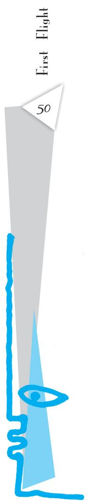

# Oral Comprehension Check

1. What makes writing in a diary a strange experience for Anne Frank?   
2. Why does Anne want to keep a diary?   
3. Why did Anne think she could confide more in her diary than in people?

Since no one would understand a word of my stories to Kitty if I were to plunge right in, I’d better provide a brief sketch of my life, much as I dislike doing so.

My father, the most adorable father I’ve ever seen, didn’t marry my mother until he was thirtysix and she was twenty-five. My sister, Margot, was born in Frankfurt in Germany in 1926. I was born on 12 June 1929. I lived in Frankfurt until I was four. My father emigrated to Holland in 1933. My mother, Edith Hollander Frank, went with him to Holland in September, while Margot and I were sent to Aachen to stay with our grandmother. Margot went to Holland in December, and I followed in February, when I was plunked down on the table as a birthday present for Margot.

I started right away at the Montessori nursery school. I stayed there until I was six, at which time I started in the first form. In the sixth form my teacher was Mrs Kuperus, the headmistress. At the end of the year we were both in tears as we said a heartbreaking farewell.

In the summer of 1941 Grandma fell ill and had to have an operation, so my birthday passed with little celebration.

Grandma died in January 1942. No one knows how often I think of her and still love her. This birthday celebration in 1942 was intended to make up for the other, and Grandma’s candle was lit along with the rest.

The four of us are still doing well, and that brings me to the present date of 20 June 1942, and the solemn dedication of my diary.

plunked down (an informal word) put down in a casual way

# Oral Comprehension Check

1. Why does Anne provide a brief sketch of her life?   
2. What tells you that Anne loved her grandmother?

Dearest Kitty,

Our entire class is quaking in its boots. The reason, of course, is the forthcoming meeting in which the teachers decide who’ll move up to the next form and who’ll be kept back. Half the class is making bets. G.N. and I laugh ourselves silly at the two boys behind us, C.N. and Jacques, who have staked their entire holiday savings on their bet. From morning to night, it’s “You’re going to pass”, “No, I’m not”, “Yes, you are”, “No, I’m not”. Even G.’s pleading glances and my angry outbursts can’t calm them down. If you ask me, there are so many dummies that about a quarter of the class should be kept back, but teachers are the most unpredictable creatures on earth.

I’m not so worried about my girlfriends and myself. We’ll make it. The only subject I’m not sure about is maths. Anyway, all we can do is wait. Until then, we keep telling each other not to lose heart.

I get along pretty well with all my teachers. There are nine of them, seven men and two women. Mr Keesing, the old fogey who teaches maths, was annoyed with me for ages because I talked so much. After several warnings, he assigned me extra homework. An essay on the subject, ‘A Chatterbox’. A chatterbox — what can you write about that? I’d worry about that later, I decided. I jotted down the title in my notebook, tucked it in my bag and tried to keep quiet.

That evening, after I’d finished the rest of my homework, the note about the essay caught my eye. I began thinking about the subject while chewing the tip of my fountain pen. Anyone could ramble on and leave big spaces between the words, but the trick was to come up with convincing arguments to prove the necessity of talking. I thought and thought, and suddenly I had an idea. I wrote the three pages Mr Keesing had assigned me and was satisfied. I argued that talking is a s t u d e n t ’ s t r a i t a n d t h a t I w o u l d d o m y b e s t t o k e e p i t u n d e r c o n t r o l ,

quaking in its boots

shaking with fear

and nervousness

old fogey

an old-fashioned

person

ramble on

talk or write

aimlessly for long

convincing

argument

a statement made in

such a manner that

people believe it

but that I would never be able to cure myself of the habit since my mother talked as much as I did if not more, and that there’s not much you can do about inherited traits.

Mr Keesing had a good laugh at my arguments, but when I proceeded to talk my way through the next lesson, he assigned me a second essay. This time it was supposed to be on ‘An Incorrigible Chatterbox’. I handed it in, and Mr Keesing had nothing to complain about for two whole lessons. However, during the third lesson he’d finally had enough. “Anne Frank, as punishment for talking in class, write an essay entitled — ‘Quack, Quack, Quack, Said Mistress Chatterbox’.”

inherited traits qualities (physical or mental) that one gets from one’s parents

incorrigible something that cannot be corrected (usually a bad quality)

The class roared. I had to laugh too, though I’d nearly exhausted my ingenuity on the topic of chatterboxes. It was time to come up with something else, something original. My friend, Sanne, who’s good at poetry, offered to help me write the essay from beginning to end in verse and I jumped for joy. Mr Keesing was trying to play a joke on me with this ridiculous subject, but I’d make sure the joke was on him.

I finished my poem, and it was beautiful! It was about a mother duck and a father swan with three baby ducklings who were bitten to death by the father because they quacked too much. Luckily, Mr Keesing took the joke the right way. He read the

ingenuity originality and inventiveness

poem to the class, adding his own comments, and to several other classes as well. Since then I’ve been allowed to talk and haven’t been assigned any extra homework. On the contrary, Mr Keesing’s always making jokes these days.

Yours, Anne

[Extracted from The Diary of a Young Girl, with slight adaptation]

# Oral Comprehension Check

1. Why was Mr Keesing annoyed with Anne? What did he ask her to do?   
2. How did Anne justify her being a chatterbox in her essay?   
3. Do you think Mr Keesing was a strict teacher?   
4. What made Mr Keesing allow Anne to talk in class?

# Thinking about the Text

1. Was Anne right when she said that the world would not be interested in the musings of a thirteen-year-old girl?   
2. There are some examples of diary or journal entries in the ‘Before You Read’ section. Compare these with what Anne writes in her diary. What language was the diary originally written in? In what way is Anne’s diary different?   
3. Why does Anne need to give a brief sketch about her family? Does she treat ‘Kitty’ as an insider or an outsider?   
4. How does Anne feel about her father, her grandmother, Mrs Kuperus and Mr Keesing? What do these tell you about her?   
5. What does Anne write in her first essay?   
6. Anne says teachers are most unpredictable. Is Mr Keesing unpredictable? How?   
7. What do these statements tell you about Anne Frank as a person?

(i) We don’t seem to be able to get any closer, and that’s the problem. Maybe it’s my fault that we don’t confide in each other.   
(ii) I don’t want to jot down the facts in this diary the way most people would, but I want the diary to be my friend.   
(iii) Margot went to Holland in December, and I followed in February, when I was plunked down on the table as a birthday present for Margot.   
(iv) If you ask me, there are so many dummies that about a quarter of the class should be kept back, but teachers are the most unpredictable creatures on earth.

(v) Anyone could ramble on and leave big spaces between the words, but the trick was to come up with convincing arguments to prove the necessity of talking.

# Thinking about Language

I. Look at the following words.

headmistress

long-awaited

homework

notebook

stiff-backed

outbursts

These words are compound words. They are made up of two or more words. Compound words can be:

• nouns: headmistress, homework, notebook, outbursts   
• adjectives: long-awaited, stiff-backed   
• verbs: sleep-walk, baby-sit

Match the compound words under ‘A’ with their meanings under ‘B’. Use each in a sentence.

# A

# B

<table><tr><td>1. Heartbreaking</td><td>- obeying and respecting the law</td></tr><tr><td>2. Homesick</td><td>- think about pleasant things, forgetting about the present</td></tr><tr><td>3. Blockhead</td><td>- something produced by a person, machine or organisation</td></tr><tr><td>4. Law-abiding</td><td>- producing great sadness</td></tr><tr><td>5. Overdo</td><td>- an occasion when vehicles/machines stop working</td></tr><tr><td>6. Daydream</td><td>- an informal word which means a very stupid person</td></tr><tr><td>7. Breakdown</td><td>- missing home and family very much</td></tr><tr><td>8. Output</td><td>- do something to an excessive degree</td></tr></table>

# II. Phrasal Verbs

A phrasal verb is a verb followed by a preposition or an adverb. Its meaning is often different from the meanings of its parts. Compare the meanings of the verbs get on and run away in (a) and (b) below. You can easily guess their meanings in (a) but in (b) they have special meanings.

(a) • She got on at Agra when the bus stopped for breakfast.   
• Dev Anand ran away from home when he was a teenager.   
(b) • She’s eager to get on in life. (succeed)   
• The visitors ran away with the match. (won easily)

Some phrasal verbs have three parts: a verb followed by an adverb and a preposition.

(c) Our car ran out of petrol just outside the city limits.   
(d) The government wants to reach out to the people with this new campaign.

1. The text you’ve just read has a number of phrasal verbs commonly used in English. Look up the following in a dictionary for their meanings (under the entry for the italicised word).

(i) plunge (right) in

( i i i ) ramble on

(ii) kept back

(iv) get along with

2. Now find the sentences in the lesson that have the phrasal verbs given below. Match them with their meanings. (You have already found out the meanings of some of them.) Are their meanings the same as that of their parts? (Note that two parts of a phrasal verb may occur separated in the text.)

(i) plunge in

– speak or write without focus

(ii) kept back

– stay indoors

(iii) move up

– make (them) remain quiet

(iv) ramble on

– have a good relationship with

(v) get along with i n

– give an assignment (homework) to a person authority (the teacher)

(vi) calm down

– compensate

(vii) stay in

– go straight to the topic

(viii) make up for

– go to the next grade

(ix) hand in

– not promoted

# III. Idioms

Idioms are groups of words with a fixed order, and a particular meaning, different from the meanings of each of their words put together. (Phrasal verbs can also be idioms; they are said to be ‘idiomatic’ when their meaning is unpredictable.) For example, do you know what it means to ‘meet one’s match’ in English? It means to meet someone who is as good as oneself, or even better, in some skill or quality. Do you know what it means to ‘let the cat out of the bag’? Can you guess?

1. Here are a few sentences from the text which have idiomatic expressions. Can you say what each means? (You might want to consult a dictionary first.)

(i) Our entire class is quaking in its boots.   
(ii) Until then, we keep telling each other not to lose heart.

(iii) Mr Keesing was annoyed with me for ages because I talked so much.   
(iv) Mr Keesing was trying to play a joke on me with this ridiculous subject, but I’d make sure the joke was on him.

# 2. Here are a few more idiomatic expressions that occur in the text. Try to use them in sentences of your own.

(i) caught my eye

(i ii ) laugh ourselves silly

(ii) he’d had enough

(iv) can’t bring myself to

IV. Do you know how to use a dictionary to find out the meanings of idiomatic expressions? Take, for example, the expression caught my eye in the story. Where — under which word — would you look for it in the dictionary?

Look for it under the first word. But if the first word is a ‘grammatical’ word like a, the, for, etc., then take the next word. That is, look for the first ‘meaningful’ word in the expression. In our example, it is the word caught.

But you won’t find caught in the dictionary, because it is the past tense of catch. You’ll find caught listed under catch. So you must look under catch for the expression caught my eye. Which other expressions with catch are listed in your dictionary?

Note that a dictionary entry usually first gives the meanings of the word itself, and then gives a list of idiomatic expressions using that word. For example, study this partial entry for the noun ‘eye’ from the Oxford Advanced Learner’s Dictionary, 2005.

# Eye

• Noun   
• Part of Body 1 [C] either of the two organs on the face that you see with: The suspect has dark hair and green eyes.   
• Ability to See 3 [sing.] the ability to see: A surgeon needs a good eye and a steady hand.   
• Way of Seeing 4 [C, usually sing.] a particular way of seeing sth: He looked at the design with the eye of an engineer.   
• Of Needle 5 [C] the hole in the end of a needle that you put the thread through.

IDM be all eyes to be watching sb/sth carefully and with a lot of interest before/in front of sb’s (very) eyes in sb’s presence; in front of sb: He had seen his life’s work destroyed before his very eyes. Be up to your eyes in sth to have a lot of sth to deal with: We’re up to our eyes in work.

You have read the expression ‘not to lose heart’ in this text. Now find out the meanings of the following expressions using the word ‘heart’.Use each of them in a sentence of your own.

1. break somebody’s heart   
2. close/dear to heart   
3. from the (bottom of your) heart   
4. have a heart   
5. have a heart of stone   
6. your heart goes out to somebody

# V. Contracted Forms

When we speak, we use ‘contracted forms’ or short forms such as these:

can’t (for can not or cannot) I’d (for I would or I had) she’s (for she is)

Notice that contracted forms are also written with an apostrophe to show a shortening of the spelling of not, would, or is as in the above example.

Writing a diary is like speaking to oneself. Plays (and often, novels) also have speech in written form. So we usually come across contracted forms in diaries, plays and novels.

1. Make a list of the contracted forms in the text. Rewrite them as full forms of two words.

For example:

I’ve $= \mathrm { ~ I ~ }$ have

2. We have seen that some contracted forms can stand for two different full forms:

I’d = I had or I would

Find in the text the contracted forms that stand for two different full forms, and say what these are.

# Speaking

Here is an extract adapted from a one-act play. In this extract, angry neighbours who think Joe the Inventor’s new spinning machine will make them lose their jobs come to destroy Joe’s model of the machine.

You’ve just seen how contracted forms can make a written text sound like actual speech. Try to make this extract sound more like a real conversation by changing some of the verbs back into contracted forms. Then speak out the lines.

[The door is flung open, and several men tramp in. They carry sticks, and one of them, HOB, has a hammer.]

MOB : Now where is your husband, mistress?

MARY : In his bed. He is sick, and weary. You would not harm him!

HOB : We are going to smash his evil work to pieces. Where is the machine?

SECOND : On the table yonder.

MAN

HOB : Then here is the end of it!

[HOB smashes the model. MARY screams.]

HOB : And now for your husband!

MARY : Neighbours, he is a sick man and almost a cripple. You would not hurt him!

HOB : He is planning to take away our daily bread… We will show him what we think of him and his ways!

MARY : You have broken his machine… You have done enough…

# Writing

Now you know what a diary is and how to keep one. Can you keep a diary for a week recording the events that occur? You may share your diary with your class, if you wish to. Use the following hints to write your diary.

• Though your diary is very private, write as if you are writing for someone else.   
• Present your thoughts in a convincing manner.   
• Use words that convey your feelings, and words that ‘paint pictures’ for the reader. Be brief.

‘Diary language’ has some typical features such as subjectless sentences (Got up late in the morning), sentence fragments without subjects or verbs (…too bad, boring, not good), contracted forms (they’re, I’ve, can’t, didn’t, etc.), and everyday expressions which people use in speech. Remember not to use such language in more formal kinds of writing.

# Listening

Your teacher will read out an extract from The Diary of Samuel Pepys (given on the next page) about the great fire of London. As you listen complete this summary of the happenings.

# Summary

This entry in the diary has been made on by The person who told Pepys about the fire was called . She called at in the morning. Pepys went back to sleep because . Pepys rose again at in the morning. By then about houses had been burned down. The fire had spread to by London Bridge. Pepys then walked to the along with Sir J. Robinson’s

# WHAT WE HAVE DONE

Diary writing is one of the best ways to practise writing. Students do not have to think up or imagine what to write about; they only have to find words to write about what has happened. Initiate your students into the habit of keeping a diary.   
2. Anne Frank’s diary became a public document after World War II. Discuss with your students diaries which became historical documents, such as Samuel Pepys’s diary. You may draw students’ attention to different types of diaries, e.g. private diary, general diary. Army officers, businessmen, doctors, executives, lawyers, motorists, police officers keep a general diary to record events that happen during the day and events that are scheduled for the day, such as appointments, meetings, things to be done, etc.   
3. Passage for listening exercise:

# The Great Fire of London [1666]

September 2nd (Lord’s Day). Jane called us up about three in the morning, to tell us of a great fire they saw in the city. So I rose and slipped on my nightgown, and went to her window, and thought it to be on the backside of Marke-Lane at the farthest; but being unused to such fire as followed, I thought it far enough off, and so went to bed again and to sleep.

About seven rose again to dress myself, and then looked out of the window, and saw the fire not so much as it was and further off. By and by Jane comes and tells me that she hears that above 300 houses have been burned down tonight by the fire we saw, and that it is now burning down all Fish Street, by London Bridge.

So I made myself ready presently, and walked to the Tower, and there got up upon one of the high places, Sir J. Robinson’s little son going up with me; and there I did see the houses at that end of the bridge all on fire, and an infinite great fire on this and the other side of the bridge.

[From The Diary of Samuel Pepys ]

# WHAT YOU CAN DO

After they have completed the lesson, including the writing exercise, students can be asked to make a diary jotting for the previous day. Perhaps you could also write a diary entry describing what happened in school/class on the previous day, to share with the class — try and make it amusing and interesting! Collect students’ pages (they may be allowed to sign their names or make it anonymous, as they wish) and put them up on the class notice board, together with your page, for everyone to read.

# A m a n d a ! A m a n d a !

Every child feels that she/he is controlled and instructed not to do one thing or another. You too may feel that your freedom is curtailed. Write down some of the things you want to do, but your parents/ elders do not allow you to. To read the poem aloud, form pairs, each reading alternate stanzas. You are in for a surprise!

Don’t bite your nails, Amanda!

Don’t hunch your shoulders, Amanda!

Stop that slouching and sit up straight,

Amanda!

(There is a languid, emerald sea,

where the sole inhabitant is me—

a mermaid, drifting blissfully.)

Did you finish your homework, Amanda?

Did you tidy your room, Amanda?

I thought I told you to clean your shoes,

Amanda!

(I am an orphan, roaming the street.

I pattern soft dust with my hushed, bare feet.

The silence is golden, the freedom is sweet.)

Don’t eat that chocolate, Amanda!

Remember your acne, Amanda!

Will you please look at me when I’m speaking to you,

Amanda!

(I am Rapunzel, I have not a care;

life in a tower is tranquil and rare;

I’ll certainly never let down my bright hair!)

Stop that sulking at once, Amanda!

You’re always so moody, Amanda!

Anyone would think that I nagged at you,

Amanda!

ROBIN KLEIN

# Glossary

languid: relaxed

drifting: moving slowly

pattern: make patterns

tranquil: calm

# Thinking about the Poem

1. How old do you think Amanda is? How do you know this?   
2. Who do you think is speaking to her?   
3. Why are Stanzas 2, 4 and 6 given in parenthesis?   
4. Who is the speaker in Stanzas 2, 4 and 6? Do you think this speaker is listening to the speaker in Stanzas 1, 3, 5, and 7?   
5. What could Amanda do if she were a mermaid?   
6. Is Amanda an orphan? Why does she say so?   
7. Do you know the story of Rapunzel? Why does she want to be Rapunzel?   
8. What does the girl yearn for? What does this poem tell you about Amanda?   
9. Read the last stanza. Do you think Amanda is sulking and is moody?

# 5

# Glimpses of India

1059CH07

I. A Baker from Goa   
II. Coorg   
III.  Tea from Assam

Lucio Rodrigues

Lokesh Abrol

Arup Kumar Datta

# BEFORE YOU READ

# Activity

Discuss in class

1. What images — of people and of places — come to your mind, when you think of our country?   
2. What parts of India have you lived in, or visited? Can you name some popular tourist destinations?   
3. You may know that apart from the British, the Dutch and the French, the Portuguese have also played a part in the history of our country. Can you say which parts of India show French and Portuguese influences?   
4. Can you say which parts of India grow (i) tea, (ii) coffee?

# I A Baker from Goa

This is a pen-portrait of a traditional Goan village baker who still has an important place in his society.

OUR elders are often heard reminiscing nostalgically about those good old Portuguese days, the Portuguese and their famous loaves of bread. Those eaters of loaves might have vanished but the makers are still there. We still have amongst us the mixers, the moulders and those who bake the loaves. Those ageold, time-tested furnaces still exist. The fire in the furnaces has not yet been extinguished. The thud and jingle of

reminiscing nostalgically thinking fondly of the past

the traditional baker’s bamboo, heralding his arrival in the morning, can still be heard in some places. Maybe the father is not alive but the son still carries on the family profession. These bakers are, even today, known as pader in Goa.

During our childhood in Goa, the baker used to be our friend, companion and guide. He used to come at least twice a day. Once, when he set out in the morning on his selling round, and then again, when he returned after emptying his huge basket. The jingling thud of his bamboo woke us up from sleep and we ran to meet and greet him. Why was it so? Was it for the love of the loaf? Not at all. The loaves were bought by some Paskine or Bastine, the maid-servant of the house! What we longed for were those bread-bangles which we chose carefully. Sometimes it was sweet bread of special make.

The baker made his musical entry on the scene with the ‘jhang, jhang’ sound of his specially made bamboo staff. One hand supported the basket on his head and the other banged the bamboo on the ground. He would greet the lady of the house with “Good morning” and then place his basket on the vertical bamboo. We kids would be pushed aside with a mild rebuke and the loaves would be delivered to the servant. But we would not give up. We would climb a bench or the parapet and peep into the basket, somehow. I can still recall the typical fragrance of those loaves. Loaves for the elders and the bangles for the children. Then we did not even care to brush our teeth or wash our mouths properly. And why should we? Who would take the trouble of plucking the mango-leaf for the toothbrush? And why was it necessary at all? The tiger never brushed his teeth. Hot tea could wash and clean up everything so nicely, after all!

heralding announcing

rebuke an expression of disapproval; a scolding

fragrance scent

# Oral Comprehension Check

1. What are the elders in Goa nostalgic about?   
2. Is bread-making still popular in Goa? How do you know?   
3. What is the baker called?   
4. When would the baker come everyday? Why did the children run to meet him?

Marriage gifts are meaningless without the sweet bread known as the bol, just as a party or a feast loses its charm without bread. Not enough can be said to show how important a baker can be for a village. The lady of the house must prepare sandwiches on the occasion of her daughter’s engagement. Cakes and bolinhas are a must for Christmas as well as other festivals. Thus, the presence of the baker’s furnace in the village is absolutely essential.

The baker or bread-seller of those days had a peculiar dress known as the kabai. It was a singlepiece long frock reaching down to the knees. In our childhood we saw bakers wearing a shirt and trousers which were shorter than full-length ones and longer than half pants. Even today, anyone who wears a half pant which reaches just below the knees invites the comment that he is dressed like a pader!

The baker usually collected his bills at the end of the month. Monthly accounts used to be recorded on some wall in pencil. Baking was indeed a profitable profession in the old days. The baker and his family never starved. He, his family and his servants always looked happy and prosperous. Their plump physique was an open testimony to this. Even today any person with a jackfruit-like physical appearance is easily compared to a baker.

plump physique pleasantly fat body open testimony public statement about a character or quality

# Oral Comprehension Check

1. Match the following. What is a must

(i) as marriage gifts? – cakes and bolinhas   
(ii) for a party or a feast? – sweet bread called bol   
(iii) for a daughter’s engagement? – bread   
(iv) for Christmas? – sandwiches

2. What did the bakers wear: (i) in the Portuguese days? (ii) when the author was young?   
3. Who invites the comment — “he is dressed like a pader”? Why?   
4. Where were the monthly accounts of the baker recorded?   
5. What does a ‘jackfruit -like appearance’ mean?

# Thinking about the Text

1. Which of these statements are correct?

(i) The pader was an important person in the village in old times.   
(ii) Paders still exist in Goan villages.   
(iii) The paders went away with the Portuguese.   
(iv) The paders continue to wear a single-piece long frock.   
(v) Bread and cakes were an integral part of Goan life in the old days.   
(vi) Traditional bread-baking is still a very profitable business.   
(vii) Paders and their families starve in the present times.

2. Is bread an important part of Goan life? How do you know this?

3. Tick the right answer. What is the tone of the author when he says the following?

(i) The thud and the jingle of the traditional baker’s bamboo can still be heard in some places. (nostalgic, hopeful, sad)   
(ii) Maybe the father is not alive but the son still carries on the family profession. (nostalgic, hopeful, sad)   
(iii) I still recall the typical fragrance of those loaves. (nostalgic, hopeful, naughty)   
(iv) The tiger never brushed his teeth. Hot tea could wash and clean up everything so nicely, after all. (naughty, angry, funny)   
(v) Cakes and bolinhas are a must for Christmas as well as other festivals. (sad, hopeful, matter-of-fact)   
(vi) The baker and his family never starved. They always looked happy and prosperous. (matter-of-fact, hopeful, sad)

# Writing

I. In this extract, the author talks about traditional bread-baking during his childhood days. Complete the following table with the help of the clues on the left. Then write a paragraph about the author's childhood days.

<table><tr><td>Clues</td><td>Author&#x27;s childhood days</td></tr><tr><td>the way bread was baked</td><td></td></tr><tr><td>the way the pader sold bread</td><td></td></tr><tr><td>what the pader wore</td><td></td></tr><tr><td>when the pader was paid</td><td></td></tr><tr><td>how the pader looked</td><td></td></tr></table>

II. 1. Compare the piece from the text (on the left below) with the other piece on Goan bakers (on the right). What makes the two texts so different? Are the facts the same? Do both writers give you a picture of the baker?

Our elders are often heard reminiscing nostalgically about those good old Portuguese days, the Portuguese and their famous loaves of bread. Those eaters of loaves might have vanished but the makers are still there. We still have amongst us the mixers, the moulders and those who bake the loaves. Those age-old, time-tested furnaces still exist. The fire in the furnaces had not yet been extinguished. The thud and the jingle of the traditional baker’s bamboo, heralding his arrival in the morning, can still be heard in some places.

May be the father is not alive but the son still carries on the family profession.

After Goa’s liberation, people used to say nostalgically that the Portuguese bread vanished with the paders. But the paders have managed to survive because they have perfected the art of door-todoor delivery service. The paders pick up the knowledge of breadmaking from traditions in the family. The leavened, oven-baked bread is a gift of the Portuguese to India.

[Adapted from Nandakumar Kamat’s ‘The Unsung Lives of Goan Paders’]

2. Now find a travel brochure about a place you have visited. Look at the description in the brochure. Then write your own account, adding details from your own experience, to give the reader a picture of the place, rather than an impersonal, factual description.

# Group Discussion

1. In groups, collect information on how bakeries bake bread now and how the process has changed over time.   
2. There are a number of craft-based professions which are dying out. Pick one of the crafts below. Make a group presentation to the class about the skills required, and the possible reasons for the decline of the craft. Can you think of ways to revive these crafts?

(i) Pottery

(v) Carpentry

(ii) Batik work

(vi) Bamboo weaving

(iii) Dhurri (rug) weaving

(vii) Making jute products

(iv) Embroidery

(viii) Handloom

# I I

# Coorg

Coorg is coffee country, famous for its rainforests and spices.

MIDWAY between Mysore and the coastal town of Mangalore sits a piece of heaven that must have drifted from the kingdom of god. This land of rolling hills is inhabited by a proud race of martial men, beautiful women and wild creatures.

Coorg, or Kodagu, the smallest district of Karnataka, is home to evergreen rainforests, spices and coffee plantations. Evergreen rainforests cover thirty per cent of this district. During the monsoons, it pours enough to keep many visitors away. The season of joy commences from September and continues till March. The weather is perfect, with

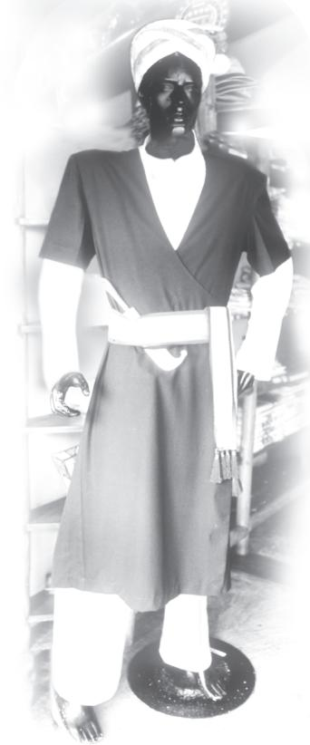

some showers thrown in for good measure. The air breathes of invigorating coffee. Coffee estates and colonial bungalows stand tucked under tree canopies in prime corners.

The fiercely independent people of Coorg are possibly of Greek or Arabic descent. As one story goes, a part of Alexander’s army moved south along the coast and settled here when return became impractical. These people married amongst the locals and their culture is apparent in the martial traditions, marriage and religious rites, which are distinct from the Hindu mainstream. The theory of Arab origin draws support from the long, black coat

drifted from

been carried along gently by air

martial

having to do with war

canopies

roof-like coverings that form shelters

prime

here, best

mainstream

a tradition which

most people follow

Traditional Coorgi dress

with an embroidered waist-belt worn by the Kodavus. Known as kuppia, it resembles the kuffia worn by the Arabs and the Kurds.

Coorgi homes have a tradition of hospitality, and they are more than willing to recount numerous tales of valour related to their sons and fathers. The Coorg Regiment is one of the most decorated in the Indian Army, and the first Chief of the Indian Army, General Cariappa, was a Coorgi. Even now, Kodavus are the only people in India permitted to carry firearms without a licence.

The river, Kaveri, obtains its water from the hills and forests of Coorg. Mahaseer — a large freshwater fish — abound in these waters. Kingfishers dive for their catch, while squirrels and langurs drop partially eaten fruit for the mischief of enjoying the splash and the ripple effect in the clear water. Elephants enjoy being bathed and scrubbed in the river by their mahouts.

The most laidback individuals become converts to the life of high-energy adventure with river rafting, canoeing, rappelling, rock climbing and mountain

tales of valour stories of courage and bravery, usually in war

most decorated having received the maximum number of awards for bravery in war

laidback relaxed; not in a hurry

rafting travelling in a river in a raft ( a floating platform made by tying planks together)

canoeing travelling in a river in a canoe (a large, narrow boat)

rappelling going down a cliff by sliding down a rope

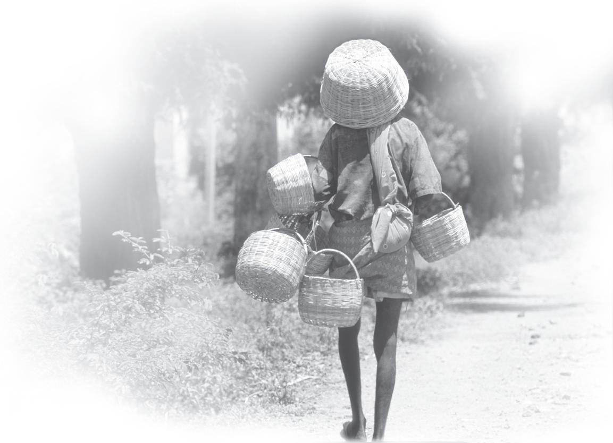  
Basket-seller from Coorg

biking. Numerous walking trails in this region are a favourite with trekkers.

Birds, bees and butterflies are there to give you company. Macaques, Malabar squirrels, langurs and slender loris keep a watchful eye from the tree canopy. I do, however, prefer to step aside for wild elephants.

The climb to the Brahmagiri hills brings you into a panoramic view of the entire misty landscape of Coorg. A walk across the rope bridge leads to the sixty-four-acre island of Nisargadhama. Running into Buddhist monks from India’s largest Tibetan settlement, at nearby Bylakuppe, is a bonus. The monks, in red, ochre and yellow robes, are amongst the many surprises that wait to be discovered by visitors searching for the heart and soul of India, right here in Coorg.

trails

paths created by walking

panoramic view a view of a wide area of land

# FACT FILE

# How to Reach

Madikeri, the district headquarters, is the only gateway to Coorg. The misty hills, lush forests and coffee plantations will cast a spell on you. Find a resort, coffee estate or stay in a home for a truly Coorgi experience.

By Air: The nearest airports are Mangalore ( $1 3 5 ~ \mathrm { k m }$ ) and Bangalore (260 km). There are flights to Mangalore from Mumbai, and to Bangalore from Ahmedabad, Chennai, Delhi, Goa, Hyderabad, Kochi, Kolkata, Mumbai and Pune.

By Rail: The nearest railheads are at Mysore, Mangalore and Hassan.

By Road: There are two routes to Coorg from Bangalore. Both are almost the same distance (around $2 5 0 { - } 2 6 0 ~ \mathrm { k m }$ ). The route via Mysore is the most frequented one. The other route is via Neelamangal, Kunigal, Chanrayanapatna.

# Thinking about the Text

1. Where is Coorg?   
2. What is the story about the Kodavu people’s descent?   
3. What are some of the things you now know about

(i) the people of Coorg?   
(ii) the main crop of Coorg?   
(iii) the sports it offers to tourists?

(iv) the animals you are likely to see in Coorg?   
(v) its distance from Bangalore, and how to get there?

4. Here are six sentences with some words in italics. Find phrases from the text that have the same meaning. (Look in the paragraphs indicated)

(i) During monsoons it rains so heavily that tourists do not visit Coorg. (para 2)   
(ii) Some people say that Alexander’s army moved south along the coast and settled there. (para 3)

(iii) The Coorg people are always ready to tell stories of their sons’ and fathers’ valour. (para 4)   
(iv) Even people who normally lead an easy and slow life get smitten by the high-energy adventure sports of Coorg. (para 6)   
(v) The theory of the Arab origin is supported by the long coat with embroidered waist-belt they wear. (para 3)   
(vi) Macaques, Malabar squirrels observe you carefully from the tree canopy. (para 7)

# Thinking about Language

# Collocations

Certain words ‘go together’. Such ‘word friends’ are called collocations. The collocation of a word is ‘the company it keeps’.

For example, look at the paired sentences and phrases below. Which is a common collocation, and which one is odd? Strike out the odd sentence or phrase.

(a) • ‘How old are you?’

(b) • a pleasant person

• ‘How young are you?’

. a pleasant pillow

# 1. Here are some nouns from the text.

culture monks surprise experience weather tradition

Work with a partner and discuss which of the nouns can collocate with which of the adjectives given below. The first one has been done for you.

unique terrible unforgettable serious ancient wide sudden

(i) culture: unique culture, ancient culture

(ii) monks:

( i i i ) surprise:

(iv) experience:

(v) weather:

(vi) tradition:

2. Complete the following phrases from the text. For each phrase, can you find at least one other word that would fit into the blank?

(i) tales of

(ii) coastal

(iii) a piece of

(iv) evergreen

(v) plantations

(vi) bridge

(vii) wild

You may add your own examples to this list.

# III

# Tea from Assam

Pranjol, a youngster from Assam, is Rajvir’s classmate at school in Delhi. Pranjol’s father is the manager of a tea-garden in Upper Assam and Pranjol has invited Rajvir to visit his home during the summer vacation.

“CHAI-GARAM... garam-chai,” a vendor called out in a high-pitched voice.

He came up to their window and asked,”Chai, sa’ab?”

“Give us two cups,” Pranjol said.

They sipped the steaming hot liquid. Almost everyone in their compartment was drinking tea too.

“Do you know that over eighty crore cups of tea are drunk every day throughout the world?” Rajvir said.

“Whew!” exclaimed Pranjol. “Tea really is very popular.”

The train pulled out of the station. Pranjol buried his nose in his detective book again. Rajvir too was an ardent fan of detective stories, but at the moment he was keener on looking at the beautiful scenery.

It was green, green everywhere. Rajvir had never seen so much greenery before. Then the soft green paddy fields gave way to tea bushes.

It was a magnificent view. Against the backdrop of densely wooded hills a sea of tea bushes stretched as far as the eye could see. Dwarfing the tiny tea plants were tall sturdy shade-trees and amidst the orderly rows of bushes busily moved doll-like figures.

In the distance was an ugly building with smoke billowing out of tall chimneys.

“Hey, a tea garden!” Rajvir cried excitedly.

Pranjol, who had been born and brought up on a plantation, didn’t share Rajvir’s excitement.

“Oh, this is tea country now,” he said. “Assam has the largest concentration of plantations in the world. You will see enough gardens to last you a lifetime!”

“I have been reading as much as I could about tea,” Rajvir said. “No one really knows who discovered tea but there are many legends.”

“What legends?”

“Well, there’s the one about the Chinese emperor who always boiled water before drinking it. One day a few leaves of the twigs burning under the pot fell into the water giving it a delicious flavour. It is said they were tea leaves.”

“Tell me another!” scoffed Pranjol.

“We have an Indian legend too. Bodhidharma, an ancient Buddhist ascetic, cut off his eyelids because he felt sleepy during meditations. Ten tea plants grew out of the eyelids. The leaves of these plants when put in hot water and drunk banished sleep.

“Tea was first drunk in China,” Rajvir added, “as far back as 2700 B.C.! In fact words such as tea, ‘chai’ and ‘chini’ are from Chinese. Tea came to Europe only in the sixteenth century and was drunk more as medicine than as beverage.”

The train clattered into Mariani junction. The boys collected their luggage and pushed their way to the crowded platform.

Pranjol’s parents were waiting for them.

Soon they were driving towards Dhekiabari, the tea-garden managed by Pranjol’s father.

An hour later the car veered sharply off the main road. They crossed a cattle-bridge and entered Dhekiabari Tea Estate.

On both sides of the gravel-road were acre upon acre of tea bushes, all neatly pruned to the same height. Groups of tea-pluckers, with bamboo baskets on their backs, wearing plastic aprons, were plucking the newly sprouted leaves.

Pranjol’s father slowed down to allow a tractor, pulling a trailer-load of tea leaves, to pass.

“This is the second-flush or sprouting period, isn’t it, Mr Barua?” Rajvir asked. “It lasts from May to July and yields the best tea.”

“You seem to have done your homework before coming,” Pranjol’s father said in surprise.

“Yes, Mr Barua,” Rajvir admitted. “But I hope to learn much more while I’m here.”

# Thinking about Language

I. 1. Look at these words: upkeep, downpour, undergo, dropout, walk-in. They are built up from a verb (keep, pour, go, drop, walk) and an adverb or a particle (up, down, under, out, in).

Use these words appropriately in the sentences below. You may consult a dictionary.

(i) A heavy has been forecast due to low pressure in the Bay of Bengal.   
(ii) Rakesh will major surgery tomorrow morning.   
(iii) My brother is responsible for the of our family property.   
(iv) The rate for this accountancy course is very high.   
(v) She went to the Enterprise Company to attend a interview.

2. Now fill in the blanks in the sentences given below by combining the verb given in brackets with one of the words from the box as appropriate.

over by through out up down

(i) The Army attempted unsuccessfully to the Government. (throw)   
(ii) Scientists are on the brink of a major in cancer research. (break)   
(iii) The State Government plans to build a for Bhubaneswar to speed up traffic on the main highway. (pass)   
(iv) Gautama’s on life changed when he realised that the world is full of sorrow. (look)   
(v) Rakesh seemed unusually after the game. (cast)

II. Notice how these -ing and -ed adjectives are used.

(a) Chess is an interesting game.

I am very interested in chess.

(b) Going trekking in the Himalayas this summer is an exciting idea.

We are very excited about the trek.

(c) Are all your school books this boring?

He was bored as he had no friends there.

The -ing adjectives show the qualities that chess, trekking, or these books have: they cause interest, excitement, or boredom in you. The —ed/—en adjectives show your mental state, or your physical state: how you feel in response to ideas, events or things.

1. Think of suitable -ing or -ed adjectives to answer the following questions. You may also use words from those given above.

How would you describe

(i) a good detective serial on television?   
(ii) a debate on your favourite topic ‘Homework Should Be Banned’?   
(iii) how you feel when you stay indoors due to incessant rain?   
(iv) how you feel when you open a present?   
(v) how you feel when you watch your favourite programme on television?   
(vi) the look on your mother’s face as you waited in a queue?   
(vii) how you feel when tracking a tiger in a tiger reserve forest?   
(viii) the story you have recently read, or a film you have seen?

2. Now use the adjectives in the exercise above, as appropriate, to write a paragraph about Coorg.

# Speaking and Writing

1. Read the following passage about tea.

India and tea are so intertwined together that life without the brew is unimaginable. Tea entered our life only in the mid-nineteenth century when the British started plantations in Assam and Darjeeling! In the beginning though, Indians shunned the drink as they thought it was a poison that led to umpteen diseases. Ironically, tea colonised Britain where it became a part of their social diary and also led to the establishment of numerous tea houses.

Today, scientific research across the world has attempted to establish the beneficial qualities of tea — a fact the Japanese and the Chinese knew anyway from ancient times, attributing to it numerous medicinal properties.

[Source: ‘History: Tea Anytime’ by Ranjit Biswas from

Literary Review, The Hindu, 1 October 2006]

Collect information about tea, e.g. its evolution as a drink, its beneficial qualities. You can consult an encyclopedia or visit Internet websites. Then form groups of five and play the following roles: Imagine a meeting of a tea planter, a sales agent, a tea lover (consumer), a physician and a tea-shop owner. Each person in the group has to put forward his/her views about tea. You may use the following words and phrases.

I feel ...   
It is important to know ...   
I disagree with you ...   
I think that tea ...   
I would like you to know ...   
I agree with ...   
• It is my feeling ...   
I suggest ...   
May I know why you ...   
I am afraid ...

2. You are the sales executive of a famous tea company and you have been asked to draft an advertisement for the product. Draft the advertisement using the information you collected for the role play. You can draw pictures or add photographs and make your advertisement colourful.

# In This Lesson

# WHAT WE HAVE DONE

Given a picture of three different regions of India, giving an idea of how varied and charming and beautiful our country is.

# WHAT YOU CAN DO

Get your students to arrange an exhibition of photographs of different places in India — good sources are travel articles in Sunday newspapers, or in travel magazines, or in brochures available at travel agents. Ask students to bring in two or three pictures each, accompanied by a short, neatly hand-written write-up on the place shown in the pictures. Arrange them on your classroom walls. Let the students study them. They can then discuss, and later vote on the place they would most like to see.

# The Trees

Can there be a forest without trees? Where are the trees in this poem, and where do they go?

The trees inside are moving out into the forest, the forest that was empty all these days where no bird could sit no insect hide no sun bury its feet in shadow the forest that was empty all these nights will be full of trees by morning.

All night the roots work to disengage themselves from the cracks in the veranda floor. The leaves strain toward the glass small twigs stiff with exertion long-cramped boughs shuffling under the roof like newly discharged patients half-dazed, moving to the clinic doors.

I sit inside, doors open to the veranda writing long letters in which I scarcely mention the departure of the forest from the house. The night is fresh, the whole moon shines in a sky still open the smell of leaves and lichen still reaches like a voice into the rooms.

My head is full of whispers

which tomorrow will be silent.

Listen. The glass is breaking.

The trees are stumbling forward

into the night. Winds rush to meet them.

The moon is broken like a mirror,

its pieces flash now in the crown

of the tallest oak.

ADRIENNE RICH

Adrienne Rich was born in Baltimore, Maryland, U.S.A. in 1929. She is the author of nearly twenty volumes of poetry, and has been called a feminist and a radical poet.

# Glossary

to disengage themselves: to separate themselves

strain: make efforts to move

bough: branch

shuffling: moving repeatedly from one position to another

lichen: crusty patches or bushy growth on tree trunks/bare ground formed by association of fungus and alga.

# Thinking about the Poem

1. (i) Find, in the first stanza, three things that cannot happen in a treeless forest.   
(ii) What picture do these words create in your mind: “… sun bury its feet in shadow…”? What could the poet mean by the sun’s ‘feet’?   
2. (i) Where are the trees in the poem? What do their roots, their leaves, and their twigs do?   
(ii) What does the poet compare their branches to?   
3. (i) How does the poet describe the moon: (a) at the beginning of the third stanza, and (b) at its end? What causes this change?   
(ii) What happens to the house when the trees move out of it?   
(iii) Why do you think the poet does not mention “the departure of the forest from the house” in her letters? (Could it be that we are often silent about important happenings that are so unexpected that they embarrass us? Think about this again when you answer the next set of questions.)

4. Now that you have read the poem in detail, we can begin to ask what the poem might mean. Here are two suggestions. Can you think of others?

(i) Does the poem present a conflict between man and nature? Compare it with A Tiger in the Zoo. Is the poet suggesting that plants and trees, used for ‘interior decoration’ in cities while forests are cut down, are ‘imprisoned’, and need to ‘break out’?   
(ii) On the other hand, Adrienne Rich has been known to use trees as a metaphor for human beings; this is a recurrent image in her poetry. What new meanings emerge from the poem if you take its trees to be symbolic of this particular meaning?

5. You may read the poem ‘On Killing a Tree’ by Gieve Patel (Beehive – Textbook in English for Class IX, NCERT). Compare and contrast it with the poem you have just read.

# Homophones

Can you find the words below that are spelt similarly, and sometimes even pronounced similarly, but have very different meanings? Check their pronunciation and meaning in a dictionary.

The dump was so full that it had to refuse more refuse.   
When shot at, the dove dove into the bushes.   
. The insurance was invalid for the invalid.

# BEFORE YOU READ

Gavin Maxwell lives in a cottage in Camusfearna, in the West Highlands in Scotland. When his dog Jonnie died, Maxwell was too sad to think of keeping a dog again. But life without a pet was lonely... Read what happened then, in Maxwell’s own words.

# Activity

1. Do you have a pet? If you do, you perhaps know that a pet is a serious responsibility. Read in the box below what the SPCA — the Society for the Prevention of Cruelty to Animals — has to say about how to care for a pet.

Owning a pet is a lifetime of commitment (up to ten years or more if you own a dog or a cat) involving considerable responsibility. The decision to acquire one, therefore, should be made by the whole family. Without full agreement by everyone, the pet could end up unwanted. Puppies and kittens are so adorable, it is easy to understand why adults and children alike would be attracted to them. Unfortunately their cute looks are often a disadvantage, because people purchase them without consideration and the knowledge on how to take proper care of them. The basic points you should keep in mind before adopting a puppy are:

• an annual dog licence in accordance with government regulations   
• its annual vaccination against major diseases   
• toilet training   
• regular grooming and bathing   
• obedience training   
• don’t forget you should feed your pet a balanced diet   
• socialisation (many dogs are kept confined in cages or tied up to stop them from dirtying the garden or from chewing on shoes — this is wrong) is very important   
• a daily dose of exercise, affection and play.

Reading up on the subject beforehand is another important requirement and will guide you towards being a responsible pet owner. Selected pet shops and major book stores provide books on the care of various breeds/pets.

2. Imagine someone has gifted you a pet. With your partner’s help, make a list of the things you need to know about the pet in order to take good care of it. One has been done for you.

(i) The food it eats.   
(ii)   
(iii)   
(iv)   
(v)

3. Otters are found in large numbers in the marshes (i.e. wet areas near lakes, rivers or seas) near Basra, a town in Iraq. Imagine you wanted to bring an otter from Iraq to London, as a pet. What special arrangements would you need to make for your pet otter? You would need to find a place with lots of water, for example. What other points should you think about? The information about Iraq and London given below may help you.

<table><tr><td>Iraq</td><td>London</td></tr><tr><td>Iraq has mostly broad plains and marshes along the Iranian border in the south, with large flooded areas. A large part of Iraq&#x27;s land area is desert, so it has cool winters and dry, hot and cloudless summers. The mountain areas near Iran and Turkey have cold winters. There is heavy snowfall there, and when the snow melts in spring, it causes floods in central and southern Iraq.</td><td>London has a large population and is a very busy city. In addition to multi-storeyed buildings, however, it has many open spaces or parks. It has a temperate climate (i.e. it is neither very hot, nor very cold), with regular but generally light rainfall or snow throughout the year. The warmest month is July, and the coolest month is January. February is the driest month. Snow is not very common in London.</td></tr></table>

# I

EARLY in the New Year of 1956 I travelled to Southern Iraq. By then it had crossed my mind that I should like to keep an otter instead of a dog, and that Camusfearna, ringed by water a stone’s throw from its door, would be an eminently suitable spot for this experiment.

When I casually mentioned this to a friend, he as casually replied that I had better get one in the Tigris marshes, for there they were as common as mosquitoes, and were often tamed by the Arabs. We were going to Basra to the Consulate-General to collect and answer our mail from Europe. At the Consulate-General we found that my friend’s mail had arrived but that mine had not.

I cabled to England, and when, three days later, nothing had happened, I tried to telephone. The call had to be booked twenty-four hours in advance. On the first day the line was out of order; on the second the exchange was closed for a religious holiday. On the third day there was another breakdown. My friend left, and I arranged to meet him in a week’s time. Five days later, my mail arrived.

I carried it to my bedroom to read, and there, squatting on the floor, were two Arabs; beside them lay a sack that squirmed from time to time. They handed me a note from my friend: “Here is your otter...”

# II

With the opening of that sack began a phase of my life that has not yet ended, and may, for all I know, not end before I do. It is, in effect, a thraldom to otters, an otter fixation, that I have since found to be shared by most other people, who have ever owned one.

The creature that emerged from this sack on to the spacious tiled floor of the Consulate bedroom resembled most of all a very small, medievallyconceived, dragon. From the head to the tip of the

crossed my mind (a thought) came into my mind

a stone's throw a very short distance

cabled sent a message by telegraph

squirmed twisted about

thraldom (old fashioned) being under the control of

fixation a very strong attachment or feeling

medievallyconceived an imagination of the Middle Ages

tail he was coated with symmetrical pointed scales of mud armour, between whose tips was visible a soft velvet fur like that of a chocolate-brown mole. He shook himself, and I half expected a cloud of dust, but in fact it was not for another month that I managed to remove the last of the mud and see the otter, as it were, in his true colours.

Mijbil, as I called the otter, was, in fact, of a race previously unknown to science, and was at length christened by zoologists Lutrogale perspicillata maxwelli, or Maxwell’s otter. For the first twentyfour hours Mijbil was neither hostile nor friendly; he was simply aloof and indifferent, choosing to sleep on the floor as far from my bed as possible. The second night Mijbil came on to my bed in the small hours and remained asleep in the crook of my knees until the servant brought tea in the morning, and during the day he began to lose his apathy and take a keen, much too keen, interest in his surroundings. I made a body-belt for him and took him on a lead to the bathroom, where for half an hour he went wild with joy in the water, plunging and rolling in it, shooting up and down the length of the bathtub underwater, and making enough slosh and splash for a hippo. This, I was to learn, is a characteristic of otters; every drop of water must be, so to speak, extended and spread about the place; a bowl must at once be overturned, or, if it will not be overturned, be sat in and sploshed in until it overflows. Water must be kept on the move and made to do things; when static it is wasted and provoking.

christened

named

hostile

unfriendly

aloof and

indifferent

keeping a distance

apathy

absence of interest

so to speak

as it were (one could say this)

provoking

causing anger or

some other reaction

Two days later, Mijbil escaped from my bedroom as I entered it, and I turned to see his tail disappearing round the bend of the corridor that led to the bathroom. By the time I got there he was up on the end of the bathtub and fumbling at the chromium taps with his paws. I watched, amazed; in less than a minute he had turned the tap far enough to produce a trickle of water, and after a moment or two achieved the full flow. (He had been lucky to turn the tap the right way; on later occasions he would sometimes screw it up still tighter, chittering with irritation and disappointment at the tap’s failure to cooperate.)

Very soon Mij would follow me without a lead and come to me when I called his name. He spent most of his time in play. He spent hours shuffling a rubber ball round the room like a four-footed soccer player using all four feet to dribble the ball, and he could also throw it, with a powerful flick of the neck, to a surprising height and distance. But the real play of an otter is when he lies on his back and juggles with small objects between his paws. Marbles were Mij’s favourite toys for this pastime: he would lie on his back rolling two or more of them up and down his wide, flat belly without ever dropping one to the floor.

# fumbling

trying to do

something in a

clumsy manner

# flick

a quick, light

movement

# Oral Comprehension Check

1. What ‘experiment’ did Maxwell think Camusfearna would be suitable for?   
2. Why does he go to Basra? How long does he wait there, and why?   
3. How does he get the otter? Does he like it? Pick out the words that tell you this.   
4. Why was the otter named ‘Maxwell’s otter’?   
5. Tick the right answer. In the beginning, the otter was

• aloof and indifferent   
• friendly   
• hostile

6. What happened when Maxwell took Mijbil to the bathroom? What did it do two days after that?

# III

The days passed peacefully at Basra, but I dreaded the prospect of transporting Mij to England, and to Camusfearna. The British airline to London would not fly animals, so I booked a flight to Paris on another airline, and from there to London. The airline insisted that Mij should be packed into a box not more than eighteen inches square, to be carried on the floor at my feet. I had a box made, and an hour before we started, I put Mij into the box so that he would become accustomed to it, and left for a hurried meal.

When I returned, there was an appalling spectacle. There was complete silence from the box, but from its airholes and chinks around the lid, blood had trickled and dried. I whipped off the lock and tore open the lid, and Mij, exhausted and blood-spattered, whimpered and caught at my leg. He had torn the lining of the box to shreds; when I removed the last of it so that there were no cutting edges left, it was just ten minutes until the time of the flight, and the airport was five miles distant. I put the miserable Mij back into the box, holding down the lid with my hand.

I sat in the back of the car with the box beside me as the driver tore through the streets of Basra like a ricochetting bullet. The aircraft was waiting to take off; I was rushed through to it by infuriated officials. Luckily, the seat booked for me was at the extreme front. I covered the floor around my feet with newspapers, rang for the air hostess, and gave her a parcel of fish (for Mij) to keep in a cool place. I took her into my confidence about the events of the last half hour. I have retained the most profound admiration for that air hostess; she was the very queen of her kind. She suggested that I might prefer to have my pet on my knee, and I could have kissed her hand in the depth of my gratitude. But, not knowing otters, I was quite unprepared for what followed.

dreaded the prospect was in great fear of something that would happen in the future

an appalling spectacle a shocking scene

whipped off quickly took off

ricochetting bullet a bullet which changes direction after hitting a surface infuriated very angry

took her into my confidence here, shared with her my experiences or secrets

Mij was out of the box in a flash. He disappeared at high speed down the aircraft. There were squawks and shrieks, and a woman stood up on her seat screaming out, “A rat! A rat!” I caught sight of Mij’s tail disappearing beneath the legs of a portly white-turbaned Indian. Diving for it, I missed, but found my face covered in curry. “Perhaps,” said the air hostess with the most charming smile, “it would be better if you resumed your seat, and I will find the animal and bring it to you.”

I returned to my seat. I was craning my neck trying to follow the hunt when suddenly I heard from my feet a distressed chitter of recognition and welcome, and Mij bounded on to my knee and began to nuzzle my face and my neck.

# Oral Comprehension Check

1. How was Mij to be transported to England?   
2. What did Mij do to the box?

3. Why did Maxwell put the otter back in the box? How do you think he felt when he did this?   
4. Why does Maxwell say the airhostess was “the very queen of her kind”?   
5. What happened when the box was opened?

# I V

After an eventful journey, Maxwell and his otter reach London, where he has a flat.

Mij and I remained in London for nearly a month. He would play for hours with a selection of toys, ping-pong balls, marbles, rubber fruit, and a terrapin shell that I had brought back from his native marshes. With the ping-pong ball he invented a game of his own which could keep him engrossed for up to half an hour at a time. A suitcase that I had taken to Iraq had become damaged on the journey home, so that the lid, when closed, remained at a slope from one end to the other. Mij discovered that if he placed the ball on the high end it would run down the length of the suitcase. He would dash around to the other end to ambush its arrival, hide from it, crouching, to spring up and take it by surprise, grab it and trot off with it to the high end once more.

Outside the house I exercised him on a lead, precisely as if he had been a dog. Mij quickly developed certain compulsive habits on these walks in the London streets, like the rituals of children who on their way to and from school must place their feet squarely on the centre of each paving block; must touch every seventh upright of the iron railings, or pass to the outside of every second lamp post. Opposite to my flat was a single-storied primary school, along whose frontage ran a low wall some two feet high. On his way home, but never on his way out, Mij would tug me to this wall, jump on to it, and gallop the full length of its thirty yards, to the hopeless distraction both of pupils and of staff within.

# terrapin shell

the shell of small turtle found in No America

# engrossed

completely interested in

# ambush

to attack suddenly from a hidden position

# compulsive habits

habits impossible to control

# upright

(here) post or rod placed straight up

# distraction

something that takes away one’s attention from what one is doing

It is not, I suppose, in any way strange that the average Londoner should not recognise an otter, but the variety of guesses as to what kind of animal this might be came as a surprise to me. Otters belong to a comparatively small group of animals called Mustellines, shared by the badger, mongoose, weasel, stoat, mink and others. I faced a continuous barrage of conjectural questions that sprayed all the Mustellines but the otter; more random guesses hit on ‘a baby seal’ and ‘a squirrel.’ ‘Is that a walrus, mister?’ reduced me to giggles, and outside a dog show I heard ‘a hippo’. A beaver, a bear cub, a leopard — one, apparently, that had changed its spots — and a ‘brontosaur’; Mij was anything but an otter.

But the question for which I awarded the highest score came from a labourer digging a hole in the street. I was still far from him when he laid down his tool, put his hands on his hips, and began to stare. As I drew nearer I saw his expression of surprise and affront, as though he would have me know that he was not one upon whom to play jokes. I came abreast of him; he spat, glared, and then growled out, “Here, Mister — what is that supposed to be?”

barrage of conjectural questions a stream of questions filled with guesses

# Oral Comprehension Check

1. What game had Mij invented?   
2. What are ‘compulsive habits’? What does Maxwell say are the compulsive habits of

(i) school children   
(ii) Mij?

3. What group of animals do otters belong to?   
4. What guesses did the Londoners make about what Mij was?

# Thinking about the Text

1. What things does Mij do which tell you that he is an intelligent, friendly and fun-loving animal who needs love?   
2. What are some of the things we come to know about otters from this text?   
3. Why is Mij’s species now known to the world as Maxwell’s otter?

4. Maxwell in the story speaks for the otter, Mij. He tells us what the otter feels and thinks on different occasions. Given below are some things the otter does. Complete the column on the right to say what Maxwell says about what Mij feels and thinks.

What Mij does   
How Mij feels or thinks   

<table><tr><td>plunges, rolls in the water and makes the water splosh and splash</td><td></td></tr><tr><td>Screws the tap in the wrong way</td><td></td></tr><tr><td>Nuzzles Maxwell&#x27;s face and neck in the aeroplane</td><td></td></tr></table>

5. Read the story and find the sentences where Maxwell describes his pet otter. Then choose and arrange your sentences to illustrate those statements below that you think are true.

Maxwell’s description

(i) makes Mij seem almost human, like a small boy.   
(ii) shows that he is often irritated with what Mij does.   
(iii) shows that he is often surprised by what Mij does.   
(iv) of Mij’s antics is comical.   
(v) shows that he observes the antics of Mij very carefully.   
(vi) shows that he thinks Mij is a very ordinary otter.   
(vii) shows that he thinks the otter is very unusual.

# Thinking about Language

# I. Describing a Repeated Action in the Past

To talk about something that happened regularly in the past, but does not happen any longer, we use would or used to. Both would and used to can describe repeated actions in the past.

(a) Mij would follow me without a lead and come to me when I called his name.   
(b) He would play for hours with a selection of toys.   
(c) On his way home… Mij would tug me to this wall.   
(d) When I was five years old, I used to follow my brother all over the place.   
(e) He used to tease me when Mother was not around.

To describe repeated states or situations in the past, however, we use only used to. (We cannot use would for states or situations in the past.) So we do

not use would with verbs like be, have, believe, etc. Look at the following sentences.

(a) When we were young, we used to believe there were ghosts in school. (Note: believe shows a state of mind.)   
(b) Thirty years ago, more women used to be housewives than now. (Note: be here describes a situation.)

From the table below, make as many correct sentences as you can using would and/or used to, as appropriate. (Hint: First decide whether the words in italics show an action, or a state or situation, in the past.) Then add two or three sentences of your own to it.

<table><tr><td>Emperor Akbar</td><td rowspan="5">would</td><td>be fond of musical evenings.</td></tr><tr><td>Every evening we</td><td>take long walks on the beach.</td></tr><tr><td>Fifty years ago, very few people</td><td>own cars.</td></tr><tr><td>Till the 1980s, Shanghai</td><td>have very dirty streets.</td></tr><tr><td>My uncle</td><td>spend his holidays by the sea.</td></tr></table>

# II. Noun Modifiers

To describe or give more information about a noun (or to modify a noun), we use adjectives or adjectival phrases. Look at these examples from the text:

(a) An eminently suitable spot

(c) Symmetrical pointed scales

(b) His wide, flat belly

(d) A ricocheting bullet

Nouns can also be used as modifiers:

(a) The dinner party   
(b) A designer dress   
(c) The car keys

We can use more than one noun as modifier. Proper nouns can also be used:

(a) The Christmas dinner party   
(b) A silk designer dress   
(c) The Maruti car keys

In the examples below, there is an adjectival phrase in front of a noun modifier:

(a) The lovely Christmas party   
(b) A trendy silk designer dress   
(c) The frightfully expensive golden Maruti car keys

# 1. Look at these examples from the text, and say whether the modifiers (in italics) are nouns, proper nouns, or adjective plus noun.

(i) An otter fixation

(iv) The London streets

(ii) The iron railings

(v) soft velvet fur

(iii) The Tigris marshes

(vi) A four-footed soccer player

2. Given below are some nouns, and a set of modifiers (in the box). Combine the nouns and modifiers to make as many appropriate phrases as you can. (Hint: The nouns and modifiers are all from the texts in this book.)

<table><tr><td>temple</td><td>girls</td><td>triangle</td><td>dresses</td></tr><tr><td>person</td><td>thoughts</td><td>boys</td><td>roar</td></tr><tr><td>gifts</td><td>scream</td><td>farewell</td><td>expression</td></tr><tr><td>time</td><td>subject</td><td>landscape</td><td>handkerchief</td></tr><tr><td>crossing</td><td>flight</td><td>chatterbox</td><td>profession</td></tr><tr><td>physique</td><td>coffee</td><td>view</td><td>celebration</td></tr></table>

<table><tr><td>college</td><td>rough</td><td>hundred</td><td>stone</td><td>ordinary</td></tr><tr><td>love</td><td>uncomfortable</td><td>white</td><td>slang</td><td>slack</td></tr><tr><td>bare</td><td>railroad</td><td>termendous</td><td>family</td><td>marriage</td></tr><tr><td>plump</td><td>invigorating</td><td>panoramic</td><td>heartbreaking</td><td>birthday</td></tr><tr><td>incorrigible</td><td>ridiculous</td><td>loud</td><td>first</td><td>three</td></tr></table>

III. Read this sentence:

He shook himself, and I half expected a cloud of dust.

The author uses a cloud of dust to give a picture of a large quantity of dust. Phrases like this indicate a particular quantity of something that is not usually countable. For example: a bit of land, a drop of blood, a pinch of salt, a piece of paper.

1. Match the words on the left with a word on the right. Some words on the left can go with more than one word on the right.

(i) a portion of – blood

(ii) a pool of – cotton

( i i i ) flakes of – stones

(iv) a huge heap of – gold

(v) a gust of – fried fish

(vi) little drops of – snow

(vii) a piece of – water

(viii) a pot of – wind

2. Use a bit of/a piece of/a bunch of/a cloud of/a lump of with the italicised nouns in the following sentences. The first has been done for you as an example.

(i) My teacher gave me some My teacher gave me a bit of advice. advice.

(ii) Can you give me some clay, please.

(iii) The information you gave was

very useful.

(iv) Because of these factories, smoke hangs over the city.   
(v) Two stones rubbed together can produce sparks of fire.   
(vi) He gave me some flowers on my birthday.

# Speaking

You have seen how Maxwell describes Mij the otter’s feelings and thoughts by watching him. Play the game of dumb charades. Take turns to express a feeling or thought silently, through gestures. Let the class speak out their guesses about the feelings or thoughts you are trying to express.

# Writing

Write a description of a person or an animal (such as a pet) that you know very well and love very much. Questions (4) and (5) in ‘Thinking about the Text’ will have given you some idea about how to do this. Mention some things the person or animal does, what you think the person or animal feels, etc.

# In This Lesson

# WHAT WE HAVE DONE

Narrated a story about an interesting and unusual pet.

# W Y C D

1. The events narrated in this text took place over half-a-century ago. Discuss with your class what changes have taken place over these years in

(i) what animals we can keep as pets (some species are protected under the laws for wildlife preservation)   
(ii) the laws for exporting and importing or trading in animals   
(iii) rules for transporting goods, pets, etc. on aircraft.

The class might wish to do their own research on these questions and report their findings in class.

2. Ask students if they know of other examples of unusual pets or of wild animals which are trained to work for or amuse humans (eg dancing bears, lions and tigers in a circus, elephants trained to work or take part in ceremonies). Then lead students into a discussion about the ethics of keeping wild animals as pets: What are the difficulties these may entail? According to the students, what will the animal miss most when it is taken away from its natural habitat? Do they think that it is ‘cute’ to see Mij the otter on a leash? Get them to look at the situation from all points of view.   
3. Visit the website wwf.org.uk/core/wildlife to know more about otters and otter conservation projects.

# F o g

The fog comes

on little cat feet.

It sits looking

over harbour and city

on silent haunches

and then moves on.

CARL SANDBURG

# Glossary

on haunches: sitting with knees bent

# Thinking about the Poem

1. (i) What does Sandburg think the fog is like?

(ii) How does the fog come?   
(iii) What does ‘it’ in the third line refer to?   
(iv) Does the poet actually say that the fog is like a cat? Find three things that tell us that the fog is like a cat.

2. You know that a metaphor compares two things by transferring a feature of one thing to the other (See Unit 1).

(i) Find metaphors for the following words and complete the table below. Also try to say how they are alike. The first is done for you.

<table><tr><td>Storm</td><td>tiger</td><td>pounces over the fields, growls</td></tr><tr><td>Train</td><td></td><td></td></tr><tr><td>Fire</td><td></td><td></td></tr><tr><td>School</td><td></td><td></td></tr><tr><td>Home</td><td></td><td></td></tr></table>

(ii) Think about a storm. Try to visualise the force of the storm, hear the sound of the storm, feel the power of the storm and the sudden calm that happens afterwards. Write a poem about the storm comparing it with an animal.

3. Does this poem have a rhyme scheme? Poetry that does not have an obvious rhythm or rhyme is called ‘free verse’.

# BEFORE YOU READ

In this sensitive story, an eight-year old girl’s first bus journey into the world outside her village is also her induction into the mystery of life and death. She sees the gap between our knowing that there is death, and our understanding of it.

# Activity

1. Look at the words and phrases given below. Then put a tick against the ones you think you will find in the text.

_ a set of passengers ___ get on the bus   
___ get off the bus ___ platform   
__ Tickets, please __ a roar and a rattle   
__ a row of seats __ slowing down to a crawl   
blowing a whistle

2. You must have travelled by bus more than once. What can you see from a fast-moving bus? Given below are some suggestions. Speak briefly about some of these scenes, or about other such scenes that you have seen; or write a sentence or two about them.

<table><tr><td>rivers</td><td>green fields</td><td>hills</td></tr><tr><td>roadside shops</td><td>market places</td><td>railway tracks</td></tr><tr><td>moving trains</td><td>vehicles on the road</td><td>trees</td></tr><tr><td>a crowd</td><td>clothes in shops</td><td>animals</td></tr></table>

# I

THERE was a girl named Valliammai who was called Valli for short. She was eight years old and very curious about things. Her favourite pastime was standing in the front doorway of her house, watching what was happening in the street outside. There were no playmates of her own age on her street, and this was about all she had to do.

But for Valli, standing at the front door was every bit as enjoyable as any of the elaborate games other children played. Watching the street gave her many new unusual experiences.

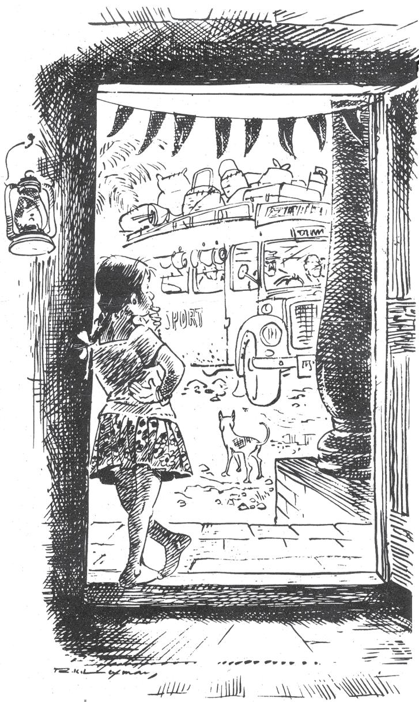

The most fascinating thing of all was the bus that travelled between her village and the nearest town. It passed through her street each hour, once going to the town and once coming back. The sight of the bus, filled each time with a new set of passengers, was a source of unending joy for Valli.

Day after day she watched the bus, and gradually a tiny wish crept into her head and grew there: she wanted to ride on that bus, even if just once. This wish became stronger and stronger, until it was an overwhelming desire. Valli would stare wistfully at the people who got on or off the bus when it stopped at the street corner. Their faces would kindle in her longings, dreams, and hopes. If one of her friends happened to ride the bus and tried to describe the sights of the town to her, Valli would be too jealous to listen and would shout, in English: “Proud! proud!” Neither she nor her friends really understood the meaning of the word, but they used it often as a slang expression of disapproval.

Over many days and months Valli listened carefully to conversations between her neighbours and people who regularly used the bus, and she also asked a few discreet questions here and there. This way she picked up various small details about the bus journey. The town was six miles from her village. The fare was thirty paise one way — “which is almost nothing at all,” she heard one well-dressed man say, but to Valli, who scarcely saw that much money from one month to the next, it seemed a fortune. The trip to the town took forty-five minutes. On reaching town, if she stayed in her seat and paid another thirty paise, she could return home on the same bus. This meant that she could take the one-o’clock afternoon bus, reach the town at one forty-five, and be back home by about two forty-five...

On and on went her thoughts as she calculated and recalculated, planned and replanned.

wistfully longingly

kindle set alight (a fire), here, feelings

a slang expression informal words, often used within a close group

discreet questions careful questions

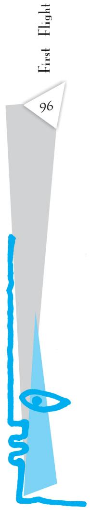

# Oral Comprehension Check

1. What was Valli’s favourite pastime?   
2. What was a source of unending joy for Valli? What was her strongest desire?   
3. What did Valli find out about the bus journey? How did she find out these details?   
4. What do you think Valli was planning to do?

# II

Well, one fine spring day the afternoon bus was just on the point of leaving the village and turning into the main highway when a small voice was heard shouting: “Stop the bus! Stop the bus!” And a tiny hand was raised commandingly.

The bus slowed down to a crawl, and the conductor, sticking his head out the door, said, “Hurry then! Tell whoever it is to come quickly.”

“It’s me,” shouted Valli. “I’m the one who has to get on.”

By now the bus had come to a stop, and the conductor said, “Oh, really! You don’t say so!”

“Yes, I simply have to go to town,” said Valli, still standing outside the bus, “and here’s my money.” She showed him some coins.

“Okay, okay, but first you must get on the bus,” said the conductor, and he stretched out a hand to help her up.

“Never mind,” she said, “I can get on by myself. You don’t have to help me.”

The conductor was a jolly sort, fond of joking. “Oh, please don’t be angry with me, my fine madam,” he said. “Here, have a seat right up there in front. Everybody move aside please — make way for madam.”

It was the slack time of day, and there were only six or seven passengers on the bus. They were all looking at Valli and laughing with the conductor. Valli was overcome with shyness. Avoiding everyone’s eyes, she walked quickly to an empty seat and sat down.

# slack time

a time when there is not much work

“May we start now, madam?” the conductor asked, smiling. Then he blew his whistle twice, and the bus moved forward with a roar.

It was a new bus, its outside painted a gleaming white with some green stripes along the sides. Inside, the overhead bars shone like silver. Directly in front of Valli, above the windshield, there was a beautiful clock. The seats were soft and luxurious.

Valli devoured everything with her eyes. But when she started to look outside, she found her view cut off by a canvas blind that covered the lower part of her window. So she stood up on the seat and peered over the blind.

The bus was now going along the bank of a canal. The road was very narrow. On one side there was the canal and, beyond it, palm trees, grassland, distant mountains, and the blue, blue sky. On the other side was a deep ditch and then acres and acres of green fields — green, green, green, as far as the eye could see.

Oh, it was all so wonderful!

Suddenly she was startled by a voice. “Listen, child,” said the voice, “you shouldn’t stand like that. Sit down.”

Sitting down, she looked to see who had spoken. It was an elderly man who had honestly been concerned for her, but she was annoyed by his attention.

“There’s nobody here who’s a child,” she said haughtily. “I’ve paid my thirty paise like everyone else.”

The conductor chimed in. “Oh, sir, but this is a very grown-up madam. Do you think a mere girl could pay her own fare and travel to the city all alone?”

Valli shot an angry glance at the conductor and said, “I am not a madam. Please remember that. And you’ve not yet given me my ticket.”

“I’ll remember,” the conductor said, mimicking her tone. Everyone laughed, and gradually Valli too joined in the laughter.

The conductor punched a ticket and handed it to her. “Just sit back and make yourself comfortable. Why should you stand when you’ve paid for a seat?”

“Because I want to,” she answered, standing up again.

“But if you stand on the seat, you may fall and hurt yourself when the bus makes a sharp turn or hits a bump. That’s why we want you to sit down, child.”

“I’m not a child, I tell you,” she said irritably. “I’m eight years old.”

“Of course, of course. How stupid of me! Eight years — my!”

The bus stopped, some new passengers got on, and the conductor got busy for a time. Afraid of losing her seat, Valli finally sat down.

An elderly woman came and sat beside her. “Are you all alone, dear?” she asked Valli as the bus started again.

Valli found the woman absolutely repulsive — such big holes she had in her ear lobes, and such ugly earrings in them! And she could smell the betel nut the woman was chewing and see the betel juice that was threatening to spill over her lips at any moment.

haughtily proudly

mimicking copying

repulsive causing strong dislike

Ugh! — who could be sociable with such a person?

“Yes, I’m travelling alone,” she answered curtly. “And I’ve got a ticket too.”

“Yes, she’s on her way to town,” said the conductor. “With a thirty-paise ticket.”

“Oh, why don’t you mind your own business,” said Valli. But she laughed all the same, and the conductor laughed too.

But the old woman went on with her drivel. “Is it proper for such a young person to travel alone? Do you know exactly where you’re going in town? What’s the street? What’s the house number?”

“You needn’t bother about me. I can take care of myself,” Valli said, turning her face towards the window and staring out.

curtly

showing displeasure

drivel

silly nonsense

# Oral Comprehension Check

1. Why does the conductor call Valli ‘madam’?   
2. Why does Valli stand up on the seat? What does she see now?   
3. What does Valli tell the elderly man when he calls her a child?   
4. Why didn’t Valli want to make friends with the elderly woman?

# III

Her first journey — what careful, painstaking, elaborate plans she had had to make for it! She had thriftily saved whatever stray coins came her way, resisting every temptation to buy peppermints, toys, balloons, and the like, and finally she had saved a total of sixty paise. How difficult it had been, particularly that day at the village fair, but she had resolutely stifled a strong desire to ride the merrygo-round, even though she had the money.

After she had enough money saved, her next problem was how to slip out of the house without her mother’s knowledge. But she managed this without too much difficulty. Every day after lunch her mother would nap from about one to four or so. Valli always used these hours for her ‘excursions’ as she stood looking from the doorway of her house

thriftily

spend money

carefully

resolutely stifled

suppressed/

controlled with

determination

or sometimes even ventured out into the village; today, these same hours could be used for her first excursion outside the village.

The bus rolled on now cutting across a bare landscape, now rushing through a tiny hamlet or past an odd wayside shop. Sometimes the bus seemed on the point of gobbling up another vehicle that was coming towards them or a pedestrian crossing the road. But lo! somehow it passed on smoothly, leaving all obstacles safely behind. Trees came running towards them but then stopped as the bus reached them and simply stood there helpless for a moment by the side of the road before rushing away in the other direction.

Suddenly Valli clapped her hands with glee. A young cow, tail high in the air, was running very fast, right in the middle of the road, right in front of the bus. The bus slowed to a crawl, and the driver sounded his horn loudly again and again. But the more he honked, the more frightened the animal became and the faster it galloped — always right in front of the bus.

ventured out went cautiously, courageously

Somehow this was very funny to Valli. She laughed and laughed until there were tears in her eyes.

“Hey, lady, haven’t you laughed enough?” called, the conductor. “Better save some for tomorrow.”

At last the cow moved off the road. And soon the bus came to a railroad crossing. A speck of a train could be seen in the distance, growing bigger and bigger as it drew near. Then it rushed past the crossing gate with a tremendous roar and rattle, shaking the bus. Then the bus went on and passed the train station. From there it traversed a busy, well-laid-out shopping street and, turning, entered a wider thoroughfare. Such big, bright-looking shops! What glittering displays of clothes and other merchandise! Such big crowds!

Struck dumb with wonder, Valli gaped at everything.

Then the bus stopped and everyone got off except Valli.

“Hey, lady,” said the conductor, “aren’t you ready to get off? This is as far as your thirty paise takes you.”

“No,” Valli said, “I’m going back on this same bus.” She took another thirty paise from her pocket and handed the coins to the conductor.

“Why, is something the matter?”

“No, nothing’s the matter. I just felt like having a bus ride, that’s all.”

“Don’t you want to have a look at the sights, now that you’re here?”

“All by myself? Oh, I’d be much too afraid.”

Greatly amused by the girl’s way of speaking, the conductor said, “But you weren’t afraid to come in the bus.”

“Nothing to be afraid of about that,” she answered.

“Well, then, why not go to that stall over there and have something to drink? Nothing to be afraid of about that either."

“Oh, no, I couldn’t do that.”

“Well, then, let me bring you a cold drink.”

thoroughfare a busy public road merchandise things for sale

“No, I don’t have enough money. Just give me my ticket, that’s all.”

“It’ll be my treat and not cost you anything.”

“No, no,” she said firmly, “please, no.”

The conductor shrugged, and they waited until it was time for the bus to begin the return journey. Again there weren’t many passengers.

# Oral Comprehension Check

1. How did Valli save up money for her first journey? Was it easy for her?   
2. What did Valli see on her way that made her laugh?   
3. Why didn’t she get off the bus at the bus station?   
4. Why didn’t Valli want to go to the stall and have a drink? What does this tell you about her?

# I V

“Won’t your mother be looking for you?” the conductor asked when he gave the girl her ticket.

“No, no one will be looking for me,” she said.

The bus started, and again there were the same wonderful sights.

Valli wasn’t bored in the slightest and greeted everything with the same excitement she’d felt the first time. But suddenly she saw a young cow lying dead by the roadside, just where it had been struck by some fast-moving vehicle.

“Isn’t that the same cow that ran in front of the bus on our trip to town?” she asked the conductor.

The conductor nodded, and she was overcome with sadness. What had been a lovable, beautiful creature just a little while ago had now suddenly lost its charm and its life and looked so horrible, so frightening as it lay there, legs spreadeagled, a fixed stare in its lifeless eyes, blood all over...

The bus moved on. The memory of the dead cow haunted her, dampening her enthusiasm. She no longer wanted to look out the window.

She sat thus, glued to her seat, until the bus reached her village at three forty. She stood up

spreadeagled spread out

haunted returned repeatedly to her mind; was impossible to forget

and stretched herself. Then she turned to the conductor and said, “Well, sir, 1 hope to see you again.”

“Okay, madam,” he answered her, smiling. “Whenever you feel like a bus ride, come and join us. And don’t forget to bring your fare.”

She laughed and jumped down from the bus. Then away she went, running straight for home.

When she entered her house she found her mother awake and talking to one of Valli’s aunts, the one from South Street. This aunt was a real chatterbox, never closing her mouth once she started talking.

“And where have you been?” said her aunt when Valli came in. She spoke very casually, not expecting a reply. So Valli just smiled, and her mother and aunt went on with their conversation.

“Yes, you’re right,” her mother said. “So many things in our midst and in the world outside. How can we possibly know about everything? And even when we do know about something, we often can’t understand it completely, can we?”

“Oh, yes!” breathed Valli.

“What?” asked her mother. “What’s that you say?”

“Oh,” said Valli, “I was just agreeing with what you said about things happening without our knowledge.”

“Just a chit of a girl, she is,” said her aunt, “and yet look how she pokes her nose into our conversation, just as though she were a grown lady.”

Valli smiled to herself. She didn’t want them to understand her smile. But, then, there wasn’t much chance of that, was there?

pokes her nose

takes an interest in something that doesn't concern her

[Translated from the Tamil

by K. S. Sundaram

Illustrated by R. K. Laxman]

# Thinking about the Text

1. What was Valli’s deepest desire? Find the words and phrases in the story that tell you this.   
2. How did Valli plan her bus ride? What did she find out about the bus, and how did she save up the fare?   
3. What kind of a person is Valli? To answer this question, pick out the following sentences from the text and fill in the blanks. The words you fill in are the clues to your answer.

(i) “Stop the bus! Stop the bus!” And a tiny hand was raised   
(ii) “Yes, I go to town,” said Valli, still standing outside the bus.   
(iii) “There’s nobody here ,” she said haughtily. “I’ve paid my thirty paise like everyone else.”   
(iv) “Never mind,” she said, “I can . You don’t have to help me. ”I’m not a child, I tell you,” she said,   
(v) “You needn’t bother about me. I ,” Valli said, turning her face toward the window and staring out.   
(vi) Then she turned to the conductor and said, “Well, sir, I hope ”

4. Why does the conductor refer to Valli as ‘madam’?   
5. Find the lines in the text which tell you that Valli was enjoying her ride on the bus.   
6. Why does Valli refuse to look out of the window on her way back?   
7. What does Valli mean when she says, “I was just agreeing with what you said about things happening without our knowledge.”   
8. The author describes the things that Valli sees from an eight-year-old’s point of view. Can you find evidence from the text for this statement?

# Speaking

This story has a lot of people talking in it. The conductor jokes and laughs with Valli, some passengers try to show their concern for her, and her mother and her aunt spend time chatting.

Read the conversations carefully. Then think of similar people, or similar situations that you have experienced. Mimic a person or persons who spoke to you, saying what they said, along with your replies.

# Writing

Write a page — about three paragraphs — on one of the following topics.

1. Have you ever planned something entirely on your own, without taking grown-ups into your confidence? What did you plan, and how? Did you carry out your plan?   
2. Have you made a journey that was unforgettable in some way? What made it memorable?   
3. Are you concerned about traffic and road safety? What are your concerns? How would you make road travel safer and more enjoyable?

# In This Lesson

# WHAT WE HAVE DONE

Related the story of Valli’s first bus ride.

# WHAT YOU CAN DO

The students should be given two or three days to collect old (used) tickets from their friends, relatives and acquaintances: they could be bus tickets, train tickets, plane tickets, cinema tickets, tickets to cultural events, etc. By the time they finish the lesson they should be able to get a good collection in place. Get them to make a collage using as many as possible of the tickets collected, on a sheet of poster paper. This can then form the basis for many interesting activities: classification according to type of tickets (for what?) or price (how much?), etc; the most desirable tickets, the tickets no one wants, etc. — let students think of more ways to classify them. Get students to write a paragraph with the collage as base, and their imagination as guide.   
2. You can also ask the students do the following.

(i) In the story Valli has to save money and make plans to be able to ride the bus. In pairs, discuss how you spent your pocket money last month. Did you spend it on yourself, or on someone dear to you?   
(ii) Valli's enthusiasm is dampened and the memory of the dead cow haunts her. In groups, discuss an incident which may have troubled or discouraged you.

# The Tale of Custard the Dragon

This poem is written in the style of a ballad — a song or poem that tells a story. You must be familiar with ballads that narrate tales of courage or heroism. This poem is a humorous ballad close to a parody.

Read it aloud, paying attention to the rhythm.

Belinda lived in a little white house,

With a little black kitten and a little grey mouse,

And a little yellow dog and a little red wagon,

And a realio, trulio, little pet dragon.

Now the name of the little black kitten was Ink,

And the little grey mouse, she called him Blink,

And the little yellow dog was sharp as Mustard,

But the dragon was a coward, and she called him Custard.

Custard the dragon had big sharp teeth,

And spikes on top of him and scales underneath,

Mouth like a fireplace, chimney for a nose,

And realio, trulio daggers on his toes.

Belinda was as brave as a barrel full of bears,

And Ink and Blink chased lions down the stairs,

Mustard was as brave as a tiger in a rage,

But Custard cried for a nice safe cage.

Belinda tickled him, she tickled him unmerciful, Ink, Blink and Mustard, they rudely called him Percival, They all sat laughing in the little red wagon At the realio, trulio, cowardly dragon.

Belinda giggled till she shook the house, And Blink said Weeck! which is giggling for a mouse, Ink and Mustard rudely asked his age, When Custard cried for a nice safe cage.

Suddenly, suddenly they heard a nasty sound, And Mustard growled, and they all looked around. Meowch! cried Ink, and ooh! cried Belinda, For there was a pirate, climbing in the winda.

Pistol in his left hand, pistol in his right, And he held in his teeth a cutlass bright, His beard was black, one leg was wood; It was clear that the pirate meant no good.

Belinda paled, and she cried Help! Help! But Mustard fled with a terrified yelp, Ink trickled down to the bottom of the household, And little mouse Blink strategically mouseholed.

But up jumped Custard, snorting like an engine, Clashed his tail like irons in a dungeon, With a clatter and a clank and a jangling squirm, He went at the pirate like a robin at a worm.

The pirate gaped at Belinda’s dragon, And gulped some grog from his pocket flagon, He fired two bullets, but they didn’t hit, And Custard gobbled him, every bit.

Belinda embraced him, Mustard licked him, No one mourned for his pirate victim.

Ink and Blink in glee did gyrate

Around the dragon that ate the pirate.

But presently up spoke little dog Mustard,

I’d have been twice as brave if I hadn’t been flustered.

And up spoke Ink and up spoke Blink,

We’d have been three times as brave, we think,

And Custard said, I quite agree

That everybody is braver than me.

Belinda still lives in her little white house,

With her little black kitten and her little grey mouse,

And her little yellow dog and her little red wagon,

And her realio, trulio little pet dragon.

Belinda is as brave as a barrel full of bears,

And Ink and Blink chase lions down the stairs,

Mustard is as brave as a tiger in a rage,

But Custard keeps crying for a nice safe cage.

OGDEN NASH

Ogden Nash wrote over four hundred pieces of comic verse. The best of his work was published in 14 volumes between 1931 and 1972. His work is perhaps best described in this poetic tribute by Anthony Burgess:

...he brought a new kind of sound to our literary diversions.

And didn’t care much about breaking the poetic laws of the Medes and the Persians.

He uses lines, sometimes of considerable length that are colloquial and prosy.

And at the end presents you with a rhyme...

This bringing together of the informal and the formal is what his genius chiefly loves.

I am trying to imitate him here, but he is probably quite inimitable.

# Glossary

grog: a drink typically drunk by sailors

gyrate: to move around in circles

# Thinking about the Poem

1. Who are the characters in this poem? List them with their pet names.   
2. Why did Custard cry for a nice safe cage? Why is the dragon called “cowardly dragon”?   
3. “Belinda tickled him, she tickled him unmerciful...” Why?   
4. The poet has employed many poetic devices in the poem. For example: “Clashed his tail like iron in a dungeon” — the poetic device here is a simile. Can you, with your partner, list some more such poetic devices used in the poem?   
5. Read stanza three again to know how the poet describes the appearance of the dragon.   
6. Can you find out the rhyme scheme of two or three stanzas of the poem?   
7. Writers use words to give us a picture or image without actually saying what they mean. Can you trace some images used in the poem?   
8. Do you find The Tale of Custard the Dragon to be a serious or a light-hearted poem? Give reasons to support your answer.   
9. This poem, in ballad form, tells a story. Have you come across any such modern song or lyric that tells a story? If you know one, tell it to the class. Collect such songs as a project.

# Writing

Have fun writing your ballad. Gather information (choose/decide an idea/theme), organise your materials under characters and story and then write. Revise and edit your ballad to make it entertaining. Use the following guidelines to write your ballad.

• Purpose of writing the ballad: to entertain and interest   
To whom I am writing: decide for whom you are writing   
How should I structure features?:

– Tell a simple narrative   
– A few major characters   
– A strong rhythm and rhyme   
– May have a refrain (single or two line(s) repeated often)   
– Divide into verses

# BEFORE YOU READ

# Activity

Use a dictionary or ask for your teacher’s help as you discuss the following questions in groups.

1. What is a sermon? Is it different from a lecture or a talk? Can this word also be used in a negative way or as a joke (as in “my mother’s sermon about getting my work done on time…”)?   
2. Find out the meanings of the words and phrases given in the box.

afflicted with be composed desolation lamentation procure be subject to

3. Have you heard of the Sermon on the Mount? Who delivered it? Who do you think delivered a sermon at Benares?

GAUTAMA Buddha (563 B.C. – 483 B.C.) began life as a prince named Siddhartha Gautama, in northern India. At twelve, he was sent away for schooling in the Hindu sacred scriptures and four years later he returned home to marry a princess. They had a son and lived for ten years as befitted royalty. At about the age of twenty-five, the Prince, heretofore shielded from the sufferings of the world, while out hunting chanced upon a sick man, then an aged man, then a funeral procession, and finally a monk begging for alms. These sights so moved him that he at once went out into the world to seek enlightenment concerning the sorrows he had witnessed. He wandered for seven years and finally sat down under a peepal tree, where he vowed to stay

chanced upon came across by chance

enlightenment a state of high spiritual knowledge

until enlightenment came. Enlightened after seven days, he renamed the tree the Bodhi Tree (Tree of Wisdom) and began to teach and to share his new understandings. At that point he became known as the Buddha (the Awakened or the Enlightened). The Buddha preached his first sermon at the city of Benares, most holy of the dipping places on the River Ganges; that sermon has been preserved and is given here. It reflects the Buddha’s wisdom about one inscrutable kind of suffering.

Kisa Gotami had an only son, and he died. In her grief she carried the dead child to all her neighbours, asking them for medicine, and the people said, “She has lost her senses. The boy is dead.”

At length, Kisa Gotami met a man who replied to her request, “I cannot give thee medicine for thy child, but I know a physician who can.”

And the girl said, “Pray tell me, sir; who is it?” And the man replied, "Go to Sakyamuni, the Buddha.”

Kisa Gotami repaired to the Buddha and cried, “Lord and Master, give me the medicine that will cure my boy.”

The Buddha answered, “I want a handful of mustardseed.” And when the girl in her joy promised to procure it, the Buddha added, “The mustard-seed must be taken from a house where no one has lost a child, husband, parent or friend.”

Poor Kisa Gotami now went from house to house, and the people pitied her and said, “Here is mustardseed; take it!” But when she asked, “Did a son or daughter, a father or mother, die in your family?” they answered her, “Alas! the living are few, but the dead are many. Do not remind us of our deepest grief.” And there was no house but some beloved one had died in it.

Kisa Gotami became weary and hopeless, and sat down at the wayside watching the lights of the city, as they flickered up and were extinguished again. At last the darkness of the night reigned everywhere. And she considered the fate of men, that their lives flicker up and are extinguished again. And she thought to herself, “How selfish am I in my grief! Death is common to all; yet in this valley of desolation there is a path that leads him to immortality who has surrendered all selfishness.”

The Buddha said, ‘‘The life of mortals in this world is troubled and brief and combined with pain. For there

sermon

religious or moral talk

dipping places

bathing

inscrutable

something which

cannot be

understood

repaired (a stylistic

use) went to

valley of

desolation

an area which is filled

with deep sorrow

mortals

those bound to die

is not any means by which those that have been born can avoid dying; after reaching old age there is death; of such a nature are living beings. As ripe fruits are early in danger of falling, so mortals when born are always in danger of death. As all earthen vessels made by the potter end in being broken, so is the life of mortals. Both young and adult, both those who are fools and those who are wise, all fall into the power of death; all are subject to death.

“Of those who, overcome by death, depart from life, a father cannot save his son, nor kinsmen their relations. Mark! while relatives are looking on and lamenting deeply, one by one mortals are carried off, like an ox that is led to the slaughter. So the world is afflicted with death and decay, therefore the wise do not grieve, knowing the terms of the world.

“Not from weeping nor from grieving will anyone obtain peace of mind; on the contrary, his pain will be the greater and his body will suffer. He will make himself sick and pale, yet the dead are not saved by his lamentation. He who seeks peace should draw out the arrow of lamentation, and complaint, and grief. He who has drawn out the arrow and has become composed will obtain peace of mind; he who has overcome all sorrow will become free from sorrow, and be blessed.”

[Source: Betty Renshaw

Values and Voices: A College Reader (1975)]

afflicted with

affected by suffering,

disease or pain

lamentation

expression of sorrow

# Thinking about the Text

1. When her son dies, Kisa Gotami goes from house to house. What does she ask for? Does she get it? Why not?   
2. Kisa Gotami again goes from house to house after she speaks with the Buddha. What does she ask for, the second time around? Does she get it? Why not?   
3. What does Kisa Gotami understand the second time that she failed to understand the first time? Was this what the Buddha wanted her to understand?   
4. Why do you think Kisa Gotami understood this only the second time? In what way did the Buddha change her understanding?   
5. How do you usually understand the idea of ‘selfishness’? Do you agree with Kisa Gotami that she was being ‘selfish in her grief ’?

# Thinking about Language

I. This text is written in an old-fashioned style, for it reports an incident more than two millennia old. Look for the following words and phrases in the text, and try to rephrase them in more current language, based on how you understand them.

give thee medicine for thy child   
Pray tell me   
Kisa repaired to the Buddha   
• there was no house but someone had died in it   
kinsmen   
Mark!

II. You know that we can combine sentences using words like and, or, but, yet and then. But sometimes no such word seems appropriate. In such a case we can use a semicolon (;) or a dash (—) to combine two clauses.

She has no interest in music; I doubt she will become a singer like her mother.

The second clause here gives the speaker’s opinion on the first clause.

Here is a sentence from the text that uses semicolons to combine clauses. Break up the sentence into three simple sentences. Can you then say which has a better rhythm when you read it, the single sentence using semicolons, or the three simple sentences?

For there is not any means by which those who have been born can avoid dying; after reaching old age there is death; of such a nature are living beings.

# Speaking

The Buddha’s sermon is over 2500 years old. Given below are two recent texts on the topic of grief. Read the texts, comparing them with each other and with the Buddha’s sermon. Do you think the Buddha’s ideas and way of teaching continue to hold meaning for us? Or have we found better ways to deal with grief? Discuss this in groups or in class.

# I. A Guide to Coping with the Death of a Loved One

Martha is having difficulty sleeping lately and no longer enjoys doing things with her friends. Martha lost her husband of 26 years to cancer a month ago.

Anya, age 17, doesn’t feel like eating and spends the days in her room crying. Her grandmother recently died.

Both of these individuals are experiencing grief. Grief is an emotion natural to all types of loss or significant change.

# Feelings of Grief

Although grief is unique and personal, a broad range of feelings and behaviours are commonly experienced after the death of a loved one.

Sadness. This is the most common, and it is not necessarily manifested by crying.   
Anger. This is one of the most confusing feelings for a survivor. There may be frustration at not being able to prevent the death, and a sense of not being able to exist without the loved one.   
Guilt and Self-reproach. People may believe that they were not kind enough or caring enough to the person who died, or that the person should have seen the doctor sooner.   
• Anxiety. An individual may fear that she/he won’t be able to care for herself/himself.   
Loneliness. There are reminders throughout the day that a partner, family member or friend is gone. For example, meals are no longer prepared the same way, phone calls to share a special moment don’t happen.   
Fatigue. There is an overall sense of feeling tired.   
Disbelief: This occurs particularly if it was a sudden death.

# Helping Others Who Are Experiencing Grief

When a friend, loved one, or co-worker is experiencing grief—how can we help? It helps to understand that grief is expressed through a variety of behaviours.

Reach out to others in their grief, but understand that some may not want to accept help and will not share their grief. Others will want to talk about their thoughts and feelings or reminisce.

Be patient and let the grieving person know that you care and are there to support him or her.

# II. Good Grief

# AMITAI ETZIONI

Soon after my wife died — her car slid off an icy road in 1985 — a school psychologist warned me that my children and I were not mourning in the right way. We felt angry; the proper first stage, he said, is denial.

In late August this year, my 38-year-old son, Michael, died suddenly in his sleep, leaving behind a 2-year-old son and a wife expecting their next child.

There is no set form for grief, and no ‘right’ way to express it. There seems to be an expectation that, after a great loss, we will progress systematically through the well-known stages of grief. It is wrong, we are told, to jump to anger — or to wallow too long in this stage before moving towards acceptance.

But I was, and am, angry. To make parents bury their children is wrong; to have both my wife and son taken from me, for forever and a day, is cruel beyond words.

A relative from Jerusalem, who is a psychiatrist, brought some solace by citing the maxim: ‘We are not to ask why, but what.’ The ‘what’ is that which survivors in grief are bound to do for one another. Following that advice, my family, close friends and I keep busy, calling each other and giving long answers to simple questions like, “How did your day go today?” We try to avoid thinking about either the immediate past or the bereft future. We take turns playing with Max, Michael’s two-year-old son. Friends spend nights with the young widow, and will be among those holding her hand when the baby is born.

Focusing on what we do for one another is the only consolation we can find.

# Writing

Write a page (about three paragraphs) on one of the following topics. You can think about the ideas in the text that are relevant to these topics, and add your own ideas and experiences to them.

1. Teaching someone to understand a new or difficult idea   
2. Helping each other to get over difficult times   
3. Thinking about oneself as unique, or as one among billions of others

# In This Lesson

# WHAT WE HAVE DONE

Narrated the story of the Buddha, and the advice he gave to the grief-stricken woman.

# WHAT YOU CAN DO

1. Read and discuss the following extract from Kahlil Gibran’s The Prophet with the students.

# Joy and Sorrow

Then a woman said, “Speak to us of Joy and Sorrow.”

And he answered:

Your joy is your sorrow unmasked.

And the selfsame well from which your laughter rises was oftentimes filled with your tears.

And how else can it be?

The deeper that sorrow carves into your being, the more joy you can contain.

Is not the cup that holds your wine the very cup that was burned in the potter’s oven?

And is not the lute that soothes your spirit, the very wood that was hollowed out with knives?

When you are joyous, look deep into your heart and you shall find it is only that which has given you sorrow that is giving you joy.

When you are sorrowful look again in your heart, and you shall see that in truth you are weeping for that which has been your delight.

Some of you say, “Joy is greater than sorrow,” and others say, “Nay, sorrow is the greater.”

But I say unto you, they are inseparable.

Together they come, and when one sits alone with you at your board, remember that the other is asleep upon your bed.

2. Help students to read and memorise the following extract from Tagore.

Say not in grief that she is no more

but say in thankfulness that she was.

A death is not the extinguishing of a light,

but the putting out of the

lamp because the dawn has come.

# For Anne Gregory

This poem is a conversation between a young man and a young woman. What are they arguing about?

“Never shall a young man,

Thrown into despair

By those great honey-coloured

Ramparts at your ear,

Love you for yourself alone

And not your yellow hair.”

“But I can get a hair-dye

And set such colour there,

Brown, or black, or carrot,

That young men in despair

May love me for myself alone

And not my yellow hair.”

“I heard an old religious man

But yesternight declare

That he had found a text to prove

That only God, my dear,

Could love you for yourself alone

And not your yellow hair.”

WILLIAM BUTLER YEATS

William Butler Yeats (1865 –1939) was an Irish nationalist. He was educated in London and Dublin, and was interested in folklore and mythology. He won the Nobel Prize for Literature in 1923.

# Glossary

ramparts: the high, wide walls around a castle or fort, for example, the ramparts of the Red Fort

# Thinking about the Poem

1. What does the young man mean by “great honey-coloured /Ramparts at your ear?” Why does he say that young men are “thrown into despair” by them?   
2. What colour is the young woman’s hair? What does she say she can change it to? Why would she want to do so?   
3. Objects have qualities which make them desirable to others. Can you think of some objects (a car, a phone, a dress…) and say what qualities make one object more desirable than another? Imagine you were trying to sell an object: what qualities would you emphasise?   
4. What about people? Do we love others because we like their qualities, whether physical or mental? Or is it possible to love someone “for themselves alone”? Are some people ‘more lovable’ than others? Discuss this question in pairs or in groups, considering points like the following.

(i) a parent or caregiver’s love for a newborn baby, for a mentally or physically challenged child, for a clever child or a prodigy   
(ii) the public’s love for a film star, a sportsperson, a politician, or a social worker   
(iii) your love for a friend, or brother or sister   
(iv) your love for a pet, and the pet’s love for you.

5. You have perhaps concluded that people are not objects to be valued for their qualities or riches rather than for themselves. But elsewhere Yeats asks the question: How can we separate the dancer from the dance? Is it possible to separate ‘the person himself or herself’ from how the person looks, sounds, walks, and so on? Think of how you or a friend or member of your family has changed over the years. Has your relationship also changed? In what way?

# BEFORE YOU READ

# Activity

1. The word ‘proposal’ has several meanings. Can you guess what sort of proposal the play is about?

(i) a suggestion, plan or scheme for doing something   
(ii) an offer for a possible plan or action   
(iii) the act of asking someone’s hand in marriage

# A Russian Wedding

Do you know anything about a Russian marriage ceremony? Read this article about a Russian wedding.

Preparations for a Russian Wedding: A Russian wedding is very simple. The planning only includes arranging for rings, brides’ dress, cars, and a reception. Earlier, the bride’s family paid for the reception, but now-a-days brides’ and grooms’ families usually share expenses. A Russian wedding lasts for two days; some weddings last as long as a week, and the occasion becomes something to remember for years. The necessary part of the wedding ceremony is a wedding procession of several cars. The best friends of the groom/ bride meet before the wedding a few times, make posters, write speeches and organise contests. When the groom arrives to fetch the bride for the registration, he has to fight to get her! Russians usually live in apartments in tall buildings, and the groom has to climb several stairs to reach his bride. But at each landing he must answer a question to be allowed to go up. The bride’s friends ask difficult questions (sometimes about the bride, sometimes just difficult riddles), and the groom must answer with the help of his friends. For example, he may be shown a few photos of baby girls and he must say which one his bride is. If he guesses wrong, he must pay cash to move ahead. After the

marriage registration, the newly-married couple leaves the guests for a tour of the city sights. After two or three hours of the city tour the couple arrives at the reception. The couple sits at a specially arranged table with their family, friends and invited guests. The reception starts with toasts to the couple. A wedding toast is a custom where a close friend or relative of the groom or the bride says a few words to wish the couple, then everyone raises their glass of wine, and drink it up at the same moment. The groom is then asked to kiss the bride. After a few toasts, people start eating and drinking, and generally have fun. After some time, the bride gets ‘stolen’! She disappears, and when the groom starts looking for her, he is asked to pay a fee. Usually it is his friends who ‘steal’ the bride. Then there are the bride’s friends — they steal the bride’s shoe. The groom must pay money for the shoe too. The guests enjoy watching these tussles, and continue partying.

2. Do you think Indian and Russian weddings have any customs in common? With the help of a partner, fill in the table below.

Wedding Ceremonies in Russia and India   

<table><tr><td>Customs similar to Indian ones</td><td>Customs different from Indian ones</td></tr><tr><td></td><td></td></tr><tr><td></td><td></td></tr><tr><td></td><td></td></tr><tr><td></td><td></td></tr><tr><td></td><td></td></tr></table>

‘‘The Proposal’’ (originally titled ‘‘A Marriage Proposal’’) is a oneact play, a farce, by the Russian short story writer and dramatist Anton Chekhov. It was written in 1888–89.

The play is about the tendency of wealthy families to seek ties with other wealthy families, to increase their estates by encouraging marriages that make good economic sense. Ivan Lomov, a long time wealthy neighbour of Stepan Chubukov, also wealthy, comes to seek the hand of Chubukov’s twenty-five-year-old daughter, Natalya. All three are quarrelsome people, and they quarrel over petty issues. The proposal is in danger of being forgotten amidst all this quarrelling. But economic good sense ensures that the proposal is made, after all — although the quarrelling perhaps continues!

# Characters

STEPAN STEPANOVITCH CHUBUKOV : a landowner

NATALYA STEPANOVNA : his daughter, twenty-five years old

IVAN VASSILEVITCH LOMOV : a neighbour of Chubukov, a large and hearty, but very suspicious, landowner

A drawing-room in Chubukov‘s house.

Lomov enters, wearing a dress-jacket and white gloves. Chubukov rises to meet him.

CHUBUKOV : My dear fellow, whom do I see! Ivan Vassilevitch! I am extremely glad! [Squeezes his hand] Now this is a surprise, my darling... How are you?

LOMOV : Thank you. And how may you be getting on?

CHUBUKOV : We just get along somehow, my angel, thanks to your prayers, and so on. Sit down, please do... Now, you know, you shouldn’t forget all about your neighbours, my darling. My dear fellow, why are you so formal in your get-up! Evening dress, gloves, and so on. Can you be going anywhere, my treasure?

LOMOV : No. I’ve come only to see you, honoured Stepan Stepanovitch.

CHUBUKOV : Then why are you in evening dress, my precious? As if you’re paying a New Year’s Eve visit!

LOMOV : Well, you see, it’s like this. [Takes his arm] I’ve come to you, honoured Stepan Stepanovitch, to trouble you with a request. Not once or twice have I already had the privilege of applying to you for help, and you have always, so to speak... I must ask your pardon, I am getting excited. I shall drink some water, honoured Stepan Stepanovitch. [Drinks.]

CHUBUKOV : [aside] He’s come to borrow money. Shan’t give him any! [aloud] What is it, my beauty?

LOMOV : You see, Honoured Stepanitch... I beg pardon Stepan Honouritch... I mean, I’m awfully excited, as you will please notice... In short, you alone can help me, though I don’t deserve it, of course... and haven’t any right to count on your assistance...

CHUBUKOV : Oh, don’t go round and round it, darling! Spit it out! Well?

LOMOV : One moment... this very minute. The fact is I’ve come to ask the hand of your daughter, Natalya Stepanovna, in marriage.

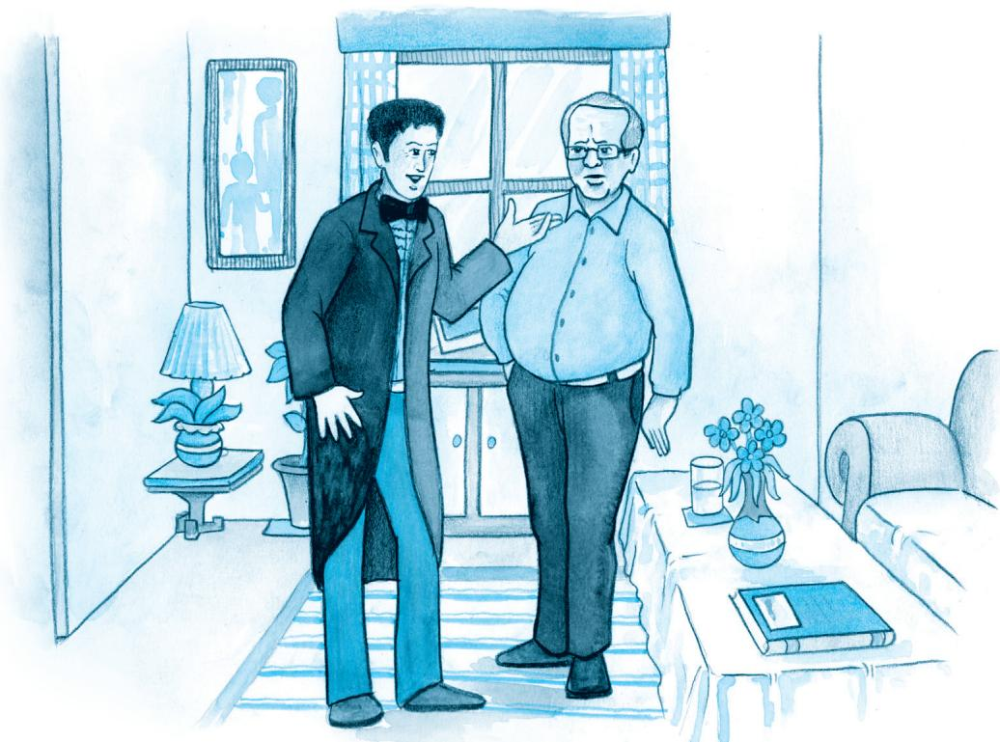

CHUBUKOV : [joyfully] By Jove! Ivan Vassilevitch! Say it again — I didn’t hear it all!

LOMOV : I have the honour to ask...

CHUBUKOV : [interrupting] My dear fellow... I’m so glad, and so on... Yes, indeed, and all that sort of thing. [Embraces and kisses Lomov] I’ve been hoping for it for a long time. It’s been my continual desire. [Sheds a tear] And I’ve always loved you, my angel, as if you were my own son. May God give you both — His help and His love and so on, and so much hope... What am I behaving in this idiotic way for? I’m off my balance with joy, absolutely off my balance! Oh, with all my soul... I’ll go and call Natasha, and all that.

LOMOV : [greatly moved] Honoured Stepan Stepanovitch, do you think I may count on her consent?

CHUBUKOV : Why, of course, my darling, and... as if she won’t consent! She’s in love; egad, she’s like a lovesick cat, and so on. Shan’t be long! [Exit.]

LOMOV : It’s cold... I’m trembling all over, just as if I’d got an examination before me. The great thing is, I must have my mind made up. If I give myself time to think, to hesitate, to talk a lot, to look for an ideal, or for real love, then I’ll never get married. Brr... It’s cold! Natalya

Stepanovna is an excellent housekeeper, not badlooking, well-educated. What more do I want? But I’m getting a noise in my ears from excitement. [Drinks] And it’s impossible for me not to marry. In the first place, I’m already 35 — a critical age, so to speak. In the second place, I ought to lead a quiet and regular life. I suffer from palpitations, I’m excitable and always getting awfully upset; at this very moment my lips are trembling, and there’s a twitch in my right eyebrow. But the very worst of all is the way I sleep. I no sooner get into bed and begin to go off, when suddenly something in my left side gives a pull, and I can feel it in my shoulder and head... I jump up like a lunatic, walk about a bit and lie down again, but as soon as I begin to get off to sleep there’s another pull! And this may happen twenty times... [Natalya Stepanovna comes in.]

NATLYA : Well, there! It’s you, and papa said, “Go; there’s a merchant come for his goods.” How do you do, Ivan Vassilevitch?

LOMOV : How do you do, honoured Natalya Stepanovna?

NATALYA : You must excuse my apron and neglige. We’re shelling peas for drying. Why haven’t you been here for such a long time? Sit down... [They seat themselves.] Won’t you have some lunch?

LOMOV : No, thank you, I’ve had some already.

NATALYA : Then smoke. Here are the matches. The weather is splendid now, but yesterday it was so wet that the workmen didn’t do anything all day. How much hay have you stacked? Just think, I felt greedy and had a whole field cut, and now I’m not at all pleased about it because I’m afraid my hay may rot. I ought to have waited a bit. But what’s this? Why, you’re in evening dress! Well, I never! Are you going to a ball or what? Though I must say you look better... Tell me, why are you got up like that?

LOMOV : [excited] You see, honoured Natalya Stepanovna... the fact is, I’ve made up my mind to ask you to hear me out... Of course you’ll be surprised and perhaps even angry, but a... [aside] It’s awfully cold!

NATALYA : What’s the matter? [pause] Well?

LOMOV : I shall try to be brief. You must know, honoured Natalya Stepanovna, that I have long, since my childhood, in fact,

had the privilege of knowing your family. My late aunt and her husband, from whom, as you know, I inherited my land, always had the greatest respect for your father and your late mother. The Lomovs and the Chubukovs have always had the most friendly, and I might almost say the most affectionate, regard for each other. And, as you know, my land is a near neighbour of yours. You will remember that my Oxen Meadows touch your birchwoods.

NATALYA : Excuse my interrupting you. You say, “my Oxen Meadows”. But are they yours?

LOMOV : Yes, mine.

NATALYA : What are you talking about? Oxen Meadows are ours, not yours!

LOMOV : No, mine, honoured Natalya Stepanovna.

NATALYA : Well, I never knew that before. How do you make that out?

LOMOV : How? I’m speaking of those Oxen Meadows which are wedged in between your birchwoods and the Burnt Marsh.

NATALYA : Yes, yes... they’re ours.

LOMOV : No, you’re mistaken, honoured Natalya Stepanovna, they’re mine.

NATALYA : Just think, Ivan Vassilevitch! How long have they been yours?

LOMOV : How long? As long as I can remember.

NATALYA : Really, you won’t get me to believe that!

LOMOV : But you can see from the documents, honoured Natalya Stepanovna. Oxen Meadows, it’s true, were once the subject of dispute, but now everybody knows that they are mine. There’s nothing to argue about. You see my aunt’s grandmother gave the free use of these Meadows in perpetuity to the peasants of your father’s grandfather, in return for which they were to make bricks for her. The peasants belonging to your father’s grandfather had the free use of the Meadows for forty years, and had got into the habit of regarding them as their own, when it happened that...

NATALYA : No, it isn’t at all like that! Both grandfather and greatgrandfather reckoned that their land extended to Burnt Marsh — which means that Oxen Meadows were ours. I don’t see what there is to argue about. It’s simply silly!

LOMOV : I’ll show you the documents, Natalya Stepanovna!

NATALYA : No, you’re simply joking, or making fun of me. What a surprise! We’ve had the land for nearly three hundred years, and then we’re suddenly told that it isn’t ours! Ivan Vassilevitch, I can hardly believe my own ears. These Meadows aren’t worth much to me. They only come to five dessiatins, and are worth perhaps 300 roubles, but I can’t stand unfairness. Say what you will, I can’t stand unfairness.

LOMOV : Hear me out, I implore you! The peasants of your father’s grandfather, as I have already had the honour of explaining to you, used to bake bricks for my aunt’s grandmother. Now my aunt’s grandmother, wishing to make them a pleasant...

NATALYA : I can’t make head or tail of all this about aunts and grandfathers and grandmothers. The Meadows are ours, that’s all.

LOMOV : Mine.

NATALYA : Ours! You can go on proving it for two days on end, you can go and put on fifteen dress jackets, but I tell you they’re ours, ours, ours! I don’t want anything of yours and I don’t want to give anything of mine. So there!

LOMOV : Natalya Stepanovna, I don’t want the Meadows, but I am acting on principle. If you like, I’ll make you a present of them.

NATALYA : I can make you a present of them myself, because they’re mine! Your behaviour, Ivan Vassilevitch, is strange, to say the least! Up to this we have always thought of you as a good neighbour, a friend; last year we lent you our threshing-machine, although on that account we had to put off our own threshing till November, but you behave to us as if we were gypsies. Giving me my own land, indeed! No, really, that’s not at all neighbourly! In my opinion, it’s even impudent, if you want to know.

LOMOV : Then you make out that I’m a landgrabber? Madam, never in my life have I grabbed anybody else’s land and I shan’t allow anybody to accuse me of having done so. [Quickly steps to the carafe and drinks more water] Oxen Meadows are mine!

NATALYA : It’s not true, they’re ours!

LOMOV : Mine!

NATALYA : It’s not true! I’ll prove it! I’ll send my mowers out to the Meadows this very day!

LOMOV : What?

NATALYA : My mowers will be there this very day!

LOMOV : I’ll give it to them in the neck!

NATALYA : You dare!

LOMOV : [Clutches at his heart] Oxen Meadows are mine! You understand? Mine!

NATALYA : Please don’t shout! You can shout yourself hoarse in your own house but here I must ask you to restrain yourself!

LOMOV : If it wasn’t, madam, for this awful, excruciating palpitation, if my whole inside wasn’t upset, I’d talk to you in a different way! [Yells] Oxen Meadows are mine!

NATALYA : Ours!

LOMOV : Mine!

NATALYA : Ours!

LOMOV : Mine!

[Enter Chubukov]

CHUBUKOV : What’s the matter? What are you shouting for?

NATALYA : Papa, please tell this gentleman who owns Oxen Meadows, we or he?

CHUBUKOV : [to Lomov] Darling, the Meadows are ours!

LOMOV : But, please, Stepan Stepanovitch, how can they be yours? Do be a reasonable man! My aunt’s grandmother gave the Meadows for the temporary and free use of your grandfather’s peasants. The peasants used the land for forty years and got accustomed to it as if it was their own, when it happened that...

CHUBUKOV : Excuse me, my precious. You forget just this, that the peasants didn’t pay your grandmother and all that, because the Meadows were in dispute, and so on. And now everybody knows that they’re ours. It means that you haven’t seen the plan.

LOMOV : I’ll prove to you that they’re mine!

CHUBUKOV : You won’t prove it, my darling —

LOMOV : I shall

CHUBUKOV : Dear one, why yell like that? You won’t prove anything just by yelling. I don’t want anything of yours, and don’t intend to give up what I have. Why should I? And you know, my beloved, that if you propose to go on arguing about it, I’d much sooner give up the Meadows to the peasants than to you. There!

LOMOV : I don’t understand! How have you the right to give away somebody else’s property?

CHUBUKOV : You may take it that I know whether I have the right or not. Because, young man, I’m not used to being spoken to in that tone of voice, and so on. I, young man, am twice your age, and ask you to speak to me without agitating yourself, and all that.

LOMOV : No, you just think I’m a fool and want to have me on! You call my land yours, and then you want me to talk to you calmly and politely! Good neighbours don’t behave like that, Stepan Stepanovitch! You’re not a neighbour, you’re a grabber!

CHUBUKOV : What’s that? What did you say?

NATALYA : Papa, send the mowers out to the Meadows at once!

CHUBUKOV : What did you say, sir?

NATALYA : Oxen Meadows are ours, and I shan’t give them up, shan’t give them up, shan’t give them up!

LOMOV : We’ll see! I’ll have the matter taken to court, and then I’ll show you!

CHUBUKOV : To court? You can take it to court, and all that! You can! I know you; you’re just on the look-out for a chance to go

to court, and all that. You pettifogger! All your people were like that! All of them!

LOMOV : Never mind about my people! The Lomovs have all been honourable people, and not one has ever been tried for embezzlement, like your grandfather!

CHUBUKOV : You Lomovs have had lunacy in your family, all of you! NATALYA : All, all, all!

CHUBUKOV : Your grandfather was a drunkard, and your younger aunt, Nastasya Mihailovna, ran away with an architect, and so on...

LOMOV : And your mother was hump-backed. [Clutches at his heart] Something pulling in my side... My head.... Help! Water!

CHUBUKOV : Your father was a guzzling gambler!

NATALYA : And there haven’t been many backbiters to equal your aunt!

CHUBUKOV : My left foot has gone to sleep... You’re an intriguer....Oh, my heart! And it’s an open secret that before the last elections you bri... I can see stars... Where’s my hat?

NATALYA : It’s low! It’s dishonest! It’s mean!

CHUBUKOV : And you’re just a malicious, doublefaced intriguer! Yes!

LOMOV : Here’s my hat. My heart! Which way? Where’s the door? Oh I think I’m dying! My foot’s quite numb... [Goes to the door.]

CHUBUKOV : [following him] And don’t set foot in my house again!

NATALYA : Take it to court! We’ll see! [Lomov staggers out.]

CHUBUKOV : Devil take him! [Walks about in excitement.]

NATALYA : What a rascal! What trust can one have in one’s neighbours after that!

CHUBUKOV : The villain! The scarecrow!

NATALYA : The monster! First he takes our land and then he has the impudence to abuse us.

CHUBUKOV : And that blind hen, yes, that turnip-ghost has the confounded cheek to make a proposal, and so on! What? A proposal!

NATALYA : What proposal?

CHUBUKOV : Why, he came here to propose to you.

NATALYA : To propose? To me? Why didn’t you tell me so before?

CHUBUKOV : So he dresses up in evening clothes. The stuffed sausage! The wizen-faced frump!

NATALYA : To propose to me? Ah! [Falls into an easy-chair and wails] Bring him back! Back! Ah! Bring him here.

CHUBUKOV : Bring whom here?

NATALYA : Quick, quick! I’m ill! Fetch him! [Hysterics.]

CHUBUKOV : What’s that? What’s the matter with you? [Clutches at his head] Oh, unhappy man that I am! I’ll shoot myself! I’ll hang myself! We’ve done for her!

NATALYA : I’m dying! Fetch him!

CHUBUKOV : Tfoo! At once. Don’t yell! [Runs out. A pause.]

NATALYA : [Natalya Stepanovna wails.] What have they done to me? Fetch him back! Fetch him! [A pause. Chubukov runs in.]

CHUBUKOV : He’s coming, and so on, devil take him! Ouf! Talk to him yourself; I don’t want to...

NATALYA : [wails] Fetch him!

CHUBUKOV : [yells] He’s coming, I tell you. Oh, what a burden, Lord, to be the father of a grown-up daughter! I’ll cut my throat I will, indeed! We cursed him, abused him, drove him out; and it’s all you... you!

NATALYA : No, it was you!

CHUBUKOV : I tell you it’s not my fault. [Lomov appears at the door] Now you talk to him yourself. [Exit.]

LOMOV : [Lomov enters, exhausted.] My heart’s palpitating awfully. My foot’s gone to sleep. There’s something that keeps pulling in my side....

NATALYA : Forgive us, Ivan Vassilevitch, we were all a little heated. I remember now: Oxen Meadows... really are yours.

LOMOV : My heart’s beating awfully. My Meadows... My eyebrows are both twitching....

NATALYA : The Meadows are yours, yes, yours. Do sit down. [They sit] We were wrong.

LOMOV : I did it on principle. My land is worth little to me, but the principle...

NATALYA : Yes, the principle, just so. Now let’s talk of something else.

LOMOV : The more so as I have evidence. My aunt’s grandmother gave the land to your father’s grandfather’s peasants...

NATALYA : Yes, yes, let that pass. [aside] I wish I knew how to get him started. [aloud] Are you going to start shooting soon?

LOMOV : I’m thinking of having a go at the blackcock, honoured Natalya Stepanovna, after the harvest. Oh, have you heard? Just think, what a misfortune I’ve had! My dog Guess, who you know, has gone lame.   
NATALYA : What a pity! Why?   
LOMOV : I don’t know. Must have got his leg twisted or bitten by some other dog. [sighs] My very best dog, to say nothing of the expense. I gave Mironov 125 roubles for him.   
NATALYA : It was too much, Ivan Vassilevitch.   
LOMOV : I think it was very cheap. He’s a first-rate dog.   
NATALYA : Papa gave 85 roubles for his Squeezer, and Squeezer is heaps better than Guess!   
LOMOV : Squeezer better than Guess? What an idea! [laughs] Squeezer better than Guess!   
NATALYA : Of course he’s better! Of course, Squeezer is young, he may develop a bit, but on points and pedigree he’s better than anything that even Volchanetsky has got.   
LOMOV : Excuse me, Natalya Stepanovna, but you forget that he is overshot, and an overshot always means the dog is a bad hunter!   
NATALYA : Overshot, is he? The first time I hear it!   
LOMOV : I assure you that his lower jaw is shorter than the upper.   
NATALYA : Have you measured?   
LOMOV : Yes. He’s all right at following, of course, but if you want to get hold of anything...   
NATALYA : In the first place, our Squeezer is a thoroughbred animal, the son of Harness and Chisels while there’s no getting at the pedigree of your dog at all. He’s old and as ugly as a worn-out cab-horse.   
LOMOV : He is old, but I wouldn’t take five Squeezers for him. Why, how can you? Guess is a dog; as for Squeezer, well, it’s too funny to argue. Anybody you like has a dog as good as Squeezer... you may find them under every bush almost. Twenty-five roubles would be a handsome price to pay for him.   
NATALYA : There’s some demon of contradition in you today, Ivan Vassilevitch. First you pretend that the Meadows are yours; now, that Guess is better than Squeezer. I don’t like people who don’t say what they mean, because you know perfectly well that Squeezer is a hundred times better than your silly Guess. Why do you want to say he isn’t?

LOMOV : I see, Natalya Stepanovna, that you consider me either blind or a fool. You must realise that Squeezer is overshot!

NATALYA : It’s not true.

LOMOV : He is!

NATALYA : It’s not true!

LOMOV : Why shout madam?

NATALYA : Why talk rot? It’s awful! It’s time your Guess was shot, and you compare him with Squeezer!

LOMOV : Excuse me, I cannot continue this discussion, my heart is palpitating.

NATALYA : I’ve noticed that those hunters argue most who know least.

LOMOV : Madam, please be silent. My heart is going to pieces. [shouts] Shut up!

NATALYA : I shan’t shut up until you acknowledge that Squeezer is a hundred times better than your Guess!

LOMOV : A hundred times worse! Be hanged to your Squeezer! His head... eyes... shoulder...

NATALYA : There’s no need to hang your silly Guess; he’s half-dead already!

LOMOV : [weeps] Shut up! My heart’s bursting!

NATALYA : I shan’t shut up. [Enter Chubukov.]

CHUBUKOV : What’s the matter now?

NATALYA : Papa, tell us truly, which is the better dog, our Squeezer or his Guess.

LOMOV : Stepan Stepanovitch, I implore you to tell me just one thing: is your Squeezer overshot or not? Yes or no?

CHUBUKOV : And suppose he is? What does it matter? He’s the best dog in the district for all that, and so on.

LOMOV : But isn’t my Guess better? Really, now?

CHUBUKOV : Don’t excite yourself, my precious one. Allow me. Your Guess certainly has his good points. He’s purebred, firm on his feet, has well-sprung ribs, and all that. But, my dear man, if you want to know the truth, that dog has two defects: he’s old and he’s short in the muzzle.

LOMOV : Excuse me, my heart... Let’s take the facts. You will remember that on the Marusinsky hunt my Guess ran neck-and-neck with the Count’s dog, while your Squeezer was left a whole verst behind.

CHUBUKOV : He got left behind because the Count’s whipper-in hit him with his whip.

LOMOV : And with good reason. The dogs are running after a fox, when Squeezer goes and starts worrying a sheep!

CHUBUKOV : It’s not true! My dear fellow, I’m very liable to lose my temper, and so, just because of that, let’s stop arguing. You started because everybody is always jealous of everybody else’s dogs. Yes, we’re all like that! You too, sir, aren’t blameless! You no sooner begin with this, that and the other, and all that... I remember everything!

LOMOV : I remember too!

CHUBUKOV : [teasing him] I remember, too! What do you remember?

LOMOV : My heart... my foot’s gone to sleep. I can’t...

NATALYA : [teasing] My heart! What sort of a hunter are you? You ought to go and lie on the kitchen oven and catch black beetles, not go after foxes! My heart!

CHUBUKOV : Yes really, what sort of a hunter are you, anyway? You ought to sit at home with your palpitations, and not go tracking animals. You could go hunting, but you only go to argue with people and interfere with their dogs and so on. Let’s change the subject in case I lose my temper. You’re not a hunter at all, anyway!

LOMOV : And are you a hunter? You only go hunting to get in with the Count and to intrigue. Oh, my heart! You’re an intriguer!

CHUBUKOV : What? I am an intriguer? [shouts] Shut up!

LOMOV : Intriguer!

CHUBUKOV : Boy! Pup!

LOMOV : Old rat! Jesuit!

CHUBUKOV : Shut up or I’ll shoot you like a partridge! You fool!

LOMOV : Everybody knows that — oh, my heart! — your late wife used to beat you... My feet... temples... sparks... I fall, I fall!

CHUBUKOV : And you’re under the slipper of your house-keeper!

LOMOV : There, there, there... my heart’s burst! My shoulders come off! Where is my shoulder? I die. [Falls into an armchair] A doctor!

CHUBUKOV : Boy! Milksop! Fool! I’m sick! [Drinks water] Sick!

NATALYA : What sort of a hunter are you? You can’t even sit on a horse! [To her father] Papa, what’s the matter with him? Papa! Look, Papa! [screams] Ivan Vassilevitch! He’s dead!

CHUBUKOV : I’m sick! I can’t breathe! Air!

NATALYA : He’s dead. [Pulls Lomov’s sleeve] Ivan Vassilevitch! Ivan Vassilevitch! What have you done to me? He’s dead. [Falls into an armchair] A doctor, a doctor! [Hysterics.]

CHUBUKOV : Oh! What is it? What’s the matter?

NATALYA : [wails] He’s dead... dead!

CHUBUKOV : Who’s dead? [Looks at Lomov] So he is! My word! Water! A doctor! [Lifts a tumbler to Lomov’s mouth] Drink this! No, he doesn’t drink. It means he’s dead, and all that. I’m the most unhappy of men! Why don’t I put a bullet into my brain? Why haven’t I cut my throat yet? What am I waiting for? Give me a knife! Give me a pistol! [Lomov moves] He seems to be coming round. Drink some water! That’s right.

LOMOV : I see stars... mist... where am I?

CHUBUKOV : Hurry up and get married and — well, to the devil with you! She’s willing! [He puts Lomov’s hand into his daughter’s] She’s willing and all that. I give you my blessing and so on. Only leave me in peace!

LOMOV : [getting up] Eh? What? To whom?

CHUBUKOV : She’s willing! Well? Kiss and be damned to you!

NATALYA : [wails] He’s alive... Yes, yes, I’m willing.

CHUBUKOV : Kiss each other!

LOMOV : Eh? Kiss whom? [They kiss] Very nice, too. Excuse me, what’s it all about? Oh, now I understand ... my heart... stars... I’m happy. Natalya Stepanovna... [Kisses her hand] My foot’s gone to sleep.

NATALYA : I... I’m happy too...

CHUBUKOV : What a weight off my shoulders, ouf!

NATALYA : But, still you will admit now that Guess is worse than Squeezer.

LOMOV : Better!

NATALYA : Worse!

CHUBUKOV : Well, that’s a way to start your family bliss! Have some champagne!

LOMOV : He’s better!

NATALYA : Worse! Worse! Worse!

CHUBUKOV : [trying to shout her down] Champagne! Champagne!

# CURTAIN

# Thinking about the Play

1. What does Chubukov at first suspect that Lomov has come for? Is he sincere when he later says “And I’ve always loved you, my angel, as if you were my own son”? Find reasons for your answer from the play.   
2. Chubukov says of Natalya: “... as if she won’t consent! She’s in love; egad, she’s like a lovesick cat…” Would you agree? Find reasons for your answer.   
3. (i) Find all the words and expressions in the play that the characters use to speak about each other, and the accusations and insults they hurl at each other. (For example, Lomov in the end calls Chubukov an intriguer; but earlier, Chubukov has himself called Lomov a “malicious, doublefaced intriguer.” Again, Lomov begins by describing Natalya as “an excellent housekeeper, not badlooking, well-educated.”)   
(ii) Then think of five adjectives or adjectival expressions of your own to describe each character in the play.   
(iii) Can you now imagine what these characters will quarrel about next?

# Thinking about Language

I. 1. This play has been translated into English from the Russian original. Are there any expressions or ways of speaking that strike you as more Russian than English? For example, would an adult man be addressed by an older man as my darling or my treasure in an English play?

Read through the play carefully, and find expressions that you think are not used in contemporary English, and contrast these with idiomatic modern English expressions that also occur in the play.

2. Look up the following words in a dictionary and find out how to pronounce them. Pay attention to how many syllables there are in each word, and find out which syllable is stressed, or said more forcefully.

<table><tr><td>palpitations</td><td>interfere</td><td>implore</td><td>thoroughbred</td></tr><tr><td>pedigree</td><td>principle</td><td>evidence</td><td>misfortune</td></tr><tr><td>malicious</td><td>embezzlement</td><td>architect</td><td>neighbours</td></tr><tr><td>accustomed</td><td>temporary</td><td>behaviour</td><td>documents</td></tr></table>

3. Look up the following phrases in a dictionary to find out their meaning, and then use each in a sentence of your own.

(i) You may take it that   
(ii) He seems to be coming round   
(iii) My foot’s gone to sleep

# II. Reported Speech

A sentence in reported speech consists of two parts: a reporting clause, which contains the reporting verb, and the reported clause. Look at the following sentences.

(a) “I went to visit my grandma last week,” said Mamta.   
(b) Mamta said that she had gone to visit her grandma the previous week.

In sentence (a), we have Mamta’s exact words. This is an example of direct speech. In sentence (b), someone is reporting what Mamta said. This is called indirect speech or reported speech. A sentence in reported speech is made up of two parts — a reporting clause and a reported clause.

In sentence (b), Mamta said is the reporting clause containing the reporting verb said. The other clause — that she had gone to visit her grandma last week — is the reported clause.

Notice that in sentence (b) we put the reporting clause first. This is done to show that we are not speaking directly, but reporting someone else’s words. The tense of the verb also changes; past tense (went) becomes past perfect (had gone).

Here are some pairs of sentences in direct and reported speech. Read them carefully, and do the task that follows:

1. (i) LOMOV : Honoured Stepan Stepanovitch, do you think I may count on her consent? (Direct Speech)   
(ii) Lomov asked Stepan Stepanovitch respectfully if he thought he might count on her consent. (Reported Speech)

2. (i) LOMOV : I’m getting a noise in my ears from excitement. (Direct Speech)

(ii) Lomov said that he was getting a noise in his ears from excitement. (Reported Speech)

3. (i) NATALYA : Why haven’t you been here for such a long time? (Direct Speech)   
(ii) Natalya Stepanovna asked why he hadn’t been there for such a long time. (Reported Speech)

4. (i) CHUBUKOV : What’s the matter? (Direct Speech)   
(ii) Chubukov asked him what the matter was. (Reported Speech)

5. (i) NATALYA : My mowers will be there this very day! (Direct Speech)   
(ii) Natalya Stepanovna declared that her mowers would be there that very day. (Reported Speech)

You must have noticed that when we report someone’s exact words, we have to make some changes in the sentence structure. In the following sentences fill in the blanks to list the changes that have occurred in the above pairs of sentences. One has been done for you.

1. To report a question, we use the reporting verb (as in Sentence Set 1).   
2. To report a statement, we use the reporting verb   
3. The adverb of place here changes to .asked   
4. When the verb in direct speech is in the present tense, the verb in reported speech is in the tense (as in Sentence Set 3).   
5. If the verb in direct speech is in the present continuous tense, the verb in reported speech changes to tense. For example, changes to was getting.   
6. When the sentence in direct speech contains a word denoting respect, we add the adverb in the reporting clause (as in Sentence Set 1).   
7. The pronouns I, me, our and mine, which are used in the first person in direct speech, change according to the subject or object of the reporting verb such as or in reported speech.

# III. Here is an excerpt from an article from the Times of India dated 27 August 2006. Rewrite it, changing the sentences in direct speech into reported speech. Leave the other sentences unchanged.

“Why do you want to know my age? If people know I am so old, I won’t get work!” laughs 90-year-old A. K. Hangal, one of Hindi cinema’s most famous character actors. For his age, he is rather energetic. “What’s the secret?” we ask. “My intake of everything is in small quantities. And I walk a lot,” he replies. “I joined the industry when people retire. I was in my 40s. So I don’t miss being called a star. I am still respected and given work, when actors of my age are living in poverty and without work. I don’t have any complaints,” he says, adding, “but yes, I have always been underpaid.” Recipient of the Padma Bhushan, Hangal never hankered after money or materialistic gains. “No doubt I am content today, but money is important. I was a fool not to understand the value of money earlier,” he regrets.

# Speaking and Writing

1. Anger Management: As adults, one important thing to learn is how to manage our temper. Some of us tend to get angry quickly, while others remain calm.

Can you think of three ill effects that result from anger? Note them down. Suggest ways to avoid losing your temper in such situations. Are there any benefits from anger?

2. In pairs, prepare a script based on the given excerpt from The Home and the World by Rabindranath Tagore. You may write five exchanges between the characters with other directions such as movements on stage and way of speaking, etc.

One afternoon, when I happened to be specially busy, word came to my office room that Bimala had sent for me. I was startled.

“Who did you say had sent for me?” I asked the messenger.

“The Rani Mother”.

“The Bara Rani?”

“No, sir, the Chota Rani Mother.”

The Chota Rani! It seemed a century since I had been sent for by her. I kept them all waiting there, and went off into the inner apartments. When I stepped into our room I had another shock of surprise to find Bimala there with a distinct suggestion of being dressed up. The room, which from persistent neglect, had latterly acquired an air of having grown absent-minded, had regained something of its old order this afternoon. I stood there silently, looking enquiringly at Bimala.

She flushed a little and the fingers of her right hand toyed for a time with the bangles on her left arm. Then she abruptly broke the silence. “Look here! Is it right that ours should be the only market in all Bengal which allows foreign goods?”

“What, then, would be the right thing to do?” I asked.

“Order them to be cleared out!”

“But the goods are not mine.”

“Is not the market yours?”

“It is much more theirs who use it for trade.”

“Let them trade in Indian goods, then.”

“Nothing would please me better. But suppose they do not?”

“Nonsense! How dare they be so insolent? Are you not…”

“I am very busy this afternoon and cannot stop to argue it out. But I must refuse to tyrannise.”

“It would not be tyranny for selfish gain, but for the sake of the country.”

“To tyrannise for the country is to tyrannise over the country. But that I am afraid you will never understand.” With this I came away.

3. In groups, discuss the qualities one should look for in a marriage partner. You might consider the following points.

• Personal qualities

– Appearance or looks   
– Attitudes and beliefs   
– Sense of humour

• Value system

– Compassion and kindness   
– Tolerance, ambition   
– Attitude to money and wealth

• Education and professional background

4. Are there parts of the play that remind you of film scenes from romantic comedies? Discuss this in groups, and recount to the rest of the class episodes similar to those in the play.

# WHAT WE HAVE DONE

Given you a play by the famous Russian writer, Anton Chekhov.

# WHAT YOU CAN DO

Dictate the biogrophical information given below. Students should then guess the name of the playwright.

(1564 –1616). He was born at Stratford-on-Avon in April 1564. His father was an important public figure in Stratford. People believe that he received a decent grammar-school education in literature, logic, and Latin (mathematics and natural science did not form part of the curriculum). When he was eighteen, he married Anne Hathaway, who was eight years his senior. He seems to have prospered in the London theatre world. He probably began his career as an actor in London, and he earned enough as author to acquire landed property.

When he was forty-seven, he retired to a large house in Stratford. He died in 1616, leaving behind a body of work that still stands as a pinnacle in world literature.

# Homophones

Can you find the words below that are spelt similarly, and sometimes even pronounced similarly, but have very different meanings? Check their pronunciation and meaning in a dictionary.

. They were too close to the door to close it.   
Since there is no time like the present, she thought it was time to present the present.

# CONSTITUTION OF INDIA

Part III (Articles 12 – 35) (Subject to certain conditions, some exceptions and reasonable restrictions)

guarantees these

# Fundamental Rights

# Right to Equality

 before law and equal protection of laws;   
 irrespective of religion, race, caste, sex or place of birth;   
 of opportunity in public employment;   
 by abolition of untouchability and titles.

# Right to Freedom

 of expression, assembly, association, movement, residence and profession;   
 of certain protections in respect of conviction for offences;   
 of protection of life and personal liberty;   
 of free and compulsory education for children between the age of six and fourteen years;   
 of protection against arrest and detention in certain cases.

# Right against Exploitation

 for prohibition of traffic in human beings and forced labour;   
 for prohibition of employment of children in hazardous jobs.

# Right to Freedom of Religion

 freedom of conscience and free profession, practice and propagation of religion;   
 freedom to manage religious affairs;   
 freedom as to payment of taxes for promotion of any particular religion;   
 freedom as to attendance at religious instruction or religious worship in educational institutions wholly maintained by the State.

# Cultural and Educational Rights

 for protection of interests of minorities to conserve their language, script and culture;   
 for minorities to establish and administer educational institutions of their choice.

# Right to Constitutional Remedies

 by issuance of directions or orders or writs by the Supreme Court and High Courts for enforcement of these Fundamental Rights.

# Suggested Pedagogical Processes

# Learning Outcomes

# The learners may be provided opportunities individually or in groups and encouraged to—

participate in interactive tasks and activities.   
take notes and respond accordingly, making use of appropriate vocabulary, and sense of audience while listening to people around.   
engage themselves in conversation, dialogue, discussion and discourse in peer-peer mode, and with teacher on various themes.   
participate in role play, short speech and skits; interview personalities, common people for the purpose of collecting views on certain relevant issues, during surveys, project works, etc.   
give opinion about classroom transactions, peer feedback with clarity, and provide suggestions for improvement.   
read alternative material such as Braille texts, poems, cartoons, graphic presentations, audio tapes, video tapes, and audio visuals to speak on issues related to society.   
develop familiarity with workplace culture and language and terminology for different vocational skills like carpentry, mobile repairing, tailoring, etc.   
volunteer in organising school functions, assembly, community activities and interactions; prepares schedules, reports, etc.   
read literature from different countries, and appreciate the ideas, issues, and themes given there.   
read texts independently, comprehend, and respond to or ask questions on the text.   
read stories and literary texts — both fiction and non-fiction with understanding for pleasure and enjoyment; discuss on characters,

# The learner—

listens to announcements, instructions, read-aloud texts, audio, videos for information, gist and details; responds by answering questions accordingly.   
listens to and discusses literary / nonliterary inputs in varied contexts to infer, interpret, and appreciate.   
speaks with coherence and cohesion while participating in interactive tasks.   
uses language appropriate to purposes and perspectives.   
talks on key contemporary issues like social justice, environment, gender, etc., in speech and writing.   
participates in bilingual or multilingual discourses on various themes.   
reads, comprehends, and responds to complex texts independently.   
reads stories and literary texts, both fiction and non-fiction, with understanding for pleasure and enjoyment and discusses about these.   
appreciates nuances and shades of literary meanings, talks about literary devices like onomatopoeic sounds, symbols, metaphors, alliterations, comparisons, allusions and the poet’s or the writer’s point of view.   
collects evidences and discusses in groups for reading autobiographies, history and science based literary texts.   
writes paragraphs, narratives, etc., by planning revising, editing, rewriting, and finalising.   
writes reports of functions in school, family, and community activities.   
writes personal, official and business letters, articles, debates, paragraphs based on visual or verbal clues, textual inputs, etc.   
evaluates content presented in print and in different genres/formats

issues, situations; and if there is a problem, work on the solutions.

appreciate nuances and shades of literary meanings in a variety of poems like lyric, ballad, ode, limerick, elegy, etc., and the literary devices like onomatopoeic sounds, symbols, metaphors, alliteration, etc., understand comparisons, allusions, poet’s or writer’s point of view, etc.   
use subject, or contexts, and content related vocabulary to express their understanding of the texts and tasks.   
understand writing is a process-oriented skill which requires drafting, revising, editing for punctuation, grammatical accuracy, spelling, etc.   
understand the grammar in context, functions, and usages noting from examples and discover rules.   
write using symbols, tables, graphs, diagrams, etc.   
contribute in building safe and stress-free environment for learning.   
collect and make use of meaningful resources generated by the learners.   
make use of their experiences and relate with their learning.   
use visual aids, and locally developed learning materials to complement and supplement the textbook and supplementary reader.   
frame questions to assess their comprehension.   
promote core values such as tolerance, appreciation of diversity and civic responsibility through debate, discussion, etc.   
develop critical thinking on issues related to society, family, adolescence, etc. This will lead to develop their abilities for problem-solving, conflict resolution, and work collaboratively.   
use multilingualism and translation as a strategy and resource for understanding and learning and participating in classroom transactions.

and presents content using symbols, graphs, diagrams, etc.

analyses and appreciates a point of view or cultural experience as reflected in the text; presents orally or in writing.   
draws references from books, newspapers, internet, etc., and interprets using analytical skills.   
y	speaks or writes on variety of themes.   
consults or refers to dictionary, periodicals, and books for academic and other purposes; and uses them in speech and writing.   
provides facts and background knowledge in areas such as science and social science and presents view points based on those facts.   
takes down dictation using appropriate punctuation marks and correct spelling of the words dictated.   
takes and makes notes while listening to TV news, discussions, speech, reading aloud or silent reading of texts, etc., and summarises.   
uses grammatical items appropriate to the context in speech and writing.   
uses grammatical items as cues for reading comprehension such as tense, reported speech, conjunctions, and punctuation.   
uses words according to the context and delineate it in speech and writing.   
uses formulaic and idiomatic expressions in speech and writing.   
makes use of collocations and idioms in speech and writing.   
identifies significant literary elements such as figurative language— metaphor, imagery, symbol, simile, intention or point of view, rhyme scheme, etc.   
uses the figurative meaning of words and phrases as given in the texts read.   
assesses one’s own and peers’ work based on developed rubrics.

participate in interdisciplinary tasks, activities and projects.   
connect and apply their learning to activities, routines, and functions at home and in the community.   
maintain diary and journal for recording responses and reflections, develop rubrics with the help of the teacher for self-assessment.   
work on the teacher and peer feedback and self-assessment to improve their performance.   
understand the concept of directions on a given map of a locality, town, city, country, tactile or raised material for children with special needs.   
get familiarised with Sign Language for using with learners with hearing impairment in an inclusive environment in the school.

develops questions for collecting data for survey on relevant issues.   
writes scripts and participates in role play, skit, street plays for the promotion of social issues like Beti Bachao Beti Badhao, Swachh Bharat Abhiyaan, conservation of environment, child labour, drug abuse, and promotion of literacy, etc.   
uses bilingual or multilingual ways to exchange ideas or disseminating information with the help of ICT, PPT, role play, street play, drama, written scripts, etc.   
recognises and appreciates cultural experiences given in the text in a written paragraph, or in narrating the situations and incidents in the class.   
exhibits core values such as tolerance, appreciation of diversity and civic responsibility through debate, discussion, etc.   
learns to use Sign Language to communicate and uses Sign Language with fellow learners with hearing impairment in an inclusive set up.   
reads the poems, stories, texts given in Braille; graphs and maps given in tactile or raised material; interprets, discusses, and writes with the help of a scribe.

# Suggested Pedagogical Processes in an Inclusive Setup

The curriculum of teaching-learning languages is same for all learners in the classroom. Hence, all learners get opportunities to actively participate in the teaching-learning process. There may be some students who have learning difficulties in language, visual-spatial or mixed processing problems. They may require additional teaching support and some adaptations in the curriculum.

There is variability amongst the CWSN and it requires strategies and approaches that will cater to the needs of all learners in an inclusive classroom. The concept of inclusive pedagogy provides a platform for learning and space to children with mental and physical challenges along with other children in the class. This also focuses on working collaboratively in pairs and groups.

By considering the specific requirements of children with special needs, few pedagogical processes for the teachers are suggested below:

Use multiple modes of communication (verbal and nonverbal, graphics, cartoons, speech balloons), pictures, symbols, concrete objects and examples to assist in comprehension would help all children.   
Format (for writing letters, applications, etc.) can be verbally introduced by the teacher.   
New vocabulary introduced may be transcribed in Braille with meanings.   
Describe words like minute, huge, near and far away, sea and sky, small organisms and insects, etc., verbally with detailed information.   
Use audio tapes and storytelling for enhancing pronunciation. Different sounds through audio recordings, such as waterfall, wind, waves, thunder, sounds of animals and means of transport can be used to explain various concepts.   
Encourage all the students in the class to interact with each other and use acting, dramatisation, and role play.   
Prepare visual vocabulary sheet on the topics taught (displaying words with pictures).   
Make visual classroom displays with captions and explanations.   
y	Write footnotes along with examples for comprehension.   
Give repeated exercises on sentence construction so that the child can learn to use words and phrases correctly. Use examples from pictures, news, current events, scrapbook, etc.   
Provide or adapt reading material and resource material at appropriate reading level of the child.   
Illustrate ideas and new vocabulary and make content comprehensible and attractive through the use of cards, colour coding concept maps, hand puppets, use of real life experiences, dramatisation, enacting stories, real objects, and supplementary material.   
y	Make use of paired reading to promote fluency in reading.