# cHAPTER 1
# REAL NUMBERS

### 1.1 Introduction

In Class IX, you began your exploration of the world of real numbers and encountered irrational numbers. We continue our discussion on real numbers in this chapter. We begin with two very important properties of positive integers in Sections 1.2 and 1.3, namely the Euclid’s division algorithm and the Fundamental Theorem of Arithmetic.

Euclid’s division algorithm, as the name suggests, has to do with divisibility of integers. Stated simply, it says any positive integer a can be divided by another positive integer $b$ in such a way that it leaves a remainder r that is smaller than $b$ . Many of you probably recognise this as the usual long division process. Although this result is quite easy to state and understand, it has many applications related to the divisibility properties of integers. We touch upon a few of them, and use it mainly to compute the HCF of two positive integers.

The Fundamental Theorem of Arithmetic, on the other hand, has to do something with multiplication of positive integers. You already know that every composite number can be expressed as a product of primes in a unique way — this important fact is the Fundamental Theorem of Arithmetic. Again, while it is a result that is easy to state and understand, it has some very deep and significant applications in the field of mathematics. We use the Fundamental Theorem of Arithmetic for two main applications. First, we use it to prove the irrationality of many of the numbers you studied in Class IX, such as ${ \sqrt { 2 } } , { \sqrt { 3 } }$ and $\sqrt { 5 }$ . Second, we apply this theorem to explore when exactly the decimal expansion of a rational number, say ${ \frac { p } { q } } ( q \neq 0 )$ , is terminating and when it is non-terminating repeating. We do so by looking at the prime factorisation of the denominator $q$ of $\frac { p } { q }$ . You will see that the prime factorisation of $q$ will completely reveal the nature of the decimal expansion of $\frac { p } { a }$ . q

So let us begin our exploration.

### 1.2 The Fundamental Theorem of Arithmetic

In your earlier classes, you have seen that any natural number can be written as a product of its prime factors. For instance, $2 = 2$ , $4 = 2 \times 2$ , $2 5 3 = 1 1 \times 2 3$ , and so on. Now, let us try and look at natural numbers from the other direction. That is, can any natural number be obtained by multiplying prime numbers? Let us see.

Take any collection of prime numbers, say 2, 3, 7, 11 and 23. If we multiply some or all of these numbers, allowing them to repeat as many times as we wish, we can produce a large collection of positive integers (In fact, infinitely many). Let us list a few :

$$
7 \times 1 1 \times 2 3 = 1 7 7 1 \quad 3 \times 7 \times 1 1 \times 2 3 = 5 3 1 3
$$

$$
2 \times 3 \times 7 \times 1 1 \times 2 3 = 1 0 6 2 6 2 ^ {3} \times 3 \times 7 ^ {3} = 8 2 3 2
$$

$$
2 ^ {2} \times 3 \times 7 \times 1 1 \times 2 3 = 2 1 2 5 2
$$

and so on.

Now, let us suppose your collection of primes includes all the possible primes. What is your guess about the size of this collection? Does it contain only a finite number of integers,

or infinitely many? Infact, there are infinitely many primes. So, if we combine all these primes in all possible ways, we will get an infinite collection of numbers, all the primes and all possible products of primes. The question is – can we produce all the composite numbers this way? What do you think? Do you think that there may be a composite number which is not the product of powers of primes? Before we answer this, let us factorise positive integers, that is, do the opposite of what we have done so far.

We are going to use the factor tree with which you are all familiar. Let us take some large number, say, 32760, and factorise it as shown.

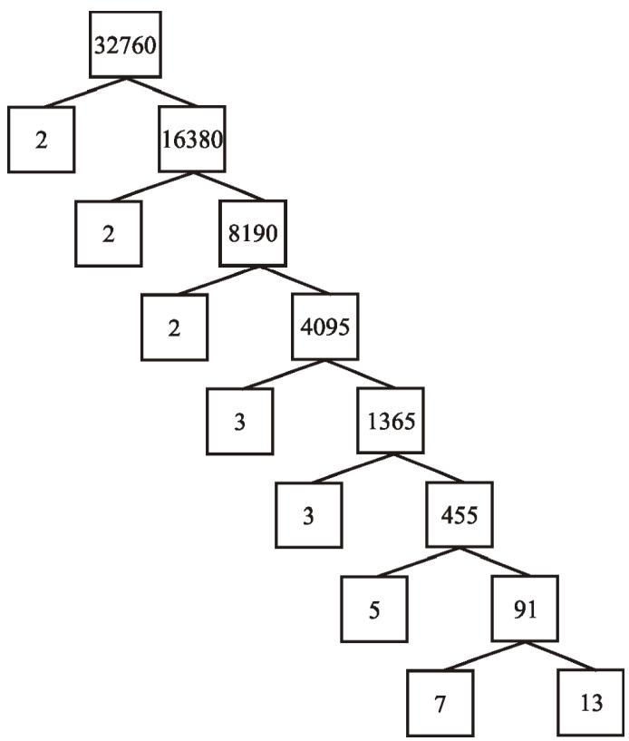

So we have factorised 32760 as $2 \times 2 \times 2 \times 3 \times 3 \times 5 \times 7 \times 1 3$ as a product of primes, i.e., $2 \times 2 \times 2 \times 3 \times 3 \times 5 \times 7 \times 1 3$ as a product of powers of primes. Let us try another number, say, 123 456789. This can be written as $3 ^ { 2 } \times 3 8 0 3 \times 3 6 0 7$ . Of course, you have to check that 3803 and 3607 are primes! (Try it out for several other natural numbers yourself.) This leads us to a conjecture that every composite number can be written as the product of powers of primes. In fact, this statement is true, and is called the Fundamental Theorem of Arithmetic because of its basic crucial importance to the study of integers. Let us now formally state this theorem.

Theorem 1.1 (Fundamental Theorem of Arithmetic) : Every composite number can be expressed (factorised) as a product of primes, and this factorisation is unique, apart from the order in which the prime factors occur.

An equivalent version of Theorem 1.2 was probably first recorded as Proposition 14 of Book IX in Euclid’s Elements, before it came to be known as the Fundamental Theorem of Arithmetic. However, the first correct proof was given by Carl Friedrich Gauss in his Disquisitiones Arithmeticae.

Carl Friedrich Gauss is often referred to as the ‘Prince of Mathematicians’ and is considered one of the three greatest mathematicians of all time, along with Archimedes and Newton. He has made fundamental contributions to both mathematics and science.

  
Carl Friedrich Gauss (1777 – 1855)

The Fundamental Theorem of Arithmetic says that every composite number can be factorised as a product of primes. Actually it says more. It says that given any composite number it can be factorised as a product of prime numbers in a ‘unique’ way, except for the order in which the primes occur. That is, given any composite number there is one and only one way to write it as a product of primes, as long as we are not particular about the order in which the primes occur. So, for example, we regard $2 \times 3 \times 5 \times 7$ as the same as $3 \times 5 \times 7 \times 2$ , or any other possible order in which these primes are written. This fact is also stated in the following form:

The prime factorisation of a natural number is unique, except for the order of its factors.

In general, given a composite number $x$ , we factorise it as $x = p _ { 1 } p _ { 2 } \ldots p _ { n } ,$ where $p _ { 1 } , p _ { 2 } , . . . , p _ { n }$ are primes and written in ascending order, i.e., $p _ { 1 } { \leq } p _ { 2 } { \leq } . . . { \leq } p _ { n } .$ . If we combine the same primes, we will get powers of primes. For example,

$$
3 2 7 6 0 = 2 \times 2 \times 2 \times 3 \times 3 \times 5 \times 7 \times 1 3 = 2 ^ {3} \times 3 ^ {2} \times 5 \times 7 \times 1 3
$$

Once we have decided that the order will be ascending, then the way the number is factorised, is unique.

The Fundamental Theorem of Arithmetic has many applications, both within mathematics and in other fields. Let us look at some examples.

Example 1 : Consider the numbers $4 ^ { n }$ , where $n$ is a natural number. Check whether there is any value of $n$ for which $4 ^ { n }$ ends with the digit zero.

Solution : If the number $4 ^ { n }$ , for any $n$ , were to end with the digit zero, then it would be divisible by 5. That is, the prime factorisation of $4 ^ { n }$ would contain the prime 5. This is not possible because $4 ^ { n } = ( 2 ) ^ { 2 n }$ ; so the only prime in the factorisation of $4 ^ { n }$ is 2. So, the uniqueness of the Fundamental Theorem of Arithmetic guarantees that there are no other primes in the factorisation of $4 ^ { n }$ . So, there is no natural number $n$ for which $4 ^ { n }$ ends with the digit zero.

You have already learnt how to find the HCF and LCM of two positive integers using the Fundamental Theorem of Arithmetic in earlier classes, without realising it! This method is also called the prime factorisation method. Let us recall this method through an example.

Example 2 : Find the LCM and HCF of 6 and 20 by the prime factorisation method.

Solution : We have : $6 = 2 ^ { 1 } \times 3 ^ { 1 }$ and $2 0 = 2 \times 2 \times 5 = 2 ^ { 2 } \times 5 ^ { 1 } .$ .

You can find $\mathrm { H C F } ( 6 , 2 0 ) = 2$ and $\mathrm { L C M } ( 6 , 2 0 ) = 2 \times 2 \times 3 \times 5 = 6 0 .$ , as done in your earlier classes.

Note that $\mathrm { H C F } ( 6 , 2 0 ) = 2 ^ { 1 } = \mathbf { P }$ roduct of the smallest power of each common prime factor in the numbers.

LCM $( 6 , 2 0 ) = 2 ^ { 2 } \times 3 ^ { 1 } \times 5 ^ { 1 } = 1$ Product of the greatest power of each prime factor, involved in the numbers.

From the example above, you might have noticed that $\mathrm { H C F } ( 6 , 2 0 ) \times \mathrm { L C M } ( 6 , 2 0 ) = 6 \times 2 0$ . In fact, we can verify that for any two positive integers a and b, HCF $( a , b ) \times \mathbf { L C M } ( a , b ) =$ $\mathbf { \nabla } \mathbf { \mathbf { \mathit { a } } } \times \mathbf { \mathit { b } }$ . We can use this result to find the LCM of two positive integers, if we have already found the HCF of the two positive integers.

Example 3: Find the HCF of 96 and 404 by the prime factorisation method. Hence, find their LCM.

Solution : The prime factorisation of 96 and 404 gives :

$$
9 6 = 2 ^ {5} \times 3, 4 0 4 = 2 ^ {2} \times 1 0 1
$$

Therefore, the HCF of these two integers is $2 ^ { 2 } = 4$ .

Also, $\mathrm { L C M } ( 9 6 , 4 0 4 ) = { \frac { 9 6 \times 4 0 4 } { \mathrm { H C F } ( 9 6 , 4 0 4 ) } } = { \frac { 9 6 \times 4 0 4 } { 4 } } = 9 6 9 6$

Example 4 : Find the HCF and LCM of 6, 72 and 120, using the prime factorisation method.

Solution : We have :

$$
6 = 2 \times 3, 7 2 = 2 ^ {3} \times 3 ^ {2}, 1 2 0 = 2 ^ {3} \times 3 \times 5
$$

Here, $2 ^ { 1 }$ and $3 ^ { 1 }$ are the smallest powers of the common factors 2 and 3, respectively.

So, $\mathrm { H C F } \left( 6 , 7 2 , 1 2 0 \right) = 2 ^ { 1 } \times 3 ^ { 1 } = 2 \times 3 = 6$

23, 32 and $5 ^ { 1 }$ are the greatest powers of the prime factors 2, 3 and 5 respectively involved in the three numbers.

So, $\mathrm { L C M } \left( 6 , 7 2 , 1 2 0 \right) = 2 ^ { 3 } \times 3 ^ { 2 } \times 5 ^ { 1 } = 3 6 0$

Remark : Notice, $6 \times 7 2 \times 1 2 0 \neq \mathrm { H C F }$ (6, 72, 120) × LCM (6, 72, 120). So, the product of three numbers is not equal to the product of their HCF and LCM.

## EXERCISE 1.1

1. Express each number as a product of its prime factors:

(i) 140

(ii) 156

(iii) 3825

(iv) 5005

(v) 7429

2. Find the LCM and HCF of the following pairs of integers and verify that ${ \mathrm { L C M } } \times { \mathrm { H C F } } =$ product of the two numbers.

(i) 26 and 91

(ii) 510 and 92

(iii) 336 and 54

3. Find the LCM and HCF of the following integers by applying the prime factorisation method.

(i) 12, 15 and 21

(ii) 17, 23 and 29

(iii) 8, 9 and 25

4. Given that HCF $( 3 0 6 , 6 5 7 ) = 9$ , find LCM (306, 657).

5. Check whether $6 ^ { n }$ can end with the digit 0 for any natural number $n$

6. Explain why $7 \times 1 1 \times 1 3 + 1 3$ and $7 \times 6 \times 5 \times 4 \times 3 \times 2 \times 1 + 5$ are composite numbers.

7. There is a circular path around a sports field. Sonia takes 18 minutes to drive one round of the field, while Ravi takes 12 minutes for the same. Suppose they both start at the same point and at the same time, and go in the same direction. After how many minutes will they meet again at the starting point?

### 1.3 Revisiting Irrational Numbers

In Class IX, you were introduced to irrational numbers and many of their properties. You studied about their existence and how the rationals and the irrationals together made up the real numbers. You even studied how to locate irrationals on the number line. However, we did not prove that they were irrationals. In this section, we will prove that ${ \sqrt { 2 } } , { \sqrt { 3 } } , { \sqrt { 5 } }$ and, in general, $\sqrt { p }$ is irrational, where $p$ is a prime. One of the theorems, we use in our proof, is the Fundamental Theorem of Arithmetic.

Recall, a number $\mathbf { \boldsymbol { \mathsf { c } } } _ { S } ,$ is called irrational if it cannot be written in the form $\frac { p } { q }$ , where $p$ and $q$ are integers and $q \neq 0$ . Some examples of irrational numbers, with which you are already familiar, are :

$$
\sqrt {2}, \sqrt {3}, \sqrt {1 5}, \pi , - \frac {\sqrt {2}}{\sqrt {3}}, 0. 1 0 1 1 0 1 1 1 0 1 1 1 1 0 \dots , \text {e t c .}
$$

Before we prove that $\sqrt { 2 }$ is irrational, we need the following theorem, whose proof is based on the Fundamental Theorem of Arithmetic.

Theorem 1.2 : Let p be a prime number. If p divides $a ^ { 2 }$ , then p divides a, where a is a positive integer.

*Proof : Let the prime factorisation of $a$ be as follows :

$a = p _ { 1 } p _ { 2 } \ldots p _ { n } ;$ where $p _ { 1 } , p _ { 2 } , . . . , p _ { n }$ are primes, not necessarily distinct.

Therefore, $a ^ { 2 } = ( p _ { 1 } p _ { 2 } \ldots p _ { n } ) ( p _ { 1 } p _ { 2 } \ldots p _ { n } ) = p _ { 1 } ^ { 2 } p _ { 2 } ^ { 2 } \ldots p _ { n } ^ { 2 } .$

Now, we are given that $p$ divides $a ^ { 2 }$ . Therefore, from the Fundamental Theorem of Arithmetic, it follows that $p$ is one of the prime factors of $a ^ { 2 }$ . However, using the uniqueness part of the Fundamental Theorem of Arithmetic, we realise that the only prime factors of $a ^ { 2 }$ are $p _ { 1 } , p _ { 2 } , . . . ,$ $p _ { n }$ . So $p$ is one of $p _ { 1 } , p _ { 2 } , . . . , p _ { n }$ .

Now, since $a = p _ { 1 } p _ { 2 } \ldots p _ { n } , p$ divides $a$

We are now ready to give a proof that $\sqrt { 2 }$ is irrational.

The proof is based on a technique called ‘proof by contradiction’. (This technique is discussed in some detail in Appendix 1).

Theorem $1 . 3 : { \sqrt { 2 } }$ is irrational.

Proof : Let us assume, to the contrary, that $\sqrt { 2 }$ is rational.

So, we can find integers $r$ and $s \left( \neq 0 \right)$ such that ${ \sqrt { 2 } } \ = { \frac { r } { s } }$ .

Suppose $r$ and $s$ have a common factor other than 1. Then, we divide by the common factor to get ${ \sqrt { 2 } } = { \frac { a } { b } }$ , where $a$ and $b$ are coprime.

So, $b { \sqrt { 2 } } = a$

Squaring on both sides and rearranging, we get $2 b ^ { 2 } = a ^ { 2 }$ . Therefore, 2 divides $a ^ { 2 }$

Now, by Theorem 1.3, it follows that 2 divides $a$ .

So, we can write $a = 2 c$ for some integer $c$

Substituting for $a$ , we get $2 b ^ { 2 } = 4 c ^ { 2 }$ , that is, $b ^ { 2 } = 2 c ^ { 2 }$ .

This means that 2 divides $b ^ { 2 }$ , and so 2 divides $b$ (again using Theorem 1.3 with $p { = } 2$

Therefore, $a$ and $b$ have at least 2 as a common factor.

But this contradicts the fact that $a$ and $b$ have no common factors other than 1.

This contradiction has arisen because of our incorrect assumption that $\sqrt { 2 }$ is rational.

So, we conclude that $\sqrt { 2 }$ is irrational.

Example 5 : Prove that $\sqrt { 3 }$ is irrational.

Solution : Let us assume, to the contrary, that $\sqrt { 3 }$ is rational.

That is, we can find integers $a$ and $b \left( \neq 0 \right)$ such that ${ \sqrt { 3 } } = { \frac { a } { b } }$

Suppose $a$ and $b$ have a common factor other than 1, then we can divide by the common factor, and assume that $a$ and $b$ are coprime.

So, $b { \sqrt { 3 } } = a$

Squaring on both sides, and rearranging, we get $3 b ^ { 2 } = a ^ { 2 }$

Therefore, $a ^ { 2 }$ is divisible by 3, and by Theorem 1.3, it follows that $a$ is also divisible by 3.

So, we can write $a = 3 c$ for some integer $c$ .

Substituting for $a$ , we get $3 b ^ { 2 } = 9 c ^ { 2 }$ , that is, $b ^ { 2 } = 3 c ^ { 2 }$ .

This means that $b ^ { 2 }$ is divisible by 3, and so $b$ is also divisible by 3 (using Theorem 1.3 with $p = 3$ ).

Therefore, $a$ and $b$ have at least 3 as a common factor.

But this contradicts the fact that $a$ and $b$ are coprime.

This contradiction has arisen because of our incorrect assumption that $\sqrt { 3 }$ is rational. So, we conclude that $\sqrt { 3 }$ is irrational.

In Class IX, we mentioned that :

$\bullet$ the sum or difference of a rational and an irrational number is irrational and   
$\bullet$ the product and quotient of a non-zero rational and irrational number is irrational.

We prove some particular cases here.

Example 6 : Show that $5 - { \sqrt { 3 } }$ is irrational.

Solution : Let us assume, to the contrary, that $5 - { \sqrt { 3 } }$ is rational.

That is, we can find coprime $a$ and $b ( b \neq 0 )$ such that $5 - { \sqrt { 3 } } = { \frac { a } { b } }$

Therefore, $5 - { \frac { a } { b } } = { \sqrt { 3 } }$

Rearranging this equation, we get 53 5 – a b a-= = × ${ \sqrt { 3 } } = 5 - { \frac { a } { b } } = { \frac { 5 b - a } { b } }$

Since $a$ and $b$ are integers, we get $5 - { \frac { a } { b } }$ is rational, and so $\sqrt { 3 }$ is rational.

But this contradicts the fact that $\sqrt { 3 }$ is irrational.

This contradiction has arisen because of our incorrect assumption that $5 - { \sqrt { 3 } }$ is rational.

So, we conclude that $5 - { \sqrt { 3 } }$ is irrational.

Example 7 : Show that $3 \sqrt { 2 }$ is irrational.

Solution : Let us assume, to the contrary, that $3 \sqrt { 2 }$ is rational.

That is, we can find coprime $a$ and $b ( b \neq 0 )$ such that $3 { \sqrt { 2 } } = { \frac { a } { b } }$

Rearranging, we get ${ \sqrt { 2 } } = { \frac { a } { 3 b } }$ ×

Since 3, $a$ and $b$ are integers, $\frac { a } { 3 b }$ is rational, and so $\sqrt { 2 }$ is rational.

But this contradicts the fact that $\sqrt { 2 }$ is irrational.

So, we conclude that $3 \sqrt { 2 }$ is irrational.

## EXERCISE 1.2

1. Prove that $\sqrt { 5 }$ is irrational.   
2. Prove that $3 + 2 { \sqrt { 5 } }$ is irrational.   
3. Prove that the following are irrationals :

(i) 12

(ii) 7 5

(iii) 6 2 +

### 1.4 Summary

In this chapter, you have studied the following points:

1. The Fundamental Theorem of Arithmetic :   
Every composite number can be expressed (factorised) as a product of primes, and this factorisation is unique, apart from the order in which the prime factors occur.   
2. If $p$ is a prime and $p$ divides $a ^ { 2 }$ , then $p$ divides $a$ , where $a$ is a positive integer.   
3. To prove that ${ \sqrt { 2 } } , { \sqrt { 3 } }$ are irrationals.

## A NOTE TO THE READER

You have seen that :

HCF $( p , q , r ) \times \mathrm { L C M } ( p , q , r ) \neq p \times q \times r ,$ where p, q, r are positive integers (see Example 8). However, the following results hold good for three numbers $p , q$ and $r$ :

$$
\operatorname {L C M} (p, q, r) = \frac {p \cdot q \cdot r \cdot \operatorname {H C F} (p , q , r)}{\operatorname {H C F} (p , q) \cdot \operatorname {H C F} (q , r) \cdot \operatorname {H C F} (p , r)}
$$

$$
\operatorname {H C F} (p, q, r) = \frac {p \cdot q \cdot r \cdot \operatorname {L C M} (p , q , r)}{\operatorname {L C M} (p , q) \cdot \operatorname {L C M} (q , r) \cdot \operatorname {L C M} (p , r)}
$$

1062CH02
# chapter 2
# POLYNOMIALS

### 2.1 Introduction

In Class IX, you have studied polynomials in one variable and their degrees. Recall that if $p ( x )$ is a polynomial in $x .$ , the highest power of $x$ in $p ( x )$ is called the degree of the polynomial $p ( x )$ . For example, $4 x + 2$ is a polynomial in the variable $x$ of degree 1, $2 y ^ { 2 } - 3 y + 4$ is a polynomial in the variable y of degree 2, $5 x ^ { 3 } - 4 x ^ { 2 } + x - \sqrt { 2 }$ is a polynomial in the variable $x$ of degree 3 and $7 u ^ { 6 } - \frac { 3 } { 2 } u ^ { 4 } + 4 u ^ { 2 } + u - 8$ 二 is a polynomial in the variable $u$ of degree 6. Expressions like $\frac { 1 } { x - 1 }$ ${ \frac { 1 } { x - 1 } } , { \sqrt { x } } + 2 , { \frac { 1 } { x ^ { 2 } + 2 x + 3 } }$ etc., are not polynomials. x - 1

A polynomial of degree 1 is called a linear polynomial. For example, 2x – 3, ${ \sqrt { 3 } } x + 5$ , $y + \sqrt { 2 } , x - \frac { 2 } { 1 1 } , 3 z + 4 , \frac { 2 } { 3 } u + 1$ , etc., are all linear polynomials. Polynomials such as $2 x + 5 - x ^ { 2 } .$ , $x ^ { 3 } + 1$ , etc., are not linear polynomials.

A polynomial of degree 2 is called a quadratic polynomial. The name ‘quadratic’ has been derived from the word ‘quadrate’, which means ‘square’. $2 x ^ { 2 } + 3 x - \frac { 2 } { 5 } , y ^ { 2 } - 2 , 2 - x ^ { 2 } + \sqrt { 3 } x ,$ $\frac { u } { 3 } - 2 u ^ { 2 } + 5 , \sqrt { 5 } \nu ^ { 2 } - \frac { 2 } { 3 } \nu , 4 z ^ { 2 } + \frac { 1 } { 7 }$ 2 2 , 4 + v z are some examples of quadratic polynomials (whose coefficients are real numbers). More generally, any quadratic polynomial in $x$ is of the form $a x ^ { 2 } + b x + c .$ , where $a , b , c$ are real numbers and $a \neq 0 .$ . A polynomial of degree 3 is called a cubic polynomial.

Some examples of a cubic polynomial are $2 - x ^ { 3 } , x ^ { 3 } , \sqrt { 2 } x ^ { 3 } , 3 - x ^ { 2 } + x ^ { 3 } , 3 x ^ { 3 } - 2 x ^ { 2 } + x - 1 .$ In fact, the most general form of a cubic polynomial is

$$
a x ^ {3} + b x ^ {2} + c x + d,
$$

where, $a , b , c , d$ are real numbers and $a \neq 0$ .

Now consider the polynomial $p ( x ) = x ^ { 2 } - 3 x - 4 .$ . Then, putting $x = 2$ in the polynomial, we get $p ( 2 ) = 2 ^ { 2 } - 3 \times 2 - 4 = - 6 .$ . The value $\ ' - 6 '$ , obtained by replacing $x$ by 2 in $x ^ { 2 } - 3 x - 4$ , is the value of $x ^ { 2 } - 3 x - 4$ at $x = 2$ . Similarly, $p ( 0 )$ is the value of $p ( x )$ at $x = 0$ , which is – 4.

If $p ( x )$ is a polynomial in $x .$ , and if $k$ is any real number, then the value obtained by replacing $x$ by $k$ in $p ( x )$ , is called the value of $p ( x )$ at $\mathbf { \boldsymbol { x } } = \mathbf { \boldsymbol { k } } $ , and is denoted by $p ( k )$ .

What is the value of $p ( x ) = x ^ { 2 } - 3 x - 4$ at $x = - 1 2$ We have :

$$
p (- 1) = (- 1) ^ {2} - \{3 \times (- 1) \} - 4 = 0
$$

Also, note that $p ( 4 ) = \qquad 4 ^ { 2 } - ( 3 \times 4 ) - 4 = 0 .$ $p ( 4 ) =$

$\Delta s p ( - 1 ) = 0$ and $p ( 4 ) = 0 , - 1$ and 4 are called the zeroes of the quadratic polynomial $x ^ { 2 } -$ $3 x - 4$ . More generally, a real number $k$ is said to be a zero of a polynomial $p ( x )$ , if $p ( k ) = 0$ .

You have already studied in Class IX, how to find the zeroes of a linear polynomial. For example, if $k$ is a z e ro o f $p ( x ) ~ = ~ 2 x ~ + ~ 3$ , t h e n $p ( k ) ~ = ~ 0$ gives us $2 k + 3 = 0$ , i.e., $k = ~ - \frac { 3 } { 2 }$

In general, if $k$ is a zero of $p ( x ) = a x + b$ , then $p ( k ) = a k + b = 0$ , i.e., $k = { \frac { - b } { a } }$ × So, the zero of the linear polynomial ax + b is (Constant term)b- -= . $a x + b$ ${ \frac { - b } { a } } = { \frac { - ( { \mathrm { C o n s t a n t ~ t e r m } } ) } { { \mathrm { C o e f f i c i e n t ~ o f ~ } } x } } .$

Thus, the zero of a linear polynomial is related to its coefficients. Does this happen in the case of other polynomials too? For example, are the zeroes of a quadratic polynomial also related to its coefficients?

In this chapter, we will try to answer these questions. We will also study the division algorithm for polynomials.

### 2.2 Geometrical Meaning of the Zeroes of a Polynomial

You know that a real number $k$ is a zero of the polynomial $p ( x )$ if $p ( k ) = 0$ . But why are the zeroes of a polynomial so important? To answer this, first we will see the geometrical representations of linear and quadratic polynomials and the geometrical meaning of their zeroes.

Consider first a linear polynomial $a x + b$ , $a \neq 0$ . You have studied in Class IX that the graph of $y = a x + b$ is a straight line. For example, the graph of $y = 2 x + 3$ is a straight line passing through the points $( - 2 , - 1 )$ and (2, 7).

<table><tr><td>x</td><td>-2</td><td>2</td></tr><tr><td>y=2x+3</td><td>-1</td><td>7</td></tr></table>

From Fig. 2.1, you can see that the graph of $y = 2 x + 3$ intersects the $x$ -axis mid-way between $x = - 1$ and $x = - 2$ , that is, at the point 3 , 0æ ö-ç ÷ . $\left( - { \frac { 3 } { 2 } } , 0 \right)$ You also know that the zero of $2 x + 3$ is $- { \frac { 3 } { 2 } }$ . Thus, the zero of the polynomial $2 x \quad + \quad 3$ i s th e $x$ -coordinate of the point where the graph of $y = 2 x + 3$ intersects the $x \cdot$ - axis.

  
Fig. 2.1

In general, for a linear polynomial $a x + b$ , $a \neq 0$ , the graph of $y = a x + b$ is a straight line which intersects the $x$ -axis at exactly one point, namely, $\left( { \frac { - b } { a } } , 0 \right)$ . Therefore, the linear polynomial $a x + b$ , $a \neq 0$ , has exactly one zero, namely, the $x \cdot$ -coordinate of the point where the graph of $y = a x + b$ intersects the $x$ -axis.

Now, let us look for the geometrical meaning of a zero of a quadratic polynomial. Consider the quadratic polynomial $x ^ { 2 } - 3 x - 4 .$ Let us see what the graph* of $y = x ^ { 2 } - 3 x - 4$ looks like. Let us list a few values of $y = x ^ { 2 } - 3 x - 4$ corresponding to a few values for $x$ as given in Table 2.1.

Table 2.1   

<table><tr><td>x</td><td>-2</td><td>-1</td><td>0</td><td>1</td><td>2</td><td>3</td><td>4</td><td>5</td></tr><tr><td>y=x2-3x-4</td><td>6</td><td>0</td><td>-4</td><td>-6</td><td>-6</td><td>-4</td><td>0</td><td>6</td></tr></table>

If we locate the points listed above on a graph paper and draw the graph, it will actually look like the one given in Fig. 2.2.

In fact, for any quadratic polynomial $a x ^ { 2 } + b x + c$ , $a \neq 0$ , the graph of the corresponding equation $y = a x ^ { 2 } + b x + c$ has one of the two shapes either open upwards like $\cup$ or open downwards like $\cap$ depending on whether $a > 0$ or $a < 0$ . (These curves are called parabolas.)

You can see from Table 2.1 that –1 and 4 are zeroes of the quadratic polynomial. Also note from Fig. 2.2 that $^ { - 1 }$ and 4 are the $x$ -coordinates of the points where the graph of $y = x ^ { 2 } - 3 x - 4$ intersects the $x$ -axis. Thus, the zeroes of the quadratic polynomial $x ^ { 2 } - 3 x - 4$ are $x$ -coordinates of the points where the graph of $y = x ^ { 2 } - 3 x - 4$ intersects the $x$ -axis.

  
Fig. 2.2

This fact is true for any quadratic polynomial, i.e., the zeroes of a quadratic polynomial $a x ^ { 2 } + b x + c , a \neq 0$ , are precisely the $x$ -coordinates of the points where the parabola representing $y = a x ^ { 2 } + b x + c$ intersects the $x$ -axis.

From our observation earlier about the shape of the graph of $y = a x ^ { 2 } + b x + c$ , the following three cases can happen:

Case (i) : Here, the graph cuts $x \cdot$ -axis at two distinct points A and A¢.

The $x$ -coordinates of A and $\mathbf { A ^ { \prime } }$ are the two zeroes of the quadratic polynomial $a x ^ { 2 } + b x + c$ in this case (see Fig. 2.3).

  
Fig. 2.3

Case (ii) : Here, the graph cuts the $x$ -axis at exactly one point, i.e., at two coincident points. So, the two points A and A¢ of Case (i) coincide here to become one point A (see Fig. 2.4).

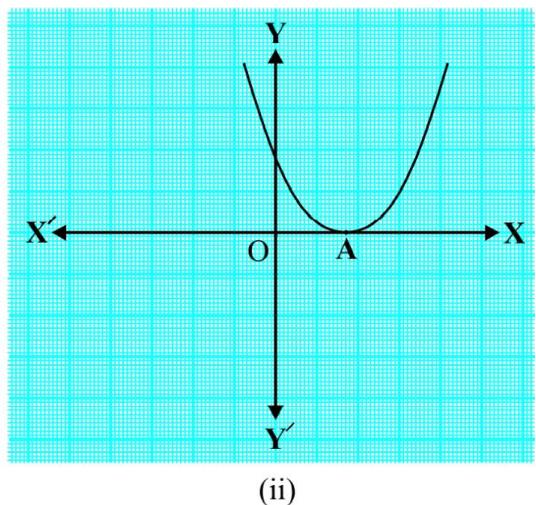  
Fig. 2.4

The $x$ -coordinate of A is the only zero for the quadratic polynomial $a x ^ { 2 } + b x + c$ in this case.

Case (iii) : Here, the graph is either completely above the $x$ -axis or completely below the $x$ - axis. So, it does not cut the $x$ -axis at any point (see Fig. 2.5).

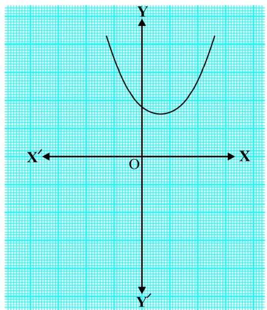  
i

  
(ii)   
Fig. 2.5

So, the quadratic polynomial $a x ^ { 2 } + b x + c$ has no zero in this case.

So, you can see geometrically that a quadratic polynomial can have either two distinct zeroes or two equal zeroes (i.e., one zero), or no zero. This also means that a polynomial of degree 2 has atmost two zeroes.

Now, what do you expect the geometrical meaning of the zeroes of a cubic polynomial to be? Let us find out. Consider the cubic polynomial $x ^ { 3 } - 4 x$ . To see what the graph o $\mathrm { f } y = x ^ { 3 } - 4 x$ looks like, let us list a few values of y corresponding to a few values for $x$ as shown in Table 2.2.

Table 2.2   

<table><tr><td>x</td><td>-2</td><td>-1</td><td>0</td><td>1</td><td>2</td></tr><tr><td>y=x3-4x</td><td>0</td><td>3</td><td>0</td><td>-3</td><td>0</td></tr></table>

Locating the points of the table on a graph paper and drawing the graph, we see that the graph of $y = x ^ { 3 } - 4 x$ actually looks like the one given in Fig. 2.6.

We see from the table above that – 2, 0 and 2 are zeroes of the cubic polynomial $x ^ { 3 } - 4 x$ . Observe that – 2, 0 and 2 are, in fact, the $x$ -coordinates of the only points where the graph of $y = x ^ { 3 } - 4 x$ intersects the $x$ -axis. Since the curve meets the $x$ - axis in only these 3 points, their $x$ -coordinates are the only zeroes of the polynomial.

Let us take a few more examples. Consider the cubic polynomials $x ^ { 3 }$ and $x ^ { 3 } - x ^ { 2 }$ . We draw the graphs of $y = x ^ { 3 }$ and $y = x ^ { 3 } - x ^ { 2 }$ in Fig. 2. 7 and Fig. 2. 8 respectively.

  
Fig. 2.6

  
Fig. 2.7

  
Fig. 2.8

Note that 0 is the only zero of the polynomial $x ^ { 3 }$ . Also, from Fig. 2.7, you can see that 0 is the x - coordinate of the only point where the graph of $y \ = \ x ^ { 3 }$ intersects the $x$ -axis. Similarly, since $x ^ { 3 } - x ^ { 2 } = x ^ { 2 } ( x - 1 )$ , 0 and 1 are the only zeroes of the polynomial $x ^ { 3 } - x ^ { 2 }$ . Also, from Fig. 2.8, these values are the $x$ -coordinates of the only points where the graph of $y = x ^ { 3 } - x ^ { 2 }$ intersects the $x$ -axis.

From the examples above, we see that there are at most 3 zeroes for any cubic polynomial. In other words, any polynomial of degree 3 can have at most three zeroes.

Remark : In general, given a polynomial $p ( x )$ of degree $n$ , the graph of $y = p ( x )$ intersects the $x$ -axis at atmost $n$ points. Therefore, a polynomial $p ( x )$ of degree $n$ has at most n zeroes.

Example 1 : Look at the graphs in Fig. 2.9 given below. Each is the graph of $y = p ( x )$ , where $p ( x )$ is a polynomial. For each of the graphs, find the number of zeroes of $p ( x )$ .

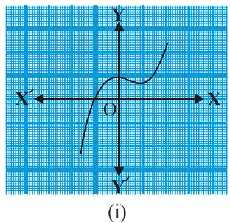

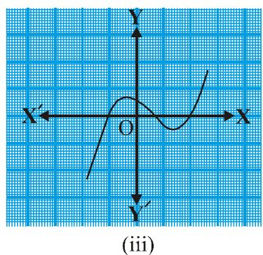

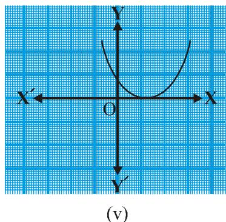

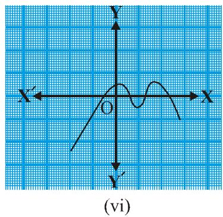  
Fig. 2.9

## Solution :

(i) The number of zeroes is 1 as the graph intersects the $x$ -axis at one point only.   
(ii) The number of zeroes is 2 as the graph intersects the $x$ -axis at two points.   
(iii) The number of zeroes is 3. (Why?)

(iv) The number of zeroes is 1. (Why?)   
(v) The number of zeroes is 1. (Why?)   
(vi) The number of zeroes is 4. (Why?)

## EXERCISE 2.1

1. The graphs of $y = p ( x )$ are given in Fig. 2.10 below, for some polynomials $p ( x )$ . Find the number of zeroes of $p ( x )$ , in each case.

  
i

  
(i)

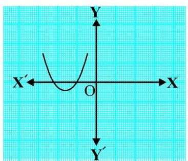  
(iv)

  
（v）

  
(vi)   
Fig. 2.10

### 2.3 Relationship between Zeroes and Coefficients of a Polynomial

You have already seen that zero of a linear polynomial $a x + b$ is $- { \frac { b } { a } }$ . We will now try to answer the question raised in Section 2.1 regarding the relationship between zeroes and coefficients of a quadratic polynomial. For this, let us take a quadratic polynomial, $\operatorname { s a y } p ( x ) = 2 x ^ { 2 } - 8 x + 6$ . In Class IX, you have learnt how to factorise quadratic polynomials by splitting the middle term. So, here we need to split the middle term $\smile 8 x \ '$ as a sum of two terms, whose product is $6 \times 2 x ^ { 2 } = 1 2 x ^ { 2 }$ . So, we write

$$
\begin{array}{l} 2 x ^ {2} - 8 x + 6 = 2 x ^ {2} - 6 x - 2 x + 6 = 2 x (x - 3) - 2 (x - 3) \\ = (2 x - 2) (x - 3) = 2 (x - 1) (x - 3) \\ \end{array}
$$

So, the value of $p ( x ) = 2 x ^ { 2 } - 8 x + 6$ is zero when $x - 1 = 0$ or $x - 3 = 0$ , i.e., when $x = 1$ or $x = 3$ . So, the zeroes of $2 x ^ { 2 } - 8 x + 6$ are 1 and 3. Observe that :

$$
\text {S u m o f i t s z e r o e s} = 1 + 3 = 4 = \frac {- (- 8)}{2} = \frac {- (\text {C o e f f i c i e n t o f} x)}{\text {C o e f f i c i e n t o f} x ^ {2}}
$$

$$
\text {P r o d u c t} = 1 \times 3 = 3 = \frac {6}{2} = \frac {\text {C o n s t a n t t e r m}}{\text {C o e f f i c i e n t o f} x ^ {2}}
$$

Let us take one more quadratic polynomial, say, $p ( x ) = 3 x ^ { 2 } + 5 x - 2$ . By the method of splitting the middle term,

$$
\begin{array}{l} 3 x ^ {2} + 5 x - 2 = 3 x ^ {2} + 6 x - x - 2 = 3 x (x + 2) - 1 (x + 2) \\ = (3 x - 1) (x + 2) \\ \end{array}
$$

Hence, the value of $3 x ^ { 2 } + 5 x - 2$ is zero when either $3 x - 1 = 0$ or $x + 2 = 0$ , i.e., when $x =$ $\frac 1 3$ or $x = - 2$ . So, the zeroes of $3 x ^ { 2 } + 5 x - 2$ are $\frac 1 3$ and – 2. Observe that :

$$
\text {S u m o f i t s z e r o e s} = \frac {1}{3} + (- 2) = \frac {- 5}{3} = \frac {- (\text {C o e f f i c i e n t o f} x)}{\text {C o e f f i c i e n t o f} x ^ {2}}
$$

$$
\text {P r o d u c t} = \frac {1}{3} \times (- 2) = \frac {- 2}{3} = \frac {\text {C o n s t a n t} x ^ {2}}{\text {C o e f f i c i e n t} x ^ {2}}
$$

In general, if $\mathtt { q } ^ { * }$ and $\beta ^ { * }$ are the zeroes of the quadratic polynomial $p ( x ) = a x ^ { 2 } + b x + c ,$ $a \neq 0$ , then you know that $x - \alpha$ and $x - \beta$ are the factors of $p ( x )$ . Therefore,

$$
\begin{array}{l} a x ^ {2} + b x + c = k (x - \alpha) (x - \beta), \text {w h e r e} k \text {i s a c o n s t a n t} \\ = k \left[ x ^ {2} - (\alpha + \beta) x + \alpha \beta \right] \\ = k x ^ {2} - k (\alpha + \beta) x + k \alpha \beta \\ \end{array}
$$

Comparing the coefficients of $x ^ { 2 }$ , $x$ and constant terms on both the sides, we get

$$
a = k, b = - k (\alpha + \beta) \text {a n d} c = k \alpha \beta .
$$

This gives a + b = – b , $\mathbf { \alpha } \mathbf { + } \beta = { \frac { \mathbf { - } b } { \mathbf { \alpha } } } ,$

$$
\alpha \beta = \frac {c}{a}
$$

i.e., sum of zeroes = a + b = (Coefficient of )b x-- = , $\mathbf { \tau } = \mathbf { \alpha } \mathbf { + } \beta = - \frac { \mathbf { \nabla } b } { a } = \frac { - ( \operatorname { C o e f f i c i e n t } \mathrm { \ o f \ } x ) } { \operatorname { C o e f f i c i e n t } \mathrm { \ o f \ } x ^ { 2 } } .$

$$
\text {p r o d u c t} = \alpha \beta = \frac {c}{a} = \frac {\text {C o n s t a n t} x ^ {2}}{\text {C o e f f i c i e n t} x ^ {2}}.
$$

Let us consider some examples.

Example 2 : Find the zeroes of the quadratic polynomial $x ^ { 2 } + 7 x + 1 0$ , and verify the relationship between the zeroes and the coefficients.

Solution : We have

$$
x ^ {2} + 7 x + 1 0 = (x + 2) (x + 5)
$$

So, the value of $x ^ { 2 } + 7 x + 1 0$ is zero when $x + 2 = 0$ or $x + 5 = 0$ , i.e., when $x = - 2$ or $x = - 5$ . Therefore, the zeroes of $x ^ { 2 } + 7 x + 1 0$ are – 2 and – 5. Now,

$$
\text {s u m o f z e r o e s} = - 2 + (- 5) = - (7) = \frac {- (7)}{1} = \frac {- (\text {C o e f f i c i e n t o f} x)}{\text {C o e f f i c i e n t o f} x ^ {2}},
$$

$$
\text {p r o d u c t} = (- 2) \times (- 5) = 1 0 = \frac {1 0}{1} = \frac {\text {C o n s t a n t} x ^ {2}}{\text {C o e f f i c i e n t} x ^ {2}}.
$$

Example 3 : Find the zeroes of the polynomial $x ^ { 2 } - 3$ and verify the relationship between the zeroes and the coefficients.

Solution : Recall the identity $a ^ { 2 } - b ^ { 2 } = ( a - b ) ( a + b )$ . Using it, we can write:

$$
x ^ {2} - 3 = (x - \sqrt {3}) (x + \sqrt {3})
$$

So, the value of $x ^ { 2 } - 3$ is zero when $x = { \sqrt { 3 } }$ or $x = - \sqrt { 3 }$ ×

Therefore, the zeroes of $x ^ { 2 } - 3$ are $\sqrt { 3 }$ and $- { \sqrt { 3 } }$ ×

Now,

$$
\text {s u m o f z e r o e s} = \sqrt {3} - \sqrt {3} = 0 = \frac {- (\text {C o e f f i c i e n t o f} x)}{\text {C o e f f i c i e n t o f} x ^ {2}},
$$

$$
\text {p r o d u c t} = \left(\sqrt {3}\right) (- \sqrt {3}) = - 3 = \frac {- 3}{1} = \frac {\text {C o n s t a n t} x ^ {2}}{\text {C o e f f i c i e n t} x ^ {2}}.
$$

Example 4 : Find a quadratic polynomial, the sum and product of whose zeroes are – 3 and 2, respectively.

Solution : Let the quadratic polynomial be $a x ^ { 2 } + b x + c ,$ , and its zeroes be $\mathfrak { a }$ and $\beta$ .

We have

$$
\alpha + \beta = - 3 = \frac {- b}{a},
$$

and ab = 2 = c . $\alpha \beta = 2 = { \frac { c } { a } } .$

If $a = 1$ , then $b = 3$ and $c = 2$ .

So, one quadratic polynomial which fits the given conditions is $x ^ { 2 } + 3 x + 2$ .

You can check that any other quadratic polynomial that fits these conditions will be of the form $k ( x ^ { 2 } + 3 x + 2 )$ , where $k$ is real.

Let us now look at cubic polynomials. Do you think a similar relation holds between the zeroes of a cubic polynomial and its coefficients?

Let us consider $p ( x ) = 2 x ^ { 3 } - 5 x ^ { 2 } - 1 4 x + 8 .$ .

You can check that $p ( x ) = 0$ for $x = 4 , - 2 , \frac { 1 } { 2 }$ 1 × Since $p ( x )$ can have atmost three zeroes, these are the zeores of $2 x ^ { 3 } - 5 x ^ { 2 } - 1 4 x + 8 .$ . Now,

$$
\text {s u m} = 4 + (- 2) + \frac {1}{2} = \frac {5}{2} = \frac {- (- 5)}{2} = \frac {- (\text {C o e f f i c i e n t} x ^ {2})}{\text {C o e f f i c i e n t} x ^ {3}},
$$

$$
\text {p r o d u c t} = 4 \times (- 2) \times \frac {1}{2} = - 4 = \frac {- 8}{2} = \frac {- \text {C o n s t a n t} x ^ {3}}{\text {C o e f f i c i e n t} x ^ {3}}.
$$

However, there is one more relationship here. Consider the sum of the products of the zeroes taken two at a time. We have

$$
\begin{array}{l} \left\{4 \times (- 2) \right\} + \left\{(- 2) \times \frac {1}{2} \right\} + \left\{\frac {1}{2} \times 4 \right\} \\ = - 8 - 1 + 2 = - 7 = \frac {- 1 4}{2} = \frac {\text {C o e f f i c i e n t o f} x}{\text {C o e f f i c i e n t o f} x ^ {3}}. \\ \end{array}
$$

In general, it can be proved that if a, b, g are the zeroes of the cubic polynomial $a x ^ { 3 } + b x ^ { 2 } + c x + d ,$ then

$$
\alpha + \beta + \gamma = \frac {- b}{a},
$$

$$
\alpha \beta + \beta \gamma + \gamma \alpha = \frac {c}{a},
$$

$$
\alpha \beta \gamma = \frac {- d}{a}.
$$

Let us consider an example.

Example 5* : Verify that 3, –1, 1- a re the zeroes of the cubic polynomial $p ( x ) = 3 x ^ { 3 } - 5 x ^ { 2 } -$ $1 1 x - 3$ , and then verify the relationship between the zeroes and the coefficients.

Solution : Comparing the given polynomial with $a x ^ { 3 } + b x ^ { 2 } + c x + d .$ , we get

$$
a = 3, b = - 5, c = - 1 1, d = - 3. \text {F u r t h e r}
$$

$$
p (3) = 3 \times 3 ^ {3} - (5 \times 3 ^ {2}) - (1 1 \times 3) - 3 = 8 1 - 4 5 - 3 3 - 3 = 0,
$$

$$
p (- 1) = 3 \times (- 1) ^ {3} - 5 \times (- 1) ^ {2} - 1 1 \times (- 1) - 3 = - 3 - 5 + 1 1 - 3 = 0,
$$

$$
\begin{array}{l} p \left(- \frac {1}{3}\right) = 3 \times \left(- \frac {1}{3}\right) ^ {3} - 5 \times \left(- \frac {1}{3}\right) ^ {2} - 1 1 \times \left(- \frac {1}{3}\right) - 3, \\ = - \frac {1}{9} - \frac {5}{9} + \frac {1 1}{3} - 3 = - \frac {2}{3} + \frac {2}{3} = 0 \\ \end{array}
$$

Therefore, $3 , - 1$ and $- { \frac { 1 } { 3 } }$ are the zeroes of $3 x ^ { 3 } - 5 x ^ { 2 } - 1 1 x - 3$ .

So, we take $\mathtt { q } = 3$ , $\beta = - 1$ and $\gamma = - \frac 1 3$

Now,

$$
\alpha + \beta + \gamma = 3 + (- 1) + \left(- \frac {1}{3}\right) = 2 - \frac {1}{3} = \frac {5}{3} = \frac {- (- 5)}{3} = \frac {- b}{a},
$$

$$
\alpha \beta + \beta \gamma + \gamma \alpha = 3 \times (- 1) + (- 1) \times \left(- \frac {1}{3}\right) + \left(- \frac {1}{3}\right) \times 3 = - 3 + \frac {1}{3} - 1 = \frac {- 1 1}{3} = \frac {c}{a},
$$

$$
\alpha \beta \gamma = 3 \times (- 1) \times \left(- \frac {1}{3}\right) = 1 = \frac {- (- 3)}{3} = \frac {- d}{a}.
$$

## EXERCISE 2.2

1. Find the zeroes of the following quadratic polynomials and verify the relationship between the zeroes and the coefficients.

(i)

(iv)

2. Find a quadratic polynomial each with the given numbers as the sum and product of its zeroes respectively.

(i) $\frac { 1 } { 4 } , - 1$

(ii) 12 , ${ \sqrt { 2 } } , { \frac { 1 } { 3 } }$

(iii) 0, 5

(iv) 1, 1

(v) $- \frac { 1 } { 4 } , \frac { 1 } { 4 }$

(vi) 4, 1

### 2.4 Summary

In this chapter, you have studied the following points:

1. Polynomials of degrees 1, 2 and 3 are called linear, quadratic and cubic polynomials respectively.   
2. A quadratic polynomial in $x$ with real coefficients is of the form $a x ^ { 2 } + b x + c$ , where $a , b , c$ are real numbers with $a \neq 0$ .   
3. The zeroes of a polynomial $p ( x )$ are precisely the $x$ -coordinates of the points, where the graph of $y = p ( x )$ intersects the $x$ - axis.   
4. A quadratic polynomial can have at most 2 zeroes and a cubic polynomial can have at most 3 zeroes.   
5. If $\mathfrak { a }$ and $\beta$ are the zeroes of the quadratic polynomial $a x ^ { 2 } + b x + c$ , then

$$
\alpha + \beta = - \frac {b}{a}, \quad \alpha \beta = \frac {c}{a}.
$$

6. If $\alpha , \beta , \gamma$ are the zeroes of the cubic polynomial $a x ^ { 3 } + b x ^ { 2 } + c x + d ,$ then

$$
\alpha + \beta + \gamma = \frac {- b}{a},
$$

$$
\alpha \beta + \beta \gamma + \gamma \alpha = \frac {c}{a},
$$

and d-ab g = a

1062CH03
# Chapter 3
# PAIR OF LINEAR EQUATIONS IN TWO VARIABLES

### 3.1 Introduction

You must have come across situations like the one given below :

Akhila went to a fair in her village. She wanted to enjoy rides on the Giant Wheel and play Hoopla (a game in which you throw a ring on the items kept in a stall, and if the ring covers any object completely, you get it). The number of times she played Hoopla is half the number of rides she had on the Giant Wheel. If each ride costs $\yen 3$ , and a game of Hoopla costs $\yen 4$ , how would you find out the number of rides she had and how many times she played Hoopla, provided she spent $\yen 20$ .

May be you will try it by considering different cases. If she has one ride, is it possible? Is it possible to have two rides? And so on. Or you may use the knowledge of Class IX, to represent such situations as linear equations in two variables.

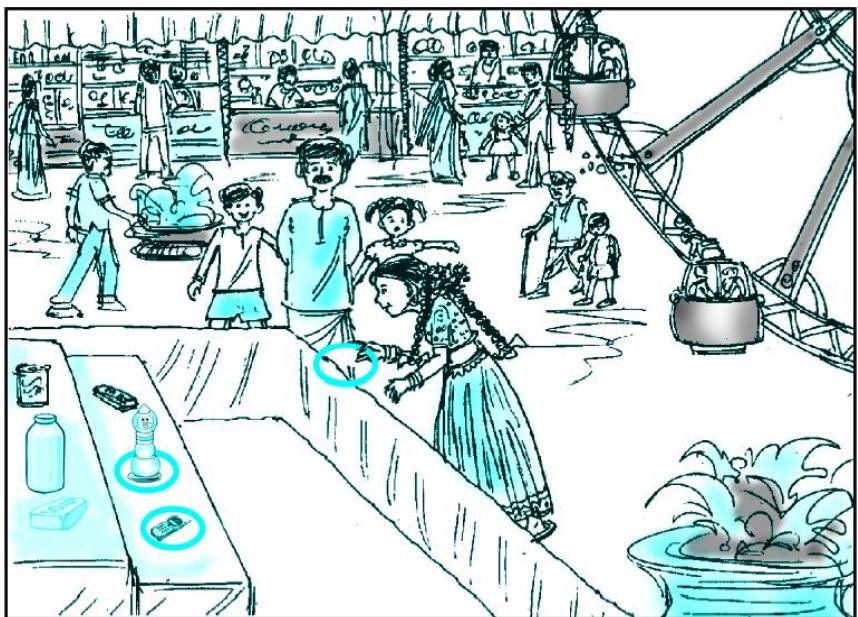

Let us try this approach.

Denote the number of rides that Akhila had by $x _ { \mathrm { { ; } } }$ , and the number of times she played Hoopla by y. Now the situation can be represented by the two equations:

$$
y = \frac {1}{2} x \tag {1}
$$

$$
3 x + 4 y = 2 0 \tag {2}
$$

Can we find the solutions of this pair of equations? There are several ways of finding these, which we will study in this chapter.

### 3.2 Graphical Method of Solution of a Pair of Linear Equations

A pair of linear equations which has no solution, is called an inconsistent pair of linear equations. A pair of linear equations in two variables, which has a solution, is called a consistent pair of linear equations. A pair of linear equations which are equivalent has infinitely many distinct common solutions. Such a pair is called a dependent pair of linear equations in two variables. Note that a dependent pair of linear equations is always consistent.

We can now summarise the behaviour of lines representing a pair of linear equations in two variables and the existence of solutions as follows:

(i) the lines may intersect in a single point. In this case, the pair of equations has a unique solution (consistent pair of equations).   
(ii) the lines may be parallel. In this case, the equations have no solution (inconsistent pair of equations).   
(iii) the lines may be coincident. In this case, the equations have infinitely many solutions [dependent (consistent) pair of equations].

Consider the following three pairs of equations.

(i) $x - 2 y = 0$ and $3 x + 4 y - 2 0 = 0$ (The lines intersect)   
(ii) $2 x + 3 y - 9 = 0$ and $4 x + 6 y - 1 8 = 0$ (The lines coincide)   
(iii) $x + 2 y - 4 = 0$ and $2 x + 4 y - 1 2 = 0$ (The lines are parallel)

Let us now write down, and compare, the values of 1 , a $\frac { a _ { 1 } } { a _ { 2 } } , \frac { b _ { 1 } } { b _ { 2 } }$ and $\frac { c _ { 1 } } { c _ { 2 } }$ in all the three examples. Here, $a _ { _ 1 } , b _ { _ 1 } , c _ { _ 1 }$ and $a _ { _ 2 } , b _ { _ 2 } , c _ { _ 2 }$ denote the coefficents of equations given in the general form in Section 3.2.

Table 3.1   

<table><tr><td>Sl No.</td><td>Pair of lines</td><td>a1/a2</td><td>b1/b2</td><td>c1/c2</td><td>Compare the ratios</td><td>Graphical representation</td><td>Algebraic interpretation</td></tr><tr><td rowspan="2">1.</td><td>x-2y=0</td><td>1/3</td><td>-2/4</td><td>0</td><td>a1/a2≠b1/b2</td><td>Intersecting lines</td><td>Exactly one solution (unique)</td></tr><tr><td>3x+4y-20=0</td><td></td><td></td><td></td><td></td><td></td><td></td></tr><tr><td rowspan="2">2.</td><td>2x+3y-9=0</td><td>2/4</td><td>3/6</td><td>-9</td><td>a1/a2=b1/b2=c1/c2</td><td>Coincident lines</td><td>Infinitely many solutions</td></tr><tr><td>4x+6y-18=0</td><td></td><td></td><td></td><td></td><td></td><td></td></tr><tr><td rowspan="2">3.</td><td>x+2y-4=0</td><td>1/2</td><td>2/4</td><td>-4</td><td>a1/a2=b1/b2≠c1/c2</td><td>Parallel lines</td><td>No solution</td></tr><tr><td>2x+4y-12=0</td><td></td><td></td><td></td><td></td><td></td><td></td></tr></table>

From the table above, you can observe that if the lines represented by the equation

and $\begin{array} { r } { a _ { _ 1 } x + b _ { _ 1 } y + c _ { _ 1 } = 0 } \\ { a _ { _ 2 } x + b _ { _ 2 } y + c _ { _ 2 } = 0 } \end{array}$

are (i) intersecting, then ${ \frac { a _ { 1 } } { a _ { 2 } } } \neq { \frac { b _ { 1 } } { b _ { 2 } } }$ ×

(ii) coincident, then 1 1 1a b c= = × ${ \frac { a _ { 1 } } { a _ { 2 } } } = { \frac { b _ { 1 } } { b _ { 2 } } } = { \frac { c _ { 1 } } { c _ { 2 } } }$   
(iii) parallel, then 1 1a b= ¹ $\frac { a _ { 1 } } { a _ { 2 } } = \frac { b _ { 1 } } { b _ { 2 } } \neq \frac { c _ { 1 } } { c _ { 2 } }$ 2b c

In fact, the converse is also true for any pair of lines. You can verify them by considering some more examples by yourself.

Let us now consider some more examples to illustrate it.

Example 1 : Check graphically whether the pair of equations

and

$$
x + 3 y = 6 \tag {1}
$$

$$
2 x - 3 y = 1 2 \tag {2}
$$

is consistent. If so, solve them graphically.

Solution : Let us draw the graphs of the Equations (1) and (2). For this, we find two solutions of each of the equations, which are given in Table 3.2

Table 3.2   

<table><tr><td>x</td><td>0</td><td>6</td></tr><tr><td>y = 6-x/3</td><td>2</td><td>0</td></tr></table>

Plot the points A(0, 2), B(6, 0), $\mathrm { P } ( 0 , -$ 4) and $Q ( 3 , - 2 )$ on graph paper, and join the points to form the lines AB and PQ as shown in Fig. 3.1.

We observe that there is a point B (6, 0) common to both the lines AB and PQ. So, the solution of the pair of linear equations is $x = 6$ and $y = 0$ , i.e., the given pair of equations is consistent.

<table><tr><td>x</td><td>0</td><td>3</td></tr><tr><td>y = 2x - 12 / 3</td><td>-4</td><td>-2</td></tr></table>

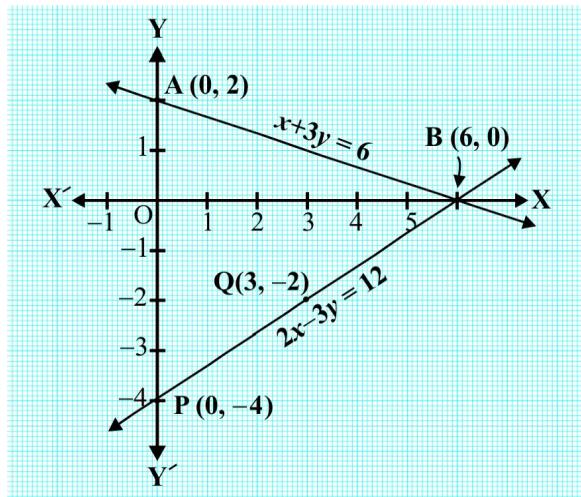  
Fig. 3.1

Example 2 : Graphically, find whether the following pair of equations has no solution, unique solution or infinitely many solutions:

$$
5 x - 8 y + 1 = 0 \tag {1}
$$

$$
3 x - \frac {2 4}{5} y + \frac {3}{5} = 0 \tag {2}
$$

Solution : Multiplying Equation (2) by , we get ${ \frac { 5 } { 3 } } ,$

$$
5 x - 8 y + 1 = 0
$$

But, this is the same as Equation (1). Hence the lines represented by Equations (1) and (2) are coincident. Therefore, Equations (1) and (2) have infinitely many solutions.

Plot few points on the graph and verify it yourself.

Example 3 : Champa went to a ‘Sale’ to purchase some pants and skirts. When her friends asked her how many of each she had bought, she answered, “The number of skirts is two less than twice the number of pants purchased. Also, the number of skirts is four less than four times the number of pants purchased”. Help her friends to find how many pants and skirts Champa bought.

Solution : Let us denote the number of pants by $x$ and the number of skirts by y. Then the equations formed are :

$$
y = 2 x - 2 \tag {1}
$$

and y = 4x – 4 $y = 4 x - 4$ (2)

Let us draw the graphs of Equations (1) and (2) by finding two solutions for each of the equations. They are given in Table 3.3.

Table 3.3   

<table><tr><td>x</td><td>2</td><td>0</td></tr><tr><td>y=2x-2</td><td>2</td><td>-2</td></tr></table>

<table><tr><td>x</td><td>0</td><td>1</td></tr><tr><td>y=4x-4</td><td>-4</td><td>0</td></tr></table>

  
Fig. 3.2

Plot the points and draw the lines passing through them to represent the equations, as shown in Fig. 3.2.

The two lines intersect at the point (1, 0). So, $x = 1 , y = 0$ is the required solution of the pair of linear equations, i.e., the number of pants she purchased is 1 and she did not buy any skirt.

Verify the answer by checking whether it satisfies the conditions of the given problem.

## EXERCISE 3.1

1. Form the pair of linear equations in the following problems, and find their solutions graphically.

(i) 10 students of Class X took part in a Mathematics quiz. If the number of girls is 4 more than the number of boys, find the number of boys and girls who took part in the quiz.

(ii) 5 pencils and 7 pens together cost ` 50, whereas 7 pencils and 5 pens together cost ` 46. Find the cost of one pencil and that of one pen.

2. On comparing the ratios 1 1, a b $\frac { a _ { 1 } } { a _ { 2 } } , \frac { b _ { 1 } } { b _ { 2 } }$ 1 2and  c c , find out whether the lines representing the following pairs of linear equations intersect at a point, are parallel or coincident:

(i)

(iii)

3. On comparing the ratios 1 1,a b and $\frac { a _ { 1 } } { a _ { 2 } } , \frac { b _ { 1 } } { b _ { 2 } }$ 1c , find out whether the following pair of linear $\frac { c _ { 1 } } { c _ { 2 } }$ equations are consistent, or inconsistent.

(i)

(iii)

(v) $\frac { 4 } { 3 } x + 2 y = 8 ; 2 x + 3 y = 1 2$

4. Which of the following pairs of linear equations are consistent/inconsistent? If consistent, obtain the solution graphically:

(i)   
(ii)   
(iii)   
(iv)

5. Half the perimeter of a rectangular garden, whose length is $4 \mathrm { m }$ more than its width, is $3 6 \mathrm { m }$ . Find the dimensions of the garden.

6. Given the linear equation $2 x + 3 y - 8 = 0$ , write another linear equation in two variables such that the geometrical representation of the pair so formed is:

(i) intersecting lines

(ii) parallel lines

(iii) coincident lines

7. Draw the graphs of the equations $x - y + 1 = 0$ and $3 x + 2 y - 1 2 = 0$ . Determine the coordinates of the vertices of the triangle formed by these lines and the $x$ -axis, and shade the triangular region.

### 3.3 Algebraic Methods of Solving a Pair of Linear Equations

In the previous section, we discussed how to solve a pair of linear equations graphically. The graphical method is not convenient in cases when the point representing the solution of the linear equations has non-integral coordinates like $\left( { \sqrt { 3 } } , 2 { \sqrt { 7 } } \right)$ , (–1.75, 3.3), $\left( { \frac { 4 } { 1 3 } } , { \frac { 1 } { 1 9 } } \right)$ , etc. There is every possibility of making mistakes while reading such coordinates. Is there any alternative method of finding the solution? There are several algebraic methods, which we shall now discuss.

3.3.1 Substitution Method : We shall explain the method of substitution by taking some examples.

Example 4 : Solve the following pair of equations by substitution method:

$$
7 x - 1 5 y = 2 \tag {1}
$$

$$
x + 2 y = 3 \tag {2}
$$

## Solution :

Step $\mathbf { 1 : }$ We pick either of the equations and write one variable in terms of the other. Let us consider the Equation (2) :

$$
x + 2 y = 3
$$

and write it as $x = 3 - 2 y$ (3)

Step 2 : Substitute the value of $x$ in Equation (1). We get

$$
7 (3 - 2 y) - 1 5 y = 2
$$

i.e., 21 – 14y – 15y = 2

i.e., – 29y = –19

Therefore, y = 19

Step 3 : Substituting this value of y in Equation (3), we get

$$
x = 3 - 2 \left(\frac {1 9}{2 9}\right) = \frac {4 9}{2 9}
$$

Therefore, the solution is $x = { \frac { 4 9 } { 2 9 } } , y = { \frac { 1 9 } { 2 9 } }$ , y =

Verification : Substituting $x = { \frac { 4 9 } { 2 9 } }$ and $y = \frac { 1 9 } { 2 9 }$ 1929 , you can verify that both the Equations (1) and (2) are satisfied.

To understand the substitution method more clearly, let us consider it stepwise:

Step 1 : Find the value of one variable, say y in terms of the other variable, i.e., $x$ from either equation, whichever is convenient.

Step $\mathbf { \nabla } ^ { 2 } :$ Substitute this value of $y$ in the other equation, and reduce it to an equation in one variable, i.e., in terms of $x$ , which can be solved. Sometimes, as in Examples 9 and 10 below, you can get statements with no variable. If this statement is true, you can conclude that the pair of linear equations has infinitely many solutions. If the statement is false, then the pair of linear equations is inconsistent.

Step 3 : Substitute the value of $x$ (or y) obtained in Step 2 in the equation used in Step 1 to obtain the value of the other variable.

Remark : We have substituted the value of one variable by expressing it in terms of the other variable to solve the pair of linear equations. That is why the method is known as the substitution method.

Example 5 : Solve the following question—Aftab tells his daughter, “Seven years ago, I was seven times as old as you were then. Also, three years from now, I shall be three times as old as you will be.” (Isn’t this interesting?) Represent this situation algebraically and graphically by the method of substitution.

Solution : Let $s$ and $t$ be the ages (in years) of Aftab and his daughter, respectively. Then, the pair of linear equations that represent the situation is

$$
s - 7 = 7 (t - 7), \text {i . e .}, \quad s - 7 t + 4 2 = 0 \tag {1}
$$

and $s + 3 = 3 ( t + 3 )$ , i.e., $s - 3 t = 6$ (2)

Using Equation (2), we get $s = 3 t + 6$ .

Putting this value of $s$ in Equation (1), we get

$$
(3 t + 6) - 7 t + 4 2 = 0,
$$

i.e., $4 t = 4 8$ , which gives $t = 1 2$ .

Putting this value of $t$ in Equation (2), we get

$$
s = 3 (1 2) + 6 = 4 2
$$

So, Aftab and his daughter are 42 and 12 years old, respectively.

Verify this answer by checking if it satisfies the conditions of the given problems.

Example 6 : In a shop the cost of 2 pencils and 3 erasers is `9 and the cost of 4 pencils and 6 erasers is `18. Find the cost of each pencil and each eraser.

Solution : The pair of linear equations formed were:

$$
2 x + 3 y = 9 \tag {1}
$$

$$
4 x + 6 y = 1 8 \tag {2}
$$

We first express the value of $x$ in terms of y from the equation $2 x + 3 y = 9$ , to get

$$
x = \frac {9 - 3 y}{2} \tag {3}
$$

Now we substitute this value of $x$ in Equation (2), to get

$$
\frac {4 (9 - 3 y)}{2} + 6 y = 1 8
$$

i.e.,

i.e.,

This statement is true for all values of y. However, we do not get a specific value of y as a solution. Therefore, we cannot obtain a specific value of $x$ . This situation has arisen because both the given equations are the same. Therefore, Equations (1) and (2) have infinitely many solutions. We cannot find a unique cost of a pencil and an eraser, because there are many common solutions, to the given situation.

Example 7 : Two rails are represented by the equations

$x + 2 y - 4 = 0$ and $2 x + 4 y - 1 2 = 0$ . Will the rails cross each other?

Solution : The pair of linear equations formed were:

$$
x + 2 y - 4 = 0 \tag {1}
$$

$$
2 x + 4 y - 1 2 = 0 \tag {2}
$$

We express $x$ in terms of y from Equation (1) to get

$$
x = 4 - 2 y
$$

Now, we substitute this value of $x$ in Equation (2) to get

$$
2 (4 - 2 y) + 4 y - 1 2 = 0
$$

$$
\begin{array}{l} i. e., \quad 8 - 1 2 = 0 \\ \text {i . e .}, \quad - 4 = 0 \\ \end{array}
$$

which is a false statement.

Therefore, the equations do not have a common solution. So, the two rails will not cross each other.

## EXERCISE 3.2

1. Solve the following pair of linear equations by the substitution method.

(i) $x + y = 1 4$

$( \mathrm { i i } ) \ s - t = 3$

$$
x - y = 4
$$

$$
\frac {s}{3} + \frac {t}{2} = 6
$$

(iii) $3 x - y = 3$

(i $\mathrm { ~ v ~ } ) \ 0 . 2 x + 0 . 3 y = 1 . 3$

$$
9 x - 3 y = 9
$$

$$
0. 4 x + 0. 5 y = 2. 3
$$

(v) ${ \sqrt { 2 } } x + { \sqrt { 3 } } y = 0$

(vi) ${ \frac { 3 x } { 2 } } - { \frac { 5 y } { 3 } } = - 2$ 2 = -

$$
\sqrt {3} x - \sqrt {8} y = 0
$$

$$
\frac {x}{3} + \frac {y}{2} = \frac {1 3}{6}
$$

2. Solve $2 x + 3 y = 1 1$ and $2 x - 4 y = - 2 4$ and hence find the value of $\overrightarrow { m }$ for which $y = m x + 3$ .   
3. Form the pair of linear equations for the following problems and find their solution by substitution method.

(i) The difference between two numbers is 26 and one number is three times the other. Find them.   
(ii) The larger of two supplementary angles exceeds the smaller by 18 degrees. Find them.   
(iii) The coach of a cricket team buys 7 bats and 6 balls for $\yen 3800$ . Later, she buys 3 bats and 5 balls for ` 1750. Find the cost of each bat and each ball.   
(iv) The taxi charges in a city consist of a fixed charge together with the charge for the distance covered. For a distance of $1 0 \mathrm { k m }$ , the charge paid is $\yen 105$ and for a journey of $1 5 \mathrm { k m }$ , the charge paid is ` 155. What are the fixed charges and the charge per km? How much does a person have to pay for travelling a distance of $2 5 \mathrm { k m } ?$   
(v) A fraction becomes ${ \frac { 9 } { 1 1 } } .$ , if 2 is added to both the numerator and the denominator. If, 3 is added to both the numerator and the denominator it becomes $\frac { 5 } { 6 }$ . Find the fraction.

(vi) Five years hence, the age of Jacob will be three times that of his son. Five years ago, Jacob’s age was seven times that of his son. What are their present ages?

#### 3.3.2 Elimination Method

Now let us consider another method of eliminating (i.e., removing) one variable. This is sometimes more convenient than the substitution method. Let us see how this method works.

Example 8 : The ratio of incomes of two persons is $9 : 7$ and the ratio of their expenditures is 4 : 3. If each of them manages to save ` 2000 per month, find their monthly incomes.

Solution : Let us denote the incomes of the two person by $\mathfrak { F } 9 x$ and $\yen 7x$ and their expenditures by $\yen 4 y$ and ` 3y respectively. Then the equations formed in the situation is given by :

$$
9 x - 4 y = 2 0 0 0 \tag {1}
$$

$$
\text {a n d} \quad 7 x - 3 y = 2 0 0 0 \tag {2}
$$

Step $\mathbf { 1 : }$ Multiply Equation (1) by 3 and Equation (2) by 4 to make the coefficients of y equal. Then we get the equations:

$$
2 7 x - 1 2 y = 6 0 0 0 \tag {3}
$$

$$
2 8 x - 1 2 y = 8 0 0 0 \tag {4}
$$

Step $\mathbf { \nabla } ^ { 2 : }$ Subtract Equation (3) from Equation (4) to eliminate y, because the coefficients of y are the same. So, we get

$$
(2 8 x - 2 7 x) - (1 2 y - 1 2 y) = 8 0 0 0 - 6 0 0 0
$$

$$
i. e., \quad x = 2 0 0 0
$$

Step 3 : Substituting this value of $x$ in (1), we get

$$
9 (2 0 0 0) - 4 y = 2 0 0 0
$$

$$
\text {i . e . ,} \quad y = 4 0 0 0
$$

So, the solution of the equations is $x = 2 0 0 0 , y = 4 0 0 0$ . Therefore, the monthly incomes of the persons are ` 18,000 and ` 14,000, respectively.

Verification : $1 8 0 0 0 : 1 4 0 0 0 = 9 : 7 .$ . Also, the ratio of their expenditures $= 1 8 0 0 0 - 2 0 0 0 :$ $1 4 0 0 0 - 2 0 0 0 = 1 6 0 0 0 : 1 2 0 0 0 = 4 : 3$

## Remarks :

1. The method used in solving the example above is called the elimination method, because we eliminate one variable first, to get a linear equation in one variable.

In the example above, we eliminated y. We could also have eliminated $x .$ . Try doing it that way.

2. You could also have used the substitution, or graphical method, to solve this problem. Try doing so, and see which method is more convenient.

Let us now note down these steps in the elimination method :

Step 1 : First multiply both the equations by some suitable non-zero constants to make the coefficients of one variable (either $x$ or y) numerically equal.   
Step 2 : Then add or subtract one equation from the other so that one variable gets eliminated. If you get an equation in one variable, go to Step 3.

If in Step 2, we obtain a true statement involving no variable, then the original pair of equations has infinitely many solutions.

If in Step 2, we obtain a false statement involving no variable, then the original pair of equations has no solution, i.e., it is inconsistent.

Step 3 : Solve the equation in one variable (x or y) so obtained to get its value.

Step 4 : Substitute this value of x (or y) in either of the original equations to get the value of the other variable.

Now to illustrate it, we shall solve few more examples.

Example 9 : Use elimination method to find all possible solutions of the following pair of linear equations :

$$
2 x + 3 y = 8 \tag {1}
$$

$$
4 x + 6 y = 7 \tag {2}
$$

## Solution :

Step 1 : Multiply Equation (1) by 2 and Equation (2) by 1 to make the coefficients of $x$ equal. Then we get the equations as :

$$
4 x + 6 y = 1 6 \tag {3}
$$

$$
4 x + 6 y = 7 \tag {4}
$$

Step 2 : Subtracting Equation (4) from Equation (3),

$$
(4 x - 4 x) + (6 y - 6 y) = 1 6 - 7
$$

i.e., $0 = 9$ , which is a false statement.

Therefore, the pair of equations has no solution.

Example $1 0 :$ The sum of a two-digit number and the number obtained by reversing the digits is 66. If the digits of the number differ by 2, find the number. How many such numbers are there?

Solution : Let the ten’s and the unit’s digits in the first number be $x$ and y, respectively. So, the first number may be written as $1 0 x + y$ in the expanded form (for example, $5 6 = 1 0 ( 5 ) + 6 )$ .

When the digits are reversed, $x$ becomes the unit’s digit and y becomes the ten’s digit. This number, in the expanded notation is $1 0 y + x$ (for example, when 56 is reversed, we get $6 5 =$ $1 0 ( 6 ) + 5 )$ .

According to the given condition.

$$
(1 0 x + y) + (1 0 y + x) = 6 6
$$

i.e.,

i.e., (1)

We are also given that the digits differ by 2, therefore,

either (2)

or (3)

If $\dot { \mathbf { \eta } } _ { x - y } = 2$ , then solving (1) and (2) by elimination, we get $x = 4$ and $y = 2$ . In this case, we get the number 42.

$\operatorname { I f } y - x = 2$ , then solving (1) and (3) by elimination, we get $x = 2$ and $y = 4$ .

In this case, we get the number 24.

Thus, there are two such numbers 42 and 24.

Verification : Here $4 2 + 2 4 = 6 6$ and $4 - 2 = 2$ . Also $2 4 + 4 2 = 6 6 $ and $4 - 2 = 2$ .

## EXERCISE 3.3

1. Solve the following pair of linear equations by the elimination method and the substitution method :

(i) $x + y = 5$ and $2 x - 3 y = 4$

(ii) $3 x + 4 y = 1 0$ and $2 x - 2 y = 2$

(iii) $3 x - 5 y - 4 = 0$ and $9 x = 2 y + 7 \mathrm { ( i v ) }$

$$
\frac {x}{2} + \frac {2 y}{3} = - 1 \text {a n d} x - \frac {y}{3} = 3
$$

2. Form the pair of linear equations in the following problems, and find their solutions (if they exist) by the elimination method :

(i) If we add 1 to the numerator and subtract 1 from the denominator, a fraction reduces to 1. It becomes $\frac { 1 } { 2 }$ if we only add 1 to the denominator. What is the fraction?   
(ii) Five years ago, Nuri was thrice as old as Sonu. Ten years later, Nuri will be twice as old as Sonu. How old are Nuri and Sonu?   
(iii) The sum of the digits of a two-digit number is 9. Also, nine times this number is twice the number obtained by reversing the order of the digits. Find the number.

(iv) Meena went to a bank to withdraw ` 2000. She asked the cashier to give her $\yen 50$ and $\yen 100$ notes only. Meena got 25 notes in all. Find how many notes of $\yen 50$ and ` 100 she received.   
(v) A lending library has a fixed charge for the first three days and an additional charge for each day thereafter. Saritha paid ` 27 for a book kept for seven days, while Susy paid ` 21 for the book she kept for five days. Find the fixed charge and the charge for each extra day.

### 3.4 Summary

In this chapter, you have studied the following points:

1. A pair of linear equations in two variables can be represented, and solved, by the:

(i) graphical method   
(ii) algebraic method

2. Graphical Method :

The graph of a pair of linear equations in two variables is represented by two lines.

(i) If the lines intersect at a point, then that point gives the unique solution of the two equations. In this case, the pair of equations is consistent.   
(ii) If the lines coincide, then there are infinitely many solutions — each point on the line being a solution. In this case, the pair of equations is dependent (consistent).   
(iii) If the lines are parallel, then the pair of equations has no solution. In this case, the pair of equations is inconsistent.

3. Algebraic Methods : We have discussed the following methods for finding the solution(s) of a pair of linear equations :

(i) Substitution Method   
(ii) Elimination Method

4. If a pair of linear equations is given by $a _ { { } _ { 1 } } x + b _ { { } _ { 1 } } y + c _ { { } _ { 1 } } = 0$ and $a _ { 2 } x + b _ { 2 } y + c _ { 2 } = 0$ , then the following situations can arise :

(i) ${ \frac { a _ { 1 } } { a _ { 2 } } } \neq { \frac { b _ { 1 } } { b _ { 1 } } }$ 1 b¹ : In this case, the pair of linear equations is consistent.   
(ii) 1 1 1a b c= ¹ : In this case, the pair of linear equations is inconsistent. $\frac { a _ { 1 } } { a _ { 2 } } = \frac { b _ { 1 } } { b _ { 2 } } \neq \frac { c _ { 1 } } { c _ { 2 } }$ a 2c   
(iii) 1 1 1a b c= = : In this case, the pair of linear equations is dependent and consistent. 2 2 2a b c

5. There are several situations which can be mathematically represented by two equations that are not linear to start with. But we alter them so that they are reduced to a pair of linear equations.

1062CH04
# chapter 4
# QUADRATIC EQUATIONS

### 4.1 Introduction

In Chapter 2, you have studied different types of polynomials. One type was the quadratic polynomial of the form $a x ^ { 2 } + b x + c .$ , $a \neq 0$ . When we equate this polynomial to zero, we get a quadratic equation. Quadratic equations come up when we deal with many real-life situations.

For instance, suppose a charity trust decides to build a prayer hall having a carpet area of 300 square metres with its length one metre more than twice its breadth. What should be the length and breadth of the hall? Suppose the breadth of the hall is $x$ metres. Then, its length should be $( 2 x + 1 )$ metres. We can depict this information pictorially as shown in Fig. 4.1.

  
Fig. 4.1

Now, area of the hall $= ( 2 x + 1 )$ . $x \ : \mathrm { m } ^ { 2 } = ( 2 x ^ { 2 } + x ) \ : \mathrm { m } ^ { 2 }$

So, $2 x ^ { 2 } + x = 3 0 0$ (Given)

Therefore, $2 x ^ { 2 } + x - 3 0 0 = 0$

So, the breadth of the hall should satisfy the equation $2 x ^ { 2 } + x - 3 0 0 = 0$ which is a quadratic equation.

Many people believe that Babylonians were the first to solve quadratic equations. For instance, they knew how to find two positive numbers with a given positive sum and a given positive product, and this problem is equivalent to solving a quadratic equation of the form $x ^ { 2 } - p x + q = 0$ . Greek mathematician Euclid developed a geometrical approach for finding out lengths which, in our present day terminology, are solutions of quadratic equations. Solving of quadratic equations, in general form, is often credited to ancient Indian mathematicians. In fact, Brahmagupta (C.E.598–665) gave an explicit formula to solve a quadratic equation of the form $a x ^ { 2 } + b x = c$ . Later,

Sridharacharya (C.E. 1025) derived a formula, now known as the quadratic formula, (as quoted by Bhaskara II) for solving a quadratic equation by the method of completing the square. An Arab mathematician Al-Khwarizmi (about C.E. 800) also studied quadratic equations of different types. Abraham bar Hiyya Ha-Nasi, i n his book ‘Liber embadorum’ published in Europe in C.E. 1145 gave complete solutions of different quadratic equations.

In this chapter, you will study quadratic equations, and various ways of finding their roots. You will also see some applications of quadratic equations in daily life situations.

### 4.2 Quadratic Equations

A quadratic equation in the variable $x$ is an equation of the form $a x ^ { 2 } + b x + c = 0$ , where $a , b .$ , c are real numbers, $a \neq 0$ . For example, $2 x ^ { 2 } + x - 3 0 0 = 0$ is a quadratic equation. Similarly, $2 x ^ { 2 } - 3 x ^ { + }$ $1 = 0$ $1 = 0 , 4 x - 3 x ^ { 2 } + 2 = 0$ and $1 - x ^ { 2 } + 3 0 0 = 0$ are also quadratic equations.

In fact, any equation of the form $p ( x ) = 0$ , where $p ( x )$ is a polynomial of degree 2, is a quadratic equation. But when we write the terms of $p ( x )$ in descending order of their degrees, then we get the standard form of the equation. That is, $a x ^ { 2 } + b x + c = 0$ , $a \neq 0$ is called the standard form of a quadratic equation.

Quadratic equations arise in several situations in the world around us and in different fields of mathematics. Let us consider a few examples.

Example 1 : Represent the following situations mathematically:

(i) John and Jivanti together have 45 marbles. Both of them lost 5 marbles each, and the product of the number of marbles they now have is 124. We would like to find out how many marbles they had to start with.   
(ii) A cottage industry produces a certain number of toys in a day. The cost of production of each toy (in rupees) was found to be 55 minus the number of toys produced in a day. On a particular day, the total cost of production was ` 750. We would like to find out the number of toys produced on that day.

## Solution :

(i) Let the number of marbles John had be $x$ .

Then the number of marbles Jivanti had = 45 – x (Why?).

The number of marbles left with John, when he lost 5 marbles $= x - 5$

The number of marbles left with Jivanti, when she lost 5 marbles $= 4 5 - x - 5$

$$
= 4 0 - x
$$

$$
\begin{array}{l} = 4 0 x - x ^ {2} - 2 0 0 + 5 x \\ = - x ^ {2} + 4 5 x - 2 0 0 \\ \end{array}
$$

So, $- x ^ { 2 } + 4 5 x - 2 0 0 = 1 2 4$ (Given that product = 124)

$$
\begin{array}{l} \mathrm {i . e .}, - x ^ {2} + 4 5 x - 3 2 4 = 0 \\ \text {i . e . ,} \quad x ^ {2} - 4 5 x + 3 2 4 = 0 \\ \end{array}
$$

Therefore, the number of marbles John had, satisfies the quadratic equation

$$
x ^ {2} - 4 5 x + 3 2 4 = 0
$$

which is the required representation of the problem mathematically.

(ii) Let the number of toys produced on that day be $x$ .

Therefore, the cost of production (in rupees) of each toy that $\mathrm { d a y } = 5 5 - x$

So, the total cost of production (in rupees) that da $\iota = x \left( 5 5 - x \right)$

Therefore, $x \left( 5 5 - x \right) = 7 5 0$

$$
\text {i . e . ,} \quad 5 5 x - x ^ {2} = 7 5 0
$$

$$
\begin{array}{l} \text {i . e . ,} \quad - x ^ {2} + 5 5 x - 7 5 0 = 0 \\ \text {i . e .}, \quad x ^ {2} - 5 5 x + 7 5 0 = 0 \\ \end{array}
$$

Therefore, the number of toys produced that day satisfies the quadratic equation

$$
x ^ {2} - 5 5 x + 7 5 0 = 0
$$

which is the required representation of the problem mathematically.

Example $2 :$ Check whether the following are quadratic equations:

(i) $( x - 2 ) ^ { 2 } + 1 = 2 x - 3$

$( x - 2 ) ^ { 2 } + 1 = 2 x - 3 \qquad \mathrm { ( i i ) } \ x ( x + 1 ) + 8 = ( x + 2 ) \ ( x - 2 )$

$\mathrm { i } ) \ x ( 2 x + 3 ) = x ^ { 2 } + 1$

## Solution :

(i) ${ \mathrm { L H S } } = ( x - 2 ) ^ { 2 } + 1 = x ^ { 2 } - 4 x + 4 + 1 = x ^ { 2 } - 4 x + 5$

Therefore, $( x - 2 ) ^ { 2 } + 1 = 2 x - 3$ can be rewritten as

$$
x ^ {2} - 4 x + 5 = 2 x - 3
$$

i.e., $x ^ { 2 } - 6 x + 8 = 0$

It is of the form $a x ^ { 2 } + b x + c = 0$ .

Therefore, the given equation is a quadratic equation.

(ii) Since $x ( x + 1 ) + 8 = x ^ { 2 } + x + 8$ and $( x + 2 ) ( x - 2 ) = x ^ { 2 } - 4$

Therefore, $x ^ { 2 } + x + 8 = x ^ { 2 } - 4$

i.e., $x + 1 2 = 0$

It is not of the form $a x ^ { 2 } + b x + c = 0$ .

Therefore, the given equation is not a quadratic equation.

(iii) Here, $\mathrm { L H S } = x ( 2 x + 3 ) = 2 x ^ { 2 } + 3 x$

So, $x \left( 2 x + 3 \right) = x ^ { 2 } + 1$ can be rewritten as

$$
2 x ^ {2} + 3 x = x ^ {2} + 1
$$

Therefore, we getx2 + 3x – 1 = 0

It is of the form $a x ^ { 2 } + b x + c = 0$

So, the given equation is a quadratic equation.

(iv) Here, $\mathrm { L H S } = ( x + 2 ) ^ { 3 } = x ^ { 3 } + 6 x ^ { 2 } + 1 2 x + 8$

Therefore, $( x + 2 ) ^ { 3 } = x ^ { 3 } - 4$ can be rewritten as

$$
x ^ {3} + 6 x ^ {2} + 1 2 x + 8 = x ^ {3} - 4
$$

i.e., $6 x ^ { 2 } + 1 2 x + 1 2 = 0 \quad { \mathrm { o r } } , \quad x ^ { 2 } + 2 x + 2 = 0$

It is of the form $a x ^ { 2 } + b x + c = 0$ .

So, the given equation is a quadratic equation.

Remark : Be careful! In (ii) above, the given equation appears to be a quadratic equation, but it is not a quadratic equation.

In (iv) above, the given equation appears to be a cubic equation (an equation of degree 3) and not a quadratic equation. But it turns out to be a quadratic equation. As you can see, often we need to simplify the given equation before deciding whether it is quadratic or not.

## EXERCISE 4.1

1. Check whether the following are quadratic equations :

(i) $( x + 1 ) ^ { 2 } = 2 ( x - 3 )$

(ii) $x ^ { 2 } - 2 x = ( - 2 ) \ ( 3 - x )$

(iii) $( x - 2 ) ( x + 1 ) = ( x - 1 ) ( x + 3 )$

(iv) $( x - 3 ) ( 2 x + 1 ) = x ( x + 5 )$

(v) $( 2 x - 1 ) ( x - 3 ) = ( x + 5 ) ( x - 1 )$

(vi) x2 + 3x + 1 = (x – 2)2

(vii) $( x + 2 ) ^ { 3 } = 2 x ( x ^ { 2 } - 1 )$

$( \mathrm { v i i i } ) \ x ^ { 3 } - 4 x ^ { 2 } - x + 1 = ( x - 2 ) ^ { 3 }$

2. Represent the following situations in the form of quadratic equations :

(i) The area of a rectangular plot is $5 2 8 ~ \mathrm { m } ^ { 2 }$ . The length of the plot (in metres) is one more than twice its breadth. We need to find the length and breadth of the plot.

(ii) The product of two consecutive positive integers is 306. We need to find the integers.   
(iii) Rohan’s mother is 26 years older than him. The product of their ages (in years) 3 years from now will be 360. We would like to find Rohan’s present age.   
(iv) A train travels a distance of $4 8 0 ~ \mathrm { k m }$ at a uniform speed. If the speed had been $8 \mathrm { k m / h }$ less, then it would have taken 3 hours more to cover the same distance. We need to find the speed of the train.

### 4.3 Solution of a Quadratic Equation by Factorisation

Consider the quadratic equation $2 x ^ { 2 } - 3 x + 1 = 0$ . If we replace $x$ by 1 on the LHS of this equation, we get $( 2 \times 1 ^ { 2 } ) - ( 3 \times 1 ) + 1 = 0 = \mathrm { R H S }$ of the equation. We say that 1 is a root of the quadratic equation $2 x ^ { 2 } - 3 x + 1 = 0 .$ . This also means that 1 is a zero of the quadratic polynomial $2 x ^ { 2 } - 3 x + 1$ .

In general, a real number $\alpha$ is called a root of the quadratic equation $a x ^ { 2 } + b x + c = 0$ , $a \neq 0$ if $a \mathrm { ~ } \mathrm { a } ^ { 2 } + b \mathrm { a } + c = 0$ . We also say that $x = \alpha$ is a solution of the quadratic equation, or that $\pmb { \alpha }$ satisfies the quadratic equation. Note that the zeroes of the quadratic polynomial $a x ^ { 2 } + b x + c$ and the roots of the quadratic equation $a x ^ { 2 } + b x + c = 0$ are the same.

You have observed, in Chapter 2, that a quadratic polynomial can have at most two zeroes. So, any quadratic equation can have atmost two roots.

You have learnt in Class IX, how to factorise quadratic polynomials by splitting their middle terms. We shall use this knowledge for finding the roots of a quadratic equation. Let us see how.

Example 3 : Find the roots of the equation $2 x ^ { 2 } - 5 x + 3 = 0$ , by factorisation.

Solution : Let us first split the middle term – $5 x$ as $- 2 x - 3 x$ [because $( - 2 x ) \times ( - 3 x ) = 6 x ^ { 2 } =$ $( 2 x ^ { 2 } ) \times 3 ]$ .

$$
\mathrm {S o}, \quad 2 x ^ {2} - 5 x + 3 = 2 x ^ {2} - 2 x - 3 x + 3 = 2 x (x - 1) - 3 (x - 1) = (2 x - 3) (x - 1)
$$

Now, $2 x ^ { 2 } - 5 x + 3 = 0$ can be rewritten as $( 2 x - 3 ) ( x - 1 ) = 0$ .

So, the values of $x$ for which $2 x ^ { 2 } - 5 x + 3 = 0$ are the same for which $( 2 x - 3 ) ( x - 1 ) = 0 .$ , i.e., either $2 x - 3 = 0$ or $x - 1 = 0$ .

Now, $2 x - 3 = 0$ gives $x = \frac { 3 } { 2 }$ and $x - 1 = 0$ gives $x = 1$ .

So, $x = \frac { 3 } { 2 }$ and $x = 1$ are the solutions of the equation.

In other words, 1 and $\frac { 3 } { 2 }$ are the roots of the equation $2 x ^ { 2 } - 5 x + 3 = 0$ .

Verify that these are the roots of the given equation.

Note that we have found the roots of $2 x ^ { 2 } - 5 x + 3 = 0$ by factorising $2 x ^ { 2 } - 5 x + 3$ into two linear factors and equating each factor to zero.

Example 4 : Find the roots of the quadratic equation $6 x ^ { 2 } - x - 2 = 0$ .

Solution : We have

$$
\begin{array}{l} 6 x ^ {2} - x - 2 = 6 x ^ {2} + 3 x - 4 x - 2 \\ = 3 x (2 x + 1) - 2 (2 x + 1) \\ = (3 x - 2) (2 x + 1) \\ \end{array}
$$

The roots of $6 x ^ { 2 } - x - 2 = 0$ are the values of $x$ for which $( 3 x - 2 ) ( 2 x + 1 ) = 0$

Therefore, $3 x - 2 = 0$ or $2 x + 1 = 0$ ,

i.e., x = $x = { \frac { 2 } { 3 } } \quad { \mathrm { ~ o r ~ } } \ x = - { \frac { 1 } { 2 } }$

Therefore, the roots of $6 x ^ { 2 } - x - 2 = 0$ are $\frac { 2 } { 3 }$ and $- { \frac { 1 } { 2 } } .$

We verify the roots, by checking that $\frac { 2 } { 3 }$ and $- { \frac { 1 } { 2 } }$ satisfy $6 x ^ { 2 } - x - 2 = 0$

Example 5 : Find the roots of the quadratic equation $3 x ^ { 2 } - 2 { \sqrt { 6 } } x + 2 = 0$ .

$$
\begin{array}{l} = \sqrt {3} x (\sqrt {3} x - \sqrt {2}) - \sqrt {2} (\sqrt {3} x - \sqrt {2}) \\ = (\sqrt {3} x - \sqrt {2}) (\sqrt {3} x - \sqrt {2}) \\ \end{array}
$$

So, the roots of the equation are the values of $x$ for which

$$
\left(\sqrt {3} x - \sqrt {2}\right) \left(\sqrt {3} x - \sqrt {2}\right) = 0
$$

Now, ${ \sqrt { 3 } } x - { \sqrt { 2 } } = 0$ for $x = { \sqrt { \frac { 2 } { 3 } } }$

So, this root is repeated twice, one for each repeated factor ${ \sqrt { 3 } } x - { \sqrt { 2 } }$ .

Therefore, the roots of are ${ \sqrt { \frac { 2 } { 3 } } } , { \sqrt { \frac { 2 } { 3 } } } .$ 2 $3 x ^ { 2 } - 2 { \sqrt { 6 } } x + 2 = 0$

Example 6 : Find the dimensions of the prayer hall discussed in Section 4.1.

Solution : In Section 4.1, we found that if the breadth of the hall is $x \textrm { m } _ { \it { \Omega } }$ , then $x$ satisfies the equation $2 x ^ { 2 } + x - 3 0 0 = 0 .$ . Applying the factorisation method, we write this equation as

$$
2 x ^ {2} - 2 4 x + 2 5 x - 3 0 0 = 0
$$

$$
2 x (x - 1 2) + 2 5 (x - 1 2) = 0
$$

i.e., $( x - 1 2 ) ( 2 x + 2 5 ) = 0$

So, the roots of the given equation are $x = 1 2$ or $x = - 1 2 . 5$ . Since $x$ is the breadth of the hall, it cannot be negative.

Thus, the breadth of the hall is $1 2 \mathrm { m }$ . Its length $= 2 x + 1 = 2 5 \mathrm { m }$ .

## EXERCISE 4.2

1. Find the roots of the following quadratic equations by factorisation:

(i) $x ^ { 2 } - 3 x - 1 0 = 0$

(iii) ${ \sqrt { 2 } } x ^ { 2 } + 7 x + 5 { \sqrt { 2 } } = 0$

(v) $1 0 0 x ^ { 2 } - 2 0 x + 1 = 0$

2. Solve the problems given in Example 1.   
3. Find two numbers whose sum is 27 and product is 182.   
4. Find two consecutive positive integers, sum of whose squares is 365.   
5. The altitude of a right triangle is 7 cm less than its base. If the hypotenuse is $1 3 \mathrm { c m }$ , find the other two sides.   
6. A cottage industry produces a certain number of pottery articles in a day. It was observed on a particular day that the cost of production of each article (in rupees) was 3 more than twice the number of articles produced on that day. If the total cost of production on that day was ` 90, find the number of articles produced and the cost of each article.

### 4.4 Nature of Roots

The equation $a x ^ { 2 } + b x + c = 0$ are given by

$$
x = \frac {- b \pm \sqrt {b ^ {2} - 4 a c}}{2 a}
$$

If $b ^ { 2 } - 4 a c > 0$ , we get two distinct real roots $- { \frac { b } { 2 a } } + { \frac { \sqrt { b ^ { 2 } - 4 a c } } { 2 a } }$ and –b - $- { \frac { b } { 2 a } } - { \frac { \sqrt { b ^ { 2 } - 4 a c } } { 2 a } } .$

If $b ^ { 2 } - 4 a c = 0$ , then $x = - { \frac { b } { 2 a } } \pm 0$ i.e., i.e.,, $x = - { \frac { b } { 2 a } }$ or or $- { \frac { b } { 2 a } }$

So, the roots of the equation $a x ^ { 2 } + b x + c = 0$ are both ${ \frac { - b } { 2 a } } \cdot$

Therefore, we say that the quadratic equation $a x ^ { 2 } + b x + c = 0$ has two equal real roots in this case.

If $b ^ { 2 } - 4 a c < 0$ , then there is no real number whose square is $b ^ { 2 } - 4 a c$ . Therefore, there are no real roots for the given quadratic equation in this case.

Since $b ^ { 2 } - 4 a c$ determines whether the quadratic equation $a x ^ { 2 } + b x + c = 0$ has real roots or not, $b ^ { 2 } - 4 a c$ is called the discriminant of this quadratic equation.

So, a quadratic equation $a x ^ { 2 } + b x + c = 0$ has

(i) two distinct real roots, if ${ \pmb b } ^ { 2 } - 4 { \pmb a } c > { \pmb 0 }$   
(ii) two equal real roots, if ${ \pmb b } ^ { 2 } - 4 { \pmb a } c = { \pmb 0 }$   
(iii) no real roots, if ${ \pmb { b } } ^ { 2 } - 4 { \pmb { a c } } < { \pmb { 0 } }$

Let us consider some examples.

Example 7: Find the discriminant of the quadratic equation $2 x ^ { 2 } - 4 x + 3 = 0$ , and hence find the nature of its roots.

Solution : The given equation is of the form $a x ^ { 2 } + b x + c = 0$ , where $a = 2$ , $b = - 4$ and $c = 3$ . Therefore, the discriminant

$$
b ^ {2} - 4 a c = (- 4) ^ {2} - (4 \times 2 \times 3) = 1 6 - 2 4 = - 8 <   0
$$

So, the given equation has no real roots.

Example 8 : A pole has to be erected at a point on the boundary of a circular park of diameter 13 metres in such a way that the differences of its distances from two diametrically opposite fixed gates A and B on the boundary is 7 metres. Is it possible to do so? If yes, at what distances

from the two gates should the pole be erected?

Solution : Let us first draw the diagram (see Fig. 4.2).

Let P be the required location of the pole. Let

  
Fig. 4.2

the distance of the pole from the gate B be $x \textrm { m }$ , i.e., $\mathrm { B P } = x \mathrm { m }$ . Now the difference of the distances of the pole from the two gates $=$ AP – BP (or, $\mathbf { B P - A P } ) =$ $7 \mathrm { m }$ . Therefore, $\mathrm { A P } = ( x + 7 ) \mathrm { m }$ .

Now, $\mathrm { A B } = 1 3 \mathrm { m }$ , and since AB is a diameter,

ÐAPB = 90° (Why?) Therefore, AP2 + PB2 = AB2 (By Pythagoras theorem)

i.e., $( x + 7 ) ^ { 2 } + x ^ { 2 } = 1 3 ^ { 2 }$

i.e., $x ^ { 2 } + 1 4 x + 4 9 + x ^ { 2 } = 1 6 9$

i.e., $2 x ^ { 2 } + 1 4 x - 1 2 0 = 0$

So, the distance $\mathbf { \boldsymbol { \mathsf { \Sigma } } } ^ { \mathsf { \Sigma } } _ { \mathbf { \boldsymbol { X } } ^ { \mathsf { \Sigma } } } ^ { \mathsf { \Sigma } }$ of the pole from gate B satisfies the equation

$$
x ^ {2} + 7 x - 6 0 = 0
$$

So, it would be possible to place the pole if this equation has real roots. To see if this is so or not, let us consider its discriminant. The discriminant is

$$
b ^ {2} - 4 a c = 7 ^ {2} - 4 \times 1 \times (- 6 0) = 2 8 9 > 0.
$$

So, the given quadratic equation has two real roots, and it is possible to erect the pole on the boundary of the park.

Solving the quadratic equation $x ^ { 2 } + 7 x - 6 0 = 0$ , by the quadratic formula, we get

$$
x = \frac {- 7 \pm \sqrt {2 8 9}}{2} = \frac {- 7 \pm 1 7}{2}
$$

Therefore, $x = 5$ or – 12.

Since $x$ is the distance between the pole and the gate B, it must be positive. Therefore, $x = - 1 2$ will have to be ignored. So, $x = 5$ .

Thus, the pole has to be erected on the boundary of the park at a distance of $5 \mathrm { m }$ from the gate B and $1 2 \mathrm { m }$ from the gate A.

Example 9 : Find the discriminant of the equation $3 x ^ { 2 } - 2 x + { \frac { 1 } { 3 } } = 0$ and hence find the nature of its roots. Find them, if they are real.

Solution : Here $a = 3$ , $b = - 2$ and $c = \frac { 1 } { 3 }$ .

Therefore, discriminant $b ^ { 2 } - 4 a c = ( - 2 ) ^ { 2 } - 4 \times 3 \times { \frac { 1 } { 3 } } = 4 - 4 = 0 .$

Hence, the given quadratic equation has two equal real roots.

The roots are ${ \frac { - b } { 2 a } } , { \frac { - b } { 2 a } } ;$ 2 2a a ， i.e., ${ \frac { 2 } { 6 } } , { \frac { 2 } { 6 } }$ , i.e., ${ \frac { 1 } { 3 } } , \ { \frac { 1 } { 3 } } .$

## EXERCISE 4.3

1. Find the nature of the roots of the following quadratic equations. If the real roots exist, find them:

(i)   
$( { \mathrm { i i } } ) 3 x ^ { 2 } - 4 { \sqrt { 3 } } x + 4 = 0$   
(iii)

2. Find the values of $k$ for each of the following quadratic equations, so that they have two equal roots.

(i) $2 x ^ { 2 } + k x + 3 = 0$

$( \mathrm { i i } ) \ k x \ ( x - 2 ) + 6 = 0$

3. Is it possible to design a rectangular mango grove whose length is twice its breadth, and the area is $8 0 0 \mathrm { m } ^ { 2 } \mathrm { \Omega }$ If so, find its length and breadth.   
4. Is the following situation possible? If so, determine their present ages.

The sum of the ages of two friends is 20 years. Four years ago, the product of their ages in years was 48.

5. Is it possible to design a rectangular park of perimeter $8 0 \mathrm { m }$ and area $4 0 0 \mathrm { m } ^ { 2 } \smash { ? }$ If so, find its length and breadth.

### 4.5 Summary

In this chapter, you have studied the following points:

1. A quadratic equation in the variable $x$ is of the form $a x ^ { 2 } + b x + c = 0$ , where $a , b , c$ are real numbers and $a \neq 0$ .   
2. A real number $\mathfrak { a }$ is said to be a root of the quadratic equation $a x ^ { 2 } + b x + c = 0$ , if $a \mathbf { \alpha } ^ { 2 } + b \mathbf { \alpha } + c = 0 .$ . The zeroes of the quadratic polynomial $a x ^ { 2 } + b x + c$ and the roots of the quadratic equation $a x ^ { 2 } + b x + c = 0$ are the same.   
3. If we can factorise $a x ^ { 2 } + b x + c$ , $a \neq 0$ , into a product of two linear factors, then the roots of the quadratic equation $a x ^ { 2 } + b x + c = 0$ can be found by equating each factor to zero.   
4. Quadratic formula: The roots of a quadratic equation $a x ^ { 2 } + b x + c = 0$ are given by

$$
\frac {- b \pm \sqrt {b ^ {2} - 4 a c}}{2 a}, \text {p r o v i d e d} b ^ {2} - 4 a c \geq 0.
$$

5. A quadratic equation $a x ^ { 2 } + b x + c = 0$ has

(i) two distinct real roots, if $b ^ { 2 } - 4 a c > 0$ , (ii) two equal roots (i.e., coincident roots), if $b ^ { 2 } - 4 a c = 0$ , and (iii)no real roots, if $b ^ { 2 } - 4 a c < 0$ .

## NOTE

1062CH05
# chapter 5
# ARITHMETIC PROGRESSIONS

### 5.1 Introduction

You must have observed that in nature, many things follow a certain pattern, such as the petals of a sunflower, the holes of a honeycomb, the grains on a maize cob, the spirals on a pineapple and on a pine cone, etc.

We now look for some patterns which occur in our day-to-day life. Some such examples are :

(i) Reena applied for a job and got selected. She has been offered a job with a starting monthly salary of ` 8000, with an annual increment of ` 500 in her salary. Her salary (in `) for the 1st, 2nd, 3rd, . . . years will be, respectively

8000, 8500, 9000, . . . .

(ii) The lengths of the rungs of a ladder decrease uniformly by 2 cm from bottom to top (see Fig. 5.1). The bottom rung is 45 cm in length. The lengths (in cm) of the 1st, 2nd, 3rd, . . ., 8th rung from the bottom to the top are, respectively

45, 43, 41, 39, 37, 35, 33, 31

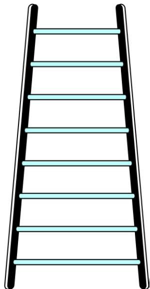  
Fig. 5.1

(iii) In a savings scheme, the amount becomes $\frac { 5 } { 4 }$ times of itself after every 3 years. The maturity amount (in `) of an investment of ` 8000 after 3, 6, 9 and 12 years will be, respectively : 10000, 12500, 15625, 19531.25

(iv) The number of unit squares in squares with side 1, 2, 3, . . . units (see Fig. 5.2) are, respectively 12, 22, 32, . . .

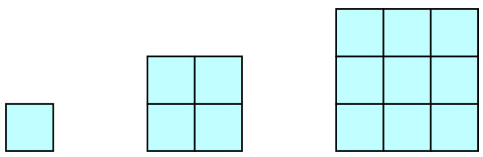  
Fig. 5.2

(v) Shakila puts $\yen 100$ into her daughter’s money box when she was one year old and increased the amount by $\yen 50$ every year. The amounts of money (in `) in the box on the 1st, 2nd, 3rd, 4th, . . . birthday were

100, 150, 200, 250, . . ., respectively.

(vi) A pair of rabbits are too young to produce in their first month. In the second, and every subsequent month, they produce a new pair. Each new pair of rabbits produce a new pair in their second month and in every subsequent month (see Fig. 5.3). Assuming no rabbit dies, the number of pairs of rabbits at the start of the 1st, 2nd, 3rd, . . ., 6th month, respectively are :

  
Fig. 5.3

In the examples above, we observe some patterns. In some, we find that the succeeding terms are obtained by adding a fixed number, in other by multiplying with a fixed number, in another we find that they are squares of consecutive numbers, and so on.

In this chapter, we shall discuss one of these patterns in which succeeding terms are obtained by adding a fixed number to the preceding terms. We shall also see how to find their nth terms and the sum of n consecutive terms, and use this knowledge in solving some daily life problems.

### 5.2 Arithmetic Progressions

Consider the following lists of numbers :

(i) 1, 2, 3, 4, . . .   
(ii) 100, 70, 40, 10, . . .   
(iii) – 3, –2, –1, 0, . . .   
(iv) 3, 3, 3, 3, . . .   
(v) –1.0, –1.5, –2.0, –2.5, . . .

Each of the numbers in the list is called a term.

Given a term, can you write the next term in each of the lists above? If so, how will you write it? Perhaps by following a pattern or rule. Let us observe and write the rule.

In (i), each term is 1 more than the term preceding it.

In (ii), each term is 30 less than the term preceding it.

In (iii), each term is obtained by adding 1 to the term preceding it.

In (iv), all the terms in the list are 3 , i.e., each term is obtained by adding (or subtracting) 0 to the term preceding it.   
In (v), each term is obtained by adding – 0.5 to (i.e., subtracting 0.5 from) the term preceding it.

In all the lists above, we see that successive terms are obtained by adding a fixed number to the preceding terms. Such list of numbers is said to form an Arithmetic Progression ( AP ).

So, an arithmetic progression is a list of numbers in which each term is obtained by adding a fixed number to the preceding term except the first term.

This fixed number is called the common difference of the AP. Remember that it can be positive, negative or zero.

Let us denote the first term of an AP by $a _ { _ 1 }$ , second term by a2, . . ., nth term by $a _ { _ n }$ and the common difference by $d .$ . Then the AP becomes $a _ { 1 } , a _ { 2 } , a _ { 3 } , . . . , a _ { n }$ .

So, $a _ { 2 } - a _ { 1 } = a _ { 3 } - a _ { 2 } = \ldots = a _ { n } - a _ { n - 1 } = d .$

Some more examples of AP are:

(a) The heights ( in cm ) of some students of a school standing in a queue in the morning assembly are 147 , 148, 149, . . ., 157.   
(b) The minimum temperatures ( in degree celsius ) recorded for a week in the month of January in a city, arranged in ascending order are

$$
- 3. 1, - 3. 0, - 2. 9, - 2. 8, - 2. 7, - 2. 6, - 2. 5
$$

(c) The balance money ( in ` ) after paying $5 \%$ of the total loan of ` 1000 every month is 950, 900, 850, 800, . . ., 50.   
(d) The cash prizes ( in ` ) given by a school to the toppers of Classes I to XII are, respectively, 200, 250, 300, 350, . . ., 750.   
(e) The total savings (in `) after every month for 10 months when ` 50 are saved each month are 50, 100, 150, 200, 250, 300, 350, 400, 450, 500.

It is left as an exercise for you to explain why each of the lists above is an AP.

You can see that

$$
a, a + d, a + 2 d, a + 3 d, \dots
$$

represents an arithmetic progression where a is the first term and $d$ the common difference. This is called the general form of an AP.

Note that in examples (a) to (e) above, there are only a finite number of terms. Such an AP is called a finite AP. Also note that each of these Arithmetic Progressions (APs) has a last term. The APs in examples (i) to (v) in this section, are not finite APs and so they are called infinite Arithmetic Progressions. Such APs do not have a last term.

Now, to know about an AP, what is the minimum information that you need? Is it enough to know the first term? Or, is it enough to know only the common difference? You will find that you will need to know both – the first term a and the common difference $d$ .

For instance if the first term a is 6 and the common difference $d$ is 3, then the AP is 6, 9,12, 15, . . .

and if $a$ is 6 and $d$ is – 3, then the AP is

$$
6, 3, 0, - 3, \dots
$$

Similarly, when

$$
a = - 7, \quad d = - 2, \text {t h e} A P \text {i s} - 7, - 9, - 1 1, - 1 3, \dots
$$

$$
a = 1. 0, d = 0. 1, \text {t h e A P i s} 1. 0, 1. 1, 1. 2, 1. 3, \dots
$$

$$
a = 0, \quad d = 1 \frac {1}{2}, \text {t h e A P i s} 0, 1 \frac {1}{2}, 3, 4 \frac {1}{2}, 6, \dots
$$

$$
a = 2, \quad d = 0, \quad \text {t h e A P i s} 2, 2, 2, 2, \dots
$$

So, if you know what $a$ and $d$ are, you can list the AP. What about the other way round? That is, if you are given a list of numbers can you say that it is an AP and then find $a$ and $d ?$ Since $a$ is the first term, it can easily be written. We know that in an AP, every succeeding term is obtained by adding $d$ to the preceding term. So, $d$ found by subtracting any term from its succeeding term, i.e., the term which immediately follows it should be same for an AP.

For example, for the list of numbers :

$$
6, 9, 1 2, 1 5, \ldots ,
$$

We have $a _ { { } _ { 2 } } - a _ { { } _ { 1 } } = 9 { } - 6 = 3 ,$

$$
a _ {3} - a _ {2} = 1 2 - 9 = 3,
$$

$$
a _ {4} - a _ {3} = 1 5 - 1 2 = 3
$$

Here the difference of any two consecutive terms in each case is 3. So, the given list is an AP whose first term $a$ is 6 and common difference $d$ is 3.

For the list of numbers : $6 , 3 , 0 , - 3 , . . . ,$

$$
a _ {2} - a _ {1} = 3 - 6 = - 3
$$

$$
a _ {3} - a _ {2} = 0 - 3 = - 3
$$

$$
a _ {4} - a _ {3} = - 3 - 0 = - 3
$$

Similarly this is also an AP whose first term is 6 and the common difference is $- 3$ .

In general, for an AP $a _ { 1 } , a _ { 2 } , . . . , a _ { n } ,$ we have

$$
d = a _ {k + 1} - a _ {k}
$$

where $a _ { { } _ { k + 1 } }$ and $a _ { \scriptscriptstyle k }$ are the $( k + 1 ) \mathrm { t h }$ and the kth terms respectively.

To obtain $d$ in a given AP, we need not find all of $a _ { 2 } - a _ { 1 } , a _ { 3 } - a _ { 2 } , a _ { 4 } - a _ { 3 } , \ldots .$ It is enough to find only one of them.

Consider the list of numbers 1, 1, 2, 3, 5, . . . . By looking at it, you can tell that the difference between any two consecutive terms is not the same. So, this is not an AP.

Note that to find $d$ in the $\mathbf { A P } : 6 , 3 , 0 , - 3 , . . . _ $ , we have subtracted 6 from 3 and not 3 from 6, i.e., we should subtract the kth term from the $( k + 1 )$ th term even if the $( k + 1 )$ th term is smaller.

Let us make the concept more clear through some examples.

Example 1 : For the ${ \sf A P } : \frac { 3 } { 2 } , \frac { 1 } { 2 } , - \frac { 1 } { 2 } , - \frac { 3 } { 2 } , . . . .$ 2 , write the first term $a$ and the common difference $d$ .

$\mathbf { S o l u t i o n : H e r e } , a = { \frac { 3 } { 2 } } , d = { \frac { 1 } { 2 } } - { \frac { 3 } { 2 } } = - 1 .$ , d = 2

Remember that we can find $d$ using any two consecutive terms, once we know that the numbers are in AP.

Example 2 : Which of the following list of numbers form an AP? If they form an AP, write the next two terms :

(i) 4, 10, 16, 22, . . .

(ii) 1, – 1, – 3, – 5, . . .

(iii) – 2, 2, – 2, 2, – 2, . . .

(iv) 1, 1, 1, 2, 2, 2, 3, 3, 3, . . .

Solution :(i) We have $a _ { 2 } - a _ { 1 } = 1 0 - 4 = 6$

$$
a _ {3} - a _ {2} = 1 6 - 1 0 = 6
$$

$$
a _ {4} - a _ {3} = 2 2 - 1 6 = 6
$$

i.e., $a _ { { } _ { k + 1 } } - a _ { { } _ { k } }$ is the same every time.

So, the given list of numbers forms an AP with the common difference $d = 6$ .

The next two terms are: $2 2 + 6 = 2 8$ and $2 8 + 6 = 3 4$ .

(ii) $a _ { 2 } - a _ { 1 } = - 1 - 1 = - 2$

$$
a _ {3} - a _ {2} = - 3 - (- 1) = - 3 + 1 = - 2
$$

$$
a _ {4} - a _ {3} = - 5 - (- 3) = - 5 + 3 = - 2
$$

i.e., $a _ { { } _ { k + 1 } } - a _ { { } _ { k } }$ is the same every time.

So, the given list of numbers forms an AP with the common difference $d = - 2$ .

The next two terms are:

$$
- 5 + (- 2) = - 7 \quad \text {a n d} \quad - 7 + (- 2) = - 9
$$

(iii) $a _ { 2 } - a _ { 1 } = 2 - ( - 2 ) = 2 + 2 = 4$

$$
a _ {3} - a _ {2} = - 2 - 2 = - 4
$$

As $a _ { 2 } - a _ { 1 } \neq a _ { 3 } - a _ { 2 }$ , the given list of numbers does not form an AP.

(iv) $a _ { \scriptscriptstyle 2 } - a _ { \scriptscriptstyle 1 } = 1 - 1 = 0$

$$
a _ {3} ^ {\prime} - a _ {2} ^ {\prime} = 1 - 1 = 0
$$

$$
\tilde {a _ {4}} - \tilde {a _ {3}} = 2 - 1 = 1
$$

Here, $a _ { 2 } - a _ { 1 } = a _ { 3 } - a _ { 2 } * a _ { 4 } - a _ { 3 }$

So, the given list of numbers does not form an AP.

## EXERCISE 5.1

1. In which of the following situations, does the list of numbers involved make an arithmetic progression, and why?

(i) The taxi fare after each km when the fare is $\yen 15$ for the first km and $\yen 8$ for each additional km.   
(ii) The amount of air present in a cylinder when a vacuum pump removes $\frac { 1 } { 4 }$ of the air remaining in the cylinder at a time.   
(iii) The cost of digging a well after every metre of digging, when it costs ` 150 for the first metre and rises by $\yen 50$ for each subsequent metre.   
(iv) The amount of money in the account every year, when ` 10000 is deposited at compound interest at $8 \%$ per annum.

2. Write first four terms of the AP, when the first term $a$ and the common difference $d$ are given as follows:

(i) $a = 1 0 _ { : }$   
  
(iii) $a = 4 , \quad d = - 3$   
$\begin{array} { l l } { { \mathrm { ( i i ) ~ } a = - 2 , } } & { { \qquad d = 0 } } \\ { { \mathrm { ( i v ) ~ } a = - 1 , } } & { { \qquad d = { \mathrm { ~ \frac { 1 } { 2 } } } } } \end{array}$   
(v)

3. For the following APs, write the first term and the common difference:

(i)

(iii) ${ \frac { 1 } { 3 } } , { \frac { 5 } { 3 } } , { \frac { 9 } { 3 } } , { \frac { 1 3 } { 3 } } , \dots .$

4. Which of the following are APs ? If they form an AP, find the common difference $d$ and write three more terms.

(

(ix) 1, 3, 9, 27, . . .

(x) a, 2a, 3a, 4a, . . .

(xi) a, a2, a3, a4, . . .

(xii) 2, 8, 18 , 32 , . . .

(xiii) 3, 6, 9 , 12 , . . .

(xiv) 12, 32, 52, 72, . . .

(xv) 12, 52, 72, 73, . . .

### 5.3 nth Term of an AP

Let us consider the situation again, given in Section 5.1 in which Reena applied for a job and got selected. She has been offered the job with a starting monthly salary of ` 8000, with an annual increment of ` 500. What would be her monthly salary for the fifth year?

To answer this, let us first see what her monthly salary for the second year would be.

It would be $\yen (8000 +500 ) = \Im$ . In the same way, we can find the monthly salary for the 3rd, 4th and 5th year by adding $\yen 500$ to the salary of the previous year. So, the salary for the 3rd year $= \Re$ (8500 + 500)

$$
\begin{array}{l} = \text {₹} (8 0 0 0 + 5 0 0 + 5 0 0) \\ = \overline {{\overline {{\mathbf {\Pi}}}}} (8 0 0 0 + 2 \times 5 0 0) \\ = \overline {{\mathbf {r}}} [ 8 0 0 0 + (\mathbf {3} - \mathbf {1}) \times 5 0 0 ] \quad (f o r \mathbf {3 r d y e a r}) \\ = \text {₹} 9 0 0 0 \\ \end{array}
$$

Salary for the 4th year $= \mathfrak { F } \left( 9 0 0 0 + 5 0 0 \right)$

$$
\begin{array}{l} = \overline {{\overline {{\mathbf {r}}}}} (8 0 0 0 + 5 0 0 + 5 0 0 + 5 0 0) \\ = \overline {{\overline {{\mathbf {r}}}}} (8 0 0 0 + 3 \times 5 0 0) \\ = \bar {\pi} [ 8 0 0 0 + (4 - 1) \times 5 0 0 ] \quad (\text {f o r t h e 4 t h y e a r}) \\ = \text {₹} 9 5 0 0 \\ \end{array}
$$

Salary for the 5th year $= \mathfrak { F } \left( 9 5 0 0 + 5 0 0 \right)$

$$
\begin{array}{l} = \overline {{\overline {{\mathbf {r}}}}} (8 0 0 0 + 5 0 0 + 5 0 0 + 5 0 0 + 5 0 0) \\ = \overline {{\overline {{\mathbf {r}}}}} (8 0 0 0 + 4 \times 5 0 0) \\ = \widetilde {\pi} [ 8 0 0 0 + (\mathbf {5} - \mathbf {1}) \times 5 0 0 ] \quad (f o r \text {t h e 5 t h y e a r}) \\ = \text {₹} 1 0 0 0 0 \\ \end{array}
$$

Observe that we are getting a list of numbers

$$
8 0 0 0, 8 5 0 0, 9 0 0 0, 9 5 0 0, 1 0 0 0 0, \ldots
$$

These numbers are in AP. (Why?)

Now, looking at the pattern formed above, can you find her monthly salary for the 6th year? The 15th year? And, assuming that she will still be working in the job, what about the monthly salary for the 25th year? You would calculate this by adding $\yen 500$ each time to the salary of the previous year to give the answer. Can we make this process shorter? Let us see. You may have already got some idea from the way we have obtained the salaries above.

Salary for the 15th year

$$
\begin{array}{l} = \text {S a l a r y} + \overline {{\mathbf {r}}} 5 0 0 \\ = \text {₹} \left[ 8 0 0 0 \frac {5 0 0 \quad 5 0 0 \quad 5 0 0 \quad \dots . \quad 5 0 0}{1 3 t i m e s} \right] + \text {₹} 5 0 0 \\ = \text {₹} [ 8 0 0 0 + 1 4 \times 5 0 0 ] \\ = \overline {{\mathbf {r}}} [ 8 0 0 0 + (\mathbf {1 5} - \mathbf {1}) \times 5 0 0 ] = \overline {{\mathbf {r}}} 1 5 0 0 0 \\ \end{array}
$$

i.e., First salary $^ + ( 1 5 - 1 ) \times _ { \cal L }$ Annual increment.

In the same way, her monthly salary for the 25th year would be

$$
\begin{array}{l} \overline {{\mathbf {r}}} [ 8 0 0 0 + (\mathbf {2 5} - \mathbf {1}) \times 5 0 0 ] = \overline {{\mathbf {r}}} 2 0 0 0 0 \\ = \text {F i r s t s a l a r y} + (2 5 - 1) \times \text {A n n u a l i n c r e m e n t} \\ \end{array}
$$

This example would have given you some idea about how to write the 15th term, or the 25th term, and more generally, the nth term of the AP.

Let $a _ { _ 1 } , a _ { _ 2 } , a _ { _ 3 } , . . .$ . be an AP whose first term $a _ { _ 1 }$ is $a$ and the common difference is $d$ . Then,

the second t $\begin{array} { r l } { \mathbf { e r m } a _ { 2 } = { } } & { { } a + d = a + ( 2 - 1 ) d } \end{array}$

the third term $a _ { 3 } = a _ { 2 } + d = ( a + d ) + d = a + 2 d = a + ( 3 - 1 ) d$

the fourth te $\mathrm { r m } a _ { 4 } = a _ { 3 } + d = ( a + 2 d ) + d = a + 3 d = a + ( 4 - 1 ) d$

Looking at the pattern, we can say that the nth term $a _ { _ n } = a + ( n - 1 ) d .$ .

So, the nth term ${ \pmb a } _ { n }$ of the AP with first term a and common difference $\mathbf { \Delta } _ { d }$ is given by $\pmb { a } _ { n } = \pmb { a } + \left( \pmb { n } - 1 \right) \pmb { d } .$

${ \pmb a } _ { n }$ is also called the general term of the AP. If there are $m$ terms in the AP, then ${ \pmb { a } } _ { m }$

represents the last term which is sometimes also denoted by l.

Let us consider some examples.

Example 3 : Find the 10th term of the AP : 2, 7, 12, . . .

Solution : Here, a = 2, d = 7 – 2 = 5 and $n = ~ 1 0$ .

We have $a _ { _ n } = a + ( n - 1 ) d$

So, $a _ { 1 0 } = 2 + ( 1 0 - 1 ) \times 5 = 2 + 4 5 = 4 7$

Therefore, the 10th term of the given AP is 47.

Example 4 : Which term of the AP : 21, 18, 15, . . . is – 81? Also, is any term 0? Give reason for your answer.

Solution : Here, $a = 2 1$ , $d = 1 8 - 2 1 = - 3$ and $a _ { _ n } = - 8 1$ , and we have to find n.

As $a _ { _ n } = a + \left( n - 1 \right) d ,$

we have $- 8 1 = 2 1 + ( n - 1 ) ( - 3 )$

$$
\begin{array}{l} - 8 1 = 2 4 - 3 n \\ - 1 0 5 = - 3 n \\ \end{array}
$$

So, $n = 3 5$

Therefore, the 35th term of the given AP is – 81.

Next, we want to know if there is any $n$ for which $a _ { _ n } = 0$ . If such an $n$ is there, then

$$
2 1 + (n - 1) (- 3) = 0,
$$

i.e., $3 ( n - 1 ) = 2 1$

i.e.,

So, the eighth term is 0.

Example 5 : Determine the AP whose 3rd term is 5 and the 7th term is 9.

Solution : We have

$$
a _ {3} = a + (3 - 1) d = a + 2 d = 5 \tag {1}
$$

and $a _ { \scriptscriptstyle 7 } = a + ( 7 - 1 ) d = a + 6 d = 9$ (2)

Solving the pair of linear equations (1) and (2), we get

$$
a = 3, d = 1
$$

Hence, the required AP is 3, 4, 5, 6, 7, . . .

Example 6 : Check whether 301 is a term of the list of numbers 5, 11, 17, 23, . . .

Solution : We have :

$$
a _ {2} - a _ {1} = 1 1 - 5 = 6, \quad a _ {3} - a _ {2} = 1 7 - 1 1 = 6, \quad a _ {4} - a _ {3} = 2 3 - 1 7 = 6
$$

As $a _ { { } _ { k + 1 } } - a _ { { } _ { k } }$ is the same for $k = 1 , 2 , 3$ , etc., the given list of numbers is an AP.

Now, $a = 5 \quad { \mathrm { a n d } } \quad d = 6 .$

Let 301 be a term, say, the nth term of this AP.

We know that

$$
a _ {n} = a + (n - 1) d
$$

So, 301 = 5 + (n – 1) × 6

i.e., 301 = 6n – 1

So, $n = \ { \frac { 3 0 2 } { 6 } } \ \ { \frac { 1 5 1 } { 3 } }$

But n should be a positive integer (Why?). So, 301 is not a term of the given list of numbers.

Example 7 : How many two-digit numbers are divisible by 3?

Solution : The list of two-digit numbers divisible by 3 is :

$$
1 2, 1 5, 1 8, \dots , 9 9
$$

Is this an AP? Yes it is. Here, $a = 1 2 , \ d = 3 , \ a _ { _ n } = 9 9 .$

As an = a + (n – 1) d, $a _ { _ n } = a + ( n - 1 ) d ,$

we have $9 9 = 1 2 + ( n - 1 ) \times 3$

i.e., $8 7 = ( n - 1 ) \times 3$

i.e., $n - 1 = { \frac { 8 7 } { 3 } } = 2 9$

i.e., $n = 2 9 + 1 = 3 0$

So, there are 30 two-digit numbers divisible by 3.

Example 8 : Find the 11th term from the last term (towards the first term) of the $\mathbf { A P } : 1 0 , 7 , 4 , . . . , - 6 2$ .

Solution : Here, $a = 1 0 , \ d = 7 - 1 0 = - 3 , \ l = - 6 2 ,$

where $l = a + ( n - 1 ) d$

To find the 11th term from the last term, we will find the total number of terms in the AP.

$$
\mathrm {S o}, \quad - 6 2 = 1 0 + (n - 1) (- 3)
$$

$$
\text {i . e . ,} \quad - 7 2 = (n - 1) (- 3)
$$

$$
n - 1 = 2 4
$$

$$
\text {o r} \quad n = 2 5
$$

So, there are 25 terms in the given AP.

The 11th term from the last term will be the 15th term. (Note that it will not be the 14th term. Why?)

$$
\mathrm {S o}, \quad a _ {1 5} = 1 0 + (1 5 - 1) (- 3) = 1 0 - 4 2 = - 3 2
$$

i.e., the 11th term from the last term is – 32.

## Alternative Solution :

If we write the given AP in the reverse order, then $a = - 6 2$ and $d = 3$ (Why?)

So, the question now becomes finding the 11th term with these $a$ and $d$ .

$$
\mathrm {S o}, \quad a _ {1 1} = - 6 2 + (1 1 - 1) \times 3 = - 6 2 + 3 0 = - 3 2
$$

So, the 11th term, which is now the required term, is – 32.

Example 9 : A sum of ` 1000 is invested at $8 \%$ simple interest per year. Calculate the interest at the end of each year. Do these interests form an AP? If so, find the interest at the end of 30 years making use of this fact.

Solution : We know that the formula to calculate simple interest is given by

$$
\text {S i m p l e I n t e r s t} = \frac {\mathrm {P} \times \mathrm {R} \times \mathrm {T}}{1 0 0}
$$

So, the interest at the end of the1st year $=$

The interest at the end of the2nd year $=$

The interest at the end of the3rd year $=$

Similarly, we can obtain the interest at the end of the 4th year, 5th year, and so on.

So, the interest (in `) at the end of the 1st, 2nd, 3rd, . . . years, respectively are

$$
8 0, 1 6 0, 2 4 0, \ldots
$$

It is an AP as the difference between the consecutive terms in the list is 80, i.e., $d = 8 0$ . Also, $a = 8 0$ .

So, to find the interest at the end of 30 years, we shall find $a _ { 3 0 }$ .

Now, $a _ { 3 0 } = a + ( 3 0 - 1 ) d = 8 0 + 2 9 \times 8 0 = 2 4 0 0$

So, the interest at the end of 30 years will be ` 2400.

Example $1 0 :$ In a flower bed, there are 23 rose plants in the first row, 21 in the second, 19 in the third, and so on. There are 5 rose plants in the last row. How many rows are there in the flower bed?

Solution : The number of rose plants in the 1st, 2nd, 3rd, . . ., rows are :

$$
2 3, 2 1, 1 9, \dots , 5
$$

It forms an AP (Why?). Let the number of rows in the flower bed be n.

Then

As,

We have,

i.e.,

i.e.,

So, there are 10 rows in the flower bed.

## EXERCISE 5.2

1. Fill in the blanks in the following table, given that $a$ is the first term, $d$ the common difference and $a _ { _ n }$ the nth term of the AP:

<table><tr><td></td><td>a</td><td>d</td><td>n</td><td>an</td></tr><tr><td>(i)</td><td>7</td><td>3</td><td>8</td><td>...</td></tr><tr><td>(ii)</td><td>-18</td><td>...</td><td>10</td><td>0</td></tr><tr><td>(iii)</td><td>...</td><td>-3</td><td>18</td><td>-5</td></tr><tr><td>(iv)</td><td>-18.9</td><td>2.5</td><td>...</td><td>3.6</td></tr><tr><td>(v)</td><td>3.5</td><td>0</td><td>105</td><td>...</td></tr></table>

2. Choose the correct choice in the following and justify :

(i) 30th term of the AP: 10, 7, 4, . . . , is

(A) 97

(B) 7 7

(C) –7 7

(D) – 87

(ii) 11th term of the AP: – 3, 1- , 2, . . ., is

(A) 28

(B) 2 2

(C) –38

$\mathrm { ( D ) } - 4 8 { \frac { 1 } { 2 } }$

3. In the following APs, find the missing terms in the boxes :

(i) 2, , 26   
(ii) , 13, , 3   
(iii) 5, 19 2   
(iv) – 4, 6   
(v) , 38, , , , – 22

4. Which term of the AP : 3, 8, 13, 18, . . . ,is 78?

5. Find the number of terms in each of the following APs :

(i) 7, 13, 19, . . . , 205

$( \mathrm { i i } ) 1 8 , 1 5 { \frac { 1 } { 2 } } , 1 3 , \dots , - 4 7$

6. Check whether – 150 is a term of the AP : 11, 8, 5, 2 . . .   
7. Find the 31st term of an AP whose 11th term is 38 and the 16th term is 73.   
8. An AP consists of 50 terms of which 3rd term is 12 and the last term is 106. Find the 29th term.   
9. If the 3rd and the 9th terms of an AP are 4 and – 8 respectively, which term of this AP is zero?   
10. The 17th term of an AP exceeds its 10th term by 7. Find the common difference.   
11. Which term of the AP : 3, 15, 27, 39, . . . will be 132 more than its 54th term?   
12. Two APs have the same common difference. The difference between their 100th terms is 100, what is the difference between their 1000th terms?   
13. How many three-digit numbers are divisible by 7?   
14. How many multiples of 4 lie between 10 and 250?   
15. For what value of $n$ , are the nth terms of two APs: 63, 65, 67, . . . and 3, 10, 17, . . . equal?   
16. Determine the AP whose third term is 16 and the 7th term exceeds the 5th term by 12.

17. Find the 20th term from the last term of the AP : 3, 8, 13, . . ., 253.   
18. The sum of the 4th and 8th terms of an AP is 24 and the sum of the 6th and 10th terms is 44. Find the first three terms of the AP.   
19. Subba Rao started work in 1995 at an annual salary of ` 5000 and received an increment of ` 200 each year. In which year did his income reach ` 7000?   
20. Ramkali saved ` 5 in the first week of a year and then increased her weekly savings by ` 1.75. If in the nth week, her weekly savings become ` 20.75, find n.

### 5.4 Sum of First n Terms of an AP

Let us consider the situation again given in Section 5.1 in which Shakila put $\yen 100$ into her daughter’s money box when she was one year old, ` 150 on her second birthday, $\yen 200$ on her third birthday and will continue in the same way. How much money will be collected in the money box by the time her daughter is 21 years old?

Here, the amount of money (in `) put in the money box on her first, second, third, fourth . . . birthday were respectively 100, 150, 200, 250, . . . till her 21st birthday. To find the total amount in the money box on her 21st birthday, we will have to write each of the 21 numbers in the list above and then add them up. Don’t you think it would be a tedious and time consuming process? Can we make the process shorter? This would be possible if we can find a method for getting this sum. Let us see.

We consider the problem given to Gauss (about whom you read in Chapter 1), to solve when he was just 10 years old. He was asked to find the sum of the positive integers from 1 to 100. He immediately replied that the sum is 5050. Can you guess how did he do? He wrote :

$$
S = 1 + 2 + 3 + \dots + 9 9 + 1 0 0
$$

And then, reversed the numbers to write

$$
S = 1 0 0 + 9 9 + \dots + 3 + 2 + 1
$$

Adding these two, he got

$$
\begin{array}{l} 2 S = (1 0 0 + 1) + (9 9 + 2) + \dots + (3 + 9 8) + (2 + 9 9) + (1 + 1 0 0) \\ = 1 0 1 + 1 0 1 + \dots + 1 0 1 + 1 0 1 \quad (1 0 0 \text {t i m e s}) \\ \end{array}
$$

So, $\mathbf { S } = { \frac { 1 0 0 \times 1 0 1 } { 2 } } \quad 5 0 5 0 , { \mathrm { i . e . , t h e ~ s u m } } = 5 0 5 0 .$ $\mathrm { s u m } = 5 0 5 0$

We will now use the same technique to find the sum of the first n terms of an AP :

$$
a, a + d, a + 2 d, \dots
$$

The nth term of this AP is $a + ( n - 1 ) d .$ Let S denote the sum of the first n terms of the AP. We have

$$
\mathrm {S} = a + (a + d) + (a + 2 d) + \dots + [ a + (n - 1) d ] \tag {1}
$$

Rewriting the terms in reverse order, we have

$$
\mathrm {S} = [ a + (n - 1) d ] + [ a + (n - 2) d ] + \dots + (a + d) + a \tag {2}
$$

On adding (1) and (2), term-wise. we get

$$
2 S \frac {\left[ 2 a (n - 1) d \right] \left[ 2 a (n - 1) d \right] \dots \left[ 2 a (n - 1) d \right] \left[ 2 a (n - 1) d \right]}{n t i m e s}
$$

or, $2 \mathrm { S } = n \left[ 2 a + \left( n - 1 \right) d \right]$ (Since, there are n terms)

or, $\mathbf { S } = { \frac { n } { 2 } } \ \left[ 2 a + \left( n - 1 \right) d \right]$

So, the sum of the first n terms of an AP is given by

$$
\mathrm {S} = \frac {n}{2} [ 2 a + (n - 1) d ]
$$

We can also write this as

i.e., ${ \bf S } = \frac { \pmb { n } } { 2 } \left( { \pmb { a } } + { \pmb { a } } _ { n } \right)$ (3)

Now, if there are only $n$ terms in an AP, then $a _ { _ n } = l .$ , the last term. From (3), we see that

$$
\mathbf {S} = \frac {n}{2} (a + l) \tag {4}
$$

This form of the result is useful when the first and the last terms of an AP are given and the common difference is not given.

Now we return to the question that was posed to us in the beginning. The amount of money (in Rs) in the money box of Shakila’s daughter on 1st, 2nd, 3rd, 4th birthday, . . ., were 100, 150, 200, 250, . . ., respectively.

This is an AP. We have to find the total money collected on her 21st birthday, i.e., the sum of the first 21 terms of this AP.

Here, $a = 1 0 0$ , $d = 5 0$ and $n = 2 1$ . Using the formula :

$$
\mathrm {S} = \frac {n}{2} 2 a _ {+} (n - 1) d,
$$

we have $\mathbf { S } = { \frac { 2 1 } { 2 } } \ 2 { \mathrm { \times } } \ 1 0 0 _ { \mathrm { + } } \ ( 2 1 _ { \mathrm { - } } \ 1 ) { \mathrm { \times } } \ 5 0 \ = { \frac { 2 1 } { 2 } } \ 2 0 0 1 0 0 0$

$$
= \frac {2 1}{2} \times 1 2 0 0 = 1 2 6 0 0
$$

So, the amount of money collected on her 21st birthday is ` 12600.

Hasn’t the use of the formula made it much easier to solve the problem?

We also use $\mathrm { S } _ { n }$ in place of S to denote the sum of first n terms of the AP. We write $\mathrm { S } _ { 2 0 }$ to denote the sum of the first 20 terms of an AP. The formula for the sum of the first $n$ terms involves four quantities S, a, d and n. If we know any three of them, we can find the fourth.

Remfirst $( n - 1 )$ The nth term of  terms of it, i.e., $a _ { _ n } = \mathbf S _ { _ n } - \mathbf S _ { _ n - 1 }$ fference of the sum to first n terms and the sum to.

Let us consider some examples.

Example 11 : Find the sum of the first 22 terms of the AP : 8, 3, –2, . . .

Solution : Here, a = 8, d = 3 – 8 = –5, $n = 2 2$ .

We know that

$$
S = \frac {n}{2} 2 a _ {+} (n - 1) d
$$

Therefore, $\mathrm { S } = { \frac { 2 2 } { 2 } } \ 1 6 \ \div \ 2 1 \left( { \cdot } 5 \right) \ = 1 1 ( 1 6 - 1 0 5 ) = 1 1 ( - 8 9 ) = - 9 7 9$

So, the sum of the first 22 terms of the AP is – 979.

Example 12 : If the sum of the first 14 terms of an AP is 1050 and its first term is 10, find the 20th term.

Solution : Here, $\mathrm { S } _ { 1 4 } = 1 0 5 0$ , n = 14, a = 10.

As ${ \mathrm { S } } _ { n } = { \frac { n } { 2 } } ~ 2 a _ { \mathrm { ~ + ~ } } ( n _ { \mathrm { ~ - ~ } } 1 ) d ~ ,$

so, $1 0 5 0 = { \frac { 1 4 } { 2 } } 2 0 1 3 d = 1 4 0 + 9 1 d$

i.e., $9 1 0 = 9 1 d$

or, d = 10

Therefore, $a _ { _ { 2 0 } } = 1 0 + ( 2 0 - 1 ) \times 1 0 = 2 0 0$ , i.e. 20th term is 200.

Example 13 : How many terms of the AP : 24, 21, 18, . . . must be taken so that their sum is 78?

Solution : Here, a = 24, d = 21 – 24 = –3, $\mathrm { S } _ { n } = 7 8$ . We need to find $n$ .

We know that $\mathrm { S } _ { n } = { \frac { n } { 2 } } ~ 2 a _ { \mathrm { ~ + ~ } } ( n _ { \mathrm { ~ - ~ } } 1 ) d$

So, $7 8 = { \frac { n } { 2 } } ~ 4 8 \div ( n - 1 ) ( - 3 )  { } ~ = { \frac { n } { 2 } } ~ 5 1 . ~ 3 n$

or 3n2 – 51n + 156 = 0

or n2 – 17n + 52 = 0

or (n – 4)(n – 13) = 0

or n = 4 or 13

Both values of $n$ are admissible. So, the number of terms is either 4 or 13.

## Remarks:

1. In this case, the sum of the first 4 terms $=$ the sum of the first 13 terms $= 7 8$ .   
2. Two answers are possible because the sum of the terms from 5th to 13th will be zero. This is because $a$ is positive and $d$ is negative, so that some terms will be positive and some others negative, and will cancel out each other.

Example 14 : Find the sum of :

(i) the first 1000 positive integers (ii) the first $n$ positive integers

## Solution :

(i) Let $\mathrm { S } = 1 + 2 + 3 + \dotsc + 1 0 0 0$

Using the formula $\mathrm { ~ S ~ } _ { n } = \frac { n } { \nu } ( a l )$ for the sum of the first $n$ terms of an AP, we have $\mathrm { S } _ { _ { 1 0 0 0 } } = { \frac { \mathrm { \Omega } _ { 1 0 0 0 } ^ { \mathrm { 1 } } } { 2 } } ( 1 \quad 1 0 0 0 ) \mathrm { \Omega } = 5 0 0 \times 1 0 0 1 = 5 0 0 5 0 0$ S1000 n 21000

So, the sum of the first 1000 positive integers is 500500.

(ii) Let $\operatorname { S } _ { n } = 1 + 2 + 3 + . . . + n$

Here $a = 1$ and the last term $l$ is $n$ .

Therefore, S = (1 )n n $\mathrm { S } _ { n } = \frac { n \left( 1 ~ n \right) } { 2 } ~ \mathrm { o r } ~ \mathrm { S } _ { n } = \frac { n \left( n ~ 1 \right) } { 2 }$ S = ( 1)n n

So, the sum of first n positive integers is given by

$$
\mathbf {S} _ {n} = \frac {n (n + 1)}{2}
$$

Example 15 : Find the sum of first 24 terms of the list of numbers whose nth term is given by

$$
a _ {n} = 3 + 2 n
$$

## Solution :

As

so,

$$
a _ {2} = 3 + 2 \times 2 = 7
$$

$$
a _ {3} = 3 + 2 \times 3 = 9
$$

List of numbers becomes 5, 7, 9, 11, . . .

Here, $7 - 5 = 9 - 7 = 1 1 - 9 = 2$ and so on.

So, it forms an AP with common difference $d = 2$ .

To find $\mathrm { S } _ { 2 4 }$ , we have $n = 2 4 , \quad a = 5 , \quad d = 2 .$

Therefore, $\mathbf { S } _ { 2 4 } = { \frac { 2 4 } { 2 } } ~ 2 . ~ 5 _ { + } ~ ( 2 4 - 1 ) { \times } ~ 2 ~ = 1 2 ~ 1 0 4 6 = 6 7 2$

So, sum of first 24 terms of the list of numbers is 672.

Example 16 : A manufacturer of TV sets produced 600 sets in the third year and 700 sets in the seventh year. Assuming that the production increases uniformly by a fixed number every year, find :

(i) the production in the 1st year (ii) the production in the 10th year

(iii) the total production in first 7 years

Solution : (i) Since the production increases uniformly by a fixed number every year, the number of TV sets manufactured in 1st, 2nd, 3rd, . . ., years will form an AP.

Let us denote the number of TV sets manufactured in the nth year by $a _ { _ n }$

Then, $a _ { 3 } = 6 0 0$ and $a _ { 7 } = 7 0 0$

$$
\text {o r}, \quad a + 2 d = 6 0 0
$$

$$
a + 6 d = 7 0 0
$$

Solving these equations, we get $d = 2 5$ and $a = 5 5 0$ .

Therefore, production of TV sets in the first year is 550.

(ii) Now a10 = a + 9d = 550 + 9 × 25 = 775 $a _ { _ { 1 0 } } = a + 9 d = 5 5 0 + 9 \times 2 5 = 7 7 5$

So, production of TV sets in the 10th year is 775.

(iii) Also, $\mathbf { S } _ { 7 } = \frac { 7 } { 2 } ~ 2 \times 5 5 0  { + } ( 7  { - } 1 ) \times 2 5$

$$
= \frac {7}{2} 1 1 0 0 1 5 0 = 4 3 7 5
$$

Thus, the total production of TV sets in first 7 years is 4375.

## EXERCISE 5.3

1. Find the sum of the following APs:

(i) 2, 7, 12, . . ., to 10 terms. (ii) –37, –33, –29, . . ., to 12 terms.   
(iii) 0.6, 1.7, 2.8, . . ., to 100 terms. (iv) ${ \frac { 1 } { 1 5 } } , { \frac { 1 } { 1 2 } } , { \frac { 1 } { 1 0 } } \ , \ \cdot \ \cdot \ \cdot$ to 11 terms.

2. Find the sums given below :

(i) $7 + 1 0 { \frac { 1 } { 2 } } + 1 4 + \ldots + 8 4 \quad { \mathrm { ( i i ) ~ } } 3 4 + 3 2 + 3 0 + \ldots + 1 0$   
(iii) $- 5 + ( - 8 ) + ( - 1 1 ) + \dots + ( - 2 3 0 )$

3. In an AP:

(i) given $a = 5$ , $d = 3$ , $a _ { _ n } = 5 0$ , find $n$ and $\mathrm { S } _ { n }$   
(ii) given $a = 7$ , $a _ { 1 3 } = 3 5$ , find $d$ and $\mathrm { S } _ { 1 3 }$   
(iii) given $a _ { _ { 1 2 } } = 3 7$ 13, $d = 3$ , find $a$ and $\mathrm { S } _ { 1 2 }$   
(iv) given $a _ { _ 3 } = 1 5$ , $\mathrm { S } _ { 1 0 } = 1 2 5$ , find $d$ 12 and $a _ { 1 0 }$   
(v) given $d = 5$ , $\mathrm { S } _ { 9 } = 7 5$ , find $a$ and $a _ { \mathfrak { g } }$   
(vi) given $a = 2$ , $d = 8$ , $\mathrm { S } _ { n } = 9 0$ , find $n$ and $a _ { _ n }$   
(vii) given $a = 8$ , $a _ { n } = 6 2$ , $\mathrm { S } _ { n } = 2 1 0$ , find $n$ and $d$   
(viii) given $a _ { _ n } = 4$ , $d = 2$ , $\mathrm { S } _ { n } = - 1 4$ , find $n$ and $a$   
(ix) given $a = 3$ , $n = 8$ , $\mathrm { S } = 1 9 2$ , find $d .$   
(x) given $l = 2 8$ , $\mathrm { S } = 1 4 4$ , and there are total 9 terms. Find $a$

4. How many terms of the AP : 9, 17, 25, . . . must be taken to give a sum of 636?

5. The first term of an AP is 5, the last term is 45 and the sum is 400. Find the number of terms and the common difference.

6. The first and the last terms of an AP are 17 and 350 respectively. If the common difference is 9, how many terms are there and what is their sum?

7. Find the sum of first 22 terms of an AP in which $d = 7$ and 22nd term is 149.

8. Find the sum of first 51 terms of an AP whose second and third terms are 14 and 18 respectively.

9. If the sum of first 7 terms of an AP is 49 and that of 17 terms is 289, find the sum of first $n$ terms.

10. Show that $a _ { 1 } , a _ { 2 } , . . . , a _ { n } , . . . .$ form an AP where $a _ { _ n }$ is defined as below :

(i) $a _ { n } = 3 + 4 n$

(ii) $a _ { n } = 9 - 5 n$

Also find the sum of the first 15 terms in each case.

11. If the sum of the first n terms of an AP is $4 n - n ^ { 2 }$ , what is the first term (that is S )? What is the sum of first two terms? What is the second term? Similarly, find the 3rd, the 10th and the nth terms.   
12. Find the sum of the first 40 positive integers divisible by 6.   
13. Find the sum of the first 15 multiples of 8.   
14. Find the sum of the odd numbers between 0 and 50.   
15. A contract on construction job specifies a penalty for delay of completion beyond a certain date as follows: ` 200 for the first day, $\yen 250$ for the second day, $\yen 300$ for the third day, etc., the penalty for each succeeding day being $\yen 50$ more than for the preceding day. How much money the contractor has to pay as penalty, if he has delayed the work by 30 days?   
16. A sum of $\yen 700$ is to be used to give seven cash prizes to students of a school for their overall academic performance. If each prize is $\yen 20$ less than its preceding prize, find the value of each of the prizes.   
17. In a school, students thought of planting trees in and around the school to reduce air pollution. It was decided that the number of trees, that each section of each class will plant, will be the same as the class, in which they are studying, e.g., a section of Class I will plant 1 tree, a section of Class II will plant 2 trees and so on till Class XII. There are three sections of each class. How many trees will be planted by the students?   
18. A spiral is made up of successive semicircles, with centres alternately at A and B, starting with centre at A, of radii $0 . 5 ~ \mathrm { c m }$ , 1.0 cm, 1.5 cm, 2.0 cm, . . . as shown in Fig. 5.4. What is the total length of such a spiral made up of thirteen consecutive semicircles? (Take ${ \mathrm { ~  ~ \pi ~ } } _ { \pi } = { \frac { 2 2 } { 7 } } { \mathrm { ~  ~ \pi ~ } }$

  
Fig. 5.4

[Hint : Length of successive semicircles is $l _ { 1 } , l _ { 2 } , l _ { 3 } , l _ { 4 } , \ldots .$ with centres at A, B, A, B, . . ., respectively.]

19. 200 logs are stacked in the following manner: 20 logs in the bottom row, 19 in the next row, 18 in the row next to it and so on (see Fig. 5.5). In how many rows are the 200 logs placed and how many logs are in the top row?

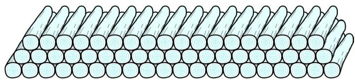  
Fig. 5.5

20. In a potato race, a bucket is placed at the starting point, which is 5 m from the first potato, and the other potatoes are placed 3 m apart in a straight line. There are ten potatoes in the line (see Fig. 5.6).

  
Fig. 5.6

A competitor starts from the bucket, picks up the nearest potato, runs back with it, drops it in the bucket, runs back to pick up the next potato, runs to the bucket to drop it in, and she continues in the same way until all the potatoes are in the bucket. What is the total distance the competitor has to run?

[Hint : To pick up the first potato and the second potato, the total distance (in metres) run by a competitor is $2 \times 5 + 2 \times ( 5 + 3 ) ]$

## EXERCISE 5.4 (Optional)*

1. Which term of the AP : 121, 117, 113, . . ., is its first negative term?

[Hint : Find n for $a _ { _ n } < 0 ]$

2. The sum of the third and the seventh terms of an AP is 6 and their product is 8. Find the sum of first sixteen terms of the AP.   
3. A ladder has rungs 25 cm apart. (see Fig. 5.7). The rungs decrease uniformly in length from 45 cm at the bottom to $2 5 \mathrm { c m }$ at the top. If the top and the bottom rungs are $2 { \frac { 1 } { 2 } } \mathbf { m }$ apart, what is the length of the wood required for the rungs?

$[ \mathbf { H i n t : N u m b e r { o f r u n g s } = { \frac { 2 5 0 } { 2 5 } } } \quad 1 ]$

  
Fig. 5.7

4. The houses of a row are numbered consecutively from 1 to 49. Show that there is a value of $x$ such that the sum of the numbers of the houses preceding the house numbered $x$ is equal to the sum of the numbers of the houses following it. Find this value of $x$ .

$$
[ \mathbf {H i n t}: \mathrm {S} _ {x - 1} = \mathrm {S} _ {4 9} - \mathrm {S} _ {x} ]
$$

5. A small terrace at a football ground comprises of 15 steps each of which is $5 0 \mathrm { m }$ long and built of solid concrete.

Each step has a rise of $\frac 1 4$ m and a tread of $\frac { 1 } { 2 } \mathrm { m }$ . (see Fig. 5.8). Calculate the total volume of concrete required to build the terrace.

[Hint : Volume of concrete required to build the first step $= \frac { 1 } { 4 } \times \ \frac { 1 } { 2 } \times 5 0 \mathrm { m } ^ { 3 } ]$ 1 350 m 2´ ´ ]

  
Fig. 5.8

### 5.5 Summary

In this chapter, you have studied the following points :

1. An arithmetic progression (AP) is a list of numbers in which each term is obtained by adding a fixed number $d$ to the preceding term, except the first term. The fixed number $d$ is called the common difference.

The general form of an AP is $a , \ a + d , \ a + 2 d , \ a + 3 d , \ldots$

2. A given list of numbers $a _ { _ 1 } , \ : a _ { _ 2 } , \ : a _ { _ 3 } , \ldots .$ . is an AP, if the differences $a _ { 2 } - a _ { 1 } , a _ { 3 } - a _ { 2 } ,$ $a _ { 4 } - a _ { 3 } , . . . . ,$ give the same value, i.e., if $a _ { { } _ { k + 1 } } - a _ { { } _ { k } }$ is the same for different values of $k$ .   
3. In an AP with first term $a$ and common difference $d .$ , the nth term (or the general term) is given by $a _ { _ n } = a + ( n - 1 ) d .$ .   
4. The sum of the first $n$ terms of an AP is given by :

$$
S = \frac {n}{2} 2 a + (n - 1) d
$$

5. If l is the last term of the finite AP, say the nth term, then the sum of all terms of the AP is given by :

$$
\mathrm {S} = \frac {n}{2} (a l)
$$

## A NOTE TO THE READER

If a, b, c are in AP, then $b = { \frac { a \ c { c } } { 2 } }$ and $b$ is called the arithmetic mean of $a$ and $c$ .

1062CH06
# chapter 6
# TRIANGLES

### 6.1 Introduction

You are familiar with triangles and many of their properties from your earlier classes. In Class IX, you have studied congruence of triangles in detail. Recall that two figures are said to be congruent, if they have the same shape and the same size. In this chapter, we shall study about those figures which have the same shape but not necessarily the same size. Two figures having the same shape (and not necessarily the same size) are called similar figures. In particular, we shall discuss the similarity of triangles and apply this knowledge in giving a simple proof of Pythagoras Theorem learnt earlier.

Can you guess how heights of mountains (say Mount Everest) or distances of some long distant objects (say moon) have been found out? Do you think these have

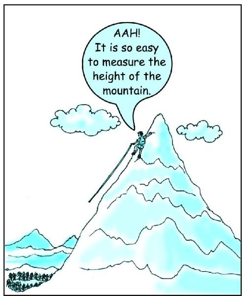

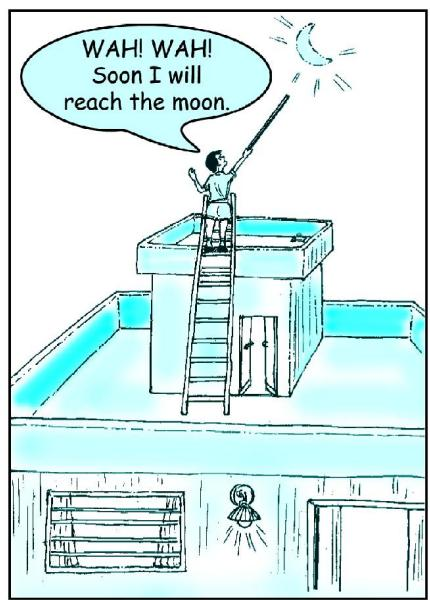

been measured directly with the help of a measuring tape? In fact, all these heights and distances have been found out using the idea of indirect measurements, which is based on the principle of similarity of figures (see Example 7, Q.15 of Exercise 6.3 and also Chapters 8 and 9 of this book)

### 6.2 Similar Figures

In Class IX, you have seen that all circles with the same radii are congruent, all squares with the same side lengths are congruent and all equilateral triangles with the same side lengths are congruent.

Now consider any two (or more) circles [see Fig. 6.1 (i)]. Are they congruent? Since all of them do not have the same radius, they are not congruent to each other. Note that some are congruent and some are not, but all of them have the same shape. So they all are, what we call, similar. Two similar figures have the same shape but not necessarily the same size. Therefore, all circles are similar. What about two (or more) squares or two (or more) equilateral triangles [see Fig. 6.1 (ii) and (iii)]? As observed in the case of circles, here also all squares are similar and all equilateral triangles are similar.

From the above, we can say that all congruent figures are similar but the similar figures need not be congruent.

Can a circle and a square be similar? Can a triangle and a square be similar? These questions can be answered by just looking at the figures (see Fig. 6.1). Evidently these figures are not similar. (Why?)

  
(i)

  
(ii)

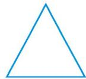

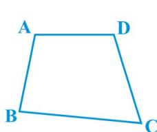  
Fig. 6.1

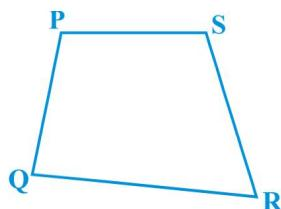  
Fig. 6.2

What can you say about the two quadrilaterals ABCD and PQRS (see Fig 6.2)?Are they similar? These figures appear to be similar but we cannot be certain about it.Therefore, we must have some definition of similarity of figures and based on this definition some rules to decide whether the two given figures are similar or not. For this, let us look at the photographs given in Fig. 6.3:

  
Fig. 6.3

You will at once say that they are the photographs of the same monument (Taj Mahal) but are in different sizes. Would you say that the three photographs are similar? Yes,they are.

What can you say about the two photographs of the same size of the same person one at the age of 10 years and the other at the age of 40 years? Are these photographs similar? These photographs are of the same size but certainly they are not of the same shape. So, they are not similar.

What does the photographer do when she prints photographs of different sizes from the same negative? You must have heard about the stamp size, passport size and postcard size photographs. She generally takes a photograph on a small size film, say of 35mm size and then enlarges it into a bigger size, say 45mm (or $5 5 \mathrm { m m } )$ ). Thus, if we consider any line segment in the smaller photograph (figure), its corresponding line segment in the bigger photograph (figure) will be ${ \frac { 4 5 } { 3 5 } } \left( \operatorname { o r } { \frac { 5 5 } { 3 5 } } \right)$ of that of the line segment. This really means that every line segment of the smaller photograph is enlarged (increased) in the ratio 35:45 (or 35:55). It can also be said that every line segment of the bigger photograph is reduced (decreased) in the ratio 45:35 (or 55:35). Further, if you consider inclinations (or angles) between any pair of corresponding line segments in the two photographs of different sizes, you shall see that these inclinations(or angles) are always equal. This is the essence of the similarity of two figures and in particular of two polygons. We say that:

Two polygons of the same number of sides are similar, $i f ( i )$ their corresponding angles are equal and (ii) their corresponding sides are in the same ratio (or proportion).

Note that the same ratio of the corresponding sides is referred to as the scale factor (or the Representative Fraction) for the polygons. You must have heard that world maps (i.e., global maps) and blue prints for the construction of a building are prepared using a suitable scale factor and observing certain conventions.

In order to understand similarity of figures more clearly, let us perform the following activity:

Activity 1 : Place a lighted bulb at a point O on the ceiling and directly below it a table in your classroom. Let us cut a polygon, say a quadrilateral ABCD, from a plane cardboard and place this cardboard parallel to the ground between the lighted bulb and the table. Then a shadow of ABCD is cast on the table. Mark the outline of this shadow as $\mathrm { { A ^ { \prime } B ^ { \prime } C ^ { \prime } D ^ { \prime } } }$ (see Fig.6.4).

Note that the quadrilateral $\mathrm { { A ^ { \prime } B ^ { \prime } C ^ { \prime } D ^ { \prime } } }$ is an enlargement (or magnification) of the quadrilateral ABCD. This is because of the property of light that light propogates in a straight line. You may also note that $\mathbf { A ^ { \prime } }$ lies on ray OA, $\mathrm { B ^ { \prime } }$ lies on ray OB, C¢

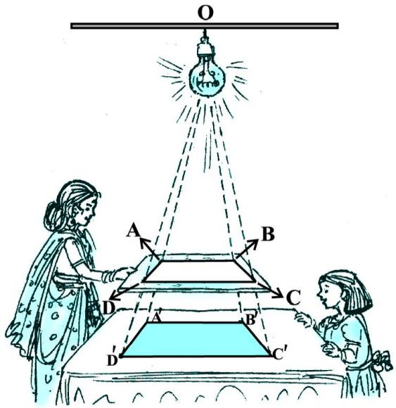  
Fig. 6.4

lies on OC and $\mathrm { D ^ { \prime } }$ lies on OD. Thus, quadrilaterals A¢B¢C¢D¢ and ABCD are of the same shape but of different sizes.

So, quadrilateral $\mathrm { { A ^ { \prime } B ^ { \prime } C ^ { \prime } D ^ { \prime } } }$ is similiar to quadrilateral ABCD. We can also say that quadrilateral ABCD is similar to the quadrilateral A¢B¢C¢D¢.

Here, you can also note that vertex $\mathbf { A ^ { \prime } }$ corresponds to vertex A, vertex $\mathrm { B ^ { \prime } }$ corresponds to vertex B, vertex $\mathrm { C } ^ { \prime }$ corresponds to vertex C and vertex $\mathbf { D ^ { \prime } }$ corresponds to vertex D. Symbolically, these correspondences are represented as $\mathbf { A ^ { \prime } }  \mathbf { A }$ , $\mathrm { B ^ { \prime } }  \mathrm { B }$ , $\mathrm { C } ^ { \prime }  \mathrm { C }$ and $\mathrm { D } ^ { \prime }  \mathrm { D }$ . By actually measuring the angles and the sides of the two quadrilaterals, you may verify that

$\mathrm { ( i ) } \ \angle \mathrm { A } = \angle \mathrm { A } ^ { \prime } , \angle \mathrm { B } = \angle \mathrm { B } ^ { \prime } , \angle \mathrm { C } = \angle \mathrm { C } ^ { \prime } , \angle \mathrm { D } = \angle \mathrm { D } ^ { \prime }$ $\angle \mathbf { C } = \angle \mathbf { C ^ { \prime } }$ $\angle \mathrm { D } = \angle \mathrm { D } ^ { \prime }$ and   
(ii) ${ \frac { \mathrm { A B } } { { \mathrm { A } } ^ { \prime } { \mathrm { B } } ^ { \prime } } } = { \frac { \mathrm { B C } } { { \mathrm { B } } ^ { \prime } { \mathrm { C } } ^ { \prime } } } = { \frac { \mathrm { C D } } { { \mathrm { C } } ^ { \prime } { \mathrm { D } } ^ { \prime } } } = { \frac { { \mathrm { D A } } } { { \mathrm { D } } ^ { \prime } { \mathrm { A } } ^ { \prime } } } \cdotp$ =

This again emphasises that two polygons of the same number of sides are similar, if (i) all the corresponding angles are equal and $( i i )$ all the corresponding sides are in the same ratio (or proportion).

From the above, you can easily say that quadrilaterals ABCD and PQRS of Fig. 6.5 are similar.

  
Fig. 6.5

Remark : You can verify that if one polygon is similar to another polygon and this second polygon is similar to a third polygon, then the first polygon is similar to the third polygon.

You may note that in the two quadrilaterals (a square and a rectangle) of Fig. 6.6, corresponding angles are equal, but their corresponding sides are not in the same ratio.

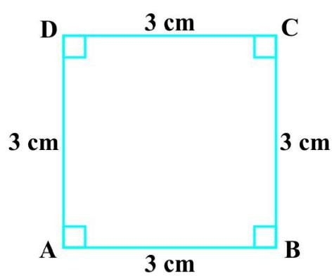

  
Fig. 6.6

So, the two quadrilaterals are not similar. Similarly, you may note that in the two quadrilaterals (a square and a rhombus) of Fig. 6.7, corresponding sides are in the same ratio, but their corresponding angles are not equal. Again, the two polygons (quadrilaterals) are not similar.

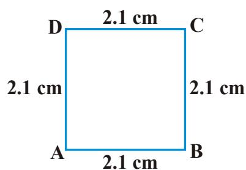

  
Fig. 6.7

Thus, either of the above two conditions (i) and (ii) of similarity of two polygons is not sufficient for them to be similar.

## EXERCISE 6.1

1. Fill in the blanks using the correct word given in brackets :

(i) All circles are . (congruent, similar)   
(ii) All squares are . (similar, congruent)   
(iii) All triangles are similar. (isosceles, equilateral)   
(iv) Two polygons of the same number of sides are similar, if (a) their corresponding angles are and (b) their corresponding sides are . (equal, proportional)

2. Give two different examples of pair of

(i) similar figures.

(ii) non-similar figures.

3. State whether the following quadrilaterals are similar or not:

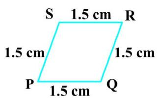

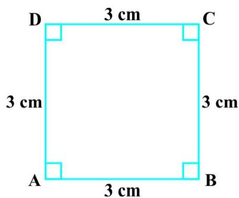  
Fig. 6.8

### 6.3 Similarity of Triangles

What can you say about the similarity of two triangles?

You may recall that triangle is also a polygon. So, we can state the same conditions for the similarity of two triangles. That is:

Two triangles are similiar, if

(i) their corresponding angles are equal and   
(ii) their corresponding sides are in the same ratio (or proportion).

Note that if corresponding angles of two triangles are equal, then they are known as equiangular triangles. A famous Greek mathematician Thales gave an important truth relating to two equiangular triangles which is as follows:

The ratio of any two corresponding sides in two equiangular triangles is always the same.

It is believed that he had used a result called the Basic Proportionality Theorem (now known as the Thales Theorem) for the same.

To understand the Basic Proportionality Theorem, let us perform the following activity:

Activity $2 :$ Draw any angle XAY and on its one arm AX, mark points (say five points) P, Q, D, R and B such that $\mathrm { A P = P Q = Q D = D R = R B }$ .

Now, through B, draw any line intersecting arm AY at C (see Fig. 6.9).

Also, through the point D, draw a line parallel to BC to intersect AC at E. Do you observe from your constructions that ${ \frac { \mathrm { A D } } { \mathrm { D B } } } = { \frac { 3 } { 2 } } ?$ Measure AE and

  
Thales (640 – 546 B.C.)

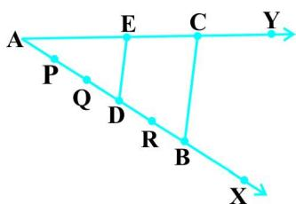  
Fig. 6.9

EC. What about $\frac { \mathrm { A E } } { \mathrm { E C } } ?$ Observe that $\frac { \mathrm { A E } } { \mathrm { E C } }$ is also equal to $\frac { 3 } { 2 }$ . Thus, you can see that in D ABC, DE $\Vert \mathrm { B C }$ and ${ \frac { \mathrm { A D } } { \mathrm { D B } } } = { \frac { \mathrm { A E } } { \mathrm { E C } } }$ . Is it a coincidence? No, it is due to the following theorem (known as the Basic Proportionality Theorem):

Theorem 6.1 : If a line is drawn parallel to one side of a triangle to intersect the other two sides in distinct points, the other two sides are divided in the same ratio.

Proof : We are given a triangle ABC in which a line parallel to side BC intersects other two sides AB and AC at D and E respectively (see Fig. 6.10).

We need to prove that $\mathrm { \frac { A D } { D B } } = \mathrm { \frac { A E } { E C } }$

Let us join BE and CD and then draw DM ^ AC and EN ^ AB.

  
Fig. 6.10

Now, area of D ADE (= 12 $\mathrm { N o w , a r e a \ o f \Delta A D E ( = \frac { 1 } { 2 } \ b a s e \times h e i g h t ) = \frac { 1 } { 2 } \ A D \times E N . }$

Recall from Class IX, that area of $\Delta$ ADE is denoted as ar(ADE).

So, $\mathrm { a r } ( \mathrm { A D E } ) = \mathrm { \frac { 1 } { 2 } \cdot \mathrm { A D \times E N } }$

Similarly, $\operatorname { a r } ( \mathrm { B D E } ) = \mathrm { \frac { 1 } { 2 } ~ } \mathrm { D B } \times \mathrm { E N } ,$

$\mathrm { a r } ( \mathrm { A D E } ) = \mathrm { \frac { 1 } { 2 } } \mathrm { \ A E } \times \mathrm { D M \ a n d \ a r ( D E C ) } = \mathrm { \frac { 1 } { 2 } } \mathrm { \ E C } \times \mathrm { D M } .$ $\operatorname { a r } ( \mathrm { A D E } ) = \frac { 1 } { 2 } \mathrm { A E } \times \mathrm { D M }$ $\operatorname { a r } ( \mathrm { D E C } ) = \frac { 1 } { 2 } \mathrm { E C } \times \mathrm { D M } .$

Therefore, ${ \frac { \mathrm { a r ( A D E ) } } { \mathrm { a r ( B D E ) } } } = { \frac { \frac { 1 } { 2 } \operatorname { A D } \times \mathrm { E N } } { \frac { 1 } { 2 } \operatorname { D B } \times \mathrm { E N } } } = { \frac { \mathrm { A D } } { \mathrm { D B } } }$ (1)

and ${ \frac { \mathrm { a r } ( \mathrm { A D E } ) } { \mathrm { a r } ( { \mathrm { D E C } } ) } } = { \frac { \frac { 1 } { 2 } \mathrm { A E } \times { \mathrm { D M } } } { \frac { 1 } { 2 } \mathrm { E C } \times { \mathrm { D M } } } } = { \frac { \mathrm { A E } } { \mathrm { E C } } }$ (2)

Note that $\Delta$ BDE and DEC are on the same base DE and between the same parallels BC and DE.

So, $\mathrm { a r ( B D E ) } = \mathrm { a r ( D E C ) }$ (3)

Therefore, from (1), (2) and (3), we have :

$$
\frac {\mathrm {A D}}{\mathrm {D B}} = \frac {\mathrm {A E}}{\mathrm {E C}}
$$

Is the converse of this theorem also true (For the meaning of converse, see Appendix 1)? To examine this, let us perform the following activity:

Activity 3 : Draw an angle XAY on your tebook and on ray A and B such that $\mathrm { B } _ { 1 } , \mathrm { B } _ { 2 } , \mathrm { B } _ { 3 } ,$ $\mathrm { B } _ { 4 }$ $\mathbf { A B } _ { 1 } = \mathbf { B } _ { 1 } \mathbf { B } _ { 2 } = \mathbf { \bar { B } } _ { 2 } \mathbf { \bar { B } } _ { 3 } \equiv$ $\mathrm { B } _ { 3 } \mathrm { B } _ { 4 } { = } \mathrm { B } _ { 4 } \mathrm { B }$ .

Similarly, on ray AY, mark points $\mathrm { C } _ { 1 } , \mathrm { C } _ { 2 } , \mathrm { C } _ { 3 } , \mathrm { C } _ { 4 }$ and C such that $\mathsf { A C } _ { 1 } = \mathbf { C } _ { 1 } \mathbf { C } _ { 2 } = \mathbf { C } _ { 2 } \mathbf { C } _ { 3 }$ $\mathrm { ~  ~ \Gamma ~ } = \mathrm { ~ C ~ } _ { 3 } { \bf C } _ { 4 } = \mathrm { ~ C ~ } _ { 4 } { \bf C }$ . Then join $\mathsf { B } _ { 1 } \mathsf C _ { 1 }$ and BC (see Fig. 6.11).

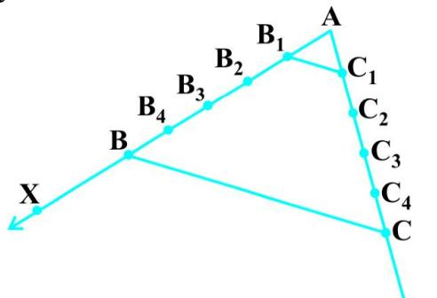  
Fig. 6.11

Note that $\mathrm { \frac { A B _ { 1 } } { B _ { 1 } B } } = \mathrm { \frac { A C _ { 1 } } { C _ { 1 } C } } ( \mathrm { E a c h e q u a l t o } \mathrm { \frac { 1 } { 4 } } )$

You can also see that lines $\mathrm { \bf B } _ { 1 } \mathrm { C } _ { 1 }$ and BC are parallel to each other, i.e.,

$$
\mathrm {B} _ {1} \mathrm {C} _ {1} \| \mathrm {B C} \tag {1}
$$

Similarly, by joining $\mathrm { B } _ { 2 } \mathrm { C } _ { 2 } , \mathrm { B } _ { 3 } \mathrm { C } _ { 3 }$ and $\mathrm { { B } } _ { 4 } \mathrm { { C } } _ { 4 } ,$ you can see that:

$$
\frac {\mathrm {A B} _ {2}}{\mathrm {B} _ {2} \mathrm {B}} = \frac {\mathrm {A C} _ {2}}{\mathrm {C} _ {2} \mathrm {C}} \left(= \frac {2}{3}\right) \text {a n d} \mathrm {B} _ {2} \mathrm {C} _ {2} \| \mathrm {B C} \tag {2}
$$

$$
\frac {\mathrm {A B} _ {3}}{\mathrm {B} _ {3} \mathrm {B}} = \frac {\mathrm {A C} _ {3}}{\mathrm {C} _ {3} \mathrm {C}} \left(= \frac {3}{2}\right) \text {a n d} \mathrm {B} _ {3} \mathrm {C} _ {3} \| \mathrm {B C} \tag {3}
$$

$$
\frac {\mathrm {A B} _ {4}}{\mathrm {B} _ {4} \mathrm {B}} = \frac {\mathrm {A C} _ {4}}{\mathrm {C} _ {4} \mathrm {C}} \left(= \frac {4}{1}\right) \text {a n d} \mathrm {B} _ {4} \mathrm {C} _ {4} \| \mathrm {B C} \tag {4}
$$

From (1), (2), (3) and (4), it can be observed that if a line divides two sides of a triangle in the same ratio, then the line is parallel to the third side.

You can repeat this activity by drawing any angle XAY of different measure and taking any number of equal parts on arms AX and AY . Each time, you will arrive at the same result. Thus, we obtain the following theorem, which is the converse of Theorem 6.1:

Theorem 6.2 : If a line divides any two sides of a triangle in the same ratio, then the line is parallel to the third side.

This theorem can be proved by taking a line DE such that $\mathrm { { \frac { A D } { D B } } = } \mathrm { { \frac { A E } { E C } } }$ and assuming that DE is not parallel to BC (see Fig. 6.12).

If DE is not parallel to BC, draw a line $\mathrm { D E ^ { \prime } }$ parallel to BC.

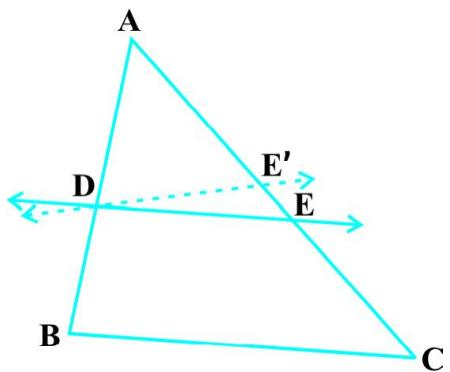  
Fig. 6.12

So,

Therefore,

Adding 1 to both sides of above, you can see that E and $\mathrm { E ^ { \prime } }$ must coincide. (Why ?) Let us take some examples to illustrate the use of the above theorems.

Example 1 : If a line intersects sides AB and AC of a $\Delta$ ABC at D and E respectively and is parallel to BC, prove that ${ \frac { \mathrm { A D } } { \mathrm { A B } } } = { \frac { \mathrm { A E } } { \mathrm { A C } } }$ (see Fig. 6.13).

Solution : DE || BC (Given)

So, AD AE (Theorem 6.1)

  
Fig. 6.13

Example 2 : ABCD is a trapezium with AB $\parallel$ DC. E and F are points on non-parallel sides AD and BC respectively such that EF is parallel to AB (see Fig. 6.14). Show that ${ \frac { \mathrm { A E } } { \mathrm { E D } } } = { \frac { \mathrm { B F } } { \mathrm { F C } } }$

Solution : Let us join AC to intersect EF at G (see Fig. 6.15).

$\mathrm { A B } \parallel \mathrm { D C } \mathrm { a n d E F } \parallel \mathrm { A B } ( \mathrm { G i v e n } )$

So, EF || DC (Lines parallel to the same line are parallel to each other)

Now, in D ADC,

EG || DC (As EF || DC)

$$
\mathrm {S o}, \frac {\mathrm {A E}}{\mathrm {E D}} = \frac {\mathrm {A G}}{\mathrm {G C}} \quad (\text {T h e o r e m 6 . 1}) \tag {1}
$$

Similarly, from D CAB,

$$
\frac {\mathrm {C G}}{\mathrm {A G}} = \frac {\mathrm {C F}}{\mathrm {B F}}
$$

i.e., ${ \frac { \mathrm { A G } } { \mathrm { G C } } } = { \frac { \mathrm { B F } } { \mathrm { F C } } } $

Therefore, from (1) and (2),

$$
\frac {\mathrm {A E}}{\mathrm {E D}} = \frac {\mathrm {B F}}{\mathrm {F C}}
$$

Example 3 : In Fig. 6.16, ${ \frac { \mathrm { P S } } { \mathrm { S Q } } } = { \frac { \mathrm { P T } } { \mathrm { T R } } }$ and $\angle \mathrm { P S T } =$ Ð PRQ. Prove that PQR is an isosceles triangle.

Solution : It is given that ${ \frac { \mathrm { P S } } { \mathrm { S Q } } } = { \frac { \mathrm { P T } } { \mathrm { T R } } }$

  
Fig. 6.14

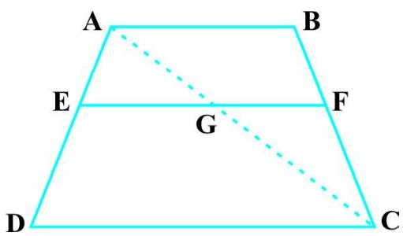  
Fig. 6.15

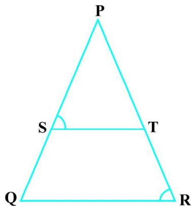  
Fig. 6.16

So, $\operatorname { S T } \parallel \mathrm { Q R }$ (Theorem 6.2)

Therefore, $\angle { \mathrm { P S T } } = \angle { \mathrm { P Q R } }$ (Corresponding angles) (1)

Also, it is given that

$$
\angle \mathrm {P S T} = \angle \mathrm {P R Q} \tag {2}
$$

So, Ð PRQ = Ð PQR [From (1) and (2)]

Therefore, PQ = PR (Sides opposite the equal angles)

i.e., PQR is an isosceles triangle.

## EXERCISE 6.2

1. In Fig. 6.17, (i) and (ii), DE || BC. Find EC in (i) and AD in (ii).

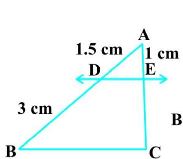

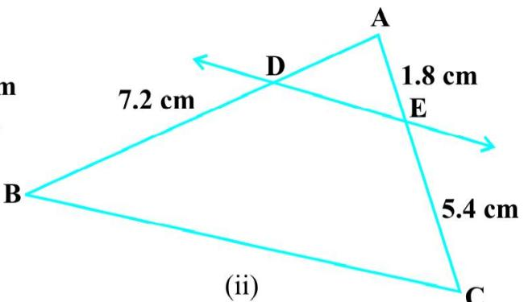  
Fig. 6.17

2. E and F are points on the sides PQ and PR respectively of a $\Delta$ PQR. For each of the following cases, state whether EF $\parallel \mathrm { Q R }$ :

(i) PE = 3.9 cm, EQ = 3 cm, $\mathrm { P F } = 3 . 6$ cm and $\mathrm { F R } = 2 . 4$ cm   
(ii) $\mathrm { P E } = 4 \ \mathrm { c m , Q E } = 4 . 5 \ \mathrm { c m , P F } = 8 \ \mathrm { c m \ a n d \ R F } = 9 \ \mathrm { G }$ $\mathrm { P F } = 8$ $\mathrm { R F } = 9$ m   
(iii) PQ = 1.28 cm, PR = 2.56 cm, $\mathrm { P E } = 0 . 1 8$ cm and PF $= 0 . 3 6 ~ \mathrm { c m }$   
3. In Fig. 6.18, if $\mathrm { L M } \parallel \mathrm { C B }$ and LN || CD, prove that ${ \frac { \mathrm { A M } } { \mathrm { A B } } } = { \frac { \mathrm { A N } } { \mathrm { A D } } } \cdotp$   
4. In Fig. 6.19, DE $\parallel$ AC and DF || AE. Prove that ${ \frac { \mathrm { B F } } { \mathrm { F E } } } = { \frac { \mathrm { B E } } { \mathrm { E C } } } .$

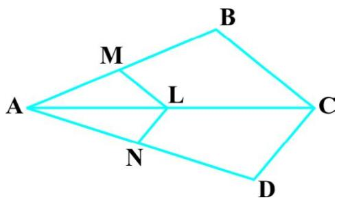

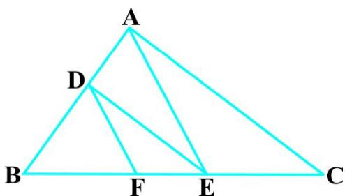  
Fig. 6.18   
Fig. 6.19

5. In Fig. 6.20, DE || OQ and DF || OR. Show that EF || QR.   
6. In Fig. 6.21, A, B and C are points on OP, OQ and OR respectively such that AB $\parallel$ PQ and AC || PR. Show that BC || QR.   
7. Using Theorem 6.1, prove that a line drawn through the mid-point of one side of a triangle parallel to another side bisects the third side. (Recall that you have proved it in Class IX).   
8. Using Theorem 6.2, prove that the line joining the mid-points of any two sides of a triangle is parallel to the third side. (Recall that you have done it in Class IX).   
9. ABCD is a trapezium in which AB || DC and its diagonals intersect each other at the point O. Show

that ${ \frac { \mathrm { { A O } } } { \mathrm { { B O } } } } = { \frac { \mathrm { { C O } } } { \mathrm { { D O } } } }$

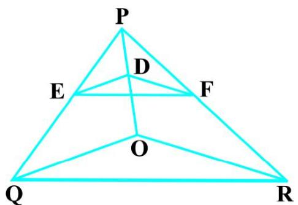  
Fig. 6.20

  
Fig. 6.21

10. The diagonals of a quadrilateral ABCD intersect each other at the point O such that ${ \frac { \mathrm { A O } } { \mathrm { B O } } } = { \frac { \mathrm { C O } } { \mathrm { D O } } }$ × Show that ABCD is a trapezium.

### 6.4 Criteria for Similarity of Triangles

In the previous section, we stated that two triangles are similar, if (i) their corresponding angles are equal and (ii) their corresponding sides are in the same ratio (or proportion).

That is, in D ABC and $\Delta$ DEF, if

(i) $\angle \mathrm { A } = \angle \mathrm { D }$ , $\angle \mathrm { B } = \angle \mathrm { E }$ , $\angle \mathrm { C } = \angle \mathrm { F }$ and   
(ii) ${ \frac { \mathrm { A B } } { \mathrm { D E } } } = { \frac { \mathrm { B C } } { \mathrm { E F } } } = { \frac { \mathrm { C A } } { \mathrm { F D } } } ;$ then the two triangles are similar (see Fig. 6.22).

  
Fig. 6.22

Here, you can see that A corresponds to D, B corresponds to E and C corresponds to F. Symbolically, we write the similarity of these two triangles as $^ { c } \Delta \mathrm { A B C } \sim \Delta \mathrm { D E }$ F’ and read it as ‘triangle ABC is similar to triangle DEF’. The symbol $^ { \mathfrak { c } } \sim ^ { \mathfrak { , } }$ stands for ‘is similar to’. Recall that you have used the symbol ${ \bf \subseteq } \mathbf { \Delta }$ for ‘is congruent to’ in Class IX.

It must be noted that as done in the case of congruency of two triangles, the similarity of two triangles should also be expressed symbolically, using correct correspondence of their vertices. For example, for the triangles ABC and DEF of Fig. 6.22, we cannot write D ABC $\sim \Delta$ EDF or $\Delta \mathrm { A B C } \sim \Delta$ FED. However, we can write $\Delta \mathrm { B A C } \sim \Delta$ EDF.

Now a natural question arises : For checking the similarity of two triangles, say ABC and DEF, should we always look for all the equality relations of their corresponding angles ( $\angle \mathbf { A } =$ Ð D, $\angle \mathrm { B } = \angle \mathrm { E }$ , $\angle \mathrm { C } = \angle \mathrm { F }$ ) and all the equality relations of the ratios of their corresponding sides $\left( { \frac { \mathrm { A B } } { \mathrm { D E } } } = { \frac { \mathrm { B C } } { \mathrm { E F } } } = { \frac { \mathrm { C A } } { \mathrm { F D } } } \right) \colon$ Let us examine. You may recall that in Class IX, you have obtained some criteria for congruency of two triangles involving only three pairs of corresponding parts (or elements) of the two triangles. Here also, let us make an attempt to arrive at certain criteria for similarity of two triangles involving relationship between less number of pairs of corresponding parts of the two triangles, instead of all the six pairs of corresponding parts. For this, let us perform the following activity:

Activity $4 :$ Draw two line segments BC and EF of two different lengths, say 3 cm and 5 cm respectively. Then, at the points B and C respectively, construct angles PBC and QCB of some measures, say, $6 0 ^ { \circ }$ and $4 0 ^ { \circ }$ . Also, at the points E and F, construct angles REF and SFE of $6 0 ^ { \circ }$ and $4 0 ^ { \circ }$ respectively (see Fig. 6.23).

  
Fig. 6.23

Let rays BP and CQ intersect each other at A and rays ER and FS intersect each other at D. In the two triangles ABC and DEF, you can see that $\angle \mathrm { B } = \angle \mathrm { E }$ , $\angle \mathrm { C } = \angle \mathrm { F }$ and $\angle \mathrm { A } { } = \angle \mathrm { D } { }$ . That is, corresponding angles of these two triangles are equal. What can you say about their corresponding sides ? Note that $\frac { \mathrm { B C } } { \mathrm { E F } } = \frac { 3 } { 5 } = 0 . 6$ . What about $\frac { \mathrm { A B } } { \mathrm { D E } }$ an d CAFD ? On measuring AB, DE, CA and FD, you will find that $\frac { \mathrm { C A } } { \mathrm { F D } }$ $\frac { \mathrm { A B } } { \mathrm { D E } }$ and $\frac { \mathrm { C A } } { \mathrm { F D } }$ are also equal to 0.6 (or nearly equal to 0.6, if there is some error in the measurement). Thus, ${ \frac { \mathrm { A B } } { \mathrm { D E } } } = { \frac { \mathrm { B C } } { \mathrm { E F } } } = { \frac { \mathrm { C A } } { \mathrm { F D } } }$ You can repeat this activity by constructing several pairs of triangles having their corresponding angles equal. Every time, you will find that their corresponding sides are in the same ratio (or proportion). This activity leads us to the following criterion for similarity of two triangles.

Theorem 6.3 : If in two triangles, corresponding angles are equal, then their corresponding sides are in the same ratio (or proportion) and hence the two triangles are similar.

This criterion is referred to as the AAA (Angle–Angle–Angle) criterion of similarity of two triangles.

This theorem can be proved by taking two triangles ABC and DEF such that $\angle \mathrm { A } = \angle \mathrm { D }$ , $\angle \mathrm { \Delta B } = \angle \mathrm { \Delta E }$ and $\angle \mathrm { ~ C ~ } { = } \angle \mathrm { ~ F ~ }$ (see Fig. 6.24)

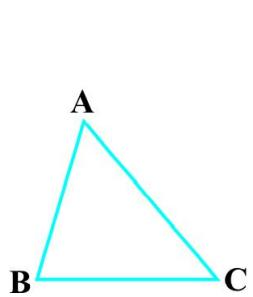

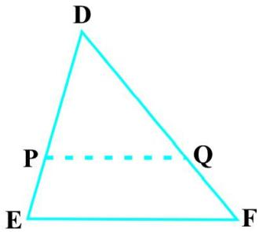  
Fig. 6.24

Cut DP = AB and ${ \mathrm { D Q } } = \mathbf { A C }$ and join PQ.

So, $\Delta \mathrm { A B C } \cong \Delta \mathrm { D P Q }$ (Why ?)

This gives $\angle \mathrm { B } = \angle \mathrm { P } = \angle \mathrm { E }$ and PQ || EF (How?)

Therefore, ${ \frac { \mathrm { D P } } { \mathrm { P E } } } = { \frac { \mathrm { D Q } } { \mathrm { Q F } } }$ (Why?)

i.e., $\mathrm { \frac { A B } { D E } } = \mathrm { \frac { A C } { D F } }$ (Why?)

Similarly, ${ \frac { \mathrm { A B } } { \mathrm { D E } } } = { \frac { \mathrm { B C } } { \mathrm { E F } } }$ and so $\frac { \mathrm { A B } } { \mathrm { D E } } = \frac { \mathrm { B C } } { \mathrm { E F } } = \frac { \mathrm { A C } } { \mathrm { D F } }$

Remark : If two angles of a triangle are respectively equal to two angles of another triangle, then by the angle sum property of a triangle their third angles will also be equal. Therefore, AAA similarity criterion can also be stated as follows:

If two angles of one triangle are respectively equal to two angles of another triangle, then the two triangles are similar.

This may be referred to as the AA similarity criterion for two triangles.

You have seen above that if the three angles of one triangle are respectively equal to the three angles of another triangle, then their corresponding sides are proportional (i.e., in the same ratio). What about the converse of this statement? Is the converse true? In other words, if the sides of a triangle are respectively proportional to the sides of another triangle, is it true that their corresponding angles are equal? Let us examine it through an activity :

Activity 5 : Draw two triangles ABC and DEF such that $\mathrm { A B } = 3 ~ \mathrm { c m }$ , $\mathrm { B C } = 6$ cm, $\mathrm { C A } = 8 \mathrm { c m }$ , $\mathrm { D E } = 4 . 5 \mathrm { c m }$ , $\mathrm { E F } = 9$ cm and $\mathrm { F D } = 1 2 \mathrm { c m }$ (see Fig. 6.25).

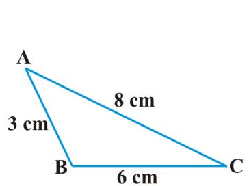

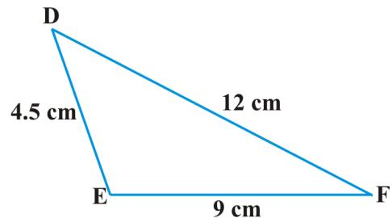  
Fig. 6.25

So, you have : $\mathrm { \frac { A B } { D E } } = \mathrm { \frac { B C } { E F } } = \mathrm { \frac { C A } { F D } } ( \mathrm { e a c h } \mathrm { e q u a l } \mathrm { t o } \mathrm { \ } \frac { 2 } { 3 } )$

Now measure $\angle \textbf { A }$ , $\angle \textbf { B }$ , $\angle \textrm { C }$ , $\angle \mathrm { ~ D ~ }$ , $\angle \mathrm { ~ E ~ }$ and $\angle \mathrm { ~ F ~ }$ . You will observe that $\angle \mathrm { A } = \angle \mathrm { D }$ , $\angle \mathrm { B } = \angle \mathrm { E }$ and $\angle \mathrm { C } = \angle \mathrm { F } ,$ , i.e., the corresponding angles of the two triangles are equal.

You can repeat this activity by drawing several such triangles (having their sides in the same ratio). Everytime you shall see that their corresponding angles are equal. It is due to the following criterion of similarity of two triangles:

Theorem $6 . 4 : H$ in two triangles, sides of one triangle are proportional to (i.e., in the same ratio of ) the sides of the other triangle, then their corresponding angles are equal and hence the two triangles are similiar.

This criterion is referred to as the SSS (Side–Side–Side) similarity criterion for two triangles.

This theorem can be proved by taking two triangles ABC and DEF such that ${ \frac { \mathrm { A B } } { \mathrm { D E } } } = { \frac { \mathrm { B C } } { \mathrm { E F } } } = { \frac { \mathrm { C A } } { \mathrm { F D } } }$ $( < 1 )$ (see Fig. 6.26):

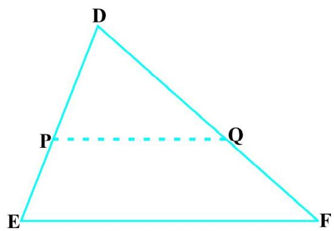  
Fig. 6.26

Cut DP = AB and ${ \mathrm { D Q } } = \mathbf { A C }$ and join PQ.

It can be seen that ${ \frac { \mathrm { D P } } { \mathrm { P E } } } = { \frac { \mathrm { D Q } } { \mathrm { Q F } } }$ and PQ || EF (How?)

So, $\angle \mathrm { P } = \angle \mathrm { ~ E ~ }$ and $\angle \mathrm { Q } = \angle \mathrm { F }$ .

Therefore, ${ \frac { \mathrm { D P } } { \mathrm { D E } } } = { \frac { \mathrm { D Q } } { \mathrm { D F } } } = { \frac { \mathrm { P Q } } { \mathrm { E F } } }$

So, ${ \frac { \mathrm { D P } } { \mathrm { D E } } } = { \frac { \mathrm { D Q } } { \mathrm { D F } } } = { \frac { \mathrm { B C } } { \mathrm { E F } } }$ (Why?)

So, $\mathrm { B C } = \mathrm { P Q }$ (Why?)

Thus, $\Delta \mathrm { A B C } \cong \Delta \mathrm { D P Q }$ (Why ?)

So, $\angle \mathrm { A } = \angle \mathrm { D } , \angle \mathrm { B } = \angle \mathrm { E } \quad \mathrm { a n d } \quad \angle \mathrm { C } = \angle \mathrm { F }$ (How ?)

Remark : You may recall that either of the two conditions namely, (i) corresponding angles are equal and (ii) corresponding sides are in the same ratio is not sufficient for two polygons to be similar. However, on the basis of Theorems 6.3 and 6.4, you can now say that in case of similarity of the two triangles, it is not necessary to check both the conditions as one condition implies the other.

Let us now recall the various criteria for congruency of two triangles learnt in Class IX. You may observe that SSS similarity criterion can be compared with the SSS congruency criterion.This suggests us to look for a similarity criterion comparable to SAS congruency criterion of triangles. For this, let us perform an activity.

Activity 6 : Draw two triangles ABC and DEF such that $\mathrm { A B } = 2 \ \mathrm { c m }$ , $\angle \mathrm { \bf ~ A } = 5 0 ^ { \circ }$ , $\mathbf { A C } = 4 \mathbf { c m }$ , DE = 3 cm, $\angle \mathrm { D } = 5 0 ^ { \circ }$ and DF = 6 cm (see Fig.6.27).

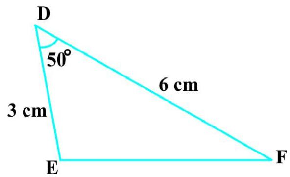  
Fig. 6.27

Here, you may observe that ${ \frac { \mathrm { A B } } { \mathrm { D E } } } = { \frac { \mathrm { A C } } { \mathrm { D F } } }$ (each equal to $\frac { 2 } { 3 } { \cdot }$ ) and $\angle \mathrm { A }$ (included between the sides AB and AC) $= \angle D$ (included between the sides DE and DF). That is, one angle of a triangle is equal to one angle of another triangle and sides including these angles are in the same ratio (i.e., proportion). Now let us measure Ð B, Ð C, Ð E and $\angle \mathrm { F }$ .

You will find that $\angle \mathrm { B } = \angle \mathrm { E }$ and $\angle \mathrm { C } = \angle \mathrm { F } .$ That is, $\angle \mathrm { A } = \angle \mathrm { D }$ , $\angle \mathrm { B } = \angle \mathrm { E }$ and $\angle C =$ Ð F. So, by AAA similarity criterion, $\Delta \mathrm { A B C } \sim \Delta$ DEF. You may repeat this activity by drawing several pairs of such triangles with one angle of a triangle equal to one angle of another triangle and the sides including these angles are proportional. Everytime, you will find that the triangles are similar. It is due to the following criterion of similarity of triangles:

Theorem 6.5 : If one angle of a triangle is equal to one angle of the other triangle and the sides including these angles are proportional, then the two triangles are similar.

This criterion is referred to as the SAS (Side–Angle–Side) similarity criterion for two triangles.

As before, this theorem can be proved by taking two triangles ABC and DEF such that $\frac { \mathrm { A B } } { \mathrm { D E } } = \frac { \mathrm { A C } } { \mathrm { D F } } \left( < 1 \right)$ and $\angle \mathrm { A } = \angle \mathrm { D }$ (see Fig. 6.28). Cut $\mathrm { D P = }$ AB, ${ \mathrm { D Q } } = \mathbf { A C }$ and join PQ.

  
Fig. 6.28

Now, PQ || EF and $\Delta \mathrm { A B C } \cong \Delta \mathrm { D P Q }$ (How ?)

So, Ð A = Ð D, $\angle \mathrm { B } = \angle \mathrm { P }$ and $\angle C = \angle Q$

Therefore, $\Delta A \mathrm { B C } \sim \Delta \mathrm { D E F }$ (Why?)

We now take some examples to illustrate the use of these criteria.

Example 4 : In Fig. 6.29, if PQ || RS, prove that $\Delta \mathrm { P O Q } \sim \Delta$ SOR.

  
Fig. 6.29

Solution : PQ || RS (Given)

So, Ð P = Ð S (Alternate angles)

and Ð Q = Ð R

Also, $\angle \mathrm { P O Q } = \angle \mathrm { S O R }$ (Vertically opposite angles)

Therefore, D POQ ~ D SOR (AAA similarity criterion)

Example 5 : Observe Fig. 6.30 and then find $\angle \mathrm { P } .$

  
Fig. 6.30

Solution : In D ABC and D PQR,

$$
\frac {A B}{R Q} = \frac {3 . 8}{7 . 6} = \frac {1}{2}, \frac {B C}{Q P} = \frac {6}{1 2} = \frac {1}{2} \text {a n d} \frac {C A}{P R} = \frac {3 \sqrt {3}}{6 \sqrt {3}} = \frac {1}{2}
$$

That is, ${ \frac { \mathrm { A B } } { \mathrm { R Q } } } = { \frac { \mathrm { B C } } { \mathrm { Q P } } } = { \frac { \mathrm { C A } } { \mathrm { P R } } }$

So, $\Delta \mathrm { A B C } \sim \Delta \mathrm { R Q P }$ (SSS similarity)

Therefore, Ð C = Ð P(Corresponding angles of similar triangles)

But $\angle \mathrm { C } = 1 8 0 ^ { \circ } - \angle \mathrm { A } - \angle \mathrm { B }$ (Angle sum property)

$$
= 1 8 0 ^ {\circ} - 8 0 ^ {\circ} - 6 0 ^ {\circ} = 4 0 ^ {\circ}
$$

So, $\angle \mathrm { P } = 4 0 ^ { \circ }$

Example 6 : In Fig. 6.31,

$$
O A. O B = O C. O D.
$$

Show that $\angle \mathrm { A } { } = \angle \mathrm { C }$ and $\angle \mathrm { B } = \angle \mathrm { D }$ .

Solution : OA . OB = OC . OD (Given)

So, ${ \frac { \mathrm { O A } } { \mathrm { O C } } } = { \frac { \mathrm { O D } } { \mathrm { O B } } } $ (1)

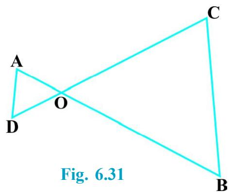

Also, we have $\angle \mathrm { A O D } = \angle \mathrm { C O B } ( $ Vertically opposite angles) (2)

Therefore, from (1) and (2),D AOD ~ D COB (SAS similarity criterion)

So, $\angle \mathrm { A } { } = \angle \mathrm { C }$ and $\angle \mathrm { D } = \angle \mathrm { B }$

(Corresponding angles of similar triangles)

Example 7 : A girl of height 90 cm is walking away from the base of a lamp-post at a speed of $1 . 2 \mathrm { m / s }$ . If the lamp is $3 . 6 \mathrm { m }$ above the ground, find the length of her shadow after 4 seconds.

Solution : Let AB denote the lamp-post and CD the girl after walking for 4 seconds away from the lamp-post (see Fig. 6.32).

From the figure, you can see that DE is the shadow of the girl. Let DE be $x$ metres.

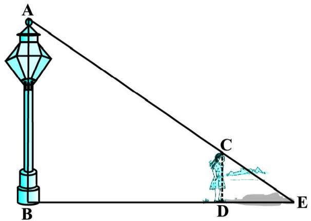  
Fig. 6.32

Now, $\mathrm { B D } = 1 . 2 \ \mathrm { m } \times 4 = 4 . 8 \ \mathrm { m }$ .

Note that in $\Delta$ ABE and $\Delta$ CDE,

$$
\begin{array}{l l} \angle B = \angle D & \text {(E a c h i s o f 9 0 ^ {\circ} b e c a u s e l a m p - p o s t} \\ & \text {a s w e l l a s t h e g i r l a r e s t a n d i n g} \\ & \text {v e r t i c a l t o t h e g r o u n d)} \end{array}
$$

and $\angle \mathrm { E } = \angle \mathrm { E }$ (Same angle)

So, D ABE ~ D CDE (AA similarity criterion)

Therefore, BEDE ABCD

i.e., 4.8 + xx 3.60.9 $( 9 0 ~ \mathrm { c m } = { \frac { 9 0 } { 1 0 0 } } ~ \mathrm { m } = 0 . 9 ~ \mathrm { m } )$

i.e., 4.8 + x = 4x

i.e., 3x = 4.8

i.e., x = 1.6

So, the shadow of the girl after walking for 4 seconds is $1 . 6 \mathrm { m }$ long.

Example 8 : In Fig. 6.33, CM and RN are respectively the medians of $\Delta$ ABC and $\Delta$ PQR. If $\Delta \mathrm { A B C } \sim \Delta$ PQR, prove that :

(i) D AMC ~ D PNR   
(ii) ${ \frac { \mathrm { C M } } { \mathrm { R N } } } = { \frac { \mathrm { A B } } { \mathrm { P Q } } }$   
(iii) $\Delta \mathrm { C M B } \sim \Delta \mathrm { R N Q }$

Solution : (i) D ABC ~ D PQR (Given)

So, ${ \frac { \mathrm { A B } } { \mathrm { P Q } } } = { \frac { \mathrm { B C } } { \mathrm { Q R } } } = { \frac { \mathrm { C A } } { \mathrm { R P } } }$ (1)

and $\angle \mathrm { A } = \angle \mathrm { P } , \angle \mathrm { B } = \angle \mathrm { Q } { \mathrm { a n d } } \angle \mathrm { C } = \angle \mathrm { R }$ $\angle \mathsf { A } = \angle \mathsf { P } , \angle \mathsf { B } = \angle \mathrm { Q }$ $\angle C = \angle R$ (2)

But $\mathrm { A B } = 2 \mathrm { A M } \mathrm { a n d } \mathrm { P Q } = 2 \mathrm { P N }$ (As CM and RN are medians)

So, from (1), ${ \frac { 2 \mathrm { A M } } { 2 \mathrm { P N } } } = { \frac { \mathrm { C A } } { \mathrm { R P } } } $

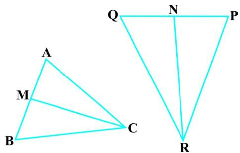  
Fig. 6.33

i.e., AM = CA (3)

Also, Ð MAC = Ð NPR [From (2)] (4)

So, from (3) and (4),

D AMC ~ D PNR (SAS similarity) (5)

(ii) From (5), CMRN = CARP (6)

CA AB But RP = PQ [From (1)] (7)

Therefore, CMRN = ABPQ [From (6) and (7)] (8)

AB BC (iii) Again, PQ QR [From (1)]

Therefore, CMRN = BCQR [From (8)] (9)

Also, CM RN AB 2 BM PQ 2 QN

CM BM i.e., RN QN (10)

i.e., CMRN = BC BMQR QN= [From (9) and (10)]

Therefore, D CMB ~ D RNQ (SSS similarity)

[Note : You can also prove part (iii) by following the same method as used for proving part (i).]

## EXERCISE 6.3

1. State which pairs of triangles in Fig. 6.34 are similar. Write the similarity criterion used by you for answering the question and also write the pairs of similar triangles in the symbolic form :

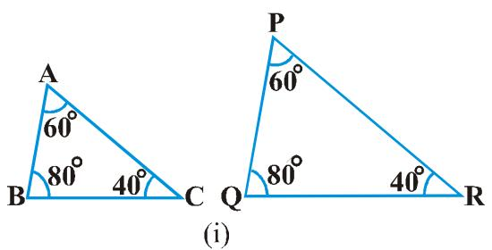

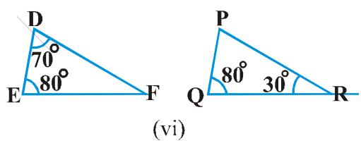  
Fig. 6.34

2. In Fig. 6.35, $\Delta \mathrm { O D C } \sim \Delta$ $\Delta$ OBA, $\angle B O C =$ $1 2 5 ^ { \circ }$ and $\angle { \mathrm { C D O } } = 7 0 ^ { \circ }$ . Find Ð DOC, Ð DCO and Ð OAB.   
3. Diagonals AC and BD of a trapezium ABCD with AB $\| \mathrm { D C }$ intersect each other at the point O. Using a similarity criterion for two triangles, show that ${ \frac { \mathrm { O A } } { \mathrm { O C } } } = { \frac { \mathrm { O B } } { \mathrm { O D } } }$

  
Fig. 6.35

4. In Fig. 6.36, $\frac { \mathrm { Q R } } { \mathrm { Q S } } = \frac { \mathrm { Q T } } { \mathrm { P R } }$ and $\angle 1 = \angle 2$ . Show that $\Delta \mathrm { P Q S } \sim \Delta \mathrm { T Q R }$ .   
5. S and T are points on sides PR and QR of $\Delta$ PQR such that $\angle \mathrm { P } = \angle \mathrm { R T S }$ Show that $\Delta { \mathrm { R P Q } } \sim \Delta { \mathrm { R T S } }$ .   
6. In Fig. 6.37, if $\Delta \mathrm { A B E } \cong \Delta$ ACD, show that $\Delta A \mathrm { D E } \sim \Delta A \mathrm { B C }$ .   
7. In Fig. 6.38, altitudes AD and CE of $\Delta$ ABC intersect each other at the point P. Show that:

(i) D AEP ~ D CDP   
(ii) $\Delta \mathrm { A B D } \sim \Delta \mathrm { C }$ BE   
(iii) D AEP ~ D ADB   
(iv) $\Delta \mathrm { P D C } \sim \Delta \mathrm { B E }$ C

8. E is a point on the side AD produced of a parallelogram ABCD and BE intersects CD at F. Show that $\Delta \mathrm { A B E } \sim \Delta \mathrm { C I }$ FB.   
9. In Fig. 6.39, ABC and AMP are two right triangles, right angled at B and M respectively. Prove that:

(i) D ABC ~ D AMP   
(ii) ${ \frac { \mathrm { C A } } { \mathrm { P A } } } = { \frac { \mathrm { B C } } { \mathrm { M P } } }$

10. CD and GH are respectively the bisectors of $\angle A \mathrm { C B }$ and $\angle$ EGF such that D and H lie on sides AB and FE of $\Delta$ ABC and $\Delta$ EFG respectively. If $\Delta \mathrm { A B C } \sim \Delta$ FEG, show that:

(i) ${ \frac { \mathrm { C D } } { \mathrm { G H } } } = { \frac { \mathrm { A C } } { \mathrm { F G } } } $   
(ii) $\Delta \mathrm { D C B } \sim \Delta \mathrm { H G }$ E   
(iii) $\Delta \mathrm { D C A } \sim \Delta \mathrm { H G F }$

  
Fig. 6.36

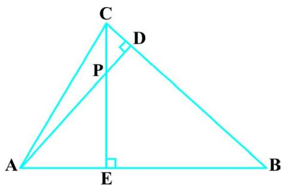  
Fig. 6.37

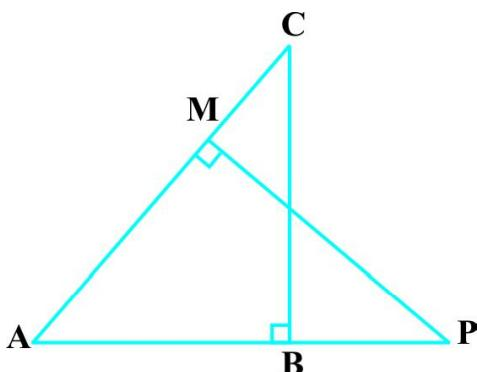  
Fig. 6.38   
Fig. 6.39

11. In Fig. 6.40, E is a point on side CB produced of an isosceles triangle ABC with $\mathrm { A B } { = } \mathrm { A C }$ . If AD ^ BC and EF ^ AC, prove that $\Delta A \mathrm { B D } \sim \Delta \mathrm { E C F }$ .   
12. Sides AB and BC and median AD of a triangle ABC are respectively proportional to sides PQ and QR and median PM of $\Delta$ PQR (see Fig. 6.41). Show that $\Delta A \mathrm { B C } \sim \Delta \mathrm { P Q R }$ .   
13. D is a point on the side BC of a triangle ABC such that $\angle \mathrm { A D C } = \angle \mathrm { B A C }$ . Show that $\mathrm { C A } ^ { 2 } { = } \mathrm { C B } . \mathrm { C D }$ .   
14. Sides AB and AC and median AD of a triangle ABC are respectively proportional to sides PQ and PR and median PM of another triangle PQR. Show that $\Delta A \mathrm { B C } \sim \Delta \mathrm { P Q R }$ .   
15. A vertical pole of length 6 m casts a shadow 4 m long on the ground and at the same time a tower casts a shadow 28 m long. Find the height of the tower.   
16. If AD and PM are medians of triangles ABC and PQR, respectively where D ABC ~ D PQR, prove that ABPQ $\Delta \mathrm { A B C } \sim \Delta $ ${ \frac { \mathrm { A B } } { \mathrm { P Q } } } = { \frac { \mathrm { A D } } { \mathrm { P M } } }$

### 6.5 Summary

1. Two figures having the same shape but not necessarily the same size are called similar figures.   
2. All the congruent figures are similar but the converse is not true.   
3. Two polygons of the same number of sides are similar, if (i) their corresponding angles are equal and (ii) their corresponding sides are in the same ratio (i.e., proportion).   
4. If a line is drawn parallel to one side of a triangle to intersect the other two sides in distinct points, then the other two sides are divided in the same ratio.   
5. If a line divides any two sides of a triangle in the same ratio, then the line is parallel to the third side.   
6. If in two triangles, corresponding angles are equal, then their corresponding sides are in the same ratio and hence the two triangles are similar (AAA similarity criterion).   
7. If in two triangles, two angles of one triangle are respectively equal to the two angles of the other triangle, then the two triangles are similar (AA similarity criterion).

  
Fig. 6.40

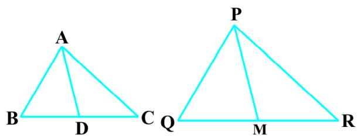  
Fig. 6.41

In this chapter you have studied the following points :

8. If in two triangles, corresponding sides are in the same ratio, then their corresponding angles are equal and hence the triangles are similar (SSS similarity criterion).   
9. If one angle of a triangle is equal to one angle of another triangle and the sides including these angles are in the same ratio (proportional), then the triangles are similar (SAS similarity criterion).

## A NOTE TO THE READER

If in two right triangles, hypotenuse and one side of one triangle are proportional to the hypotenuse and one side of the other triangle, then the two triangles are similar. This may be referred to as the RHS Similarity Criterion.

If you use this criterion in Example 2, Chapter 8, the proof will become simpler.

1062CH07

# chapter 7
# COORDINATE GEOMETRY

### 7.1 Introduction

In Class IX, you have studied that to locate the position of a point on a plane, we require a pair of coordinate axes. The distance of a point from the y-axis is called its $\mathbf { \nabla } _ { \mathbf { x } } .$ -coordinate, or abscissa. The distance of a point from the $x$ -axis is called its y-coordinate, or ordinate. The coordinates of a point on the $x$ -axis are of the form $( x , 0 )$ , and of a point on the y-axis are of the form $( 0 , y )$ .

Here is a play for you. Draw a set of a pair of perpendicular axes on a graph paper. Now plot the following points and join them as directed: Join the point A(4, 8) to B(3, 9) to C(3, 8) to $\mathrm { D } ( 1 , 6 )$ to $\operatorname { E } ( 1 , 5 )$ to F(3, 3) to G(6, 3) to H(8, 5) to I(8, 6) to J(6, 8) to K(6, 9) to L(5, 8) to A. Then join the points P(3.5, 7), Q (3, 6) and $\mathrm { R } ( 4 , 6 )$ to form a triangle. Also join the points X(5.5, 7), Y(5, 6) and $Z ( 6 , 6 )$ to form a triangle. Now join S(4, 5), T(4.5, 4) and U(5, 5) to form a triangle. Lastly join S to the points (0, 5) and $( 0 , 6 )$ and join U to the points (9, 5) and (9, 6). What picture have you got?

Also, you have seen that a linear equation in two variables of the form $a x + b y + c = 0 .$ , $( a , b$ are not simultaneously zero), when represented graphically, gives a straight line. Further, in Chapter 2, you have seen the graph of $y = a x ^ { 2 } + b x + c \left( a \neq 0 \right)$ , is a parabola. In fact, coordinate geometry has been developed as an algebraic tool for studying geometry of figures. It helps us to study geometry using algebra, and understand algebra with the help of geometry. Because of this, coordinate geometry is widely applied in various fields such as physics, engineering, navigation, seismology and art!

In this chapter, you will learn how to find the distance between the two points whose coordinates are given, and to find the area of the triangle formed by three given points. You will also study how to find the coordinates of the point which divides a line segment joining two given points in a given ratio.

### 7.2 Distance Formula

Let us consider the following situation:

A town B is located $3 6 \mathrm { k m }$ east and $1 5 \mathrm { k m }$ north of the town A. How would you find the distance from town A to town B without actually measuring it. Let us see. This situation can be represented graphically as shown in Fig. 7.1. You may use the Pythagoras Theorem to calculate this distance.

Now, suppose two points lie on the $x$ -axis. Can we find the distance between them? For instance, consider two points $\mathrm { A } ( 4 , 0 )$ and $\mathrm { B } ( 6 , 0 )$ in Fig. 7.2. The points A and B lie on the $x$ -axis.

From the figure you can see that $\mathrm { O A } = 4$ units and $\mathrm { O B } = 6$ units.

Therefore, the distance of B from A, i.e., AB $= \mathrm { O B } - \mathrm { O A } = 6 - 4 = 2$ units.

So, if two points lie on the $x$ -axis, we can easily find the distance between them.

Now, suppose we take two points lying on the $y .$ -axis. Can you find the distance between them. If the points ${ \dot { \mathrm { C } } } ( 0 , 3 )$ and $\mathrm { D } ( 0 , 8 )$ lie on the $y .$ -axis, similarly we find that $\mathrm { C D } = 8 - 3 = 5$ units (see Fig. 7.2).

  
Fig. 7.1

  
Fig. 7.2

Next, can you find the distance of A from C (in Fig. 7.2)? Since $\mathrm { O A } = 4$ units and $\mathrm { O C } = 3$ units, the distance of A from C, i.e., $\operatorname { A C } = { \sqrt { 3 ^ { 2 } + 4 ^ { 2 } } } = 5$ units. Similarly, you can find the distance of B from $\mathrm { D } = \mathrm { B D } = 1 0$ units.

Now, if we consider two points not lying on coordinate axis, can we find the distance between them? Yes! We shall use Pythagoras theorem to do so. Let us see an example.

In Fig. 7.3, the points $\mathrm { P } ( 4 , 6 )$ and Q(6, 8) lie in the first quadrant. How do we use Pythagoras theorem to find the distance between them? Let us draw PR and QS perpendicular to the $x$ -axis from P and Q respectively. Also, draw a perpendicular from P on QS to meet QS at T. Then the coordinates of R and S are (4, 0) and (6, 0), respectively. So, ${ \mathrm { R S } } = 2$ units. Also, $\mathrm { Q S } = 8$ units and $\mathrm { T S } = \mathrm { P R } = 6$ units.

Therefore, $\mathrm { Q T } = 2$ units and $\mathrm { P T } = \mathrm { R S } = 2$ units.

Now, using the Pythagoras theorem, we have

$$
\begin{array}{l} \mathrm {P Q} ^ {2} = \mathrm {P T} ^ {2} + \mathrm {Q T} ^ {2} \\ = 2 ^ {2} + 2 ^ {2} = 8 \\ \end{array}
$$

So, $\mathrm { P Q } = \ _ { 2 } \sqrt { 2 }$ units

How will we find the distance between two points in two different quadrants?

Consider the points P(6, 4) and Q(–5, –3) (see Fig. 7.4). Draw QS perpendicular to the $x$ -axis. Also draw a perpendicular PT from the point P on QS (extended) to meet y-axis at the point R.

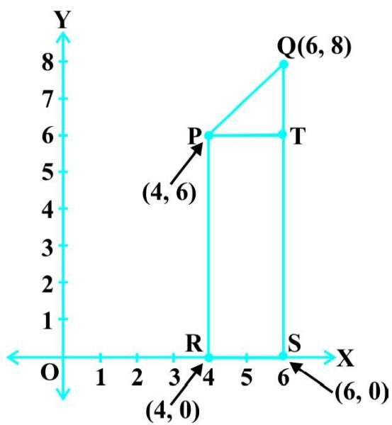

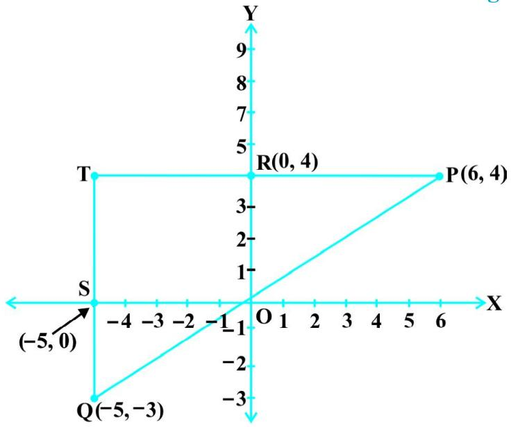  
Fig. 7.3   
Fig. 7.4

Then $\mathrm { P T } = 1 1$ units and $\mathrm { Q T } = 7$ units. (Why?)

Using the Pythagoras Theorem to the right triangle PTQ, we get $P Q = { \sqrt { 1 1 ^ { 2 } + 7 ^ { 2 } } } = { \sqrt { 1 7 0 } }$ units.

Let us now find the distance between any two points $\mathrm { P } ( x _ { 1 } , y _ { 1 } )$ and $\mathbf { Q } ( x _ { 2 } , y _ { 2 } )$ . Draw PR and QS perpendicular to the $x$ -axis. A perpendicular from the point P on QS is drawn to meet it at the point T (see Fig. 7.5).

Then, $\mathrm { O R } = x _ { 1 } , \mathrm { O S } = x _ { 2 } . \quad \mathrm { S o } , \ \mathrm { R S } = x _ { 2 } - x _ { 1 } = \mathrm { P T } .$ ${ \mathrm { O R } } = x _ { 1 }$ ${ \mathrm { O S } } = x _ { _ { 2 } }$

Also, $\mathrm { S Q } = y _ { 2 } , ~ \mathrm { S T } = \mathrm { P R } = y _ { 1 } . ~ \mathrm { S 0 } , ~ \mathrm { Q T } = y _ { 2 } - y _ { 1 } .$

Now, applying the Pythagoras theorem in D PTQ, we get

$$
\begin{array}{l} \mathrm {P Q} ^ {2} = \mathrm {P T} ^ {2} + \mathrm {Q T} ^ {2} \\ = \left(x _ {2} - x _ {1}\right) ^ {2} + \left(y _ {2} - y _ {1}\right) ^ {2} \\ \end{array}
$$

Therefore, $\mathrm { P Q } = \sqrt { \left( x _ { 2 } - x _ { 1 } \right) ^ { 2 } + \left( y _ { 2 } - y _ { 1 } \right) ^ { 2 } }$

  
Fig. 7.5

Note that since distance is always non-negative, we take only the positive square root. So, the distance between the points $\mathrm { P } ( x _ { 1 } , y _ { 1 } )$ and $\mathbf { Q } ( x _ { 2 } , y _ { 2 } )$ is

$$
\mathbf {P Q} = \sqrt {\left(x _ {2} - x _ {1}\right) ^ {2} + \left(y _ {2} - y _ {1}\right) ^ {2}},
$$

which is called the distance formula.

## Remarks :

1. In particular, the distance of a point $\mathrm { P } ( x , y )$ from the origin ${ \mathrm { O } } ( 0 , 0 )$ is given by

$$
\mathrm {O P} = \sqrt {x ^ {2} + y ^ {2}}.
$$

2. We can also write, $\mathrm { P Q } = { \sqrt { \left( x _ { 1 } - x _ { 2 } \right) ^ { 2 } + \left( y _ { 1 } - y _ { 2 } \right) ^ { 2 } } } \cdot \mathrm { ( W h y ? ) }$

Example 1 : Do the points (3, 2), (–2, –3) and (2, 3) form a triangle? If so, name the type of triangle formed.

Solution : Let us apply the distance formula to find the distances PQ, QR and PR, where P(3, 2), Q(–2, –3) and R(2, 3) are the given points. We have

$$
P Q = \sqrt {(3 + 2) ^ {2} + (2 + 3) ^ {2}} = \sqrt {5 ^ {2} + 5 ^ {2}} = \sqrt {5 0} = 7. 0 7 (\text {a p p r o x .})
$$

$$
\mathrm {Q R} = \sqrt {(- 2 - 2) ^ {2} + (- 3 - 3) ^ {2}} = \sqrt {(- 4) ^ {2} + (- 6) ^ {2}} = \sqrt {5 2} = 7. 2 1 (\text {a p p r o x .})
$$

$$
\mathrm {P R} = \sqrt {(3 - 2) ^ {2} + (2 - 3) ^ {2}} = \sqrt {1 ^ {2} + (- 1) ^ {2}} = \sqrt {2} = 1. 4 1 (\text {a p p r o x .})
$$

Since the sum of any two of these distances is greater than the third distance, therefore, the points P, Q and R form a triangle.

Also, $\mathrm { P Q } ^ { 2 } + \mathrm { P R } ^ { 2 } = \mathrm { Q R } ^ { 2 }$ , by the converse of Pythagoras theorem, we have $\angle \mathrm { P } = 9 0 ^ { \circ }$ .

Therefore, PQR is a right triangle.

Example $2 :$ Show that the points $( 1 , 7 ) , ( 4 , 2 ) , ( - 1 , - 1 )$ and $( - 4 , 4 )$ are the vertices of a square.

Solution : Let $\mathrm { A } ( 1 , 7 ) , \mathrm { B } ( 4 , 2 ) , \mathrm { C } ( - 1 , - 1 )$ and $\mathrm { D } ( - 4 , 4 )$ be the given points. One way of showing that ABCD is a square is to use the property that all its sides should be equal and both its digonals should also be equal. Now,

$\mathbf { A B } = { \sqrt { ( 1 - 4 ) ^ { 2 } + ( 7 - 2 ) ^ { 2 } } } = { \sqrt { 9 + 2 5 } } = { \sqrt { 3 4 } }$

Since, $\mathbf { A B } = \mathbf { B C } = \mathbf { C D } = \mathbf { D A }$ and $\mathsf { A C } = \mathsf { B D }$ , all the four sides of the quadrilateral ABCD are equal and its diagonals AC and BD are also equal. Thereore, ABCD is a square.

Alternative Solution : We find the four sides and one diagonal, say, AC as above. Here $\mathrm { A D ^ { 2 } } + \mathrm { D C ^ { 2 } } = 3 4 + 3 4 = 6 8 = \mathrm { A C ^ { 2 } }$ . Therefore, by the converse of Pythagoras theorem, $\angle { \mathrm { D } } = 9 0 ^ { \circ }$ . A quadrilateral with all four sides equal and one angle $9 0 ^ { \circ }$ is a square. So, ABCD is a square.

Example 3 : Fig. 7.6 shows the arrangement of desks in a classroom. Ashima, Bharti and Camella are seated at A(3, 1), B(6, 4) and C(8, 6) respectively. Do you think they are seated in a line? Give reasons for your answer.

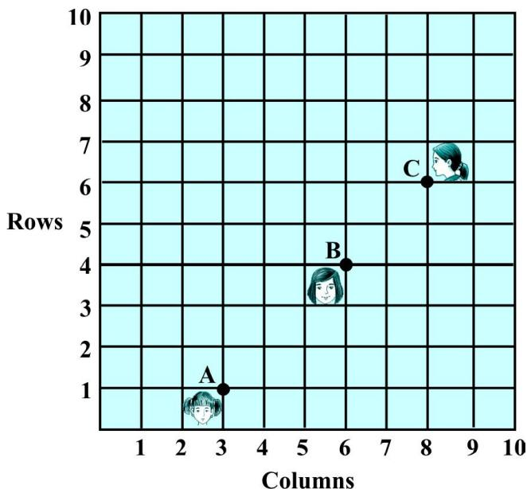  
Fig. 7.6

Solution : Using the distance formula, we have

$$
\mathrm {A B} = \sqrt {(6 - 3) ^ {2} + (4 - 1) ^ {2}} = \sqrt {9 + 9} = \sqrt {1 8} = 3 \sqrt {2}
$$

$$
\mathrm {B C} = \sqrt {(8 - 6) ^ {2} + (6 - 4) ^ {2}} = \sqrt {4 + 4} = \sqrt {8} = 2 \sqrt {2}
$$

$$
A C = \sqrt {(8 - 3) ^ {2} + (6 - 1) ^ {2}} = \sqrt {2 5 + 2 5} = \sqrt {5 0} = 5 \sqrt {2}
$$

Since, ${ \mathrm { A B } } + { \mathrm { B C } } = 3 { \sqrt { 2 } } + 2 { \sqrt { 2 } } = 5 { \sqrt { 2 } } = { \mathrm { A C } }$ , we can say that the points A, B and C are collinear. Therefore, they are seated in a line.

Example 4 : Find a relation between $x$ and $y$ such that the point $( x , y )$ is equidistant from the points (7, 1) and (3, 5).

Solution : Let $\mathrm { P } ( x , y )$ be equidistant from the points A(7, 1) and B(3, 5).

We are given that AP = BP. So, $\mathbf { A P ^ { 2 } } = \mathbf { B P ^ { 2 } }$

i.e., $( x - 7 ) ^ { 2 } + ( y - 1 ) ^ { 2 } = ( x - 3 ) ^ { 2 } + ( y - 5 ) ^ { 2 }$

i.e., x2 – 14x + 49 + y2 – 2y + 1 = x2 – 6x + 9 + y2 – 10y + 25

i.e., x – y = 2

which is the required relation.

Remark : Note that the graph of the equation $x - y$ $= 2$ is a line. From your earlier studies, you know that a point which is equidistant from A and B lies on the perpendicular bisector of AB. Therefore, the graph of $x - y = 2$ is the perpendicular bisector of AB (see Fig. 7.7).

Example $5 :$ Find a point on the y-axis which is equidistant from the points A(6, 5) and B(– 4, 3).

Solution : We know that a point on the $y .$ -axis is of the form $( 0 , y )$ . So, let the point $\mathrm { P } ( 0 , y )$ be equidistant from A and B. Then

$$
(6 - 0) ^ {2} + (5 - y) ^ {2} = (- 4 - 0) ^ {2} + (3 - y) ^ {2}
$$

i.e.,

i.e.,

i.e., y = 9

So, the required point is (0, 9).

Let us check our solution $\therefore A \mathrm { P } = \sqrt { \left( 6 - 0 \right) ^ { 2 } + \left( 5 - 9 \right) ^ { 2 } } = \sqrt { 3 6 + 1 6 } = \sqrt { 5 2 }$

$$
\mathbf {B P} = \sqrt {(- 4 - 0) ^ {2} + (3 - 9) ^ {2}} = \sqrt {1 6 + 3 6} = \sqrt {5 2}
$$

Note : Using the remark above, we see that (0, 9) is the intersection of the $y .$ -axis and the perpendicular bisector of AB.

## EXERCISE 7.1

1. Find the distance between the following pairs of points :

(i) (2, 3), (4, 1)

2. Find the distance between the points $( 0 , 0 )$ and (36, 15). Can you now find the distance between the two towns A and B discussed in Section 7.2.   
3. Determine if the points (1, 5), (2, 3) and (– 2, – 11) are collinear.   
4. Check whether (5, – 2), (6, 4) and (7, – 2) are the vertices of an isosceles triangle.   
5. In a classroom, 4 friends are seated at the points A, B, C and D as shown in Fig. 7.8. Champa and Chameli walk into the class and after observing for a few minutes Champa asks Chameli, “Don’t you think ABCD is a square?” Chameli disagrees. Using distance formula, find which of them is correct.   
6. Name the type of quadrilateral formed, if any, by the following points, and give reasons for your answer:

(i)   
(ii)   
(iii)

  
Fig. 7.8

7. Find the point on the $x$ -axis which is equidistant from (2, –5) and (–2, 9).   
8. Find the values of y for which the distance between the points P(2, – 3) and Q(10, y) is 10 units.

9. If Q(0, 1) is equidistant from $\mathrm { P } ( 5 , - 3 )$ and $\mathrm { R } ( x , 6 )$ , find the values of $x$ . Also find the distances QR and PR.

10. Find a relation between $x$ and $y$ such that the point $( x , y )$ is equidistant from the point (3, 6) and (– 3, 4).

### 7.3 Section Formula

Let us recall the situation in Section 7.2. Suppose a telephone company wants to position a relay tower at P between A and B is such a way that the distance of the tower from B is twice its distance from A. If P lies on AB, it will divide AB in the ratio $1 : 2$ (see Fig. 7.9). If we take A as the origin O, and $1 ~ \mathrm { k m }$ as one unit on both the axis, the coordinates of B will be (36, 15). In order to know the position of the tower, we must know the coordinates of P. How do we find these coordinates?

  
Fig. 7.9

Let the coordinates of $\mathrm { P }$ be $( x , y )$ . Draw perpendiculars from P and B to the $x$ -axis, meeting it in D and E, respectively. Draw PC perpendicular to BE. Then, by the AA similarity criterion, studied in Chapter 6, $\Delta$ POD and $\Delta$ BPC are similar.

Therefore , $\mathrm { \frac { O D } { P C } } = { \frac { O P } { P B } } = { \frac { 1 } { 2 } }$ , and $\mathrm { { \frac { P D } { B C } } } = { \frac { O P } { P B } } = { \frac { 1 } { 2 } }$

So, ${ \frac { x } { 3 6 - x } } = { \frac { 1 } { 2 } }$ and y ${ \frac { y } { 1 5 - y } } = { \frac { 1 } { 2 } } .$

These equations give $x = 1 2$ and $y = 5$

You can check that P(12, 5) meets the condition that $\mathrm { O P } : \mathrm { P B } = 1 : 2$ .

Now let us use the understanding that you may have developed through this example to obtain the general formula.

Consider any two points $\mathrm { A } ( x _ { 1 } , y _ { 1 } )$ and $\mathrm { B } ( x _ { 2 } , y _ { 2 } )$ and assume that $\mathrm { ~ P ~ } ( x , y )$ divides AB internally in the ratio

$$
m _ {1}: m _ {2}, \text {i . e . ,} \frac {\mathrm {P A}}{\mathrm {P B}} = \frac {m _ {1}}{m _ {2}} (\text {s e e F i g . 7 . 1 0}).
$$

  
Fig. 7.10

Draw AR, PS and BT perpendicular to the $x$ -axis. Draw AQ and PC parallel to the $x$ -axis. Then, by the AA similarity criterion,

$$
\Delta \mathrm {P A Q} \sim \Delta \mathrm {B P C}
$$

Therefore, ${ \frac { \mathrm { P A } } { \mathrm { B P } } } = { \frac { \mathrm { A Q } } { \mathrm { P C } } } = { \frac { \mathrm { P Q } } { \mathrm { B C } } }$ (1)

Now, $\mathrm { A Q } = \mathrm { R S } = \mathrm { O S } - \mathrm { O R } = x - x _ { 1 }$

$$
\mathrm {P C} = \mathrm {S T} = \mathrm {O T} - \mathrm {O S} = x _ {2} - x
$$

$$
\mathrm {P Q} = \mathrm {P S} - \mathrm {Q S} = \mathrm {P S} - \mathrm {A R} = y - y _ {1}
$$

$$
\mathrm {B C} = \mathrm {B T} - \mathrm {C T} = \mathrm {B T} - \mathrm {P S} = y _ {2} - y
$$

Substituting these values in (1), we get

$$
\frac {m _ {1}}{m _ {2}} = \frac {x - x _ {1}}{x _ {2} - x} = \frac {y - y _ {1}}{y _ {2} - y}
$$

Taking ${ \frac { m _ { 1 } } { m _ { 2 } } } = { \frac { x - x _ { 1 } } { x _ { 2 } - x } } , { \mathrm { w e ~ g e t } } x = { \frac { m _ { 1 } x _ { 2 } + m _ { 2 } x _ { 1 } } { m _ { 1 } + m _ { 2 } } }$ ${ \frac { m _ { 1 } } { m _ { 2 } } } = { \frac { x - x _ { 1 } } { x _ { 2 } - x } }$ $x = { \frac { m _ { 1 } x _ { 2 } + m _ { 2 } x _ { 1 } } { m _ { 1 } + m _ { 2 } } }$

Similarly, taking ${ \frac { m _ { 1 } } { m _ { 2 } } } = { \frac { y - y _ { 1 } } { y _ { 2 } - y } } , { \mathrm { w e ~ } } \mathbf { g e t } y = { \frac { m _ { 1 } y _ { 2 } + m _ { 2 } y _ { 1 } } { m _ { 1 } + m _ { 2 } } }$ 2m

So, the coordinates of the point $\mathrm { P } ( x , y )$ which divides the line segment joining the points $\mathsf { A } ( x _ { 1 } , y _ { 1 } )$ and $\mathrm { B } ( x _ { 2 } , y _ { 2 } )$ , internally, in the ratio $m _ { 1 } : m _ { 2 }$ are

$$
\left(\frac {m _ {1} x _ {2} + m _ {2} x _ {1}}{m _ {1} + m _ {2}}, \frac {m _ {1} y _ {2} + m _ {2} y _ {1}}{m _ {1} + m _ {2}}\right) \tag {2}
$$

This is known as the section formula.

This can also be derived by drawing perpendiculars from A, P and B on the $y .$ -axis and proceeding as above.

If the ratio in which P divides AB is $k \colon 1$ , then the coordinates of the point P will be

$$
\left(\frac {k x _ {2} + x _ {1}}{k + 1}, \frac {k y _ {2} + y _ {1}}{k + 1}\right).
$$

Special Case : The mid-point of a line segment divides the line segment in the ratio $1 : 1$ . Therefore, the coordinates of the mid-point P of the join of the points $\mathrm { A } ( x _ { 1 } , y _ { 1 } )$ and $\mathrm { B } ( x _ { 2 } , y _ { 2 } )$ is

$$
\left(\frac {1 \cdot x _ {1} + 1 \cdot x _ {2}}{1 + 1}, \frac {1 \cdot y _ {1} + 1 \cdot y _ {2}}{1 + 1}\right) = \left(\frac {x _ {1} + x _ {2}}{2}, \frac {y _ {1} + y _ {2}}{2}\right).
$$

Let us solve a few examples based on the section formula.

Example 6 : Find the coordinates of the point which divides the line segment joining the points (4, – 3) and (8, 5) in the ratio $3 : 1$ internally.

Solution : Let $\mathrm { P } ( x , y )$ be the required point. Using the section formula, we get

$$
x = \frac {3 (8) + 1 (4)}{3 + 1} = 7, y = \frac {3 (5) + 1 (- 3)}{3 + 1} = 3
$$

Therefore, (7, 3) is the required point.

Example 7 : In what ratio does the point (– 4, 6) divide the line segment joining the points $\mathrm { A } ( - 6 , 1 0 )$ and B(3, – 8)?

Solution : Let (– 4, 6) divide AB internally in the ratio $m _ { 1 } : m _ { 2 }$ . Using the section formula, we get

$$
(- 4, 6) = \left(\frac {3 m _ {1} - 6 m _ {2}}{m _ {1} + m _ {2}}, \frac {- 8 m _ {1} + 1 0 m _ {2}}{m _ {1} + m _ {2}}\right) \tag {1}
$$

Recall that if $( x , y ) = ( a , b )$ then $x = a$ and $y = b$ .

So, $- 4 = \frac { 3 m _ { 1 } - 6 m _ { 2 } } { m _ { 1 } + m _ { 2 } } ~ \mathrm { a n d } ~ 6 = \frac { - 8 m _ { 1 } + 1 0 m _ { 2 } } { m _ { 1 } + m _ { 2 } }$ and 1 28 10 6 m m- +=

Now, $- 4 = { \frac { 3 m _ { 1 } - 6 m _ { 2 } } { m _ { 1 } + m _ { 2 } } } \qquad { \mathrm { g i v e s ~ u s } }$

$$
- 4 m _ {1} - 4 m _ {2} = 3 m _ {1} - 6 m _ {2}
$$

i.e.,

i.e.,

You should verify that the ratio satisfies the y-coordinate also.

Now, $\frac { - 8 m _ { 1 } + 1 0 m _ { 2 } } { m _ { 1 } + m _ { 2 } } = \frac { - 8 \frac { m _ { 1 } } { m _ { 2 } } + 1 0 } { \frac { m _ { 1 } } { m _ { 2 } } + 1 }$ (Dividing throughout by m ) 1 1m + 2m

$$
= \frac {- 8 \times \frac {2}{7} + 1 0}{\frac {2}{7} + 1} = 6
$$

Therefore, the point $( - 4 , 6 )$ divides the line segment joining the points A(– 6, 10) and B(3, – 8) in the ratio $2 : 7$ .

Alternatively : The ratio $m _ { 1 } : m _ { 2 }$ can also be written as 1 : 1, m or k : 1. Let (– 4, 6) divide AB $\frac { m _ { 1 } } { m _ { 2 } } : 1 .$ $k \colon 1 .$ internally in the ratio $k \colon 1$ . Using the section formula, we get

$$
(- 4, 6) = \left(\frac {3 k - 6}{k + 1}, \frac {- 8 k + 1 0}{k + 1}\right) \tag {2}
$$

So, – 4 = 3 6k - $- 4 = \frac { 3 k - 6 } { k + 1 }$

i.e., $- 4 k - 4 = 3 k - 6$

i.e., 7k = 2

i.e., $k \colon 1 = 2 : 7$

You can check for the $y .$ -coordinate also.

So, the point (– 4, 6) divides the line segment joining the points A(– 6, 10) and B(3, – 8) in the ratio $2 : 7$ .

Note : You can also find this ratio by calculating the distances PA and PB and taking their ratios provided you know that A, P and B are collinear.

Example 8 : Find the coordinates of the points of trisection (i.e., points dividing in three equal parts) of the line segment joining the points A(2, – 2) and B(– 7, 4).

Solution : Let P and Q be the points of trisection of AB i.e., $\mathrm { A P } = \mathrm { P Q } = \mathrm { Q B }$ (see Fig. 7.11).

  
Fig. 7.11

Therefore, P divides AB internally in the ratio $1 : 2$ . Therefore, the coordinates of P, by applying the section formula, are

$$
\left(\frac {1 (- 7) + 2 (2)}{1 + 2}, \frac {1 (4) + 2 (- 2)}{1 + 2}\right), \text {i . e . ,} (- 1, 0)
$$

Now, Q also divides AB internally in the ratio 2 : 1. So, the coordinates of Q are

$$
\left(\frac {2 (- 7) + 1 (2)}{2 + 1}, \frac {2 (4) + 1 (- 2)}{2 + 1}\right), \text {i . e . ,} (- 4, 2)
$$

Therefore, the coordinates of the points of trisection of the line segment joining A and B are (– 1, 0) and $( - 4 , 2 )$ .

Note : We could also have obtained Q by noting that it is the mid-point of PB. So, we could have obtained its coordinates using the mid-point formula.

Example 9 : Find the ratio in which the y-axis divides the line segment joining the points (5, – 6) and $( - 1 , - 4 )$ . Also find the point of intersection.

Solution : Let the ratio be $k : 1$ . Then by the section formula, the coordinates of the point which divides AB in the ratio k : 1 are $\left( \frac { - k + 5 } { k + 1 } , \frac { - 4 k - 6 } { k + 1 } \right) .$

This point lies on the y-axis, and we know that on the y-axis the abscissa is 0.

Therefore, ${ \frac { - k + 5 } { k + 1 } } = 0$

So, $k = 5$

That is, the ratio is 5 : 1. Putting the value of $k = 5$ , we get the point of intersection as $\left( 0 , { \frac { - 1 3 } { 3 } } \right)$

Example $\mathbf { 1 0 : }$ If the points $\mathrm { A } ( 6 , 1 ) , \mathrm { B } ( 8 , 2 ) , \mathrm { C } ( 9 , 4 )$ and $\mathrm { D } ( p , 3 )$ are the vertices of a parallelogram, taken in order, find the value of $\dot { p }$ .

Solution : We know that diagonals of a parallelogram bisect each other.

So, the coordinates of the mid-point of AC $=$ coordinates of the mid-point of BD

$$
\text {i . e .}, \quad \left(\frac {6 + 9}{2}, \frac {1 + 4}{2}\right) = \left(\frac {8 + p}{2}, \frac {2 + 3}{2}\right)
$$

$$
\text {i . e .}, \quad \left(\frac {1 5}{2}, \frac {5}{2}\right) = \left(\frac {8 + p}{2}, \frac {5}{2}\right)
$$

$$
\mathrm {s o}, \quad \frac {1 5}{2} = \frac {8 + p}{2}
$$

$$
\text {i . e . ,} \quad p = 7
$$

## EXERCISE 7.2

1. Find the coordinates of the point which divides the join of (–1, 7) and $( 4 , - 3 )$ in the ratio $2 : 3$ .

2. Find the coordinates of the points of trisection of the line segment joining (4, –1) and $( - 2 , - 3 )$ .

3. To conduct Sports Day activities, in your rectangular shaped school ground ABCD, lines have been drawn with chalk powder at a distance of 1m each. 100 flower pots have been placed at a distance of 1m from each other along AD, as shown in Fig. 7.12. Niharika runs $\frac { 1 } { 4 }$ th the distance AD on the 2nd line and posts a green flag. Preet runs $\frac { 1 } { 5 }$ th the distance AD on the eighth line and posts a red flag. What is the distance between both the flags? If Rashmi has to post a blue flag exactly halfway between the line segment joining the two flags, where should she post her flag?

  
Fig. 7.12

4. Find the ratio in which the line segment joining the points (– 3, 10) and (6, – 8) is divided by (– 1, 6).   
5. Find the ratio in which the line segment joining $\Lambda ( 1 , - 5 )$ and B(– 4, 5) is divided by the $x$ -axis. Also find the coordinates of the point of division.   
6. If (1, 2), (4, y), $( x , 6 )$ and (3, 5) are the vertices of a parallelogram taken in order, find $x$ and $y$ .   
7. Find the coordinates of a point A, where AB is the diameter of a circle whose centre is (2, – 3) and B is (1, 4).   
8. If A and B are $( - 2 , - 2 )$ and $( 2 , - 4 )$ , respectively, find the coordinates of P such that $\mathrm { A P } = { \frac { 3 } { 7 } }$ AB and P lies on the line segment AB.   
9. Find the coordinates of the points which divide the line segment joining A(– 2, 2) and B(2, 8) into four equal parts.   
10. Find the area of a rhombus if its vertices are (3, 0), (4, 5), (– 1, 4) and (– 2, – 1) taken in order. [Hint : Area of a rhombus $= { \frac { 1 } { 2 } }$ (product of its diagonals)]

### 7.4 Summary

In this chapter, you have studied the following points :

1. The distance between $\mathrm { P } ( x _ { 1 } , y _ { 1 } )$ and $Q ( x _ { 2 } , y _ { 2 } )$ is $\sqrt { ( x _ { 2 } - x _ { 1 } ) ^ { 2 } + ( y _ { 2 } - y _ { 1 } ) ^ { 2 } }$ .   
2. The distance of a point $\mathrm { P } ( x , y )$ from the origin is $\sqrt { x ^ { 2 } + y ^ { 2 } }$ .   
3. The coordinates of the point $\mathrm { P } ( x , y )$ which divides the line segment joining the points $\mathsf { A } ( x _ { 1 } ,$ $y _ { 1 } )$ and $\mathrm { B } ( x _ { 2 } , y _ { 2 } )$ internally in the ratio $m _ { 1 } : m _ { 2 }$ are ${ \Biggl ( } { \frac { m _ { 1 } x _ { 2 } + m _ { 2 } x _ { 1 } } { m _ { 1 } + m _ { 2 } } } , { \frac { m _ { 1 } y _ { 2 } + m _ { 2 } y _ { 1 } } { m _ { 1 } + m _ { 2 } } } { \Biggr ) } .$   
4. The mid-point of the line segment joining the points $\mathrm { P } ( x _ { 1 } , y _ { 1 } )$ and $\mathrm { Q } ( x _ { 2 } , y _ { 2 } )$ is $\left( { \frac { x _ { 1 } + x _ { 2 } } { 2 } } , { \frac { y _ { 1 } + y _ { 2 } } { 2 } } \right) .$

## A NOTETOTHE READER

Section 7.3 discusses the Section Formula for the coordinates $( x , y )$ of a point P which divides internally the line segment joining t he p oi nt s

$\mathrm { A } ( x _ { 1 } , y _ { 1 } )$ and $\mathrm { B } ( x _ { 2 } , y _ { 2 } )$ in the ratio $m _ { 1 } : m _ { 2 }$ as follows :

$$
x = \frac {m _ {1} x _ {2} + m _ {2} x _ {1}}{m _ {1} + m _ {2}}, \quad y = \frac {m _ {1} y _ {2} + m _ {2} y _ {1}}{m _ {1} + m _ {2}}
$$

Note that, here, $\mathrm { P A } \colon \mathrm { P B } = m _ { 1 } : m _ { 2 } .$

However, if P does not lie between A and B but lies on the line AB, outside the line segment AB, and PA : ${ \mathrm { P B } } = m _ { 1 } : m _ { 2 }$ , we say that P divides externally the line segment joining the points A and B. You will study Section Formula for such case in higher classes.

## PROOFS IN MATHEMATICS

## A1

## A1.1 Introduction

The ability to reason and think clearly is extremely useful in our daily life. For example, suppose a politician tells you, ‘If you are interested in a clean government, then you should vote for me.’ What he actually wants you to believe is that if you do not vote for him, then you may not get a clean government. Similarly, if an advertisement tells you, ‘The intelligent wear XYZ shoes’, what the company wants you to conclude is that if you do not wear XYZ shoes, then you are not intelligent enough. You can yourself observe that both the above statements may mislead the general public. So, if we understand the process of reasoning correctly, we do not fall into such traps unknowingly.

The correct use of reasoning is at the core of mathematics, especially in constructing proofs. In Class IX, you were introduced to the idea of proofs, and you actually proved many statements, especially in geometry. Recall that a proof is made up of several mathematical statements, each of which is logically deduced from a previous statement in the proof, or from a theorem proved earlier, or an axiom, or the hypotheses. The main tool, we use in constructing a proof, is the process of deductive reasoning.

We start the study of this chapter with a review of what a mathematical statement is. Then, we proceed to sharpen our skills in deductive reasoning using several examples. We shall also deal with the concept of negation and finding the negation of a given statement. Then, we discuss what it means to find the converse of a given statement. Finally, we review the ingredients of a proof learnt in Class IX by analysing the proofs of several theorems. Here, we also discuss the idea of proof by contradiction, which you have come across in Class IX and many other chapters of this book.

## A1.2 Mathematical Statements Revisited

Recall, that a ‘statement’ is a meaningful sentence which is not an order, or an exclamation or a question. For example, ‘Which two teams are playing in the

Cricket World Cup Final?’ is a question, not a statement. ‘Go and finish your homework’ is an order, not a statement. ‘What a fantastic goal!’ is an exclamation, not a statement.

Remember, in general, statements can be one of the following:

· always true   
· always false   
· ambiguous

In Class IX, you have also studied that in mathematics, a statement is acceptable only if it is either always true or always false. So, ambiguous sentences are not considered as mathematical statements.

Let us review our understanding with a few examples.

Example 1 : State whether the following statements are always true, always false or ambiguous. Justify your answers.

(i) The Sun orbits the Earth.   
(ii) Vehicles have four wheels.   
(iii) The speed of light is approximately $3 \times 1 0 ^ { 5 } \mathrm { k m / s }$   
(iv) A road to Kolkata will be closed from November to March.   
(v) All humans are mortal.

## Solution :

(i) This statement is always false, since astronomers have established that the Earth orbits the Sun.   
(ii) This statement is ambiguous, because we cannot decide if it is always true or always false. This depends on what the vehicle is — vehicles can have 2, 3, 4, 6, 10, etc., wheels.   
(iii) This statement is always true, as verified by physicists.   
(iv) This statement is ambiguous, because it is not clear which road is being referred to.   
(v) This statement is always true, since every human being has to die some time.

Example 2 : State whether the following statements are true or false, and justify your answers.

(i) All equilateral triangles are isosceles.   
(ii) Some isosceles triangles are equilateral.   
(iii) All isosceles triangles are equilateral.   
(iv) Some rational numbers are integers.

(v) Some rational numbers are not integers.   
(vi) Not all integers are rational.   
(vii) Between any two rational numbers there is no rational number.

## Solution :

(i) This statement is true, because equilateral triangles have equal sides, and therefore are isosceles.   
(ii) This statement is true, because those isosceles triangles whose base angles are $6 0 ^ { \circ }$ are equilateral.   
(iii) This statement is false. Give a counter-example for it.   
(iv) This statement is true, since rational numbers of the form $\frac { p } { q }$ , where $p$ is an integer and q = 1, are integers (for example, 33 1= ). $q = 1$ $3 = { \frac { 3 } { 1 } } .$   
(v) This statement is true, because rational numbers of the form $\frac { p } { q } , p , q$ are integers and $q$ does not divide $p$ , are not integers (for example, $\frac 3 2 .$ ).   
(vi) This statement is the same as saying ‘there is an integer which is not a rational number’. This is false, because all integers are rational numbers.   
(vii) This statement is false. As you know, between any two rational numbers $r$ and $s$ lies $\frac { r + s } { 2 }$ which is a rational number.

Example $3 : \mathrm { H } x < 4$ $x < 4$ , which of the following statements are true? Justify your answers.

(i) $2 x > 8$

(ii) 2x < 6

(iii) 2x < 8

## Solution :

(i) This statement is false, because, for example, $x = 3 < 4$ does not satisfy $2 x > 8$   
(ii) This statement is false, because, for example, $x = 3 . 5 < 4$ does not satisfy $2 x < 6$   
(iii) This statement is true, because it is the same as $x < 4$

Example 4 : Restate the following statements with appropriate conditions, so that they become true statements:

(i) If the diagonals of a quadrilateral are equal, then it is a rectangle.   
(ii) A line joining two points on two sides of a triangle is parallel to the third side.   
(iii) $\sqrt { p }$ is irrational for all positive integers $p$   
(iv) All quadratic equations have two real roots.

## Solution :

(i) If the diagonals of a parallelogram are equal, then it is a rectangle.   
(ii) A line joining the mid-points of two sides of a triangle is parallel to the third side.   
(iii) $\sqrt { p }$ is irrational for all primes $p$   
(iv) All quadratic equations have at most two real roots.

Remark : There can be other ways of restating the statements above. For instance, (iii) can also be restated as ‘ $\sqrt { p }$ is irrational for all positive integers $p$ which are not a perfect square’.

## EXERCISE A1.1

1. State whether the following statements are always true, always false or ambiguous. Justify your answers.

(i) All mathematics textbooks are interesting.   
(ii) The distance from the Earth to the Sun is approximately $1 . 5 \times 1 0 ^ { 8 } \mathrm { k m }$   
(iii) All human beings grow old.   
(iv) The journey from Uttarkashi to Harsil is tiring.   
(v) The woman saw an elephant through a pair of binoculars.

2. State whether the following statements are true or false. Justify your answers.

(i) All hexagons are polygons.   
(ii) Some polygons are pentagons.   
(iii) Not all even numbers are divisible by 2. (iv)   
Some real numbers are irrational.   
(v) Not all real numbers are rational.

3. Let $a$ and $b$ be real numbers such that $a b \neq 0$ . Then which of the following statements are true? Justify your answers.

(i) Both $a$ and $b$ must be zero.   
(ii) Both $a$ and $b$ must be non-zero.   
(iii) Either $a$ or $b$ must be non-zero.

4. Restate the following statements with appropriate conditions, so that they become true.

(i) If $a ^ { 2 } > b ^ { 2 }$ , then $a > b$ .   
(ii) If $x ^ { 2 } = y ^ { 2 }$ , then $x = y$   
(iii) If $( x + y ) ^ { 2 } = x ^ { 2 } + y ^ { 2 }$ , then $x = 0$ . (iv) The diagonals of a quadrilateral bisect each other.

## A1.3 Deductive Reasoning

In Class IX, you were introduced to the idea of deductive reasoning. Here, we will work with many more examples which will illustrate how deductive reasoning is

used to deduce conclusions from given statements that we assume to be true. The given statements are called ‘premises’ or ‘hypotheses’. We begin with some examples.

Example $5 :$ Given that Bijapur is in the state of Karnataka, and suppose Shabana lives in Bijapur. In which state does Shabana live?

Solution : Here we have two premises:

(i) Bijapur is in the state of Karnataka

(ii) Shabana lives in Bijapur

From these premises, we deduce that Shabana lives in the state of Karnataka.

Example $6 :$ Given that all mathematics textbooks are interesting, and suppose you are reading a mathematics textbook. What can we conclude about the textbook you are reading?

Solution : Using the two premises (or hypotheses), we can deduce that you are reading an interesting textbook.

Example 7 : Given that $y = - 6 x + 5$ , and suppose $x = 3$ . What is y?

Solution : Given the two hypotheses, we get $y = - 6 ( 3 ) + 5 = - 1 3 .$

Example $\mathbf { 8 : }$ Given that ABCD is a parallelogram, and suppose $\mathrm { A D } = 5 \mathrm { c m } , \mathrm { A B } = 7 \mathrm { c m }$ (see Fig. A1.1). What can you conclude about the lengths of DC and BC?

Solution : We are given that ABCD is a parallelogram. So, we deduce that all the properties that hold for a parallelogram hold for ABCD. Therefore, in particular,

  
Fig. A1.1

the property that ‘the opposite sides of a parallelogram are equal to each other’, holds. Since we know AD $= 5$ cm, we can deduce that $\mathrm { B C } = 5$ cm. Similarly, we deduce that $\mathrm { D C } = 7 \mathrm { c m }$ .

Remark : In this example, we have seen how we will often need to find out and use properties hidden in a given premise.

Example 9 : Given that $\sqrt { p }$ is irrational for all primes $p$ , and suppose that 19423 is a prime.

What can you conclude about ${ \sqrt { 1 9 4 2 3 } } 2$

Solution : We can conclude that $\sqrt { 1 9 4 2 3 }$ is irrational.

In the examples above, you might have noticed that we do not know whether the hypotheses are true or not. We are assuming that they are true, and then applying

deductive reasoning. For instance, in Example 9, we haven’t checked whether 19423 is a prime or not; we assume it to be a prime for the sake of our argument.What we are trying to emphasise in this section is that given a particular statement, how we use deductive reasoning to arrive at a conclusion. What really matters here is that we use the correct process of reasoning, and this process of reasoning does not depend on the trueness or falsity of the hypotheses. However, it must also be noted that if we start with an incorrect premise (or hypothesis), we may arrive at a wrong conclusion.

## EXERCISE A1.2

1. Given that all women are mortal, and suppose that A is a woman, what can we conclude about A?   
2. Given that the product of two rational numbers is rational, and suppose $a$ and $b$ are rationals, what can you conclude about ab?   
3. Given that the decimal expansion of irrational numbers is non-terminating, non-recurring, and $\sqrt { 1 7 }$ is irrational, what can we conclude about the decimal expansion of ${ \sqrt { 1 7 } } \ 2$   
4. Given that $y = x ^ { 2 } + 6$ and $x = - 1$ , what can we conclude about the value of y?   
5. Given that ABCD is a parallelogram and $\angle \mathrm { B } = 8 0 ^ { \circ }$ . What can you conclude about the other angles of the parallelogram?   
6. Given that PQRS is a cyclic quadrilateral and also its diagonals bisect each other. What can you conclude about the quadrilateral?   
7. Given that $\sqrt { p }$ is irrational for all primes $p$ and also suppose that 3721 is a prime. Can you conclude that $\sqrt { 3 7 2 1 }$ is an irrational number? Is your conclusion correct? Why or why not?

## A1.4 Conjectures, Theorems, Proofs and Mathematical Reasoning

Consider the Fig. A1.2. The first circle has one point on it, the second two points, the third three, and so on. All possible lines connecting the points are drawn in each case.

The lines divide the circle into mutually exclusive regions (having no common portion). We can count these and tabulate our results as shown :

  
Fig. A1.2

<table><tr><td>Number of points</td><td>Number of regions</td></tr><tr><td>1</td><td>1</td></tr><tr><td>2</td><td>2</td></tr><tr><td>3</td><td>4</td></tr><tr><td>4</td><td>8</td></tr><tr><td>5</td><td></td></tr><tr><td>6</td><td></td></tr><tr><td>7</td><td></td></tr></table>

Some of you might have come up with a formula predicting the number of regions given the number of points. From Class IX, you may remember that this intelligent guess is called a ‘conjecture’.

Suppose your conjecture is that given $\overrightarrow { \mathbfit { n } } \overrightarrow { \mathbfit { n } } \overrightarrow { \mathbfit { n } }$ points on a circle, there are $2 ^ { n - 1 }$ mutually exclusive regions, created by joining the points with all possible lines. This seems an extremely sensible guess, and one can check that if $n = 5$ , we do get 16 regions. So, having verified this formula for 5 points, are you satisfied that for any $n$ points there are $2 ^ { n - 1 }$ regions? If so, how would you respond, if someone asked you, how you can be sure about this for $n = 2 5$ , say? To deal with such questions, you would need a proof which shows beyond doubt that this result is true, or a counter-example to show that this result fails for some $\overrightarrow { \mathbf { \nabla } n } \overrightarrow { \mathbf { \nabla } }$ . Actually, if you are patient and try it out for $n = 6$ , you will find that there are 31 regions, and for $n = 7$ there are 57 regions. So, $n =$ 6, is a counter-example to the conjecture above. This demonstrates the power of a counterexample. You may recall that in the Class IX we discussed that to disprove a statement, it is enough to come up with a single counter-example.

You may have noticed that we insisted on a proof regarding the number of regions in spite of verifying the result for $n = 1$ , 2, 3, 4 and 5. Let us consider a few more examples. You are familiar with the following result (given in Chapter 5): $1 + 2 + 3$ $+ \ldots + n = { \frac { n ( n + 1 ) } { 2 } }$ . To establish its validity, it is not enough to verify the result for $n = 1 , 2 , 3$ and so on, because there may be some $ { { ^ \circ } n \mathrm { \ ' } }$ for which this result is not true (just as in the example above, the result failed for $n = 6$ ). What we need is a proof which establishes its truth beyond doubt. You shall learn a proof for the same in higher classes.

Now, consider Fig. A1.3, where PQ and PR are tangents to the circle drawn from P.

You have proved that PQ = PR (Theorem 10.2). You were not satisfied by only drawing several such figures, measuring the lengths of the respective tangents, and verifying for yourselves that the result was true in each case.

  
Fig. A1.3

Do you remember what did the proof consist of ? It consisted of a sequence of statements (called valid arguments), each following from the earlier statements in the proof, or from previously proved (and known) results independent from the result to be proved, or from axioms, or from definitions, or from the assumptions you had made. And you concluded your proof with the statement ${ \mathrm { P Q } } = { \mathrm { P R } }$ , i.e., the statement you wanted to prove. This is the way any proof is constructed.

We shall now look at some examples and theorems and analyse their proofs to help us in getting a better understanding of how they are constructed.

We begin by using the so-called ‘direct’ or ‘deductive’ method of proof. In this method, we make several statements. Each is based on previous statements. If each statement is logically correct (i.e., a valid argument), it leads to a logically correct conclusion.

Example 10 : The sum of two rational numbers is a rational number.

Solution :   

<table><tr><td>S.No.</td><td>Statements</td><td>Analysis/Comments</td></tr><tr><td>1.</td><td>Let x and y be rational numbers.</td><td>Since the result is about rationals, we start with x and y which are rational.</td></tr><tr><td>2.</td><td>Let x = m/n, n ≠ 0 and y = p/q, q ≠ 0 where m, n, p and q are integers.</td><td>Apply the definition of rationals.</td></tr><tr><td>3.</td><td>So, x + y = m/n + p/q = mq + np/nq</td><td>The result talks about the sum of rationals, so we look at x + y.</td></tr><tr><td>4.</td><td>Using the properties of integers, we see that mq + np and nq are integers.</td><td>Using known properties of integers.</td></tr><tr><td>5.</td><td>Since n ≠ 0 and q ≠ 0, it follows that nq ≠ 0.</td><td>Using known properties of integers.</td></tr><tr><td>6.</td><td>Therefore, x + y = mq + np/nq is a rational number</td><td>Using the definition of a rational number.</td></tr></table>

Remark : Note that, each statement in the proof above is based on a previously established fact, or definition.

Example 11 : Every prime number greater than 3 is of the form $6 k + 1$ or $6 k + 5$ , where $k$ is some integer.

## Solution :

<table><tr><td>S.No.</td><td>Statements</td><td>Analysis/Comments</td></tr><tr><td>1.</td><td>Let p be a prime number greater than 3.</td><td>Since the result has to do with a prime number greater than 3, we start with such a number.</td></tr><tr><td>2.</td><td>Dividing p by 6, we find that p can be of the form 6k, 6k + 1, 6k + 2, 6k + 3, 6k + 4, or 6k + 5, where k is an integer.</td><td>Using Euclid&#x27;s division lemma.</td></tr><tr><td>3.</td><td>But 6k = 2(3k), 6k + 2 = 2(3k + 1), 6k + 4 = 2(3k + 2), and 6k + 3 = 3(2k + 1). So, they are not primes.</td><td>We now analyse the remainders given that p is prime.</td></tr><tr><td>4.</td><td>So, p is forced to be of the form 6k + 1 or 6k + 5, for some integer k.</td><td>We arrive at this conclusion having eliminated the other options.</td></tr></table>

Remark : In the above example, we have arrived at the conclusion by eliminating different options. This method is sometimes referred to as the Proof by Exhaustion.

## Theorem A1.1 (Converse of the Pythagoras

Theorem) : If in a triangle the square of the length of one side is equal to the sum of the squares of the other two sides, then the angle opposite the first side is a right angle.

## Proof :

  
Fig. A1.4

<table><tr><td>S.No.</td><td>Statements</td><td>Analysis</td></tr><tr><td>1.</td><td>Let △ABC satisfy the hypothesis AC2=AB2+BC2.</td><td>Since we are proving a statement about such a triangle, we begin by taking this.</td></tr><tr><td>2.</td><td>Construct line BD perpendicular to AB, such that BD=BC, and join A to D.</td><td>This is the intuitive step we have talked about that we often need to take for proving theorems.</td></tr><tr><td>3.</td><td>By construction, △ABD is a right triangle, and from the Pythagoras Theorem, we have AD2=AB2+BD2.</td><td>We use the Pythagoras theorem, which is already proved.</td></tr><tr><td>4.</td><td>By construction, BD=BC. Therefore, we have AD2=AB2+BC2.</td><td>Logical deduction.</td></tr><tr><td>5.</td><td>Therefore, AC2=AB2+BC2=AD2.</td><td>Using assumption, and previous statement.</td></tr><tr><td>6.</td><td>Since AC and AD are positive, we have AC=AD.</td><td>Using known property of numbers.</td></tr><tr><td>7.</td><td>We have just shown AC=AD. Also BC=BD by construction, and AB is common. Therefore, by SSS, △ABC≌△ABD.</td><td>Using known theorem.</td></tr><tr><td>8.</td><td>Since △ABC≌△ABD, we get ∠ABC=∠ABD, which is a right angle.</td><td>Logical deduction, based on previously established fact.</td></tr></table>

Remark : Each of the results above has been proved by a sequence of steps, all linked together. Their order is important. Each step in the proof follows from previous steps and earlier known results. (Also see Theorem 6.9.)

## EXERCISE A1.3

In each of the following questions, we ask you to prove a statement. List all the steps in each proof, and give the reason for each step.

1. Prove that the sum of two consecutive odd numbers is divisible by 4.   
2. Take two consecutive odd numbers. Find the sum of their squares, and then add 6 to the result. Prove that the new number is always divisible by 8.   
3. If $p \geq 5$ is a prime number, show that $p ^ { 2 } + 2$ is divisible by 3.

[Hint: Use Example 11].

4. Let $x$ and $y$ be rational numbers. Show that $x y$ is a rational number.   
5. If $a$ and $b$ are positive integers, then you know that $a = b q + r , 0 \leq r < b$ , where $q$ is a whole number. Prove that HCF $( a , b ) { = } \mathrm { H C F } \left( b , r \right)$ .

[Hint : Let HCF $( b , r ) = h$ . So, $b = k _ { 1 } h$ and $r = k _ { 2 } h$ , where $k _ { 1 }$ and $k _ { 2 }$ are coprime.]

6. A line parallel to side BC of a triangle ABC, intersects AB and AC at D and E respectively.

Prove that $\mathrm { { \frac { A D } { D B } } = \frac { A E } { E C } }$

## A1.5 Negation of a Statement

In this section, we discuss what it means to ‘negate’ a statement. Before we start, we would like to introduce some notation, which will make it easy for us to understand these concepts. To start with, let us look at a statement as a single unit, and give it a name. For example, we can denote the statement ‘It rained in Delhi on 1 September $2 0 0 5 ^ { \circ } \mathrm { b y } p$ . We can also write this by

$p$ : It rained in Delhi on 1 September 2005.

Similarly, let us write

q: All teachers are female.

r: Mike’s dog has a black tail.

$$
s: 2 + 2 = 4.
$$

t : Triangle ABC is equilateral.

This notation now helps us to discuss properties of statements, and also to see how we can combine them. In the beginning we will be working with what we call ‘simple’ statements, and will then move onto ‘compound’ statements.

Now consider the following table in which we make a new statement from each of the given statements.

<table><tr><td>Original statement</td><td>New statement</td></tr><tr><td>p: It rained in Delhi on 1 September 2005</td><td>~p: It is false that it rained in Delhi on 1 September 2005.</td></tr><tr><td>q: All teachers are female.</td><td>~q: It is false that all teachers are female.</td></tr><tr><td>r: Mike&#x27;s dog has a black tail.</td><td>~r: It is false that Mike&#x27;s dog has a black tail.</td></tr><tr><td>s: 2 + 2 = 4.</td><td>~s: It is false that 2 + 2 = 4.</td></tr><tr><td>t: Triangle ABC is equilateral.</td><td>~t: It is false that triangle ABC is equilateral.</td></tr></table>

Each new statement in the table is a negation of the corresponding old statement. That is, $\displaystyle { \sim } p , \sim q , \sim r , \sim s$ and ${ \sim } t$ are negations of the statements $p , q , r , s$ and $t$ , respectively. Here, ${ \sim } p$ is read as ‘not $p '$ . The statement ${ \sim } p$ negates the assertion that the statement $p$ makes. Notice that in our usual talk we would simply mean ${ \sim } p$ as ‘It did not rain in Delhi on 1 September 2005.’ However, we need to be careful while doing so. You might think that one can obtain the negation of a statement by simply inserting the word ‘not’ in the given statement at a suitable place. While this works in the case of $p$ , the difficulty comes when we have a statement that begins with ‘all’. Consider, for example, the statement $q$ : All teachers are female. We said the negation of this statement is ${ \sim } q$ : It is false that all teachers are female. This is the same as the statement ‘There are some teachers who are males.’ Now let us see what happens if we simply insert ‘not’ in $q$ . We obtain the statement: ‘All teachers are not female’, or we can obtain the statement: ‘Not all teachers are female.’ The first statement can confuse people. It could imply (if we lay emphasis on the word ‘All’) that all teachers are male! This is certainly not the negation of $q$ . However, the second statement gives the meaning of ${ \sim } q$ , i.e., that there is at least one teacher who is not a female. So, be careful when writing the negation of a statement!

So, how do we decide that we have the correct negation? We use the following criterion.

Let p be a statement and ${ \sim } p$ its negation. Then ~p is false whenever p is true, and ${ \sim } p$ is true whenever p is false.

For example, if it is true that Mike’s dog has a black tail, then it is false that Mike’s dog does not have a black tail. If it is false that ‘Mike’s dog has a black tail’, then it is true that ‘Mike’s dog does not have a black tail’.

Similarly, the negations for the statements $s$ and $t$ are:

$$
s: 2 + 2 = 4; \text {n e g a t i o n}, \sim s: 2 + 2 \neq 4.
$$

t: Triangle ABC is equilateral; negation, ${ \sim } t { \cdot }$ Triangle ABC is not equilateral.

Now, what is $\sim ( \sim s ) !$ It would be $2 + 2 = 4$ , which is s. And what is $\sim ( \sim t ) ?$ This would be ‘the triangle ABC is equilateral’, i.e ., $t$ . In fact, for any statement p, $\sim ( \sim p )$ is $\pmb { p }$ .

Example $1 2 :$ State the negations for the following statements:

(i) Mike’s dog does not have a black tail.   
(ii) All irrational numbers are real numbers.   
(iii) $\sqrt { 2 }$ is irrational.   
(iv) Some rational numbers are integers.   
(v) Not all teachers are males.   
(vi) Some horses are not brown.   
(vii) There is no real number $x$ , such that $x ^ { 2 } = - 1$ .

## Solution :

(i) It is false that Mike’s dog does not have a black tail, i.e., Mike’s dog has a black tail.   
(ii) It is false that all irrational numbers are real numbers, i.e., some (at least one) irrational numbers are not real numbers. One can also write this as, ‘Not all irrational numbers are real numbers.’   
(iii) It is false that $\sqrt { 2 }$ is irrational, i.e., $\sqrt { 2 }$ is not irrational.   
(iv) It is false that some rational numbers are integers, i.e., no rational number is an integer.   
(v) It is false that not all teachers are males, i.e., all teachers are males.   
(vi) It is false that some horses are not brown, i.e., all horses are brown.   
(vii) It is false that there is no real number $x .$ , such that $x ^ { 2 } = - 1$ , i.e., there is at least one real number $x _ { i }$ such that $x ^ { 2 } = - 1$ .

Remark : From the above discussion, you may arrive at the following Working Rule for obtaining the negation of a statement :

(i) First write the statement with a ‘not’.   
(ii) If there is any confusion, make suitable modification , specially in the statements involving ‘All’ or ‘Some’.

## EXERCISE A1.4

1. State the negations for the following statements :

(i) Man is mortal.

(ii) Line l is parallel to line m.

(iii) This chapter has many exercises.(iv)

All integers are rational numbers.

(v) Some prime numbers are odd.

(vi) No student is lazy.

(vii) Some cats are not black.

(viii) There is no real number $x$ , such that $\sqrt { x } = - 1$

(ix) 2 divides the positive integer a.

(x) Integers $a$ and $b$ are coprime.

2. In each of the following questions, there are two statements. State if the second is the negation of the first or not.

(i) Mumtaz is hungry.

(ii) Some cats are black.

Mumtaz is not hungry.

Some cats are brown.

(iii) All elephants are huge.

(iv) All fire engines are red.

One elephant is not huge.

All fire engines are not red.

(v) No man is a cow.

Some men are cows.

## A1.6 Converse of a Statement

We now investigate the notion of the converse of a statement. For this, we need the notion of a ‘compound’ statement, that is, a statement which is a combination of one or more ‘simple’ statements. There are many ways of creating compound statements, but we will focus on those that are created by connecting two simple statements with the use of the words ‘if’ and ‘then’. For example, the statement ‘If it is raining, then it is difficult to go on a bicycle’, is made up of two statements:

$p$ : It is raining

$q$ : It is difficult to go on a bicycle.

Using our previous notation we can say: If $p$ , then $q$ . We can also say $\mathbf { \boldsymbol { p } }$ implies $q ^ { , }$ , and denote it by $p \Longrightarrow q$ .

Now, supose you have the statement ‘If the water tank is black, then it contains potable water.’ This is of the form $p \Longrightarrow q$ , where the hypothesis is $p$ (the water tank is black) and the conclusion is $q$ (the tank contains potable water). Suppose we interchange the hypothesis and the conclusion, what do we get? We get $q \Rightarrow p$ , i.e., if the water in the tank is potable, then the tank must be black. This statement is called the converse of the statement $p \Longrightarrow q$ .

In general, the converse of the statement $p \Longrightarrow q$ is $q \Rightarrow p$ , where $p$ and $q$ are statements. Note that $p \Longrightarrow q$ and $q \Rightarrow p$ are the converses of each other.

Example 13 : Write the converses of the following statements :

(i) If Jamila is riding a bicycle, then 17 August falls on a Sunday.   
(ii) If 17 August is a Sunday, then Jamila is riding a bicycle.   
(iii) If Pauline is angry, then her face turns red.   
(iv) If a person has a degree in education, then she is allowed to teach.   
(v) If a person has a viral infection, then he runs a high temperature.   
(vi) If Ahmad is in Mumbai, then he is in India.   
(vii) If triangle ABC is equilateral, then all its interior angles are equal.   
(viii) If $x$ is an irrational number, then the decimal expansion of $x$ is non-terminating nonrecurring.   
(ix) If $x - a$ is a factor of the polynomial $p ( x )$ , then $p ( a ) = 0$

Solution : Each statement above is of the form $p \Rightarrow q$ . So, to find the converse, we first identify $p$ and $q$ , and then write $q \Longrightarrow p$ .

(i) $p$ : Jamila is riding a bicycle, and q: 17 August falls on a Sunday. Therefore, the converse is: If 17 August falls on a Sunday, then Jamila is riding a bicycle.   
(ii) This is the converse of (i). Therefore, its converse is the statement given in (i) above.   
(iii) If Pauline’s face turns red, then she is angry.   
(iv) If a person is allowed to teach, then she has a degree in education.   
(v) If a person runs a high temperature, then he has a viral infection.   
(vi) If Ahmad is in India, then he is in Mumbai.   
(vii) If all the interior angles of triangle ABC are equal, then it is equilateral.   
(viii) If the decimal expansion of $x$ is non-terminating non-recurring, then $x$ is an irrational number.   
(ix) If $p ( a ) = 0$ , then $x - a$ is a factor of the polynomial $p ( x )$

Notice that we have simply written the converse of each of the statements above without worrying if they are true or false. For example, consider the following statement: If Ahmad is in Mumbai, then he is in India. This statement is true. Now consider the converse: If Ahmad is in India, then he is in Mumbai. This need not be true always – he could be in any other part of India.

In mathematics, especially in geometry, you will come across many situations where $p \Longrightarrow q$ is true, and you will have to decide if the converse, i.e., $q \Rightarrow p$ , is also true.

Example 14 : State the converses of the following statements. In each case, also decide whether the converse is true or false.

(i) If $n$ is an even integer, then $2 n + 1$ is an odd integer.   
(ii) If the decimal expansion of a real number is terminating, then the number is rational.   
(iii) If a transversal intersects two parallel lines, then each pair of corresponding angles is equal.   
(iv) If each pair of opposite sides of a quadrilateral is equal, then the quadrilateral is a parallelogram.   
(v) If two triangles are congruent, then their corresponding angles are equal.

## Solution :

(i) The converse is ‘If $2 n + 1$ is an odd integer, then $n$ is an even integer.’ This is a false statement (for example, $1 5 = 2 ( 7 ) + 1$ , and 7 is odd).   
(ii) ‘If a real number is rational, then its decimal expansion is terminating’, is the converse. This is a false statement, because a rational number can also have a non-terminating recurring decimal expansion.   
(iii) The converse is ‘If a transversal intersects two lines in such a way that each pair of corresponding angles are equal, then the two lines are parallel.’ We have assumed, by Axiom 6.4 of your Class IX textbook, that this statement is true.   
(iv) ‘If a quadrilateral is a parallelogram, then each pair of its opposite sides is equal’, is the converse. This is true (Theorem 8.1, Class IX).   
(v) ‘If the corresponding angles in two triangles are equal, then they are congruent’, is the converse. This statement is false. We leave it to you to find suitable counter-examples.

## EXERCISE A1.5

1. Write the converses of the following statements.

(i) If it is hot in Tokyo, then Sharan sweats a lot.   
(ii) If Shalini is hungry, then her stomach grumbles.   
(iii) If Jaswant has a scholarship, then she can get a degree.   
(iv) If a plant has flowers, then it is alive.   
(v) If an animal is a cat, then it has a tail.

2. Write the converses of the following statements. Also, decide in each case whether the converse is true or false.

(i) If triangle ABC is isosceles, then its base angles are equal.

(ii) If an integer is odd, then its square is an odd integer.

(iii) If $x ^ { 2 } = 1$ , then $x = 1$ .

(iv) If ABCD is a parallelogram, then AC and BD bisect each other.

(v) If a, b and $c$ , are whole numbers, then $a + ( b + c ) = ( a + b ) + c .$

(vi) If $x$ and $y$ are two odd numbers, then $x + y$ is an even number.

(vii) If vertices of a parallelogram lie on a circle, then it is a rectangle.

## A1.7 Proof by Contradiction

So far, in all our examples, we used direct arguments to establish the truth of the results. We now explore ‘indirect’ arguments, in particular, a very powerful tool in mathematics known as ‘proof by contradiction’. We have already used this method in Chapter 1 to establish the irrationality of several numbers and also in other chapters to prove some theorems. Here, we do several more examples to illustrate the idea.

Before we proceed, let us explain what a contradiction is. In mathematics, a contradiction occurs when we get a statement $p$ such that $p$ is true and ${ \sim } p$ , its negation, is also true. For example,

p: $x = \frac { a } { b }$ , where $a$ and $b$ are coprime.

q: 2 divides both $ { { ^ \circ } } a ^ { \prime }$ and $^ { \circ } b ^ { \prime }$ .

If we assume that $p$ is true and also manage to show that $q$ is true, then we have arrived at a contradiction, because $q$ implies that the negation of $\dot { p }$ is true. If you remember, this is exactly what happened when we tried to prove that $\sqrt { 2 }$ is irrational (see Chapter 1).

How does proof by contradiction work? Let us see this through a specific example.

Suppose we are given the following :

All women are mortal. A is a woman. Prove that A is mortal.

Even though this is a rather easy example, let us see how we can prove this by contradiction.

l Let us assume that we want to establish the truth of a statement $p$ (here we want to show that $p \colon ^ { \bullet } \mathbf { A }$ is mortal’ is true).

l So, we begin by assuming that the statement is not true, that is, we assume that the negation of $p$ is true (i.e., A is not mortal).   
We then proceed to carry out a series of logical deductions based on the truth of the negation of $p$ . (Since A is not mortal, we have a counter-example to the statement ‘All women are mortal.’ Hence, it is false that all women are mortal.)   
If this leads to a contradiction, then the contradiction arises because of our faulty assumption that $p$ is not true. (We have a contradiction, since we have shown that the statement ‘All women are mortal’ and its negation, ‘Not all women are mortal’ is true at the same time. This contradiction arose, because we assumed that A is not mortal.)   
l Therefore, our assumption is wrong, i.e., $p$ has to be true. (So, A is mortal.)

Let us now look at examples from mathematics.

Example 15 : The product of a non-zero rational number and an irrational number is irrational.

Solution :   

<table><tr><td>Statements</td><td>Analysis/Comment</td></tr><tr><td>We will use proof by contradiction. Let r be a non-zero rational number and x be an irrational number.
Let r = m/n, where m, n are integers and m ≠ 0, n ≠ 0. We need to prove that rx is irrational.</td><td></td></tr><tr><td>Assume rx is rational.</td><td>Here, we are assuming the negation of the statement that we need to prove.</td></tr><tr><td>Then rx = p/q, q ≠ 0, where p and q are integers.</td><td>This follows from the previous statement and the definition of a rational number.</td></tr><tr><td>Rearranging the equation rx = p/q, q ≠ 0, and using the fact that r = m/n, we get x = p/rq = np/mq.</td><td></td></tr><tr><td>Since np and mq are integers and mq ≠ 0, x is a rational number.</td><td>Using properties of integers, and definition of a rational number.</td></tr><tr><td>This is a contradiction, because we have shown x to be rational, but by our hypothesis, we have x is irrational.</td><td>This is what we were looking for — a contradiction.</td></tr><tr><td>The contradiction has arisen because of the faulty assumption that rx is rational. Therefore, rx is irrational.</td><td>Logical deduction.</td></tr></table>

We now prove Example 11, but this time using proof by contradiction. The proof is given below:

<table><tr><td>Statements</td><td>Analysis/Comment</td></tr><tr><td>Let us assume that the statement is note true.</td><td>As we saw earlier, this is the starting point for an argument using ‘proof by contradiction’.</td></tr><tr><td>So we suppose that there exists a prime number p &gt; 3, which is not of the form 6n + 1 or 6n + 5, where n is a whole number.</td><td>This is the negation of the statement in the result.</td></tr><tr><td>Using Euclid&#x27;s division lemma on division by 6, and using the fact that p is not of the form 6n + 1 or 6n + 5, we get p = 6n or 6n + 2 or 6n + 3 or 6n + 4.</td><td>Using earlier proved results.</td></tr><tr><td>Therefore, p is divisible by either 2 or 3.</td><td>Logical deduction.</td></tr><tr><td>So, p is not a prime.</td><td>Logical deduction.</td></tr><tr><td>This is a contradiction, because by our hypothesis p is prime.</td><td>Precisely what we want!</td></tr><tr><td>The contradiction has arisen, because we assumed that there exists a prime number p &gt; 3 which is not of the form 6n + 1 or 6n + 5.</td><td></td></tr><tr><td>Hence, every prime number greater than 3 is of the form 6n + 1 or 6n + 5.</td><td>We reach the conclusion.</td></tr></table>

Remark : The example of the proof above shows you, yet again, that there can be several ways of proving a result.

Theorem A1.2 : Out of all the line segments, drawn from a point to points of a line not passing through the point, the smallest is the perpendicular to the line.

## Proof :

  
Fig. A1.5

<table><tr><td>Statements</td><td>Analysis/Comment</td></tr><tr><td>Let XY be the given line, P a point not lying on XY and PM, PA1, PA2, . . . etc., be the line segments drawn from P to the points of the line XY, out of which PM is the smallest (see Fig. A1.5).</td><td>Since we have to prove that out of all PM, PA1, PA2, . . . etc., the smallest is perpendicular to XY, we start by taking these line segments.</td></tr><tr><td>Let PM be not perpendicular to XY</td><td>This is the negation of the statement to be proved by contradiction.</td></tr><tr><td>Draw a perpendicular PN on the line XY, shown by dotted lines in Fig. A1.5.</td><td>We often need constructions to prove our results.</td></tr><tr><td>PN is the smallest of all the line segments PM, PA1, PA2, . . . etc., which means PN &lt; PM.</td><td>Side of right triangle is less than the hypotenuse and known property of numbers.</td></tr><tr><td>This contradicts our hypothesis that PM is the smallest of all such line segments.</td><td>Precisely what we want!</td></tr><tr><td>Therefore, the line segment PM is perpendicular to XY.</td><td>We reach the conclusion.</td></tr></table>

## EXERCISE A1.6

1. Suppose $a + b = c + d ,$ and $a < c .$ . Use proof by contradiction to show $b > d$ .   
2. Let $r$ be a rational number and $x$ be an irrational number. Use proof by contradiction to show that $r + x$ is an irrational number.   
3. Use proof by contradiction to prove that if for an integer a, $a ^ { 2 }$ is even, then so is $a$ . [Hint : Assume $a$ is not even, that is, it is of the form $2 n + 1$ , for some integer $n$ , and then proceed.]   
4. Use proof by contradiction to prove that if for an integer $a$ , $a ^ { 2 }$ is divisible by 3, then $a$ is divisible by 3.   
5. Use proof by contradiction to show that there is no value of $n$ for which $6 ^ { n }$ ends with the digit zero.   
6. Prove by contradiction that two distinct lines in a plane cannot intersect in more than one point.

## A1.8 Summary

In this Appendix, you have studied the following points :

1. Different ingredients of a proof and other related concepts learnt in Class IX.   
2. The negation of a statement.   
3. The converse of a statement.   
4. Proof by contradiction.

## ANSWERS/HINTS

## EXERCISE 1.1

1. (i) $2 ^ { 2 } \times 5 \times 7$   
(ii) $2 ^ { 2 } \times 3 \times 1 3$   
(iii) 32 × 52 × 17   
(iv) $5 \times 7 \times 1 1 \times 1 3$   
(v) $1 7 \times 1 9 \times 2 3$

2. (i) LCM = 182; HCF = 13(ii) LCM = 23460; $\mathrm { H C F } = 2$

(iii) $\mathrm { L C M } = 3 0 2 4 ; \mathrm { H C F } = 6$

3. (i) $\mathrm { L C M } = 4 2 0$ ; $\mathrm { H C F } = 3$ (ii) LCM = 11339; HCF = 1

(iii) $\mathrm { L C M } = 1 8 0 0 ; \mathrm { H C F } = 1$

4. 22338 7. 36 minutes

## EXERCISE 2.1

1. (i) No zeroes

(ii) 1

(iii) 3

(iv) 2

(v) 4

(vi) 3

## EXERCISE 2.2

1. (i) –2, 4

(ii) ,2 2 1 1

(iii) 1 3,3 2-

(iv) –2, 0

(v) - 15, 15

(vi) –1, 4  3

2. (i) $4 x ^ { 2 } - x - 4$

(ii) $3 x ^ { 2 } - 3 \sqrt { 2 } x + 1$

(iii) 2x + 5

(iv) $x ^ { 2 } - x + 1$

(v) 4x2 + x + 1

(vi) x2 – 4x + 1

## EXERCISE 3.1

1. (i) Required pair of linear equations is

$x + y = 1 0 ; x - y = 4$ , where $x$ is the number of girls and y is the number of boys.

To solve graphically draw the graphs of these equations on the same axes on graph paper.

${ \mathrm { G i r l s } } = 7 , { \mathrm { B o y s } } = 3 .$

(ii) Required pair of linear equations is

$5 x + 7 y = 5 0$ ; $7 x + 5 y = 4 6$ , where $x$ and $y$ represent the cost (in `) of a pencil and of a pen respectively.

To solve graphically, draw the graphs of these equations on the same axes on graph paper.

Cost of one pencil $= \yen 3$ , Cost of one pen = ` 5

2. (i) Intersect at a point

(ii) Coincident

(iii) Parallel

3. (i) Consistent

(ii) Inconsistent

(iii) Consistent

(iv) Consistent

(v) Consistent

4. (i) Consistent (ii) Inconsistent (iii) Consistent (iv) Inconsistent

The solution of (i) above, is given by $y = 5 - x ,$ , where $x$ can take any value, i.e., there are infinitely many solutions.

The solution of (iii) above is $x = 2 , y = 2$ , i.e., unique solution.

5. Length $= 2 0 \mathrm { m }$ and breadth $= 1 6 \mathrm { m }$ .

6. One possible answer for the three parts:

(i) $3 x + 2 y - 7 = 0$

7. Vertices of the triangle are $( - 1 , 0 )$ , (4, 0) and (2, 3).

## EXERCISE 3.2

1. (i) $x = 9 , y = 5$

$( \mathrm { i i } ) \ s = 9 , \ t = 6$

where $x$ can take any value, i.e., infinitely many solutions.

(iv) $x = 2 , y = 3$

$( \mathrm { v } ) \mathrm { { } } x = 0 , \mathrm { { } } y = 0$

2. $x = - 2$ $x = - 2 , \ y = 5 ; \ m = - 1$

3. (i) $x - y = 2 6$ , $x = 3 y$ , where $x$ and $y$ are two numbers $( x > y ) ; x = 3 9 , y = 1 3$ .

(ii) $x - y = 1 8$ , $x + y = 1 8 0$ , where $x$ and $y$ are the measures of the two angles in degrees; $x = 9 9 , \ y = 8 1$ .

(iii) $7 x + 6 y = 3 8 0 0$ , $3 x + 5 y = 1 7 5 0$ , where $x$ and $y$ are the costs (in `) of one bat and one ball respectively; $x = 5 0 0 , y = 5 0$ .

(iv) $x + 1 0 y = 1 0 5$ , $x + 1 5 y = 1 5 5$ , where $x$ is the fixed charge (in `) and $y$ is the charge (in ` per km); $x = 5$ , $y = 1 0$ ; ` 255.

(v) $1 1 x - 9 y + 4 = 0 .$ , $6 x - 5 y + 3 = 0$ , where $x$ and $y$ are numerator and denominator of the fraction; $\frac { 7 } { 9 } \left( x = 7 , y = 9 \right)$ .

(vi) $x - 3 y - 1 0 = 0 , x - 7 y + 3 0 = 0$ , where $x$ and $y$ are the ages in years of Jacob and his son; $x = 4 0 , y = 1 0$ .

## EXERCISE 3.3

1. (i) $x = { \frac { 1 9 } { 5 } } , y = { \frac { 6 } { 5 } }$ 5 , y =

(iii) x =  9 , y =  5-

(iv) $x = 2 , \ y = - 3$

2. (i) $x - y + 2 = 0 , 2 x - y - 1 = 0$ , where $x$ and $y$ are the numerator and denominator of the fraction; $\frac { 3 } { 5 }$   
(ii) $x - 3 y + 1 0 = 0 .$ , $x - 2 y - 1 0 = 0$ , where $x$ and $y$ are the ages (in years) of Nuri and Sonu respectively. Age of Nuri $( x ) = 5 0$ , Age of Sonu $( y ) = 2 0$ .   
(iii) $x + y = 9$ , $8 x - y = 0$ , where $x$ and $y$ are respectively the tens and units digits of the number; 18.   
(iv) $x + 2 y = 4 0$ , $x + y = 2 5$ , where $x$ and $y$ are respectively the number of ` 50 and ` 100 notes; $x = 1 0 , y = 1 5$ .   
(v) $x + 4 y = 2 7$ , $x + 2 y = 2 1$ , where $x$ is the fixed charge (in `) and $y$ is the additional charge (in `) per day; $x = 1 5$ , $y = 3$ .

## EXERCISE 4.1

1. (i) Yes

(ii) Yes

(iii) No

(iv) Yes

(v) Yes

(vi) No

(vii) No

(viii) Yes

2. (i) $2 x ^ { 2 } + x - 5 2 8 = 0$ , where $x$ is breadth (in metres) of the plot.

(ii) $x ^ { 2 } + x - 3 0 6 = 0$ , where $x$ is the smaller integer.   
(iii) $x ^ { 2 } + 3 2 x - 2 7 3 = 0$ , where $x$ (in years) is the present age of Rohan.   
(iv) $u ^ { 2 } - 8 u - 1 2 8 0 = 0$ , where $u$ (in km/h) is the speed of the train.

## EXERCISE 4.2

1. (i) – 2, 5

(ii) $- 2 , { \frac { 3 } { 2 } }$

(iii) $- { \frac { 5 } { \sqrt { 2 } } } , - { \sqrt { 2 } }$

(v) ${ \frac { 1 } { 1 0 } } , { \frac { 1 } { 1 0 } }$

2. (i) 9, 36

(ii) 25, 30

3. Numbers are 13 and 14. 4. Positive integers are 13 and 14.

5. 5 cm and 12 cm 6. Number of articles $= 6$ , Cost of each article $= \mp 1 5$

## EXERCISE 4.3

1. (i) Real roots do not exist (ii) Equal roots; ${ \frac { 2 } { \sqrt { 3 } } } , { \frac { 2 } { \sqrt { 3 } } }$ (iii) Distinct roots; $\frac { 3 \pm { \sqrt { 3 } } } { 2 }$   
2. (i) $k = \pm \ _ { 2 } \sqrt { 6 }$ (ii) $k = 6$   
3. Yes. $4 0 \mathrm { m } , 2 0 \mathrm { m }$ 4. No 5. Yes. 20 m, 20 m

## EXERCISE 5.1

1. (i) Yes. 15, 23, 31, . . . forms an AP as each succeeding term is obtained by adding 8 in its preceding term.

(ii) No. Volumes are V,  3V , 3 V,   L (iii) Yes. 150, 200, 250, . . . form an AP. 4   
(iv) No. Amounts are 10000  2 3 8 8 8 1 10000 1 10000 1 , , ,100 100 100æ ö æ ö æ ö+ + + ç ÷ ç ÷ ç ÷ è ø è ø è ø L

2. (i) 10, 20, 30, 40 (ii) – 2, – 2, – 2, – 2 (iii) 4, 1, – 2, – 5   
(iv) $- 1 , - \frac { 1 } { 2 } , 0 , \frac { 1 } { 2 }$ (v) – 1.25, – 1. 50, – 1.75, – 2.0   
3. (i) $a = 3 , \ d = - 2$ (ii) a = – 5, d = 4   
(iii) $a = { \frac { 1 } { 3 } } , d = { \frac { 4 } { 3 } }$ (iv) a = 0.6, d = 1.1

4. (i) No (ii) Yes. 1 9 ,; 4, 52 2d =

(iii) Yes. $d = - 2 ; - 9 . 2 , - 1 1 . 2 , - 1 3 . 2$ (iv) Yes. $d { = } 4$ ; 6, 10, 14   
(v) Yes. $\begin{array} { r } { . d = \sqrt { 2 } ; 3 + 4 \sqrt { 2 } , 3 + 5 \sqrt { 2 } , 3 + 6 \sqrt { 2 } } \end{array}$ (vi) No

(vii) Yes. $d = - 4 ; - 1 6 , - 2 0 , - 2 4$ (viii) Yes. 1 1 1 0; , ,2 2 2d = - - - $d = 0 ; - \frac { 1 } { 2 } , - \frac { 1 } { 2 } , - \frac { 1 } { 2 }$

(ix) No (x) Yes. d = a; 5a, 6a, 7a   
(xi) No (xii) Yes. d = 2 ; 50 , 72 , 98   
(xiii)No (xiv) No (xv) Yes. $d = 2 4$ ; 97, 121, 145

## EXERCISE 5.2

1. (i) $a _ { _ n } = 2 8$ $a _ { n } = 2 8 \qquad \mathrm { ( i i ) } d = 2 \qquad \mathrm { ( i i i ) } a = 4 6 \qquad \mathrm { ( i v ) } n = 1 0 \qquad \mathrm { ( v ) } a _ { n } = 3 . 5 \qquad \mathrm { ( i n ) }$

2. (i) C (ii) B   
3. (i) 14 (ii) 18 , 8 (iii) 6 , 8 12   
(iv) – 2 , 0 , 2 , 4 (v) 53 , 23 , 8 , –7   
4. 16th term 5. (i) 34 (ii) 27   
6. No 7. 178 8. 64   
9. 5th term 10. 1 11. 65th term   
12. 100 13. 128 14. 60   
15. 13 16. 4, 10, 16, 22, . . .   
17. 20th term from the last term is 158.   
18. –13, –8, –3 19. 11th year 20. 10

## EXERCISE 5.3

1. (i) 245 (ii) –180 (iii) 5505 (iv) 3320   
2. (i) $1 0 4 6 ~ \frac { 1 } { 2 }$ (ii) 286 (iii) – 8930   
$n = 1 6 , \mathrm { S } _ { n } = 4 4 0$ (ii) $d = { \frac { 7 } { 3 } } , \mathrm { \bf ~ S } _ { 1 3 } = 2 7 3$ (iii) a = 4, S12 = 246   
(iv) d = –1, a10 = 8 $\mathrm { ~ v ~ } ) \ a = - \frac { 3 5 } { 3 } , a _ { 9 } = \frac { 8 5 } { 3 }$ (vi) n = 5, a = 34   
(vii) n = 6, d =  545 5 (viii) n = 7, a = – 8 (ix) d = 6   
(x) a = 4

4. 12. By putting $a = 9$ , $d = 8$ , $\mathrm { S } = 6 3 6$ in the formula ${ \bf S } = \frac { n } { 2 } [ 2 a + ( n - 1 ) d ]$ , we get a quadratic equation $4 n ^ { 2 } + 5 n - 6 3 6 = 0$ . On solving, we get $n = - { \frac { 5 3 } { 4 } } .$ , 12 . Out of these two roots only one root 12 is admissible.

$\begin{array} { r } { n = 1 6 , ~ d = \frac { 8 } { 3 } \qquad 6 . ~ n = 3 8 , ~ \mathrm { S } = 6 9 7 3 \qquad 7 . ~ \mathrm { S u m } = 1 6 6 1 } \end{array}$   
8. $\mathrm { S } _ { 5 1 } = 5 6 1 0$ 9. n2 10. (i) $\mathrm { S } _ { 1 5 } = 5 2 5$ (ii) $\mathrm { S } _ { 1 5 } = - 4 6 5$

11. $\mathrm { S } _ { 1 } = 3 , \mathrm { S } _ { 2 } = 4 ; a _ { 2 } = \mathrm { S } _ { 2 } - \mathrm { S } _ { 1 } = 1 ; \mathrm { S } _ { 3 } = 3 , a _ { 3 } = \mathrm { S } _ { 3 } - \mathrm { S } _ { 2 } = - 1 ,$

$$
a _ {1 0} = \mathrm {S} _ {1 0} - \mathrm {S} _ {9} = - 1 5; a _ {n} = \mathrm {S} _ {n} - \mathrm {S} _ {n - 1} = 5 - 2 n.
$$

12. 4920

13. 960

14. 625

15. ` 27750

16. Values of the prizes (in `) are 160, 140, 120, 100, 80, 60, 40.

17. 234

18. 143 cm

19. 16 rows, 5 logs are placed in the top row. By putting $\mathrm { S } = 2 0 0$ , $a = 2 0$ , $d { = } { - } 1$ in the formula

${ \bf S } = \frac { n } { 2 } [ 2 a + ( n - 1 ) d ] ,$ we get, $4 1 n - n ^ { 2 } = 4 0 0 .$ . On solving, $n = 1 6 , 2 5$ . Therefore, the number of rows is either 16 or 25. $a _ { 2 5 } = a + 2 4 d = - 4$

i.e., number of logs in 25th row is – 4 which is not possible. Therefore $n = 2 5$ is not possible. For $n = 1 6$ , $a _ { _ { 1 6 } } = 5$ . Therefore, there are 16 rows and 5 logs placed in the top row.

20. 370 m

## EXERCISE 5.4 (Optional)*

1. 32nd term

2. $\mathrm { S } _ { 1 6 } = 2 0$ , 76

3. 385 cm

4. 35

5. 750 m3

## EXERCISE 6.1

1. (i) Similar

(ii) Similar

(iii) Equilateral

(iv) Equal, Proportional

3. No

## EXERCISE 6.2

1. (i) 2 cm

(ii) 2.4 cm

2. (i) No

(ii) Yes

(iiii) Yes

9. Through O, draw a line parallel to DC, intersecting AD and BC at E and F respectively.

## EXERCISE 6.3

1. (i) Yes. AAA, D ABC ~ D PQR

(ii) Yes. SSS, D ABC ~ D QRP

(iii) No

(iv) Yes. SAS, D MNL ~ D QPR

(v) No

(vi) Yes. AA, D DEF ~ D PQR

2. $5 5 ^ { \circ }$ , $5 5 ^ { \circ }$ , $5 5 ^ { \circ }$

14. Produce AD to a point E such that $\mathrm { A D } = \mathrm { D E }$ and produce PM to a point N such that $\mathrm { P M } = \mathrm { M N }$ . Join EC and NR.

15. 42 m

## EXERCISE 7.1

1. (i) 2 2

(ii) 4 2

(iii) 22 2a b +

2. 39; 39 km

3. No

4. Yes

5. Champa is correct.

6. (i) Square

(ii) No quadrilateral

(iii) Parallelogram

7. (– 7, 0)

8. – 9, 3

9. ± 4, QR = 41, PR = 82 , 9 2

10. $3 x + y - 5 = 0$

## EXERCISE 7.2

1. (1, 3)

$2 . \left( 2 , - { \frac { 5 } { 3 } } \right) ; \left( 0 , - { \frac { 7 } { 3 } } \right)$

3. ${ \sqrt { 6 1 } } \mathrm { m }$ ; 5th line at a distance of 22.5 m

4. 2 : 7

7. (3, – 10)

$\left( - \frac { 2 } { 7 } , - \frac { 2 0 } { 7 } \right)$

9. 7 13 1, (0,5), 1, ,2 2æ ö æ ö ç ÷ ç ÷ -è ø è ø

10. 24 sq. units

## EXERCISE A1.1

1. (i) Ambiguous

(ii) True

(iii) True

(iv) Ambiguous

(v) Ambiguous

2. (i) True

(ii) True

(iii) False

(iv) True

(v) True

3. Only (ii) is true.

4. (i) If $a > 0$ and $a ^ { 2 } > b ^ { 2 }$ , then $a > b$ .   
(ii) If $x y \ge 0$ and $x ^ { 2 } = y ^ { 2 }$ , then $x = y$   
(iii) If $( x + y ) ^ { 2 } = x ^ { 2 } + y ^ { 2 }$ and $y \neq 0$ , then $x = 0$ .   
(iv) The diagonals of a parallelogram bisect each other.

## EXERCISE A1.2

1. A is mortal   
2. ab is rational   
3. Decimal expansion of $\sqrt { 1 7 }$ is non-terminating non - recurring.   
4. $y = 7$   
$5 . \angle \mathrm { A } = 1 0 0 ^ { \circ } , \angle \mathrm { C } = 1 0 0 ^ { \circ } , \angle \mathrm { D } = 1 8 0 ^ { \circ }$ $\angle \mathrm { C } = 1 0 0 ^ { \circ }$ $\angle \mathrm { D } = 1 8 0 ^ { \circ }$   
6. PQRS is a rectangle.   
7. Yes, because of the premise. No, because ${ \sqrt { 3 7 2 1 } } = 6 1$ which is not irrational. Since the premise was wrong, the conclusion is false.

## EXERCISE A1.3

1. Take two consecutive odd numbers as $2 n + 1$ and $2 n + 3$ for some integer n.

## EXERCISE A1.4

1. (i) Man is not mortal.

(ii) Line l is not parallel to line m.   
(iii) The chapter does not have many exercises.   
(iv) Not all integers are rational numbers.   
(v) All prime numbers are not odd.   
(vi) Some students are lazy.   
(vii) All cats are black.   
(viii) There is at least one real number $x$ , such that $\sqrt { x } = - 1$ .

(ix) 2 does not divide the positive integer a.   
(x) Integers $a$ and $b$ are not coprime.

2. (i) Yes

(ii) No

(iii) No

(iv) No

(v) Yes

## EXERCISE A1.5

1. (i) If Sharan sweats a lot, then it is hot in Tokyo.

(ii) If Shalini’s stomach grumbles, then she is hungry.   
(iii) If Jaswant can get a degree, then she has a scholarship.   
(iv) If a plant is alive, then it has flowers.   
(v) If an animal has a tail, then it is a cat.

2. (i) If the base angles of triangle ABC are equal, then it is isosceles. True.   
(ii) If the square of an integer is odd, then the integer is odd. True.   
(iii) If $x = 1$ , then $x ^ { 2 } = 1$ . True.   
(iv) If AC and BD bisect each other, then ABCD is a parallelogram. True.   
(v) If $a + ( b + c ) = ( a + b ) + c$ , then $a$ , $b$ and $c$ are whole numbers. False.   
(vi) If $x + y$ is an even number, then $x$ and $y$ are odd. False.   
(vii) If a parallelogram is a rectangle, its vertices lie on a circle. True.

## EXERCISE A1.6

1. Suppose to the contrary $b \leq d$   
3. See Example 10 of Chapter 1.   
6. See Theorem 5.1 of Class IX Mathematics Textbook.

# Suggested Pedagogical Processes

# Learning Outcomes

# The learners may be provided with opportunities individually or in groups and encouraged to—

extend the methods of finding LCM and HCF of large numbers learnt earlier to general form.   
discuss different aspects of polynomials, such as—their degree, type (linear, quadratic, cubic), zeroes, etc., relationship between their visual representation and their zeroes.   
play a game which may involve a series of acts of factorising a polynomial and using one of its factors to form a new one. For example, one group factorising say, $( x ^ { 3 } - 2 x ^ { 2 } - x - 2 )$ and using one of its factors $x { - } 1$ to construct another polynomial, which is further factorised by another group to continue the process.   
use quadratic equations to solve real life problems through different strategies, such as, making a perfect square, quadratic formula, etc.   
discuss different aspects of linear equations by engaging students in the activities of the following nature:

one group may ask another to form linear equation in two variables with coefficients from a particular number system, i.e., natural numbers or numbers that are not integers, etc.   
graphically representing a linear equation in 1D or 2D and try to explain the difference in their nature.   
encouraging students to observe identities and equations and segregate them.

use graphical ways to visualise different aspects of linear equations, such as, visualising linear equations in two variables or to find their solution.   
observe and analyse patterns in their daily life situations to check if they form an Arithmetic Progression and, if so,

# The learner—

generalises properties of numbers and relations among them studied earlier to evolve results, such as, Euclid’s division algorithm, Fundamental Theorem of Arithmetic and applies them to solve problems related to real life contexts.   
develops a relationship between algebraic and graphical methods of finding the zeroes of a polynomial.   
finds solutions of pairs of linear equations in two variables using graphical and different algebraic methods.   
demonstrates strategies of finding roots and determining the nature of roots of a quadratic equation.   
develops strategies to apply the concept of A.P. to daily life situations.   
works out ways to differentiate between congruent and similar figures.   
establishes properties for similarity of two triangles logically using different geometric criteria established earlier such as, Basic Proportionality Theorem, etc.

picking up a card from a deck of 52 playing cards, etc.

generalise the formulas of mean, median and mode read in the earlier classes by providing situations for these central tendencies.   
collect data from their surroundings and calculate the central tendencies.   
to draw tangents to a circle from a point which lies outside and a point which lies inside the circle. They may be motivated to evolve different ways to verify the properties of such tangents.

determines the probability of an event and applies the concept in solving daily life problems.

# Suggested Pedagogical Processes in an Inclusive Setup

Children with special needs to be taken along the class and keeping in view the learning objectives, similar to those of the others, appropriate activities may be designed. The teacher should take into account the specific problem of the child and plan alternate strategies for teaching-learning process. A healthy inclusive classroom environment provides equal opportunity to all the students; to those with and without learning difficulties. The measures to be adopted may include:

developing process skills through group activities and using ICT for simulation, repeated practice and evaluation.   
assessing learning progress through different modes taking cognizance of the learner’s response.   
observing the child’s engagement in multiple activities, through varied ways and levels of involvement.   
using of embossed diagram in the pedagogical process and learning progress.   
using of adapted equipment (large print materials, adapted text materials with simple language, more pictures and examples, etc.) in observation and exploration (for example: visual output devices should have aural output and vice versa) during the teaching-learning process.   
using multiple choice questions to get responses from children who find it difficult to write or explain verbally.