# u≤s¡‘· sêC≤ +>∑+ - bÂs¡ $<äT\T

1 . sêC≤´+>∑eTTq≈£î ã<äT&Ó’ e⁄+&ÉT≥, $\varpi \mathfrak { O }$ Ä<äsêÙ\qT, dü +dü \qT, C≤rj·T |ü ‘êø£eTTqT,C≤rj·T ^‘·eTTqT >ös¡$+#·T≥—   
2 . C≤rj·T kÕ«‘·+Á‘·´ b˛sê≥eTTq≈£î dü÷Œ]Ôì∫Ãq ñqï‘ê<äs¡ÙeTT\qT eTqdüT‡j·T+<äT ñ+#·Tø=ì yê{Ï ì nqTdü ]+#·T≥—   
3 . u≤s¡‘· kÕs¡«uÖeT‘·«+, ◊ø£´‘·, nK+&É‘·qT dü eT]+#·T≥ eT]j·TT dü +s¡øÏ +#·T≥.   
4 <˚X¯eTTqT s¡øÏ +#·T≥ eT]j·TT ø√]q|ü⁄&ÉT C≤‹øÏ ùde #˚j·TT{—   
5 . uÛ≤s¡‘· Á|ü »\ eT<Ûä´ eT‘·, uÛ≤wü , ÁbÕ+rj·T, es¡ yÓ$<Ûä´eTT\qT n~Û >∑$T+∫, kÕeTs¡dü´eTTqT, k˛<äs¡ uÛ≤eeTTqT ô|+bı+~+#·T≥, Ád” \ >ös¡e+ ‘·–+#·T Ä#ês¡eTT\qT $&ÉHê&ÉT≥—   
6 eTq ñeTà&ç dü +düÿè‹˙, düTdü +|ü qï dü +Á|ü <ëj·÷\qT >ös¡$+∫ s¡øÏå+#·T≥—   
7 . n&Ée⁄\T, dü s¡düT‡\T, q<äT\T, n&É$ »+‘·Te⁄\‘√ dü Vü‰ ÁbÕø£è‹ø£ |ü ]dü sê\qT ø±bÕ&ç n_Û eè~ #˚j·TT≥ eT]j·TT dü eTdü Je⁄\ jÓT&É\ ø£s¡TD≤Ás¡‘· ø£*– e⁄+&ÉT≥.   
8 XÊÁd”Ôj·T <äèø£Œ<∏ëìï, e÷qe‘êyê<ëìï, õC≤dü qT, dü +düÿs¡D ‘·‘ê«ìï ô|+bı+~+#·Tø=q≥+—   
9. Á|ü »\ Ädæ ì dü +s¡øÏ +#·T≥, Væ≤+dü qT $&ÉHê&ÉT≥—   
1 0. Á|ü j·T‘êï\T, kÕ<Ûäq\ ñqï‘·kÕsTT\qT ìs¡+‘·s¡+ n+<äTø=qTq≥T¢>± yÓ’j·TøÏÔø£, dü $Twæ ø±s¡´ s¡+>±\ìï+{Ï ˝À ÁX‚wü ‘· ø√dü +, ø£èwæ #˚j·TT≥ ÁbÕ<∏ä$Tø£ ø£s¡e´yÓT e⁄+&Ée˝…qT.   
1 1. Äs¡T qT+&ç |ü <ëï\T>∑T dü +e‘·‡s¡eTT\ ej·TdüT‡ ø£*–q u≤\TìøÏ ˝Ò<ë u≤*ø£≈£î ‘·*¢ ‘·+Á&ç ˝Ò<ë dü +s¡ø£å≈£îì>±e⁄qï e´øÏ ‘·q_&É ˝Ò<ë dü +<äsê“qTkÕs¡eTT ‘·q dü +s¡øÏ ‘·TìøÏ $<ë´s¡ q≈£î neø±X¯eTT\T ø£*Œ+#·e˝…qT.

(n~ø£s¡D+ 51 A)

#

6 qT + &ç 1 4 dü + e ‘·‡s¡eTT \ |æ \ \ + <ä ] øÏ ñ ∫ ‘· ì s¡“+ <ä b* yÓT + ≥ Ø $ <ä´q + ~ + #·&Üì øÏ ñ <˚› • + #·ã &ç q $ . Ç ~ @ Á|æ ˝Ÿ 1 , 2 0 1 0 qT + &ç n eT ˝À¢ øÏ e ∫Ã+ ~ .

# #· ≥ +˝Àì eTTU≤´ +XÊ\T:

|æ \ \ + <ä ]øÏ n+ <äTu≤≥T˝À bÕsƒ¡XÊ\ \ qT @sêŒ≥T#˚ j·÷*.   
 bÕsƒ¡XÊ\ \ ≈£î eTÚ* ø£ e dü ‘·T \ qT ø£*Œ+ #ê* .   
|æ \ \ + <ä ] ì e j·T düT‡≈£î ‘·– q ‘·s¡>∑‹˝À #˚ ]Œ+ #ê* .   
 e j·T düT‡≈£î ‘·>∑ ‘·s¡>∑‹˝À #˚ ]Ãq ‘·sê«‘· ‘√{Ï yê] ‘√ dü e÷q + >± ñ + &É {≤ì øÏ Á|ü ‘˚ ´ø£• ø£åD Ç |æ Œ+ #ê* .   
 Á|ü ‘˚ ´ø£ n e dü sê\T ø£* q |æ \ \ ≈£î kÕ<Ûës¡D |æ \ \ ‘√ bÕ≥T $ <ä´ø=q kÕ– + #·&Üì øÏ ‘·>∑T e dü ‘·T \T @ sêŒ≥T #˚ j·÷* .   
 ã &ç ˝À #˚ s¡TÃø√&Üì øÏ b˝≤+ {Ï |ü Ø ø£\T ì s¡«Væ≤+ #·sê<äT . b≥T e + {Ï s¡T düT eTT , #êØ \T e dü÷\T #˚ j·T sê<äT .   
ã&ç ˝À #˚ ]q |æ \ \ ù|s¡T rdæ y˚ j·T&É + n<˚ ‘·s¡>∑‹˝À ø=qkÕ–+#·&É + #˚ j·Tsê<äT.   
 |æ \ *ï XÊØ s¡ø£+ >±, e÷q dæ ø£+ >± Væ≤+ dæ + #·sê<äT .   
 e j·T düT‡ ì sês¡D |ü Á‘·+ Ç ‘·s¡ <ÛäèM ø£s¡D |ü Á‘ê\T ˝Ò e H˚ ø±s¡D + #˚ ‘· |æ \ \ ≈£î ã &ç ˝À Á|ü y˚ XÊìï ì sêø£] + #·sê<äT .   
 ‘·–q n s¡ ‘·\Tqï yê] ì e÷Á‘·y˚T ñ bÕ<Ûë´j·TT \T>± ì j·T$T+#ê*.   
|æ \ \T ìπs•+∫q kÕeTsê´\T kÕ~Û +#˚ ˝≤ uÀ<Ûä HêuÛÑ´dü q+, eT÷˝≤´+ø£q+ ñ+&Ü*.   
 b* yÓT + ≥ Ø $ <ä´ |üPs¡Ôj˚T´e s¡≈£î |æ \ \ ≈£î b˝≤+ {Ï uÀs¡T |ü Ø ø£å\T ì s¡«Væ≤+ #·sê<äT .   
 |ü <ëï\T >∑T dü + e ‘·‡sê\T |üPs¡ÔsTT q |üŒ{Ï øÏ ˙ , b* yÓT + ≥ Ø $ <ä´ |üPs¡Ôj˚T´e s¡≈£î bÕsƒ¡XÊ\ ˝À |æ \¢ \T ø=q kÕ>∑e #·TÃqT .   
 ã \ V”≤q e sê\ ≈£î, Á|ü ‹≈£L\ |ü ] dæ ‘·T \ qT b<äT s=ÿ+ ≥T qï ãè+ <ë\ ≈£î #Ó + ~ q |æ \ \T @ $ <Ûä yÓT q $ e ø£‘·≈£î >∑T ] ø±≈£î+ &Ü #·÷&Ü*.   
 sêC≤´+ >∑+ ˝À bı+ <äT |ü ] ∫ q $ \T e \ ≈£î n qT >∑T D + >±, $ <ë´s¡T \ qT uÛÑj·T + , Ä + <√fi¯q ≈£î >∑T ] #˚ j·T ì Ø‹˝À yê] dü s¡«‘√eTT U≤_Û eè~ øÏ ‘√&ÉŒ&˚ bÕsƒ¡´Á|ü D≤[ ø£ s¡÷ bı+ ~ + #ê* .

# © Government of Andhra Pradesh, Amaravati

First Published - 2024

# All rights reserved

No part of this publication may be reproduced, stored in a retrieval system, or transmitted, in any form or by any means without the prior permission in writing of the publisher, nor be otherwise circulated in any form of binding or cover other than that in which it is published and without a similar condition including this condition being imposed on the subsequent purchaser.

The copy right holder of this book is the Commissioner of School Education, Amaravati, Andhra Pradesh.

This book has been printed on 70 G.S.M. SS Maplitho Title Page 220 G.S.M. White Art Card

Free distribution by Samagra Shiksha, Government of Andhra Pradesh

Printed in India

at the A.P. Govt. Textbook Press

Amaravati

Andhra Pradesh

# FOREWORD

The National Curriculum Framework 2005, recommends that children’s life at school must be linked to their life outside the school. This principle marks a departure from the legacy of bookish learning which continues to shape our system and causes a gap between the school, home and community. The syllabi and textbooks developed on the basis of NCF signify an attempt to implement this basic idea. They also attempt to discourage rote learning and the maintenance of sharp boundaries between different subject areas. We hope these measures will take us significantly further in the direction of a childcentred system of education outlined in the National Policy on Education (1986).

The success of this effort depends on the steps that school principals and teachers will take to encourage children to reflect on their own learning and to pursue imaginative activities and questions. We must recognise that, given space, time and freedom, children generate new knowledge by engaging with the information passed on to them by adults. Treating the prescribed textbook as the sole basis of examination is one of the key reasons why other resources and sites of learning are ignored. Inculcating creativity and initiative is possible if we perceive and treat children as participants in learning, not as receivers of a fixed body of knowledge.

These aims imply considerable change in school routines and mode of functioning. Flexibility in the daily time-table is as necessary as rigour in implementing the annual calendar so that the required number of teaching days are actually devoted to teaching. The methods used for teaching and evaluation will also determine how effective this textbook proves for making children’s life at school a happy experience, rather than a source of stress or boredom. Syllabus designers have tried to address the problem of curricular burden by restructuring and reorienting knowledge at different stages with greater consideration for child psychology and the time available for teaching. The textbook attempts to enhance this endeavour by giving higher priority and space to opportunities for contemplation and wondering, discussion in small groups, and activities requiring hands-on experience.

The National Council of Educational Research and Training (NCERT) appreciates the hard work done by the textbook development committee responsible for this book. We wish to thank the Chairperson of the advisory group in Science and Mathematics, Professor J.V. Narlikar and the Chief Advisors for this book, Professor P. Sinclair of IGNOU, New Delhi and Professor G.P. Dikshit (Retd.) of Lucknow University, Lucknow for guiding the work of this committee. Several teachers contributed to the development of this textbook; we are grateful to their principals for making this possible. We are

# TEXTBOOK DEVELOPMENT COMMITTEE

Chairperson, Advisory Group in Science and Mathematics

J.V. Narlikar, Emeritus Professor, Inter-University Centre for Astronomy & Astrophysics (IUCAA), Ganeshkhind, Pune University, Pune

# CHIEF ADVISORS

P. Sinclair, Professor of Mathematics, IGNOU, New Delhi

G.P. Dikshit, Professor (Retd.), Lucknow University, Lucknow

# CHIEF COORDINATOR

Hukum Singh, Professor and Head (Retd.), DESM, NCERT, New Delhi

# MEMBERS

Anjali Lal, PGT, DAV Public School, Sector-14, Gurgaon

A.K. Wazalwar, Professor and Head, DESM, NCERT

B.S. Upadhyaya, Professor, RIE, Mysore

Jayanti Datta, PGT, Salwan Public School, Gurgaon

Mahendra Shanker, Lecturer (S.G.) (Retd.), NCERT

Manica Aggarwal, Green Park, New Delhi

N.D. Shukla, Professor (Retd.), Lucknow University, Lucknow

Ram Avtar, Professor (Retd.) & Consultant, DESM, NCERT

Rama Balaji, TGT, K.V., MEG & Centre, St. John’s Road, Bangalore

S. Jagdeeshan, Teacher and Member, Governing Council, Centre for Learning, Bangalore

S.K.S. Gautam, Professor (Retd.), DESM, NCERT

Vandita Kalra, Lecturer, Sarvodaya Kanya Vidyalaya, Vikaspuri District Centre, Delhi

V.A. Sujatha, TGT, Kendriya Vidyalaya No. 1, Vasco, Goa

V. Madhavi, TGT, Sanskriti School, Chankyapuri, New Delhi

# MEMBER-COORDINATOR

R.P. Maurya, Professor, DESM, NCERT, New Delhi

# NATIONAL ANTHEM

# &”UMÃ7A¶Ã

Jana gana mana adhinayaka jaya he

Bharata bhagya vidhata

Panjaba Sindhu Gujarata Maratha

Dravida Utkala Banga

Vindhya Himachala Yamuna Ganga

uchchala jaladhi taranga

Tava Subha name jage, tave subha asisa mage,

gahe tava jaya gatha.

Jana gana mangala dayaka jaya he

Bharata bhagya vidhata.

Jaya he, Jaya he, Jaya he,

jaya jaya jaya jaya he.

-Rabindranath Tagore

ªT!™'H7T QaÕ+rMÃ7¡… ªMÃ79”

XՔV£¶ÃXՔ!™Õs¶r

_&”mG Õl7!™7ªVr¶ÃH7VrV¦r

És	 ex¶ úÀÚH!“

Õl9 ”H¸Ã?MÃ7H77+r!™!“

xî?ª?aÕ¶ÃV£!“

¶ÃH;ÚyXÕf+r\Ý7&”›!

¶ÃH;ÚyXÕfb‡ZH¸›!

!“9”¶ÃHªMÃ7!“šs

ªT!™'H7!™À ÚsMÃ7¡…ªMÃ79”

XՔV£¶ÃXՔ!™Õs¶r

ªMÃ79”ªMÃ79” ªMÃ79”

ªMÃ7ªMÃ7 ªMÃ7ªMÃ79”

CV£0É l+rš pV¦r!™¸V<

# PLEDGE

# É_¾ªÅ 8

India is my country. All Indians are my brothers and sisters.

I love my country and I am proud of its rich and varied heritage.

I shall always strive to be worthy of it.

I shall give my parents, teachers and all elders respect, and treat everyone with courtesy. I shall be kind to animals.

To my country and my people, I pledge my devotion.

In their well-being and prosperity alone lies my happiness.

- Pydimarri Venkata Subba Rao

XՔV£¶ÃÝ;Ú+rH¸¶ÃqXÕf¸7XՔV£UMÃ77?lV£¸+rGŽlV£7?7

+ÝT7+rÝ;ÈuwÉ_7G7Ñ+rwT7G7G_Tw\Ð7Tm94Õl\Ð7T+rÝ;Ú\rV£G¶Ã©

G_l+r§…v!™V£©¡“V£'%u¡ÎQV£Ÿ¶ÃE×l	hu¤¡·GV£©s+ÝT7¡…qZ ÝN¯ÑT7

+r¶Ã
„lÉ	e7
wxE¯ÕsMÃ77
w{_l¿?l@w!|V£N¯ÑT7É_¾\r@¶¥T7H7Vrl!“

T	e7Ã7¡ ^”T7ª¶Ã7H¼?_•„lMÃ7¶¥x^”T7

+rÝ;Ú_ •„+rÉ_ª?_•„G\ruV£¾¶¥x^”TuÉ_¾ªÅÝG7Ñ+rwT7

\r@É;ÄMиBÕHql7¨ßÓ+rbTsu¡ÎH7¸ß

&&30se2gg8

1062CH08

# chapter 8
# INTRODUCTION TO TRIGONOMETRY

There is perhaps nothing which so occupies the middle position of mathematics as trigonometry.

– J.F. Herbart (1890)

### 8.1 Introduction

You have already studied about triangles, and in particular, right triangles, in your earlier classes. Let us take some examples from our surroundings where right triangles can be imagined to be formed. For instance :

1. Suppose the students of a school are visiting Qutub Minar. Now, if a student is looking at the top of the Minar, a right triangle can be imagined to be made, as shown in Fig 8.1. Can the student find out the height of the Minar, without actually measuring it?

2. Suppose a girl is sitting on the balcony of her house located on the bank of a river. She is looking down at a flower pot placed on a stair of a temple situated nearby on the other bank of the river. A right triangle is imagined to be made in this situation as shown in Fig.8.2. If you know the height at which the person is sitting, can you find the width of the river?

  
Fig. 8.1

  
Fig. 8.2

3. Suppose a hot air balloon is flying in the air. A girl happens to spot the balloon in the sky and runs to her mother to tell her about it. Her mother rushes out of the house to look at the balloon.Now when the girl had spotted the balloon intially it was at point A. When both the mother and daughter came out to see it, it had already travelled to another point B. Can you find the altitude of B from the ground?

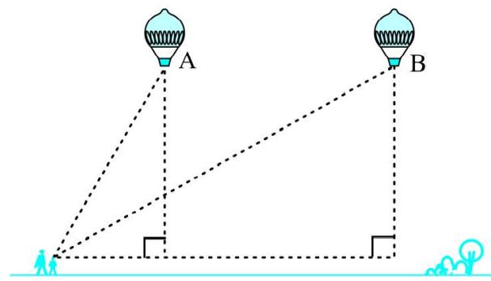  
Fig. 8.3

In all the situations given above, the distances or heights can be found by using some mathematical techniques, which come under a branch of mathematics called ‘trigonometry’. The word ‘trigonometry’ is de rived from the Gre ek words ‘tri’ (meaning three), ‘gon’ (meaning sides) and ‘metron’ (meaning measure). In fact, trigonometry is the study of relationships between the sides and angles of a triangle. The earliest known work on trigonometry was recorded in Egypt and Babylon. Early astronomers used it to find out the distances of the stars and planets from the Earth. Even today, most of the technologically advanced methods used in Engineering and Physical Sciences are based on trigonometrical concepts.

In this chapter, we will study some ratios of the sides of a right triangle with respect to its acute angles, called trigonometric ratios of the angle. We will restrict our discussion to acute angles only. However, these ratios can be extended to other angles also. We will also define the trigonometric ratios for angles of measure $0 ^ { \circ }$ and $9 0 ^ { \circ }$ . We will calculate trigonometric ratios for some specific angles and establish some identities involving these ratios, called trigonometric identities.

### 8.2 Trigonometric Ratios

In Section 8.1, you have seen some right triangles imagined to be formed in different situations.

Let us take a right triangle ABC as shown in Fig. 8.4. Here, $\angle C \mathrm { A B }$ (or, in brief, angle A) is an acute angle. Note the position of the side BC with respect to angle A. It faces $\angle \mathbf { A }$ . We call it the side opposite to angle A. AC is the hypotenuse of the right triangle and the side A B i s a par t of ‘ A. So, we call it the side adjacent to angle A.

  
Fig. 8.4

Note that the position of sides change when you consider angle C in place of A (see Fig. 8.5).

You have studied the concept of ‘ratio’ in your earlier classes. We now define certain ratios involving the sides of a right triangle, and call them trigonometric ratios.

The trigonometric ratios of the angle A in right triangle ABC (see Fig. 8.4) are defined as follows :

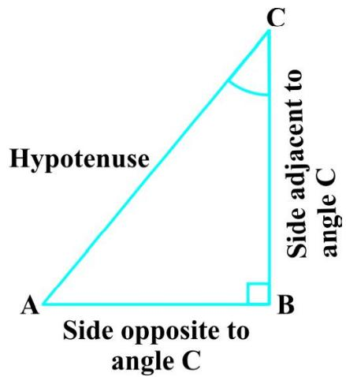  
Fig. 8.5

$$
\operatorname {s i n e} \angle A = \frac {\text {s i d e o p p o s i t e t o a n g l e A}}{\text {h y p o t e n u s e}} = \frac {\mathrm {B C}}{\mathrm {A C}}
$$

$$
\cos i n e \angle A = \frac {\text {s i d e a d j a c e n t t o a n g l e A}}{\text {h y p o t e n u s e}} = \frac {\mathrm {A B}}{\mathrm {A C}}
$$

$$
\tan g e n t \angle A = \frac {\text {s i d e o p p o s i t e t o a n g l e A}}{\text {s i d e a d j a c e n t t o a n g l e A}} = \frac {\mathrm {B C}}{\mathrm {A B}}
$$

$$
\operatorname {c o s e c a n t} \angle A = \frac {1}{\text {s i n e o f} \angle A} = \frac {\text {h y p o t e n u s e}}{\text {s i d e o p p o s i t e t o a n g l e A}} = \frac {A C}{B C}
$$

$$
\operatorname {s e c a n t} \angle A = \frac {1}{\operatorname {c o s i n e} \angle A} = \frac {\text {h y p o t e n u s e}}{\text {s i d e} \text {a d j a c e n t} \text {t o} \text {a n g l e} A} = \frac {A C}{A B}
$$

$$
\cot a n g e n t \angle A = \frac {1}{\tan a n g e n t \angle A} = \frac {\text {s i d e a d j a c e n t t o a n g l e A}}{\text {s i d e o p p o s i t e t o a n g l e A}} = \frac {\mathrm {A B}}{\mathrm {B C}}
$$

The ratios defined above are abbreviated as sin A, cos A, tan A, cosec A, sec A and cot A respectively. Note that the ratios cosec A, sec A and cot A are respectively, the reciprocals of the ratios sin A, cos A and tan A.

$$
\text {A l s o , o b s e r v e t h a t} \tan A = \frac {B C}{A B} = \frac {\frac {B C}{A C}}{\frac {A B}{A C}} = \frac {\sin A}{\cos A} \text {a n d} \cot A = \frac {\cos A}{\sin A}.
$$

So, the trigonometric ratios of an acute angle in a right triangle express the relationship between the angle and the length of its sides.

Why don’t you try to define the trigonometric ratios for angle C in the right triangle? (See Fig. 8.5)

The first use of the idea of ‘sine’ in the way we use it today was in the work Aryabhatiyam by Aryabhata, in A.D. 500. Aryabhata used the word ardha-jya for the half-chord, which was shortened to jya or jiva in due course. When the Aryabhatiyam was translated into Arabic, the word jiva was retained as it is. The word jiva was translated into sinus, which means curve, when the Arabic version was translated into Latin. Soon the word sinus, also used as sine, became common in mathematical texts throughout Europe. An English Professor of astronomy Edmund Gunter (1581– 1626), first used the abbreviated notation ‘sin’.

  
Aryabhata C.E. 476 – 550

The origin of the terms ‘cosine’ and ‘tangent’ was much later. The cosine function arose from the need to compute the sine of the complementary angle. Aryabhatta called it kotijya. The name cosinus originated with Edmund Gunter. In 1674, the English Mathematician Sir Jonas Moore first used the abbreviated notation ‘cos’.

Remark : Note that the symbol sin A is used as an abbreviation for ‘the sine of the angle A’. sin A is not the product of ‘sin’ and A. ‘sin’ separated from A has no meaning. Similarly, cos A is not the product of ‘cos’ and A. Similar interpretations follow for other trigonometric ratios also.

Now, if we take a point P on the hypotenuse AC or a point Q on AC extended, of the right triangle ABC and draw PM perpendicular to AB and QN perpendicular to AB extended (see Fig. 8.6), how will the trigonometric ratios of ‘ A in ' PAM differ from those of ‘ A in $\Delta$ CAB or from those of ‘ A in ' QAN?

  
Fig. 8.6

To answer this, first look at these triangles. Is $\Delta$ PAM similar to ' CAB? From Chapter 6, recall the AA similarity criterion. Using the criterion, you will see that the triangles PAM and CAB are similar. Therefore, by the property of similar triangles, the corresponding sides of the triangles are proportional.

So, we have

$$
\frac {\mathrm {A M}}{\mathrm {A B}} = \frac {\mathrm {A P}}{\mathrm {A C}} = \frac {\mathrm {M P}}{\mathrm {B C}}.
$$

From this, we find ${ \frac { \mathrm { M P } } { \mathrm { A P } } } = { \frac { \mathrm { B C } } { \mathrm { A C } } } = \sin { \mathrm { A } } .$

Similarly, ${ \frac { \mathrm { A M } } { \mathrm { A P } } } = { \frac { \mathrm { A B } } { \mathrm { A C } } } = \cos \mathrm { A }$ , ${ \frac { \mathrm { M P } } { \mathrm { A M } } } = { \frac { \mathrm { B C } } { \mathrm { A B } } } =$ tan A and so on.

This shows that the trigonometric ratios of angle A in $\Delta$ PAM not differ from those of angle A in $\Delta$ CAB.

In the same way, you should check that the value of sin A (and also of other trigonometric ratios) remains the same in $\Delta$ QAN also.

From our observations, it is now clear that the values of the trigonometric ratios of an angle do not vary with the lengths of the sides of the triangle, if the angle remains the same.

Note : For the sake of convenience, we may write $\sin ^ { 2 } \mathrm { A }$ , $\cos ^ { 2 } \mathsf { A }$ , etc., in place of (sin A)2, (cos A)2, etc., respectively. But cosec $\mathbf { A } { = } ( \sin \mathbf { A } ) ^ { - 1 } { \neq } \sin ^ { - 1 } \mathbf { A } ($ (it is called sine inverse A). $\mathrm { s i n } ^ { - 1 }$ A has a different meaning, which will be discussed in higher classes. Similar conventions hold for the other trigonometric ratios as well. Sometimes, the Greek letter T (theta) is also used to denote an angle.

We have defined six trigonometric ratios of an acute angle. If we know any one of the ratios, can we obtain the other ratios? Let us see.

If in a right triangle ABC, $\sin \mathrm { A } = { \frac { 1 } { 3 } } ;$ , then this means that ${ \frac { \mathrm { B C } } { \mathrm { A C } } } = { \frac { 1 } { 3 } }$ 2 , i.e., the lengths of the sides BC and AC of the triangle ABC are in the ratio $1 : 3$ (see Fig. 8.7). So if BC is equal to $k$ , then AC will be $3 k _ { ; }$ , where $k$ is any positive number. To determine other

  
Fig. 8.7

trigonometric ratios for the angle A, we need to find the length of the third side AB. Do you remember the Pythagoras theorem? Let us use it to determine the required length AB.

$$
\mathrm {A B} ^ {2} = \mathrm {A C} ^ {2} - \mathrm {B C} ^ {2} = (3 k) ^ {2} - (k) ^ {2} = 8 k ^ {2} = (2 \sqrt {2} k) ^ {2}
$$

Therefore, $\mathbf { A B } = \pm 2 { \sqrt { 2 } } k$

So, we get

Now, $\cos \mathrm { A } = { \frac { \mathrm { A B } } { \mathrm { A C } } } = { \frac { 2 { \sqrt { 2 } } k } { 3 k } } = { \frac { 2 { \sqrt { 2 } } } { 3 } }$

Similarly, you can obtain the other trigonometric ratios of the angle A.

Remark : Since the hypotenuse is the longest side in a right triangle, the value of sin A or cos A is always less than 1 (or, in particular, equal to 1).

Let us consider some examples.

Example 1 : Given tan $\mathrm { A } { = } \frac { 4 } { 3 }$ find the other trigonometric ratios of the angle A.

Solution : Let us first draw a right $\Delta$ ABC (see Fig 8.8).

Now, we know that tan $\mathrm { A } = { \frac { \mathrm { B C } } { \mathrm { A B } } } = { \frac { 4 } { 3 } }$ 3

Therefore, if $\mathrm { B C } = 4 k$ , then $\mathrm { A B } = 3 k$ , where $k$ is a positive number.

Now, by using the Pythagoras Theorem, we have

$$
\mathrm {A C} ^ {2} = \mathrm {A B} ^ {2} + \mathrm {B C} ^ {2} = (4 k) ^ {2} + (3 k) ^ {2} = 2 5 k ^ {2}
$$

So, $\mathrm { A C } = 5 k$

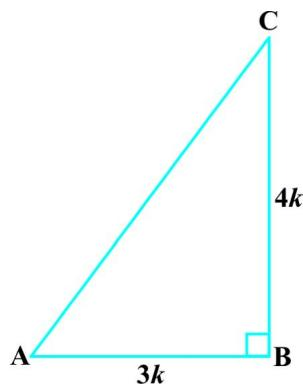  
Fig. 8.8

Now, we can write all the trigonometric ratios using their definitions.

$$
\sin A = \frac {B C}{A C} = \frac {4 k}{5 k} = \frac {4}{5}
$$

$$
\cos A = \frac {A B}{A C} = \frac {3 k}{5 k} = \frac {3}{5}
$$

Therefore, cot $\mathrm { A } = { \frac { 1 } { \tan \mathrm { A } } } = { \frac { 3 } { 4 } }$ 3 , cosec A = $\mathbf { A } = { \frac { 1 } { \sin \mathbf { A } } } = { \frac { 5 } { 4 } }$ and sec A = $\mathrm { A } = { \frac { 1 } { \cos \mathrm { A } } } = { \frac { 5 } { 3 } }$

Example $2 :$ If $\angle \mathrm { \textbf { B } }$ and $\angle \mathrm { Q }$ are acute angles such that sin ${ \mathrm { B } } = \sin { \mathrm { Q } }$ , then prove that $\angle \mathrm { B } = \angle \mathrm { Q }$ .

Solution : Let us consider two right triangles ABC and PQR where sin B = sin Q (see Fig. 8.9).

We have sin B =

and

  
Fig. 8.9

Then AC PR AB PQ

Therefore, $\frac { \mathrm { A C } } { \mathrm { P R } } = \frac { \mathrm { A B } } { \mathrm { P Q } } = k .$ , say k (1)

Now, using Pythagoras theorem,

$$
\mathrm {B C} = \sqrt {\mathrm {A B} ^ {2} - \mathrm {A C} ^ {2}}
$$

and $\mathrm { Q R } = { \sqrt { \mathrm { P Q } ^ { 2 } - \mathrm { P R } ^ { 2 } } }$

So, ${ \frac { \mathrm { B C } } { \mathrm { Q R } } } = { \frac { \sqrt { \mathrm { A B } ^ { 2 } - \mathrm { A C } ^ { 2 } } } { \sqrt { \mathrm { P Q } ^ { 2 } - \mathrm { P R } ^ { 2 } } } } = { \frac { \sqrt { k ^ { 2 } \mathrm { P Q } ^ { 2 } - k ^ { 2 } \mathrm { P R } ^ { 2 } } } { \sqrt { \mathrm { P Q } ^ { 2 } - \mathrm { P R } ^ { 2 } } } } = { \frac { k { \sqrt { \mathrm { P Q } ^ { 2 } - \mathrm { P R } ^ { 2 } } } } { \sqrt { \mathrm { P Q } ^ { 2 } - \mathrm { P R } ^ { 2 } } } } = k$ (2)

From (1) and (2), we have

$$
\frac {A C}{P R} = \frac {A B}{P Q} = \frac {B C}{Q R}
$$

Then, by using Theorem 6.4, ' ACB ~ ' PRQ and therefore, $\angle \mathbf { B } = \angle \mathbf { Q }$ .

Example 3 : Consider $\Delta$ ACB, right-angled at C, in which AB $=$ 29 units, $\mathrm { B C } = 2 1$ units and $\angle A \mathbf { B } \mathbf { C } = \mathbf { \theta }$ (see Fig. 8.10). Determine the values of

(i) cos2 T + sin2 T,   
(ii) cos2 T – sin2 T

Solution : In $\Delta$ ACB, we have

$$
\begin{array}{l} \mathrm {A C} = \sqrt {\mathrm {A B} ^ {2} - \mathrm {B C} ^ {2}} = \sqrt {(2 9) ^ {2} - (2 1) ^ {2}} \\ = \sqrt {(2 9 - 2 1) (2 9 + 2 1)} = \sqrt {(8) (5 0)} = \sqrt {4 0 0} = 2 0 \text {u n i t s} \\ \end{array}
$$

So, sin $\displaystyle \Theta = \frac { \mathrm { A C } } { \mathrm { A B } } = \frac { 2 0 } { 2 9 } ;$ cos =T , $\Theta = { \frac { \mathrm { B C } } { \mathrm { A B } } } = { \frac { 2 1 } { 2 9 } }$ ˜

Now, (i) $\mathrm { c o s } ^ { 2 } \Theta + \mathrm { s i n } ^ { 2 } \Theta = \left( \frac { 2 0 } { 2 9 } \right) ^ { 2 } + \left( \frac { 2 1 } { 2 9 } \right) ^ { 2 } = \frac { 2 0 ^ { 2 } + 2 1 ^ { 2 } } { 2 9 ^ { 2 } } = \frac { 4 0 0 + 4 4 1 } { 8 4 1 } = 1 ,$

and (ii) $\cos ^ { 2 } \theta - \sin ^ { 2 } \theta = \left( { \frac { 2 1 } { 2 9 } } \right) ^ { 2 } - \left( { \frac { 2 0 } { 2 9 } } \right) ^ { 2 } = { \frac { ( 2 1 + 2 0 ) ( 2 1 - 2 0 ) } { 2 9 ^ { 2 } } } = { \frac { 4 1 } { 8 4 1 } } .$

  
Fig. 8.10

Example 4 : In a right triangle ABC, right-angled at B, if tan $\mathbf { A } = 1$ , then verify that

2 sin A cos $\mathbf { A } = 1$ .

Solution : In ' ABC, tan A = BC = 1 (see Fig 8.11)

i.e.,

$$
\mathrm {B C} = \mathrm {A B}
$$

Let $\mathrm { A B } = \mathrm { B C } = k _ { \mathrm { { m } } }$ , where $k$ is a positive number.

Now, $\mathbf { A C } = { \sqrt { \mathbf { A B } ^ { 2 } + \mathbf { B C } ^ { 2 } } }$

$$
= \sqrt {(k) ^ {2} + (k) ^ {2}} = k \sqrt {2}
$$

Therefore, $\sin \mathrm { A } = \frac { \mathrm { B C } } { \mathrm { A C } } = \frac { 1 } { \sqrt { 2 } } \quad \mathrm { ~ a n d ~ } \quad \cos \mathrm { A } = \frac { \mathrm { A B } } { \mathrm { A C } } = \frac { 1 } { \sqrt { 2 } }$

So, 2 sin $\cos \mathrm { A } = 2 { \bigg ( } { \frac { 1 } { \sqrt { 2 } } } { \bigg ) } { \bigg ( } { \frac { 1 } { \sqrt { 2 } } } { \bigg ) } = 1 ,$ which is the required value.

Example 5 : In $\Delta$ OPQ, right-angled at P, $\mathrm { O P } = 7$ cm and $\mathrm { O Q } - \mathrm { P Q } = 1$ cm (see Fig. 8.12). Determine the values of sin Q and cos Q.

Solution : In ' OPQ, we have

$$
O Q ^ {2} = O P ^ {2} + P Q ^ {2}
$$

i.e., (1 + PQ)2 = OP2 + PQ2 (Why?)

i.e., $1 + \mathrm { P Q } ^ { 2 } + 2 \mathrm { P Q } = \mathrm { O P } ^ { 2 } + \mathrm { P Q } ^ { 2 }$

i.e., $1 + 2 \mathrm { P Q } = 7 ^ { 2 }$ (Why?)

i.e., PQ = 24 cm and $\mathrm { O Q } = 1 + \mathrm { P Q } = 2 5 \mathrm { \bf c }$ m

So, si ${ \mathfrak { n } } \mathrm { Q } = { \frac { 7 } { 2 5 } }$ and cos $\mathrm { Q } = { \frac { 2 4 } { 2 5 } }$ ˜

  
Fig. 8.11

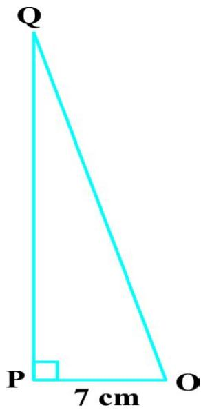  
Fig. 8.12

## EXERCISE 8.1

1. In ' ABC, right-angled at B, $\mathrm { A B } = 2 4 \mathrm { c m }$ , $\mathrm { B C } = 7$ cm. Determine :

(i) sin A, cos A   
(ii) sin C, cos C

2. In Fig. 8.13, find tan P – cot R.   
3. If sin A = 3 4 , calculate cos A and tan A.   
4. Given 15 cot $\mathrm { A } = 8$ , find sin A and sec A.   
5. Given sec T =  13 , $\Theta = { \frac { 1 3 } { 1 2 } }$ calculate all other trigonometric ratios.   
6. If $\angle \mathbf { A }$ and $\angle \mathrm { B }$ are acute angles such that cos $\mathbf { A } { = } \cos \mathbf { B }$ , then show that $\angle \mathrm { A } = \angle \mathrm { B }$   
7. If cot $\theta = \frac { 7 } { 8 }$ , evaluate : (i) (1 sin )(1 sin ) , T  T (ii) cot2 T (1 cos )(1 cos ) T  T   
8. If 3 cot $\mathrm { A } = 4$ , check whether ${ \frac { 1 - \tan ^ { 2 } \mathrm { \mathbf { A } } } { 1 + \tan ^ { 2 } \mathrm { \mathbf { A } } } } = \cos ^ { 2 } \mathrm { \mathbf { A } } - \sin ^ { 2 } \mathrm { \mathbf { A } } { \mathrm { \mathbf { \complement } } }$ or not.   
9. In triangle ABC, right-angled at B, if tan $\mathrm { A } = { \frac { 1 } { \sqrt { 3 } } } ,$ find the value of:

(i) sin A cos C + cos A sin C  
(ii) cos A cos C – sin A sin C

10. In ' PQR, right-angled at $\mathrm { Q , P R + Q R = 2 5 c m }$ and $\mathrm { P Q } = 5$ cm. Determine the values of sin P, cos P and tan P.   
11. State whether the following are true or false. Justify your answer.

(i) The value of tan A is always less than 1.   
(ii) se $\mathbf { \partial } : \mathbf { A } = { \frac { 1 2 } { 5 } }$ for some value of angle A.   
(iii) cos A is the abbreviation used for the cosecant of angle A.   
(iv) cot A is the product of cot and A.   
(v) sin $\Theta = \frac { 4 } { 3 }$ for some angle T.

### 8.3 Trigonometric Ratios of Some Specific Angles

From geometry, you are already familiar with the construction of angles of $3 0 ^ { \circ }$ , $4 5 ^ { \circ }$ , $6 0 ^ { \circ }$ and $9 0 ^ { \circ }$ . In this section, we will find the values of the trigonometric ratios for these angles and, of course, for $0 ^ { \circ }$ .

  
Fig. 8.13

## Trigonometric Ratios of $4 5 ^ { \circ }$

In ' ABC, right-angled at B, if one angle is $4 5 ^ { \circ }$ , then the other angle is also $4 5 ^ { \circ }$ , i.e., $\angle \mathrm { A } = \angle \mathrm { C } = 4 5 ^ { \circ }$ (see Fig. 8.14).

So, $\mathbf { B C = A B } \mathbf { \qquad } ( \mathbf { W h y } ? )$

Now, Suppose ${ \mathrm { B C } } = \mathbf { A B } = a$

Then by Pythagoras Theorem, $\scriptstyle \mathrm { A C } ^ { 2 } = \mathrm { A B } ^ { 2 } + \mathrm { B C } ^ { 2 } = a ^ { 2 } + a ^ { 2 } = 2 a ^ { 2 }$ , and, therefore, $\mathbf { A C } = { \_ { \sqrt { 2 } } } .$

Using the definitions of the trigonometric ratios, we have :

  
Fig. 8.14

$$
\sin 4 5 ^ {\circ} = \frac {\text {s i d e o p p o s i t e t o a n g l e} 4 5 ^ {\circ}}{\text {h y p o t e n u s e}} = \frac {\mathrm {B C}}{\mathrm {A C}} = \frac {a}{a \sqrt {2}} = \frac {1}{\sqrt {2}}
$$

$$
\cos 4 5 ^ {\circ} = \frac {\text {s i d e a d j a c e n t t o a n g l e} 4 5 ^ {\circ}}{\text {h y p o t e n u s e}} = \frac {\mathrm {A B}}{\mathrm {A C}} = \frac {a}{a \sqrt {2}} = \frac {1}{\sqrt {2}}
$$

$$
\tan 4 5 ^ {\circ} = \frac {\text {s i d e o p p o s i t e t o a n g l e} 4 5 ^ {\circ}}{\text {s i d e a d j a c e n t t o a n g l e} 4 5 ^ {\circ}} = \frac {\mathrm {B C}}{\mathrm {A B}} = \frac {a}{a} = 1
$$

Also,cosec $4 5 ^ { \circ } = \frac { 1 } { \sin 4 5 ^ { \circ } } = \sqrt { 2 }$ , sec $4 5 ^ { \circ } = { \frac { 1 } { \cos 4 5 ^ { \circ } } } = { \sqrt { 2 } }$ , cot $4 5 ^ { \circ } = { \frac { 1 } { \tan 4 5 ^ { \circ } } } = 1$ .

## Trigonometric Ratios of $3 0 ^ { \circ }$ and ${ \bf 6 0 } ^ { \circ }$

Let us now calculate the trigonometric ratios of $3 0 ^ { \circ }$ and $6 0 ^ { \circ }$ . Consider an equilateral triangle ABC. Since each angle in an equilateral triangle is $6 0 ^ { \circ }$ , therefore, $\angle \mathrm { A } = \angle \mathrm { B } = \angle \mathrm { C } = 6 0 ^ { \circ } .$ .

Draw the perpendicular AD from A to the side BC (see Fig. 8.15).

Now $\Delta \mathrm { A B D } \cong \Delta \mathrm { A C D }$ (Why?)

Therefore, $\mathrm { B D } = \mathrm { D C }$

and $\angle B \mathrm { A D } = \angle C \mathrm { A D }$ (CPCT)

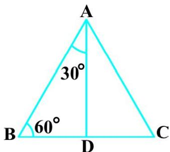  
Fig. 8.15

Now observe that:

$\Delta$ ABD is a right triangle, right - angled at $\mathrm { D }$ with $\angle \mathrm { \ B A D } = 3 0 ^ { \circ }$ and $\angle \mathrm { \ A B D } = 6 0 ^ { \circ }$ (see Fig. 8.15).

As you know, for finding the trigonometric ratios, we need to know the lengths of the sides of the triangle. So, let us suppose that $\mathrm { A B } = 2 a$ .

Then, ${ \mathrm { B D } } = { \frac { 1 } { 2 } } { \mathrm { B C } } = a$ =

and $\mathrm { A D } ^ { 2 } = \mathrm { A B } ^ { 2 } - \mathrm { B D } ^ { 2 } = ( 2 a ) ^ { 2 } - ( a ) ^ { 2 } = 3 a ^ { 2 } ,$

Therefore, AD = a 3 $\mathrm { A D } = { \mathfrak { a } } { \sqrt { 3 } }$

Now, we have :

$$
\sin 3 0 ^ {\circ} = \frac {\mathrm {B D}}{\mathrm {A B}} = \frac {a}{2 a} = \frac {1}{2}, \cos 3 0 ^ {\circ} = \frac {\mathrm {A D}}{\mathrm {A B}} = \frac {a \sqrt {3}}{2 a} = \frac {\sqrt {3}}{2}
$$

$$
\tan 3 0 ^ {\circ} = \frac {\mathrm {B D}}{\mathrm {A D}} = \frac {a}{a \sqrt {3}} = \frac {1}{\sqrt {3}}.
$$

Also, cosec $3 0 ^ { \circ } = { \frac { 1 } { \sin 3 0 ^ { \circ } } } = 2$ , sec $3 0 ^ { \circ } = { \frac { 1 } { \cos 3 0 ^ { \circ } } } = { \frac { 2 } { \sqrt { 3 } } }$

$$
\cot 3 0 ^ {\circ} = \frac {1}{\tan 3 0 ^ {\circ}} = \sqrt {3}.
$$

Similarly,

$$
\sin 6 0 ^ {\circ} = \frac {\mathrm {A D}}{\mathrm {A B}} = \frac {a \sqrt {3}}{2 a} = \frac {\sqrt {3}}{2}, \cos 6 0 ^ {\circ} = \frac {1}{2}, \tan 6 0 ^ {\circ} = \sqrt {3},
$$

cosec $6 0 ^ { \circ } = { \frac { 2 } { \sqrt { 3 } } } ,$ sec $6 0 ^ { \circ } = 2$ and cot $6 0 ^ { \circ } = { \frac { 1 } { \sqrt { 3 } } }$

## Trigonometric Ratios of ${ \bf 0 } ^ { \circ }$ and $9 0 ^ { \circ }$

Let us see what happens to the trigonometric ratios of angle A, if it is made smaller and smaller in the right triangle ABC (see Fig. 8.16), till it becomes zero. As $\angle \mathbf { A }$ gets smaller and smaller, the length of the side BC decreases.The point C gets closer to point B, and finally when ‘ A becomes very close to $0 ^ { \circ }$ , AC becomes almost the same as AB (see Fig. 8.17).

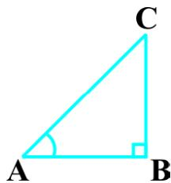  
Fig. 8.16

  
Fig. 8.17

When $\angle \mathbf { \theta } \mathbf { A }$ is very close to $0 ^ { \circ }$ , BC gets very close to 0 and so the value of $\sin \mathrm { A } = { \frac { \mathrm { B C } } { \mathrm { A C } } }$ is very close to 0. Also, when $\angle \mathrm { A }$ is very close to $0 ^ { \circ }$ , AC is nearly the same as AB and so the value of cos $\mathbf { A } { = } { \frac { \mathbf { A } \mathbf { B } } { \mathbf { A } \mathbf { C } } }$ is very close to 1.

This helps us to see how we can define the values of sin A and cos A when $\mathbf { A } = 0 ^ { \circ }$ . We define : sin ${ \bf 0 } ^ { \circ } = { \bf 0 }$ and cos $\mathbf { 0 } ^ { \circ } = \mathbf { 1 }$ .

Using these, we have :

tan 0° = sin 0° $0 ^ { \circ } = { \frac { \sin 0 ^ { \circ } } { \cos 0 ^ { \circ } } } = 0$ , cot $0 ^ { \circ } = { \frac { 1 } { \tan \ 0 ^ { \circ } } } ;$ , which is not defined. (Why?) tan 0°

sec 0° = $0 ^ { \circ } = { \frac { 1 } { \cos 0 ^ { \circ } } } = 1$ and cosec $0 ^ { \circ } = { \frac { 1 } { \sin \ 0 ^ { \circ } } }$ which is again not defined.(Why?) sin 0q

Now, let us see what happens to the trigonometric ratios of $\angle \mathbf { A }$ , when it is made larger and larger in $\Delta$ ABC till it becomes $9 0 ^ { \circ }$ . As $\angle \mathbf { A }$ gets larger and larger, $\angle \mathrm { C }$ gets smaller and smaller. Therefore, as in the case above, the length of the side AB goes on decreasing. The point A gets closer to point B. Finally when $\angle \mathbf { A }$ is very close to $9 0 ^ { \circ }$ , $\angle \mathrm { C }$ becomes very close to $0 ^ { \circ }$ and the side AC almost coincides with side BC (see Fig. 8.18).

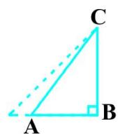

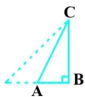

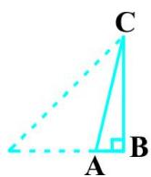

  
Fig. 8.18

When $\angle \mathrm { C }$ is very close to $0 ^ { \circ }$ , $\angle \mathrm { A }$ is very close to $9 0 ^ { \circ }$ , side AC is nearly the same as side BC, and so sin A is very close to 1. Also when $\angle \mathbf { A }$ is very close to $9 0 ^ { \circ }$ , $\angle \mathrm { C }$ is very close to $0 ^ { \circ }$ , and the side AB is nearly zero, so cos A is very close to 0.

So, we define : sin ${ \bf 9 0 ^ { \circ } } = { \bf 1 }$ and cos ${ \bf 9 0 } ^ { \circ } = \bf 0$ .

Now, why don’t you find the other trigonometric ratios of $9 0 ^ { \circ } ?$

We shall now give the values of all the trigonometric ratios of $0 ^ { \circ }$ , $3 0 ^ { \circ }$ , $4 5 ^ { \circ }$ , $6 0 ^ { \circ }$ and $9 0 ^ { \circ }$ in Table 8.1, for ready reference.

Table 8.1   

<table><tr><td>∠A</td><td>0°</td><td>30°</td><td>45°</td><td>60°</td><td>90°</td></tr><tr><td>sin A</td><td>0</td><td>1/2</td><td>1/√2</td><td>√3/2</td><td>1</td></tr><tr><td>cos A</td><td>1</td><td>√3/2</td><td>1/√2</td><td>1/2</td><td>0</td></tr><tr><td>tan A</td><td>0</td><td>1/√3</td><td>1</td><td>√3</td><td>Not defined</td></tr><tr><td>cosec A</td><td>Not defined</td><td>2</td><td>√2</td><td>2/√3</td><td>1</td></tr><tr><td>sec A</td><td>1</td><td>2/√3</td><td>√2</td><td>2</td><td>Not defined</td></tr><tr><td>cot A</td><td>Not defined</td><td>√3</td><td>1</td><td>1/√3</td><td>0</td></tr></table>

Remark : From the table above you can observe that as ‘ A increases from $0 ^ { \circ }$ to $9 0 ^ { \circ }$ , sin A increases from 0 to 1 and cos A decreases from 1 to 0.

Let us illustrate the use of the values in the table above through some examples.

Example 6 : In $\Delta$ ABC, right-angled at B, $\mathbf { A } \mathbf { B } = 5$ cm and $\angle \mathrm { A C B } = 3 0 ^ { \circ }$ (see Fig. 8.19). Determine the lengths of the sides BC and AC.

Solution : To find the length of the side BC, we will choose the trigonometric ratio involving BC and the given side AB. Since BC is the side adjacent to angle C and AB is the side opposite to angle C, therefore

  
Fig. 8.19

$$
\frac {A B}{B C} = \tan C
$$

i.e., ${ \frac { 5 } { \mathrm { B C } } } = \tan 3 0 ^ { \circ } = { \frac { 1 } { \sqrt { 3 } } }$

which gives BC = 5 3 cm

To find the length of the side AC, we consider

$$
\sin 3 0 ^ {\circ} = \frac {A B}{A C} \quad (\text {W h y ?})
$$

i.e., ${ \frac { 1 } { 2 } } = { \frac { 5 } { \mathrm { A C } } }$

i.e., $\mathtt { A C } = 1 0 \ \mathtt { c m }$

Note that alternatively we could have used Pythagoras theorem to determine the third side in the example above,

i.e., ${ \mathrm { A C } } = { \sqrt { { \mathrm { A B } } ^ { 2 } + { \mathrm { B C } } ^ { 2 } } } = { \sqrt { 5 ^ { 2 } + ( 5 { \sqrt { 3 } } ) ^ { 2 } } } { \mathrm { c m } } = 1 0 { \mathrm { c m } } .$

Example 7 : In $\Delta$ PQR, right - angled at Q (see Fig. 8.20), $\mathrm { P Q } = 3$ cm and $\mathrm { P R } = 6$ cm. Determine $\angle$ QPR and ‘ PRQ.

Solution : Given PQ = 3 cm and $\mathrm { P R } = 6$ cm.

Therefore, $\frac { \mathrm { P Q } } { \mathrm { P R } } = \sin \mathrm { R }$

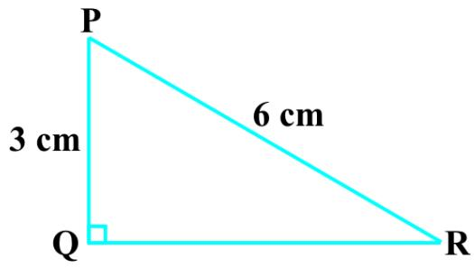  
Fig. 8.20

or $\sin \mathrm { \mathbf { R } } = { \frac { 3 } { 6 } } = { \frac { 1 } { 2 } }$

So, $\angle P \mathrm { R Q } = 3 0 ^ { \circ }$

and therefore, $\angle { \mathrm { Q P R } } = 6 0 ^ { \circ } . ~ \mathrm { ( W h y ? ) }$

You may note that if one of the sides and any other part (either an acute angle or any side) of a right triangle is known, the remaining sides and angles of the triangle can be determined.

$\mathbf { E x a m p l e 8 : l f \sin { ( A - B ) } = { \frac { 1 } { 2 } } , \cos { ( A + B ) } = { \frac { 1 } { 2 } } , 0 ^ { \circ } < A + B \leq 9 0 ^ { \circ } , A > B , f i l a = 1 } .$ $\mathbf A > \mathbf B$ nd A and B.

Solution : Since, sin $( \mathbf { A } - \mathbf { B } ) = { \frac { 1 } { 2 } }$ , therefore, A – B = 30° (Why?) (1)

Also, since cos $( \mathbf { A } + \mathbf { B } ) = { \frac { 1 } { 2 } }$ , therefore, $\mathbf { A } + \mathbf { B } = 6 0 ^ { \circ }$ (Why?) (2)

Solving (1) and (2), we get : $\mathrm { A } = 4 5 ^ { \circ }$ and $\mathrm { B } = 1 5 ^ { \circ }$ .

## EXERCISE 8.2

1. Evaluate the following :

(i) sin $6 0 ^ { \circ }$ cos 30° + sin 30° cos $6 0 ^ { \circ }$ (ii) 2 tan2 45° + cos2 30° – sin2 60°

(iii) $\frac { \cos 4 5 ^ { \circ } } { \sec 3 0 ^ { \circ } + \cos \sec 3 0 ^ { \circ } }$

(iv) $\frac { \sin 3 0 ^ { \circ } + \tan 4 5 ^ { \circ } - \csc 6 0 ^ { \circ } } { \sec 3 0 ^ { \circ } + \cos 6 0 ^ { \circ } + \cot 4 5 ^ { \circ } }$

(v) $\frac { 5 \cos ^ { 2 } 6 0 ^ { \circ } + 4 \sec ^ { 2 } 3 0 ^ { \circ } - \tan ^ { 2 } 4 5 ^ { \circ } } { \sin ^ { 2 } 3 0 ^ { \circ } + \cos ^ { 2 } 3 0 ^ { \circ } }$

2. Choose the correct option and justify your choice :

(i) $\frac { 2 \tan 3 0 ^ { \circ } } { 1 + \tan ^ { 2 } 3 0 ^ { \circ } } =$

(A) sin 60°

(B) cos $6 0 ^ { \circ }$

(C) tan $6 0 ^ { \circ }$

(D) sin 30°

(ii) $\frac { 1 - \tan ^ { 2 } 4 5 ^ { \circ } } { 1 + \tan ^ { 2 } 4 5 ^ { \circ } } =$

(A) tan 90°

(B) 1

(C) sin $4 5 ^ { \circ }$

(D) 0

(iii) sin $2 \mathrm { A } = 2$ sin A is true when $\mathbf { A } =$

(A) $0 ^ { \circ }$

(B) 30°

(C) 45°

(D) 60°

(iv) ${ \frac { 2 \tan 3 0 ^ { \circ } } { 1 - \tan ^ { 2 } 3 0 ^ { \circ } } } =$

(A) cos $6 0 ^ { \circ }$

(B) sin $6 0 ^ { \circ }$

(C) tan $6 0 ^ { \circ }$

(D) sin 30°

3. If tan $( \mathrm { A } + \mathrm { B } ) = \sqrt { 3 }$ and tan $( \mathbf { A } - \mathbf { B } ) = { \frac { 1 } { \sqrt { 3 } } } ; 0 ^ { \circ } < \mathbf { A } + \mathbf { B } \leq 9 0 ^ { \circ } ; \mathbf { A } > \mathbf { B } ,$ find A and B.

4. State whether the following are true or false. Justify your answer.

(i) $\sin \left( \mathrm { A } + \mathrm { B } \right) = \sin \mathrm { A } + \sin \mathrm { B } .$   
(ii) The value of sin T increases as T increases.   
(iii) The value of cos T increases as T increases.   
(iv) sin $\theta = \cos \theta$ for all values of T.   
(v) cot A is not defined for $\mathbf { A } = 0 ^ { \circ }$

### 8.4 Trigonometric Identities

You may recall that an equation is called an identity when it is true for all values of the variables involved. Similarly, an equation involving trigonometric ratios of an angle is called a trigonometric identity, if it is true for all values of the angle(s) involved.

In this section, we will prove one trigonometric identity, and use it further to prove other useful trigonometric identities.

  
Fig. 8.21

In ' ABC, right-angled at B (see Fig. 8.21), we have:

$$
A B ^ {2} + B C ^ {2} = A C ^ {2} \tag {1}
$$

Dividing each term of (1) by $\mathbf { A } \mathbf { C } ^ { 2 }$ , we get

$$
\frac {\mathrm {A B} ^ {2}}{\mathrm {A C} ^ {2}} + \frac {\mathrm {B C} ^ {2}}{\mathrm {A C} ^ {2}} = \frac {\mathrm {A C} ^ {2}}{\mathrm {A C} ^ {2}}
$$

i.e., $\left( { \frac { \mathrm { A B } } { \mathrm { A C } } } \right) ^ { 2 } + \left( { \frac { \mathrm { B C } } { \mathrm { A C } } } \right) ^ { 2 } = \left( { \frac { \mathrm { A C } } { \mathrm { A C } } } \right) ^ { 2 }$

i.e., $( \cos \mathrm { A } ) ^ { 2 } + ( \sin \mathrm { A } ) ^ { 2 } = 1$

i.e., $\mathbf { c o s } ^ { 2 } \mathbf { A } + \mathbf { s i n } ^ { 2 } \mathbf { A } = \mathbf { 1 }$ (2)

This is true for all A such that $0 ^ { \circ } \le \mathbf { A } \le 9 0 ^ { \circ }$ . So, this is a trigonometric identity.

Let us now divide (1) by $\mathbf { A } \mathbf { B } ^ { 2 }$ . We get

$$
\frac {\mathrm {A B} ^ {2}}{\mathrm {A B} ^ {2}} + \frac {\mathrm {B C} ^ {2}}{\mathrm {A B} ^ {2}} = \frac {\mathrm {A C} ^ {2}}{\mathrm {A B} ^ {2}}
$$

or, $\left( { \frac { \mathrm { A B } } { \mathrm { A B } } } \right) ^ { 2 } + \left( { \frac { \mathrm { B C } } { \mathrm { A B } } } \right) ^ { 2 } = \left( { \frac { \mathrm { A C } } { \mathrm { A B } } } \right) ^ { 2 }$

i.e., $\mathbf { 1 } + \mathbf { t a n } ^ { 2 } \mathbf { A } = \mathbf { s e c } ^ { 2 } \mathbf { A }$ (3)

Is this equation true for $\mathrm { A } { = } 0 ^ { \circ } ? \mathrm { Y e s }$ , it is. What about $\mathrm { A } { = } 9 0 ^ { \circ } ?$ Well, tan A and sec A are not defined for $\mathrm { A } = 9 0 ^ { \circ }$ . So, (3) is true for all A such that $0 ^ { \circ } \leq \mathbf { A } < 9 0 ^ { \circ }$ .

Let us see what we get on dividing (1) by BC2. We get

$$
\frac {A B ^ {2}}{B C ^ {2}} + \frac {B C ^ {2}}{B C ^ {2}} = \frac {A C ^ {2}}{B C ^ {2}}
$$

i.e., $\left( { \frac { \mathrm { A B } } { \mathrm { B C } } } \right) ^ { 2 } + \left( { \frac { \mathrm { B C } } { \mathrm { B C } } } \right) ^ { 2 } = \left( { \frac { \mathrm { A C } } { \mathrm { B C } } } \right) ^ { 2 }$

i.e., $\mathbf { c o t } ^ { 2 } \mathbf { A } + \mathbf { 1 } = \mathbf { c o s e c } ^ { 2 } \mathbf { A }$ (4)

Note that cosec A and cot A are not defined for $\mathbf { A } = 0 ^ { \circ }$ . Therefore (4) is true for all A such that $0 ^ { \circ } < \mathbf { A } \leq 9 0 ^ { \circ }$ .

Using these identities, we can express each trigonometric ratio in terms of other trigonometric ratios, i.e., if any one of the ratios is known, we can also determine the values of other trigonometric ratios.

Let us see how we can do this using these identities. Suppose we know that tan $\mathrm { A } = \frac { 1 } { \sqrt { 3 } }$ ˜ Then, cot $\mathrm { A } \mathrm { = } \sqrt { 3 }$ .

Since, $\sec ^ { 2 } \mathrm { A } = 1 + \tan ^ { 2 } \mathrm { A } = 1 + { \frac { 1 } { 3 } } = { \frac { 4 } { 3 } }$ , sec A = $\mathrm { A } = { \frac { 2 } { \sqrt { 3 } } }$ 2 , and cos A = 3 ˜ $\mathbf { A } { = } \frac { \sqrt { 3 } } { 2 }$

Again, sin ${ \mathbf { A } } = { \sqrt { 1 - \cos ^ { 2 } { \mathbf { A } } } } = { \sqrt { 1 - { \frac { 3 } { 4 } } } } = { \frac { 1 } { 2 } } .$ . Therefore, cosec $\mathbf { A } = 2$ 4 2

Example 9 : Express the ratios cos A, tan A and sec A in terms of sin A.

Solution : Since $\cos ^ { 2 } \mathrm { A } + \sin ^ { 2 } \mathrm { A } = 1$ , therefore,

$$
\cos^ {2} A = 1 - \sin^ {2} A, i. e., \cos A = \pm \sqrt {1 - \sin^ {2} A}
$$

This gives $\cos \mathrm { A } = { \sqrt { 1 - \sin ^ { 2 } \mathrm { A } } } \qquad ( \mathrm { W }$ hy?)

Hence, tan $\mathrm { A } = { \frac { \sin \mathrm { A } } { \cos \mathrm { A } } } = { \frac { \sin \mathrm { A } } { \sqrt { 1 - \sin ^ { 2 } \mathrm { A } } } }$ and sec $\mathrm { A } = { \frac { 1 } { \cos \mathrm { A } } } = { \frac { 1 } { \sqrt { 1 - \sin ^ { 2 } \mathrm { A } } } }$

Example 10 : Prove that sec $\mathrm { A } ( 1 - \sin \mathrm { A } ) ( \sec \mathrm { A } + \tan \mathrm { A } ) = 1 .$

## Solution :

$$
\mathrm {L H S} = \sec A (1 - \sin A) (\sec A + \tan A) = \left(\frac {1}{\cos A}\right) (1 - \sin A) \left(\frac {1}{\cos A} + \frac {\sin A}{\cos A}\right)
$$

$$
\begin{array}{l} = \frac {(1 - \sin A) (1 + \sin A)}{\cos^ {2} A} = \frac {1 - \sin^ {2} A}{\cos^ {2} A} \\ = \frac {\cos^ {2} A}{\cos^ {2} A} = 1 = R H S \\ \end{array}
$$

Example 11 : Prove that ${ \frac { \cot \mathrm { A } - \cos \mathrm { A } } { \cot \mathrm { A } + \cos \mathrm { A } } } = { \frac { \cos \mathrm { e c } \mathrm { A } - 1 } { \cos \mathrm { e c } \mathrm { A } + 1 } }$

Solution : LHS = cot A – cos A $\mathrm { L H S } = { \frac { \cot \ A - \cos \ A } { \cot \ A + \cos \ A } } = { \frac { { \frac { \cos \ A } { \sin \ A } } - \cos \ A } { \displaystyle { \frac { \cos \ A } { \sin \ A } } + \cos \ A } }$

$$
= \frac {\cos A \left(\frac {1}{\sin A} - 1\right)}{\cos A \left(\frac {1}{\sin A} + 1\right)} = \frac {\left(\frac {1}{\sin A} - 1\right)}{\left(\frac {1}{\sin A} + 1\right)} = \frac {\operatorname {c o s e c} A - 1}{\operatorname {c o s e c} A + 1} = R H S
$$

Example 12 : Prove that $\frac { \sin \theta - \cos \theta + 1 } { \sin \theta + \cos \theta - 1 } = \frac { 1 } { \sec \theta - \tan \theta } ;$ , using the identity

$\sec ^ { 2 } \theta = 1 + \tan ^ { 2 } \theta .$

Solution : Since we will apply the identity involving sec T and tan T, let us first convert the LHS (of the identity we need to prove) in terms of sec T and tan T by dividing numerator and denominator by cos T

$$
\begin{array}{l} \mathrm {L H S} = \frac {\sin \theta - \cos \theta + 1}{\sin \theta + \cos \theta - 1} = \frac {\tan \theta - 1 + \sec \theta}{\tan \theta + 1 - \sec \theta} \\ = \frac {(\tan \theta + \sec \theta) - 1}{(\tan \theta - \sec \theta) + 1} = \frac {\left\{\left(\tan \theta + \sec \theta\right) - 1 \right\} (\tan \theta - \sec \theta)}{\left\{\left(\tan \theta - \sec \theta\right) + 1 \right\} (\tan \theta - \sec \theta)} \\ = \frac {(\tan^ {2} \theta - \sec^ {2} \theta) - (\tan \theta - \sec \theta)}{\left\{\tan \theta - \sec \theta + 1 \right\} (\tan \theta - \sec \theta)} \\ = \frac {- 1 - \tan \theta + \sec \theta}{(\tan \theta - \sec \theta + 1) (\tan \theta - \sec \theta)} \\ \end{array}
$$

$$
= \frac {- 1}{\tan \theta - \sec \theta} = \frac {1}{\sec \theta - \tan \theta},
$$

which is the RHS of the identity, we are required to prove.

## EXERCISE 8.3

1. Express the trigonometric ratios sin A, sec A and tan A in terms of cot A.   
2. Write all the other trigonometric ratios of $\angle \mathrm { A }$ in terms of sec A.   
3. Choose the correct option. Justify your choice.

(i) $9 \sec ^ { 2 } \mathrm { A } - 9 \tan ^ { 2 } \mathrm { A } =$

(A) 1

(B)

0

(ii) $\left( 1 + \tan \theta + \sec \theta \right) \left( 1 + \cot \theta - \csc \theta \right) =$

(A) 0

–1

(iii) $\left( \sec \mathrm { A } + \tan \mathrm { A } \right) ( 1 - \sin \mathrm { A } ) =$

(A) sec A

(B) sin A

(C) cosec A

(D) cos A

(iv) ${ \frac { 1 + \tan ^ { 2 } \mathrm {  ~ A ~ } } { 1 + \cot ^ { 2 } \mathrm {  ~ A ~ } } } =$

(C) cot2 A

(D) tan2 A

4. Prove the following identities, where the angles involved are acute angles for which the expressions are defined.

(i) $( { \mathrm { c o s e c ~ } } \theta - { \mathrm { c o t ~ } } \theta ) ^ { 2 } = { \frac { 1 - { \mathrm { c o s ~ } } \theta } { 1 + { \mathrm { c o s ~ } } \theta } } ( { \mathrm { i i } } ) \ { \frac { { \mathrm { c o s ~ A } } } { 1 + { \mathrm { s i n ~ A } } } } + { \frac { 1 + { \mathrm { s i n ~ A } } } { { \mathrm { c o s ~ A } } } } = 2 { \mathrm { ~ s e c ~ A } }$ 1 sin A 2 sec A   
(iii) ${ \frac { \tan \theta } { 1 - \cot \theta } } + { \frac { \cot \theta } { 1 - \tan \theta } } = 1 + \sec \theta { \xrightarrow { \sec \theta } }$   
[Hint : Write the expression in terms of sin T and cos T]   
(iv) ${ \frac { 1 + \sec \mathrm { \mathrm { A } } } { \sec \mathrm { \mathrm { A } } } } = { \frac { \sin ^ { 2 } \mathrm { A } } { 1 - \cos \mathrm { \mathrm { A } } } }$ [Hint : Simplify LHS and RHS separately]   
(v) ${ \frac { \cos { \mathrm {  ~ A ~ } } - \sin { \mathrm {  ~ A ~ } } + 1 } { \cos { \mathrm {  ~ A ~ } } + \ \sin { \mathrm {  ~ A ~ } } - 1 } } = \mathrm { c o s e c ~ A ~ } + \mathrm { c o t ~ A } .$ , using the identity cosec $\overset { \vartriangle } { \cdot } \mathbf { A } = 1 + \cot ^ { 2 } \mathbf { A }$ .   
(vi) ${ \sqrt { \frac { 1 + \sin \mathrm { A } } { 1 - \sin \mathrm { A } } } } = \sec \mathrm { A } + \tan \mathrm { A } \qquad { \mathrm { ( v i i ) } } \ { \frac { \sin \theta - 2 \sin ^ { 3 } \theta } { 2 \cos ^ { 3 } \theta - \cos \theta } } = \tan \theta$   
(viii) $( \sin \mathrm { A } + \cos \mathrm { e c } \mathrm { A } ) ^ { 2 } + ( \cos \mathrm { A } + \sec \mathrm { A } ) ^ { 2 } = 7 + \tan ^ { 2 } \mathrm { A } + \cot ^ { 2 } \mathrm { A }$

(ix) $( { \mathrm { c o s e c ~ A } } - { \mathrm { s i n ~ A } } ) ( { \mathrm { s e c ~ A } } - { \mathrm { c o s ~ A } } ) = { \frac { 1 } { \tan { \mathrm { A } } + { \mathrm { c o t ~ A } } } }$

[Hint : Simplify LHS and RHS separately]

$\left( { \frac { 1 + \tan ^ { 2 } \mathrm { \mathrm { A } } } { 1 + \cot ^ { 2 } \mathrm { A } } } \right) = \left( { \frac { 1 - \tan \mathrm { \mathrm { A } } } { 1 - \cot \mathrm { \mathrm { A } } } } \right) ^ { 2 } = \tan ^ { 2 } \mathrm { \mathrm { A } }$

### 8.5 Summary

In this chapter, you have studied the following points :

1. In a right triangle ABC, right-angled at B,

$$
\sin A = \frac {\text {s i d e o p p o s i t e t o a n g l e A}}{\text {h y p o t e n u s e}}, \cos A = \frac {\text {s i d e a d j a c e n t t o a n g l e A}}{\text {h y p o t e n u s e}}
$$

$$
\tan A = \frac {\text {s i d e o p p o s i t e t o a n g l e A}}{\text {s i d e a d j a c e n t t o a n g l e A}}.
$$

2. cosec A = $\mathrm { A } { = } { \frac { 1 } { \sin \mathrm { A } } }$ ; sec A = $\mathbf { A } { = } { \frac { 1 } { \cos \mathbf { A } } }$ ; tan A = $\mathrm { A } { = } \frac { 1 } { \cot \mathrm { A } } ,$ ,  tan $\mathrm { A } { = } \frac { \sin \mathrm { A } } { \cos \mathrm { A } }$ cos A

3. If one of the trigonometric ratios of an acute angle is known, the remaining trigonometric ratios of the angle can be easily determined.   
4. The values of trigonometric ratios for angles $0 ^ { \circ }$ , $3 0 ^ { \circ }$ , $4 5 ^ { \circ }$ , $6 0 ^ { \circ }$ and $9 0 ^ { \circ }$ .   
5. The value of sin A or cos A never exceeds 1, whereas the value of sec A or cosec A is always greater than or equal to 1.   
6. $\sin ^ { 2 } \mathrm { A } + \cos ^ { 2 } \mathrm { A } = 1$

$$
\sec^ {2} A - \tan^ {2} A = 1 \text {f o r} 0 ^ {\circ} \leq A <   9 0 ^ {\circ},
$$

$$
\operatorname {c o s e c} ^ {2} \mathrm {A} = 1 + \cot^ {2} \mathrm {A} \text {f o r} 0 ^ {\circ} <   \mathrm {A} \leq 9 0 ^ {\circ}.
$$

1062CH09

# chapter 9
# SOME APPLICATIONS OF TRIGONOMETRY

### 9.1 Heights and Distances

In the previous chapter, you have studied about trigonometric ratios. In this chapter, you will be studying about some ways in which trigonometry is used in the life around you.

Let us consider Fig. 8.1 of prvious chapter, which is redrawn below in Fig. 9.1.

  
Fig. 9.1

In this figure, the line AC drawn from the eye of the student to the top of the minar is called the line of sight. The student is looking at the top of the minar. The angle BAC, so formed by the line of sight with the horizontal, is called the angle of elevation of the top of the minar from the eye of the student.

Thus, the line of sight is the line drawn from the eye of an observer to the point in the object viewed by the observer. The angle of elevation of the point viewed is

the angle formed by the line of sight with the horizontal when the point being viewed is above the horizontal level, i.e., the case when we raise our head to look at the object (see Fig. 9.2).

  
Fig. 9.2

Now, consider the situation given in Fig. 9.3. The girl sitting on the balcony is looking down at a flower pot placed on a stair of the temple. In this case, the line of sight is below the horizontal level. The angle so formed by the line of sight with the horizontal is called the angle of depression.

Thus, the angle of depression of a point on the object being viewed is the angle formed by the line of sight with the horizontal when the point is below the horizontal level, i.e., the case when we lower our head to look at the point being viewed (see Fig. 9.3).

  
Fig. 9.3

Now, you may identify the lines of sight, and the angles so formed in Fig. 9.3. Are they angles of elevation or angles of depression?

Let us refer to Fig. 9.1 again. If you want to find the height CD of the minar without actually measuring it, what information do you need? You would need to know the following:

(i) the distance DE at which the student is standing from the foot of the minar

(ii) the angle of elevation, $\angle \mathrm { B A C }$ , of the top of the minar   
(iii) the height AE of the student.

Assuming that the above three conditions are known, how can we determine the height of the minar?

In the figure, $\mathrm { C D = C B + B D } .$ . Here, $\mathrm { B D } { = } \mathrm { A E }$ , which is the height of the student.

To find BC, we will use trigonometric ratios of ‘ BAC or ‘ A.

In ' ABC, the side BC is the opposite side in relation to the known ‘ A. Now, which of the trigonometric ratios can we use? Which one of them has the two values that we have and the one we need to determine? Our search narrows down to using either tan A or cot A, as these ratios involve AB and BC.

Therefore, tan $\mathrm { A } { = } { \frac { \mathrm { B C } } { \mathrm { A B } } }$ or cot A = $\mathrm { A } { = } { \frac { \mathrm { A B } } { \mathrm { B C } } }$ which on solving would give us BC.

By adding AE to BC, you will get the height of the minar.

Now let us explain the process, we have just discussed, by solving some problems.

Example 1 : A tower stands vertically on the ground. From a point on the ground, which is 15 m away from the foot of the tower, the angle of elevation of the top of the tower is found to be $6 0 ^ { \circ }$ . Find the height of the tower.

Solution : First let us draw a simple diagram to represent the problem (see Fig. 9.4). Here AB represents the tower, CB is the distance of the point from the tower a n d

$\angle \mathrm { A C B }$ is the angle of elevation. We need to determine the height of the tower, i.e., AB. Also, ACB is a triangle, right-angled at B.

To solve the problem, we choose the trigonometric ratio tan $6 0 ^ { \circ }$ (or cot $6 0 ^ { \circ }$ ), as the ratio involves AB and BC.

Now, tan 60° = AB

i.e., 3 AB

i.e.,

  
Fig. 9.4

Hence, the height of the tower is $1 5 { \sqrt { 3 } } { \mathrm { ~ m ~ } }$ .

Example 2 : An electrician has to repair an electric fault on a pole of height $5 \mathrm { m }$ . She needs to reach a point $1 . 3 \mathrm { m }$ below the top of the pole to undertake the repair work (see Fig. 9.5). What should be the length of the ladder that she should use which, when inclined at an angle of $6 0 ^ { \circ }$ to the horizontal, would enable her to reach the required position? Also, how far from the foot of the pole should she place the foot of the ladder? (You may take ${ \sqrt { 3 } } = 1 . 7 3 )$

Solution : In Fig. 9.5, the electrician is required to reach the point B on the pole AD.

So, $\mathrm { B D } = \mathrm { A D } - \mathrm { A B } = ( 5 - 1 . 3 ) \mathrm { m } = 3 . 7 \mathrm { m } .$

Here, BC represents the ladder. We need to find its length, i.e., the hypotenuse of the right triangle BDC.

  
Fig. 9.5

Now, can you think which trigonometic ratio should we consider?

It should be sin $6 0 ^ { \circ }$ .

So, ${ \frac { \mathrm { B D } } { \mathrm { B C } } } = \sin 6 0 ^ { \circ } { \mathrm { o r } } { \frac { 3 . 7 } { \mathrm { B C } } } = { \frac { \sqrt { 3 } } { 2 } }$

Therefore, $\mathrm { B C } = { \frac { 3 . 7 \times 2 } { \sqrt { 3 } } } = 4 . 2 8 \mathrm { m ( a p p r o x . ) }$

i.e., the length of the ladder should be $4 . 2 8 \mathrm { m }$ .

Now, ${ \frac { \mathrm { D C } } { \mathrm { B D } } } = \cot 6 0 ^ { \circ } = { \frac { 1 } { \sqrt { 3 } } }$

i.e., $\mathrm { D C } = { \frac { 3 . 7 } { \sqrt { 3 } } } = 2 . 1 4 \mathrm { m ( a p p r o x . ) }$

Therefore, she should place the foot of the ladder at a distance of 2.14 m from the pole.

Example 3 : An observer $1 . 5 \mathrm { m }$ tall is $2 8 . 5 \mathrm { m }$ away from a chimney. The angle of elevation of the top of the chimney from her eyes is $4 5 ^ { \circ }$ . What is the height of the chimney?

Solution : Here, AB is the chimney, CD the observer and ‘ ADE the angle of elevation (see Fig. 9.6). In this case, ADE is a triangle, right-angled at E and we are required to find the height of the chimney.

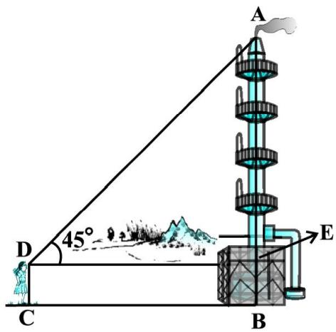  
Fig. 9.6

We have $\mathrm { A B } = \mathrm { A E } + \mathrm { B E } = \mathrm { A E } + 1 . 5$

and $\mathrm { D E } = \mathrm { C B } = 2 8 . 5 \ : \mathrm { m }$

To determine AE, we choose a trigonometric ratio, which involves both AE and DE. Let us choose the tangent of the angle of elevation.

Now, tan 45° = $\tan 4 5 ^ { \circ } = { \frac { \mathrm { A E } } { \mathrm { D E } } }$

i.e., $1 = \frac { \mathrm { A E } } { 2 8 . 5 }$

Therefore, AE = 28.5

So the height of the chimney $( \mathrm { A B } ) = ( 2 8 . 5 + 1 . 5 ) \mathrm { m } = 3 0 \mathrm { m } .$

Example 4 : From a point P on the ground the angle of elevation of the top of a $1 0 ~ \mathrm { m }$ tall building is $3 0 ^ { \circ }$ . A flag is hoisted at the top of the building and the angle of elevation of the top of the flagstaff from P is $4 5 ^ { \circ }$ . Find the length of the flagstaff and the distance of the building from the point P. (You may take ${ \sqrt { 3 } } = 1 . 7 3 2 )$

Solution : In Fig. 9.7, AB denotes the height of the building, BD the flagstaff and P the given point. Note that there are two right triangles PAB and PAD. We are required to find the length of the flagstaff, i.e., DB and the distance of the building from the point P, i.e., PA.

Since, we know the height of the building AB, we will first consider the right $\Delta$ PAB.

We have tan 30° = AB $\tan 3 0 ^ { \circ } = { \frac { \mathrm { A B } } { \mathrm { A P } } }$

i.e., ${ \frac { 1 } { \sqrt { 3 } } } = { \frac { 1 0 } { \mathrm { A P } } }$

Therefore, $\mathbf { A P } = \ 1 0 { \sqrt { 3 } }$

  
Fig. 9.7

i.e., the distance of the building from $\mathrm { P }$ is $1 0 { \sqrt { 3 } } \ \mathrm { m } = 1 7 . 3 2 \ \mathrm { m }$ .

Next, let us suppose $\mathrm { D B } = x \mathrm { m }$ . Then $\mathrm { A D } = ( 1 0 + x ) \mathrm { m } .$ .

Now, in right ' PAD, tan 45° = $\tan 4 5 ^ { \circ } = { \frac { \mathrm { A D } } { \mathrm { A P } } } = { \frac { 1 0 + x } { 1 0 { \sqrt { 3 } } } }$

Therefore, $1 = { \frac { 1 0 + x } { 1 0 { \sqrt { 3 } } } }$

i.e., $x = 1 0 \left( { \sqrt { 3 } } - 1 \right) = 7 . 3 2$

So, the length of the flagstaff is $7 . 3 2 \mathrm { m }$ .

Example 5 : The shadow of a tower standing on a level ground is found to be $4 0 ~ \mathrm { m }$ longer when the Sun’s altitude is $3 0 ^ { \circ }$ than when it is $6 0 ^ { \circ }$ . Find the height of the tower.

Solution : In Fig. 9.8, AB is the tower and BC is the length of the shadow when the Sun’s altitude is $6 0 ^ { \circ }$ , i.e., the angle of elevation of the top of the tower from the tip of the shadow is $6 0 ^ { \circ }$ and DB is the length of the shadow, when the angle of elevation is $3 0 ^ { \circ }$ .

  
Fig. 9.8

Now, let AB be $h \textrm { m }$ and BC be x m. According to the question, DB is 40 m longer than BC.

So, $\mathrm { D B } = ( 4 0 + x ) \mathrm { ~ m ~ }$

Now, we have two right triangles ABC and ABD.

In ' ABC, tan 60° = AB $\tan 6 0 ^ { \circ } = { \frac { \mathrm { A B } } { \mathrm { B C } } }$

or, ${ \sqrt { 3 } } = { \frac { h } { x } }$ (1)

In ' ABD, tan 30° = $\tan 3 0 ^ { \circ } = { \frac { \mathrm { A B } } { \mathrm { B D } } }$

i.e., ${ \frac { 1 } { \sqrt { 3 } } } = { \frac { h } { x + 4 0 } }$ (2)

From (1), we have $h = \ _ { x } { \sqrt { 3 } }$

Putting this value in (2), we get ${ \Big ( } x { \sqrt { 3 } } { \Big ) } { \sqrt { 3 } } = x + 4 0$ , i.e., $3 x = x + 4 0$

i.e.,

So, [From (1)]

Therefore, the height of the tower is $2 0 \sqrt { 3 } \mathrm { m }$

Example $6 :$ The angles of depression of the top and the bottom of an 8 m tall building from the top of a multi-storeyed building are $3 0 ^ { \circ }$ and $4 5 ^ { \circ }$ , respectively. Find the height of the multi-

storeyed building and the distance between the two

buildings.

Solution : In Fig. 9.9, PC denotes the multi-storyed building and AB denotes the $8 \textrm { m }$ tall building. We are interested to determine the height of the multi-storeyed building, i.e., PC and the distance between the two buildings, i.e., AC.

Look at the figure carefully. Observe that PB is a transversal to the parallel lines PQ and BD. Therefore, $\angle \mathrm { Q P B }$ and ‘PBD are alternate angles, and so are equal. $\mathrm { S o } \angle \mathrm { P B D } = 3 0 ^ { \circ }$ . Similarly, $\angle P \mathrm { A C } = 4 5 ^ { \circ }$ .

In right $\Delta$ PBD, we have

  
Fig. 9.9

$$
\frac {\mathrm {P D}}{\mathrm {B D}} = \tan 3 0 ^ {\circ} = \frac {1}{\sqrt {3}} \text {o r} \mathrm {B D} = \mathrm {P D} \sqrt {3}
$$

In right ' PAC, we have

$$
\frac {\mathrm {P C}}{\mathrm {A C}} = \tan 4 5 ^ {\circ} = 1
$$

i.e., $\mathrm { P C } = \mathrm { A C }$

Also, $\mathrm { P C } = \mathrm { P D } + \mathrm { D C }$ , therefore, $\mathrm { P D } + \mathrm { D C } = \mathrm { A C }$ .

Since, $\mathsf { A C } = \mathsf { B D }$ and $\mathrm { D C } = \mathrm { A B } = 8 \mathrm { m }$ , we get $\mathrm { P D } + 8 = \mathrm { B D } = \mathrm { \ P D } \sqrt { 3 } \mathrm { \ ( V }$ Why?)

This gives $\mathrm { P D } = { \frac { 8 } { \sqrt { 3 } - 1 } } = { \frac { 8 \left( { \sqrt { 3 } } + 1 \right) } { \left( { \sqrt { 3 } } + 1 \right) \left( { \sqrt { 3 } } - 1 \right) } } = 4 { \left( { \sqrt { 3 } } + 1 \right) } \mathrm { m } .$ =           8 4 3 1 m.3 1 3 1 3 1   

So, the height of the multi-storeyed building is $\left\{ 4 { \left( \sqrt { 3 } \ + \ 1 \right) } + 8 \right\} \mathrm { m } = 4 { \left( 3 \cdot \sqrt { 3 } \right) } \mathrm { m }$ and the distance between the two buildings is also $4 { \Big ( } 3 + { \sqrt { 3 } } { \Big ) } { \bmod { } }$ .

Example 7 : From a point on a bridge across a river, the angles of depression of the banks on opposite sides of the river are $3 0 ^ { \circ }$ and $4 5 ^ { \circ }$ , respectively. If the bridge is at a height of $3 \mathrm { m }$ from the banks, find the width of the river.

Solution : In Fig 9.10, A and B represent points on the bank on opposite sides of the river, so that AB is the width of the river. P is a point on the bridge at a height of $3 \mathrm { m }$ , i.e., $\mathrm { D P } = 3 ~ \mathrm { m }$ . We are interested to determine the width of the river, which is the length of the side AB of the D APB.

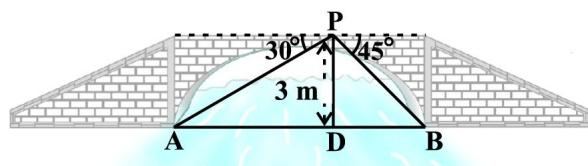  
Fig. 9.10

Now, $\mathrm { A B } = \mathrm { A D } + \mathrm { D B }$

In right $\Delta$ APD, $\angle \mathbf { A } = 3 0 ^ { \circ }$

So, tan 30° = $\tan 3 0 ^ { \circ } = { \frac { \mathrm { P D } } { \mathrm { A D } } }$

i.e., ${ \frac { 1 } { \sqrt { 3 } } } = { \frac { 3 } { \mathrm { A D } } } \ { \mathrm { ~ o r ~ } } \ \mathrm { A D } = { 3 { \sqrt { 3 } } } \ { \mathrm { m } }$

Also, in right $\Delta$ PBD, $\angle B = 4 5 ^ { \circ }$ . So, $\mathrm { B D } = \mathrm { P D } = 3 \mathrm { ~ m ~ }$ .

Now, ${ \mathrm { A B } } = { \mathrm { B D } } + { \mathrm { A D } } = 3 + 3 { \sqrt { 3 } } = 3 ( 1 + { \sqrt { 3 } } ) { \mathrm { m } } .$

Therefore, the width of the river is $3 \left( { \sqrt { 3 } } + 1 \right) \mathrm { m }$ .

## EXERCISE 9.1

1. A circus artist is climbing a $2 0 \mathrm { m }$ long rope, which is tightly stretched and tied from the top of a vertical pole to the ground. Find the height of the pole, if the angle made by the rope with the ground level is $3 0 ^ { \circ }$ (see Fig. 9.11).   
2. A tree breaks due to storm and the broken part bends so that the top of the tree touches the ground making an angle $3 0 ^ { \circ }$ with it. The distance between the foot of the tree to the point where the top touches the ground is $8 \mathrm { m }$ . Find the height of the tree.   
3. A contractor plans to install two slides for the children to play in a park. For the children below the age of 5 years, she prefers to have a slide whose top is at a height of $1 . 5 \mathrm { m } .$ , and is inclined at an angle of $3 0 ^ { \circ }$ to the ground, whereas for elder children, she wants to have a steep slide at a height of 3m, and inclined at an angle of $6 0 ^ { \circ }$ to the ground. What should be the length of the slide in each case?   
4. The angle of elevation of the top of a tower from a point on the ground, which is $3 0 \mathrm { m }$ away from the foot of the tower, is $3 0 ^ { \circ }$ . Find the height of the tower.   
5. A kite is flying at a height of $6 0 \mathrm { m }$ above the ground. The string attached to the kite is temporarily tied to a point on the ground. The inclination of the string with the ground is $6 0 ^ { \circ }$ . Find the length of the string, assuming that there is no slack in the string.   
6. A $1 . 5 ~ \mathrm { m }$ tall boy is standing at some distance from a $3 0 ~ \mathrm { m }$ tall building. The angle of elevation from his eyes to the top of the building increases from $3 0 ^ { \circ }$ to $6 0 ^ { \circ }$ as he walks towards the building. Find the distance he walked towards the building.   
7. From a point on the ground, the angles of elevation of the bottom and the top of a transmission tower fixed at the top of a $2 0 \mathrm { m }$ high building are $4 5 ^ { \circ }$ and $6 0 ^ { \circ }$ respectively. Find the height of the tower.

  
Fig. 9.11

8. A statue, 1.6 m tall, stands on the top of a pedestal. From a point on the ground, the angle of elevation of the top of the statue is $6 0 ^ { \circ }$ and from the same point the angle of elevation of the top of the pedestal is $4 5 ^ { \circ }$ . Find the height of the pedestal.

9. The angle of elevation of the top of a building from the foot of the tower is $3 0 ^ { \circ }$ and the angle of elevation of the top of the tower from the foot of the building is $6 0 ^ { \circ }$ . If the tower is $5 0 \mathrm { m }$ high, find the height of the building.

10. Two poles of equal heights are standing opposite each other on either side of the road, which is 80 m wide. From a point between them on the road, the angles of elevation of the top of the poles are $6 0 ^ { \circ }$ and $3 0 ^ { \circ }$ , respectively. Find the height of the poles and the distances of the point from the poles.

11. A TV tower stands vertically on a bank of a canal. From a point on the other bank directly opposite the tower, the angle of elevation of the top of the tower is $6 0 ^ { \circ }$ . From another point 20 m away from this point on the line joing this point to the foot of the tower, the angle of elevation of the top of the tower is $3 0 ^ { \circ }$ (see Fig. 9.12). Find the height of the tower and the width of the canal.

  
Fig. 9.12

12. From the top of a 7 m high building, the angle of elevation of the top of a cable tower is $6 0 ^ { \circ }$ and the angle of depression of its foot is $4 5 ^ { \circ }$ . Determine the height of the tower.

13. As observed from the top of a $7 5 ~ \mathrm { m }$ high lighthouse from the sea-level, the angles of depression of two ships are $3 0 ^ { \circ }$ and $4 5 ^ { \circ }$ . If one ship is exactly behind the other on the same side of the lighthouse, find the distance between the two ships.

14. A $1 . 2 ~ \mathrm { m }$ tall girl spots a balloon moving with the wind in a horizontal line at a height of $8 8 . 2 \mathrm { m }$ from the ground. The angle of elevation of the balloon from the eyes of the girl at any instant is $6 0 ^ { \circ }$ . After some time, the angle of elevation reduces to $3 0 ^ { \circ }$ (see Fig. 9.13). Find the distance travelled by the balloon during the interval.

  
Fig. 9.13

15. A straight highway leads to the foot of a tower. A man standing at the top of the tower observes a car at an angle of depression of $3 0 ^ { \circ }$ , which is approaching the foot of the

tower with a uniform speed. Six seconds later, the angle of depression of the car is found to be $6 0 ^ { \circ }$ . Find the time taken by the car to reach the foot of the tower from this point.

### 9.2 Summary

In this chapter, you have studied the following points :

1. (i) The line of sight is the line drawn from the eye of an observer to the point in the object viewed by the observer.   
(ii) The angle of elevation of an object viewed, is the angle formed by the line of sight with the horizontal when it is above the horizontal level, i.e., the case when we raise our head to look at the object.   
(iii) The angle of depression of an object viewed, is the angle formed by the line of sight with the horizontal when it is below the horizontal level, i.e., the case when we lower our head to look at the object.

2. The height or length of an object or the distance between two distant objects can be determined with the help of trigonometric ratios.

1062CH10

# chapter 10
# CIRCLES

### 10.1 Introduction

You have studied in Class IX that a circle is a collection of all points in a plane which are at a constant distance (radius) from a fixed point (centre). You have also studied various terms related to a circle like chord, segment, sector, arc etc. Let us now examine the different situations that can arise when a circle and a line are given in a plane.

So, let us consider a circle and a line PQ. There can be three possibilities given in Fig. 10.1 below:

  
(i

  
(ii)

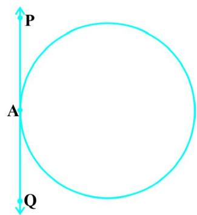  
  
Fig. 10.1

In Fig. 10.1 (i), the line PQ and the circle have no common point. In this case, PQ is called a non-intersecting line with respect to the circle. In Fig. 10.1 (ii), there are two common points A and B that the line PQ and the circle have. In this case, we call the line PQ a secant of the circle. In Fig. 10.1 (iii), there is only one point A which is common to the line PQ and the circle. In this case, the line is called a tangent to the circle.

You might have seen a pulley fitted over a well which is used in taking out water from the well. Look at Fig. 10.2. Here the rope on both sides of the pulley, if considered as a ray, is like a tangent to the circle representing the pulley.

Is there any position of the line with respect to the circle other than the types given above? You can see that there cannot be any other type of position of the line with respect to the circle. In this chapter, we will study about the existence of the tangents to a circle and also study some of their properties.

  
Fig. 10.2

### 10.2 Tangent to a Circle

In the previous section, you have seen that a tangent* to a circle is a line that intersects the circle at only one point.

To understand the existence of the tangent to a circle at a point, let us perform the following activities:

Activity 1 : Take a circular wire and attach a straight wire AB at a point P of the circular wire so that it can rotate about the point P in a plane. Put the system on a table and gently rotate the wire AB about the point P to get different positions of the straight wire [see Fig. 10.3(i)].

In various positions, the wire intersects the circular wire at P and at another point $\mathrm { Q } _ { \mathrm { l } }$ or $\mathrm { Q } _ { 2 }$ or $\mathrm { Q } _ { 3 }$ , etc. In one position, you will see that it will intersect the circle at the point P only (see position $\mathrm { A ^ { \prime } B ^ { \prime } }$ of AB). This shows that a tangent exists at the point P of the circle. On rotating further, you can observe that in all other positions of AB, it will intersect the circle at P and at another point, say $\mathrm { R } _ { 1 }$ or $\mathsf { R } _ { 2 }$ or $\mathrm { R } _ { 3 }$ , etc. So, you can observe that there is only one tangent at a point of the circle.

  
Fig. 10.3 (i)

While doing activity above, you must have observed that as the position AB moves towards the position $\mathbf A ^ { \prime } \mathbf B ^ { \prime }$ , the common point, say $\mathrm { Q } _ { \mathrm { l } }$ , of the line AB and the circle gradually comes nearer and nearer to the common point P. Ultimately, it coincides with the point P in the position $\mathrm { A ^ { \prime } B ^ { \prime } }$ of AccBcc. Again note, what happens if ‘AB’ is rotated rightwards about P? The common point $\mathrm { R } _ { 3 }$ gradually comes nearer and nearer to P and ultimately coincides with P. So, what we see is:

The tangent to a circle is a special case of the secant, when the two end points of its corresponding chord coincide.

Activity ${ \mathfrak { Z } } :$ On a paper, draw a circle and a secant PQ of the circle. Draw various lines parallel to the secant on both sides of it. You will find that after some steps, the length of the chord cut by the lines will gradually decrease, i.e., the two points of intersection of the line and the circle are coming closer and closer [see Fig. 10.3(ii)]. In one case, it becomes zero on one side of the secant and in another case, it becomes zero on the other side of the secant. See the positions $\mathrm { P ^ { \prime } } \mathrm { Q ^ { \prime } }$ and $\mathrm { P ^ { \prime \prime } } \mathrm { Q ^ { \prime \prime } }$ of the secant in Fig. 10.3 (ii). These are the tangents to the circle parallel to the given secant PQ. This also helps you to see that there cannot be more than two tangents parallel to a given secant.

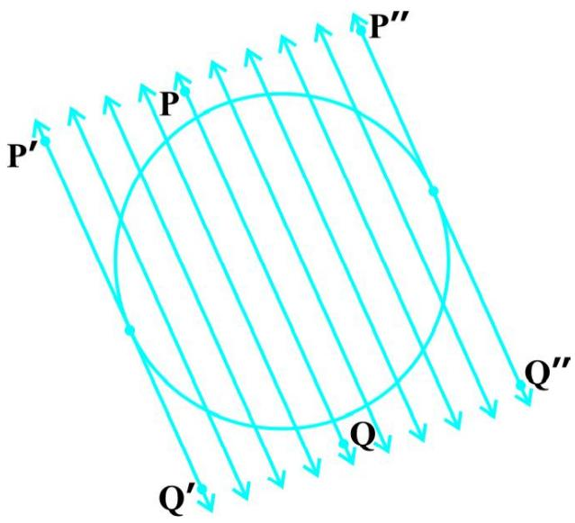  
Fig. 10.3 (ii)

This activity also establishes, what you must have observed, while doing Activity 1, namely, a tangent is the secant when both of the end points of the corresponding chord coincide.

The common point of the tangent and the circle is called the point of contact [the point A in Fig. 10.1 (iii)]and the tangent is said to touch the circle at the common point.

Now look around you. Have you seen a bicycle or a cart moving? Look at its wheels. All the spokes of a wheel are along its radii. Now note the position of the wheel with respect to its movement on the ground. Do you see any tangent anywhere? (See Fig. 10.4). In fact, the wheel moves along a line which is a tangent to the circle representing the wheel. Also, notice that in all positions, the radius through the point of contact with the ground appears to be at right angles to the tangent (see Fig. 10.4). We shall now prove this property of the tangent.

  
Fig. 10.4

Theorem 10.1 : The tangent at any point of a circle is perpendicular to the radius through the point of contact.

Proof : We are given a circle with centre O and a tangent XY to the circle at a point P. We need to prove that OP is perpendicular to XY.

Take a point Q on XY other than P and join OQ (see Fig. 10.5).

The point Q must lie outside the circle. (Why? Note that if Q lies inside the circle, XY will become a secant and not a tangent to the circle). Therefore, OQ is longer than the radius OP of the circle. That is,

$$
O Q > O P.
$$

Since this happens for every point on the line XY except the point P, OP is the shortest of all the distances of the point O to the points of XY. So OP is perpendicular to XY. (as shown in Theorem A1.7.)

  
Fig. 10.5

## Remarks

1. By theorem above, we can also conclude that at any point on a circle there can be one and only one tangent.   
2. The line containing the radius through the point of contact is also sometimes called the ‘normal’ to the circle at the point.

## EXERCISE 10.1

1. How many tangents can a circle have?   
2. Fill in the blanks :

(i) A tangent to a circle intersects it in point (s).   
(ii) A line intersecting a circle in two points is called a   
(iii) A circle can have parallel tangents at the most.   
(iv) The common point of a tangent to a circle and the circle is called

3. A tangent PQ at a point P of a circle of radius 5 cm meets a line through the centre O at a point Q so that $\mathrm { O Q } = 1 2 \mathrm { c m }$ . Length PQ is :

(A) 12 cm

(B) 13 cm

(C) 8.5 cm

(D) 119 cm.

4. Draw a circle and two lines parallel to a given line such that one is a tangent and the other, a secant to the circle.

### 10.3 Number of Tangents from a Point on a Circle

To get an idea of the number of tangents from a point on a circle, let us perform the following activity:

Activity $3 :$ Draw a circle on a paper. Take a point P inside it. Can you draw a tangent to the circle through this point? You will find that all the lines through this point intersect the circle in two points. So, it is not possible to draw any tangent to a circle through a point inside it [see Fig. 10.6 (i)].

Next take a point P on the circle and draw tangents through this point. You have already observed that there is only one tangent to the circle at such a point [see Fig. 10.6 (ii)].

Finally, take a point P outside the circle and try to draw tangents to the circle from this point. What do you observe? You will find that you can draw exactly two tangents to the circle through this point [see Fig. 10.6 (iii)].

We can summarise these facts as follows:

Case 1 : There is no tangent to a circle passing through a point lying inside the circle.

Case 2 : There is one and only one tangent to a circle passing through a point lying on the circle.

Case 3 : There are exactly two tangents to a circle through a point lying outside the circle.

In Fig. 10.6 (iii), $\mathrm { T } _ { \mathrm { 1 } }$ and $\mathrm { T } _ { 2 }$ are the points of contact of the tangents $\mathrm { P T _ { 1 } }$ and $\mathrm { P T } _ { 2 }$ respectively.

The length of the segment of the tangent from the external point P and the point of contact with the circle is called the length of the tangent from the point P to the circle.

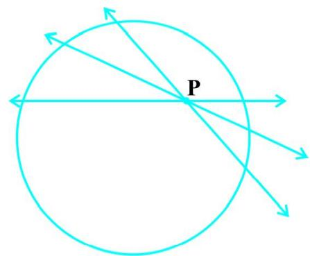  
(i)

  
(ii)

  
(iii)   
Fig. 10.6

Note that in Fig. 10.6 (iii), $\mathrm { P T _ { 1 } }$ and $\mathrm { P T } _ { 2 }$ are the lengths of the tangents from P to the circle. The lengths $\mathrm { P T _ { 1 } }$ and $\mathrm { P T } _ { 2 }$ have a common property. Can you find this? Measure $\mathrm { P T _ { 1 } }$ and $\mathrm { P T } _ { 2 }$ . Are these equal? In fact, this is always so. Let us give a proof of this fact in the following theorem.

Theorem 10.2 : The lengths of tangents drawn from an external point to a circle are equal.

Proof : We are given a circle with centre O, a point P lying outside the circle and two tangents PQ, PR on the circle from P (see Fig. 10.7). We are required to prove that ${ \mathrm { P Q } } = { \mathrm { P R } }$ .

For this, we join OP, OQ and OR. Then $\angle { \mathrm { O Q P } }$ and $\angle \mathrm { O R P }$ are right angles, because these are angles between the radii and tangents, and according to Theorem 10.1 they are right angles. Now in right triangles OQP and ORP,

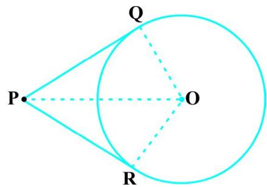  
Fig. 10.7

OQ = OR (Radii of the same circle)

$\mathrm { O P = O P }$ (Common)

Therefore, $\Delta \mathrm { O Q P } \cong \Delta \mathrm { O R P }$ (RHS)

This gives $\mathrm { P Q } = \mathrm { P R }$ (CPCT)

## Remarks

1. The theorem can also be proved by using the Pythagoras Theorem as follows:

$$
\mathrm {P Q} ^ {2} = \mathrm {O P} ^ {2} - \mathrm {O Q} ^ {2} = \mathrm {O P} ^ {2} - \mathrm {O R} ^ {2} = \mathrm {P R} ^ {2} (\mathrm {A s O Q} = \mathrm {O R})
$$

which gives $\mathrm { P Q } = \mathrm { P R }$ .

2. Note also that $\angle \mathrm { O P Q } = \angle \mathrm { O P R }$ . Therefore, OP is the angle bisector of $\angle \mathrm { { \scriptsize ~ Q P R } , }$ i.e., the centre lies on the bisector of the angle between the two tangents.

Let us take some examples.

Example 1 : Prove that in two concentric circles, the chord of the larger circle, which touches the smaller circle, is bisected at the point of contact.

Solution : We are given two concentric circles $\mathrm { C } _ { \mathrm { 1 } }$ and $\mathrm { C } _ { 2 }$ with centre O and a chord AB of the larger circle $\mathrm { C } _ { \mathrm { 1 } }$ which touches the smaller circle $\mathrm { C } _ { 2 }$ at the point P (see Fig. 10.8). We need to prove that $\mathbf { A P = B P }$ .

Let us join OP. Then, AB is a tangent to $\mathrm { C } _ { 2 }$ at P and OP is its radius. Therefore, by Theorem 10.1,

$$
\mathrm {O P} \perp \mathrm {A B}
$$

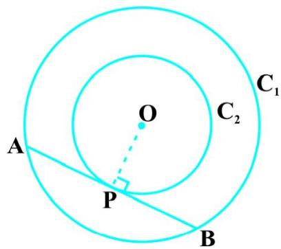  
Fig. 10.8

Now AB is a chord of the circle $\mathrm { C } _ { \mathrm { 1 } }$ and OP A AB. Therefore, OP is the bisector of the chord AB, as the perpendicular from the centre bisects the chord,

i.e., $\mathbf { A P = B P }$

Example 2 : Two tangents TP and TQ are drawn to a circle with centre O from an external point T. Prove that $\angle \mathrm { P T Q } = 2 \angle \mathrm { O P Q } .$ .

Solution : We are given a circle with centre O, an external point T and two tangents TP and TQ to the circle, where P, Q are the points of contact (see Fig. 10.9). We need to prove that

  
Fig. 10.9

$$
\angle \mathrm {P T Q} = 2 \angle \mathrm {O P Q}
$$

Let $\angle \mathrm { P T Q } = \boldsymbol { \theta }$

Now, by Theorem 10.2, TP = TQ. So, TPQ is an isosceles triangle.

Therefore, $\angle { \mathrm { T P Q } } = \angle { \mathrm { T Q P } } = { \frac { 1 } { 2 } } \left( 1 8 0 ^ { \circ } - \theta \right) = 9 0 ^ { \circ } - { \frac { 1 } { 2 } } \theta$

Also, by Theorem 10.1, $\angle { \mathrm { O P T } } = 9 0 ^ { \circ }$

So, $\angle \mathrm { O P Q } = \angle \mathrm { O P T } - \angle \mathrm { T P Q } = 9 0 ^ { \circ } - \left( 9 0 ^ { \circ } - \frac { 1 } { 2 } \ : \Theta \right)$

$$
= \frac {1}{2} \theta = \frac {1}{2} \angle \mathrm {P T Q}
$$

This gives $\angle \mathrm { P T Q } = 2 \angle \mathrm { O P Q }$

Example 3 : PQ is a chord of length 8 cm of a circle of radius $5 \ \mathrm { c m }$ . The tangents at $\mathrm { P }$ and Q intersect at a point T (see Fig. 10.10). Find the length TP.

Solution : Join OT. Let it intersect PQ at the point R. Then $\Delta$ TPQ is isosceles and TO is the angle bisector of ‘ PTQ. So, OT A PQ and therefore, OT bisects PQ which gives $\mathrm { P R } = \mathrm { R Q } = 4 \mathrm { c m }$ .

Also, ${ \mathrm { O R } } = { \sqrt { { \mathrm { O P } } ^ { 2 } - { \mathrm { P R } } ^ { 2 } } } = { \sqrt { 5 ^ { 2 } - 4 ^ { 2 } } } { \mathrm { ~ c m } } = 3 { \mathrm { c m } } .$

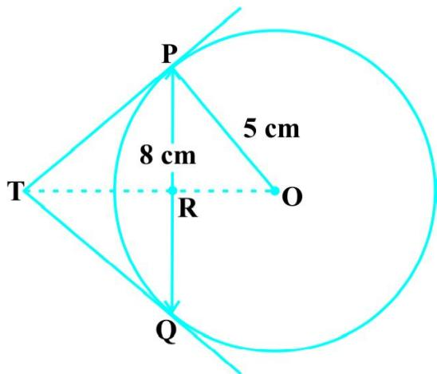  
Fig. 10.10

Now, ‘ TPR + ‘ RPO = 90° = ‘ TPR + ‘ PTR (Why?)

So, $\angle \mathrm { R P O } = \angle \mathrm { P T R }$

Therefore, right triangle TRP is similar to the right triangle PRO by AA similarity.

This gives ${ \frac { \mathrm { T P } } { \mathrm { P O } } } = { \frac { \mathrm { R P } } { \mathrm { R O } } } , { \mathrm { i . e . , } } { \frac { \mathrm { T P } } { 5 } } = { \frac { 4 } { 3 } } { \mathrm { ~ o r ~ } } \mathrm { T P } = { \frac { 2 0 } { 3 } } { \mathrm { ~ c m } } .$ i.e.,

Note : TP can also be found by using the Pythagoras Theorem, as follows:

Let $\mathrm { T P } = x$ and $\mathrm { T R } = y$ . Then

$$
x ^ {2} = y ^ {2} + 1 6 \quad (\text {T a k i n g r i g h t} \Delta \text {P R T}) \tag {1}
$$

$$
x ^ {2} + 5 ^ {2} = (y + 3) ^ {2} \quad (\text {T a k i n g r i g h t} \Delta \text {O P T}) \tag {2}
$$

Subtracting (1) from (2), we get

$$
2 5 = 6 y - 7 \quad \text {o r} \quad y = \frac {3 2}{6} = \frac {1 6}{3}
$$

Therefore, $x ^ { 2 } = \left( { \frac { 1 6 } { 3 } } \right) ^ { 2 } + 1 6 = { \frac { 1 6 } { 9 } } ( 1 6 + 9 ) = { \frac { 1 6 \times 2 5 } { 9 } }$ [From (1)]

or $x = \ \frac { 2 0 } { 3 }$

## EXERCISE 10.2

In Q.1 to 3, choose the correct option and give justification.

1. From a point Q, the length of the tangent to a circle is 24 cm and the distance of Q from the centre is $2 5 \mathrm { c m }$ . The radius of the circle is

(A) 7 cm

(B) 12 cm

(C) 15 cm

(D) 24.5 cm

2. In Fig. 10.11, if TP and TQ are the two tangents to a circle with centre O so that $\angle { \mathrm { P O Q } } = 1 1 0 ^ { \circ }$ , then ‘PTQ is equal to

(A) $6 0 ^ { \circ }$

(B) 70°

(C) $8 0 ^ { \circ }$

(D) 90°

3. If tangents PA and PB from a point P to a circle with centre O are inclined to each other at angle of $8 0 ^ { \circ }$ , then $\angle$ POA is equal to

(A) $5 0 ^ { \circ }$

(B) 60°

(C) $7 0 ^ { \circ }$

(D) 80°

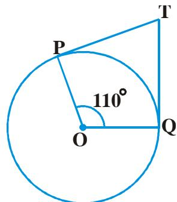  
Fig. 10.11

4. Prove that the tangents drawn at the ends of a diameter of a circle are parallel.   
5. Prove that the perpendicular at the point of contact to the tangent to a circle passes through the centre.   
6. The length of a tangent from a point A at distance 5 cm from the centre of the circle is 4 cm. Find the radius of the circle.   
7. Two concentric circles are of radii 5 cm and $3 \ \mathrm { c m }$ . Find the length of the chord of the larger circle which touches the smaller circle.   
8. A quadrilateral ABCD is drawn to circumscribe a circle (see Fig. 10.12). Prove that

  
Fig. 10.12

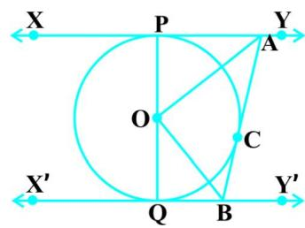  
Fig. 10.13

9. In Fig. 10.13, XY and $\mathrm { X ^ { \prime } Y ^ { \prime } }$ are two parallel tangents to a circle with centre O and another tangent AB with point of contact C intersecting XY at A and XcYc at B. Prove that $\angle \mathrm { A O B } = 9 0 ^ { \circ }$ .   
10. Prove that the angle between the two tangents drawn from an external point to a circle is supplementary to the angle subtended by the line-segment joining the points of contact at the centre.   
11. Prove that the parallelogram circumscribing a circle is a rhombus.   
12. A triangle ABC is drawn to circumscribe a circle of radius 4 cm such that the segments BD and DC into which BC is divided by the point of contact D are of lengths 8 cm and 6 cm respectively (see Fig. 10.14). Find the sides AB and AC.   
13. Prove that opposite sides of a quadrilateral circumscribing a circle subtend supplementary angles at the centre of the circle.

  
Fig. 10.14

### 10.4 Summary

In this chapter, you have studied the following points :

1. The meaning of a tangent to a circle.   
2. The tangent to a circle is perpendicular to the radius through the point of contact.   
3. The lengths of the two tangents from an external point to a circle are equal.

1062CH12

# chapter 11
# AREAS RELATED TO CIRCLES

### 11.1 Areas of Sector and Segment of a Circle

You have already come across the terms sector and segment of a circle in your earlier classes. Recall that the portion (or part) of the circular region enclosed by two radii and the corresponding arc is called a sector of the circle and the portion (or part) of the circular region enclosed between a chord and the corresponding arc is called a segment of the circle. Thus, in Fig. 11.1, shaded region OAPB is a sector of the circle with centre O. ‘ AOB is called the

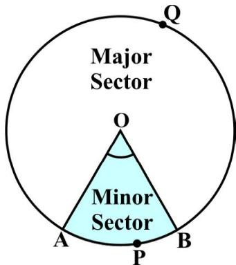  
Fig. 11.1

angle of the sector. Note that in this figure, unshaded region OAQB is also a sector of the circle. For obvious reasons, OAPB is called the minor sector and OAQB is called the major sector. You can also see that angle of the major sector is $3 6 0 ^ { \circ } - \angle \mathrm { A O B }$ .

Now, look at Fig. 11.2 in which AB is a chord of the circle with centre O. So, shaded region APB is a segment of the circle. You can also note that unshaded region AQB is another segment of the circle formed by the chord AB. For obvious reasons, APB is called the minor segment and AQB is called the major segment.

Remark : When we write ‘segment’ and ‘sector’ we will mean the ‘minor segment’ and the ‘minor sector’ respectively, unless stated otherwise.

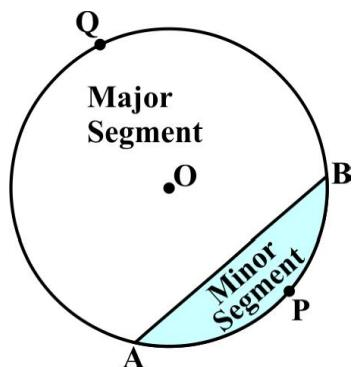  
Fig. 11.2

Now with this knowledge, let us try to find some relations (or formulae) to calculate their areas.

Let OAPB be a sector of a circle with centre O and radius r (see Fig. 11.3). Let the degree measure of ‘ AOB be T.

You know that area of a circle (in fact of a circular region or disc) is $\pi r ^ { 2 }$ .

In a way, we can consider this circular region to be a sector forming an angle of $3 6 0 ^ { \circ }$ (i.e., of degree measure 360) at the centre O. Now by applying the Unitary Method, we can arrive at the area of the sector OAPB as follows:

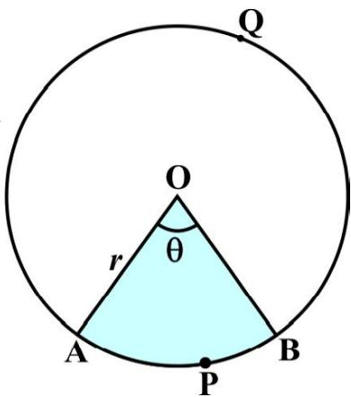  
Fig. 11.3

When degree measure of the angle at the centre is 360, area of the sector $= \pi r ^ { 2 }$

So, when the degree measure of the angle at the centre is 1, area of the ${ \mathrm { s e c t o r } } = { \frac { \pi r ^ { 2 } } { 3 6 0 } } .$

Therefore, when the degree measure of the angle at the centre is T, area of the ${ \mathrm { s e c t o r } } = { \frac { \pi r ^ { 2 } } { 3 6 0 } } \times \theta = { \frac { \theta } { 3 6 0 } } \times \pi r ^ { 2 } .$ 2S r 2ru S .

Thus, we obtain the following relation (or formula) for area of a sector of a circle:

Area of the sector of angle $\theta = { \frac { \theta } { 3 6 0 } } \times \pi r ^ { 2 }$ u rS 2 , ，

where $r$ is the radius of the circle and T the angle of the sector in degrees.

Now, a natural question arises : Can we find the length of the arc APB corresponding to this sector? Yes. Again, by applying the Unitary Method and taking the whole length of the circle (of angle $3 6 0 ^ { \circ }$ ) as $2 \pi r _ { \frac { } { } }$ , we can obtain the required length of the arc APB as $\frac { \theta } { 3 6 0 } \times 2 \pi r$ .

  
Fig. 11.4

So, length of an arc of a sector of angle $\theta = \frac { \theta } { 3 6 0 } \times 2 \pi r$

Now let us take the case of the area of the segment APB of a

circle with centre O and radius $r$ (see Fig. 11.4). You can see that :

Area of the segment APB $=$ Area of the sector OAPB – Area of ' OAB

$$
= \frac {\theta}{3 6 0} \times \pi r ^ {2} - \text {a r e a o f} \Delta \mathrm {O A B}
$$

Note : From Fig. 11.3 and Fig. 11.4 respectively, you can observe that:

Area of the major sector OAQB = Sr2 – Area of the minor sector OAPB and Area of major segment $\mathrm { A Q B } = \pi r ^ { 2 } - $ Area of the minor segment APB

Let us now take some examples to understand these concepts (or results).

Example 1 : Find the area of the sector of a circle with radius 4 cm and of angle $3 0 ^ { \circ }$ . Also, find the area of the corresponding major sector (Use $\pi = 3 . 1 4 { \mathrm { . } }$ ).

Solution : Given sector is OAPB (see Fig. 11.5).

$$
\begin{array}{l} = \frac {3 0}{3 6 0} \times 3. 1 4 \times 4 \times 4 \mathrm {c m} ^ {2} \\ = \frac {1 2 . 5 6}{3} \mathrm {c m} ^ {2} = 4. 1 9 \mathrm {c m} ^ {2} (\text {a p p r o x .}) \\ \end{array}
$$

$$
\begin{array}{l} = \pi r ^ {2} - \text {a r e a o f s e c t o r O A P B} \\ = (3. 1 4 \times 1 6 - 4. 1 9) \mathrm {c m} ^ {2} \\ = 4 6. 0 5 \mathrm {c m} ^ {2} = 4 6. 1 \mathrm {c m} ^ {2} (\text {a p p r o x .}) \\ \end{array}
$$

$$
\begin{array}{l} = \left(\frac {3 6 0 - 3 0}{3 6 0}\right) \times 3. 1 4 \times 1 6 \mathrm {c m} ^ {2} \\ = \frac {3 3 0}{3 6 0} \times 3. 1 4 \times 1 6 \mathrm {c m} ^ {2} = 4 6. 0 5 \mathrm {c m} ^ {2} \\ = 4 6. 1 \mathrm {c m} ^ {2} (\text {a p p r o x .}) \\ \end{array}
$$

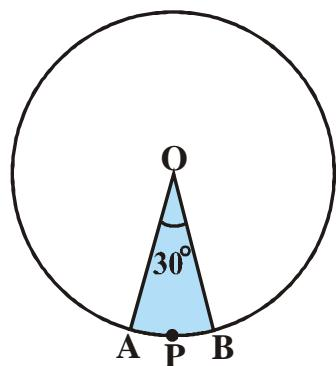  
Fig. 11.5

Example 2 : Find the area of the segment AYB shown in Fig. 11.6, if radius of the circle is 21 cm and ‘ AOB

$$
= 1 2 0 ^ {\circ}. \left(\operatorname {U s e} \pi = \frac {2 2}{7}\right)
$$

  
Fig. 11.6

$$
= \text {A r e a o f s e c t o r O A Y B} - \text {A r e a o f} \Delta \text {O A B} \tag {1}
$$

Now, area of the sector OAYB = 120 u ${ \mathrm { O A Y B } } = { \frac { 1 2 0 } { 3 6 0 } } \times { \frac { 2 2 } { 7 } } \times 2 1 \times 2 1 { \mathrm { c m } } ^ { 2 } = 4 6 2 { \mathrm { c m } } ^ { 2 }$ (2)

For finding the area of $\Delta$ OAB, draw OM A AB as shown in Fig. 11.7.

Note that $\mathrm { O A } { = } \mathrm { O B }$ . Therefore, by RHS congruence, $\Delta \mathrm { A M O } \cong \Delta$ BMO.

So, M is the mid-point of AB and $\angle \mathrm { A O M } = \angle \mathrm { B O M } = \frac { 1 } { 2 } \times 1 2 0 ^ { \circ } = 6 0 ^ { \circ } .$

Let ${ \mathrm { O M } } = x \ { \mathrm { c m } }$

So, from ' OMA, $\mathrm { \frac { O M } { O A } } = \cos 6 0 ^ { \circ }$

or, ${ \frac { x } { 2 1 } } = { \frac { 1 } { 2 } } { \bigg ( } \cos 6 0 ^ { \circ } = { \frac { 1 } { 2 } } { \bigg ) }$

or, $x = { \frac { 2 1 } { 2 } }$

So, $\mathrm { O M } = { \frac { 2 1 } { 2 } } \ \mathrm { c m }$

Also, AM = sin 60° = 3 2

21 3 So, AM = cm 2

Therefore, AB = 2 AM = 2 21 3 cm = 21 3 cmu 2

  
Fig. 11.7

So, ${ \mathrm { a r e a } } \operatorname { o f } \Delta \mathrm { O A B } = { \frac { 1 } { 2 } } \mathrm { A B } \times \mathrm { O M } = { \frac { 1 } { 2 } } \times 2 1 { \sqrt { 3 } } \times { \frac { 2 1 } { 2 } } \mathrm { c m } ^ { 2 }$ 1 2 cm

$$
= \frac {4 4 1}{4} \sqrt {3} \mathrm {c m} ^ {2} \tag {3}
$$

Therefore, area of the segment ${ \mathrm { A Y B } } = \left( 4 6 2 - { \frac { 4 4 1 } { 4 } } { \sqrt { 3 } } \right) \mathrm { c m } ^ { 2 } \left[ { \mathrm { F r o m } } \left( 1 \right) , \left( 2 \right) { \mathrm { a n d } } \left( 3 \right) \right]$

$$
= \frac {2 1}{4} (8 8 - 2 1 \sqrt {3}) \mathrm {c m} ^ {2}
$$

## EXERCISE 11.1

Unless stated otherwise, use $\pi = { \frac { 2 2 } { 7 } }$ .

1. Find the area of a sector of a circle with radius 6 cm if angle of the sector is $6 0 ^ { \circ }$ .   
2. Find the area of a quadrant of a circle whose circumference is $2 2 \mathrm { c m }$   
3. The length of the minute hand of a clock is $1 4 \mathrm { { c m } } .$ . Find the area swept by the minute hand in 5 minutes.   
4. A chord of a circle of radius 10 cm subtends a right angle at the centre. Find the area of the corresponding : (i) minor segment (ii) major sector. (Use $\pi = 3 . 1 4 ,$ )   
5. In a circle of radius $2 1 \mathrm { c m }$ , an arc subtends an angle of $6 0 ^ { \circ }$ at the centre. Find:

(i) the length of the arc (ii) area of the sector formed by the arc   
(iii) area of the segment formed by the corresponding chord

6. A chord of a circle of radius 15 cm subtends an angle of $6 0 ^ { \circ }$ at the centre. Find the areas of the corresponding minor and major segments of the circle.

(Use $\pi = 3 . 1 4$ and ${ \sqrt { 3 } } = 1 . 7 3 )$

7. A chord of a circle of radius $1 2 \mathrm { c m }$ subtends an angle of $1 2 0 ^ { \circ }$ at the centre. Find the area of the corresponding segment of the circle.

(Use $\pi = 3 . 1 4$ and ${ \sqrt { 3 } } = 1 . 7 3 )$

8. A horse is tied to a peg at one corner of a square shaped grass field of side $1 5 ~ \mathrm { m }$ by means of a $5 \textrm { m }$ long rope (see Fig. 11.8). Find

  
Fig. 11.8

(i) the area of that part of the field in which the horse can graze.   
(ii) the increase in the grazing area if the rope were $1 0 \mathrm { m }$ long instead of $5 \mathrm { m }$ . (Use $\pi = 3 . 1 4 $ )

9. A brooch is made with silver wire in the form of a circle with diameter $3 5 \mathrm { m m }$ . The wire is also used in making 5 diameters which divide the circle into 10 equal sectors as shown in Fig. 11.9. Find :

(i) the total length of the silver wire required.   
(ii) the area of each sector of the brooch.

10. An umbrella has 8 ribs which are equally spaced (see Fig. 11.10). Assuming umbrella to be a flat circle of radius $4 5 \ \mathrm { c m }$ , find the area between the two consecutive ribs of the umbrella.   
11. A car has two wipers which do not overlap. Each wiper has a blade of length 25 cm sweeping through an angle of $1 1 5 ^ { \circ }$ . Find the total area cleaned at each sweep of the blades.   
12. To warn ships for underwater rocks, a lighthouse spreads a red coloured light over a sector of angle $8 0 ^ { \circ }$ to a distance of $1 6 . { \bar { 5 } } \mathrm { k m }$ . Find the area of the sea over which the ships are warned. (Use $\pi = 3 . 1 4 $ )   
13. A round table cover has six equal designs as shown in Fig. 11.11. If the radius of the cover is $2 8 \ \mathrm { c m }$ , find the cost of making the designs at the rate of ` 0.35 per $\mathrm { c m } ^ { 2 }$ . (Use ${ \sqrt { 3 } } = 1 . 7 )$ )   
14. Tick the correct answer in the following :

Area of a sector of angle $p$ (in degrees) of a circle with radius R is

(A) $\frac { p } { 1 8 0 } \times 2 \pi \mathrm { R }$

2 Ru S

  
Fig. 11.9   
Fig. 11.10

  
Fig. 11.11

(D) p 22 Ru S 720

### 11.2 Summary

In this chapter, you have studied the following points :

1. Length of an arc of a sector of a circle with radius $r$ and angle with degree measure T is ${ \frac { \theta } { 3 6 0 } } \times 2 \pi r .$   
2. Area of a sector of a circle with radius $r$ and angle with degree measure T is ${ \frac { \theta } { 3 6 0 } } \times \pi r ^ { 2 }$ ˜   
3. Area of segment of a circle

$=$ Area of the corresponding sector – Area of the corresponding triangle.

1062CH13

# chapter 12
# SURFACE AREAS AND VOLUMES

### 12.1 Introduction

From Class IX, you are familiar with some of the solids like cuboid, cone, cylinder, and sphere (see Fig. 12.1). You have also learnt how to find their surface areas and volumes.

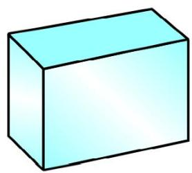  
i

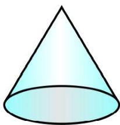

  
(m)

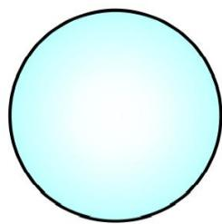  
(iv)   
Fig. 12.1

In our day-to-day life, we come across a number of solids made up of combinations of two or more of the basic solids as shown above.

You must have seen a truck with a container fitted on its back (see Fig. 12.2), carrying oil or water from one place to another. Is it in the shape of any of the four basic solids mentioned above? You may guess that it is made of a cylinder with two hemispheres as its ends.

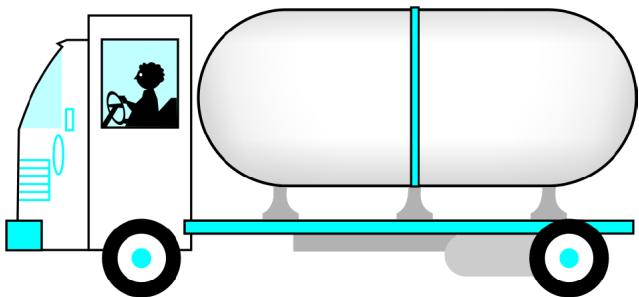  
Fig. 12.2

Again, you may have seen an object like the one in Fig. 12.3. Can you name it? A test tube, right! You would have used one in your science laboratory. This tube is also a combination of a cylinder and a hemisphere. Similarly, while travelling, you may have seen some big and beautiful buildings or monuments made up of a combination of solids mentioned above.

If for some reason you wanted to find the surface areas, or volumes, or capacities of such objects, how would you do it? We cannot classify these under any of the solids you have already studied.

  
Fig. 12.3

In this chapter, you will see how to find surface areas and volumes of such objects.

### 12.2 Surface Area of a Combination of Solids

Let us consider the container seen in Fig. 12.2. How do we find the surface area of such a solid? Now, whenever we come across a new problem, we first try to see, if we can break it down into smaller problems, we have earlier solved. We can see that this solid is made up of a cylinder with two hemispheres stuck at either end. It would look like what we have in Fig. 12.4, after we put the pieces all together.

  
Fig. 12.4

If we consider the surface of the newly formed object, we would be able to see only the curved surfaces of the two hemispheres and the curved surface of the cylinder.

So, the total surface area of the new solid is the sum of the curved surface areas of each of the individual parts. This gives,

TSA of new solid $=$ CSA of one hemisphere $^ +$ CSA of cylinder

$+ \mathrm { C S A }$ of other hemisphere

where TSA, CSA stand for ‘Total Surface Area’ and ‘Curved Surface Area’ respectively.

Let us now consider another situation. Suppose we are making a toy by putting together a hemisphere and a cone. Let us see the steps that we would be going through.

First, we would take a cone and a hemisphere and bring their flat faces together. Here, of course, we would take the base radius of the cone equal to the radius of the hemisphere, for the toy is to have a smooth surface. So, the steps would be as shown in Fig. 12.5.

  
Fig. 12.5

At the end of our trial, we have got ourselves a nice round-bottomed toy. Now if we want to find how much paint we would require to colour the surface of this toy, what would we need to know? We would need to know the surface area of the toy, which consists of the CSA of the hemisphere and the CSA of the cone.

So, we can say:

Total surface area of the toy $=$ CSA of hemisphere $^ +$ CSA of cone

Now, let us consider some examples.

Example 1 : Rasheed got a playing top (lattu) as his birthday present, which surprisingly had no colour on it. He wanted to colour it with his crayons. The top is shaped like a cone surmounted by a hemisphere (see Fig 12.6). The entire top is 5 cm in height and the diameter of the top is 3.5 cm. Find the area he has to colour.

$$
\left(\text {T a k e} \pi = \frac {2 2}{7}\right)
$$

  
Fig. 12.6

Solution : This top is exactly like the object we have discussed in Fig. 12.5. So, we can conveniently use the result we have arrived at there. That is :

TSA of the toy $=$ CSA of hemisphere $^ +$ CSA of cone

Now, the curved surface area of the hemisphere $=$ 1 2 2 (4 ) 2S S r r

$$
= \left(2 \times \frac {2 2}{7} \times \frac {3 . 5}{2} \times \frac {3 . 5}{2}\right) \mathrm {c m} ^ {2}
$$

Also, the height of the cone $=$ height of the top – height (radius) of the hemispherical part

$$
= \left(5 - \frac {3 . 5}{2}\right) \mathrm {c m} = 3. 2 5 \mathrm {c m}
$$

So, the slant height of the cone $\left( l \right) = \sqrt { r ^ { 2 } + h ^ { 2 } } = \sqrt { \left( \frac { 3 . 5 } { 2 } \right) ^ { 2 } + \left( 3 . 2 5 \right) ^ { 2 } } \mathrm { c m } = 3 . 7 \mathrm { c m } \mathrm { ( a p p r o x . ) }$ 2

Therefore, CSA of cone $= \pi r l = \left( { \frac { 2 2 } { 7 } } \times { \frac { 3 . 5 } { 2 } } \times 3 . 7 \right) \mathrm { c m } ^ { 2 }$ 2 cm · ¸

This gives the surface area of the top as

$$
\begin{array}{l} = \left(2 \times \frac {2 2}{7} \times \frac {3 . 5}{2} \times \frac {3 . 5}{2}\right) \mathrm {c m} ^ {2} + \left(\frac {2 2}{7} \times \frac {3 . 5}{2} \times 3. 7\right) \mathrm {c m} ^ {2} \\ = \frac {2 2}{7} \times \frac {3 . 5}{2} (3. 5 + 3. 7) \mathrm {c m} ^ {2} = \frac {1 1}{2} \times (3. 5 + 3. 7) \mathrm {c m} ^ {2} = 3 9. 6 \mathrm {c m} ^ {2} (\text {a p p r o x .}) \\ \end{array}
$$

You may note that ‘total surface area of the top’ is not the sum of the total surface areas of

the cone and hemisphere.

Example 2 : The decorative block shown in Fig. 12.7 is made of two solids — a cube and a hemisphere. The base of the block is a cube with edge $5 \mathrm { { c m } }$ , and the hemisphere fixed on the top has a diameter of 4.2 cm. Find the total

surface area of the block. (Take $\pi = { \frac { 2 2 } { 7 } }$

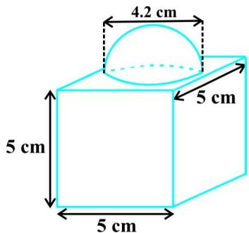  
Fig. 12.7

Solution : The total surface area of the cube $= 6 \times ( \mathrm { e d g e } ) ^ { 2 } = 6 \times 5 \times 5 \mathrm { c m } ^ { 2 } = 1 5 0 \mathrm { c m } ^ { 2 } .$

Note that the part of the cube where the hemisphere is attached is not included in the surface area.

$$
\begin{array}{l} + C S A \text {o f h e m i s p h e r e} \\ = 1 5 0 - \pi r ^ {2} + 2 \pi r ^ {2} = (1 5 0 + \pi r ^ {2}) \mathrm {c m} ^ {2} \\ = 1 5 0 \mathrm {c m} ^ {2} + \left(\frac {2 2}{7} \times \frac {4 . 2}{2} \times \frac {4 . 2}{2}\right) \mathrm {c m} ^ {2} \\ = (1 5 0 + 1 3. 8 6) \mathrm {c m} ^ {2} = 1 6 3. 8 6 \mathrm {c m} ^ {2} \\ \end{array}
$$

Example 3 : A wooden toy rocket is in the shape of a cone mounted on a cylinder, as shown in Fig. 12.8. The height of the entire rocket is $2 6 \mathrm { c m }$ , while the height of the conical part is 6 cm. The base of the conical portion has a diameter of 5 cm, while the base diameter of the cylindrical portion is $3 \mathrm { c m }$ . If the conical portion is to be painted orange and the cylindrical portion yellow, find the area of the rocket painted with each of these colours. (Take $\pi = 3 . 1 4 ,$ )

Solution : Denote radius of cone by $r .$ , slant height of cone by l, height of cone by $h$ , radius of cylinder by $r ^ { \prime }$ and height of cylinder by $h ^ { \prime }$ . Then $r = 2 . 5 \mathrm { c m } .$ , $h = 6 \mathrm { c m }$ , $r ^ { \prime } = 1 . 5 \mathrm { c m }$ , $h ^ { \prime } = 2 6 - 6 = 2 0 \mathrm { c m }$ and

  
Fig. 12.8

$$
l = \sqrt {r ^ {2} + h ^ {2}} = \sqrt {2 . 5 ^ {2} + 6 ^ {2}} \mathrm {c m} = 6. 5 \mathrm {c m}
$$

Here, the conical portion has its circular base resting on the base of the cylinder, but the base of the cone is larger than the base of the cylinder. So, a part of the base of the cone (a ring) is to be painted.

So, the area to be painted orange $=$ CSA of the cone $^ +$ base area of the cone

$$
\begin{array}{l} = \pi r l + \pi r ^ {2} - \pi \left(r ^ {\prime}\right) ^ {2} \\ = \pi [ (2. 5 \times 6. 5) + (2. 5) ^ {2} - (1. 5) ^ {2} ] \mathrm {c m} ^ {2} \\ = \pi [ 2 0. 2 5 ] \mathrm {c m} ^ {2} = 3. 1 4 \times 2 0. 2 5 \mathrm {c m} ^ {2} \\ = 6 3. 5 8 5 \mathrm {c m} ^ {2} \\ \end{array}
$$

Now,the area to be painted yellow $=$ CSA of the cylinder

$$
\begin{array}{l} = 2 \pi r ^ {\prime} h ^ {\prime} + \pi \left(r ^ {\prime}\right) ^ {2} \\ = \pi r ^ {\prime} \left(2 h ^ {\prime} + r ^ {\prime}\right) \\ = (3. 1 4 \times 1. 5) (2 \times 2 0 + 1. 5) \mathrm {c m} ^ {2} \\ = 4. 7 1 \times 4 1. 5 \mathrm {c m} ^ {2} \\ = 1 9 5. 4 6 5 \mathrm {c m} ^ {2} \\ \end{array}
$$

Example 4 : Mayank made a bird-bath for his garden in the shape of a cylinder with a hemispherical depression at one end (see Fig. 12.9). The height of the cylinder is 1.45 m and its radius is $3 0 \mathrm { c m }$ .

Find the total surface area of the bird-bath. (Take $\pi = { \frac { 2 2 } { 7 } }$

Solution : Let $h$ be height of the cylinder, and $r$ the common radius of the cylinder and hemisphere. Then,

  
Fig. 12.9

the total surface area of the bird-bath =CSA of cylinder $^ +$ CSA of hemisphere

$$
\begin{array}{l} = 2 \pi r h + 2 \pi r ^ {2} = 2 \pi r (h + r) \\ = 2 \times \frac {2 2}{7} \times 3 0 (1 4 5 + 3 0) \mathrm {c m} ^ {2} \\ = 3 3 0 0 0 \mathrm {c m} ^ {2} = 3. 3 \mathrm {m} ^ {2} \\ \end{array}
$$

## EXERCISE 12.1

Unless stated otherwise, take $\pi = { \frac { 2 2 } { 7 } }$ ˜

1. 2 cubes each of volume $6 4 \mathrm { c m } ^ { 3 }$ are joined end to end. Find the surface area of the resulting cuboid.   
2. A vessel is in the form of a hollow hemisphere mounted by a hollow cylinder. The diameter of the hemisphere is $1 4 \mathrm { \ c m }$ and the total height of the vessel is $1 3 \ \mathrm { c m } .$ . Find the inner surface area of the vessel.   
3. A toy is in the form of a cone of radius 3.5 cm mounted on a hemisphere of same radius. The total height of the toy is 15.5 cm. Find the total surface area of the toy.   
4. A cubical block of side 7 cm is surmounted by a hemisphere. What is the greatest diameter the hemisphere can have? Find the surface area of the solid.   
5. A hemispherical depression is cut out from one face of a cubical wooden block such that the diameter l of the hemisphere is equal to the edge of the cube. Determine the surface area of the remaining solid.   
6. A medicine capsule is in the shape of a cylinder with two hemispheres stuck to each of its ends (see Fig. 12.10). The length of the entire capsule is $1 4 \mathrm { m m }$ and the diameter of the capsule is 5 mm. Find its surface area.

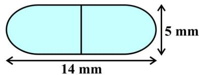  
Fig. 12.10

7. A tent is in the shape of a cylinder surmounted by a conical top. If the height and diameter of the cylindrical part are $2 . 1 \mathrm { m }$ and 4 m respectively, and the slant height of the top is 2.8 m, find the area of the canvas used for making the tent. Also, find the cost of the canvas of the tent at the rate of ` 500 per $\mathrm { m } ^ { 2 }$ . (Note that the base of the tent will not be covered with canvas.)   
8. From a solid cylinder whose height is $2 . 4 \mathrm { c m }$ and diameter $1 . 4 \mathrm { c m }$ , a conical cavity of the same height and same diameter is hollowed out. Find the total surface area of the remaining solid to the nearest $\mathrm { c m } ^ { 2 }$ .   
9. A wooden article was made by scooping out a hemisphere from each end of a solid cylinder, as shown in Fig. 12.11. If the height of the cylinder is $1 0 \mathrm { c m } .$ , and its base is of radius $3 . 5 \mathrm { { c m } }$ , find the total surface area of the article.

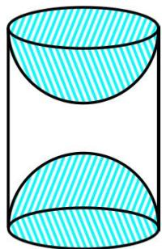  
Fig. 12.11

### 12.3 Volume of a Combination of Solids

In the previous section, we have discussed how to find the surface area of solids made up of a combination of two basic solids. Here, we shall see how to calculate their volumes. It may be noted that in calculating the surface area, we have not added the surface areas of the two constituents, because some part of the surface area disappeared in the process of joining them. However, this will not be the case when we calculate the volume. The volume of the solid formed by joining two basic solids will actually be the sum of the volumes of the constituents, as we see in the examples below.

Example 5 : Shanta runs an industry in a shed which is in the shape of a cuboid surmounted by a half cylinder (see Fig. 12.12). If the base of the shed is of dimension $7 \mathrm { m } \times 1 5 \mathrm { m }$ , and the height of the cuboidal portion is $8 ~ \mathrm { m } .$ , find the volume of air that the shed can hold. Further, suppose the machinery in the shed occupies a total space of $3 0 0 \mathrm { m } ^ { 3 }$ , and there are 20 workers, each of whom occupy about $0 . 0 8 { \mathrm { m } } ^ { 3 }$ space on an average. Then, how much air is in the shed?

$( { \mathrm { T a k e } } \pi = { \frac { 2 2 } { 7 } } )$ $\pi = { \frac { 2 2 } { 7 } }$

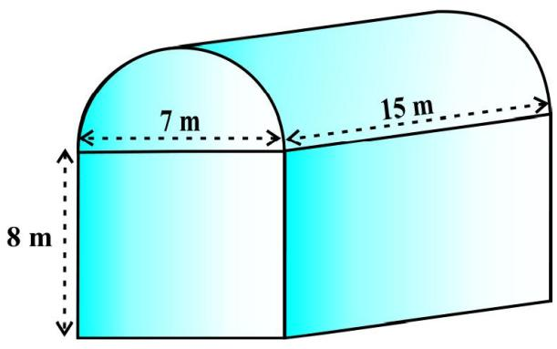  
Fig. 12.12

Solution : The volume of air inside the shed (when there are no people or machinery) is given by the volume of air inside the cuboid and inside the half cylinder, taken together.

Now, the length, breadth and height of the cuboid are 15 m, 7 m and $8 \mathrm { m }$ , respectively.

Also, the diameter of the half cylinder is $7 \mathrm { m }$ and its height is $1 5 ~ \mathrm { m }$

So,the required volume $=$ volume of the cuboid $+ \ { \frac { 1 } { 2 } }$ volume of the cylinder

$$
= \left[ 1 5 \times 7 \times 8 + \frac {1}{2} \times \frac {2 2}{7} \times \frac {7}{2} \times \frac {7}{2} \times 1 5 \right] m ^ {3} = 1 1 2 8. 7 5 m ^ {3}
$$

Next, the total space occupied by the machinery $\cdot = 3 0 0 \mathrm { m } ^ { 3 }$

And the total space occupied by the worker $\mathbf { \tau } = 2 0 \times 0 . 0 8 \ \mathbf { m } ^ { 3 } = 1 . 6 \ \mathbf { m } ^ { 3 }$

Therefore, the volume of the air, when there are machinery and workers

$$
= 1 1 2 8. 7 5 - (3 0 0. 0 0 + 1. 6 0) = 8 2 7. 1 5 \mathrm {m} ^ {3}
$$

Example $6 :$ A juice seller was serving his customers using glasses as shown in Fig. 12.13. The inner diameter of the cylindrical glass was 5 cm, but the bottom of the glass had a hemispherical raised portion which reduced the capacity of the glass. If the height of a glass was $1 0 \mathrm { c m }$ , find the apparent capacity of the glass and its actual capacity. (Use $\pi = 3 . 1 4 . $ )

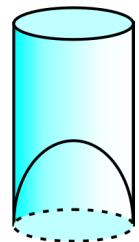  
Fig. 12.13

Solution : Since the inner diameter of the glass $= 5$ cm and height $= 1 0 \mathrm { c m }$ ,

the apparent capacity of the glass ${ \mathbf { \mu } } = \pi r ^ { 2 } h { \mathbf { \Lambda } }$

$$
= 3. 1 4 \times 2. 5 \times 2. 5 \times 1 0 \mathrm {c m} ^ {3} = 1 9 6. 2 5 \mathrm {c m} ^ {3}
$$

But the actual capacity of the glass is less by the volume of the hemisphere at the base of the glass.

i.e., ${ \mathrm { i t ~ i s ~ l e s s ~ b y ~ } } { \frac { 2 } { 3 } } \ \pi r ^ { 3 } = { \frac { 2 } { 3 } } \times 3 . 1 4 \times 2 . 5 \times 2 . 5 \times 2 . 5 \ \mathrm { c m } ^ { 3 } = 3 2 . 7 1 \ \mathrm { c m } ^ { 3 }$ Sr3 =

So,the actual capacity of the glass $=$ apparent capacity of glass – volume of the

$$
\begin{array}{l} \mathrm {h e m i s p h e r e} \\ = (1 9 6. 2 5 - 3 2. 7 1) \mathrm {c m} ^ {3} \\ = 1 6 3. 5 4 \mathrm {c m} ^ {3} \\ \end{array}
$$

Example 7 : A solid toy is in the form of a hemisphere surmounted by a right circular cone. The height of the cone is 2 cm and the diameter of the base is 4 cm. Determine the volume of the toy. If a right circular cylinder circumscribes the toy, find the difference of the volumes of the cylinder and the toy. (Take $\pi = 3 . 1 4 )$

  
Fig. 12.14

Solution : Let BPC be the hemisphere and ABC be the cone standing on the base of the hemisphere (see Fig. 12.14). The radius BO of the hemisphere (as well as of the

$$
\mathrm {c o n e}) = \frac {1}{2} \times 4 \mathrm {c m} = 2 \mathrm {c m}.
$$

So,volume of the $\mathrm { t o y } = { \frac { 2 } { 3 } } \pi r ^ { 3 } + { \frac { 1 } { 3 } } \pi r ^ { 2 } h$ 2 3S r

$$
= \left[ \frac {2}{3} \times 3. 1 4 \times (2) ^ {3} + \frac {1}{3} \times 3. 1 4 \times (2) ^ {2} \times 2 \right] \mathrm {c m} ^ {3} = 2 5. 1 2 \mathrm {c m} ^ {3}
$$

Now, let the right circular cylinder EFGH circumscribe the given solid. The radius of the base of the right circular cylinder ${ \bf \Lambda } = \mathrm { H } { \bf P } = \mathrm { B O } = 2$ cm, and its height is

$$
\mathrm {E H} = \mathrm {A O} + \mathrm {O P} = (2 + 2) \mathrm {c m} = 4 \mathrm {c m}
$$

So, the volume required $=$ volume of the right circular cylinder – volume of the toy

$$
\begin{array}{l} = (3. 1 4 \times 2 ^ {2} \times 4 - 2 5. 1 2) \mathrm {c m} ^ {3} \\ = 2 5. 1 2 \mathrm {c m} ^ {3} \\ \end{array}
$$

Hence, the required difference of the two volumes $= 2 5 . 1 2 ~ \mathrm { c m } ^ { 3 }$ .

## EXERCISE 12.2

Unless stated otherwise, take S =  22 . $\pi = { \frac { 2 2 } { 7 } }$

 A solid is in the shape of a cone standing on a hemisphere with both their radii being equal to 1 cm and the height of the cone is equal to its radius. Find the volume of the solid in terms of $\pi$ .   
2. Rachel, an engineering student, was asked to make a model shaped like a cylinder with two cones attached at its two ends by using a thin aluminium sheet. The diameter of the model is 3 cm and its length is $1 2 \mathrm { c m }$ . If each cone has a height of 2 cm, find the volume of air contained in the model that Rachel made. (Assume the outer and inner dimensions of the model to be nearly the same.)

3. A gulab jamun, contains sugar syrup up to about $30 \%$ of its volume. Find approximately how much syrup would be found in 45 gulab jamuns, each shaped like a cylinder with two hemispherical ends with length $5 \mathrm { { c m } }$ and diameter $2 . 8 ~ \mathrm { c m }$ (see Fig. 12.15).   
4. A pen stand made of wood is in the shape of a cuboid with four conical depressions to hold pens. The dimensions of the cuboid are 15 cm by 10 cm by 3.5 cm. The radius of each of the depressions is 0.5 cm and the depth is $1 . 4 \mathrm { c m }$ . Find the volume of wood in the entire stand (see Fig. 12.16).   
5. A vessel is in the form of an inverted cone. Its height is $8 \mathrm { c m }$ and the radius of its top, which is open, is $5 \mathrm { { c m } }$ . It is filled with water up to the brim. When lead shots, each of which is a sphere of radius 0.5 cm are dropped into the vessel, onefourth of the water flows out. Find the number of lead shots dropped in the vessel.   
6. A solid iron pole consists of a cylinder of height 220 cm and base diameter $2 4 \mathrm { c m }$ , which is surmounted by another cylinder of height 60 cm and radius 8 cm. Find the mass of the pole, given that $1 \mathrm { c m } ^ { 3 }$ of iron has approximately $8 \mathrm { g }$ mass. (Use $\pi = 3 . 1 4 ,$ )   
7. A solid consisting of a right circular cone of height $1 2 0 \mathrm { c m }$ and radius 60 cm standing on a hemisphere of radius 60 cm is placed upright in a right circular cylinder full of water such that it touches the bottom. Find the volume of water left in the cylinder, if the radius of the cylinder is 60 cm and its height is $1 8 0 \mathrm { c m }$ .   
8. A spherical glass vessel has a cylindrical neck 8 cm long, 2 cm in diameter; the diameter of the spherical part is 8.5 cm. By measuring the amount of water it holds, a child finds its volume to be $3 4 5 ~ \mathrm { c m } ^ { 3 }$ . Check whether she is correct, taking the above as the inside measurements, and $\pi = 3 . 1 4$ .

### 12.4 Summary

In this chapter, you have studied the following points:

1. To determine the surface area of an object formed by combining any two of the basic solids, namely, cuboid, cone, cylinder, sphere and hemisphere.   
2. To find the volume of objects formed by combining any two of a cuboid, cone, cylinder, sphere and hemisphere.

  
Fig. 12.15

  
Fig. 12.16

1062CH14

# chapter 13
# STATISTICS

### 13.1 Introduction

In Class IX, you have studied the classification of given data into ungrouped as well as grouped frequency distributions. You have also learnt to represent the data pictorially in the form of various graphs such as bar graphs, histograms (including those of varying widths) and frequency polygons. In fact, you went a step further by studying certain numerical representatives of the ungrouped data, also called measures of central tendency, namely, mean, median and mode. In this chapter, we shall extend the study of these three measures, i.e., mean, median and mode from ungrouped data to that of grouped data. We shall also discuss the concept of cumulative frequency, the cumulative frequency distribution and how to draw cumulative frequency curves, called ogives.

### 13.2 Mean of Grouped Data

The mean (or average) of observations, as we know, is the sum of the values of all the observations divided by the total number of observations. From Class IX, recall that if $x _ { 1 } , x _ { 2 } , . . . , x _ { \mathrm { { n } } }$ are observations with respective frequencies $f _ { 1 } , f _ { 2 } , . . . . f _ { \mathrm n } ,$ then this means observation $x _ { 1 }$ occurs $f _ { 1 }$ times, $x _ { 2 }$ occurs $f _ { 2 }$ times, and so on.

Now, the sum of the values of all the observations $= f _ { 1 } x _ { 1 } + f _ { 2 } x _ { 2 } + \ldots + f _ { n } x _ { n } ,$ and the number of observations $= f _ { 1 } + f _ { 2 } + \ldots + f _ { n } .$ .

So, the mean $\overline { { x } }$ of the data is given by

$$
\bar {x} = \frac {f _ {1} x _ {1} + f _ {2} x _ {2} + \cdots + f _ {n} x _ {n}}{f _ {1} + f _ {2} + \cdots + f _ {n}}
$$

Recall that we can write this in short form by using the Greek letter $\Sigma$ (capital sigma) which means summation. That is,

$$
\overline {{x}} = \frac {\sum_ {i = 1} ^ {n} f _ {i} x _ {i}}{\sum_ {i = 1} ^ {n} f _ {i}}
$$

which, more briefly, is written as ${ \overline { { x } } } = { \frac { \Sigma f _ { i } x _ { i } } { \Sigma f _ { i } } }$ , if it is understood that i varies from 1 to $n$ Let us apply this formula to find the mean in the following example.

Example 1 : The marks obtained by 30 students of Class X of a certain school in a Mathematics paper consisting of 100 marks are presented in table below. Find the mean of the marks obtained by the students.

<table><tr><td>Marks obtained (xi)</td><td>10</td><td>20</td><td>36</td><td>40</td><td>50</td><td>56</td><td>60</td><td>70</td><td>72</td><td>80</td><td>88</td><td>92</td><td>95</td></tr><tr><td>Number of students (fi)</td><td>1</td><td>1</td><td>3</td><td>4</td><td>3</td><td>2</td><td>4</td><td>4</td><td>1</td><td>1</td><td>2</td><td>3</td><td>1</td></tr></table>

Solution: Recall that to find the mean marks, we require the product of each $x _ { i }$ with the corresponding frequency $f _ { i }$ . So, let us put them in a column as shown in Table 13.1.

Table 13.1   

<table><tr><td>Marks obtained (xi)</td><td>Number of students (fi)</td><td>fixi</td></tr><tr><td>10</td><td>1</td><td>10</td></tr><tr><td>20</td><td>1</td><td>20</td></tr><tr><td>36</td><td>3</td><td>108</td></tr><tr><td>40</td><td>4</td><td>160</td></tr><tr><td>50</td><td>3</td><td>150</td></tr><tr><td>56</td><td>2</td><td>112</td></tr><tr><td>60</td><td>4</td><td>240</td></tr><tr><td>70</td><td>4</td><td>280</td></tr><tr><td>72</td><td>1</td><td>72</td></tr><tr><td>80</td><td>1</td><td>80</td></tr><tr><td>88</td><td>2</td><td>176</td></tr><tr><td>92</td><td>3</td><td>276</td></tr><tr><td>95</td><td>1</td><td>95</td></tr><tr><td>Total</td><td>Σfi=30</td><td>Σf.xi=1779</td></tr></table>

Now, 6 i if xx 1779 ${ \overline { { x } } } = { \frac { \Sigma f _ { i } x _ { i } } { \Sigma f _ { i } } } = { \frac { 1 7 7 9 } { 3 0 } } = 5 9 . 3$

Therefore, the mean marks obtained is 59.3.

In most of our real life situations, data is usually so large that to make a meaningful study it needs to be condensed as grouped data. So, we need to convert given ungrouped data into grouped data and devise some method to find its mean.

Let us convert the ungrouped data of Example 1 into grouped data by forming class-intervals of width, say 15. Remember that, while allocating frequencies to each class-interval, students falling in any upper class-limit would be considered in the next class, e.g., 4 students who have obtained 40 marks would be considered in the class-interval 40-55 and not in 25-40. With this convention in our mind, let us form a grouped frequency distribution table (see Table 13.2).

Table 13.2   

<table><tr><td>Class interval</td><td>10 - 25</td><td>25 - 40</td><td>40 - 55</td><td>55 - 70</td><td>70 - 85</td><td>85 - 100</td></tr><tr><td>Number of students</td><td>2</td><td>3</td><td>7</td><td>6</td><td>6</td><td>6</td></tr></table>

Now, for each class-interval, we require a point which would serve as the representative of the whole class. It is assumed that the frequency of each class-interval is centred around its mid-point. So the mid-point (or class mark) of each class can be chosen to represent the observations falling in the class. Recall that we find the mid-point of a class (or its class mark) by finding the average of its upper and lower limits. That is,

$$
\text {C l a s s m a r k} = \frac {\text {U p p e r c l a s s l i m i t} + \text {L o w e r c l a s s l i m i t}}{2}
$$

With reference to Table 13.2, for the class 10-25, the class mark is $\frac { 1 0 + 2 5 } { 2 }$ ， , i.e., 17.5. Similarly, we can find the class marks of the remaining class intervals. We put them in Table 13.3. These class marks serve as our $x _ { \ i } ^ { \ i }$ ’s. Now, in general, for the ith class interval, we have the frequency $f _ { i }$ corresponding to the class mark $x _ { i }$ . We can now proceed to compute the mean in the same manner as in Example 1.

Table 13.3   

<table><tr><td>Class interval</td><td>Number of students (fi)</td><td>Class mark (xi)</td><td>fi xi</td></tr><tr><td>10 - 25</td><td>2</td><td>17.5</td><td>35.0</td></tr><tr><td>25 - 40</td><td>3</td><td>32.5</td><td>97.5</td></tr><tr><td>40 - 55</td><td>7</td><td>47.5</td><td>332.5</td></tr><tr><td>55 - 70</td><td>6</td><td>62.5</td><td>375.0</td></tr><tr><td>70 - 85</td><td>6</td><td>77.5</td><td>465.0</td></tr><tr><td>85 - 100</td><td>6</td><td>92.5</td><td>555.0</td></tr><tr><td>Total</td><td>Σ fi = 30</td><td></td><td>Σ fi xi = 1860.0</td></tr></table>

The sum of the values in the last column gives us $\Sigma f _ { i } x _ { i }$ . So, the mean $\overline { { x } }$ of the given data is given by

$$
\bar {x} = \frac {\sum f _ {i} x _ {i}}{\sum f _ {i}} = \frac {1 8 6 0 . 0}{3 0} = 6 2
$$

This new method of finding the mean is known as the Direct Method.

We observe that Tables 13.1 and 13.3 are using the same data and employing the same formula for the calculation of the mean but the results obtained are different. Can you think why this is so, and which one is more accurate? The difference in the two values is because of the mid-point assumption in Table 13.3, 59.3 being the exact mean, while 62 an approximate mean.

Sometimes when the numerical values of $x _ { i }$ and $f _ { i }$ are large, finding the product of $\mathbf { \boldsymbol { x } } _ { i }$ and f becomes tedious and time consuming. So, for such situations, let us think of a method of reducing these calculations.

We can do nothing with the $f _ { i } ^ { \phantom { } ^ { \dagger } } \mathbf { S } _ { \mathrm { i } }$ , but we can change each $x _ { i }$ to a smaller number so that our calculations become easy. How do we do this? What about subtracting a fixed number from each of these $x _ { \ i } ^ { \phantom { } } \mathrm { s } _ { \mathrm { } } ^ { \dagger }$ Let us try this method.

The first step is to choose one among the $x _ { i } ^ { \mathrm { ' } } \mathbf { S }$ as the assumed mean, and denote it by $ { { ^ \circ } } a ^ { \prime }$ . Also, to further reduce our calculation work, we may take $ { { ^ \circ } } _ { a } .$ to be that $x _ { i }$ which lies in the centre of $x _ { 1 } , x _ { 2 } , . . . . , x _ { n }$ . So, we can choose $a = 4 7 . 5$ or $a = 6 2 . 5$ . Let us choose $a = 4 7 . 5$ .

The next step is to find the difference $d _ { i }$ between $a$ and each of the x ’s, that is, the deviation of $ { { ^ \circ } } a ^ { \prime }$ from each of the $x _ { _ i }$ ’s.

i.e., $d _ { i } = x _ { i } - a = x _ { i } - 4 7 . 5$

The third step is to find the product of $d _ { i }$ with the corresponding $f _ { i } ,$ and take the sum of all the $f _ { i }$ $d _ { i }$ ’s. The calculations are shown in Table 13.4.

Table 13.4   

<table><tr><td>Class interval</td><td>Number of students (fi)</td><td>Class mark (xi)</td><td>di = xi - 47.5</td><td>fdi</td></tr><tr><td>10 - 25</td><td>2</td><td>17.5</td><td>-30</td><td>-60</td></tr><tr><td>25 - 40</td><td>3</td><td>32.5</td><td>-15</td><td>-45</td></tr><tr><td>40 - 55</td><td>7</td><td>47.5</td><td>0</td><td>0</td></tr><tr><td>55 - 70</td><td>6</td><td>62.5</td><td>15</td><td>90</td></tr><tr><td>70 - 85</td><td>6</td><td>77.5</td><td>30</td><td>180</td></tr><tr><td>85 - 100</td><td>6</td><td>92.5</td><td>45</td><td>270</td></tr><tr><td>Total</td><td>Σfi = 30</td><td></td><td></td><td>Σfdi = 435</td></tr></table>

So, from Table 13.4, the mean of the deviations, d = i if d6 . $\overline { { d } } = \frac { \Sigma f _ { i } d _ { i } } { \Sigma f _ { i } }$

Now, let us find the relation between $\overline { { d } }$ and $\overline { { x } }$ .

Since in obtaining $d _ { i } ,$ we subtracted $^ { \prime } a ^ { \prime }$ ’ from each $x _ { i } ,$ so, in order to get the mean $\overline { { x } }$ , we need to add $ { { ^ \circ } } a ^ { \prime }$ to $\overline { { d } }$ . This can be explained mathematically as:

Mean of deviations, d i if d6 $\begin{array} { r } { \overline { d } = \frac { \Sigma f _ { i } d _ { i } } { \Sigma f _ { i } } } \end{array}$

$$
\begin{array}{l} = \frac {\Sigma f _ {i} x _ {i}}{\Sigma f _ {i}} - \frac {\Sigma f _ {i} a}{\Sigma f _ {i}} \\ = \overline {{x}} - a \frac {\sum f _ {i}}{\sum f _ {i}} \\ = \bar {x} - a \\ \end{array}
$$

So,

i.e., $\begin{array} { l } { { \overline { { x } } = a + \overline { { d } } } } \\ { { \overline { { x } } = a + \frac { \Sigma f _ { i } d _ { i } } { \Sigma f _ { i } } } } \end{array}$

Substituting the values of a, 6f d and $\Sigma f _ { i }$ from Table 13.4, we get

$$
\bar {x} = 4 7. 5 + \frac {4 3 5}{3 0} = 4 7. 5 + 1 4. 5 = 6 2.
$$

Therefore, the mean of the marks obtained by the students is 62.

The method discussed above is called the Assumed Mean Method.

Activity $\mathbf { 1 : }$ From the Table 13.3 find the mean by taking each of $x _ { i }$ (i.e., 17.5, 32.5, and so on) as ‘a’. What do you observe? You will find that the mean determined in each case is the same, i.e., 62. (Why ?)

So, we can say that the value of the mean obtained does not depend on the choice of $ { { ^ \circ } } a ^ { \prime }$ .

Observe that in Table 13.4, the values in Column 4 are all multiples of 15. So, if we divide the values in the entire Column 4 by 15, we would get smaller numbers to multiply with $f _ { i ^ { \cdot } }$ (Here, 15 is the class size of each class interval.)

So, let $u _ { _ i } = { \frac { x _ { i } - a } { h } }$ ix ah , where a is the assumed mean and h is the class size. $a$ $h$

Now, we calculate $u _ { i }$ in this way and continue as before (i.e., find $f _ { i } u _ { i }$ and then $\Sigma f _ { i } u _ { i } )$ . Taking $h = 1 5$ , let us form Table 13.5.

Table 13.5   

<table><tr><td>Class interval</td><td>fi</td><td>xi</td><td>di = xi - a</td><td>ui = xi - a/h</td><td>fiu i</td></tr><tr><td>10 - 25</td><td>2</td><td>17.5</td><td>-30</td><td>-2</td><td>-4</td></tr><tr><td>25 - 40</td><td>3</td><td>32.5</td><td>-15</td><td>-1</td><td>-3</td></tr><tr><td>40 - 55</td><td>7</td><td>47.5</td><td>0</td><td>0</td><td>0</td></tr><tr><td>55 - 70</td><td>6</td><td>62.5</td><td>15</td><td>1</td><td>6</td></tr><tr><td>70 - 85</td><td>6</td><td>77.5</td><td>30</td><td>2</td><td>12</td></tr><tr><td>85 - 100</td><td>6</td><td>92.5</td><td>45</td><td>3</td><td>18</td></tr><tr><td>Total</td><td>Σfi = 30</td><td></td><td></td><td></td><td>Σfui = 29</td></tr></table>

Let ${ \overline { { u } } } = { \frac { \Sigma f _ { i } u _ { i } } { \Sigma f _ { i } } }$

Here, again let us find the relation between $\bar { u }$ and $\overline { { x } }$

We have, $u _ { _ i } = { \frac { x _ { i } - a } { h } }$

$$
\begin{array}{l} = \frac {1}{h} \left[ \frac {\Sigma f _ {i} x _ {i}}{\Sigma f _ {i}} - a \frac {\Sigma f _ {i}}{\Sigma f _ {i}} \right] \\ = \frac {1}{h} [ \bar {x} - a ] \\ \end{array}
$$

So,

i.e.,

So,

Now, substituting the values of $a , h , \ \Sigma f _ { i } u _ { i }$ and $\Sigma f _ { i }$ from Table 14.5, we get

$$
\begin{array}{l} \bar {x} = 4 7. 5 + 1 5 \times \left(\frac {2 9}{3 0}\right) \\ = 4 7. 5 + 1 4. 5 = 6 2 \\ \end{array}
$$

So, the mean marks obtained by a student is 62.

The method discussed above is called the Step-deviation method.

We note that :

z the step-deviation method will be convenient to apply if all the $\boldsymbol { d } _ { i } ^ { \prime }$ ’s have a common factor.   
z The mean obtained by all the three methods is the same.   
z The assumed mean method and step-deviation method are just simplified forms of the direct method.   
z The formula ${ \overline { { x } } } = a + h { \overline { { u } } }$ still holds if $a$ and $h$ are not as given above, but are any nonzero numbers such that $u _ { \ i } = { \frac { x _ { i } - a } { h } }$

Let us apply these methods in another example.

Example 2 : The table below gives the percentage distribution of female teachers in the primary schools of rural areas of various states and union territories (U.T.) of India. Find the mean percentage of female teachers by all the three methods discussed in this section.

<table><tr><td>Percentage of female teachers</td><td>15 - 25</td><td>25 - 35</td><td>35 - 45</td><td>45 - 55</td><td>55 - 65</td><td>65 - 75</td><td>75 - 85</td></tr><tr><td>Number of States/U.T.</td><td>6</td><td>11</td><td>7</td><td>4</td><td>4</td><td>2</td><td>1</td></tr></table>

Source : Seventh All India School Education Survey conducted by NCERT

Solution : Let us find the class marks, $x _ { i } ,$ of each class, and put them in a column (see Table 13.6):

Table 13.6   

<table><tr><td>Percentage of female teachers</td><td>Number of States /U.T. (fi)</td><td>xi</td></tr><tr><td>15 - 25</td><td>6</td><td>20</td></tr><tr><td>25 - 35</td><td>11</td><td>30</td></tr><tr><td>35 - 45</td><td>7</td><td>40</td></tr><tr><td>45 - 55</td><td>4</td><td>50</td></tr><tr><td>55 - 65</td><td>4</td><td>60</td></tr><tr><td>65 - 75</td><td>2</td><td>70</td></tr><tr><td>75 - 85</td><td>1</td><td>80</td></tr></table>

Here we take $a = 5 0$ , $h = 1 0$ , then $d _ { i } = x _ { i } - 5 0$ and $u _ { i } = \frac { x _ { i } - 5 0 } { 1 0 }$ 5 0x 

We now find $d _ { i }$ and $u$ and put them in Table 13.7.

Table 13.7   

<table><tr><td>Percentage of female teachers</td><td>Number of states/U.T. (fi)</td><td>xi</td><td>di=xi-50</td><td>ui=xi-50/10</td><td>fi xi</td><td>fdi</td><td>futu</td></tr><tr><td>15 - 25</td><td>6</td><td>20</td><td>-30</td><td>-3</td><td>120</td><td>-180</td><td>-18</td></tr><tr><td>25 - 35</td><td>11</td><td>30</td><td>-20</td><td>-2</td><td>330</td><td>-220</td><td>-22</td></tr><tr><td>35 - 45</td><td>7</td><td>40</td><td>-10</td><td>-1</td><td>280</td><td>-70</td><td>-7</td></tr><tr><td>45 - 55</td><td>4</td><td>50</td><td>0</td><td>0</td><td>200</td><td>0</td><td>0</td></tr><tr><td>55 - 65</td><td>4</td><td>60</td><td>10</td><td>1</td><td>240</td><td>40</td><td>4</td></tr><tr><td>65 - 75</td><td>2</td><td>70</td><td>20</td><td>2</td><td>140</td><td>40</td><td>4</td></tr><tr><td>75 - 85</td><td>1</td><td>80</td><td>30</td><td>3</td><td>80</td><td>30</td><td>3</td></tr><tr><td>Total</td><td>35</td><td></td><td></td><td></td><td>1390</td><td>-360</td><td>-36</td></tr></table>

From the table above, we obtain $\Sigma f _ { i } = 3 5$ , 6f x = 1390,

$$
\Sigma f _ {i} d _ {i} = - 3 6 0, \quad \Sigma f _ {i} u _ {i} = - 3 6.
$$

Using the direct method, 1390 6  i if xx $\overline { { x } } = \frac { \Sigma f _ { i } x _ { i } } { \Sigma f _ { i } } = \frac { 1 3 9 0 } { 3 5 } = 3 9 . 7 1$

Using the assumed mean method,

$$
\bar {x} = a + \frac {\Sigma f _ {i} d _ {i}}{\Sigma f _ {i}} = 5 0 + \frac {(- 3 6 0)}{3 5} = 3 9. 7 1
$$

Using the step-deviation method,

$$
\bar {x} = a + \left(\frac {\sum f _ {i} u _ {i}}{\sum f _ {i}}\right) \times h = 5 0 + \left(\frac {- 3 6}{3 5}\right) \times 1 0 = 3 9. 7 1
$$

Therefore, the mean percentage of female teachers in the primary schools of rural areas is 39.71.

Remark : The result obtained by all the three methods is the same. So the choice of method to be used depends on the numerical values of $x _ { i }$ and $f _ { i } .$ If $x _ { i }$ and $f _ { i }$ are sufficiently small, then the direct method is an appropriate choice. If $\dot { \boldsymbol { x } } _ { i }$ and $f _ { i }$ are numerically large numbers, then we can go for the assumed mean method or step-deviation method. If the class sizes are unequal, and $x _ { i }$ are large numerically, we can still apply the step-deviation method by taking $h$ to be a suitable divisor of all the $d _ { i } ^ { \mathrm { ~ \tiny ~ s ~ } }$ .

Example 3 : The distribution below shows the number of wickets taken by bowlers in oneday cricket matches. Find the mean number of wickets by choosing a suitable method. What does the mean signify?

<table><tr><td>Number of 
wickets</td><td>20 - 60</td><td>60 - 100</td><td>100 - 150</td><td>150 - 250</td><td>250 - 350</td><td>350 - 450</td></tr><tr><td>Number of 
bowlers</td><td>7</td><td>5</td><td>16</td><td>12</td><td>2</td><td>3</td></tr></table>

Solution : Here, the class size varies, and the $x _ { i } \mathrm { s }$ are large. Let us still apply the step-deviation method with $a = 2 0 0$ and $h = 2 0$ . Then, we obtain the data as in Table 13.8.

Table 13.8   

<table><tr><td>Number of 
wickets 
taken</td><td>Number of 
bowlers 
(fi)</td><td>xi</td><td>di = xi - 200</td><td>ui = di/20</td><td>uifi</td></tr><tr><td>20 - 60</td><td>7</td><td>40</td><td>-160</td><td>-8</td><td>-56</td></tr><tr><td>60 - 100</td><td>5</td><td>80</td><td>-120</td><td>-6</td><td>-30</td></tr><tr><td>100 - 150</td><td>16</td><td>125</td><td>-75</td><td>-3.75</td><td>-60</td></tr><tr><td>150 - 250</td><td>12</td><td>200</td><td>0</td><td>0</td><td>0</td></tr><tr><td>250 - 350</td><td>2</td><td>300</td><td>100</td><td>5</td><td>10</td></tr><tr><td>350 - 450</td><td>3</td><td>400</td><td>200</td><td>10</td><td>30</td></tr><tr><td>Total</td><td>45</td><td></td><td></td><td></td><td>-106</td></tr></table>

$$
\mathrm {S o}, \bar {u} = \frac {- 1 0 6}{4 5}. \text {T h e r e f o r e ,} \bar {x} = 2 0 0 + 2 0 \left(\frac {- 1 0 6}{4 5}\right) = 2 0 0 - 4 7. 1 1 = 1 5 2. 8 9.
$$

This tells us that, on an average, the number of wickets taken by these 45 bowlers in oneday cricket is 152.89.

Now, let us see how well you can apply the concepts discussed in this section!

### Activity 2 :

Divide the students of your class into three groups and ask each group to do one of the following activities.

1. Collect the marks obtained by all the students of your class in Mathematics in the latest examination conducted by your school. Form a grouped frequency distribution of the data obtained.   
2. Collect the daily maximum temperatures recorded for a period of 30 days in your city. Present this data as a grouped frequency table.   
3. Measure the heights of all the students of your class (in cm) and form a grouped frequency distribution table of this data.

After all the groups have collected the data and formed grouped frequency distribution tables, the groups should find the mean in each case by the method which they find appropriate.

## EXERCISE 13.1

1. A survey was conducted by a group of students as a part of their environment awareness programme, in which they collected the following data regarding the number of plants in 20 houses in a locality. Find the mean number of plants per house.

<table><tr><td>Number of plants</td><td>0 - 2</td><td>2 - 4</td><td>4 - 6</td><td>6 - 8</td><td>8 - 10</td><td>10 - 12</td><td>12 - 14</td></tr><tr><td>Number of houses</td><td>1</td><td>2</td><td>1</td><td>5</td><td>6</td><td>2</td><td>3</td></tr></table>

Which method did you use for finding the mean, and why?

2. Consider the following distribution of daily wages of 50 workers of a factory.

<table><tr><td>Daily wages (in‘)</td><td>500 - 520</td><td>520 -540</td><td>540 - 560</td><td>560 - 580</td><td>580 -600</td></tr><tr><td>Number of workers</td><td>12</td><td>14</td><td>8</td><td>6</td><td>10</td></tr></table>

Find the mean daily wages of the workers of the factory by using an appropriate method.

3. The following distribution shows the daily pocket allowance of children of a locality. The mean pocket allowance is Rs 18. Find the missing frequency f.

<table><tr><td>Daily pocket allowance (in `)</td><td>11 - 13</td><td>13 - 15</td><td>15 - 17</td><td>17 - 19</td><td>19 - 21</td><td>21 - 23</td><td>23 - 25</td></tr><tr><td>Number of children</td><td>7</td><td>6</td><td>9</td><td>13</td><td>f</td><td>5</td><td>4</td></tr></table>

4. Thirty women were examined in a hospital by a doctor and the number of heartbeats per minute were recorded and summarised as follows. Find the mean heartbeats per minute for these women, choosing a suitable method.

<table><tr><td>No. of heartbeats per minute</td><td>65-68</td><td>68-71</td><td>71-74</td><td>74-77</td><td>77-80</td><td>80-83</td><td>83-86</td></tr><tr><td>Number of women</td><td>2</td><td>4</td><td>3</td><td>8</td><td>7</td><td>4</td><td>2</td></tr></table>

5. In a retail market, fruit vendors were selling mangoes kept in packing boxes. These boxes contained varying number of mangoes. The following was the distribution of mangoes according to the number of boxes.

<table><tr><td>Number of mangoes</td><td>50 - 52</td><td>53 -55</td><td>56 - 58</td><td>59 - 61</td><td>62 -64</td></tr><tr><td>Number of boxes</td><td>15</td><td>110</td><td>135</td><td>115</td><td>25</td></tr></table>

Find the mean number of mangoes kept in a packing box. Which method of finding the mean did you choose?

6. The table below shows the daily expenditure on food of 25 households in a locality.

<table><tr><td>Daily expenditure (in‘)</td><td>100 - 150</td><td>150 - 200</td><td>200 - 250</td><td>250 - 300</td><td>300 - 350</td></tr><tr><td>Number of households</td><td>4</td><td>5</td><td>12</td><td>2</td><td>2</td></tr></table>

Find the mean daily expenditure on food by a suitable method.

7. To find out the concentration of ${ \mathrm { S O } } _ { 2 }$ in the air (in parts per million, i.e., ppm), the data was collected for 30 localities in a certain city and is presented below:

<table><tr><td>Concentration of SO2 (in ppm)</td><td>Frequency</td></tr><tr><td>0.00 - 0.04</td><td>4</td></tr><tr><td>0.04 - 0.08</td><td>9</td></tr><tr><td>0.08 - 0.12</td><td>9</td></tr><tr><td>0.12 - 0.16</td><td>2</td></tr><tr><td>0.16 - 0.20</td><td>4</td></tr><tr><td>0.20 - 0.24</td><td>2</td></tr></table>

Find the mean concentration of $\mathrm { S O } _ { 2 }$ in the air.

8. A class teacher has the following absentee record of 40 students of a class for the whole term. Find the mean number of days a student was absent.

<table><tr><td>Number of 
days</td><td>0 - 6</td><td>6 - 10</td><td>10 - 14</td><td>14 - 20</td><td>20 - 28</td><td>28 - 38</td><td>38 - 40</td></tr><tr><td>Number of 
students</td><td>11</td><td>10</td><td>7</td><td>4</td><td>4</td><td>3</td><td>1</td></tr></table>

9. The following table gives the literacy rate (in percentage) of 35 cities. Find the mean literacy rate.

<table><tr><td>Literacy rate (in %)</td><td>45 - 55</td><td>55 - 65</td><td>65 - 75</td><td>75 - 85</td><td>85 - 95</td></tr><tr><td>Number of cities</td><td>3</td><td>10</td><td>11</td><td>8</td><td>3</td></tr></table>

### 13.3 Mode of Grouped Data

Recall from Class IX, a mode is that value among the observations which occurs most often, that is, the value of the observation having the maximum frequency. Further, we discussed finding the mode of ungrouped data. Here, we shall discuss ways of obtaining a mode of grouped data. It is possible that more than one value may have the same maximum frequency. In such situations, the data is said to be multimodal. Though grouped data can also be multimodal, we shall restrict ourselves to problems having a single mode only.

Let us first recall how we found the mode for ungrouped data through the following example.

Example 4 : The wickets taken by a bowler in 10 cricket matches are as follows:

2 6 4 5 0 2 1 3 2 3

Find the mode of the data.

Solution : Let us form the frequency distribution table of the given data as follows:

<table><tr><td>Number of 
wickets</td><td>0</td><td>1</td><td>2</td><td>3</td><td>4</td><td>5</td><td>6</td></tr><tr><td>Number of 
matches</td><td>1</td><td>1</td><td>3</td><td>2</td><td>1</td><td>1</td><td>1</td></tr></table>

Clearly, 2 is the number of wickets taken by the bowler in the maximum number (i.e., 3) of matches. So, the mode of this data is 2.

In a grouped frequency distribution, it is not possible to determine the mode by looking at the frequencies. Here, we can only locate a class with the maximum frequency, called the modal class. The mode is a value inside the modal class, and is given by the formula:

$$
\text {M o d e} = l + \left(\frac {f _ {1} - f _ {0}}{2 f _ {1} - f _ {0} - f _ {2}}\right) \times h
$$

where $l =$ lower limit of the modal class,

$$
h = \text {s i z e o f t h e c l a s s i n t e r v a l (a s s u m i n g a l l c l a s s s i z e s t o b e e q u a l)},
$$

$$
\begin{array}{l} f _ {1} = \text {f r e q u e n c y o f t h e m o d a l c l a s s}, \\ f _ {0} = \text {f r e q u e n c y o f t h e c l a s s p r e c e d i n g t h e m o d a l c l a s s}, \\ f _ {2} = \mathrm {f r e q u e n c y o f t h e c l a s s s u c e e d i n g t h e m o d a l c l a s s}. \\ \end{array}
$$

Let us consider the following examples to illustrate the use of this formula.

Example ${ \boldsymbol { 5 } } :$ A survey conducted on 20 households in a locality by a group of students resulted in the following frequency table for the number of family members in a household:

<table><tr><td>Family size</td><td>1 - 3</td><td>3 - 5</td><td>5 - 7</td><td>7 - 9</td><td>9 - 11</td></tr><tr><td>Number of 
families</td><td>7</td><td>8</td><td>2</td><td>2</td><td>1</td></tr></table>

Find the mode of this data.

Solution : Here the maximum class frequency is 8, and the class corresponding to this frequency is 3 – 5. So, the modal class is 3 – 5.

Now

$$
\text {m o d a l c l a s s} = 3 - 5, \text {l o w e r l i m i t} (l) \text {o f m o d a l c l a s s} = 3, \text {c l a s s s i z e} (h) = 2
$$

$$
f r e q u e n c y \left(f _ {1}\right) o f t h e m o d a l c l a s s = 8,
$$

$$
f r e q u e n c y \left(f _ {0}\right) o f c l a s s p r e c e d i n g t h e m o d a l c l a s s = 7,
$$

$$
f r e q u e n c y \left(f _ {2}\right) o f c l a s s s u c e d i n g t h e m o d a l c l a s s = 2.
$$

Now, let us substitute these values in the formula :

$$
\begin{array}{l} \mathrm {M o d e} = l + \left(\frac {f _ {1} - f _ {0}}{2 f _ {1} - f _ {0} - f _ {2}}\right) \times h \\ = 3 + \left(\frac {8 - 7}{2 \times 8 - 7 - 2}\right) \times 2 = 3 + \frac {2}{7} = 3. 2 8 6 \\ \end{array}
$$

Therefore, the mode of the data above is 3.286.

Example $6 :$ The marks distribution of 30 students in a mathematics examination are given in Table 13.3 of Example 1. Find the mode of this data. Also compare and interpret the mode and the mean.

Solution : Refer to Table 13.3 of Example 1. Since the maximum number of students (i.e., 7) have got marks in the interval 40 - 55, the modal class is 40 - 55. Therefore,

the lower limit $( l )$ of the modal class $= 4 0$ ,

the class size $( h ) = 1 5$ ,

the frequency $\left( f _ { 1 } \right)$ of modal class $= 7$ ,

the frequency $( f _ { 0 } )$ of the class preceding the modal class $= 3$

the frequency $\left( f _ { _ 2 } \right)$ of the class succeeding the modal class $= 6$

Now, using the formula:

$$
\text {M o d e} = l + \left(\frac {f _ {1} - f _ {0}}{2 f _ {1} - f _ {0} - f _ {2}}\right) \times h,
$$

we get ${ \mathrm { M o d e } } = 4 0 + \left( { \frac { 7 - 3 } { 1 4 - 6 - 3 } } \right) \times 1 5 = 5 2$

So, the mode marks is 52.

Now, from Example 1, you know that the mean marks is 62.

So, the maximum number of students obtained 52 marks, while on an average a student obtained 62 marks.

## Remarks :

1. In Example 6, the mode is less than the mean. But for some other problems it may be equal or more than the mean also.   
2. It depends upon the demand of the situation whether we are interested in finding the average marks obtained by the students or the average of the marks obtained by most

of the students. In the first situation, the mean is required and in the second situation, the mode is required.

Activity $3 :$ Continuing with the same groups as formed in Activity 2 and the situations assigned to the groups. Ask each group to find the mode of the data. They should also compare this with the mean, and interpret the meaning of both.

Remark : The mode can also be calculated for grouped data with unequal class sizes. However, we shall not be discussing it.

## EXERCISE 13.2

1. The following table shows the ages of the patients admitted in a hospital during a year:

<table><tr><td>Age (in years)</td><td>5 - 15</td><td>15 - 25</td><td>25 - 35</td><td>35 - 45</td><td>45 - 55</td><td>55 - 65</td></tr><tr><td>N0. of patients</td><td>6</td><td>11</td><td>21</td><td>23</td><td>14</td><td>5</td></tr></table>

Find the mode and the mean of the data given above. Compare and interpret the two measures of central tendency.

2. The following data gives the information on the observed lifetimes (in hours) of 225 electrical components :

<table><tr><td>Lifetimes (in hours)</td><td>0 - 20</td><td>20 - 40</td><td>40 - 60</td><td>60 - 80</td><td>80 - 100</td><td>100 - 120</td></tr><tr><td>Frequency</td><td>10</td><td>35</td><td>52</td><td>61</td><td>38</td><td>29</td></tr></table>

Determine the modal lifetimes of the components.

3. The following data gives the distribution of total monthly household expenditure of 200 families of a village. Find the modal monthly expenditure of the families. Also, find the mean monthly expenditure :

<table><tr><td>Expenditure (in‘)</td><td>Number of families</td></tr><tr><td>1000 - 1500</td><td>24</td></tr><tr><td>1500 - 2000</td><td>40</td></tr><tr><td>2000 - 2500</td><td>33</td></tr><tr><td>2500 - 3000</td><td>28</td></tr><tr><td>3000 - 3500</td><td>30</td></tr><tr><td>3500 - 4000</td><td>22</td></tr><tr><td>4000 - 4500</td><td>16</td></tr><tr><td>4500 - 5000</td><td>7</td></tr></table>

4. The following distribution gives the state-wise teacher-student ratio in higher secondary schools of India. Find the mode and mean of this data. Interpret the two measures.

<table><tr><td>Number of students per teacher</td><td>Number of states / U.T.</td></tr><tr><td>15 - 20</td><td>3</td></tr><tr><td>20 - 25</td><td>8</td></tr><tr><td>25 - 30</td><td>9</td></tr><tr><td>30 - 35</td><td>10</td></tr><tr><td>35 - 40</td><td>3</td></tr><tr><td>40 - 45</td><td>0</td></tr><tr><td>45 - 50</td><td>0</td></tr><tr><td>50 - 55</td><td>2</td></tr></table>

5. The given distribution shows the number of runs scored by some top batsmen of the world in one-day international cricket matches.

<table><tr><td>Runs scored</td><td>Number of batsmen</td></tr><tr><td>3000 - 4000</td><td>4</td></tr><tr><td>4000 - 5000</td><td>18</td></tr><tr><td>5000 - 6000</td><td>9</td></tr><tr><td>6000 - 7000</td><td>7</td></tr><tr><td>7000 - 8000</td><td>6</td></tr><tr><td>8000 - 9000</td><td>3</td></tr><tr><td>9000 - 10000</td><td>1</td></tr><tr><td>10000 - 11000</td><td>1</td></tr></table>

Find the mode of the data.

6. A student noted the number of cars passing through a spot on a road for 100 periods each of 3 minutes and summarised it in the table given below. Find the mode of the data :

<table><tr><td>No. of cars</td><td>0 - 10</td><td>10 - 20</td><td>20 - 30</td><td>30 - 40</td><td>40 - 50</td><td>50 - 60</td><td>60 - 70</td><td>70 - 80</td></tr><tr><td>Frequency</td><td>7</td><td>14</td><td>13</td><td>12</td><td>20</td><td>11</td><td>15</td><td>8</td></tr></table>

### 13.4 Median of Grouped Data

As you have studied in Class IX, the median is a measure of central tendency which gives the value of the middle-most observation in the data. Recall that for finding the median of ungrouped data, we first arrange the data values of the observations in ascending order. Then, if n is odd, the median is the $\left( { \frac { n + 1 } { 2 } } \right)$ th observation. And, if $n$ is even, then the median will be the average of the $\frac { n } { 2 }$ th and the $\left( { \frac { n } { 2 } } + 1 \right)$ th observations.

Suppose, we have to find the median of the following data, which gives the marks, out of 50, obtained by 100 students in a test :

<table><tr><td>Marks obtained</td><td>20</td><td>29</td><td>28</td><td>33</td><td>42</td><td>38</td><td>43</td><td>25</td></tr><tr><td>Number of students</td><td>6</td><td>28</td><td>24</td><td>15</td><td>2</td><td>4</td><td>1</td><td>20</td></tr></table>

First, we arrange the marks in ascending order and prepare a frequency table as follows :

Table 13.9   

<table><tr><td>Marks obtained</td><td>Number of students
(Frequency)</td></tr><tr><td>20</td><td>6</td></tr><tr><td>25</td><td>20</td></tr><tr><td>28</td><td>24</td></tr><tr><td>29</td><td>28</td></tr><tr><td>33</td><td>15</td></tr><tr><td>38</td><td>4</td></tr><tr><td>42</td><td>2</td></tr><tr><td>43</td><td>1</td></tr><tr><td>Total</td><td>100</td></tr></table>

Here $n = 1 0 0$ , which is even. The median will be the average of the $\frac { n } { 2 }$ th and the $\left( { \frac { n } { 2 } } + 1 \right)$ th observations, i.e., the 50th and 51st observations. To find these observations, we proceed as follows:

Table 13.10   

<table><tr><td>Marks obtained</td><td>Number of students</td></tr><tr><td>20</td><td>6</td></tr><tr><td>upto 25</td><td>6 + 20 = 26</td></tr><tr><td>upto 28</td><td>26 + 24 = 50</td></tr><tr><td>upto 29</td><td>50 + 28 = 78</td></tr><tr><td>upto 33</td><td>78 + 15 = 93</td></tr><tr><td>upto 38</td><td>93 + 4 = 97</td></tr><tr><td>upto 42</td><td>97 + 2 = 99</td></tr><tr><td>upto 43</td><td>99 + 1 = 100</td></tr></table>

Now we add another column depicting this information to the frequency table above and name it as cumulative frequency column.

Table 13.11   

<table><tr><td>Marks obtained</td><td>Number of students</td><td>Cumulative frequency</td></tr><tr><td>20</td><td>6</td><td>6</td></tr><tr><td>25</td><td>20</td><td>26</td></tr><tr><td>28</td><td>24</td><td>50</td></tr><tr><td>29</td><td>28</td><td>78</td></tr><tr><td>33</td><td>15</td><td>93</td></tr><tr><td>38</td><td>4</td><td>97</td></tr><tr><td>42</td><td>2</td><td>99</td></tr><tr><td>43</td><td>1</td><td>100</td></tr></table>

From the table above, we see that:

$$
5 0 \mathrm {t h} \quad \text {o b s e r v a t o n i s} 2 8 \quad (\mathrm {W h y ?})
$$

$$
5 1 \mathrm {s t}
$$

So, $\mathrm { M e d i a n } = { \frac { 2 8 + 2 9 } { 2 } } = 2 8 . 5$

Remark : The part of Table 13.11 consisting Column 1 and Column 3 is known as Cumulative Frequency Table. The median marks 28.5 conveys the information that about $50 \%$ students obtained marks less than 28.5 and another $50 \%$ students obtained marks more than 28.5.

Now, let us see how to obtain the median of grouped data, through the following situation.

Consider a grouped frequency distribution of marks obtained, out of 100, by 53 students, in a certain examination, as follows:

Table 13.12   

<table><tr><td>Marks</td><td>Number of students</td></tr><tr><td>0 - 10</td><td>5</td></tr><tr><td>10 - 20</td><td>3</td></tr><tr><td>20 - 30</td><td>4</td></tr><tr><td>30 - 40</td><td>3</td></tr><tr><td>40 - 50</td><td>3</td></tr><tr><td>50 - 60</td><td>4</td></tr><tr><td>60 - 70</td><td>7</td></tr><tr><td>70 - 80</td><td>9</td></tr><tr><td>80 - 90</td><td>7</td></tr><tr><td>90 - 100</td><td>8</td></tr></table>

From the table above, try to answer the following questions:

How many students have scored marks less than 10? The answer is clearly 5.

How many students have scored less than 20 marks? Observe that the number of students who have scored less than 20 include the number of students who have scored marks from 0 - 10 as well as the number of students who have scored marks from 10 - 20. So, the total number of students with marks less than 20 is $5 + 3$ , i.e., 8. We say that the cumulative frequency of the class 10 -20 is 8.

Similarly, we can compute the cumulative frequencies of the other classes, i.e., the number of students with marks less than 30, less than 40, . . ., less than 100. We give them in Table 13.13 given below:

Table 13.13   

<table><tr><td>Marks obtained</td><td>Number of students
(Cumulative frequency)</td></tr><tr><td>Less than 10</td><td>5</td></tr><tr><td>Less than 20</td><td>5 + 3 = 8</td></tr><tr><td>Less than 30</td><td>8 + 4 = 12</td></tr><tr><td>Less than 40</td><td>12 + 3 = 15</td></tr><tr><td>Less than 50</td><td>15 + 3 = 18</td></tr><tr><td>Less than 60</td><td>18 + 4 = 22</td></tr><tr><td>Less than 70</td><td>22 + 7 = 29</td></tr><tr><td>Less than 80</td><td>29 + 9 = 38</td></tr><tr><td>Less than 90</td><td>38 + 7 = 45</td></tr><tr><td>Less than 100</td><td>45 + 8 = 53</td></tr></table>

The distribution given above is called the cumulative frequency distribution of the less than type. Here 10, 20, 30, . . . 100, are the upper limits of the respective class intervals.

We can similarly make the table for the number of students with scores, more than or equal to 0, more than or equal to 10, more than or equal to 20, and so on. From Table 13.12, we observe that all 53 students have scored marks more than or equal to 0. Since there are 5 students scoring marks in the interval 0 - 10, this means that there are $5 3 - 5 = 4 8$ students getting more than or equal to 10 marks. Continuing in the same manner, we get the number of students scoring 20 or above as $4 8 - 3 = 4 5$ , 30 or above as $4 5 - 4 = 4 1$ , and so on, as shown in Table 13.14.

Table 13.14   

<table><tr><td>Marks obtained</td><td>Number of students
(Cumulative frequency)</td></tr><tr><td>More than or equal to 0</td><td>53</td></tr><tr><td>More than or equal to 10</td><td>53 – 5 = 48</td></tr><tr><td>More than or equal to 20</td><td>48 – 3 = 45</td></tr><tr><td>More than or equal to 30</td><td>45 – 4 = 41</td></tr><tr><td>More than or equal to 40</td><td>41 – 3 = 38</td></tr><tr><td>More than or equal to 50</td><td>38 – 3 = 35</td></tr><tr><td>More than or equal to 60</td><td>35 – 4 = 31</td></tr><tr><td>More than or equal to 70</td><td>31 – 7 = 24</td></tr><tr><td>More than or equal to 80</td><td>24 – 9 = 15</td></tr><tr><td>More than or equal to 90</td><td>15 – 7 = 8</td></tr></table>

The table above is called a cumulative frequency distribution of the more than type. Here 0, 10, 20, . . ., 90 give the lower limits of the respective class intervals.

Now, to find the median of grouped data, we can make use of any of these cumulative frequency distributions.

Let us combine Tables 13.12 and 13.13 to get Table 13.15 given below:

Table 13.15   

<table><tr><td>Marks</td><td>Number of students (f)</td><td>Cumulative frequency (cf)</td></tr><tr><td>0 - 10</td><td>5</td><td>5</td></tr><tr><td>10 - 20</td><td>3</td><td>8</td></tr><tr><td>20 - 30</td><td>4</td><td>12</td></tr><tr><td>30 - 40</td><td>3</td><td>15</td></tr><tr><td>40 - 50</td><td>3</td><td>18</td></tr><tr><td>50 - 60</td><td>4</td><td>22</td></tr><tr><td>60 - 70</td><td>7</td><td>29</td></tr><tr><td>70 - 80</td><td>9</td><td>38</td></tr><tr><td>80 - 90</td><td>7</td><td>45</td></tr><tr><td>90 - 100</td><td>8</td><td>53</td></tr></table>

Now in a grouped data, we may not be able to find the middle observation by looking at the cumulative frequencies as the middle observation will be some value in

a class interval. It is, therefore, necessary to find the value inside a class that divides the whole distribution into two halves. But which class should this be?

To find this class, we find the cumulative frequencies of all the classes and $\frac { n } { 2 }$ . We now locate the class whose cumulative frequency is greater than (and nearest to) $\frac { n } { 2 }$ ˜ This is called the median class. In the distribution above, $n = 5 3$ . So, $\frac { n } { 2 } = 2 6 . 5 . \mathrm { N o w } 6 0 - 7 0 $ is the class whose cumulative frequency 29 is greater than (and nearest to) $\frac { n } { 2 }$ , i.e., 26.5.

Therefore, 60 – 70 is the median class.

After finding the median class, we use the following formula for calculating the median.

$$
\text {M e d i a n} = l + \left(\frac {\frac {n}{2} - \operatorname {c f}}{f}\right) \times h,
$$

where $l =$ lower limit of median class,

$$
n = \text {n u m b e r o f o b s e r v a t i o n s},
$$

cf = cumulative frequency of class preceding the median class,

$f =$ frequency of median class,

$h =$ class size (assuming class size to be equal).

Substituting the values $\frac { n } { 2 } = 2 6 . 5$ , l = 60, cf = 22, f = 7, h = 10

in the formula above, we get

$$
\begin{array}{l} \text {M e d i a n} = 6 0 + \left(\frac {2 6 . 5 - 2 2}{7}\right) \times 1 0 \\ = 6 0 + \frac {4 5}{7} \\ = 6 6. 4 \\ \end{array}
$$

So, about half the students have scored marks less than 66.4, and the other half have scored marks more than 66.4.

Example 7 : A survey regarding the heights (in cm) of 51 girls of Class X of a school was conducted and the following data was obtained:

<table><tr><td>Height (in cm)</td><td>Number of girls</td></tr><tr><td>Less than 140</td><td>4</td></tr><tr><td>Less than 145</td><td>11</td></tr><tr><td>Less than 150</td><td>29</td></tr><tr><td>Less than 155</td><td>40</td></tr><tr><td>Less than 160</td><td>46</td></tr><tr><td>Less than 165</td><td>51</td></tr></table>

Find the median height.

Solution : To calculate the median height, we need to find the class intervals and their corresponding frequencies.

The given distribution being of the less than type, 140, 145, 150, . . ., 165 give the upper limits of the corresponding class intervals. So, the classes should be below 140, 140 - 145, 145 - 150, . . ., 160 - 165. Observe that from the given distribution, we find that there are 4 girls with height less than 140, i.e., the frequency of class interval below 140 is 4. Now, there are 11 girls with heights less than 145 and 4 girls with height less than 140. Therefore, the number of girls with height in the interval 140 - 145 is $1 1 - 4 = 7$ . Similarly, the frequency of 145 - 150 is $2 9 - 1 1 = 1 8$ , for 150 - 155, it is $4 0 - 2 9 = 1 1$ , and so on. So, our frequency distribution table with the given cumulative frequencies becomes:

Table 13.16   

<table><tr><td>Class intervals</td><td>Frequency</td><td>Cumulative frequency</td></tr><tr><td>Below 140</td><td>4</td><td>4</td></tr><tr><td>140 - 145</td><td>7</td><td>11</td></tr><tr><td>145 - 150</td><td>18</td><td>29</td></tr><tr><td>150 - 155</td><td>11</td><td>40</td></tr><tr><td>155 - 160</td><td>6</td><td>46</td></tr><tr><td>160 - 165</td><td>5</td><td>51</td></tr></table>

Now n = 51. So, $\frac { n } { 2 } = \frac { 5 1 } { 2 } = 2 5 . 5$ . This observation lies in the class 145 - 150. Then,

$l ~ ( \mathrm { t h e \ l o w e r \ l i m i t } ) = 1 4 5 ,$

cf (the cumulative frequency of the class preceding $1 4 5 - 1 5 0 ) = 1 1$ ,

$f$ (the frequency of the median class $1 4 5 - 1 5 0 ) = 1 8 \phantom { . }$

h (the class size) = 5.

n cf Using the formula, Median l + 2 h  u , we have f

$$
\begin{array}{l} \text {M e d i a n} = 1 4 5 + \left(\frac {2 5 . 5 - 1 1}{1 8}\right) \times 5 \\ = 1 4 5 + \frac {7 2 . 5}{1 8} = 1 4 9. 0 3. \\ \end{array}
$$

So, the median height of the girls is 149.03 cm.

This means that the height of about $50 \%$ of the girls is less than this height, and $50 \%$ are taller than this height.

Example 8 : The median of the following data is 525. Find the values of $x$ and $y$ , if the total frequency is 100.

<table><tr><td>Class intervals</td><td>Frequency</td></tr><tr><td>0 - 100</td><td>2</td></tr><tr><td>100 - 200</td><td>5</td></tr><tr><td>200 - 300</td><td>x</td></tr><tr><td>300 - 400</td><td>12</td></tr><tr><td>400 - 500</td><td>17</td></tr><tr><td>500 - 600</td><td>20</td></tr><tr><td>600 - 700</td><td>y</td></tr><tr><td>700 - 800</td><td>9</td></tr><tr><td>800 - 900</td><td>7</td></tr><tr><td>900 - 1000</td><td>4</td></tr></table>

## Solution :

<table><tr><td>Class intervals</td><td>Frequency</td><td>Cumulative frequency</td></tr><tr><td>0 - 100</td><td>2</td><td>2</td></tr><tr><td>100 - 200</td><td>5</td><td>7</td></tr><tr><td>200 - 300</td><td>x</td><td>7 + x</td></tr><tr><td>300 - 400</td><td>12</td><td>19 + x</td></tr><tr><td>400 - 500</td><td>17</td><td>36 + x</td></tr><tr><td>500 - 600</td><td>20</td><td>56 + x</td></tr><tr><td>600 - 700</td><td>y</td><td>56 + x + y</td></tr><tr><td>700 - 800</td><td>9</td><td>65 + x + y</td></tr><tr><td>800 - 900</td><td>7</td><td>72 + x + y</td></tr><tr><td>900 - 1000</td><td>4</td><td>76 + x + y</td></tr></table>

It is given that $n = 1 0 0$

$$
\mathrm {S o}, \quad 7 6 + x + y = 1 0 0, \quad \text {i . e . ,} \quad x + y = 2 4 \tag {1}
$$

The median is 525, which lies in the class 500 – 600

$$
\mathrm {S o}, \quad l = 5 0 0, \quad f = 2 0, \quad \mathrm {c f} = 3 6 + x, \quad h = 1 0 0
$$

n cf Using the formula : Median = l  2 , h  we get f

$$
5 2 5 = 5 0 0 + \left(\frac {5 0 - 3 6 - x}{2 0}\right) \times 1 0 0
$$

$$
\text {i . e . ,} \quad 5 2 5 - 5 0 0 = (1 4 - x) \times 5
$$

$$
i. e., \quad 2 5 = 7 0 - 5 x
$$

$$
i. e., \quad 5 x = 7 0 - 2 5 = 4 5
$$

$$
\mathrm {S o}, \quad x = 9
$$

Therefore, from (1), we get $9 + y = \quad 2 4 \quad$

$$
i. e., \quad y = 1 5
$$

Now, that you have studied about all the three measures of central tendency, let us discuss which measure would be best suited for a particular requirement.

The mean is the most frequently used measure of central tendency because it takes into account all the observations, and lies between the extremes, i.e., the largest and the smallest observations of the entire data. It also enables us to compare two or more distributions. For example, by comparing the average (mean) results of students of different schools of a particular examination, we can conclude which school has a better performance.

However, extreme values in the data affect the mean. For example, the mean of classes having frequencies more or less the same is a good representative of the data. But, if one class has frequency, say 2, and the five others have frequency 20, 25, 20, 21, 18, then the mean will certainly not reflect the way the data behaves. So, in such cases, the mean is not a good representative of the data.

In problems where individual observations are not important, and we wish to find out a ‘typical’ observation, the median is more appropriate, e.g., finding the typical productivity rate of workers, average wage in a country, etc. These are situations where extreme values may be there. So, rather than the mean, we take the median as a better measure of central tendency.

In situations which require establishing the most frequent value or most popular item, the mode is the best choice, e.g., to find the most popular T.V. programme being watched, the consumer item in greatest demand, the colour of the vehicle used by most of the people, etc.

## Remarks :

1. There is a empirical relationship between the three measures of central tendency :

$$
3 \mathrm {M e d i a n} = \mathrm {M o d e} + 2 \mathrm {M e a n}
$$

2. The median of grouped data with unequal class sizes can also be calculated. However, we shall not discuss it here.

## EXERCISE 13.3

1. The following frequency distribution gives the monthly consumption of electricity of 68 consumers of a locality. Find the median, mean and mode of the data and compare them.

<table><tr><td>Monthly consumption (in units)</td><td>Number of consumers</td></tr><tr><td>65 - 85</td><td>4</td></tr><tr><td>85 - 105</td><td>5</td></tr><tr><td>105 - 125</td><td>13</td></tr><tr><td>125 - 145</td><td>20</td></tr><tr><td>145 - 165</td><td>14</td></tr><tr><td>165 - 185</td><td>8</td></tr><tr><td>185 - 205</td><td>4</td></tr></table>

2. If the median of the distribution given below is 28.5, find the values of $x$ and y.

<table><tr><td>Class interval</td><td>Frequency</td></tr><tr><td>0 - 10</td><td>5</td></tr><tr><td>10 - 20</td><td>x</td></tr><tr><td>20 - 30</td><td>20</td></tr><tr><td>30 - 40</td><td>15</td></tr><tr><td>40 - 50</td><td>y</td></tr><tr><td>50 - 60</td><td>5</td></tr><tr><td>Total</td><td>60</td></tr></table>

3. A life insurance agent found the following data for distribution of ages of 100 policy holders. Calculate the median age, if policies are given only to persons having age 18 years onwards but less than 60 year.

<table><tr><td>Age (in years)</td><td>Number of policy holders</td></tr><tr><td>Below 20</td><td>2</td></tr><tr><td>Below 25</td><td>6</td></tr><tr><td>Below 30</td><td>24</td></tr><tr><td>Below 35</td><td>45</td></tr><tr><td>Below 40</td><td>78</td></tr><tr><td>Below 45</td><td>89</td></tr><tr><td>Below 50</td><td>92</td></tr><tr><td>Below 55</td><td>98</td></tr><tr><td>Below 60</td><td>100</td></tr></table>

4. The lengths of 40 leaves of a plant are measured correct to the nearest millimetre, and the data obtained is represented in the following table :

<table><tr><td>Length (in mm)</td><td>Number of leaves</td></tr><tr><td>118 - 126</td><td>3</td></tr><tr><td>127 - 135</td><td>5</td></tr><tr><td>136 - 144</td><td>9</td></tr><tr><td>145 - 153</td><td>12</td></tr><tr><td>154 - 162</td><td>5</td></tr><tr><td>163 - 171</td><td>4</td></tr><tr><td>172 - 180</td><td>2</td></tr></table>

Find the median length of the leaves.

(Hint : The data needs to be converted to continuous classes for finding the median, since the formula assumes continuous classes. The classes then change to 117.5 - 126.5, 126.5 - 135.5, . . ., 171.5 - 180.5.)

5. The following table gives the distribution of the life time of 400 neon lamps :

<table><tr><td>Life time (in hours)</td><td>Number of lamps</td></tr><tr><td>1500 - 2000</td><td>14</td></tr><tr><td>2000 - 2500</td><td>56</td></tr><tr><td>2500 - 3000</td><td>60</td></tr><tr><td>3000 - 3500</td><td>86</td></tr><tr><td>3500 - 4000</td><td>74</td></tr><tr><td>4000 - 4500</td><td>62</td></tr><tr><td>4500 - 5000</td><td>48</td></tr></table>

Find the median life time of a lamp.

6. 100 surnames were randomly picked up from a local telephone directory and the frequency distribution of the number of letters in the English alphabets in the surnames was obtained as follows:

<table><tr><td>Number of letters</td><td>1 - 4</td><td>4 - 7</td><td>7 - 10</td><td>10 - 13</td><td>13 - 16</td><td>16 - 19</td></tr><tr><td>Number of surnames</td><td>6</td><td>30</td><td>40</td><td>16</td><td>4</td><td>4</td></tr></table>

Determine the median number of letters in the surnames. Find the mean number of letters in the surnames? Also, find the modal size of the surnames.

7. The distribution below gives the weights of 30 students of a class. Find the median weight of the students.

<table><tr><td>Weight (in kg)</td><td>40 - 45</td><td>45 - 50</td><td>50 - 55</td><td>55 - 60</td><td>60 - 65</td><td>65 - 70</td><td>70 - 75</td></tr><tr><td>No. of students</td><td>2</td><td>3</td><td>8</td><td>6</td><td>6</td><td>3</td><td>2</td></tr></table>

### 13.5 Summary

In this chapter, you have studied the following points:

1. The mean for grouped data can be found by :

(i) the direct method : ${ \overline { { x } } } = { \frac { \Sigma f _ { i } x _ { i } } { \Sigma f _ { i } } }$   
(ii) the assumed mean method : $\overline { { x } } = a + \frac { \Sigma f _ { i } d _ { i } } { \Sigma f _ { i } }$

(iii) the step deviation method : ${ \overline { { x } } } = a + \left( { \frac { \Sigma f _ { i } u _ { i } } { \Sigma f _ { i } } } \right) \times h$ ,

with the assumption that the frequency of a class is centred at its mid-point, called its class mark.

2. The mode for grouped data can be found by using the formula:

$$
\mathrm {M o d e} = l + \left(\frac {f _ {1} - f _ {0}}{2 f _ {1} - f _ {0} - f _ {2}}\right) \times h
$$

where symbols have their usual meanings.

3. The cumulative frequency of a class is the frequency obtained by adding the frequencies of all the classes preceding the given class.   
4. The median for grouped data is formed by using the formula:

$$
\text {M e d i a n} = l + \left(\frac {\frac {n}{2} - \operatorname {c f}}{f}\right) \times h,
$$

where symbols have their usual meanings.

## A NOTE TO THE READER

For calculating mode and median for grouped data, it should be ensured that the class intervals are continuous before applying the formulae. Same condition also apply for construction of an ogive. Further, in case of ogives, the scale may not be the same on both the axes.

1062CH15

# chapter 15
# PROBABILITY

## 14

The theory of probabilities and the theory of errors now constitute a formidable body of great mathematical interest and of great practical importance.

– R.S. Woodward

### 14.1 Probability — A Theoretical Approach

Let us consider the following situation :

Suppose a coin is tossed at random.

When we speak of a coin, we assume it to be ‘fair’, that is, it is symmetrical so that there is no reason for it to come down more often on one side than the other. We call this property of the coin as being ‘unbiased’. By the phrase ‘random toss’, we mean that the coin is allowed to fall freely without any bias or interference.

We know, in advance, that the coin can only land in one of two possible ways — either head up or tail up (we dismiss the possibility of its ‘landing’ on its edge, which may be possible, for example, if it falls on sand). We can reasonably assume that each outcome, head or tail, is as likely to occur as the other. We refer to this by saying that the outcomes head and tail, are equally likely.

For another example of equally likely outcomes, suppose we throw a die once. For us, a die will always mean a fair die. What are the possible outcomes? They are 1, 2, 3, 4, 5, 6. Each number has the same possibility of showing up. So the equally likely outcomes of throwing a die are 1, 2, 3, 4, 5 and 6.

Are the outcomes of every experiment equally likely? Let us see.

Suppose that a bag contains 4 red balls and 1 blue ball, and you draw a ball without looking into the bag. What are the outcomes? Are the outcomes — a red ball and a blue ball equally likely? Since there are 4 red balls and only one blue ball, you would agree that you are more likely to get a red ball than a blue ball. So, the outcomes (a red ball or a blue ball) are not equally likely. However, the outcome of drawing a ball of any colour from the bag is equally likely. So, all experiments do not necessarily have equally likely outcomes.

However, in this chapter, from now on, we will assume that all the experiments have equally likely outcomes.

In Class IX, we defined the experimental or empirical probability P(E) of an event E as

$$
\mathrm {P} (\mathrm {E}) = \frac {\text {N u m b e r o f t r i a l s i n w h i c h t h e e v e n t h a p p e n e d}}{\text {T o t a l n u m b e r o f t r i a l s}}
$$

The empirical interpretation of probability can be applied to every event associated with an experiment which can be repeated a large number of times. The requirement of repeating an experiment has some limitations, as it may be very expensive or unfeasible in many situations. Of course, it worked well in coin tossing or die throwing experiments. But how about repeating the experiment of launching a satellite in order to compute the empirical probability of its failure during launching, or the repetition of the phenomenon of an earthquake to compute the empirical probability of a multi-storeyed building getting destroyed in an earthquake?

In experiments where we are prepared to make certain assumptions, the repetition of an experiment can be avoided, as the assumptions help in directly calculating the exact (theoretical) probability. The assumption of equally likely outcomes (which is valid in many experiments, as in the two examples above, of a coin and of a die) is one such assumption that leads us to the following definition of probability of an event.

The theoretical probability (also called classical probability) of an event E, written as P(E), is defined as

$$
\mathbf {P} (\mathbf {E}) = \frac {\text {N u m b e r o f o u t c o m e s f a v o u r a b l e t o E}}{\text {N u m b e r o f a l l p o s s i b l e o u t c o m e s o f t h e e x p e r i m e n t}},
$$

where we assume that the outcomes of the experiment are equally likely.

We will briefly refer to theoretical probability as probability.

This definition of probability was given by Pierre Simon Laplace in 1795.

Probability theory had its origin in the 16th century when an Italian physician and mathematician J.Cardan wrote the first book on the subject, The Book on Games of Chance. Since its inception, the study of probability has attracted the attention of great mathematicians. James Bernoulli (1654 – 1705), A. de Moivre (1667 – 1754), and Pierre Simon Laplace are among those who made significant contributions to this field. Laplace’s Theorie Analytique des Probabilités, 1812, is considered to be the greatest contribution by a single person to the theory of probability. In recent years, probability has been used extensively in many areas such as biology, economics, genetics, physics, sociology etc.

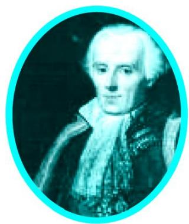  
Pierre Simon Laplace (1749 – 1827)

Let us find the probability for some of the events associated with experiments where the equally likely assumption holds.

Example $1 :$ Find the probability of getting a head when a coin is tossed once. Also find the probability of getting a tail.

Solution : In the experiment of tossing a coin once, the number of possible outcomes is two — Head (H) and Tail (T). Let E be the event ‘getting a head’. The number of outcomes favourable to E, (i.e., of getting a head) is 1. Therefore,

$$
\mathrm {P} (\mathrm {E}) = \mathrm {P} (\text {h e a d}) = \frac {\text {N u m b e r o f o u t c o m e s f a v o u r a b l e t o E}}{\text {N u m b e r o f a l l p o s s i b l e o u t c o m e s}} = \frac {1}{2}
$$

Similarly, if F is the event ‘getting a tail’, then

$$
\mathrm {P (F)} = \mathrm {P (t a i l)} = \frac {1}{2} \quad (\mathrm {W h y ?})
$$

Example $2 :$ A bag contains a red ball, a blue ball and a yellow ball, all the balls being of the same size. Kritika takes out a ball from the bag without looking into it. What is the probability that she takes out the

(i) yellow ball? (ii) red ball? (iii) blue ball?

Solution : Kritika takes out a ball from the bag without looking into it. So, it is equally likely that she takes out any one of them.

Let Y be the event ‘the ball taken out is yellow’, B be the event ‘the ball taken out is blue’, and R be the event ‘the ball taken out is red’.

Now, the number of possible outcomes $= 3$ .

(i) The number of outcomes favourable to the event $\mathrm { Y } = 1$ .

So, $\mathrm { P } ( \mathrm { Y } ) = \frac { 1 } { 3 }$

Similarly,(ii) $\mathrm { P } ( \mathrm { R } ) = { \frac { 1 } { 3 } }$ and (iii) $\mathrm { P } ( \mathrm { B } ) = { \frac { 1 } { 3 } } \cdot$

## Remarks :

1. An event having only one outcome of the experiment is called an elementary event. In Example 1, both the events E and F are elementary events. Similarly, in Example 2, all the three events, Y, B and R are elementary events.   
2. In Example 1, we note that : $: { \mathrm { P } } ( { \mathrm { E } } ) + { \mathrm { P } } ( { \mathrm { F } } ) = 1$

In Example 2, we note that $: \mathrm { P } ( \mathrm { Y } ) + \mathrm { P } ( \mathrm { R } ) + \mathrm { P } ( \mathrm { B } ) = 1$

Observe that the sum of the probabilities of all the elementary events of an experiment is 1. This is true in general also.

Example 3 : Suppose we throw a die once. (i) What is the probability of getting a number greater than 4 ? (ii) What is the probability of getting a number less than or equal to 4 ?

Solution : (i) Here, let E be the event ‘getting a number greater than 4’. The number of possible outcomes is six : 1, 2, 3, 4, 5 and 6, and the outcomes favourable to E are 5 and 6. Therefore, the number of outcomes favourable to E is 2. So,

$$
\mathrm {P (E)} = \mathrm {P (n u m b e r g r e a t e r t h a n 4)} = \frac {2}{6} = \frac {1}{3}
$$

(ii) Let F be the event ‘getting a number less than or equal to $4 '$

Number of possible outcomes $= 6$

Outcomes favourable to the event F are 1, 2, 3, 4.

So, the number of outcomes favourable to F is 4.

Therefore, $\mathrm { P ( F ) } = { \frac { 4 } { 6 } } = { \frac { 2 } { 3 } }$

Are the events E and F in the example above elementary events? No, they are not because the event E has 2 outcomes and the event F has 4 outcomes.

Remarks : From Example 1, we note that

$$
\mathrm {P} (\mathrm {E}) + \mathrm {P} (\mathrm {F}) = \frac {1}{2} + \frac {1}{2} = 1 \tag {1}
$$

where E is the event ‘getting a head’ and F is the event ‘getting a tail’.

From (i) and (ii) of Example 3, we also get

$$
\mathrm {P} (\mathrm {E}) + \mathrm {P} (\mathrm {F}) = \frac {1}{3} + \frac {2}{3} = 1 \tag {2}
$$

where E is the event ‘getting a number ${ > } 4 ^ { \circ }$ and F is the event ‘getting a number $\leq 4 ^ { \ ' }$

Note that getting a number not greater than 4 is same as getting a number less than or equal to 4, and vice versa.

In (1) and (2) above, is F not the same as ‘not E’? Yes, it is. We denote the event ‘not E’ by E .

So, $\mathrm { { P } } ( \mathrm { { E } } ) + \mathrm { { P } } ( \mathrm { { n o t } } \mathrm { { E } } ) = 1$

i.e., $\operatorname { P } ( \operatorname { E } ) + \operatorname { P } ( { \overline { { \operatorname { E } } } } ) = 1$ $\operatorname { P } ( { \overline { { \operatorname { E } } } } ) = 1 - \operatorname { P } ( \operatorname { E } ) .$

In general, it is true that for an event E,

$$
\mathbf {P} (\bar {\mathbf {E}}) = \mathbf {1} - \mathbf {P} (\mathbf {E})
$$

The event $\overline { { \mathrm { E } } }$ , representing ‘not $\mathrm { E } '$ , is called the complement of the event E. We also say that E and $\overline { { \mathrm { E } } }$ are complementary events.

Before proceeding further, let us try to find the answers to the following questions:

(i) What is the probability of getting a number 8 in a single throw of a die?   
(ii) What is the probability of getting a number less than 7 in a single throw of a die?

## Let us answer (i) :

We know that there are only six possible outcomes in a single throw of a die. These outcomes are 1, 2, 3, 4, 5 and 6. Since no face of the die is marked 8, so there is no outcome favourable to 8, i.e., the number of such outcomes is zero. In other words, getting 8 in a single throw of a die, is impossible.

So, $\mathrm { P } ( \mathrm { g e t t i n g } \ : 8 ) = \frac { 0 } { 6 } = 0$

That is, the probability of an event which is impossible to occur is 0. Such an event is called an impossible event.

## Let us answer (ii) :

Since every face of a die is marked with a number less than 7, it is sure that we will always get a number less than 7 when it is thrown once. So, the number of favourable outcomes is the same as the number of all possible outcomes, which is 6.

Therefore, $\mathrm { P ( E ) } = \mathrm { P ( g e t t i n g ~ a ~ n u m b e r ~ l e s s ~ t h a n ~ 7 ) } = \frac { 6 } { 6 } = 1$

So, the probability of an event which is sure (or certain) to occur is 1. Such an event is called a sure event or a certain event.

Note : From the definition of the probability P(E), we see that the numerator (number of outcomes favourable to the event E) is always less than or equal to the denominator (the number of all possible outcomes). Therefore,

$$
\mathbf {0} \leq \mathbf {P} (\mathbf {E}) \leq \mathbf {1}
$$

Now, let us take an example related to playing cards. Have you seen a deck of playing cards? It consists of 52 cards which are divided into 4 suits of 13 cards each— spades $\mathbf { \Pi } ( \pmb { \^ { \bullet } } )$ , hearts ( ), diamonds $( \spadesuit )$ and clubs $( \pmb { \phi } )$ . Clubs and spades are of black colour, while hearts and diamonds are of red colour. The cards in each suit are ace, king, queen, jack, 10, 9, 8, 7, 6, 5, 4, 3 and 2. Kings, queens and jacks are called face cards.

Example 4 : One card is drawn from a well-shuffled deck of 52 cards. Calculate the probability that the card will

(i) be an ace,   
(ii) not be an ace.

Solution : Well-shuffling ensures equally likely outcomes.

(i) There are 4 aces in a deck. Let E be the event ‘the card is an ace’.

The number of outcomes favourable to $\mathrm { E } = 4$

The number of possible outcomes $= 5 2$ (Why ?)

Therefore, $\mathrm { P } ( \mathrm { E } ) = { \frac { 4 } { 5 2 } } = { \frac { 1 } { 1 3 } }$

(ii) Let F be the event ‘card drawn is not an ace’.

The number of outcomes favourable to the event $\mathrm { F } = 5 2 - 4 = 4 8$ (Why?)

The number of possible outcomes $= 5 2$

Therefore, $\mathrm { P ( F ) } = { \frac { 4 8 } { 5 2 } } = { \frac { 1 2 } { 1 3 } }$

Remark : Note that F is nothing but E . Therefore, we can also calculate P(F) as follows: P(F)

$$
= \mathrm {P} (\overline {{\mathrm {E}}}) = 1 - \mathrm {P} (\mathrm {E}) = 1 - \frac {1}{1 3} = \frac {1 2}{1 3}.
$$

Example 5 : Two players, Sangeeta and Reshma, play a tennis match. It is known that the probability of Sangeeta winning the match is 0.62. What is the probability of Reshma winning the match?

Solution : Let S and R denote the events that Sangeeta wins the match and Reshma wins the match, respectively.

The probability of Sangeeta’s winning $=$ $\mathrm { P ( S ) } = 0 . 6 2 \ \mathrm { ( g i v e n ) }$

The probability of Reshma’s winning $=$ $\mathrm { { P } ( \mathrm { { R } } ) = 1 - \mathrm { { P } ( S ) } }$

[As the events R and S are complementary]

$$
= 1 - 0. 6 2 = 0. 3 8
$$

Example 6 : Savita and Hamida are friends. What is the probability that both will have (i) different birthdays? (ii) the same birthday? (ignoring a leap year).

Solution : Out of the two friends, one girl, say, Savita’s birthday can be any day of the year. Now, Hamida’s birthday can also be any day of 365 days in the year.

We assume that these 365 outcomes are equally likely.

(i) If Hamida’s birthday is different from Savita’s, the number of favourable outcomes for her birthday is $3 6 5 - 1 = 3 6 4$

So, P (Hamida’s birthday is different from Savita’s birthday) $\displaystyle { \lvert = \frac { 3 6 4 } { 3 6 5 } }$

$$
\begin{array}{l} = 1 - \mathrm {P} (\text {b o t h h a v e d i f f e r e n t b i r d d a y s}) \\ = 1 - \frac {3 6 4}{3 6 5} \quad [ \text {U s i n g P (E)} = 1 - \text {P (E)} ] \\ = \frac {1}{3 6 5} \\ \end{array}
$$

Example 7 : There are 40 students in Class X of a school of whom 25 are girls and 15 are boys. The class teacher has to select one student as a class representative. She writes the name of each student on a separate card, the cards being identical. Then she puts cards in a bag and stirs them thoroughly. She then draws one card from the bag. What is the probability that the name written on the card is the name of (i) a girl? (ii) a boy?

Solution : There are 40 students, and only one name card has to be chosen.

(i) The number of all possible outcomes is 40

The number of outcomes favourable for a card with the name of a girl = 25 (Why?)

Therefore, $, \mathrm { ~ P ~ } ( \mathrm { c a r d ~ w i t h ~ n a m e ~ o f ~ a ~ g i r l } ) = \mathrm { P } ( \mathrm { G i r l } ) = \frac { 2 5 } { 4 0 } = \frac { 5 } { 8 }$

(ii) The number of outcomes favourable for a card with the name of a boy = 15 (Why?)

Therefore, $\mathrm { P ( c a r d ~ w i t h ~ n a m e ~ o f a ~ b o y ) } = \mathrm { P ( B o y ) } = { \frac { 1 5 } { 4 0 } } = { \frac { 3 } { 8 } }$

Note : We can also determine P(Boy), by taking

$$
\mathrm {P} (\text {B o y}) = 1 - \mathrm {P} (\text {n o t B o y}) = 1 - \mathrm {P} (\text {G i r l}) = 1 - \frac {5}{8} = \frac {3}{8}
$$

Example 8 : A box contains 3 blue, 2 white, and 4 red marbles. If a marble is drawn at random from the box, what is the probability that it will be

(i) white?

(ii) blue?

(iii) red?

Solution : Saying that a marble is drawn at random is a short way of saying that all the marbles are equally likely to be drawn. Therefore, the

number of possible outcomes = 3 +2 + 4 = 9 (Why?)

Let W denote the event ‘the marble is white’, B denote the event ‘the marble is blue’ and R denote the event ‘marble is red’.

(i) The number of outcomes favourable to the event $\mathrm { W } = 2$

So, $\mathrm { P ( W ) } = \frac { 2 } { 9 }$

Similarly, (ii) $\mathrm { P ( R ) } = { \frac { 4 } { 9 } }$

Note that $\mathrm { P } ( \mathrm { W } ) + \mathrm { P } ( \mathrm { B } ) + \mathrm { P } ( \mathrm { R } ) = 1$ .

Example 9 : Harpreet tosses two different coins simultaneously (say, one is of ` 1 and other of ` 2). What is the probability that she gets at least one head?

Solution : We write H for ‘head’ and T for ‘tail’. When two coins are tossed simultaneously, the possible outcomes are (H, H), (H, T), (T, H), (T, T), which are all equally likely. Here (H, H) means head up on the first coin (say on ` 1) and head up on the second coin (` 2). Similarly (H, T) means head up on the first coin and tail up on the second coin and so on.

The outcomes favourable to the event E, ‘at least one head’ are (H, H), (H, T) and (T, H). (Why?)

So, the number of outcomes favourable to E is 3.

Therefore, $\mathrm { P ( E ) } = { \frac { 3 } { 4 } }$

i.e., the probability that Harpreet gets at least one head is $\frac 3 4$

Note : You can also find P(E) as follows:

$$
P (E) = 1 - P (\overline {{E}}) = 1 - \frac {1}{4} = \frac {3}{4} \quad \left(S i n c e P (\overline {{E}}) = P (n o h e a d) = \frac {1}{4}\right)
$$

Did you observe that in all the examples discussed so far, the number of possible outcomes in each experiment was finite? If not, check it now.

There are many experiments in which the outcome is any number between two given numbers, or in which the outcome is every point within a circle or rectangle, etc. Can you now count the number of all possible outcomes? As you know, this is not possible since there are infinitely many numbers between two given numbers, or there are infinitely many points within a circle. So, the definition of (theoretical) probability which you have learnt so far cannot be applied in the present form. What is the way out? To answer this, let us consider the following example :

Example $\mathbf { 1 0 ^ { * } }$ : In a musical chair game, the person playing the music has been advised to stop playing the music at any time within 2 minutes after she starts playing. What is the probability that the music will stop within the first half-minute after starting?

Solution : Here the possible outcomes are all the numbers between 0 and 2. This is the portion of the number line from 0 to 2 (see Fig. 14.1).

Let E be the event that ‘the music is stopped within the first half-minute’.

The outcomes favourable to E are points on the number line from 0 to $\frac { 1 } { 2 }$ .

The distance from 0 to 2 is 2, while the distance from 0 to $\frac { 1 } { 2 }$ is . $\frac { 1 } { 2 }$

Since all the outcomes are equally likely, we can argue that, of the total distance of 2, the distance favourable to the event E is $\frac { 1 } { 2 }$ .

So, $\mathrm { P ( E ) } = { \frac { \mathrm { D i s t a n c e ~ f a v o u r a b l e ~ t o ~ t h e ~ e v e n t ~ E } } { \mathrm { T o t a l ~ d i s t a n c e ~ i n ~ w h i c h ~ o u t c o m e s ~ c a n ~ l i e } } } = { \frac { \frac { 1 } { 2 } } { 2 } } = { \frac { 1 } { 4 } }$

Can we now extend the idea of Example 10 for finding the probability as the ratio of the favourable area to the total area?

Example 11* : A missing helicopter is reported to have crashed somewhere in the rectangular region shown in Fig. 14.2. What is the probability that it crashed inside the lake shown in the figure?

  
Fig. 14.2

Solution : The helicopter is equally likely to crash anywhere in the region.

Area of the entire region where the helicopter can crash

$$
= (4. 5 \times 9) \mathrm {k m} ^ {2} = 4 0. 5 \mathrm {k m} ^ {2}
$$

Area of the lake $: = ( 2 . 5 \times 3 ) \mathrm { k m } ^ { 2 } = 7 . 5 \mathrm { k m } ^ { 2 }$

Therefore, P (helicopter crashed in the lake) $\vert = { \frac { 7 . 5 } { 4 0 . 5 } } = { \frac { 7 5 } { 4 0 5 } } = { \frac { 5 } { 2 7 } }$

Example 12 : A carton consists of 100 shirts of which 88 are good, 8 have minor defects and 4 have major defects. Jimmy, a trader, will only accept the shirts which are good, but Sujatha, another trader, will only reject the shirts which have major defects. One shirt is drawn at random from the carton. What is the probability that

(i) it is acceptable to Jimmy?   
(ii) it is acceptable to Sujatha?

Solution : One shirt is drawn at random from the carton of 100 shirts. Therefore, there are 100 equally likely outcomes.

(i) The number of outcomes favourable (i.e., acceptable) to Jimmy $= 8 8$ (Why?)

Therefore, P (shirt is acceptable to Jimmy) 0.88100 88

(ii) The number of outcomes favourable to Sujatha $= 8 8 + 8 = 9 6$ (Why?)

So, P (shirt is acceptable to Sujatha) = 100 96 0.96

Example 13 : Two dice, one blue and one grey, are thrown at the same time. Write down all the possible outcomes. What is the probability that the sum of the two numbers appearing on the top of the dice is

(i) 8?

(ii) 13?

(iii) less than or equal to 12?

Solution : When the blue die shows ‘1’, the grey die could show any one of the numbers 1, 2, 3, 4, 5, 6. The same is true when the blue die shows ‘2’, ‘3’, ‘4’, ‘5’ or $^ \circ$ . The possible outcomes of the experiment are listed in the table below; the first number in each ordered pair is the number appearing on the blue die and the second number is that on the grey die.

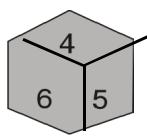

  
Fig. 14.3

Note that the pair (1, 4) is different from (4, 1). (Why?)

So, the number of possible outcomes $= 6 \times 6 = 3 6$ .

(i) The outcomes favourable to the event ‘the sum of the two numbers is ${ } ^ { 8 }$ denoted by E, are: (2, 6), (3, 5), (4, 4), (5, 3), (6, 2) (see Fig. 14.3)

i.e., the number of outcomes favourable to $\mathrm { E } = 5$ .

Hence, $\mathrm { P ( E ) } = { \frac { 5 } { 3 6 } }$

(ii) As you can see from Fig. 14.3, there is no outcome favourable to the event F, ‘the sum of two numbers is $1 3 ^ { \circ }$ .

So, $\mathrm { P ( F ) } = { \frac { 0 } { 3 6 } } = 0$

(iii) As you can see from Fig. 14.3, all the outcomes are favourable to the event G, ‘sum of two numbers $\leq 1 2 ^ { \ ' }$ .

So, $\mathrm { P } ( \mathrm { G } ) = \frac { 3 6 } { 3 6 } = 1$

## EXERCISE 14.1

1. Complete the following statements:

(i) Probability of an event $\mathrm { E + }$ Probability of the event ‘not $\mathrm { E } ' = .$ $\mathrm { E } ^ { \prime } = \_$   
(ii) The probability of an event that cannot happen is __ . Such an event is called   
(iii) The probability of an event that is certain to happen is . Such an event is called   
(iv) The sum of the probabilities of all the elementary events of an experiment is   
(v) The probability of an event is greater than or equal to and less than or equal to

2. Which of the following experiments have equally likely outcomes? Explain.

(i) A driver attempts to start a car. The car starts or does not start.   
(ii) A player attempts to shoot a basketball. She/he shoots or misses the shot.   
(iii) A trial is made to answer a true-false question. The answer is right or wrong.   
(iv) A baby is born. It is a boy or a girl.

3. Why is tossing a coin considered to be a fair way of deciding which team should get the ball at the beginning of a football game?

4. Which of the following cannot be the probability of an event?

(A) 2

(B) –1.5

(C) 15%

(D) 0.7

5. If $\mathrm { P ( E ) } = 0 . 0 5$ , what is the probability of ‘not E’?

6. A bag contains lemon flavoured candies only. Malini takes out one candy without looking into the bag. What is the probability that she takes out

(i) an orange flavoured candy?   
(ii) a lemon flavoured candy?

7. It is given that in a group of 3 students, the probability of 2 students not having the same birthday is 0.992. What is the probability that the 2 students have the same birthday?

8. A bag contains 3 red balls and 5 black balls. A ball is drawn at random from the bag. What is the probability that the ball drawn is (i) red ? (ii) not red?

9. A box contains 5 red marbles, 8 white marbles and 4 green marbles. One marble is taken out of the box at random. What is the probability that the marble taken out will be (i) red ? (ii) white ? (iii) not green?

10. A piggy bank contains hundred 50p coins, fifty ` 1 coins, twenty ` 2 coins and ten ` 5 coins. If it is equally likely that one of the coins will fall out when the bank is turned upside down, what is the probability that the coin (i) will be a 50 p coin ? (ii) will not be a ` 5 coin?   
11. Gopi buys a fish from a shop for his aquarium. The shopkeeper takes out one fish at random from a tank containing 5 male fish and 8 female fish (see Fig. 14.4). What is the probability that the fish taken out is a male fish?   
12. A game of chance consists of spinning an arrow which comes to rest pointing at one of the numbers 1, 2, 3, 4, 5, 6, 7, 8 (see Fig. 14.5 ), and these are equally likely outcomes. What is the probability that it will point at

(i) 8 ?   
(ii) an odd number?   
(iii) a number greater than 2?   
(iv) a number less than 9?

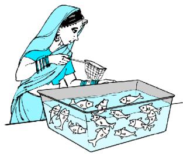  
Fig. 14.4

  
Fig. 14.5

13. A die is thrown once. Find the probability of getting

(i) a prime number; (ii) a number lying between 2 and 6; (iii) an odd number.

14. One card is drawn from a well-shuffled deck of 52 cards. Find the probability of getting

(i) a king of red colour (ii) a face card (iii) a red face card   
(iv) the jack of hearts (v) a spade (vi) the queen of diamonds

15. Five cards—the ten, jack, queen, king and ace of diamonds, are well-shuffled with their face downwards. One card is then picked up at random.

(i) What is the probability that the card is the queen?   
(ii) If the queen is drawn and put aside, what is the probability that the second card picked up is (a) an ace? (b) a queen?

16. 12 defective pens are accidentally mixed with 132 good ones. It is not possible to just look at a pen and tell whether or not it is defective. One pen is taken out at random from this lot. Determine the probability that the pen taken out is a good one.

17. (i) A lot of 20 bulbs contain 4 defective ones. One bulb is drawn at random from the lot. What is the probability that this bulb is defective?   
(ii) Suppose the bulb drawn in (i) is not defective and is not replaced. Now one bulb is drawn at random from the rest. What is the probability that this bulb is not defective ?

18. A box contains 90 discs which are numbered from 1 to 90. If one disc is drawn at random from the box, find the probability that it bears (i) a two-digit number (ii) a perfect square number (iii) a number divisible by 5.

19. A child has a die whose six faces show the letters as given below:

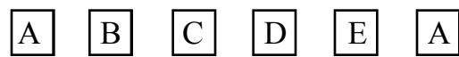

The die is thrown once. What is the probability of getting (i) A? (ii) D?

$2 0 ^ { \ast }$ . Suppose you drop a die at random on the rectangular region shown in Fig. 14.6. What is the probability that it will land inside the circle with diameter 1m?

  
Fig. 14.6

21. A lot consists of 144 ball pens of which 20 are defective and the others are good. Nuri will buy a pen if it is good, but will not buy if it is defective. The shopkeeper draws one pen at random and gives it to her. What is the probability that

(i) She will buy it ?   
(ii) She will not buy it ?

22. Refer to Example 13. (i) Complete the following table:

<table><tr><td>Event:
‘Sum on 2 dice’</td><td>2</td><td>3</td><td>4</td><td>5</td><td>6</td><td>7</td><td>8</td><td>9</td><td>10</td><td>11</td><td>12</td></tr><tr><td>Probability</td><td>1/36</td><td></td><td></td><td></td><td></td><td></td><td>5/36</td><td></td><td></td><td></td><td>1/36</td></tr></table>

(ii) A student argues that ‘there are 11 possible outcomes 2, 3, 4, 5, 6, 7, 8, 9, 10, 11 and 12. Therefore, each of them has a probability $\frac { 1 } { 1 1 }$ . Do you agree with this argument? Justify your answer.

23. A game consists of tossing a one rupee coin 3 times and noting its outcome each time. Hanif wins if all the tosses give the same result i.e., three heads or three tails, and loses otherwise. Calculate the probability that Hanif will lose the game.   
24. A die is thrown twice. What is the probability that

(i) 5 will not come up either time? (ii) 5 will come up at least once?

[Hint : Throwing a die twice and throwing two dice simultaneously are treated as the same experiment]

25. Which of the following arguments are correct and which are not correct? Give reasons for your answer.

(i) If two coins are tossed simultaneously there are three possible outcomes—two heads, two tails or one of each. Therefore, for each of these outcomes, the probability is $\frac 1 3$   
(ii) If a die is thrown, there are two possible outcomes—an odd number or an even number. Therefore, the probability of getting an odd number is $\frac { 1 } { 2 }$ .

### 14.2 Summary

In this chapter, you have studied the following points :

1. The theoretical (classical) probability of an event E, written as P(E), is defined as

$$
P (E) = \frac {\text {N u m b e r o f o u t c o m e s f a v o u r a b l e t o E}}{\text {N u m b e r o f a l l p o s s i b l e o u t c o m e s o f t h e e x p e r i m e n t}}
$$

where we assume that the outcomes of the experiment are equally likely.

2. The probability of a sure event (or certain event) is 1.   
3. The probability of an impossible event is 0.   
4. The probability of an event E is a number P(E) such that

$$
0 \leq \mathrm {P} (\mathrm {E}) \leq 1
$$

5. An event having only one outcome is called an elementary event. The sum of the probabilities of all the elementary events of an experiment is 1.   
6. For any event $\vec { \Xi } , \mathrm { ~ P ~ } ( \mathrm { E } ) + \mathrm { P } \left( \bar { \mathrm { ~ E ~ } } \right) = 1$ , where E stands for ‘not E’. E and E are called complementary events.

## A NOTE TO THE READER

The experimental or empirical probability of an event is based on what has actually happened while the theoretical probability of the event attempts to predict what will happen on the basis of certain assumptions. As the number of trials in an experiment, go on increasing we may expect the experimental and theoretical probabilities to be nearly the same.

## MATHEMATICAL MODELLIN

## A2G

## A2.1 Introduction

z An adult human body contains approximately $1 { , } 5 0 { , } 0 0 0 \mathrm { k m }$ of arteries and veins that carry blood.   
z The human heart pumps 5 to 6 litres of blood in the body every 60 seconds.   
z The temperature at the surface of the Sun is about $6 { , } 0 0 0 ^ { \circ } \mathrm { C }$

Have you ever wondered how our scientists and mathematicians could possibly have estimated these results? Did they pull out the veins and arteries from some adult dead bodies and measure them? Did they drain out the blood to arrive at these results? Did they travel to the Sun with a thermometer to get the temperature of the Sun? Surely not. Then how did they get these figures?

Well, the answer lies in mathematical modelling, which we introduced to you in Class IX. Recall that a mathematical model is a mathematical description of some real-life situation. Also, recall that mathematical modelling is the process of creating a mathematical model of a problem, and using it to analyse and solve the problem.

So, in mathematical modelling, we take a real-world problem and convert it to an equivalent mathematical problem. We then solve the mathematical problem, and interpret its solution in the situation of the real-world problem. And then, it is important to see that the solution, we have obtained, ‘makes sense’, which is the stage of validating the model. Some examples, where mathematical modelling is of great importance, are:

(i) Finding the width and depth of a river at an unreachable place.   
(ii) Estimating the mass of the Earth and other planets.   
(iii) Estimating the distance between Earth and any other planet.   
(iv) Predicting the arrrival of the monsoon in a country.

(v) Predicting the trend of the stock market.   
(vi) Estimating the volume of blood inside the body of a person.   
(vii) Predicting the population of a city after 10 years.   
(viii) Estimating the number of leaves in a tree.   
(ix) Estimating the ppm of different pollutants in the atmosphere of a city.   
(x) Estimating the effect of pollutants on the environment.   
(xi) Estimating the temperature on the Sun’s surface.

In this chapter we shall revisit the process of mathematical modelling, and take examples from the world around us to illustrate this. In Section A2.2 we take you through all the stages of building a model. In Section A2.3, we discuss a variety of examples. In Section A2.4, we look at reasons for the importance of mathematical modelling.

A point to remember is that here we aim to make you aware of an important way in which mathematics helps to solve real-world problems. However, you need to know some more mathematics to really appreciate the power of mathematical modelling. In higher classes some examples giving this flavour will be found.

## A2.2 Stages in Mathematical Modelling

In Class IX, we considered some examples of the use of modelling. Did they give you an insight into the process and the steps involved in it? Let us quickly revisit the main steps in mathematical modelling.

Step 1 (Understanding the problem) : Define the real problem, and if working in a team, discuss the issues that you wish to understand. Simplify by making assumptions and ignoring certain factors so that the problem is manageable.

For example, suppose our problem is to estimate the number of fishes in a lake. It is not possible to capture each of these fishes and count them. We could possibly capture a sample and from it try and estimate the total number of fishes in the lake.

Step 2 (Mathematical description and formulation) : Describe, in mathematical terms, the different aspects of the problem. Some ways to describe the features mathematically, include:

z define variables   
$\bullet$ write equations or inequalities   
$\bullet$ gather data and organise into tables   
$\bullet$ z make graphs   
calculate probabilities

For example, having taken a sample, as stated in Step 1, how do we estimate the entire population? We would have to then mark the sampled fishes, allow them to mix with the remaining ones in the lake, again draw a sample from the lake, and see how many of the previously marked ones are present in the new sample. Then, using ratio and proportion, we can come up with an estimate of the total population. For instance, let us take a sample of 20 fishes from the lake and mark them, and then release them in the same lake, so as to mix with the remaining fishes. We then take another sample (say 50), from the mixed population and see how many are marked. So, we gather our data and analyse it.

One major assumption we are making is that the marked fishes mix uniformly with the remaining fishes, and the sample we take is a good representative of the entire population.

Step 3 (Solving the mathematical problem) : The simplified mathematical problem developed in Step 2 is then solved using various mathematical techniques.

For instance, suppose in the second sample in the example in Step 2, 5 fishes are marked. So, ${ \frac { 5 } { 5 0 } } , \mathrm { i . e . , } { \frac { 1 } { 1 0 } } ,$ $\frac { 5 } { 5 0 } { ; }$ , i.e., ${ \frac { 1 } { 1 0 } } ,$ of the population is marked. If this is typical of the whole population, then $\frac { 1 } { 1 0 }$ th of the population $= 2 0$ .

So, the whole population $= 2 0 \times 1 0 = 2 0 0$ .

Step 4 (Interpreting the solution) : The solution obtained in the previous step is now looked at, in the context of the real-life situation that we had started with in Step 1.

For instance, our solution in the problem in Step 3 gives us the population of fishes as 200.

Step 5 (Validating the model) : We go back to the original situation and see if the results of the mathematical work make sense. If so, we use the model until new information becomes available or assumptions change.

Sometimes, because of the simplification assumptions we make, we may lose essential aspects of the real problem while giving its mathematical description. In such cases, the solution could very often be off the mark, and not make sense in the real situation. If this happens, we reconsider the assumptions made in Step 1 and revise them to be more realistic, possibly by including some factors which were not considered earlier.

For instance, in Step 3 we had obtained an estimate of the entire population of fishes. It may not be the actual number of fishes in the pond. We next see whether this is a good estimate of the population by repeating Steps 2 and 3 a few times, and taking the mean of the results obtained. This would give a closer estimate of the population.

Another way of visualising the process of mathematical modelling is shown in Fig. A2.1.

  
Fig. A2.1

Modellers look for a balance between simplification (for ease of solution) and accuracy. They hope to approximate reality closely enough to make some progress. The best outcome is to be able to predict what will happen, or estimate an outcome, with reasonable accuracy. Remember that different assumptions we use for simplifying the problem can lead to different models. So, there are no perfect models. There are good ones and yet better ones.

## EXERCISE A2.1

## 1. Consider the following situation.

A problem dating back to the early 13th century, posed by Leonardo Fibonacci asks how many rabbits you would have if you started with just two and let them reproduce. Assume that a pair of rabbits produces a pair of offspring each month and that each pair of rabbits produces their first offspring at the age of 2 months. Month by month the number of pairs of rabbits is given by the sum of the rabbits in the two preceding months, except for the 0th and the 1st months.

<table><tr><td>Month</td><td>Pairs of Rabbits</td></tr><tr><td>0</td><td>1</td></tr><tr><td>1</td><td>1</td></tr><tr><td>2</td><td>2</td></tr><tr><td>3</td><td>3</td></tr><tr><td>4</td><td>5</td></tr><tr><td>5</td><td>8</td></tr><tr><td>6</td><td>13</td></tr><tr><td>7</td><td>21</td></tr><tr><td>8</td><td>34</td></tr><tr><td>9</td><td>55</td></tr><tr><td>10</td><td>89</td></tr><tr><td>11</td><td>144</td></tr><tr><td>12</td><td>233</td></tr><tr><td>13</td><td>377</td></tr><tr><td>14</td><td>610</td></tr><tr><td>15</td><td>987</td></tr><tr><td>16</td><td>1597</td></tr></table>

After just 16 months, you have nearly 1600 pairs of rabbits!

Clearly state the problem and the different stages of mathematical modelling in this situation.

## A2.3 Some Illustrations

Let us now consider some examples of mathematical modelling.

Example 1 (Rolling of a pair of dice) : Suppose your teacher challenges you to the following guessing game: She would throw a pair of dice. Before that you need to guess the sum of the numbers that show up on the dice. For every correct answer, you get two points and for every wrong guess you lose two points. What numbers would be the best guess?

## Solution :

Step 1 (Understanding the problem) : You need to know a few numbers which have higher chances of showing up.

Step 2 (Mathematical description) : In mathematical terms, the problem translates to finding out the probabilities of the various possible sums of numbers that the dice could show.

We can model the situation very simply by representing a roll of the dice as a random choice of one of the following thirty six pairs of numbers.

(1, 1) (1, 2) (1, 3) (1, 4) (1, 5) (1, 6)   
(2, 1) (2, 2) (2, 3) (2, 4) (2, 5) (2, 6)   
(3, 1) (3, 2) (3, 3) (3, 4) (3, 5) (3, 6)   
(4, 1) (4, 2) (4, 3) (4, 4) (4, 5) (4, 6)   
(5, 1) (5, 2) (5, 3) (5, 4) (5, 5) (5, 6)   
(6, 1) (6, 2) (6, 3) (6, 4) (6, 5) (6, 6)

The first number in each pair represents the number showing on the first die, and the second number is the number showing on the second die.

Step 3 (Solving the mathematical problem) : Summing the numbers in each pair above, we find that possible sums are 2, 3, 4, 5, 6, 7, 8, 9, 10, 11 and 12. We have to find the probability for each of them, assuming all 36 pairs are equally likely.

We do this in the following table.

<table><tr><td>Sum</td><td>2</td><td>3</td><td>4</td><td>5</td><td>6</td><td>7</td><td>8</td><td>9</td><td>10</td><td>11</td><td>12</td></tr><tr><td>Probability</td><td>1/36</td><td>2/36</td><td>3/36</td><td>4/36</td><td>5/36</td><td>6/36</td><td>5/36</td><td>4/36</td><td>3/36</td><td>2/36</td><td>1/36</td></tr></table>

Observe that the chance of getting a sum of a seven is 1/6, which is larger than the chances of getting other numbers as sums.

Step 4 (Interpreting the solution) : Since the probability of getting the sum 7 is the highest, you should repeatedly guess the number seven.

Step 5 (Validating the model) : Toss a pair of dice a large number of times and prepare a relative frequency table. Compare the relative frequencies with the corresponding probabilities. If these are not close, then possibly the dice are biased. Then, we could obtain data to evaluate the number towards which the bias is.

Before going to the next example, you may need some background.

Not having the money you want when you need it, is a common experience for many people. Whether it is having enough money for buying essentials for daily living, or for buying comforts, we always require money. To enable the customers with limited funds to purchase goods like scooters, refrigerators, televisions, cars, etc., a scheme known as an instalment scheme (or plan) is introduced by traders.

Sometimes a trader introduces an instalment scheme as a marketing strategy to allure customers to purchase these articles. Under the instalment scheme, the customer is not required to make full payment of the article at the time of buying it. She/he is allowed to pay a part of it at the time of purchase, and the rest can be paid in instalments, which could be monthly, quarterly, half-yearly, or even yearly. Of course, the buyer will have to pay more in the instalment plan, because the seller is going to charge some interest on account of the payment made at a later date (called deferred payment).

Before we take a few examples to understand the instalment scheme, let us understand the most frequently used terms related to this concept.

The cash price of an article is the amount which a customer has to pay as full payment of the article at the time it is purchased. Cash down payment is the amount which a customer has to pay as part payment of the price of an article at the time of purchase.

Remark : If the instalment scheme is such that the remaining payment is completely made within one year of the purchase of the article, then simple interest is charged on the deferred payment.

In the past, charging interest on borrowed money was often considered evil, and, in particular, was long prohibited. One way people got around the law against paying interest was to borrow in one currency and repay in another, the interest being disguised in the exchange rate.

Let us now come to a related mathematical modelling problem.

Example 2 : Juhi wants to buy a bicycle. She goes to the market and finds that the bicycle she likes is available for ` 1800. Juhi has ` 600 with her. So, she tells the shopkeeper that she would not be able to buy it. The shopkeeper, after a bit of calculation, makes the following offer. He tells Juhi that she could take the bicycle by making a payment of ` 600 cash down and the remaining money could be made in two monthly instalments of ` 610 each. Juhi has two options one is to go for instalment scheme or to make cash payment by taking loan from a bank which is available at the rate of $10 \%$ per annum simple interest. Which option is more economical to her?

## Solution :

Step 1 (Understanding the problem) : What Juhi needs to determine is whether she should take the offer made by the shopkeeper or not. For this, she should know the two rates of interest— one charged in the instalment scheme and the other charged by the bank (i.e., $10 \%$ ).

Step 2 (Mathematical description) : In order to accept or reject the scheme, she needs to determine the interest that the shopkeeper is charging in comparison to the bank. Observe that since the entire money shall be paid in less than a year, simple interest shall be charged.

We know that the cash price of the bicycle $= \dot { ~ } 1 8 0 0$ .

Also, the cashdown payment under the instalment scheme $\ r = \ r _ { \theta 0 0 }$ .

So, the balance price that needs to be paid in the instalment scheme $= \mathrm {  ~ \bar { ~ } { ~ ( 1 8 0 0 - 6 0 0 ) = ~ } ~ } ^ { \mathrm {  ~ \bar { ~ } { ~ 1 2 0 0 } ~ } } .$ .

Let $r \%$ per annum be the rate of interest charged by the shopkeeper.

Amount of each instalment $= { \dot { ~ } } 6 1 0$

Amount paid in instalments $= { \dot { ~ 6 1 0 } } + { \dot { ~ 6 } } 1 0 = { \dot { ~ 1 } } 2 2 0$

Interest paid in instalment scheme $= { \textrm { ~ } } 1 2 2 0 - { \textrm { ~ } } 1 2 0 0 = { \textrm { ~ } } 2 0$ (1)

Since, Juhi kept a sum of ` 1200 for one month, therefore,

Principal for the first month = ` 1200

Principal for the second month $= { \textrm { ( } { 1 2 0 0 - 6 1 0 ) } } = { \textrm { 5 9 0 } }$

Balance of the second principal ` $5 9 0 +$ interest charged $( \phantom { A } 2 0 ) =$ monthly instalment (` 610) $= 2 \mathrm { n d }$ instalment

So, the total principal for one month $= \dot { ~ } 1 2 0 0 + \dot { ~ } 5 9 0 = \dot { ~ } 1 7 9 0$

Now, interest = ` 1790 1u ur ${ \mathrm { i n t e r e s t } } = { \sqrt { \begin{array} { l } { 1 7 9 0 \times r \times 1 } \\ { 1 0 0 \times 1 2 } \end{array} } }$ (2)

Step 3 (Solving the problem) : From (1) and (2)

$$
\frac {1 7 9 0 \times r \times 1}{1 0 0 \times 1 2} = 2 0
$$

or $r = { \frac { 2 0 \times 1 2 0 0 } { 1 7 9 0 } } = 1 3 . 1 4 ( \mathrm { a p p r o x . } )$

Step 4 (Interpreting the solution) : The rate of interest charged in the instalment scheme $= 1 3 . 1 4 \%$ .

The rate of interest charged by the bank $= 1 0 \%$

So, she should prefer to borrow the money from the bank to buy the bicycle which is more economical.

Step 5 (Validating the model) : This stage in this case is not of much importance here as the numbers are fixed. However, if the formalities for taking loan from the bank such as cost of stamp paper, etc., which make the effective interest rate more than what it is the instalment scheme, then she may change her opinion.

Remark : Interest rate modelling is still at its early stages and validation is still a problem of financial markets. In case, different interest rates are incorporated in fixing instalments, validation becomes an important problem.

## EXERCISE A2.2

In each of the problems below, show the different stages of mathematical modelling for solving the problems.

1. An ornithologist wants to estimate the number of parrots in a large field. She uses a net to catch some, and catches 32 parrots, which she rings and sets free. The following week she manages to net 40 parrots, of which 8 are ringed.

(i) What fraction of her second catch is ringed?

(ii) Find an estimate of the total number of parrots in the field.

2. Suppose the adjoining figure represents an aerial photograph of a forest with each dot representing a tree. Your purpose is to find the number of trees there are on this tract of land as part of an environmental census.

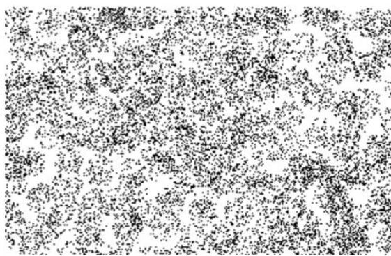

3. A T.V. can be purchased for ` 24000 cash or for ` 8000 cashdown payment and six monthly instalments of ` 2800 each. Ali goes to market to buy a T.V., and he has ` 8000 with him. He has now two options. One is to buy TV under instalment scheme or to make cash payment by taking loan from some financial society. The society charges simple interest at the rate of $1 8 \%$ per annum simple interest. Which option is better for Ali?

## A2.4 Why is Mathematical Modelling Important?

As we have seen in the examples, mathematical modelling is an interdisciplinary subject. Mathematicians and specialists in other fields share their knowledge and expertise to improve existing products, develop better ones, or predict the behaviour of certain products.

There are, of course, many specific reasons for the importance of modelling, but most are related in some ways to the following :

z To gain understanding. If we have a mathematical model which reflects the essential behaviour of a real-world system of interest, we can understand that system better through an analysis of the model. Furthermore, in the process of building the model we find out which factors are most important in the system, and how the different aspects of the system are related.   
z To predict, or forecast, or simulate. Very often, we wish to know what a real-world system will do in the future, but it is expensive, impractical or impossible to experiment directly with the system. For example, in weather prediction, to study drug efficacy in humans, finding an optimum design of a nuclear reactor, and so on.

Forecasting is very important in many types of organisations, since predictions of future events have to be incorporated into the decision-making process. For example:

In marketing departments, reliable forecasts of demand help in planning of the sale strategies.

A school board needs to able to forecast the increase in the number of school going children in various districts so as to decide where and when to start new schools.

Most often, forecasters use the past data to predict the future. They first analyse the data in order to identify a pattern that can describe it. Then this data and pattern is extended into the future in order to prepare a forecast. This basic strategy is employed in most forecasting techniques, and is based on the assumption that the pattern that has been identified will continue in the future also.

z To estimate. Often, we need to estimate large values. You’ve seen examples of the trees in a forest, fish in a lake, etc. For another example, before elections, the contesting parties want to predict the probability of their party winning the elections. In particular, they want to estimate how many people in their constituency would vote for their party. Based on their predictions, they may want to decide on the campaign strategy. Exit polls have been used widely to predict the number of seats, a party is expected to get in elections.

## EXERCISE A2.3

1. Based upon the data of the past five years, try and forecast the average percentage of marks in Mathematics that your school would obtain in the Class X board examination at the end of the year.

## A2.5 Summary

In this Appendix, you have studied the following points :

1. A mathematical model is a mathematical description of a real-life situation. Mathematical modelling is the process of creating a mathematical model, solving it and using it to understand the real-life problem.   
2. The various steps involved in modelling are : understanding the problem, formulating the mathematical model, solving it, interpreting it in the real-life situation, and, most importantly, validating the model.   
3. Developed some mathematical models.   
4. The importance of mathematical modelling.

## ANSWERS/HINTS

## EXERCISE 8.1

1. (i) $\sin \mathrm { A } = { \frac { 7 } { 2 5 } } , \cos \mathrm { A } = { \frac { 2 4 } { 2 5 } }$ ,  cos A   
,  cos C =

2. 0 3. 7cos A = , $3 . \cos A = { \frac { \sqrt { 7 } } { 4 } } , \tan \mathrm { A } = { \frac { 3 } { \sqrt { 7 } } }$ tan A =

4. sin A 15 ,  sec A 17

5. sin T 5 , cosT 12 , tan T 5 ,  cot T 12 ,  cosec =T 1 3

7. (i) $\frac { 4 9 } { 6 4 }$

(ii) 4964

8. Yes

9. (i) 1 (ii) 0

${ \bf 1 0 . ~ \ s i n \mathrm { P } } = \frac { 1 2 } { 1 3 } , \cos \mathrm { P } = \frac { 5 } { 1 3 } , \tan \mathrm { P } = \frac { 1 2 } { 5 }$ , cos P =

11. (i) False

(ii) True

(iii) False

(iv) False

(v) False

## EXERCISE 8.2

1. (i) 1

(ii) 2

(iii) $\frac { 3 { \sqrt { 2 } } - { \sqrt { 6 } } } { 8 }$

(iv) $\frac { 4 3 - 2 4 { \sqrt { 3 } } } { 1 1 }$

(v) 6712

2. (i) A

(ii) D

(iii) A

(iv) C

3. $\angle \mathbf { A } = 4 5 ^ { \circ }$

$\angle \mathrm { B } = 1 5 ^ { \circ }$

4. (i) False

(ii) True

(iii) False

(iv) False

(v) True

## EXERCISE 8.3

1. $\sin \mathrm { A } = { \frac { 1 } { \sqrt { 1 + \cot ^ { 2 } \mathrm { A } } } }$ , tan A = 1 21 + cot A  , sec A = cot A cot A   
2. 2sec A – 1 , $\sin \mathrm { A } = { \frac { \sqrt { \sec ^ { 2 } \mathrm { A } - 1 } } { \sec \mathrm { A } } } , \cos \mathrm { A } = { \frac { 1 } { \sec \mathrm { A } } } , \tan \mathrm { A } = { \sqrt { \sec ^ { 2 } \mathrm { A } - 1 } }$ cos A =

$$
\cot A = \frac {1}{\sqrt {\sec^ {2} A - 1}}, \operatorname {c o s e c} A = \frac {\sec A}{\sqrt {\sec^ {2} A - 1}}
$$

3. (i) B

(ii) C

(iii) D

(iv) D

## EXERCISE 9.1

1. 10 m

2. 8 3 m

3. 3m, 2 3 m

4. 10 3 m

5. 40 3 m

6. 19 3 m

7. 20 3 1 m  

8. 0.8 3 1 m  

9. $1 6 { \frac { 2 } { 3 } } \mathrm { m }$

10. 20 3 m, 20m, 60m

11. 10 3 m, 10m

12. 7 3 1 m  

13. $7 5 ( { \sqrt { 3 } } - 1 ) \mathrm { m } 1 4 . 5 8 { \sqrt { 3 } } \mathrm { m }$

15. 3 seconds

## EXERCISE 10.1

1. Infinitely many

2. (i) One

(ii) Secant

(iii) Two

(iv) Point of contact

## EXERCISE 10.2

1. A

2. B

3. A

6. 3 cm

7. 8 cm

12. AB = 15 cm, AC = 13 cm

## EXERCISE 11.1

1. ${ \frac { 1 3 2 } { 7 } } \mathrm { c m } ^ { 2 }$ 2 2cm

77 2. cm 2 8

154 3. 2c m 3

4. (i) $2 8 . 5 ~ \mathrm { c m } ^ { 2 }$

(ii) 235.5 cm2

5. (i) 22 cm

(ii) 231 cm2

${ \Biggl ( } 2 3 1 - { \frac { 4 4 1 { \sqrt { 3 } } } { 4 } } { \Biggr ) } { \mathrm { c m } } ^ { 2 }$ 2 cm  ¸

6. 20.4375 cm2 ; 686.0625 cm2 7. 88.44 cm2

8. (i) $1 9 . 6 2 5 \ \mathrm { m } ^ { 2 }$

(ii) 58.875 cm2

9.

(i) 285 mm

(ii) 385 2 mm 4

10. ${ \frac { 2 2 2 7 5 } { 2 8 } } \ \mathrm { c m } ^ { 2 }$ 2 cm

11. ${ \frac { 1 5 8 1 2 5 } { 1 2 6 } } \mathrm { c m } ^ { 2 }$ 5 2cm

12. 189.97 km2

13. ` 162.68

14. D

## EXERCISE 12.1

1. $1 6 0 ~ \mathrm { c m } ^ { 2 }$

2. 572 cm2

3. 214.5 cm2

4. Greatest diameter = 7 cm,surface area $= 3 3 2 . 5 \mathrm { c m } ^ { 2 }$

5. ${ \frac { 1 } { 4 } } l ^ { 2 } \left( \pi + 2 4 \right)$

6. 220 mm2

7. 44 m2, ` 22000

8. 18 cm2

9. 374 cm2

## EXERCISE 12.2

1. $\pi \mathrm { c m } ^ { 3 }$

2. $6 6 \mathrm { c m } ^ { 3 }$ . Volume of the air inside the model $=$ Volume of air inside (cone + cylinder $^ +$ cone) ${ \bf \tau } = \biggl ( \frac { 1 } { 3 } \pi r ^ { 2 } h _ { 1 } + \pi r ^ { 2 } h _ { 2 } + \frac { 1 } { 3 } \pi r ^ { 2 } h _ { 1 } \biggr ) ,$ = 2 2 21 2 11 1 ,3 3r h r h r h § · ¨ ¸ S  S  S © ¹ where r is the radius of the cone and the cylinder, h1 is the $r$ $h _ { \scriptscriptstyle 1 }$ height (length) of the cone and $h _ { 2 }$ is the height (length) of the cylinder.

$\mathrm { R e q u i r e d V o l u m e } = \frac { 1 } { 3 } \pi r ^ { 2 } \left( h _ { 1 } + 3 h _ { 2 } + h _ { 1 } \right) .$

3. $3 3 8 ~ \mathrm { c m } ^ { 3 }$

4. $5 2 3 . 5 3 ~ \mathrm { c m } ^ { 3 }$

5. 100

6. 892.26 kg

7. $1 . 1 3 1 ~ \mathrm { m } ^ { 3 }$ (approx.)

8. Not correct. Correct answer is $3 4 6 . 5 1 ~ \mathrm { c m } ^ { 3 }$

## EXERCISE 13.1

1. 8.1 plants. We have used direct method because numerical values of $x _ { i }$ and $f _ { i }$ are small.

2. ` 545.20

3. $f = 2 0$

4. 75.9

5. 57.19

6. ` 211

7. 0.099 ppm

8. 12.48 days

9. 69.43 %

## EXERCISE 13.2

1. Mode $= 3 6 . 8$ years, Mean = 35.37 years. Maximum number of patients admitted in the hospital are of the age 36.8 years (approx.), while on an average the age of a patient admitted to the hospital is 35.37 years.

2. 65.625 hours

3. Modal monthly expenditure = ` 1847.83, Mean monthly expenditure $= { \dot { 2 } } 6 6 2 . 5$ .

4. Mode : 30.6, Mean $= 2 9 . 2$ . Most states/U.T. have a student teacher ratio of 30.6 and on an average, this ratio is 29.2.

5. Mode $= 4 6 0 8 . 7$ runs

6. Mode = 44.7 cars

## EXERCISE 13.3

1. Median $= 1 3 7$ units, $\mathrm { M e a n } = 1 3 7 . 0 5$ units, Mode = 135.76 units. The three measures are approximately the same in this case.

2. $x = 8$ , $y = 7$

3. Median a $\mathrm { g e } = 3 5 . 7 6$ years

4. Median length $= 1 4 6 . 7 5 \mathrm { m m }$

5. Median life $= 3 4 0 6 . 9 8 $ hours

6. Median $= 8 . 0 5$ , Mean = 8.32,

Modal size = 7.88

7. Median weigh $: = 5 6 . 6 7 \mathrm { k g }$

## EXERCISE 14.1

1. (i) 1

(ii) 0, impossible event (iii) 1, sure or certain event

(iv) 1

(v) 0, 1

2. The experiments (iii) and (iv) have equally likely outcomes.

3. When we toss a coin, the outcomes head and tail are equally likely. So, the result of an individual coin toss is completely unpredictable.

4. B

5. 0.95

6. (i) 0

(ii) 1

7. 0.008

8. (i) $\frac { 3 } { 8 }$

(ii) 5

9. (i) $\frac { 5 } { 1 7 }$

(ii) 817

(iii) 17 13

10.

(i) 5

(ii) 1718

11. 13 5

12. (i) 1

(ii) 12

(iii) 3

(iv) 1

13. (i) 12

(ii) 1

(iii) 12

14. (i) 126 $\frac { 1 } { 2 6 }$

(ii) $\frac { 3 } { 1 3 }$

(iii) $\frac { 3 } { 2 6 }$

(iv) 152

(v) $\frac { 1 } { 4 }$

(vi) $\frac { 1 } { 5 2 }$

15. (i) $\frac { 1 } { 5 }$

(ii) (a) $\frac { 1 } { 4 }$

(b) 0

16. $\frac { 1 1 } { 1 2 }$

17. (i) $\frac { 1 } { 5 }$

(ii) 1519

$\frac { 9 } { 1 0 }$

(ii) 110 $\frac { 1 } { 1 0 }$

19. (i) $\frac 1 3$

(ii) $\frac { 1 } { 6 }$

20. 24S

21. (i) $\frac { 3 1 } { 3 6 }$

(ii) 5

22. (i)

<table><tr><td>‘Sum on 2 dice’</td><td>2</td><td>3</td><td>4</td><td>5</td><td>6</td><td>7</td><td>8</td><td>9</td><td>10</td><td>11</td><td>12</td></tr><tr><td>Probability</td><td>1/36</td><td>2/36</td><td>3/36</td><td>4/36</td><td>5/36</td><td>6/36</td><td>5/36</td><td>4/36</td><td>3/36</td><td>2/36</td><td>1/36</td></tr></table>

(ii) No. The eleven sums are not equally likely.

23. $\frac 3 4$ ; Possible outcomes are : HHH, TTT, HHT, HTH, HTT, THH, THT, TTH. Here, THH means tail in the first toss, head on the second toss and head on the third toss and so on.

24. (i) $\frac { 2 5 } { 3 6 }$

(ii) 1136

25. (i) Incorrect. We can classify the outcomes like this but they are not then ‘equally likely’. Reason is that ‘one of each’ can result in two ways — from a head on first coin and tail on the second coin or from a tail on the first coin and head on the second coin. This makes it twicely as likely as two heads (or two tails).

(ii) Correct. The two outcomes considered in the question are equally likely.   
(ix) 2 does not divide the positive integer a.

## EXERCISE A2.2

1. (i) $\frac { 1 } { 5 }$ (ii) 160

2. Take $1 \mathrm { c m } ^ { 2 }$ area and count the number of dots in it. Total number of trees will be the product of this number and the area (in cm2).   
3. Rate of interest in instalment scheme is $1 7 . 7 4 \%$ , which is less than $18 \%$

## EXERCISE A2.3

1. Students find their own answers.

# Suggested Pedagogical Processes

# Learning Outcomes

# The learners may be provided with opportunities individually or in groups and encouraged to—

extend the methods of finding LCM and HCF of large numbers learnt earlier to general form.   
discuss different aspects of polynomials, such as—their degree, type (linear, quadratic, cubic), zeroes, etc., relationship between their visual representation and their zeroes.   
play a game which may involve a series of acts of factorising a polynomial and using one of its factors to form a new one. For example, one group factorising say, $( x ^ { 3 } - 2 x ^ { 2 } - x - 2 )$ and using one of its factors $x { - } 1$ to construct another polynomial, which is further factorised by another group to continue the process.   
use quadratic equations to solve real life problems through different strategies, such as, making a perfect square, quadratic formula, etc.   
discuss different aspects of linear equations by engaging students in the activities of the following nature:

one group may ask another to form linear equation in two variables with coefficients from a particular number system, i.e., natural numbers or numbers that are not integers, etc.   
graphically representing a linear equation in 1D or 2D and try to explain the difference in their nature.   
encouraging students to observe identities and equations and segregate them.

use graphical ways to visualise different aspects of linear equations, such as, visualising linear equations in two variables or to find their solution.   
observe and analyse patterns in their daily life situations to check if they form an Arithmetic Progression and, if so,

# The learner—

generalises properties of numbers and relations among them studied earlier to evolve results, such as, Euclid’s division algorithm, Fundamental Theorem of Arithmetic and applies them to solve problems related to real life contexts.   
develops a relationship between algebraic and graphical methods of finding the zeroes of a polynomial.   
finds solutions of pairs of linear equations in two variables using graphical and different algebraic methods.   
demonstrates strategies of finding roots and determining the nature of roots of a quadratic equation.   
develops strategies to apply the concept of A.P. to daily life situations.   
works out ways to differentiate between congruent and similar figures.   
establishes properties for similarity of two triangles logically using different geometric criteria established earlier such as, Basic Proportionality Theorem, etc.

picking up a card from a deck of 52 playing cards, etc.

generalise the formulas of mean, median and mode read in the earlier classes by providing situations for these central tendencies.   
collect data from their surroundings and calculate the central tendencies.   
to draw tangents to a circle from a point which lies outside and a point which lies inside the circle. They may be motivated to evolve different ways to verify the properties of such tangents.

determines the probability of an event and applies the concept in solving daily life problems.

# Suggested Pedagogical Processes in an Inclusive Setup

Children with special needs to be taken along the class and keeping in view the learning objectives, similar to those of the others, appropriate activities may be designed. The teacher should take into account the specific problem of the child and plan alternate strategies for teaching-learning process. A healthy inclusive classroom environment provides equal opportunity to all the students; to those with and without learning difficulties. The measures to be adopted may include:

developing process skills through group activities and using ICT for simulation, repeated practice and evaluation.   
assessing learning progress through different modes taking cognizance of the learner’s response.   
observing the child’s engagement in multiple activities, through varied ways and levels of involvement.   
using of embossed diagram in the pedagogical process and learning progress.   
using of adapted equipment (large print materials, adapted text materials with simple language, more pictures and examples, etc.) in observation and exploration (for example: visual output devices should have aural output and vice versa) during the teaching-learning process.   
using multiple choice questions to get responses from children who find it difficult to write or explain verbally.

# FUNDAMENTALDUTIES

# Fundamental duties:It shall be the duty of every citizen of India-

(a)to abide by the Constitution and respect its ideals and institutions,the National Flag and the National Anthem;   
(b)to cherish and follow the noble ideals which inspired our national struggle for freedom;   
(c)to uphold and protect the sovereignty, unity and integrity of India;   
(d)to defend the country and render national service when called upon to do so;   
(e) to promote harmony and the spirit of common brotherhood amongst all the people of India transcending religious,linguistic and regional or sectional diversities; to renounce practices derogatory to the dignity of women;   
(f)to value and preserve the rich heritage of our composite culture;   
(g)to protect and improve the natural environment including forests,lakes,rivers and wild life, and to have compassion for living creatures;   
(h)to develop the scientific temper, humanism and the spirit of inquiry and reform;   
(i)to safeguard public property and to abjure violence.   
(i)to strive towards excellence in all spheres of individual and collective activity so that the nation constantly rises to higher levels of endeavour and achievement;   
(k)who is a parent or guardian,to provide opportunities for education to his child or,as the case may be ward between the age of six and fourteen years;

- Constitution of India,

Part IVA (Article 51 A)

# Right of Children to Free and Compulsory Education (RTE) Act, 2009

The RTE Act provides for the right of children to free and Compulsory Education to every child in the age group of 6-14 years which came into force from 1st April 2010 in Andhra Pradesh.

# Important provisions of RTE Act

·Ensure availability of schools within the reach of the children.   
·Improve School infrastructure facilities.   
·Enroll children in the class appropriate to his /her age.   
·Children have a right to receive special training in order to be at par with other children.   
·Providing appropriate facilities for the education of children with special needs on par with other children.   
No child shallbe liable to pay any kind of fee or charges or expenses which may prevent himor her from pursuing and completing the elementary education. No test for admiting the children in schools.   
·No removal of name and repetition of the child in the same class.   
No child admited in a school shall be held back in any class or expel from school till the completion of elementary education.   
·No child shall be subjected to physical punishment or mental harassment.   
Admission shallnotbe denied ordelayedon the ground thatthe transferand other certificates have not been provided on time.   
·Eligible candidates alone shall be appointed as teachers.   
The teaching learning process and evaluation procedures shall promote achievement of appropriate competencies.   
·No board examinations shallbe conducted to the children till the completion of elementary education.   
·Children can continue inthe schools even after 14 years until completion of elementary education.   
·No discrimination and related practices towards children belonging to backward and marginalized communities.   
The curriculum and evaluation procedures must be in conformity with the values enshrined in the constitution and make the child free of fear and anxiety and help the child to express views freely.