# Chapter 1
# Chemical Reactions and Equations

consider the following situations of daily Clife and think what happens when -

milk is left at room temperature during summers.   
an iron tawa/pan/nail is left exposed to humid atmosphere.   
grapes get fermented.   
. food is cooked.   
food gets digested in our body.   
we respire.

In all the above situations, the nature and the identity of the initial substance have somewhat changed. We have already learnt about physical and chemical changes of matter in our previous classes. Whenever a chemical change occurs, we can say that a chemical reaction has taken place.

You may perhaps be wondering as to what is actually meant by a chemical reaction. How do we come to know that a chemical reaction has taken place? Let us perform some activities to find the answer to these questions.

### Activity 1.1

CAUTION: This Activity needs the teacher’s assistance. It would be better if students wear suitable eyeglasses.

■ Clean a magnesium ribbon about 3- 4 cm long by rubbing it with sandpaper.   
Hold it with a pair of tongs. Burn it using a spirit lamp or burner and collect the ash so formed in a watch-glass as shown in Fig. 1.1. Burn the magnesium ribbon keeping it away as far as possible from your eyes.   
What do you observe?

  
Figure 1.1   
Burning of a magnesium ribbon in air and collection of magnesium oxide in a watch-glass

You must have observed that magnesium ribbon burns with a dazzling white flame and changes into a white powder. This powder is magnesium oxide. It is formed due to the reaction between magnesium and oxygen present in the air.

### Activity 1.2

■ Take lead nitrate solution in a test tube.   
■ Add potassium iodide solution to this.   
■ What do you observe?

### Activity 1.3

Take a few zinc granules in a conical flask or a test tube.   
■ Add dilute hydrochloric acid or sulphuric acid to this (Fig. 1.2).

CAUTION: Handle the acid with care.

■ Do you observe anything happening around the zinc granules?   
Touch the conical flask or test tube. Is there any change in its temperature?

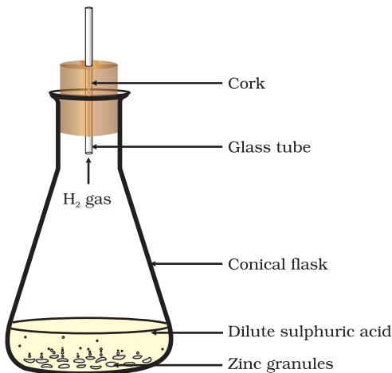  
Figure 1.2 Formation of hydrogen gas by the action of dilute sulphuric acid on zinc

From the above three activities, we can say that any of the following observations helps us to determine whether a chemical reaction has taken place –

change in state   
change in colour   
evolution of a gas   
change in temperature.

As we observe the changes around us, we can see that there is a large variety of chemical reactions taking place around us. We will study about the various types of chemical reactions and their symbolic representation in this Chapter.

### 1.1 CHEMICALEQUATIONS

Activity 1.1 can be described as – when a magnesium ribbon is burnt in oxygen, it gets converted to magnesium oxide. This description of a chemical reaction in a sentence form is quite long. It can be written in a shorter form. The simplest way to do this is to write it in the form of a word-equation.

The word-equation for the above reaction would be –

Magnesium + Oxygen®Magnesium oxide

(Reactants) (Product) (1.1)

The substances that undergo chemical change in the reaction (1.1), magnesium and oxygen, are the reactants. The new substance is magnesium oxide, formed during the reaction, as a product. A word-equation shows change of reactants to products through an arrow placed between them. The reactants are written on the left-hand side (LHS) with a plus sign $( + )$ between them. Similarly, products are written on the right-hand side (RHS) with a plus sign $( + )$ between them. The arrowhead points towards the products, and shows the direction of the reaction.

#### 1.1.1 Writing a Chemical Equation

Is there any other shorter way for representing chemical equations? Chemical equations can be made more concise and useful if we use chemical formulae instead of words. A chemical equation represents a chemical reaction. If you recall formulae of magnesium, oxygen and magnesium oxide, the above wordequation can be written as –

$$
\mathrm {M g} + \mathrm {O} _ {2} \rightarrow \mathrm {M g O} \tag {1.2}
$$

Count and compare the number of atoms of each element on the LHS and RHS of the arrow. Is the number of atoms of each element the same on both the sides? If yes, then the equation is balanced. If not, then the equation is unbalanced because the mass is not the same on both sides of the equation. Such a chemical equation is a skeletal chemical equation for a reaction. Equation (1.2) is a skeletal chemical equation for the burning of magnesium in air.

#### 1.1.2 Balanced Chemical Equations

Recall the law of conservation of mass that you studied in Class IX; mass can neither be created nor destroyed in a chemical reaction. That is, the total mass of the elements present in the products of a chemical reaction has to be equal to the total mass of the elements present in the reactants.

In other words, the number of atoms of each element remains the same, before and after a chemical reaction. Hence, we need to balance a skeletal chemical equation. Is the chemical Eq. (1.2) balanced? Let us learn about balancing a chemical equation step by step.

The word-equation for Activity 1.3 may be represented as –

Zinc $^ +$ Sulphuric acid Zinc sulphate + Hydrogen

The above word-equation may be represented by the following chemical equation –

$$
\mathrm {Z n} + \mathrm {H} _ {2} \mathrm {S O} _ {4} \rightarrow \mathrm {Z n S O} _ {4} + \mathrm {H} _ {2} \tag {1.3}
$$

Let us examine the number of atoms of different elements on both sides of the arrow.

<table><tr><td>Element</td><td>Number of atoms in reactants (LHS)</td><td>Number of atoms in products (RHS)</td></tr><tr><td>Zn</td><td>1</td><td>1</td></tr><tr><td>H</td><td>2</td><td>2</td></tr><tr><td>S</td><td>1</td><td>1</td></tr><tr><td>O</td><td>4</td><td>4</td></tr></table>

As the number of atoms of each element is the same on both sides of the arrow, Eq. (1.3) is a balanced chemical equation.

Let us try to balance the following chemical equation –

$$
\mathrm {F e} + \mathrm {H} _ {2} \mathrm {O} \rightarrow \mathrm {F e} _ {3} \mathrm {O} _ {4} + \mathrm {H} _ {2} \tag {1.4}
$$

Step I: To balance a chemical equation, first draw boxes around each formula. Do not change anything inside the boxes while balancing the equation.

$$
\boxed {\mathrm {F e}} + \boxed {\mathrm {H} _ {2} \mathrm {O}} \rightarrow \boxed {\mathrm {F e} _ {3} \mathrm {O} _ {4}} + \boxed {\mathrm {H} _ {2}} \tag {1.5}
$$

Step II: List the number of atoms of different elements present in the unbalanced equation (1.5).

<table><tr><td>Element</td><td>Number of atoms in reactants (LHS)</td><td>Number of atoms in products (RHS)</td></tr><tr><td>Fe</td><td>1</td><td>3</td></tr><tr><td>H</td><td>2</td><td>2</td></tr><tr><td>O</td><td>1</td><td>4</td></tr></table>

Step III: It is often convenient to start balancing with the compound that contains the maximum number of atoms. It may be a reactant or a product. In that compound, select the element which has the maximum number of atoms. Using these criteria, we select $\mathrm { F e } _ { 3 } \mathrm { O } _ { 4 }$ and the element oxygen in it. There are four oxygen atoms on the RHS and only one on the LHS.

To balance the oxygen atoms –

<table><tr><td>Atoms of oxygen</td><td>In reactants</td><td>In products</td></tr><tr><td>(I) Initial</td><td>1 (in H2O)</td><td>4 (in Fe3O4)</td></tr><tr><td>(ii) To balance</td><td>1×4</td><td>4</td></tr></table>

To equalise the number of atoms, it must be remembered that we cannot alter the formulae of the compounds or elements involved in the reactions. For example, to balance oxygen atoms we can put coefficient ‘4’as $4 \mathrm { H } _ { 2 } \mathrm { O }$ and

not $\mathrm { H } _ { 2 } \mathrm { O } _ { 4 }$ or $\mathrm { ( H } _ { 2 } \mathrm { O } ) _ { 4 }$ . Now the partly balanced equation becomes–

$$
\boxed {\mathrm {F e}} + 4 \boxed {\mathrm {H} _ {2} \mathrm {O}} \rightarrow \boxed {\mathrm {F e} _ {3} \mathrm {O} _ {4}} + \boxed {\mathrm {H} _ {2}} \tag {1.5}
$$

(partly balanced equation)

Step IV: Fe and H atoms are still not balanced. Pick any of these elements to proceed further. Let us balance hydrogen atoms in the partly balanced equation.

To equalise the number of H atoms, make the number of molecules of hydrogen as four on the RHS.

<table><tr><td>Atoms of oxygen</td><td>In reactants</td><td>In products</td></tr><tr><td>(I) Initial</td><td>8 (in 4H2O)</td><td>4 (in H2)</td></tr><tr><td>(ii) To balance</td><td>8</td><td>2 × 4</td></tr></table>

The equation would be –

$$
\boxed {\mathrm {F e}} + 4 \boxed {\mathrm {H} _ {2} \mathrm {O}} \rightarrow \boxed {\mathrm {F e} _ {3} \mathrm {O} _ {4}} + 4 \boxed {\mathrm {H} _ {2}} \tag {1.5}
$$

(partly balanced equation)

Step V: Examine the above equation and pick up the third element which is not balanced. You find that only one element is left to be balanced, that is, iron.

<table><tr><td>Atoms of iron</td><td>In reactants</td><td>In products</td></tr><tr><td>(I) Initial</td><td>1 (in Fe)</td><td>3 (in Fe3O4)</td></tr><tr><td>(ii) To balance</td><td>1 × 3</td><td>3</td></tr></table>

To equalise Fe, we take three atoms of Fe on the LHS.

$$
3 \boxed {\mathrm {F e}} + 4 \boxed {\mathrm {H} _ {2} \mathrm {O}} \rightarrow \boxed {\mathrm {F e} _ {3} \mathrm {O} _ {4}} + 4 \boxed {\mathrm {H} _ {2}} \tag {1.8}
$$

Step VI: Finally, to check the correctness of the balanced equation, we count atoms of each element on both sides of the equation.

$$
3 \mathrm {F e} + 4 \mathrm {H} _ {2} \mathrm {O} \rightarrow \mathrm {F e} _ {3} \mathrm {O} _ {4} + 4 \mathrm {H} _ {2} (\text {b a l a n c e d e q u a t i o n})
$$

The numbers of atoms of elements on both sides of Eq. (1.9) are equal. This equation is now balanced. This method of balancing chemical equations is called hit-and-trial method as we make trials to balance the equation by using the smallest whole number coefficient.

Step VII: Writing Symbols of Physical States Carefully examine the above balanced Eq. (1.9). Does this equation tell us anything about the physical state of each reactant and product? No information has been given in this equation about their physical states.

To m a k e a c h e m i c a l e q u a t i o n m o r e informative, the physical states of the reactants and products are mentioned along with their chemical formulae. The gaseous, liquid, aqueous and solid states of reactants and

products are represented by the notations (g), (l), (aq) and (s), respectively. The word aqueous (aq) is written if the reactant or product is present as a solution in water.

The balanced Eq. (1.9) becomes

$$
3 \mathrm {F e} (\mathrm {s}) + 4 \mathrm {H} _ {2} \mathrm {O} (\mathrm {g}) \rightarrow \mathrm {F e} _ {3} \mathrm {O} _ {4} (\mathrm {s}) + 4 \mathrm {H} _ {2} (\mathrm {g}) \tag {1.10}
$$

Note that the symbol (g) is used with $_ \mathrm { H } \mathrm { O }$ to indicate that in this reaction water is used in the form of steam.

Usually physical states are not included in a chemical equation unless it is necessary to specify them.

Sometimes the reaction conditions, such as temperature, pressure, catalyst, etc., for the reaction are indicated above and/or below the arrow in the equation. For example –

$$
\mathrm {C O} (\mathrm {g}) + 2 \mathrm {H} _ {2} (\mathrm {g}) \xrightarrow {3 4 0 \mathrm {a t m}} \mathrm {C H} _ {3} \mathrm {O H} (\mathrm {l}) \tag {1.11}
$$

$$
\begin{array}{l} 6 \mathrm {C O} _ {2} (\mathrm {a q}) + 1 2 \mathrm {H} _ {2} \mathrm {O} (\mathrm {l}) \xrightarrow [ \text {C h l o r o p h y l f} ]{\text {S u n l i g h t}} \mathrm {C} _ {6} \mathrm {H} _ {1 2} \mathrm {O} _ {6} (\mathrm {a q}) \\ + 6 \mathrm {O} _ {2} (\mathrm {a q}) + 6 \mathrm {H} _ {2} \mathrm {O} (\mathrm {l}) \quad \text {g l u c o s e} \tag {1.12} \\ \end{array}
$$

Using these steps, can you balance Eq. (1.2) given in the text earlier?

## 

1. Why should a magnesium ribbon be cleaned before burning in air?   
2. Write the balanced equation for the following chemical reactions.

(i) Hydrogen $^ +$ Chlorine Hydrogen chloride   
(ii)Barium chloride $^ +$ Aluminium sulphate Barium sulphate $^ +$ Aluminium chloride   
(iii)Sodium $^ +$ Water Sodium hydroxide $^ +$ Hydrogen

3. Write a balanced chemical equation with state symbols for the following reactions.

(i) Solutions of barium chloride and sodium sulphate in water react to give insoluble barium sulphate and the solution of sodium chloride.   
(ii) Sodium hydroxide solution (in water) reacts with hydrochloric acid solution (in water) to produce sodium chloride solution and water.

### 1.2 TYPES OFCHEMICALREACTIONS

We have learnt in Class IX that during a chemical reaction atoms of one element do not change into those of another element. Nor do atoms disappear from the mixture or appear from elsewhere. Actually, chemical reactions involve the breaking and making of bonds between atoms to produce new substances. You will study about types of bonds formed between atoms in Chapters 3 and 4.

#### 1.2.1 Combination Reaction

### Activity 1.4

■ Take a small amount of calcium oxide or quick lime in a beaker.   
■ Slowly add water to this.   
■ Touch the beaker as shown in Fig. 1.3.   
■ Do you feel any change in temperature?

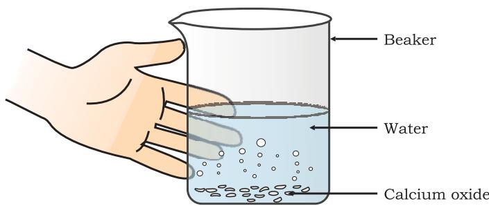  
Figure 1.3 Formation of slaked lime by the reaction of calcium oxide with water

Calcium oxide reacts vigorously with water to produce slaked lime (calcium hydroxide) releasing a large amount of heat.

$$
\mathrm {C a O} (\mathrm {s}) + \mathrm {H} _ {2} \mathrm {O} (\mathrm {l}) \rightarrow \mathrm {C a} (\mathrm {O H}) _ {2} (\mathrm {a q}) + \text {H e a t} \tag {1.13}
$$

(Quick lime) (Slaked lime)

In this reaction, calcium oxide and water combine to form a single product, calcium hydroxide. Such a reaction in which a single product is formed from two or more reactants is known as a combination reaction.

## Do You Know ?

A solution of slaked lime produced by the reaction 1.13 is used for whitewashing walls. Calcium hydroxide reacts slowly with the carbon dioxide in air to form a thin layer of calcium carbonate on the walls. Calcium carbonate is formed after two to three days of whitewashing and gives a shiny finish to the walls. It is interesting to note that the chemical formula for marble is also $\mathrm { C a C O } _ { 3 }$ .

$$
\begin{array}{l}\mathrm {C a (O H)} _ {2} (\mathrm {a q}) + \mathrm {C O} _ {2} (\mathrm {g}) \rightarrow \mathrm {C a C O} _ {3} (\mathrm {s}) + \mathrm {H} _ {2} \mathrm {O} (\mathrm {l})\\(\text {C a l c i u m}) (\text {C a l c i u m})\\\text {h y d r o x i d e}) \quad \text {c a r b o n a t e})\end{array}\tag {1.14}
$$

Let us discuss some more examples of combination reactions.

(I) Burning of coal

$$
\mathrm {C} (\mathrm {s}) + \mathrm {O} _ {2} (\mathrm {g}) \rightarrow \mathrm {C O} _ {2} (\mathrm {g}) \tag {1.15}
$$

(ii) Formation of water from $\mathrm { H } _ { 2 } ( \mathrm { g } )$ and $\mathrm { O } _ { 2 } ( \mathrm { g } )$

$$
2 \mathrm {H} _ {2} (\mathrm {g}) + \mathrm {O} _ {2} (\mathrm {g}) \rightarrow 2 \mathrm {H} _ {2} \mathrm {O} (1) \tag {1.16}
$$

In simple language we can say that when two or more substances (elements or compounds) combine to form a single product, the reactions are called combination reactions.

In Activity 1.4, we also observed that a large amount of heat is evolved. This makes the reaction mixture warm. Reactions in which heat is released along with the formation of products are called exothermic chemical reactions.

Other examples of exothermic reactions are –

(I) Burning of natural gas

$$
\mathrm {C H} _ {4} (\mathrm {g}) + 2 \mathrm {O} _ {2} (\mathrm {g}) \rightarrow \mathrm {C O} _ {2} (\mathrm {g}) + 2 \mathrm {H} _ {2} \mathrm {O} (\mathrm {g}) \tag {1.17}
$$

(ii) Do you know that respiration is an exothermic process?

We all know that we need energy to stay alive. We get this energy from the food we eat. During digestion, food is broken down into simpler substances. For example, rice, potatoes and bread contain carbohydrates. These carbohydrates are broken down to form glucose. This glucose combines with oxygen in the cells of our body and provides energy. The special name of this reaction is respiration, the process of which you will study in Chapter 6.

$$
\begin{array}{l} \begin{array}{l}\mathrm {C} _ {6} \mathrm {H} _ {1 2} \mathrm {O} _ {6} (\mathrm {a q}) + 6 \mathrm {O} _ {2} (\mathrm {a q}) \rightarrow 6 \mathrm {C O} _ {2} (\mathrm {a q}) +\\(\text {G l u c o s e})\end{array} \\ 6 \mathrm {H} _ {2} \mathrm {O} (\mathrm {l}) + \text {e n e r g y} \tag {1.18} \\ \end{array}
$$

(iii) The decomposition of vegetable matter into compost is also an example of an exothermic reaction.

Identify the type of the reaction taking place in Activity 1.1, where heat is given out along with the formation of a single product.

#### 1.2.2 Decomposition Reaction

### Activity 1.5

■ n Take about $2 \textrm { g }$ ferrous sulphate crystals in a dry boiling tube.   
■ Note the colour of the ferrous sulphate crystals.   
■ Heat the boiling tube over the flame of a burner or spirit lamp as shown in Fig. 1.4.   
■ Observe the colour of the crystals after heating.

Have you noticed that the green colour of the ferrous sulphate crystals has changed? You can also smell the characteristic odour of burning sulphur.

$$
\begin{array}{l} 2 \mathrm {F e S O} _ {4} (\mathrm {s}) \xrightarrow {\text {h e a t}} \mathrm {F e} _ {2} \mathrm {O} _ {3} (\mathrm {s}) + \mathrm {S O} _ {2} (\mathrm {g}) + \mathrm {S O} _ {3} (\mathrm {g}) \\ (\text {F e r r o u s s u l p h a t e}) \quad (\text {F e r r i c o x i d e}) \end{array} \tag {1.19}
$$

  
Figure 1.4 Correct way of heating the boiling tube containing crystals of ferroussulphate and of smelling the odour

You will observe the emission of brown fumes. These fumes are of nitrogen dioxide $\left( \mathrm { N O } _ { 2 } \right)$ . The reaction that takes place is –

In this reaction you can observe that a single reactant breaks down to give simpler products. This is a decomposition reaction. Ferrous sulphate crystals $\mathrm { ( F e S O _ { 4 } ) }$ , $7 \mathrm { H } _ { 2 } \mathrm { O } )$ ) lose water when heated and the colour of the crystals changes. It then decomposes to ferric oxide $\left( \mathrm { F e } _ { 2 } \mathrm { O } _ { 3 } \right)$ , sulphur dioxide $( \mathrm { { S O } } _ { 2 } )$ and sulphur trioxide $( \mathrm { { S O } } _ { 3 } )$ . Ferric oxide is a solid, while $\mathrm { S O } _ { 2 }$ and $\mathrm { S O } _ { 3 }$ are gases.

Decomposition of calcium carbonate to calcium oxide and carbon dioxide on heating is an important decomposition reaction used in various industries. Calcium oxide is called lime or quick lime. It has many uses – one is in the manufacture of cement. When a decomposition reaction is carried out by heating, it is called thermal decomposition.

$$
\mathrm {C a C O} _ {3} (\mathrm {s}) \xrightarrow {\text {h e a t}} \mathrm {C a O} (\mathrm {s}) + \mathrm {C O} _ {2} (\mathrm {g}) \tag {1.20}
$$

(Limestone) (Quick lime)

Another example of a thermal decomposition reaction is given in Activity 1.6.

### Activity 1.6

■ Take about $2 \mathrm { g }$ lead nitrate powder in a boiling tube.   
■ Hold the boiling tube with a pair of tongs and heat it over a flame, as shown in Fig. 1.5.   
What do you observe? Note down the change, if any.

$$
\begin{array}{l} 2 \mathrm {P b} (\mathrm {N O} _ {3}) _ {2} (\mathrm {s}) \xrightarrow [ \text {(L e a d n i t r a t e)} ]{\text {h e a t}} 2 \mathrm {P b O} (\mathrm {s}) + 4 \mathrm {N O} _ {2} (\mathrm {g}) + \mathrm {O} _ {2} (\mathrm {g}) \\ \text {(L e a d o x i d e)} \end{array} \tag {1.21}
$$

Let us perform some more decomposition reactions as given in Activities 1.7 and 1.8.

### Activity 1.7

n Take a plastic mug. Drill two holes at its base and fit rubber stoppers in these holes. Insert carbon electrodes in these rubber stoppers as shown in Fig. 1.6.   
■ Connect these electrodes to a 6 volt battery.   
■ Fill the mug with water such that the electrodes are immersed. Add a few drops of dilute sulphuric acid to the water.   
■ Take two test tubes filled with water and invert them over the two carbon electrodes.   
■ Switch on the current and leave the apparatus undisturbed for some time.   
■ You will observe the formation of bubbles at both the electrodes. These bubbles displace water in the test tubes.   
Is the volume of the gas collected the same in both the test tubes?   
■ Once the test tubes are filled with the respective gases, remove them carefully.   
■ Test these gases one by one by bringing a burning candle close to the mouth of the test tubes.

CAUTION: This step must be performed carefully by the teacher.

What happens in each case?   
■ Which gas is present in each test tube?

  
Figure 1.6 Electrolysis of water

### Activity 1.8

Take about 2 g silver chloride in a china dish.   
■ What is its colour?   
■ Place this china dish in sunlight for some time (Fig. 1.7).   
■ Observe the colour of the silver chloride after some time.

  
Figure 1.6 Electrolysis of water

You will see that white silver chloride turns grey in sunlight. This is due to the decomposition of silver chloride into silver and chlorine by light.

$$
2 \mathrm {A g C l} (\mathrm {s}) \stackrel {\text {h e a t}} {\rightarrow} 2 \mathrm {A g} (\mathrm {s}) + \mathrm {C l} _ {2} (\mathrm {g}) \tag {1.22}
$$

Silver bromide also behaves in the same way.

$$
2 \mathrm {A g B r} (\mathrm {s}) \xrightarrow {\text {h e a t}} 2 \mathrm {A g} (\mathrm {s}) + \mathrm {B r} _ {2} (\mathrm {g}) \tag {1.23}
$$

The above reactions are used in black and white photography. What form of energy is causing these decomposition reactions?

We have seen that the decomposition reactions require energy either in the form of heat, light or electricity for breaking down the reactants. Reactions in which energy is absorbed are known as endothermic reactions.

### Carry out the following Activity

Take about $2 \ \mathrm { g }$ barium hydroxide in a test tube. Add $_ { \mathrm { ~ 1 ~ g ~ } }$ of ammonium chloride and mix with the help of a glass rod. Touch the bottom of the test tube with your palm. What do you feel? Is this an exothermic or endothermic reaction?

## QUESTIONS

1. A solution of a substance ‘X’ is used for whitewashing.

(i) Name the substance ‘X’ and write its formula.   
(ii) Write the reaction of the substance ‘X’named in (i) above with water.

2. Why is the amount of gas collected in one of the test tubes in Activity 1.7 double of the amount collected in the other? Name

this gas.

#### 1.2.3 Displacement Reaction

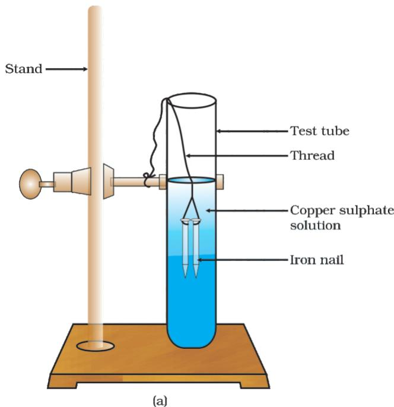  
Figure 1.8   
(a) Iron nails dipped in copper sulphate solution

### Activity 1.9

■ Take three iron nails and clean them by rubbing with sand paper.   
■ Take two test tubes marked as (A) and (B). In each test tube, take about 10 mL copper sulphate solution.   
■ Tie two iron nails with a thread and immerse them carefully in the copper sulphate solution in test tube B for about 20 minutes [Fig. 1.8 (a)]. Keep one iron nail aside for comparison.   
■ After 20 minutes, take out the iron nails from the copper sulphate solution.   
■ Compare the intensity of the blue colour of copper sulphate solutions in test tubes (A) and (B) [Fig. 1.8 (b)].   
■ Also, compare the colour of the iron nails dipped in the copper sulphate solution with the one kept aside [Fig. 1.8 (b)].

  
Figure 1.8 (b) Iron nails and copper sulphate solutions compared before and after the experiment

Why does the iron nail become brownish in colour and the blue colour of copper sulphate solution fades?

The following chemical reaction takes place in this Activity–

$$
\begin{array}{l l l}\mathrm {F e (s)} + \mathrm {C u S O} _ {4} (\mathrm {a q})&\rightarrow \mathrm {F e S O} _ {4} (\mathrm {a q})&+ \mathrm {C u (s)}\\(\text {C o p p e r s u l p h a t e})&(\text {I r o n s u l p h a t e})&(1. 2 4)\end{array}
$$

In this reaction, iron has displaced or removed another element, copper, from copper sulphate s o l u t i o n . T h i s r e a c t i o n i s k n o w n a s displacement reaction.

Other examples of displacement reactions are

$$
\begin{array}{l l l}\mathrm {Z n (s) + C u S O _ {4} (a q)}&\rightarrow \mathrm {Z n S O _ {4} (a q)}&+ \mathrm {C u (s)}\\(\text {C o p p e r s u l p h a t e})&(\text {Z i n c s u l p h a t e})&(1. 2 5)\end{array}
$$

$$
\begin{array}{l}\mathrm {P b (s)} + \mathrm {C u C l} _ {2} (\mathrm {a q}) \rightarrow \mathrm {P b C l} _ {2} (\mathrm {a q}) + \mathrm {C u (s)}\\\text {(C o p p e r c h l o r i d e)} \quad \text {(L e a d c h l o r i d e)}\end{array}\tag {1.26}
$$

Zinc and lead are more reactive elements than copper. They displace copper from its compounds.

#### 1.2.4 Double Displacement Reaction

### Activity 1.10

Take about $3 ~ \mathrm { m L }$ of sodium sulphate solution in a test tube.   
■ In another test tube, take about 3 mL of barium chloride solution.   
■ Mix the two solutions (Fig. 1.9).   
■ What do you observe?

You will observe that a white substance, which is insoluble in water, is formed. This insoluble substance formed is known as a precipitate. Any reaction that produces a precipitate can be called a precipitation reaction.

$$
\begin{array}{c}\mathrm {N a} _ {2} \mathrm {S O} _ {4} (\mathrm {a q}) + \mathrm {B a C l} _ {2} (\mathrm {a q}) \rightarrow \mathrm {B a S O} _ {4} (\mathrm {s}) + 2 \mathrm {N a C l} (\mathrm {a q})\\(\text {S o d i u m} \quad (\text {B a r i u m} \quad (\text {B a r i u m} \quad (\text {S o d i u m} \quad (\text {S o d i u m} \quad (\text {s u p l h a p t e}) \quad (\text {s u p l h a p t e}) \quad (\text {s u p l h a p t e}) \quad (\text {s u p l h a p t e}))\end{array}
$$

  
Figure 1.9 Formation of barium sulphate and sodium chloride

What causes this? The white precipitate of $\mathrm { B a S O _ { 4 } }$ is formed by the reaction of $\mathrm { S O } _ { 4 }$ and $\mathrm { B a } ^ { 2 + }$ . The other product formed is sodium chloride which remains in the solution. Such reactions in which there is an exchange of ions between the reactants are called double displacement reactions.

Recall Activity 1.2: where you have mixed the solutions of lead(II) nitrate and potassium iodide.

(I) What was the colour of the precipitate formed? Can you name the compound precipitated?   
(ii) Write the balanced chemical equation for this reaction.   
(iii) Is this also a double displacement reaction?

#### 1.2.5 Oxidation and Reduction

### Activity 1.11

Heat a china dish containing about 1 g copper powder (Fig. 1.10).   
What do you observe?

The surface of copper powder becomes coated with black copper(II) oxide. Why has this black substance formed?

This is because oxygen is added to copper and copper oxide is formed.

$$
2 \mathrm {C u} + \mathrm {O} 2 \xrightarrow {\text {h e a t}} 2 \mathrm {C u O} \tag {1.28}
$$

If hydrogen gas is passed over this heated material (CuO), the black coating on the surface turns brown as the reverse reaction takes place and copper is obtained.

$$
\mathrm {C u O} + \mathrm {H} _ {2} \xrightarrow {\text {H e a t}} \mathrm {C u} + \mathrm {H} _ {2} \mathrm {O} \tag {1.29}
$$

If a substance gains oxygen during a reaction, it is said to be oxidised. If a substance loses oxygen during a reaction, it is said to be reduced.

During this reaction (1.29), the copper(II) oxide is losing oxygen and is being reduced. The hydrogen is gaining oxygen and is being oxidised. In other words, one reactant gets oxidised while the other gets reduced during a reaction. Such reactions are called oxidationreduction reactions or redox reactions.

$$
\begin{array}{c} \text {O x i d a t i o n} \\ \mathrm {C u O} + \mathrm {H} _ {2} \xrightarrow {\text {H e a t}} \mathrm {C u} + \mathrm {H} _ {2} \mathrm {O} \\ \text {R e d u c t i o n} \end{array} \tag {1.30}
$$

Some other examples of redox reactions are:

$$
\mathrm {Z n O} + \mathrm {C} \rightarrow \mathrm {Z n} + \mathrm {C O} \tag {1.30}
$$

$$
\mathrm {M n O} _ {2} + 4 \mathrm {H C l} \rightarrow \mathrm {M n C l} _ {2} + 2 \mathrm {H} _ {2} \mathrm {O} + \mathrm {C l} _ {2} \tag {1.31}
$$

  
Figure 1.10 Oxidation of copper to copper oxide

In reaction (1.31) carbon is oxidised to CO and $Z _ { \mathrm { { n O } } }$ is reduced to Zn. In reaction (1.32) HCl is oxidised to $\mathrm { C l } _ { 2 }$ whereas $\mathrm { M n O } _ { 2 }$ is reduced to $\mathrm { M n C l } _ { 2 }$ .

From the above examples we can say that if a substance gains oxygen or loses hydrogen during a reaction, it is oxidised. If a substance loses oxygen or gains hydrogen during a reaction, it is reduced.

Recall Activity 1.1: where a magnesium ribbon burns with a dazzling flame in air (oxygen) and changes into a white substance, magnesium oxide. Is magnesium being oxidised or reduced in this reaction?

### 1.3 HAVE YOU OBSERVED THEEFFECTS OFOXIDATION REACTIONSIN EVERYDAYLIFE?

#### 1.3.1 Corrosion

You must have observed that iron articles are shiny when new, but get coated with a reddish brown powder when left for some time. This process is commonly known as rusting of iron. Some other metals also get tarnished in this manner. Have you noticed the colour of the coating formed on copper and silver? When a metal is attacked by substances around it such as moisture, acids, etc., it is said to corrode and this process is called corrosion. The black coating on silver and the green coating on copper are other examples of corrosion.

Corrosion causes damage to car bodies, bridges, iron railings, ships and to all objects made of metals, specially those of iron. Corrosion of iron is a serious problem. Every

year an enormous amount of money is spent to replace damaged iron. You will learn more about corrosion in Chapter 3.

#### 1.3.2 Rancidity

Have you ever tasted or smelt the fat/oil containing food materials left for a long time?

When fats and oils are oxidised, they become rancid and their smell and taste change. Usually s u b s t a n c e s w h i c h p r e v e n t o x i d a t i o n (antioxidants) are added to foods containing fats and oil. Keeping food in air tight containers helps to slow down oxidation. Do you know that chips manufacturers usually flush bags of chips with gas such as nitrogen to prevent the chips from getting oxidised ?

## QUESTIONS

1. Why does the colour of copper sulphate solution change when an iron nail is dipped in it?   
2 . G i v e a n e x a m p l e o f a d o u b l e displacement reaction other than the one given in Activity 1.10.   
3. Identify the substances that are oxidised and the substances that are reduced in the following reactions.

(i) $4 \mathrm { N a ( s ) } + \mathrm { O } _ { 2 } \mathrm { ( g ) } \to 2 \mathrm { N a } _ { 2 } \mathrm { O ( s ) }$   
(ii) $\mathrm { C u O ( s ) } + \mathrm { H } _ { 2 } ( \mathrm { g } )  \mathrm { C u ( s ) } + \mathrm { H } _ { 2 } \mathrm { O ( l ) }$

## What you have learnt

■ A complete chemical equation represents the reactants, products and their physical states symbolically.   
■ Achemical equation is balanced so that the numbers of atoms of each type involved in a chemical reaction are the same on the reactant and product sides of the equation. Equations must always be balanced.   
■ In a combination reaction two or more substances combine to form a new single substance.   
■ Decomposition reactions are opposite to combination reactions. In a decomposition reaction, a single substance decomposes to give two or more substances.   
■ Reactions in which heat is given out along with the products are called exothermic reactions.   
Reactions in which energy is absorbed are known as endothermic reactions.   
■ When an element displaces another element from its compound, a displacement reaction occurs.   
■ Two different atoms or groups of atoms (ions) are exchanged in double displacement reactions.   
■ Precipitation reactions produce insoluble salts.   
■ Reactions also involve the gain or loss of oxygen or hydrogen by substances. Oxidation is the gain of oxygen or loss of hydrogen. Reduction is the loss of oxygen or gain of hydrogen.

## EXERCISES

1. Which of the statements about the reaction below are incorrect?

$$
2 \mathrm {P b O} (\mathrm {s}) + \mathrm {C} (\mathrm {s}) \rightarrow 2 \mathrm {P b} (\mathrm {s}) + \mathrm {C O} _ {2} (\mathrm {g})
$$

(a) Lead is getting reduced.   
(b) Carbon dioxide is getting oxidised.   
(c) Carbon is getting oxidised.   
(d) Lead oxide is getting reduced.

(i) (a) and (b)   
(ii) (a) and (c)   
(iii) (a), (b) and (c)   
(iv) all

2. $\mathrm { F e } _ { 2 } \mathrm { O } _ { 3 } + 2 \mathrm { A l }  \mathrm { A l } _ { 2 } \mathrm { O } _ { 3 } + 2 \mathrm { F e }$

The above reaction is an example of a

(a) combination reaction.   
(b) double displacement reaction.

(c) decomposition reaction.   
(d) displacement reaction.

3. What happens when dilute hydrochloric acid is added to iron fillings? Tick the correct answer.

(a) Hydrogen gas and iron chloride are produced.   
(b) Chlorine gas and iron hydroxide are produced.   
(c) No reaction takes place.   
(d) Iron salt and water are produced.

4. What is a balanced chemical equation? Why should chemical equations be balanced?   
5. Translate the following statements into chemical equations and then balance them.

(a) Hydrogen gas combines with nitrogen to form ammonia.   
(b) Hydrogen sulphide gas burns in air to give water and sulpur dioxide.   
(c) Barium chloride reacts with aluminium sulphate to give aluminium chloride and a precipitate of barium sulphate.   
(d) Potassium metal reacts with water to give potassium hydroxide and hydrogen gas.

6. Balance the following chemical equations.

(a) $\mathrm { H N O _ { 3 } } + \mathrm { C a ( O H ) _ { 2 } }  \mathrm { C a ( N O _ { 3 } ) _ { 2 } } + \mathrm { H _ { 2 } O }$   
(b) $\mathrm { N a O H + H _ { 2 } S O _ { 4 } \mathrm {  N a _ { 2 } S O _ { 4 } + H _ { 2 } O } }$   
(c) $\mathrm { N a C l + A g N O _ { 3 } \mathrm {  A g C l + N a N O _ { 3 } } }$   
(d) $\mathrm { B a C l } _ { 2 } + \mathrm { H } _ { 2 } \mathrm { S O } _ { 4 } {  } \mathrm { B a S O } _ { 4 } + \mathrm { H C l }$

7. Write the balanced chemical equations for the following reactions.

(a) Calcium hydroxide $^ +$ Carbon dioxide Calcium carbonate $^ +$ Water   
(b) Zinc + Silver nitrate Zinc nitrate $^ +$ Silver   
(c) Aluminium $^ +$ Copper chloride Aluminium chloride $^ +$ Copper   
(d) Barium chloride + Potassium sulphate Barium sulphate $^ +$ Potassium chloride

8. Write the balanced chemical equation for the following and identify the type of reaction in each case.

(a) Potassium bromide(aq) + Barium iodide(aq) Potassium iodide(aq) + Barium bromide(s)   
(b) Zinc carbonate(s) Zinc oxide(s) + Carbon dioxide(g)   
(c) Hydrogen(g) + Chlorine(g) ® Hydrogen chloride(g)   
(d) Magnesium(s) + Hydrochloric acid(aq) ® Magnesium chloride(aq) + Hydrogen(g)

9. What does one mean by exothermic and endothermic reactions? Give examples.   
10. Why is respiration considered an exothermic reaction? Explain.   
11. Why are decomposition reactions called the opposite of combination reactions? Write equations for these reactions.   
12. Write one equation each for decomposition reactions where energy is supplied in the form of heat, light or electricity.   
13. What is the difference between displacement and double displacement reactions? Write equations for these reactions.   
14. In the refining of silver, the recovery of silver from silver nitrate solution involved displacement by copper metal. Write down the reaction involved.   
15. What do you mean by a precipitation reaction? Explain by giving examples.   
16. Explain the following in terms of gain or loss of oxygen with two examples each.

(a) Oxidation   
(b) Reduction

17. Ashiny brown coloured element ‘X’on heating in air becomes black in colour. Name the element ‘X’and the black coloured compound formed.   
18. Why do we apply paint on iron articles?   
19. Oil and fat containing food items are flushed with nitrogen. Why?   
20. Explain the following terms with one example each.

(a) Corrosion   
(b) Rancidity

### Group Activity

Perform the following activity.

Take four beakers and label them as A, B, C and D.   
■ Put 25 mL of water in A, B and C beakers and copper sulphate solution in beaker D.   
■ Measure and record the temperature of each liquid contained in the beakers above.   
■ Add two spatulas of potassium sulphate, ammonium nitrate, anhydrous copper sulphate and fine iron fillings to beakers A, B, C and D respectively and stir.   
■ Finally measure and record the temperature of each of the mixture above. Find out which reactions are exothermic and which ones are endothermic in nature.

# Chapter 2
# Acids, Bases and Salts

ou have learnt in your previous classes that the sour and bitter tastes of food are due to acids and bases, respectively, present in them.

If someone in the family is suffering from a problem of acidity after overeating, which of the following would you suggest as a remedy– lemon juice, vinegar or baking soda solution?

■ Which property did you think of while choosing the remedy?   
Surely you must have used your knowledge about the ability of acids and bases to nullify each other’s effect.   
■ Recall how we tested sour and bitter substances without tasting them.

You already know that acids are sour in taste and change the colour of blue litmus to red, whereas, bases are bitter and change the colour of the red litmus to blue. Litmus is a

natural indicator, turmeric is another such indicator. Have you noticed that a stain of curry on a white cloth becomes reddish-brown when soap, which is basic in nature, is scrubbed on it? It turns yellow again when the cloth is washed with plenty of water. You can also use synthetic indicators such as methyl orange and phenolphthalein to test for acids and bases.

In this Chapter, we will study the reactions of acids and bases, how acids and bases cancel out each other’s effects and many more interesting things that we use and see in our day-to-day life.

## Do You Know ?

Litmus solution is a purple dye, which is extracted from lichen, a plant belonging to the division Thallophyta, and is commonly used as an indicator. When the litmus solution is neither acidic nor basic, its colour is purple. There are many other natural materials like red cabbage leaves, turmeric, coloured petals of some flowers such as Hydrangea, Petunia and Geranium, which indicate the presence of acid or base in a solution. These are called acidbase indicators or sometimes simply indicators.

## 

1. You have been provided with three test tubes. One of them contains distilled water and the other two contain an acidic solution and a basic solution, respectively. If you are given only red litmus paper, how will you identify the contents of each test tube?

### 2.1 UNDERSTANDING THE CHEMICALPROPERTIES OFACIDS AND BASES

#### 2.1.1 Acids and Bases in the Laboratory

### Activity 2.1

Collect the following solutions from the science laboratory - hydrochloric acid (HCl), sulphuric acid $\mathrm { ( H } _ { 2 } \mathrm { S O } _ { 4 } )$ nitric acid $\left( \mathrm { H N O } _ { 3 } \right)$ )，acetic acid $( \mathrm { C H } _ { 3 } \mathrm { C O O H } )$ )，sodium hydroxide (NaOH),calcium hydroxide $\left[ \mathrm { C a } ( \mathrm { O H } ) _ { 2 } \right]$ ，potassium hydroxide (KOH),magnesium hydroxide $\mathrm { [ M g ( O H ) _ { 2 } ] }$ , and ammonium hydroxide $\mathrm { ( N H _ { 4 } O H ) }$   
Put a drop of each of the above solutions on a watch-glass one by one and test with a drop of the indicators shown in Table 2.1.   
What change in colour did you observe with red litmus,blue litmus, phenolphthalein and methyl orange solutions for each of the solutions taken?   
Tabulate your observations in Table 2.1.

Table 2.1   
<table><tr><td>Sample solution</td><td>Red litmus solution</td><td>Blue litmus solution</td><td>Phenolph-thalein solution</td><td>Methyl orange solution</td></tr><tr><td></td><td></td><td></td><td></td><td></td></tr></table>

These indicators tell us whether a substance is acidic or basic by change in colour. There are some substances whose odour changes in acidic or basic media. These are called olfactory indicators. Let us try out some of these indicators.

### Activity 2.2

Take some finely chopped onions in a plastic bag along with some strips of clean cloth. Tie up the bag tightly and leave overnight in the fridge. The cloth strips can now be used to test for acids and bases.   
Take two of these cloth strips and check their odour.   
Keep them on a clean surface and put a few drops of dilute HCl solution on one strip and a few drops of dilute NaOH solution on the other.

Rinse both cloth strips with water and again check their odour.   
■ Note your observations.   
■ Now take some dilute vanilla essence and clove oil and check their odour.   
■ Take some dilute HCl solution in one test tube and dilute NaOH solution in another. Add a few drops of dilute vanilla essence to both test tubes and shake well. Check the odour once again and record changes in odour, if any.   
■ Similarly, test the change in the odour of clove oil with dilute HCl and dilute NaOH solutions and record your observations.

Which of these – vanilla, onion and clove, can be used as olfactory indicators on the basis of your observations?

Let us do some more activities to understand the chemical properties of acids and bases.

#### 2.1.2 How do Acids and Bases React with Metals?

### Activity 2.3

CAUTION: teacher's assistance.

■ Set the apparatus as shown in Fig. 2.1.   
■ Take about 5 mL of dilute sulphuric acid ina test tube and add a few pieces of zinc granules to it.   
■ What do you observe on the surface of zinc granules?   
■ Pass the gas being evolved through the soap solution.   
■ Why are bubbles formed in the soap solution?   
■ Take a burning candle near a gas filled bubble.   
What do you observe?   
■ Repeat this Activity with some more acids like HCl $\mathrm { H N O _ { 3 } }$ and $\mathrm { C H _ { 3 } C O O H }$   
■ Are the observations inall the cases the same ordifferent?

  
Figure 2.1 Reaction of zinc granules with dilute sulphuric acid and testing hydrogen gas by burning

Note that the metal in the above reactions displaces hydrogen atoms from the acids as hydrogen gas and forms a compound called a salt. Thus, the reaction of a metal with an acid can be summarised as –

## Acid + Metal Salt + Hydrogen gas

Can you now write the equations for the reactions you have observed?

### Activity 2.4

■ Place a few pieces of granulated zinc metal in a test tube.   
■ Add $2 ~ \textrm { m L }$ of sodium hydroxide solution and warm the contents of the test tube.   
■ Repeat the rest of the steps as in A c t i v i t y 2 . 3 a n d r e c o r d y o u r observations.

The reaction that takes place can be written as follows.

$$
\begin{array}{c}2 \mathrm {N a O H (a q)} + \mathrm {Z n (s)} \rightarrow \mathrm {N a} _ {2} \mathrm {Z n O} _ {2} (\mathrm {s}) + \mathrm {H} _ {2} (\mathrm {g})\\\text {(S o d i u m z i n c a t e)}\end{array}
$$

You find again that hydrogen is formed in the reaction. However, such reactions are not possible with all metals.

#### 2.1.3 How do Metal Carbonates and Metal Hydrogencarbonates React with Acids?

### Activity 2.5

■ Take two test tubes, label them as A and B.   
■ Take about $0 . 5 \ \mathrm { g }$ of sodium carbonate $\left( \mathrm { N a } _ { 2 } \mathrm { C O } _ { 3 } \right)$ in test tube A and about $0 . 5 \mathrm { \textrm { g } }$ of sodium hydrogencarbonate $\left( \mathrm { N a H C O } _ { 3 } \right)$ in test tube B.   
■ Add about $2 \mathrm { m L }$ of dilute HCl to both the test tubes.   
■ What do you observe?   
■ Pass the gas produced in each case t h r o u g h l i m e w a t e r ( c a l c i u m hydroxide solution) as shown in Fig. 2.2 and record your observations.

The reactions occurring in the above Activity are written as –

Test tube A:

$$
\mathrm {N a} _ {2} \mathrm {C O} _ {3} (\mathrm {s}) + 2 \mathrm {H C l} (\mathrm {a q}) \rightarrow 2 \mathrm {N a C l} (\mathrm {a q}) + \mathrm {H} _ {2} \mathrm {O} (\mathrm {l}) + \mathrm {C O} _ {2} (\mathrm {g})
$$

Test tube B:

$$
\mathrm {N a H C O} _ {3} (\mathrm {s}) + \mathrm {H C l} (\mathrm {a q}) \rightarrow \mathrm {N a C l} (\mathrm {a q}) + \mathrm {H} _ {2} \mathrm {O} (\mathrm {l}) + \mathrm {C O} _ {2} (\mathrm {g})
$$

On passing the carbon dioxide gas evolved through lime water,

$$
\mathrm {C a} (\mathrm {O H}) _ {2} (\mathrm {a q}) + \mathrm {C O} _ {2} (\mathrm {g}) \rightarrow \mathrm {C a C O} _ {3} (\mathrm {s}) + \mathrm {H} _ {2} \mathrm {O} (\mathrm {l})
$$

$$
\text {(L i m e w a t e)} \quad \text {(W h i t e p r e c i p i t a t e)}
$$

  
Figure 2.2 Passing carbon dioxide gas through calcium hydroxide solution

On passing excess carbon dioxide the following reaction takes place:

$$
\mathrm {C a C O} _ {3} (\mathrm {s}) + \mathrm {H} _ {2} \mathrm {O} (\mathrm {l}) + \mathrm {C O} _ {2} (\mathrm {g}) \rightarrow \mathrm {C a} \left(\mathrm {H C O} _ {3}\right) _ {2} (\mathrm {a q})
$$

(Soluble in water)

Limestone, chalk and marble are different forms of calcium carbonate. All metal carbonates and hydrogencarbonates react with acids to give a corresponding salt, carbon dioxide and water.

Thus, the reaction can be summarised as –

Metal carbonate/Metal hydrogencarbonate +

Acid Salt + Carbon dioxide $+$ Water

#### 2.1.4 How do Acids and Bases React with each other?

### Activity 2.6

■ Take about $2 \textrm { m L }$ of dilute NaOH solution in a test tube and add two drops of phenolphthalein solution.   
■ What is the colour of the solution?   
■ Add dilute HCl solution to the above solution drop by drop.   
■ Is there any colour change for the reaction mixture?   
■ Why did the colour of phenolphthalein change after the addition of an acid?   
■ Now add a few drops of NaOH to the above mixture.   
■ D o e s t h e p i n k c o l o u r o f phenolphthalein reappear?   
■ Why do you think this has happened?

In the above Activity, we have observed that the ef fect of a base is nullified by an acid and vice-versa. The reaction taking place is written as –

$$
\mathrm {N a O H (a q) + H C l (a q) \rightarrow N a C l (a q) + H _ {2} O (l)}
$$

The reaction between an acid and a base to give a salt and water is known as a neutralisation reaction. In general, a neutralisation reaction can be written as –

$$
\mathrm {B a s e} + \mathrm {A c i d} \rightarrow \mathrm {S a l t} + \mathrm {W a t e r}
$$

#### 2.1.5 Reaction of Metallic Oxides with Acids

### Activity 2.7

■ Take a small amount of copper oxide in a beaker and add dilute hydrochloric acid slowly while stirring.   
■ Note the colour of the solution. What has happened to the copper oxide?

You will notice that the colour of the solution becomes blue-green and the copper oxide dissolves. The blue-green colour of the solution is due to the formation of copper(II) chloride in the reaction. The general reaction between a metal oxide and an acid can be written as –

$$
\text {M e t a l} \rightarrow \text {S a l t} + \text {W a t e r}
$$

now write and balance the equation for the above reaction. Since metallic oxides react with acids to give salts and water, similar to the reaction of a base with an acid, metallic oxides are said to be basic oxides.

#### 2.1.6 Reaction of a Non-metallic Oxide with Base

You saw the reaction between carbon dioxide and calcium hydroxide (lime water) in Activity 2.5. Calcium hydroxide, which is a base, reacts with carbon dioxide to produce a salt and water. Since this is similar to the reaction between a base and an acid, we can conclude that nonmetallic oxides are acidic in nature.

## 

1.Why should curd and sour substances not be kept in brass and copper vessels?   
2. Which gas is usually liberated when an acid reacts with a metal? Illustrate with an example. How will you test for the presence of this gas?   
3. Metal compound A reacts with dilute h y d r o c h l o r i c a c i d t o p r o d u c e effervescence. The gas evolved extinguishes a burning candle. Write a balanced chemical equation for the reaction if one of the compounds formed is calcium chloride.

### 2.2 WHAT DO ALL ACIDS AND ALL BASES HAVE IN COMMON?

In Section 2.1 we have seen that all acids have similar chemical properties. What leads to this similarity in properties? We saw in Activity 2.3 that all acids generate hydrogen gas on reacting with metals, so hydrogen seems to be common to all acids. Let us perform an Activity to investigate whether all compounds containing hydrogen are acidic.

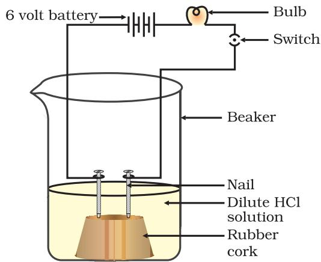  
Figure 2.3 Acid solution in water conducts electricity

### Activity 2.8

■ Take solutions of glucose, alcohol, hydrochloric acid, sulphuric acid, etc.   
Fix two nails on a cork, and place the cork in a 100 mL beaker.   
■ Connect the nails to the two terminals of a 6 volt battery through a bulb and a switch, as shown in Fig. 2.3.   
■ Now pour some dilute HCl in the beaker and switch on the current.   
■ Repeat with dilute sulphuric acid.   
■ What do you observe?   
■ Repeat the experiment separately with glucose and alcohol solutions. What do you observe now?   
■ Does the bulb glow in all cases?

The bulb will start glowing in the case of acids, as shown in Fig. 2.3. But you will observe that glucose and alcohol solutions do not conduct electricity. Glowing of the bulb indicates that there is a flow of electric current through the solution. The electric current is carried through the acidic solution by ions.

Acids contain $\mathrm { H } ^ { + }$ ion as cation and anion such as $\mathrm { C l ^ { - } }$ in HCl, $\mathrm { N O } _ { 3 } ^ { - }$ in $\mathrm { H N O } _ { 3 }$ , $\mathrm { S O } _ { 4 } ^ { - 2 }$ in $\mathrm { H } _ { 2 } \mathrm { S O } _ { 4 }$ , $\mathrm { C H } _ { 3 } \mathrm { C O O } ^ { - }$ in $\mathrm { C H } _ { 3 } \mathrm { C O O H }$ . Since the cation present in acids is $\mathrm { H } ^ { + }$ , this suggests that acids produce hydrogen ions, $\mathrm { H } ^ { + } ( \mathrm { a q } )$ , in solution, which are responsible for their acidic properties.

Repeat the same Activity using alkalis such as sodium hydroxide, calcium hydroxide, etc. What can you conclude from the results of this Activity?

#### 2.2.1 What Happens to an Acid or a Base in a Water Solution?

Do acids produce ions only in aqueous solution? Let us test this.

  
Figure 2.4 Preparation of HCl gas

### Activity 2.9

■ Take about 1g solid NaCl in a clean and dry test tube and set up the apparatus as shown in Fig. 2.4.   
■ Add some concentrated sulphuric acid to the test tube.   
■ What do you observe? Is there a gas coming out of the delivery tube?   
■ Test the gas evolved successively with dry and wet blue litmus paper.   
■ In which case does the litmus paper change colour?   
■ On the basis of the above Activity, what do you infer about the acidic character of:

(i) dry HCl gas   
(ii) HCl solution?

Note to teachers: If the climate is very humid, you will have to pass the gas produced through a guard tube (drying tube) containing calcium chloride to dry the gas.

This experiment suggests that hydrogen ions in HCl are produced in the presence of water. The separation of $\mathrm { H } ^ { + }$ ion from HCl molecules cannot occur in the absence of water.

$$
\mathrm {H C l} + \mathrm {H} _ {2} \mathrm {O} \rightarrow \mathrm {H} _ {3} \mathrm {O} ^ {+} + \mathrm {C l} ^ {-}
$$

Hydrogen ions cannot exist alone, but they exist after combining with water molecules. Thus hydrogen ions must always be shown as $\mathrm { H } ^ { + } ( \mathrm { a q } )$ or hydronium ion $\mathrm { ( H } _ { 3 } \mathrm { O } ^ { + } )$ .

$$
\mathrm {H} ^ {+} + \mathrm {H} _ {2} \mathrm {O} \rightarrow \mathrm {H} _ {3} \mathrm {O} ^ {+}
$$

We have seen that acids give $\mathrm { H } _ { 3 } \mathrm { O } ^ { + }$ or $\mathrm { H } ^ { + } ( \mathrm { a q } )$ ion in water. Let us see what happens when a base is dissolved in water.

$$
\mathrm {N a O H (s)} \stackrel {\mathrm {H} _ {2} \mathrm {O}} {\rightarrow} \mathrm {N a} ^ {+} (\mathrm {a q}) + \mathrm {O H} ^ {-} (\mathrm {a q})
$$

$$
\begin{array}{l} \mathrm {K O H (s)} \xrightarrow {\mathrm {H} _ {2} \mathrm {O}} \mathrm {K} ^ {+} (\mathrm {a q}) + \mathrm {O H} ^ {-} (\mathrm {a q}) \\ \mathrm {M g} (\mathrm {O H}) _ {2} (\mathrm {s}) \xrightarrow {\mathrm {H} _ {2} \mathrm {O}} \mathrm {M g} ^ {2 +} (\mathrm {a q}) + 2 \mathrm {O H} ^ {-} (\mathrm {a q}) \\ \end{array}
$$

– Bases generate hydroxide (OH ) ions in water. Bases which are soluble in water are called alkalis.

## Do You Know ?

All bases do not dissolve in water. An alkali is a base that dissolves in water. They are soapy to touch, bitter and corrosive. Never taste or touch them as they may cause harm. Which of the bases in the Table 2.1 are alkalis?

Now as we have identified that all acids generate $\mathrm { H } ^ { + } ( \mathrm { a q } )$ – and all bases generate OH (aq), we can view the neutralisation reaction as follows –

$$
\mathrm {A c i d} + \mathrm {B a s e} \rightarrow \mathrm {S a l t} + \mathrm {W a t e r}
$$

$$
\mathrm {H} \boxed {\mathrm {X} + \mathrm {M}} \mathrm {O H} \rightarrow \mathrm {M X} + \mathrm {H O H}
$$

$$
\mathrm {H} ^ {+} (\mathrm {a q}) + \mathrm {O H} ^ {-} (\mathrm {a q}) \rightarrow \mathrm {H} _ {2} \mathrm {O} (\mathrm {l})
$$

Let us see what is involved when water is mixed with an acid or a base.

  
Figure 2.5   
Warning sign displayed on containers containing concentrated acids and bases

### Activity 2.10

■ Take 10 mL water in a beaker.   
■ Add a few drops of concentrated $\mathrm { H } _ { 2 } \mathrm { S O } _ { 4 }$ to it and swirl the beaker slowly.   
■ Touch the base of the beaker.   
■ Is there a change in temperature?   
■ Is this an exothermic or endothermic process?   
■ Repeat the above Activity with sodium hydroxide pellets and record your observations.

The process of dissolving an acid or a base in water is a highly exothermic one. Care must be taken while mixing concentrated nitric acid or sulphuric acid with water. The acid must always be added slowly to water with constant stirring. If water is added to a concentrated acid, the heat generated may cause the mixture to splash out and cause burns. The glass container may also break due to excessive local heating. Look out for the warning sign (shown in Fig. 2.5) on the can of concentrated sulphuric acid and on the bottle of sodium hydroxide pellets.

Mixing an acid or base with water results in decrease in the concentration of ions $\mathrm { ( H , O ^ { + } / O H ^ { - } ) }$ per unit volume. Such a process is called dilution and the acid or the base is said to be diluted.

## 

1. Why do HCl, $\mathrm { H N O } _ { 3 }$ , etc., show acidic characters in aqueous solutions while solutions of compounds like alcohol and glucose do not show acidic character?   
2. Why does an aqueous solution of an acid conduct electricity?   
3. Why does dry HCl gas not change the colour of the dry litmus paper?   
4. While diluting an acid, why is it recommended that the acid should be added to water and not water to the acid?   
5. H o w i s t h e c o n c e n t r a t i o n o f hydronium ions $\mathrm { ( H } _ { 3 } \mathrm { O } ^ { + } )$ affected when a solution of an acid is diluted?   
6. How is the concentration of hydroxide –ions (OH ) affected when excess base is dissolved in a solution of sodium hydroxide?

### 2.3 HOW STRONG ARE ACID OR BASE SOLUTIONS?

We know how acid-base indicators can be used to distinguish between an acid and a base. We have also learnt in the previous section about dilution and decrease in concentration of $\mathrm { H } ^ { + }$ or $\mathrm { O H } ^ { - }$ ions in solutions. Can we quantitatively find the amount of these ions present in a solution? Can we judge how strong a given acid or base is?

We can do this by making use of a universal indicator, which is a mixture of several indicators. The universal indicator shows different colours at different concentrations of hydrogen ions in a solution.

A scale for measuring hydrogen ion concentration in a solution, called pH scale has been developed. The p in pH stands for ‘potenz’ in German, meaning power. On the pH scale we can measure pH generally from 0 (very acidic) to 14 (very alkaline). pH should be thought of simply as a number which indicates the acidic or basic nature of a solution. Higher the hydronium ion concentration, lower is the pH value.

The pH of a neutral solution is 7. Values less than 7 on the pH scale represent an acidic solution. As the pH value increases from 7 to 14, it represents an increase in $\mathrm { O H } ^ { - }$ ion concentration in the solution, that is, increase in the strength of alkali (Fig. 2.6). Generally paper impregnated with the universal indicator is used for measuring pH.

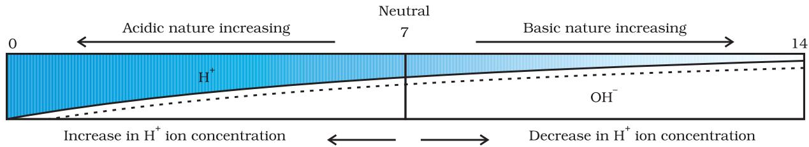  
Figure 2.6 + –Variation of pH with the change in concentration of H (aq) and OH (aq) ions

### Activity 2.11

■ Test the pH values of solutions given in Table 2.2.   
■ Record your observations.   
■ What is the nature of each substance on the basis of your observations?

Table 2.2 
  
<table><tr><td>S. No.</td><td>Solution</td><td>Colour of pH paper</td><td>Approx- -imate pH value</td><td>Nature of substance</td></tr><tr><td>1</td><td>Saliva (before meal)</td><td></td><td></td><td></td></tr><tr><td>2</td><td>Saliva (after meal)</td><td></td><td></td><td></td></tr><tr><td>3</td><td>Lemon juice</td><td></td><td></td><td></td></tr><tr><td>4</td><td>Colourless aerated drink</td><td></td><td></td><td></td></tr><tr><td>5</td><td>Carrot juice</td><td></td><td></td><td></td></tr><tr><td>6</td><td>Coffee</td><td></td><td></td><td></td></tr><tr><td>7</td><td>Tomato juice</td><td></td><td></td><td></td></tr><tr><td>8</td><td>Tap water</td><td></td><td></td><td></td></tr><tr><td>9</td><td>1M NaOH</td><td></td><td></td><td></td></tr><tr><td>10</td><td>1M HCl</td><td></td><td></td><td></td></tr></table>

  
Figure 2.7 pH of some common substances shown on a pH paper (colours are only a rough guide)

The strength of acids and bases depends on the number of $\mathrm { H } ^ { + }$ – ions and OH ions produced, respectively. If we take hydrochloric acid and acetic acid of the same concentration, say one molar, then these produce different amounts of hydrogen ions. Acids that give rise to more $\mathrm { H } ^ { + }$ ions are said to be strong acids, and acids that give less $\mathrm { H } ^ { + }$ ions are said to be weak acids. Can you now say what weak and strong bases are?

#### 2.3.1 Importance of pH in Everyday Life Are plants and animals pH sensitive?

Our body works within the pH range of 7.0 to 7.8. Living organisms can survive only in a narrow range of pH change. When pH of rain water is less than 5.6, it is called acid rain. When acid rain flows into the rivers, it lowers the pH of the river water. The survival of aquatic life in such rivers becomes difficult.

## Do You Know ?

## Acids in other planets

The atmosphere of venus is made up of thick white and yellowish clouds of sulphuric acid. Do you think life can exist on this planet?

## What is the pH of the soil in your backyard?

Plants require a specific pH range for their healthy growth. To find out the pH required for the healthy growth of a plant, you can collect the soil from various places and check the pH in the manner described below in Activity 2.12. Also, you can note down which plants are growing in the region from which you have collected the soil.

### Activity 2.12

■ Put about 2 g soil in a test tube and add 5 mL water to it.   
■ Shake the contents of the test tube.   
■ Filter the contents and collect the filtrate in a test tube.   
■ Check the pH of this filtrate with the help of universal indicator paper.   
■ What can you conclude about the ideal soil pH for the growth of plants in your region?

## pH in our digestive system

It is very interesting to note that our stomach produces hydrochloric acid. It helps in the digestion of food without harming the stomach. During indigestion the stomach produces too much acid and this causes pain and irritation. To get rid of this pain, people use bases called antacids. One such remedy must have been suggested by you at the beginning of this Chapter. These antacids neutralise the excess acid. Magnesium hydroxide (Milk of magnesia), a mild base, is often used for this purpose.

## pH change as the cause of tooth decay

Tooth decay starts when the pH of the mouth is lower than 5.5. Tooth enamel, made up of calcium hydroxyapatite (a crystalline form of calcium phosphate) is the hardest substance in the body. It does not dissolve in water, but is corroded when the pH in the mouth is below 5.5. Bacteria present in the mouth produce acids by degradation of sugar and food particles remaining in the mouth after eating. The best way to prevent this is to clean the mouth after eating food. Using toothpastes, which are generally basic, for cleaning the teeth can neutralise the excess acid and prevent tooth decay.

## Self defence by animals and plants through chemical warfare

Have you ever been stung by a honeybee? Bee-sting leaves an acid which causes pain and irritation. Use of a mild base like baking soda on the stung area gives relief. Stinging hair of nettle leaves inject methanoic acid causing burning pain.

## Do You Know ?

## Nature provides neutralisation options

Nettle is a herbaceous plant which grows in the wild. Its leaves have stinging hair, which cause painful stings when touched accidentally. This is due to the methanoic acid secreted by

them. A traditional remedy is rubbing the area with the leaf of the dock plant, which often grows beside the nettle in the wild. Can you guess the nature of the dock plant? So next time you know what to look out for if you accidentally touch a nettle plant while trekking. Are you aware of any other effective traditional remedies for such stings?

Table 2.3 Some naturally occurring acids   

<table><tr><td>Natural source</td><td>Acid</td><td>Natural source</td><td>Acid</td></tr><tr><td>Vinegar</td><td>Acetic acid</td><td>Sour milk (Curd)</td><td>Lactic acid</td></tr><tr><td>Orange</td><td>Citric acid</td><td>Lemon</td><td>Citric acid</td></tr><tr><td>Tamarind</td><td>Tartaric acid</td><td>Ant sting</td><td>Methanoic acid</td></tr><tr><td>Tomato</td><td>Oxalic acid</td><td>Nettle sting</td><td>Methanoic acid</td></tr></table>

## 

1. You have two solutions, A and B. The pH of solution A is 6 and pH of solution B is 8. Which solution has more hydrogen ion concentration? Which of this is acidic and which one is basic?   
+2. What effect does the concentration of H (aq) ions have on the nature of the solution?   
3. Do basic solutions also have $\mathrm { H } ^ { + } ( \mathrm { a q } )$ ions? If yes, then why are these basic?   
4. Under what soil condition do you think a farmer would treat the soil of his fields with quick lime (calcium oxide) or slaked lime (calcium hydroxide) or chalk (calcium carbonate)?

### 2.4 MORE ABOUT SALTS

In the previous sections we have seen the formation of salts during various reactions. Let us understand more about their preparation, properties and uses.

#### 2.4.1 Family of Salts

### Activity 2.13

■ Write the chemical formulae of the salts given below. Potassium sulphate, sodium sulphate, calcium sulphate, magnesium sulphate, copper sulphate, sodium chloride, sodium nitrate, sodium carbonate and ammonium chloride.

Identify the acids and bases from which the above salts may be obtained.   
■ Salts having the same positive or negative radicals are said to belong to a family. For example, NaCl and $\mathrm { N a } _ { 2 } \mathrm { S O } _ { 4 }$ belong to the family of sodium salts. Similarly, NaCl and KCl belong to the family of chloride salts. How many families can you identify among the salts given in this Activity?

#### 2.4.2 pH of Salts

### Activity 2.14

■ Collect the following salt samples – sodium chloride, potassium nitrate, aluminium chloride, zinc sulphate, copper sulphate, sodium acetate, sodium carbonate and sodium hydrogencarbonate (some other salts available can also be taken).   
Check their solubility in water (use distilled water only).   
■ Check the action of these solutions on litmus and find the pH using a pH paper.   
Which of the salts are acidic, basic or neutral?   
Identify the acid or base used to form the salt.   
Report your observations in Table 2.4.

Salts of a strong acid and a strong base are neutral with pH value of 7. On the other hand, salts of a strong acid and weak base are acidic with pH value less than 7 and those of a strong base and weak acid are basic in nature, with pH value more than 7.

Table 2.4   

<table><tr><td>Salt</td><td>pH</td><td>Acid used</td><td>Base used</td></tr><tr><td></td><td></td><td></td><td></td></tr></table>

#### 2.4.3 Chemicals from Common Salt

By now you have learnt that the salt formed by the combination of hydrochloric acid and sodium hydroxide solution is called sodium chloride. This is the salt that you use in food. You must have observed in the above Activity that it is a neutral salt.

Seawater contains many salts dissolved in it. Sodium chloride is separated from these salts. Deposits of solid salt are also found in several parts of the world. These large crystals are often brown due to impurities. This is called rock salt. Beds of rock salt were formed when seas of bygone ages dried up. Rock salt is mined like coal.

You must have heard about Mahatma Gandhi’s Dandi March. Did you know that sodium chloride was such an important symbol in our struggle for freedom?

## Common salt — A raw material for chemicals

The common salt thus obtained is an important raw material for various materials of daily use, such as sodium hydroxide, baking soda, washing soda, bleaching powder and many more. Let us see how one substance is used for making all these different substances.

## Sodium hydroxide

When electricity is passed through an aqueous solution of sodium chloride (called brine), it decomposes to form sodium hydroxide. The process is called the chlor-alkali process because of the products formed– chlor for chlorine and alkali for sodium hydroxide.

$$
2 \mathrm {N a C l} (\mathrm {a q}) + 2 \mathrm {H} _ {2} \mathrm {O} (\mathrm {l}) \rightarrow 2 \mathrm {N a O H} (\mathrm {a q}) + \mathrm {C l} _ {2} (\mathrm {g}) + \mathrm {H} _ {2} (\mathrm {g})
$$

Chlorine gas is given off at the anode, and hydrogen gas at the cathode. Sodium hydroxide solution is formed near the cathode. The three products produced in this process are all useful. Figure 2.8 shows the different uses of these products.

## Bleaching powder

You have already come to know that chlorine is produced during the electrolysis of aqueous sodium chloride (brine). This chlorine gas is used for the manufacture of bleaching powder. Bleaching powder is produced by the action of chlorine on dry slaked lime $\left[ \mathrm { C a } ( \mathrm { O H } ) _ { 2 } \right]$ . Bleaching powder is represented as $\mathrm { C a O C l } _ { 2 }$ , though the actual composition is quite complex.

$$
\mathrm {C a} (\mathrm {O H}) _ {2} + \mathrm {C l} _ {2} \rightarrow \mathrm {C a O C l} _ {2} + \mathrm {H} _ {2} \mathrm {O}
$$

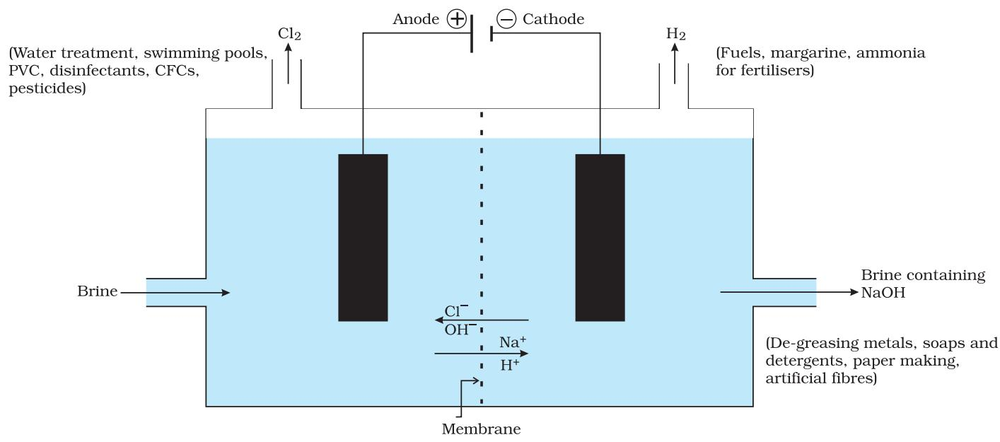  
Figure 2.8 Important products from the chlor-alkali process

## Bleaching powder is used –

(i) for bleaching cotton and linen in the textile industry, for bleaching wood pulp in paper factories and for bleaching washed clothes in laundry;   
(ii) as an oxidising agent in many chemical industries; and   
(iii) to make drinking water free from germs.

## Baking soda

The baking soda is commonly used in the kitchen for making tasty crispy pakoras, etc. Sometimes it is added for faster cooking. The chemical name of the compound is sodium hydrogencarbonate $\left( \mathrm { N a H C O } _ { 3 } \right)$ . It is produced using sodium chloride as one of the raw materials.

$$
\mathrm {N a C l} + \mathrm {H} _ {2} \mathrm {O} + \mathrm {C O} _ {2} + \mathrm {N H} _ {3} \rightarrow \mathrm {N H} _ {4} \mathrm {C l} + \mathrm {N a H C O} _ {3}
$$

Did you check the pH of sodium hydrogencarbonate in Activity 2.14? Can you correlate why it can be used to neutralise an acid? It is a mild non-corrosive basic salt. The following reaction takes place when it is heated during cooking –

$$
\begin{array}{c} 2 \mathrm {N a H C O} _ {3} \xrightarrow {\text {H e a t}} \mathrm {N a} _ {2} \mathrm {C O} _ {3} + \mathrm {H} _ {2} \mathrm {O} + \mathrm {C O} _ {2} \\ (\text {S o d i u m} \\ \text {h y d r o g e n c a r b o n a t e}) \end{array}
$$

Sodium hydrogencarbonate has got various uses in the household.

## Uses of Baking soda

(i) For making baking powder, which is a m i x t u r e o f b a k i n g s o d a ( s o d i u m hydrogencarbonate) and a mild edible acid such as tartaric acid. When baking powder is heated or mixed in water, the following reaction takes place –

$\mathrm { N a H C O _ { 3 } + H ^ { + } {  } C O _ { 2 } + H _ { 2 } O + S }$ odiumsaltofacid (From any acid)

Carbon dioxide produced during the reaction can cause bread or cake to rise making them soft and spongy.

(ii) Sodium hydrogencarbonate is also an ingredient in antacids. Being alkaline, it neutralises excess acid in the stomach and provides relief.   
(iii) It is also used in soda-acid fire extinguishers.

## Washing soda

Another chemical that can be obtained from sodium chloride is $\mathrm { N a } _ { 2 } \mathrm { C O } _ { 3 } . 1 0 \mathrm { H } _ { 2 } \mathrm { O }$ (washing soda). You have seen above that sodium carbonate can be obtained by heating baking soda; recrystallisation of sodium carbonate gives washing soda. It is also a basic salt.

$$
\begin{array}{l}\mathrm {N a} _ {2} \mathrm {C O} _ {3} + 1 0 \mathrm {H} _ {2} \mathrm {O} \rightarrow \mathrm {N a} _ {2} \mathrm {C O} _ {3}. 1 0 \mathrm {H} _ {2} \mathrm {O}\\(\text {S o d i u m}\\\text {c a r b o n a t e})\end{array}
$$

What does $1 0 \mathrm { H } _ { 2 } \mathrm { O }$ signify? Does it make $\mathrm { N a } _ { 2 } \mathrm { C O } _ { 3 }$ wet? We will address this question in the next section.

S o d i u m c a r b o n a t e a n d s o d i u m hydrogencarbonate are useful chemicals for many industrial processes as well.

## Uses of washing soda

(i) Sodium carbonate (washing soda) is used in glass, soap and paper industries.   
(ii) It is used in the manufacture of sodium compounds such as borax.   
(iii) Sodium carbonate can be used as a cleaning agent for domestic purposes.   
(iv) It is used for removing permanent hardness of water.

#### 2.4.4 Are the Crystals of Salts really Dry?

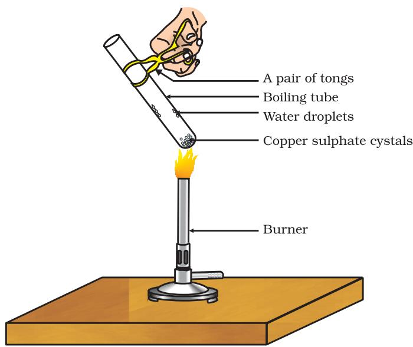  
Figure 2.9 Removing water of crystallisation

### Activity 2.15

■ Heat a few crystals of copper sulphate in a dry boiling tube.   
■ What is the colour of the copper sulphate after heating?   
■ Do you notice water droplets in the boiling tube? Where have these come from?   
■ Add 2-3 drops of water on the sample of copper sulphate obtained after heating.   
■ What do you observe? Is the blue colour of copper sulphate restored?

Copper sulphate crystals which seem to be dry contain water of crystallisation. When we heat the crystals, this water is removed and the salt turns white.

If you moisten the crystals again with water, you will find that blue colour of the crystals reappears.

Water of crystallisation is the fixed number of water molecules present in one formula unit of a salt. Five water molecules are present in one formula unit of copper sulphate. Chemical formula for hydrated copper sulphate is $\mathrm { C u S O _ { 4 } }$ . $5 \mathrm { H } _ { 2 } \mathrm { O }$ . Now you would be able to answer the q u e s t i o n w h e t h e r t h e m o l e c u l e o f $\mathrm { N a } _ { 2 } \mathrm { C O } _ { 3 } . 1 0 \mathrm { H } _ { 2 } \mathrm { O }$ is wet.

One other salt, which possesses water of crystallisation is gypsum. It has two water molecules as water of cyrstallisation. It has the chemical formula $\mathrm { C a S O } _ { 4 } { . } 2 \mathrm { H } _ { 2 } \mathrm { O }$ . Let us look into the use of this salt.

## Plaster of Paris

On heating gypsum at $3 7 3 \mathrm { ~ K ~ }$ , it loses water molecules and becomes calcium sulphate hemihydrate $\mathrm { ( C a S O _ { 4 } \frac { 1 } { 2 } . 2 H _ { 2 } O ) }$ . This is called Plaster of

Paris, the substance which doctors use as plaster for supporting fractured bones in the right position. Plaster of Paris is a white powder and on mixing with water, it changes to gypsum once again giving a hard solid mass.

$$
\mathrm {C a S O} _ {4}. \frac {1}{2} \mathrm {H} _ {2} \mathrm {O} + 1 \frac {1}{2} \mathrm {H} _ {2} \mathrm {O} \rightarrow \mathrm {C a S O} _ {4}. 2 \mathrm {H} _ {2} \mathrm {O}
$$

(Plaster of Paris) Gypsum)(

Note that only half a water molecule is shown to be attached as water of crystallisation. How can you get half a water molecule? It is written in this form because two formula units of $\mathrm { C a S O _ { 4 } }$ share one molecule of water. Plaster of Paris is used for making toys, materials for decoration and for making surfaces smooth. Try to find out why is calcium sulphate hemihydrate called ‘Plaster of Paris’?

## 

1. What is the common name of the compound $\mathrm { C a O C l } _ { 2 }$ ?   
2. Name the substance which on treatment with chlorine yields bleaching powder.   
3. Name the sodium compound which is used for softening hard water.   
4. What will happen if a solution of sodium hydrocarbonate is heated?

Give the equation of the reaction involved.

5. Write an equation to show the reaction between Plaster of Paris and water.

## What you have learnt

■ Acid-base indicators are dyes or mixtures of dyes which are used to indicate the presence of acids and bases.   
■ Acidic nature of a substance is due to the formation of $\mathrm { H } ^ { + } ( \mathrm { a q } )$ ions in solution. –Formation of OH (aq) ions in solution is responsible for the basic nature of a substance.   
■ When an acid reacts with a metal, hydrogen gas is evolved and a corresponding salt is formed.   
■ When a base reacts with a metal, along with the evolution of hydrogen gas a salt is formed which has a negative ion composed of the metal and oxygen.   
■ When an acid reacts with a metal carbonate or metal hydrogencarbonate, it gives the corresponding salt, carbon dioxide gas and water.

■ Acidic and basic solutions in water conduct electricity because they produce hydrogen and hydroxide ions respectively.   
■ The strength of an acid or an alkali can be tested by using a scale called the pH scale (0- 14) which gives the measure of hydrogen ion concentration in a solution.   
■ A neutral solution has a pH of exactly 7, while an acidic solution has a pH less than 7 and a basic solution a pH more than 7.   
■ Living beings carry out their metabolic activities within an optimal pH range.   
■ Mixing concentrated acids or bases with water is a highly exothermic process.   
■ Acids and bases neutralise each other to form corresponding salts and water.   
■ Water of crystallisation is the fixed number of water molecules present in one formula unit of a salt.   
Salts have various uses in everyday life and in industries.

## ExERCISES

1. A solution turns red litmus blue, its pH is likely to be

(a) 1

(d) 10

2. A solution reacts with crushed egg-shells to give a gas that turns lime-water milky. The solution contains

(a) NaCl

(b) HCl

(c) LiCl

(d) KCl

3. 10 mL of a solution of NaOH is found to be completely neutralised by 8 mL of a given solution of HCl. If we take $2 0 ~ \mathrm { m L }$ of the same solution of NaOH, the amount HCl solution (the same solution as before) required to neutralise it will be

(a) 4 mL

(b) 8 mL

(c) 12 mL

(d) 16 mL

4. Which one of the following types of medicines is used for treating indigestion?

(a) Antibiotic   
(b) Analgesic   
(c) Antacid   
(d) Antiseptic

5. Write word equations and then balanced equations for the reaction taking place when –

(a) dilute sulphuric acid reacts with zinc granules.   
(b) dilute hydrochloric acid reacts with magnesium ribbon.   
(c) dilute sulphuric acid reacts with aluminium powder.   
(d) dilute hydrochloric acid reacts with iron filings.

6. Compounds such as alcohols and glucose also contain hydrogen but are not categorised as acids. Describe an Activity to prove it.   
7. Why does distilled water not conduct electricity, whereas rain water does?

8. Why do acids not show acidic behaviour in the absence of water?   
9. Five solutions A,B,C,D and E when tested with universal indicator showed pH as 4,1,11,7 and 9, respectively. Which solution is

(a) neutral?   
(b) strongly alkaline?   
(c) strongly acidic?   
(d) weakly acidic?   
(e) weakly alkaline?

Arrange the pH in increasing order of hydrogen-ion concentration.

10. Equal lengths of magnesium ribbons are taken in test tubes Aand B. Hydrochloric acid (HCl) is added to test tube A, while acetic acid $\mathrm { ( C H _ { 3 } C O O H ) }$ is added to test tube B. Amount and concentration taken for both the acids are same. In which test tube will the fizzing occur more vigorously and why?   
11. Fresh milk has a pH of 6. How do you think the pH will change as it turns into curd? Explain your answer.   
12. Amilkman adds a very small amount of baking soda to fresh milk.

(a) Why does he shift the pH of the fresh milk from 6 to slightly alkaline?   
(b) Why does this milk take a long time to set as curd?

13. Plaster of Paris should be stored in a moisture-proof container. Explain why?   
14. What is a neutralisation reaction? Give two examples.   
15. Give two important uses of washing soda and baking soda.

### Group Activity

## (I) Prepare your own indicator

■ Crush beetroot in a mortar.   
■ Add sufficient water to obtain the extract.   
Filter the extract by the procedure learnt by you in earlier classes.   
■ Collect the filtrate to test the substances you may have tasted earlier.   
■ Arrange four test tubes in a test tube stand and label them as A,B,C and D. Pour 2 mL each of lemon juice solution, soda-water, vinegar and baking soda solution in them respectively.   
■ Put 2-3 drops of the beetroot extract in each test tube and note the colour change if any. Write your observation in a Table.   
■ You can prepare indicators by using other natural materials like extracts of red cabbage leaves, coloured petals of some flowers such as Petunia, Hydrangea and Geranium.

## (II) Preparing a soda-acid fire extinguisher

■ The reaction of acids with metal hydrogencarbonates is used in the fire extinguishers which produce carbon dioxide.   
■ Take 20 mLof sodium hydrogencarbonate $\left( \mathrm { N a H C O } _ { 3 } \right)$ ) solution in a wash-bottle.   
■ Suspend an ignition tube containing dilute sulphuric acid in the wash-bottle (Fig. 2.10).   
Close the mouth of the wash-bottle.   
■ Tilt the wash-bottle so that the acid from the ignition tube mixes with the sodium hydrogencarbonate solution below.   
■ You will notice discharge coming out of the nozzle.   
Direct this discharge on a burning candle. What happens?

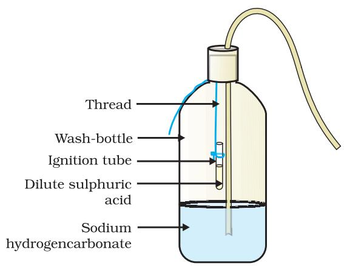

  
Figure 2.10 (a) Ignition tube containing dilute sulphuric acid suspended in a wash-bottle containing sodium hydrogencarbonate, (b) Discharge coming out of the nozzle

# Chapter 3
# Metals and Non-metals

n Class IX you have learnt about various Ielements. You have seen that elements can be classified as metals or non-metals on the basis of their properties.

• Think of some uses of metals and non-metals in your daily life.   
• What properties did you think of while categorising elements as metals or nonmetals?   
• How are these properties related to the uses of these elements? Let us look at some of these properties in detail.

### 3.1 PHYSICALPROPERTIES

#### 3.1.1 Metals

The easiest way to start grouping substances is by comparing their physical properties. Let us study this with the help of the following activities. For performing Activities 3.1 to 3.6, collect the samples of following metals – iron, copper, aluminium, magnesium, sodium, lead, zinc and any other metal that is easily available.

### Activity 3.1

■ Take samples of iron, copper, aluminium and magnesium. Note the appearance of each sample.   
■ Clean the surface of each sample by rubbing them with sand paper and note their appearance again.

Metals, in their pure state, have a shining surface. This property is called metallic lustre.

### Activity 3.2

■ Take small pieces of iron, copper, aluminium, and magnesium. Try to cut these metals with a sharp knife and note your observations.   
■ Hold a piece of sodium metal with a pair of tongs.

CAUTION: Always handle sodium metal with care. Dry it by pressing between the folds of a filter paper.

■ Put it on a watch-glass and try to cut it with a knife.   
What do you observe?

You will find that metals are generally hard. The hardness varies from metal to metal.

### Activity 3.3

■ Take pieces of iron, zinc, lead and copper.   
■ Place any one metal on a block of iron and strike it four or five times with a hammer. What do you observe?   
Repeat with other metals.   
■ Record the change in the shape of these metals.

You will find that some metals can be beaten into thin sheets. This property is called malleability. Did you know that gold and silver are the most malleable metals?

### Activity 3.4

■ List the metals whose wires you have seen in daily life.

The ability of metals to be drawn into thin wires is called ductility. Gold is the most ductile metal. You will be surprised to know that a wire of about $2 ~ \mathrm { k m }$ length can be drawn from one gram of gold.

It is because of their malleability and ductility that metals can be given different shapes according to our needs.

Can you name some metals that are used for making cooking vessels? Do you know why these metals are used for making vessels? Let us do the following Activity to find out the answer.

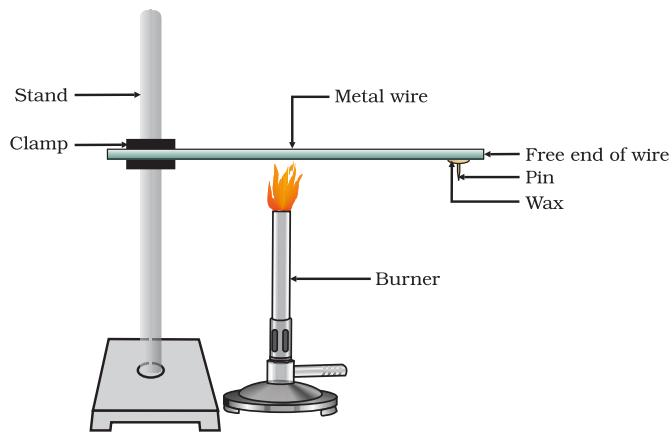  
Figure 3.1 Metals are good conductors of heat.

### Activity 3.5

■ Take an aluminium or copper wire. Clamp this wire on a stand, as shown in Fig. 3.1.   
■ Fix a pin to the free end of the wire using wax.   
■ Heat the wire with a spirit lamp, candle or a burner near the place where it is clamped.   
■ What do you observe after some time?   
■ Note your observations. Does the metal wire melt?

The above activity shows that metals are good conductors of heat and have high melting points. The best conductors of heat are silver a n d c o p p e r. L e a d a n d m e r c u r y a r e comparatively poor conductors of heat.

Do metals also conduct electricity? Let us find out.

### Activity 3.6

■ Set up an electric circuit as shown in Fig. 3.2.   
■ Place the metal to be tested in the circuit between terminals Aand B as shown.   
■ Does the bulb glow? What does this indicate?

  
Figure 3.2 Metals are good conductors of electricity.

You must have seen that the wires that carry current in your homes have a coating of polyvinylchloride (PVC) or a rubber-like material. Why are electric wires coated with such substances?

What happens when metals strike a hard surface? Do they produce a sound? The metals that produce a sound on striking a hard surface are said to be sonorous. Can you now say why school bells are made of metals?

#### 3.1.2 Non-metals

In the previous Class you have learnt that there are very few non-metals as compared to metals. Some of the examples of non-metals are carbon, sulphur, iodine, oxygen, hydrogen, etc. The non-metals are either solids or gases except bromine which is a liquid.

Do non-metals also have physical properties similar to that of metals? Let us find out.

### Activity 3.7

■ Collect samples of carbon (coal or graphite), sulphur and iodine.   
■ Carry out the Activities 3.1 to 3.4 and 3.6 with these non-metals and record your observations.

Compile your observations regarding metals and non-metals in Table 3.1.

<table><tr><td>Element</td><td>Symbol</td><td>Type of surface</td><td>Hardness</td><td>Malleability</td><td>Ductility</td><td>Conducts Electricity</td><td>Sonority</td></tr><tr><td></td><td></td><td></td><td></td><td></td><td></td><td></td><td></td></tr></table>

On the bases of the observations recorded in Table 3.1, discuss the general physical properties of metals and non-metals in the class. You must have concluded that we cannot group elements according to their physical properties alone, as there are many exceptions. For example –

(i) All metals except mercury exist as solids at room temperature.

In Activity 3.5, you have observed that metals have high melting points but gallium and caesium have very low melting points. These two metals will melt if you keep them on your palm.

(ii) Iodine is a non-metal but it is lustrous.   
(iii) Carbon is a non-metal that can exist in different forms. Each form is called an allotrope. Diamond, an allotrope of carbon, is the hardest natural substance known and has a very high melting and boiling point. Graphite, another allotrope of carbon, is a conductor of electricity.   
(iv) Alkali metals (lithium, sodium,

potassium) are so soft that they can be cut with a knife. They have low densities and low melting points.

Elements can be more clearly classified as metals and non-metals

### Activity 3.8

■ Take a magnesium ribbon and some sulphur powder.   
■ Burn the magnesium ribbon. Collect the ashes formed and dissolve them in water.   
■ Test the resultant solution with both red and blue litmus paper.   
■ Is the product formed on burning magnesium acidic or basic?   
■ Now burn sulphur powder. Place a test tube over the burning sulphur to collect the fumes produced.   
■ Add some water to the above test tube and shake.

■ Test this solution with blue and red litmus paper.   
■ Is the product formed on burning sulphur acidic or basic?   
■ Can you write equations for these reactions?

Most non-metals produce acidic oxides when dissolve in water. On the other hand, most metals, give rise to basic oxides. You will be learning more about these metal oxides in the next section.

## 

1. Give an example of a metal which (i) is a liquid at room temperature.   
(ii) can be easily cut with a knife.   
(iii) is the best conductor of heat.   
(iv) is a poor conductor of heat.

2. Explain the meanings of malleable and ductile.

### 3.2 CHEMICAL PROPERTIES OF METALS

We will learn about the chemical properties of metals in the following Sections 3.2.1 to 3.2.4. For this, collect the samples of following metals – aluminium, copper, iron, lead, magnesium, zinc and sodium.

#### 3.2.1 What happens when Metals are burnt in Air?

You have seen in Activity 3.8 that magnesium burns in air with a dazzling white flame. Do all metals react in the same manner? Let us check by performing the following Activity.

### Activity 3.9

■ CAUTION: The following activity needs the teacher’s assistance. It would be better if students wear eye protection.   
■ Hold any of the samples taken above with a pair of tongs and try burning over a flame. Repeat with the other metal samples.   
■ Collect the product if formed.   
■ Let the products and the metal surface cool down.   
Which metals burn easily?   
■ What flame colour did you observe when the metal burnt?   
■ How does the metal surface appear after burning?   
■ Arrange the metals in the decreasing order of their reactivity towards oxygen.   
Are the products soluble in water?

Almost all metals combine with oxygen to form metal oxides.

$$
\mathrm {M e t a l} + \mathrm {O x y g e n} \rightarrow \mathrm {M e t a l} \text {o x i d e}
$$

For example, when copper is heated in air, it combines with oxygen to form copper(II) oxide, a black oxide.

$$
2 \mathrm {C u} + \mathrm {O} _ {2} \rightarrow 2 \mathrm {C u O}
$$

(Copper) (Copper(II) oxide)

Similarly, aluminium forms aluminium oxide.

$$
4 \mathrm {A l} + 3 \mathrm {O} _ {2} \rightarrow 2 \mathrm {A l} _ {2} \mathrm {O} _ {3}
$$

(Aluminium) (Aluminium oxide)

Recall from Chapter 2, how copper oxide reacts with hydrochloric acid. We have learnt that metal oxides are basic in nature. But some metal oxides, such as aluminium oxide, zinc oxide show both acidic as well as basic

behaviour. Such metal oxides which react with both acids as well as bases to produce salts and water are known as amphoteric oxides. Aluminium oxide reacts in the following manner with acids and bases –

$$
\begin{array}{l} \mathrm {A l} _ {2} \mathrm {O} _ {3} + 6 \mathrm {H C l} \rightarrow 2 \mathrm {A l C l} _ {3} + 3 \mathrm {H} _ {2} \mathrm {O} \\ \mathrm {A l} _ {2} \mathrm {O} _ {3} + 2 \mathrm {N a O H} \rightarrow 2 \mathrm {N a A l O} _ {2} + \mathrm {H} _ {2} \mathrm {O} \\ (S o d u m i n g \\ \mathbf {\Gamma} _ {\mathrm {a l u m i n a t e})} \\ \end{array}
$$

Most metal oxides are insoluble in water but some of these dissolve in water to form alkalis. Sodium oxide and potassium oxide dissolve in water to produce alkalis as follows –

$$
\begin{array}{l} \mathrm {N a} _ {2} \mathrm {O} (\mathrm {s}) + \mathrm {H} _ {2} \mathrm {O} (\mathrm {l}) \rightarrow 2 \mathrm {N a O H} (\mathrm {a q}) \\ \mathrm {K} _ {2} \mathrm {O} (\mathrm {s}) + \mathrm {H} _ {2} \mathrm {O} (\mathrm {l}) \rightarrow 2 \mathrm {K O H} (\mathrm {a q}) \\ \end{array}
$$

We have observed in Activity 3.9 that all metals do not react with oxygen at the same rate. Different metals show different reactivities towards oxygen. Metals such as potassium and sodium react so vigorously that they catch fire if kept in the open. Hence, to protect them and to prevent accidental fires, they are kept immersed in kerosene oil. At ordinary temperature, the surfaces of metals such as magnesium, aluminium, zinc, lead, etc., are covered with a thin layer of oxide. The protective oxide layer prevents the metal from further oxidation. Iron does not burn on heating but iron filings burn vigorously when sprinkled in the flame of the burner. Copper does not burn, but the hot metal is coated with a black coloured layer of copper(II) oxide. Silver and gold do not react with oxygen even at high temperatures.

## Do You Know ?

Anodising is a process of forming a thick oxide layer of aluminium. Aluminium develops a thin oxide layer when exposed to air. This aluminium oxide coat makes it resistant to further corrosion. The resistance can be improved further by making the oxide layer thicker. During anodising, a clean aluminium article is made the anode and is electrolysed with dilute sulphuric acid. The oxygen gas evolved at the anode reacts with aluminium to make a thicker protective oxide layer. This oxide layer can be dyed easily to give aluminium articles an attractive finish.

After performing Activity 3.9, you must have observed that sodium is the most reactive of the samples of metals taken here. The reaction of magnesium is less vigorous implying that it is not as reactive as sodium. But burning in oxygen does not help us to decide about the reactivity of zinc, iron, copper or lead. Let us see some more reactions to arrive at a conclusion about the order of reactivity of these metals.

#### 3.2.2 What happens when Metals react with Water?

### Activity 3.10

CAUTION: This Activity needs the teacher’s assistance.

■ Collect the samples of the same metals as in Activity 3.9.   
■ Put small pieces of the samples separately in beakers half-filled with cold water.   
■ Which metals reacted with cold water? Arrange them in the increasing order of their reactivity with cold water.   
1 Did any metal produce fire on water?   
■ Does any metal start floating after some time?   
■ Put the metals that did not react with cold water in beakers half - filled with hot water.   
■ For the metals that did not react with hot water, arrange the apparatus as shown in Fig. 3.3 and observe their reaction with steam.   
■ Which metals did not react even with steam?   
■ Arrange the metals in the decreasing order of reactivity with water.

Metals react with water and produce a metal oxide and hydrogen gas. Metal oxides that are soluble in water dissolve in it to further form metal hydroxide. But all metals do not react with water.

Metal + Water Metal oxide + Hydrogen

Metal oxide $+$ Water Metal hydroxide

Metals like potassium and sodium react violently with cold water. In case of sodium and potassium, the reaction is so violent and exothermic that the evolved hydrogen immediately catches fire.

$$
\begin{array}{l}2 \mathrm {K (s)} + 2 \mathrm {H _ {2} O (l)} \rightarrow 2 \mathrm {K O H (a q)} + \mathrm {H _ {2} (g)} + \text {h e a t e n e r g y}\\2 \mathrm {N a (s)} + 2 \mathrm {H _ {2} O (l)} \rightarrow 2 \mathrm {N a O H (a q)} + \mathrm {H _ {2} (g)} + \text {h e a t e n e r g y}\end{array}
$$

The reaction of calcium with water is less violent. The heat evolved is not sufficient for the hydrogen to catch fire.

$$
\mathrm {C a (s)} + 2 \mathrm {H} _ {2} \mathrm {O (l)} \rightarrow \mathrm {C a (O H)} _ {2} (\mathrm {a q}) + \mathrm {H} _ {2} (\mathrm {g})
$$

Calcium starts floating because the bubbles of hydrogen gas formed stick to the surface of the metal.

Magnesium does not react with cold water. It reacts with hot water to form magnesium hydroxide and hydrogen. It also starts floating due to the bubbles of hydrogen gas sticking to its surface.

  
Figure 3.3 Action of steam on a metal

Metals like aluminium, iron and zinc do not react either with cold or hot water. But they react with steam to form the metal oxide and hydrogen.

$$
2 \mathrm {A l} (\mathrm {s}) + 3 \mathrm {H} _ {2} \mathrm {O} (\mathrm {g}) \rightarrow \mathrm {A} _ {1} 2 \mathrm {O} _ {3} (\mathrm {s}) + 3 \mathrm {H} _ {2} (\mathrm {g})
$$

$$
3 \mathrm {F e} (\mathrm {s}) + 4 \mathrm {H} _ {2} \mathrm {O} (\mathrm {g}) \rightarrow \mathrm {F e} _ {3} \mathrm {O} _ {4} (\mathrm {s}) + 4 \mathrm {H} _ {2} (\mathrm {g})
$$

Metals such as lead, copper, silver and gold do not react with water at all.

#### 3.2.3 What happens when Metals react with Acids?

You have already learnt that metals react with acids to give a salt and hydrogen gas.

Metal $+$ Dilute acid Salt $^ +$ Hydrogen

But do all metals react in the same manner? Let us find out.

### Activity 3.11

■ Collect all the metal samples except sodium and potassium again. If the samples are tarnished, rub them clean with sand paper.   
CAUTION: Do not take sodium and potassium as they react vigorously even with cold water.   
■ Put the samples separately in test tubes containing dilute hydrochloric acid.   
■ Suspend thermometers in the test tubes, so that their bulbs are dipped in the acid.   
■ Observe the rate of formation of bubbles carefully.   
■ Which metals reacted vigorously with dilute hydrochloric acid?   
■ With which metal did you record the highest temperature?   
■ Arrange the metals in the decreasing order of reactivity with dilute acids.

Write equations for the reactions of magnesium, aluminium, zinc and iron with dilute hydrochloric acid.

Hydrogen gas is not evolved when a metal reacts with nitric acid. It is because ${ \mathrm { H N O } } _ { 3 }$ is a strong oxidising agent. It oxidises the $\mathrm { H } _ { 2 }$ produced to water and itself gets reduced to any of the nitrogen oxides $( \mathbf { N } _ { 2 } \mathbf { O }$ , NO, $\mathrm { N O } _ { 2 }$ ). But magnesium $\mathrm { ( M g ) }$ and manganese (Mn) react with very dilute ${ \mathrm { H N O } } _ { 3 }$ to evolve $\mathrm { H } _ { 2 }$ gas.

You must have observed in Activity 3.11, that the rate of formation of bubbles was the fastest in the case of magnesium. The reaction was also the most exothermic in this case. The reactivity decreases in the order $\mathrm { M g } { > } \mathrm { A l } { > } \mathrm { Z n } { > }$ Fe. In the case of copper, no bubbles were seen and the temperature also remained unchanged. This shows that copper does not react with dilute Hcl.

## Do You Know ?

Aqua regia, (Latin for ‘royal water’) is a freshly prepared mixture of concentrated hydrochloric acid and concentrated nitric acid in the ratio of 3:1. It can dissolve gold, even though neither of these acids can do so alone. Aqua regia is a highly corrosive, fuming liquid. It is one of the few reagents that is able to dissolve gold and platinum.

#### 3.2.4 How do Metals react with Solutions of other Metal Salts?

### Activity 3.12

■ Take a clean wire of copper and an iron nail.   
■ Put the copper wire in a solution of iron sulphate and the iron nail in a solution of copper sulphate taken in test tubes (Fig. 3.4).

■ Record your observations after 20 minutes.   
■ In which test tube did you find that a reaction has occurred?   
■ On what basis can you say that a reaction has actually taken place?   
■ Can you correlate your observations for the Activities 3.9, 3.10 and 3.11?   
■ Write a balanced chemical equation for the reaction that has taken place.   
■ Name the type of reaction.

Reactive metals can displace less reactive metals from their compounds in solution or molten form.

We have seen in the previous sections that all metals are not equally reactive. We checked the reactivity of various metals with oxygen, water and acids. But all metals do not react with these reagents. So we were not able to put all the metal samples we had collected in decreasing order of their reactivity. Displacement reactions studied in Chapter 1 give better evidence about the reactivity of metals. It is simple and easy if metal A displaces metal B from its solution, it is more reactive than B.

  
Figure 3.4 Reaction of metals with salt solutions

Metal A + Salt solution of B ® Salt solution of A+ Metal B

Which metal, copper or iron, is more reactive according to your observations in Activity 3.12?

#### 3.2.5 The Reactivity Series

The reactivity series is a list of metals arranged in the order of their decreasing activities. After performing displacement experiments (Activities 1.9 and 3.12), the following series, (Table 3.2) known as the reactivity or activity series has been developed.

Table 3.2 Activity series : Relative reactivities of metals   

<table><tr><td>K</td><td>Potassium</td><td>Most reactive</td></tr><tr><td>Na</td><td>Sodium</td><td></td></tr><tr><td>Ca</td><td>Calcium</td><td></td></tr><tr><td>Mg</td><td>Magnesium</td><td></td></tr><tr><td>Al</td><td>Aluminium</td><td></td></tr><tr><td>Zn</td><td>Zinc</td><td>Reactivity decreases</td></tr><tr><td>Fe</td><td>Iron</td><td></td></tr><tr><td>Pb</td><td>Lead</td><td></td></tr><tr><td>[H]</td><td>[Hydrogen]</td><td></td></tr><tr><td>Cu</td><td>Copper</td><td></td></tr><tr><td>Hg</td><td>Mercury</td><td></td></tr><tr><td>Ag</td><td>Silver</td><td></td></tr><tr><td>Au</td><td>Gold</td><td>Least reactive</td></tr></table>

## 

1. Why is sodium kept immersed in kerosene oil?   
2. Write equations for the reactions of

(i) iron with steam   
(ii) calcium and potassium with water

3. Samples of four metals A, B, C and D were taken and added to the following solution one by one. The results obtained have been tabulated as follows.

<table><tr><td>Metal</td><td>Iron(II) sulphate</td><td>Copper(II) sulphate</td><td>Zinc sulphate</td><td>Silver nitrate</td></tr><tr><td>A</td><td>No reaction</td><td>Displacement</td><td></td><td></td></tr><tr><td>B</td><td>Displacement</td><td></td><td>No reaction</td><td></td></tr><tr><td>C</td><td>No reaction</td><td>No reaction</td><td>No reaction</td><td>Displacement</td></tr><tr><td>D</td><td>No reaction</td><td>No reaction</td><td>No reaction</td><td>No reaction</td></tr></table>

Use the Table above to answer the following questions about metals

A, B, C and D.

(i) Which is the most reactive metal?   
(ii) What would you observe if B is added to a solution of Copper(II) sulphate?   
(iii) Arrange the metals A, B, C and D in the order of decreasing reactivity.

4. Which gas is produced when dilute hydrochloric acid is added to a reactive metal? Write the chemical reaction when iron reacts with dilute $\mathrm { H } _ { 2 } \mathrm { S O } _ { 4 }$ .   
5. What would you observe when zinc is added to a solution of iron(II) sulphate? Write the chemical reaction that takes place.

### 3.3 HOW DO METALS AND NON-METALS REACT?

In the above activities, you saw the reactions of metals with a number of reagents. Why do metals react in this manner? Let us recall what we learnt about the electronic configuration of elements in Class IX. We learnt that noble gases, which have a completely filled valence shell, show little chemical activity. We, therefore, explain the reactivity of elements as a tendency to attain a completely filled valence shell.

Let us have a look at the electronic configuration of noble gases and some metals and non-metals.

We can see from Table 3.3 that a sodium atom has one electron in its outermost shell. If it loses the electron from its M shell then its L shell now becomes the outermost shell and that has a stable octet. The nucleus of this atom still has 11 protons but the number of electrons has become 10, so there is a net positive charge giving us a sodium cation $\mathrm { N a + }$ . On the other hand chlorine has seven electrons in its outermost shell and it requires one more

Table 3.3 Electronic configurations of some elements   

<table><tr><td rowspan="2">Type of element</td><td rowspan="2">Element</td><td rowspan="2">Atomic number</td><td colspan="4">Number of electrons in shells</td></tr><tr><td>K</td><td>L</td><td>M</td><td>N</td></tr><tr><td rowspan="3">Noble gases</td><td>Helium (He)</td><td>2</td><td>2</td><td></td><td></td><td></td></tr><tr><td>Neon (Ne)</td><td>10</td><td>2</td><td>8</td><td></td><td></td></tr><tr><td>Argon (Ar)</td><td>18</td><td>2</td><td>8</td><td>8</td><td></td></tr><tr><td rowspan="5">Metals</td><td>Sodium (Na)</td><td>11</td><td>2</td><td>8</td><td>1</td><td></td></tr><tr><td>Magnesium (Mg)</td><td>12</td><td>2</td><td>8</td><td>2</td><td></td></tr><tr><td>Aluminium (Al)</td><td>13</td><td>2</td><td>8</td><td>3</td><td></td></tr><tr><td>Potassium (K)</td><td>19</td><td>2</td><td>8</td><td>8</td><td>1</td></tr><tr><td>Calcium (Ca)</td><td>20</td><td>2</td><td>8</td><td>8</td><td>2</td></tr><tr><td rowspan="6">Non-metals</td><td>Nitrogen (N)</td><td>7</td><td>2</td><td>5</td><td></td><td></td></tr><tr><td>Oxygen (O)</td><td>8</td><td>2</td><td>6</td><td></td><td></td></tr><tr><td>Fluorine (F)</td><td>9</td><td>2</td><td>7</td><td></td><td></td></tr><tr><td>Phosphorus (P)</td><td>15</td><td>2</td><td>8</td><td>5</td><td></td></tr><tr><td>Sulphur (S)</td><td>16</td><td>2</td><td>8</td><td>6</td><td></td></tr><tr><td>Chlorine (Cl)</td><td>17</td><td>2</td><td>8</td><td>7</td><td></td></tr></table>

electron to complete its octet. If sodium and chlorine were to react, the electron lost by sodium could be taken up by chlorine. After gaining an electron, the chlorine atom gets a unit negative charge, because its nucleus has 17 protons and there are 18 electrons in its K, L and M shells. This gives us a chloride anion $\mathrm { C } 1 ^ { - }$ . So both these elements can have a give-and-take relation between them as follows (Fig. 3.5).

  
Figure 3.5 Formation of sodium chloride

Sodium and chloride ions, being oppositely charged, attract each other and are held by strong electrostatic forces of attraction to exist as sodium chloride (NaCl). It should be noted that sodium chloride does not exist as molecules but aggregates of oppositely charged ions.

Let us see the formation of one more ionic compound, magnesium chloride (Fig. 3.6).

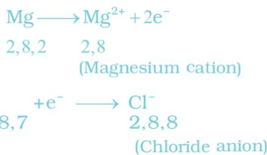

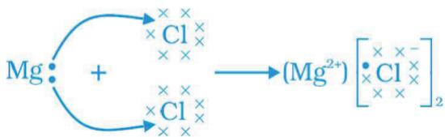  
Figure 3.6 Formation of magnesium chloride

The compounds formed in this manner by the transfer of electrons from a metal to a nonmetal are known as ionic compounds or electrovalent compounds. Can you name the cation and anion present in $\mathrm { M g C l } _ { 2 } ^ { 1 }$ ?

#### 3.3.1 Properties of Ionic Compounds

To learn about the properties of ionic compounds, let us perform the following Activity:

### Activity 3.13

■ Take samples of sodium chloride, potassium iodide, barium chloride or any other salt from the science laboratory.   
■ What is the physical state of these salts?   
■ Take a small amount of a sample on a metal spatula and heat directly on the flame (Fig. 3.7). Repeat with other samples.   
■ What did you observe? Did the samples impart any colour to the flame? Do these compounds melt?   
■ Try to dissolve the samples in water, petrol and kerosene. Are they soluble?   
■ Make a circuit as shown in Fig. 3.8 and insert the electrodes into a solution of one salt. What did you observe? Test the other salt samples too in this manner.   
■ What is your inference about the nature of these compounds?

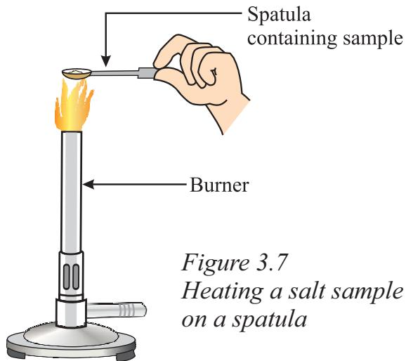  
Figure 3.7

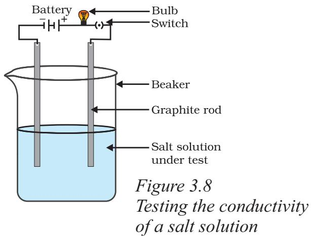

Table 3.4   
Melting and boiling points of some ionic compounds   

<table><tr><td>Ionic compound</td><td>Melting point (K)</td><td>Boiling point (K)</td></tr><tr><td>NaCl</td><td>1074</td><td>1686</td></tr><tr><td>LiCl</td><td>887</td><td>1600</td></tr><tr><td>CaCl2</td><td>1045</td><td>1900</td></tr><tr><td>CaO</td><td>2850</td><td>3120</td></tr><tr><td>MgCl2</td><td>981</td><td>1685</td></tr></table>

You may have observed the following general properties for ionic compounds—

(i) Physical nature: Ionic compounds are solids and are somewhat hard because of the strong force of attraction between the positive and negative ions. These compounds are generally brittle and break into pieces when pressure is applied.   
(ii) Melting and Boiling points: Ionic compounds have high melting and boiling points (see Table 3.4). This is because a considerable amount of energy is required to break the strong inter-ionic attraction.   
(iii) Solubility: Electrovalent compounds are generally soluble in water and insoluble in solvents such as kerosene, petrol, etc.   
(iv) Conduction of Electricity: The conduction of electricity through a solution involves the movement of charged particles. A solution of an ionic compound in water contains ions, which move to the opposite electrodes when electricity is passed through the solution. Ionic compounds in the solid state do not conduct electricity because movement of ions in the solid is not possible due to their rigid structure. But ionic compounds conduct electricity in the molten state. This is possible in the molten state since the elecrostatic forces of attraction between the oppositely charged ions are overcome due to the heat. Thus, the ions move freely and conduct electricity.

## 

1. (i) Write the electron-dot structures for sodium, oxygen and magnesium.   
(ii) Show the formation of $\mathrm { N a } _ { 2 } \mathrm { O }$ and $\mathrm { M g O }$ by the transfer of electrons.   
(iii) What are the ions present in these compounds?

2. Why do ionic compounds have high melting points?

### 3.4 OCCURRENCE OFMETALS

The earth’s crust is the major source of metals. Seawater also contains some soluble salts such as sodium chloride, magnesium chloride, etc. The elements or compounds, which occur naturally in the earth’s crust, are known as minerals. At some places, minerals contain a very high percentage of a particular metal and the metal can be profitably extracted from it. These minerals are called ores.

#### 3.4.1 Extraction of Metals

You have learnt about the reactivity series of metals. Having this knowledge, you can easily understand how a metal is extracted from its ore. Some metals are found in the earth’s crust in the free state. Some are found in the form of their compounds. The metals at the bottom of the activity series are the least reactive. They are often found in a free state. For example, gold, silver, platinum and copper are found in the free state. Copper and silver are also found in the combined state as their sulphide or oxide ores. The metals at the top of the activity series (K, Na, Ca, Mg and Al) are so reactive that they are never found in nature as free elements.

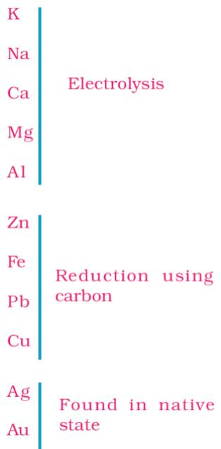  
Figure 3.9 Activity series and related metallurgy

The metals in the middle of the activity series (Zn, Fe, Pb, etc.) are moderately reactive. They are found in the earth’s crust mainly as oxides, sulphides or carbonates. You will find that the ores of many metals are oxides. This is because oxygen is a very reactive element and is very abundant on the earth.

Thus on the basis of reactivity, we can group the metals into the following three categories (Fig. 3.9) – (i) Metals of low reactivity; (ii) Metals of medium reactivity; (iii) Metals of high reactivity. Different techniques are to be used for obtaining the metals falling in each category.

Several steps are involved in the extraction of pure metal from ores. A summary of these steps is given in Fig.3.10. Each step is explained in detail in the following sections.

#### 3.4.2 Enrichment of Ores

Ores mined from the earth are usually contaminated with large amounts of impurities such as soil, sand, etc., called gangue. The impurities must be removed from the ore prior to the extraction of the metal. The processes

used for removing the gangue from the ore are based on the differences between the physical or chemical properties of the gangue and the ore. Different separation techniques are accordingly employed.

#### 3.4.3 Extracting Metals Low in the Activity Series

Metals low in the activity series are very unreactive. The oxides of these metals can be reduced to metals by heating alone. For example, cinnabar (HgS) is an ore of mercury. When it is heated in air, it is first converted into mercuric oxide (HgO). Mercuric oxide is then reduced to mercury on further heating.

$$
2 \mathrm {H g S} (\mathrm {s}) + 3 \mathrm {O} _ {2} (\mathrm {g}) \xrightarrow {\text {H e a t}} 2 \mathrm {H g O} (\mathrm {s}) + 2 \mathrm {S O} _ {2} (\mathrm {g})
$$

$$
2 \mathrm {H g O} (\mathrm {s}) \xrightarrow {\text {H e a t}} 2 \mathrm {H g} (\mathrm {l}) + \mathrm {O} _ {2} (\mathrm {g})
$$

Similarly, copper which is found as $\mathrm { C u } _ { 2 } \mathrm { S }$ in nature can be obtained from its ore by just heating in air.

$$
2 \mathrm {C u} _ {2} \mathrm {S} + 3 \mathrm {O} _ {2} (\mathrm {g}) \xrightarrow {\text {H e a t}} 2 \mathrm {C u} _ {2} \mathrm {O} (\mathrm {s}) + 2 \mathrm {S O} _ {2} (\mathrm {g})
$$

$$
2 \mathrm {C u} _ {2} \mathrm {O} + \mathrm {C u} _ {2} \mathrm {S} \xrightarrow {\text {H e a t}} 6 \mathrm {C u} (\mathrm {s}) + \mathrm {S O} _ {2} (\mathrm {g})
$$

#### 3.4.4 Extracting Metals in the Middle of the Activity Series

The metals in the middle of the activity series such as iron, zinc, lead, copper, are moderately reactive. These are usually present as sulphides or carbonates in nature. It is easier to obtain a metal from its oxide, as compared to its sulphides and carbonates. Therefore, prior to reduction, the metal sulphides and carbonates must be converted into metal oxides. The sulphide ores are converted into oxides by heating strongly in the presence of excess air. This process is known as roasting. The carbonate ores are changed into oxides by heating strongly in limited air. This process is known as calcination. The chemical reaction that takes place during roasting and calcination of zinc ores can be shown as follows – Roasting

$$
2 \mathrm {Z n S (s)} + 3 \mathrm {O} _ {2} (\mathrm {g}) \xrightarrow {\text {H e a t}} 2 \mathrm {Z n O (s)} + 2 \mathrm {S O} _ {2} (\mathrm {g})
$$

Calcination

$$
\mathrm {Z n C O} _ {3} (\mathrm {s}) \xrightarrow {\text {H e a t}} \mathrm {Z n O} (\mathrm {s}) + \mathrm {C O} _ {2} (\mathrm {g})
$$

The metal oxides are then reduced to the corresponding metals by using suitable reducing agents such as carbon. For example, when zinc oxide is heated with carbon, it is reduced to metallic zinc.

$$
\mathrm {Z n O (s) + C (s) \rightarrow Z n (s) + C O (g)}
$$

You are already familiar with the process of oxidation and reduction explained in the first Chapter. Obtaining metals from their compounds is also a reduction process.

Besides using carbon (coke) to reduce metal oxides to metals, sometimes displacement reactions can also be used. The highly reactive metals such as sodium, calcium, aluminium, etc., are used as reducing agents because they can displace metals of lower reactivity from their compounds. For example, when manganese dioxide is heated with aluminium powder, the following reaction takes place –

$$
3 \mathrm {M n O} _ {2} (\mathrm {s}) + 4 \mathrm {A l} (\mathrm {s}) \rightarrow 3 \mathrm {M n} (\mathrm {l}) + 2 \mathrm {A l} _ {2} \mathrm {O} _ {3} (\mathrm {s}) + \text {H e a t}
$$

  
Figure 3.11 Thermit process for joining railway tracks

Can you identify the substances that are getting oxidised and reduced?

These displacement reactions are highly exothermic. The amount of heat evolved is so large that

the metals are produced in the molten state. In fact, the reaction of iron(III) oxide (Fe2O3) with aluminium is used to join railway tracks or cracked machine parts. This reaction is known as the thermit reaction.

$$
\mathrm {F e} _ {2} \mathrm {O} _ {3} (\mathrm {s}) + 2 \mathrm {A l} (\mathrm {s}) \rightarrow 2 \mathrm {F e} (\mathrm {l}) + \mathrm {A l} _ {2} \mathrm {O} _ {3} (\mathrm {s}) + \text {H e a t}
$$

#### 3.4.5 Extracting Metals towards the Top of the Activity Series

The metals high up in the reactivity series are very reactive. They cannot be obtained from their compounds by heating with carbon. For example, carbon cannot reduce the oxides of sodium, magnesium, calcium, aluminium, etc., to the respective metals. This is because these metals have more affinity for oxygen than carbon. These metals are obtained by electrolytic reduction. For example, sodium, magnesium and calcium are obtained by the electrolysis of their molten chlorides. The metals are deposited at the cathode (the negatively charged electrode), whereas, chlorine is liberated at the anode (the positively charged electrode). The reactions are –

At cathode

At anode

Similarly, aluminium is obtained by the electrolytic reduction of aluminium oxide.

#### 3.4.6 Refining of Metals

The metals produced by various reduction processes described above are not very pure. They contain impurities, which must be removed to obtain pure metals. The most widely used method for refining impure metals is electrolytic refining.

Electrolytic Refining: Many metals, such as copper, zinc, tin, nickel, silver, gold, etc., are refined electrolytically. In this process, the impure metal is made the anode and a thin strip

of pure metal is made the cathode. A solution of the metal salt is used as an electrolyte. The apparatus is set up as shown in Fig. 3.12. On passing the current through the electrolyte, the pure metal from the anode dissolves into

Figure 3.12   
  
Electrolytic refining of copper. The electrolyte is a solution of acidified copper sulphate. The anode is impure copper, whereas, the cathode is a strip of pure copper. On passing electric current, pure copper is deposited on the cathode.

the electrolyte. An equivalent amount of pure metal from the electrolyte is deposited on the cathode. The soluble impurities go into the solution, whereas, the insoluble impurities settle down at the bottom of the anode and are known as anode mud.

## QuEstiONS

1. Define the following terms.

(i) Mineral   
(ii) Ore   
(iii) Gangue

2. Name two metals which are found in nature in the free state.   
3. What chemical process is used for obtaining a metal from its oxide?

### 3.5 CORROSION

You have learnt the following about corrosion in Chapter 1 –

• Silver articles become black after some time when exposed to air. This is because it reacts with sulphur in the air to form a coating of silver sulphide.   
• Copper reacts with moist carbon dioxide in the air and slowly loses its shiny brown surface and gains a green coat. This green substance is basic copper carbonate.   
• Iron when exposed to moist air for a long time acquires a coating of a brown flaky substance called rust.

Let us find out the conditions under which iron rusts.

Figure 3.13   
  
Investigating the conditions under which iron rusts. In tube A, both air and water are present. In tube B, there is no air dissolved in the water. In tube C, the air is dry.

### Activity 3.14

■ Take three test tubes and place clean iron nails in each of them.   
■ Label these test tubes A, B and C. Pour some water in test tube Aand cork it.   
■ Pour boiled distilled water in test tube B, add about 1 mL of oil and cork it. The oil will float on water and prevent the air from dissolving in the water.   
■ Put some anhydrous calcium chloride in test tube C and cork it. Anhydrous calcium chloride will absorb the moisture, if any, from the air. Leave these test tubes for a few days and then observe (Fig. 3.13).

You will observe that iron nails rust in test tube A, but they do not rust in test tubes B and C. In the test tube A, the nails are exposed to both air and water. In the test tube B, the nails are exposed to only water, and the nails in test tube C are exposed to dry air. What does this tell us about the conditions under which iron articles rust?

#### 3.5.1 Prevention of Corrosion

The rusting of iron can be prevented by painting, oiling, greasing, galvanising, chrome plating, anodising or making alloys.

Galvanisation is a method of protecting steel and iron from rusting by coating them with a thin layer of zinc. The galvanised article is protected against rusting even if the zinc coating is broken. Can you reason this out?

Alloying is a very good method of improving the properties of a metal. We can get the desired properties by this method. For example, iron is the most widely used metal. But it is never used in its pure state. This is because pure iron is very soft and stretches

easily when hot. But, if it is mixed with a small amount of carbon (about $0 . 0 5 \%$ ), it becomes hard and strong. When iron is mixed with nickel and chromium, we get stainless steel, which is hard and does not rust. Thus, if iron is mixed with some other substance, its properties change. In fact, the properties of any metal can be changed if it is mixed with some other substance. The substance added may be a metal or a non-metal. An alloy is a homogeneous mixture of two or more metals, or a metal and a non-metal. It is prepared by first melting the primary metal, and then, dissolving the other elements in it in definite proportions. It is then cooled to room temperature.

## Do You Know ?

Pure gold, known as 24 carat gold, is very soft. It is, therefore, not suitable for making jewellery. It is alloyed with either silver or copper to make it hard. Generally, in India, 22 carat gold is used for making ornaments. It means that 22 parts of pure gold is alloyed with 2 parts of either copper or silver.

If one of the metals is mercury, then the alloy is known as an amalgam. The electrical conductivity and melting point of an alloy is less than that of pure metals. For example, brass, an alloy of copper and zinc (Cu and Zn), and bronze, an alloy of copper and tin (Cu and Sn), are not good conductors of electricity whereas copper is used for making electrical circuits. Solder, an alloy of lead and tin (Pb and Sn), has a low melting point and is used for welding electrical wires together.

Iron pillar at Delhi

## More to Know !

## The wonder of ancient Indian metallurgy

The iron pillar near the Qutub Minar in Delhi was built more than 1600 years ago by the iron workers of India. They had developed a process which prevented iron from rusting. For its quality of rust resistance it has been examined by scientists from all parts of the world. The iron pillar is $8 \mathrm { m }$ high and weighs 6 tonnes $( 6 0 0 0 \mathrm { k g } )$ .

## 

1. Metallic oxides of zinc, magnesium and copper were heated with the following metals.

<table><tr><td>Metal</td><td>Zinc</td><td>Magnesium</td><td>Copper</td></tr><tr><td>Zinc oxide</td><td></td><td></td><td></td></tr><tr><td>Magnesium oxide</td><td></td><td></td><td></td></tr><tr><td>Copper oxide</td><td></td><td></td><td></td></tr></table>

I n w h i c h c a s e s w i l l y o u fi n d displacement reactions taking place?

2. Which metals do not corrode easily?   
3. What are alloys?

## What you have learnt

■ Elements can be classified as metals and non-metals.   
■ Metals are lustrous, malleable, ductile and are good conductors of heat and electricity. They are solids at room temperature, except mercury which is a liquid.   
Metals can form positive ions by losing electrons to non-metals.   
■ Metals combine with oxygen to form basic oxides. Aluminium oxide and zinc oxide show the properties of both basic as well as acidic oxides. These oxides are known as amphoteric oxides.   
■ Different metals have different reactivities with water and dilute acids.   
■ A list of common metals arranged in order of their decreasing reactivity is known as an activity series.   
■ Metals above hydrogen in the Activity series can displace hydrogen from dilute acids.   
■ Amore reactive metal displaces a less reactive metal from its salt solution.   
■ Metals occur in nature as free elements or in the form of their compounds.   
■ The extraction of metals from their ores and then refining them for use is known as metallurgy.   
■ An alloy is a homogeneous mixture of two or more metals, or a metal and a non-metal.   
■ The surface of some metals, such as iron, is corroded when they are exposed to moist air for a long period of time. This phenomenon is known as corrosion.   
■ Non-metals have properties opposite to that of metals. They are neither malleable nor ductile. They are bad conductors of heat and electricity, except for graphite, which conducts electricity.   
■ Non-metals form negatively charged ions by gaining electrons when reacting with metals.   
■ Non-metals form oxides which are either acidic or neutral.   
■ Non-metals do not displace hydrogen from dilute acids. They react with hydrogen to form hydrides.

## EXERCISES

1. Which of the following pairs will give displacement reactions?

(a) NaCl solution and copper metal   
(b) MgCl2 solution and aluminium metal   
(c) FeSO4 solution and silver metal   
(d) AgNO3 solution and copper metal.

2. Which of the following methods is suitable for preventing an iron frying pan from rusting?

(a) Applying grease   
(b) Applying paint   
(c) Applying a coating of zinc   
(d) All of the above.

3. An element reacts with oxygen to give a compound with a high melting point. This compound is also soluble in water. The element is likely to be

(a) calcium   
(b) carbon   
(c) silicon   
(d) iron.

4. Food cans are coated with tin and not with zinc because

(a) zinc is costlier than tin.   
(b) zinc has a higher melting point than tin.   
(c) zinc is more reactive than tin.   
(d) zinc is less reactive than tin.

5. You are given a hammer, a battery, a bulb, wires and a switch.

(a) How could you use them to distinguish between samples of metals and non-metals?   
(b) Assess the usefulness of these tests in distinguishing between metals and non-metals.

6. What are amphoteric oxides? Give two examples of amphoteric oxides.   
7. Name two metals which will displace hydrogen from dilute acids, and two metals which will not.   
8. In the electrolytic refining of a metal M, what would you take as the anode, the cathode and the electrolyte?

9. Pratyush took sulphur powder on a spatula and heated it. He collected the gas evolved by inverting a test tube over it, as shown in figure below.

(a) What will be the action of gas on   
(I) dry litmus paper?   
(ii) moist litmus paper?   
(b) Write a balanced chemical equation for the reaction taking place.

10. State two ways to prevent the rusting of iron.   
11. What type of oxides are formed wh combine with oxygen?   
12. Give reasons

(a) Platinum, gold and silve make jewellery.   
(b) Sodium, potassium and lit stored under oil.

(c) Aluminium is a highly reactive metal, yet it is used to make utensils for cooking.   
(d) Carbonate and sulphide ores are usually converted into oxid during the process of extraction.

13. You must have seen tarnished co vessels being cleaned with lemon or tamarind juice. Explain why these sour substances are effective in cleaning the vessels.   
14. Differentiate between metal and non-metal on the basis of their chemical properties.   
15. A man went door to door posing as a goldsmith. He promised to bring back the glitter of old and dull gold ornaments. An unsuspecting lady gave a set of gold bangles to him which he dipped in a particular solution. The bangles sparkled like new but their weight was reduced drastically. The lady was upset but after a futile argument the man beat a hasty retreat. Can you play the detective to find out the nature of the solution he had used?   
16. Give reasons why copper is used to make hot water tanks and not steel (an alloy of iron).

# Chapter 4
# Carbon and its Compounds

O2

CO2

n the last Chapter, we came to know many compounds of importance to us. In this Chapter we will study about some more interesting compounds and their properties. Also, we shall be learning about carbon, an element which is of immense significance to us in both its elemental form and in the combined form.

### Activity 4.1

Make a list of ten things you have used or consumed since the morning.   
Compile this list with the lists made by your classmates and then sort the items into the adjacent Table.   
If there are items which are made up of more than one material, put them into both the relevant columns of the table.

<table><tr><td>Things made of metal</td><td>Things made of glass/clay</td><td>Others</td></tr><tr><td></td><td></td><td></td></tr></table>

Look at the items that come in the last column of the above table filled by you – your teacher will be able to tell you that most of them are made up of compounds of carbon. Can you think of a method to test this? What would be the product if a compound containing carbon is burnt? Do you know of any test to confirm this?

Food, clothes, medicines, books, or many of the things that you listed are all based on this versatile element carbon. In addition, all living structures are carbon based. The amount of carbon present in the earth’s crust and in the atmosphere is quite meagre. The earth’s crust has only $0 . 0 2 \%$ carbon in the form of minerals (like carbonates, hydrogen- carbonates, coal and petroleum) and the atmosphere has $0 . 0 3 \%$ of carbon dioxide. In spite of this small amount of carbon available in nature, the importance of carbon seems to be immense. In this Chapter, we will know about the properties of carbon which make carbon so important to us.

### 4.1 BONDING IN CARBON – THE COVALENTBOND

In the previous Chapter, we have studied the properties of ionic compounds. We saw that ionic compounds have high melting and boiling points and conduct electricity in solution or in the molten state. We also

saw how the nature of bonding in ionic compounds explains these properties. Let us now study the properties of some carbon compounds.

Most carbon compounds are poor conductors of electricity as we have seen in Chapter 2. From the data given in Table 4.1 on the boiling and melting points of the carbon compounds, we find that these compounds have low melting and boiling points as compared to ionic compounds (Chapter 3). We can conclude that the forces of attraction between the molecules are not very strong. Since these compounds are largely nonconductors of electricity, we can conclude that the bonding in these compounds does not give rise to any ions.

Table 4.1 Melting points and boiling points of some compounds of carbon   

<table><tr><td>Compound</td><td>Melting point (K)</td><td>Boiling point (K)</td></tr><tr><td>Acetic acid (CH3COOH)</td><td>290</td><td>391</td></tr><tr><td>Chloroform (CHCl3)</td><td>209</td><td>334</td></tr><tr><td>Ethanol (CH3CH2OH)</td><td>156</td><td>351</td></tr><tr><td>Methane (CH4)</td><td>90</td><td>111</td></tr></table>

In Class IX, we learnt about the combining capacity of various elements and how it depends on the number of valence electrons. Let us now look at the electronic configuration of carbon. The atomic number of carbon is 6. What would be the distribution of electrons in various shells of carbon? How many valence electrons will carbon have?

We know that the reactivity of elements is explained as their tendency to attain a completely filled outer shell, that is, attain noble gas configuration. Elements forming ionic compounds achieve this by either gaining or losing electrons from the outermost shell. In the case of carbon, it has four electrons in its outermost shell and needs to gain or lose four electrons to attain noble gas configuration. If it were to gain or lose electrons –

(i) It could gain four electrons forming $\mathrm { C } ^ { 4 - }$ anion. But it would be difficult for the nucleus with six protons to hold on to ten electrons, that is, four extra electrons.   
(ii) It could lose four electrons forming $\mathrm { C } ^ { 4 + }$ cation. But it would require a large amount of energy to remove four electrons leaving behind a carbon cation with six protons in its nucleus holding on to just two electrons.

Carbon overcomes this problem by sharing its valence electrons with other atoms of carbon or with atoms of other elements. Not just carbon, but many other elements form molecules by sharing electrons in this manner. The shared electrons ‘belong’ to the outermost shells of both the atoms and lead to both atoms attaining the noble gas configuration. Before going on to compounds of carbon, let us look at some simple molecules formed by the sharing of valence electrons.

The simplest molecule formed in this manner is that of hydrogen. As you have learnt earlier, the atomic number of hydrogen is 1. Hence hydrogen has one electron in its K shell and it requires one more electron to fill the K shell. So two hydrogen atoms share their electrons to form a molecule of hydrogen, $\mathrm { H } _ { 2 }$ . This allows each hydrogen atom to attain the

  
Figure 4.1 A molecule of hydrogen

electronic configuration of the nearest noble gas, helium, which has two electrons in its K shell. We can depict this using dots or crosses to represent valence electrons (Fig. 4.1).

The shared pair of electrons is said to constitute a single covalent bond between the two hydrogen atoms. A single covalent bond is also represented by a line between the two atoms, as shown in Fig. 4.2.

  
Figure 4.2 Single bond between two hydrogen atoms

The atomic number of chlorine is 17. What would be its electronic configuration and its valency? Chlorine forms a diatomic molecule, $\mathrm { C l } _ { 2 }$ . Can you draw the electron dot structure for this molecule? Note that only the valence shell electrons need to be depicted.

In the case of oxygen, we see the formation of a double bond between two oxygen atoms. This is because an atom of oxygen has six electrons in its L shell (the atomic number of oxygen is eight) and it requires two more electrons to complete its octet. So each atom of oxygen shares two electrons with another atom of oxygen to give us the structure shown in Fig. 4.3. The two electrons contributed by each oxygen atom give rise to two shared pairs of electrons. This is said to constitute a double bond between the two atoms.

  
Figure 4.3 Double bond between two oxygen atoms

Can you now depict a molecule of water showing the nature of bonding between one oxygen atom and two hydrogen atoms? Does the molecule have single bonds or double bonds?

What would happen in the case of a diatomic molecule of nitrogen? Nitrogen has the atomic number 7. What would be its electronic configuration and its combining capacity? In order to attain an octet, each nitrogen atom in a molecule of nitrogen contributes three electrons giving rise to three shared pairs of electrons. This is said to constitute a triple bond between the two atoms. The electron dot structure of $\Nu _ { 2 }$ and its triple bond can be depicted as in Fig. 4.4.

  
Figure 4.4 Triple bond between two nitrogen atoms

A molecule of ammonia has the formula $\mathrm { N H } _ { 3 }$ . Can you draw the electron dot structure for this molecule showing how all four atoms achieve noble gas configuration? Will the

molecule have single, double or triple bonds?

Let us now take a look at methane, which is a compound of carbon. Methane is widely used as a fuel and is a major component of bio-gas and Compressed Natural Gas (CNG). It is also one of the simplest compounds formed by carbon. Methane has a formula $\mathrm { C H } _ { 4 }$ . Hydrogen, as you know, has a valency of 1. Carbon is tetravalent because it has four valence electrons. In order to achieve noble gas configuration, carbon shares these electrons with four atoms of hydrogen as shown in Fig. 4.5.

  
Figure 4.5   
Electron dot structure for methane

Such bonds which are formed by the sharing of an electron pair between two atoms are known as covalent bonds. Covalently bonded molecules are seen to have strong bonds within the molecule, but inter-molecular forces are weak. This gives rise to the low melting and boiling points of these compounds. Since the electrons are shared between atoms and no charged particles are formed, such covalent compounds are generally poor conductors of electricity.

## Allotropes of carbon

The element carbon occurs in different forms in nature with widely varying physical properties. Both diamond and graphite are formed by carbon atoms, the difference lies in the manner in which the carbon atoms are bonded to one another. In diamond, each carbon atom is bonded to

four other carbon atoms forming a rigid three-dimensional structure. In graphite, each carbon atom is bonded to three other carbon atoms in the same plane giving a hexagonal array. One of these bonds is a double-bond, and thus the valency of carbon is satisfied. Graphite structure is formed by the hexagonal arrays being placed in layers one above the other.

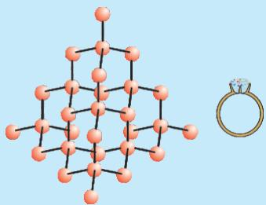  
The structure of diamond

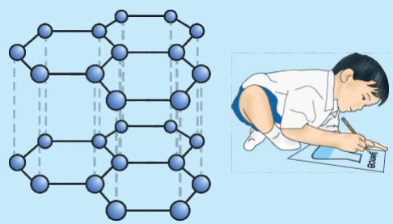  
The structure of graphite

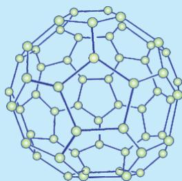  
The structure of C-60   
Buckminsterfullerene

These two different structures result in diamond and graphite having very different physical properties even though their chemical properties are the same. Diamond is the hardest substance known while graphite is smooth and slippery. Graphite is

also a very good conductor of electricity unlike other non-metals that you studied in the previous Chapter.

Diamonds can be synthesised by subjecting pure carbon to very high pressure and temperature. These synthetic diamonds are small but are otherwise indistinguishable from natural diamonds.

Fullerenes form another class of carbon allotropes. The first one to be identified was C-60 which has carbon atoms arranged in the shape of a football. Since this looked like the geodesic dome designed by the US architect Buckminster Fuller, the molecule was named fullerene.

## QUEsTIONS

1. What would be the electron dot structure of carbon dioxide which has the formula $\mathrm { C O } _ { 2 }$ ?   
2. What would be the electron dot structure of a molecule of sulphur which is made up of eight atoms of sulphur? (Hint – The eight atoms of sulphur are joined together in the form of a ring.)

### 4.2 VERSATILE NATURE OFCARBON

We have seen the formation of covalent bonds by the sharing of electrons in various elements and compounds. We have also seen the structure of a simple carbon compound, methane. In the beginning of the Chapter, we saw how many things we use contain carbon. In fact, we ourselves are made up of carbon compounds. The numbers of carbon compounds whose formulae are known to chemists was recently estimated to be in millions! This outnumbers by a large margin the compounds formed by all the other elements put together. Why is it that this property is seen in carbon and no other element? The nature of the covalent bond

enables carbon to form a large number of compounds. Two factors noticed in the case of carbon are –

(i) Carbon has the unique ability to form bonds with other atoms of carbon, giving rise to large molecules. This property is called catenation. These compounds may have long chains of carbon, branched chains of carbon or even carbon atoms arranged in rings. In addition, carbon atoms may be linked by single, double or triple bonds. Compounds of carbon, which are linked by only single bonds between the carbon atoms are called saturated compounds. Compounds of carbon having double or triple bonds between their carbon atoms are called unsaturated compounds.   
No other element exhibits the property of catenation to the extent seen in carbon compounds. Silicon forms compounds with hydrogen which have chains of upto seven or eight atoms, but these compounds are very reactive. The carbon-carbon bond is very strong and hence stable. This gives us the large number of compounds with many carbon atoms linked to each other.   
(ii) Since carbon has a valency of four, it is capable of bonding with four other atoms of carbon or atoms of some other mono-valent element. Compounds of carbon are formed with oxygen, hydrogen, nitrogen, sulphur, chlorine and many other elements giving rise to compounds with specific properties which depend on the elements other than carbon present in the molecule.

Again the bonds that carbon forms with most other elements are very strong making these compounds exceptionally stable. One reason for the formation of strong bonds by carbon is its small size. This enables the nucleus to hold on to the shared pairs of electrons strongly. The bonds formed by elements having bigger atoms are much weaker.

## Organic compounds

The two characteristic features seen in carbon, that is, tetravalency and catenation, put together give rise to a large number of compounds. Many have the same noncarbon atom or group of atoms attached to different carbon chains. These compounds were initially extracted from natural substances and it was thought that these carbon compounds or organic compounds could only be formed within a living system. That is, it was postulated that a ‘vital force’ was necessary for their synthesis. Friedrich Wöhler disproved this in 1828 by preparing urea from ammonium cyanate. But carbon compounds, except for carbides, oxides of carbon, carbonate and hydrogencarbonate salts continue to be studied under organic chemistry.

#### 4.2.1 Saturated and Unsaturated Carbon Compounds

We have already seen the structure of methane. Another compound formed between carbon and hydrogen is ethane with a formula of $\mathrm { C } _ { 2 } \mathrm { H } _ { 6 }$ . In order to arrive at the structure of simple carbon compounds, the first step is to link the carbon atoms together with a single bond (Fig. 4.6a) and then use the hydrogen atoms to satisfy the remaining valencies of carbon (Fig. 4.6b). For example, the structure of ethane is arrived in the following steps –

$$
\begin{array}{l l} \mathrm {C} - \mathrm {C} & \mathrm {S t e p 1} \end{array}
$$

Figure 4.6 (a)

Carbon atoms linked together with a single bond

Three valencies of each carbon atom remain unsatisfied, so each is bonded to three hydrogen atoms giving:

  
Figure 4.6 (b)   
Each carbon atom bonded to three hydrogen atoms

  
Figure 4.6 (c)   
Electron dot structure of ethane

The electron dot structure of ethane is shown in Fig. 4.6(c).

Can you draw the structure of propane, which has the molecular formula $\mathrm { C } _ { 3 } \mathrm { H } _ { 8 }$ in a similar manner? You will see that the valencies of all the atoms are satisfied by single bonds between them. Such carbon compounds are called saturated compounds. These compounds are normally not very reactive.

However, another compound of carbon and hydrogen has the formula $\mathrm { C } _ { 2 } \mathrm { H } _ { 4 }$ and is called ethene. How can this molecule be depicted? We follow the same step-wise approach as above.

Carbon-carbon atoms linked together with a single bond (Step 1).

We see that one valency per carbon atom remains unsatisfied (Step 2). This can be satisfied only if there is a double bond between the two carbons (Step 3).

  
Step 1   
Step 2

  
Step 3

  
Figure 4.7 Structure of ethene

The electron dot structure for ethene is given in Fig. 4.7. Yet another compound of hydrogen and carbon has the formula $\mathrm { C } _ { 2 } \mathrm { H } _ { 2 }$ and is called ethyne. Can you draw the electron dot structure for ethyne? How many bonds are

necessary between the two carbon atoms in order to satisfy their valencies? Such compounds of carbon having double or triple bonds between the carbon atoms are known as unsaturated carbon compounds and they are more reactive than the saturated carbon compounds.

#### 4.2.2 Chains, Branches and Rings

In the earlier section, we mentioned the carbon compounds methane, ethane and propane, containing respectively 1, 2 and 3 carbon atoms. Such ‘chains’ of carbon atoms can contain many more carbon atoms. The names and structures of six of these are given in Table 4.2.

Table 4.2 Formulae and structures of saturated compounds of carbon and hydrogen   

<table><tr><td>No. of C atoms</td><td>Name</td><td>Formula</td><td>Structure</td></tr><tr><td>1</td><td>Methane</td><td>CH4</td><td>H
H-C-H
H</td></tr><tr><td>2</td><td>Ethane</td><td>C2H6</td><td>H
H
H-C-C-H
H H</td></tr><tr><td>3</td><td>Propane</td><td>C3H8</td><td>H
H
H-C-C-H
H H H</td></tr><tr><td>4</td><td>Butane</td><td>C4H10</td><td>H
H
H
H-C-C-C-H
H H H H</td></tr><tr><td>5</td><td>Pentane</td><td>C5H12</td><td>H
H
H
H-C-C-C-C-H
H H H H H</td></tr><tr><td>6</td><td>Hexane</td><td>C6H14</td><td>H
H
H
H
H-C-C-C-C-C-H
H H H H H H</td></tr></table>

But, let us take another look at butane. If we make the carbon ‘skeleton’ with four carbon atoms, we see that two different possible ‘skeletons’are –

  
Figure 4.8 (a) Two possible carbon-skeletons

Filling the remaining valencies with hydrogen gives us –

  
Figure 4.8 (b) Complete molecules for two structures with formula $C _ { 4 } H _ { I 0 }$

We see that both these structures have the same formula $\mathrm { C } _ { 4 } \mathrm { H } _ { 1 0 }$ . Such compounds with identical molecular formula but different structures are called structural isomers.

In addition to straight and branched carbon chains, some compounds have carbon atoms arranged in the form of a ring. For example, cyclohexane has the formula $\mathrm { C } _ { 6 } \mathrm { H } _ { 1 2 }$ and the following structure

  
(a)

  
(b)   
Figure 4.9 Structure of cyclohexane (a) carbon skeleton (b) complete molecule

Can you draw the electron dot structure for cyclohexane? Straight chain, branched chain and cyclic carbon compounds, all may be saturated or unsaturated. For example, benzene, $\mathrm { C } _ { 6 } \mathrm { H } _ { 6 }$ , has the following structure –

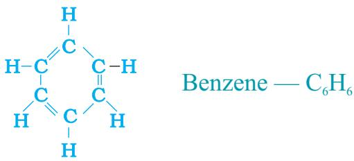  
Figure 4.10 Structure of benzene

All these carbon compounds which contain only carbon and hydrogen are called hydrocarbons. Among these, the saturated hydrocarbons are called alkanes. The unsaturated hydrocarbons which contain one or more double bonds are called alkenes. Those containing one or more triple bonds are called alkynes.

#### 4.2.3 Will you be my Friend?

Carbon seems to be a very friendly element. So far we have been looking at compounds containing carbon and hydrogen only. But carbon also forms bonds with other elements such as halogens, oxygen, nitrogen and sulphur. In a hydrocarbon chain, one or more hydrogens can be replaced by these elements, such that the valency of carbon remains satisfied. In such compounds, the element replacing hydrogen is referred to as a heteroatom. These heteroatoms are also present in some groups as given in Table 4.3. These heteroatoms and the group containing these confer specific properties to the compound, regardless of the length and nature of the carbon chain and hence are called functional groups. Some important functional groups are given in the Table 4.3. Free valency or valencies of the group are shown by the single line. The functional group is attached to the carbon chain through this valency by replacing one hydrogen atom or atoms.

Table 4.3 Some functional groups in carbon compounds   

<table><tr><td>Hetero atom</td><td>Class of Compounds</td><td>Formula of functional group</td></tr><tr><td>Cl/Br</td><td>Halo- (Chloro/bromo) alkane</td><td>—Cl, —Br 
(substitutes for hydrogen atom)</td></tr><tr><td rowspan="4">Oxygen</td><td>1. Alcohol</td><td>—OH</td></tr><tr><td>2. Aldehyde</td><td>—C—
H
O</td></tr><tr><td>3. Ketone</td><td>—C—
II
O</td></tr><tr><td>4. Carboxylic acid</td><td>O
II
—C—OH</td></tr></table>

#### 4.2.4 Homologous Series

You have seen that carbon atoms can be linked together to form chains of varying lengths. These chains can be branched also. In addition, hydrogen atom or other atoms on these carbon chains can be replaced by any of the functional groups that we saw above. The presence of a functional group such as alcohol decides the properties of the carbon compound, regardless of the length of the carbon chain. For example, the chemical properties of $\mathrm { C H } _ { 3 } \mathrm { O H }$ , $\mathrm { C _ { 2 } H _ { 5 } O H }$ , $\mathrm { C } _ { 3 } \mathrm { H } _ { 7 } \mathrm { O H }$ and $\mathrm { C _ { 4 } H _ { 9 } O H }$ are all very similar. Hence, such a series of compounds in which the same functional group substitutes for hydrogen in a carbon chain is called a homologous series.

Let us look at the homologous series that we saw earlier in Table 4.2. If we look at the formulae of successive compounds, say – $\mathrm { C H } _ { 4 }$ and $\mathrm { C } _ { 2 } \mathrm { H } _ { 6 }$ these differ by a – $\mathrm { C H } _ { 2 }$ - unit $\mathrm { C } _ { 2 } \mathrm { H } _ { 6 }$ and $\mathrm { C } _ { 3 } \mathrm { H } _ { 8 }$ these differ by a – $\mathrm { C H } _ { 2 }$ - unit What is the difference between the next pair – propane and butane $\mathrm { ( C _ { 4 } H _ { 1 0 } ) }$ ? Can you find out the difference in molecular

masses between these pairs (the atomic mass of carbon is $^ { 1 2 \mathrm { u } }$ and the atomic mass of hydrogen is 1 u)?

Similarly, take the homologous series for alkenes. The first member of the series is ethene which we have already come across in Section 4.2.1. What is the formula for ethene? The succeeding members have the formula $\mathrm { C } _ { 3 } \mathrm { H } _ { 6 }$ , $\mathrm { C } _ { 4 } \mathrm { H } _ { 8 }$ and $\mathrm { C } _ { 5 } \mathrm { H } _ { 1 0 }$ . Do these also differ by a – $\mathrm { C H } _ { 2 ^ { - } }$ – unit?

Do you see any relation between the number of carbon and hydrogen atoms in these compounds? The general formula for alkenes can be written as $\mathrm { C } _ { \mathrm { n } } \mathrm { H } _ { 2 \mathrm { n } }$ , where n = 2, 3, 4. Can you similarly generate the general formula for alkanes and alkynes?

As the molecular mass increases in any homologous series, a gradation in physical properties is seen. This is because the melting and boiling points increase with increasing molecular mass. Other physical properties such as solubility in a particular solvent also show a similar gradation. But the chemical properties,

which are determined solely by the functional group, remain similar in a homologous series.

### Activity 4.2

Calculate the difference in the formulae and molecular masses for (a) $\mathrm { C H } _ { 3 } \mathrm { O H }$ and $\mathrm { C } _ { 2 } \mathrm { H } _ { 5 } \mathrm { O H }$ (b) $\mathrm { C _ { 2 } H _ { 5 } O H }$ and $\mathrm { C } _ { 3 } \mathrm { H } _ { 7 } \mathrm { O H }$ , and (c) $\mathrm { C } _ { 3 } \mathrm { H } _ { 7 } \mathrm { O H }$ and $\mathrm { C _ { 4 } H _ { 9 } O H }$ .   
■ Is there any similarity in these three?   
Arrange these alcohols in the order of increasing carbon atoms to get a family. Can we call this family a homologous series?   
■ Generate the homologous series for compounds containing up to four carbons for the other functional groups given in Table 4.3.

#### 4.2.5 Nomenclature of Carbon Compounds

The names of compounds in a homologous series are based on the name of the basic carbon chain modified by a “prefix” “phrase before” or “suffix” “phrase after” indicating the nature of the functional group. For example, the names

of the alcohols taken in Activity 4.2 are methanol, ethanol, propanol and butanol.

Naming a carbon compound can be done by the following method –

(i) Identify the number of carbon atoms in the compound. A compound having three carbon atoms would have the name propane.   
(ii) In case a functional group is present, it is indicated in the name of the compound with either a prefix or a suffix (as given in Table 4.4).   
(iii) If the name of the functional group is to be given as a suffix, and the suffix of the functional group begins with a vowel a, e, i, o, u, then the name of the carbon chain is modified by deleting the final ‘e’ and adding the appropriate suffix. For example, a three-carbon chain with a ketone group would be named in the following manner –

Propane – ‘e’ $=$ propan $^ +$ ‘one’ $=$ propanone.

(iv) If the carbon chain is unsaturated, then the final ‘ane’in the name of the carbon chain is substituted by ‘ene’ or ‘yne’ as given in Table 4.4. For example, a three-carbon chain with a double bond would be called propene and if it has a triple bond, it would be called propyne.

Table 4.4 Nomenclature of organic compounds   

<table><tr><td>Class of compounds</td><td>Prefix/Suffix</td><td>Example</td></tr><tr><td rowspan="2">1. Halo alkane</td><td rowspan="2">Prefix-chloro, bromo, etc.</td><td>H H H
H-C-C-C-Cl Chloropropane
H H H</td></tr><tr><td>H H H
H-C-C-C-Br Bromopropane
H H H</td></tr><tr><td>2. Alcohol</td><td>Suffix - ol</td><td>H H H
H-C-C-C-OH Propanol
H H H</td></tr><tr><td>3. Aldehyde</td><td>Suffix - al</td><td>H H H
H-C-C-C=O Propanal
H H H</td></tr><tr><td>4. Ketone</td><td>Suffix - one</td><td>H H
H-C-C-C-H Propanone
H O H</td></tr><tr><td>5. Carboxylic acid</td><td>Suffix - oic acid</td><td>H H O
H-C-C-C-OH Propanoic acid
H H</td></tr><tr><td>6. Alkenes</td><td>Suffix - ene</td><td>H H
H-C-C=C Propene
H H</td></tr><tr><td>7. Alkynes</td><td>Suffix - yne</td><td>H
H-C-C≡C-H
H Propyne
H</td></tr></table>

## QUESTIONS

1. How many structural isomers can you draw for pentane?

2. What are the two properties of carbon which lead to the huge number of carbon compounds we see around us?

3. What will be the formula and electron dot structure of cyclopentane?

4. Draw the structures for the following compounds.

(i) Ethanoic acid (ii) Bromopentane*   
(iii) Butanone (iv) Hexanal.

*Are structural isomers possible for bromopentane?

5. How would you name the following compounds?

(i) CH —CH —Br 3 2

(ii)

HHHH

HHHH

### 4.3 CHEMICAL PROPERTIES OFCARBON COMPOUNDS

In this section we will be studying about some of the chemical properties of carbon compounds. Since most of the fuels we use are either carbon or its compounds, we shall first study combustion.

#### 4.3.1 Combustion

Carbon, in all its allotropic forms, burns in oxygen to give carbon dioxide along with the release of heat and light. Most carbon compounds also release a large amount of heat and light on burning. These are the oxidation reactions that you learnt about in the first Chapter –

(i) $\mathrm { C + O } _ { 2 } \to \mathrm { C O } _ { 2 } .$ + heat and light   
(ii) $\mathrm { C H } _ { 4 } + \mathrm { O } _ { 2 } \to \mathrm { C O } _ { 2 } + \mathrm { H } _ { 2 } \mathrm { O } +$ heat and light   
(iii) $\mathrm { C H } _ { 3 } \mathrm { C H } _ { 2 } \mathrm { O H } + \mathrm { O } _ { 2 } \to \mathrm { C O } _ { 2 } + \mathrm { H } _ { 2 } \mathrm { O } + ]$ heat and light

Balance the latter two reactions like you learnt in the first Chapter.

### Activity 4.3

CAUTION: This Activity needs the teacher’s assistance.

■ Ta k e s o m e c a r b o n c o m p o u n d s (naphthalene, camphor, alcohol) one by one on a spatula and burn them.   
■ Observe the nature of the flame and note whether smoke is produced.   
Place a metal plate above the flame. Is there a deposition on the plate in case of any of the compounds?

### Activity 4.4

■ Light a bunsen burner and adjust the air hole at the base to get different types of flames/presence of smoke.   
When do you get a yellow, sooty flame?   
When do you get a blue flame?

Saturated hydrocarbons will generally give a clean flame while unsaturated carbon compounds will give a yellow flame with lots of black smoke. This results in a sooty deposit on

the metal plate in Activity 4.3. However, limiting the supply of air results in incomplete combustion of even saturated hydrocarbons giving a sooty flame. The gas/kerosene stove used at home has inlets for air so that a sufficiently oxygen-rich mixture is burnt to give a clean blue flame. If you observe the bottoms of cooking vessels getting blackened, it means that the air holes are blocked and fuel is getting wasted. Fuels such as coal and petroleum have some amount of nitrogen and sulphur in them. Their combustion results in the formation of oxides of sulphur and nitrogen which are major pollutants in the environment.

## Why do substances burn with or without a flame ?

Have you ever observed either a coal or a wood fire? If not, the next time you get a chance, take close note of what happens when the wood or coal starts to burn. You have seen above that a candle or the LPG in the gas stove burns with a flame. However, you will observe the coal or charcoal in an ‘angithi’ sometimes just glows red and gives out heat without a flame. This is because a flame is only produced when gaseous substances burn. When wood or charcoal is ignited, the volatile substances present vapourise and burn with a flame in the beginning.

Aluminous flame is seen when the atoms of the gaseous substance are heated and start to glow. The colour produced by each element is a characteristic property of that element. Try and heat a copper wire in the flame of a gas stove and observe its colour. You have seen that incomplete combustion gives soot which is carbon. On this basis, what will you attribute the yellow colour of a candle flame to?

## Formation of coal and petroleum

Coal and petroleum have been formed from biomass which has been subjected to various biological and geological processes. Coal is the remains of trees, ferns, and other plants that lived millions of years ago. These were crushed into the earth, perhaps by earthquakes or volcanic eruptions. They were pressed down by layers of earth and rock. They slowly decayed into coal. Oil and gas are the remains of millions of tiny plants and animals that lived in the sea. When they died, their bodies sank to the sea bed and were covered by silt. Bacteria attacked the dead remains, turning them into oil and gas under the high pressures they were being subjected to. Meanwhile, the silt was slowly compressed into rock. The oil and gas seeped into the porous parts of the rock, and got trapped like water in a sponge. Can you guess why coal and petroleum are called fossil fuels?

#### 4.3.2 Oxidation

### Activity 4.5

Take about 3 mL of ethanol in a test tube and warm it gently in a water bath.   
Add a $5 \%$ solution of alkaline potassium permanganate drop by drop to this solution.   
D o e s t h e c o l o u r o f p o t a s s i u m permanganate persist when it is added initially?   
Why does the colour of potassium permanganate not disappear when excess is added?

You have learnt about oxidation reactions in the first Chapter. Carbon compounds can be easily oxidised on combustion. In addition to this complete oxidation, we have reactions in which alcohols are converted to carboxylic acids –

$$
\mathrm {C H} _ {3} - \mathrm {C H} _ {2} \mathrm {O H} \xrightarrow [ \text {O r a c i d i f i e d K} _ {2} \mathrm {C r} _ {2} \mathrm {O} _ {7} + \text {H e a t} \mathrm {C H} _ {3} \mathrm {C O O H}
$$

We see that some substances are capable of adding oxygen to others. These substances are known as oxidising agents.

Alkaline potassium permanganate or acidified potassium dichromate are oxidising alcohols to acids, that is, adding oxygen to the starting material. Hence they are known as oxidising agents.

#### 4.3.3 Addition Reaction

Unsaturated hydrocarbons add hydrogen in the presence of catalysts such as palladium or nickel to give saturated hydrocarbons. Catalysts are substances that cause a reaction to occur or proceed at a different rate without the reaction itself being affected. This reaction is commonly used in the hydrogenation of vegetable oils using a nickel catalyst. Vegetable oils generally have long unsaturated carbon chains while animal fats have saturated carbon chains.

$$
\begin{array}{c} \mathrm {R} \\ \mathrm {R} \end{array} \mathrm {C} = \mathrm {C} \begin{array}{c} \mathrm {R} \\ \mathrm {R} \end{array} \xrightarrow {\text {N i c k e l c a t a l y s t}} \mathrm {R} - \begin{array}{c} \mathrm {H} \\ \mathrm {C} \\ \mathrm {R} \end{array} - \begin{array}{c} \mathrm {H} \\ \mathrm {C} \\ \mathrm {R} \end{array} - \begin{array}{c} \mathrm {R} \\ \mathrm {C} \\ \mathrm {R} \end{array}
$$

You must have seen advertisements stating that some vegetable oils are ‘healthy’. Animal fats generally contain saturated fatty acids which are said to be harmful for health. Oils containing unsaturated fatty acids should be chosen for cooking.

#### 4.3.4 Substitution Reaction

Saturated hydrocarbons are fairly unreactive and are inert in the presence of most reagents. However, in the presence of sunlight, chlorine is added to hydrocarbons in a very fast reaction. Chlorine can replace the hydrogen atoms one by one. It is called a substitution reaction because one type of atom or a group of atoms takes the place of another. A number of products are usually formed with the higher homologues of alkanes.

$\mathrm { C H } _ { 4 } + \mathrm { C l } _ { 2 } \to \mathrm { C H } _ { 3 } \mathrm { C l } + \mathrm { H C l }$ (in the presence of sunlight)

## QUESTIONS

1. Why is the conversion of ethanol to ethanoic acid an oxidation reaction?   
2. A mixture of oxygen and ethyne is burnt for welding. Can you tell why a mixture of ethyne and air is not used?

### 4.4 SOME IMPORTANT CARBON COMPOUNDS – ETHANOL AND ETHANOIC ACID

Many carbon compounds are invaluable to us. But here we shall study the properties of two commercially important compounds – ethanol and ethanoic acid.

#### 4.4.1 Properties of Ethanol

Ethanol is a liquid at room temperature (refer to Table 4.1 for the melting and boiling points of ethanol). Ethanol is commonly called alcohol and is the active ingredient of all alcoholic drinks. In addition, because it is a

good solvent, it is also used in medicines such as tincture iodine, cough syrups, and many tonics. Ethanol is also soluble in water in all proportions. Consumption of small quantities of dilute ethanol causes drunkenness. Even though this practice is condemned, it is a socially widespread practice. However, intake of even a small quantity of pure ethanol (called absolute alcohol) can be lethal. Also, long-term consumption of alcohol leads to many health problems.

### Activity 4.6

Teacher’s demonstration –

■ Drop a small piece of sodium, about the size of a couple of grains of rice, into ethanol (absolute alcohol).   
What do you observe?   
How will you test the gas evolved?

## Reactions of Ethanol

(i) Reaction with sodium – $2 \mathrm { N a } + 2 \mathrm { C H _ { 3 } C H _ { 2 } O H }  2 \mathrm { C H _ { 3 } C H _ { 2 } O ^ { - } N a ^ { + } } + \mathrm { H _ { 2 } }$ (Sodium ethoxide)

Alcohols react with sodium leading to the evolution of hydrogen. With ethanol, the other product is sodium ethoxide. Can you recall which other substances produce hydrogen on reacting with metals?

( i i ) R e a c t i o n t o g i v e u n s a t u r a t e d hydrocarbon: Heating ethanol at $4 4 3 \mathrm { ~ K ~ }$ with excess concentrated sulphuric acid results in the dehydration of ethanol to give ethene –

$$
\mathrm {C H} _ {3} - \mathrm {C H} _ {2} \mathrm {O H} \xrightarrow [ \mathrm {H} _ {2} \mathrm {S O} _ {4} ]{\text {H o t C o n c .}} \mathrm {C H} _ {2} = \mathrm {C H} _ {2} + \mathrm {H} _ {2} \mathrm {O}
$$

The concentrated sulphuric acid can be regarded as a dehydrating agent which removes water from ethanol.

## How do alcohols affect living beings?

When large quantities of ethanol are consumed, it tends to slow metabolic processes and to depress the central nervous system. This results in lack of coordination, mental confusion, drowsiness, lowering of the normal inhibitions, and finally stupor. The individual may feel relaxed without realising that his sense of judgement, sense of timing, and muscular coordination have been seriously impaired.

Unlike ethanol, intake of methanol in very small quantities can cause death. Methanol is oxidised to methanal in the liver. Methanal reacts rapidly with the components of cells. It coagulates the protoplasm, in much the same way an egg is coagulated by cooking. Methanol also affects the optic nerve, causing blindness. Ethanol is an important industrial solvent. To prevent the misuse of ethanol produced for industrial use, it is made unfit for drinking by adding poisonous substances like methanol to it. Dyes are also added to colour the alcohol blue so that it can be identified easily. This is called denatured alcohol.

## 

## Alcohol as a fuel

Sugarcane plants are one of the most efficient convertors of sunlight into chemical energy. Sugarcane juice can be used to prepare molasses which is fermented to give alcohol (ethanol). Some countries now use alcohol as an additive in petrol since it is a cleaner fuel which gives rise to only carbon dioxide and water on burning in sufficient air (oxygen).

#### 4.4.2 Properties of Ethanoic Acid

Ethanoic acid is commonly called acetic acid and belongs to a group of acids called carboxylic acids. $5- 8 \%$ solution of acetic acid in water is called vinegar and is used widely as a preservative in pickles. The melting point of pure ethanoic acid is $2 9 0 \mathrm { K }$ and hence it often freezes during winter in cold climates. This gave rise to its name glacial acetic acid.

The group of organic compounds called carboxylic acids are obviously characterised by their acidic nature. However, unlike mineral acids like HCl, which are completely ionised, carboxylic acids are weak acids.

### Activity 4.7

■ Compare the pH of dilute acetic acid and dilute hydrochloric acid using both litmus paper and universal indicator.   
Are both acids indicated by the litmus test?   
Does the universal indicator show them as equally strong acids?

### Activity 4.8

Take 1 mL ethanol (absolute alcohol) and 1 mL glacial acetic acid along with a few drops of concentrated sulphuric acid in a test tube.   
Warm in a water-bath for at least five minutes as shown in Fig. 4.11.   
■ P o u r i n t o a b e a k e r c o n t a i n i n g $2 0 { - } 5 0 ~ \mathrm { \ m L }$ of water and smell the resulting mixture.

## Reactions of ethanoic acid:

(i) Esterification reaction: Esters are most commonly formed by reaction of an acid and an alcohol. Ethanoic acid reacts with absolute ethanol in the presence of an acid catalyst to give an ester –

$\mathrm{CH}_3 - \mathrm{COOH} + \mathrm{CH}_3 - \mathrm{CH}_2\mathrm{OH}\xrightarrow[\mathrm{CH}_3]{\mathrm{Acid}}\mathrm{CH}_3 - \mathrm{C} - \mathrm{O}-\mathrm{CH}_2 - \mathrm{CH}_3 + \mathrm{H}_2\mathrm{O}$ (Ethanoic acid) (Ethanol) (Ester)

Generally, esters are sweet-smelling substances. These are used in making perfumes and as flavouring agents. On treating with sodium hydroxide, which is an alkali, the ester is converted back to alcohol and sodium salt of carboxylic acid. This reaction is known as saponification because it is used in the preparation of soap. Soaps are sodium or potassium salts of long chain carboxylic acid.

$$
\mathrm {C H} _ {3} \mathrm {C O O C} _ {2} \mathrm {H} _ {5} \xrightarrow {\mathrm {N a O H}} \mathrm {C} _ {2} \mathrm {H} _ {5} \mathrm {O H} + \mathrm {C H} _ {3} \mathrm {C O O H}
$$

(ii) Reaction with a base: Like mineral acids, ethanoic acid reacts with a base such as sodium hydroxide to give a salt (sodium ethanoate or commonly called sodium acetate) and water:

$\mathrm { N a O H + C H _ { 3 } C O O H {  } C H _ { 3 } C O O N a + H _ { 2 } O }$ How does ethanoic acid react with carbonates and hydrogencarbonates?

Let us perform an activity to find out.

  
Formation of ester

### Activity 4.9

□ Set up the apparatus as shown in Chapter 2, Activity 2.5.   
Take a spatula full of sodium carbonate in a test tube and add $2 ~ \mathrm { m L }$ of dilute ethanoic acid.   
What do you observe?   
Pass the gas produced through freshly prepared lime-water. What do you observe?   
■ Can the gas produced by the reaction between ethanoic acid and sodium carbonate be identified by this test?   
□ Repeat this Activity with sodium hydrogencarbonate instead of sodium carbonate.

(iii) Reaction with carbonates and hydrogencarbonates: Ethanoic acid reacts with carbonates and hydrogencarbonates to give rise to a salt, carbon dioxide and water. The salt produced is commonly called sodium acetate.

$$
2 \mathrm {C H} _ {3} \mathrm {C O O H} + \mathrm {N a} _ {2} \mathrm {C O} _ {3} \rightarrow 2 \mathrm {C H} _ {3} \mathrm {C O O N a} + \mathrm {H} _ {2} \mathrm {O} + \mathrm {C O} _ {2}
$$

$$
\mathrm {C H} _ {3} \mathrm {C O O H} + \mathrm {N a H C O} _ {3} \rightarrow \mathrm {C H} _ {3} \mathrm {C O O N a} + \mathrm {H} _ {2} \mathrm {O} + \mathrm {C O} _ {2}
$$

## QUESTIONS

1. H o w w o u l d y o u d i s t i n g u i s h experimentally between an alcohol and a carboxylic acid?   
2. What are oxidising agents?

### 4.5 SOAPS AND DETERGENTS

### Activity 4.10

Take about 10 mL of water each in two test tubes.   
Add a drop of oil (cooking oil) to both the test tubes and label them as Aand B.   
To test tube B, add a few drops of soap solution.   
Now shake both the test tubes vigourously for the same period of time.   
Can you see the oil and water layers separately in both the test tubes immediately after you stop shaking them?   
Leave the test tubes undisturbed for some time and observe. Does the oil layer separate out? In which test tube does this happen first?

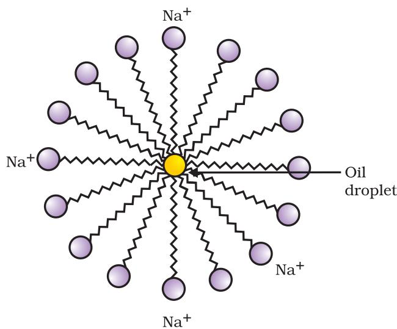  
Figure 4.12 Formation of micelles

This activity demonstrates the effect of soap in cleaning. Most dirt is oily in nature and as you know, oil does not dissolve in water. The molecules of soap are sodium or potassium salts of long-chain carboxylic acids. The ionicend of soap interacts with water while the carbon chain interacts with oil. The soap molecules, thus form structures called micelles (see Fig. 4.12) where one end of the molecules is towards the oil droplet while the ionic-end faces outside. This forms an emulsion in water. The soap micelle thus helps in pulling out the dirt in water and we can wash our clothes clean (Fig. 4.13).

Can you draw the structure of the micelle that would be formed if you dissolve soap in a hydrocarbon?

## Micelles

Soaps are molecules in which the two ends have differing properties, one is hydrophilic, that is, it interacts with water, while the other end is hydrophobic, that is, it interacts with hydrocarbons. When soap is at the surface of water, the hydrophobic ‘tail’ of soap will not be soluble in water and the soap will align along the surface of water with the ionic end in water and the hydrocarbon ‘tail’ protruding out of water. Inside water, these molecules have a unique orientation that keeps the hydrocarbon portion out of the water. Thus,

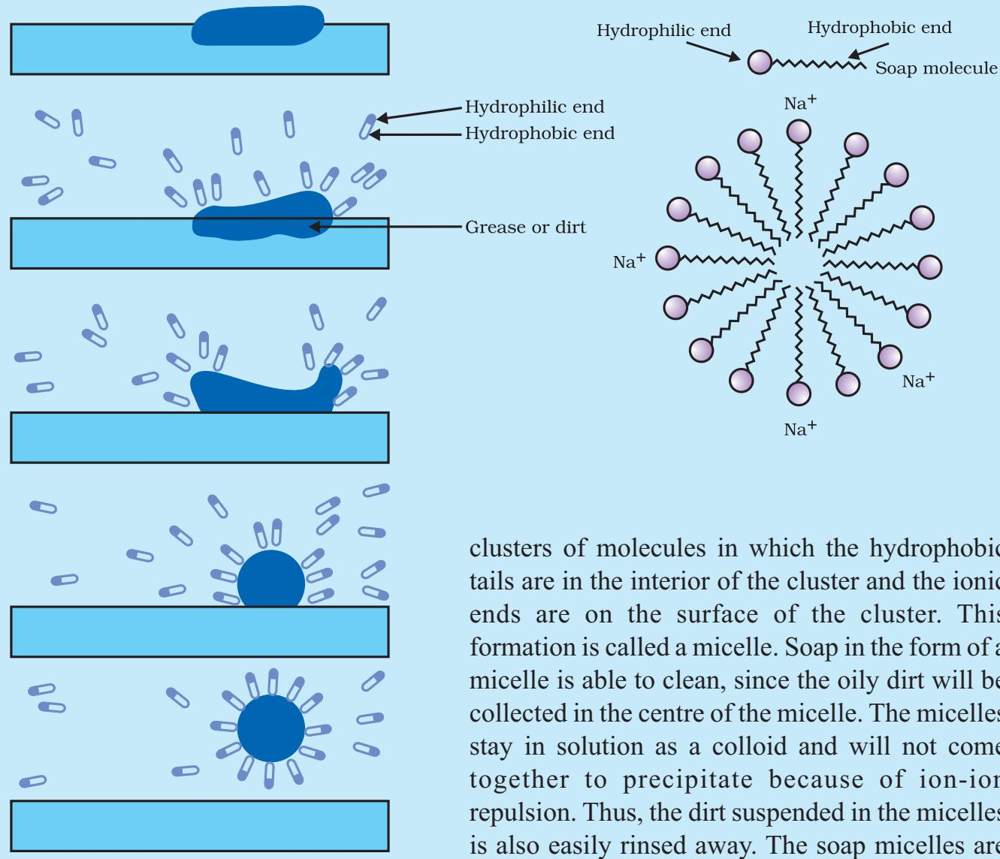  
Figure 4.13 Effect of soap in cleaning

a large enough to scatter light. Hence a soap solution appears cloudy.

### Activity 4.11

Take about $1 0 ~ \mathrm { m L }$ of distilled water (or rain water) and $1 0 \ \mathrm { m L }$ of hard water (from a tubewell or hand-pump) in separate test tubes.   
Add a couple of drops of soap solution to both.   
Shake the test tubes vigorously for an equal period of time and observe the amount of foam formed.   
In which test tube do you get more foam?   
In which test tube do you observe a white curdy precipitate?

Note for the teacher: If hard water is not available in your locality, prepare some h a r d w a t e r b y d i s s o l v i n g hydrogencarbonates / sulphates / chlorides of calcium or magnesium in water.

### Activity 4.12

Take two test tubes with about $1 0 \mathrm { m L }$ of hard water in each.   
Add five drops of soap solution to one and five drops of detergent solution to the other.   
■ Shake both test tubes for the same period.   
Do both test tubes have the same amount of foam?   
In which test tube is a curdy solid formed?

Have you ever observed while bathing that foam is formed with d culty and an insoluble iffi substance (scum) remains after washing with water? This is caused by the reaction of soap with the calcium and magnesium salts, which cause the hardness of water. Hence you need to use a larger amount of soap. This problem is overcome by using another class of compounds called detergents as cleansing agents. Detergents are generally sodium salts of sulphonic acids or ammonium salts with chlorides or bromides ions, etc. Both have long hydrocarbon chain. The charged ends of these compounds do not form insoluble precipitates with the calcium and magnesium ions in hard water. Thus, they remain ctive in hard effe water. Detergents are usually used to make shampoos and products for cleaning clothes.

## QUESTIONS

1. Would you be able to check if water is hard by using a detergent?   
2. People use a variety of methods to wash clothes. Usually after adding the soap, they ‘beat’ the clothes on a stone, or beat it with a paddle, scrub with a brush or the mixture is agitated in a washing machine. Why is agitation necessary to get clean clothes?

## What you have learnt

■ Carbon is a versatile element that forms the basis for all living organisms and many of the things we use.   
■ This large variety of compounds is formed by carbon because of its tetravalency and the property of catenation that it exhibits.   
■ Covalent bonds are formed by the sharing of electrons between two atoms so that both can achieve a completely filled outermost shell.   
■ Carbon forms covalent bonds with itself and other elements such as hydrogen, oxygen, sulphur, nitrogen and chlorine.   
■ Carbon also forms compounds containing double and triple bonds between carbon atoms. These carbon chains may be in the form of straight chains, branched chains or rings.   
■ The ability of carbon to form chains gives rise to a homologous series of compounds in which the same functional group is attached to carbon chains of different lengths.   
■ The functional groups such as alcohols, aldehydes, ketones and carboxylic acids bestow characteristic properties to the carbon compounds that contain them.   
■ Carbon and its compounds are some of our major sources of fuels.   
■ Ethanol and ethanoic acid are carbon compounds of importance in our daily lives.   
■ The action of soaps and detergents is based on the presence of both hydrophobic and hydrophilic groups in the molecule and this helps to emulsify the oily dirt and hence its removal.

## ExERCISES

1. Ethane, with the molecular formula $\mathrm { C } _ { 2 } \mathrm { H } _ { 6 }$ has

(a) 6 covalent bonds.   
(b) 7 covalent bonds.   
(c) 8 covalent bonds.   
(d) 9 covalent bonds.

2. Butanone is a four-carbon compound with the functional group

(a) carboxylic acid.   
(b) aldehyde.   
(c) ketone.   
(d) alcohol.

3. While cooking, if the bottom of the vessel is getting blackened on the outside, it means that

(a) the food is not cooked completely.   
(b) the fuel is not burning completely.   
(c) the fuel is wet.   
(d) the fuel is burning completely.

4. Explain the nature of the covalent bond using the bond formation in $\mathrm { C H } _ { 3 } \mathrm { C l }$ .   
5. Draw the electron dot structures for

(a) ethanoic acid.   
(b) H2S   
(c) propanone.   
(d) $\mathrm { F } _ { 2 }$

6. What is an homologous series? Explain with an example.   
7. How can ethanol and ethanoic acid be differentiated on the basis of their physical and chemical properties?   
8. Why does micelle formation take place when soap is added to water? Will a micelle be formed in other solvents such as ethanol also?   
9. Why are carbon and its compounds used as fuels for most applications?   
10. Explain the formation of scum when hard water is treated with soap.   
11. What change will you observe if you test soap with litmus paper (red and blue)?   
12. What is hydrogenation? What is its industrial application?   
13. Which of the following hydrocarbons undergo addition reactions:

$$
\mathrm {C} _ {2} \mathrm {H} _ {6}, \mathrm {C} _ {3} \mathrm {H} _ {8}, \mathrm {C} _ {3} \mathrm {H} _ {6}, \mathrm {C} _ {2} \mathrm {H} _ {2} \text {a n d} \mathrm {C H} _ {4}.
$$

14. Give a test that can be used to differentiate between saturated and unsaturated hydrocarbons.   
15. Explain the mechanism of the cleaning action of soaps.

### Group Activity

I Use molecular model kits to make models of the compounds you have learnt in this Chapter.   
II Take about $2 0 ~ \mathrm { m L }$ of castor oil/cotton seed oil/linseed oil/soyabean oil in a beaker. Add 30 mL of $20 \%$ sodium hydroxide solution. Heat the mixture with continuous stirring for a few minutes till the mixture thickens. Add $5 \mathrm { - } 1 0 ~ \mathrm { g }$ of common salt to this. Stir the mixture well and allow it to cool.   
You can cut out the soap in fancy shapes. You can also add perfume to the soap before it sets.

# Chapter 9
# Light Reflection and Refraction

We see a variety of objects in the world around us. However, we are unable to see anything in a dark room. On lighting up the room, things become visible. What makes things visible? During the day, the sunlight helps us to see objects. An object reflects light that falls on it. This reflected light, when received by our eyes, enables us to see things. We are able to see through a transparent medium as light is transmitted through it. There are a number of common wonderful phenomena associated with light such as image formation by mirrors, the twinkling of stars, the beautiful colours of a rainbow, bending of light by a medium and so on. A study of the properties of light helps us to explore them.

By observing the common optical phenomena around us, we may conclude that light seems to travel in straight lines. The fact that a small source of light casts a sharp shadow of an opaque object points to this straight-line path of light, usually indicated as a ray of light.

## More to Know!

If an opaque object on the path of light becomes very small, light has a tendency to bend around it and not walk in a straight line – an effect known as the diffraction of light. Then the straight-line treatment of optics using rays fails. To explain phenomena such as diffraction, light is thought of as a wave, the details of which you will study in higher classes. Again, at the beginning of the 20th century, it became known that the wave theory of light often becomes inadequate for treatment of the interaction of light with

matter, and light often behaves somewhat like a stream of particles. This confusion about the true nature of light continued for some years till a modern quantum theory of light emerged in which light is neither a ‘wave’ nor a ‘particle’ – the new theory reconciles the particle properties of light with the wave nature.

In this Chapter, we shall study the phenomena of reflection and refraction of light using the straight-line propagation of light. These basic concepts will help us in the study of some of the optical phenomena in nature. We shall try to understand in this Chapter the reflection of light by spherical mirrors and refraction of light and their application in real life situations.

### 9.1 REFLECTION OFLIGHT

A highly polished surface, such as a mirror, reflects most of the light falling on it. You are already familiar with the laws of reflection of light.

Let us recall these laws –

(i) The angle of incidence is equal to the angle of reflection, and   
(ii) The incident ray, the normal to the mirror at the point of incidence and the reflected ray, all lie in the same plane.

These laws of reflection are applicable to all types of reflecting surfaces including spherical surfaces. You are familiar with the formation of image by a plane mirror. What are the properties of the image? Image formed by a plane mirror is always virtual and erect.

The size of the image is equal to that of the object. The image formed is as far behind the mirror as the object is in front of it. Further, the image is laterally inverted. How would the images be when the reflecting surfaces are curved? Let us explore.

### Activity 9.1

Take a large shining spoon. Try to view your face in its curved surface.   
■ Do you get the image? Is it smaller or larger?   
■ Move the spoon slowly away from your face. Observe the image. How does it change?   
■ Reverse the spoon and repeat the Activity. How does the image look like now?   
■ Compare the characteristics of the image on the two surfaces.

The curved surface of a shining spoon could be considered as a curved mirror. The most commonly used type of curved mirror is the spherical mirror. The reflecting surface of such mirrors can be considered to form a part of the surface of a sphere. Such mirrors, whose reflecting surfaces are spherical, are called spherical mirrors. We shall now study about spherical mirrors in some detail.

### 9.2 SPHERICALMIRRORS

The reflecting surface of a spherical mirror may be curved inwards or outwards. A spherical mirror, whose reflecting surface is curved inwards, that is, faces towards the centre

of the sphere, is called a concave mirror. A spherical mirror whose reflecting surface is curved outwards, is called a convex mirror. The schematic representation of these mirrors is shown in Fig. 9.1. You may note in these diagrams that the back of the mirror is shaded.

You may now understand that the surface of the spoon curved inwards can be approximated to a concave mirror and the surface of the spoon bulged outwards can be approximated to a convex mirror.

Before we move further on spherical mirrors, we need to recognise and understand the meaning of a few terms. These terms are commonly used in discussions about spherical mirrors. The centre of the reflecting surface of a spherical mirror is a point called the pole. It lies on the surface of the mirror. The pole is usually represented by the letter P.

  
(a) Concave mirror

  
(b) Convex mirror   
Figure 9.1 Schematic representation of spherical mirrors; the shaded side is non-reflecting.

The reflecting surface of a spherical mirror forms a part of a sphere. This sphere has a centre. This point is called the centre of curvature of the spherical mirror. It is represented by the letter C. Please note that the centre of curvature is not a part of the mirror. It lies outside its reflecting surface. The centre of curvature of a concave mirror lies in front of it. However, it lies behind the mirror in case of a convex mirror. You may note this in Fig.9.2 (a) and (b). The radius of the sphere of which the reflecting surface of a spherical mirror forms a part, is called the radius of curvature of the mirror. It is represented by the letter R. You may note that the distance PC is equal to the radius of curvature. Imagine a straight line passing through the pole and the centre of curvature of a spherical mirror. This line is called the principal axis. Remember that principal axis is normal to the mirror at its pole. Let us understand an important term related to mirrors, through an Activity.

### Activity 9.2

CAUTION: Do not look at the Sun directly or even into a mirror reflecting sunlight. It may damage your eyes.

Hold a concave mirror in your hand and direct its reflecting surface towards the Sun.   
■ Direct the light reflected by the mirror on to a sheet of paper held close to the mirror.   
Move the sheet of paper back and forth gradually until you find on the paper sheet a bright, sharp spot of light.   
Hold the mirror and the paper in the same position for a few minutes. What do you observe? Why?

The paper at first begins to burn producing smoke. Eventually it may even catch fire. Why does it burn? The light from the Sun is converged at a point, as a sharp, bright spot bythe mirror. In fact, this spot of light is the image of the Sun on the sheet of paper. This point is the focus of the concave mirror. The heat produced due to the concentration of sunlight ignites the paper. The distance of this image from the position of the mirror gives the approximate value of focal length of the mirror.

Let us try to understand this observation with the help of a ray diagram.

Observe Fig.9.2 (a) closely. Anumber of rays parallel to the principal axis are falling on a concave mirror. Observe the reflected rays. They are all meeting/intersecting at a point on the principal axis of the mirror. This point is called the principal focus of the concave mirror. Similarly, observe Fig. 9.2 (b). How are the rays parallel to the principal axis, reflected by a convex mirror? The reflected rays appear to come from a point on the principal axis. This point is called the principal focus of the convex mirror. The principal focus is represented by the letter F. The distance between the pole and the principal focus of a spherical mirror is called the focal length. It is represented by the letter f.

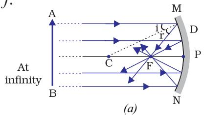

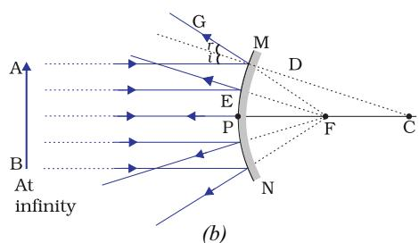  
Figure 9.2   
(a) Concave mirror   
(b) Convex mirror

The reflecting surface of a spherical mirror is by-and-large spherical. The surface, then, has a circular outline. The diameter of the reflecting surface of spherical mirror is called its aperture. In Fig.9.2, distance MN represents the aperture. We shall consider in our discussion only such spherical mirrors whose aperture is much smaller than its radius of curvature.

Is there a relationship between the radius of curvature R, and focal length f, of a spherical mirror? For spherical mirrors of small apertures, the radius of curvature is found to be equal to twice the focal length. We put this as $\mathrm { R } = 2 f$ . This implies that the principal focus of a spherical mirror lies midway between the pole and centre of curvature.

#### 9.2.1 Image Formation by Spherical Mirrors

You have studied about the image formation by plane mirrors. You also know the nature, position and relative size of the images formed by them. How about the images formed by spherical mirrors? How can we locate the image formed by a concave mirror for different positions of the object? Are the images real or virtual? Are they enlarged, diminished or have the same size? We shall explore this with an Activity.

### Activity 9.3

You have already learnt a way of determining the focal length of a concave mirror. In Activity 9.2, you have seen that the sharp bright spot of light you got on the paper is, in fact, the image of the Sun. It was a tiny, real, inverted image. You got the approximate focal length of the concave mirror by measuring the distance of the image from the mirror.

■ Take a concave mirror. Find out its approximate focal length in the way described above. Note down the value of focal length. (You can also find it out by obtaining image of a distant object on a sheet of paper.)   
■ Mark a line on a Table with a chalk. Place the concave mirror on a stand. Place the stand over the line such that its pole lies over the line.   
■ Draw with a chalk two more lines parallel to the previous line such that the distance between any two successive lines is equal to the focal length of the mirror. These lines will now correspond to the positions of the points P, F and C, respectively. Remember – For a spherical mirror of small aperture, the principal focus F lies mid-way between the pole P and the centre of curvature C.   
■ Keep a bright object, say a burning candle, at a position far beyond C. Place a paper screen and move it in front of the mirror till you obtain a sharp bright image of the candle flame on it.   
■ Observe the image carefully. Note down its nature, position and relative size with respect to the object size.   
Repeat the activity by placing the c a n d l e – ( a ) j u s t b e y o n d C , (b) at C, (c) between F and C, (d) at F, and (e) between P and F.   
■ In one of the cases, you may not get the image on the screen. Identify the position of the object in such a case. Then, look for its virtual image in the mirror itself.   
Note down and tabulate your observations.

You will see in the above Activity that the nature, position and size of the image formed by a concave mirror depends on the position of the object in relation to points P, F and C. The image formed is real for some positions of the object. It is found to be a virtual image for a certain other position. The image is either magnified, reduced or has the same size, depending on the position of the object. A summary of these observations is given for your reference in Table 9.1.

Table 9.1 Image formation by a concave mirror for different positions of the object   

<table><tr><td>Position of the object</td><td>Position of the image</td><td>Size of the image</td><td>Nature of the image</td></tr><tr><td>At infinity</td><td>At the focus F</td><td>Highly diminished, point-sized</td><td>Real and inverted</td></tr><tr><td>Beyond C</td><td>Between F and C</td><td>Diminished</td><td>Real and inverted</td></tr><tr><td>At C</td><td>At C</td><td>Same size</td><td>Real and inverted</td></tr><tr><td>Between C and F</td><td>Beyond C</td><td>Enlarged</td><td>Real and inverted</td></tr><tr><td>At F</td><td>At infinity</td><td>Highly enlarged</td><td>Real and inverted</td></tr><tr><td>Between Pand F</td><td>Behind the mirror</td><td>Enlarged</td><td>Virtual and erect</td></tr></table>

#### 9.2.2 Representation of Images Formed by Spherical Mirrors Using Ray Diagrams

We can also study the formation of images by spherical mirrors by drawing ray diagrams. Consider an extended object, of finite size, placed in front of a spherical mirror. Each small portion of the extended object acts like a point source. An infinite number of rays originate from each of these points. To construct the ray diagrams, in order to locate the image of an

object, an arbitrarily large number of rays emanating from a point could be considered. However, it is more convenient to consider only two rays, for the sake of clarity of the ray diagram. These rays are so chosen that it is easy to know their directions after reflection from the mirror.

The intersection of at least two reflected rays give the position of image of the point object. Any two of the following rays can be considered for locating the image.

  
(a)   
(b)   
Figure 9.3

(i) A ray parallel to the principal axis, after reflection, will pass through the principal focus in case of a concave mirror or appear to diverge fromthe principal focus in case of a convex mirror. This is illustrated in Fig.9.3 (a) and (b).

(ii) A ray passing through the principal focus of a concave mirror or a ray which is directed towards the principal focus of a convex mirror, after reflection, will emerge parallel to the principal axis. This is illustrated in Fig.9.4 (a) and (b).

  
Figure 9.4

(iii) A ray passing through the centre of curvature of a concave mirror or directed in the direction of the centre of curvature of a convex mirror, after reflection, is reflected back along the same path. This is illustrated in Fig.9.5 (a) and (b). The light rays come back along the same path because the incident rays fall on the mirror along the normal to the reflecting surface.

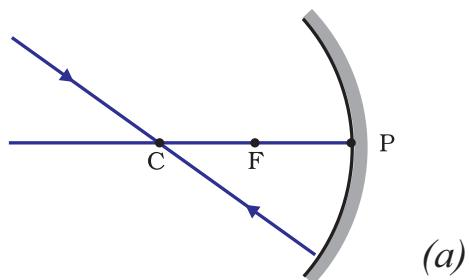

  
Figure 9.5

(iv) A ray incident obliquely to the principal axis, towards a point P (pole of the mirror), on the concave mirror [Fig. 9.6 (a)] or a convex mirror [Fig. 9.6 (b)], is reflected obliquely. The incident and reflected rays follow the laws of reflection at the point of incidence (point P), making equal angles with the principal axis.

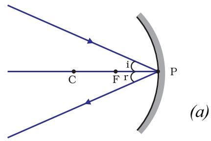

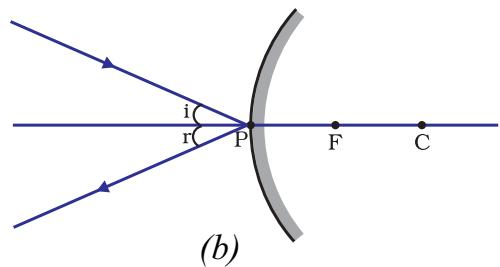  
Figure 9.6

Remember that in all the above cases the laws of reflection are followed. At the point of incidence, the incident ray is reflected in such a way that the angle of reflection equals the angle of incidence.

## (a) Image formation by Concave Mirror

Figure 9.7 illustrates the ray diagrams for the formation of image by a concave mirror for various positions of the object.

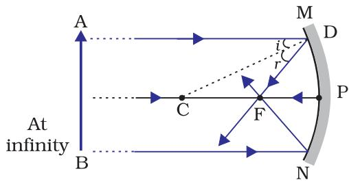  
(@)

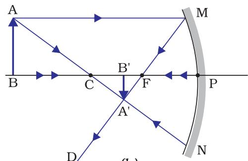  
(b)

  
(c)

  
(d)

  
(e)

  
f   
Figure 9.7 Ray diagrams for the image formation by a concave mirror

### Activity 9.4

■ Draw neat ray diagrams for each position of the object shown in Table 9.1.   
■ You may take any two of the rays mentioned in the previous section for locating the image.   
■ Compare your diagram with those given in Fig. 9.7.   
■ Describe the nature, position and relative size of the image formed in each case.   
■ Tabulate the results in a convenient format.

## Uses of concave mirrors

Concave mirrors are commonly used in torches, search-lights and vehicles headlights to get powerful parallel beams of light. They are often used as shaving mirrors to see a larger image of the face. The dentists use concave mirrors to see large images of the teeth of patients. Large concave mirrors are used to concentrate sunlight to produce heat in solar furnaces.

## (b) Image formation by a Convex Mirror

We studied the image formation by a concave mirror. Now we shall study the formation of image by a convex mirror.

### Activity 9.5

Take a convex mirror. Hold it in one hand.   
■ Hold a pencil in the upright position in the other hand.   
■ Observe the image of the pencil in the mirror. Is the image erect or inverted? Is it diminished or enlarged?   
■ Move the pencil away from the mirror slowly. Does the image become smaller or larger?   
■ Repeat this Activity carefully. State whether the image will move closer to or farther away from the focus as the object is moved away from the mirror?

We consider two positions of the object for studying the image formed by a convex mirror. First is when the object is at infinity and the second position is when the object is at a finite distance from the mirror. The ray diagrams for the formation of image by a convex mirror for these two positions of the object are shown in Fig.9.8 (a) and (b), respectively. The results are summarised in Table 9.2.

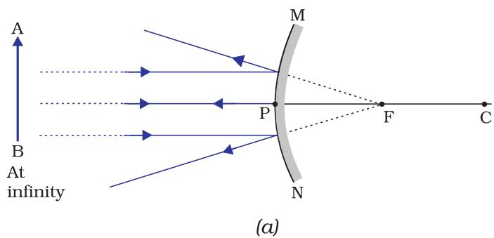

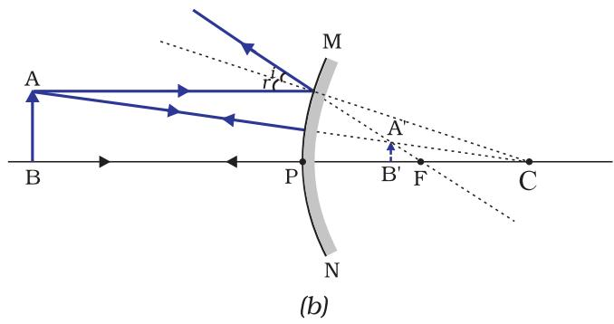  
Figure 9.8 Formation of image by a convex mirror

Table 9.2 Nature, position and relative size of the image formed by a convex mirror   

<table><tr><td>Position of the object</td><td>Position of the image</td><td>Size of the image</td><td>Nature of the image</td></tr><tr><td>At infinity</td><td>At the focus F, behind the mirror</td><td>Highly diminished, point-sized</td><td>Virtual and erect</td></tr><tr><td>Between infinity and the pole P of the mirror</td><td>Between P and F, behind the mirror</td><td>Diminished</td><td>Virtual and erect</td></tr></table>

You have so far studied the image formation by a plane mirror, a concave mirror and a convex mirror. Which of these mirrors will give the full image of a large object? Let us explore through an Activity.

### Activity 9.6

■ Observe the image of a distant object, say a distant tree, in a plane mirror.   
■ Could you see a full-length image?   
■ Try with plane mirrors of different sizes. Did you see the entire object in the image?   
■ Repeat this Activity with a concave mirror. Did the mirror show full length image of the object?   
■ Now try using a convex mirror. Did y o u s u c c e e d ? E x p l a i n y o u r observations with reason.

You can see a full-length image of a tall building/tree in a small convex mirror. One such mirror is fitted in a wall of Agra Fort facing Taj Mahal. If you visit the Agra Fort, try to observe the full image of Taj Mahal. To view distinctly, you should stand suitably at the terrace adjoining the wall.

## Uses of convex mirrors

Convex mirrors are commonly used as rear-view (wing) mirrors in vehicles. These mirrors are fitted on the sides of the vehicle, enabling the driver to see traffic behind him/her to facilitate safe driving. Convex mirrors are preferred because they always give an erect, though diminished, image. Also, they have a wider field of view as they are curved outwards. Thus, convex mirrors enable the driver to view much larger area than would be possible with a plane mirror.

## 

1. Define the principal focus of a concave mirror.   
2. The radius of curvature of a spherical mirror is $2 0 \mathrm { c m }$ . What is its focal length?   
3. Name a mirror that can give an erect and enlarged image of an object.   
4. Why do we prefer a convex mirror as a rear-view mirror in vehicles?

#### 9.2.3 Sign Convention for Reflection by Spherical Mirrors

While dealing with the reflection of light by spherical mirrors, we shall follow a set of sign conventions called the New Cartesian Sign Convention. In this convention, the pole (P) of the mirror is taken as the origin (Fig. 9.9). The principal axis of the mirror is taken as the x-axis $( \mathrm { { X } } ^ { \prime } \mathrm { { X } } )$ of the coordinate system. The conventions are as follows –

(i) The object is always placed to the left of the mirror. This implies that the light from the object falls on the mirror from the lefthand side.   
(ii) All distances parallel to the principal axis are measured from the pole of the mirror.   
(iii) All the distances measured to the right of the origin (along + x-axis) are taken as positive while those measured to the left of the origin (along – x-axis) are taken as negative.   
(iv) Distances measured perpendicular to and above the principal axis (along + y-axis) are taken as positive.   
(v) Distances measured perpendicular to and below the principal axis (along –y-axis) are taken as negative.

The New Cartesian Sign Convention described above is illustrated in Fig.9.9 for your reference. These sign conventions are applied to obtain the mirror formula and solve related numerical problems.

  
Figure 9.9 The New Cartesian Sign Convention for spherical mirrors

#### 9.2.4 Mirror Formula and Magnification

In a spherical mirror, the distance of the object from its pole is called the object distance (u). The distance of the image from the pole of the mirror is called the image distance (v). You already know that the distance of the principal focus from the pole is called the focal length (f). There is a relationship between these three quantities given by the mirror formula which is expressed as

$$
\frac {1}{v} + \frac {1}{u} = \frac {1}{f} \tag {9.1}
$$

This formula is valid in all situations for all spherical mirrors for all positions of the object. You must use the New Cartesian Sign Convention while substituting numerical values for u, v, f, and R in the mirror formula for solving problems.

## Magnification

Magnification produced by a spherical mirror gives the relative extent to which the image of an object is magnified with respect to

the object size. It is expressed as the ratio of the height of the image to the height of the object. It is usually represented by the letter m.

If h is the height of the object and $\mathrm { h } ^ { \mathsf { I } }$ is the height of the image, then the magnification m produced by a spherical mirror is given by

$$
\mathrm {m} = \frac {\text {H e i g h t o f t h e i m a g e} \left(h ^ {\prime}\right)}{\text {H e i g h t o f t h e o b j e c t} (h)}
$$

$$
\mathrm {m} = \frac {h ^ {\prime}}{h} \tag {9.2}
$$

The magnification m is also related to the object distance (u) and image distance (v). It can be expressed as:

$$
\text {M a n i n f i c a t i o n} (\mathrm {m}) = \frac {h ^ {\prime}}{h} = - \frac {v}{u} \tag {9.3}
$$

You may note that the height of the object is taken to be positive as the object is usually placed above the principal axis. The height of the image should be taken as positive for virtual images. However, it is to be taken as negative for real images. A negative sign in the value of the magnification indicates that the image is real. A positive sign in the value of the magnification indicates that the image is virtual.

## Example 9.1

A convex mirror used for rear-view on an automobile has a radius of curvature of $3 . 0 0 \mathrm { m }$ . If a bus is located at $5 . 0 0 \mathrm { m }$ from this mirror, find the position, nature and size of the image.

## Solution

$$
\text {R a d i u s o f c u r v a t u r e , R} = + 3. 0 0 \mathrm {m};
$$

$$
\text {O b j e c t - d i s t a n c e}, \quad \mathrm {u} \quad = \quad - 5. 0 0 \mathrm {m};
$$

$$
\text {I m a g e - d i s t a n c e}, \quad \mathrm {v} \quad = \quad ?
$$

$$
\text {H e i g h t o f t h e i m a g e ,} \mathrm {h} ^ {\prime} \quad = \quad ?
$$

Focal length, $\mathrm { f } { = } \mathrm { R } / 2 { = } + \ \frac { 3 . 0 0 \ \mathrm { m } } { 2 } = + 1 . 5 0 \ \mathrm { m }$ (as the principal focus of a convex mirror is behind the mirror)

Since ${ \frac { 1 } { \nu } } + { \frac { 1 } { u } } = { \frac { 1 } { f } }$

$$
\begin{array}{l} \text {o r}, \frac {1}{v} = \frac {1}{f} - \frac {1}{u} = + \frac {1}{1 . 5 0} - \frac {1}{(- 5 . 0 0)} = \frac {1}{1 . 5 0} + \frac {1}{5 . 0 0} \\ = \frac {5 . 0 0 + 1 . 5 0}{7 . 5 0} \\ \end{array}
$$

$$
v = \frac {+ 7 . 5 0}{6 . 5 0} = + 1. 1 5 m
$$

The image is 1.15 m at the back of the mirror.

Magnification, $\mathrm { m } = { \frac { h ^ { \prime } } { h } } = - \ { \frac { \nu } { u } } = - { \frac { 1 . 1 5 \mathrm { m } } { - 5 . 0 0 \mathrm { m } } }$

$$
= + 0. 2 3
$$

The image is virtual, erect and smaller in size by a factor of 0.23.

## Example 9.2

An object, 4.0 cm in size, is placed at 25.0 cm in front of a concave mirror of focal length 15.0 cm. At what distance from the mirror should a screen be placed in order to obtain a sharp image? Find the nature and the size of the image.

## Solution

Object-size, $\mathrm { h } = + 4 . 0 \mathrm { c m }$ ;

Object-distance, $\mathtt { u } = - 2 5 . 0 \mathtt { c m }$ ;

Focal length, $\mathrm { f = - 1 } 5 . 0 \mathrm { c m }$

Image-distance, $\mathbf { V } = ?$

Image-size, $h ^ { \prime } = ?$

From Eq. (10.1):

$$
\frac {1}{v} + \frac {1}{u} = \frac {1}{f}
$$

or, ${ \frac { 1 } { \nu } } = { \frac { 1 } { f } } - { \frac { 1 } { u } } = { \frac { 1 } { - 1 5 . 0 } } - { \frac { 1 } { - 2 5 . 0 } } = - { \frac { 1 } { 1 5 . 0 } } + { \frac { 1 } { 2 5 . 0 } }$

$$
\mathrm {o r}, \frac {1}{v} = \frac {- 5 . 0 + 3 . 0}{7 5 . 0} = \frac {- 2 . 0}{7 5 . 0} \mathrm {o r , v = - 3 7 . 5 c m}
$$

The screen should be placed at $3 7 . 5 \mathrm { c m }$ in front of the mirror. The image is real.

Also, magnification, ${ \mathrm { m } } = { \frac { h ^ { \prime } } { h } } = - \ { \frac { \nu } { u } }$

$$
\text {o r ,} h ^ {\prime} = - \frac {v h}{u} = - \frac {(- 3 7 . 5 \mathrm {c m}) (+ 4 . 0 \mathrm {c m})}{(- 2 5 . 0 \mathrm {c m})}
$$

Height of the image, $h ^ { \prime } { = } { - } 6 . 0 \mathsf { c m }$

The image is inverted and enlarged.

## 

1. Find the focal length of a convex mirror whose radius of curvature is $3 2 \mathrm { c m }$ .   
2. A concave mirror produces three times magnified (enlarged) real image of an object placed at $1 0 \mathrm { c m }$ in front of it. Where is the image located?

### 9.3 REFRACTION OFLIGHT

Light seems to travel along straight-line paths in a transparent medium. What happens when light enters from one transparent medium to another? Does it still move along a straightline path or change its direction? We shall recall some of our day-to-day experiences.

You might have observed that the bottom of a tank or a pond containing water appears to be raised. Similarly, when a thick glass slab is placed over some printed matter, the letters appear raised when viewed through the glass slab. Why does it happen? Have you seen a pencil partly immersed in water in a glass tumbler? It appears to be displaced at the interface of air and water. You might have observed that a lemon kept in water in a glass tumbler appears to be bigger than its actual size, when viewed from the sides. How can you account for such experiences?

Let us consider the case of the apparent displacement of a pencil, partly immersed in water. The light reaching you from the portion of the pencil inside water seems to come from a different direction, compared to the part above water. This makes the pencil appear to be displaced at the interface. For similar reasons, the letters appear to be raised, when seen through a glass slab placed over it.

Does a pencil appear to be displaced to the same extent, if instead of water, we use liquids like kerosene or turpentine? Will the letters appear to rise to the same height if we replace a glass slab with a transparent plastic slab? You will find that the extent of the effect is different for different pair of media. These observations indicate that light does not travel in the same direction in all media. It appears that when travelling obliquely from one medium to another, the direction of propagation of light in the second medium changes. This phenomenon is known as refraction of light. Let us understand this phenomenon further by doing a few activities.

### Activity 9.7

■ Place a coin at the bottom of a bucket filled with water.   
■ With your eye to a side above water, try to pick up the coin in one go. Did you succeed in picking up the coin?   
Repeat the Activity. Why did you not succeed in doing it in one go?   
■ Ask your friends to do this. Compare your experience with theirs.

### Activity 9.8

Place a large shallow bowl on a Table and put a coin in it.   
■ Move away slowly from the bowl. Stop when the coin just disappears from your sight.   
■ Ask a friend to pour water gently into the bowl without disturbing the coin.   
■ Keep looking for the coin from your position. Does the coin becomes visible again from your position? How could this happen?

The coin becomes visible again on pouring water into the bowl. The coin appears slightly raised above its actual position due to refraction of light.

### Activity 9.9

Draw a thick straight line in ink, over a sheet of white paper placed on a Table.   
Place a glass slab over the line in such a way that one of its edges makes an angle with the line.   
Look at the portion of the line under the slab from the sides. What do you observe? Does the line under the glass slab appear to be bent at the edges?   
Next, place the glass slab such that it is normal to the line. What do you observe now? Does the part of the line under the glass slab appear bent?   
■ Look at the line from the top of the glass slab. Does the part of the line, beneath the slab, appear to be raised? Why does this happen?

#### 9.3.1 Refraction through a Rectangular Glass Slab

To understand the phenomenon of refraction of light through a glass slab, let us do an Activity.

### Activity 9.10

■ Fix a sheet of white paper on a drawing board using drawing pins.   
■ Place a rectangular glass slab over the sheet in the middle.   
■ Draw the outline of the slab with a pencil. Let us name the outline as ABCD.   
■ Take four identical pins.   
■ Fix two pins, say E and F, vertically such that the line joining the pins is inclined to the edge AB.   
■ Look for the images of the pins E and F through the opposite edge. Fix two other pins, say G and H, such that these pins and the images of E and F lie on a straight line.   
■ Remove the pins and the slab.   
■ Join the positions of tip of the pins E and F and produce the line up to AB. Let EF meet AB at O. Similarly, join the positions of tip of the pins G and H and produce it up to the edge CD. Let HG I meet CD at O .   
■ IJoin O and O . Also produce EF up to P, as shown by a dotted line in Fig. 9.10.

In this Activity, you will note, the light ray has changed its direction at points O and $\mathrm { O } ^ { \mathsf { I } }$ . Note that both the points O and $\mathrm { O } ^ { \mathsf { I } }$ lie on surfaces separating two transparent media. Draw a perpendicular NN’ to AB at O and another perpendicular MM to CD at I $\mathrm { O } ^ { \mathsf { I } }$ . The light ray at point O has entered from a rarer medium to a denser medium, that is, from air to glass. Note that the light ray has bent towards

the normal. At O , the light ray has entered fromI glass to air, that is, from a denser medium to a rarer medium. The light here has bent away from the normal. Compare the angle of incidence with the angle of refraction at both refracting surfaces AB and CD.

In Fig. 9.10, a ray EO is obliquely incident on surface AB, called incident ray. OO is theI refracted ray and $\mathrm { o } ^ { \mathrm { \prime } } \mathrm { H }$ is the emergent ray. You may observe that the emergent ray is parallel to the direction of the incident ray. Why does it happen so? The extent of bending of the ray of light at the opposite parallel faces AB (air-glass interface) and CD (glass-air interface) of the rectangular glass slab is equal and opposite. This is why the ray emerges parallel to the incident ray. However, the light ray is shifted sideward slightly. What happens when a light ray is incident normally to the interface of two media? Try and find out.

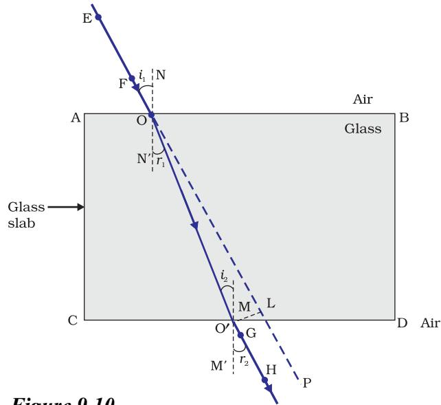  
Figure 9.10 Refraction of light through a rectangular glass slab

Now you are familiar with the refraction of light. Refraction is due to change in the speed of light as it enters from one transparent medium to another. Experiments show that refraction of light occurs according to certain laws.

The following are the laws of refraction of light.

(i) The incident ray, the refracted ray and the normal to the interface of two transparent media at the point of incidence, all lie in the same plane.   
(ii) The ratio of sine of angle of incidence to the sine of angle of refraction is a constant, for the light of a given colour and for the given pair of media. This law is also known as Snell’s law of refraction. (This is true for angle $0 < \mathrm { i } < 9 0 ^ { \mathrm { o } }$ )

If i is the angle of incidence and r is the angle of refraction, then,

$$
\frac {\sin i}{\sin r} = \text {c o n s t a n t} \tag {9.4}
$$

This constant value is called the refractive index of the second medium with respect to the first. Let us study about refractive index in some detail.

#### 9.3.2 The Refractive Index

You have already studied that a ray of light that travels obliquely from one transparent medium into another will change its direction in the second medium. The extent of the change in direction that takes place in a given pair of media may be expressed in terms of the refractive index, the “constant” appearing on the right-hand side of Eq.(9.4).

The refractive index can be linked to an important physical quantity, the relative speed of propagation of light in different media. It turns out that light propagates with different speeds in different media. Light travels fastest in vacuum with speed of $3 { \times } 1 0 ^ { 8 } \mathrm { m } \mathrm { s } ^ { - 1 }$ . In air, the speed of light is only marginally less, compared

to that in vacuum. It reduces considerably in glass or water. The value of the refractive index for a given pair of media depends upon the speed of light in the two media, as given below.

Consider a ray of light travelling from medium 1 into medium 2, as shown in Fig.9.11. Let $\mathbf { V } _ { 1 }$ be the speed of light in medium 1 and $\mathbf { V } _ { 2 }$ be the speed of light in medium 2. The refractive index of medium 2 with respect to medium 1 is given by the ratio of the speed of light in medium 1 and the speed of light in medium 2. This is usually represented by the symbol $\mathbf { n } _ { 2 1 }$ . This can be expressed in an equation form as

$$
n _ {2 1} = \frac {\text {S p e e d o f l i g h t i n m e d i u m 1}}{\text {S p e e d o f l i g h t i n m e d i u m 2}} = \frac {v _ {1}}{v _ {2}} \tag {9.5}
$$

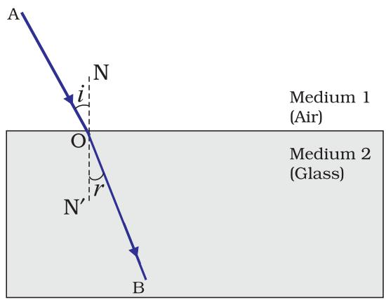  
Figure 9.11

By the same argument, the refractive index of medium 1 with respect to medium 2 is represented as $\mathbf { n } _ { 1 2 }$ . It is given by

$$
n _ {1 2} = \frac {\text {S p e e d o f l i g h t i n m e d i u m 2}}{\text {S p e e d o f l i g h t i n m e d i u m 1}} = \frac {v _ {2}}{v _ {1}} \tag {9.6}
$$

If medium 1 is vacuum or air, then the refractive index of medium 2 is considered with respect to vacuum. This is called the absolute refractive index of the medium. It is simply represented as $\boldsymbol { \mathrm { n } } _ { 2 }$ . If c is the speed of light in air

and v is the speed of light in the medium, then, the refractive index of the medium $\mathfrak { n } _ { \mathrm { m } }$ is given by

$$
n _ {m} = \frac {\text {S p e e d o f l i g h t i n a i r}}{\text {S p e e d o f l i g h t i n t h e m e d i u m}} = \frac {c}{v} \tag {9.7}
$$

The absolute refractive index of a medium is simply called its refractive index. The refractive index of several media is given in Table 9.3. From the Table you can know that the refractive index of water, $\mathtt { n _ { w } } = 1 . 3 3$ . This means that the ratio of the speed of light in air and the speed of light in water is equal to 1.33. Similarly, the refractive index of crown glass, $\mathtt { n _ { g } } = 1 . 5 2$ . Such data are helpful in many places. However, you need not memorise the data.

Table 9.3 Absolute refractive index of some material media   

<table><tr><td>Material medium</td><td>Refractive index</td><td>Material medium</td><td>Refractive index</td></tr><tr><td rowspan="2">Air</td><td rowspan="2">1.0003</td><td>Canada</td><td rowspan="2">1.53</td></tr><tr><td>Balsam</td></tr><tr><td>Ice</td><td>131</td><td></td><td></td></tr><tr><td>Water</td><td>1.33</td><td>Rock salt</td><td>1.54</td></tr><tr><td>Alcohol</td><td>1.36</td><td></td><td></td></tr><tr><td>Kerosene</td><td>1.44</td><td>Carbon disulphide</td><td>1.63</td></tr><tr><td>Fused quartz</td><td>1.46</td><td>Dense flint glass</td><td>1.65</td></tr><tr><td>Tarpentine oil</td><td>1.47</td><td>Ruby</td><td>1.71</td></tr><tr><td>Benzene</td><td>1.50</td><td>Sapphire</td><td>1.77</td></tr><tr><td>Crown glass</td><td>1.52</td><td>Diamond</td><td>2.42</td></tr></table>

Note from Table 9.3 that an optically denser medium may not possess greater mass density. For example, kerosene having higher refractive index, is optically denser than water, although its mass density is less than water.

## More to Know!

The ability of a medium to refract light is also expressed in terms of its optical density. Optical density has a definite connotation. It is not the same as mass density. We have been using the terms ‘rarer medium’ and ‘denser medium’ in this Chapter. It actually means ‘optically rarer medium’ and ‘optically denser medium’, respectively. When can we say that a medium is optically denser than the other? In comparing two media, the one with the larger refractive index is optically denser medium than the other. The other medium of lower refractive index is optically rarer. The speed of light is higher in a rarer medium than a denser medium. Thus, a ray of light travelling from a rarer medium to a denser medium slows down and bends towards the normal. When it travels from a denser medium to a rarer medium, it speeds up and bends away from the normal.

## 

1. A ray of light travelling in air enters obliquely into water. Does the light ray bend towards the normal or away from the normal? Why?   
2. Light enters from air to glass having refractive index 1.50. What is the speed of light in the glass? The speed of light in vacuum is $3 \times 1 0 ^ { 8 } \mathrm { m } \mathrm { s } ^ { - 1 }$ .   
3. Find out, from Table 9.3, the medium having highest optical density. Also find the medium with lowest optical density.   
4. You are given kerosene, turpentine and water. In which of these does the light travel fastest? Use the information given in Table 9.3.   
5. The refractive index of diamond is 2.42. ? What is the meaning of this statement?

#### 9.3.3 Refraction by Spherical Lenses

You might have seen watchmakers using a small magnifying glass to see tiny parts. Have you ever touched the surface of a magnifying glass with your hand? Is it plane surface or curved? Is it thicker in the middle or at the edges? The glasses used in spectacles and that by a watchmaker are examples of lenses. What is a lens? How does it bend light rays? We shall discuss these in this section.

A transparent material bound by two surfaces, of which one or both surfaces are spherical, forms a lens. This means that a lens is bound by at least one spherical surface. In such lenses, the other surface would be plane. A lens may have two spherical surfaces, bulging outwards. Such a lens is called a double convex lens. It is simply called a convex lens. It is thicker at the middle as compared to the edges. Convex lens converges light rays as shown in Fig. 9.12 (a). Hence convex lenses are also called converging lenses. Similarly, a double concave lens is bounded by two spherical surfaces, curved inwards. It is thicker at the edges than at the middle. Such lenses diverge light rays as shown in Fig. 9.12 (b). Such lenses are also called diverging lenses. A double concave lens is simply called a concave lens.

  
(a)

Figure 9.12   
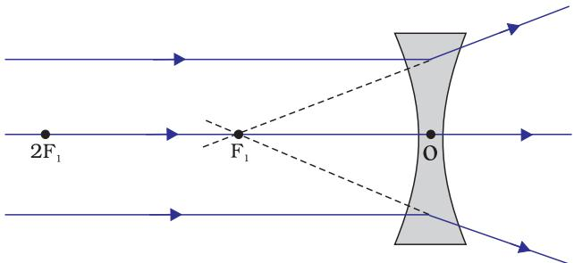  
(a) Converging action of a convex lens,   
(b) diverging action of a concave lens

A lens, either a convex lens or a concave lens, has two spherical surfaces. Each of these surfaces forms a part of a sphere. The centres of these spheres are called centres of curvature of the lens. The centre of curvature of a lens is usually represented by the letter C. Since there are two centres of curvature, we may represent them as $\mathrm { C } _ { 1 }$ and $\mathrm { C } _ { 2 }$ . An imaginary straight line passing through the two centres of curvature of a lens is called its principal axis. The central point of a lens is its optical centre. It is usually represented by the letter O. A ray of light through the optical centre of a lens passes without suffering any deviation. The effective diameter of the circular outline of a spherical lens is called its aperture. We shall confine our discussion in this Chapter to such lenses whose aperture is much less than its radius of curvature and the two centres of curvatures are equidistant from the optical centre O. Such lenses are called thin lenses with small apertures. What happens when parallel rays of light are incident on a lens? Let us do an Activity to understand this.

### Activity 9.11

CAUTION: Do not look at the Sun directly or through a lens while doing this Activity or otherwise. You may damage your eyes if you do so.

■ Hold a convex lens in your hand. Direct it towards the Sun.   
Focus the light from the Sun on a sheet of paper. Obtain a sharp bright image of the Sun.   
■ Hold the paper and the lens in the same position for a while. Keep observing the paper. What happened? Why? Recall your experience in Activity 9.2.

The paper begins to burn producing smoke. It may even catch fire after a while. Why does this happen? The light from the Sun constitutes parallel rays of light. These rays were converged by the lens at the sharp bright spot formed on the paper. In fact, the bright spot you got on the paper is a real image of the Sun. The concentration of the sunlight at a point generated heat. This caused the paper to burn.

Now, we shall consider rays of light parallel to the principal axis of a lens. What happens when you pass such rays of light through a lens? This is illustrated for a convex lens in Fig.9.12 (a) and for a concave lens in Fig.9.12 (b).

Observe Fig.9.12 (a) carefully. Several rays of light parallel to the principal axis are falling on a convex lens. These rays, after refraction from the lens, are converging to a point on the principal axis. This point on the principal axis is called the principal focus of the lens. Let us see now the action of a concave lens.

Observe Fig.9.12 (b) carefully. Several rays of light parallel to the principal axis are falling on a concave lens. These rays, after refraction from the lens, are appearing to diverge from a point on the principal axis. This point on the principal axis is called the principal focus of the concave lens.

If you pass parallel rays from the opposite surface of the lens, you get another principal focus on the opposite side. Letter F is usually used to represent principal focus. However, a lens has two principal foci. They are represented by $\mathrm { F } _ { 1 }$ and $\mathrm { F } _ { 2 }$ . The distance of the principal focus from the optical centre of a lens is called its focal length. The letter $f$ is used to represent the focal length. How can you find the focal length of a convex lens? Recall the Activity 9.11. In this Activity, the distance between the position of the lens and the position of the image of the Sun gives the approximate focal length of the lens.

#### 9.3.4 Image Formation by Lenses

Lenses form images by refracting light. How do lenses form images? What is their nature? Let us study this for a convex lens first.

### Activity 9.12

■ Take a convex lens. Find its approximate focal length in a way described in Activity 9.11.   
■ Draw five parallel straight lines, using chalk, on a long Table such that the distance between the successive lines is equal to the focal length of the lens.   
■ Place the lens on a lens stand. Place it on the central line such that the optical centre of the lens lies just over the line.

■ The two lines on either side of the lens correspond to F and 2F of the lens respectively. Mark them with appropriate letters such as $2 \mathrm { F } _ { \mathrm { 1 3 } }$ , F , $\mathrm { F } _ { 2 }$ and $2 \mathrm { F } _ { 2 }$ , respectively.   
■ Place a burning candle, far beyond $\mathrm { 2 F _ { 1 } }$ to the left. Obtain a clear sharp image on a screen on the opposite side of the lens.   
Note down the nature, position and relative size of the image.   
Repeat this Activity by placing object just behind $2 \mathrm { F } _ { \mathrm { 1 3 } }$ , between $\mathrm { F } _ { 1 }$ and $\mathrm { 2 F _ { 1 } }$ at $\mathrm { F } _ { 1 }$ , between $\mathrm { F } _ { 1 }$ and O. Note down and tabulate your observations.

The nature, position and relative size of the image formed by convex lens for various positions of the object is summarised in Table 9.4.

Table 9.4 Nature, position and relative size of the image formed by a convex lens for various positions of the object   
<table><tr><td>Position of the object</td><td>Position of the image</td><td>Relative Size of the image</td><td>Nature of the image</td></tr><tr><td>At infinity</td><td>At the focus F2</td><td>Highly diminished, point-sized</td><td>Real and inverted</td></tr><tr><td>Beyond 2F</td><td>Between F2and 2F2</td><td>Diminished</td><td>Real and inverted</td></tr><tr><td>At 2F1</td><td>At 2F2</td><td>Same size</td><td>Real and inverted</td></tr><tr><td>Between F1and2F1</td><td>Beyond 2F2</td><td>Enlarged</td><td>Real and inverted</td></tr><tr><td>At Focus F1</td><td>At infinity</td><td>Infinitely large or Highly enlarged</td><td>Real and inverted</td></tr><tr><td>Between P and and optical centre O</td><td>Behind the mirror of the lens as the object</td><td>Enlarged</td><td>Virtual and erect</td></tr></table>

Let us now do an Activity to study the nature, position and relative size of the image formed by a concave lens.

### Activity 9.13

■ Take a concave lens. Place it on a lens stand.   
■ Place a burning candle on one side of the lens.   
■ Look through the lens from the other side and observe the image. Try to get the image on a screen, if possible. If not, observe the image directly through the lens.   
■ Note down the nature, relative size and approximate position of the image.   
■ Move the candle away from the lens. Note the change in the size of the image. What happens to the size of the image when the candle is placed too far away from the lens.

The summary of the above Activity is given in Table 9.5 below.

Table 9.5 Nature, position and relative size of the image formed by a concave lens for various positions of the object   

<table><tr><td>Position of the object</td><td>Position of the image</td><td>Relative Size of the image</td><td>Nature of the image</td></tr><tr><td>At infinity</td><td>At focus F1</td><td>Highly diminished, point-sized</td><td>Virtual and erect</td></tr><tr><td>Between infinity and optical centre O of the lens</td><td>Between focus F1 and optical centre O</td><td>Diminished</td><td>Virtual and erect</td></tr></table>

What conclusion can you draw from this Activity? A concave lens will always give a virtual, erect and diminished image, irrespective of the position of the object.

#### 9.3.5 Image Formation in Lenses Using Ray Diagrams

We can represent image formation by lenses using ray diagrams. Ray diagrams will also help us to study the nature, position and relative size of the image formed by lenses. For drawing ray diagrams in lenses, alike of spherical mirrors, we consider any two of the following rays –

(i) A ray of light from the object, parallel to the principal axis, after refraction from a convex lens, passes through the principal focus on the other side of the lens, as shown in Fig. 9.13 (a). In case of a concave lens, the ray appears to diverge from the principal focus located on the same side of the lens, as shown in Fig. 9.13 (b).

  
(a)   
(b)   
Figure 9.13

(ii) A ray of light passing through a principal focus, after refraction from a convex lens, will emerge parallel to the principal axis. This is shown in Fig. 9.14 (a). A ray of light appearing to meet at the principal focus of a concave lens, after refraction, will emerge parallel to the principal axis. This is shown in Fig.9.14 (b).

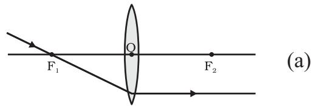

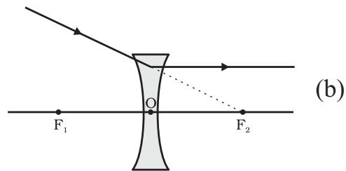  
Figure 9.14

(iii) A ray of light passing through the optical centre of a lens will emerge without any deviation. This is illustrated in Fig.9.15(a) and Fig.9.15 (b).

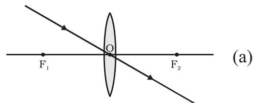

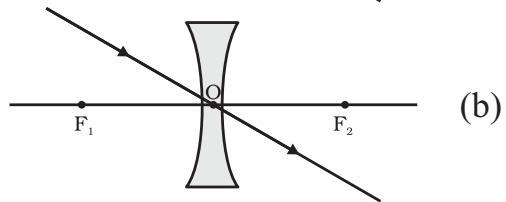  
Figure 9.15

The ray diagrams for the image formation in a convex lens for a few positions of the object are shown in Fig. 9.16. The ray diagrams representing the image formation in a concave lens for various positions of the object are shown in Fig. 9.17.

  
(@

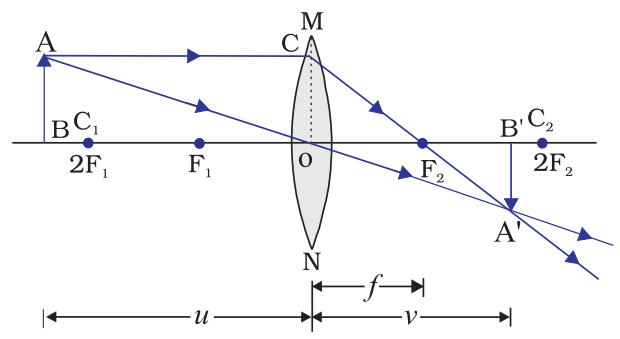  
(b)

  
(c)

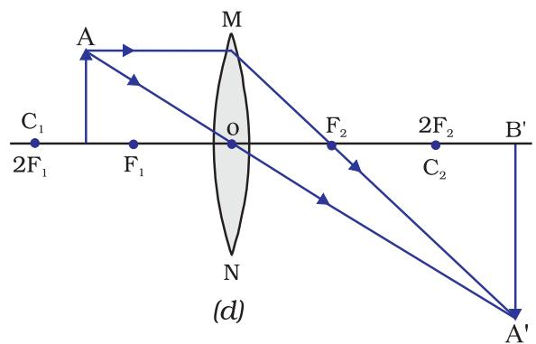

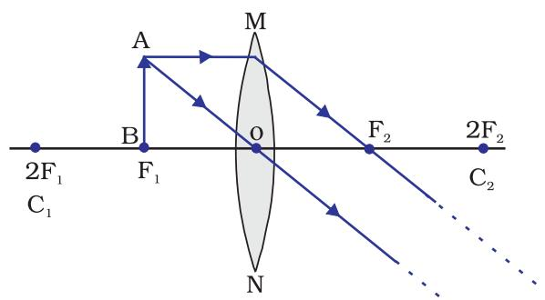  
(e)

  
Figure 9.16 The position, size and the nature of the image formed by a convex lens for various positions of the object   
(a)

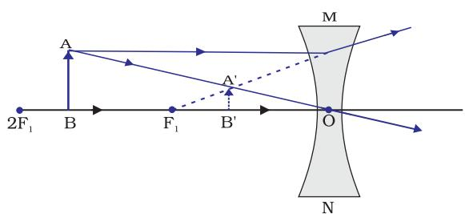  
(b)   
Figure 9.17 Nature, position and relative size of the image formed by a concave lens

#### 9.3.6 Sign Convention for Spherical Lenses

For lenses, we follow sign convention, similar to the one used for spherical mirrors. We apply the rules for signs of distances, except that all measurements are taken from the optical centre of the lens. According to the convention, the focal length of a convex lens is positive and that of a concave lens is negative. You must take care to apply appropriate signs for the values of u, v, f, object height h and image height $h ^ { \prime }$ .

#### 9.3.7 Lens Formula and Magnification

As we have a formula for spherical mirrors, we also have formula for spherical lenses. This formula gives the relationship between objectdistance (u), image-distance (v) and the focal length (f). The lens formula is expressed as

$$
\frac {1}{v} - \frac {1}{u} = \frac {1}{f} \tag {9.8}
$$

The lens formula given above is general and is valid in all situations for any spherical lens. Take proper care of the signs of different quantities, while putting numerical values for solving problems relating to lenses.

## Magnification

The magnification produced by a lens, similar to that for spherical mirrors, is defined as the ratio of the height of the image and the height of the object. Magnification is represented by the letter m. If $h$ is the height of the object and $h ^ { \prime }$ is the height of the image given by a lens, then the magnification produced by the lens is given by,

$$
\mathrm {m} = \frac {\text {H e i g h t o f t h e I m a g e}}{\text {H e i g h t o f t h e o b j e c t}} = \frac {h ^ {\prime}}{h} \tag {9.9}
$$

Magnification produced by a lens is also related to the object-distance u, and the imagedistance v. This relationship is given by

$$
\text {M a n i n f i c a t i o n} (m) = h ^ {\prime} / h = v / u \tag {9.10}
$$

## Example 9.3

A concave lens has focal length of $1 5 \ \mathrm { c m }$ . At what distance should the object from the lens be placed so that it forms an image at $1 0 \mathrm { c m }$ from the lens? Also, find the magnification produced by the lens.

## Solution

A concave lens always forms a virtual, erect image on the same side of the object.

$- 1 0 \mathrm { c m } ;$

$f$

${ \mathrm { S i n c e } } { \frac { 1 } { \nu } } - { \frac { 1 } { u } } = { \frac { 1 } { f } }$

or, ${ \frac { 1 } { u } } - \ { \frac { 1 } { \nu } } = { \frac { 1 } { f } }$ 1 f

$$
\frac {1}{u} = \frac {1}{- 1 0} - \frac {1}{(- 1 5)} = - \frac {1}{1 0} + \frac {1}{1 5}
$$

$$
\frac {1}{u} = \frac {- 3 + 2}{3 0} = \frac {1}{- 3 0}
$$

or, $u = - 3 0 \mathrm { c m }$

Thus, the object-distance is $3 0 \mathrm { c m }$ .

Magnification $m = \nu / u$

$$
\mathrm {m} = \frac {- 1 0 \mathrm {c m}}{- 3 0 \mathrm {c m}} = \frac {1}{3} \cong + 0. 3 3
$$

The positive sign shows that the image is erect and virtual. The image is one-third of the size of the object.

## Example 9.4

A $2 . 0 \mathrm { c m }$ tall object is placed perpendicular to the principal axis of a convex lens of focal length $1 0 \ \mathrm { c m }$ . The distance of the object from the lens is $1 5 \mathrm { { c m } }$ . Find the nature, position and size of the image. Also find its magnification.

## Solution

Height of the object $h$ $+ 2 . 0 \mathrm { c m }$ ;

Focal length $f$ $=$ $+ 1 0 \mathrm { c m }$

object-distance u $=$ $- 1 5 \mathrm { c m }$

Image-distance v ?

Height of the image $h ^ { \prime }$ ?

Since ${ \frac { 1 } { \nu } } - { \frac { 1 } { u } } = { \frac { 1 } { f } }$

or, ${ \frac { 1 } { \nu } } = { \frac { 1 } { u } } + { \frac { 1 } { f } }$

$$
\frac {1}{v} = \frac {1}{(- 1 5)} + \frac {1}{1 0} = - \frac {1}{1 5} + \frac {1}{1 0}
$$

$$
\frac {1}{v} = \frac {- 2 + 3}{3 0} = \frac {1}{3 0}
$$

or, $\nu { = } { + } 3 0 \mathrm { c m }$

The positive sign of $\nu$ shows that the image is formed at a distance of $3 0 \mathrm { c m }$ on the other side of the optical centre. The image is real and inverted.

I h v Magnification m = h u

or, $h ^ { \prime } = h \left( \nu / u \right)$

Heightoftheimage, $h ^ { \prime } { = } ( 2 . 0 ) ( + 3 0 / { - } I 5 ) { = } { - } 4 . 0$ cm

Magnification $m = \nu / u$

or, $\mathrm { m } { = } \frac { + 3 0 \mathrm { c m } } { - 1 5 \mathrm { c m } } { = } { - 2 }$ +30 cm

The negative signs of m and $h ^ { \prime }$ show that the image is inverted and real. It is formed below the principal axis. Thus, a real, inverted image, 4 cm tall, is formed at a distance of 30 cm on the other side of the lens. The image is two times enlarged.

#### 9.3.8 Power of a Lens

You have already learnt that the ability of a lens to converge or diverge light rays depends on its focal length. For example, a convex lens of short focal length bends the light rays through large angles, by focussing them closer to the optical centre. Similarly, concave lens of very short focal length causes higher divergence than the one with longer focal length. The degree of convergence or divergence of light rays achieved by a lens is expressed in terms of its power. The power of a lens is defined as the reciprocal of its focal length. It is represented by the letter $P$ . The power $P$ of a lens of focal length f is given by

$$
P = \frac {1}{f} \tag {9.11}
$$

The SI unit of power of a lens is ‘dioptre’. It is denoted by the letter D. If f is expressed in metres, then, power is expressed in dioptres. Thus, 1 dioptre is the power of a lens whose focal length is 1 metre. $1 \mathrm { D } { = } 1 \mathrm { m } ^ { - 1 }$ . You may note that the power of a convex lens is positive and that of a concave lens is negative.

Opticians prescribe corrective lenses indicating their powers. Let us say the lens prescribed has power equal to $+ 2 . 0 \textrm { D }$ . This means the lens prescribed is convex. The focal length of the lens $\mathrm { i s } + 0 . 5 0 \mathrm { m }$ . Similarly, a lens of power – 2.5 D has a focal length of $- 0 . 4 0 \mathrm { m }$ . The lens is concave.

## More to Know !

Many optical instruments consist of a number of lenses. They are combined to increase the magnification and sharpness of the image. The net power (P) of the lenses placed in contact is given by the algebraic sum of the individual powers $\mathrm { { P } } _ { 1 }$ , $\mathrm { P } _ { 2 } , \mathrm { P } _ { 3 } , \ldots$ as

$$
\mathbf {P} = \mathbf {P} _ {1} + \mathbf {P} _ {2} + \mathbf {P} _ {3} + \dots
$$

The use of powers, instead of focal lengths, for lenses is quite convenient for opticians. During eye-testing, an optician puts several different combinations of corrective lenses of known power, in contact, inside the testing spectacles’ frame. The optician calculates the power of the lens required by simple algebraic addition. For example, a combination of two lenses of power $+ 2 . 0 \mathrm { D }$ and $+ 0 . 2 5 \mathrm { D }$ is equivalent to a single lens of power $+ 2 . 2 5 \mathrm { D }$ .

The simple additive property of the powers of lenses can be used to design lens systems to minimise certain defects in images produced by a single lens. Such a lens system, consisting of several lenses, in contact, is commonly used in the design of lenses of camera, microscopes and telescopes.

## 

1. Define 1 dioptre of power of a lens.   
2. A convex lens forms a real and inverted image of a needle at a distance of $5 0 \mathrm { c m }$ from it. Where is the needle placed in front of the convex lens if the image is equal to the size of the object? Also, find the power of the lens.   
3. Find the power of a concave lens of focal length 2 m.

## What you have learnt

■ Light seems to travel in straight lines.   
■ Mirrors and lenses form images of objects. Images can be either real or virtual, depending on the position of the object.   
■ The reflecting surfaces, of all types, obey the laws of reflection. The refracting surfaces obey the laws of refraction.   
■ New Cartesian Sign Conventions are followed for spherical mirrors and lenses.   
■ Mirror formula, $\frac { 1 } { \nu } + \frac { 1 } { u } = \frac { 1 } { f } .$ , gives the relationship between the object-distance (u), image-distance (v), and focal length $\mathcal { O }$ of a spherical mirror.   
The focal length of a spherical mirror is equal to half its radius of curvature.   
■ The magnification produced by a spherical mirror is the ratio of the height of the image to the height of the object.   
■ A light ray travelling obliquely from a denser medium to a rarer medium bends away from the normal. A light ray bends towards the normal when it travels obliquely from a rarer to a denser medium.

Light travels in vacuum with an enormous speed of $3 { \times } 1 0 ^ { 8 } \mathrm { ~ m ~ s } ^ { - 1 }$ . The speed of light is different in different media.   
■ The refractive index of a transparent medium is the ratio of the speed of light in vacuum to that in the medium.   
■ In case of a rectangular glass slab, the refraction takes place at both air-glass interface and glass-air interface. The emergent ray is parallel to the direction of incident ray.   
■ Lens formula, 1 1 1- = ${ \frac { 1 } { \nu } } - { \frac { 1 } { u } } = { \frac { 1 } { f } } .$ , gives the relationship between the object-distance (u), image-distance $( \nu )$ , and the focal length $\mathcal { O }$ of a spherical lens.   
■ Power of a lens is the reciprocal of its focal length. The SI unit of power of a lens is dioptre.

## ExERCISES

1. Which one of the following materials cannot be used to make a lens?

(a) Water

(b) Glass

(c) Plastic

(d) Clay

2. The image formed by a concave mirror is observed to be virtual, erect and larger than the object. Where should be the position of the object?

(a) Between the principal focus and the centre of curvature   
(b) At the centre of curvature   
(c) Beyond the centre of curvature   
(d) Between the pole of the mirror and its principal focus.

3. Where should an object be placed in front of a convex lens to get a real image of the size of the object?

(a) At the principal focus of the lens   
(b) At twice the focal length   
(c) At infinity   
(d) Between the optical centre of the lens and its principal focus.

4. A spherical mirror and a thin spherical lens have each a focal length of $- 1 5 \mathrm { c m }$ . The mirror and the lens are likely to be

(a) both concave.   
(b) both convex.   
(c) the mirror is concave and the lens is convex.   
(d) the mirror is convex, but the lens is concave.

5. No matter how far you stand from a mirror, your image appears erect. The mirror is likely to be

(a) only plane.   
(b) only concave.   
(c) only convex.   
(d) either plane or convex.

6. Which of the following lenses would you prefer to use while reading small letters found in a dictionary?

(a) A convex lens of focal length 50 cm.   
(b) A concave lens of focal length $5 0 \mathrm { c m }$   
(c) A convex lens of focal length $5 \mathrm { { c m } }$ .   
(d) A concave lens of focal length 5 cm.

7. We wish to obtain an erect image of an object, using a concave mirror of focal length $1 5 \mathrm { { c m } }$ . What should be the range of distance of the object from the mirror? What is the nature of the image? Is the image larger or smaller than the object? Draw a ray diagram to show the image formation in this case.   
8. Name the type of mirror used in the following situations.

(a) Headlights of a car.   
(b) Side/rear-view mirror of a vehicle.   
(c) Solar furnace.

Support your answer with reason.

9. One-half of a convex lens is covered with a black paper. Will this lens produce a complete image of the object? Verify your answer experimentally. Explain your observations.   
10. An object 5 cm in length is held 25 cm away from a converging lens of focal length $1 0 \mathrm { c m }$ . Draw the ray diagram and find the position, size and the nature of the image formed.   
11. A concave lens of focal length 15 cm forms an image 10 cm from the lens. How far is the object placed from the lens? Draw the ray diagram.   
12. An object is placed at a distance of $1 0 \mathrm { c m }$ from a convex mirror of focal length $1 5 \mathrm { { c m } }$ . Find the position and nature of the image.   
13. The magnification produced by a plane mirror is $+ 1$ . What does this mean?   
14. An object $5 . 0 \mathrm { c m }$ in length is placed at a distance of 20 cm in front of a convex mirror of radius of curvature $3 0 \mathrm { c m }$ . Find the position of the image, its nature and size.   
15. An object of size $7 . 0 \mathrm { c m }$ is placed at 27 cm in front of a concave mirror of focal length $1 8 \mathrm { \ c m }$ . At what distance from the mirror should a screen be placed, so that a sharp focussed image can be obtained? Find the size and the nature of the image.   
16. Find the focal length of a lens of power – 2.0 D. What type of lens is this?   
17. A doctor has prescribed a corrective lens of power $+ 1 . 5 \mathrm { D }$ . Find the focal length of the lens. Is the prescribed lens diverging or converging?

# Chapter 10
# The Human Eye and the Colourful World

ou have studied in the previous chapter about refraction of light by lenses. You also studied the nature, position and relative size of images formed by lenses. How can these ideas help us in the study of the human eye? The human eye uses light and enables us to see objects around us. It has a lens in its structure. What is the function of the lens in a human eye? How do the lenses used in spectacles correct defects of vision? Let us consider these questions in this chapter.

We have learnt in the previous chapter about light and some of its properties. In this chapter, we shall use these ideas to study some of the optical phenomena in nature. We shall also discuss about rainbow formation, splitting of white light and blue colour of the sky.

### 10.1 THE HUMAN EYE

The human eye is one of the most valuable and sensitive sense organs. It enables us to see the wonderful world and the colours around us. On closing the eyes, we can identify objects to some extent by their smell, taste, sound they make or by touch. It is, however, impossible to identify colours while closing the eyes. Thus, of all the sense organs, the human eye is the most significant one as it enables us to see the beautiful, colourful world around us.

The human eye is like a camera. Its lens system forms an image on a light-sensitive screen called the retina. Light enters the eye through a thin membrane called the cornea. It forms the transparent bulge on the front surface of the eyeball as shown in Fig. 10.1. The eyeball is approximately spherical in shape with a diameter of about 2.3 cm. Most of the refraction for the light rays entering the eye occurs at the outer surface of the cornea. The crystalline lens merely provides the finer adjustment of focal length required to focus objects at different

distances on the retina. We find a structure called iris behind the cornea. Iris is a dark muscular diaphragm that controls the size of the pupil. The pupil regulates and controls the amount of light entering the eye. The eye lens forms an inverted real image of the object on the retina. The retina is a delicate membrane having enormous number of light-sensitive cells. The light-sensitive cells get activated upon illumination and generate electrical signals. These signals are sent to the brain via the optic nerves. The brain interprets these signals, and finally, processes the information so that we perceive objects as they are.

  
Figure 10.1 The human eye

#### 10.1.1 Power of Accommodation

The eye lens is composed of a fibrous, jelly-like material. Its curvature can be modified to some extent by the ciliary muscles. The change in the curvature of the eye lens can thus change its focal length. When the muscles are relaxed, the lens becomes thin. Thus, its focal length increases. This enables us to see distant objects clearly. When you are looking at objects closer to the eye, the ciliary muscles contract. This increases the curvature of the eye lens. The eye lens then becomes thicker. Consequently, the focal length of the eye lens decreases. This enables us to see nearby objects clearly.

The ability of the eye lens to adjust its focal length is called accommodation. However, the focal length of the eye lens cannot be decreased below a certain minimum limit. Try to read a printed page by holding it very close to your eyes. You may see the image being blurred or feel strain in the eye. To see an object comfortably and distinctly, you must hold it at about $2 5 \ \mathrm { c m }$ from the eyes. The minimum distance, at which objects can be seen most distinctly without strain, is called the least distance of distinct vision. It is also called the near point of the eye. For a young adult with normal vision, the near point is about $2 5 ~ \mathrm { c m }$ . The farthest point upto which the eye can see objects clearly is called the far point of the eye. It is infinity for a normal eye. You may note here a normal eye can see objects clearly that are between 25 cm and infinity.

Sometimes, the crystalline lens of people at old age becomes milky and cloudy. This condition is called cataract. This causes partial or complete loss of vision. It is possible to restore vision through a cataract surgery.

### 10.2 DEFECTS OF VISION AND THEIR CORRECTION

Sometimes, the eye may gradually lose its power of accommodation. In such conditions, the person cannot see the objects distinctly and comfortably. The vision becomes blurred due to the refractive defects of the eye.

There are mainly three common refractive defects of vision. These are (i) myopia or nearsightedness, (ii) Hypermetropia or farsightedness, and (iii) Presbyopia. These defects can be corrected by the use of suitable spherical lenses. We discuss below these defects and their correction.

## (a) Myopia

Myopia is also known as nearsightedness. A person with myopia can see nearby objects clearly but cannot see distant objects distinctly. A person with this defect has the far point nearer than infinity. Such a person may see clearly upto a distance of a few metres. In a myopic eye, the image of a distant object is formed in front of the retina [Fig. 10.2 (b)] and not at the retina itself. This defect may arise due to (i) excessive curvature of the eye lens, or (ii) elongation of the eyeball. This defect can be corrected by using a concave lens of suitable power. This is illustrated in Fig. 10.2 (c). A concave lens of suitable power will bring the image back on to the retina and thus the defect is correcte

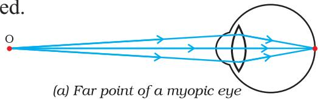

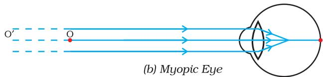

  
Figure 10.2   
(a), (b) The myopic eye, and (c) correction for myopia with a concave lens

## (b) Hypermetropia

Hypermetropia is also known as farsightedness. A person with hypermetropia can see distant objects clearly but cannot see nearby objects distinctly. The near point, for the person, is farther away from the normal near point $( 2 5 \ \mathrm { c m } )$ . Such a person has to keep a reading material much beyond $2 5 \mathrm { c m }$ from the eye for comfortable reading. This is because the

light rays from a closeby object are focussed at a point behind the retina as shown in Fig. 10.3 (b). This defect arises either because (i) the focal length of the eye lens is too long, or (ii) the eyeball has become too small. This defect can be corrected by using a convex lens of appropriate power. This is illustrated in Fig. 10.3 (c). Eye-glasses with converging lenses provide the additional focussing power required for forming the image on the retina.

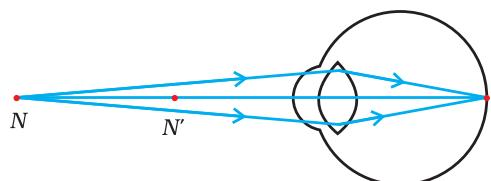  
(a) Near point of a Hypermetropic eye

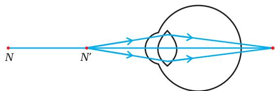  
(b) Hypermetropic eye

  
(c) Correction for Hypermetropic eye

Figure 10.3

(a), (b) The hypermetropic eye, and

(c) correction for hypermetropia

$N =$ Near point of a

hypermetropic eye.

$N ^ { \prime } =$ Near point of a

normal eye.

## (c) Presbyopia

The power of accommodation of the eye usually decreases with ageing. For most people, the near point gradually recedes away. They find it difficult to see nearby objects comfortably and distinctly without corrective eye-glasses. This defect is called Presbyopia. It arises due to the gradual weakening of the

ciliary muscles and diminishing flexibility of the eye lens. Sometimes, a person may suffer from both myopia and hypermetropia. Such people often require bi-focal lenses. A common type of bi-focal lenses consists of both concave and convex lenses. The upper portion consists of a concave lens. It facilitates distant vision. The lower part is a convex lens. It facilitates near vision.

These days, it is possible to correct the refractive defects with contact lenses or through surgical interventions.

## 

1. W h a t i s m e a n t b y p o w e r o f accommodation of the eye?   
2. A person with a myopic eye cannot see objects beyond $1 . 2 ~ \mathrm { m }$ distinctly. What should be the type of the corrective lens used to restore proper vision?   
3. What is the far point and near point of the human eye with normal vision?   
4. A student has difficulty reading the blackboard while sitting in the last row. What could be the defect the ?child is suffering from? How can it be corrected?

## Think it over

You talk of wondrous things you see, You say the sun shines bright; I feel him warm, but how can he Or make it day or night?

– C. CIBBER

Do you know that our eyes can live even after our death? By donating our eyes after we die, we can light the life of a blind person.

About 35 million people in the developing world are blind and most of them can be cured. About 4.5 million people with corneal blindness can be cured through corneal transplantation of donated eyes. Out of these 4.5 million, $60 \%$ are children below the age of 12. So, if we have got the gift of vision, why not pass it on to somebody who does not have it? What do we have to keep in mind when eyes have to be donated?

■ Eye donors can belong to any age group or sex. People who use spectacles, or those operated for cataract, can still donate the eyes. People who are diabetic, have hypertension, asthma p a t i e n t s a n d t h o s e w i t h o u t communicable diseases can also donate eyes.   
■ Eyes must be removed within 4-6 hours after death. Inform the nearest eye bank immediately.   
■ The eye bank team will remove the eyes at the home of the deceased or at a hospital.   
■ Eye removal takes only 10-15 minutes. It is a simple process and does not lead to any disfigurement.   
■ Persons who were infected with or died because of AIDS, Hepatitis B or C, rabies, acute leukaemia, tetanus, cholera, meningitis or encephalitis cannot donate eyes.

An eye bank collects, evaluates and distributes the donated eyes. All eyes donated are evaluated using strict medical standards. Those donated eyes found unsuitable for transplantation are used for valuable research and medical education. The identities of both the donor and the recipient remain confidential.

One pair of eyes gives vision to up to FOUR CORNEALBLIND PEOPLE.

### 10.3REFRACTIONOFLIGHTTHROUGHAPRISM

You have learnt how light gets refracted through a rectangular glass slab. For parallel refracting surfaces, as in a glass slab, the emergent ray is parallel to the incident ray. However, it is slightly displaced laterally. How would light get refracted through a transparent prism? Consider a triangular glass prism. It has two triangular bases and three rectangular lateral surfaces. These surfaces are inclined to each other. The angle between its two lateral faces is called the angle of the prism. Let us now do an activity to study the refraction of light through a triangular glass prism.

### Activity 10.1

■ Fix a sheet of white paper on a drawing board using drawing pins.   
■ Place a glass prism on it in such a way that it rests on its triangular base. Trace the outline of the prism using a pencil.   
■ Draw a straight line PE inclined to one of the refracting surfaces, say AB, of the prism.

■ Fix two pins, say at points P and Q, on t h e l i n e P E a s s h o w n i n Fig. 10.4.   
Look for the images of the pins, fixed at P and Q, through the other face AC.   
Fix two more pins, at points R and S, such that the pins at R and S and the images of the pins at P and Q lie on the same straight line.   
Remove the pins and the glass prism.   
The line PE meets the boundary of the prism at point (see Fig. 10.4). Similarly, join and produce the points R and S. Let these lines meet the boundary of the prism at E and F, respectively. Join E and F.   
■ Draw perpendiculars to the refracting surfaces AB and AC of the prism at points E and F, respectively.   
Mark the angle of incidence $( \angle \mathrm { i } )$ , the angle of refraction $( \angle \mathbf { r } )$ and the angle of emergence $\displaystyle ( \angle { \mathrm { e } } )$ as shown in Fig. 10.4.

  
Figure 10.4 Refraction of light through a triangular glass prism

Here PE is the incident ray, EF is the refracted ray and FS is the emergent ray. You may note that a ray of light is entering from air to glass at the first surface AB. The light ray on refraction has bent towards the normal. At the second surface AC, the light ray has entered from glass to air. Hence it has bent away from normal. Compare the angle of incidence and the angle of refraction at each refracting surface of the prism. Is this similar to the kind of bending that occurs in a glass slab? The peculiar shape of the prism makes the emergent ray bend at an angle to the direction of the incident ray. This angle is called the angle of deviation. In this case ÐD is the angle of deviation. Mark the angle of deviation in the above activity and measure it.

### 10.4 DISPERSION OF WHITE LIGHT BYAGLASS PRISM

You must have seen and appreciated the spectacular colours in a rainbow. How could the white light of the Sun give us various colours of the rainbow? Before we take up this question, we shall first go back to the refraction of light through a prism. The inclined refracting surfaces of a glass prism show exciting phenomenon. Let us find it out through an activity.

### Activity 10.2

Take a thick sheet of cardboard and make a small hole or narrow slit in its middle.   
■ Allow sunlight to fall on the narrow slit. This gives a narrow beam of white light.   
Now, take a glass prism and allow the light from the slit to fall on one of its faces as shown in Fig. 10.5.

■ Turn the prism slowly until the light that comes out of it appears on a nearby screen.   
■ What do you observe? You will find a beautiful band of colours. Why does this happen?

The prism has probably split the incident white light into a band of colours. Note the colours that appear at the two ends of the colour band. What is the sequence of colours that you see on the screen? The various colours seen are Violet, Indigo, Blue, Green, Yellow, Orange and Red, as shown in Fig. 10.5. The acronym VIBGYOR will help you to remember the sequence of colours. The band of the coloured components of a light beam is called its spectrum. You might not be able to see all the colours separately. Yet something makes each colour distinct from the other. The splitting of light into its component colours is called dispersion

  
Figure 10.5 Dispersion of white light by the glass prism

You have seen that white light is dispersed into its seven-colour components by a prism. Why do we get these colours? Different colours of light bend through different angles with respect to the incident ray, as they pass through a prism. The red light bends the least while the

violet the most. Thus the rays of each colour emerge along different paths and thus become distinct. It is the band of distinct colours that we see in a spectrum.

Isaac Newton was the first to use a glass prism to obtain the spectrum of sunlight. He tried to split the colours of the spectrum of white light further by using another similar prism. However, he could not get any more colours. He then placed a second identical prism in an inverted position with respect to the first prism, as shown in Fig. 10.6. This allowed all the colours of the spectrum to pass through the second prism. He found a beam of white light emerging from the other side of the second prism. This observation gave Newton the idea that the sunlight is made up of seven colours.

  
Figure 10.6 Recombination of the spectrum of white light

Any light that gives a spectrum similar to that of sunlight is often referred to as white light.

  
Figure 10.7 Rainbow in the sky

A rainbow is a natural spectrum appearing in the sky after a rain shower (Fig. 10.7). It is caused by dispersion of sunlight by tiny water droplets, present in the atmosphere. A rainbow is always formed in a direction opposite to that of the Sun. The water droplets act like small prisms. They refract and disperse the incident sunlight, then reflect it internally, and finally refract it again when it comes out of the raindrop (Fig. 10.8). Due to the dispersion of light and internal reflection, different colours reach the observer’s eye.

  
Figure 10.8 Rainbow formation

You can also see a rainbow on a sunny day when you look at the sky through a waterfall or through a water fountain, with the Sun behind you.

### 10.5 ATMOSPHERIC REFRACTION

You might have observed the apparent random wavering or flickering of objects seen through a turbulent stream of hot air rising above a fire or a radiator. The air just above the fire becomes hotter than the air further up. The hotter air is lighter (less dense) than the cooler air above it, and has a refractive index slightly

less than that of the cooler air. Since the physical conditions of the refracting medium (air) are not stationary, the apparent position of the object, as seen through the hot air, fluctuates. This wavering is thus an effect of atmospheric refraction (refraction of light by the earth’s atmosphere) on a small scale in our local environment. The twinkling of stars is a similar phenomenon on a much larger scale. Let us see how we can explain it.

## Twinkling of stars

The twinkling of a star is due to atmospheric refraction of starlight. The starlight, on entering the earth’s atmosphere, undergoes refraction continuously before it reaches the earth. The atmospheric refraction occurs in a medium of gradually changing refractive index. Since the atmosphere bends starlight towards the normal, the apparent position of the star is slightly different from its actual position. The star appears slightly higher (above) than its actual position when viewed near the horizon (Fig. 10.9). Further, this apparent position of the star is not stationary, but keeps on changing slightly, since the physical conditions of the earth’s atmosphere are not stationary, as was the case in the previous paragraph. Since the stars are very distant, they approximate point-sized sources of light. As the path of rays of light coming from the star goes on varying slightly, the apparent position of the star fluctuates and the amount of starlight entering the eye flickers – the star sometimes appears brighter, and at some other time, fainter, which is the twinkling effect.

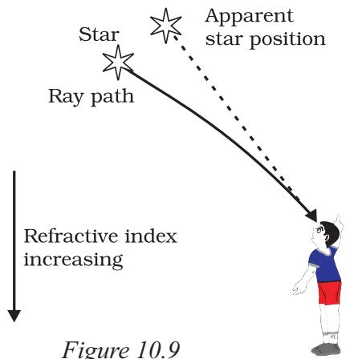  
Apparent star position due to atmospheric refraction

Why don’t the planets twinkle? The planets are much closer to the earth, and are thus seen as extended sources. If we consider a planet as a collection of a large number of point-sized sources of light, the total variation in the amount of light entering our eye from all the individual point-sized sources will average out to zero, thereby nullifying the twinkling effect.

## Advance sunrise and delayed sunset

The Sun is visible to us about 2 minutes before the actual sunrise, and about 2 minutes after the actual sunset because of atmospheric refraction. By actual sunrise, we mean the actual crossing of the horizon by the Sun. Fig. 10.10 shows the actual and apparent positions of the Sun with respect to the horizon. The time difference between actual sunset and the apparent sunset is about 2 minutes. The apparent flattening of the Sun’s disc at sunrise and sunset is also due to the same phenomenon.

  
Figure 10.10 Atmospheric refraction effects at sunrise and sunset

### 10.6 SCATTERING OFLIGHT

The interplay of light with objects around us gives rise to several spectacular phenomena in nature. The blue colour of the sky, colour of water in deep sea, the reddening of the sun at sunrise and the sunset are some of the wonderful phenomena we are familiar with. In the previous class, you have learnt about the scattering of light by colloidal particles. The path of a beam of light passing through a true solution is not visible. However, its path becomes visible through a colloidal solution where the size of the particles is relatively larger.

#### 10.6.1 Tyndall Effect

T h e e a r t h ’ s a t m o s p h e r e i s a heterogeneous mixture of minute particles. These particles include smoke, tiny water droplets, suspended particles of dust and molecules of air. When a beam of light strikes such fine particles, the path of the beam becomes visible. The light reaches us, after being reflected diffusely by these particles. The phenomenon of scattering of light by the colloidal particles gives rise to Tyndall effect which you have studied in Class IX. This phenomenon is seen when a fine beam of sunlight enters a smoke-filled room through a small hole. Thus, scattering of light makes the particles visible. Tyndall effect can also be observed when sunlight passes through a canopy of a dense forest. Here, tiny water droplets in the mist scatter light.

The colour of the scattered light depends on the size of the scattering particles. Very fine particles scatter mainly blue light while particles of larger size scatter light of longer wavelengths. If the size of the scattering particles is large enough, then, the scattered light may even appear white.

#### 10.6.2Whyis thecolouroftheclearSkyBlue?

The molecules of air and other fine particles in the atmosphere have size smaller than the wavelength of visible light. These are more effective in scattering light of shorter wavelengths at the blue end than light of longer wavelengths at the red end. The red light has a wavelength about 1.8 times greater than blue light. Thus, when sunlight passes through the atmosphere, the fine particles in air scatter the blue colour (shorter wavelengths) more strongly than red. The scattered blue light

enters our eyes. If the earth had no atmosphere, there would not have been any scattering. Then, the sky would have looked dark. The sky appears dark to passengers flying at very high altitudes, as scattering is not prominent at such heights.

You might have observed that ‘danger’ signal lights are red in colour. Do you know why? The red is least scattered by fog or smoke. Therefore, it can be seen in the same colour at a distance.

## What you have learnt

■ The ability of the eye to focus on both near and distant objects, by adjusting its focal length, is called the accommodation of the eye.   
■ The smallest distance, at which the eye can see objects clearly without strain, is called the near point of the eye or the least distance of distinct vision. For a young adult with normal vision, it is about 25 cm.   
■ The common refractive defects of vision include myopia, hypermetropia and presbyopia. Myopia (short-sightedness – the image of distant objects is focussed before the retina) is corrected by using a concave lens of suitable power. Hypermetropia (farsightedness – the image of nearby objects is focussed beyond the retina) is corrected by using a convex lens of suitable power. The eye loses its power of accommodation at old age.   
■ The splitting of white light into its component colours is called dispersion.   
■ Scattering of light causes the blue colour of sky.

## EXERCISES

1. The human eye can focus on objects at different distances by adjusting the focal length of the eye lens. This is due to

(a) presbyopia.

(b) accommodation.

(c) near-sightedness.

(d) far-sightedness.

2. The human eye forms the image of an object at its

(a) cornea.

(b) iris.

(c) pupil.

(d) retina.

3. The least distance of distinct vision for a young adult with normal vision is about

(a) 25 m.

(b) 2.5 cm.

(c) 25 cm.

(d) 2.5 m.

4. The change in focal length of an eye lens is caused by the action of the

(a)pupil.

(b) retina.

(c) ciliary muscles.

(d) iris.

5. Aperson needs a lens of power –5.5 dioptres for correcting his distant vision. For correcting his near vision he needs a lens of power $+ 1 . 5$ dioptre. What is the focal length of the lens required for correcting (i) distant vision, and (ii) near vision?   
6. The far point of a myopic person is 80 cm in front of the eye. What is the nature and power of the lens required to correct the problem?   
7. Make a diagram to show how hypermetropia is corrected. The near point of a hypermetropic eye is 1 m. What is the power of the lens required to correct this defect? Assume that the near point of the normal eye is $2 5 \mathrm { c m }$ .   
8. Why is a normal eye not able to see clearly the objects placed closer than $2 5 \mathrm { c m } ?$   
9. What happens to the image distance in the eye when we increase the distance of an object from the eye?   
10. Why do stars twinkle?   
11. Explain why the planets do not twinkle.   
12. Why does the sky appear dark instead of blue to an astronaut?

# Chapter 11
# Electricity

lectricity has an important place in modern Esociety. It is a controllable and convenient schools, hospitals, industries and so on. What constitutes electricity? How does it flow in an electric circuit? What are the factors that control or regulate the current through an electric circuit? In this Chapter, we shall attempt to answer such questions. We shall also discuss the heating effect of electric current and its applications.

### 11.1ELECTRICCURRENTANDCIRCUIT

We are familiar with air current and water current. We know that flowing water constitute water current in rivers. Similarly, if the electric charge flows through a conductor (for example, through a metallic wire), we say that there is an electric current in the conductor. In a torch, we know that the cells (or a battery, when placed in proper order) provide flow of charges or an electric current through the torch bulb to glow. We have also seen that the torch gives light only when its switch is on. What does a switch do? A switch makes a conducting link between the cell and the bulb. A continuous and closed path of an electric current is called an electric circuit. Now, if the circuit is broken anywhere (or the switch of the torch is turned of f), the current stops flowing and the bulb does not glow.

How do we express electric current? Electric current is expressed by the amount of charge flowing through a particular area in unit time. In other words, it is the rate of flow of electric charges. In circuits using metallic wires, electrons constitute the flow of charges. However, electrons were not known at the time when the phenomenon of electricity was first observed. So, electric current was considered to be the flow of positive charges and the direction of flow of positive charges was taken to be the direction of electric current. Conventionally, in

an electric circuit the direction of electric current is taken as opposite to the direction of the flow of electrons, which are negative charges.

If a net charge Q, flows across any crosssection of a conductor in time t, then the current I, through the cross-section is

$$
I = \frac {Q}{t} \tag {11.1}
$$

The SI unit of electric charge is coulomb (C), which is equivalent to the charge contained in nearly $6 \times 1 0 ^ { 1 8 }$ electrons. (We know that an electron possesses a negative charge of $1 . 6 \times$ $1 0 ^ { - 1 9 } \mathrm { C } . )$ The electric current is expressed by a unit called ampere (A), named after the French scientist, Andre-Marie Ampere (1775–1836). One ampere is constituted by the flow of one coulomb of charge per second, that is, $1 \mathrm { A } = 1 \mathrm { C } / 1$ s. Small quantities of current are expressed in milliampere $( 1 \mu \mathrm { A } = 1 0 ^ { - 3 } \mathrm { A } )$ or in microampere $( 1 \ \mu \mathrm { A } = 1 0 ^ { - 6 } \mathrm { A } )$ . An instrument called ammeter measures electric current in a circuit. It is always connected in series in a circuit through which the current is to be measured. Figure 11.1 shows the schematic diagram of a typical electric circuit comprising a cell, an electric bulb, an ammeter and a plug key. Note that the electric current flows in the circuit from the positive terminal of the cell to the negative terminal of the cell through the bulb and ammeter.

  
Figure 11.1 A schematic diagram of an electric circuit comprising – cell, electric bulb, ammeter and plug key

## Example 11.1

A current of 0.5 A is drawn by a filament of an electric bulb for 10 minutes. Find the amount of electric charge that flows through the circuit.

## Solution

We are given, $I { = } 0 . 5 \mathrm { A }$ ; $t = 1 0 \operatorname* { m i n } { = } 6 0 0 \mathrm { s }$ .

From Eq. (11.1), we have

$$
\begin{array}{l} Q = I t \\ = 0. 5 \mathrm {A} \times 6 0 0 \mathrm {s} \\ = 3 0 0 \mathrm {C} \\ \end{array}
$$

## 

1. What does an electric circuit mean?   
2. Define the unit of current.   
3. Calculate the number of electrons constituting one coulomb of charge.

### 11.2 ELECTRIC POTENTIALAND POTENTIALDIFFERENCE

What makes the electric charge to flow? Let us consider the analogy of flow of water. Charges do not flow in a copper wire by themselves, just as water in a perfectly horizontal tube does not flow. If one end of the tube is connected to a tank of water kept at a higher level, such that there is a pressure difference between the two ends of the tube, water flows out of the other end of the tube. For flow of charges in a conducting metallic wire, the gravity, of course, has no role to play; the electrons move only if there is a difference of electric pressure – called the potential difference – along the conductor. This difference of potential may be produced by a battery, consisting of one or more electric cells. The chemical action within a cell generates the potential difference across the

terminals of the cell, even when no current is drawn from it. When the cell is connected to a conducting circuit element, the potential difference sets the charges in motion in the conductor and produces an electric current. In order to maintain the current in a given electric circuit, the cell has to expend its chemical energy stored in it.

We define the electric potential difference between two points in an electric circuit carrying some current as the work done to move a unit charge from one point to the other –

Potential difference (V) between two points $=$ Work done (W)/Charge $( \varrho )$

$$
V = W / Q \tag {11.2}
$$

The SI unit of electric potential difference is volt (V), named after Alessandro Volta (1745–1827), an Italian physicist. One volt is the potential difference between two points in a current carrying conductor when 1 joule of work is done to move a charge of 1 coulomb from one point to the other.

$$
\begin{array}{l} \text {T h e r e f o r e ,} 1 \mathrm {v o l t} = \frac {1 \mathrm {j o u l e}}{1 \mathrm {c o u l o m b}} \tag {11.3} \\ 1 \mathrm {V} = 1 \mathrm {J C} ^ {- 1} \\ \end{array}
$$

The potential difference is measured by means of an instrument called the voltmeter. The voltmeter is always connected in parallel across the points between which the potential difference is to be measured.

## Example 11.2

How much work is done in moving a charge of 2 C across two points having a potential difference 12 V?

## Solution

The amount of charge Q, that flows between two points at potential difference $\mathrm { V } ( = 1 2 \mathrm { V } )$ is 2 C. Thus, the amount of work W, done in moving the charge [from Eq. (11.2)] is

$$
\begin{array}{l} W = V Q \\ = 1 2 \mathrm {V} \times 2 \mathrm {C} \\ = 2 4 \mathrm {J}. \\ \end{array}
$$

## 

1. Name a device that helps to maintain a p o t e n t i a l d i ff e r e n c e a c r o s s a conductor.   
2. What is meant by saying that the potential difference between two points is 1 V?   
3. How much energy is given to each coulomb of charge passing through a 6 V battery?

### 11.3 CIRCUITDIAGRAM

We know that an electric circuit, as shown in Fig. 11.1, comprises a cell (or a battery), a plug key, electrical component(s), and connecting wires. It is often convenient to draw a schematic diagram, in which different components of the circuit are represented by the symbols conveniently used. Conventional symbols used to represent some of the most commonly used electrical components are given in Table 11.1.

Table 11.1 Symbols of some commonly used components in circuit diagrams   

<table><tr><td>S1.
No.</td><td>Components</td><td>Symbols</td></tr><tr><td>1</td><td>An electric cell</td><td>+ | -</td></tr><tr><td>2</td><td>A battery or a combination of cells</td><td>+ | - | - | -</td></tr><tr><td>3</td><td>Plug key or switch (open)</td><td>- ()-</td></tr><tr><td>4</td><td>Plug key or switch (closed)</td><td>- ()-</td></tr><tr><td>5</td><td>A wire joint</td><td>-</td></tr><tr><td>6</td><td>Wires crossing without joining</td><td>-</td></tr></table>

### 11.4 OHM’S LAW

Is there a relationship between the potential difference across a conductor and the current through it? Let us explore with an Activity.

### Activity 11.1

■ Set up a circuit as shown in Fig. 11.2, consisting of a nichrome wire XY of length, say $0 . 5 ~ \mathrm { m }$ , an ammeter, a voltmeter and four cells of $1 . 5 \mathrm { ~ V ~ }$ each. (Nichrome is an alloy of nickel, chromium, manganese, and iron metals.)   
■ First use only one cell as the source in the circuit. Note the reading in the ammeter I, for the current and reading of the voltmeter V for the potential difference across the nichrome wire XY in the circuit. Tabulate them in the Table given.   
■ Next connect two cells in the circuit and note the respective readings of the ammeter and voltmeter for the values of current through the nichrome wire and potential difference across the nichrome wire.   
■ Repeat the above steps using three cells and then four cells in the circuit separately.   
■ Calculate the ratio of V to I for each pair of potential difference V and current I.

<table><tr><td>S.
No.</td><td>Number of cells used in the circuit (ampere)</td><td>Current through the nichrome wire, I</td><td>Potential difference across the nichrome wire, V (volt)</td><td>V/I
(volt/ampere)</td></tr><tr><td>1</td><td>1</td><td></td><td></td><td></td></tr><tr><td>2</td><td>2</td><td></td><td></td><td></td></tr><tr><td>3</td><td>3</td><td></td><td></td><td></td></tr><tr><td>4</td><td>4</td><td></td><td></td><td></td></tr></table>

■ Plot a graph between V and I, and observe the nature of the graph.

  
Figure 11.2 Electric circuit for studying Ohm’s law

In this Activity, you will find that approximately the same value for V/I is obtained in each case. Thus the $V { - } I$ graph is a straight line that passes through the origin of the graph, as shown in Fig. 11.3. Thus, V/I is a constant ratio.

Figure 11.3   
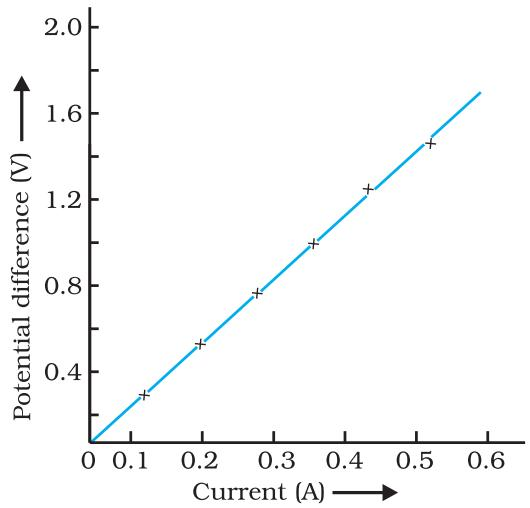  
V–I graph for a nichrome wire. A straight line plot shows that as the current through a wire increases, the potential difference across the wire increases linearly – this is Ohm’s law.

In 1827, a German physicist Georg Simon Ohm (1787–1854) found out the relationship between the current I, flowing in a metallic wire and the potential difference across its terminals. The potential difference, V, across the ends of a given metallic wire in an electric circuit is directly proportional to the current flowing through it, provided its temperature remains the same. This is called Ohm’s law. In other words –

$$
V \alpha I \tag {11.4}
$$

$$
\begin{array}{r c l} \text {o r} & V / I & = \quad \text {c o n s t a n t} \\ & & = \quad R \end{array}
$$

$$
\text {o r} \quad V = I R \tag {11.5}
$$

In Eq. (11.4), R is a constant for the given metallic wire at a given temperature and is called its resistance. It is the property of a conductor to resist the flow of charges through it. Its SI unit is ohm, represented by the Greek letter Ω. According to Ohm’s law,

$$
R = V / I \tag {11.6}
$$

If the potential difference across the two ends of a conductor is $1 \mathrm { ~ V ~ }$ and the current through it is $1 \mathrm { \ A }$ , then the resistance R, of the conductor is $1 \Omega$ .

That is, $1 \mathrm { { o h m } = \frac { 1 \ v o l t } { 1 \ a m p e r e } }$ 1 ampere

Also from Eq. (11.5) we get

$$
I = V / R \tag {11.7}
$$

It is obvious from Eq. (11.7) that the current through a resistor is inversely proportional to its resistance. If the resistance is doubled the current gets halved. In many practical cases it is necessary to increase or decrease the current in an electric circuit. A component used to regulate current without changing the voltage source is called variable resistance. In an electric circuit, a device called rheostat is often used to change the resistance in the circuit. We will now study about electrical resistance of a conductor with the help of following Activity.

### Activity 11.2

Take a nichrome wire, a torch bulb, a 10 W bulb and an ammeter (0 – 5 A range), a plug key and some connecting wires.   
■ Set up the circuit by connecting four dry cells of $1 . 5 \mathrm { ~ V ~ }$ each in series with the ammeter leaving a gap XY in the circuit, as shown in Fig. 11.4.

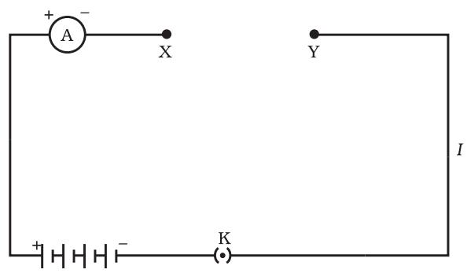

  
Nichrome wire

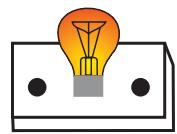  
10 W bulb

  
Torch bulb   
Figure 11.4

■ Complete the circuit by connecting the nichrome wire in the gap XY. Plug the key. Note down the ammeter reading. Take out the key from the plug. [Note: Always take out the key from the plug after measuring the current through the circuit.]   
Replace the nichrome wire with the torch bulb in the circuit and find the current through it by measuring the reading of the ammeter.   
Now repeat the above step with the 10 W bulb in the gap XY.   
■ Are the ammeter readings different for different components connected in the gap XY? What do the above observations indicate?   
■ You may repeat this Activity by keeping any material component in the gap. Observe the ammeter readings in each case. Analyse the observations.

In this Activity we observe that the current is different for different components. Why do they differ? Certain components offer an easy path for the flow of electric current while the others resist the flow. We know that motion of electrons in an electric circuit constitutes an electric current. The electrons, however, are not completely free to move within a conductor. They are restrained by the attraction of the atoms among which they move. Thus, motion of electrons through a conductor is retarded by its resistance. A component of a given size that offers a low resistance is a good conductor. A conductor having some appreciable resistance is called a resistor. A component of identical size that offers a higher resistance is a poor conductor. An insulator of the same size offers even higher resistance.

### 11.5 FACTORS ON WHICH THE RESISTANCE OF A CONDUCTOR

## EPENDS

■ Complete an electric circuit consisting of a cell, an ammeter, a nichrome wire of length l [say, marked (1)] and a plug key, as shown in Fig. 11.5.

  
Figure 11.5 Electric circuit to study the factors on which the resistance of conducting wires depends

Now, plug the key. Note the current in the ammeter.   
■ Replace the nichrome wire by another nichrome wire of same thickness but twice the length, that is 2l [marked (2) in the Fig. 11.5].   
Note the ammeter reading.   
■ Now replace the wire by a thicker nichrome wire, of the same length l [marked (3)]. A thicker wire has a larger cross-sectional area. Again note down the current through the circuit.   
■ Instead of taking a nichrome wire, connect a copper wire [marked (4) in Fig. 11.5] in the circuit. Let the wire be of the same length and same area of cross-section as that of the first nichrome wire [marked (1)]. Note the value of the current.   
■ Notice the difference in the current in all cases.   
■ Does the current depend on the length of the conductor?   
■ Does the current depend on the area of cross-section of the wire used?

It is observed that the ammeter reading decreases to one-half when the length of the wire is doubled. The ammeter reading is increased when a thicker wire of the same material and of the same length is used in the circuit. A change in ammeter reading is observed when a wire of different material of the same length and the same area of crosssection is used. On applying Ohm’s law [Eqs. (11.5) – (11.7)], we observe that the resistance of the conductor depends (i) on its length, (ii) on its area of cross-section, and (iii) on the

nature of its material. Precise measurements have shown that resistance of a uniform metallic conductor is directly proportional to its length (l) and inversely proportional to the area of cross-section (A). That is,

$$
\mathrm {R} \alpha 1 \tag {11.8}
$$

and R α 1/A (11.9)

Combining Eqs. (11.8) and (11.9) we get

$$
\mathrm {R a} \frac {l}{A}
$$

$\mathrm { o r } , \qquad \mathsf { R } = \mathsf { p } \ \frac { l } { A }$ (11.10)

where ρ(rho) is a constant of proportionality and is called the electrical resistivity of the material of the conductor. The SI unit of resistivity is $\Omega \mathrm { m }$ . It is a characteristic property of the material. The metals and alloys have very low resistivity in the range of $1 0 ^ { - 8 } \Omega \mathrm { m }$ to $1 0 ^ { - 6 }$ $\Omega \textrm { m }$ . They are good conductors of electricity. Insulators like rubber and glass have resistivity of the order of $1 0 ^ { 1 2 }$ to $1 0 ^ { 1 7 } \textrm {  { \Omega }  { \Omega }  { \mathrm { ~ m ~ } } }$ . Both the resistance and resistivity of a material vary with temperature.

Table 11.2 reveals that the resistivity of an alloy is generally higher than that of its constituent metals. Alloys do not oxidise (burn) readily at high temperatures. For this reason, they are commonly used in electrical heating devices, like electric iron, toasters etc. Tungsten is used almost exclusively for filaments of electric bulbs, whereas copper and aluminium are generally used for electrical transmission lines.

Table 11.2 Electrical resistivity* of some substances at $2 0 \mathrm { { } ^ { \circ } C }$   

<table><tr><td></td><td>Material</td><td>Resistivity (Ω m)</td></tr><tr><td rowspan="9">Conductors</td><td>Silver</td><td>1.60 × 10-8</td></tr><tr><td>Copper</td><td>1.62 × 10-8</td></tr><tr><td>Aluminium</td><td>2.63 × 10-8</td></tr><tr><td>Tungsten</td><td>5.20 × 10-8</td></tr><tr><td>Nickel</td><td>6.84 × 10-8</td></tr><tr><td>Iron</td><td>10.0 × 10-8</td></tr><tr><td>Chromium</td><td>12.9 × 10-8</td></tr><tr><td>Mercury</td><td>94.0 × 10-8</td></tr><tr><td>Manganese</td><td>1.84 × 10-6</td></tr><tr><td rowspan="6">Alloys</td><td>Constantan</td><td>49 × 10-6</td></tr><tr><td>(alloy of Cu and Ni)</td><td></td></tr><tr><td>Manganin</td><td>44 × 10-6</td></tr><tr><td>(alloy of Cu, Mn and Ni)</td><td></td></tr><tr><td>Nichrome</td><td>100 × 10-6</td></tr><tr><td>(alloy of Ni, Cr, Mn and Fe)</td><td></td></tr><tr><td rowspan="5">Insulators</td><td>Glass</td><td>1010 - 1014</td></tr><tr><td>Hard rubber</td><td>1013 - 1016</td></tr><tr><td>Ebonite</td><td>1015 - 1017</td></tr><tr><td>Diamond</td><td>1012 - 1013</td></tr><tr><td>Paper (dry)</td><td>1012</td></tr></table>

* You need not memorise these values. You can use these values for solving numerical problems.

## Example 11.3

(a) How much current will an electric bulb draw from a $2 2 0 \mathrm { V }$ source, if the resistance of the bulb filament is $1 2 0 0 ~ \Omega ?$ (b) How much current will an electric heater coil draw from a $2 2 0 \mathrm { V }$ source, if the resistance of the heater coil is 100Ω?

## Solution

(a) We are given $\mathrm { V } = 2 2 0 \mathrm { V } ; \mathrm { R } = 1 2 0 0 \Omega$ . From Eq. (11.6), we have the current $\mathrm { I } { = } 2 2 0 \mathrm { V } / 1 2 0 0 \Omega { = } 0 . 1 8 \mathrm { A }$ .   
(b) We are given, $\mathrm { V } { = } 2 2 0 \mathrm { V } , \mathrm { R } { = } 1 0 0 \Omega$ . From Eq. (11.7), we have the current $\mathrm { I } { = } 2 2 0 \mathrm { V } / 1 0 0 \Omega { = } 2 . 2 \mathrm { A }$ .

Note the difference of current drawn by an electric bulb and electric heater from the same $2 2 0 \mathrm { V }$ source!

## Example 11.4

The potential difference between the terminals of an electric heater is $6 0 ~ \mathrm { V }$ when it draws a current of 4 A from the source. What current will the heater draw if the potential difference is increased to 120 V?

## Solution

We are given, potential difference $\mathrm { { V } = ~ 6 0 ~ V , }$ current $\mathrm { I } { = } 4 \mathrm { A }$ .

According to Ohm’s law, $R = \frac { V } { I } = \frac { 6 0 \ V } { 4 \mathsf { A } } = 1 5 \ \Omega$

When the potential difference is increased to $1 2 0 \mathrm { V }$ the current is given by

$$
\mathrm {c u r r e n t} = \frac {V}{R} = \frac {1 2 0 \mathrm {V}}{1 5 \Omega} = 8 \mathrm {A}
$$

The current through the heater becomes 8 A.

## Example 11.5

Resistance of a metal wire of length 1 m is $2 6 \Omega$ at $2 0 \mathrm { { } ^ { \circ } C }$ . If the diameter of the wire is $0 . 3 ~ \mathrm { m m }$ , what will be the resistivity of the metal at that temperature? Using Table 11.2, predict the material of the wire.

## Solution

We are given the resistance R of the wire $= 2 6 \Omega$ , the diameter $\mathrm { d } = 0 . 3 ~ \mathrm { m m } = 3 \times 1 0 ^ { - 4 } \mathrm { m }$ , and the length l of the wire $= 1 \mathrm { m }$ .

Therefore, from Eq. (11.10), the resistivity of the given metallic wire is

$$
\rho = (R A / l) = (R \Pi d ^ {2} / 4 l)
$$

Substitution of values in this gives

$$
\rho = 1. 8 4 \times 1 0 ^ {- 6} \Omega \mathrm {m}
$$

The resistivity of the metal at $2 0 \mathrm { { } ^ { \circ } C }$ is $1 . 8 4 \times$ $1 0 ^ { - 6 } \Omega \mathrm { m }$ . From Table 11.2, we see that this is the resistivity of manganese.

## Example 11.6

A wire of given material having length l and area of cross-section A has a resistance of $4 \Omega$ . What would be the resistance of another wire of the same material having length l/2 and area of cross-section 2A?

## Solution

For first wire

$$
R _ {l} = \rho \frac {l}{A} = 4 \Omega
$$

Now for second wire

$$
R _ {2} = \rho \frac {l / 2}{2 A} = \frac {1}{4} \rho \frac {l}{A}
$$

$$
R _ {2} = \frac {1}{4} R _ {I}
$$

$$
R _ {2} = 1 \Omega
$$

The resistance of the new wire is 1Ω.

## 

1. On what factors does the resistance of a conductor depend?   
2. Will current flow more easily through a thick wire or a thin wire of the same material, when connected to the same source? Why?   
3. Let the resistance of an electrical component remains constant while the potential difference across the two ends of the component decreases to half of its former value. What change will occur in the current through it?   
4. Why are coils of electric toasters and electric irons made of an alloy rather than a pure metal?   
5. Use the data in Table 11.2 to answer the following –

(a) Which among iron and mercury is a better conductor?   
(b) Which material is the best conduct.or?

### 11.6 RESISTANCE OF A SYSTEM OF RESISTORS

In preceding sections, we learnt about some simple electric circuits. We have noticed how the current through a conductor depends upon its resistance and the potential difference across its ends. In various electrical gadgets, we often use resistors in various combinations. We now therefore intend to see how Ohm’s law can be applied to combinations of resistors.

There are two methods of joining the resistors together. Figure 11.6 shows an electric circuit in which three resistors having resistances $\mathrm { R } _ { 1 }$ , $\mathsf { R } _ { 2 }$ and $\mathrm { R } _ { 3 }$ , respectively, are joined end to end. Here the resistors are said to be connected in series.

  
Figure 11.6 Resistors in series

Figure 11.7 shows a combination of resistors in which three resistors are connected together between points X and Y. Here, the resistors are said to be connected in parallel.

  
Figure 11.7 Resistors in parallel

#### 11.6.1 Resistors in Series

What happens to the value of current when a number of resistors are connected in series in a circuit? What would be their equivalent resistance? Let us try to understand these with the help of the following activities.

### Activity 11.4

■ Join three resistors of different values in series. Connect them with a battery, an ammeter and a plug key, as shown in Fig. 11.6. You may use the resistors of values like 1 Ω, 2 Ω, 3 Ω etc., and a battery of $6 \mathrm { ~ V ~ }$ for performing this Activity.   
Plug the key. Note the ammeter reading.   
■ Change the position of ammeter to anywhere in between the resistors. Note the ammeter reading each time.   
■ Do you find any change in the value of current through the ammeter?

You will observe that the value of the current in the ammeter is the same, independent of its position in the electric circuit. It means that in a series combination of resistors the current is the same in every part of the circuit or the same current through each resistor.

### Activity 11.5

In Activity 11.4, insert a voltmeter across the ends X and Y of the series combination of three resistors, as shown in Fig. 11.6.   
Plug the key in the circuit and note the voltmeter reading. It gives the potential difference across the series combination of resistors. Let it be V. Now measure the potential difference across the two terminals of the battery. Compare the two values.   
Take out the plug key and disconnect the voltmeter. Now insert the voltmeter across the ends X and P of the first resistor, as shown in Fig. 11.8.

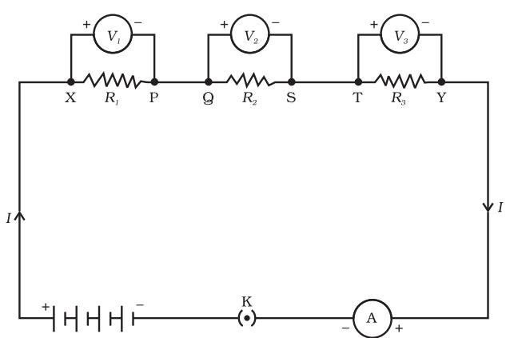  
Figure 11.8

Plug the key and measure the potential difference across the first resistor. Let it be $V _ { \scriptscriptstyle I }$ .   
■ Similarly, measure the potential difference across the other two resistors, separately. Let these values be $V _ { _ 2 }$ and $V _ { _ 3 }$ , respectively.   
■ Deduce a relationship between $V , V _ { \scriptscriptstyle { I ^ { * } } } V _ { \scriptscriptstyle { 2 } }$ and $V _ { _ 3 }$ .

You will observe that the potential difference V is equal to the sum of potential differences $\mathrm { V } _ { \mathrm { 1 : } }$ , $\mathrm { V } _ { 2 }$ , and $\mathrm { V } _ { 3 }$ . That is the total potential difference across a combination of resistors in series is equal to the sum of potential difference across the individual resistors. That is,

$$
V = V 1 + V 2 + V 3 \tag {11.11}
$$

In the electric circuit shown in Fig. 11.8, let I be the current through the circuit. The current through each resistor is also I. It is possible to replace the three resistors joined in series by an equivalent single resistor of resistance R, such that the potential difference V across it, and the current I through the circuit remains the same. Applying the Ohm’s law to the entire circuit, we have

$$
V = I R \tag {11.12}
$$

On applying Ohm’s law to the three resistors separately, we further have

$$
V _ {I} = I R _ {I} \quad [ 1 1. 1 3 (\mathrm {a}) ]
$$

$$
V _ {2} = I R _ {2} \quad [ 1 1. 1 3 (\mathrm {b}) ]
$$

$$
\text {a n d} V _ {3} = I R _ {3} \tag {11.13(c]}
$$

From Eq. (11.11),

$$
I R = I R _ {1} + I R _ {2} + I R _ {3}
$$

or

$$
R _ {s} = R _ {1} + R _ {2} + R _ {3} \tag {11.14}
$$

We can conclude that when several resistors are joined in series, the resistance of the combination $\mathrm { R _ { s } }$ equals the sum of their individual resistance, $\mathrm { R } _ { 1 }$ , $\mathsf { R } _ { 2 }$ , $\mathrm { R } _ { 3 }$ , and is thus greater than any individual resistance.

## Example 11.7

An electric lamp, whose resistance is $2 0 \Omega$ , and a conductor of 4 Ω resistance are connected to a 6 V battery (Fig. 11.9). Calculate (a) the total resistance of the circuit, (b) the current through the circuit, and (c) the potential difference across the electric lamp and conductor.

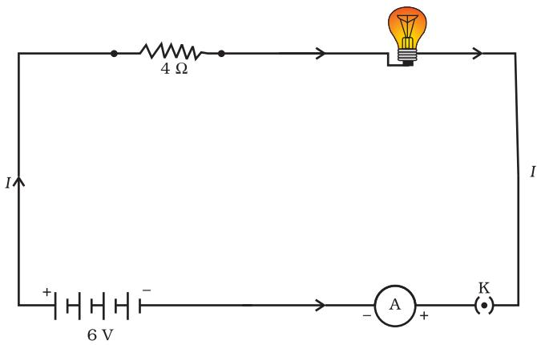  
Figure 11.9 An electric lamp connected in series with a resistor of 4Ω to a 6 V battery

## Solution

The resistance of electric lamp, $\mathrm { R } _ { 1 } { = } 2 0 \Omega$ ,

The resistance of the conductor connected in series, $\mathrm { R } _ { 2 } = 4 \Omega$ .

Then the total resistance in the circuit

$$
R = R _ {1} + R _ {2}
$$

$$
R _ {s} = 2 0 \Omega + 4 \Omega = 2 4 \Omega .
$$

The total potential difference across the two terminals of the battery $\mathrm { V } { = } 6 \mathrm { V } .$ .

Now by Ohm’s law, the current through the circuit is given by

$$
\begin{array}{l} I = V / R _ {s} \\ = 6 \mathrm {V} / 2 4 \Omega \\ = 0. 2 5 \mathrm {A}. \\ \end{array}
$$

Applying Ohm’s law to the electric lamp and conductor separately, we get potential difference across the electric lamp,

$$
\begin{array}{l} V _ {1} = 2 0 \Omega \times 0. 2 5 A \\ = 5 \mathrm {V}; \\ \end{array}
$$

and,

that across the conductor, $\mathrm { V } _ { \mathrm { 2 } } = 4 \Omega \times 0 . 2 5 \mathrm { A }$

$$
= 1 \mathrm {V}.
$$

Suppose that we like to replace the series combination of electric lamp and conductor by a single and equivalent resistor. Its resistance must be such that a potential difference of 6 V across the battery terminals will cause a current of 0.25 A in the circuit. The resistance R of this equivalent resistor would be

$$
\begin{array}{l} R = V / I \\ = 6 \mathrm {V} / 0. 2 5 \mathrm {A} \\ = 2 4 \Omega . \\ \end{array}
$$

This is the total resistance of the series circuit; it is equal to the sum of the two resistances.

## 

1. Draw a schematic diagram of a circuit consisting of a battery of three cells of $2 \mathrm { ~ V ~ }$ each, a $5 \Omega$ resistor, an $8 \Omega$ resistor, and a $1 2 \Omega$ resistor, and a plug key, all connected in series.   
2. Redraw the circuit of Question 1, putting in an ammeter to measure the current through the resistors and a voltmeter to measure the potential difference across the $1 2 \ \Omega$ resistor. What would be the readings in the ammeter and the voltmeter?

#### 11.6.2 Resistors in Parallel

Now, let us consider the arrangement of three resistors joined in parallel with a combination of cells (or a battery), as shown in Fig.11.7.

### Activity 11.6

Make a parallel combination, XY, of three resistors having resistances R , R , and $\mathrm { R } _ { 3 }$ , respectively. Connect it with a battery, a plug key and an ammeter, as shown in Fig. 11.10. Also connect a v o l t m e t e r i n p a r a l l e l w i t h t h e combination of resistors.

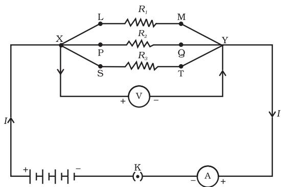  
Figure 11.10

Plug the key and note the ammeter reading. Let the current be I. Also take the voltmeter reading. It gives the potential difference V, across the combination. The potential difference across each resistor is also V. This can be checked by connecting the voltmeter across each individual resistor (see Fig. 11.11).   
■ Take out the plug from the key. Remove the ammeter and voltmeter from the circuit. Insert the ammeter in series with the resistor $\mathrm { R } _ { 1 }$ , as shown in Fig. 11.11. Note the ammeter reading, $I _ { \iota }$ .

  
Figure 11.11

Similarly, measure the currents through $R _ { 2 }$ and $R _ { 3 }$ . Let these be $I _ { 2 }$ and $I _ { s }$ , r e s p e c t i v e l y. W h a t i s t h e relationship between I, $I _ { \imath } , I _ { 2 }$ and I3?

It is observed that the total current I, is equal to the sum of the separate currents through each branch of the combination.

$$
I = I _ {1} + I _ {2} + I _ {3} \tag {11.15}
$$

Let $\mathrm { R } _ { \mathrm { p } }$ be the equivalent resistance of the parallel combination of resistors. By applying Ohm’s law to the parallel combination of resistors, we have

$$
I = V / R _ {p} \tag {11.16}
$$

On applying Ohm’s law to each resistor, we have

$$
I _ {1} = V / R _ {1}; \quad I _ {2} = V / R _ {2}; \text {a n d} I _ {3} = V / R _ {3} \tag {11.17}
$$

From Eqs. (11.15) to (11.17), we have

$$
V / R _ {p} = V / R _ {1} + V / R _ {2} + V / R _ {3}
$$

or

$$
1 / R _ {p} = 1 / R _ {1} + 1 / R _ {2} + 1 / R _ {3} \tag {11.18}
$$

Thus, we may conclude that the reciprocal of the equivalent resistance of a group of resistances joined in parallel is equal to the sum of the reciprocals of the individual resistances.

## Example 11.8

In the circuit diagram given in Fig. 11.10, suppose the resistors R , $\mathsf { R } _ { 2 }$ and $\mathrm { R } _ { 3 }$ have the values 5 Ω, 10 Ω, 30 Ω, respectively, which have been connected to a battery of $1 2 \ \mathrm { V } .$ Calculate (a) the current through each resistor, (b) the total current in the circuit, and (c) the total circuit resistance.

Solution

$$
R _ {1} = 5 \Omega , R _ {2} = 1 0 \Omega , a n d R _ {3} = 3 0 \Omega .
$$

Potential difference across the battery,

$$
\mathrm {V} = 1 2 \mathrm {V}.
$$

This is also the potential difference across each of the individual resistor; therefore, to calculate the current in the resistors, we use Ohm’s law.

The current $I _ { \imath }$ , through $R _ { \scriptscriptstyle I } = { \cal V } / R _ { \scriptscriptstyle I }$

$$
I _ {I} = 1 2 \mathrm {V} / 5 \Omega = 2. 4 \mathrm {A}.
$$

The current $I _ { 2 }$ , through $R _ { 2 } { = } V / R _ { 2 }$

$$
I _ {2} = 1 2 \mathrm {V} / 1 0 \Omega = 1. 2 \mathrm {A}.
$$

The current $I _ { 3 }$ , through $R _ { 3 } { = } V / R _ { 3 }$

$$
I _ {3} = 1 2 \mathrm {V} / 3 0 \Omega = 0. 4 \mathrm {A}.
$$

The total current in the circuit,

$$
\begin{array}{l} I = I _ {1} + I _ {2} + I _ {3} \\ = \quad (2. 4 + 1. 2 + 0. 4) \mathrm {A} \\ = 4 \mathrm {A} \\ \end{array}
$$

The total resistance $\mathrm { R } _ { \mathrm { p } } ,$ is given by [Eq. (11.18)]

$$
\frac {1}{R _ {p}} = \frac {1}{5} + \frac {1}{1 0} + \frac {1}{3 0} = \frac {1}{3}
$$

Thus, $\mathrm { R } _ { \mathrm { p } } = 3 \Omega$ .

## Example 11.9

If in Fig. $1 1 . 1 2 , \mathrm { R } _ { \scriptscriptstyle 1 } = 1 0 \Omega , \mathrm { R } _ { \scriptscriptstyle 2 } = 4 0 \Omega , \mathrm { R } _ { \scriptscriptstyle 3 } = 3 0 \Omega$ $\mathrm { R } _ { \mathrm { 1 } } = \mathrm { 1 0 } \Omega$ $\mathrm { R } _ { 3 } { } = 3 0 \Omega$ , $\mathrm { R } _ { 4 } = 2 0 \ \Omega$ , $\mathrm { R } _ { 5 } = 6 0 \Omega$ , and a $1 2 \mathrm { ~ V ~ }$ battery is connected to the arrangement. Calculate (a) the total resistance in the circuit, and (b) the total current flowing in the circuit.

## Solution

Suppose we replace the parallel resistors $\mathrm { R } _ { 1 }$ and $\mathsf { R } _ { 2 }$ by an equivalent resistor of resistance, $\mathrm { R } ^ { \prime }$ . Similarly we replace the parallel resistors $\mathrm { R } _ { 3 }$ , $\mathrm { R } _ { 4 }$ and $\mathrm { R } _ { \mathfrak { s } }$ by an equivalent single resistor of resistance $\mathbb { R } ^ { \mathfrak { u } }$ . Then using Eq. (11.18), we have

$1 / \mathrm { R } ^ { \prime } { = } 1 / 1 0 + 1 / 4 0 { = } 5 / 4 0$ ; that is $\mathbf { R } ^ { \mathsf { I } } = 8 { \Omega }$

Similarly, $1 / \mathrm { R } ^ { \mathfrak { u } } = 1 / 3 0 + 1 / 2 0 + 1 / 6 0 = 6 / 6 0$ ;

  
Figure 11.12 An electric circuit showing the combination of series and parallel resistors

that is, $\mathrm { R } ^ { \parallel } = 1 0 \Omega$ .

Thus, the total resistance, $\mathrm { R } = \mathrm { R } ^ { \prime } + \mathrm { R } ^ { \prime \prime } = 1 8 \Omega$ .

To calculate the current, we use Ohm’s law, and get

$$
I = V / R = 1 2 \mathrm {V} / 1 8 \Omega = 0. 6 7 \mathrm {A}.
$$

We have seen that in a series circuit the current is constant throughout the electric circuit. Thus it is obviously impracticable to connect an electric bulb and an electric heater in series, because they need currents of widely different values to operate properly (see Example 11.3). Another major disadvantage of a series circuit is that when one component fails the circuit is broken and none of the components works. If you have used ‘fairy lights’ to decorate buildings on festivals, on marriage celebrations etc., you might have seen the electrician spending lot of time in troublelocating and replacing the ‘dead’ bulb – each has to be tested to find which has fused or gone. On the other hand, a parallel circuit divides the current through the electrical gadgets. The total resistance in a parallel circuit is decreased as per Eq. (11.18). This is helpful particularly when each gadget has different resistance and requires different current to operate properly.

## QUEstiONS

1. Judge the equivalent resistance when the following are connected in parallel – (a) $1 \Omega$ and $1 0 ^ { 6 } \Omega$ , (b) $1 \Omega$ and $1 0 ^ { 3 } \Omega$ , and $\overline { { { 1 0 } ^ { 6 } { \Omega } } }$ .   
2. An electric lamp of $1 0 0 \Omega$ , a toaster of resistance $5 0 ~ \Omega$ , and a water filter of resistance $5 0 0 ~ \Omega$ are connected in parallel to a $2 2 0 \mathrm { V }$ source. What is the resistance of an electric iron connected to the same source that takes as much current as all three appliances, and what is the current through it? ?

3. W h a t a r e t h e a d v a n t a g e s o f connecting electrical devices in parallel with the battery instead of connecting them in series?   
4. How can three resistors of resistances $2 \Omega , 3 \Omega$ , and $6 \Omega$ be connected to give a total resistance of (a) $4 \Omega , ( \mathrm { b } ) 1 \Omega ?$   
5. What is (a) the highest, (b) the lowest total resistance that can be secured by combinations of four coils of resistance $4 \Omega , 8 \Omega , 1 2 \Omega , 2 4 \Omega ?$

### 11.7 HEATING EFFECT OF ELECTRICCURRENT

We know that a battery or a cell is a source of electrical energy. The chemical reaction within the cell generates the potential difference between its two terminals that sets the electrons in motion to flow the current through a resistor or a system of resistors connected to the battery. We have also seen, in Section 11.2, that to maintain the current, the source has to keep expending its energy. Where does this energy go? A part of the source energy in maintaining the current may be consumed into useful work (like in rotating the blades of an electric fan). Rest of the source energy may be expended in heat to raise the temperature of gadget. We often observe this in our everyday life. For example, an electric fan becomes warm if used continuously for longer time etc. On the other hand, if the electric circuit is purely resistive, that is, a configuration of resistors only connected to a battery; the source energy continually gets dissipated entirely in the form of heat. This is known as the heating effect of electric current. This effect is utilised in devices such as electric heater, electric iron etc.

Consider a current I flowing through a resistor of resistance $R$ . Let the potential difference across it be V (Fig. 11.13). Let $t$ be the time during which a charge $\boldsymbol { Q }$ flows across. The work done in moving the charge $\boldsymbol { Q }$ through a potential difference $V$ is $V Q$ . Therefore, the source must supply energy equal to $V Q$ in time t. Hence the power input to the circuit by the source is

$$
P = V \frac {Q}{t} = V I \tag {11.19}
$$

Or the energy supplied to the circuit by the source in time t is $P \ \times \ t _ { - }$ , that is, VIt. What happens to this energy expended by the source? This energy gets dissipated in the r e s i s t o r a s h e a t . T h u s f o r a s t e a d y current I, the amount of heat $H$ produced in time t is

$$
H = V I t \tag {11.20}
$$

Applying Ohm’s law [Eq. (11.5)], we get

$$
H = I ^ {2} R t \tag {11.21}
$$

This is known as Joule’s law of heating. The law implies that heat produced in a resistor is (i) directly proportional to the square of current for a given resistance, (ii) directly proportional to resistance for a given current, and (iii) directly proportional to the time for which the current flows through the resistor. In practical situations, when an electric appliance is connected to a known voltage source, Eq. (11.21) is used after calculating the current through it, using the relation $I { = } V / R$ .

  
Figure 11.13   
A steady current in a purely resistive electric circuit

## Example 11.10

An electric iron consumes energy at a rate of 840 W when heating is at the maximum rate and 360 W when the heating is at the minimum. The voltage is 220 V. What are the current and the resistance in each case?

## Solution

From Eq. (11.19), we know that the power input is $P = V I$

Thus the current $I { = } P / V$

(a) When heating is at the maximum rate,

$$
I = 8 4 0 \mathrm {W} / 2 2 0 \mathrm {V} = 3. 8 2 \mathrm {A};
$$

and the resistance of the electric iron is

$$
\mathrm {R} = \mathrm {V} / \mathrm {I} = 2 2 0 \mathrm {V} / 3. 8 2 \mathrm {A} = 5 7. 6 0 \Omega .
$$

(b) When heating is at the minimum rate,

$$
I = 3 6 0 \mathrm {W} / 2 2 0 \mathrm {V} = 1. 6 4 \mathrm {A};
$$

and the resistance of the electric iron is

$$
R = V / I = 2 2 0 \mathrm {V} / 1. 6 4 \mathrm {A} = 1 3 4. 1 5 \Omega .
$$

## Example 11.11

100 J of heat is produced each second in a $4 \Omega$ resistance. Find the potential difference across the resistor.

## Solution

$$
H = 1 0 0 J, R = 4 \Omega , t = 1 s, V = ?
$$

From Eq. (11.21) we have the current through the resistor as

$$
\begin{array}{l} I = \sqrt {(H / R t)} \\ = \sqrt [ ]{1 0 0 \mathrm {J} / (4 \Omega \times 1 \mathrm {s})} \\ = 5 \mathrm {A} \\ \end{array}
$$

Thus the potential difference across the resistor, V [from Eq. (11.5)] is

$$
\begin{array}{l} V = I R \\ = 5 \mathrm {A} \times 4 \Omega \\ = 2 0 \mathrm {V}. \\ \end{array}
$$

## 

1. Why does the cord of an electric heater not glow while the heating element does?   
2. Compute the heat generated while transferring 96000 coulomb of charge in one hour through a potential difference of 50 V.   
3. An electric iron of resistance $2 0 ~ \Omega$ takes a current of 5 A. Calculate the heat developed in 30 s.

#### 11.7.1 Practical Applications of Heating Effect of Electric Current

The generation of heat in a conductor is an inevitable consequence of electric current. In many cases, it is undesirable as it converts useful electrical energy into heat. In electric circuits, the unavoidable heating can increase the temperature of the components and alter their properties. However, heating effect of electric current has many useful applications. The electric laundry iron, electric toaster, electric oven, electric kettle and electric heater are some of the familiar devices based on Joule’s heating.

The electric heating is also used to produce light, as in an electric bulb. Here, the filament must retain as much of the heat generated as is possible, so that it gets very hot and emits light. It must not melt at such high temperature. A strong metal with high melting point such as tungsten (melting point $3 3 8 0 ^ { \circ } \mathrm { C } )$ is used for making bulb filaments. The filament should be thermally isolated as much as possible, using insulating support, etc. The bulbs are usually

filled with chemically inactive nitrogen and argon gases to prolong the life of filament. Most of the power consumed by the filament appears as heat, but a small part of it is in the form of light radiated.

Another common application of Joule’s heating is the fuse used in electric circuits. It protects circuits and appliances by stopping the flow of any unduly high electric current. The fuse is placed in series with the device. It consists of a piece of wire made of a metal or an alloy of appropriate melting point, for example aluminium, copper, iron, lead etc. If a current larger than the specified value flows through the circuit, the temperature of the fuse wire increases. This melts the fuse wire and breaks the circuit. The fuse wire is usually encased in a cartridge of porcelain or similar material with metal ends. The fuses used for domestic purposes are rated as 1 A, 2 A, 3 A, 5 A, 10 A, etc. For an electric iron which consumes $1 \mathrm { k W }$ electric power when operated at 220 V, a current of (1000/220) A, that is, 4.54 A will flow in the circuit. In this case, a 5 A fuse must be used.

### 11.8 ELECTRIC POWER

You have studied in your earlier Class that the rate of doing work is power. This is also the rate of consumption of energy.

Equation (11.21) gives the rate at which electric energy is dissipated or consumed in an electric circuit. This is also termed as electric power. The power $P$ is given by

$$
P = V I
$$

$$
\operatorname {O r} P = I ^ {2} R = V ^ {2} / R \tag {11.22}
$$

The SI unit of electric power is watt (W). It is the power consumed by a device that carries 1 A of current when operated at a potential difference of 1 V. Thus,

$$
1 \mathrm {W} = 1 \mathrm {v o l t} \times 1 \text {a m p e r e} = 1 \mathrm {V A} \tag {11.23}
$$

The unit ‘watt’ is very small. Therefore, in actual practice we use a much larger unit called ‘kilowatt’. It is equal to 1000 watts. Since electrical energy is the product of power and time, the unit of electric energy is, therefore, watt hour (W h). One watt hour is the energy consumed when 1 watt of power is used for 1 hour. The commercial unit of electric energy is kilowatt hour (kW h), commonly known as ‘unit’.

$$
\begin{array}{l} 1 \mathrm {k W h} = 1 0 0 0 \mathrm {w a t t} \times 3 6 0 0 \mathrm {s e c o n d} \\ = 3. 6 \times 1 0 ^ {6} \text {w a t t s e c o n d} \\ = 3. 6 \times 1 0 ^ {6} \text {j o u l e (J)} \\ \end{array}
$$

## More to Know !

Many people think that electrons are consumed in an electric circuit. This is wrong! We pay the electricity board or electric company to provide energy to move electrons through the electric gadgets like electric bulb, fan and engines. We pay for the energy that we use.

## Example 11.12

An electric bulb is connected to a $2 2 0 \ \mathrm { ~ V ~ }$ generator. The current is 0.50 A. What is the power of the bulb?

## Solution

$$
\begin{array}{l} P = V I \\ = 2 2 0 \mathrm {V} \times 0. 5 0 \mathrm {A} \\ = 1 1 0 \mathrm {J} / \mathrm {s} \\ = 1 1 0 \mathrm {W}. \\ \end{array}
$$

## Example 11.13

An electric refrigerator rated 400 W operates 8 hour/day. What is the cost of the energy to operate it for 30 days at Rs 3.00 per kW h?

## Solution

The total energy consumed by the refrigerator in 30 days would be

$$
\begin{array}{l} 4 0 0 \mathrm {W} \times 8. 0 \text {h o u r / d a y} \times 3 0 \text {d a y s} = 9 6 0 0 0 \mathrm {W h} \\ = 9 6 \mathrm {k W h} \\ \end{array}
$$

Thus the cost of energy to operate the refrigerator for 30 days is

$$
9 6 \mathrm {k W h} \times \mathrm {R s} 3. 0 0 \mathrm {p e r k W h} = \mathrm {R s} 2 8 8. 0 0
$$

## QUEstiONS

1. What determines the rate at which energy is delivered by a current?   
2. An electric motor takes 5 Afrom a 220 V line. Determine the power of the motor and the energy consumed in $^ { 2 \mathrm { h } }$ .

## What you have learnt

■ A stream of electrons moving through a conductor constitutes an electric current. Conventionally, the direction of current is taken opposite to the direction of flow of electrons.   
■ The SI unit of electric current is ampere.   
■ To set the electrons in motion in an electric circuit, we use a cell or a battery. A cell generates a potential difference across its terminals. It is measured in volts (V).   
■ Resistance is a property that resists the flow of electrons in a conductor. It controls the magnitude of the current. The SI unit of resistance is ohm (Ω).   
■ Ohm’s law: The potential difference across the ends of a resistor is directly proportional to the current through it, provided its temperature remains the same.   
■ The resistance of a conductor depends directly on its length, inversely on its area of cross-section, and also on the material of the conductor.   
■ The equivalent resistance of several resistors in series is equal to the sum of their individual resistances.   
■ Aset of resistors connected in parallel has an equivalent resistance $R _ { p }$ given by ${ \frac { 1 } { R _ { p } } } = { \frac { 1 } { R _ { 1 } } } + { \frac { 1 } { R _ { 2 } } } + { \frac { 1 } { R _ { 3 } } } + \ldots$   
■ The electrical energy dissipated in a resistor is given by ${ \mathrm { W } } = { \mathrm { V } } \times { \mathrm { I } } \times { \mathrm { t } }$   
■ The unit of power is watt (W). One watt of power is consumed when 1 A of current flows at a potential difference of 1 V.   
■ The commercial unit of electrical energy is kilowatt hour (kWh). $1 \mathrm { k W h } { = } 3 , 6 0 0 , 0 0 0 \mathrm { J } { = } 3 . 6 \times 1 0 ^ { 6 } \mathrm { J }$ .

## EXERCISES

1. A piece of wire of resistance R is cut into five equal parts. These parts are then connected in parallel. If the equivalent resistance of this combination is ${ \mathrm { R } } ^ { 1 }$ , then the Iratio R/R is –

(a)1/25

(b) 1/5

(c) 5

(d) 25

2. Which of the following terms does not represent electrical power in a circuit?

2 (a)I R

2 (b) IR

(c) VI

2(d) V /R

3. An electric bulb is rated $2 2 0 \mathrm { V }$ and 100 W. When it is operated on 110 V, the power consumed will be –

(a)100 W

(b) 75 W

(c) 50 W

(d) 25 W

4. Two conducting wires of the same material and of equal lengths and equal diameters are first connected in series and then parallel in a circuit across the same potential difference. The ratio of heat produced in series and parallel combinations would be –

(a)1:2

(b) 2:1

(c) 1:4

(d) 4:1

5. How is a voltmeter connected in the circuit to measure the potential difference between two points?   
6. A copper wire has diameter $0 . 5 \mathrm { m m }$ and resistivity of $1 . 6 \times 1 0 ^ { - 8 } \Omega \mathrm { m }$ . What will be the length of this wire to make its resistance $1 0 \Omega ?$ How much does the resistance change if the diameter is doubled?   
7. The values of current I flowing in a given resistor for the corresponding values of potential difference V across the resistor are given below –

I (amperes)

0.5

2.0

3.0

4.0

V (volts)

1.6

3.4

6.7

10.2

13.2

Plot a graph between V and I and calculate the resistance of that resistor.

8. When a $1 2 \mathrm { V }$ battery is connected across an unknown resistor, there is a current of 2.5 mAin the circuit. Find the value of the resistance of the resistor.   
9. A battery of 9 V is connected in series with resistors of 0.2 Ω, 0.3 Ω, 0.4 Ω , 0.5 Ωand $1 2 \Omega$ , respectively. How much current would flow through the $1 2 \Omega$ resistor?   
10. How many $1 7 6 \Omega$ resistors (in parallel) are required to carry 5 A on a $2 2 0 \mathrm { V }$ line?   
11. Show how you would connect three resistors, each of resistance $6 \Omega$ , so that the combination has a resistance of (i) $^ { 9 \Omega , ( \mathrm { i i } ) 4 \Omega }$ .

12. Several electric bulbs designed to be used on a $2 2 0 \mathrm { V }$ electric supply line, are rated 10 W. How many lamps can be connected in parallel with each other across the two wires of 220 V line if the maximum allowable current is 5 A?   
13. A hot plate of an electric oven connected to a $2 2 0 \mathrm { V }$ line has two resistance coils A and B, each of $2 4 \Omega$ resistance, which may be used separately, in series, or in parallel. What are the currents in the three cases?   
14. Compare the power used in the $2 \ \Omega$ resistor in each of the following circuits: (i) a 6 V battery in series with $1 \Omega$ and $2 \Omega$ resistors, and (ii) a 4 V battery in parallel with $1 2 \Omega$ and $2 \Omega$ resistors.   
15. Two lamps, one rated 100 W at $2 2 0 \mathrm { V } ,$ and the other 60 W at 220 V, are connected in parallel to electric mains supply. What current is drawn from the line if the supply voltage is 220 V?   
16. Which uses more energy, a 250 W TV set in 1 hr, or a 1200 W toaster in 10 minutes?   
17. An electric heater of resistance $8 \ \Omega$ draws 15 A from the service mains 2 hours. Calculate the rate at which heat is developed in the heater.   
18. Explain the following.

(a) Why is the tungsten used almost exclusively for filament of electric lamps?   
(b) Why are the conductors of electric heating devices, such as bread-toasters and electric irons, made of an alloy rather than a pure metal?   
(c) Why is the series arrangement not used for domestic circuits?   
(d) How does the resistance of a wire vary with its area of cross-section?   
(e) Why are copper and aluminium wires usually employed for electricity transmission?

# Chapter 12
# Magnetic Effects of Electric Current

n the previous Chapter on ‘Electricity’ we Ilearnt about the heating effects of electric current. What could be the other effects of electric current? We know that an electric current-carrying wire behaves like a magnet. Let us perform the following Activity to reinforce it.

### Activity 12.1

  
Figure 12.1 Compass needle is deflected on passing an electric current through a metallic conductor

■ Take a straight thick copper wire and place it between the points X and Y in an electric circuit, as shown in Fig. 12.1. The wire XY is kept perpendicular to the plane of paper.   
■ Horizontally place a small compass near to this copper wire. See the position of its needle.   
■ Pass the current through the circuit by inserting the key into the plug.   
■ Observe the change in the position of the compass needle.

We see that the needle is deflected. What does it mean? It means that the electric current through the copper wire has produced a magnetic effect. Thus we can say that

electricity and magnetism are linked to each other. Then, what about the reverse possibility of an electric effect of moving magnets? In this Chapter we will study magnetic fields and such electromagnetic effects. We shall also study about electromagnets which involve the magnetic effect of electric current.

## Hans Christian Oersted (177-1851)

Hans Christian Oersted, o n e o f t h e l e a d i n g scientists of the 19th century, played a crucial role in understanding electromagnetism. In 1820 he accidentally discovered

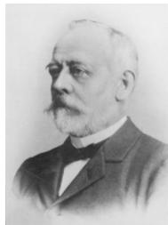

that a compass needle got deflected when an electric current passed through a metallic wire placed nearby. Through this observation Oersted showed that electricity and magnetism were related phenomena. His research later created technologies such as the radio, television and fiber optics. The unit of magnetic field strength is named the oersted in his honor.

### 12.1 MAGNETIC FIELD AND FIELD LINES

We are familiar with the fact that a compass needle gets deflected when brought near a bar magnet. A compass needle is, in fact, a small bar magnet. The ends of the compass needle point approximately towards north and south directions. The end pointing towards north is called north seeking or north pole. The other end that points towards south is called south seeking or south pole. Through various activities we have observed that like poles repel, while unlike poles of magnets attract each other.

## 

1. Why does a compass needle get d e fl e c t e d w h e n b r o u g h t n e a r a bar magnet?

### Activity 12.2

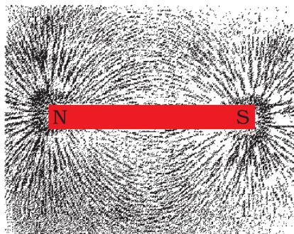  
Figure 12.2

Iron filings near the bar magnet align themselves along the field lines.

■ Fix a sheet of white paper on a drawing board using some adhesive material.   
■ Place a bar magnet in the centre of it.   
■ Sprinkle some iron filings uniformly around the bar magnet (Fig. 12.2). A salt-sprinkler may be used for this purpose.   
■ Now tap the board gently.   
■ What do you observe?

The iron filings arrange themselves in a pattern as shown Fig. 12.2. Why do the iron filings arrange in such a pattern? What does this pattern demonstrate? The magnet exerts its influence in the region surrounding it. Therefore the iron filings experience a force. The force thus exerted makes iron filings to arrange in a pattern. The region surrounding a

magnet, in which the force of the magnet can be detected, is said to have a magnetic field. The lines along which the iron filings align themselves represent magnetic field lines.

Are there other ways of obtaining magnetic field lines around a bar magnet? Yes, you can yourself draw the field lines of a bar magnet.

### Activity 12.3

Take a small compass and a bar magnet.   
■ Place the magnet on a sheet of white paper fixed on a drawing board, using some adhesive material.   
■ Mark the boundary of the magnet.   
■ Place the compass near the north pole of the magnet. How does it behave? The south pole of the needle points towards the north pole of the magnet. The north pole of the compass is directed away from the north pole of the magnet.   
Mark the position of two ends of the needle.   
■ Now move the needle to a new position such that its south pole occupies the position previously occupied by its north pole.   
■ In this way, proceed step by step till you reach the south pole of the magnet as shown in Fig. 12.3.

  
Figure 12.3

■ Join the points marked on the paper by a smooth curve. This curve represents a field line.   
■ Repeat the above procedure and draw as many lines as you can. You will get a pattern shown in Fig. 12.4. These lines represent the magnetic field around the magnet. These are known as magnetic field lines.

  
Figure 12.4   
Field lines around a bar magnet

■ Observe the deflection in the compass needle as you move it along a field line. The deflection increases as the needle is moved towards the poles.

Magnetic field is a quantity that has both direction and magnitude. The direction of the magnetic field is taken to be the direction in which a north pole of the compass needle moves inside it. Therefore it is taken by convention that the field lines emerge from north pole and merge at the south pole (note the arrows marked on the field lines in Fig. 12.4).

Inside the magnet, the direction of field lines is from its south pole to its north pole. Thus the magnetic field lines are closed curves.

The relative strength of the magnetic field is shown by the degree of closeness of the field lines. The field is stronger, that is, the force acting on the pole of another magnet placed is greater where the field lines are crowded (see Fig. 12.4).

No two field-lines are found to cross each other. If they did, it would mean that at the point of intersection, the compass needle would point towards two directions, which is not possible.

### 12.2 MAGNETIC FIELD DUE TO A CURRENT-CARRYING CONDUCTOR

In Activity 12.1, we have seen that an electric current through a metallic conductor produces a magnetic field around it. In order to find the direction of the field produced let us repeat the activity in the following way –

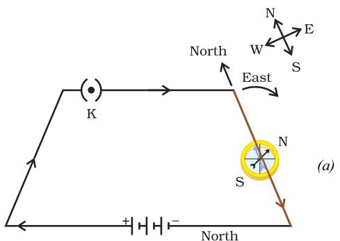  
Activity 12.4

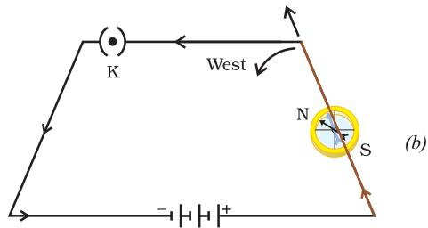  
Figure 12.5 A simple electric circuit in which a straight copper wire is placed parallel to and over a compass needle.   
The deflection in the needle becomes opposite when the direction of the current is reversed.

Take a long straight copper wire, two or three cells of 1.5 V each, and a plug key. Connect all of them in series as shown in Fig. 12.5 (a).   
■ Place the straight wire parallel to and over a compass needle.   
■ Plug the key in the circuit.   
■ Observe the direction of deflection of the north pole of the needle. If the current flows from north to south, as shown in Fig. 12.5 (a), the north pole of the compass needle would move towards the east.   
■ Replace the cell connections in the circuit as shown in Fig. 12.5 (b). This would result in the change of the direction of current through the copper wire, that is, from south to north.   
■ Observe the change in the direction of deflection of the needle. You will see that now the needle moves in opposite direction, that is, towards the west [Fig. 12.5 (b)]. It means that the direction of magnetic field produced by the electric current is also reversed.

#### 12.2.1 Magnetic Field due to a Current through a Straight Conductor

What determines the pattern of the magnetic field generated by a current through a conductor? Does the pattern depend on the shape of the conductor? We shall investigate this with an activity.

We shall first consider the pattern of the magnetic field around a straight conductor carrying current.

### Activity 12.5

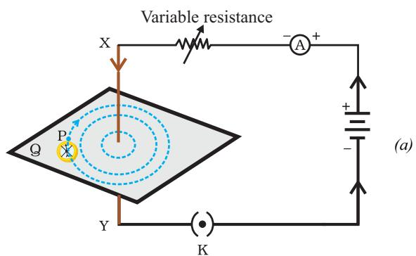

(b)   
Figure 12.6   
  
(a) A pattern of concentric circles indicating the field lines of a magnetic field around a straight conducting wire. The arrows in the circles show the direction of the field lines.   
(b) A close up of the pattern obtained.

Take a battery (12 V), a variable resistance (or a rheostat), an ammeter (0–5 A), a plug key, connecting wires and a long straight thick copper wire.   
■ Insert the thick wire through the centre, normal to the plane of a rectangular cardboard. Take care that the cardboard is fixed and does not slide up or down.   
■ Connect the copper wire vertically between the points X and Y, as shown in Fig. 12.6 (a), in series with the battery, a plug and key.   
■ Sprinkle some iron filings uniformly on the cardboard. (You may use a salt sprinkler for this purpose.)   
■ Keep the variable of the rheostat at a fixed position and note the current through the ammeter.

■ Close the key so that a current flows through the wire. Ensure that the copper wire placed between the points X and Y remains vertically straight.   
■ Gently tap the cardboard a few times. Observe the pattern of the iron filings. You would find that the iron filings align themselves showing a pattern of concentric circles around the copper wire (Fig. 12.6).   
■ What do these concentric circles represent? They represent the magnetic field lines.   
■ How can the direction of the magnetic field be found? Place a compass at a point (say P) over a circle. Observe the direction of the needle. The direction of the north pole of the compass needle would give the direction of the field lines produced by the electric current through the straight wire at point P. Show the direction by an arrow.   
■ Does the direction of magnetic field lines get reversed if the direction of current through the straight copper wire is reversed? Check it.

What happens to the deflection of the compass needle placed at a given point if the current in the copper wire is changed? To see this, vary the current in the wire. We find that the deflection in the needle also changes. In fact, if the current is increased, the deflection also increases. It indicates that the magnitude of the magnetic field produced at a given point increases as the current through the wire increases.

What happens to the deflection of the needle if the compass is moved away from the copper wire but the current through the wire

remains the same? To see this, now place the compass at a farther point from the conducting wire (say at point Q). What change do you observe? We see that the deflection in the needle decreases. Thus the magnetic field produced by a given current in the conductor decreases as the distance from it increases. From Fig. 12.6, it can be noticed that the concentric circles representing the magnetic field around a current-carrying straight wire become larger and larger as we move away from it.

#### 12.2.2 Right-Hand Thumb Rule

A convenient way of finding the direction of magnetic field associated with a currentcarrying conductor is given in Fig. 12.7.

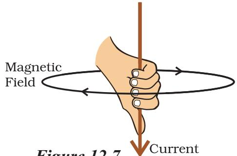  
Figure 12.7

## Right-hand thumb rule

Imagine that you are holding a currentcarrying straight conductor in your right hand such that the thumb points towards the direction of current. Then your fingers will wrap around the conductor in the direction of the field lines of the magnetic field, as shown in Fig. 12.7. This is known as the right-hand thumb rule*.

## Example 12.1

A current through a horizontal power line flows in east to west direction. What is the direction of magnetic field at a point directly below it and at a point directly above it?

## Solution

The current is in the east-west direction. Applying the right-hand thumb rule, we get that

the magnetic field (at any point below or above the wire) turns clockwise in a plane perpendicular to the wire, when viewed from the east end, and anti-clockwise, when viewed from the west end.

## QUESτIONS

1. Draw magnetic field lines around a bar magnet.   
2. List the properties of magnetic field lines.   
3. Why don’t two magnetic field lines intersect each other?

#### 12.2.3 Magnetic Field due to a Current through a Circular Loop

We have so far observed the pattern of the magnetic field lines produced around a current-carrying straight wire. Suppose this straight wire is bent in the form of a circular loop and a current is passed through it. How would the magnetic field lines look like? We know that the magnetic field produced by a current-carrying straight wire depends inversely on the distance from it. Similarly at every point of a current-carrying circular loop, the concentric circles representing the magnetic field around it would become larger and larger as we move away from the wire (Fig. 12.8). By the time we reach at the centre of the circular loop, the arcs of these big circles would appear as straight lines. Every point on the wire carrying current would give rise to the magnetic field appearing as straight lines at the center of the loop. By applying the right hand rule, it is easy to check that every section of the wire contributes to the magnetic field lines in the same direction within the loop.

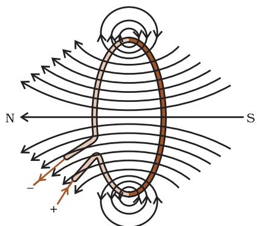  
Figure 12.8

Magnetic field lines of the field produced by a current-carrying circular loop

We know that the magnetic field produced by a current-carrying wire at a given point depends directly on the current passing through it. Therefore, if there is a circular coil having n turns, the field produced is n times as large as that produced by a single turn. This is because the current in each circular turn has the same direction, and the field due to each turn then just adds up.

* This rule is also called Maxwell’s corkscrew rule. If we consider ourselves driving a corkscrew in the direction of the current, then the direction of the rotation of corkscrew is the direction of the magnetic field..

### Activity 12.6

■ Take a rectangular cardboard having two holes. Insert a circular coil having large number of turns through them, normal to the plane of the cardboard.   
■ Connect the ends of the coil in series with a battery, a key and a rheostat, as shown in Fig. 12.9.

  
Figure 12.9 Magnetic field produced by a current-carrying circular coil.

■ Sprinkle iron filings uniformly on the cardboard.   
Plug the key.   
■ Tap the cardboard gently a few times. Note the pattern of the iron filings that emerges on the cardboard.

#### 12.2.4 Magnetic Field due to a Current in a Solenoid

A coil of many circular turns of insulated copper wire wrapped closely in the shape of a cylinder is called a solenoid. The pattern of the magnetic field lines around a current-carrying solenoid is shown in Fig. 12.10. Compare the

  
Figure 12.10 Field lines of the magnetic field through and around a current carrying solenoid.

Compare the pattern of the field with the magnetic field around a bar magnet (Fig. 12.4). Do they look similar? Yes, they are similar. In fact, one end of the solenoid behaves as a magnetic north pole, while the other behaves as the south pole. The field lines inside the solenoid are in the form of parallel straight lines. This indicates that the magnetic field is the same at all points inside the solenoid. That is, the field is uniform inside the solenoid.

A strong magnetic field produced inside a solenoid can be used to magnetise a piece of magnetic material, like soft iron, when placed inside the coil (Fig. 12.11). The magnet so formed is called an electromagnet.

  
Figure 12.11 A current-carrying solenoid coil is used to magnetise steel rod inside it – an electromagnet.

## 

1. Consider a circular loop of wire lying in the plane of the table. Let the current pass through the loop clockwise. Apply the right-hand rule to find out the direction of the magnetic field inside and outside the loop.   
2. The magnetic field in a given region is uniform. Draw a diagram to represent it.

3. Choose the correct option.

The magnetic field inside a long straight solenoid-carrying current

(a) is zero.   
(b) decreases as we move towards its end.   
(c) increases as we move towards its end.   
(d) is the same at all points.

### 12.3 FORCEONACURRENT-CARRYING CONDUCTORINAMAGNETICFIELD

We have learnt that an electric current flowing through a conductor produces a magnetic field. The field so produced exerts a force on a magnet placed in the vicinity of the conductor. French scientist Andre Marie Ampere (1775–1836) suggested that the magnet must also exert an equal and opposite force on the current-carrying conductor. The force due to a magnetic field acting on a c u r r e n t - c a r r y i n g c o n d u c t o r c a n b e demonstrated through the following activity.

### Activity 12.7

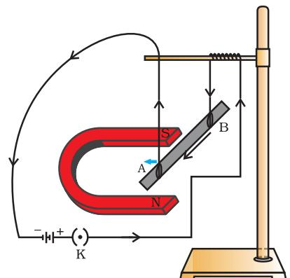  
Figure 12.12 A current-carrying rod, AB, experiences a force perpendicular to its length and the magnetic field. Support for the magnet is not shown here, for simplicity.

■ Take a small aluminium rod AB (of about 5 cm). Using two connecting wires suspend it horizontally from a stand, as shown in Fig. 12.12.   
■ Place a strong horse-shoe magnet in such a way that the rod lies between the two poles with the magnetic field directed upwards. For this put the north pole of the magnet vertically below and south pole vertically above the aluminium rod (Fig. 12.12).   
■ Connect the aluminium rod in series with a battery, a key and a rheostat.   
■ Now pass a current through the aluminium rod from end B to end A.   
■ What do you observe? It is observed that the rod is displaced towards the left. You will notice that the rod gets displaced.   
■ Reverse the direction of current flowing through the rod and observe the direction of its displacement. It is now towards the right. Why does the rod get displaced?

The displacement of the rod in the above activity suggests that a force is exerted on the current-carrying aluminium rod when it is placed in a magnetic field. It also suggests that the direction of force is also reversed when the direction of current through the conductor is reversed. Now change the direction of field to vertically downwards by interchanging the two poles of the magnet. It is once again observed that the direction of force acting on the currentcarrying rod gets reversed. It shows that the direction of the force on the conductor depends upon the direction of current and the direction of the magnetic field. Experiments have shown that the displacement of the rod is largest (or the

magnitude of the force is the highest) when the direction of current is at right angles to the direction of the magnetic field. In such a condition we can use a simple rule to find the direction of the force on the conductor.

In Activity 12.7, we considered the direction of the current and that of the magnetic field perpendicular to each other and found that the force is perpendicular to both of them. The three directions can be illustrated through a simple rule, called Fleming’s left-hand rule. According to this rule, stretch the thumb, forefinger and middle finger of your left hand such that they are mutually perpendicular (Fig. 12.13). If the first finger points in the direction of magnetic field and the second finger in the direction of current, then the thumb will point in the direction of motion or the force acting on the conductor.

  
Figure 12.13   
Fleming’s left-hand rule

Devices that use current-carrying conductors and magnetic fields include electric motor, electric generator, loudspeakers, microphones and measuring instruments.

## Example 12.2

An electron enters a magnetic field at right angles to it, as shown in Fig. 12.14. The direction of force acting on the electron will be

(a) to the right.   
(b) to the left.   
(c) out of the page.   
(d) into the page.

  
Figure 12.14

## Solution

Answer is option (d). The direction of force is perpendicular to the direction of magnetic field and current as given by Fleming’s left hand rule. Recall that the direction of current is taken opposite to the direction of motion of electrons. The force is therefore directed into the page.

## 

1. Which of the following property of a proton can change while it moves freely in a magnetic field? (There may be more than one correct answer.)

(a) mass

(b) speed

(c) velocity

(d) momentum

2. In Activity 12.7, how do we think the displacement of rod AB will be affected if (i) current in rod AB is increased; (ii) a stronger horse-shoe magnet is used; and (iii) length of the rod AB is increased?   
3. A positively-charged particle (alphaparticle) projected towards west is deflected towards north by a magnetic field. The direction of magnetic field is

(a) towards so

uth (b) towards east

(c) downward

(d) upward

## More to Know!

## Magnetism in medicine

An electric current always produces a magnetic field. Even weak ion currents that travel along the nerve cells in our body produce magnetic fields. When we touch something, our nerves carry an electric impulse to the muscles we need to use. This impulse produces a temporary magnetic field. These fields are very weak and are about one-billionth of the earth’s magnetic field. Two main organs in the human body where the magnetic field produced is significant, are the heart and the brain. The magnetic field inside the body forms the basis of obtaining the images of different body parts. This is done using a technique called Magnetic Resonance Imaging (MRI). Analysis of these images helps in medical diagnosis. Magnetism has, thus, got important uses in medicine.

### 12.4 DOMESTIC ELECTRIC CIRCUITS

In our homes, we receive supply of electric power through a main supply (also called mains), either supported through overhead electric poles or by underground cables. One of the wires in this supply, usually with red insulation cover, is called live wire (or positive). Another wire, with black insulation, is called neutral wire (or negative). In our country, the potential difference between the two is $2 2 0 \mathrm { V } .$ .

At the meter-board in the house, these wires pass into an electricity meter through a main fuse. Through the main switch they are

connected to the line wires in the house. These wires supply electricity to separate circuits within the house. Often, two separate circuits are used, one of 15A current rating for appliances with higher power ratings such as geysers, air coolers, etc. The other circuit is of 5A current rating for bulbs, fans, etc. The earth wire, which has insulation of green colour, is usually connected to a metal plate deep in the earth near the house. This is used as a safety measure, especially for those appliances that have a metallic body, for example, electric press, toaster, table fan, refrigerator, etc. The metallic body is connected to the earth wire, which provides a low-resistance conducting path for the current. Thus, it ensures that any leakage of current to the metallic body of the appliance keeps its potential to that of the earth, and the user may not get a severe electric shock.

  
Figure 12.15 A schematic diagram of one of the common domestic circuits

Figure 12.15 gives a schematic diagram of one of the common domestic circuits. In each separate circuit, different appliances can be connected across the live and neutral wires. Each appliance has a separate switch to ‘ON’/‘OFF’ the flow of current through it. In order that each appliance has equal potential difference, they are connected parallel to each other.

Electric fuse is an important component of all domestic circuits. We have already studied the principle and working of a fuse in the previous chapter (see Section 11.7). A fuse in a circuit prevents damage to the appliances and the circuit due to overloading. Overloading can occur when the live wire and the neutral wire come into direct contact. (This occurs when the insulation of wires is damaged or there is a fault in the appliance.) In such a situation, the current in the circuit abruptly increases. This is called short-circuiting. The use of an electric fuse prevents the electric circuit and the appliance from a possible damage by stopping the flow of unduly high electric current. The Joule heating that takes place in the fuse melts it to break the electric circuit. Overloading can also occur due to an accidental hike in the supply voltage. Sometimes overloading is caused by connecting too many appliances to a single socket.

## 

1. Name two safety measures commonly u s e d i n e l e c t r i c c i r c u i t s a n d appliances.   
2. An electric oven of 2 kW power rating is operated in a domestic electric circuit (220 V) that has a current rating of 5 A. What result do you expect? Explain.   
3. What precaution should be taken to avoid the overloading of domestic electric circuits?

## What you have learnt

■ A compass needle is a small magnet. Its one end, which points towards north, is called a north pole, and the other end, which points towards south, is called a south pole.   
■ A magnetic field exists in the region surrounding a magnet, in which the force of the magnet can be detected.   
■ Field lines are used to represent a magnetic field. A field line is the path along which a hypothetical free north pole would tend to move. The direction of the magnetic field at a point is given by the direction that a north pole placed at that point would take. Field lines are shown closer together where the magnetic field is greater.   
■ A metallic wire carrying an electric current has associated with it a magnetic field. The field lines about the wire consist of a series of concentric circles whose direction is given by the right-hand rule.   
■ The pattern of the magnetic field around a conductor due to an electric current flowing through it depends on the shape of the conductor. The magnetic field of a solenoid carrying a current is similar to that of a bar magnet.   
■ An electromagnet consists of a core of soft iron wrapped around with a coil of insulated copper wire.

■ A current-carrying conductor when placed in a magnetic field experiences a force. If the direction of the field and that of the current are mutually perpendicular to each other, then the force acting on the conductor will be perpendicular to both and will be given by Fleming’s left-hand rule.   
■ In our houses we receive AC electric power of $2 2 0 \mathrm { V }$ with a frequency of $5 0 \mathrm { H z }$ . One of the wires in this supply is with red insulation, called live wire. The other one is of black insulation, which is a neutral wire. The potential difference between the two is $2 2 0 \mathrm { V } .$ The third is the earth wire that has green insulation and this is connected to a metallic body deep inside earth. It is used as a safety measure to ensure that any leakage of current to a metallic body does not give any severe shock to a user.   
■ Fuse is the most important safety device, used for protecting the circuits due to shortcircuiting or overloading of the circuits.

## ExERCISES

1. Which of the following correctly describes the magnetic field near a long straight wire?

(a) The field consists of straight lines perpendicular to the wire.   
(b) The field consists of straight lines parallel to the wire.   
(c) The field consists of radial lines originating from the wire.   
(d) The field consists of concentric circles centred on the wire.

2. At the time of short circuit, the current in the circuit

(a) reduces substantially. (b) does not change.   
(c) increases heavily. (d) vary continuously.

3. State whether the following statements are true or false.

(a) The field at the centre of a long circular coil carrying current will be parallel straight lines.   
(b) A wire with a green insulation is usually the live wire of an electric supply.

4. List two methods of producing magnetic fields.   
5. When is the force experienced by a current–carrying conductor placed in a magnetic field largest?   
6. Imagine that you are sitting in a chamber with your back to one wall. An electron beam, moving horizontally from back wall towards the front wall, is deflected by a strong magnetic field to your right side. What is the direction of magnetic field?   
7. State the rule to determine the direction of a (i) magnetic field produced around a straight conductor-carrying current, (ii) force experienced by a current-carrying straight conductor placed in a magnetic field which is perpendicular to it, and (iii) current induced in a coil due to its rotation in a magnetic field.   
8. When does an electric short circuit occur?   
9. What is the function of an earth wire? Why is it necessary to earth metallic appliances?

# Suggested Pedagogical Processes

# Learning Outcomes

# The learners may be provided with opportunities individually or in groups and encouraged to—

recognise the difference between reactions, such as, exothermic and endothermic, oxidation and reduction, etc.   
observe to understand the difference in the temperatures in both the reactions using laboratory thermometer.   
investigate the ways of segregation of waste material on the basis of their degradation property. They may be encouraged to practice the segregation of waste before disposal at home, school, and public places.   
explore the relationship between two physical quantities, such as, between potential difference across a conductor and electric current flowing through it; design, conduct, and share the findings of an activity   
find out ‘why’ and ‘how’ of processes or phenomena, such as, transportation in plants and animals, extraction of metals from ores, with the help of activities, experiments, and demonstration. The learners may be encouraged to discuss, relate, conclude and explain processes or phenomena to their peers using interdisciplinary approach.   
observe diagrams, such as that of digestive system and the names given to various organs. The learners may be motivated to make poster of the digestive system for displaying in school. They may also be provided opportunities to use ICT tools for drawing.   
collect wide variety of graphs from newspapers, magazines, or the internet, with a view to understand the information contained therein. The learners may be facilitated to draw a graph, such as V-I graph for analysing the relationship between the potential difference across a conductor and the current through it.

# The learner—

differentiates materials, objects, organisms, phenomena, and processes, based on, properties and characteristics, such as, autotrophic and heterotrophic nutrition, biodegradable and non-biodegradable substances, various types of reactions, strong and weak acids and bases, acidic, basic, and neutral salts using different indicators, real and virtual images, etc.   
classifies materials, objects, organisms, phenomena, and processes, based on properties and characteristics, such as, metals and non-metals, acid and bases on the basis of their physical and chemical properties.   
plans and conducts investigations and experiments to arrive at and verify the facts, principles, phenomena, or to seek answers to queries on their own, such as, investigates conditions necessary for rusting, tests the conductivity of various solutions, compares the foaming capacity of different types of soap samples, verifies laws of reflection and refraction of light, Ohm’s law, etc. Do variegated leaves perform photosynthesis? Which gas is evolved during fermentation? Why does the shoot of a plant moves towards light?   
relates processes and phenomena with causes and effects, such as, hormones with their functions, tooth decay with pH of saliva, growth of plants with pH of the soil, survival of aquatic life with pH of water, blue colour of sky with scattering of light, deflection of compass needle due to magnetic effect of electric current, etc.   
explains processes and phenomena, such as, nutrition in human beings and plants, transportation in plants

collect eco-friendly, commonly available materials to design and develop technological devices and innovative exibits, such as, electric motor, soda acid fire extinguisher, respiratory system, etc. They may be motivated to display their exhibits or models in science exhibitions, science club, classrooms, during parent-teacher meet and to respond to the queries raised during interaction.   
visit classrooms, laboratories, library, toilets, playground, etc., to identify places where wastage of electricity and water may be occurring. Discussion may be held on importance of natural resources and their conservation, leading to the conviction for adoption of good habits in their day-to-day life. The learners may also organise a sensitisation programme on such issues.   
share their findings of the activities, projects, and experiments, such as, extraction of metals from ores, working of electric motor and generator, formation of rainbow, etc., in oral and written forms. Report writing may be facilitated to share their findings by using appropriate technical terms, figures, tables, graphs, etc. They may be encouraged to draw conclusions on the basis of their observations.

applies learning to hypothetical situations, such as, what will happen if all herbivores are removed from an ecosystem? What will happen if all non-renewable sources of energy are exhausted?   
applies scientific concepts in daily life and solving problems, such as, suggest precautions to prevent sexually transmitted infections, uses appropriate electrical plugs (5/15A) for different electrical devices, uses vegetative propagation to develop saplings in gardens, performs exercise to keep in good health, avoids using appliances responsible for ozone layer depletion, applies concept of decomposition reaction of baking soda to make spongy cakes, etc.   
derives formulae, equations, and laws, such as, equivalent resistance of resistors in series and parallel, etc.   
draws conclusion, such as, traits or features are inherited through genes present on chromosomes, a new species originates through evolutionary processes, water is made up of hydrogen and oxygen, properties of elements vary periodically along the groups and periods in periodic table, potential difference across a metal conductor is proportional to the electric current flowing through it, etc.   
takes initiative to know about scientific discoveries and inventions, such as, Mendel’s contribution in understanding the concept of inheritance, Dobereiner for discovering triads of elements, Mendeleev for the development of the periodic table of elements, Oersted’s discovery that electricity and magnetism are related, discovery of relation between potential difference across a metal conductor and the electric current flowing through it by Ohm, etc.   
exhibits creativity in designing models using eco-friendly resources, such as, working model of respiratory,

Use multisensory approach for integrating information from auditory, olfactory, tactile as well as visual sources.   
Provide learning experiences through touching objects, materials, organisms, models, etc., to experience size, shape, texture, pattern, and changes.   
Use embossed line diagrams for explaining texts, pictures, graphs and flow charts, etc.   
Use direct sensory experiences for developing concepts like temperature, volume, etc.   
Give opportunities to work with peers during experiments. Rotating partners for the entire class would be a good strategy.   
Allow students to record classroom presentation and lectures or the text in audio format.   
Label the pictures within the text, whenever possible. This can be done by the students as an activity.   
y	Relate the projects and experiments to real life experiences.   
Encourage group task and peer assistance for project and experiment work.   
Give the project and experiment in fewer steps and sequence the steps through visual cues. Display the examples of completed projects and experiments in classroom or laboratory for better understanding.   
Consider alternative or less difficult activities and exercises for the students, with same or similar learning objectives.   
Write all homework or assignments and laboratory procedural changes on the chalkboard.   
Give the student time to finish a step in an experiment and wait until the student indicates that she/he is ready for further work.   
Topics can be taught through class projects, experiments, examples, etc. Activities can be conducted through multisensory modes before explaining any theory and concept.   
Peer support can be used wherever a figure or table has to be drawn. Peer partner can draw with a carbon paper (for copying).   
y	Highlight and underline the key concepts.   
Provide extra time to complete an experiment and understand a concept.   
Always provide proper guidelines to arrange the task in a planned way. Make use of visual aids, graphic organisers and explain the steps of experiments and assignment repetitively till the child learns.   
Sequence maps with visual cues can be provided to the students to understand the sequence of events.