# Chapter 1
# The Rise of Nationalism in Europe

1066CH01

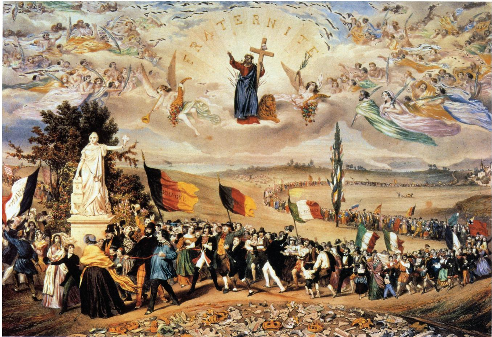  
Fig. 1 — The Dream of Worldwide Democratic and Social Republics – The Pact Between Nations, a print prepared by Frédéric Sorrieu, 1848.

In 1848, Frédéric Sorrieu, a French artist, prepared a series of four prints visualising his dream of a world made up of ‘democratic and social Republics’, as he called them. The first print (Fig. 1) of the series, shows the peoples of Europe and America – men and women of all ages and social classes – marching in a long train, and offering homage to the statue of Liberty as they pass by it. As you would recall, artists of the time of the French Revolution personified Liberty as a female figure – here you can recognise the torch of Enlightenment she bears in one hand and the Charter of the Rights of Man in the other. On the earth in the foreground of the image lie the shattered remains of the symbols of absolutist institutions. In Sorrieu’s utopian vision, the peoples of the world are grouped as distinct nations, identified through their flags and national costume. Leading the procession, way past the statue of Liberty, are the United States and Switzerland, which by this time were already nation-states. France,

## New words

Absolutist – Literally, a government or system of rule that has no restraints on the power exercised. In history, the term refers to a for m of monarchical government that was centralised, militarised and repressive

Utopian – A vision of a society that is so ideal that it is unlikely to actually exist

### Activity

In what way do you think this print (Fig. 1) depicts a utopian vision?

identifiable by the revolutionary tricolour, has just reached the statue. She is followed by the peoples of Germany, bearing the black, red and gold flag. Interestingly, at the time when Sorrieu created this image, the German peoples did not yet exist as a united nation – the flag they carry is an expression of liberal hopes in 1848 to unify the numerous German-speaking principalities into a nation-state under a democratic constitution. Following the German peoples are the peoples of Austria, the Kingdom of the Two Sicilies, Lombardy, Poland, England, Ireland, Hungary and Russia. From the heavens above, Christ, saints and angels gaze upon the scene. They have been used by the artist to symbolise fraternity among the nations of the world.

This chapter will deal with many of the issues visualised by Sorrieu in Fig. 1. During the nineteenth century, nationalism emerged as a force which brought about sweeping changes in the political and mental world of Europe. The end result of these changes was the emergence of the nation-state in place of the multi-national dynastic empires of Europe. The concept and practices of a modern state, in which a centralised power exercised sovereign control over a clearly defined territory, had been developing over a long period of time in Europe. But a nation-state was one in which the majority of its citizens, and not only its rulers, came to develop a sense of common identity and shared history or descent. This commonness did not exist from time immemorial; it was forged through struggles, through the actions of leaders and the common people. This chapter will look at the diverse processes through which nation-states and nationalism came into being in nineteenth-century Europe.

## Source A

## Ernst Renan, ‘What is a Nation?’

In a lecture delivered at the University of Sorbonne in 1882, the French philosopher Ernst Renan (1823-92) outlined his understanding of what makes a nation. The lecture was subsequently published as a famous essay entitled ‘Qu’est-ce qu’une nation?’ (‘What is a Nation?’). In this essay Renan criticises the notion suggested by others that a nation is formed by a common language, race, religion, or territory:

‘A nation is the culmination of a long past of endeavours, sacrifice and devotion. A heroic past, great men, glory, that is the social capital upon which one bases a national idea. To have common glories in the past, to have a common will in the present, to have performed great deeds together, to wish to perform still more, these are the essential conditions of being a people. A nation is therefore a large-scale solidarity … Its existence is a daily plebiscite … A province is its inhabitants; if anyone has the right to be consulted, it is the inhabitant. A nation never has any real interest in annexing or holding on to a country against its will. The existence of nations is a good thing, a necessity even. Their existence is a guarantee of liberty, which would be lost if the world had only one law and only one master.’

Source

## New words

Plebiscite – A direct vote by which all the people of a region are asked to accept or reject a proposal

## Discuss

Summarise the attributes of a nation, as Renan understands them. Why, in his view, are nations important?

## 1 The French Revolution and the Idea of the Nation

The first clear expression of nationalism came with the French Revolution in 1789. France, as you would remember, was a full-fledged territorial state in 1789 under the rule of an absolute monarch. The political and constitutional changes that came in the wake of the French Revolution led to the transfer of sovereignty from the monarchy to a body of French citizens. The revolution proclaimed that it was the people who would henceforth constitute the nation and shape its destiny.

From the very beginning, the French revolutionaries introduced various measures and practices that could create a sense of collective identity amongst the French people. The ideas of la patrie (the fatherland) and le citoyen (the citizen) emphasised

the notion of a united community enjoying equal rights under a constitution. A new French flag, the tricolour, was chosen to replace the former royal standard. The Estates General was elected by the body of active citizens and renamed the National Assembly. New hymns were composed, oaths taken and martyrs commemorated, all in the name of the nation. A centralised administrative system was put in place and it formulated uniform laws for all citizens within its territory. Internal customs duties and dues were abolished and a uniform system of weights and measures was adopted. Regional dialects were discouraged and French, as it was spoken and written in Paris, became the common language of the nation.

The revolutionaries further declared that it was the mission and the destiny of the French nation to liberate the peoples of Europe from despotism, in other words to help other peoples of Europe to become nations.

When the news of the events in France reached the different cities of Europe, students and other members of educated middle classes began setting up Jacobin clubs. Their activities and campaigns prepared the way for the French armies which moved into Holland, Belgium, Switzerland and much of Italy in the 1790s. With the outbreak of the revolutionary wars, the French armies began to carry the idea of nationalism abroad.

Fig. 2 — The cover of a German almanac designed by the journalist Andreas Rebmann in 1798.   
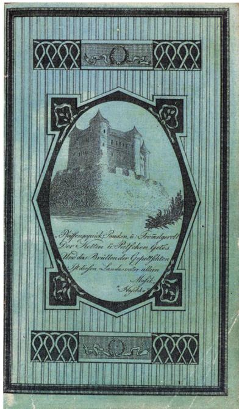  
The image of the French Bastille being stormed by the revolutionary crowd has been placed next to a similar fortress meant to represent the bastion of despotic rule in the German province of Kassel. Accompanying the illustration is the slogan: ‘The people must seize their own freedom!’ Rebmann lived in the city of Mainz and was a member of a German Jacobin group.

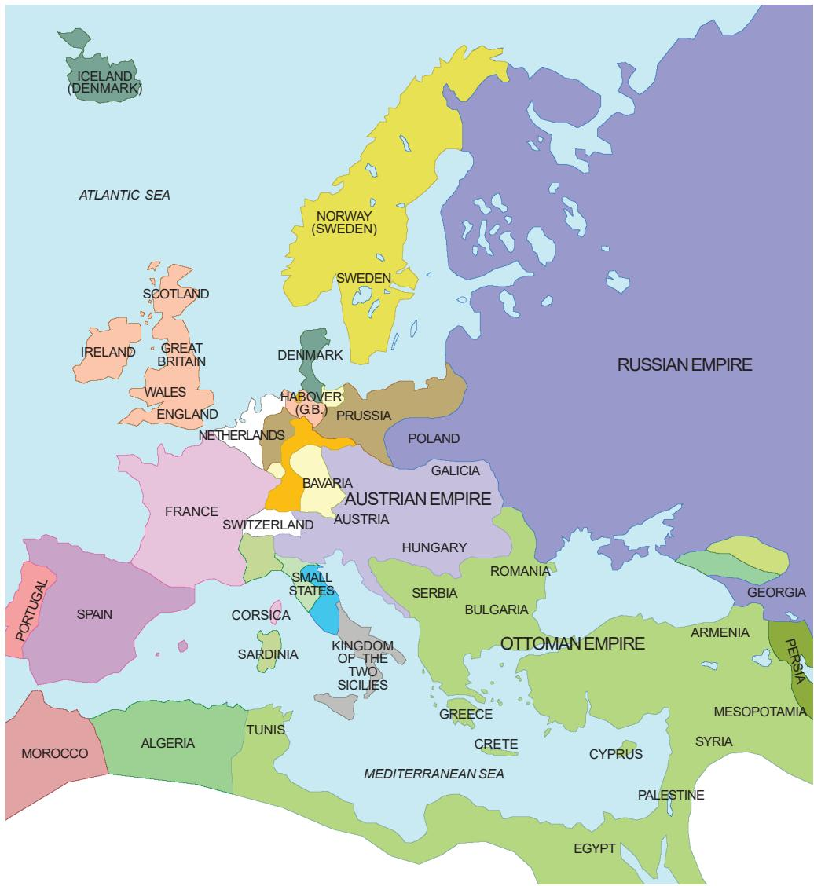  
Fig. 3 — Europe after the Congress of Vienna, 1815.

Within the wide swathe of territory that came under his control, Napoleon set about introducing many of the reforms that he had already introduced in France. Through a return to monarchy Napoleon had, no doubt, destroyed democracy in France, but in the administrative field he had incorporated revolutionary principles in order to make the whole system more rational and efficient. The Civil Code of 1804 – usually known as the Napoleonic Code – did away with all privileges based on birth, established equality before the law and secured the right to property. This Code was exported to the regions under French control. In the Dutch Republic, in Switzerland, in Italy and Germany, Napoleon simplified administrative divisions, abolished the feudal system and freed peasants from serfdom and manorial dues. In the towns too, guild restrictions were removed. Transport and communication systems were improved. Peasants, artisans, workers and new businessmen

Fig. 4 — The Planting of Tree of Liberty in Zweibrücken, Germany.   
  
The subject of this colour print by the German painter Karl Kaspar Fritz is the occupation of the town of Zweibrücken by the French armies. French soldiers, recognisable by their blue, white and red uniforms, have been portrayed as oppressors as they seize a peasant’s cart (left), harass some young women (centre foreground) and force a peasant down to his knees. The plaque being affixed to the Tree of Liberty carries a German inscription which in translation reads: ‘Take freedom and equality from us, the model of humanity.’ This is a sarcastic reference to the claim of the French as being liberators who opposed monarchy in the territories they entered.

enjoyed a new-found freedom. Businessmen and small-scale producers of goods, in particular, began to realise that uniform laws, standardised weights and measures, and a common national currency would facilitate the movement and exchange of goods and capital from one region to another.

However, in the areas conquered, the reactions of the local populations to French rule were mixed. Initially, in many places such as Holland and Switzerland, as well as in certain cities like Brussels, Mainz, Milan and Warsaw, the French armies were welcomed as harbingers of liberty. But the initial enthusiasm soon turned to hostility, as it became clear that the new administrative arrangements did not go hand in hand with political freedom. Increased taxation, censorship, forced conscription into the French armies required to conquer the rest of Europe, all seemed to outweigh the advantages of the administrative changes.

Fig. 5 — The courier of Rhineland loses all that he has on his way home from Leipzig.   
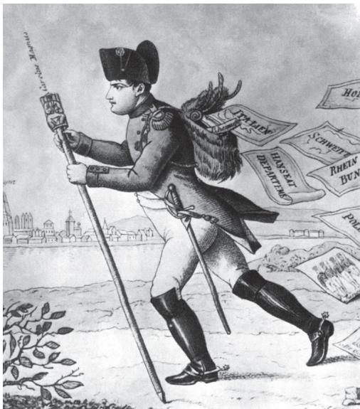  
Napoleon here is represented as a postman on his way back to France after he lost the battle of Leipzig in 1813. Each letter dropping out of his bag bears the names of the territories he lost.

## 2 The Making of Nationalism in Europe

If you look at the map of mid-eighteenth-century Europe you will find that there were no ‘nation-states’ as we know them today.

What we know today as Germany, Italy and Switzerland were divided into kingdoms, duchies and cantons whose rulers had their autonomous territories. Eastern and Central Europe were under autocratic monarchies within the territories of which lived diverse peoples. They did not see themselves as sharing a collective identity or a common culture. Often, they even spoke different languages and belonged to different ethnic groups. The Habsburg Empire that ruled over Austria-Hungary, for example, was a patchwork of many different regions and peoples. It included the Alpine regions – the Tyrol, Austria and the Sudetenland – as well as Bohemia, where the aristocracy was predominantly German-speaking. It also included the Italian-speaking provinces of Lombardy and Venetia. In Hungary, half of the population spoke Magyar while the other half spoke a variety of dialects. In Galicia, the aristocracy spoke Polish. Besides these three dominant groups, there also lived within the boundaries of the empire, a mass of subject peasant peoples – Bohemians and Slovaks to the north, Slovenes in Carniola, Croats to the south, and Roumans to the east in Transylvania. Such differences did not easily promote a sense of political unity. The only tie binding these diverse groups together was a common allegiance to the emperor.

How did nationalism and the idea of the nation-state emerge?

### 2.1 The Aristocracy and the New Middle Class

Socially and politically, a landed aristocracy was the dominant class on the continent. The members of this class were united by a common way of life that cut across regional divisions. They owned estates in the countryside and also town-houses. They spoke French for purposes of diplomacy and in high society. Their families were often connected by ties of marriage. This powerful aristocracy was, however, numerically a small group. The majority of the population was made up of the peasantry. To the west, the bulk of the land was farmed by tenants and small owners, while in Eastern and Central Europe the pattern of landholding was characterised by vast estates which were cultivated by serfs.

## Some important dates

1797

Napoleon invades Italy; Napoleonic wars begin.

1814-1815

Fall of Napoleon; the Vienna Peace Settlement.

1821

Greek struggle for independence begins.

1848

Revolutions in Europe; artisans, industrial workers and peasants revolt against economic hardships; middle classes demand constitutions and representative governments; Italians, Germans, Magyars, Poles, Czechs, etc. demand nation-states.

1859-1870

Unification of Italy.

1866-1871

Unification of Germany.

1905

Slav nationalism gathers force in the Habsburg and Ottoman Empires.

In Western and parts of Central Europe the growth of industrial production and trade meant the growth of towns and the emergence of commercial classes whose existence was based on production for the market. Industrialisation began in England in the second half of the eighteenth century, but in France and parts of the German states it occurred only during the nineteenth century. In its wake, new social groups came into being: a working-class population, and middle classes made up of industrialists, businessmen, professionals. In Central and Eastern Europe these groups were smaller in number till late nineteenth century. It was among the educated, liberal middle classes that ideas of national unity following the abolition of aristocratic privileges gained popularity.

### 2.2 What did Liberal Nationalism Stand for?

Ideas of national unity in early-nineteenth-century Europe were closely allied to the ideology of liberalism. The term ‘liberalism’ derives from the Latin root liber, meaning free. For the new middle classes liberalism stood for freedom for the individual and equality of all before the law. Politically, it emphasised the concept of government by consent. Since the French Revolution, liberalism had stood for the end of autocracy and clerical privileges, a constitution and representative government through parliament. Nineteenth-century liberals also stressed the inviolability of private property.

Yet, equality before the law did not necessarily stand for universal suffrage. You will recall that in revolutionary France, which marked the first political experiment in liberal democracy, the right to vote and to get elected was granted exclusively to property-owning men. Men without property and all women were excluded from political rights. Only for a brief period under the Jacobins did all adult males enjoy suffrage. However, the Napoleonic Code went back to limited suffrage and reduced women to the status of a minor, subject to the authority of fathers and husbands. Throughout the nineteenth and early twentieth centuries women and non-propertied men organised opposition movements demanding equal political rights.

In the economic sphere, liberalism stood for the freedom of markets and the abolition of state-imposed restrictions on the movement of goods and capital. During the nineteenth century this was a strong demand of the emerging middle classes. Let us take the example of the German-speaking regions in the first half of the nineteenth century. Napoleon’s administrative measures had created out of

## New words

Suffrage – The right to vote

countless small principalities a confederation of 39 states. Each of these possessed its own currency, and weights and measures. A merchant travelling in 1833 from Hamburg to Nuremberg to sell his goods would have had to pass through 11 customs barriers and pay a customs duty of about 5 per cent at each one of them. Duties were often levied according to the weight or measurement of the goods. As each region had its own system of weights and measures, this involved time-consuming calculation. The measure of cloth, for example, was the elle which in each region stood for a different length. An elle of textile material bought in Frankfurt would get you $5 4 . 7 ~ \mathrm { c m }$ of cloth, in Mainz $5 5 . 1 ~ \mathrm { c m }$ , in Nuremberg $6 5 . 6 ~ \mathrm { c m }$ , in Freiburg $5 3 . 5 \mathrm { c m }$ .

Such conditions were viewed as obstacles to economic exchange and growth by the new commercial classes, who argued for the creation of a unified economic territory allowing the unhindered movement of goods, people and capital. In 1834, a customs union or zollverein was formed at the initiative of Prussia and joined by most of the German states. The union abolished tariff barriers and reduced the number of currencies from over thirty to two. The creation of a network of railways further stimulated mobility, harnessing economic interests to national unification. A wave of economic nationalism strengthened the wider nationalist sentiments growing at the time.

### 2.3 A New Conservatism after 1815

Following the defeat of Napoleon in 1815, European governments were driven by a spirit of conservatism. Conservatives believed that established, traditional institutions of state and society – like the monarchy, the Church, social hierarchies, property and the family – should be preserved. Most conservatives, however, did not propose a return to the society of pre-revolutionary days. Rather, they realised, from the changes initiated by Napoleon, that modernisation could in fact strengthen traditional institutions like the monarchy. It could make state power more effective and strong. A modern army, an efficient bureaucracy, a dynamic economy, the abolition of feudalism and serfdom could strengthen the autocratic monarchies of Europe.

In 1815, representatives of the European powers – Britain, Russia, Prussia and Austria – who had collectively defeated Napoleon, met at Vienna to draw up a settlement for Europe. The Congress was hosted by the Austrian Chancellor Duke Metternich. The delegates

## Source B

Economists began to think in terms of the national economy. They talked of how the nation could develop and what economic measures could help forge this nation together.

Friedrich List, Professor of Economics at the University of Tübingen in Germany, wrote in 1834:

‘The aim of the zollverein is to bind the Germans economically into a nation. It will strengthen the nation materially as much by protecting its interests externally as by stimulating its internal productivity. It ought to awaken and raise national sentiment through a fusion of individual and provincial interests. The German people have realised that a free economic system is the only means to engender national feeling.’

Source

## Discuss

Describe the political ends that List hopes to achieve through economic measures.

## New words

Conservatism – A political philosophy that stressed the importance of tradition, established institutions and customs, and preferred gradual development to quick change

drew up the Treaty of Vienna of 1815 with the object of undoing most of the changes that had come about in Europe during the Napoleonic wars. The Bourbon dynasty, which had been deposed during the French Revolution, was restored to power, and France lost the territories it had annexed under Napoleon. A series of states were set up on the boundaries of France to prevent French expansion in future. Thus the kingdom of the Netherlands, which included Belgium, was set up in the north and Genoa was added to Piedmont in the south. Prussia was given important new territories on its western frontiers, while Austria was given control of northern Italy. But the German confederation of 39 states that had been set up by Napoleon was left untouched. In the east, Russia was given part of Poland while Prussia was given a portion of Saxony. The main intention was to restore the monarchies that had been overthrown by Napoleon, and create a new conservative order in Europe.

Conservative regimes set up in 1815 were autocratic. They did not tolerate criticism and dissent, and sought to curb activities that questioned the legitimacy of autocratic governments. Most of them imposed censorship laws to control what was said in newspapers, books, plays and songs and reflected the ideas of liberty and freedom

### Activity

Plot on a map of Europe the changes drawn up by the Vienna Congress.

## Discuss

What is the caricaturist trying to depict?

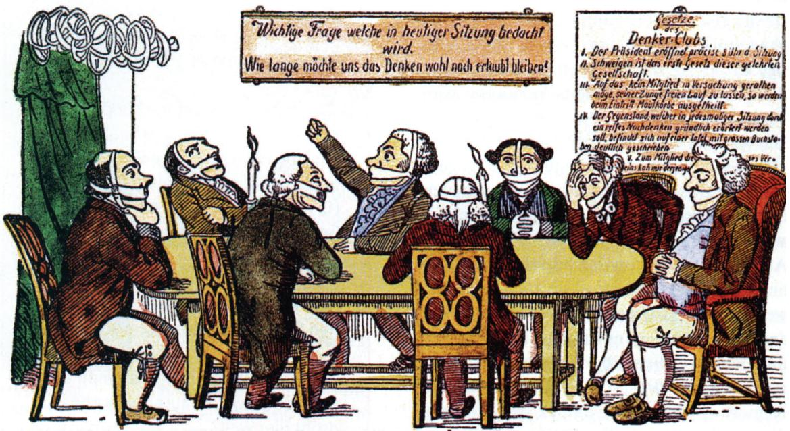  
Fig. 6 — The Club of Thinkers, anonymous caricature dating to c. 1820.

The plaque on the left bears the inscription: ‘The most important question of today’s meeting: How long will thinking be allowed to us?’

The board on the right lists the rules of the Club which include the following:

‘1. Silence is the first commandment of this learned society.   
2. To avoid the eventuality whereby a member of this club may succumb to the temptation of speech, muzzles will be distributed to members upon entering.’

associated with the French Revolution. The memory of the French Revolution nonetheless continued to inspire liberals. One of the major issues taken up by the liberal-nationalists, who criticised the new conservative order, was freedom of the press.

### 2.4 The Revolutionaries

During the years following 1815, the fear of repression drove many liberal-nationalists underground. Secret societies sprang up in many European states to train revolutionaries and spread their ideas. To be revolutionary at this time meant a commitment to oppose monarchical forms that had been established after the Vienna Congress, and to fight for liberty and freedom. Most of these revolutionaries also saw the creation of nation-states as a necessary part of this struggle for freedom.

One such individual was the Italian revolutionary Giuseppe Mazzini. Born in Genoa in 1807, he became a member of the secret society of the Carbonari. As a young man of 24, he was sent into exile in 1831 for attempting a revolution in Liguria. He subsequently founded two more underground societies, first, Young Italy in Marseilles, and then, Young Europe in Berne, whose members were like-minded young men from Poland, France, Italy and the German states. Mazzini believed that God had intended nations to be the natural units of mankind. So Italy could not continue to be a patchwork of small states and kingdoms. It had to be forged into a single unified republic within a wider alliance of nations. This unification alone could be the basis of Italian liberty. Following his model, secret societies were set up in Germany, France, Switzerland and Poland. Mazzini’s relentless opposition to monarchy and his vision of democratic republics frightened the conservatives. Metternich described him as ‘the most dangerous enemy of our social order’.

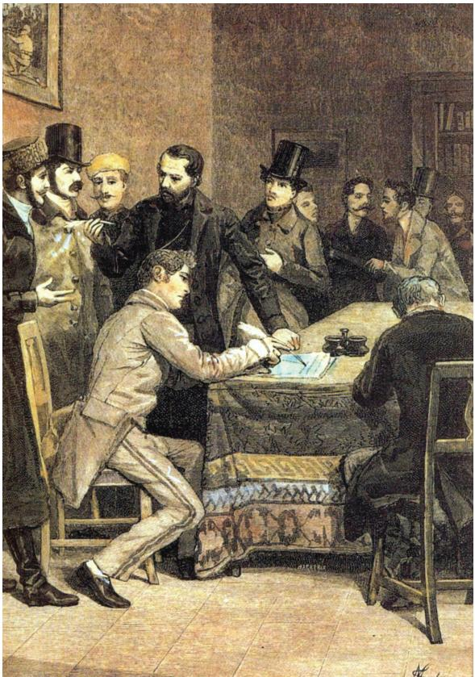  
Fig. 7 — Giuseppe Mazzini and the founding of Young Europe in Berne 1833. Print by Giacomo Mantegazza.

## 3 The Age of Revolutions: 1830-1848

As conservative regimes tried to consolidate their power, liberalism and nationalism came to be increasingly associated with revolution in many regions of Europe such as the Italian and German states, the provinces of the Ottoman Empire, Ireland and Poland. These revolutions were led by the liberal-nationalists belonging to the educated middle-class elite, among whom were professors, schoolteachers, clerks and members of the commercial middle classes.

The first upheaval took place in France in July 1830. The Bourbon kings who had been restored to power during the conservative reaction after 1815, were now overthrown by liberal revolutionaries who installed a constitutional monarchy with Louis Philippe at its head. ‘When France sneezes,’ Metternich once remarked, ‘the rest of Europe catches cold.’ The July Revolution sparked an uprising in Brussels which led to Belgium breaking away from the United Kingdom of the Netherlands.

An event that mobilised nationalist feelings among the educated elite across Europe was the Greek war of independence. Greece had been part of the Ottoman Empire since the fifteenth century. The growth of revolutionary nationalism in Europe sparked off a struggle for independence amongst the Greeks which began in 1821. Nationalists in Greece got support from other Greeks living in exile and also from many West Europeans who had sympathies for ancient Greek culture. Poets and artists lauded Greece as the cradle of European civilisation and mobilised public opinion to support its struggle against a Muslim empire. The English poet Lord Byron organised funds and later went to fight in the war, where he died of fever in 1824. Finally, the Treaty of Constantinople of 1832 recognised Greece as an independent nation.

### 3.1 The Romantic Imagination and National Feeling

The development of nationalism did not come about only through wars and territorial expansion. Culture played an important role in creating the idea of the nation: art and poetry, stories and music helped express and shape nationalist feelings.

Let us look at Romanticism, a cultural movement which sought to develop a particular form of nationalist sentiment. Romantic artists and poets generally criticised the glorification of reason and science

Fig. 8 — The Massacre at Chios, Eugene Delacroix, 1824.   
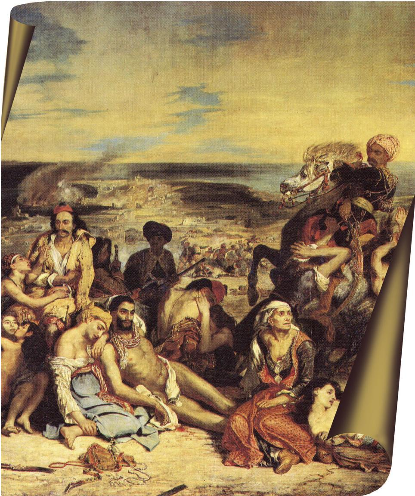  
The French painter Delacroix was one of the most important French Romantic painters. This huge painting (4.19m x 3.54m) depicts an incident in which 20,000 Greeks were said to have been killed by Turks on the island of Chios. By dramatising the incident, focusing on the suffering of women and children, and using vivid colours, Delacroix sought to appeal to the emotions of the spectators, and create sympathy for the Greeks.

and focused instead on emotions, intuition and mystical feelings. Their effort was to create a sense of a shared collective heritage, a common cultural past, as the basis of a nation.

Other Romantics such as the German philosopher Johann Gottfried Herder (1744-1803) claimed that true German culture was to be discovered among the common people – das volk. It was through folk songs, folk poetry and folk dances that the true spirit of the nation (volksgeist) was popularised. So collecting and recording these forms of folk culture was essential to the project of nation-building.

The emphasis on vernacular language and the collection of local folklore was not just to recover an ancient national spirit, but also to carry the modern nationalist message to large audiences who were mostly illiterate. This was especially so in the case of Poland, which had been partitioned at the end of the eighteenth century by the Great Powers – Russia, Prussia and Austria. Even though Poland no longer existed as an independent territory, national feelings were kept alive through music and language. Karol Kurpinski, for example, celebrated the national struggle through his operas and music, turning folk dances like the polonaise and mazurka into nationalist symbols.

Language too played an important role in developing nationalist sentiments. After Russian occupation, the Polish language was forced out of schools and the Russian language was imposed everywhere. In 1831, an armed rebellion against Russian rule took place which was ultimately crushed. Following this, many members of the clergy in Poland began to use language as a weapon of national resistance. Polish was used for Church gatherings and all religious instruction. As a result, a large number of priests and bishops were put in jail or sent to Siberia by the Russian authorities as punishment for their refusal to preach in Russian. The use of Polish came to be seen as a symbol of the struggle against Russian dominance.

### 3.2 Hunger, Hardship and Popular Revolt

The 1830s were years of great economic hardship in Europe. The first half of the nineteenth century saw an enormous increase in population all over Europe. In most countries there were more seekers of jobs than employment. Population from rural areas migrated to the cities to live in overcrowded slums. Small producers in towns were often faced with stiff competition from imports of cheap machine-made goods from England, where industrialisation was more advanced than on the continent. This was especially so in textile production, which was carried out mainly in homes or small workshops and was only partly mechanised. In those regions of Europe where the aristocracy still enjoyed power, peasants struggled under the burden of feudal dues and obligations. The rise of food prices or a year of bad harvest led to widespread pauperism in town and country.

The year 1848 was one such year. Food shortages and widespread unemployment brought the population of Paris out on the roads. Barricades were erected and Louis Philippe was forced to flee. A

## Box 1

## The Grimm Brothers: Folktales and Nation-building

Grimms'Fairy Tales is a familiar name. The brothers Jacob and Wilhelm Grimm were born in the German city of Hanau in 1785 and 1786 respectively. While both of them studied law, they soon developed an interest in collecting old folktales. They spent six years travelling from village to village, talking to people and writing down fairy tales, which were handed down through the generations. These were popular both among children and adults. In 1812, they published their first collection of tales. Subsequently, both the brothers became active in liberal politics, especially the movement for freedom of the press. In the meantime they also published a 33-volume dictionary of the German language.

The Grimm brothers also saw French domination as a threat to German culture, and believed that the folktales they had collected were expressions of a pure and authentic German spirit. They considered their projects of collecting folktales and developing the German language as part of the wider effort to oppose French domination and create a German national identity.

## Discuss

Discuss the importance of language and popular traditions in the creation of national identity.

  
Fig. 9 — Peasants’ uprising, 1848.

National Assembly proclaimed a Republic, granted suffrage to all adult males above 21, and guaranteed the right to work. National workshops to provide employment were set up.

Earlier, in 1845, weavers in Silesia had led a revolt against contractors who supplied them raw material and gave them orders for finished textiles but drastically reduced their payments. The journalist Wilhelm Wolff described the events in a Silesian village as follows:

In these villages (with 18,000 inhabitants) cotton weaving is the most widespread occupation … The misery of the workers is extreme. The desperate need for jobs has been taken advantage of by the contractors to reduce the prices of the goods they order …

On 4 June at 2 p.m. a large crowd of weavers emerged from their homes and marched in pairs up to the mansion of their contractor demanding higher wages. They were treated with scorn and threats alternately. Following this, a group of them forced their way into the house, smashed its elegant windowpanes, furniture, porcelain … another group broke into the storehouse and plundered it of supplies of cloth which they tore to shreds … The contractor fled with his family to a neighbouring village which, however, refused to shelter such a person. He returned 24 hours later having requisitioned the army. In the exchange that followed, eleven weavers were shot.

## Discuss

Describe the cause of the Silesian weavers’ uprising. Comment on the viewpoint of the journalist.

### Activity

Imagine you are a weaver who saw the events as they unfolded. Write a report on what you saw.

### 3.3 1848: The Revolution of the Liberals

Parallel to the revolts of the poor, unemployed and starving peasants and workers in many European countries in the year 1848, a revolution led by the educated middle classes was under way. Events of February 1848 in France had brought about the abdication of the monarch and a republic based on universal male suffrage had been proclaimed. In other parts of Europe where independent nation-states did not yet exist – such as Germany, Italy, Poland, the Austro-Hungarian Empire – men and women of the liberal middle classes combined their demands for constitutionalism with national unification. They took advantage of the growing popular unrest to push their demands for the creation of a nation-state on parliamentary principles – a constitution, freedom of the press and freedom of association.

In the German regions a large number of political associations whose members were middle-class professionals, businessmen and prosperous artisans came together in the city of Frankfurt and decided to vote for an all-German National Assembly. On 18 May 1848, 831 elected representatives marched in a festive procession to take their places in the Frankfurt parliament convened in the Church of St Paul. They drafted a constitution for a German nation to be headed by a monarchy subject to a parliament. When the deputies offered the crown on these terms to Friedrich Wilhelm IV, King of Prussia, he rejected it and joined other monarchs to oppose the elected assembly. While the opposition of the aristocracy and military became stronger, the social basis of parliament eroded. The parliament was dominated by the middle classes who resisted the demands of workers and artisans and consequently lost their support. In the end troops were called in and the assembly was forced to disband.

The issue of extending political rights to women was a controversial one within the liberal movement, in which large numbers of women had participated actively over the years. Women had formed their own political associations, founded newspapers and taken part in political meetings and demonstrations. Despite this they were denied

## New words

Feminist – Awareness of women’s rights and interests based on the belief of the social, economic and political equality of the genders

## Source C

## How were liberty and equality for women to be defined?

The liberal politician Carl Welcker, an elected member of the Frankfurt Parliament, expressed the following views:

‘Nature has created men and women to carry out different functions … Man, the stronger, the bolder and freer of the two, has been designated as protector of the family, its provider, meant for public tasks in the domain of law, production, defence. Woman, the weaker, dependent and timid, requires the protection of man. Her sphere is the home, the care of the children, the nurturing of the family … Do we require any further proof that given such differences, equality between the sexes would only endanger harmony and destroy the dignity of the family?’

Louise Otto-Peters (1819-95) was a political activist who founded a women’s journal and subsequently a feminist political association. The first issue of her newspaper (21 April 1849) carried the following editorial:

‘Let us ask how many men, possessed by thoughts of living and dying for the sake of Liberty, would be prepared to fight for the freedom of the entire people, of all human beings? When asked this question, they would all too easily respond with a “Yes!”, though their untiring efforts are intended for the benefit of only one half of humanity – men. But Liberty is indivisible! Free men therefore must not tolerate to be surrounded by the unfree

An anonymous reader of the same newspaper sent the following letter to the editor on 25 June 1850:

‘It is indeed ridiculous and unreasonable to deny women political rights even though they enjoy the right to property which they make use of. They perform functions and assume responsibilities without however getting the benefits that accrue to men for the same … Why this injustice? Is it not a disgrace that even the stupidest cattle-herder possesses the right to vote, simply because he is a man, whereas highly talented women owning considerable property are excluded from this right, even though they contribute so much to the maintenance of the state?’ Source

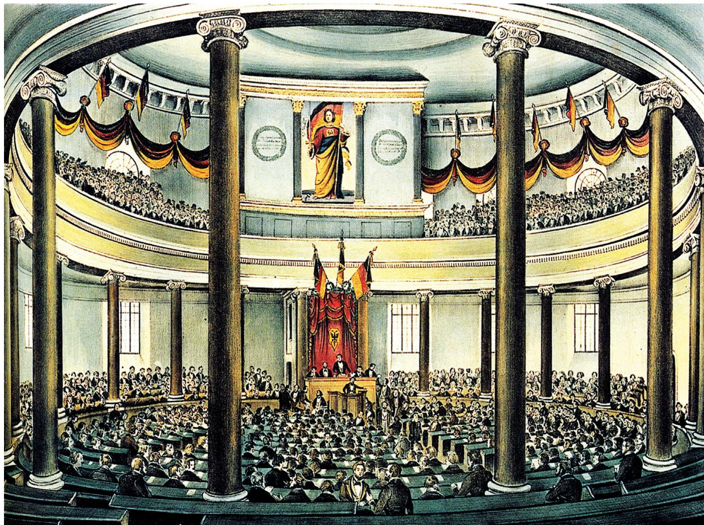  
Fig. 10 — The Frankfurt parliament in the Church of St Paul. Contemporary colour print. Notice the women in the upper left gallery.

suffrage rights during the election of the Assembly. When the Frankfurt parliament convened in the Church of St Paul, women were admitted only as observers to stand in the visitors’ gallery.

Though conservative forces were able to suppress liberal movements in 1848, they could not restore the old order. Monarchs were beginning to realise that the cycles of revolution and repression could only be ended by granting concessions to the liberal-nationalist revolutionaries. Hence, in the years after 1848, the autocratic monarchies of Central and Eastern Europe began to introduce the changes that had already taken place in Western Europe before 1815. Thus serfdom and bonded labour were abolished both in the Habsburg dominions and in Russia. The Habsburg rulers granted more autonomy to the Hungarians in 1867.

## Discuss

Compare the positions on the question of women’s rights voiced by the three writers cited above. What do they reveal about liberal ideology?

## New words

Ideology – System of ideas reflecting a particular social and political vision

## 4 The Making of Germany and Italy

### 4.1 Germany – Can the Army be the Architect of a Nation?

After 1848, nationalism in Europe moved away from its association with democracy and revolution. Nationalist sentiments were often mobilised by conservatives for promoting state power and achieving political domination over Europe.

This can be observed in the process by which Germany and Italy came to be unified as nation-states. As you have seen, nationalist feelings were widespread among middle-class Germans, who in 1848 tried to unite the different regions of the German confederation into a nation-state governed by an elected parliament. This liberal initiative to nation-building was, however, repressed by the combined forces of the monarchy and the military, supported by the large landowners (called Junkers) of Prussia.

From then on, Prussia took on the leadership of the movement for national unification. Its chief minister, Otto von Bismarck, was the architect of this process carried out with the help of the Prussian army and bureaucracy. Three wars over seven years – with Austria, Denmark and France – ended in Prussian victory and completed the process of unification. In January 1871, the Prussian king, William I, was proclaimed German Emperor in aceremony held at Versailles.

On the bitterly cold morning of 18 January 1871, an assembly comprising the princes of the German states, representatives of the army, important Prussian ministers including the chief minister Otto von Bismarck gathered in the unheated Hall of Mirrors in the Palace of Versailles to proclaim the new German Empire headed by Kaiser William I of Prussia.

The nation-building process in Germany had demonstrated the dominance of Prussian state power. The new state placed a strong emphasis on modernising the currency, banking, legal and judicial systems in Germany. Prussian measures and practices often became a model for the rest of Germany.

  
Fig. 11 — The proclamation of the German empire in the Hall of Mirrors at Versailles, Anton von Werner. At the centre stands the Kaiser and the chief commander of the Prussian army, General von Roon. Near them is Bismarck. This monumental work (2.7m x 2.7m) was completed and presented by the artist to Bismarck on the latter’s 70th birthday in 1885.

  
Fig. 12 — Unification of Germany (1866-71).

### 4.2 Italy Unified

Like Germany, Italy too had a long history of political fragmentation. Italians were scattered over several dynastic states as well as the multi-national Habsburg Empire. During the middle of the nineteenth century, Italy was divided into seven states, of which only one, Sardinia-Piedmont, was ruled by an Italian princely house. The north was under Austrian Habsburgs, the centre was ruled by the Pope and the southern regions were under the domination of the Bourbon kings of Spain. Even the Italian language had not acquired one common form and still had many regional and local variations.

During the 1830s, Giuseppe Mazzini had sought to put together a coherent programme for a unitary Italian Republic. He had also formed a secret society called Young Italy for the dissemination of his goals. The failure of revolutionary uprisings both in 1831 and 1848 meant that the mantle now fell on Sardinia-Piedmont under its ruler King Victor Emmanuel II to unify the Italian states through war. In the eyes of the ruling elites of this region, a unified Italy offered them the possibility of economic development and political dominance.

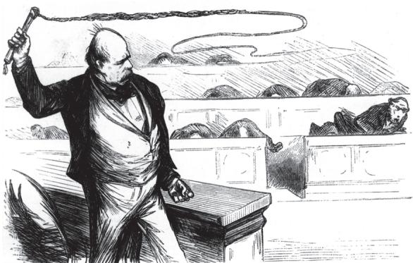  
Fig. 13 — Caricature of Otto von Bismarck in the German reichstag (parliament), from Figaro, Vienna, 5 March 1870.

### Activity

Describe the caricature. How does it represent the relationship between Bismarck and the elected deputies of Parliament? What interpretation of democratic processes is the artist trying to convey?

Chief Minister Cavour who led the movement to unify the regions of Italy was neither a revolutionary nor a democrat. Like many other wealthy and educated members of the Italian elite, he spoke French much better than he did Italian. Through a tactful diplomatic alliance with France engineered by Cavour, Sardinia-Piedmont succeeded in defeating the Austrian forces in 1859. Apart from regular troops, a large number of armed volunteers under the leadership of Giuseppe Garibaldi joined the fray. In 1860, they marched into South Italy and the Kingdom of the Two Sicilies and succeeded in winning the support of the local peasants in order to drive out the Spanish rulers. In 1861 Victor Emmanuel II was proclaimed king of united Italy. However, much of the Italian population, among whom rates of illiteracy were very high, remained blissfully unaware of liberalnationalist ideology. The peasant masses who had supported Garibaldi in southern Italy had never heard of Italia, and believed that ‘La Talia’ was Victor Emmanuel’s wife!

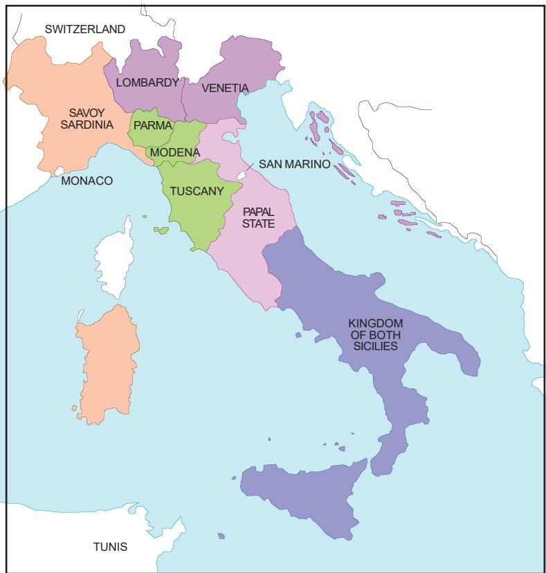  
Fig. 14(a) — Italian states before unification, 1858.

### 4.3 The Strange Case of Britain

The model of the nation or the nation-state, some scholars have argued, is Great Britain. In Britain the formation of the nation-state

### Activity

Look at Fig. 14(a). Do you think that the people living in any of these regions thought of themselves as Italians?

Examine Fig. 14(b). Which was the first region to become a part of unified Italy? Which was the last region to join? In which year did the largest number of states join?

Fig. 14(b) — Italy after unification.   
  
The map shows the year in which different regions (seen in Fig 14(a) become part of a unified Italy.

was not the result of a sudden upheaval or revolution. It was the result of a long-drawn-out process. There was no British nation prior to the eighteenth century. The primary identities of the people who inhabited the British Isles were ethnic ones – such as English, Welsh, Scot or Irish. All of these ethnic groups had their own cultural and political traditions. But as the English nation steadily grew in wealth, importance and power, it was able to extend its influence over the other nations of the islands. The English parliament, which had seized power from the monarchy in 1688 at the end of a protracted conflict, was the instrument through which a nation-state, with England at its centre, came to be forged. The Act of Union (1707) between England and Scotland that resulted in the formation of the ‘United Kingdom of Great Britain’ meant, in effect, that England was able to impose its influence on Scotland. The British parliament was henceforth dominated by its English members. The growth of a British identity meant that Scotland’s distinctive culture and political institutions were systematically suppressed. The Catholic clans that inhabited the Scottish Highlands suffered terrible repression whenever they attempted to assert their independence. The Scottish Highlanders were forbidden to speak their Gaelic language or wear their national dress, and large numbers were forcibly driven out of their homeland.

Ireland suffered a similar fate. It was a country deeply divided between Catholics and Protestants. The English helped the Protestants of Ireland to establish their dominance over a largely Catholic country. Catholic revolts against British dominance were suppressed. After a failed revolt led by Wolfe Tone and his United Irishmen (1798), Ireland was forcibly incorporated into the United Kingdom in 1801. A new ‘British nation’ was forged through the propagation of a dominant English culture. The symbols of the new Britain – the British flag (Union Jack), the national anthem (God Save Our Noble King), the English language – were actively promoted and the older nations survived only as subordinate partners in this union.

### Activity

The artist has portrayed Garibaldi as holding on to the base of the boot, so that the King of Sardinia-Piedmont can enter it from the top. Look at the map of Italy once more. What statement is this caricature making?

## Box 2

Giuseppe Garibaldi (1807-82) is perhaps the most celebrated of Italian freedom fighters. He came from a family engaged in coastal trade and was a sailor in the merchant navy. In 1833 he met Mazzini, joined the Young Italy movement and participated in a republican uprising in Piedmont in 1834. The uprising was suppressed and Garibaldi had to flee to South America, where he lived in exile till 1848. In 1854, he supported Victor Emmanuel II in his efforts to unify the Italian states. In 1860, Garibaldi led the famous Expedition of the Thousand to South Italy. Fresh volunteers kept joining through the course of the campaign, till their numbers grew to about 30,000. They were popularly known as Red Shirts.

In 1867, Garibaldi led an army of volunteers to Rome to fight the last obstacle to the unification of Italy, the Papal States where a French garrison was stationed. The Red Shirts proved to be no match for the combined French and Papal troops. It was only in 1870 when, during the war with Prussia, France withdrew its troops from Rome that the Papal States were finally joined to Italy.

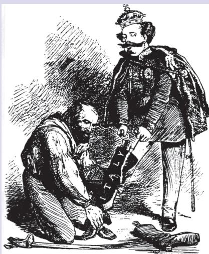  
Fig. 15 – Garibaldi helping King Victor Emmanuel II of Sardinia-Piedmont to pull on the boot named ‘Italy’. English caricature of 1859.

## New words

Ethnic – Relates to a common racial, tribal, or cultural origin or background that a community identifies with or claims

## 5 Visualising the Nation

While it is easy enough to represent a ruler through a portrait or a statue, how does one go about giving a face to a nation? Artists in the eighteenth and nineteenth centuries found a way out by personifying a nation. In other words they represented a country as if it were a person. Nations were then portrayed as female figures. The female form that was chosen to personify the nation did not stand for any particular woman in real life; rather it sought to give the abstract idea of the nation a concrete form. That is, the female figure became an allegory of the nation.

You will recall that during the French Revolution artists used the female allegory to portray ideas such as Liberty, Justice and the Republic. These ideals were represented through specific objects or symbols. As you would remember, the attributes of Liberty are the red cap, or the broken chain, while Justice is generally a blindfolded woman carrying a pair of weighing scales.

Similar female allegories were invented by artists in the nineteenth century to represent the nation. In France she was christened Marianne, a popular Christian name, which underlined the idea of a people’s nation. Her characteristics were drawn from those of Liberty and the Republic – the red cap, the tricolour, the cockade. Statues of Marianne were erected in public squares to remind the public of the national symbol of unity and to persuade them to identify with it. Marianne images were marked on coins and stamps.

Similarly, Germania became the allegory of the German nation. In visual representations, Germania wears a crown of oak leaves, as the German oak stands for heroism.

## New words

Allegory – When an abstract idea (for instance, greed, envy, freedom, liberty) is expressed through a person or a thing. An allegorical story has two meanings, one literal and one symbolic

  
Fig. 16 — Postage stamps of 1850 with the figure of Marianne representing the Republic of France.

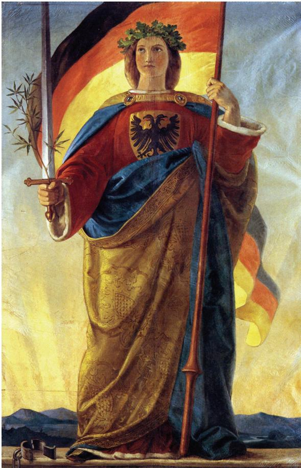  
Fig. 17 — Germania, Philip Veit, 1848. The artist prepared this painting of Germania on a cotton banner, as it was meant to hang from the ceiling of the Church of St Paul where the Frankfurt parliament was convened in March 1848.

## Meanings of the symbols

<table><tr><td>Attribute</td><td>Significance</td></tr><tr><td>Broken chains</td><td>Being freed</td></tr><tr><td>Breastplate with eagle</td><td>Symbol of the German empire – strength</td></tr><tr><td>Crown of oak leaves</td><td>Heroism</td></tr><tr><td>Sword</td><td>Readiness to fight</td></tr><tr><td>Olive branch around the sword</td><td>Willingness to make peace</td></tr><tr><td>Black, red and gold tricolour</td><td>Flag of the liberal-nationalists in 1848, banned by the Dukes of the German states</td></tr><tr><td>Rays of the rising sun</td><td>Beginning of a new era</td></tr></table>

### Activity

With the help of the chart in Box 3, identify the attributes of Veit’s Germania and interpret the symbolic meaning of the painting. In an earlier allegorical rendering of 1836, Veit had portrayed the Kaiser’s crown at the place where he has now located the broken chain. Explain the significance of this change.

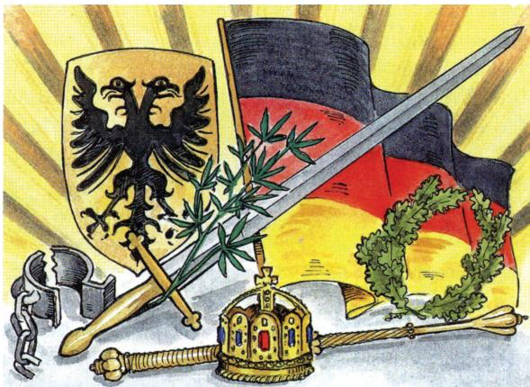

  
Fig. 18 — The fallen Germania, Julius Hübner, 1850.

### Activity

Describe what you see in Fig. 17. What historical events could Hübner be referring to in this allegorical vision of the nation?

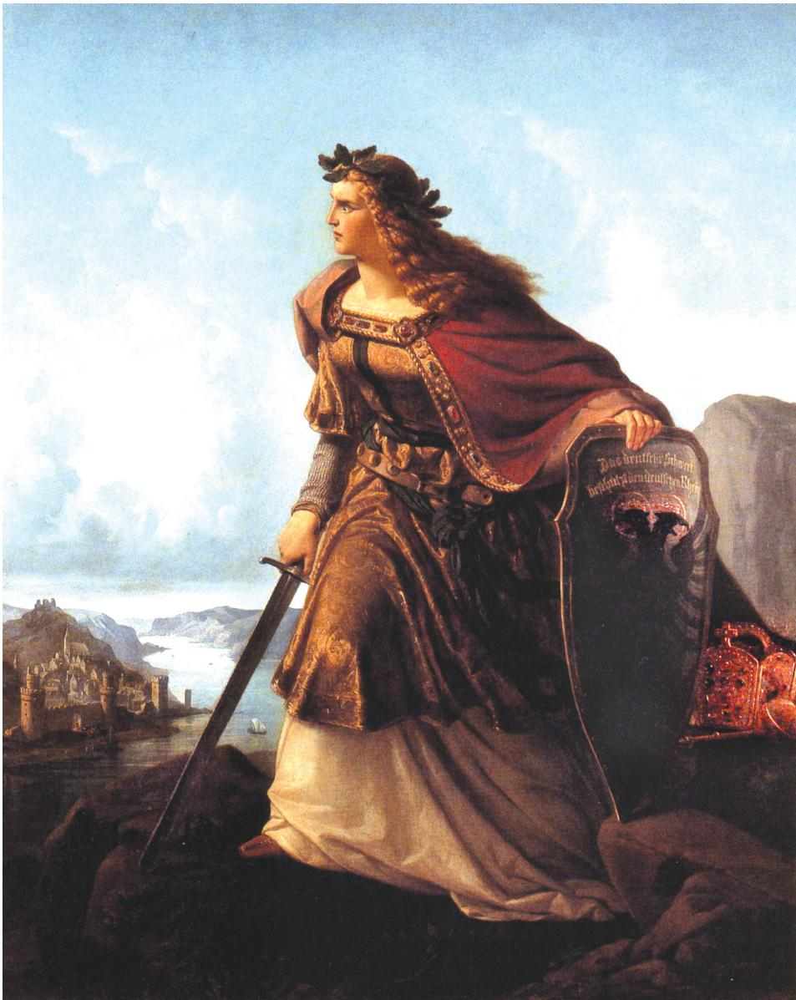  
Fig. 19 — Germania guarding the Rhine. In 1860, the artist Lorenz Clasen was commissioned to paint this image. The inscription on Germania’s sword reads: ‘The German sword protects the German Rhine.’

### Activity

Look once more at Fig. 10. Imagine you were a citizen of Frankfurt in March 1848 and were present during the proceedings of the parliament. How would you (a) as a man seated in the hall of deputies, and (b) as a woman observing from the galleries, relate to the banner of Germania hanging from the ceiling?

## 6 Nationalism and Imperialism

By the last quarter of the nineteenth century nationalism no longer retained its idealistic liberal-democratic sentiment of the first half of the century, but became a narrow creed with limited ends. During this period nationalist groups became increasingly intolerant of each other and ever ready to go to war. The major European powers, in turn, manipulated the nationalist aspirations of the subject peoples in Europe to further their own imperialist aims.

The most serious source of nationalist tension in Europe after 1871 was the area called the Balkans. The Balkans was a region of geographical and ethnic variation comprising modern-day Romania, Bulgaria, Albania, Greece, Macedonia, Croatia, Bosnia-Herzegovina, Slovenia, Serbia and Montenegro whose inhabitants were broadly known as the Slavs. A large part of the Balkans was under the control of the Ottoman Empire. The spread of the ideas of romantic nationalism in the Balkans together with the disintegration of the Ottoman Empire made this region very explosive. All through the nineteenth century the Ottoman Empire had sought to strengthen itself through modernisation and internal reforms but with very little success. One by one, its European subject nationalities broke away from its control and declared independence. The Balkan peoples based their claims for independence or political rights on nationality and used history to prove that they had once been independent but had subsequently been subjugated by foreign powers. Hence the rebellious nationalities in the Balkans thought of their struggles as attempts to win back their long-lost independence.

As the different Slavic nationalities struggled to define their identity and independence, the Balkan area became an area of intense conflict. The Balkan states were fiercely jealous of each other and each hoped to gain more territory at the expense of the others. Matters were further complicated because the Balkans also became the scene of big power rivalry. During this period, there was intense rivalry among the European powers over trade and colonies as well as naval and military might. These rivalries were very evident in the way the Balkan problem unfolded. Each power – Russia, Germany, England, Austro-Hungary – was keen on countering the hold of other powers over the Balkans, and extending its own control over the area. This led to a series of wars in the region and finally the First World War.

Fig. 20 — A map celebrating the British Empire.   
  
At the top, angels are shown carrying the banner of freedom. In the foreground, Britannia — the symbol of the British nation — is triumphantly sitting over the globe. The colonies are represented through images of tigers, elephants, forests and primitive people. The domination of the world is shown as the basis of Britain’s national pride.

Nationalism, aligned with imperialism, led Europe to disaster in 1914. But meanwhile, many countries in the world which had been colonised by the European powers in the nineteenth century began to oppose imperial domination. The anti-imperial movements that developed everywhere were nationalist, in the sense that they all struggled to form independent nation-states, and were inspired by a sense of collective national unity, forged in confrontation with imperialism. European ideas of nationalism were nowhere replicated, for people everywhere developed their own specific variety of nationalism. But the idea that societies should be organised into ‘nation-states’ came to be accepted as natural and universal.

## Write in brief

1. Write a note on:

a) Guiseppe Mazzini   
b) Count Camillo de Cavour   
c) The Greek war of independence   
d) Frankfurt parliament   
e) The role of women in nationalist struggles

2. What steps did the French revolutionaries take to create a sense of collective identity among the French people?   
3. Who were Marianne and Germania? What was the importance of the way in which they were portrayed?   
4. Briefly trace the process of German unification.   
5. What changes did Napoleon introduce to make the administrative system more efficient in the territories ruled by him?

## Discuss

1. Explain what is meant by the 1848 revolution of the liberals. What were the political, social and economic ideas supported by the liberals?   
2. Choose three examples to show the contribution of culture to the growth of nationalism in Europe.   
3. Through a focus on any two countries, explain how nations developed over the nineteenth century.   
4. How was the history of nationalism in Britain unlike the rest of Europe?   
5. Why did nationalist tensions emerge in the Balkans?

## Project

Find out more about nationalist symbols in countries outside Europe. For one or two countries, collect examples of pictures, posters or music that are symbols of nationalism. How are these different from European examples?

# chapter 2
# Nationalism in India

As you have seen, modern nationalism in Europe came to be associated with the formation of nation-states. It also meant a change in people’s understanding of who they were, and what defined their identity and sense of belonging. New symbols and icons, new songs and ideas forged new links and redefined the boundaries of communities. In most countries the making of this new national identity was a long process. How did this consciousness emerge in India?

In India and as in many other colonies, the growth of modern nationalism is intimately connected to the anti-colonial movement. People began discovering their unity in the process of their struggle with colonialism. The sense of being oppressed under colonialism provided a shared bond that tied many different groups together. But each class and group felt the effects of colonialism differently, their experiences were varied, and their notions of freedom were not always the same. The Congress under Mahatma Gandhi tried to forge these groups together within one movement. But the unity did not emerge without conflict.

In an earlier textbook you have read about the growth of nationalism in India up to the first decade of the twentieth century. In this chapter we will pick up the story from the 1920s and study the Non-Cooperation and Civil Disobedience Movements. We will explore how the Congress sought to develop the national movement, how different social groups participated in the movement, and how nationalism captured the imagination of people.

1066CH02

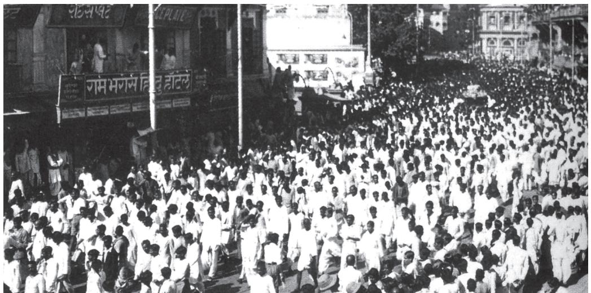  
Fig. 1 – 6 April 1919. Mass processions on the streets became a common feature during the national movement.

## 1 The First World War, Khilafat and Non-Cooperation

In the years after 1919, we see the national movement spreading to new areas, incorporating new social groups, and developing new modes of struggle. How do we understand these developments? What implications did they have?

First of all, the war created a new economic and political situation. It led to a huge increase in defence expenditure which was financed by war loans and increasing taxes: customs duties were raised and income tax introduced. Through the war years prices increased – doubling between 1913 and 1918 – leading to extreme hardship for the common people. Villages were called upon to supply soldiers, and the forced recruitment in rural areas caused widespread anger. Then in 1918-19 and 1920-21, crops failed in many parts of India, resulting in acute shortages of food. This was accompanied by an influenza epidemic. According to the census of 1921, 12 to 13 million people perished as a result of famines and the epidemic.

People hoped that their hardships would end after the war was over. But that did not happen.

At this stage a new leader appeared and suggested a new mode of struggle.

### 1.1 The Idea of Satyagraha

Mahatma Gandhi returned to India in January 1915. As you know, he had come from South Africa where he had successfully fought

  
Fig. 2 – Indian workers in South Africa march through Volksrust, 6 November 1913.

## New words

Forced recruitment – A process by which the colonial state forced people to join the army

Mahatma Gandhi was leading the workers from Newcastle to Transvaal. When the marchers were stopped and Gandhiji arrested, thousands of more workers joined the satyagraha against racist laws that denied rights to non-whites.

the racist regime with a novel method of mass agitation, which he called satyagraha. The idea of satyagraha emphasised the power of truth and the need to search for truth. It suggested that if the cause was true, if the struggle was against injustice, then physical force was not necessary to fight the oppressor. Without seeking vengeance or being aggressive, a satyagrahi could win the battle through nonviolence. This could be done by appealing to the conscience of the oppressor. People – including the oppressors – had to be persuaded to see the truth, instead of being forced to accept truth through the use of violence. By this struggle, truth was bound to ultimately triumph. Mahatma Gandhi believed that this dharma of non-violence could unite all Indians.

After arriving in India, Mahatma Gandhi successfully organised satyagraha movements in various places. In 1917 he travelled to Champaran in Bihar to inspire the peasants to struggle against the oppressive plantation system. Then in 1917, he organised a satyagraha to support the peasants of the Kheda district of Gujarat. Affected by crop failure and a plague epidemic, the peasants of Kheda could not pay the revenue, and were demanding that revenue collection be relaxed. In 1918, Mahatma Gandhi went to Ahmedabad to organise a satyagraha movement amongst cotton mill workers.

### 1.2 The Rowlatt Act

Emboldened with this success, Gandhiji in 1919 decided to launch a nationwide satyagraha against the proposed Rowlatt Act (1919). This Act had been hurriedly passed through the Imperial Legislative Council despite the united opposition of the Indian members. It gave the government enormous powers to repress political activities, and allowed detention of political prisoners without trial for two years. Mahatma Gandhi wanted non-violent civil disobedience against such unjust laws, which would start with a hartal on 6 April.

Rallies were organised in various cities, workers went on strike in railway workshops, and shops closed down. Alarmed by the popular upsurge, and scared that lines of communication such as the railways and telegraph would be disrupted, the British administration decided to clamp down on nationalists. Local leaders were picked up from Amritsar, and Mahatma Gandhi was barred from entering Delhi. On 10 April, the police in Amritsar fired upon a peaceful procession, provoking widespread attacks on banks, post offices and railway stations. Martial law was imposed and General Dyer took command.

## Source A

## Mahatma Gandhi on Satyagraha

‘It is said of “passive resistance” that it is the weapon of the weak, but the power which is the subject of this article can be used only by the strong. This power is not passive resistance; indeed it calls for intense activity. The movement in South Africa was not passive but active

' Satyagraha is not physical force. A satyagrahi does not inflict pain on the adversary; he does not seek his destruction … In the use of satyagraha, there is no ill-will whatever.   
' Satyagraha is pure soul-force. Truth is the very substance of the soul. That is why this force is called satyagraha. The soul is informed with knowledge. In it burns the flame of love. … Nonviolence is the supreme dharma …   
‘It is certain that India cannot rival Britain or Europe in force of arms. The British worship the war-god and they can all of them become, as they are becoming, bearers of arms. The hundreds of millions in India can never carry arms. They have made the religion of non-violence their own ...’

Source

### Activity

Read the text carefully. What did Mahatma Gandhi mean when he said satyagraha is active resistance?

On 13 April the infamous Jallianwalla Bagh incident took place. On that day a large crowd gathered in the enclosed ground of Jallianwalla Bagh. Some came to protest against the government’s new repressive measures. Others had come to attend the annual Baisakhi fair. Being from outside the city, many villagers were unaware of the martial law that had been imposed. Dyer entered the area, blocked the exit points, and opened fire on the crowd, killing hundreds. His object, as he declared later, was to ‘produce a moral effect’, to create in the minds of satyagrahis a feeling of terror and awe.

As the news of Jallianwalla Bagh spread, crowds took to the streets in many north Indian towns. There were strikes, clashes with the police and attacks on government buildings. The government responded with brutal repression, seeking to humiliate and terrorise people: satyagrahis were forced to rub their noses on the ground, crawl on the streets, and do salaam (salute) to all sahibs; people were flogged and villages (around Gujranwala in Punjab, now in Pakistan) were bombed. Seeing violence spread, Mahatma Gandhi called off the movement.

While the Rowlatt satyagraha had been a widespread movement, it was still limited mostly to cities and towns. Mahatma Gandhi now felt the need to launch a more broad-based movement in India. But he was certain that no such movement could be organised without bringing the Hindus and Muslims closer together. One way of doing this, he felt, was to take up the Khilafat issue. The First World War had ended with the defeat of Ottoman Turkey. And there were rumours that a harsh peace treaty was going to be imposed on the Ottoman emperor – the spiritual head of the Islamic world (the Khalifa). To defend the Khalifa’s temporal powers, a Khilafat Committee was formed in Bombay in March 1919. A young generation of Muslim leaders like the brothers Muhammad Ali and Shaukat Ali, began discussing with Mahatma Gandhi about the possibility of a united mass action on the issue. Gandhiji saw this as an opportunity to bring Muslims under the umbrella of a unified national movement. At the Calcutta session of the Congress in September 1920, he convinced other leaders of the need to start a non-cooperation movement in support of Khilafat as well as for swaraj.

### 1.3 Why Non-cooperation?

In his famous book Hind Swaraj (1909) Mahatma Gandhi declared that British rule was established in India with the cooperation of

  
Fig. 3 – General Dyer’s ‘crawling orders’ being administered by British soldiers, Amritsar, Punjab, 1919.

Indians, and had survived only because of this cooperation. If Indians refused to cooperate, British rule in India would collapse within a year, and swaraj would come.

How could non-cooperation become a movement? Gandhiji proposed that the movement should unfold in stages. It should begin with the surrender of titles that the government awarded, and a boycott of civil services, army, police, courts and legislative councils, schools, and foreign goods. Then, in case the government used repression, a full civil disobedience campaign would be launched. Through the summer of 1920 Mahatma Gandhi and Shaukat Ali toured extensively, mobilising popular support for the movement.

Many within the Congress were, however, concerned about the proposals. They were reluctant to boycott the council elections scheduled for November 1920, and they feared that the movement might lead to popular violence. In the months between September and December there was an intense tussle within the Congress. For a while there seemed no meeting point between the supporters and the opponents of the movement. Finally, at the Congress session at Nagpur in December 1920, a compromise was worked out and the Non-Cooperation programme was adopted.

How did the movement unfold? Who participated in it? How did different social groups conceive of the idea of Non-Cooperation?

## New words

Boycott – The refusal to deal and associate with people, or participate in activities, or buy and use things; usually a form of protest

  
Fig. 4 – The boycott of foreign cloth, July 1922.

Foreign cloth was seen as the symbol of Western economic and cultural domination.

## 2 Differing Strands within the Movement

The Non-Cooperation-Khilafat Movement began in January 1921. Various social groups participated in this movement, each with its own specific aspiration. All of them responded to the call of Swaraj, but the term meant different things to different people.

### 2.1 The Movement in the Towns

The movement started with middle-class participation in the cities. Thousands of students left government-controlled schools and colleges, headmasters and teachers resigned, and lawyers gave up their legal practices. The council elections were boycotted in most provinces except Madras, where the Justice Party, the party of the non-Brahmans, felt that entering the council was one way of gaining some power – something that usually only Brahmans had access to.

The effects of non-cooperation on the economic front were more dramatic. Foreign goods were boycotted, liquor shops picketed, and foreign cloth burnt in huge bonfires. The import of foreign cloth halved between 1921 and 1922, its value dropping from Rs 102 crore to Rs 57 crore. In many places merchants and traders refused to trade in foreign goods or finance foreign trade. As the boycott movement spread, and people began discarding imported clothes and wearing only Indian ones, production of Indian textile mills and handlooms went up.

But this movement in the cities gradually slowed down for a variety of reasons. Khadi cloth was often more expensive than massproduced mill cloth and poor people could not afford to buy it. How then could they boycott mill cloth for too long? Similarly the boycott of British institutions posed a problem. For the movement to be successful, alternative Indian institutions had to be set up so that they could be used in place of the British ones. These were slow to come up. So students and teachers began trickling back to government schools and lawyers joined back work in government courts.

### 2.2 Rebellion in the Countryside

From the cities, the Non-Cooperation Movement spread to the countryside. It drew into its fold the struggles of peasants and tribals

## New words

Picket – A form of demonstration or protest by which people block the entrance to a shop, factory or office

### Activity

The year is 1921. You are a student in a government-controlled school. Design a poster urging school students to answer Gandhiji’s call to join the Non-Cooperation Movement.

which were developing in different parts of India in the years after the war.

In Awadh, peasants were led by Baba Ramchandra – a sanyasi who had earlier been to Fiji as an indentured labourer. The movement here was against talukdars and landlords who demanded from peasants exorbitantly high rents and a variety of other cesses. Peasants had to do begar and work at landlords’ farms without any payment. As tenants they had no security of tenure, being regularly evicted so that they could acquire no right over the leased land. The peasant movement demanded reduction of revenue, abolition of begar, and social boycott of oppressive landlords. In many places nai – dhobi bandhs were organised by panchayats to deprive landlords of the services of even barbers and washermen. In June 1920, Jawaharlal Nehru began going around the villages in Awadh, talking to the villagers, and trying to understand their grievances. By October, the Oudh Kisan Sabha was set up headed by Jawaharlal Nehru, Baba Ramchandra and a few others. Within a month, over 300 branches had been set up in the villages around the region. So when the Non-Cooperation Movement began the following year, the effort of the Congress was to integrate the Awadh peasant struggle into the wider struggle. The peasant movement, however, developed in forms that the Congress leadership was unhappy with. As the movement spread in 1921, the houses of talukdars and merchants were attacked, bazaars were looted, and grain hoards were taken over. In many places local leaders told peasants that Gandhiji had declared that no taxes were to be paid and land was to be redistributed among the poor. The name of the Mahatma was being invoked to sanction all action and aspirations.

## New words

Begar – Labour that villagers were forced to contribute without any payment

### Activity

If you were a peasant in Uttar Pradesh in 1920, how would you have responded to Gandhiji’s call for Swaraj? Give reasons for your response.

In 1928, Vallabhbhai Patel led the peasant movement in Bardoli, a taluka in Gujarat, against enhancement of land revenue. Known as the Bardoli Satyagraha, this movement was a success under the able leadership of Vallabhbhai Patel. The struggle was widely publicised and generated immense sympathy in many parts of India.

## Source B

On 6 January 1921, the police in United Provinces fired at peasants near Rae Bareli. Jawaharlal Nehru wanted to go to the place of firing, but was stopped by the police. Agitated and angry, Nehru addressed the peasants who gathered around him. This is how he later described the meeting:

‘They behaved as brave men, calm and unruffled in the face of danger. I do not know how they felt but I know what my feelings were. For a moment my blood was up, non-violence was almost forgotten – but for a moment only. The thought of the great leader, who by God’s goodness has been sent to lead us to victory, came to me, and I saw the kisans seated and standing near me,less excited, more peaceful than I was-and the moment of weakness passed,I spoke to them in all humility on non-violence – I needed the lesson more than they – and they heeded me and peacefully dispersed.’

Quoted in Sarvapalli Gopal, Jawaharlal Nehru: A Biography, Vol. I.

Tribal peasants interpreted the message of Mahatma Gandhi and the idea of swaraj in yet another way. In the Gudem Hills of Andhra Pradesh, for instance, a militant guerrilla movement spread in the early $1 9 2 0 \mathrm { s } -$ not a form of struggle that the Congress could approve. Here, as in other forest regions, the colonial government had closed large forest areas, preventing people from entering the forests to graze their cattle, or to collect fuelwood and fruits. This enraged the hill people. Not only were their livelihoods affected but they felt that their traditional rights were being denied. When the government began forcing them to contribute begar for road building, the hill people revolted. The person who came to lead them was an interesting figure. Alluri Sitaram Raju claimed that he had a variety of special powers: he could make correct astrological predictions and heal people, and he could survive even bullet shots. Captivated by Raju, the rebels proclaimed that he was an incarnation of God. Raju talked of the greatness of Mahatma Gandhi, said he was inspired by the Non-Cooperation Movement, and persuaded people to wear khadi and give up drinking. But at the same time he asserted that India could be liberated only by the use of force, not non-violence. The Gudem rebels attacked police stations, attempted to kill British officials and carried on guerrilla warfare for achieving swaraj. Raju was captured and executed in 1924, and over time became a folk hero.

### 2.3 Swaraj in the Plantations

Workers too had their own understanding of Mahatma Gandhi and the notion of swaraj. For plantation workers in Assam, freedom meant the right to move freely in and out of the confined space in which they were enclosed, and it meant retaining a link with the village from which they had come. Under the Inland Emigration Act of 1859, plantation workers were not permitted to leave the tea gardens without permission, and in fact they were rarely given such permission. When they heard of the Non-Cooperation Movement, thousands of workers defied the authorities, left the plantations and headed home. They believed that Gandhi Raj was coming and everyone would be given land in their own villages. They, however, never reached their destination. Stranded on the way by a railway and steamer strike, they were caught by the police and brutally beaten up.

### Activity

Find out about other participants in the National Movement who were captured and put to death by the British. Can you think of a similar example from the national movement in Indo-China (Chapter 2)?

The visions of these movements were not defined by the Congress programme. They interpreted the term swaraj in their own ways, imagining it to be a time when all suffering and all troubles would be over. Yet, when the tribals chanted Gandhiji’s name and raised slogans demanding ‘Swatantra Bharat’, they were also emotionally relating to an all-India agitation. When they acted in the name of Mahatma Gandhi, or linked their movement to that of the Congress, they were identifying with a movement which went beyond the limits of their immediate locality.

  
Fig. 5 – Chauri Chaura, 1922.

At Chauri Chaura in Gorakhpur, a peaceful demonstration in a bazaar turned into a violent clash with the police. Hearing of the incident, Mahatma Gandhi called a halt to the Non-Cooperation Movement.

## 3 Towards Civil Disobedience

In February 1922, Mahatma Gandhi decided to withdraw the Non-Cooperation Movement. He felt the movement was turning violent in many places and satyagrahis needed to be properly trained before they would be ready for mass struggles. Within the Congress, some leaders were by now tired of mass struggles and wanted to participate in elections to the provincial councils that had been set up by the Government of India Act of 1919. They felt that it was important to oppose British policies within the councils, argue for reform and also demonstrate that these councils were not truly democratic. C. R. Das and Motilal Nehru formed the Swaraj Party within the Congress to argue for a return to council politics. But younger leaders like Jawaharlal Nehru and Subhas Chandra Bose pressed for more radical mass agitation and for full independence.

In such a situation of internal debate and dissension two factors again shaped Indian politics towards the late 1920s. The first was the effect of the worldwide economic depression. Agricultural prices began to fall from 1926 and collapsed after 1930. As the demand for agricultural goods fell and exports declined, peasants found it difficult to sell their harvests and pay their revenue. By 1930, the countryside was in turmoil.

Against this background the new Tory government in Britain constituted a Statutory Commission under Sir John Simon. Set up

in response to the nationalist movement, the commission was to look into the functioning of the constitutional system in India and suggest changes. The problem was that the commission did not have a single Indian member. They were all British.

When the Simon Commission arrived in India in 1928, it was greeted with the slogan ‘Go back Simon’. All parties, including the Congress and the Muslim League, participated in the demonstrations. In an effort to win them over, the viceroy, Lord Irwin, announced in October 1929, a vague offer of ‘dominion status’ for India in an unspecified future, and a Round Table Conference to discuss a future constitution. This did not satisfy the Congress leaders. The radicals within the Congress, led by

Lala Lajpat Rai was assaulted by the British police during a peaceful demonstration against the Simon Commission. He succumbed to injuries that were inflicted on him during the demonstration.

  
Fig. 6 – Meeting of Congress leaders at Allahabad, 1931. Apart from Mahatma Gandhi, you can see Sardar Vallabhbhai Patel (extreme left), Jawaharlal Nehru (extreme right) and Subhas Chandra Bose (fifth from right).

Jawaharlal Nehru and Subhas Chandra Bose, became more assertive. The liberals and moderates, who were proposing a constitutional system within the framework of British dominion, gradually lost their influence. In December 1929, under the presidency of Jawaharlal Nehru, the Lahore Congress formalised the demand of ‘Purna Swaraj’ or full independence for India. It was declared that 26 January 1930, would be celebrated as the Independence Day when people were to take a pledge to struggle for complete independence. But the celebrations attracted very little attention. So Mahatma Gandhi had to find a way to relate this abstract idea of freedom to more concrete issues of everyday life.

### 3.1 The Salt March and the Civil Disobedience Movement

Mahatma Gandhi found in salt a powerful symbol that could unite the nation. On 31 January 1930, he sent a letter to Viceroy Irwin stating eleven demands. Some of these were of general interest; others were specific demands of different classes, from industrialists to peasants. The idea was to make the demands wide-ranging, so that all classes within Indian society could identify with them and everyone could be brought together in a united campaign. The most stirring of all was the demand to abolish the salt tax. Salt was something consumed by the rich and the poor alike, and it was one of the most essential items of food. The tax on salt and the government monopoly over its production, Mahatma Gandhi declared, revealed the most oppressive face of British rule.

Mahatma Gandhi’s letter was, in a way, an ultimatum. If the demands were not fulfilled by 11 March, the letter stated, the Congress would launch a civil disobedience campaign. Irwin was unwilling to negotiate. So Mahatma Gandhi started his famous salt march accompanied by 78 of his trusted volunteers. The march was over 240 miles, from Gandhiji’s ashram in Sabarmati to the Gujarati coastal town of Dandi. The volunteers walked for 24 days, about 10 miles a day. Thousands came to hear Mahatma Gandhi wherever he stopped, and he told them what he meant by swaraj and urged them to peacefully defy the British. On 6 April he reached Dandi, and ceremonially violated the law, manufacturing salt by boiling sea water.

This marked the beginning of the Civil Disobedience Movement. How was this movement different from the Non-Cooperation Movement? People were now asked not only to refuse cooperation

## Source C

## The Independence Day Pledge, 26 January 1930

‘We believe that it is the inalienable right of the Indian people, as of any other people, to have freedom and to enjoy the fruits of their toil and have the necessities of life, so that they may have full opportunities of growth. We believe also that if any government deprives a people of these rights and oppresses them, the people have a further right to alter it or to abolish it. The British Government in India has not only deprived the Indian people of their freedom but has based itself on the exploitation of the masses, and has ruined India economically, politically, culturally, and spiritually. We believe, therefore, that India must sever the British connection and attain Purna Swaraj or Complete Independence.’

Source

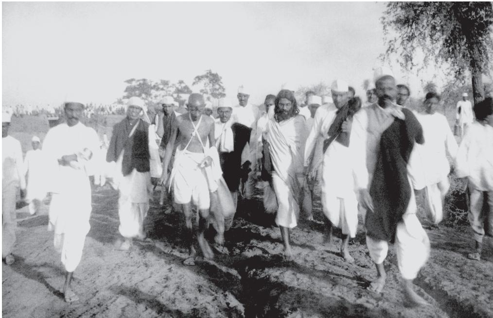  
Fig. 7 – The Dandi march. During the salt march Mahatma Gandhi was accompanied by 78 volunteers. On the way they were joined by thousands.

with the British, as they had done in 1921-22, but also to break colonial laws. Thousands in different parts of the country broke the salt law, manufactured salt and demonstrated in front of government salt factories. As the movement spread, foreign cloth was boycotted, and liquor shops were picketed. Peasants refused to pay revenue and chaukidari taxes, village officials resigned, and in many places forest people violated forest laws – going into Reserved Forests to collect wood and graze cattle.

Worried by the developments, the colonial government began arresting the Congress leaders one by one. This led to violent clashes in many palaces. When Abdul Ghaffar Khan, a devout disciple of Mahatma Gandhi, was arrested in April 1930, angry crowds demonstrated in the streets of Peshawar, facing armoured cars and police firing. Many were killed. A month later, when Mahatma Gandhi himself was arrested, industrial workers in Sholapur attacked police posts, municipal buildings, lawcourts and railway stations – all structures that symbolised British rule. A frightened government responded with a policy of brutal repression. Peaceful satyagrahis were attacked, women and children were beaten, and about 100,000 people were arrested.

In such a situation, Mahatma Gandhi once again decided to call off the movement and entered into a pact with Irwin on 5 March 1931. By this Gandhi-Irwin Pact, Gandhiji consented to participate in a Round Table Conference (the Congress had boycotted the first

  
Fig. 8 – Police cracked down on satyagrahis, 1930.

Round Table Conference) in London and the government agreed to release the political prisoners. In December 1931, Gandhiji went to London for the conference, but the negotiations broke down and he returned disappointed. Back in India, he discovered that the government had begun a new cycle of repression. Ghaffar Khan and Jawaharlal Nehru were both in jail, the Congress had been declared illegal, and a series of measures had been imposed to prevent meetings, demonstrations and boycotts. With great apprehension, Mahatma Gandhi relaunched the Civil Disobedience Movement. For over a year, the movement continued, but by 1934 it lost its momentum.

### 3.2 How Participants saw the Movement

Let us now look at the different social groups that participated in the Civil Disobedience Movement. Why did they join the movement? What were their ideals? What did swaraj mean to them?

In the countryside, rich peasant communities – like the Patidars of Gujarat and the Jats of Uttar Pradesh – were active in the movement. Being producers of commercial crops, they were very hard hit by the trade depression and falling prices. As their cash income disappeared, they found it impossible to pay the government’s revenue demand. And the refusal of the government to reduce the revenue demand led to widespread resentment. These rich peasants became enthusiastic supporters of the Civil Disobedience Movement, organising their communities, and at times forcing reluctant members, to participate in the boycott programmes. For them the fight for swaraj was a struggle against high revenues. But they were deeply disappointed when the movement was called off in 1931 without the revenue rates being revised. So when the movement was restarted in 1932, many of them refused to participate.

The poorer peasantry were not just interested in the lowering of the revenue demand. Many of them were small tenants cultivating land they had rented from landlords. As the Depression continued and cash incomes dwindled, the small tenants found it difficult to pay their rent. They wanted the unpaid rent to the landlord to be remitted. They joined a variety of radical movements, often led by Socialists and Communists. Apprehensive of raising issues that might upset the rich peasants and landlords, the Congress was unwilling to support ‘no rent’ campaigns in most places. So the relationship between the poor peasants and the Congress remained uncertain.

## Box 1

## ‘To the altar of this revolution we have brought our youth as incense’

Many nationalists thought that the struggle against the British could not be won through non-violence. In 1928, the Hindustan Socialist Republican Army (HSRA) was founded at a meeting in Ferozeshah Kotla ground in Delhi. Amongst its leaders were Bhagat Singh, Jatin Das and Ajoy Ghosh. In a series of dramatic actions in different parts of India, the HSRA targeted some of the symbols of British power. In April 1929, Bhagat Singh and Batukeswar Dutta threw a bomb in the Legislative Assembly. In the same year there was an attempt to blow up the train that Lord Irwin was travelling in. Bhagat Singh was 23 when he was tried and executed by the colonial government. During his trial, Bhagat Singh stated that he did not wish to glorify ‘the cult of the bomb and pistol’ but wanted a revolution in society:

‘Revolution is the inalienable right of mankind. Freedom is the imprescriptible birthright of all. The labourer is the real sustainer of society To the altar of this revolution we have brought our youth as incense, for no sacrifice is too great for so magnificent a cause. We are content. We await the advent of revolution. Inquilab Zindabad!

What about the business classes? How did they relate to the Civil Disobedience Movement? During the First World War, Indian merchants and industrialists had made huge profits and become powerful (see Chapter 5). Keen on expanding their business, they now reacted against colonial policies that restricted business activities. They wanted protection against imports of foreign goods, and a rupee-sterling foreign exchange ratio that would discourage imports. To organise business interests, they formed the Indian Industrial and Commercial Congress in 1920 and the Federation of the Indian Chamber of Commerce and Industries (FICCI) in 1927. Led by prominent industrialists like Purshottamdas Thakurdas and G. D. Birla, the industrialists attacked colonial control over the Indian economy, and supported the Civil Disobedience Movement when it was first launched. They gave financial assistance and refused to buy or sell imported goods. Most businessmen came to see swaraj as a time when colonial restrictions on business would no longer exist and trade and industry would flourish without constraints. But after the failure of the Round Table Conference, business groups were no longer uniformly enthusiastic. They were apprehensive of the spread of militant activities, and worried about prolonged disruption of business, as well as of the growing influence of socialism amongst the younger members of the Congress.

The industrial working classes did not participate in the Civil Disobedience Movement in large numbers, except in the Nagpur region. As the industrialists came closer to the Congress, workers stayed aloof. But in spite of that, some workers did participate in the Civil Disobedience Movement, selectively adopting some of the ideas of the Gandhian programme, like boycott of foreign goods, as part of their own movements against low wages and poor working conditions. There were strikes by railway workers in 1930 and dockworkers in 1932. In 1930 thousands of workers in Chotanagpur tin mines wore Gandhi caps and participated in protest rallies and boycott campaigns. But the Congress was reluctant to include workers’ demands as part of its programme of struggle. It felt that this would alienate industrialists and divide the antiimperial forces.

Another important feature of the Civil Disobedience Movement was the large-scale participation of women. During Gandhiji’s salt march, thousands of women came out of their homes to listen to him. They participated in protest marches, manufactured salt, and

Some important dates

1918-19

Distressed UP peasants organised by Baba Ramchandra.

April 1919

Gandhian hartal against Rowlatt Act; Jallianwala Bagh massacre.

January 1921

Non-Cooperation and Khilafat movement launched.

February 1922

Chauri Chaura; Gandhiji withdraws Non-Cooperation movement.

May 1924

Alluri Sitarama Raju arrested ending a two-year armed tribal struggle.

December 1929

Lahore Congress; Congress adopts the demand for ‘Purna Swaraj’.

1930

Ambedkar establishes Depressed Classes Association.

March 1930

Gandhiji begins Civil Disobedience Movement by breaking salt law at Dandi.

March 1931

Gandhiji ends Civil Disobedience Movement.

December 1931

Second Round Table Conference.

1932

Civil Disobedience re-launched.

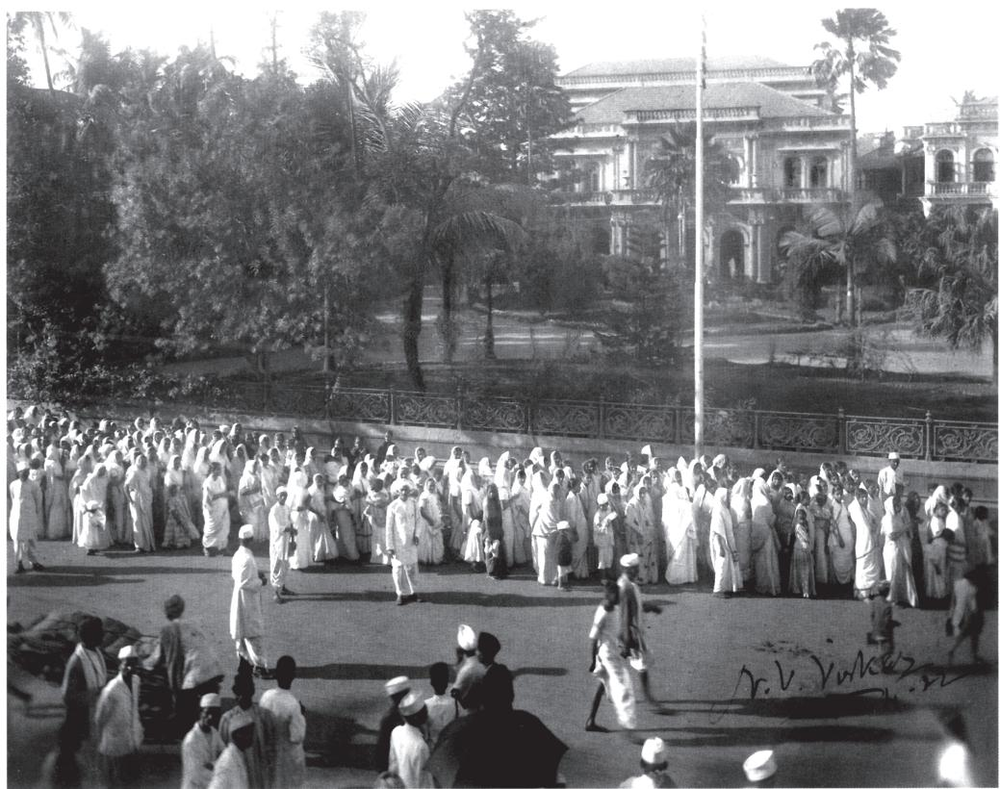  
Fig. 9 – Women join nationalist processions. During the national movement, many women, for the first time in their lives, moved out of their homes on to a public arena. Amongst the marchers you can see many old women, and mothers with children in their arms.

picketed foreign cloth and liquor shops. Many went to jail. In urban areas these women were from high-caste families; in rural areas they came from rich peasant households. Moved by Gandhiji’s call, they began to see service to the nation as a sacred duty of women. Yet, this increased public role did not necessarily mean any radical change in the way the position of women was visualised. Gandhiji was convinced that it was the duty of women to look after home and hearth, be good mothers and good wives. And for a long time the Congress was reluctant to allow women to hold any position of authority within the organisation. It was keen only on their symbolic presence.

### 3.3 The Limits of Civil Disobedience

Not all social groups were moved by the abstract concept of swaraj. One such group was the nation’s ‘untouchables’, who from around the 1930s had begun to call themselves dalit or oppressed. For long the Congress had ignored the dalits, for fear of offending the sanatanis, the conservative high-caste Hindus. But Mahatma Gandhi declared that swaraj would not come for a hundred years if untouchability was not eliminated. He called the ‘untouchables’ harijan,

## Discuss

Why did various classes and groups of Indians participate in the Civil Disobedience Movement?

or the children of God, organised satyagraha to secure them entry into temples, and access to public wells, tanks, roads and schools. He himself cleaned toilets to dignify the work of the bhangi (the sweepers), and persuaded upper castes to change their heart and give up ‘the sin of untouchability’. But many dalit leaders were keen on a different political solution to the problems of the community. They began organising themselves, demanding reserved seats in educational institutions, and a separate electorate that would choose dalit members for legislative councils. Political empowerment, they believed, would resolve the problems of their social disabilities. Dalit participation in the Civil Disobedience Movement was therefore limited, particularly in the Maharashtra and Nagpur region where their organisation was quite strong.

Dr B.R. Ambedkar, who organised the dalits into the Depressed Classes Association in 1930, clashed with Mahatma Gandhi at the second Round Table Conference by demanding separate electorates for dalits. When the British government conceded Ambedkar’s demand, Gandhiji began a fast unto death. He believed that separate electorates for dalits would slow down the process of their integration into society. Ambedkar ultimately accepted Gandhiji’s position and the result was the Poona Pact of September 1932. It gave the Depressed Classes (later to be known as the Schedule Castes) reserved seats in provincial and central legislative councils, but they were to be voted in by the general electorate. The dalit movement, however, continued to be apprehensive of the Congressled national movement.

Some of the Muslim political organisations in India were also lukewarm in their response to the Civil Disobedience Movement. After the decline of the Non-Cooperation-Khilafat movement, a large section of Muslims felt alienated from the Congress. From the mid-1920s the Congress came to be more visibly associated with openly Hindu religious nationalist groups like the Hindu Mahasabha. As relations between Hindus and Muslims worsened, each community organised religious processions with militant fervour, provoking Hindu-Muslim communal clashes and riots in various cities. Every riot deepened the distance between the two communities.

The Congress and the Muslim League made efforts to renegotiate an alliance, and in 1927 it appeared that such a unity could be forged. The important differences were over the question of representation in the future assemblies that were to be elected. Muhammad Ali

  
Fig. 10 – Mahatma Gandhi, Jawaharlal Nehru and Maulana Azad at Sevagram Ashram, Wardha, 1935.

Jinnah, one of the leaders of the Muslim League, was willing to give up the demand for separate electorates, if Muslims were assured reserved seats in the Central Assembly and representation in proportion to population in the Muslim-dominated provinces (Bengal and Punjab). Negotiations over the question of representation continued but all hope of resolving the issue at the All Parties Conference in 1928 disappeared when M.R. Jayakar of the Hindu Mahasabha strongly opposed efforts at compromise.

When the Civil Disobedience Movement started there was thus an atmosphere of suspicion and distrust between communities. Alienated from the Congress, large sections of Muslims could not respond to the call for a united struggle. Many Muslim leaders and intellectuals expressed their concern about the status of Muslims as a minority within India. They feared that the culture and identity of minorities would be submerged under the domination of a Hindu majority.

## Source D

In 1930, Sir Muhammad Iqbal, as president of the Muslim League, reiterated the importance of separate electorates for the Muslims as an important safeguard for their minority political interests. His statement is supposed to have provided the intellectual justification for the Pakistan demand that came up in subsequent years. This is what he said:

‘I have no hesitation in declaring that if the principle that the Indian Muslim is entitled to full and free development on the lines of his own culture and tradition in his own Indian home-lands is recognised as the basis of a permanent communal settlement, he will be ready to stake his all for the freedom of India. The principle that each group is entitled to free development on its own lines is not inspired by any feeling of narrow communalism … A community which is inspired by feelings of ill-will towards other communities is low and ignoble. I entertain the highest respect for the customs, laws, religions and social institutions of other communities. Nay, it is my duty according to the teachings of the Quran, even to defend their places of worship, if need be. Yet I love the communal group which is the source of life and behaviour and which has formed me what I am by giving me its religion, its literature, its thought, its culture and thereby its whole past as a living operative factor in my present consciousness …

‘Communalism in its higher aspect, then, is indispensable to the formation of a harmonious whole in a country like India. The units of Indian society are not territorial as in European countries … The principle of European democracy cannot be applied to India without recognising the fact of communal groups. The Muslim demand for the creation of a Muslim India within India is, therefore, perfectly justified…

‘The Hindu thinks that separate electorates are contrary to the spirit of true nationalism, because he understands the word “nation” to mean a kind of universal amalgamation in which no communal entity ought to retain its private individuality. Such a state of things, however, does not exist. India is a land of racial and religious variety. Add to this the general economic inferiority of the Muslims, their enormous debt, especially in the Punjab, and their insufficient majorities in some of the provinces, as at present constituted and you will begin to see clearly the meaning of our anxiety to retain separate electorates.’

## Discuss

Read the Source D carefully. Do you agree with Iqbal’s idea of communalism? Can you define communalism in a different way?

## 4 The Sense of Collective Belonging

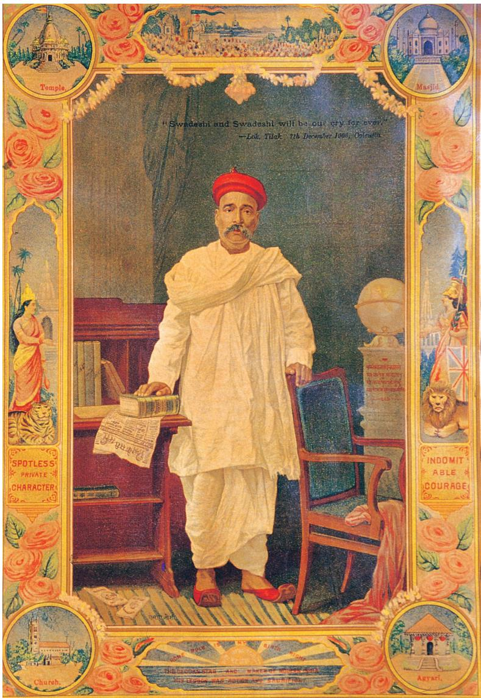  
Fig. 11 – Bal Gangadhar Tilak, an early-twentieth-century print. Notice how Tilak is surrounded by symbols of unity. The sacred institutions of different faiths (temple, church, masjid) frame the central figure.

Nationalism spreads when people begin to believe that they are all part of the same nation, when they discover some unity that binds them together. But how did the nation become a reality in the minds of people? How did people belonging to different communities, regions or language groups develop a sense of collective belonging?

This sense of collective belonging came partly through the experience of united struggles. But there were also a variety of cultural processes through which nationalism captured people’s imagination. History and fiction, folklore and songs, popular prints and symbols, all played a part in the making of nationalism.

The identity of the nation, as you know (see Chapter 1), is most often symbolised in a figure or image. This helps create an image with which people can identify the nation. It was in the twentieth century, with the growth of nationalism, that the identity of India came to be visually associated with the image of Bharat Mata. The image was first created by Bankim Chandra Chattopadhyay. In the 1870s he wrote ‘Vande Mataram’ as a hymn to the motherland. Later it was included in his novel Anandamath and widely sung during the Swadeshi movement in Bengal. Moved by the Swadeshi movement, Abanindranath Tagore painted his famous image of Bharat Mata (see Fig. 12). In this painting Bharat Mata is portrayed as an ascetic figure; she is calm, composed, divine and spiritual. In subsequent years, the image of Bharat Mata acquired many different forms, as it circulated in popular prints, and was painted by different artists (see Fig. 14). Devotion to this mother figure came to be seen as evidence of one’s nationalism.

Ideas of nationalism also developed through a movement to revive Indian folklore. In late-nineteenth-century India, nationalists began recording folk tales sung by bards and they toured villages to gather folk songs and legends. These tales, they believed, gave a true picture of traditional culture that had been corrupted and damaged by outside forces. It was essential to preserve this folk tradition in order to discover one’s national identity and restore a sense of pride in one’s past. In Bengal, Rabindranath Tagore himself began collecting ballads, nursery rhymes and myths, and led the movement for folk

  
Fig. 13 – Jawaharlal Nehru, a popular print.

Fig. 12 – Bharat Mata, Abanindranath Tagore, 1905.

Notice that the mother figure here is shown as dispensing learning, food and clothing. The mala in one hand emphasises her ascetic quality. Abanindranath Tagore, like Ravi Varma before him, tried to develop a style of painting that could be seen as truly Indian.

Nehru is here shown holding the image of Bharat Mata and the map of India close to his heart. In a lot of popular prints, nationalist leaders are shown offering their heads to Bharat Mata. The idea of sacrifice for the mother was powerful within popular imagination.

revival. In Madras, Natesa Sastri published a massive four-volume collection of Tamil folk tales, The Folklore of Southern India. He believed that folklore was national literature; it was ‘the most trustworthy manifestation of people’s real thoughts and characteristics’.

As the national movement developed, nationalist leaders became more and more aware of such icons and symbols in unifying people and inspiring in them a feeling of nationalism. During the Swadeshi movement in Bengal, a tricolour flag (red, green and yellow) was designed. It had eight lotuses representing eight provinces of British India, and a crescent moon, representing Hindus and Muslims. By 1921, Gandhiji had designed the Swaraj flag. It was again a tricolour (red, green and white) and had a spinning wheel in the centre, representing the Gandhian ideal of self-help. Carrying the flag, holding it aloft, during marches became a symbol of defiance.

Another means of creating a feeling of nationalism was through reinterpretation of history. By the end of the nineteenth century many Indians began feeling that to instill a sense of pride in the nation, Indian history had to be thought about differently. The British saw Indians as backward and primitive, incapable of governing themselves. In response, Indians began looking into the past to discover India’s great achievements. They wrote about the glorious developments in ancient times when art and architecture, science and mathematics, religion and culture, law and philosophy, crafts and trade had flourished. This glorious time, in their view, was followed by a history of decline, when India was colonised. These nationalist histories urged the readers to take pride in India’s great achievements in the past and struggle to change the miserable conditions of life under British rule.

These efforts to unify people were not without problems. When the past being glorified was Hindu, when the images celebrated were drawn from Hindu iconography, then people of other communities felt left out.

Fig. 14a – Bharat Mata.   
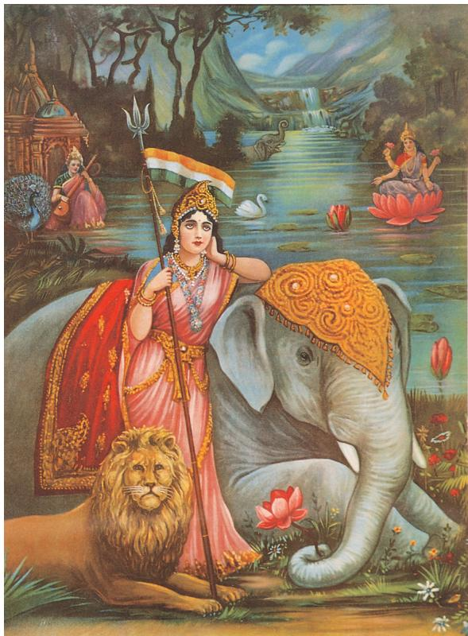  
This figure of Bharat Mata is a contrast to the one painted by Abanindranath Tagore. Here she is shown with a trishul, standing beside a lion and an elephant – both symbols of power and authority.

### Activity

Look at Figs. 12 and 14. Do you think these images will appeal to all castes and communities?

Explain your views briefly.

## Source E

‘In earlier times, foreign travellers in India marvelled at the courage, truthfulness and modesty of the people of the Arya vamsa; now they remark mainly on theabsence of those qualities.In those days Hindus would set out onconquest and hoist their flags in Tartar, China and other countries; now a few soldiers from a tiny island far away are lording it over the land of India.’

Tarinicharan Chattopadhyay, Bharatbarsher Itihas (The History of Bharatbarsh), vol. 1, 1858.

Source

## Conclusion

A growing anger against the colonial government was thus bringing together various groups and classes of Indians into a common struggle for freedom in the first half of the twentieth century. The Congress under the leadership of Mahatma Gandhi tried to channel people’s grievances into organised movements for independence. Through such movements the nationalists tried to forge a national unity. But as we have seen, diverse groups and classes participated in these movements with varied aspirations and expectations. As their

grievances were wide-ranging, freedom from colonial rule also meant different things to different people. The Congress continuously attempted to resolve differences, and ensure that the demands of one group did not alienate another. This is precisely why the unity within the movement often broke down. The high points of Congress activity and nationalist unity were followed by phases of disunity and inner conflict between groups.

In other words, what was emerging

was a nation with many voices wanting freedom from colonial rule.

  
Fig. 14b Women’s procession in Bombay during the Quit India Movement

## Quit India Movement

The failure of the Cripps Mission and the effects of World War II created widespread discontentment in India. This led Gandhiji to launch a movement calling for complete withdrawal of the British from India. The Congress Working Committee, in its meeting in Wardha on 14 July 1942, passed the historic ‘Quit India’ resolution demanding the immediate transfer of power to Indians and quit India. On 8 August 1942 in Bombay, the All India Congress Committee endorsed the resolution which called for a non-violent mass struggle on the widest possible scale throughout the country. It was on this occasion that Gandhiji delivered the famous ‘Do or Die’ speech. The call for ‘Quit India’ almost brought the state machinery to a standstill in large parts of the country as people voluntarily threw themselves into the thick of the movement. People observed hartals, and demonstrations and processions were accompanied by national songs and slogans. The movement was truly a mass movement which brought into its ambit thousands of ordinary people, namely students, workers and peasants. It also saw the active participation of leaders, namely, Jayprakash Narayan, Aruna Asaf Ali and Ram Manohar Lohia and many women such as Matangini Hazra in Bengal, Kanaklata Barua in Assam and Rama Devi in Odisha. The British responded with much force, yet it took more than a year to suppress the movement.

## Write in brief

1. Explain:

a) Why growth of nationalism in the colonies is linked to an anti-colonial movement.   
b) How the First World War helped in the growth of the National Movement in India.   
c) Why Indians were outraged by the Rowlatt Act.   
d) Why Gandhiji decided to withdraw the Non-Cooperation Movement.

2. What is meant by the idea of satyagraha?   
3. Write a newspaper report on:

a) The Jallianwala Bagh massacre   
b) The Simon Commission

4 Compare the images of Bharat Mata in this chapter with the image of Germania in Chapter 1.

## Discuss

1. List all the different social groups which joined the Non-Cooperation Movement of 1921. Then choose any three and write about their hopes and struggles to show why they joined the movement.   
2. Discuss the Salt March to make clear why it was an effective symbol of resistance against colonialism.   
3. Imagine you are a woman participating in the Civil Disobedience Movement. Explain what the experience meant to your life.   
4. Why did political leaders differ sharply over the question of separate electorates?

## Project

Find out about the anti-colonial movement in Indo-China. Compare and contrast India’s national movement with the ways in which Indo-China became independent.

# Chapter 3
# The Making of a Global World

## 1 The Pre-modern World

When we talk of ‘globalisation’ we often refer to an economic system that has emerged since the last 50 years or so. But as you will see in this chapter, the making of the global world has a long history – of trade, of migration, of people in search of work, the movement of capital, and much else. As we think about the dramatic and visible signs of global interconnectedness in our lives today, we need to understand the phases through which this world in which we live has emerged.

All through history, human societies have become steadily more interlinked. From ancient times, travellers, traders, priests and pilgrims travelled vast distances for knowledge, opportunity and spiritual fulfilment, or to escape persecution. They carried goods, money, values, skills, ideas, inventions, and even germs and diseases. As early as 3000 BCE an active coastal trade linked the Indus valley civilisations with present-day West Asia. For more than a millennia, cowries (the Hindi cowdi or seashells, used as a form of currency) from the Maldives found their way to China and East Africa. The long-distance spread of disease-carrying germs may be traced as far back as the seventh century. By the thirteenth century it had become an unmistakable link.

  
1066CH03   
Fig. 1 – Image of a ship on a memorial stone, Goa Museum, tenth century CE.

From the ninth century, images of ships appear regularly in memorial stones found in the western coast, indicating the significance of oceanic trade.

### 1.1 Silk Routes Link the World

The silk routes are a good example of vibrant pre-modern trade and cultural links between distant parts of the world. The name ‘silk routes’ points to the importance of West-bound Chinese silk cargoes along this route. Historians have identified several silk routes, over land and by sea, knitting together vast regions of Asia, and linking Asia with Europe and northern Africa. They are known to have existed since before the Christian Era and thrived almost till the fifteenth century. But Chinese pottery also travelled the same route, as did textiles and spices from India and Southeast Asia. In return, precious metals – gold and silver – flowed from Europe to Asia.

Trade and cultural exchange always went hand in hand. Early Christian missionaries almost certainly travelled this route to Asia, as did early Muslim preachers a few centuries later. Much before all this, Buddhism emerged from eastern India and spread in several directions through intersecting points on the silk routes.

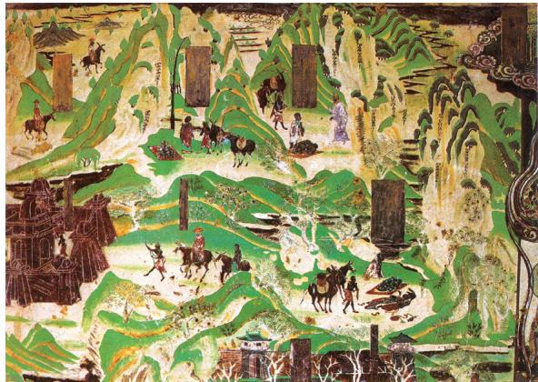  
Fig. 2 – Silk route trade as depicted in a Chinese cave painting, eighth century, Cave 217, Mogao Grottoes, Gansu, China.

### 1.2 Food Travels: Spaghetti and Potato

Food offers many examples of long-distance cultural exchange. Traders and travellers introduced new crops to the lands they travelled. Even ‘ready’ foodstuff in distant parts of the world might share common origins. Take spaghetti and noodles. It is believed

that noodles travelled west from China to become spaghetti. Or, perhaps Arab traders took pasta to fifth-century Sicily, an island now in Italy. Similar foods were also known in India and Japan, so the truth about their origins may never be known. Yet such guesswork suggests the possibilities of long-distance cultural contact even in the pre-modern world.

Many of our common foods such as potatoes, soya, groundnuts, maize, tomatoes, chillies, sweet potatoes, and so on were not known to our ancestors until about five centuries ago. These foods were only introduced in Europe and Asia after Christopher Columbus accidentally discovered the vast continent that would later become known as the Americas.

  
Fig. 3 – Merchants from Venice and the Orient exchanging goods, from Marco Polo, Book of Marvels, fifteenth century.

(Here we will use ‘America’ to describe North America, South America and the Caribbean.) In fact, many of our common foods came from America’s original inhabitants – the American Indians.

Sometimes the new crops could make the difference between life and death. Europe’s poor began to eat better and live longer with the introduction of the humble potato. Ireland’s poorest peasants became so dependent on potatoes that when disease destroyed the potato crop in the mid-1840s, hundreds of thousands died of starvation.

### 1.3 Conquest, Disease and Trade

The pre-modern world shrank greatly in the sixteenth century after European sailors found a sea route to Asia and also successfully crossed the western ocean to America. For centuries before, the Indian Ocean had known a bustling trade, with goods, people, knowledge, customs, etc. criss-crossing its waters. The Indian subcontinent was central to these flows and a crucial point in their networks. The entry of the Europeans helped expand or redirect some of these flows towards Europe.

Before its ‘discovery’, America had been cut off from regular contact with the rest of the world for millions of years. But from the sixteenth century, its vast lands and abundant crops and minerals began to transform trade and lives everywhere.

Precious metals, particularly silver, from mines located in presentday Peru and Mexico also enhanced Europe’s wealth and financed its trade with Asia. Legends spread in seventeenth-century Europe about South America’s fabled wealth. Many expeditions set off in search of El Dorado, the fabled city of gold.

The Portuguese and Spanish conquest and colonisation of America was decisively under way by the mid-sixteenth century. European conquest was not just a result of superior firepower. In fact, the most powerful weapon of the Spanish conquerors was not a conventional military weapon at all. It was the germs such as those of smallpox that they carried on their person. Because of their long isolation, America’s original inhabitants had no immunity against these diseases that came from Europe. Smallpox in particular proved a deadly killer. Once introduced, it spread deep into the continent, ahead even of any Europeans reaching there. It killed and decimated whole communities, paving the way for conquest.

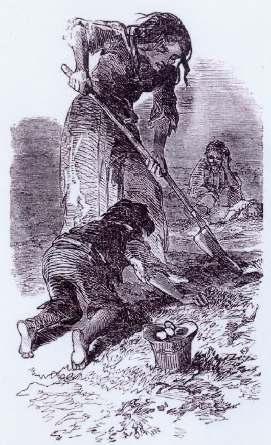  
Fig. 4 – The Irish Potato Famine, Illustrated London News, 1849.

Hungry children digging for potatoes in a field that has already been harvested, hoping to discover some leftovers. During the Great Irish Potato Famine (1845 to 1849), around 1,000,000 people died of starvation in Ireland, and double the number emigrated in search of work.

## Box 1

## ‘Biological’ warfare?

John Winthorp, the first governor of the Massachusetts Bay colony in New England, wrote in May 1634 that smallpox signalled God’s blessing for the colonists: ‘… the natives … were neere (near) all dead of small Poxe (pox), so as the Lord hathe (had) cleared our title to what we possess’.

Alfred Crosby, Ecological Imperialism.

Guns could be bought or captured and turned against the invaders. But not diseases such as smallpox to which the conquerors were mostly immune.

Until the nineteenth century, poverty and hunger were common in Europe. Cities were crowded and deadly diseases were widespread. Religious conflicts were common, and religious dissenters were persecuted. Thousands therefore fled Europe for America. Here, by the eighteenth century, plantations worked by slaves captured in Africa were growing cotton and sugar for European markets.

Until well into the eighteenth century, China and India were among the world’s richest countries. They were also pre-eminent in Asian trade. However, from the fifteenth century, China is said to have restricted overseas contacts and retreated into isolation. China’s reduced role and the rising importance of the Americas gradually moved the centre of world trade westwards. Europe now emerged as the centre of world trade.

## New words

Dissenter – One who refuses to accept established beliefs and practices

## Discuss

Explain what we mean when we say that the world ‘shrank’ in the 1500s.

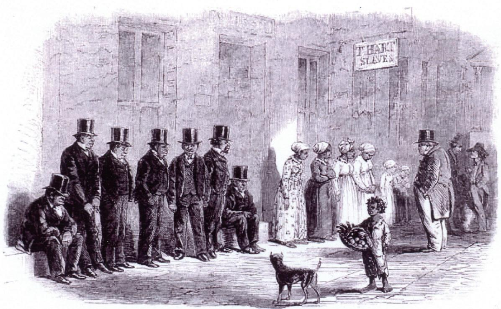  
Fig. 5 – Slaves for sale, New Orleans, Illustrated London News, 1851.

A prospective buyer carefully inspecting slaves lined up before the auction. You can see two children along with four women and seven men in top hats and suit waiting to be sold. To attract buyers, slaves were often dressed in their best clothes.

## 2 The Nineteenth Century (1815-1914)

The world changed profoundly in the nineteenth century. Economic, political, social, cultural and technological factors interacted in complex ways to transform societies and reshape external relations.

Economists identify three types of movement or ‘flows’ within international economic exchanges. The first is the flow of trade which in the nineteenth century referred largely to trade in goods (e.g., cloth or wheat). The second is the flow of labour – the migration of people in search of employment. The third is the movement of capital for short-term or long-term investments over long distances.

All three flows were closely interwoven and affected peoples’ lives more deeply now than ever before. The interconnections could sometimes be broken – for example, labour migration was often more restricted than goods or capital flows. Yet it helps us understand the nineteenth-century world economy better if we look at the three flows together.

### 2.1 A World Economy Takes Shape

A good place to start is the changing pattern of food production and consumption in industrial Europe. Traditionally, countries liked to be self-sufficient in food. But in nineteenth-century Britain, self-sufficiency in food meant lower living standards and social conflict. Why was this so?

Population growth from the late eighteenth century had increased the demand for food grains in Britain. As urban centres expanded and industry grew, the demand for agricultural products went up, pushing up food grain prices. Under pressure from landed groups, the government also restricted the import of corn. The laws allowing the government to do this were commonly known as the ‘Corn Laws’. Unhappy with high food prices, industrialists and urban dwellers forced the abolition of the Corn Laws.

After the Corn Laws were scrapped, food could be imported into Britain more cheaply than it could be produced within the country. British agriculture was unable to compete with imports. Vast areas of land were now left uncultivated, and thousands of men and women were thrown out of work. They flocked to the cities or migrated overseas.

As food prices fell, consumption in Britain rose. From the midnineteenth century, faster industrial growth in Britain also led to higher incomes, and therefore more food imports. Around the world – in Eastern Europe, Russia, America and Australia – lands were cleared and food production expanded to meet the British demand.

It was not enough merely to clear lands for agriculture. Railways were needed to link the agricultural regions to the ports. New harbours had to be built and old ones expanded to ship the new cargoes. People had to settle on the lands to bring them under cultivation. This meant building homes and settlements. All these activities in turn required capital and labour. Capital flowed from financial centres such as London. The demand for labour in places where labour was in short supply – as in America and Australia – led to more migration.

Nearly 50 million people emigrated from Europe to America and Australia in the nineteenth century. All over the world some 150 million are estimated to have left their homes, crossed oceans and vast distances over land in search of a better future.

  
Fig. 6 – Emigrant ship leaving for the US, by M.W. Ridley, 1869.

  
Fig. 7 – Irish emigrants waiting to board the ship, by Michael Fitzgerald, 1874.

Thus by 1890, a global agricultural economy had taken shape, accompanied by complex changes in labour movement patterns, capital flows, ecologies and technology. Food no longer came from a nearby village or town, but from thousands of miles away. It was not grown by a peasant tilling his own land, but by an agricultural worker, perhaps recently arrived, who was now working on a large farm that only a generation ago had most likely been a forest. It was transported by railway, built for that very purpose, and by ships which were increasingly manned in these decades by low-paid workers from southern Europe, Asia, Africa and the Caribbean.

### Activity

Imagine that you are an agricultural worker who has arrived in America from Ireland. Write a paragraph on why you chose to come and how you are earning your living.

Some of this dramatic change, though on a smaller scale, occurred closer home in west Punjab. Here the British Indian government built a network of irrigation canals to transform semi-desert wastes into fertile agricultural lands that could grow wheat and cotton for export. The Canal Colonies, as the areas irrigated by the new canals were called, were settled by peasants from other parts of Punjab.

Of course, food is merely an example. A similar story can be told for cotton, the cultivation of which expanded worldwide to feed British textile mills. Or rubber. Indeed, so rapidly did regional specialisation in the production of commodities develop, that between 1820 and 1914 world trade is estimated to have multiplied 25 to 40 times. Nearly 60 per cent of this trade comprised ‘primary products’ – that is, agricultural products such as wheat and cotton, and minerals such as coal.

### 2.2 Role of Technology

What was the role of technology in all this? The railways, steamships, the telegraph, for example, were important inventions without which we cannot imagine the transformed nineteenth-century world. But technological advances were often the result of larger social, political and economic factors. For example, colonisation stimulated new investments and improvements in transport: faster railways, lighter wagons and larger ships helped move food more cheaply and quickly from faraway farms to final markets.

### Activity

Prepare a flow chart to show how Britain’s decision to import food led to increased migration to America and Australia.

  
Fig. 8 — The Smithfield Club Cattle Show, Illustrated London News, 1851.

Cattle were traded at fairs, brought by farmers for sale. One of the oldest livestock markets in London was at Smithfield. In the midnineteenth century a huge poultry and meat market was established near the railway line connecting Smithfield to all the meat-supplying centres of the country.

The trade in meat offers a good example of this connected process. Till the 1870s, animals were shipped live from America to Europe and then slaughtered when they arrived there. But live animals took up a lot of ship space. Many also died in voyage, fell ill, lost weight, or became unfit to eat. Meat was hence an expensive luxury beyond the reach of the European poor. High prices in turn kept demand and production down until the development of a new technology, namely, refrigerated ships, which enabled the transport of perishable foods over long distances.

Now animals were slaughtered for food at the starting point – in America, Australia or New Zealand – and then transported to Europe as frozen meat. This reduced shipping costs and lowered meat prices in Europe. The poor in Europe could now consume a more varied diet. To the earlier monotony of bread and potatoes many, though not all, could now add meat (and butter and eggs) to their diet. Better living conditions promoted social peace within the country and support for imperialism abroad.

### 2.3 Late nineteenth-century Colonialism

Trade flourished and markets expanded in the late nineteenth century. But this was not only a period of expanding trade and increased prosperity. It is important to realise that there was a darker side to this process. In many parts of the world, the expansion of trade and a closer relationship with the world economy also meant a loss of freedoms and livelihoods. Latenineteenth-century European conquests produced many painful economic, social and ecological changes through which the colonised societies were brought into the world economy.

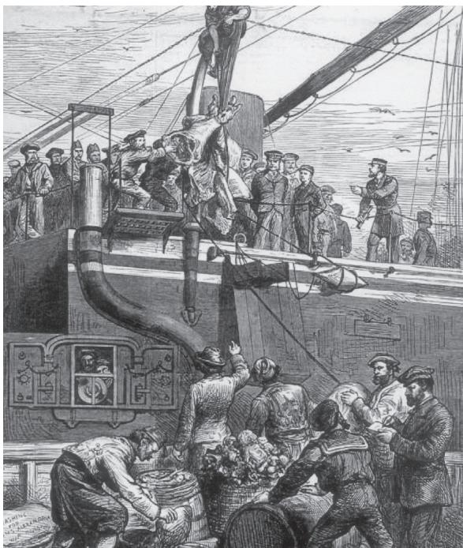  
Fig. 9 – Meat being loaded on to the ship, Alexandra, Illustrated London News, 1878. Export of meat was possible only after ships were refrigerated.

Look at a map of Africa (Fig. 10). You will see some countries’ borders run straight, as if they were drawn using a ruler. Well, in fact this was almost how rival European powers in Africa drew up the borders demarcating their respective territories. In 1885 the big European powers met in Berlin to complete the carving up of Africa between them.

Britain and France made vast additions to their overseas territories in the late nineteenth century. Belgium and Germany became new colonial powers. The US also became a colonial power in the late 1890s by taking over some colonies earlier held by Spain.

Let us look at one example of the destructive impact of colonialism on the economy and livelihoods of colonised people.

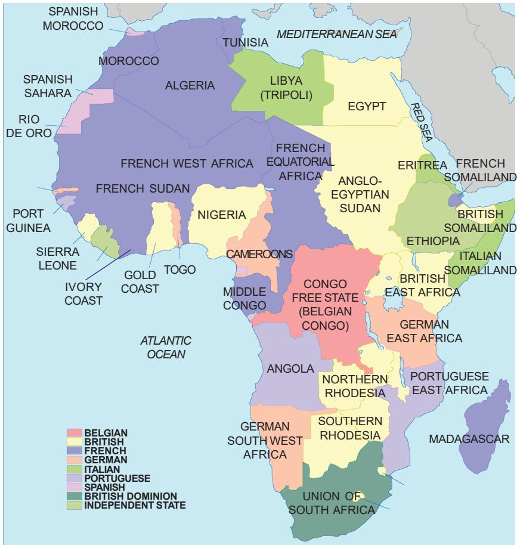  
Fig. 10 – Map of colonial Africa at the end of the nineteenth century.

## Box 2

## Sir Henry Morton Stanley in Central Africa

Stanley was a journalist and explorer sent by the New York Herald to find Livingston, a missionary and explorer who had been in Africa for several years. Like other European and American explorers of the time, Stanley went with arms, mobilised local hunters, warriors and labourers to help him, fought with local tribes, investigated African terrains, and mapped different regions. These explorations helped the conquest of Africa. Geographical explorations were not driven by an innocent search for scientific information. They were directly linked to imperial projects.

  
Fig. 11 – Sir Henry Morton Stanley and his retinue in Central Africa, Illustrated London News, 1871.

### 2.4 Rinderpest, or the Cattle Plague

In Africa, in the 1890s, a fast-spreading disease of cattle plague or rinderpest had a terrifying impact on people’s livelihoods and the local economy. This is a good example of the widespread European imperial impact on colonised societies. It shows how in this era of conquest even a disease affecting cattle reshaped the lives and fortunes of thousands of people and their relations with the rest of the world.

Historically, Africa had abundant land and a relatively small population. For centuries, land and livestock sustained African livelihoods and people rarely worked for a wage. In latenineteenth-century Africa there were few consumer goods that wages could buy. If you had been an African possessing land and livestock – and there was plenty of both – you too would have seen little reason to work for a wage.

In the late nineteenth century, Europeans were attracted to Africa due to its vast resources of land and minerals. Europeans came to Africa hoping to establish plantations and mines to produce crops and minerals for export to Europe. But there was an unexpected problem – a shortage of labour willing to work for wages.

Employers used many methods to recruit and retain labour. Heavy taxes were imposed which could be paid only by working for wages on plantations and mines. Inheritance laws were changed so that

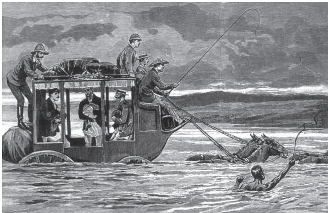  
Fig. 12 – Transport to the Transvaal gold mines, The Graphic, 1887.

Crossing the Wilge river was the quickest method of transport to the gold fields of Transvaal. After the discovery of gold in Witwatersrand, Europeans rushed to the region despite their fear of disease and death, and the difficulties of the journey. By the 1890s, South Africa contributed over 20 per cent of the world gold production.

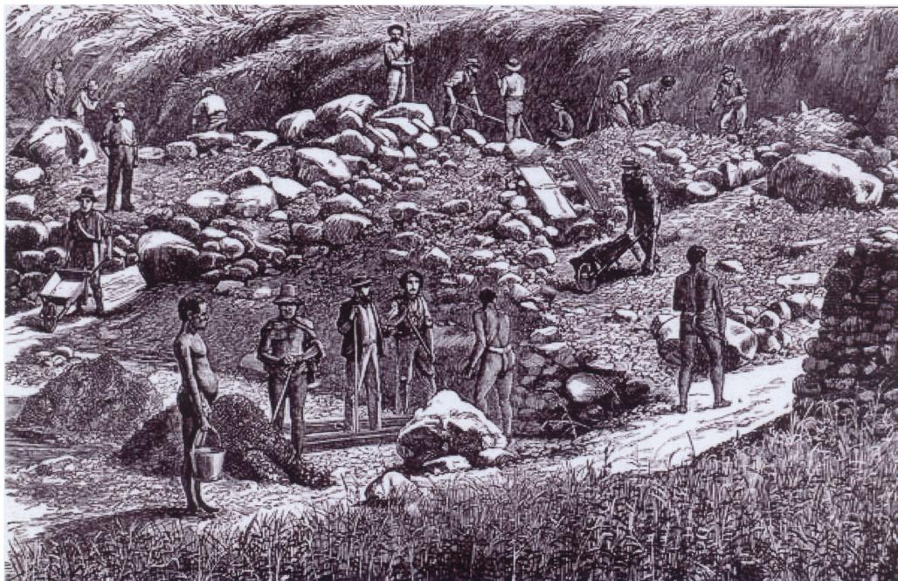  
Fig. 13 — Diggers at work in the Transvaal gold fields in South Africa, The Graphic, 1875.

peasants were displaced from land: only one member of a family was allowed to inherit land, as a result of which the others were pushed into the labour market. Mineworkers were also confined in compounds and not allowed to move about freely.

Then came rinderpest, a devastating cattle disease.

Rinderpest arrived in Africa in the late 1880s. It was carried by infected cattle imported from British Asia to feed the Italian soldiers invading Eritrea in East Africa. Entering Africa in the east, rinderpest moved west ‘like forest fire’, reaching Africa’s Atlantic coast in 1892. It reached the Cape (Africa’s southernmost tip) five years later. Along the way rinderpest killed 90 per cent of the cattle.

The loss of cattle destroyed African livelihoods. Planters, mine owners and colonial governments now successfully monopolised what scarce cattle resources remained, to strengthen their power and to force Africans into the labour market. Control over the scarce resource of cattle enabled European colonisers to conquer and subdue Africa.

Similar stories can be told about the impact of Western conquest on other parts of the nineteenth-century world.

### 2.4 Indentured Labour Migration from India

The example of indentured labour migration from India also illustrates the two-sided nature of the nineteenth-century world. It was a world of faster economic growth as well as great misery, higher incomes for some and poverty for others, technological advances in some areas and new forms of coercion in others.

In the nineteenth century, hundreds of thousands of Indian and Chinese labourers went to work on plantations, in mines, and in road and railway construction projects around the world. In India, indentured labourers were hired under contracts which promised return travel to India after they had worked five years on their employer’s plantation.

Most Indian indentured workers came from the present-day regions of eastern Uttar Pradesh, Bihar, central India and the dry districts of Tamil Nadu. In the mid-nineteenth century these regions experienced many changes – cottage industries declined, land rents rose, lands were cleared for mines and plantations. All this affected the lives of the poor: they failed to pay their rents, became deeply indebted and were forced to migrate in search of work.

## New words

Indentured labour – A bonded labourer under contract to work for an employer for a specific amount of time, to pay off his passage to a new country or home

The main destinations of Indian indentured migrants were the Caribbean islands (mainly Trinidad, Guyana and Surinam), Mauritius and Fiji. Closer home, Tamil migrants went to Ceylon and Malaya. Indentured workers were also recruited for tea plantations in Assam.

Recruitment was done by agents engaged by employers and paid a small commission. Many migrants agreed to take up work hoping to escape poverty or oppression in their home villages. Agents also tempted the prospective migrants by providing false information about final destinations, modes of travel, the nature of the work, and living and working conditions. Often

migrants were not even told that they were to embark on a long sea voyage. Sometimes agents even forcibly abducted less willing migrants.

Nineteenth-century indenture has been described as a ‘new system of slavery’. On arrival at the plantations, labourers found conditions to be different from what they had imagined. Living and working conditions were harsh, and there were few legal rights.

But workers discovered their own ways of surviving. Many of them escaped into the wilds, though if caught they faced severe punishment. Others developed new forms of individual and collective selfexpression, blending different cultural forms, old and new. In Trinidad the annual Muharram procession was transformed into a riotous carnival called ‘Hosay’ (for Imam Hussain) in which workers of all races and religions joined. Similarly, the protest religion of Rastafarianism (made famous by the Jamaican reggae star Bob Marley) is also said to reflect social and cultural links with Indian migrants to the Caribbean. ‘Chutney music’, popular in Trinidad and Guyana, is another creative contemporary expression of the post-indenture experience. These forms of cultural fusion are part of the making of the global world, where things from different places get mixed, lose their original characteristics and become something entirely new.

Most indentured workers stayed on after their contracts ended, or returned to their new homes after a short spell in India. Consequently, there are large communities of people of Indian descent in these countries. Have you heard of the Nobel Prize-winning writer

  
Fig. 14 — Indian indentured labourers in a cocoa plantation in Trinidad, early nineteenth century.

## Discuss

Discuss the importance of language and popular traditions in the creation of national identity.

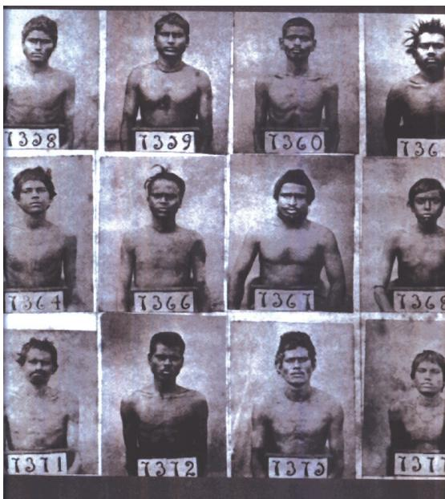  
Fig. 15 — Indentured laboureres photographed for identification. For the employers, the numbers and not the names mattered.

V.S. Naipaul? Some of you may have followed the exploits of West Indies cricketers Shivnarine Chanderpaul and Ramnaresh Sarwan. If you have wondered why their names sound vaguely Indian, the answer is that they are descended from indentured labour migrants from India.

From the 1900s India’s nationalist leaders began opposing the system of indentured labour migration as abusive and cruel. It was abolished in 1921. Yet for a number of decades afterwards, descendants of Indian indentured workers, often thought of as ‘coolies’, remained an uneasy minority in the Caribbean islands. Some of Naipaul’s early novels capture their sense of loss and alienation.

### 2.5 Indian Entrepreneurs Abroad

Growing food and other crops for the world market required capital. Large plantations could borrow it from banks and markets. But what about the humble peasant?

Enter the Indian banker. Do you know of the Shikaripuri shroffs and Nattukottai Chettiars? They were amongst the many groups of bankers and traders who financed export agriculture in Central and Southeast Asia, using either their own funds or those borrowed from European banks. They had a sophisticated system to transfer money over large distances, and even developed indigenous forms of corporate organisation.

Indian traders and moneylenders also followed European colonisers into Africa. Hyderabadi Sindhi traders, however, ventured beyond European colonies. From the 1860s they established flourishing emporia at busy ports worldwide, selling local and imported curios to tourists whose numbers were beginning to swell, thanks to the development of safe and comfortable passenger vessels.

### 2.6 Indian Trade, Colonialism and the Global System

Historically, fine cottons produced in India were exported to Europe. With industrialisation, British cotton manufacture began to expand, and industrialists pressurised the government to restrict cotton imports and protect local industries. Tariffs were imposed on cloth imports into Britain. Consequently, the inflow of fine Indian cotton began to decline.

From the early nineteenth century, British manufacturers also began to seek overseas markets for their cloth. Excluded from the British

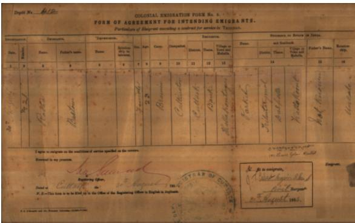  
Fig. 16 — A contract form of an indentured labourer.

## Source A

## The testimony of an indentured labourer

Extract from the testimony of Ram Narain Tewary, an indentured labourer who spent ten years on Demerara in the early twentieth century. ‘… in spite of my best efforts, I could not properly do the works that were allotted to me ... In a few days I got my hands bruised all over and I could not go to work for a week for which I was prosecuted and sent to jail for 14 days. ... new emigrants find the tasks allotted to them extremely heavy and cannot complete them in a day. ... Deductions are also made from wages if the work is considered to have been done unsatisfactorily. Many people cannot therefore earn their full wages and are punished in various ways. In fact, the labourers have to spend their period of indenture in great trouble …’

Source: Department of Commerce and Industry, Emigration Branch. 1916

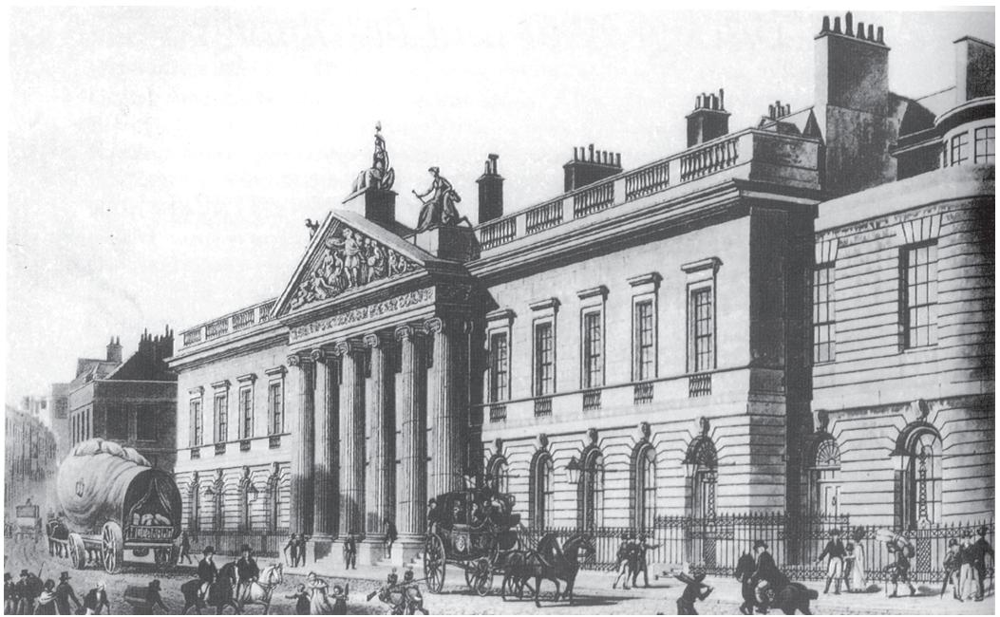  
Fig. 17 – East India Company House, London.   
This was the nerve centre of the worldwide operations of the East India Company.

market by tariff barriers, Indian textiles now faced stiff competition in other international markets. If we look at the figures of exports from India, we see a steady decline of the share of cotton textiles: from some 30 per cent around 1800 to 15 per cent by 1815. By the 1870s this proportion had dropped to below 3 per cent.

What, then, did India export? The figures again tell a dramatic story. While exports of manufactures declined rapidly, export of raw materials increased equally fast. Between 1812 and 1871, the share of raw cotton exports rose from 5 per cent to 35 per cent. Indigo used for dyeing cloth was another important export for

  
Fig. 18 – A distant view of Surat and its river.   
All through the seventeenth and early eighteenth centuries, Surat remained the main centre of overseas trade in the western Indian Ocean.

many decades. And, as you have read last year, opium shipments to China grew rapidly from the 1820s to become for a while India’s single largest export. Britain grew opium in India and exported it to China and, with the money earned through this sale, it financed its tea and other imports from China.

Over the nineteenth century, British manufactures flooded the Indian market. Food grain and raw material exports from India to Britain and the rest of the world increased. But the value of British exports to India was much higher than the value of British imports from India. Thus Britain had a ‘trade surplus’ with India. Britain used this surplus to balance its trade deficits with other countries – that is, with countries from which Britain was importing more than it was selling to. This is how a multilateral settlement system works – it allows one country’s deficit with another country to be settled by its surplus with a third country. By helping Britain balance its deficits, India played a crucial role in the late-nineteenth-century world economy.

Britain’s trade surplus in India also helped pay the so-called ‘home charges’ that included private remittances home by British officials and traders, interest payments on India’s external debt, and pensions of British officials in India.

  
Fig. 19 – The trade routes that linked India to the world at the end of the seventeenth century.

## 3 The Inter-war Economy

The First World War (1914-18) was mainly fought in Europe. But its impact was felt around the world. Notably for our concerns in this chapter, it plunged the first half of the twentieth century into a crisis that took over three decades to overcome. During this period the world experienced widespread economic and political instability, and another catastrophic war.

### 3.1 Wartime Transformations

The First World War, as you know, was fought between two power blocs. On the one side were the Allies – Britain, France and Russia (later joined by the US); and on the opposite side were the Central Powers – Germany, Austria-Hungary and Ottoman Turkey. When the war began in August 1914, many governments thought it would be over by Christmas. It lasted more than four years.

The First World War was a war like no other before. The fighting involved the world’s leading industrial nations which now harnessed the vast powers of modern industry to inflict the greatest possible destruction on their enemies.

This war was thus the first modern industrial war. It saw the use of machine guns, tanks, aircraft, chemical weapons, etc. on a massive scale. These were all increasingly products of modern large-

scale industry. To fight the war, millions of soldiers had to be recruited from around the world and moved to the frontlines on large ships and trains. The scale of death and destruction – 9 million dead and 20 million injured – was unthinkable before the industrial age, without the use of industrial arms.

Most of the killed and maimed were men of working age. These deaths and injuries reduced the able-bodied workforce in Europe. With fewer numbers within the family, household incomes declined after the war.

During the war, industries were restructured to produce war-related goods. Entire societies were also reorganised for war – as men went to battle, women stepped in to undertake jobs that earlier only men were expected to do.

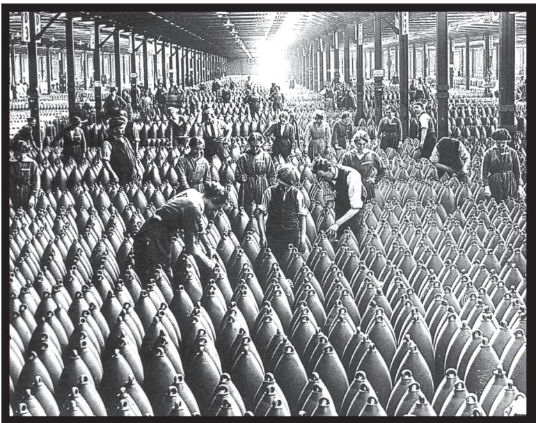  
Fig. 20 – Workers in a munition factory during the First World War. Production of armaments increased rapidly to meet war demands.

The war led to the snapping of economic links between some of the world’s largest economic powers which were now fighting each other to pay for them. So Britain borrowed large sums of money from US banks as well as the US public. Thus the war transformed the US from being an international debtor to an international creditor. In other words, at the war’s end, the US and its citizens owned more overseas assets than foreign governments and citizens owned in the US.

### 3.2 Post-war Recovery

Post-war economic recovery proved difficult. Britain, which was the world’s leading economy in the pre-war period, in particular faced a prolonged crisis. While Britain was preoccupied with war, industries had developed in India and Japan. After the war Britain found it difficult to recapture its earlier position of dominance in the Indian market, and to compete with Japan internationally. Moreover, to finance war expenditures Britain had borrowed liberally from the US. This meant that at the end of the war Britain was burdened with huge external debts.

The war had led to an economic boom, that is, to a large increase in demand, production and employment. When the war boom ended, production contracted and unemployment increased. At the same time the government reduced bloated war expenditures to bring them into line with peacetime revenues. These developments led to huge job losses – in 1921 one in every five British workers was out of work. Indeed, anxiety and uncertainty about work became an enduring part of the post-war scenario.

Many agricultural economies were also in crisis. Consider the case of wheat producers. Before the war, eastern Europe was a major supplier of wheat in the world market. When this supply was disrupted during the war, wheat production in Canada, America and Australia expanded dramatically. But once the war was over, production in eastern Europe revived and created a glut in wheat output. Grain prices fell, rural incomes declined, and farmers fell deeper into debt.

### 3.3 Rise of Mass Production and Consumption

In the US, recovery was quicker. We have already seen how the war helped boost the US economy. After a short period of economic

trouble in the years after the war, the US economy resumed its strong growth in the early 1920s.

One important feature of the US economy of the 1920s was mass production. The move towards mass production had begun in the late nineteenth century, but in the 1920s it became a characteristic feature of industrial production in the US. A well-known pioneer of mass production was the car manufacturer Henry Ford. He adapted the assembly line of a Chicago slaughterhouse (in which slaughtered animals were picked apart by butchers as they came down a conveyor belt) to his new car plant in Detroit. He realised that the ‘assembly line’ method would allow a faster and cheaper way of producing vehicles. The assembly line forced workers to repeat a single task mechanically and continuously – such as fitting a particular part to the car – at a pace dictated by the

conveyor belt. This was a way of increasing the output per worker by speeding up the pace of work. Standing in front of a conveyor belt no worker could afford to delay the motions, take a break, or even have a friendly word with a workmate. As a result, Henry Ford’s cars came off the assembly line at three-minute intervals, a speed much faster than that achieved by previous methods. The T-Model Ford was the world’s first mass-produced car.

At first workers at the Ford factory were unable to cope with the stress of working on assembly lines in which they could not control the pace of work. So they quit in large numbers. In desperation Ford doubled the daily wage to $\$ 5$ in January 1914. At the same time he banned trade unions from operating in his plants.

Henry Ford recovered the high wage by repeatedly speeding up the production line and forcing workers to work ever harder. So much so, he would soon describe his decision to double the daily wage as the ‘best cost-cutting decision’ he had ever made.

Fordist industrial practices soon spread in the US. They were also widely copied in Europe in the 1920s. Mass production lowered costs and prices of engineered goods. Thanks to higher wages, more workers could now afford to purchase durable consumer goods such as cars. Car production in the US rose from 2 million in 1919 to more than 5 million in 1929. Similarly, there was a spurt in the purchase of refrigerators, washing machines, radios, gramophone players, all through a system of ‘hire purchase’ (i.e., on

  
Fig. 21 – T-Model automobiles lined up outside the factory.

credit repaid in weekly or monthly instalments). The demand for refrigerators, washing machines, etc. was also fuelled by a boom in house construction and home ownership, financed once again by loans.

The housing and consumer boom of the 1920s created the basis of prosperity in the US. Large investments in housing and household goods seemed to create a cycle of higher employment and incomes, rising consumption demand, more investment, and yet more employment and incomes.

In 1923, the US resumed exporting capital to the rest of the world and became the largest overseas lender. US imports and capital exports also boosted European recovery and world trade and income growth over the next six years.

All this, however, proved too good to last. By 1929 the world would be plunged into a depression such as it had never experienced before.

### 3.4 The Great Depression

The Great Depression began around 1929 and lasted till the mid-1930s. During this period most parts of the world experienced catastrophic declines in production, employment, incomes and trade. The exact timing and impact of the depression varied across countries. But in general, agricultural regions and communities were the worst affected. This was because the fall in agricultural prices was greater and more prolonged than that in the prices of industrial goods.

The depression was caused by a combination of several factors. We have already seen how fragile the post-war world economy was. First: agricultural overproduction remained a problem. This was made worse by falling agricultural prices. As prices slumped and agricultural incomes declined, farmers tried to expand production and bring a larger volume of produce to the market to maintain their overall income. This worsened the glut in the market, pushing down prices even further. Farm produce rotted for a lack of buyers.

Second: in the mid-1920s, many countries financed their investments through loans from the US. While it was often extremely easy to raise loans in the US when the going was good, US overseas lenders panicked at the first sign of trouble. In the first half of 1928, US

## Box 3

  
Fig. 22 – Migrant agricultural worker’s family, homeless and hungry, during the Great Depression, 1936. Courtesy: Library of Congress, Prints and Photographs Division.

Many years later, Dorothea Lange, the photographer who shot this picture, recollected the moment of her encounter with the hungry mother:

‘I saw and approached the hungry and desperate mother, as if drawn by a magnet … I did not ask her name or her history. She told me her age, that she was thirty-two. She said that they (i.e., she and her seven children) had been living on frozen vegetables from the surrounding fields, and birds that the children killed … There she sat … with her children huddled around her, and seemed to know that my pictures might help her, and so she helped me …’

From: Popular Photography, February 1960.

overseas loans amounted to over $\$ 1$ billion. A year later it was one quarter of that amount. Countries that depended crucially on US loans now faced an acute crisis.

The withdrawal of US loans affected much of the rest of the world, though in different ways. In Europe it led to the failure of some major banks and the collapse of currencies such as the British pound sterling. In Latin America and elsewhere it intensified the slump in agricultural and raw material prices. The US attempt to protect its economy in the depression by doubling import duties also dealt another severe blow to world trade.

The US was also the industrial country most severely affected by the depression. With the fall in prices and the prospect of a depression, US banks had also slashed domestic lending and called back loans. Farms could not sell their harvests, households were ruined, and businesses collapsed. Faced with falling incomes, many households in the US could not repay what they had borrowed, and were forced to give up their homes, cars and other consumer durables. The consumerist prosperity of the 1920s now disappeared in a puff of dust. As unemployment soared, people trudged long distances looking for any work they could find. Ultimately, the US banking system itself collapsed. Unable to recover investments, collect loans and repay depositors, thousands of banks went bankrupt and were forced to close. The numbers are phenomenal: by 1933 over 4,000 banks had closed and between 1929 and 1932 about 110, 000 companies had collapsed.

By 1935, a modest economic recovery was under way in most industrial countries. But the Great Depression’s wider effects on society, politics and international relations, and on peoples’ minds, proved more enduring.

### 3.5 India and the Great Depression

If we look at the impact of the depression on India we realise how integrated the global economy had become by the early twentieth century. The tremors of a crisis in one part of the world were quickly relayed to other parts, affecting lives, economies and societies worldwide.

In the nineteenth century, as you have seen, colonial India had become an exporter of agricultural goods and importer of manufactures. The depression immediately affected Indian trade. India’s exports

  
Fig. 23 – People lining up for unemployment benefits, US, photograph by Dorothea Lange, 1938. Courtesy: Library of Congress, Prints and Photographs Division. When an unemployment census showed 10 million people out of work, the local government in many US states began making small allowances to the unemployed. These long queues came to symbolise the poverty and unemployment of the depression years.

and imports nearly halved between 1928 and 1934. As international prices crashed, prices in India also plunged. Between 1928 and 1934, wheat prices in India fell by 50 per cent.

Peasants and farmers suffered more than urban dwellers. Though agricultural prices fell sharply, the colonial government refused to reduce revenue demands. Peasants producing for the world market were the worst hit.

Consider the jute producers of Bengal. They grew raw jute that was processed in factories for export in the form of gunny bags. But as gunny exports collapsed, the price of raw jute crashed more than 60 per cent. Peasants who borrowed in the hope of better times or to increase output in the hope of higher incomes faced ever lower prices, and fell deeper and deeper into debt. Thus the Bengal jute growers’ lament:

grow more jute, brothers, with the hope of greater cash.

Costs and debts of jute will make your hopes get dashed.

When you have spent all your money and got the crop off the ground,

… traders, sitting at home, will pay only Rs 5 a maund.

Across India, peasants’ indebtedness increased. They used up their savings, mortgaged lands, and sold whatever jewellery and precious metals they had to meet their expenses. In these depression years, India became an exporter of precious metals, notably gold. The famous economist John Maynard Keynes thought that Indian gold exports promoted global economic recovery. They certainly helped speed up Britain’s recovery, but did little for the Indian peasant. Rural India was thus seething with unrest when Mahatma Gandhi launched the civil disobedience movement at the height of the depression in 1931.

The depression proved less grim for urban India. Because of falling prices, those with fixed incomes – say town-dwelling landowners who received rents and middle-class salaried employees – now found themselves better off. Everything cost less. Industrial investment also grew as the government extended tariff protection to industries, under the pressure of nationalist opinion.

## Discuss

Who profits from jute cultivation according to the jute growers’ lament? Explain.

## 4 Rebuilding a World Economy: The Post-war Era

The Second World War broke out a mere two decades after the end of the First World War. It was fought between the Axis powers (mainly Nazi Germany, Japan and Italy) and the Allies (Britain, France, the Soviet Union and the US). It was a war waged for six years on many fronts, in many places, over land, on sea, in the air.

Once again death and destruction was enormous. At least 60 million people, or about 3 per cent of the world’s 1939 population, are believed to have been killed, directly or indirectly, as a result of the war. Millions more were injured.

Unlike in earlier wars, most of these deaths took place outside the battlefields. Many more civilians than soldiers died from war-related causes. Vast parts of Europe and Asia were devastated, and several cities were destroyed by aerial bombardment or relentless artillery attacks. The war caused an immense amount of economic devastation and social disruption. Reconstruction promised to be long and difficult.

  
Fig. 24 – German forces attack Russia, July 1941. Hitler’s attempt to invade Russia was a turning point in the war.

Two crucial influences shaped post-war reconstruction. The first was the US’s emergence as the dominant economic, political and military power in the Western world. The second was the dominance of the Soviet Union. It had made huge sacrifices to defeat Nazi Germany, and transformed itself from a backward agricultural country into a world power during the very years when the capitalist world was trapped in the Great Depression.

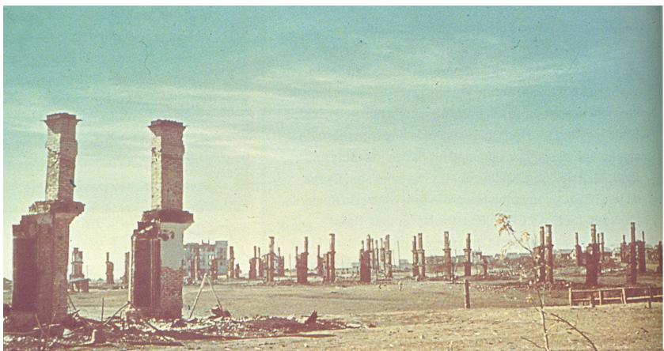  
Fig. 25 – Stalingrad in Soviet Russia devastated by the war.

### 4.1 Post-war Settlement and the Bretton Woods Institutions

Economists and politicians drew two key lessons from inter-war economic experiences. First, an industrial society based on mass production cannot be sustained without mass consumption. But to ensure mass consumption, there was a need for high and stable incomes. Incomes could not be stable if employment was unstable. Thus stable incomes also required steady, full employment.

But markets alone could not guarantee full employment. Therefore governments would have to step in to minimise

fluctuations of price, output and employment. Economic stability could be ensured only through the intervention of the government.

The second lesson related to a country’s economic links with the outside world. The goal of full employment could only be achieved if governments had power to control flows of goods, capital and labour.

Thus in brief, the main aim of the post-war international economic system was to preserve economic stability and full employment in the industrial world. Its framework was agreed upon at the United Nations Monetary and Financial Conference held in July 1944 at Bretton Woods in New Hampshire, USA.

The Bretton Woods conference established the International Monetary Fund (IMF) to deal with external surpluses and deficits of its member nations. The International Bank for Reconstruction and Development (popularly known as the World Bank) was set up to finance postwar reconstruction. The IMF and the World Bank are referred to as the Bretton Woods institutions or sometimes the Bretton Woods twins. The post-war international economic system is also often described as the Bretton Woods system.

The IMF and the World Bank commenced financial operations in 1947. Decision-making in these institutions is controlled by the Western industrial powers. The US has an effective right of veto over key IMF and World Bank decisions.

The international monetary system is the system linking national currencies and monetary system. The Bretton Woods system was based on fixed exchange rates. In this system, national currencies, for example the Indian rupee, were pegged to the dollar at a fixed exchange rate. The dollar itself was anchored to gold at a fixed price of $\$ 35$ per ounce of gold.

### 4.2 The Early Post-war Years

The Bretton Woods system inaugurated an era of unprecedented growth of trade and incomes for the Western industrial nations and Japan. World trade grew annually at over 8 per cent between 1950 and 1970 and incomes at nearly 5 per cent. The growth was also mostly stable, without large fluctuations. For much of this period the unemployment rate, for example, averaged less than 5 per cent in most industrial countries.

Fig. 26 – Mount Washington Hotel situated in Bretton Woods, US.   
  
This is the place where the famous conference was held.

## Discuss

Briefly summarise the two lessons learnt by economists and politicians from the inter-war economic experience?

These decades also saw the worldwide spread of technology and enterprise. Developing countries were in a hurry to catch up with the advanced industrial countries. Therefore, they invested vast amounts of capital, importing industrial plant and equipment featuring modern technology.

### 4.3 Decolonisation and Independence

When the Second World War ended, large parts of the world were still under European colonial rule. Over the next two decades most colonies in Asia and Africa emerged as free, independent nations. They were, however, overburdened by poverty and a lack of resources, and their economies and societies were handicapped by long periods of colonial rule.

The IMF and the World Bank were designed to meet the financial needs of the industrial countries. They were not equipped to cope with the challenge of poverty and lack of development in the former colonies. But as Europe and Japan rapidly rebuilt their economies, they grew less dependent on the IMF and the World Bank. Thus from the late 1950s the Bretton Woods institutions began to shift their attention more towards developing countries.

As colonies, many of the less developed regions of the world had been part of Western empires. Now, ironically, as newly independent countries facing urgent pressures to lift their populations out of poverty, they came under the guidance of international agencies dominated by the former colonial powers. Even after many years of decolonisation, the former colonial powers still controlled vital resources such as minerals and land in many of their former colonies.

Large corporations of other powerful countries, for example the US, also often managed to secure rights to exploit developing countries’ natural resources very cheaply.

At the same time, most developing countries did not benefit from the fast growth the Western economies experienced in the 1950s and 1960s. Therefore they organised themselves as a group – the Group of 77 (or G-77) – to demand a new international economic order (NIEO). By the NIEO they meant a system that would give them real control over their natural resources, more development assistance, fairer prices for raw materials, and better access for their manufactured goods in developed countries’ markets.

## Box 4

## What are MNCs?

Multinational corporations (MNCs) are large companies that operate in several countries at the same time. The first MNCs were established in the 1920s. Many more came up in the 1950s and 1960s as US businesses expanded worldwide and Western Europe and Japan also recovered to become powerful industrial economies. The worldwide spread of MNCs was a notable feature of the 1950s and 1960s. This was partly because high import tariffs imposed by different governments forced MNCs to locate their manufacturing operations and become ‘domestic producers’ in as many countries as possible.

## New words

Tariff – Tax imposed on a country’s imports from the rest of the world. Tariffs are levied at the point of entry, i.e., at the border or the airport.

### 4.4 End of Bretton Woods and the Beginning of ‘Globalisation’

Despite years of stable and rapid growth, not all was well in this post-war world. From the 1960s the rising costs of its overseas involvements weakened the US’s finances and competitive strength. The US dollar now no longer commanded confidence as the world’s principal currency. It could not maintain its value in relation to gold. This eventually led to the collapse of the system of fixed exchange rates and the introduction of a system of floating exchange rates.

From the mid-1970s the international financial system also changed in important ways. Earlier, developing countries could turn to international institutions for loans and development assistance. But now they were forced to borrow from Western commercial banks and private lending institutions. This led to periodic debt crises in the developing world, and lower incomes and increased poverty, especially in Africa and Latin America.

The industrial world was also hit by unemployment that began rising from the mid-1970s and remained high until the early 1990s. From the late 1970s MNCs also began to shift production operations to low-wage Asian countries.

China had been cut off from the post-war world economy since its revolution in 1949. But new economic policies in China and the collapse of the Soviet Union and Soviet-style communism in Eastern Europe brought many countries back into the fold of the world economy.

Wages were relatively low in countries like China. Thus they became attractive destinations for investment by foreign MNCs competing to capture world markets. Have you noticed that most of the TVs, mobile phones, and toys we see in the shops seem to be made in China? This is because of the low-cost structure of the Chinese economy, most importantly its low wages.

The relocation of industry to low-wage countries stimulated world trade and capital flows. In the last two decades the world’s economic geography has been transformed as countries such as India, China and Brazil have undergone rapid economic transformation.

## New words

Exchange rates – They link national currencies for purposes of international trade. There are broadly two kinds of exchange rates: fixed exchange rate and floating exchange rate

Fixed exchange rates – When exchange rates are fixed and governments intervene to prevent movements in them

Flexible or floating exchange rates – These rates fluctuate depending on demand and supply of currencies in foreign exchange markets, in principle without interference by governments

## Write in brief

1. Give two examples of different types of global exchanges which took place before the seventeenth century, choosing one example from Asia and one from the Americas.   
Explain how the global transfer of disease in the pre-modern world helped in the colonisation of the Americas.   
3. Write a note to explain the effects of the following:

a) The British government’s decision to abolish the Corn Laws.   
b) The coming of rinderpest to Africa.   
c) The death of men of working-age in Europe because of the World War.   
d) The Great Depression on the Indian economy.   
e) The decision of MNCs to relocate production to Asian countries.

4. Give two examples from history to show the impact of technology on food availability.   
5. What is meant by the Bretton Woods Agreement?

## Discuss

6. Imagine that you are an indentured Indian labourer in the Caribbean. Drawing from the details in this chapter, write a letter to your family describing your life and feelings.   
7. Explain the three types of movements or flows within international economic exchange. Find one example of each type of flow which involved India and Indians, and write a short account of it.   
8. Explain the causes of the Great Depression.   
9. Explain what is referred to as the G-77 countries. In what ways can G-77 be seen as a reaction to the activities of the Bretton Woods twins?

## Project

Find out more about gold and diamond mining in South Africa in the nineteenth century. Who controlled the gold and diamond companies? Who were the miners and what were their lives like? Project

# chapter 4
# The Age of Industrialisation

1066CH04

  
Fig. 1 – Dawn of the Century, published by E.T. Paull Music Co., New York, England, 1900.

In 1900, a popular music publisher E.T. Paull produced a music book that had a picture on the cover page announcing the ‘Dawn of the Century’ (Fig. 1). As you can see from the illustration, at the centre of the picture is a goddess-like figure, the angel of progress, bearing the flag of the new century. She is gently perched on a wheel The Age of Industrialisationwith wings, symbolising time. Her flight is taking her into the future. Floating about, behind her, are the signs of progress: railway, camera, machines, printing press and factory.

This glorification of machines and technology is even more marked in a picture which appeared on the pages of a trade magazine over a hundred years ago (Fig. 2). It shows two magicians. The one at the top is Aladdin from the Orient who built a beautiful palace with his

## New words

Orient – The countries to the east of the Mediterranean, usually referring to Asia. The term arises out of a western viewpoint that sees this region as premodern, traditional and mysterious

magic lamp. The one at the bottom is the modern mechanic, who with his modern tools weaves a new magic: builds bridges, ships, towers and high-rise buildings. Aladdin is shown as representing the East and the past, the mechanic stands for the West and modernity.

These images offer us a triumphant account of the modern world. Within this account the modern world is associated with rapid technological change and innovations, machines and factories, railways and steamships. The history of industrialisation thus becomes simply a story of development, and the modern age appears as a wonderful time of technological progress.

These images and associations have now become part of popular imagination. Do you not see rapid industrialisation as a time of progress and modernity? Do you not think that the spread of railways and factories, and construction of high-rise buildings and bridges is a sign of society’s development?

How have these images developed? And how do we relate to these ideas? Is industrialisation always based on rapid technological development? Can we today continue to glorify continuous mechanisation of all work? What has industrialisation meant to people’s lives? To answer such questions we need to turn to the history of industrialisation.

In this chapter we will look at this history by focusing first on Britain, the first industrial nation, and then India, where the pattern of industrial change was conditioned by colonial rule.

### Activity

Give two examples where modern development that is associated with progress has led to problems. You may like to think of areas related to environmental issues, nuclear weapons or disease.

  
Fig. 2 – Two Magicians, published in Inland Printers, 26 January 1901.

## 1 Before the Industrial Revolution

All too often we associate industrialisation with the growth of factory industry. When we talk of industrial production we refer to factory production. When we talk of industrial workers we mean factory workers. Histories of industrialisation very often begin with the setting up of the first factories.

There is a problem with such ideas. Even before factories began to dot the landscape in England and Europe, there was large-scale industrial production for an international market. This was not based on factories. Many historians now refer to this phase of industrialisation as proto-industrialisation.

In the seventeenth and eighteenth centuries, merchants from the towns in Europe began moving to the countryside, supplying money to peasants and artisans, persuading them to produce for an international market. With the expansion of world trade and the acquisition of colonies in different parts of the world, the demand for goods began growing. But merchants could not expand production within towns. This was because here urban crafts and trade guilds were powerful. These were associations of producers that trained craftspeople, maintained control over production, regulated competition and prices, and restricted the entry of new people into

the trade. Rulers granted different guilds the monopoly right to produce and trade in specific products. It was therefore difficult for new merchants to set up business in towns. So they turned to the countryside.

In the countryside poor peasants and artisans began working for merchants. As you have seen in the textbook last year, this was a time when open fields were disappearing and commons were being enclosed. Cottagers and poor peasants who had earlier depended on common lands for their survival, gathering their firewood, berries, vegetables, hay and straw, had to now look for alternative sources of income. Many had tiny plots of land which could not provide work for all members of the household. So when merchants came around and offered advances to produce goods for them, peasant households eagerly agreed. By working for the merchants, they

## New words

Proto – Indicating the first or early form of something

  
Fig. 3 – Spinning in the eighteenth century. You can see each member of the family involved in the production of yarn. Notice that one wheel is moving only one spindle.

could remain in the countryside and continue to cultivate their small plots. Income from proto-industrial production supplemented their shrinking income from cultivation. It also allowed them a fuller use of their family labour resources.

Within this system a close relationship developed between the town and the countryside. Merchants were based in towns but the work was done mostly in the countryside. A merchant clothier in England purchased wool from a wool stapler, and carried it to the spinners; the yarn (thread) that was spun was taken in subsequent stages of production to weavers, fullers, and then to dyers. The finishing was done in London before the export merchant sold the cloth in the international market. London in fact came to be known as a finishing centre.

This proto-industrial system was thus part of a network of commercial exchanges. It was controlled by merchants and the goods were produced by a vast number of producers working within their family farms, not in factories. At each stage of production 20 to 25 workers were employed by each merchant. This meant that each clothier was controlling hundreds of workers.

### 1.1 The Coming Up of the Factory

The earliest factories in England came up by the 1730s. But it was only in the late eighteenth century that the number of factories multiplied.

The first symbol of the new era was cotton. Its production boomed in the late nineteenth century. In 1760 Britain was importing 2.5 million pounds of raw cotton to feed its cotton industry. By 1787 this import soared to 22 million pounds. This increase was linked to a number of changes within the process of production. Let us look briefly at some of these.

A series of inventions in the eighteenth century increased the efficacy of each step of the production process (carding, twisting and spinning, and rolling). They enhanced the output per worker, enabling each worker to produce more, and they made possible the production of stronger threads and yarn. Then Richard Arkwright created the cotton mill. Till this time, as you have seen, cloth production was spread all over the countryside and carried out within village households. But now, the costly new machines could be purchased, set up and maintained in the mill. Within the mill all the

## New words

Stapler – A person who ‘staples’ or sorts wool according to its fibre

Fuller – A person who ‘fulls’ – that is, gathers – cloth by pleating

Carding – The process in which fibres, such as cotton or wool, are prepared prior to spinning

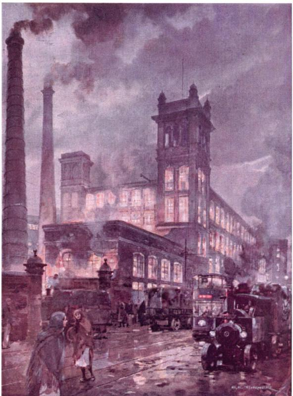  
Fig. 4 – A Lancashire cotton mill, painted by C.E. Turner, The Illustrated London News, 1925.

The artist said: ‘Seen through the humid atmosphere that makes Lancashire the best cotton-spinning locality in the world, a huge cotton-mill aglow with electricity in the twilight, is a most impressive sight.’

processes were brought together under one roof and management. This allowed a more careful supervision over the production process, a watch over quality, and the regulation of labour, all of which had been difficult to do when production was in the countryside.

In the early nineteenth century, factories increasingly became an intimate part of the English landscape. So visible were the imposing new mills, so magical seemed to be the power of new technology, that contemporaries were dazzled. They concentrated their attention on the mills, almost forgetting the bylanes and the workshops where production still continued.

### Activity

The way in which historians focus on industrialisation rather than on small workshops is a good example of how what we believe today about the past is influenced by what historians choose to notice and what they ignore. Note down one event or aspect of your own life which adults such as your parents or teachers may think is unimportant, but which you believe to be important.

  
Fig. 5 – Industrial Manchester by M. Jackson, The Illustrated London News, 1857. Chimneys billowing smoke came to characterise the industrial landscape.

### 1.2 The Pace of Industrial Change

How rapid was the process of industrialisation? Does industrialisation mean only the growth of factory industries?

First: The most dynamic industries in Britain were clearly cotton and metals. Growing at a rapid pace, cotton was the leading sector in the first phase of industrialisation up to the 1840s. After that the iron and steel industry led the way. With the expansion of railways, in England from the 1840s and in the colonies from the 1860s, the demand for iron and steel increased rapidly. By 1873 Britain was exporting iron and steel worth about $\mathcal { L } ^ { 7 7 }$ million, double the value of its cotton export.

### Activity

Look at Figs. 4 and 5. Can you see any difference in the way the two images show industrialisation? Explain your view briefly.

Second: the new industries could not easily displace traditional industries. Even at the end of the nineteenth century, less than 20 per cent of the total workforce was employed in technologically advanced industrial sectors. Textiles was a dynamic sector, but a large portion of the output was produced not within factories, but outside, within domestic units.

Third: the pace of change in the ‘traditional’ industries was not set by steam-powered cotton or metal industries, but they did not remain entirely stagnant either. Seemingly ordinary and small innovations were the basis of growth in many non-mechanised sectors such as food processing, building, pottery, glass work, tanning, furniture making, and production of implements.

Fourth: technological changes occurred slowly. They did not spread dramatically across the industrial landscape. New technology was expensive and merchants and industrialists were cautious about using it. The machines often broke down and repair was costly. They were not as effective as their inventors and manufacturers claimed.

Consider the case of the steam engine. James Watt improved the steam engine produced by Newcomen and patented the new engine in 1781. His industrialist friend Mathew Boulton manufactured the new model. But for years he could find no buyers. At the beginning of the nineteenth century, there were no more than 321 steam engines

all over England. Of these, 80 were

in cotton industries, nine in wool industries, and the rest in mining, canal works and iron works. Steam engines were not used in any of the other industries till much later in the century. So even the most powerful new technology that enhanced the productivity of labour manifold was slow to be accepted by industrialists.

Historians now have come to increasingly recognise that the typical worker in the mid-nineteenth century was not a machine operator but the traditional craftsperson and labourer.

  
Fig. 6 – A fitting shop at a railway works in England, The Illustrated London News, 1849. In the fitting shop new locomotive engines were completed and old ones repaired.

Fig. 7 – A spinning factory in 1830.   
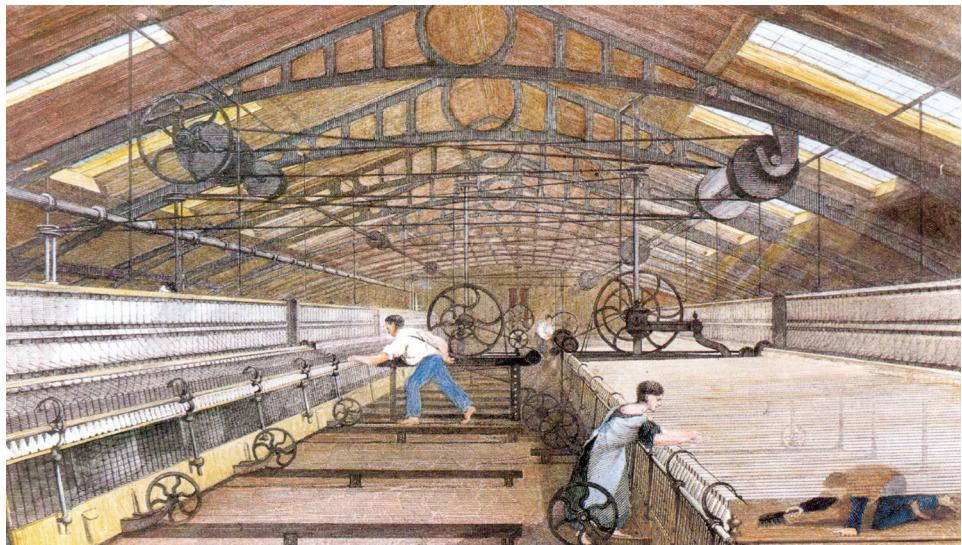  
You can see how giant wheels moved by steam power could set in motion hundreds of spindles to manufacture thread.

## 2 Hand Labour and Steam Power

In Victorian Britain there was no shortage of human labour. Poor peasants and vagrants moved to the cities in large numbers in search of jobs, waiting for work. As you will know, when there is plenty of labour, wages are low. So industrialists had no problem of labour shortage or high wage costs. They did not want to introduce machines that got rid of human labour and required large capital investment.

In many industries the demand for labour was seasonal. Gas works and breweries were especially busy through the cold months. So they needed more workers to meet their peak demand. Bookbinders and printers, catering to Christmas demand, too needed extra hands before December. At the waterfront, winter was the time that ships were repaired and spruced up. In all such industries where production fluctuated with the season, industrialists usually preferred hand labour, employing workers for the season.

  
Fig. 8 – People on the move in search of work, The Illustrated London News, 1879.

Some people were always on the move selling small goods and looking for temporary work.

A range of products could be produced only with hand labour. Machines were oriented to producing uniforms, standardised goods for a mass market. But the demand in the market was often for goods with intricate designs and specific shapes. In mid-nineteenth-century Britain, for instance, 500 varieties of

## Source A

Will Thorne is one of those who went in search of seasonal work, loading bricks and doing odd jobs. He describes how job-seekers walked to London in search of work:

‘I had always wanted to go to London, and my desire … was stimulated by letters from an old workmate … who was now working at the Old Kent Road Gas Works … I finally decided to go … in November, 1881. With two friends I started out to walk the journey, filled with the hope that we would be able to obtain employment, when we get there, with the kind assistance of my friend … we had little money when we started, not enough to pay for our food and lodgings each night until we arrived in London. Some days we walked as much as twenty miles, and other days less. Our money was gone at the end of the third day … For two nights we slept out – once under a haystack, and once in an old farm shed … On arrival in London we tried to find … my friend … but … were unsuccessful. Our money was gone, so there was nothing for us to do but to walk around until late at night, and then try to find some place to sleep. We found an old building and slept in it that night. The next day, Sunday, late in the afternoon, we got to the Old Kent Gas Works, and applied for work. To my great surprise, the man we had been looking for was working at the time. He spoke to the foreman and I was given a job.’

Quoted in Raphael Samuel, ‘Comers and Goers’, in H.J. Dyos and Michael Wolff, eds, The Victorian City: Images and Realities, 1973.

Source

### Activity

Imagine that you are a merchant writing back to a salesman who has been trying to persuade you to buy a new machine. Explain in your letter what you have heard and why you do not wish to invest in the new technology.

hammers were produced and 45 kinds of axes. These required human skill, not mechanical technology.

In Victorian Britain, the upper classes – the aristocrats and the bourgeoisie – preferred things produced by hand. Handmade products came to symbolise refinement and class. They were better finished, individually produced, and carefully designed. Machinemade goods were for export to the colonies.

In countries with labour shortage, industrialists were keen on using mechanical power so that the need for human labour can be minimised. This was the case in nineteenth-century America. Britain, however, had no problem hiring human hands.

### 2.1 Life of the Workers

The abundance of labour in the market affected the lives of workers. As news of possible jobs travelled to the countryside, hundreds tramped to the cities. The actual possibility of getting a job depended on existing networks of friendship and kin relations. If you had a relative or a friend in a factory, you were more likely to get a job quickly. But not everyone had social connections. Many jobseekers had to wait weeks, spending nights under bridges or in night

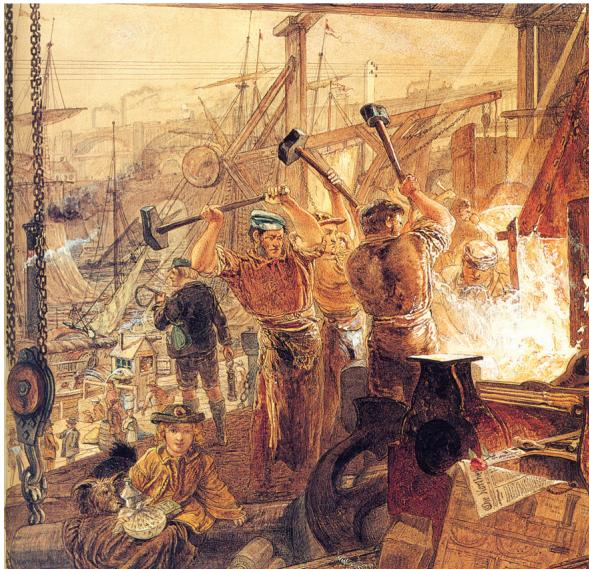  
Fig. 9 – Workers in an iron works, north-east England, painting by William Bell Scott, 1861. Many artists from the late nineteenth century began idealising workers: they were shown suffering hardship and pain for the cause of the nation.

  
Fig. 10 – Houseless and Hungry, painting by Samuel Luke Fildes, 1874. This painting shows the homeless in London applying for tickets to stay overnight in a workhouse. These shelters were maintained under the supervision of the Poor Law Commissioners for the ‘destitute, wayfarers, wanderers and foundling’. Staying in these workhouses was a humiliating experience: everyone was subjected to a medical examination to see whether they were carrying disease, their bodies were cleansed, and their clothes purified. They had to also do hard labour.

shelters. Some stayed in Night Refuges that were set up by private individuals; others went to the Casual Wards maintained by the Poor Law authorities.

Seasonality of work in many industries meant prolonged periods without work. After the busy season was over, the poor were on the streets again. Some returned to the countryside after the winter, when the demand for labour in the rural areas opened up in places. But most looked for odd jobs, which till the mid-nineteenth century were difficult to find.

Wages increased somewhat in the early nineteenth century. But they tell us little about the welfare of the workers. The average figures hide the variations between trades and the fluctuations from year to year. For instance, when prices rose sharply during the prolonged Napoleonic War, the real value of what the workers earned fell significantly, since the same wages could now buy fewer things. Moreover, the income of workers depended not on the wage rate alone. What was also critical was the period of employment: the number of days of work determined the average daily income of the workers. At the best of times till the mid-nineteenth century, about 10 per cent of the urban population were extremely poor. In periods of economic slump, like the 1830s, the proportion of unemployed went up to anything between 35 and 75 per cent in different regions.

The fear of unemployment made workers hostile to the introduction of new technology. When the Spinning Jenny was introduced in

## Source B

A magistrate reported in 1790 about an incident when he was called in to protect a manufacturer’s property from being attacked by workers:

‘From the depredations of a lawless Banditti of colliers and their wives, for the wives had lost their work to spinning engines … they advanced at first with much insolence, avowing their intention of cutting to pieces the machine lately introduced in the woollen manufacture; which they suppose, if generally adopted, will lessen the demand for manual labour. The women became clamorous. The men were more open to conviction and after some expostulation were induced to desist from their purpose and return peaceably home.’

J.L. Hammond and B. Hammond, The Skilled Labourer 1760-1832, quoted in Maxine Berg, The Age of Manufactures.

Fig. 11 – A Spinning Jenny, a drawing by T.E. Nicholson, 1835.   
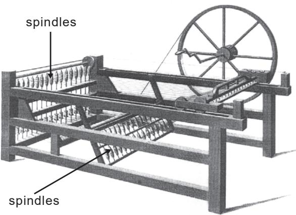  
Notice the number of spindles that could be operated with one wheel.

## New words

Spinning Jenny – Devised by James Hargreaves in 1764, this machine speeded up the spinning process and reduced labour demand. By turning one single wheel a worker could set in motion a number of spindles and spin several threads at the same time.

## Discuss

Look at Figs. 3, 7 and 11, then reread source B. Explain why many workers were opposed to the use of the Spinning Jenny.

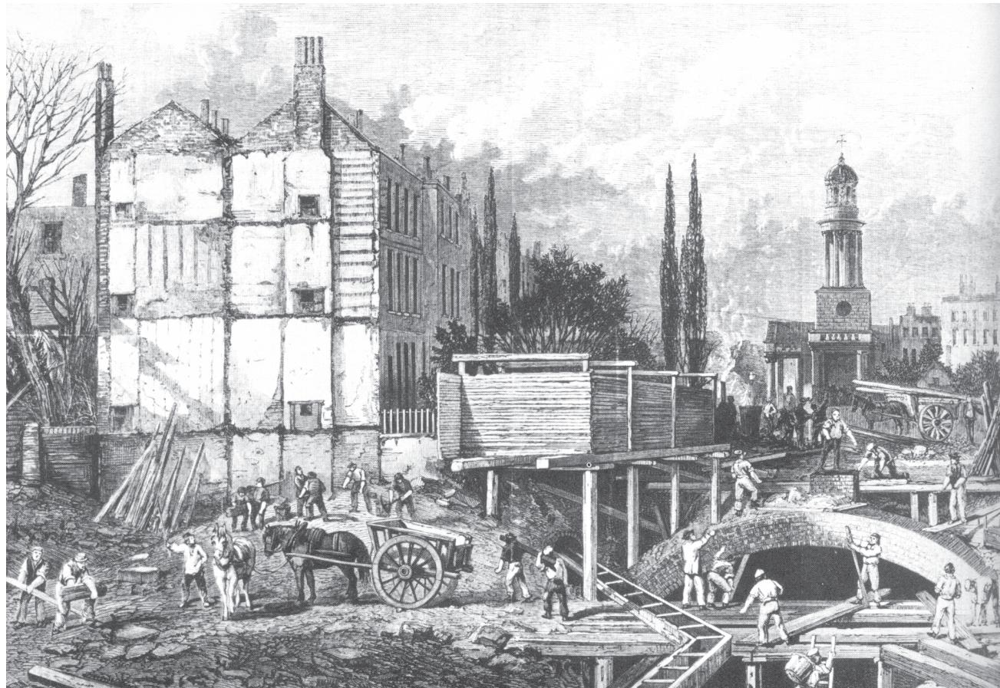  
Fig. 12 – A shallow underground railway being constructed in central London, Illustrated Times, 1868. From the 1850s railway stations began coming up all over London. This meant a demand for large numbers of workers to dig tunnels, erect timber scaffolding, do the brick and iron works. Job-seekers moved from one construction site to another.

the woollen industry, women who survived on hand spinning began attacking the new machines. This conflict over the introduction of the jenny continued for a long time.

After the 1840s, building activity intensified in the cities, opening up greater opportunities of employment. Roads were widened, new railway stations came up, railway lines were extended, tunnels dug, drainage and sewers laid, rivers embanked. The number of workers employed in the transport industry doubled in the 1840s, and doubled again in the subsequent 30 years.

## 3 Industrialisation in the Colonies

Let us now move to India to see how a colony industrialises. Once again we will look not only at factory industries but also at the non-mechanised sector. We will limit our discussion primarily to textile industries.

### 3.1 The Age of Indian Textiles

Before the age of machine industries, silk and cotton goods from India dominated the international market in textiles. Coarser cottons were produced in many countries, but the finer varieties often came from India. Armenian and Persian merchants took the goods from Punjab to Afghanistan, eastern Persia and Central Asia. Bales of fine textiles were carried on camel back via the north-west frontier, through mountain passes and across deserts. A vibrant sea trade operated through the main pre-colonial ports. Surat on the Gujarat coast connected India to the Gulf and Red Sea Ports; Masulipatam on the Coromandel coast and Hoogly in Bengal had trade links with Southeast Asian ports.

A variety of Indian merchants and bankers were involved in this network of export trade – financing production, carrying goods and supplying exporters. Supply merchants linked the port towns to the inland regions. They gave advances to weavers, procured the woven cloth from weaving villages, and carried the supply to the ports. At the port, the big shippers and export merchants had brokers who negotiated the price and bought goods from the supply merchants operating inland.

By the 1750s this network, controlled by Indian merchants, was breaking down.

The European companies gradually gained power – first securing a variety of concessions from local courts, then the monopoly rights to trade. This resulted in a decline of the old ports of Surat and Hoogly through which local merchants had operated. Exports from these ports fell dramatically, the credit that had financed the earlier trade began drying up, and the local bankers slowly went bankrupt. In the last years of the seventeenth century, the gross value of trade that passed through Surat had been Rs 16 million. By the 1740s it had slumped to Rs 3 million.

### Activity

On a map of Asia, find and draw the sea and land links of the textile trade from India to Central Asia, West Asia and Southeast Asia.

  
Fig. 13 – The English factory at Surat, a seventeenth-century drawing.

While Surat and Hoogly decayed, Bombay and Calcutta grew. This shift from the old ports to the new ones was an indicator of the growth of colonial power. Trade through the new ports came to be controlled by European companies, and was carried in European ships. While many of the old trading houses collapsed, those that wanted to survive had to now operate within a network shaped by European trading companies.

How did these changes affect the life of weavers and other artisans?

### 3.2 What Happened to Weavers?

The consolidation of East India Company power after the 1760s did not initially lead to a decline in textile exports from India. British cotton industries had not yet expanded and Indian fine textiles were in great demand in Europe. So the company was keen on expanding textile exports from India.

Before establishing political power in Bengal and Carnatic in the 1760s and 1770s, the East India Company had found it difficult to ensure a regular supply of goods for export. The French, Dutch,

  
Fig. 14 – A weaver at work, Gujarat.

Portuguese as well as the local traders competed in the market to secure woven cloth. So the weaver and supply merchants could bargain and try selling the produce to the best buyer. In their letters back to London, Company officials continuously complained of difficulties of supply and the high prices.

However, once the East India Company established political power, it could assert a monopoly right to trade. It proceeded to develop a system of management and control that would eliminate competition, control costs, and ensure regular supplies of cotton and silk goods. This it did through a series of steps.

First: the Company tried to eliminate the existing traders and brokers connected with the cloth trade, and establish a more direct control over the weaver. It appointed a paid servant called the gomastha to supervise weavers, collect supplies, and examine the quality of cloth.

Second: it prevented Company weavers from dealing with other buyers. One way of doing this was through the system of advances. Once an order was placed, the weavers were given loans to purchase the raw material for their production. Those who took loans had to hand over the cloth they produced to the gomastha. They could not take it to any other trader.

As loans flowed in and the demand for fine textiles expanded, weavers eagerly took the advances, hoping to earn more. Many weavers had small plots of land which they had earlier cultivated along with weaving, and the produce from this took care of their family needs. Now they had to lease out the land and devote all their time to weaving. Weaving, in fact, required the labour of the entire family, with children and women all engaged in different stages of the process.

Soon, however, in many weaving villages there were reports of clashes between weavers and gomasthas. Earlier supply merchants had very often lived within the weaving villages, and had a close relationship with the weavers, looking after their needs and helping them in times of crisis. The new gomasthas were outsiders, with no long-term social link with the village. They acted arrogantly, marched into villages with sepoys and peons, and punished weavers for delays in supply – often beating and flogging them. The weavers lost the space to bargain for prices and sell to different buyers: the price they received from the Company was miserably low and the loans they had accepted tied them to the Company.

## New words

Sepoy – This is how the British pronounced the word sipahi, meaning an Indian soldier in the service of the British

In many places in Carnatic and Bengal, weavers deserted villages and migrated, setting up looms in other villages where they had some family relation. Elsewhere, weavers along with the village traders revolted, opposing the Company and its officials. Over time many weavers began refusing loans, closing down their workshops and taking to agricultural labour.

By the turn of the nineteenth century, cotton weavers faced a new set of problems.

### 3.3 Manchester Comes to India

In 1772, Henry Patullo, a Company official, had ventured to say that the demand for Indian textiles could never reduce, since no other nation produced goods of the same quality. Yet by the beginning of the nineteenth century we see the beginning of a long decline of textile exports from India. In 1811-12 piece-goods accounted for 33 per cent of India’s exports; by 1850-51 it was no more than 3 per cent.

Why did this happen? What were its implications?

As cotton industries developed in England, industrial groups began worrying about imports from other countries. They pressurised the government to impose import duties on cotton textiles so that Manchester goods could sell in Britain without facing any competition from outside. At the same time industrialists persuaded the East India Company to sell British manufactures in Indian markets as well. Exports of British cotton goods increased dramatically in the early nineteenth century. At the end of the eighteenth century there had been virtually no import of cotton piece-goods into India. But by 1850 cotton piece-goods constituted over 31 per cent of the value of Indian imports; and by the 1870s this figure was over 50 per cent.

Cotton weavers in India thus faced two problems at the same time: their export market collapsed, and the local market shrank, being glutted with Manchester imports. Produced by machines at lower costs, the imported cotton goods were so cheap that weavers could not easily compete with them. By the 1850s, reports from most weaving regions of India narrated stories of decline and desolation.

By the 1860s, weavers faced a new problem. They could not get sufficient supply of raw cotton of good quality. When the American

## Source C

The Commissioner of Patna wrote:

‘It appears that twenty yeas ago, a brisk trade was carried on in the manufacture of cloth at Jahanabad, and Behar, which has in the former place entirely ceased, while in the latter the amount of manufacture is very limited, in consequence of the cheap and durable goods from Manchester with which the Native manufactures are unable to compete.’

Quoted in J. Krishnamurty, ‘Deindustrialisation in Gangetic Bihar during the nineteenth century’, The Indian Economicand Social History Review, 1985.

Source

## Source D

Reporting on the Koshtis, a community of weavers, the Census Report of Central Provinces stated:

‘The Koshtis, like the weavers of the finer kinds of cloth in other parts of India, have fallen upon evil times. They are unable to compete with the showy goods which Manchester sends in such profusion, and they have of late years emigrated in great numbers, chiefly to Berar, where as day labourers they are able to obtain wages …’

Census Report of Central Provinces,1872,quoted in Sumit Guha, ‘The handloom industry in Central India, 1825-1950’, The Indian Economic and Social History Review.

Fig. 15 – Bombay harbour, a late-eighteenth-century drawing.   
  
Bombay and Calcutta grew as trading ports from the 1780s. This marked the decline of the old trading order and the growth of the colonial economy.

Civil War broke out and cotton supplies from the US were cut off, Britain turned to India. As raw cotton exports from India increased, the price of raw cotton shot up. Weavers in India were starved of supplies and forced to buy raw cotton at exorbitant prices. In this, situation weaving could not pay.

Then, by the end of the nineteenth century, weavers and other craftspeople faced yet another problem. Factories in India began production, flooding the market with machine-goods. How could weaving industries possibly survive?

## 4 Factories Come Up

The first cotton mill in Bombay came up in 1854 and it went into production two years later. By 1862 four mills were at work with 94,000 spindles and 2,150 looms. Around the same time jute mills came up in Bengal, the first being set up in 1855 and another one seven years later, in 1862. In north India, the Elgin Mill was started in Kanpur in the 1860s, and a year later the first cotton mill of Ahmedabad was set up. By 1874, the first spinning and weaving mill of Madras began production.

Who set up the industries? Where did the capital come from? Who came to work in the mills?

### 4.1 The Early Entrepreneurs

Industries were set up in different regions by varying sorts of people. Let us see who they were.

The history of many business groups goes back to trade with China. From the late eighteenth century, as you have read in your book last year, the British in India began exporting opium to China and took tea from China to England. Many Indians became junior players in this trade, providing finance, procuring supplies, and shipping consignments. Having earned through trade, some of these businessmen had visions of developing industrial enterprises in India. In Bengal, Dwarkanath Tagore made his fortune in the China trade before he turned to industrial investment, setting up six joint-stock companies in the 1830s and 1840s. Tagore’s enterprises sank along with those of others in the wider business crises of the 1840s, but later in the nineteenth century many of the China traders became successful industrialists. In Bombay, Parsis like Dinshaw Petit and Jamsetjee Nusserwanjee Tata who built huge industrial empires in India, accumulated their initial wealth partly from exports to China, and partly from raw cotton shipments to England. Seth Hukumchand, a Marwari businessman who set up the first Indian jute mill in Calcutta in 1917, also traded with China. So did the father as well as grandfather of the famous industrialist G.D. Birla.

Capital was accumulated through other trade networks. Some merchants from Madras traded with Burma while others had links with the Middle East and East Africa. There were yet other

  
Fig. 16 – Jamsetjee Jeejeebhoy. Jeejeebhoy was the son of a Parsi weaver. Like many others of his time, he was involved in the China trade and shipping. He owned a large fleet of ships, but competition from English and American shippers forced him to sell his ships by the 1850s.

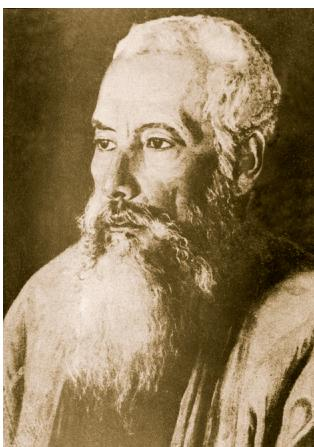  
Fig. 17 – Dwarkanath Tagore. Dwarkanath Tagore believed that India would develop through westernisation and industrialisation. He invested in shipping, shipbuilding, mining, banking, plantations and insurance.

commercial groups, but they were not directly involved in external trade. They operated within India, carrying goods from one place to another, banking money, transferring funds between cities, and financing traders. When opportunities of investment in industries opened up, many of them set up factories.

As colonial control over Indian trade tightened, the space within which Indian merchants could function became increasingly limited. They were barred from trading with Europe in manufactured goods, and had to export mostly raw materials and food grains – raw cotton, opium, wheat and indigo – required by the British. They were also gradually edged out of the shipping business.

Till the First World War, European Managing Agencies in fact controlled a large sector of Indian industries. Three of the biggest ones were Bird Heiglers & Co., Andrew Yule, and Jardine Skinner & Co. These Agencies mobilised capital, set up joint-stock companies and managed them. In most instances Indian financiers provided the capital while the European Agencies made all investment and business decisions. The European merchant-industrialists had their own chambers of commerce which Indian businessmen were not allowed to join.

  
Fig. 18 – Partners in enterprise – J.N. Tata, R.D. Tata, Sir R.J. Tata, and Sir D.J. Tata. In 1912, J.N. Tata set up the first iron and steel works in India at Jamshedpur. Iron and steel industries in India started much later than textiles. In colonial India industrial machinery, railways and locomotives were mostly imported. So capital goods industries could not really develop in any significant way till Independence.

### 4.2 Where Did the Workers Come From?

Factories needed workers. With the expansion of factories, this demand increased. In 1901, there were 584,000 workers in Indian factories. By 1946 the number was over 2,436, 000. Where did the workers come from?

In most industrial regions workers came from the districts around. Peasants and artisans who found no work in the village went to the industrial centres in search of work. Over 50 per cent workers in the Bombay cotton industries in 1911 came from the neighbouring district of Ratnagiri, while the mills of Kanpur got most of their textile hands from the villages within the district of Kanpur. Most often millworkers moved between the village and the city, returning to their village homes during harvests and festivals.

Over time, as news of employment spread, workers travelled great distances in the hope of work in the mills. From the United Provinces, for instance, they went to work in the textile mills of Bombay and in the jute mills of Calcutta.

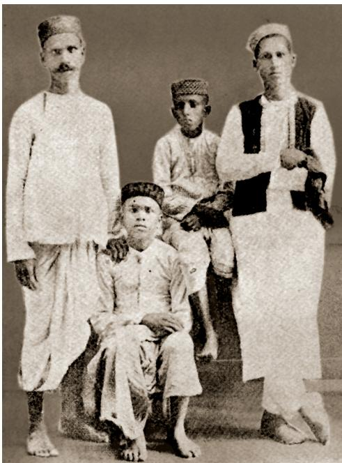  
Fig. 19 – Young workers of a Bombay mill, early twentieth century. When workers went back to their village homes, they liked dressing up.

Getting jobs was always difficult, even when mills multiplied and the demand for workers increased. The numbers seeking work were always more than the jobs available. Entry into the mills was also restricted. Industrialists usually employed a jobber to get new recruits. Very often the jobber was an old and trusted worker. He got people from his village, ensured them jobs, helped them settle in the city and provided them money in times of crisis. The jobber therefore became a person with some authority and power. He began demanding money and gifts for his favour and controlling the lives of workers.

The number of factory workers increased over time. However, as you will see, they were a small proportion of the total industrial workforce.

## Source E

Vasant Parkar, who was once a millworker in Bombay, said:

‘The workers would pay the jobbers money to get their sons work in the mill … The mill worker was closely associated with his village, physically and emotionally. He would go home to cut the harvest and for sowing. The Konkani would go home to cut the paddy and the Ghati, the sugarcane. It was an accepted practice for which the mills granted leave.’

Meena Menon and Neera Adarkar, One Hundred Years: One Hundred Voices， 2004.

Fig. 21 – Spinners at work in an Ahmedabad mill.   
  
Women worked mostly in the spinning departments.

Fig. 20 – A head jobber.   
  
Notice how the posture and clothes emphasise the jobber’s position of authority.

## Source F

Bhai Bhosle, a trade unionist of Bombay, recollected his childhood in the 1930s and 1940s: ‘In those days, the shift was 10 hours – from 5 pm to 3 am – terrible working hours. My father worked for 35 years; he got the asthma like disease and could not work any more…Then my father went back to village.’

Meena Menon and Neera Adarkar, One Hundred Years: One Hundred Voices.

Source

## 5 The Peculiarities of Industrial Growth

European Managing Agencies, which dominated industrial production in India, were interested in certain kinds of products. They established tea and coffee plantations, acquiring land at cheap rates from the colonial government; and they invested in mining, indigo and jute. Most of these were products required primarily for export trade and not for sale in India.

When Indian businessmen began setting up industries in the late nineteenth century, they avoided competing with Manchester goods in the Indian market. Since yarn was not an important part of British imports into India, the early cotton mills in India produced coarse cotton yarn (thread) rather than fabric. When yarn was imported it was only of the superior variety. The yarn produced in Indian spinning mills was used by handloom weavers in India or exported to China.

By the first decade of the twentieth century a series of changes affected the pattern of industrialisation. As the swadeshi movement gathered momentum, nationalists mobilised people to boycott foreign cloth. Industrial groups organised themselves to protect their collective interests, pressurising the government to increase tariff protection and grant other concessions. From 1906, moreover, the export of Indian yarn to China declined since produce from Chinese and

Japanese mills flooded the Chinese market. So industrialists in India began shifting from yarn to cloth production. Cotton piecegoods production in India doubled between 1900 and 1912.

Yet, till the First World War, industrial growth was slow. The war created a dramatically new situation. With British mills busy with war production to meet the needs of the army, Manchester imports into India declined. Suddenly, Indian mills had a vast home market to supply. As the war prolonged, Indian factories were called upon to supply war needs: jute bags, cloth for army uniforms, tents and leather boots, horse and mule saddles and a host of other items. New factories were set up and old

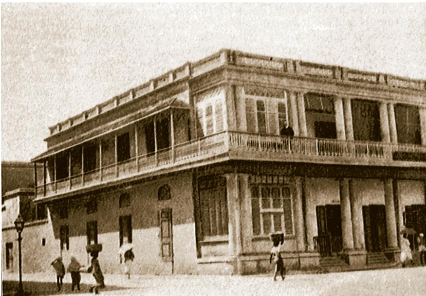  
Fig. 22 – The first office of the Madras Chamber of Commerce. By the late nineteenth century merchants in different regions began meeting and forming Chambers of Commerce to regulate business and decide on issues of collective concern.

ones ran multiple shifts. Many new workers were employed and everyone was made to work longer hours. Over the war years industrial production boomed.

After the war, Manchester could never recapture its old position in the Indian market. Unable to modernise and compete with the US, Germany and Japan, the economy of Britain crumbled after the war. Cotton production collapsed and exports of cotton cloth from Britain fell dramatically. Within the colonies, local industrialists gradually consolidated their position, substituting foreign manufactures and capturing the home market.

### 5.1 Small-scale Industries Predominate

While factory industries grew steadily after the war, large industries formed only a small segment of the economy. Most of them – about 67 per cent in 1911 – were located in Bengal and Bombay. Over the rest of the country, small-scale production continued to predominate. Only a small proportion of the total industrial labour force worked in registered factories: 5 per cent in 1911 and 10 per cent in 1931. The rest worked in small workshops and household units, often located in alleys and bylanes, invisible to the passer-by.

In fact, in some instances, handicrafts production actually expanded in the twentieth century. This is true even in the case of the handloom sector that we have discussed. While cheap machine-made thread wiped out the spinning industry in the nineteenth century, the weavers survived, despite problems. In the twentieth century, handloom cloth production expanded steadily: almost trebling between 1900 and 1940.

How did this happen?

This was partly because of technological changes. Handicrafts people adopt new technology if that helps them improve production without excessively pushing up costs. So, by the second decade of the twentieth century we find weavers using looms with a fly shuttle. This increased productivity per worker, speeded up production and reduced labour demand. By 1941, over 35 per cent of handlooms in India were fitted with fly shuttles: in regions like Travancore, Madras, Mysore, Cochin, Bengal the proportion was 70 to 80 per cent. There were several other small innovations that helped weavers improve their productivity and compete with the mill sector.

  
Fig. 23 – A Hand-woven Cloth.

The intricate designs of hand-woven cloth could not be easily copied by the mills.

## New words

Fly shuttle – It is a mechanical device used for weaving, moved by means of ropes and pullies. It places the horizontal threads ( called the weft) into the verticle threads (called the warp). The invention of the fly shuttle made it possible for weavers to operate large looms and weave wide pieces of cloth.

Certain groups of weavers were in a better position than others to survive the competition with mill industries. Amongst weavers some produced coarse cloth while others wove finer varieties. The coarser cloth was bought by the poor and its demand fluctuated violently. In times of bad harvests and famines, when the rural poor had little to eat, and their cash income disappeared, they could not possibly buy cloth. The demand for the finer varieties bought by the well-to-do was more stable. The rich could buy these even when the poor starved. Famines did not affect the sale of Banarasi or Baluchari saris. Moreover, as you have seen, mills could not imitate specialised weaves. Saris with woven borders, or the famous lungis and handkerchiefs of Madras, could not be easily displaced by mill production.

Weavers and other craftspeople who continued to expand production through the twentieth century, did not necessarily prosper. They lived hard lives and worked long hours. Very often the entire household – including all the women and children – had to work at various stages of the production process. But they were not simply remnants of past times in the age of factories. Their life and labour was integral to the process of industrialisation.

  
Fig. 24 – Location of large-scale industries in India, 1931. The circles indicate the size of industries in the different regions.

## 6 Market for Goods

We have seen how British manufacturers attempted to take over the Indian market, and how Indian weavers and craftsmen, traders and industrialists resisted colonial controls, demanded tariff protection, created their own spaces, and tried to extend the market for their produce.

But when new products are produced people have to be persuaded to buy them. They have to feel like using the product. How was this done?

One way in which new consumers are created is through advertisements. As you know, advertisements make products appear desirable and necessary. They try to shape the minds of people and create new needs. Today we live in a world where advertisements surround us. They appear in newspapers, magazines, hoardings, street walls, television screens. But if we look back into history we find that from the very beginning of the industrial age, advertisements have played a part in expanding the markets for products, and in shaping a new consumer culture.

When Manchester industrialists began selling cloth in India, they put labels on the cloth bundles. The label was needed to make the place of manufacture and the name of the company familiar to the buyer. The label was also to be a mark of quality. When buyers saw ‘MADE IN MANCHESTER’ written in bold on the label, they were expected to feel confident about buying the cloth.

  
Fig. 25 – Gripe Water calendar of 1928 by M.V. Dhurandhar.

The image of baby Krishna was most commonly used to popularise baby products.

  
Fig. 26(a)

  
Fig. 26(b) – Maharaja Ranjit Singh on a Manchester label.

Fig. 26(b)

Fig. 26(a) – Manchester labels, early twentieth century.

Images of numerous Indian gods and goddesses – Kartika, Lakshmi,

Saraswati – are shown in imported cloth labels approving the quality of the product being marketed.

Historic figures are used to create respect for the product.

But labels did not only carry words and texts. They also carried images and were very often beautifully illustrated. If we look at these old labels, we can have some idea of the mind of the manufacturers, their calculations, and the way they appealed to the people.

Images of Indian gods and goddesses regularly appeared on these labels. It was as if the association with gods gave divine approval to the goods being sold. The imprinted image of Krishna or Saraswati was also intended to make the manufacture from a foreign land appear somewhat familiar to Indian people.

By the late nineteenth century, manufacturers were printing calendars to popularise their products. Unlike newspapers and magazines, calendars were used even by people who could not read. They were hung in tea shops and in poor people’s homes just as much as in offices and middle-class apartments. And those who hung the calendars had to see the advertisements, day after day, through the year. In these calendars, once again, we see the figures of gods being used to sell new products.

Like the images of gods, figures of important personages, of emperors and nawabs, adorned advertisement and calendars. The message very often seemed to say: if you respect the royal figure, then respect this product; when the product was being used by kings, or produced under royal command, its quality could not be questioned.

When Indian manufacturers advertised the nationalist message was clear and loud. If you care for the nation then buy products that Indians produce. Advertisements became a vehicle of the nationalist message of swadeshi.

## Conclusion

Clearly, the age of industries has meant major technological changes, growth of factories, and the making of a new industrial labour force. However, as you have seen, hand technology and small-scale production remained an important part of the industrial landscape.

Look again at Figs. 1 and 2. What would you now say of the images they project?

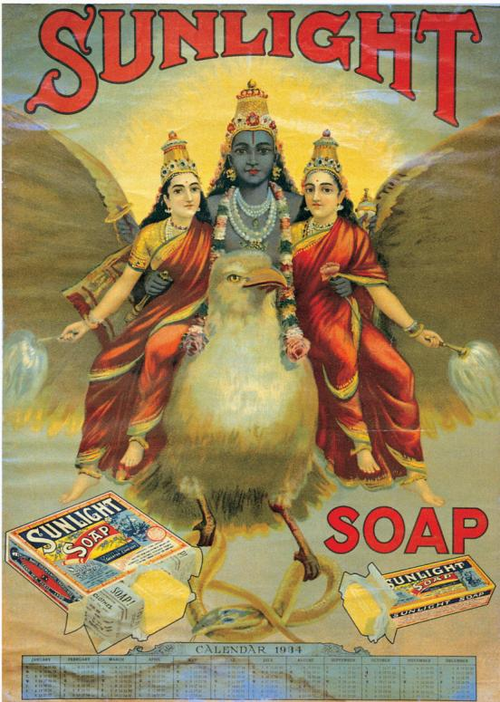  
Fig. 27 – Sunlight soap calendar of 1934. Here God Vishnu is shown bringing sunlight from across the skies.

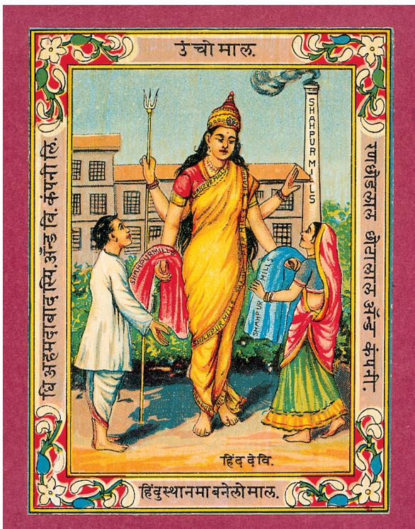  
Fig. 28 – An Indian mill cloth label.   
The goddess is shown offering cloth produced in an Ahmedabad mill, and asking people to use things made in India.

## Write in brief

1. Explain the following:

a) Women workers in Britain attacked the Spinning Jenny.   
b) In the seventeenth century merchants from towns in Europe began employing peasants and artisans within the villages.   
c) The port of Surat declined by the end of the eighteenth century.   
d) The East India Company appointed gomasthas to supervise weavers in India.

2. Write True or False against each statement:

a) At the end of the nineteenth century, 80 per cent of the total workforce in Europe was employed in the technologically advanced industrial sector.   
b) The international market for fine textiles was dominated by India till the eighteenth century.   
c) The American Civil War resulted in the reduction of cotton exports from India.   
d) The introduction of the fly shuttle enabled handloom workers to improve their productivity.

3. Explain what is meant by proto-industrialisation.

## Discuss

1. Why did some industrialists in nineteenth-century Europe prefer hand labour over machines?   
2. How did the East India Company procure regular supplies of cotton and silk textiles from Indian weavers?   
3. Imagine that you have been asked to write an article for an encyclopaedia on Britain and the history of cotton. Write your piece using information from the entire chapter.   
4. Why did industrial production in India increase during the First World War?

## Project work

## Project

Select any one industry in your region and find out its history. How has the technology changed? Where do the workers come from? How are the products advertised and marketed? Try and talk to the employers and some workers to get their views about the industry’s history.

# chapter 5
# Print Culture and the Modern World

It is difficult for us to imagine a world without printed matter. We find evidence of print everywhere around us – in books, journals, newspapers, prints of famous paintings, and also in everyday things like theatre programmes, official circulars, calendars, diaries, advertisements, cinema posters at street corners. We read printed literature, see printed images, follow the news through newspapers, and track public debates that appear in print. We take for granted this world of print and often forget that there was a time before print. We may not realise that print itself has a history which has, in fact, shaped our contemporary world. What is this history? When did printed literature begin to circulate? How has it helped create the modern world?

In this chapter we will look at the development of print, from its beginnings in East Asia to its expansion in Europe and in India. We will understand the impact of the spread of technology and consider how social lives and cultures changed with the coming of print.

  
Fig. 1 – Book making before the age of print, from Akhlaq-i-Nasiri, 1595.

This is a royal workshop in the sixteenth century, much before printing began in India. You can see the text being dictated, written and illustrated. The art of writing and illustrating by hand was important in the age before print. Think about what happened to these forms of art with the coming of printing machines.

## 1 The First Printed Books

The earliest kind of print technology was developed in China, Japan and Korea. This was a system of hand printing. From AD 594 onwards, books in China were printed by rubbing paper – also invented there – against the inked surface of woodblocks. As both sides of the thin, porous sheet could not be printed, the traditional Chinese ‘accordion book’ was folded and stitched at the side. Superbly skilled craftsmen could duplicate, with remarkable accuracy, the beauty of calligraphy.

The imperial state in China was, for a very long time, the major producer of printed material. China possessed a huge bureaucratic system which recruited its personnel through civil service examinations. Textbooks for this examination were printed in vast numbers under the sponsorship of the imperial state. From the sixteenth century, the number of examination candidates went up and that increased the volume of print.

By the seventeenth century, as urban culture bloomed in China, the uses of print diversified. Print was no longer used just by scholarofficials. Merchants used print in their everyday life, as they collected trade information. Reading increasingly became a leisure activity. The new readership preferred fictional narratives, poetry, autobiographies, anthologies of literary masterpieces, and romantic plays. Rich women began to read, and many women began publishing their poetry and plays. Wives of scholar-officials published their works and courtesans wrote about their lives.

This new reading culture was accompanied by a new technology. Western printing techniques and mechanical presses were imported in the late nineteenth century as Western powers established their outposts in China. Shanghai became the hub of the new print culture, catering to the Western-style schools. From hand printing there was now a gradual shift to mechanical printing.

### 1.1 Print in Japan

Buddhist missionaries from China introduced hand-printing technology into Japan around AD 768-770. The oldest Japanese book, printed in AD 868, is the Buddhist Diamond Sutra, containing six sheets of text and woodcut illustrations. Pictures were printed on textiles,

## New words

Calligraphy – The art of beautiful and stylised writing

  
Fig. 2 a – A page from the Diamond Sutra.

playing cards and paper money. In medieval Japan, poets and prose writers were regularly published, and books were cheap and abundant.

Printing of visual material led to interesting publishing practices. In the late eighteenth century, in the flourishing urban circles at Edo (later to be known as Tokyo), illustrated collections of paintings

depicted an elegant urban culture, involving artists, courtesans, and teahouse gatherings. Libraries and bookstores were packed with hand-printed material of various types – books on women, musical instruments, calculations, tea ceremony, flower arrangements, proper etiquette, cooking and famous places.

Belonging to the mid-13th century, printing woodblocks of the Tripitaka Koreana are a Korean collection of Buddhist scriptures. They were engraved on about 80,000 woodblocks. They were inscribed on the UNESCO Memory of the World Register in 2007.

Source: http://www.cha.go.kr

  
Fig. 2b – Tripitaka Koreana

## Box 1

Kitagawa Utamaro, born in Edo in 1753, was widely known for his contributions to an art form called ukiyo (‘pictures of the floating world’) or depiction of ordinary human experiences, especially urban ones. These prints travelled to contemporary US and Europe and influenced artists like Manet, Monet and Van Gogh. Publishers like Tsutaya Juzaburo identified subjects and commissioned artists who drew the theme in outline. Then a skilled woodblock carver pasted the drawing on a woodblock and carved a printing block to reproduce the painter’s lines. In the process, the original drawing would be destroyed and only prints would survive.

  
Fig. 3 – An ukiyo print by Kitagawa Utamaro.

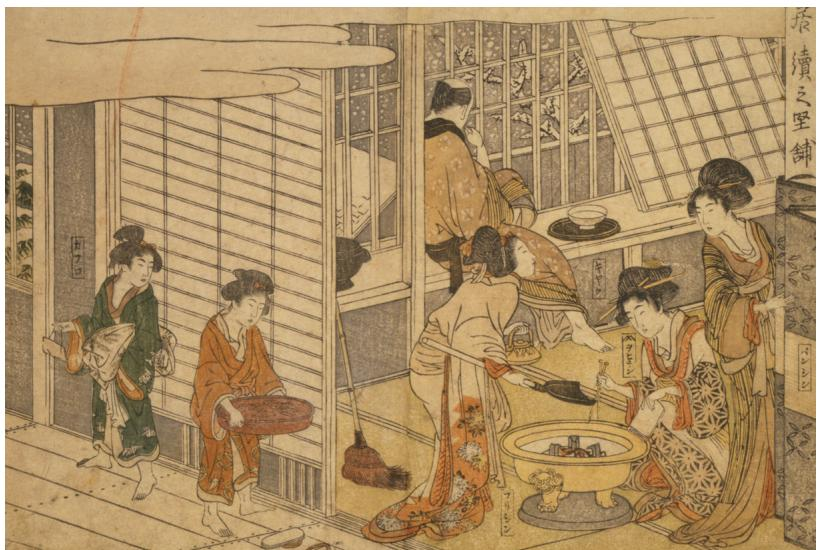  
Fig. 4a – A morning scene, ukiyo print by Shunman Kubo, late eighteenth century.

A man looks out of the window at the snowfall while women prepare tea and perform other domestic duties.

## 2 Print Comes to Europe

For centuries, silk and spices from China flowed into Europe through the silk route. In the eleventh century, Chinese paper reached Europe via the same route. Paper made possible the production of manuscripts, carefully written by scribes. Then, in 1295, Marco Polo, a great explorer, returned to Italy after many years of exploration in China. As you read above, China already had the technology of woodblock printing. Marco Polo brought this knowledge back with him. Now Italians began producing books with woodblocks, and soon the technology spread to other parts of Europe. Luxury editions were still handwritten on very expensive vellum, meant for aristocratic circles and rich monastic libraries which scoffed at printed books as cheap vulgarities. Merchants and students in the university towns bought the cheaper printed copies.

As the demand for books increased, booksellers all over Europe began exporting books to many different countries. Book fairs were held at different places. Production of handwritten manuscripts was also organised in new ways to meet the expanded demand. Scribes or skilled handwriters were no longer solely employed by wealthy or influential patrons but increasingly by booksellers as well. More than 50 scribes often worked for one bookseller.

But the production of handwritten manuscripts could not satisfy the ever-increasing demand for books. Copying was an expensive, laborious and time-consuming business. Manuscripts were fragile, awkward to handle, and could not be carried around or read easily. Their circulation therefore remained limited. With the growing demand for books, woodblock printing gradually became more and more popular. By the early fifteenth century, woodblocks were being widely used in Europe to print textiles, playing cards, and religious pictures with simple, brief texts.

There was clearly a great need for even quicker and cheaper reproduction of texts. This could only be with the invention of a new print technology. The breakthrough occurred at Strasbourg, Germany, where Johann Gutenberg developed the first-known printing press in the 1430s.

## New words

Vellum – A parchment made from the skin of animals

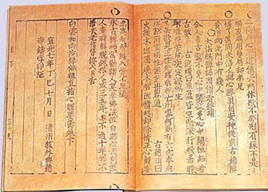  
Fig. 4b – Jikji

The Jikji of Korea is among the world’s oldest existing books printed with movable metal type. It contains the essential features of Zen Buddhism. About 150 monks of India, China and Korea are mentioned in the book. It was printed in late 14th century. While the first volume of the book is unavailable, the second one is available in the National Library of France. This work marked an important technical change in the print culture. That is why it was inscribed on the UNESCO Memory of the World Register in 2001.

### Activity

Imagine that you are Marco Polo. Write a letter from China to describe the world of print which you have seen there.

### 2.1 Gutenberg and the Printing Press

Gutenberg was the son of a merchant and grew up on a large agricultural estate. From his childhood he had seen wine and olive presses. Subsequently, he learnt the art of polishing stones, became a master goldsmith, and also acquired the expertise to create lead moulds used for making trinkets. Drawing on this knowledge, Gutenberg adapted existing technology to design his innovation. The olive press provided the model for the printing press, and moulds were used for casting the metal types for the letters of the alphabet. By 1448, Gutenberg perfected the system. The first book he printed was the Bible. About 180 copies were printed and it took three years to produce them. By the standards of the time this was fast production.

The new technology did not entirely displace the existing art of producing books by hand.

In fact, printed books at first closely resembled the written manuscripts in appearance and layout. The metal letters imitated the ornamental handwritten styles. Borders were illuminated by hand with foliage and other patterns, and illustrations were painted. In the books printed for the rich, space for decoration was kept blank on the printed page. Each purchaser could choose the design and decide on the painting school that would do the illustrations.

In the hundred years between 1450 and 1550, printing presses were set up in most countries of Europe. Printers from Germany travelled to other countries, seeking work and helping start new presses. As the number of printing presses grew, book production boomed. The second half of the fifteenth century saw 20 million copies of printed books flooding the markets in Europe. The number went up in the sixteenth century to about 200 million copies.

This shift from hand printing to mechanical printing led to the print revolution.

## New words

Platen – In letterpress printing, platen is a board which is pressed onto the back of the paper to get the impression from the type. At one time it used to be a wooden board; later it was made of steel

  
Fig. 5 – A Portrait of Johann Gutenberg, 1584.

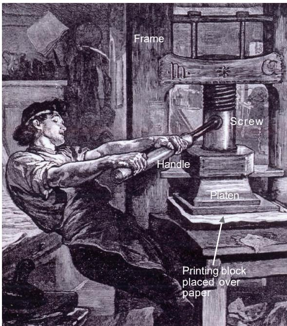  
Fig. 6 – Gutenberg Printing Press.

Notice the long handle attached to the screw. This handle was used to turn the screw and press down the platen over the printing block that was placed on top of a sheet of damp paper. Gutenberg developed metal types for each of the 26 characters of the Roman alphabet and devised a way of moving them around so as to compose different words of the text. This came to be known as the moveable type printing machine, and it remained the basic print technology over the next 300 years. Books could now be produced much faster than was possible when each print block was prepared by carving a piece of wood by hand. The Gutenberg press could print 250 sheets on one side per hour.

  
Fig. 7 – Pages of Gutenberg’s Bible, the first printed book in Europe.

Gutenberg printed about 180 copies, of which no more than 50 have survived.

Look at these pages of Gutenberg’s Bible carefully. They were not just products of new technology. The text was printed in the new Gutenberg press with metal type, but the borders were carefully designed, painted and illuminated by hand by artists. No two copies were the same. Every page of each copy was different. Even when two copies look similar, a careful comparison will reveal differences. Elites everywhere preferred this lack of uniformity: what they possessed then could be claimed as unique, for no one else owned a copy that was exactly the same.

In the text you will notice the use of colour within the letters in various places. This had two functions: it added colour to the page, and highlighted all the holy words to emphasise their significance. But the colour on every page of the text was added by hand. Gutenberg printed the text in black, leaving spaces where the colour could be filled in later.

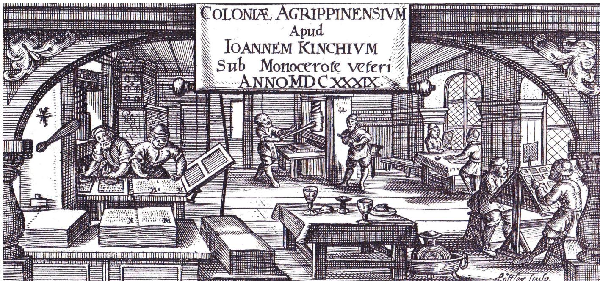  
Fig. 8 – A printer’s workshop, sixteenth century.

This picture depicts what a printer’s shop looked like in the sixteenth century. All the activities are going on under one roof. In the foreground on the right, compositors are at work, while on the left galleys are being prepared and ink is being applied on the metal types; in the background, the printers are turning the screws of the press, and near them proofreaders are at work. Right in front is the final product – the double-page printed sheets, stacked in neat piles, waiting to be bound.

## New words

Compositor – The person who composes the text for printing

Galley – Metal frame in which types are laid and the text composed

## 3 The Print Revolution and Its Impact

What was the print revolution? It was not just a development, a new way of producing books; it transformed the lives of people, changing their relationship to information and knowledge, and with institutions and authorities. It influenced popular perceptions and opened up new ways of looking at things.

Let us explore some of these changes.

### 3.1 A New Reading Public

With the printing press, a new reading public emerged. Printing reduced the cost of books. The time and labour required to produce each book came down, and multiple copies could be produced with greater ease. Books flooded the market, reaching out to an ever-growing readership.

Access to books created a new culture of reading. Earlier, reading was restricted to the elites. Common people lived in a world of oral culture. They heard sacred texts read out, ballads recited, and folk tales narrated. Knowledge was transferred orally. People collectively heard a story, or saw a performance. As you will see in Chapter 8, they did not read a book individually and silently. Before the age of print, books were not only expensive but they could not be produced in sufficient numbers. Now books could reach out to wider sections of people. If earlier there was a hearing public, now a reading public came into being.

But the transition was not so simple. Books could be read only by the literate, and the rates of literacy in most European countries were very low till the twentieth century. How, then, could publishers persuade the common people to welcome the printed book? To do this, they had to keep in mind the wider reach of the printed work: even those who did not read could certainly enjoy listening to books being read out. So printers began publishing popular ballads and folk tales, and such books would be profusely illustrated with pictures. These were then sung and recited at gatherings in villages and in taverns in towns.

Oral culture thus entered print and printed material was orally transmitted. The line that separated the oral and reading cultures became blurred. And the hearing public and reading public became intermingled.

### Activity

You are a bookseller advertising the availability of new cheap printed books. Design a poster for your shop window.

## New words

Ballad – A historical account or folk tale in verse, usually sung or recited Taverns – Places where people gathered to drink alcohol, to be served food, and to meet friends and exchange news

### 3.2 Religious Debates and the Fear of Print

Print created the possibility of wide circulation of ideas, and introduced a new world of debate and discussion. Even those who disagreed with established authorities could now print and circulate their ideas. Through the printed message, they could persuade people to think differently, and move them to action. This had significance in different spheres of life.

Not everyone welcomed the printed book, and those who did also had fears about it. Many were apprehensive of the effects that the easier access to the printed word and the wider circulation of books, could have on people’s minds. It was feared that if there was no control over what was printed and read then rebellious and irreligious thoughts might spread. If that happened the authority of ‘valuable’ literature would be destroyed. Expressed by religious authorities and monarchs, as well as many writers and artists, this anxiety was the basis of widespread criticism of the new printed literature that had begun to circulate.

Let us consider the implication of this in one sphere of life in early modern Europe – namely, religion.

In 1517, the religious reformer Martin Luther wrote Ninety Five Theses criticising many of the practices and rituals of the Roman Catholic Church. A printed

copy of this was posted on a church door in Wittenberg. It challenged the Church to debate his ideas. Luther’s writings were immediately reproduced in vast numbers and read widely. This lead to a division within the Church and to the beginning of the Protestant

Reformation. Luther’s translation of the New Testament sold 5,000 copies within a few weeks and a second edition appeared within three months. Deeply grateful to print, Luther said, ‘Printing is the ultimate gift of God and the greatest one.’ Several scholars, in fact, think that print brought about a new intellectual atmosphere and helped spread the new ideas that led to the Reformation.

Fig. 9 – J.V. Schley, L’Imprimerie, 1739.   
  
This is one of the many images produced in early modern Europe, celebrating the coming of print. You can see the printing press descending from heaven, carried by a goddess. On two sides of the goddess, blessing the machine, are Minerva (the goddess of wisdom) and Mercury (the messenger god, also symbolising reason). The women in the foreground are holding plaques with the portraits of six pioneer printers of different countries. In the middle ground on the left (figure encircled) is the portrait of Gutenberg.

## New words

Protestant Reformation – A sixteenth-century movement to reform the Catholic Church dominated by Rome. Martin Luther was one of the main Protestant reformers. Several traditions of anti-Catholic Christianity developed out of the movement

### 3.3 Print and Dissent

Print and popular religious literature stimulated many distinctive individual interpretations of faith even among little-educated working people. In the sixteenth century, Menocchio, a miller in Italy, began to read books that were available in his locality. He reinterpreted the message of the Bible and formulated a view of God and Creation that enraged the Roman Catholic Church. When the Roman Church began its inquisition to repress heretical ideas, Menocchio was hauled up twice and ultimately executed. The Roman Church, troubled by such effects of popular readings and questionings of faith, imposed severe controls over publishers and booksellers and began to maintain an Index of Prohibited Books from 1558 .

Fig. 10 – The macabre dance.   
  
This sixteenth-century print shows how the fear of printing was dramatised in visual representations of the time. In this highly interesting woodcut the coming of print is associated with the end of the world. The interior of the printer’s workshop here is the site of a dance of death. Skeletal figures control the printer and his workers, define and dictate what is to be done and what is to be produced.

## Discuss

Write briefly why some people feared that the development of print could lead to the growth of dissenting ideas.

## New words

Inquisition – A former Roman Catholic court for identifying and punishing heretics

Heretical – Beliefs which do not follow the accepted teachings of the Church. In medieval times, heresy was seen as a threat to the right of the Church to decide on what should be believed and what should not. Heretical beliefs were severely punished

Satiety – The state of being fulfilled much beyond the point of satisfaction

Seditious – Action, speech or writing that is seen as opposing the government

## Source A

## Fear of the book

Erasmus, a Latin scholar and a Catholic reformer, who criticised the excesses of Catholicism but kept his distance from Luther, expressed a deep anxiety about printing. He wrote in Adages (1508):

‘To what corner of the world do they not fly, these swarms of new books? It may be that one here and there contributes something worth knowing, but the very multitude of them is hurtful to scholarship, because it creates a glut, and even in good things satiety is most harmful ... [printers] fill the world with books, not just trifling things (such as I write, perhaps), but stupid, ignorant, slanderous, scandalous, raving, irreligious and seditious books, and the number of them is such that even the valuable publications lose their value.’

Source

## 4 The Reading Mania

Through the seventeenth and eighteenth centuries literacy rates went up in most parts of Europe. Churches of different denominations set up schools in villages, carrying literacy to peasants and artisans. By the end of the eighteenth century, in some parts of Europe literacy rates were as high as 60 to 80 per cent. As literacy and schools spread in European countries, there was a virtual reading mania. People wanted books to read and printers produced books in everincreasing numbers.

New forms of popular literature appeared in print, targeting new audiences. Booksellers employed pedlars who roamed around villages, carrying little books for sale. There were almanacs or ritual calendars, along with ballads and folktales. But other forms of reading matter, largely for entertainment, began to reach ordinary readers as well. In England, penny chapbooks were carried by petty pedlars known as chapmen, and sold for a penny, so that even the poor could buy them. In France, were the “Biliotheque Bleue”, which were low-priced small books printed on poor quality paper, and bound in cheap blue covers. Then there were the romances, printed on four to six pages, and the more substantial ‘histories’ which were stories about the past. Books were of various sizes, serving many different purposes and interests.

The periodical press developed from the early eighteenth century, combining information about current affairs with entertainment. Newspapers and journals carried information about wars and trade, as well as news of developments in other places.

Similarly, the ideas of scientists and philosophers now became more accessible to the common people. Ancient and medieval scientific texts were compiled and published, and maps and scientific diagrams were widely printed. When scientists like Isaac Newton began to publish their discoveries, they could influence a much wider circle of scientifically minded readers. The writings of thinkers such as Thomas Paine, Voltaire and Jean Jacques Rousseau were also widely printed and read. Thus their ideas about science, reason and rationality found their way into popular literature.

## New words

Denominations – Sub groups within a religion Almanac – An annual publication giving astronomical data, information about the movements of the sun and moon, timing of full tides and eclipses, and much else that was of importance in the everyday life of people Chapbook – A term used to describe pocketsize books that are sold by travelling pedlars called chapmen. These became popular from the time of the sixteenth-century print revolution

## Box 2

In 1791, a London publisher, James Lackington, wrote in his diary:

‘The sale of books in general has increased prodigiously within the last twenty years. The poorer sort of farmers and even the poor country people in general who before that period spent their winter evenings in relating stories of witches, ghosts, hobgoblins … now shorten the winter night by hearing their sons and daughters read them tales, romances, etc. If John goes to town with a load of hay, he is charged to be sure not to forget to bring home Peregrine Pickle’s Adventure ... and when Dolly is sent to sell her eggs, she is commissioned to purchase The History of Joseph Andrews.'

### 4.1 ‘Tremble, therefore, tyrants of the world!’

By the mid-eighteenth century, there was a common conviction that books were a means of spreading progress and enlightenment. Many believed that books could change the world, liberate society from despotism and tyranny, and herald a time when reason and intellect would rule. Louise-Sebastien Mercier, a novelist in eighteenth-century France, declared: ‘The printing press is the most powerful engine of progress and public opinion is the force that will sweep despotism away.’ In many of Mercier’s novels, the heroes are transformed by acts of reading. They devour books, are lost in the world books create, and become enlightened in the process. Convinced of the power of print in bringing enlightenment and destroying the basis of despotism, Mercier proclaimed: ‘Tremble, therefore, tyrants of the world! Tremble before the virtual writer!’

### 4.2 Print Culture and the French Revolution

Many historians have argued that print culture created the conditions within which French Revolution occurred. Can we make such a connection?

Three types of arguments have been usually put forward.

First: print popularised the ideas of the Enlightenment thinkers. Collectively, their writings provided a critical commentary on tradition, superstition and despotism. They argued for the rule of reason rather than custom, and demanded that everything be judged through the application of reason and rationality. They attacked the sacred authority of the Church and the despotic power of the state, thus eroding the legitimacy of a social order based on tradition. The writings of Voltaire and Rousseau were read widely; and those who read these books saw the world through new eyes, eyes that were questioning, critical and rational.

Second: print created a new culture of dialogue and debate. All values, norms and institutions were re-evaluated and discussed by a public that had become aware of the power of reason, and recognised the need to question existing ideas and beliefs. Within this public culture, new ideas of social revolution came into being.

Third: by the 1780s there was an outpouring of literature that mocked the royalty and criticised their morality. In the process, it raised

## Source B

This is how Mercier describes the impact of the printed word, and the power of reading in one of his books:

‘Anyone who had seen me reading would have compared me to a man dying of thirst who was gulping down some fresh, pure water … Lighting my lamp with extraordinary caution, I threw myself hungrily into the reading. An easy eloquence, effortless and animated, carried me from one page to the next without my noticing it. A clock struck off the hours in the silence of the shadows, and I heard nothing. My lamp began to run out of oil and produced only a pale light, but still I read on. I could not even take out time to raise the wick for fear of interrupting my pleasure. How those new ideas rushed into my brain! How my intelligence adopted them!’

Quoted by Robert Darnton, The Forbidden Best-SellersofPre-Revolutionary France,1995.

Source

## New words

Despotism – A system of governance in which absolute power is exercised by an individual, unregulated by legal and constitutional checks

questions about the existing social order. Cartoons and caricatures typically suggested that the monarchy remained absorbed only in sensual pleasures while the common people suffered immense hardships. This literature circulated underground and led to the growth of hostile sentiments against the monarchy.

How do we look at these arguments? There can be no doubt that print helps the spread of ideas. But we must remember that people did not read just one kind of literature. If they read the ideas of Voltaire and Rousseau, they were also exposed to monarchical and Church propaganda. They were not influenced directly by everything they read or saw. They accepted some ideas and rejected others. They interpreted things their own way. Print did not directly shape their minds, but it did open up the possibility of thinking differently.

### Activity

Imagine that you are a cartoonist in France before the revolution. Design a cartoon as it would have appeared in a pamphlet.

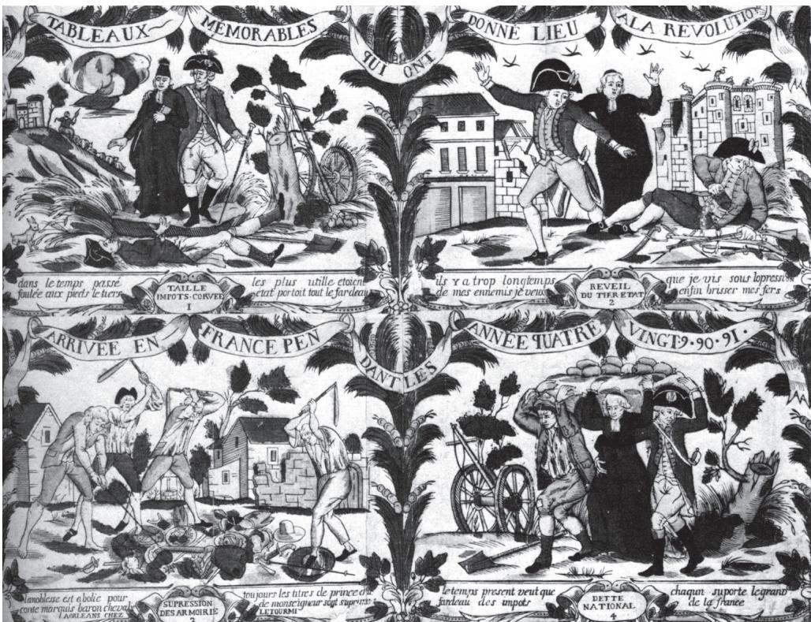  
Fig. 11 – The nobility and the common people before the French Revolution,  a cartoon of the late eighteenth century.

The cartoon shows how the ordinary people – peasants, artisans and workers – had a hard time while the nobility enjoyed life and oppressed them. Circulation of cartoons like this one had an impact on the thinking of people before the revolution.

## Discuss

Why do some historians think that print culture created the basis for the French Revolution?

## 5 The Nineteenth Century

The nineteenth century saw vast leaps in mass literacy in Europe, bringing in large numbers of new readers among children, women and workers.

### 5.1 Children, Women and Workers

As primary education became compulsory from the late nineteenth century, children became an important category of readers. Production of school textbooks became critical for the publishing industry. A children’s press, devoted to literature for children alone, was set up in France in 1857. This press published new works as well as old fairy tales and folk tales. The Grimm Brothers in Germany spent years compiling traditional folk tales gathered from peasants. What they collected was edited before the stories were published in a collection in 1812. Anything that was considered unsuitable for children or would appear vulgar to the elites, was not included in the published version. Rural folk tales thus acquired a new form. In this way, print recorded old tales but also changed them.

Women became important as readers as well as writers. Penny magazines (see Fig. 12) were especially meant for women, as were manuals teaching proper behaviour and housekeeping. When novels began to be written in the nineteenth century, women were seen as important readers. Some of the best-

known novelists were women: Jane Austen, the Bronte sisters, George Eliot. Their writings became important in defining a new type of woman: a person with will, strength of personality, determination and the power to think.

Lending libraries had been in existence from the seventeenth century onwards. In the nineteenth century, lending libraries in England became instruments for educating white-collar workers, artisans and lower-middle-class people. Sometimes, self-educated working class people wrote for themselves. After the working day was gradually shortened from the mid-nineteenth century, workers had some time for self-improvement and self-expression. They wrote political tracts and autobiographies in large numbers.

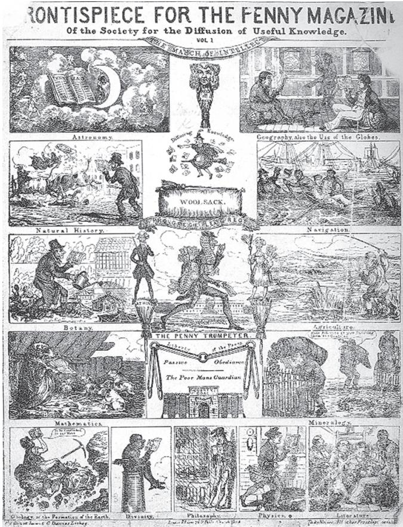  
Fig. 12 – Frontispiece of Penny Magazine. Penny Magazine was published between 1832 and 1835 in England by the Society for the Diffusion of Useful Knowledge. It was aimed primarily at the working class.

## Box 3

Thomas Wood, a Yorkshire mechanic, narrated how he would rent old newspapers and read them by firelight in the evenings as he could not afford candles. Autobiographies of poor people narrated their struggles to read against grim obstacles: the twentieth-century Russian revolutionary author Maxim Gorky’s My Childhood and My University provide glimpses of such struggles.

### 5.2 Further Innovations

By the late eighteenth century, the press came to be made out of metal. Through the nineteenth century, there were a series of further innovations in printing technology. By the mid-nineteenth century, Richard M. Hoe of New York had perfected the power-driven cylindrical press. This was capable of printing 8,000 sheets per hour. This press was particularly useful for printing newspapers. In the late nineteenth century, the offset press was developed which could print up to six colours at a time. From the turn of the twentieth century, electrically operated presses accelerated printing operations. A series of other developments followed. Methods of feeding paper improved, the quality of plates became better, automatic paper reels and photoelectric controls of the colour register were introduced. The accumulation of several individual mechanical improvements transformed the appearance of printed texts.

Printers and publishers continuously developed new strategies to sell their product. Nineteenth-century periodicals serialised important novels, which gave birth to a particular way of writing novels. In the 1920s in England, popular works were sold in cheap series, called the Shilling Series. The dust cover or the book jacket is also a twentieth-century innovation. With the onset of the Great Depression in the 1930s, publishers feared a decline in book purchases. To sustain buying, they brought out cheap paperback editions.

### Activity

Look at Fig. 13. What impact do such advertisements have on the public mind?

Do you think everyone reacts to printed material in the same way?

  
Fig. 13 – Advertisements at a railway station in England, a lithograph by Alfred Concanen, 1874. Printed advertisements and notices were plastered on street walls, railway platforms and public buildings.

## 6 India and the World of Print

Let us see when printing began in India and how ideas and information were written before the age of print.

### 6.1 Manuscripts Before the Age of Print

India had a very rich and old tradition of handwritten manuscripts – in Sanskrit, Arabic, Persian, as well as in various vernacular languages. Manuscripts were copied on palm leaves or on handmade paper. Pages were sometimes beautifully illustrated. They would be either pressed between wooden covers or sewn together to ensure preservation. Manuscripts continued to be produced till well after the introduction of print, down to the late nineteenth century.

Manuscripts, however, were highly expensive and fragile. They had to be handled carefully, and they could not be read easily as the

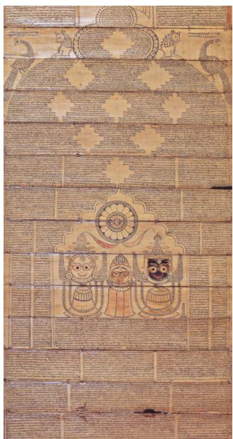  
Fig. 14 – Pages from the Gita Govinda of Jayadeva, eighteenth century. This is a palm-leaf handwritten manuscript in accordion format.

  
Fig. 15 – Pages from the Diwan of Hafiz, 1824. Hafiz was a fourteenth-century poet whose collected works are known as Diwan. Notice the beautiful calligraphy and the elaborate illustration and design. Manuscripts like this continued to be produced for the rich even after the coming of the letterpress.

script was written in different styles. So manuscripts were not widely used in everyday life. Even though pre-colonial Bengal had developed an extensive network of village primary schools, students very often did not read texts. They only learnt to write. Teachers dictated portions of texts from memory and students wrote them down. Many thus became literate without ever actually reading any kinds of texts.

Fig. 16 – Pages from the Rigveda.   
  
Handwritten manuscripts continued to be produced in India till much after the coming of print. This manuscript was produced in the eighteenth century in the Malayalam script.

### 6.2 Print Comes to India

The printing press first came to Goa with Portuguese missionaries in the mid-sixteenth century. Jesuit priests learnt Konkani and printed several tracts. By 1674, about 50 books had been printed in the Konkani and in Kanara languages. Catholic priests printed the first Tamil book in 1579 at Cochin, and in 1713 the first Malayalam book was printed by them. By 1710, Dutch Protestant missionaries had printed 32 Tamil texts, many of them translations of older works.

The English language press did not grow in India till quite late even though the English East India Company began to import presses from the late seventeenth century.

From 1780, James Augustus Hickey began to edit the Bengal Gazette , a weekly magazine that described itself as ‘a commercial paper open to all, but influenced by none’. So it was private English enterprise, proud of its independence from colonial influence, that began English printing in India. Hickey published a lot of advertisements, including those that related to the import and sale of slaves. But he also published a lot of gossip about the Company’s senior officials in India. Enraged by this, Governor-General Warren Hastings persecuted Hickey, and encouraged the publication of officially sanctioned newspapers that could counter the flow of information that damaged the image of the colonial government. By the close of the eighteenth century, a number of newspapers and journals appeared in print. There were Indians, too, who began to publish Indian newspapers. The first to appear was the weekly Bengal Gazette, brought out by Gangadhar Bhattacharya, who was close to Rammohun Roy.

## Source C

As late as 1768, a William Bolts affixed a notice on a public building in Calcutta:

‘To the Public: Mr. Bolts takes this method of informing the public that the want of a printing press in this city being of a great disadvantage in business ... he is going to give the best encouragement to any ... persons who are versed in the business of printing.’

Bolts, however, left for England soon after and nothing came of the promise.

Source

## 7 Religious Reform and Public Debates

From the early nineteenth century, as you know, there were intense debates around religious issues. Different groups confronted the changes happening within colonial society in different ways, and offered a variety of new interpretations of the beliefs of different religions. Some criticised existing practices and campaigned for reform, while others countered the arguments of reformers. These debates were carried out in public and in print. Printed tracts and newspapers not only spread the new ideas, but they shaped the nature of the debate. A wider public could now participate in these public discussions and express their views. New ideas emerged through these clashes of opinions.

This was a time of intense controversies between social and religious reformers and the Hindu orthodoxy over matters like widow immolation, monotheism, Brahmanical priesthood and idolatry. In Bengal, as the debate developed, tracts and newspapers proliferated, circulating a variety of arguments. To reach a wider audience, the ideas were printed in the everyday, spoken language of ordinary people. Rammohun Roy published the Sambad Kaumudi from 1821 and the Hindu orthodoxy commissioned the Samachar Chandrika to oppose his opinions. From 1822, two Persian newspapers were published, Jam-i-Jahan Nama and Shamsul Akhbar. In the same year, a Gujarati newspaper, the Bombay Samachar, made its appearance.

In north India, the ulama were deeply anxious about the collapse of Muslim dynasties. They feared that colonial rulers would encourage conversion, change the Muslim personal laws. To counter this, they used cheap lithographic presses, published Persian and Urdu translations of holy scriptures, and printed religious newspapers and tracts. The Deoband Seminary, founded in 1867, published thousands upon thousands of fatwas telling Muslim readers how to conduct themselves in their everyday lives, and explaining the meanings of Islamic doctrines. All through the nineteenth century, a number of Muslim sects and seminaries appeared, each with a different interpretation of faith, each keen on enlarging its following and countering the influence of its opponents. Urdu print helped them conduct these battles in public.

Among Hindus, too, print encouraged the reading of religious texts, especially in the vernacular languages. The first printed edition of

## New words

Ulama – Legal scholars of Islam and the sharia ( a body of Islamic law)

Fatwa – A legal pronouncement on Islamic law usually given by a mufti (legal scholar) to clarify issues on which the law is uncertain

the Ramcharitmanas of Tulsidas, a sixteenth-century text, came out from Calcutta in 1810. By the mid-nineteenth century, cheap lithographic editions flooded north Indian markets. From the 1880s, the Naval Kishore Press at Lucknow and the Shri Venkateshwar Press in Bombay published numerous religious texts in vernaculars. In their printed and portable form, these could be read easily by the faithful at any place and time. They could also be read out to large groups of illiterate men and women.

Religious texts, therefore, reached a very wide circle of people, encouraging discussions, debates and controversies within and among different religions.

Print did not only stimulate the publication of conflicting opinions amongst communities, but it also connected communities and people in different parts of India. Newspapers conveyed news from one place to another, creating pan-Indian identities.

## Source D

## Why Newspapers?

‘Krishnaji Trimbuck Ranade inhabitant of Poona intends to publish a Newspaper in the Marathi Language with a view of affording useful information on every topic of local interest. It will be open for free discussion on subjects of general utility, scientific investigation and the speculations connected with the antiquities, statistics, curiosities, history and geography of the country and of the Deccan especially… the patronage and support of all interested in the diffusion of knowledge and Welfare of the People is earnestly solicited.’

Bombay Telegraph and Courier, 6 January 1849

‘The task of the native newspapers and political associations is identical to the role of the Opposition in the House of Commons in Parliament in England. That is of critically examining government policy to suggest improvements, by removing those parts that will not be to the benefit of the people, and also by ensuring speedy implementation.

These associations ought to carefully study the particular issues, gather diverse relevant information on the nation as well as on what are the possible and desirable improvements, and this will surely earn it considerable influence.’

Native Opinion, 3 April 1870.

## 8 New Forms of Publication

Printing created an appetite for new kinds of writing. As more and more people could now read, they wanted to see their own lives, experiences, emotions and relationships reflected in what they read. The novel, a literary firm which had developed in Europe, ideally catered to this need. It soon acquired distinctively Indian forms and styles. For readers, it opened up new worlds of experience, and gave a vivid sense of the diversity of human lives.

Other new literary forms also entered the world of reading – lyrics, short stories, essays about social and political matters. In different ways, they reinforced the new emphasis on human lives and intimate feelings, about the political and social rules that shaped such things.

By the end of the nineteenth century, a new visual culture was taking shape. With the setting up of an increasing number of printing presses, visual images could be easily reproduced in multiple copies. Painters like Raja Ravi Varma produced images for mass circulation. Poor wood engravers who made woodblocks set up shop near the letterpresses, and were employed by print shops. Cheap prints and calendars, easily available in the bazaar, could be bought even by the poor to decorate the walls of their homes or places of work. These prints began shaping popular ideas about modernity and tradition, religion and politics, and society and culture.

By the 1870s, caricatures and cartoons were being published in journals and newspapers, commenting on social and political issues. Some caricatures ridiculed the educated Indians’ fascination with Western tastes and clothes, while others expressed the fear of social change. There were imperial caricatures lampooning nationalists, as well as nationalist cartoons criticising imperial rule.

  
Fig. 17 – Raja Ritudhwaj rescuing Princess Madalsa from the captivity of demons, print by Ravi Varma. Raja Ravi Varma produced innumerable mythological paintings that were printed at the Ravi Varma Press.

### 8.1 Women and Print

Lives and feelings of women began to be written in particularly vivid and intense ways. Women’s reading, therefore, increased enormously in middle-class homes. Liberal husbands and fathers began educating their womenfolk at home, and sent them to schools when women’s schools were set up in the cities and towns after the mid-nineteenth century. Many journals began carrying writings by women, and explained why women should be educated. They also carried a syllabus and attached suitable reading matter which could be used for home-based schooling.

But not all families were liberal. Conservative Hindus believed that a literate girl would be widowed and Muslims feared that educated women would be corrupted by reading Urdu romances. Sometimes, rebel women defied such prohibition. We know the story of a girl in a conservative Muslim family of north India who secretly learnt to read and write in Urdu. Her family wanted her to read only the Arabic Quran which she did not understand. So she insisted on learning to read a language that was her own. In East Bengal, in the early nineteenth century, Rashsundari Debi, a young married girl in a very orthodox household, learnt to read in the secrecy of her kitchen. Later, she wrote her autobiography Amar Jiban which was published in 1876. It was the first full-length autobiography published in the Bengali language.

Since social reforms and novels had already created a great interest in women’s lives and emotions, there was also an interest in what women would have to say about their own lives. From the 1860s, a few Bengali women like Kailashbashini Debi wrote books highlighting the experiences of women – about how women were imprisoned at home, kept in ignorance, forced to do hard domestic labour and treated unjustly by the very people they served. In the 1880s, in present-day Maharashtra, Tarabai Shinde and Pandita Ramabai wrote with passionate anger about the miserable lives of upper-caste Hindu women, especially widows. A woman in a Tamil novel expressed what reading meant to women who were so greatly confined by social regulations: ‘For various reasons, my world is small … More than half my life’s happiness has come from books …’

While Urdu, Tamil, Bengali and Marathi print culture had developed early, Hindi printing began seriously only from the 1870s. Soon, a large segment of it was devoted to the education of women. In

  
Fig. 18 – The cover page of Indian Charivari. The Indian Charivari was one of the many journals of caricature and satire published in the late nineteenth century. Notice that the imperial British figure is positioned right at the centre. He is authoritative and imperial; telling the natives what is to be done. The natives sit on either side of him, servile and submissive. The Indians are being shown a copy of Punch, the British journal of cartoons and satire. You can almost hear the British master say – ‘This is the model, produce Indian versions of it.’

## Source E

In 1926, Begum Rokeya Sakhawat Hossein, a noted educationist and literary figure, strongly condemned men for withholding education from women in the name of religion as she addressed the Bengal Women’s Education Conference:

‘The opponents of female education say that women will become unruly … Fie! They call themselves Muslims and yet go against the basic tenet of Islam which gives Women an equal right to education. If men are not led astray once educated, why should women?’

the early twentieth century, journals, written for and sometimes edited by women, became extremely popular. They discussed issues like women’s education, widowhood, widow remarriage and the national movement. Some of them offered household and fashion lessons to women and brought entertainment through short stories and serialised novels.

In Punjab, too, a similar folk literature was widely printed from the early twentieth century. Ram Chaddha published the fast-selling Istri Dharm Vichar to teach women how to be obedient wives. The Khalsa Tract Society published cheap booklets with a similar message. Many of these were in the form of dialogues about the qualities of a good woman.

In Bengal, an entire area in central Calcutta – the Battala – was devoted to the printing of popular books. Here you could buy cheap editions of religious tracts and scriptures, as well as literature that was considered obscene and scandalous. By the late nineteenth century, a lot of these books were being profusely illustrated with woodcuts and coloured lithographs. Pedlars took the Battala publications to homes, enabling women to read them in their leisure time.

  
Fig. 19 – Ghor Kali (The End of the World), coloured woodcut, late nineteenth century.

The artist’s vision of the destruction of proper family relations. Here the husband is totally dominated by his wife who is perched on his shoulder. He is cruel towards his mother, dragging her like an animal, by the noose.

  
Fig. 20 – An Indian couple, black and white woodcut.

The image shows the artist’s fear that the cultural impact of the West has turned the family upside down. Notice that the man is playing the veena while the woman is smoking a hookah. The move towards women’s education in the late nineteenth century created anxiety about the breakdown of traditional family roles.

Fig. 21 – A European couple sitting on chairs, nineteenth-century woodcut.   
  
The picture suggests traditional family roles. The Sahib holds a liquor bottle in his hand while the Memsahib plays the violin.

### 8.2 Print and the Poor People

Very cheap small books were brought to markets in nineteenth-century Madras towns and sold at crossroads, allowing poor people travelling to markets to buy them. Public libraries were set up from the early twentieth century, expanding the access to books. These libraries were located mostly in cities and towns, and at times in prosperous villages. For rich local patrons, setting up a library was a way of acquiring prestige.

From the late nineteenth century, issues of caste discrimination began to be written about in many printed tracts and essays. Jyotiba Phule, the Maratha pioneer of ‘low caste’ protest movements, wrote about the injustices of the caste system in his Gulamgiri (1871). In the twentieth century, B.R. Ambedkar in Maharashtra and E.V. Ramaswamy Naicker in Madras, better known as Periyar, wrote powerfully on caste and their writings were read by people all over India. Local protest movements and sects also created a lot of popular journals and tracts criticising ancient scriptures and envisioning a new and just future.

Workers in factories were too overworked and lacked the education to write much about their experiences. But Kashibaba, a Kanpur millworker, wrote and published Chhote Aur Bade Ka Sawal in 1938 to show the links between caste and class exploitation. The poems of another Kanpur millworker, who wrote under the name of Sudarshan Chakr between 1935 and 1955, were brought together and published in a collection called Sacchi Kavitayan. By the 1930s, Bangalore cotton millworkers set up libraries to educate themselves, following the example of Bombay workers. These were sponsored by social reformers who tried to restrict excessive drinking among them, to bring literacy and, sometimes, to propagate the message of nationalism.

### Activity

Look at Figs. 19, 20 and 21 carefully.

 What comment are the artists making on the social changes taking place in society?   
 What changes in society were taking place to provoke this reaction?   
 Do you agree with the artist’s view?

  
Fig. 22 – Lakshminath Bezbaruah (1868–1938)

He was a doyen of modern Assamese literature. Burhi Aair Sadhu (Grandma's Tales) is among his notable works. He penned the popular song of Assam, $\because 0$ Mor Apunar Desh’ (O’ my beloved land).

## 9 Print and Censorship

Before 1798, the colonial state under the East India Company was not too concerned with censorship. Strangely, its early measures to control printed matter were directed against Englishmen in India who were critical of Company misrule and hated the actions of particular Company officers. The Company was worried that such criticisms might be used by its critics in England to attack its trade monopoly in India.

By the 1820s, the Calcutta Supreme Court passed certain regulations to control press freedom and the Company began encouraging publication of newspapers that would celebrate Britsh rule. In 1835, faced with urgent petitions by editors of English and vernacular newspapers, Governor-General Bentinck agreed to revise press laws. Thomas Macaulay, a liberal colonial official, formulated new rules that restored the earlier freedoms.

After the revolt of 1857, the attitude to freedom of the press changed. Enraged Englishmen demanded a clamp down on the ‘native’ press. As vernacular newspapers became assertively nationalist, the colonial government began debating measures of stringent control. In 1878, the Vernacular Press Act was passed, modelled on the Irish Press Laws. It provided the government with extensive rights to censor reports and editorials in the vernacular press. From now on the government kept regular track of the vernacular newspapers published in different provinces. When a report was judged as seditious, the newspaper was warned, and if the warning was ignored, the press was liable to be seized and the printing machinery confiscated.

Despite repressive measures, nationalist newspapers grew in numbers in all parts of India. They reported on colonial misrule and encouraged nationalist activities. Attempts to throttle nationalist criticism provoked militant protest. This in turn led to a renewed cycle of persecution and protests. When Punjab revolutionaries were deported in 1907, Balgangadhar Tilak wrote with great sympathy about them in his Kesari. This led to his imprisonment in 1908, provoking in turn widespread protests all over India.

## Box 4

Sometimes, the government found it hard to find candidates for editorship of loyalist papers. When Sanders, editor of the Statesman that had been founded in 1877, was approached, he asked rudely how much he would be paid for suffering the loss of freedom. The Friend of India refused a government subsidy, fearing that this would force it to be obedient to government commands.

## Box 5

The power of the printed word is most often seen in the way governments seek to regulate and suppress print. The colonial government kept continuous track of all books and newspapers published in India and passed numerous laws to control the press.

During the First World War, under the Defence of India Rules, 22 newspapers had to furnish securities. Of these, 18 shut down rather than comply with government orders. The Sedition Committee Report under Rowlatt in 1919 further strengthened controls that led to imposition of penalties on various newspapers. At the outbreak of the Second World War, the Defence of India Act was passed, allowing censoring of reports of war-related topics. All reports about the Quit India movement came under its purview. In August 1942, about 90 newspapers were suppressed.

## Source F

## Gandhi said in 1922:

‘Liberty of speech ... liberty of the press ... freedom of association. The Government of India is now seeking to crush the three powerful vehicles of expressing and cultivating public opinion. The fight for Swaraj, for Khilafat ... means a fight for this threatened freedom before all else ...’

## Write in brief

1. Give reasons for the following:

a) Woodblock print only came to Europe after 1295.   
b) Martin Luther was in favour of print and spoke out in praise of it.   
c) The Roman Catholic Church began keeping an Index of Prohibited books from the mid-sixteenth century.   
d) Gandhi said the fight for Swaraj is a fight for liberty of speech, liberty of the press, and freedom of association.

2. Write short notes to show what you know about:

a) The Gutenberg Press   
b) Erasmus’s idea of the printed book   
c) The Vernacular Press Act

3. What did the spread of print culture in nineteenth century India mean to:

a) Women   
b) The poor   
c) Reformers

## Discuss

1. Why did some people in eighteenth century Europe think that print culture would bring enlightenment and end despotism?   
2. Why did some people fear the effect of easily available printed books? Choose one example from Europe and one from India.   
3. What were the effects of the spread of print culture for poor people in nineteenth century India?   
4. Explain how print culture assisted the growth of nationalism in India.

## Project

Find out more about the changes in print technology in the last 100 years. Write about the changes, explaining why they have taken place, what their consequences have been.

Project

# Suggested Pedagogical Processes

# Learning Outcomes

# The learners may be provided with opportunities individually or in groups and encouraged to—

collect different soil samples from the surroundings; recognise them with the help of their colour, texture, and composition; relate them with the geographical areas of India shown on the map; study the process of formation of these soils.   
locate them on different types of maps of India such as, political, physical and outline map, wall map, and atlas; list and label places or areas where different agricultural crops, minerals, etc., are produced.   
use tactile maps for students with visual impairments.   
find the meaning of resources, subsistence agriculture, plantation, etc., from any dictionary of Geography.   
read different sources and discover the course of the Indian national movement till India’s independence.   
get familiarised with the concepts of nation and nationalism.   
acquaint with the writings and ideals of different social, political groups and individuals.   
collect the details of social groups which joined the Non-Cooperation Movement of 1921.   
draw a timeline on significant events of India’s national movement.   
collect the details of major languages of India and the number of persons who speak those languages from the latest reports of Census of India and discuss.   
read the Indian Constitution and discuss various parts in it.

# The learner—

recognises and retrieves facts, figures, and narrate, processes, for example,

identifies different types of soil, minerals, renewable and non-renewable energy resources, etc.   
locates areas or regions known for production of coal, iron ore, petroleum, rice, wheat, tea, coffee, rubber, and cotton textile on the map of India.   
defines important terms in Geography such as, resource, renewable and non-renewable resources, subsistence agriculture, plantation, shifting agriculture, environmental protection, and environmental sustainability.   
defines basic Economic terms associated with economic development such as, human capital, sustainable development, gross domestic product, gross value added, per capita income, human development index, multinational company, foreign trade, liberalisation and foreign investment.   
ƒ	lists different forms of money and sources of credit, rights of consumers.   
recalls names, places, dates, and people associated with some important historical events and developments such as the French Revolution, nationalism, industrialisation, globalisation, and urbanisation.   
ƒ	defines terms and concepts such as, nationalism, colonialism, orientalism, democracy, satyagraha, and liberty.   
defines important terms such as, federalism, diversity, religion, and political party.

collect the economic details of states and countries. For example, based on the human development index, they can classify a few countries. They can also group or categorise countries on the basis of Gross Domestic Product (states on the basis of state domestic product), life expectancy, and infant mortality rates, etc.   
collect the details of economic activities, jobs, and occupations in their neighbourhood and group them using a few criteria, for example, organised and unorganised, formal and informal, primary-secondary-tertiary, etc.   
collect data on sources of credit from their neighbourhood—from where people borrow and group them into formal and informal.   
overlay thematic layers of maps on School Bhuvan NCERT portal, for example, distribution of rice in India and overlay layers of soils, annual rainfall, relief features and swipe these layers to establish cause and effect relationship.   
classify different types of industries based on raw materials, locate them on the map and relate them with pollution in nearby areas.   
find out about the changes in print technology in the last 100 years. Discuss the changes, why they have taken place and their consequences.   
read various provisions of the Indian Constitution as causes, and the resulting political scenario as its effects. For example, the independent status of the judiciary effected in smooth functioning of federalism.   
discuss (a) why a large section of India’s population depend on primary sector; (b) what contributed to rapid increase in service sector output.   
conduct a survey among neighbourhood, households and collect the reasons for their dependence on formal or informal sources of credit.

explains cause and effect relationship between phenomena, events, and their occurrence, for example,

ƒ	explains factors responsible for production of different crops in India.   
ƒ	explains industries and their impact on environment.   
explains the cause and effect between different historical events and developments such as, the impact of print culture on the growth of nationalism in India.   
examines the impact of technology on food availability.   
assesses the impact of the global transfer of disease in the pre-modern world in different regions of the world, for example, in the colonisation of America.   
analyses the impact of overuse of natural resources such as, ground water and crude oil.   
analyses the change in sectoral composition of gross domestic product.   
analyses the consequences of dependence on different sources of credit.

answer questions like: What do they see in these pictures? What information do they get from these labels? Why are images of gods and goddesses or important figures shown in these labels? Did British and Indian industrialists use these figures for the same purpose? What are the similarities or differences between these two labels?

study and discuss different perspectives on diversification of print and printing techniques; visit to a printing press to understand the changes in printing technology.   
critically examine the implementation of government schemes based on learners or their family’s experiences such as, Mid-day meal scheme, loan waiver schemes for farmers; scholarships through cash transfer to students; schemes to provide liquid petroleum gas to low income families: life insurance scheme for low income families/scheme of financial support for house construction, MUDRA, etc. They may be guided to supplement with data/news clippings as evidences.   
overlay maps showing distribution of resources for example, minerals, and industries on the map of India and relate it with physical features of India and climate by overlaying the layers on School Bhuvan NCERT portal and analyse the maps.   
elaborate relationship between different thematic maps using atlas.   
locate places, people, regions (affected by various treaties such as, Treaty of Versailles, economic activities, etc).   
find and draw interconnections among various regions and the difference in nomenclatures of places used for various regions and places during this period and present day, i.e., learner

y	interprets, for example,

ƒ maps   
texts   
ƒ	symbols   
ƒ	cartoons   
ƒ	photographs   
ƒ	posters   
ƒ	newspaper clippings   
ƒ	climatic regions   
ƒ	changes in maps brought out by various treaties in Europe   
ƒ	sea and land links of the trade from India to West Asia, South East Asia and other parts of the world

find out the linkages among various subjects through examples and do group projects on some topics; for example, group project on ‘Globalisation’. Teachers may raise questions like, is it a new phenomenon or does it have a long history? When did this process start and why? What are the impacts of globalisation on primary, secondary and tertiary activities? Does it lead to inequality in the world? What is the importance of global institutions? Do these institutions play a major role in globalisation? How do they influence the developed countries? What do you mean by global economy? Is economic globalisation a new phenomenon? Are environmental issues global problems or local problems? How can globalisation potentially contribute to better environment?   
study the rate and features of economic growth in democracies and those under dictatorship.   
examine time series data on GDP and other economic aspects since 1950s.   
debate on (a) How India’s freedom struggle was related to India’s economy? (b) Why India did not go for privatisation of manufacturing activities after 1947? (c) Why have developed nations started to depend on countries such as, India for leather and textile goods more now? (d) Why multinational corporations from developed nations set up their production and assembly units in developing countries and not in their own countries and what are its impacts on employment in their own countries?   
discuss on why manufacturing sector multinational companies (Gurugram in Haryana) and service sector multinational companies (Bengaluru in Karnataka) are located at specific places—the relevance of geographic factors.

ƒ	shows the linkages between economic development and democracy.

show industrial regions on map and relate it with infrastructural development of that region. Why are industries located nearby rivers, railways, highways, raw material producing areas, market, etc.?   
show water scarcity in visuals such as, snow covered areas of Kashmir, dry regions of Gujarat and flood prone areas of West Bengal; learners may be asked to investigate reasons of water scarcity of each region located in different climatic areas and prepare a report or chart.   
answer questions like ‘Why did various classes and groups of Indians participate in the Civil Disobedience Movement?’ or ‘How did the Indian National Congress respond to the Partition of Bengal and why? and point out to them the need to look for supplementary literature on issues, events, and personalities in which they may express an interest to know more.   
participate in teacher-guided debates on the advantages and drawbacks of democracy.   
choose one example from economics related with developmental issues and collect economic information and come out with solutions, for example, (a) employment (is India generating employment opportunities sufficiently?) (b) GDP (why only service sector is able to increase its share much more than other sectors?), (c) financial issues (how to improve credit access to low income families?).   
challenge assumptions and be motivated to come out with creative solutions to specific social, economic or political issues in their area, region or state.

demonstrates inquisitiveness, enquiry, for example, pose questions related to the—

concentration of industries in certain areas.   
ƒ	scarcity of potable water.   
ƒ	role of women in the nationalist struggles of different countries.   
ƒ	various aspects of financial literacy.   
ƒ	working of democracy from local to national levels.

collect problems related to agriculture in one’s own area and come out with remedial measures.   
imagine a conversation between a British industrialist and an Indian industrialist, who is being persuaded to set up a new industry. Learners in such a role play answer questions, such as, (a) what reasons would the British industrialist give to persuade the Indian industrialist? and (b) what opportunities and benefits the Indian industrialist is looking for?   
conduct extra-curricular activities, daily chores in the school, sports, cultural programmes by students to help decision making and develop problem solving skills.   
describe their goals in life and how they are going to achieve them.   
review sources of credit and their impact. They can be encouraged to discuss various solutions for easy access to credit with low interest rates.   
come out with new ways of generating employment or creating new jobs.   
submit group projects suggesting the steps to be followed in their daily life promoting sustainable development practices.   
discuss the work done by peer or differently abled persons and the need to cooperate with each other.   
provide illustrative, examples, of conflicts on several issues, such as, river water/dam/land, industry/ forestland and forest dwellers, etc., through textbooks, newspapers, etc. They may be guided to debate these issues in groups and come out with creative solutions.   
read stories of real life experiences of individuals and communities of the

# illustrates decision making/problem solving skills, for example,

comes out with solutions to issues in one’s own area such as,: (a) problems related to agriculture and transport, (b) generate employment opportunities, improve access to credit for low income families and (c) assesses how certain developments in colonial India were useful for both colonisers as well as nationalists in different fields such as, literature, transportation and industries.

# shows sensitivity and appreciation skills, for example,

ƒ	empathises with differently abled and other marginalised sections of the society, such as, forest dwellers, refugees and unorganised sector workers   
ƒ	appreciates political diversity   
ƒ	appreciates cultural diversity   
ƒ	appreciates religious diversity   
ƒ	recognises social diversity   
ƒ	empathises with the people who were affected by displacement, extremism

Use audio visual materials like films and videos to explain abstract concepts; for example, discrimination, stereotyping, etc.   
Develop embossed timeline for memorising; for example, different historical periods.   
Organise group work involving debates, quizzes, map reading activities, etc.   
Organise excursions, trips and visits to historical places (educational tour).   
Involve students in exploring the environment using other senses like smell and touch.   
y	Give a brief overview at the beginning of each lesson.   
y	Provide photocopies of the relevant key information from the lesson.   
y	Highlight or underline the key points and words.   
Use visual or graphic organisers like timelines (especially for explaining chronology of events), flow charts, posters, etc.   
Organise group work involving activities like cut and paste, and make use of pictorial displays, models, pictures, posters, flash cards or any visual items to illustrate the facts and concepts.   
y	Plan occasions with real life experiences.   
y	Use films or documentaries and videos.   
Use magazines, scrapbooks and newspapers, etc., to help learners understand the textual material.   
y	Draw links with what has been taught earlier.   
y	Make use of multisensory inputs.   
y	All examples given with pictures in the textbook can be narrated (using flash cards, if required).   
While teaching the chapters, use graphic organisers, timelines and tables as this will make the task simpler.   
y	Maps should be enlarged and colour coded.   
The text, along with pictures, can be enlarged, made into picture cards and presented sequentially as a story. Sequencing makes it easier to connect information.   
Asking relevant questions frequently to check how much the learner has learnt as it helps in assimilating information.   
Teach and evaluate in different ways, for example, through dramatisation, field trips, real life examples, project work, etc.   
y	Highlight all the important phrases and information.   
y	Pictures may be labelled and captioned.