# Chapter 1
# Nutrition - Food supplying system

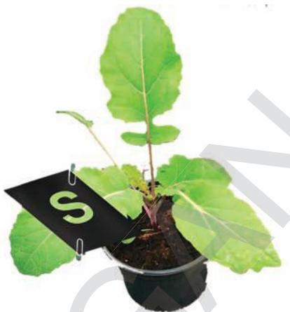

Food is needed by all living organisms mainly for growth and repair. Several organisms need food to maintain body temperature as well. A variety of substances are taken as food by every organisms from single celluar organisms like amoeba to the complex multicellular organisms like the human body. Even within the human body the cells require a wide variety of substances as food to carryout their functions. The mode of acquiring food varies from organism to organism.

You have studied in the previous classes about how different organisms get their food. Let us recall them.

What are autotrophs? How do autotrophs get their food?

What are heterotrophs? How do heterotrophs get their food?

Let us study about autotrophic and heterotrophic modes of nutrition and find out why most plants are called as autotrophs.

## Autotrophic Nutrition

We know that autotrophs are the organisms capable of using light energy to synthesize chemical compounds. They acquire nutrients like mineral salts and water from the soil as well as some gases from the air. They are capable of producing complex compounds like carbohydrates, proteins and lipids from these very simple substances. These compounds produced by autotrophic plants are utilized for providing energy to most of the living organisms and all animals including human beings.

Most of the food that we eat are obtained from plants. Even if we depend on animal products, we would find that those animals depend on

plants for their food. But how do plants carry out their life processes?

Scientists have been working for centuries to find out how plants carry out these life processes. We know that among all life processes, the process of photosynthesis makes plants “the universal food providers” for all living organisms.

You have studied something about photosynthesis in your earlier classes. Von Helmont and other scientists believed that plants get their food material not only from soil but also from other sources.

Can you name some raw materials needed for photosynthesis?

What could be the end products of the process of photosynthesis?

Let us study the process of photosynthesis in detail.

## Photosynthesis

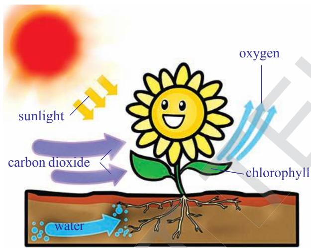  
fig-1: Photosynthesis

Photosynthesis is the process by which plants containing the green pigment ‘chlorophyll’ build up complex organic molecules from simple inorganic ones, using sun light as an energy source. The process of photosynthesis is very complex. Several reactions takes place in this process and intermediate compounds are also formed. Scientists had tried to formulate a simple equation to indicate photosynthesis over 200 years. The equation that is used widely is formulated and proposed by C.B. Van Neil in 1931 . His opinion was,

“for each molecule of carbohydrate formed, one molecule of water and one molecule of oxygen is produced”. Though photosynthesis is a very complex process, we use the following simple equation.

$$
\mathrm {C O} _ {2} + 2 \mathrm {H} _ {2} \mathrm {O} \xrightarrow [ \text {C h l o r o p h y l l} ]{\text {L i g h t}} \mathrm {C H} _ {2} \mathrm {O} + \mathrm {H} _ {2} \mathrm {O} + \mathrm {O} _ {2}
$$

What would be the reaction to show that glucose $\mathrm { ( C _ { 6 } H _ { 1 2 } O _ { 6 } ) }$ is being synthesized? Write down a balanced equation to show this.

(Refer the lessons Chemical equations, Carbon and its compounds in your textbook of physical science class X).

Van Neil first worked on purple sulphur bacteria and found light plays a specific role in photosynthesis. Instead of $\mathrm { H } _ { 2 } \mathrm { O }$ they used $\mathrm { H } _ { 2 } \mathrm { S }$ as a starting material. Here no oxygen is liberated during photosynthesis instead, elemental sulphur is evolved. Later he envisioned a similar process of photosynthesis in plants and proposed the above mentioned equation. Later Robert Hill showed that $\mathrm { O } _ { 2 }$ is released from water during this reaction. Then the equation was modified as follows.

$$
6 \mathrm {C O} _ {2} + 1 2 \mathrm {H} _ {2} \mathrm {O} \xrightarrow [ \text {C h l o r o p h y l l} ]{\text {L i g h t}} \mathrm {C} _ {6} \mathrm {H} _ {1 2} \mathrm {O} _ {6} + 6 \mathrm {H} _ {2} \mathrm {O} + 6 \mathrm {O} _ {2}
$$

It is known that plants synthesize carbohydrates, the smaller simpler ones first and from them, the more complex ones like starch and cellulose. Plants are also capable of synthesizing all other compounds like proteins, fats etc.

Animals are not capable of synthesizing carbohydrates and they have to depend on plants for the same.

Can we state that photosynthesis is the basic energy source for most of the living world? Why, why not?

Let us study how the plants prepare carbohydrates through photosynthesis.

### Activity-1

## Presence of starch (a type of carbohydrate) in leaves

Let us take a leaf from a plant with soft and thin leaves and well exposed to sun light.

Arrange apparatus as shown in figure 2 (a). Take methylated spirit in a test tube and put the leaf in it.

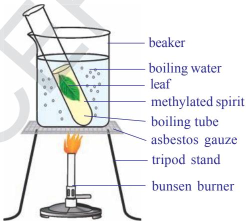  
fig-2(a): boiling the leaf in methylated spirit

  
fig-2(b): Iodine test

First boil the leaf in water then transfer this leaf into a test tube containing methylated spirit. Boil this tube in a water bath. Chlorophyll dissolves in spirit and the leaf becomes pale, due to removal of chlorophyll.

Take the leaf carefully from test tube by using a brush.

Spread the leaf in a petridish and add a few drops of iodine/ betadine solution on it. Observe the leaf.

What do you see/notice?

The presence of starch will be indicated by a blue-black colour.

Do you think solar energy transforms into chemical energy by the process of photosynthesis?

## Factors (Materials) essential for the process of Photosynthesis

What are the materials that you think would be essential for the synthesis of carbohydrates in the process of photosynthesis? (Hint: see the equation proposed by Van Neil)

Do you think the equation tells us about all the materials involved?

It took scientists over 300 years to find out about them. They opined that we don’t know about several materials involved in the process still.

Let us study how scientists experimented to find out about some of the materials required for the process of photosynthesis.

## Water and Photosynthesis

In class VII we already studied how Von Helmont found that the water is essential for the increase of plant mass.

He did not know about photosynthesis then. Later, it was found that increase in plant body mass or material occurred due to the process of photosynthesis. We shall study more about it in the following sections.

Read the chapter on ‘Nutrition in Plants’ in class VII. Discuss with your friends and write a note on Von Helmont’s experiment focussing on how he concluded that water was important for plant growth and increase in body mass.

## Air and Photosynthesis

Let us discuss an experiment on photosynthesis. This one helps us to find out about the role of air in the process of photosynthesis. It is interesting to learn about the experiment which is one of the several milestones in the gradual development of our understanding of Photosynthesis.

Joseph Priestly (1733-1804) in 1770 performed a series of experiments that revealed the essential role of air on the growth of green plants

(photosynthesis was still not known to scientists at that time). You may recall, Oxygen was discovered by Priestly in 1774. The name oxygen was coined later by Lavoisier in the year 1775. Priestly observed that a candle burning in a closed bell jar, soon gets extinguished. Similarly, a mouse would soon suffocate in a closed space of the bell jar. He concluded that a burning candle or an animal, both somehow, damage air. When he placed a mint plant in the same bell jars, he found that the mouse stayed alive and the candle when lighted from outside continued burning in the presence of the mint plant. Priestly hypothesized as follows: ‘Plants restore the air what breathing animals and burning candles remove’.

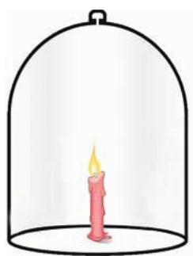

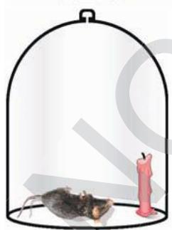

  
fig-3: Priestly experiment

Do you find any relationship between candle, rat, mint plant ? Discuss.

Do similar experiment in your school. Use a candle, plant in a small pot and a bell jar. Note down your observations and explain.

Priestly’s experiment confirmed that gaseous exchange was going on and plants were giving out a gas that supported burning and was essential for the survival of animals.

But how do plants take in air and utilize carbon dioxide for photosynthesis and oxygen for respiration?

How do they make the choice?

Massive amounts of gaseous exchange occur through the stomata (usually present in leaves) as long as they are open .While plants also carry on gaseous exchange through loose tissues in the stems, roots etc.

It is actually at the level of the organelles involved in the process of photosynthesis and respiration that the choice of the gas required is made.

### Activity-2

## Carbondioxide is necessary for Photosynthesis

We need a destarched plant to start with. We need to keep the plant in the dark for nearly three days to remove the starch (destarch). By placing the plant in dark the starch is removed from the leaves.

Arrange the apparatus as shown in the figure 4.

Take a wide mouthed transparent bottle.

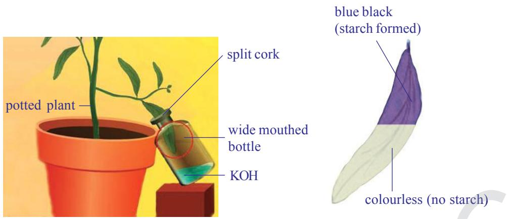  
fig-4: Mohl’s half leaf experiment

Put potassium hydroxide pellets or potassium hydroxide solution in the bottle. Potassium hydroxide absorbs carbon dioxide.

Insert splitted cork in the mouth of the bottle.

Insert one of the leaf of destarched plant (through a split cork) into transparent bottle containing potassium hydroxide pellets/potassium hydroxide solution.

Leave the plant in sunlight.

After a few hours, test this leaf and any other leaf of this plant for presence of starch, as mentioned in activity-1.

The leaf part which was exposed to the atmospheric air and light becomes bluish-black, and the one inside the bottle containing potassium hydroxide which absorbs carbon dioxide in the bottle remains colourless. This proves that carbon dioxide is necessary for photosynthesis.

Why was the plant kept in dark and then in sun light ?

Why did we test two leaves in this experiment?

We have so far discussed the role of water and gases in the process of photosynthesis. Scientist who had been working on these lines had observed some other factors that affect the process of photosynthesis.

## Light and Photosynthesis

In Priestley’s time, scientists didn’t understand about energy, but later on much was discovered about it. If energy is released when carbon dioxide and water is formed by combining oxygen with carbon and hydrogen, then what about the reverse?. What about forming oxygen again and putting it back in the air. Eventually, scientists learned that the energy situation would also reverse. Oxygen formation would use up energy. That means if plants

form oxygen they have to get energy to make it possible. Where did the energy come from?

A Dutch scientist, Jan Ingenhousz (1730-1799), found the answer. He studied the way in which plants form oxygen. In 1779, he noticed that it happened only in the presence of light. In an experiment with the aquatic plant, Hydrilla, he observed that in bright sunlight, small bubbles formed around the green parts while in the dark they did not form. He also found that the gas present in the bubbles was oxygen.

It was further confirmed when Engelman in the early $2 0 ^ { \mathrm { t h } }$ century ingeniously detected the point of maximum rate of photosynthesis. He used a strand of algae and exposed it to different colours of light (the colours that we see in a rainbow) Then he used oxygen sensitive bacteria and found that they crowd around areas illuminated with red and blue rays of light. This led to more studies on effect of light on photosynthesis, the role of different coloured compounds called pigments in plants and the utilization of light energy.

### Lab Activity

## Oxygen is produced during photosynthesis in the presence of light

Arrange the apparatus as shown in the figure. Make two identical sets.

Place some water plant like Elodea or Hydrilla in a short stemmed funnel and keep it in a beaker.

Then pour the water in the beaker.

Invert a test-tube full of water over the stem of the funnel. Ensure that the level of water in the beaker is above the level of stem of the inverted funnel.

Place one apparatus in the sun and the other in the dark for at least 2-3 hours. You would see that in placeE of water there is air that fills in the set up kept in sun. It is actually a gas that will be collected in the test-tube. Observe the other set up kept in dark. Is there any difference in the amount of gas collected?

  
fig-5: Hydrilla experiment

Test the gas in the test-tube by inserting a glowing match stick or incense stick which would burst into flames. This shows the presence of oxygen.

What precautions do you need while removing test tube from the beaker.

Discuss with your teacher.

### Activity-3

## Sunlight is necessary to form starch in green plants

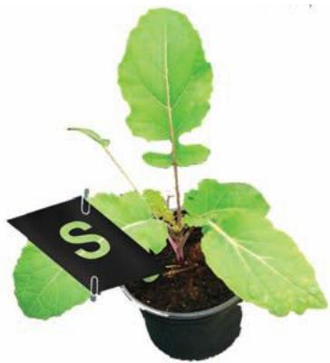

  
fig-6: Black paper experiment

Take a potted plant with destarched leaves. Remember the process of destraching leaves mentioned in activity-1.

Cover one of its leaves with black paper on which a design is cut. Fix the paper on the leaf in such a manner that light does not enter the dark part.dark

Place this potted plant in sun light.

After few hours of exposure to bright sunlight, test the leaf which is covered by black paper for the presence of starch.

Which part of the leaf turns blue black? What about the remaining part?

Observe the colour of leaf stained with iodine. Can you tell why it is stained differently?

It will be observed that only the parts of the leaf, which could get light through the cut out design, turns blue-black showing the presence of starch.

## Chlorophyll and Photosynthesis

Ingenhousz wanted to find out more about photosynthesis and carried out several other experiments. He proposed that only green plant parts could carry out the process of photosynthesis.

What about plants having coloured leaves? How is it that new leaves which look dark red in colour in several plants turn green? Do plants having reddish or yellowish leaves also carry out photosynthesis? What made plants carry out photosynthesis while even green coloured animals (like some birds )could not? Questions like these remained challenges until scientists could isolate the green coloured substance from plant parts and study its nature.

Establishment of Ingenhousz’s proposition came after several experiments till the mid $2 0 ^ { \mathrm { t h } }$ century when scientists could also locate the site of photosynthesis and even isolate it. Around four decades after Ingenhouszs’ proposition scientists could only isolate the green substance to observe its nature and find out whether photosynthesis could be carried out with it. This had become possible in the year 1817 due to the work of two scientists Pelletier and Caventou who obtained an extract of the green coloured substance and named it ‘chlorophyll’ meaning green leaf.

It was also found that pigments in addition to chlorophyll, carotenoids and phycobilins could also aid in the process of photosynthesis by passing on the energy of sunlight trapped by them to chlorophyll.

## Where does Photosynthesis take place?

Where is chlorophyll and other pigments present in the plant?

Try to name some parts where you think photosynthesis occurs.

Do you think the new reddish leaves of plants also carry out photosynthesis? What could be the reason for their colour?

The exact location of the photosynthetic part or a part containing chlorophyll was not known till another six decades after Pelletier and Caventou discovered chlorophyll. It was believed to be spread in the cells of green plant parts. In 1883, Julius Von Sachs, observed that chlorophyll in plant cells is not spread through out the entire cell. It is rather found in organelles within the cell. Such organelles were named as ‘chloroplasts’. These are present in large numbers in the cells (around 40 – 100) of parts like the stomatal guard cells and ground tissues of plants .

You have studied about Chloroplast in Class IX. Let us observe theT figure of TS of leaf showing Chloroplast in Palisade and Spongy Parenchyma.

What makes chloroplast appear completely different from other cell organelles?

## Do you know?

If a cell is broken up, the chloroplasts also break into pieces, so it becomes a very difficult task to isolate them to study the different steps of photosynthesis.It was not until 1954, that Daniel I. Arnon was able to break up plant cells so gently that whole chloroplasts could be obtained that could carry through photosynthesis.

  
fig-8: T-S of chloroplast

It has been found that the chloroplast is a membranous structure, consisting of 3 membranes. The third layer forms stacked sack like structures called as grana. It is believed to be a site for trapping of solar energy. The intermediary fluid filled portion is called as stroma. It is believed to be responsible for enzymatic reactions leading to the synthesis of glucose, which in turn join together to form starch.

Substances found in chloroplast which capture sunlight are called photosynthetic pigments. There are several types of photosynthetic pigments involved in the process to produce organic molecules like glucose in plants.

Chlorophyll is such a pigment which contain one atom of magnesium. It is similar in structure to the haem of haemoglobin. (The iron containing red pigment that transports oxygen in blood.) Two major kinds of chlorophylls are associated with thylakoid membranes. Chlorophyll ‘a’ is blue-green in colour and chlorophyll ‘b’ is yellow-green colour. Around 250 to 400 pigment molecules are grouped as light harvesting complex or photosynthetic unit in each thylakoid. Such innumerable units function together in chloroplasts of green plants in the process of photosynthesis.

During photosynthesis several events occur in the chloroplast some of them are:

1. Conversion of light energy to chemical energy   
2. Splitting of water molecule (photolysis of water)   
3. Reduction of carbondioxide to carbohydrates

Light is required to initiate several events while several may continue even in absence of it. That would mean, once light energy has been captured it can help reactions to continue even in the dark. Light dependent events

or reactions are called light reactions and it has been found to take place in grana, while the rest are called light independent or dark reactions and they occur in the stroma.

## Mechanism of Photosynthesis

## 1. Light dependent reaction (Photochemical phase)

In this reaction light plays a key role. A series of chemical reactions occur in a very quick succession initiated by light and therefore the phase is technically called the photochemical phase or light dependent reaction. The light reaction takes place in chlorophyll containing thylakoids called grana of chloroplasts. Several steps occur in the light dependent reaction.

Step-I : The chlorophyll on exposure to light energy becomes activated by absorbing photons. (Photon is the smallest unit of light energy)

Step-II: The energy is used in splitting the water molecule into two component ions named hydrogen $\mathrm { ( H ^ { + } ) }$ , hydroxyl ion (OH- ).

$$
\mathrm {H} _ {2} \mathrm {O} \quad \mathrm {H} ^ {+} + \mathrm {O H} ^ {-}
$$

The reaction is known as photolysis, which means splitting by light (photo means light, lysis means breaking). This was discovered by Robert Hill. Hence it is also called Hill’s reaction.

Step-III: The highly reactive $\mathrm { H } ^ { + }$ , OH-- ions of water undergo quick change as described below.

OH- ions through a series of steps produce water $\left( \mathrm { H } _ { 2 } 0 \right)$ and Oxygen $( \mathrm { O } _ { 2 } )$ . Water may be used by the plant inside, but $\mathrm { O } _ { 2 }$ is usually released into the atmosphere. $\mathrm { H } ^ { + }$ ions undergo series of changes in dark reaction. $\mathrm { H } ^ { + }$ ions produced in photolysis are immediately picked up by special compound NADP to form NADPH (reduced Nicotinamide Adenosine Dinucleotide Phosphate). ADP and iP trap energy to form ATP (Adenosine Tri phosphate). ATP and NADPH are formed at the end of the light reaction. These are (ATP, NADPH) called Assimilatory power.

## 2. Light independent reaction (Biosynthetic phase)

This reaction does not require the presence of light and extension of the phases after day time may occur in some plants (time gap between the two being less than even one thousandth of a second) and some times even in the dark.

This is also called dark reaction. But the term dark reaction or light independent reaction does not mean that they occur when it is dark at night. It only means that these reactions are not depend on light. In the dark phase the hydrogen of the NADPH is used to combine it with $\mathrm { C O } _ { 2 }$ by utilizing ATP energy and to produce glucose $\mathrm { ( C _ { 6 } H _ { 1 2 } O _ { 6 } ) }$ . This synthesis occurs in a

number of steps using certain special intermediate compounds and enzymes. RUBP (Ribulose 1-5 bis Phosphate) is the compound which accepts $\mathrm { C O } _ { 2 }$ in this process. Finally the glucose is converted to starch.

Plants are capable of surviving under a range of situations, from very hot, dry and brightly lighted conditions to wet, humid and dimly lighted ones. The requirement of light and other factors varies from one plant to another.

## Heterotrophic Nutrition

In the living world all organisms are capable of surviving under different conditions and acquring their food in different ways. We have studied about organisms that can capture light to produce their food. These are autotrophic in nature. While those that can not are heterotrophic.

## How do organisms obtain their nutrition

Depending on the type and availability of food organisms can assort to a range of strategies of food intake and use. Some organisms break down the food materials outside the body and then absorb it. For example, bread moulds, yeast, mushrooms etc. which are called saprophytes. Some other organisms derive nutrition from plants or animals without killing them. This type of parasitic nutritive strategy is used by a wide variety of organisms like Cuscuta, lice, leeches and tape worms. Others take in whole material and break it down inside their bodies. What can be taken in and broken down depends on the bodys’ design and it’s function.

Since the food and the way it is obtained differs, the digestive system is also different in various organisms. In single celled organisms, like amoeba the food may be taken in by the entire surface but as the complexity of the organism increases, different parts become specialized to perform different functions.

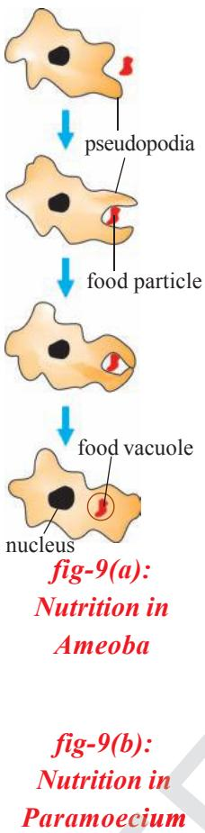

For example amoeba [fig-9(a)] takes in food using temporary finger like extensions (pseudopodia) of the cell surface which fuse over the food particle forming food vacuole. Inside the food vacuole, complex substances are broken down into simpler ones. Then diffuse into the cytoplasm. The remaining undigested material is moved to the surface of the cell and thrown out. In Paramoecium [fig-9(b)], which is also a unicellular organism the cell has a definite shape. Food is taken in at a specific spot. Food is moved to the spot by the movement of cilia which covers the entire surface of the cell, where the food is ingested (cytostome).

## Parasitic nutrition in Cuscuta

Dodder (genus Cuscuta) is a leafless, twining, parasitic plant belongs to morning glory family (Convolvulaceae). The genus contains about 170 twining species that are widely distributed throughout the temperate and tropical regions of the world.

The dodder plant contains no chlorophyll. Cuscuta reflexa

has been found to have very little amount of chlorophyll and instead absorbs food through haustoria. They are root like structures that penetrate the tissue of a host plant and may kill it. The slender, string like stems of the dodder may be yellow, orange, pink, or brown in colour. It’s leaves are reduced to minute scales. The dodder’s flowers, in nodule like clusters, are made up of tiny yellow or white bell-like petals.

The dodder’s seed germinates, forming an anchoring root, and then sends up a slender stem that grows in a spiral fashion until it reaches a host plant. It then twines around the stem of the host plant and forms haustoria, which penetrate through it. Water is drawn through the haustoria from the host plant’s xylem, and nutrients are drawn from its phloem. Meanwhile, the root rots away after contact has been made with a host stem. As the dodder grows, it sends out new haustoria (parasitic roots) and establishes itself very firmly on the host plant. After growing in a few spirals around one host shoot, the dodder finds its way to another, and it continues to twine and branch until it resembles a fine, densely tangled web of thin stems enveloping the host plant. Identify plants in your surroundings which are parasitic on other plants.

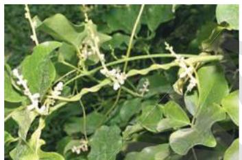  
fig-10: Haustoria in cuscuta

## Nutrition in Human Beings

Human digestive system is very complex in nature. Different parts are involved and perform different functions by using various digestive juices and enzymes.

Let us observe the figure of digestive system.

The alimentary canal is basically a long tube extending from the mouth to the anus. We can see that this tube has different parts. Various regions are specialized to perform different functions.

What happens to the food once it enters our body?

  
fig-11: Alimentary canal of man

We eat various types of food which has to pass through the same digestive tract. It also has to be converted to substances small enough to be utilised by our body. This needs various processess that can be studied as follows.

## Passage of food through alimentary canal or gut

  
fig-12: Buccal cavity

Food is cut and crushed by our teeth in the mouth and mixed with saliva to make it wet and slippery lump called bolus (This process is called as mastication). This bolus is suitable to pass through oesophagus. Saliva is secreted by three pairs of salivary glands. First pair is located at the side of the jaw called as submandibular, second pair is located below the tongue called as sublingual and

third pair is located at the side of the ear called parotid glands. Saliva mainly contains an enzyme amylase (ptyalin) which helps in the breakdown of complex carbohydrates to simple ones. This process of breaking down of complex substances into simple substance with the help of enzymes and obsorbed into the body is called digestion. The tongue helps in mixing the food and pushing it into the next part. The lower jaw also helps in the whole process.

We can find out the effect of salivary amylase on carbohydrates to observe what might be happening in our mouth.

p To know the chemical nature of the saliva perform the activity-7 of co-ordination in life process of this text book.

The soft food mixed with saliva passes through oesophagus or food pipe by wave like movements called peristaltic movement to the stomach.

At the stomach, food gets churned with gastric juice and HCl. Now the food is in semisolid condition. The digestion of food goes on as most proteins are broken down into smaller molecules with the help of enzyme pepsin acting on them.

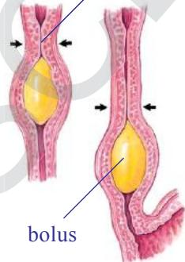  
peristaltic wave

  
oesophagus   
fig-13: Peristaltic movement

Food in the form of a soft slimy substance where some proteins and carbohydrates have already been broken down is called chyme. Now the food material passes from the stomach to the small intestine. Here the ring like muscles called pyloric sphincters relax to open the passage into the small intestine. The sphincters are responsible for regulating the opening of the passage such that only small quantities of the food material may be passed into the small intestine at a time.

The small intestine is the longest part of the alimentary canal. Its proximal part is called duodenum. It is the site of further digestion of carbohydrates, proteins and fats. It receives the secretion of liver and pancreas for this purpose. These juices render the internal condition of the intestine gradually to a basic or alkaline one.

Fats are digested by converting them into small globule like forms by the help of the bile juice secreted from liver. This process is called emulsification.

Pancreatic juice secreted from pancreas contains enzymes like trypsin for carrying on the process of digestion of proteins and lipase for fats.

Walls of the small intestine secrete intestinal juice called succusentericus which carry this process further that is small molecules of proteins are broken down to further smaller molecules. The same is the condition with fats. Carbohydrate digestion that started in the mouth and did not occur in the stomach, resumes now as the medium gradually changes to an alkaline one and the enzymes become active for carbohydrate breakdown.

### Activity-4

## Studying the enzymes chart

Let us study the chart showing different enzymes and digestive juices and their functions.

Table-1: Digestive enzymes   

<table><tr><td>S.No</td><td>Enzyme/Substance</td><td>Secreted by</td><td>Secreted into</td><td>Digestive juice</td><td>Acts on</td><td>Products</td></tr><tr><td>1</td><td>Ptyalin (salivary amylase)</td><td>Salivary glands</td><td>Buccal cavity</td><td>Saliva</td><td>Carbohydrates</td><td>Maltose</td></tr><tr><td>2</td><td>Pepsin</td><td>Gastric glands</td><td>Stomach</td><td>Gastric juice</td><td>Proteins</td><td>Peptones</td></tr><tr><td>3</td><td>Bile (No enzymes)</td><td>Liver</td><td>Duodenum</td><td>Bile juice</td><td>Fats</td><td>Emulsification breaking down of large fats into small globules</td></tr><tr><td>4</td><td>Amylase</td><td>Pancreas</td><td>Duodenum</td><td>Pancreatic juice</td><td>Carbohydrates</td><td>Maltose</td></tr><tr><td>5</td><td>Trypsin</td><td>Pancreas</td><td>Duodenum</td><td>Pancreatic juice</td><td>Proteins</td><td>Peptones</td></tr><tr><td>6</td><td>Lipase</td><td>Pancreas</td><td>Duodenum</td><td>Pancreatic juice</td><td>Fats</td><td>Fatty acids and glycerol</td></tr><tr><td>7</td><td>Peptidases</td><td>Intestinal glands</td><td>Small Intestine</td><td>Intestinal juice</td><td>Peptides</td><td>Amino acids</td></tr><tr><td>8</td><td>Sucrase</td><td>Intestinal glands</td><td>Small Intestine</td><td>Intestinal juice</td><td>Sucrose (Cane Sugar)</td><td>Glucose</td></tr></table>

Name the enzymes which act on carbohydrates?

Which juice contains no enzymes?

What are the end products of fats?

What are the enzymes that act on proteins?

Transport of the products of digestion from the intestine into blood (through the wall of intestine) is called absorption. Internally, intestinal wall has a number of finger like projections called Microvilli. The villi increase the surface area for absorption. Blood vessels and lymph vessels are present in the form of a network in the villi.

Products of digestion are absorbed first into the villi and from here into the blood vessels and lymph vessels. Thus after maximum absorption of food in the small intestine the rest passes into the large intestine. Here most of the water present is taken up from this material. This material is then expelled through the anus which is the last part of the alimentary canal. This passage of undigested material from the body by the way of anus is called defecation. Food that passes out of the anus still contains considerable amount of proteins, fats and carbohydrates, roughages or fibres of either carbohydrates or proteins. We will learn some more points about the coordination about digestive system with other systems in the chapter coordination in life processes.

## Flow chart of human digestive system

What do you think is the process of digestion?

What are its major steps?

## Health aspects of the alimentary canal

The human alimentary canal usually functions remarkably well considering how badly we treat it on occasions! Sometimes it rebels, and we either feel sick or have indigestion.

Vomiting is the body’s method of ridding itself of unwanted or harmful substances from the stomach. The peristaltic movements of the stomach and oesophagus reverse their normal direction and the food is expelled. There are many causes of vomiting, but one of the most common is over eating, especially when the food contains a high proportion of fat. Vomiting also occurs when we eat something very indigestible or poisonous.

When we have a greenish vomit usually called as ‘bilious’ or ‘liverish’, we get a bitter taste and it is often the result of having over eaten. The liver is unable to cope with the excessive fat and we get a feeling of nausea.

Indigestion is a general term used when there is difficulty in digesting food. Healthy people can usually avoid problems related to digestion by:

a) having simple, well balanced meals   
b) eating food in a leisurely manner   
c) thoroughly masticating the food   
d) avoiding taking violent exercise soon after eating food   
e) Drinking plenty of water and having regular bowel movements.

A more serious form of indigestion is caused by stomach and duodenal ulcers. These conditions occur more often in people who may be described as hurried or worried. Thus, ulcers occur more often in busy people who get into the habit of hurrying over meals and rushing from one activity to another without sufficient rest. Those who are able to relax, who are not continually tensed up, and who live at a slower pace, seldom get ulcers. You studied about recent researches in the peptic ulcers caused by some bacteria in previous classes.

Proper functioning of all life processes require adequate amount of food in all living organisms. It is not just the intake of food but its assimilation and expulsion of wastes that play an important role. In take of fibre rich food avoids constipation.

## Diseases due to malnutrition

We know that food is the main source to maintain biological processes in a perfect manner. Our diet should be a balanced one which contains proper amount of carbohydrates, proteins, vitamins, mineral salts and fats. Two third of world population is affected by food related diseases. Some of them are suffering by consuming high calorific food. Most of them are facing various diseases due to lack of balanced diet. It is very important to discuss about food deficiency diseases.

Eating of food that does not have one or more than one nutrients in required amount is known as malnutrition. Poor health, will full starvation, lack of awareness of nutritional habits, socio-economic factors are all the reasons for malnutrition in our country.

Malnutrition is of three types

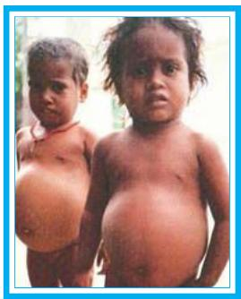

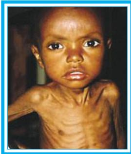  
fig-14: Kwashiorkor

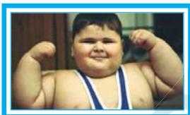  
fig-15: Marasmus   
fig-16: Obesity

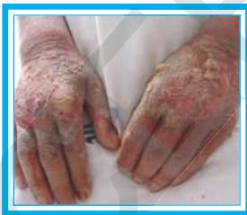  
fig-17: Pellagra

otein malnutrition,   
2. Calorie malnutrition,   
3. Protein calorie malnutrition.

Let us observe harmfull effects of malnutrition in children.

1. Kwashiorkor disease: This is due to protein deficiency in diet. Body parts become swollen due to accumulation of water in the intercellular spaces. Very poor muscle development, swollen legs, fluffy face difficult to eat, diarrhoea, dry skin are the symptoms of this disease.   
2. Marasmus: This is due to deficiency of both proteins and calories. Generally this disease occurs when there is an immediate second pregnancy or repeated child births. Lean and weak, less developed muscles, dry skin, diarrhoea, etc., are the symptoms of this disease.

Obesity: This is due to over eating and excess of clories in take. It is a big health hazard. Obese children when grow, they will be target of many diseases like diabetes, cardio vascular, renal, gall bladder problems. Discuss about junk foods and other food habits which leads to obesity.

## Vitamin deficiency diseases

Vitamins are organic substances. They are micro nutrients required in small quantities. Actually vitamins are not synthesised in the body, we do not generally suffer from vitamin deficiency. The source of vitamins to our body is through two ways. One is diet and other is bacteria present in the intestine that synthesises and supplies vitamins to the body.

Vitamins are classified into two groups. One is Water soluble vitamins (B-complex, vitamin C) and other is fat soluble vitamins (vitamin A, D, E and K). If food we take doesn’t contain vitamins in right proportion, it can lead to vitamin deficiency disorders. Let us study the following chart showing vitamins available sources and deficiency diseases.

Table-2: Vitamins   

<table><tr><td>Vitamin</td><td>Resources</td><td>Deficiency diseases</td><td>Symptoms</td></tr><tr><td>Thiamin (B1)</td><td>Cereals, oil seeds, vegetables, milk, meat, fish, eggs.</td><td>Beri beri</td><td>Vomittings, fits, loss of appetite, difficulty in breathing, paralysis.</td></tr><tr><td>Riboflavin (B2)</td><td>Milk, eggs, liver, kidney, green leafy vegetables.</td><td>Glossitis</td><td>Mouth cracks at corners, red and sore tongue, photophobia, scaly skin.</td></tr><tr><td>Niacin (B3)</td><td>Kidney, liver, meat, egg, fish, oil seeds.</td><td>Pellagra</td><td>Dermatitis, diarrhoea, loss of memory, scaly skin.</td></tr><tr><td>Pyridoxine (B6)</td><td>Cereals, oil seeds, vegetables, milk, meat, fish, eggs, liver.</td><td>Anaemia</td><td>Hyper irritability, nausea, vomiting, fits.</td></tr><tr><td>Cyanocobalamin (B12)</td><td>Synthesised by bacteria present in the intestine.</td><td>Pernicious anaemia</td><td>Lean and weak, less appetite.</td></tr><tr><td>Folic acid</td><td>Liver, meat, eggs, milk, fruits, cereals, leafy vegetables.</td><td>Anaemia</td><td>Diarrhoea, loss of leucocytes, problems related to mucus in the intestines.</td></tr><tr><td>Pantothenic acid</td><td>Sweet potatoes, ground nuts, vegetables, liver, kidney, egg.</td><td>Burning feet</td><td>Walking problems, sprain.</td></tr><tr><td>Biotin</td><td>Pulses, nuts, vegetables, liver, milk, kidney.</td><td>Nerves disorders</td><td>Fatigue, mental depression, muscle pains.</td></tr><tr><td>Ascorbic acid (C)</td><td>Green leafy vegetables, citrus fruits, sprouts.</td><td>Scurvy</td><td>Delay in healing of wounds, fractures in bones.</td></tr><tr><td>Retinol (A)</td><td>Leafy vegetables, carrot, Tomato, pumpkin, papaya, mango, meat, fish, egg, liver, milk, cod liver oil, shark liver oil.</td><td>Eye, skin diseases</td><td>Night blindness, xerophthalmia, cornea failure, scaly skin.</td></tr><tr><td>Calciferol (D) (sunshine vitamin)</td><td>Liver, egg, butter, cod liver oil, shark liver oil, sun rays stimulate the formation of vitamin D from the sub-cutaneous fat.</td><td>Rickets</td><td>Improper formation of bones, Knock-knees, swollen wrists, delayed dentition, weak bones.</td></tr><tr><td>Tocoferol (E)</td><td>Fruits, vegetables, sprouts, sunflower oil.</td><td>Fertility related disorders</td><td>Sterility in males, abortions in females.</td></tr><tr><td>Phylloquinone (K)</td><td>Green leafy vegetables, milk, meat, egg.</td><td>problems related to Blood clotting</td><td>Delay in blood clotting, over bleeding.</td></tr></table>

## Key words

Glucose, starch, cellulose, chloroplast, grana, stroma, light reaction, dark reaction, heterotrophic nutrition, parasitic nutrition, haustoria, Alimentary canal, salivary glands, peristaltic movement, amylase, ptyalin, pepsin, chyme, sphincter, digestion, pancreas, enzymes, villi, bile juice, lipase, fat, liver, emulsification, kwashiorkor, marasmus.

## What we have learnt

Autotrophic nutrition involves the intake of simple inorganic materials like some minerals, water from the soil. Some gases from the air. By using an external energy source like the Sun to synthesis complex high energy organic material.

Photosynthesis is the process by which living plant cells containing chlorophyll, produce food substances [glucose & starch] from Carbon dioxide and water by using light energy. Plants release oxygen as a waste product during photosynthesis.

Photosynthesis process can be represented as

$$
6 \mathrm {C O} _ {2} + 1 2 \mathrm {H} _ {2} \mathrm {O} \xrightarrow [ \text {C h l o r o p h y l l} ]{\text {l i g h t}} \mathrm {C} _ {6} \mathrm {H} _ {1 2} \mathrm {O} _ {6} + 6 \mathrm {H} _ {2} \mathrm {O} + 6 \mathrm {O} _ {2}
$$

The materials required for photosynthesis are light: Carbon dioxide, Water, photosynthetic pigment chlorophyll.

Chloroplasts are the sites of photosynthesis. Light reaction takes place in the grana region and light independent reaction takes place in the stroma region.

The end products of photosynthesis are Glucose water and Oxygen.

During photosynthesis the important events which occurs in the chloroplast are

a) Conversion of light energy into chemical energy   
b) Splitting of water molecule   
c) Reduction of carbon dioxide to carbohydrates

Heterotrophic Nutrition involves the intake of complex material prepared by other organisms.

The form of nutrition differs depending on the type and availability of food material as well as how it is obtained by the organism.

In single celled organisms the food may be taken in by the entire surface but as the complexity of the organism increases different parts becomes specialized to perform different functions.

The large complex food molecules such as carbohydrates, proteins , lipids, etc., are broken down in to simple molecules before they are absorbed and utilized by the animals. This process of breaking down of complex molecules into simple molecule is called digestion.

In human beings the food eaten is broken down in various steps with the help of enzymes secreted by digestive glands which are associated with the alimentary canal and the digested food is absorbed in small intestine to be sent to all cells in the body.

The digestive system includes the alimentary tract and several associated organs and digestive glands. The functions of system are as follows :

a) Ingestion: Taking of food into the body   
b) Digestion: Breaking up of complex food substances into the simple substances by specific enzymes. So that they can be used by the body.   
c) Absorption: The passage of digested food through the walls of alimentary tract (particularly in small intestine ) into circulatory system.   
d) Defecation: The passage of undigested material from the body by the way of anus.

## Improve your learning

1. Write differences between (AS1)

a) autotrophic nutrition - heterotrophic nutrition

b) Ingestion - digestion

c) Light reaction - dark reaction

d) Chlorophyll - chloroplast

2. Give reasons (AS1)

a) Why photosynthesis is considered as the basic energy source for most of living world?   
b) Why is it right to call the dark phase of photosynthesis as a light independent phase?   
c) Why is it necessary to destarch a plant before performing any experiment on photosynthesis?   
d) Why is not possible to demonstrate respiration in green plant kept in sun light?not

3. Give examples (AS1)

a) Digestive enzymes

b) Organisms exhibiting heterotrophic nutrition

c) Vitamins

d) Nutritional deficiency diseases

4. From where do plants get the raw materials required for photosynthesis?(AS1)

5. Explain the process of photosynthesis in with the help of a flow chart? (AS1)   
6. Name the three end products of photosynthesis? (AS1)   
7. What is the substance that connects light reaction and dark reaction? (AS1)   
8. In most of leaves the upper surface will be more green and shiny than the lower surface. Why? (AS1)   
9. Explain the structure of chloroplast with a neatly labeled sketch. (AS5)

10. What is the role of acid in stomach? (AS1)   
11. Mention the names of glands and organs which help in digestion? (AS1)   
12. How is the small intestine designed to assimilate the food? explain. (AS1)   
13. How are fats digested? Where do they get digested? (AS1)   
14. What is the role of saliva in the digestion of food? (AS1)   
15. What will happen to protein digestion as the medium of intestine is gradually rendered alkaline? (AS1)   
16. What is the role of roughages in the alimentary tract? (AS1)   
17. What is malnutrition? Explain few nutritional deficiency diseases. (AS1)   
18. How do fungi and bacteria obtain their nourishment? (AS2)   
19. If we keep on increasing $\mathrm { C O } _ { 2 }$ concentration in air what will be the rate of photosynthesis?(AS2)

20. What happens if the rate of respiration is more than the rate of photosynthesis in a plant?(AS2)   
21. How can you say that the carbohydrates are not digested in the stomach?(AS1)   
22. What process do you follow in the laboratory to study the presence of starch in leaves?(AS3)   
23. How would you demonstrate that green plant releases oxygen when exposed to light?(AS3)   
24. Visit a primary health centre and collect the information about the children at diffrent ages suffering from malnutrition. (AS4)

<table><tr><td rowspan="2">S.No.</td><td rowspan="2">Age group</td><td colspan="3">No. of children with malnutrition</td></tr><tr><td>Protiens</td><td>Calories</td><td>Vitamins</td></tr><tr><td>1.</td><td></td><td></td><td></td><td></td></tr><tr><td>2.</td><td></td><td></td><td></td><td></td></tr></table>

25. Would the survival of organisums become difficult, if there are no green plants on the earth? How do you support it?(AS1)   
26. Draw the labelled diagram of human digestive system? List out the parts where peristalsis takes place. (AS5)   
27. Raheem prepared a model showing the passage of the food through different parts of the alimentary canal? Observe this and label it’s parts. (AS5)

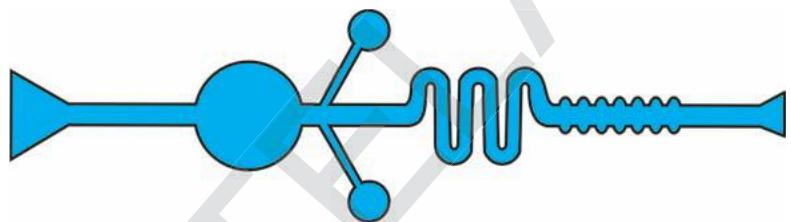

28. Observe the following diagram and write a note on light dependent, light independent reactions.(AS5)

29. What facts about the green plants do you appreciate?(AS6)   
30. What food habits do you follow after reading this chapter? Why? (AS7)

## Fill in the blanks

1. The food synthesized by the plant is stored as   
2. are the sites of photosynthesis.   
3. The enzymes in the pancreatic juice help in the digestion of and   
4. The finger like projections which increases the surface area in small intestine are called_   
5. The gastric juice contains _ acid.   
6. vitamin is synthesised by bacteria present in intestine.

## Choose the correct answer

7. Which of the following organisms take the food by parasitic nutrition? ( )

(i) Yeast

(ii) Mushrooms

(iii) Cuscuta

(iv) Leeches

A) (i), (ii)

B) (iii)

C) (iii), (iv)

D) (i)

8. The rate of Photosynthesis is not affected by: (

A) Light Intensity

B) Humidity

C) Temperature

D) Carbon dioxide concentration

9. A plant is kept in dark for about forty eight hours before conducting any experiment on Photosynthesiskept in order to : ( )

A) Remove chlorophyll from leavesT   
B) Remove water from leaves   
C) Ensure that no photosynthesis occurred   
D) Ensure that leaves are free from the starch

10. The digestive juice without enzyme is (

A) Bile

B) Gastric juice

C) Pancreatic juice

D) saliva

11. In single celled animals the food is taken by (

A) body surface

B) Mouth

C) Teeth

D) Vacuoles

12. Which part of the plant takes in carbondioxide from the air for photosynthesis ( )

A) Root hair

B) Stomata

C) Leaf veins

D) Sepals

# Chapter 2
# Respiration-The energy producing system

Using food to carry out life processes is key to life for all living beings in both multicellular or unicellular. In the chapter, on nutrition we have discussed how the body draws out nutrients from the food taken in. The food provides energy for all the biological activities only after break down through the process known as respiration. Thus, respiration leads to final utilization of food. Normally respiration takes place in oxygen rich enveronment. Cells of the living body use food constantly to help our body to function properly. They require the presence of gas, food material and some chemicals.

The term ‘respiration’ derived from Latin word ‘respire’ meaning ‘to breathe’, refers to the whole chain of processes from the inhalation of air to the use of oxygen in the cells. To begin with, we shall study the relation of gases and the process of respiration.

## Discovery of gases and respiration

The term respiration came into use, a century after the word breathing was used, way back in the $1 4 ^ { \mathrm { t h } }$ century. It was used much before people knew that air is a mixture of gases. They hardly knew anything about all the life processes that took place internally in a living body. Respiration which was used as a medical term, usually referred to as a process involving passage of air and production of body heat.

It was not until $1 8 ^ { \mathrm { t h } }$ century when Lavoisier and Priestley did a comprehensive work on properties of gases, their exchange and respiration that we came to know something about how the process of gaseous exchange goes on, in our body. You have already studied about

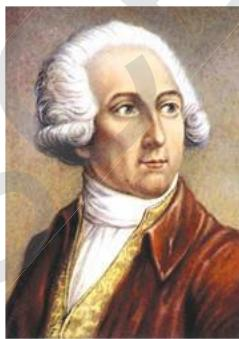  
fig-1: Lavoisier

some of Priestley’s experiments in earlier classes (You have an account of it in the chapter on nutrition as well). Recall the concepts and answer the following.

Can it be said that Priestley’s experiment helped us to find out more about composition of air? How?

Lavoisier also carried out several experiments to understand the property of gases. In his early experiments, it is clear that Lavoisier thought that the gas liberated on heating powdered charcoal in a belljar kept over water in a trough was like fixed air. In those days carbon dioxide was known as fixed air. The next series of experiments dealt with the combustion of phosphorus in a belljar. From these studies Lavoisier showed that whatever in the atmospheric air which combined with the phosphorus, was not water vapour. His final words are that the substance which combines with the phosphorus is “either air itself, or another elastic fluid present, in a certain proportion, in the air which we breathe”. This was the respirable air, a component of air that also helped in burning.

What was produced by combustion according to Lavoisier?

What did Lavoisier find out about air from his experiments?

What conclusion can be drawn from Lavoisier’s experiments?

Lavoisier noted that there was a profound difference between the air in which combustion of a metal had been carried out and the one which had served for respiration. The air that we breathe out precipitated lime water while that after heating metal did not.

From this he deduced that there were two processes involved in respiration, and that of these he probably knew only one. Therefore, he carried out another experiment by which he showed that about one sixth of the volume of ‘vitiated air’(a term used then to show air from which the component needed for burning had been removed) consists of chalky acid gas (fixed air). Therefore, to recreate common air from vitiated air, it was not enough merely to add the appropriate amount of air needed for burning or respirable air; the existing chalky acid gas must also be removed.

He drew immediately the logical conclusion regarding the process of respiration. Either eminently respirable air is changed in the lungs to chalky acid air; or an exchange takes place, the eminently respirable air being absorbed, and an almost equal volume of chalky acid air being given up to the air from the lungs. He had to admit that there were strong grounds for believing that eminently respirable air did combine with the blood to produce the red colour. (But in due course the scientists identified that due to haemoglobin the blood is red in colour.)

  
fig-2: Priestley

Lavoisier’s findings lead way to several other researchers.

Which gas do you think is Lavoisier talking about when he says chalky acid gas?

Which gas according to him is respirable air?

What steps in the process of respiration does Lavoisier mention asN an inference of his experiments?

A few lines from a textbook of Human Physiology, written by a renowned chemist, John Daper around mid-19th century goes like this..

‘‘The chief materials which a living being receives are matter that can be burnt, water and oxygen gas; and out of the action of theseG upon one another, all the physical phenomena of its life arise. What the body expels out is water, oxide of carbon, phosphorous, sulphur and others.’’

Thus, we can see that the role of major compounds and elements in the process of respiration was known by mid19thcentury. The eventsA involved were not very clearly understood, but, people believed that there was some relationship of the heat produced in the body and the process ofL respiration.

It is a common observation that our breath is warmer than the airE around us; does respiration have anything to do with this?

Let us study the events involved in respiration in human beings to figureT it out.

## Events / Steps in Respiration

There are no strict demarcations of events involved in the process ofT respiration. It is a very complex process of several biochemical and physical processes. But for a general understanding on what goes on, we shall studyR under the following heads.

## Breathing

Air movement into and out of lungs

## Gaseous exchange at lungs level

Exchange of gases between alveoli and blood

## Gas transport by blood

Transport of oxygen from blood capillaries of alveoli to body cells and return of carbon dioxide

## Gaseous exchange at tissue level

Exchanging of oxygen from blood into the cells and carbon dioxide from cells into the blood

## Cellular Respiration

Using oxygen in cell processes to produce carbon dioxide and water, releasing energy to be used for life processes

## Breathing

In the previous classes we did experiments to find out what was there in the air we breathe out.

We had seen that in a set up with lime water, it turned milky white fast as we breathe out into it as compared to a similar set up in which normal air was passed with the help of a syringe or pichkari in lime water. (Experimental set up to test the presence of Carbondioxide in exhaled air). Arrange apparatus as shown in figure-3 and try to do the experiment once again to find out what happens.

What does this experiment indicate?

Which gas turns lime water milky?

Which gas do you think might be present in greater quantities in the air we breathe out as compared to air around us?

We are also aware of the fact that water vapour deposits on a mirror if we breathe out on it.

Where does this water vapour come from in exhaled air?

We shall have to study the pathway of air in our body through our respiratory system and the mechanism of breathing in respiration to find out how the exhaled air comes out. By “respiratory system” we usually mean the passages that transport air to the lungs and to the microscopic air sacs in them, called alveoli (where gases are exchanged between them and blood vessels) and vice versa.

## Pathway of air

Let us observe the pathway of air from nostril to alveolus.

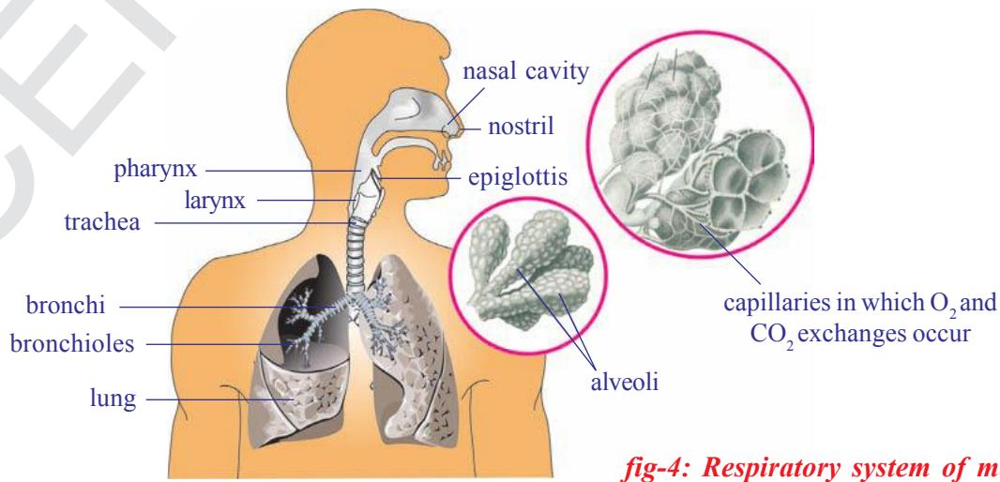

  
fig-3: Respiratory gases   
an

## Nostrils:

Air usually enters the body through the nostrils

## Nasal cavity:

## Pharynx:

## Larynx:

## Trachea:

## Bronchus:

## Bronchioles:

## Alveolus:

## Blood:

Air is filtered. The moist surface of the lining of the nasal cavity, and the hairs growing from its sides, remove some, of the tiny particles of dirt in the air. In addition, as the inhaled air passes through the nasal cavity, its temperature is brought close to that of the body, and it takes up water vapour so that it becomes more moist than before.

Warming and moistening goes on in this common passage of digestive and respiratory system. Epiglottis, a flap like muscular valve controls movement of food and air towards their respective passages.

This stiff box contains our vocal cords. When air passes out of the lungs and over the vocal cords, it causes them to vibrate. This produces sounds on the basis of our speech, song etc.

Wind pipe channeling air to lungs. Touch your throat toind feel the tube like structure.

At its lower end the trachea or the wind pipe divides into two bronchi-one leading to each lung.

Each bronchi is further divided into smaller and smaller branches called bronchioles.

These finally terminate in clusters of air sacs called alveoli in the lungs which are very small and numerous. Gaseous exchange takes place here as blood capillaries take up oxygen and expel carbon dioxide.

Blood carries oxygen, to each and every cell of the body and collects $\mathrm { C O } _ { 2 }$ from them.

The whole passage from nostrils to alveolus is moist and warm.

## Do you know?

The interior of lung is divided into millions of small chambers, thus tremendously increasing the moist surface available for transfer of gases between air and blood. The linings of the lungs are much folded and so their total surface is enormous. If all alveoli of our lungs are spread out they will cover an area of nearly $1 6 0 \mathrm { m } ^ { 2 }$ . Which is equivalent to tennis court.

## Think and discuss

What will happen if the respiratory tract is not moist?

Are both lungs similar in size?

Why are alveoli so small and uncountable in number?

## Epiglottis and passage of air

From the nasal cavity, the air goes into the pharynx. There is a tricky problem here. From the pharynx there are two passages, beginning with nearly same opening and ending into separate ones, one to the lungs and one to the stomach. It is important that air goes into one and food into the other. It is also important that food does not enter the tube through which air goes into the lungs. The traffic is kept properly

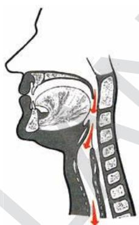  
Epiglottis diverts air to lungs   
fig-5(a): Breathing

  
Epiglottis diverts food mass away from opening of larynx   
fig-5(b): Swallowing

channeled by a flap like valve, the epiglottis that protects the tube to the lungs, arresting entry of food. Observe the following figures and discuss in your class how epiglottis works while breathing or swallowing

This valve is partly closed when we swallow food; it deflects food down to the stomach and keeps it out of the trachea or wind pipe which is the route to the lungs. The epiglottis opens more widely when we take a breath, and air enters the lungs. Nervous regulation is important in guiding the function of epiglottis and passage of food and air. Let us try to do an activity to feel what happens when we swallow food.

Why are we advised not to talk while eating food ?

### Activity-1

Keep your palm around an inch away from your nose, feel you are breathing out, do not remove it until you have finished the activity. Breathe steadily for 1-2 minutes. Now take a piece of any fruit, chew and before swallowing it keep the fingers of the other palm on your throat, now swallow it.

What did you notice? What happens to your breath as you try to swallow?

## Mechanism of respiration in human beings

  
fig-7: Movement of rib cage during inhalation, exhalation

fig-6: Diagram showing lungs and diaphragm

We know that breathing is the process of inhaling and exhaling. The organs involved are mainly the lungs. You can’t see your lungs, but it’s easy to feel them in action. Put your hands on your chest and breathe in very deeply. You will feel your chest getting slightly bigger. Now breathe out the air, and feel your chest return to its regular size. You’ve just felt the power of your lungs! The lungs themselves can neither draw in air nor push it out. Instead, the chest wall muscles and another flexible

flattened muscle called diaphragm helps the lungs in moving air into and out of them. See how the diaphragm works in the figure.

What is the role of diaphragm and ribs in respiration? Are both active in men and women?

The chest wall is made up of ribs, muscles, and the skin. The ribs are attached at an angle to the spine (if you run your finger along one of your ribs, you will notice that it extends downward from the spine). When we inhale, the chest wall moves up and expands. This causes an increase in the volume of the chest cavity.

The diaphragm may be imagined as the ‘floor’ if you think of the chest cavity as a “room.” When the diaphragm is relaxed when we breath out, it is in the shape of a dome with the convex side of the dome extending into the chest cavity. When the diaphragm contracts during inhalation it flattens out a bit or the dome moves downward. As a result, the volume of the chest cavity is increased.

When the diaphragm flattens and the volume of the chest cavity is increased, its internal pressure decreases and the air from the outside rushes into the lungs. This is inspiration (inhalation).

Then the reverse occurs. The chest wall is lowered and moves inward, and the diaphragm relaxes and assumes its dome shape. These changes increase the pressure on the lungs; their elastic tissue contracts and squeezes the air out through the nose to the external atmosphere. This is expiration (exhalation).

## Do you know?

Our lungs are spongy in nature. They are not of the same size. The lung towards left is slightly smaller making space for your heart! Lungs are protected by two membranes called pleura. A fluid filled between these membranes protects the lungs from injury and also aid in the expansion of the spongy and elastic lung muscle, as they slide one over the other.

You must have noticed that your own breathing is slow and shallow when you are at rest. It is deeper and faster when you exercise hard. Indeed, patterns of breathing show a great range, for they are coordinated with moment-by-moment needs of the body for supply of oxygen and removal of carbon dioxide.

What other situations affect your breathing?

It has been found that all movements of breathing stop at once when the nerves leading from the brain to the respiratory muscles are cut.

What can be concluded from this?

What happens during the process of breathing?

Which gas needs to be removed from our body during exhalation?

Where does the extra amount of gas come from?

What is the composition of inhaled air?

When exhaled air is compared with inhaled air, is there any difference in composition?

## Gaseous Exchange (alveoli to capillaries)

Gaseous exchange takes place within the lungs by diffusion from the alveoli to blood capillaries and vice versa. The carbondioxide in the blood is exchanged for oxygen in the alveoli. These tiny air sacs in the lungs areR numerous and only one cell thick. They are surrounded by capillaries that

are also only one cell thick. Blood, dark red in colour flows from the heart through these capillaries and collects oxygen from the alveoli. At the sameC time, carbondioxide passes out of the capillaries and into the alveoli. When we breathe out, we get rid of this carbondioxide. The bright red, oxygenrich blood is returned to the heart and pumped out to all parts of the body.

  
fig-8: Diagram of Alveolus with pulmonary capillary

As a result of gaseous exchange, the composition of inhaled and exhaled air is different. See the table given below. Approximate values are given in the table

<table><tr><td>Gas</td><td>% in inhaled air</td><td>% in exhaled air</td></tr><tr><td>Oxygen</td><td>21</td><td>16</td></tr><tr><td>Carbondioxide</td><td>0.03</td><td>4.4</td></tr><tr><td>Nitrogen</td><td>78</td><td>78</td></tr></table>

Why does the amount of Oxygen vary between exhaled and inhaled air?

What has raised the percentage of carbon dioxide in exhaled air?

## Do you know?

The total lung capacity of human being is nearly 5800ml. Normally at rest who inhale or exhale approximately $5 0 0 \mathrm { m l }$ of air. 1200ml of air remains in lungs after complete exhalation.

Recall the activity of lung capacity performed by you in class VII in the chapter ‘Respiration in Organisms’.

## Transportation of gases

We know that air is a mixture of gases, that fills the lungs and the alveoli when that enters our body. The relative amount of different gases in air and their combining capacity with haemoglobin and other substances in blood determine their transport via blood in the body.

When oxygen present in the air is within normal limits (around $21 \%$ ) then almost all of it is carried in the blood by binding to haemoglobin, a protein (quite like chlorophyll, the only major difference being it has iron in place of magnesium as in chlorophyll) present in the red blood cells. As oxygen is diffused in the blood, it rapidly combines with the haemoglobin to form oxyhaemoglobin. Not only haemoglobin can combine with oxygen, but the reverse can also happen to yield a molecule of haemoglobin and oxygen.

Carbon dioxide is usually transported as bicarbonate, while some amount of it combines with haemoglobin and rest is dissolved in blood plasma. Study the following equation for better understanding.

$$
\mathrm {H b} + 4 \mathrm {O} _ {2} \longrightarrow \mathrm {H b} (\mathrm {O} _ {2}) _ {4} (\text {i n l u n g s})
$$

$$
\mathrm {H b} \left(\mathrm {O} _ {2}\right) _ {4} \longrightarrow \mathrm {H b} + 4 \mathrm {O} _ {2} (\text {i n t i s s u e s})
$$

## Do you know?

If haemoglobin is exposed to air at sea level, nearly every molecule combines with oxygen to form oxyhaemoglobin. At a height of $1 3 \mathrm { k m }$ (about 8 miles) above sea level, the concentration of oxygen is much lower about one fifth at sea level.

  
fig-9: Mountaneer

Under these conditions only about half as many molecules of oxygen combine with haemoglobin to form oxyhaemoglobin. This is important, because blood cannot carry enough oxygen to the tissues if haemoglobin is combined with few oxygen molecules. In fact, human life is impossible at such an altitude without a supplementary supply of oxygen. Provision for such a supply is built into modern aircraft, which have pressurized cabins that maintain an enriched air supply. When we go deep into the sea we will face another type of problems.

## Gaseous exchange (capillaries to cells and back)

In the capillaries over the tissues, haemoglobin meets a very different environment. The tissue cells are continuously using oxygen, hence, the concentration of oxygen is quite low in them. It might be only one third of that in the lungs. As the concentration of oxygen is so low, oxyhaemoglobin releases the oxygen molecule that enters the cells. In the reactions that occur within cells in our bodies, carbon dioxide and water are produced and energy is released to be used up for different purposes.

## Cellular respiration

The term cellular respiration refers to the pathway by which cells release energy by breaking the chemical bonds of glucose molecules. Thus cellular respiration is the essential processes of life. So living cells must carry out cellular respiration. It can be in the presence of oxygen that is ‘aerobic respiration’, or in the absence of oxygen as in bacterial respiration by anaerobic method which is called fermentation. The substances become sour because of ethyl alchohol or lactic acid is produced in this process. In Animals the anaerobic respiration leads to formation of lactic acid from glucose. In anaerobic repiration few ATP molecules are produced. Cellular respiration in prokaryotic cells like that of bacteria occurs within the cytoplasm. In eukaryotic cells cytoplasm and mitochondria are the sites of the reactions. The produced energy is stored in mitochondria in the form of ATP. That is why mitochondria are called “power houses of the cell”.

The exact chemical details of the breakdown of sugar or other foods within a living cell does not take place as a single reaction, but occurs in a series of small steps.

How does this affect the energy release? As the change in the chemical nature of the molecule from one stage to the next is slight, in any step small amount of energy is released. The complete breakdown of a sugar molecule with the release of all its available energy

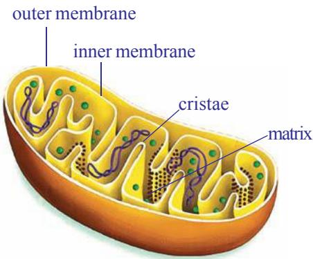  
fig-10: Mitochondria

involves a series of different chemical reactions.

From the breakdown of glucose the energy is released and stored up in a special compound, known as ATP (adenosine triphosphate). It is a small parcel of chemical energy. The energy currency of these cells is ATP an energy rich compound that is capable of supplying energy wherever needed within the cell. Each ATP molecule gives 7200 calories of energy. This energy is stored in the form of phosphate bonds. If the bond is broken the stored energy is released.

Do cells of alveoli or lungs also require oxygen to carry out cellular respiration? Why/Why not?

In short, at cellular level we could have the following pathways starting with glucose (It is one example, remember that there are other components of food as well).

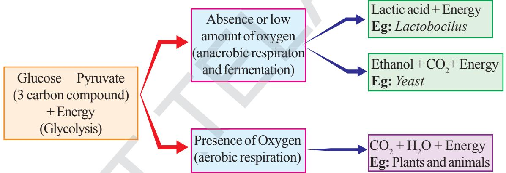

Glucose is the most commonly used sugar for deriving energy in plants, animals and in microorganisms. In all these organisms the glucose is oxidized in two stages. In the first stage it is converted into two molecules of pyruvic acid. In the second stage if oxygen is available pyruvic acid is oxidized to $\mathrm { C O } _ { 2 }$ , water and large amount of energy is released.

If oxygen is inadequate or not utilised pyruvic acid is converted into either ethanol or lactic acid and very little amount of energy (nearly one tenth of that is produced with adequate amount of oxygen) is released.

## Can energy be released without oxygen?

After undergoing strenous exercise, we feel pain in muscles. Does adequate oxygen reach the muscles?

What is being formed in the muscles?

When you sprint a hundred yards, you do a considerable amount of muscular work. But you do not start a race by standing on the track and panting for a few minutes to stoke up with oxygen first. In fact you can run the race with very little extra breathing. The fastest sprinters do not breathe at all when running a hundred yards. After you have reached the destiny, however, you feel very different. Depending on your state of training, and on how hard you ran, you will pant for some minutes after the race, until your breathing gradually returns to normal.

These facts could be linked up with what we have learned so far about ATP. It might be that the race was run on the energy

produced when the ATP already present in your muscles was being converted to ADP. Unfortunately this pleasantly simple idea is inadequate, because we only carry sufficient ATP in a muscle to last for about half a second when doing vigorous exercise. There must be some other explanation for the way in which we can produce energy first and then use up oxygen later.

One approach in the study of this problem was to analyze the blood of a person during and after exercise. For obvious reasons the athlete taking part in the experiment had to stay still where the apparatus was. He pedaled a stationary bicycle, or ran on a tread mill (belt moving as fast backwards as the athlete moved forwards). Some results are shown in the graph. Vigorous exercise lasted for nine minutes (shown by the bar at the base of the diagram) and regular blood samples were taken and analyzed. One

particular compound in the blood, lactic acid, was found to vary greatly in its concentration as you can see from the graph.

Observe the graph of lactic acid accumulation in the muscles of an athelete and answer the following questions.

(Graph showing varying amount of lactic acid in the muscles)

x - axis $=$ Time in minutes

y - axis $=$ Concentration of lactic acid in blood $\mathrm { m g } / \mathrm { c m } ^ { 3 }$

  
fig-11: Athlete (Strenous excercise)

  
Graph showing effects of vigorous excercise on the concentration of lactic acid in blood.

a. What was the concentration of lactic acid in the blood to start with?   
b. What was the greatest concentration reached during the experiment?   
c. If the trend between points C and D were to continue at the same rate, how long might it take for the original lactic acid level to be reached again? (Hint: extend the line CD until it reaches the starting value.)   
d. What does high level of lactic acid indicate about the condition of respiration?

Accumulation of lactic acid results in muscular pain. If we take walk, brisk walk, slow jogging, running for same distance we feel that there an increase in pain levels this is because of lactic acid accumulation.

It seems as if the lactic acid was being produced rapidly by the active muscles, and then only gradually removed from the blood after exercise. What is surprising is that the athlete needs a great length of time to recover. The simplest explanation we can produce at-this stage is that the sugar in the working muscles was being changed to lactic acid. The energy stored in lactic acid molecules is less than that in sugar molecules, and if the acid comes from the sugar then the energy released could be used to rebuild ATP from ADP and phosphate.

During a 100 m race a well-trained athlete can hold his breath all the time it is not until afterwards that he pants. In this case, the muscles are using the energy released during the anaerobic breakdown of glucose. It is not until afterwards that the athlete obtains the oxygen needed in order to remove the lactic acid. Therefore, when we under-take strenuous exercise we build up what is called an oxygen debt which has to be repaid later. In a longer race athletes have to breathe all the time, so some lactic acid isT removed while they are running, and they can go on for longer before becoming exhausted. The presence of lactic acid in the blood is the mainR cause of muscle fatigue, but if the body is rested for long enough the tiredness goes.

## Anaerobic respiration

We have found that living things produce carbon dioxide and give out energy. If these processes are caused by an oxidation process, what happens if the oxygen supply is cut off? If human muscles can go on releasing energy when they are short of oxygen, what can cells of other living organisms do?

Let us find out by doing some experiments.

### Some experiments with yeast

To test this idea we can see whether it is possible to detect any rise in temperature and the production of carbon dioxide, when living organisms are kept away from a supply of oxygen.

Yeast grows rapidly if it is supplied with glucose in solution. Indeed, wild yeasts are normally found growing on the skins of fruits like grapes and apples, from which they derive their food supplies. Our immediate problem is to remove the oxygen from the glucose solution and yeast.

Arrange the apparatus as shown in fig. 12

1. You can remove dissolved oxygen from glucose solution by heating it for a minute, and then cooling it without shaking. Now put in some yeast; the supply of oxygen from the air can be cut off by pouring one centimetre layer of liquid paraffin on to the mixture.

  
fig-12: Testing for production of heat and $C O _ { 2 }$ under anaerobic respiration

2. If you wish to check that the oxygen has been removed from the mixture, add a few drops of diazine green (Janus Green B) solution to the yeast suspension before you pour the liquid paraffin (wax) over it. This blue dye turns pink when oxygen is in short supply around it.   
3. Arrange for any gas produced by the yeast to escape through a wash bottle containing bicarbonate/indicator solution (or lime water).

During the process of anaerobic respiration some amount of carbondioxide is released. The released carbondioxide passes through the tube and turns lime water milky. We can observe the change in the temperature also during this process out for yourself. You may prefer to carry out the ‘carbon dioxide production’ part of the experiment on a smaller scale, using test tubes. If you do, then warm them to about $3 7 \mathrm { { } ^ { \circ } C }$ in order to speed up the test.

What happens when a baker prepares a dough by mixing yeast in it?

## Fermentation

Let us recall maida dough and yeast powder activity that you performed in class VIII in the chapter ‘The story of microorganisms’. Why volume of the dough has increased? Which gas released in that reaction?

If yeast and sugar solution are left to stand without oxygen for some days, they develop a characteristic smell, caused by production of new compound called ethanol, which has been manufactured by the yeast from

the sugar. The same type of smell you can notice from preserved idly, dosa dough at your home. But not in refrigirator. The ethanol can be separated from the yeast-glucose mixture by the process of fractional distillation since ethanol boils at a lower temperature $( 7 0 ^ { \circ } \mathrm { C } )$ than the sugar solution. Collect information about fractional distillation with the help your teacher.

Quite like aerobic respiration this is a process of producing energy when there is no supply of oxygen.

Respiration is an energy releasing pathway, do you agree? Justify your answer.

## Respiration versus combustion

Lavoisier around the late $1 8 ^ { \mathrm { t h } }$ century, through a series of carefullycentury, performed experiments, came to the opinion that respiration was a process like combustion. He wrote in a compilation in 1783, “respiration is a combustion process. It is a very slow process and here oxygen is not only combines with carbon but also with hydrogen.” Robinson also stated that respiration is a type of combustion and combustion is the source of heat in animals.

### Activity-2

## Observing changes during combustion of glucose

Arrange apparatus as shown in the figure and heat it over a flame. Does it melt? What happens if you heat for somemore time?

When glucose burns, carbon dioxide and water are produced and energy is released as heat.

We know that combustion of glucose gives us carbon dioxide, water and energy while from the respiratory equation we get the same products. But essentially the processes must differ due to following reasons.

1. Glucose must be burnt at high temperature in the laboratory to liberate energy, if it happened in our cells,all cells would be burnt.

2. Once glucose starts burning we can’t stop the process easily, but living cells are able to exercise control over the sort of burning of glucose in the presence of oxygen.

  
fig-13: CO2 - a by product of energy release

3. Water normally stops combustion from taking place while cells contain a lot of water and respiration still goes on.

What can you conclude from this?

## Heat production by living organisms

Heat production was a feature of burning glucose or sugar as you observed earlier. Living animals and plants usually produce energy in the form of heat.

We feel warm when we wear sweater in winter season. We know that sweater prevents loss of heat energy produced by the body. Does this suggest any way in which our bodies lose heat to the surroundings?

What are the other ways in which our body loses heat?

Heat is constantly lost from the body surface thus it must be continuously generated within our bodies to replace what has been lost to keep the body temperature constant.

Is the rate of heat production always the same?

In the course of vigorous activity, a greater amount of heat is generated. We know that we feel hot after some form of strenuous exercise such as running.

During cellular respiration energy is released. Some part of energy is stored in the form of ATP. Some part of energy is utilised in our day to day life activities. And the excess amount of energy is released in the form of heat. But in case of vigorous activity like running we need more amount of energy. For this the rate of respiration is increased. So heat is also released in excess quantity. That’s why we feel warm. If the oxygen is not sufficient during vigorous exersise muscles start anaerobic respiration. Hence, lactic acid is formed. We know that accumulation of lactic acid causes pain in muscle. We reach normal position after some rest. Deep breathing helps us to restore energy in our body. Refer in annexure about Yoga Asanas.

## Evolution in gases exchanging system

Exchange of gases is a common life process in all living organisms, but it is not same in all. Single celled organisms Amoeba or multicellular organisms like Hydra and Planarians roundworms and earthworms obtain oxygen and expel carbon dioxide directly from the body by the process of diffusion. In other multicellular animals special organs are evolved. Animals either terrestrial or aquatic adopted to different types of respiration and possess different types of respiratory organs mostly depending on the habitat in which they live. Body size, availability of water and the type of

their circulatory system are some of the reasons for the animals to develop different types of respiratory organs.

There is tracheal respiratory system in insects like cockroach, grasshopper etc. Tracheal respiratory system consists of series of tubes called trachea. This is divided into fine branches called tracheoles which carry air directly to the cells in the tissues.

Some aquatic animals like fishes have developed special organs for respiration which are known as gills or branchiae. Blood supplied to gills through capillaries which have thin walls where gases are exchanged. This is called branchial respiration. Fish keeps its mouth open and lowers the floor of the oral cavity. As a result water from outside will be drawn into the oral cavity. Now the mouth is closed and the floor of the oral cavity is raised. Water is pushed into the pharynx and is forced to gill pouches through internal branchial apertures. Gill lamellae are bathed with water and gaseous exchange takes place.

Respiration through skin is called cutaneous respiration. Frog an amphibian can respire through cutaneous and pulmonary respiration (through lungs) processes as well as Bucco-Pharyngeal Cavity. Terrestrial animals like reptiles, birds and mammals, respire through lungs. Ask your teacher how crocodiles and dolphins respire?

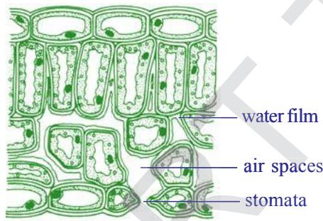  
fig-14: Leaf as a respiratory organ

  
fig-15: Lenticels on stem

## Respiration in Plants

You already know about stomata in leaf where gaseous exchange takes place in plants. There are other areas on the plant body as well through which gaseous exchange take place like surface of roots, lenticels on stem etc. (Fig showing stomata and lenticels). Some plants have specialized structures like breathing roots of mangrove plants as well as the tissue in orchids that produces oxygen is also required by plants to produce energy and carbon dioxide is released. But $\mathrm { C O } _ { 2 }$ is required elsewhere in the plants try to identify them.

## Conduction within the plant

The stomatal openings lead to a series of spaces between the cells inside the plant. Which form a continuous network all over the plant. The spaces are very large in the leaves, much smaller in other parts of the plant. The air spaces are lined with water where the oxygen is dissolved in this and passes

through the porous cell walls into the cytoplasm. Here the sugar is broken down into carbon dioxide and water with the liberation of the energy. The carbon dioxide passes out into the air spaces by a similar method.

The whole system works by diffusion; as the oxygen is used up by the cells a gradient develops between the cells and the air in the spaces. Similarly between the air in the spaces and the air outside the stomata and lenticels, so oxygen passes in. In the same way, as more carbon dioxide is released by the cells a gradient occurs in the reverse direction and it passes out to the environment.

## Aeration of roots

Most plants can aerate their roots by taking in the oxygen through the lenticels or through the surface of their root hairs (as their walls are very thin). They obtain oxygen from the air spaces existing between the soil particles. But, plants which grow in very wet places, such as ponds or marshy soils, are unable to obtain oxygen. They are adapted to these water-logged

  
fig-16: Aerial/respiratory roots

conditions by having much larger air spaces which connect the stems with the aerial roots, making diffusion from the upper parts much more efficient.

The most usual adaptation is to have a hollow stem. Next time when you are by a pond or marsh cut the stems of some of the plants which are growing there and see how many are hollow compared with a similar number of species of plants growing in normal soil. The problem of air transport is more difficult for trees and not many survive with their roots permanently in water. An exception is the mangrove tree of the tropics which have aerial roots above the soil surface and takes in oxygen through these roots.

To know more about respiration in plants we should perform the following activities.

### Activity-3

Take a handful of moong or Bengalgram seeds. Soak the seeds in water a day before to perform your experiment. Keep these soaked seeds in a cloth pouch and tie with a string tightly. Keep the cloth pouch in a corner of your class room. Next day collect the sprouts/ germinated seeds from the pouch, keep it in a glass bottle/plastic bottle(around 200 ml capacity). Take a

  
fig-17: Evolved $C O _ { 2 }$ in respiration

small beaker, fill three fourth with lime water. Insert it in the beaker carefully. Close the plastic bottle tightly. Make a similar set with unsprouted seeds. Keep this set undisturbed for one or two days. During this time observe the colour of lime water in both the sets. In which set does the colour change faster? Why?

## vity-4

  
fig-18: Heat evolved during respiration

Take sprouts which were prepared for above activity in a thermosflask. Remove the lid and prepare a cork (with thermocol, or rubber or any other material) through which you can bore a hole to insert a thermometer. Take care that the bulb of the thermometer should dip in the sprouts. Close the flask with this tight fitting cork. Record the temperature for every two hours. You are advised to do this for at least 24 hours.

Make a graph by using your observations.

Is there any increase in temperature?

Does the temperature increase steadily or does it abruptly increase at a time of the day?

Where does the heat come from?

## Photosynthesis versus Respiration

Plants carry out photosynthesis, which means that they produce their own food from atmospheric $\mathrm { C O } _ { 2 }$ using light energy from the sun. This process is a complex series of steps involving the conversion of light energy into chemical energy, which is then used to synthesize sugars from carbon dioxide. This is a process of synthesis or an anabolic process which occurs in the chloroplasts.

The equation below summarizes the photosynthetic process

After balancing the equation

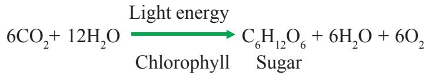

Once produced, the sugars can then be used for the process of respiration to provide energy to run all life processes.

Respiration as we know is not just the exchange of gases. It is the process of breakdown of complex food molecules or a catabolic process to produce chemical or potential energy.

This can be summarized by the equation

$$
\left(\mathrm {C H} _ {2} \mathrm {O}\right) \mathrm {n} + \mathrm {O} _ {2} \longrightarrow \mathrm {C O} _ {2} + \mathrm {H} _ {2} \mathrm {O} + \text {E n e r g y}
$$

$$
\mathrm {C} _ {6} \mathrm {H} _ {1 2} \mathrm {O} _ {6} + 6 \mathrm {O} _ {2} \longrightarrow 6 \mathrm {C O} _ {2} + 6 \mathrm {H} _ {2} \mathrm {O} + \text {E n e r g y}
$$

Photosynthesis and respiration appear to be opposing reactions, but both have very different biochemical pathways and are essential for a plant’s metabolism.

Photosynthesis takes place in the chloroplast to produce sugars, starch and other carbohydrates for the plant’s metabolic needs. Cellular respiration occurs in mitochondria where these carbohydrates are “burned” to produce chemical energy to function at the cellular level. During day time, the rate of photosynthesis is usually higher than that of respiration while at night it is just reverse in most plants. Temperature, humidity, light intensity etc. seem to affect the ratio of photosynthesis and respiration in plants.

## Key words

Aerobic respiration, Anaerobic respiration, Alveoli, Pharynx, Trachea, Bronchi, Bronchioles, Epiglottis, Anabolicprocess, Catabolicprocess, Aerial roots, Lenticels, Fermentation, energy currency.

## What we have learnt

By “respiratory system” we usually mean the passages that transport air to the lungs and to the microscopic air sacs in them, called alveoli (where gases are exchanged) and vice versa.

The term ‘respiration’ refers to the whole chain of processes from the inhalation of air to the use of oxygen in the cells.

Lavoisier found that the air that we breathe out precipitated lime water

Air passes from nostrils to nasal cavity to pharynx, larynx, trachea, and bronchi, bronchioles to alveoli and blood and back through the same route.

Gas exchange in the lungs takes place in the tiny air sacs called alveoli in the lungs. The lungs have millions of alveoli and each lies in contact with capillaries.

Diaphragm is a muscular tissue present at the floor of the chest cavity.

During inspiration (inhalation) the volume of the chest cavity is increased as the diaphragm contracts and dome flattens out, its internal pressure decreases and the air from the outside rushes into the lungs.

During expiration, the chest wall is lowered and moves inward, and the diaphragm relaxes and assumes its dome shape. These changes increase the pressure on the lungs; their elastic tissue contracts and squeezes the air out through the nose to the external atmosphere.

Air is filtered in the nasal cavity and the whole length of the trachea.

The moist surface of the lining of the nasal cavity, and the hairs growing from its sides, remove some of the tiny particles of dirt in the air. In addition, as the inhaled air passes through the nasal cavity, its temperature is brought close to that of the body, and it takes up water vapour. So that it becomes more moist than before.

Pharynx is a common passage of digestive and respiratory system. Epiglottis, a flap like muscular valve controls movement of air and food towards their respective passages.

Larynx is a stiff box like structure containing our vocal cords. When air passes out of the lungs and over the vocal cords, it causes them to vibrate. This produces sounds on the basis of our speech, song etc.

Trachea is the wind pipe channeling air to lungs.

At its lower end the trachea or the wind pipe divides into two bronchi-one leading to each lung.

The bronchi divide into smaller and smaller branches called bronchioles.

These finally terminate in clusters of air sacs called alveolus in the lungs which are very small and numerous. Gaseous exchange takes place here as blood capillaries take up oxygen and expel carbon dioxide here.

Aerobic respiration occurs in adequate supply of air producing a lot of energy, carbon dioxide and water.

Anaerobic respiration and fermentation occurs in inadequate supply or absence of oxygen to produce energy.

Cells may resort to the breakdown of 3 carbon compound, pyruvate, aerobically or anaerobically depending upon the availability of oxygen. Usually in multicellular organisms cells fail to carry on the process of anaerobic respiration for long.

Respiration is not essentially a process of combustion differ due to following reasons

Glucose must be burnt at high temperature in the laboratory to liberate energy, if it happened in our cells, all cells would be burnt.   
Once glucose starts burning we can’t stop the process easily, but living cells are able to exerciseR control over the sort of burning of glucose in the presence of oxygen.   
Water normally stops combustion from taking place while cells contain a lot of water andE respiration still goes on.

Photosynthesis and respiration appear to be opposing reactions, but both have very different biochemical pathways and are essential for a plant’s metabolism.

Photosynthesis takes place in the chloroplast to produce sugars, starches and other carbohydrates for the plant’s metabolic needs.

Cellular respiration occurs in mitochondria where mainly these carbohydrates are “burned” to produce chemical energy to do work at the cellular level.

1. Distinguish between (AS1)   
a) inspiration and expiration   
b) aerobic and anaerobic respiration   
c) respiration and combustion   
d) photosynthesis and respiration   
2. State two similarities between aerobic and anaerobic respiration.(AS1)   
3. Food sometimes enters the wind pipe and causes choking. How does it happen?(AS1)   
4. Why does the rate of breathing increase while walking uphill at a normal pace in the mountains? Give two reasons.(AS1)   
5. Air leaves the tiny sacs in the lungs to pass into capillaries. What modification is needed in the statement?(AS1)   
6. Plants photosynthesize during daytime and respire during the night. Do you agree to this statement? Why? Why not?(AS1)   
7. Why does a deep sea diver and mountainair carry oxygen cylinder on her back?(AS1)   
8. How are alveoli designed to maximize the exchange of gases?(AS1)   
9. Where will the release of energy from glucose in respiration take place? Mala writes lungs while Raziya writes muscles. Who is correct and why?(AS1)   
10. What is the role of epiglottis and diaphragm in respiration?(AS1)   
11. How does gaseous exchange takes place at blood level (or) cellular level?(AS1)   
12. Explain the mechanism of gaseous exchange at branchiole level.(AS1)   
13. After a vigorous excercise or work we feel pain in muscles. What is the relationship between pain and respiration?(AS1)   
14. Raju said stem also respire along with leaves in plants. Can you support this statement? Give your reasons.(AS1)   
15. What happen if diaphragm is not there in the body?(AS2)   
16. If you have a chance to meet pulmonologist what questions are you going to ask about pulmonory respiration?(AS2)   
17. What procedure do you follow to understand anaerobic respiration in your school laboratory?(AS3)   
18. What are your observations in combustion of sugar activity?(AS3)   
19. Collect information about cutaneous respiration in frog. Prepare a note and display them in your classroom.(AS4)   
20. Collect information about respiratory diseases (because of pollution, tobacco) and discuss with your classmates.(AS4)   
21. What is the pathway taken by air in the respiratory system? Illustrate with a labelled diagram.(AS5)   
22. Draw a block diagram showing events in respiration. Write what you understood about cellular respiration.(AS5)

23. How you appreciate the mechanism of respiration in our body?(AS6)   
24. Prepare an article on anaerobic respiration to present school symposium.(AS7)   
25. Prepare a cartoon on discussion between haemoglobin and chlorophyll about respiration.(AS7)

## Fill in the blanks

1. Exhaled air contains and   
2. A flap like muscular valve controls movement of air and food is _ ___.   
3. Energy currency of the cell is called   
4. Lenticels are the respiratory organs exists in _ part of plant.   
5. Mangroove trees respire with their

## Choose the correct answer

6. We will find vocal cords in ( )

A) larynx

B) pharynx

C) nasal cavity

D) tracheaD)

7. Cluster of air sacs in lungs are called ( )

A) alveoli

B) bronchi

C) bronchioles

D) air spaces

8. Which of the following is correct ( )

i) the diaphragm contracts - volume of chest cavity increased   
ii) the diaphragm contracts - volume of chest cavity decreased   
iii) the diaphragm expands - volume of chest cavity increased   
iv) the diaphragm expands - volume of chest cavity decreased

A) i

B) i & ii

C) ii & iii

D) iv

9. Respiration is a catabolic process because of ( )

A) breakdown of complex food molecules

B) conversion of light energy

C) synthesis of chemical energy

D) energy storage

10. Energy is stored in

A) nucleus

B) mitochondria

C) ribosomes

D) cell wall

## Pranayama - The art of breathing

It is wonder to know that only human beings have to learn how to breath. Our lungs are divided into lobes. At each breath we will inhale or exhale only $5 0 0 \mathrm { m l }$ of air. Where as our lung capacity is approximately $5 8 0 0 \mathrm { m l }$ . So most of the time breathing takes place in the upper lobes only. This means we are not using our lungs to their fullest capacity. Even after complete expiration approximately 1200ml of air remains in our lungs. So we can make use of $4 6 0 0 \mathrm { m l }$ of lung capacity for breathing. Think what changes are required to inhale that much air.

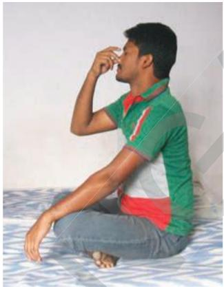

The Indian ayurvedic physician. Patanjali developed a scientific breathing practice called Yogabhyasa. Maharshi Patanjali proposed a theory called Astanga yoga. He was introduced 195 yogic principles in eight divisions. 1. Yama (Social disipline), 2. Niyama (Individual discipline), 3. Asana (Body posture), 4. Pranayama (Expansion of vital energy), 5. Prathyahara (With drawal of senses), 6. Dharana (Consentration), 7. Dhyana (Meditation), 8. Samadi (Self realisation).

The art of breathing in Yogabyasa is called Pranayama prana means gas, ayama means journey. In Pranayama practice air is allowed to enterT three lobes of lungs inorder to increase the amount of oxygen to diffuse into blood. Deep breaths in Pranayama helps us to reduce breathings perR minute form 20-22 to 15. Because of these deep breaths more amount of oxygen available to brain and tissues of the body will be more active. It is very important to practice Pranayama regularly to make our life healthy and active. All people irrespective of age and sex should practice Pranayama under the guidance of well trained Yoga Teacher to improve the workingC capacity of lungs.

# Chapter 3
# Transportation - The circulatory system

All the living organisms need nutrients, gases, liquids etc., for growth and maintenance of the body.

All the organisms would need to send these materials to all parts of their body whether they are unicellular organisms or multicellular.

In unicellular organisms these may not have to be transported to longer distances while in multicellular forms have to be sent substances to long distances as far as say over 100 feet for the tallest plant on earth.

In lower organisms like amoeba, hydra etc., all the materials are transported through a simple processes like diffusion, osmosis etc.,

In higher animals with trillions of cells in their body adopt the method of diffusion and osmosis only for the bulk movement of materials, would takes years.

To avoid delay a separate system is needed to carry the materials much faster and more efficiently.

This specialized system that is developed by organisms is called ‘the circulatory system’.

We eat solids, we drink liquids, and we breathe gases. Do you think that it is possible to transport all the three types of materials, through a single system?

Let us study how this circulation is carried out in our body.

Have you ever observed a doctor holding the wrist of the patient and looking at his watch for a minute? What is that he is trying to find out from the watch and the wrist of the patient? You may wonder to know that he is

counting the heart beat of the patient. Don’t you think that is crazy, holding the hand to count the heart beat?

### Activity-1

You could try to find out for yourself, what the doctor was doing. Keep your index and middle fingers on your wrist below the thumb as shown in the fig-1.

What did you feel?

You feel something pushing your fingers rhythmically up and down. Now let us count the rhythm which is called the pulse, for a minute. Now stand up and jog for one minute at the same place. Note the pulse for a minute. Take readings atleast two of your friends in the same manner and record in the following table.

  
fig-1: Pulse

Table-1   

<table><tr><td rowspan="2">S.No</td><td rowspan="2">Name of the person</td><td colspan="2">Pulse rate per minute</td></tr><tr><td>at rest</td><td>after jogging</td></tr><tr><td></td><td></td><td></td><td></td></tr><tr><td></td><td></td><td></td><td></td></tr><tr><td></td><td></td><td></td><td></td></tr></table>

What did you observe? Is the pulse rate same in both conditions?

### Activity-2

We see that pulse rate varies from person to person and situation to situation. So it is not constant, when you are afraid or excited the pulse rate goes up. Observe your pulse rhythm in other ways as well such as climbing stairs, running, etc. There is a relationship between the pulse rate and the beat of our heart. Now let us try to find out more about this relationship.

For this you have to make your own stethoscope. fig-2: Take a shirt button insert a matchstick as shown in fig-2. Place it on your wrist. Observe movements in matchstick.

What did you find?

When do you think that our pulse rate goes up?

What does the pulse rate show?

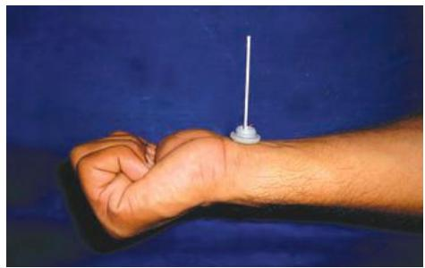  
fig-2: Matchstick stethoscope

## Do you know?

<table><tr><td>Newborn 
(0–3 months)</td><td>Infants 
(3-6 months)</td><td>Infants 
(6–12 months)</td><td>Children 
(1-10 years)</td><td>Children over 10 years &amp; adults, including senior citizens</td><td>Well-trainedadults athletes</td></tr><tr><td>100-150</td><td>90-120</td><td>80-120</td><td>70-130</td><td>60-100</td><td>40-60</td></tr></table>

In the year 1816, Rene Laennec discovered the Stethoscope. Before the discovery of stethoscope doctors used to hear heart beat by keeping ear on the chest of the patient. Laennec found that paper tube helps to hear the heart beat perfectly. Then he used a bamboo instead of paper tube to hear heart beat. Laennec called it stethoscope.

### Activity-3

Let us repeat the work done by Laennec.

Make a paper tube 10 inch long and one inch in diameter. Keep one end of it on the chest of your friend on a point one inch to the left side to the centre around 6 inches below from his or her neck. Keep your ear at the other end. Listen carefully and count the heart beats for a minute.

Also count down your friend’s pulse rate. Note observations of at least 10 students of your class in the following tabular form.

Table-2   

<table><tr><td>S.No</td><td>Name of the student</td><td>Heart beat at rest/min</td><td>Pulse rate at rest/min</td></tr><tr><td>1</td><td>Eshwar</td><td>72</td><td>72</td></tr><tr><td></td><td></td><td></td><td></td></tr><tr><td></td><td></td><td></td><td></td></tr><tr><td></td><td></td><td></td><td></td></tr><tr><td></td><td></td><td></td><td></td></tr></table>

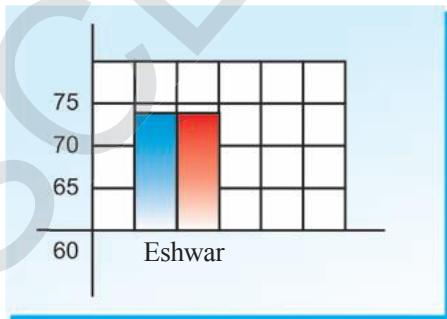  
x-axis: Name of the student   
y-axis: Heart beat, pulse rate per minute

Let us plot histogram on heart beat and pulse rate of different persons as shown in the sample graph. Here blue bar indicates heart beat, red bar indicates pulse rate.

What is the relationship between the heart beat and the pulse?

Can we say, the pulse rate is always equal to the heart beat?

You might have studied there is a relation between pulse rate and heart beat.

Now try to understand the structure and method of working of this vital organ, the heart. It is the beat of the heart which keeps us alive. Heart is located in between the lungs and protected by rib cage. The size of your heart is approximately the size of your fist.

  
fig-3: Location of Heart

  
fig-4: Heart External features

### Lab Activity

Aim: Observation of the internal structure of the mammalian heart.

Material required: Freshly collected specimen of heart of sheep or goat from the butcher. Soda straws, used pen refils, sharp and long blade or scalpel, tray, a jug of water, Dissection scissors, forceps.

Since the structure of all the mammalian hearts are similar, we take the sheep’s or goat’s heart for our observation. For this, we need following materials.

## Procedure for observation:

Before coming to the class wash the heart thoroughly so that, blood is completely drained from the chambers of heart.

Take soda straws and insert them into the stumps of the blood vessels.

Note your observations as you proceed.

How many layers are covering the heart?

(Now remove the layers covering the heart, and observe)

What is the shape of the heart?

How many large blood vessel stumps are attached to the heart?

Which end of the heart is broader and which end is narrow?

Observe the arrangement of blood vessels (coronary vessels) on the wall of the heart.

(In case you don’t have a model or a goat’s heart, look at the figures given carefully for observation)

## Internal structure of the heart

Keep the heart in the tray in such a way that a large arch like tube faces upwards. This is the ventral side.

Now take a sharp blade or scalpel and open the heart in such a way that the chambers are exposed. Take the help of the fig-5.

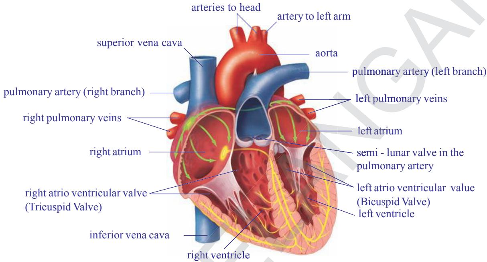  
fig-5: Internal structure of heart

Now observe the internal structure. Observe the wall of the heart.

Is the thickness of the wall of the heart uniform throughout?

How many chambers are there in the heart?

Are all the chambers of the same size?

What other differences could you observe between the chambers?

Do you find any specific observation in between two chambers?

Are all the chambers connected to each other?

How are they connected to each other? How are they separated?

You can observe white coloured structures in the lower part of the heart. Note down the size, shape and to which parts they are attached. Can you guess the function of these structures?

Write a note on your observations of the heart. Compare your notes with the description given below.

The heart is a pear shaped structure, triangle in outline, wider at the anterior end and narrower at the posterior end.

The heart is covered by two layered membrane. This is called Pericardium (pericardial membrane). The space between these two layers is filled with pericardial fluid, which protects the heart from shocks.

The heart is divided into four parts externally by grooves.

Two upper parts are called atria (auricles), and the lower ones are called ventricles.

The blood vessels found in the walls of the heart are coronary vessels which supply blood to the muscles of the heart.

The walls of the ventricles are relatively thicker than atrial walls.

In our observation we found that the heart has four chambers in it. On the left side two chambers are present, one is anterior and the other is the posterior. On the right side also two chambers present, one upper (anterior), and one lower (posterior).

The left atrium and ventricle are smaller when compared to that of right atrium and ventricle.

Observe the presence of blood vessels attached to the heart.

How many blood vessels are attached to the heart?

Are all the blood vessels are rigid? How many of them are rigid?

Do you think that the stiffness/rigidity of blood vessel is something to do with circulation?

Arteries are the blood vessels which originate from the heart and supply blood to various organs in the body. They have thick walls. The largest artery is aorta. The relatively smaller one is pulmonary artery which carries blood from the heart to the lungs.

The veins are the blood vessels which bring blood from all body parts to the heart. Veins have relatively thinner walls. The vein which is at the anterior end of the right side of the heart is superior venacava (precaval vein), which collects blood from anterior parts (head and neck) of the body.

The vein which brings blood from posterior parts of the the body (hands, legs etc.) is inferior venacava (postcaval vein).

The two atria and the two ventricles are separated from each other by muscular partitions called septa. The openings between atria and ventricles are guarded by valves.

The valve present on the Right Auriculo-ventricular septum between

Right atrium and Right Ventricle is referred to as “Tricuspid Valve”. The valve present on the left Auriculo-ventricular septum between left atrium and left ventricle is referred as Bicuscid valve or Mitral valve. A major blood vessel that originate from right ventricle is Pulmonary aorta. The valves present at the region of Pulmonary aorta are called “Pulmonary valves”. A major blood vessel originates from left ventrical is systemic aorta. The valves present at the region of systemic aorta are called Systemic valves.

In the right atrium we can observe the openings of superior and inferior venacava. In the left atrium, we can observe the openings of pulmonary veins, that bring blood from lungs.

From the upper part of the left ventricle, a thick blood vessel called aorta arises. It supplies oxygenated blood to the body parts. From the upper part of the right ventricle pulmonary artery arises that supplies deoxygenated blood to the lungs. After careful examination we can observe valves in the pulmonary artery and aorta as well.

## The blood vessels and circulation

Let us study how we came to know about the structure and functions of the blood vessels.

It was not until $1 6 ^ { \mathrm { t h } }$ century that we really came to know how our blood vessels functioned. In 1574, an Italian doctor, Girolamo Fabrici, was studying the veins in the leg. He noticed that they had small valves in them. If the blood moved in one direction, the valves folded towards the walls of the vessel, so that the blood could pass without trouble. If the blood moved in the opposite direction, the valves closed.

This meant they are one-way valves. The valves permitted the blood to move even when a person is standing upright. But not move downward.

When a person moves his legs, or just tightens his leg muscles, those muscles squeeze the veins and force the blood in those veins to move upward against the pull of gravity (because that’s the only way to go). If a person keeps his leg muscles relaxed, the blood isn’t moving much, but at least it isn’t being pulled down by gravity. The valves won’t allow that.

Everyone thought that the blood leaving the left ventricle always movedT away from the heart for which Fabrici paid no attention. He missed the importance of his own discovery. But then, William Harvey (1578-1657), an Englishman who, after he became a doctor, went to Italy for further education and studied under Fabrici.

  
fig-6: William Harvey

Harvey dissected the hearts of dead people and studied the valves between each atrium and its ventricle. He noticed that they were oneway valves. They allowed the blood to flow from the atrium to the ventricle without any hinderance.

When the heart contracted, however, no blood in the ventricle could flow back into the atrium. Instead, all the blood was pushed out into the arteries.

Harvey began thinking about the valves his teacher, Fabrici, had discovered in the leg veins. They were one-way, and they forced the blood to move toward the heart.

He checked that by tying off and blocking different veins in animals he experimented on the veins always bulged on the side of the block away from the heart. As though the blood as trying to flow toward the heart and to accumulate just below the block because it simply couldn’t flow away from the heart. This was true of all veins.

In the arteries, the blood bulged on the heart side of any block he put in, as though it were trying to flow away from the heart and couldn’t move in the other direction.

Harvey now saw what was happening. The heart pushed blood into the arteries, and the blood returned by way of the veins. It did this for both ventricles. The blood had a double circulation. If one started from the right ventricle, it left by way of the arteries to the lungs, and returned by way of the veins to the left atrium is known as pulmonary circulation and from there into the left Ventricle.From the left ventricle, it left by way of the arteries to the rest of the body and returned (in a “greater circulation”) by way of the veins to the right atrium and from there into the right ventricle. It is known as systemic circulation. As the blood reaches the heart two times, once through pulmonary cycle and again through systemic cycle, it is called double circulation.

Harvey also showed that it was impossible, suppose that the blood was used up in the body and that new blood was formed. He measured how much blood the heart pumped in one contraction and also counted the number of contractions.

He found that in one hour, the heart pumped out a quantity of blood that was three times the weight of a man. The body couldn’t use up blood and form new blood at such a rate. The same blood had to circulate and be used over and over again.T

Harvey still had some problem. The smallest arteries and veins that could be seen had to be connected by vessels too small to see. Were they really there?

  
fig-7: Marcello Malpighi

In the 1650s, scientists had learned to put lenses together in such a way that objects too small to see with the naked eye could be magnified andE made visible. Marcello Malpighi (1628-1694), with the microscope, he could see tiny blood vessels that were invisible with naked eye.

In 1661, four years after Harvey’s death, Malpighi studied the wings ofC bats. He could see blood vessels in their thin membranes and, under the microscope; he could see that the smallest arteries and veins were connected by very fine blood vessels.

He called these blood vessels “capillaries” from the Latin word for “hair”, because they were as thin as the finest of hairs.

With the discovery of capillaries, the idea of the circulation of the blood was complete, and it has been accepted ever since.

  
fig-8(a): Try like this

  
fig-8(b): Harvey’s demonstration

Now, we know that blood circulates in the blood vessels. But how did the scientists find out that blood moves in blood vessels? Is it possible to demonstrate the movement of blood in vessels without damaging the vessels?

Let us repeat the classical experiment to demonstrate the movement of blood in veins conducted by William Harvey in early $1 7 ^ { \mathrm { t h } }$ century, when there was no compound microscope or any other modern equipment.

1. Tie a tornquit just above the elbow of a person as shown in fig-8(b) whose blood vessels are prominent in the hand.   
2. Ask him/her to hold the fist with a piece of cloth rolled in the hand. Now the blood vessels can be seen more prominently.   
3. Find undivided blood vessel, where we have to work for the next few minutes.   
4. At the end of the vessel farthest from the elbow apply steady pressure, so as to close its cavity.   
5. Now apply pressure from elbow towards the palm slowly and observe the changes in the blood vessels. (Take the help of the figures given here.) Observe changes and discuss in your class.

Answer the following:

In which blood vessels valves are found? What do you think is the function of the valves in them?

Why do sub-cutaneous blood vessels bulge on the side away from the heart when the hand is tied?

The deep seated blood vessels (the arteries) bulge on the side towards the heart when tied. What do you understand from it?

There are valves in the heart between atria and ventricles. Is the purpose of valves in the veins and heart same?

Why the arteries are deeply seated in the body? Where as veins are seated on peripheral part of the body?

## Arteries and veins

There are two types of blood vessels called arteries and veins. Arteries carry blood from the heart to body parts. Whereas, veins carry blood from body organs to heart. Let us observe the structural and functional differences between arteries and veins.

  
fig-9(a): T.S. of Artery

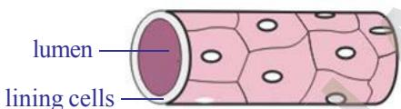  
(endothelium)   
fig-9(c): T.S.of Blood capillary

## Blood capillaries

Blood capillaries are the microscopic vessels made of single layer of cells. They allow diffusion of various substances. The leucocytes (WBC) can squeeze out of the capillary wall. They establish continuity between arteries and veins.

After reading the experiments by Harvey fill in the following table. Use the clues/options given in the first column.

Table-3   

<table><tr><td></td><td>Structure / Function of blood vessel</td><td>Artery</td><td>Vein</td></tr><tr><td>1.</td><td>Thickness of walls(thick / thin)</td><td></td><td></td></tr><tr><td>2.</td><td>Valves (present / absent)</td><td></td><td></td></tr><tr><td>3.</td><td>Capacity to retain shape when blood is absent 
(can retain/can’t retain)</td><td></td><td></td></tr><tr><td>4.</td><td>Direction of blood flow (heart to organs / body organs to heart)</td><td></td><td></td></tr><tr><td>5.</td><td>Pressure in the vessel(low /high)</td><td></td><td></td></tr><tr><td>6.</td><td>Type of blood transported 
(oxygenated / de-oxygenated)</td><td></td><td></td></tr></table>

Discuss the differences between pulmonary artery and pulmonary vein.

### Activity-4

Let us perform the following activities to observe arteries and veins.

Sit on a table with one leg dangling and the other resting on it so that the back of one knee rests on the knee of the other. After a time you will see and feel the leg which is on top give a series of small movements with each heart beat. If you do it for long you will reduce the blood flow to the leg and so develop ‘pins and needles’. Discuss with your teacher about reasons.

Swing your arm round several times to fill the veins with blood, hold the arm vertically downwards and gently press your finger along a prominent vein-stroking it in the reverse direction to the blood flow, i.e., towards the

hand. Can you see the swellings where you have pushed blood against the valves? Discuss with your teacher about reasons.

## Think and discuss

Artery walls are very strong and elastic. why?

Why we compare arteries like tree which divides into smaller and smaller branches.

The lumen size is bigger in vein when compared with artery. Why?

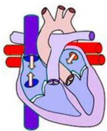

1. Imaginary relaxation of atria and ventricles.

2. Blood flows into atria.

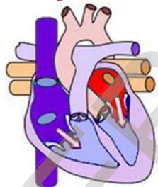

3. Contraction of atria and flow of blood into ventricles.

4. Contraction of ventricles. A.V. Valves closed (Lub) blood flows into arteries.

## The cardiac cycle

The human heart starts beating around $2 1 ^ { \mathrm { s t } }$ day during the embryonic development (refer reproduction chapter). If it stops beating, it results in the death of a person.

One contraction and one relaxation of atria and ventricles is called one cardiac cycle.

1. We start with the imagination that all the four chambers of the heart are in relaxed state (diastole).   
2. Blood from venacava and pulmonary veins enters the right and left atria respectively.   
3. Now the atria contract, forcing the blood to enter into the ventricles.   
4. When the ventricles are filled with blood they start contracting and atria start relaxing. The aperture between the atria and ventricles is closed by valves. On ventricular contraction due to pressure the blood moves into the aorta and pulmonary artery. When the valves are closed forcibly, we can listen to the first sharp sound of the heart lub.   
5. When the ventricles start relaxing the pressure in the ventricles is reduced. The blood which has entered the arteries tries to come back into the ventricles. The valves which are present in the blood vessels are closed to prevent backward flow of blood into the ventricles. Now we can listen to a dull sound of the heart dub. The atria are filled up with blood and are ready to pump the blood into the ventricles.

The sequential events in the heart which are cyclically repeated are called cardiac cycle. The cardiac cycle includes an active phase systole and a resting phase the diastole of atria and ventricles.

The time needed for atrial contraction (atrial systole) is 0.11- 0.14 seconds. The time needed for ventricular contraction (ventricular systole) is 0.27-0.35 seconds. The time needed for relaxation of both auricles and ventriculars i.e. joint diastole is about 0.4 seconds. The whole process is completed in approximately 0.8 seconds.

Hence, naturally the blood is pumped into the blood vessels at regular intervals. The tissues will not receive the blood continuously, but in the form of spurts. When we keep our finger at the wrist, where the artery is passing into the hand we feel the pressure of blood moving in it. This is the pulse. The rate of the pulse will be equal to the number of heart beats.

  
5. Relaxation of ventricles. The closing of arterial valves (Dub).   
fig-10(1-5): Cardiac cycle

Do you know?   

<table><tr><td>Name of the animal</td><td>Weight of the body</td><td>Weight of the heart</td><td>No. of 
beats/min</td></tr><tr><td>Blue whale</td><td>1,50,000 kg</td><td>750 kg</td><td>7</td></tr><tr><td>Elephant</td><td>3000 kg</td><td>12 - 21 kg</td><td>46</td></tr><tr><td>Man</td><td>60-70kg</td><td>300 gm</td><td>76</td></tr><tr><td>Coaltit (Bird)</td><td>8 gm</td><td>0.15 gm</td><td>1200</td></tr></table>

## Single /double circulation

We know that blood flows in the blood vessels. To keep the blood moving the heart pumps it continuously. The blood that is pumped by the heart reaches the body parts and comes back to the heart. But course taken by the blood is not the same in all the animals. Let us observe the fig-11(a) and (b). Start from any point in the fig-11(a) and (b). Move in the direction of arrow. Note down the parts which are in the way in cyclical form.

(Try to identify different parts of the body in both figures.)

  
fig-11(a): Single circulation

  
fig-11(b): Double circulation

Compare the two flow charts and answer the following.

How many times did your pointer touch body parts in fig-11(a) and (b)?

How many times did your pointer touch the heart in fig-11(a) and (b)?

How many times did your pointer touch the respiratory organs in fig-11(a) and (b)?

From your observation it is clear that in fig -11(a) blood flows through heart only once to complete one circulation.

If blood flows through heart only once for completing one circulation it is called single circulation.

If the blood flows through the heart twice for completing one circulation it is called double circulation.

## Lymphatic system

Have you ever observed what happened to your feet after overnight journey, in sitting position without moving? We feel that our foot wear is little tight. In elders it will be clear that the lower part of the legs will be swollen. This stage is called edema.

Why do our legs swell?

As blood flows through tissues and through blood capillaries some amount of fluids and certain solid materials are constantly flowing out of them at different junctions. Such materials are to be collected and sent back into blood circulation.

We know that blood circulates in the blood vessels, pushed by the heart. From the heart it flows into the arteries and finally into the capillaries. To supply nutrients to the cells (tissues), the liquid portion of the blood with nutrients flows out of the capillaries. This is called tissue fluid.

The tissue fluid which is present in the tissues should be transported into the blood vessels again. Some portion of the tissue fluid enters into the venules, which in turn form the veins, which carry blood to the heart. What about the remaining tissue fluid? To transport the tissue fluid in to the main blood stream, a separate system is present. That is called lymphatic system. In latin lymph means water.

Lymph is the vital link between blood and tissues by which essential substances pass from blood to cells and excretory products from cells to blood. The lymphatic system is a parallel system to venous system which collects tissue fluid from tissues and transports it to the venous system.

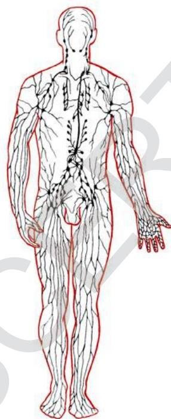  
fig-12: Lymphatic system

Blood is a substance which contains solid and liquid particles. Lymph is the substance that contains blood without solid particles. Tissue fluid is lymph present in the tissues. The liquid portion after formation of blood clot is serum.

The muscles which are attached to the skeleton (skeletal muscles) act as pumps when they contract and help in pushing the lymph flowing in lymphatic vessels and the blood flowing in veins towards the heart.

The valves that are present in the lymphatic vessels and veins stop the reverse flow of blood. We shall read about this as the system of lymph circulation in detail in higher classes.

## Evolution of the transport (circulatory) system

When the unicellular organisms separated themselves from the sea with the formation of the limiting membrane, the problem of transportation arose. The nature has found the solution, by creating a microscopic ocean which has its own currents.

In unicellular organisms like Amoeba the protoplasm shows natural movements. These movements are called Brownian movements, because of which the nutrients and oxygen are distributed throughout the protoplasm equally.

This simplest intracellular transportation system, present in unicellular animals has been retained in multicellular animals including humans. The protoplasm of any cell in our body is mobile and protoplasmic currents exist even in the nerve cells.

The multicellular animals have to develop more complicated system for transportation of materials.

The parazoans like sponges, use sea water for transportation. Since the natural water currents are not reliable, the sponges create their own currents by beating of flagella that are present in their body.

The cnidarians which are better evolved than sponges (e.g. Hydra and jelly fish) have developed blind sac like gastrovascular cavity, which has taken up the function of digestion and transportation of nutrients to each and every cell of the body.

In platyhelmenthes (e.g. Fasciola hepatica), the digestive system is highly branched and supplies digested food to all the cells directly. In these animals the excretory system collects wastes from each cell individually. In these organisms most of the body is occupied by digestive and excretory systems.

In animals belonging to Nemathelminthes (round worms), the pseudocoelom has taken up the function of collection and distribution of materials.

The Annelids, the first Eucoelomate animals have developed a pulsatile vessel, to move the fluid and the transporting medium is blood.

The Arthropods have developed a pulsatile organ to pump the blood, the heart. The blood instead of flowing in blood vessels floods the tissues, directly supplying the nutrients to the tissues. Oxygen is directly supplied to the tissues directly by the respiratory system.

Such type of transportation system which supplies nutrients to the tissues directly is called open type of circulatory system.eg. Arthropods, many molluscs and lower chordates.

The other type of transportation system where the blood takes the responsibility of delivering the materials, which flows in the blood vessels is called closed type of circulatory system. Such type of closed circulatory system is present in annelids echinoderms, cephalopod molluscs (e.g. Octopus) and all the higher chordates.

## Do you know?

The human circulatory system can move one ml of blood from heart to a foot and back which is approximately 2 meters, in about 60 seconds.

It would take more than 60 years for the substance to move across this distance by diffusion.

## Blood pressure (B.P.)

In class 9th we studied about blood and it’s components, blood grouping, etc., in the chapter animal tissues. Now we will discuss some other points related to blood.

Generally you have heard the word B.P. What is B.P.? To move the blood through this network of vessels, a great deal of force is required. The force is provided by the heart and is at its highest when the ventricles

contract, forcing the blood out of the heart and into the arteries. Then there is a drop in the pressure as the ventricles refill with blood for the next beat.

B.P. is always measured in the upper arm artery. B.P. varies throughout the body, so a standard place must be used so that a person’s blood pressure can be compared over a period of time. Doctors measure the blood pressure (B.P.) with a device called sphygmomanometer.

There are two pressure readings. One measures the strongest pressure during the time blood is forced out of the ventricles. This is called systolic pressure. For a healthy

  
fig-13: Sphygmomanometer

young adult it will be $1 2 0 \mathrm { m m }$ of Hg. The second reading is taken during the resting period, as the ventricles refill with blood. This is called diastolic pressure. It will be 80 mm of Hg.

B.P. will change according to the activity in which the person is engaged, such as resting, walking and running. People who have high B.P. during resting period are said to have hypertension. Discuss with your teacher about low blood pressure.

## Coagulation of blood

Another important part in the story of blood is coagulation. Only because of this character animals survive when they meet severe injuries.

When there is an injury blood clots in 3-6 minutes. How does the blood clot? What chemistry involved in blood coagulation. You know that when you cut yourself, the blood flows out of the wound for only a short time. Then the cut is filled with a reddish solid material. This solid is called a blood clot. If blood did not clot, anyone with even a slight wound bleeds profusely.

When the blood flows out, the platelets release an enzyme called thrombokinase.

Thrombokinase acts on another substance present in the blood called pro-thrombin converting it into thrombin.

Thrombin acts on another substance called fibrinogen, that is present in dissolved state converting it into insoluble fibrin.

The blood cells entangle in the fibrin fibres forming the clot.

The fibrin fibres are attached to the edges of the wound and pull them together.

The yellowish straw coloured fluid portion after formation of the clot is serum.

Prothrombrin ThrombinThrombrokinaseR

FibrinogenFibrinogen FibrinThrombin

Discuss with your teacher about vitamin K in relation to coagulationE of blood.

  
fig-14(a): Blood in the blood vessel

  
fig-14(b): Clot formation

Normally the blood that oozes from a wound clots in 3-6 minutes. But in some people due to vitamin K deficiency it takes more time. Because of genetic disorder the blood may not coagulate. This type of disorder is called haemophilia. Haemophilia is common disorder in the children who have born from marriages between very close relatives. Thalassemia an inherited disorder is also related to blood. For more details see annexure.

## HOW MATERIALS TRANSPORT WITH IN THE PLANT

There is a vast transport system in continual supply of essential nutrients and oxygen to perform metabolic activities, and to remove excretory substances which are found in each cell of animal body.

Is there anything like that in plants which corresponds to circulatory system?

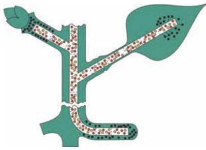  
fig-15: Transportation

In previous classes we studied about Van Helmont’s experiments on plants, which get water that contain minerals from soil through their roots. The water absorbed by roots and food prepared by leaves are supplied to the remaining parts of the plant by vascular bundles having xylem and phloem.

In the root, the xylem tissue develops from periphery to center, whereas in the stem it develops from center to periphery in each vascular bundle.

## How is water absorbed?

We know that roots absorb water with minerals from soil.

What is the mechanism behind this?

Are roots directly in contact with water?

How is water absorbed?

### Activity-5

## Absorbing root hairs

To perform this activity, you need to germinate bajra or mustard seeds.

Examine some mustard seedlings which have been grown on wet filter paper. Observe the mass of fine threads coming from the seed by hand lens. These are roots. They have fine microscopic structures called root hairs. These are root hairs through which water enters the plant. Gently squash a portion of the root hair between slide and cover slip in a drop of water and examine under a microscope. Note the thinness of the walls of root hairs. It is not completely understood how the water enters the root hairs and passes inwards from cell to cell until it gets into the xylem vessels,

but there is no doubt that osmosis plays an important role.(IX class plasmamembrane)

Every living cell acts as an osmotic system, the cytoplasm lining of the cell wall acts as the semipermeable membrane. Observe the following figure, notice how do roots penetrate into soil? You will find that the root hairs grow out into the spaces between the soil particles and that the hairs are surrounded by moisture.

  
fig-16: L.S of root showing relationship of root hair and soil water

Note: In fig-16 Arrow marks shows the direction of flow of water.

The soil water is an extremely dilute solution of salts. Soil water concentration is more dilute than that of the cell sap in the root hair; therefore water will pass into the vacuole of the root hair by osmosis. Recall the process of osmosis that you have learnt in the chapter “moving of substances through plasma membrane” in class IX. The entry of water dilutes the contents of the root hair vacuole so that it becomes more dilute than it’s neighbouring cell.

So, water passes into the neighbouring cell which in turn becomes diluted, finally water enters the xylem vessels. As there are vast number of root hairs and root cells involved, a pressure in the xylem vessels develops which forces the water upwards. This total pressure is known as root pressure. Root pressure is not the main cause of movement of water in xylem but it is certainly one of the factor. The other factors are also there. You will learn about those reasons in higher classes in detail.

### Activity-6

## What is root pressure

Take a regularly watered potted plant and cut the stem portion 1 cm above the ground level. Then connect a glass tube by means of strong rubber

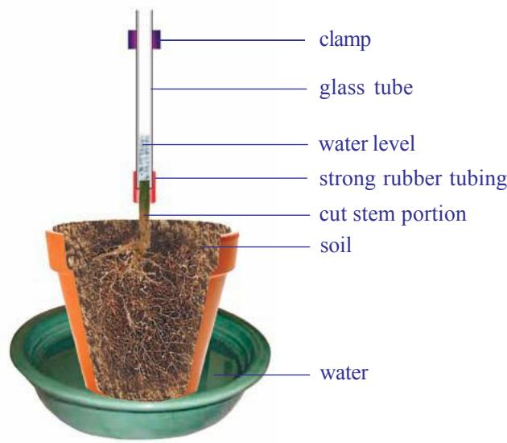  
fig-17: Root pressure

tubing as shown in the figure. The size of glass tube should be equal to the size of the stem. Take care while joining tube and stem being bound tightly, so that water cannot escape from the tube. Now, pour some water in the glass tube until water level can be seen above the rubber tube. Mark the level of water $( \mathbf { M } _ { 1 } )$ in the tube. Keep your arrangement aside for 2 to 3 hours. Then observe and mark the water level $( \mathbf { M } _ { 2 } )$ in the tube.

Is there any increase in the water level?

What is the role of xylem in this action?

The difference between $\mathbf { M } _ { 2 }$ and $\mathbf { M } _ { \overline { { \mathbf { \Gamma } } } _ { 1 } }$ indicates the level of water raised in the stem. Because of the root pressure, the water level increases in the tube.

## The mechanism of water movement in plants

We have seen that there is a push from below due to root pressure on the columns of water in the xylem vessels, but this is seldom high and in some seasons it is nil. How does the water reach 180 metres high to the top of a tree like a eucalyptus?

Let us recall the activity that you performed in lower classes. Why inner sides of cover become moist? Where do these water droplets or water vapour come from?

  
fig-18: Transpiration

We know that this type of evaporation of water through leaves is called transpiration. Water evaporates through stomata of leaves and lenticels of stem.

When the leaves transpire, there is a pulling effect on the continuous columns of water in the xylem vessels. The top ends of these vessels are surrounded by the leaf’s mesophyll cells which contain cell sap, so the water is continuous from the xylem vessels to the walls of the mesophyll cells from which it evaporates into the air spaces causing the pull. The water column does not break because of its continuous molecular attraction. This is a property of water you demonstrate every time you drink through a straw.

Now we have a picture of the water-conducting system of a tree. Water is absorbed by osmosis from the soil by

the root hairs. This is passed into the xylem vessels which form a continuous system of tubes through root and stem into the leaves. Here the water evaporates and releases into the atmosphere. The evaporation creates the main pull of water above root pressure which gives a variable and minor push from below. This results in a continuous column of moving water, the ‘transpiration stream’.

Is there any relation between transpiration and rain fall?

The amount of water passing through a plant is often considerable. For example, an oak tree can transpire as much as 900 liters of water per day. It follows therefore that areas of forest significantly affect the degree of saturation of the air above them, so that when air currents bring air which is already nearly saturated to a forest area, it becomes fully saturated and comes down as rain; this is why forest areas often have a higher rainfall than areas nearby.

## Do you know?

How much water is transpired by plants? Each fully grown maize plant transpires 15 liters per week. One acre of maize may transpires more than 13,25,000 liters of water in a hundred day growing season. A big mango tree will transpire from 750 to more than 3500 liters of water per day during growing season.

## Transport of mineral salts

You know that mineral salts are necessary for plant nutrition (micro and macro nutrients) and that they are obtained from the soil solution through the root hairs. The salts are in the form of electrically charged ions. Sodium chloride (NaCl) is in the form of $\mathrm { N a ^ { + } }$ and Cl- , and Magnesium Sulphate $\mathrm { ( M g S O _ { 4 } ) }$ occurs as $\mathrm { M g ^ { 2 + } }$ and $\mathrm { S O } _ { 4 } ^ { 2 \cdot }$ -. But, they are not absorbed into the root hairs by the simple process of diffusion, but it involves the use of energy by the cytoplasm which will be discussed in later classes. Once ions are absorbed, the ions travel along with water in the xylem vessels and pass to the growing points of the plants where they are used for growth purpose. They may also pass laterally from xylem to phloem. Thus, mineral salts are one of the natural factors in plant growth phenomena.

## Transport of materials in plants

Food such as sugar is synthesised in the green parts of plants, mainly the leaves, but this food has to be transported to all the living cells, especially to actively growing cells and the cells which stores food.

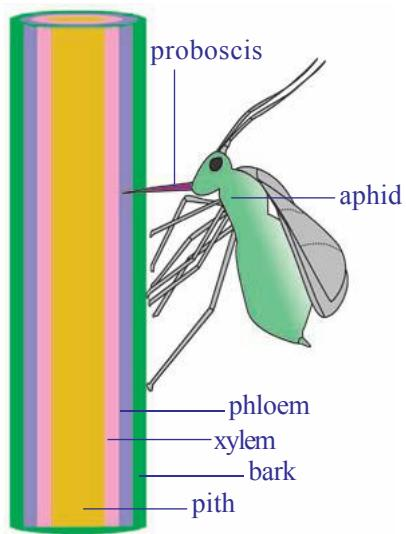  
fig-19: Aphid extracting food material from plant

The veins of a leaf consist of xylem and phloem, and these tissues are continuous with the stem. The following experiments provide evidence that food is transported in the phloem cells.

Phloem sieve tubes are extremely small and theN analysis of their contents is not easy. Biologists studied about food transportation in plants with the help of aphids (greenfly). When you see aphids clustering round the young stems of plants as they feed on the plant juices. To obtain this juice an aphidG pierces the plant tissues with its long needle like organ “proboscis”. It can be shown when a feeding aphid is killed and the stem carefully sectioned, the proboscisN only penetrates upto a phloem sieve tube. This

proboscis also provides a ready-made means of obtaining the juice for analysis! The experiment can be done in this way. An aphid is killed while in the act of feeding and the body is then carefully cut away, leaving the hollow proboscis still inserted into the phloem. It is found that because the contents of the phloem sieve tubes are under slight pressure the fluid slowly exudes from the cut end of the proboscis in the form of drops; these drops are then collected and analysed. The fluid is found to contain sugars and amino acids.T

Not surprisingly, aphids absorb so much sugar from the phloem that they cannot assimilate all of it and it excretes out of the body as a sticky syrup called honey dew. Leaves which have been attacked by aphids oftenT feel sticky as a result of honey dew.

  
fig-20: Removing ring of bark (Ringing experiment)

You may notice that sometimes barks of the tree damaged more than a half, even then the tree is alive. How is this possible?

Further experiments to illustrate the conduction of sugars by the phloem have been done by removing a ring of bark from a shoot to expose the wood. Remove all tissues from the center outwards, including the phloem. After a few days, when the tissues above and below the

ring were analyzed it was shown that food had accumulated above the ring, but was not present below it. If it is left for some more time, the stem increases in thickness immediately above the ring, but no growth occurred

below it. So, any damage to the phloem all around the stem will prevent the food from passing down to the roots and the tree will eventually die. This is a fact of great economic importance because certain mammals scratching the bark of trees to get the food stored in the phloem, especially during hard winters when food is scarce. Voles (rat like rodents) do this to young saplings at ground level and rabbits can do much damage to older ones. Foresters find it economically worthwhile to enclose new plantations with wire netting to prevent rabbits from entering.

Foresters also encourage predators such as foxes, badgers, hawks and owls as they help to keep down the population of voles and rabbits. Grey squirrels too do great damage, particularly Casurina crop grown at beech and seashore, and for this reason, in some parts it is impossible to grow these trees as a crop. Observe barks of trees in your surroundings for evidence of bark having been gnawed off saplings and trees. Note the species of tree, the position of the damage, whether the damage is recent or old, and the size of tooth marks if these are visible. From these observations you could find out which species had caused the damage. Also look out for the effect of such damage on the tree as a whole.

## Key words

Circulation, Auricles, Ventricles, Pulse, Artery, Vein, Stethoscope, Aorta, Capillary, Systole, Diastole, Cardiac cycle, Blood pressure, Lymph, Single circulation, Double circulation, Coagulation of blood, Sphygmomanometer, Prothrombin, Thrombin, Fibrinogen, Fibrin, Root hair, Radical, Root pressure, Plant nutrients, Xylem, Phloem, Vascular bundles.

## What we have learnt

The pulse rate is equal to heart beat. We can count the heart beat without the aid of any instrument.

Rene Laennec discovered the first stethoscope.

The heart is covered with two pericardial membranes filled with pericardial fluid which protects it from shocks.

Rigid blood vessels attached to the heart are called arteries. The two rigid blood vessels are arteries which supplies blood to body parts and lungs.

The less rigid vessels are veins, which brings blood from body parts.

Heart has four chambers, two upper atria and two lower ventricles.

Atrium and ventricle of the same side are connected by atrio ventricular aperture.

Atria are separated from each other by interatrial septum, ventricles by interventricular septum.

The atrioventricular apertures are guarded by valves. There are valves in the aorta and pulmonary artery also.

The right side of heart receives blood from body and sends to lungs.

The left side of the body receives blood from lungs and send it to body parts.

The arteries carry oxygenated blood except pulmonary artery. The veins carry deoxygenated blood except pulmonary veins.

One contraction and relaxation of heart is called cardiac cycle.

If the blood goes to heart only once before it reaches all the body parts. It is called single circulation.

If it goes twice it is called double circulation.

Vitamin K deficiency leads to delayed coagulation of blood.

Plants absorb soil water through roots by the process of osmosis.

Water travels through xylem vessels and food material travels through phloem tissues.

There is a relation between tranportation and transpiration in plants.

Biologists studied about phloem tubes with the help of aphids.

## Improve your learning

1. What is transport system? How does this help the organism?(AS1)   
2. What is the relationship between blood and plasma?(AS1)   
3. Which type of blood vessels carry blood away from the heart?(AS1)   
4. What are the three main types of blood vessels in the body?(AS1)   
5. Which is the largest artery in the body? Why is it the largest ?(AS1)   
6. Which blood vessel carries blood for oxidation?(AS1)   
7. Name the structures which are present in veins and lymph ducts and absent in arteries.(AS1)   
8. What is the use of platelets?(AS1)   
9. Write differences between (AS1)

a) systole - diastole

b) veins - arteries

c) xylem - phloem

10. Explain the way how the plants absorb water from soil ?(AS1)

11. What is root pressure? How it is useful to the plant?(AS1)   
12. Phloem is a food source for some animals. How can you justify this statement?(AS1)   
13. Read the given para and name the parts of the heart.(AS1)

We have observed that the heart is divided into four chambers by muscular structure. Any structure that divides two chambers is known as septum. Now let us try to name the septa present in the heart.

a) The septum that divides the two atria can be named as

b) The septum that divides the two ventricles can be named as   
c) The septum that divides the atrium and ventricle can be named as

The holes that connect two chambers are called apertures. Let us try to name the apertures which connect the atria and ventricles.

d) The aperture that connects the right atrium and right ventricle can be named as_   
e) The aperture that connects the left atrium and left ventricle can be named __. Any structure that closes an aperture, and allows one way movement of materials is called as valve. Now let us name the valves that are present in the chambers of the heart.

f) The valve that is present between left atrium and left ventricle can be named as_   
g) The valve that is present between right atrium and right ventricle can be named as

14. If the valves in veins of the legs fail to stop the flow of blood what could be the consequences of this failure?(AS2)

15. What would happen if cell sap in the cells of root hair contain a high concentration of ions?(AS2)   
16. John made a stethoscope using a paper cup and plastic tube. Write down the procedure he followed. (AS3)   
17. How did scientists prove that the food is transported through the phloem?(AS3)   
18. What is your inference about experiments with aphids?(AS3)   
19. Collect information about blood pressure of your school teachers or nighbours. Prepare a report on their health problems due to changes in blood pressure. (AS4)   
20. Draw a block diagram to explain single and double circulation. Write differences between them.(AS5)   
21. Prepare a block diagram showing water absorption by roots to transpiration by leaves . (AS5)   
22. What can circulatory system in man be compared with? (AS6)   
23. What is Haemphilia? (AS1)   
24. Prepare a cartoon on heart beating? (AS7)   
25. After reading this lesson what precautions would you suggest to your elders about edima.(AS7)

## Choose the correct answer

1. The term cardiac refers to which organ in the body? ( )

A) heart

B) vein

C) lymph

D) capillary

2. In which chamber of the human heart the blood is low in oxygen? ( )

A) right atrium

B) right ventricle

C) left atrium

D) A and B

3. Which structures of the heart control the flow of the blood? ( )

A) arteries

B) veins

C) valves

D) capillaries

4. Which of the following statement is wrong? ( )

A) Serum is the liquid portion formed after blood clotting.   
B) Lymph is the link between blood and tissues.   
C) The xylem and phloem transport water and food in plants.   
D) In insects closed type of circulatory system is seen.

5. An aphid pierces its proboscis into the ……… to get plant juices )

A) Xylem

B) phloem

C) cambium

D) vascular bundle

## Annexure-I

## The rhesus factor

There is another antigen of red blood cells which is present in $8 5 \%$ of the people of Britain, this is known as the Rhesus factor, as it was first discovered in Rhesus monkeys. People who have this are said to be Rhesus positive $( \mathbb { R } \mathbf { h } + )$ . Those who do not have this factor are termed Rhesus negative (Rh-). Normally they do not carry an antibody to this factor in their plasma. However, if Rh+ blood is transfused into the blood of a Rh- person, against Rh-factors will be formed and these are capable of destroying $\mathrm { R h + }$ red cells. Under certain circumstances this is a potential hazard for babies.

If a $\mathrm { R h + }$ man marries a Rh- woman, some of the children are likely to be $\mathrm { R h + }$ . At birth there is always some mixing of blood between the circulation of mother and baby and this may occasionally happen during pregnancy. So, if a child is $\mathrm { R h + }$ some of its blood will leak into its mother’s circulation and cause antibodies to form in her blood. If the mother has more children, not all will necessarily be $\mathrm { R h + }$ , but if they are, the amount of antibodies in her blood often increases with each pregnancy, and in some instances the antibodies in her blood may pass into the baby’s blood in sufficient quantities to produce very serious anaemia and even death. Fortunately these cases are not frequent, and when they do occur, the baby is given a complete transfusion soon after birth so that the baby’s blood is replaced by blood containing no antibodies to the rhesus factor. It is now possible for this transfusion to be carrried out before birth. Another recently developed technique is for the mother to be given an injection shortly after the birth of her first child which prevents the $\mathrm { R h + }$ cells from stimulating the production of the harmful antibody.

## Thalassemia

Thalassemia is a group of inherited blood disorders characterized by mild to severe anaemia caused by haemoglobin deficiency in the red blood cells. In individuals with thalassemia, the production of the oxygen carrying blood pigment haemoglobin is abnormally low. There are two main types of thalassemia: alpha thalassemia and beta thalassemia. In each variant a different part of the haemoglobin protein is defective. Individuals with mild thalassemia may have symptoms, such as anaemia, enlarged liver and spleen, increased susceptibility to infections, slow growth, thin and brittle bones, and heart failure.

## Facts about Thalassemia

Thalassemia is a serious Inherited Blood Disorder.

$4 . 5 \%$ of world population (250 million) suffering with thalassemia minor.

There are over 35 million Indians are carriers of the abnormal Gene for Thalassemia.

It is estimated that about 1,00,000 infants are born with major Haemoglobinopathies every year in the world.

10,000 – 12,000 Thalassemic children are born every year in our country.

Survival depends upon repeated blood transfusion and costly medicines.

Thalassemia can be prevented by awareness, pre marital or pre conceptual screening followed by antenatal diagnosis is required.

## Treatment

Thalassemia major should be diagnosed as early as possible in order to prevent growthT restriction, fragile bones and infections in the first year of life. The infant’s haemoglobin levels and development should therefore be monitored closely. If Hb is less thanR $70 \%$ or the child shows signs of poor growth and development. Regular transfusion is the treatment of choice. According to the WHO, the aim of this treatment is to retain a median haemoglobinE value of 115–120 grams per liter. This can usually be achieved by carrying out transfusions of concentrated red blood cells at intervals of every three to four weeks.

Today thalassemia major can be cured by stem cell transplantation. A prerequisite is usually that the affected individual who has siblings with identical tissue type (HLA type) a transplantation of blood stem cells referred to as a “bone marrow transplant”, can be carried out.

# Chapter 4
# Excretion - The wastage disposing system

There is no factory which can manufacture a product without generating any waste. This is true of our body which is a cellular factory too. And for other organisms as well. Wastes are generated at regular intervals from the bodies of most organisms. This raise questions like.

Where are the wastes produced?

How are they produced?

What are the substances present in them?

Does the composition vary in the same organism in different situations?

Let us understand such kind of questions.T

Living beings need energy for their survival and to perform activities either building up of body material (anabolism) or its breakdownR (catabolism), collectively called metabolic activities. Organisms use different substances for metabolic activities. Different products are generated as a result of these metabolic activities. Can you name different products generated by the following life processes?

Table-1   

<table><tr><td>Life processes</td><td>Products</td></tr><tr><td>Photosynthesis</td><td></td></tr><tr><td>Respiration</td><td></td></tr><tr><td>Digestion</td><td></td></tr></table>

What products would the organism be able to take up for other activities?

What are the products which would cause harm to the body, if they are not removed?

What happens if harmful products are not removed from our body every day?

We have already learnt that different kinds of materials are produced out of various metabolic activities. Some of these may be harmful for the organism are removed from their body or packed and stored in some other forms. These are all the wastes produced in the body of an organism. We have already discussed how organisms get rid of gaseous wastes generated during photosynthesis or respiration. Other metabolic activities generate nitrogenous wastes have to be removed along with salts, excess water and several other materials. Excretion is the term coined for all the biological process involved in separation and removal of wastes or non useful products from the body. (In latin ex means out, crenere means shift.) Now let us study how excretion takes place in human being.

## Excretion in Human Beings

A number of reactions take place during various metabolic activities. Many useful substances and energy are produced. At the same time many other things happen such as, toxic wastes may be produced, water content may increase, ionic balance (homeostasis) in the body may be disturbed. The waste products include carbon dioxide, water, nitrogenous compounds like ammonia, urea, uric acid, bile pigments, excess salts etc. The most poisonous of all waste products of metabolism is Ammonia.

Where are these waste materials produced? How does the body manage them. Is there a way to detect their presence in our body?

Now let us observe the test reports of Blood and Urine of a person given in table-2, 3 and find out the components present in both Blood and Urine. (For 24 hours urine test urine is collected for 24 hours From that, 100-150 ml sample will be tested.) observe the reports in the next page and answer the following questions.

What are the substances present in blood?

What are the substances present in urine?

What are the substances present both in blood and urine?

Which substances are present above the normal limits both in the blood and urine?

What do you think a reading above normal limits indicates?

Table-2: DEPARTMENT OF BIOCHEMISTRY   
REPORT ON PLASMA/SERUM (BLOOD) ANALYSIS   
Table-3: DEPARTMENT OF BIOCHEMISTRY   

<table><tr><td>TEST NAME</td><td>RESULT</td><td>UNITS</td><td>RANGE</td></tr><tr><td>GLUCOSE FASTING</td><td>82</td><td>mg/dl</td><td>60-100</td></tr><tr><td>SODIUM</td><td>137</td><td>mmoles/L</td><td>135-145</td></tr><tr><td>POTASSIUM</td><td>4.10</td><td>mmoles/L</td><td>3.5-5.0</td></tr><tr><td>CHLORIDES</td><td>101</td><td>mmoles/L</td><td>95-106</td></tr><tr><td>UREA</td><td>29</td><td>mg/dl</td><td>15-40</td></tr><tr><td>CREATININE</td><td>2.8.</td><td>mg/dl</td><td>0.6-1.5</td></tr><tr><td>URIC ACID</td><td>7.50</td><td>mg/dl</td><td>3.0-5.0</td></tr><tr><td>TOTAL CHOLESTEROL</td><td>221</td><td>mg/dl</td><td>150-200</td></tr><tr><td>TRIGLYCERIDES</td><td>167</td><td>mg/dl</td><td>60-200</td></tr><tr><td>CALCIUM</td><td>9.40</td><td>mg/dl</td><td>8.0-10.5</td></tr><tr><td>PHOSPHORUS</td><td>4.50</td><td>mg/dl</td><td>3-4.5</td></tr><tr><td>BILIRUBIN (TOTAL)</td><td>0.70</td><td>mg/dl</td><td>0.1-0.8</td></tr><tr><td>TOTAL PROTEINS</td><td>7.20</td><td>g/dl</td><td>6.0-7.5</td></tr><tr><td>ALBUMIN</td><td>4.60</td><td>g/dl</td><td>3.0-5.0</td></tr></table>

REPORT ON URINE ANALYSIS   

<table><tr><td>TEST/METHOD</td><td>RESULT</td><td>UNITS</td><td>RANGE</td></tr><tr><td>24 hrs.Protein</td><td>90</td><td>mg/day</td><td>&lt;100 mg</td></tr><tr><td>24 hrs Creatinine</td><td>2.7</td><td>mg/day</td><td>1-2</td></tr><tr><td>24 hrs.Calcium</td><td>305</td><td>mg/day</td><td>Up to 200</td></tr><tr><td>24hrs.phosphorous</td><td>0.8</td><td>mg/day</td><td>upto 1g</td></tr><tr><td>24hrs.uric Acid</td><td>800</td><td>mg/day</td><td>upto 600</td></tr></table>

<table><tr><td colspan="4">ELECTROLYTES:</td></tr><tr><td>Sodium</td><td>140</td><td>mmoles/L</td><td>125-250</td></tr><tr><td>potassium</td><td>50</td><td>mmoles/L</td><td>25-100</td></tr><tr><td>Osmolality (calculated)</td><td>180</td><td>mmoles/L</td><td>100-600</td></tr><tr><td>Glucose</td><td>65</td><td>mg/dl</td><td>50-80</td></tr><tr><td>Chlorides</td><td>128</td><td>mmoles/L</td><td>120-130</td></tr><tr><td>Urea</td><td>35</td><td>gm/day</td><td>20-30</td></tr></table>

m moles / L means millimoles per litre, mg/dl means milligram per deci litre.

What are the materials needed to be removed from our body?

From where do these materials removed?

What are the organs that seperate excretory materials?

Why do you think the body must remove waste substances?

Studying the structure and function of our excretory system will help us to understand this better.

## Excretory System in Human being

In human beings excretion mainly occurs through a urinary or excretory system consisting of a pair of kidneys, a pair of ureters, urinary bladder and urethra, as shown in the fig-4. Now let us observe external and internal features of a kidney in goat / sheep, which is similar to Human kidney in function.

### )Lab Activity

Aim: Studying the external and internal features of a kidney

Materials required: Freshly collected specimen of sheep/goat’s kidney from the butcher or 3D Model of a kidney, sharp blade/scalpel, tray and a jug of water.

Procedure for observation: Before coming to the class wash the kidney thoroughly so that, blood is completely drained from it. Put the kidney in the tray and observe it carefully. Note your observations in the observation book. With the help of sharp blade take a longitudinal section here you are advised to do this activity under the guidance of your teacher and observe the internal structure.

Draw what you have observed and compare it with fig-1,2.

What is the shape of kidneys?

What is the colour of kidney?

Do you find any attachments on upper portion of kidney?

Is the Internal structures similar to fig-2

What is the colour of the outer part in L.S of kidney?

In L.S of kidney where do you find dark brown colour portion?

How many tubes are coming out from kidney fissure?

Don’t forget to wash your hands with antibacterial lotion after completing dissection.

Now let us know the structure of human excretory system and its functions.

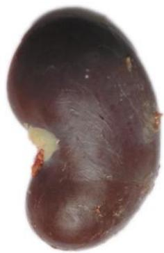  
fig-1: Kidney of goat

  
fig-2: LS of   
Kidney of goat

## Kidneys

In Human beings there is a pair of bean shaped, reddish brown structures in the abdominal cavity attached to dorsal body wall (fig-3) one on either side of the back bone they are kidneys. The right kidney is placed slightly lower than the left kidney. Think why it is so?

The size of the kidney is $1 0 \mathrm { c m }$ in length, 5-6 cm in breadth, and 4 cm in thickness. Each kidney is convex on the outer side and concave on theA inner side. The position of the right kidney is lower than the left kidney due to the presence of liver above.

Let us recall the last question in your lab activity. The inner side ofG each kidney has a fissure or hilum for the entry of a renal artery, exit of a renal vein and an ureter. Renal artery brings oxygenated blood loaded with waste products and renal vein carries deoxygenated blood. The waste products generated in various organs of the body are filtered and removed by the kidneys.

  
fig-3: Location of kidneys

  
fig-4: Excretory system

## Internal structure of the kidney:

Let us observe L.S of the kidney to know more about internal structure. It shows two distinct regions. Dark coloured outer zone called the cortex and pale inner zone called medulla. Each kidney is made up of approximately more than one million (1.3 to 1.8 million) microscopic and thin tubular functional units called nephrons or uriniferous tubules.

## Structure of nephron

Each nephron has basically two parts. 1) Malpighian body and 2) Renal tubule.

Malpighian body: It consists of a blind cup shaped broader end of nephron called Bowman’s capsule and bunch of fine blood capillaries called glomerulus. The Bowman’s capsule and glomerulus together called malpighian capsule or renal capsule. Glomerulus develops from afferent arteriole. It gives rise to an efferent arteriole.

Think why the diameter of the efferent arteriole is less than that of afferent arteriole?

Because of the narrower out let (efferent arteriole) pressure exerts in the glomerulus.It functions as a filtration unit. Bowmans capsule which accommodates one glomerulus,is lined by a single layer of squamous epithelial cells called podocyte cells. There are fine pores between podocyte cells to allow passage of materials filtered out of glomerulus.A

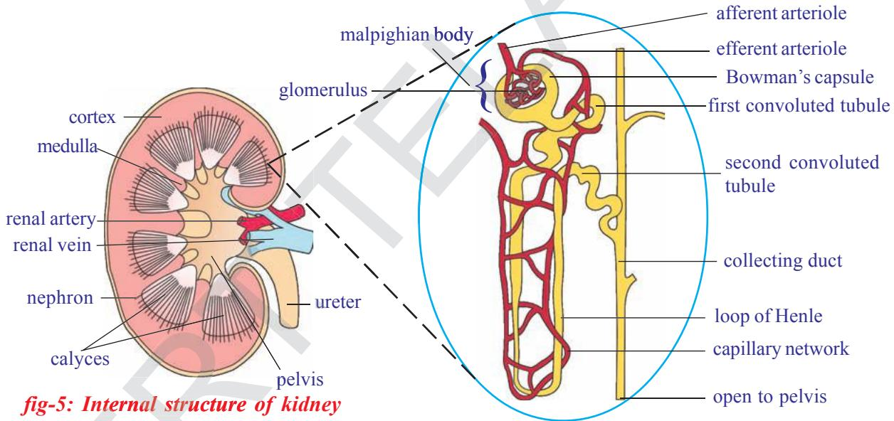  
fig-6: Structure of a nephron

Renal tubule: It has three parts. First or proximal convoluted tubule (PCT),E loop of Henle, which is U shaped, second or distal convoluted tubule (DCT).

Distal convoluted tubules open into a collecting tube. Collecting tube form pyramids and calyces which open into the pelvis. Pelvis leads into the ureter. All the parts of the renal tubule are covered by a network of peritubular (around tube) capillaries formed from efferent arteriole. The peritubular capillaries join to form renal venule, which joins the other venules to form finally the renal vein.

Why the nephron is considered to be the structural and functional unit of the kidney?

## Mechanisms of urine formation

Formation of urine involves four stages i. Glomerular filtration, ii.Tubular reabsorption, iii. Tubular secretion, iv.Concentration of urine

## i) Glomerular filtration

Blood flows from renal artery to glomerulus through afferent arteriole. Observe the fig-7 of glomerular filtration in nephron and try to answer the following questions.

Which arteriole has more diameter, afferent or efferent?e

What are the substances that are filtered into the glomerular capsule?

## ii) Tubular Re-absorption

Filtrate from glomerular is also called primary urine which almost equal to blood in chemical composition except the presence of blood cells. It passes into proximal convoluted tubule. Useful substances in primary urine are reabsorbed into peritubular net work.

If you drink more water will you pass more urine?e

What are the substances reabsorbed into peritubular net work from proximal convoluted tubule (PCT)?

## iii) Tubular secretion

After reabsorption in PCT region, the urine travels through the loop of Henle into DCT. Here some other wastes like extra salts ions of $\mathrm { K } ^ { + } \mathrm { N a } ^ { + }$ Cl – and $\mathrm { H } ^ { + }$ secretes from peritubular capillaries in to DCT. It occurs mostly in the distal convoluted tubule, which is also surrounded by peritubular capillaries. This maintains a proper concentration and pH of the urine. Smaller amount of tubular secretion also takes place in the area of proximal convoluted tubule. Observe tubular secretion in fig-7.

What are the substances that secretes into DCT?

## Do you know?

After the age of 40 years the number of functioning nephrons usually decreases by about $10 \%$ in every 10 years.

## iv) Formation of hypertonic Urine

$7 5 \%$ of water content of nephric filtrate is reabsorbed in the region of proximal convoluted tubule. $10 \%$ of water passes out of filtrate through osmosis in the area of loop of Henle. Further concentration of urine takes place in the area of collecting tubes in the presence of hormone called

i) Glomerular filtration: Blood flows inside the glomerulus under the influence of pressure due to the narrowness of efferent arteriole. As a result it undergoes pressure filtration or ultra filtration. Waste molecules, nutrient molecules and water are filtered out and enter the Bowman’s capsule.

ii)Tubular reabsorption:The peritubular capillaries around PCT reabsorb all the useful components of primary urine such as glucose, amino acids, vitamin C, Potassium, Calcium, Sodium, Chlorides and $7 5 \%$ of Water.

  
fig-7: Mechanism of urine formation

iii) Tubular secretion: It is the active secretion of waste products by blood capillaries into the urinary tubule. It ensures removal of all the waste products from blood, viz., urea, uric acid, creatinine, salt ions like $\mathrm { K } ^ { + }$ , $\mathrm { N a ^ { + } }$ and $\mathrm { H } ^ { + }$ ions. This maintance proper concentration and pH of urine.

vasopressin. The hormone is secreted only when concentrated urine is to be passed out. Think why is it not secreted when a person drinks a lot of water? Absence of vasopressin hormone produces dilute urine. Hormone action maintains osmotic concentration of body fluids. Deficiency of vasopressin causes excessive, repeated, dilute urination called diabetes insipidus.

Why more urine is produced in winter?

What happens if reabsorption of water does not takes place?

Now let us discuss remaining parts of excretory system.

## 2. Ureters

There are a pair of whitish, narrow distensible and muscular tubes of 30cm length. Each ureter arises from hilus of the kidney. It moves downward and obliquely opens into the urinary bladder. Ureter carries urine from the kidney to the urinary bladder. The movement of urine in the ureter is through peristalysis.

## 3. Urinary bladder

It is a median, pear shaped and distensible sac. It is situated in the pelvic region on the ventral side of the rectum in the abdomen. It stores urine brought by two ureters. The storage capacity of urinary bladder is 300 - 800ml.

## 4. Urethra

It is a tube that takes urine from urinary bladder to outside. The opening of urinary bladder into urethra is guarded by a ring of muscles or sphincter. Urethra is 4 cm long in females open to vestibule and in males it is about 20cm long. Its opening is separate in females but is in common with the reproductive tract in males (urino-genital duct).

## Micturition

The urine is temporarily stored in the bladder. There are two sets of circular sphincter muscles in the bladder. When the bladder is filling up both these sets of muscles are constricted, so the exit is closed. However as the pressure of the urine increases the walls of the bladder are stretched and this triggers off an automatic reflex action which causes the upper sphincter to relax. But the lower sphincter is under the control of brain. So urine can still be retained until this muscle is relaxed too. Control of urination is not possessed by very young children but is gradually learned.

Urge for micturition occurs when urinary bladder is filled with 300 - $4 0 0 \mathrm { m l }$ of urine. The stretched bladder stimulates nerve endings to develop the reflex. However, urine can be retained in the urinary bladder till it gets filled up to the maximum capacity of $7 0 0 - 8 0 0 \mathrm { m l }$ . At this time the urge becomes painful and leads to voluntary micturition. Total amount of urine excreted per day is about 1.6-1.8 litres. It’s quantity increases with larger intake of fluids like water, fruit juices and decreases with lesser intake.

## Think and discuss

Do cells need excretion?   
Why we advised to take sufficient water?   
Why do some children pass urine during sleep at night until 15 or 16 years of age?

## Composition of urine

It is a transparent fluid produced by urinary system. Urine has amber color due to presence of urochrome.Composition of normal urine varies considerably depending on several factors for instance taking a protein

rich diet will result in more formation of urea in the urine. This is because the proteins get de-aminated in the liver with subsequent formation of urea. Even sugar can appear in a normal person after a heavy intake. If other conditions are constant, a large intake of liquids or water - rich food increases the volume of water in the blood, hence more urine is excreted.

Urine contains $9 6 \%$ of water $2 . 5 \%$ of organic substances (urea, uric acid, creatine, creatinine, water soluble vitamins, hormones, and oxalates etc) and $1 . 5 \%$ of inorganic solutes (sodium, chloride, phosphate, sulphate, magnesium, calcium, iodine). It is acidic $\mathrm { ( p H = } 6 . 0$ )in the beginning but becomes alkaline on standing due to decomposition of urea to form ammonia.

What happens if both kidneys fail completely?

Complete and irreversible kidney failure is called End Stage Renal Disease (ESRD). If kidneys stop working completely, our body is filled with extra water and waste products. This condition is called uremia. Our hands or feet may swell. You feel tired and weak because your body needs clean blood to function properly. Is there any solution to this problem?

Let us know about artificial kidney.

## Dialysis Machine (Artificial kidney)

Kidneys are vital organs for survival. Several factors like infections, injury, very high blood pressure, very high blood sugar or restricted blood flow to kidneys. This leads to accumulation of poisonous wastes in the body and leads to death. Dialysis machine is used to filter the bloodT of a person when both kidneys are damaged. The process is called ‘haemodialysis’. In this processR blood is taken out from the main artery, mixed with an anticoagulant, such as heparin, and then

pumped into the apparatus called dialyzer. In this apparatus blood flows through channels or tubes which are madeup of cellophane. These tubes are embedded in the dialyzing fluid. The membrane separates the bloodC flowing inside the tube and dialyzing fluid (dialysis), which has the same composition as that of plasma, except the nitrogenous wastes.

As nitrogenous wastes are absent in dialyzing fluids, these substances from the blood move out freely, there by cleaning the blood of its wastes. This process is called dialysis. This is similar to function of the kidney but is different as there is no reabsorption involved .The cleaned blood is pumped back to the body through a vein after adding anti-coagulant (heparin).

Each dialysis session lasts for 3 to 6 hours. This method has been using for thousands of uremic / kidney failure patients all over the world.

Is there any long term solution for kidney failure patients?

## Do you know?

The first kidney transplantation was performed between identical twins in 1954 by Dr. Charles Hufnagel was a surgeon at Washington, USA . In India first kidney transplantation was done on $1 ^ { \mathrm { s t } }$ December 1971 at the Christian Medical college, Vellore, Tamilnadu.

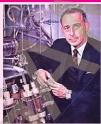  
Dr. Charles Hufnagel

## Kidney transplantation

The best long term solution for kidney failure (acute renal failure) is Kidney transplantation. A functioning kidney is used in transplantation from a donor preferably a close relative. The kidney that is received by a recipient must be a good match to his body, to minimize the chances of rejection of transplanted kidney by the immune system of the recipient. Modern clinical procedures have increased the success rate of such complicated technique.

  
fig-9: Kidney transplantation

Where is the transplanted kidney fixed in the body of a kidney failure patient?

What about the failed kidneys?

Can donor lead normal life with a single kidney without any complications?

Now a days the process of organ donation helps a lot for kidney failure patients. Organs are collected from brain dead patients, then transplanted to the

recepient. To know more about organ donation see in annexure.

## Other pathways of excretion (accessory excretory organs)

You have learnt about kidney, chief excretory organ of our body.

What are the other excretory organs of human body?

Lungs, skin, liver have their own specific functions but carry out

excretion as a secondary function.

Lungs: In respiratory process lungs remove carbon dioxide and water.

Skin: It consists of large number of sweat glands richly supplied with blood capillaries, from which they extract sweat and some metabolic wastes.

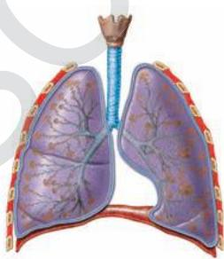

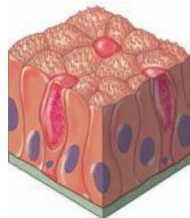  
fig-10: Lung, Skin

Since the skin sends out plenty of water and small amount of salts, it serves as an excretory organ. Sebaceous glands in skin eliminate sebum which contains waxes, sterols, hydrocarbons and fatty acids.

Collect information on sebum and prepare a news bulletin, display it on bulletin board?

People in cold countries get very less/no sweat. What changes occur in their skin and in other excretory organs?

Liver: It produces bile pigments (bilirubin ,biliverdin and urochrome) which are metabolic wastes of haemoglobin of dead R.B.Cs. The life span of RBC is 120 days. They are destroyed in the liver. Urochrome is eliminated through urine. Biliverdin and bilirubin are excreted through bile along with cholesterol and derivatives of steroid hormones, extra drug, vitamins and alkaline salts. Liver is also involved in urea formation.

Large intestine: Excess salts of calcium magnesium and iron are excreted by epithelial cells of colon (large intestine) for elimination along with the faeces.

Small amount of nitrogenous wastes are also eliminated through saliva and tears.

## Excretion in other organisms

Different organisms use varied strategies in excretion. Specific excretory organs are absent in unicellular organisms. These organisms remove waste products by simple diffusion from the body surface into the surrounding water. Fresh water organisms like Amoeba, Paramoecium possess osmoregulatory organelle called contractile vacuole. It collects water and waste from the body, swells up, reaches the surface and bursts to release its content to outside. The main excretion takes place through body surface (Diffusion).

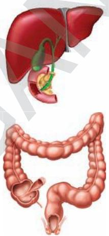  
fig-11: Liver, intestine

Table-4   

<table><tr><td>Name of the phylum/ organism</td><td>Excretory system/ organ</td></tr><tr><td>Protozoa</td><td>Simple diffusion from the body surface in to the surrounding water</td></tr><tr><td>Porifera and coelenterates</td><td>Water bathes almost all their cells</td></tr><tr><td>Platyhelminthes</td><td>Flame cells</td></tr><tr><td>Nematoda</td><td>Renette cells</td></tr><tr><td>Annelids</td><td>Nephridia</td></tr><tr><td>Arthropoda</td><td>Green glands, Malpighian tubules</td></tr><tr><td>Mollusca</td><td>Meta nephridia</td></tr><tr><td>Echinodermata</td><td>Water vascular system</td></tr><tr><td>Reptiles, Aves and Mammals</td><td>Kidneys</td></tr></table>

Multicellular organisms possess different excretory organs for removal of waste materials from the body. Structural and functional complexity of excretory organs increases from sponges to humans. Sponges and coelenterates do not have specific excretory organs as water bathes almost all their cells. Excretory structures appear for the first time in Flatworms (Platyhelminthes) are known as flame cells.

Now let us see how this vital process takes place in plants

## Excretion and release of substance in plants

Do plants excrete like animals?

We are amazed to answer such type of questions. You are aware that a variety of end products are formed during metabolism and these nitrogenous wastes are important. Plants does not have specific organs to excrete these wastes. Plants break down waste substances at much slower rate than in animals. Hence accumulation of waste is also much slower. Green plants in darkness and plants that do not possess chlorophyll produce carbon dioxide and water as respiratory waste products. Oxygen itself can be considered as a waste product generated during photosynthesis, that exits out side through stomata of leaves and lenticels of stem.

How do the plants manage or send out waste products from its body?

Plants can get rid of excess water by a process like transpiration and guttation. Waste products may be stored in leaves, bark, and fruits. When these dead leaves, bark, and ripe fruits fall off from the tree then waste products in them are get rid off. Waste gets stored in the fruits in the form of solid bodies called Raphides. However several compounds are synthesized by the plants for their own use especially for defence. Many plants synthesize chemicals and store them in roots, leaves, seeds, etc., for protection against herbivores. Most of the chemicals are unpleasant to taste. Hence, herbivores usually do not prefer to eat such plants. Some of the chemicals are toxic and may even kill the animal that eats them.

## Think and discuss

Why are weeds and wild plants not affected by insects and pests?

Some of the plants secrete chemicals when injured. These chemicals seal the wound and help the plant to recover from an injury. Some of the plants release attractants for other organisms which will help the plants for pollination, seed dispersal or even in their nutrition. For example, plants

having root nodules secrete chemicals to attract rhizobia into the surroundings of the roots and form a symbiotic relationship with the rhizobium. These compounds are called secondary metabolites.

Why plants shed their leaves and bark periodically?

The biochemical substances produced in plants are of two types, primary metabolites and secondary metabolites. The materials like carbohydrates, fats and proteins are primary metabolites. The materials which do not require for normal growth and development are secondary metabolites. e.g.: Alkaloids, Tannins, Resins, Gums, and Latex etc. Though plants produce these chemical for their own use. Man found the usage of these chemicals for own benefits. They are generally coloured and fragrant.

## Alkaloids:

These are nitrogenous by- products and poisonous. These are stored in different parts of the plants. Common alkaloids in plants and their uses are given below.

Table-5   

<table><tr><td>ALKALOID</td><td>PLANT</td><td>PART</td><td>USES</td></tr><tr><td>Quinine</td><td>Cinchona officinalis(Cinchona)</td><td>Bark</td><td>Antimalarial drug</td></tr><tr><td>Nicotine</td><td>Nicotiana tobacum(Tobacco)</td><td>Leaves</td><td>Insecticide, stimulant</td></tr><tr><td>Morphine, Cocaine</td><td>Papaver somniferum(Opium)</td><td>Fruit</td><td>Pain killer</td></tr><tr><td>Reserpine</td><td>Rauwolfia serpentina(Snake root)</td><td>Root</td><td>Medicine for Snake bite,High BP</td></tr><tr><td>Caffeine</td><td>Coffea arabica(Coffee plant)</td><td>Seed</td><td>Central nervous system Stimulant</td></tr><tr><td>Nimbin</td><td>Azadirachta indica(neem)</td><td>Seeds, Barks, Leaves.</td><td>Antiseptic</td></tr><tr><td>Scopolamine</td><td>Datura stramonium</td><td>Fruit, flower</td><td>Sedative</td></tr><tr><td>Pyrethroids</td><td>Chrysanthemum sps</td><td>Flower</td><td>Insecticides</td></tr></table>

  
Papaver

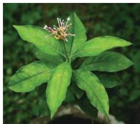  
Rauwolfia

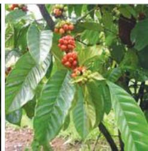  
Coffea arabica

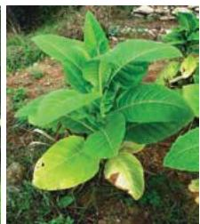  
Tobacco

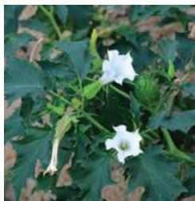  
Datura   
fig-12: Plants which produce Alkaloids

Name the alkaloids which are harmful to us?

Tannins: Tannins are carbon compounds. These are stored in different parts of the plant and are deep brown in colour. Tannins are used in tanning of leather and in medicines e.g. Cassia, Acacia.

Resin: Occur mostly in Gymnosperms in specialized passages called resin passages. These are used in varnishes- e.g.Pinus.

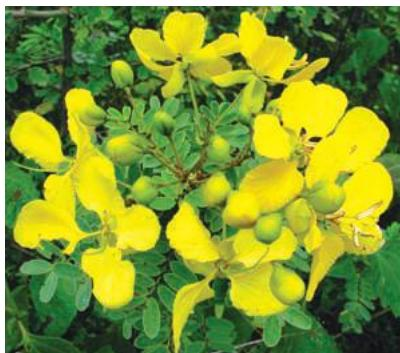  
fig-13(a): Cassia

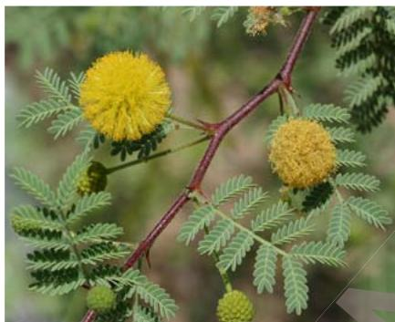  
fig-13(b): Acacia

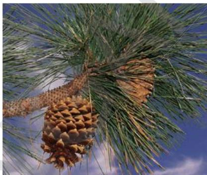  
fig-13(c): Pinus

Gums: Plants like Neem, Acacia oozes out a sticky substance called gum when branches are cut. The gum swells by absorbing water and helps in the healing of damaged parts of a plant. Gums are economically valuable and used as adhesives and binding agents, in the preparation of the medicines, food, etc.

Latex: Latex is a sticky, milky white substance secreted by plants. Latex is stored in latex cells or latex vessels. From the latex of Hevea braziliensis (Rubber plant) rubber is prepared. Latex from Jatropa is the source of bio-diesel. Do you know which part of jatropa used in production of bio diesel.

  
fig-14(a): Neem

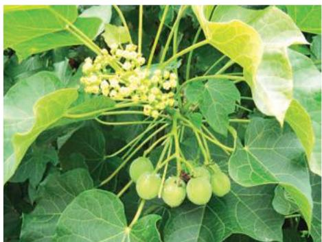  
fig-14(b): Jatropa

  
fig-14(c): Rubber plant

## Do you know?

Chewing gum is a type of sticky for chewing made dates back 5000 years. Modern chewing gum originally made of natural latex from plants like chicle, sapota etc. Whenever pollen grains enter in our body they cause allergy due to the presence of nitrogenous substances. These allergens cause skin allergy and asthma. Ex: Parthenium.

Do roots secrete?

‘Brugman’ a botanist proved from his experiments that the roots not only absorb fluid from soil, but returns a portion of their peculiar secretions back into it. We can see such instances in plants like apple where a single apple crop for 4 or 5 years continuously in the same soil, that fail to produce fruits. It will not give proper yield even if you use lot of fertilizers.

Do you think there is any relation between reduction in yielding and root secretions?

Why do we get peculiar smell when you shift the potted plants?

## Excretion Vs Secretion

Excretion and secretion are the same in nature. Since both are involved in passage or movement of materials. Both processes move and eliminate unwanted components from the body. Excretion is the removal of materials from a living being, while secretion is movement of material from one point to other point. So secretion is active while excretion is passive in nature. Humans excrete materials such as tears, urine, Carbon dioxide, and sweat while secretion on other hand, includes enzymes, hormones, and saliva. In plants too we find excretion through roots into its surroundings and falling off leaves and bark. Secretions occur in the plant body in form of latex, resins, gums etc.

## Key words

Creatinine, tubular fluid, peritubular network, podocyte, glomerulus, PCT, DCT, afferent arteriole, efferent arteriole, calyces, micturation, urochrome, dialyser, heamodialysis, anticoagulant, alkoloid, biodiesel, loop of henle.

## What we have learnt

Due to metabolism several harmful excretory products are formed and process of removing toxic waste from the body is called execretion.

The human excretory system comprises a pair of kidneys, a pair of ureters, urinary bladder, urethra.

Each kidney is composed of approximately 1.3 to 1.8 millions of uriniferous tubules or nephrons, which are structural and functional units of kidney.

A nephron comprises glomerulus,bowman’s capsule, proximal convoluted tubule (PCT), Henle’s loop, Distal convoluted tubule (DCT) and collecting tubule.

Formation of urine involves four stages. 1) Glomerular filteration, 2) Tubular Reabsorption, 3) Tubular Secretion, 4) Concentration of Urine.

Kidneys remove nitrogenous waste from body, maintains water balance (osmoregulation), salt content, pH, and blood pressure in human body.

Dialysis machine is an artificial kidney which filters the blood to remove the metabolic wastes out side the body.

Kidney transplantation is a permanent solution to renal failure patients.

Different animals have different excretory organs e.g. amoeba-contractile vacuole, platyhelminthesflame cells, annelida-nephridia, arthropoda-malpighian tubule, reptiles, birds and mammals-kidney.

There are no special organs for excretion in plants. Plants store different waste materials in leaves, bark, roots, seeds which fall of from the plants.

Plant metabolites are two types i) primary metabolites eg: proteins carbohydrates and fats. ii) secondary metabolites eg: alkoloids, gums, tannins, latex and resins. These are economically importanttannins, to us.

Excretion is the removal of material from living beings where as secretion is movement of materials from one point to other.

## Improve your learning

1. What is meant by excretion? Explain the process of formation of urine. (AS1)   
2. How are waste products excreted in amoeba?(AS1)   
3. Name different excretory organs in human body and excretory material generated by them?(AS1)   
4. Deepak said that ‘Nephrons are functional and structural units of kidneys’ how will you support him?(AS1)   
5. How plants manage the waste materials?(AS1)   
6. Why do some people need to use a dialysis machine? Explain the principle involved in it.(AS1)   
7. What is meant by osmoregulation? How is it maintained in human body?(AS1)   
8. Do you find any relationship between circulatory system and excretory system? What are they?(AS1)   
9. Give reasons(AS1)

A.Always vasopressin is not secreted.   
B.When urine is discharged, in beginning it is acidic in nature later it become alkaline.   
C. Diameter of afferent arteriole is bigger than efferent arteriole.   
D.Urine is slightly thicker in summer than in winter?

10. Write differences(AS1)

A. Functions of PCT and DCT   
B. Kidney and artificial kidney   
C. Excretion and secretion   
D. Primary metabolites and secondary metabolites

11. There is a pair of bean-shaped organs ‘P’ in the human body towards the back, just above the waist. A waste product ‘Q’ formed by the decomposition of unused proteins in liver is brought into organ ‘P’ through blood by an artery ‘R’. The numerous tiny filters ‘S’ present in organ ‘P’ clean the dirty blood goes into circulation through a vein ‘T’. The waste substance ‘Q’ and other waste salts and excess water form a yellowish liquid ‘U’ which goes from organ ‘P’ into a bag like structure ‘V’ through two tubes ‘W’. This liquid is then thrown out of the body through a tube ‘X’.(AS1)

(a) What is (i) organ P and (ii) waste substance Q.   
(b) Name (i) artery R and (ii) vein T

(c) What are tiny filters S known as?   
(d) Name (i) liquid U (ii) structure V (iii) tubes W (iv) tube X.

12. The organ ‘A’ of a person has been damaged completely due to a poisonous waste material ‘B’ has started accumulation in his blood, making it dirty. In order to save this person’s life, the blood from an artery in the person’s arm is made to flow into long tubes made of substance ‘E’ which are kept in coiled form in a tank containing solution ‘F’. This solution contains three materials $\mathbf { \tilde { G } } ^ { \prime }$ , ‘H’ and ‘I’ similar proportions to those in normal blood. As the person’s blood passes through long tubes of substance ‘E’, most if the wastes present in it go into solution ‘F’. The clean blood is then put back into a vein in the person for circulation. (AS1)

(a) What is organ A?   
(b) Name the wastes substance B.   
(c) What are (i) E, and (ii) F?   
(d) What are G, H and I?   
(e) What is the process described above known as?

13. Imagine what happens if waste materials are not sent out of the body from time to time?(AS2)   
14. To keep your kidneys healthy for long period what questions will you ask a nephrologist/ urologist?(AS2)   
15. What are the gum yielding trees in your surroundings? What procedure you should follow to collect gum from trees?(AS3)   
16. Collect the information about uses of different kinds alkaloids, take help of Library or internet?(AS4)   
17. Draw a neat labeled diagram of L.S of kidney?(AS5)   
18. Describe the structure of nephron with the help of a daigram. (AS5)   
19. Draw a block daigram showing the path way of excretory system in human beings. (AS5)   
20. If you want to explain the process of filtration in kidney what diagram you need to draw.(AS5)   
21. List out the things that makes you amazing in excretory system of human being.(AS6)   
22. You read about ‘Brain dead’ in this chapter. What discussions would you like to have why you think so?(AS6)   
23. We people have very less awareness about organ donation, to motivate people write slogans about organ donation?(AS7)   
24. After learning this chapter what habits you would like to change or follow for proper functioning of kidneys?(AS7)

## Fill in the blanks

1. Earthworm excretes it’s waste material through   
2. The dark coloured outer zone of kidney is called   
3. The process of control of water balance and ion concentration with in organism is called ·   
4. Reabsorption of useful product takes place in _ part of nephron.   
5. Gums and resins are the products of the plants.   
6. Bowman’s capsule and tubule taken together make a   
7. The alkaloid used for malaria treatment is

8. The principle involved in dialysis is   
9. Rubber is produced from of Heavea braziliensis.   
10. _ performed first Kidney Transplantation.

## Choose the correct answer

11. The structural and functional unit of human kidney is called (

(A) Neuron

(B)nephron)nephron

(C)nephridia

(D)flame cell

12. The excretory organ in cockroch

(A) malpighian tubules

(B) raphids

(C) ureters

(D) nephridia

13. Which of the following is the correct path taken by urine in our body? ( )

(i) Kidneys

(ii) Ureters

(iii) Urethra

(iv) Urinary bladder

(A) i, ii, iv, iii

(B) i, ii, iii, iv

(c) iv, iii, i, ii

(D) ii, iii, i, iv

14. Malpighian tubes are excretory organs in ( )

(A) earth worm

(B) house fly

(C) flat worm

(D) hen

15. Major component of urine is ( )

(A) urea

(B) sodium

(C) water

(D) creatine

16. Special excretory organs are absent in (

(A) birds

(B) amoeba

(C) sponges

(D) a and b

17. Which of the following hormone has direct impact on urination? ( )

(A) adrenal

(B) vasopressin

(C) testosterone

(D) Oestrogen

18. Amber colour to urine due to ( )

(A) urochrome

( B) bilirubin

(C) biliverdin

(D) chlorides

19. Sequence of urine formation in nephron is ( )

(A)Glomerular filtration

Tubular reabsorption

Tubular secretion

(B)Tubular reabsorption

Tubular secretion

Glomerular filtration

(C)Tubular secretion

Glomerular filtration

Tubular reabsorption

(D)Tubular reabsorption

concentration of urine

Tubular secretion

20. Part of the nephron that exists in outer zone of kidney. ( )

A) Loop of the henle

B) PCT

C) DCT

D) Bowman’s capsule

21. After having lunch or dinner one can feel to pass urine, because of a ( )

A) stomach pressures on bladder

B) solids become liquids

C) water content in food material

D) spincter relaxation

## Organ donation - A gift for life

So many patients are waiting for suitable organ due to failure of vital organs. In Hyderabad where there are kidney transplantation facilities minimum 25 patients per hospital are waiting for kidney donors. Daily 10 - 100 people met with accident in our State. Out of them some people get brain dead. If we collect organs from brain dead patients in time, we can save minimum 5 peoples’ life. But lack of awareness on organ donation those who are willing to donate organs and those who need organs do not get proper information even facilities are there. Medical personnels from government and private hospitals are not informing about brain dead Patients. If they inform in appropriate time it will be very useful to patients those who are waiting for organ donation. In Hyderabad, organ Transplantation facility is available only in two government hospitals (NIMS and Osmonia) and in more than 10 corporate hospitals. Other organs like cornea transplant organs like kidney, liver, heart, lungs, pancreas, skin, bone, intestines and eye (cornea) can transplanted from brain dead patients.The process of transplantation of organs from brain dead patients to another is called cadaver transplantation. If any person is willing to donate organs or in needy get organs. They must register their names in transplantation facility hospitals.

Collect information about a voluntary organisation working on organ donation and make a report.

There is very less awareness among people about organ donation. Society needs much awareness in organ donation, so that we can save many lives who are in need of different organs from donars for their survival. Instead of living in their memories, let us give them a chance to live in others for one more life.

We can live even after death

## Five organs of 18 year old youth donated

DC correspondent, Hyderabad, 20 June 2013

Five organs of 18 year old H.S.YASWANTH KUMAR wereYASWANTH donated by his father H V Shiva Kumar to the organ donation wing of Jeevandan scheme on Thursday. Yaswanth had met an accident on June 15 while he was travelling in a shared autorikshaw from Jagadgirigutta. He was rushed to Nizam Institute of Medical Sciences (NIMS).The Neuro surgeons at NIMS declared him brain dead. Jeevandan counsellors obtained the consent of Mr. Shiva Kumar,who agreed to donate Yaswanth’s kidneys, two heart valves, liver. These organs were retrieved and sent to various hospitals for transplantaion. Dr. Swarnalatha in-charge of Jeevandan scheme, said in a statement. Think how great Yaswanth’s parents are?

# Chapter 5
# Coordination - The linking system

Sharpening of a pencil, grasping a door knob, walking or running, driving, and a few physical actions, all involve well coordinated movements made with well balanced postures. In fact, whenever we move the three basic functions, such as movement, balance and coordination work together to perform purposeful motions of body parts. This is actually quite a feat, because moving is a complex process for the body.

Even standing upright is a difficult challenge of balancing on just two feet with a narrow base. Yet, it is common for us not only to stand upright easily and apparently, effortlessly, but also while keeping our balance to perform many other functions.

What other functions do you think needed in coordination and balance?

All our functions are carried out by an effort of several systems working together. For example, while movement, we hardly ever use just the skeletal system or muscular system alone, several other systems also have their own roles to play. Even within the muscular system, several muscles work in a sequence or at once.

What triggers movement of the muscles?

All our body organs, tissues and cells work together systematically. All of them pick up signals of change from their surroundings and respond to them. This process triggers different functions in our body as well as by our body. For example, it is natural to move to a side of the road when we hear or see a car approaching.

How do we respond so fast according to situation?

## Responding to stimuli

What helps us to respond to such signals?

Why does the living body respond to such signals?

We can think of a response as an effect of a change in the environment of the organism or signals of change or ‘stimuli’.All living organisms respond to stimuli. The cat may be running because it saw a mouse. Plants grow towards the sunlight. We start sweating when it is hot and humid.

The ability to react to particular stimulus in a particular situation must be of great importance in ensuring the survival of the organism.

There is a sequence of events that brings about responses. They start from detecting changes in environment (both external and internal) or stimuli, transmission of the information, processing of the same. Finally the response will detect and execute the appropriate action.

Let us do the following activity to find more about response to stimuli.

### Activity-1

## Holding a falling stick

Take a long scale or stick at least around $\%$ meter. Keep your fingers in holding position as shown in fig-1 . Ask your friend to hold the stick / scale near the end and let the other end be suspended between your fingers.

Let there be a very small gap around a centimeter between your thumb and stick/scale and the stick/scale and fore finger. Now let your friend allow it to fall. Try to hold it.

Could you hold it exactly at the point where it was suspended between your fingers?

Mark the point where you caught the stick.

  
fig-1: Holding stick

How far up was this point from the end suspended between your fingers?E

Why did this happen?

How fast do you think the process was?C

Responses are brought about by rapid changes in some muscles and such changes are usually related to changing stimuli. Rapidity of response indicates an efficient communication system linking those parts that pick up stimuli to those that trigger a response.

What makes this kind of communication possible?

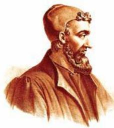  
fig-2: Galen

## Integrating pathways - Nervous coordination

The Greeks believed that all functions of the body were controlled by the brain since damage to that organ produced remarkable changes in behaviour. They had very little idea on how such control could be exercised Though Galen, a Greek physiologist (A.D. 129-200) made one notable observation. One of his patients, having suffered a blow on the neck when falling from his chariot, complained loss of feeling in the arm while still retaining normal muscular control of its moment. Galen concluded that nerves were of two kinds – those of sensation and those of action. According to him the blow in the neck had damaged the nerves of sensation but had not affected it’s action.

Why do you think Galen draw such a conclusion?

The functioning of nerves as integrating systems was little known till late $1 8 ^ { \mathrm { t h } }$ century. Then, physiologists began to study the mechanism of nerve functioning and found how signals were transmitted by making the connection between recent work on electricity and the propositions on working of the nervous system made till then.

Now we know more about how nerves from different sections of the brain and spinal cord control responses of different areas of the body. We also know the probable pathways that transmit information but we still know very little about the working mechanisms of the nerve cell.

## Structure of nerve cell

### Activity-2T

Observe the permanent slide of nerve cell or neuron under microscope draw and label its parts, compare with the following diagram.R

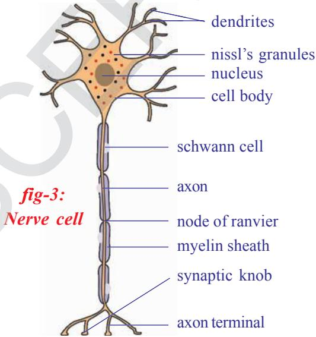

Each nerve cell consists of a cell body with a prominent nucleus. There are fine projections mainly of two types extending from the cell body of the nerve cell. The small projections are dendrites while a long one that extends to different parts of our body is called Axon. The axon is surrounded by a specialized insulatory sheath called myelin sheath.This sheath is interrupted at regular intervals called nodes of ranvier.The myelin sheath is made up of schwann cells and chiefly consists of fatty material. Axons not having the sheath are non-myelinated

fibers. The covering also forms a partition between adjacent axons. The nerve cell body lies either in our brain or spinal cord or very close to the spinal cord in a region called dorsal or ventral root ganglion. In the brain or spinal cord, it is difficult to make out the difference between dendrites and axons on the basis of their length, often, the presence of the sheath helps us to find out but several axons here do not have the sheath.

We know that the nerve cell is the structural and functional unit of nervous system. Our nervous system consists of more than100 billion of them, which communicate with each other in a specific manner. Dendrites of one nerve cell connect to the other or to the axons of the other nerve cell through connections called as a ‘synapse’.

Synapse is the functional region of contact between two neurons, where information from one neuron is transmitted or relayed to another neuron.

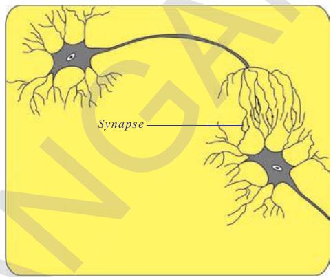  
fig-4: Synapse

Though these are regions of minute gaps and essentially neurons do not have any protoplasmic connection between them yet information is passed from one nerve cell to the other through these gaps either in the form of chemical or electrical signals or both. These synapses are mainly found on the brain, spinal cord and around the spinal cord. Beyond these areas the axon carries the signals to respective areas in our body.

## Pathways: From stimulus to response

In the holding stick activity you observed that there is coordination between eye and finger. Different pathways are taken by nerves to bring about this coordinated activity.

On the basis of pathways followed, nerves are classified mainly into three different types. They are as follows.

## Afferent nerves or Sensory nerves :

(a) Afferent (or ferrying towards) which carry messages towards the central nervous system (spinal cord or brain) from nerve endings on the muscles of different sense organs that sense the change in surroundings are called stimulus detectors. These are also called ‘sensory’ nerves.

## (b) Efferent nerves or motor nerves :

Efferent (or ferrying away) which carry messages from the central nervous system to parts that shall carry out the response or the effectors (muscles). They are also called ‘motor’ nerves.

## (c) Association nerves:

Association nerves, which link together the afferent and efferentG nerves.

Which organ of your body was the detector and which the effectorNgan in Activity-1?

What do you think that the information carried on the afferent and efferent nerves?

  
fig-7: Different nerve pathways

Activity-1 showed a response on which you had some control or it was voluntary (recall the use of the voluntary and involuntary muscles that you studied in class $9 ^ { \mathrm { t h } }$ .). We know that our body would also need to respond to certain situations on which we may not have a control. Such responses are called reflexes.A simple activity shall help us to understand this better.

### Activity-3

  
fig-8: Knee jerk

## Knee jerk reflex

Cross the legs, in a seated position, so that the lower half of the uppermost leg hangs freely over the other. Strike the area below the knee cap sharply, while firmly grasping the front part of the thigh with the other hand. Note the changes in shape of the thigh muscles.

Note that although we are fully conscious, we cannot prevent the thigh muscles from contracting. Such a response

is said to be involuntary. Now the same thigh muscle can operate in a voluntary manner, as when we kick a football.

Do you think most of the functions in our body go about in an involuntary manner? Why /Why not?

## Do you know ?

The existence of the knee jerk was first noted in 1875. At first it was doubted whether a nervous reflex was involved at all. But it was discovered that if, in an anaesthetized monkey where spinal nerves supplying the limb were cut, the knee jerk reaction would not occur. Clearly a nerve pathway was involved.

During actions which are involuntary and have to be carried out in very short intervals of time, the pathway that nerves follow is a short one; it does not go up to the brain while voluntary pathways are usually longer passing through the brain. Now let us see what pathways actually are.

## The reflex arc

Not until the end of the nineteenth century the reflex was understood in terms of pathways. Picking up information of a stimulus to generate a response involves a pathway from detectors to brain or spinal cord or a set of nerve cell heads near spinal cord to the effectors. Such a single pathway going upto the spinal cord from detectors and returning to effectors is a reflex arc.

If you accidentally touch a very sharp surface with your feet, several such arcs would operate to cause the muscles of the leg to withdraw the feet. Observe the fig-9, how our leg muscle responds when we step on a sharp edged object.

What other effectors would act under these circumstances?

What does this tell us about the association of nerves?

In fact, you must have experienced, what happens when you do things consciously and otherwise. Say for example, when you are performing an action such as running upstairs. If you start to think about where your feet are going you often stumble. The interesting thing is that the same effectors

in the leg muscles can be made to perform very special movement under the control of the conscious mind (voluntarily). Hence in a football game, the muscles of the leg operate both by reflexes and voluntarily. Most actions of our body are actually controlled together by voluntary and involuntary pathways.

## Do you know ?

Nerve transmission from stimulus to a response can occur at a maximum speed of about 100 meters per second.

Shrews (tiny rat) have the highest, brain to body mass ratio.

Think of any action and try to make a sketch of the reflex arc.

The voluntary and involuntary actions in our body are controlled by nervous system as a whole.We may study our nervous system on the basis of areas from which nerves originate and then spread out to the whole body as mainly two divisions one is the central nervous system (CNS) and the other is peripheral nervous system (PNS)

## Central Nervous System (CNS)

Central nervous system includes brain and spinal cord. It coordinates all neural functions.

## Brain

When compare to body weight human brain is the largest of all the animals. The brain is present in the hard bony box like structure called cranium. It is covered by three layers called the meninges. The meninges are continuous and cover the spinal cord as well. The space between the inner layers is filled with fluid called cerebro-spinal fluid. It serves as a shock-absorbing medium and protects the brain against shocks/jerks along with the meninges and cranium. Mainly the nerve cell bodies together with capillaries form a mass calledT grey matter while the myelinated axons or those covered by fatty sheaths form white matter. The grey matter is usually present on the periphery while white matter is present towards the center. This is mainly due to the fact that there is a small area from where the myelinated

  
fig-10: Brain

axons leave the brain. As we have already studied, the function of the brain as a control center was known nearly 2000 years back by Greek physiologists.

Brain has the following divisions –

1. Forebrain – cerebrum, diencephalon   
2. Midbrain – optic lobes   
3. Hindbrain – cerebellum, medulla oblongata.

Table - 1 : Let us study the functions of the various parts of the brain

## Fore brain

Olfactory lobes : These clubshaped widely spread bodies are visible from the ventral surface only.

Functions : These are concerned with sense of smell.

Cerebrum : It consists of two lobes called cerebral hemispheres. The surface of the cerebrum has many folds, they appear as elevations (Gyri) and depressions (Sulci). Sulci are very prominent and divide each hemisphere into four lobes.

l ask your teacher the name of those lobes.   
l observe the fig. 10 which part connects the two hemispheres ?

Functions : i) Seat of mental abilities, controls thinking, memory, reasoning, perception, emotions and speech.   
ii) Interprets sensations and responds to cold, heat, pain and pressure.

Diencephalon : This rhomboidal shaped lobe visible from inferior surface of brain. It lies between cerebrum and mid brain. It is divided into thalamus and hypothalamus (Master control centre of endocrine system). Where as Pituatory gland is called Master gland.

Functions : i) Relay centre for sensory impulses, such as pain, temperature and light.

ii) Reflex centre for muscular activities.   
iii) Centre for certain emotions such as anger.   
iv) Centre for water balance, blood pressure, body temperature, sleep and hunger.   
v) The hypothalamus controls the pituitary gland, which functions as the master gland.

Mid-brain : This is a small thick stalked portion. This connects forebrain with cerebellum and pons of hind brain.

l observe optic lobes of mid brain in the brain model in your laboratory.   
l observe the fig. 10 which part connects the two hemispheres ?

Functions : It relays motor impulses from the cerebral cortex to the spinal cord and relays sensory impulses from the spinal cord to the thalamus, reflexes for sight and hearing.

Hind brain : This is the last part of the brain consists of cerebellum, medulla oblongata.

Cerebellum : It is located below the cerebrum and above medulla oblongata. It consists of two large cerebellar hemispheres.

Functions : i) Maintains posture, equilibrium and muscle tone.

ii) Coordinates voluntary movements initiated by cerebrum.

Medulla oblongata : It is almost triangular shaped. Medulla oblongata extends from pons to spinal cord. Ask your teacher grey and white matters of medulla oblongata

Functions : i) Contains centre for cardiac, respiratory and vasomotor activities. (Vasomotor refers to actions upon a blood vessel which alter its diameter)

ii) Coordinates reflexes like swallowing, coughing, sneezing and vomiting.

## Do you know ?

The brain weighs approximately $1 4 0 0 \mathrm { g }$ . Though the brain comprises little more than $2 \%$ the body’s weight, it uses $20 \%$ of the whole body energy.

An average adult male brain weighs about $1 3 7 5 \mathrm { g }$ and female $1 2 7 5 \mathrm { g }$ .

  
fig-11: Spinal cord

  
fig-12: Leonardo da vinci

## Spinal Cord

Spinal cord extends from the back of the hind brain(Medulla oblongata) to the back of the stomach or lumbar region, through the neural canal of the vertebral column. It is almost cylindrical in shape. Unlike the brain, the white matter is towards periphery while grey matter is towards the center of the spinal cord. The myelinated axons leave the spinal cord from both sides of the vertebral column. See fig-11.

The role of the spinal cord in nervous control was studied largely by the experimentalists of the sixteenth and seventeenth centuries. They found that the Greeks concept of control by the brain was erroneous. Animals were shown to have the ability to respond to stimuli even when the brain was removed. ‘Leonardo da Vinci’ (1452-1519) and ‘Stephen Hales’ (1677-1771) both recorded the survival of frogs whose brain had been destroyed. The animal still produced muscular movements if its skin was pinched or pricked. Both observers further recorded that the animal died as soon as spinal cord was damaged by pushing a needle down it.

Such evidence suggested that the spinal cord was not simply a trunk road for instructions from the brain, but might be a control center in its own right.T

According to you what would be the function of the spinal cord?

Are all functions of our body under direct control of the brain and spinal cord? WhyR do you think so?

## Do you know ?E

Scientists have been able to trace out the nerves that originate from brain called cranial nerves and those that originate from spinal cord called spinal nerves. ThereC are 12 pairs of cranial nerves which arise from the brain. There are 31 pairs of spinal nerves.

## Peripheral nervous system

Figure-13 shows you that nerves attached to the spinal cord have two types of connections or roots – One to the back or dorsal side and other to front or the ventral side of cord. The experimental work of two men, Charles

Bell in Scotland and Francois Magendie in France, in the early nineteenth century, showed that these roots have different functions. If the dorsal roots of an experimental animal were cut the animal made no obvious reaction. If, however, the ventral roots were even lightly touched, the muscles to which the nerve was connected switched violently. The ventral root evidently controlled muscular activity, the dorsal root did not.

  
fig-13: Peripheral nerves system

In 1822 they suggested that dorsal root carried messages of sensation inwards while the ventral pathway carried outwards the instruction for muscular contraction.

Which root according to you gets signals from afferent nerves?

The peripheral nervous system (PNS) is a vast system of the dorsal and ventral root nerve cell heads and the network of spinal and cranial nerves that are linked to the brain and the spinal cord on one end and muscles on the other.

What do you think the end of these nerves act at the muscular end?

## Autonomous Nervous System

The PNS can either involuntarily control several functions of regions like our internal organs, blood vessels, smooth and cardiac muscles.So it is called autonomous nervous system. It has voluntary control of muscles of some areas of skin and the skeletal muscle.

We can take up an example to see how certain involuntary function controlled by autonmous nervous system takes place in our body. A very evident observation is the reduction and expansion of the pupil of our eye.

When we enter a dark room we cannot see anything immediately. Slowly we are able to see the things around us in the room. This is because of increase in diameter of pupil, which allows more light in. When we come out of the dark room into broad day light the diameter of the pupil decreases allowing less light to enter into the eyes. Both these functions occur under the influence of the autonomous nervous system.

## Do you know ?

Research in the past two decades has brought out an interesting fact. Other than central nervous system and peripheral nervous system, there is a system of neurons present in our digestive tract that can function even independently of either CNS or PNS. It has been nick named as a second brain and the system is called as enteric nervous system (ENS).

You know that medulla oblongata is the region that regulates heartbeat, breathing etc. the system that helps to bring about such activities of internal organs is called autonomous nervous system. Normally such involuntary activities take place by the coordinated efforts of the medulla oblongata and autonomous nervous system.

  
fig-14: Autonomous nervous system

Now let us see how the autonomous nervous system influences the life activities. Observe the fig-14 and record your observations.

To which organs of the body do the nerves go from the ganglions near the vertebral column?

What are the organs that receives nerves starting from the brain? Which are the organs whose activities are influenced by the sympathetic system?

Which are the organs whose activities are influenced by the para sympathetic system?

What do you understand about the functions of para sympathetic system?

What do you understand about the functions of sympathetic system?

Ganglia near the vertebral column are connected to the spinal cord by nerves. The sympathetic system is formed by the chain of ganglia on either sides of the vertebral column and the associated nerves. The para sympathetic system is formed by the nerves arising from the ganglia of the brain and the posterior part of the spinal cord. These together constitute the autonomous nervous system. It is the part of the peripheral nervous system consisting of twelve pairs of cranial nerves and thirty one pairs of spinal nerves.

Several functions in our body are controlled by nerves while many of them and others are controlled by other ways as well. You might have heard about people having diabetes and know that they have to take tablets or insulin injections when the level of sugar in their blood rises.Let’s find out what insulin is and how we came to know about it. This would also give us an idea of controls other than nerves in our body.

## Coordination without nerves

## The Story of insulin

In 1868 Paul Langerhans, Professor of Pathology at the University of Freiburg in Germany, working on the structure of the pancreas, noted certain patches of cells quite different in appearance from the normal tissue cells of the organ and richly supplied with blood vessels. They are known Islets of Langerhans (Islets stands for islands), but their function remained unknown. Many others interested in the function of pancreas and found that its removal from the body of an experimental animal would lead to the development of diseases similar to a well-known human ailment ‘sugar diabetes’. This is a condition in which the amount of free sugar in the blood and in the urine is abnormally high. It’s a cause in man was unknown but evidence pointed to the pancreas as a possible role.

  
fig-15: Pancreas

  
fig-16: Paul Langerhans

The next stage was reached when it was found that tying up the pancreatic duct that emerged from the duodenum( a part of the small intestine) would cause the pancreas to degenerate but the Islets of Langerhans would remain normal. Moreover, an animal so treated would not develop diabetes. This was really a strong evidence that the level of blood sugar is linked with the islet cells. By 1912, workers were convinced that the islets produced a secretion which directly liberated into the blood. In Latin ‘insula’ means an island. The name insulin was coined for the secretion, even though it had not been isolated.

Ten years later in Toronto, Banting, Best, and Macleod finally succeeded in extracting insulin from degenerate animal pancrease whose ducts to the intestine had been tied. When given by intravenous injection to a dog with no pancreas, this substance kept it alive and healthy with a low level of blood sugar. Insulin is now produced in large quantities for the treatment of human sufferers from sugar diabetes, to whom it is administered by injection into the skin.

Insulin thus is a chemical that acts as it reaches blood from the cells that produce it.

## Other chemical co-ordinators

The evidence that events occurring in one part of the body could be affected and indeed controlled by substances circulating in the blood was now overwhelming. In 1905 the English physiologist Starling had coined the term hormone (Greek, hormao – to impel) for such secretions. The glands secreting hormones were termed ductless glands, since they have no tube or duct to carry away their products, which pass straight into the blood. In this way they differ from glands such as the liver and pancreas, whose secretions pass down ducts which are connected to other organs.

The human body contains many other ductless glands (endocrine glands).Glands do not produce their hormones at a steady rate. The adrenal gland, for example, normally has a low output.

  
fig-17: Cock fight

What will you do if a dog is after you? What will be your first reaction? Have you ever observed any change in your body when you are afraid?

Nobody wants to fight with a dog. The first thing we do is running away from the place.

Try to note the body language of humans / animals when they are fighting / scared.

If we observe our body, when we are afraid, the rate of heart beat increases; the breath rate will be

faster; blood pressure increases; the hair on the body becomes erect and we get goose bumps. The other things we might not observe are pupil dilation, skin becomes more sensitive, and rarely the bladder and the rectum may be emptied. We come to normal state only after we reach a safe spot.

We have already studied about nerve co-ordination, where nerves carry stimuli from sense organs to central nervous system and orders to effectors organs-the muscles. But, in the above situation the action of the nervous system is limited. All the changes in the body are carried out under the influence of a chemical called ‘Adrenalin’ hormone, released by Adrenal gland which is an endocrine gland. The various actions of the body are controlled by hormones and co-ordinated by nervous system. So in this type of conditions nervous system and endocrine system work together to bring about control and co-ordination.

Ask your teacher why Adrenalin hormone is also called fight or flight hormone.

The whole system of ductless glands is called the endocrine system. Information about a few of the endocrine glands is given in the next page accompanying table.

Try to make a list of functions that you think are controlled both by the nervous and the endocrine system.

## Feedback mechanism

Recall the fight or flight behavior of cat and dog. The amount of adrenalin hormone increases in the blood sharply in a frightening situation, getting anger or excited.

Have ever observed the duration of anger?

Why does anger come down?

What may happen if anger persists for a longer period?

Anger is always short lived factor. You know that increased levels of adrenalin are responsible for anxiety. When the levels of adrenalin in the blood come down slowly we come to normal state. If the adrenalin levels persist for a longer period of time, regular metabolic activities are disturbed.

Increase in adrenalin levels leads to anger, decrease in adrenalin levels leads to normal position.

What will happen if it is continued for longer periods of time?

Similarly the sugar levels in the blood rise than normal level, they are detected by the cells of pancreas, which respond by producing more insulin into the blood. If the sugar levels come back to normal level secretion of insulin is automatically reduced.

Table-2: Endocrine glands   

<table><tr><td>Name of the endocrine gland</td><td>Location</td><td>Hormone secreted</td><td>Response of body to hormone</td></tr><tr><td rowspan="9">Pituitary</td><td rowspan="9">Floor of brain</td><td>1. Somatotropin</td><td>Growth of bones</td></tr><tr><td>2. Thyrotropin</td><td>Activity of thyroid gland</td></tr><tr><td>3. Gonadotropin</td><td>Activity of ovary and testis</td></tr><tr><td>4. Adreno cortico trophic hormone</td><td>Stimulates secretion from adrenal cortex</td></tr><tr><td rowspan="2">5. Luteinising hormone</td><td>In males - secretion of testosterone.</td></tr><tr><td>In female - Ovulation, development of corpus luteum and secretion of progesterone.</td></tr><tr><td rowspan="2">6. Follicle stimulating hormone</td><td>In male - spermatogenesis</td></tr><tr><td>In female - growth of graafian follicles, estrogen secretion, milk production and secretion.</td></tr><tr><td>7. Vasopressin</td><td>Regulate absorption of water from the kidney tubules</td></tr><tr><td>Thyroid</td><td>Neck</td><td>Thyroxine</td><td>General growth rate and metabolic activity</td></tr><tr><td rowspan="3">Ovary</td><td rowspan="3">Lower abdomen</td><td rowspan="2">Estrogen</td><td>Growth of the uterus and skeleton of the pelvis</td></tr><tr><td>Control of the 28 days menstrual cycle in females.</td></tr><tr><td>Progesteron</td><td>Development of uterus, implantation, development of mammary glands.</td></tr><tr><td>Testes</td><td>Scrotal sac</td><td>Testosterone</td><td>Growth of hair on face, muscular development, deepening of voice, normal sexual behavior and development of male sex organs.</td></tr><tr><td rowspan="2">Adrenal</td><td rowspan="2">Attached to kidneys</td><td rowspan="2">Adrenalin</td><td>Increase in heart-beat rate. Rise in blood sugar.</td></tr><tr><td>Dilation of the coronary artery. Dilation of the pupil of the eye. .</td></tr><tr><td rowspan="2">Pancreas</td><td rowspan="2">Near duodenum</td><td>1. Insulin</td><td>Decrease glucose percentage in blood</td></tr><tr><td>2. Glucagon</td><td>Increase glucose percentage in blood</td></tr></table>

So it is necessary that the hormones are secreted by the glands in our body in precise quantities which are required for the normal functioning of the body. This means that there should be some mechanism to regulate the production and release of hormones in the body.

The timing and amount of hormones released by endocrine glands is controlled by the feedback mechanism, which is inbuilt in our body. None of the systems, whether nervous or chemical are totally exclusive of each other.

## Control mechanisms in plants

## How do plants respond to stimuli?

So far we have studied how control mechanisms work in our body. Do plants also have control systems? Let us find out by doing a small activity.

### Activity-4

Touch the leaves of Mimosa pudica (athipathi, touch me not) plant and observe the response of leaves. Are they folding? If so in which direction?

Try to give examples of situations where you may see plants responding to a certain stimulus.

  
fig-18: Mimosa pudica

## Do you know ?

Mimosa pudica leaves have pad like swellings at the base. They are called pulvini. Here cells contain lot of water and large intercellular spaces. Due to water pressure pulvini hold the leaf erect. Touch me not plant shows nastic movement by touch. This is called thigmonasty. When we touch the leaves, an electrical impulse is generated. This impulse acts on plant hormone. Because of this hormone water in the pulvini cells which are closer to the leaf vein migrate to other side of the cells.Then pulvini loss its firmness hence leaves become fold. After 20 to 30 minutes water comes back pulvini attains firmness and leaves become erect.

You might have observed the tendrils of plants growing towards a support. Can you imagine how is it happening? Would you think it is responding to a stimulus?

Both plants and animals react to various stimuli around them. But the method of responding to stimuli is not similar in plants and animals. Higher animals respond to stimuli because they have a nervous system and an endocrine system. Plants do not have a well-defined nervous or endocrine system. They do have some mechanism of control by means of some chemicals or hormones.

Plants can sense the presence of stimuli like light, heat, water, touch, pressure, chemicals, gravity etc. The hormones present in the plants called phytohormones (phyto means plant) control responses towards the stimuli mentioned above. Phytohormones coordinate the activities of the plant usually by controlling one or the other aspect of the growth of the plant. So plant hormones are also called growth substances. Some major plant hormones and their action are given in the following table.

Table-3: Major plant hormones and their action   

<table><tr><td>Hormones</td><td>Uses</td></tr><tr><td>Auxins</td><td>cell elongation and differentiation of shoots and roots</td></tr><tr><td>Cytokinins</td><td>promote cell division, promotion of sprouting of lateral buds, delaying the ageing in leaves, opening of stomata.</td></tr><tr><td>Gibberellins</td><td>germination of seeds and sprouting of buds; elongation of stems; stimulation of flowering; development of seedless fruits, breaking the dormancy in seeds and buds.</td></tr><tr><td>Abscisic acid</td><td>closing of stomata; seed dormancy, promoting aging of leaves.</td></tr><tr><td>Ethylene</td><td>ripening of fruit</td></tr></table>

Discuss with your teacher about seed dormancy.

### Activity-5

Take a glass jar and fill with soil. Sow a bean seed near the wall of the jar. This helps you to observe how root and shoot are growing. After 4 - 5 days you will notice seed germination. Keep the jar under the sun. Observe how root and shoot grows. Then tilt the glass jar and keep the plant horizontally. Observe the direction of root and shoot growth for more than a week.

Does the shoot take a horizontal tilt after a week?

Which side of the shoot may have grown more and which side less to bring about this effect?

Observe the plant growing towards light think how auxins act on bending of stem to show a response to the sunlight.

More auxin collects on the shaded side of the stem. So cells on that side grow faster. On opposite side cells grow slow to make the stem bend.

Collect bending and straight portions of tender stem. Take transverse sections of both stems, observe them under microscope.

Do you find any difference in the shape of epidermal cells?

Charles Darwin and his son Francis Darwin performed some experiments on phototropism. They covered the terminal portion of the tip of stem(coleoptile) with a cylinder of metal foil. Exposed the plant to light coming from the side. The characteristic bending of the seedling did not occur. When, light was permitted to penetrate the cylinder bending occurred normally. They stated that when seedlings are freely exposed to a lateral light some ‘influence’ is transmitted from upper to the lower part causing the material to bend.

In 1926, the Dutch plant physiologist F.W. Went succeeded in separating this ‘influence’ from the plant fig-20: Elong that produced it. Went cut off coleoptile tips from oat seedlings. He placed the tips on a slice of agar and left them for about an hour. He then cut the agar into small blocks and placed a block on one side each stump of the decapitated plants. They were kept in the dark during the entire experiment. Within one hour he observed a distinct bending away from the side on which the agar block was placed.

Agar block that had not been in contact with coleoptile tip produced either no bending or only a slight bending toward the side on which the block had been placed.

Went interpreted these experiments as showing that

  
fig-19: Bending towards sun

  
ation of cells

  
fig-21: Went experiment

the coleoptile tip exerted its effect by means of chemical stimulus rather than a physical stimulus such as an electrical impulse. This chemical stimulus came to be known as auxin. In this way the first plant hormone auxin (greek word auxin means to increase) was discovered by Went.

## Tropic and nastic movements in plants

The above experiments show that movement of individual parts of plants is possible when they are subjected to external stimuli. This type of

response is called tropism or tropic movement. Sometimes the direction of stimuli determines direction of movement, sometimes the direction of movement may not be determined by direction of stimuli. This type of response is called nastic movement.

Let us observe the growth of a creeper plant near window. The shoots of creeper bend towards sunlight. Such type of response of a plant to light is called photo tropism (photo means light, tropism means movement).

We know that roots always grow downwards. This means that plant respond positively for gravitational force. This is called geotropism.

If we observe plant which grow near a rock or wall side. You notice that all roots are growing in one direction, away from the rock or wall where water is available in the soil. This type of response to water is called hydrotropism.

A very interesting thing in plants is movement of tendrils. All plants show positive response to phototropism. But in creepers like cucumber, bitter gourd, the stem is weak and thin. Hence plant cannot grow erect. Tendrils play a vital role to make the plant erect. Tendrils are thin thread like growths on the leaves or stems of climbing plant. They grow towards support and wind around them. This type of response to make contact or touch is called thigmo tropism.

  
fig-22: Tendrils

If you taste the carpel of a flower it is sweet. Let us recall butterflies fluttering on flowers for this nectar. Ripen stigma secretes sugary substance. This chemical substance stimulates the pollen grain which falls on the stigma. Pollen grain responds to this stimulus as pollen tubes grow to reach the ovule for fertilization. This type

of response to chemicals is called chemo tropism. Unequal distribution of auxins affects the root and the stem growth. High concentration of auxin stimulates stem growth and inhibit root growth.

## Key words

Response, stimuli, neuron, schwann cell, axon, synapse, afferent or sensory nerves, efferent or motor nerves, association nerves, central nervous system, brain, spinal cord, cerebrospinal fluid, peripheral nervous system, insulin, endocrine glands, hormones, feedback mechanism, plant hormones, tropic movements, nastic movements.

## What we have learnt

Nervous system and endocrine system are the two systems that control and coordinate various functions in the body.

The responses of the nervous system can be classified as reflex, voluntary and involuntary actions.

The human nervous system is studied under two divisions: The central nervous system and the peripheral nervous system.

The central nervous system consists of brain and the spinal cord while the peripheral nervous system is further divided into somatic nervous system and autonomous nervous system.

The autonomus nervous system has two parts – sympathetic and parasympathetic, which cause physical reactions opposite to each other.

Nerve cell is the structural and functional unit of nervous system.

Synapse is a gap across where signals are transmitted from one neuron to the other.

Hormones produced in one part of the body would move to another part to achieve the desired effect.

A feedback mechanism regulates the action of the hormones.

Directional movements in plants in response to specific stimuli like light, chemicals etc. are called tropic movements.

Plant hormones are usually growth promoters or inhibitors. Some growth promoters are auxins and gibberellins, while growth inhibitors are abscisic acid and ethylene.

## Improve your learning

1. Fill in the missing sections in the following flow chart.(AS1)

Step on a sharp edged object

Spinal cord analyse information and send commands

2. Do you think body’s team work maintains functioning of our body? Justify your answer with an example.(AS1)

3. Give an example of coordination in your body where both hormonal and nervous controls function together.(AS1)

4. Consider that you are passing by a garbage disposal area and you immediately cover your nose.E Arrange the events below in a logical order by marking them from 1 to 5 to trace the events that happen in the nervous system from detection of foul smell (stimulus generation) to covering your nose (response).(AS1)C

(i) At the end of the axon, electrical impulse releases chemicals   
(ii) Stimulus received by the dendrites of a neuron sets off chemical reaction that creates an electrical impulse   
(iii) Electrical impulse transmitted through cell body and axon   
(iv) The chemicals cross the synapse and reach the next neuron. Similarly, the electrical impulse crosses several neurons   
(v) Finally, the impulse is delivered from neuron to the gland that helps in recognition of the foul smell and muscle cells that help in covering the nose

5. What is a synapse? How is it useful in transfer of information?(AS1)

6. Distinguish between(AS1)

a) Stimulus and Response

b) Afferent and Efferent nerves

c) Central nervous system and peripheral nervous system

d) Receptor and effector

7. How does Phototropism occur in plants?(AS1)

8. Give an example and explain how plants may immediately respond to a stimulus.(AS1)

9. Suggest an experiment to show how roots grow away from light in most plants.(AS1)

10. Give an example to show how hormones can influence visible changes in your body.(AS1)

11. How does a neuron differ from an ordinary cell in structure? Write notes.(AS1)

12. Is the structure of neuron suitable for transmission of impuleses? Analyse.(AS1)

13. Man is the most intelligent animal. What could be the fact that helped us to reach such a conclusion?(AS1)

14. The axon of nerve cell in hand is shorter than the axon of nerve cell in leg. Do you support this statement? Why?(AS1)

15. Organs respond to the external stimulus by a fraction of second. How do you feel about such controlling mechanism of human body?(AS1)

16. State whether the following actions are voluntary action, reflex action or conditioned reflex.(AS1)

i) Blinking

ii) Cleaning the table

iii) Playing on the key board

iv) Salivating when food is put in the mouth. v) We close our ears when we hear un bearble sound

17. What will happen to the potted plant kept near window in the room?(AS2)   
18. What happens if all functions of the human body is controlled only by brain?(AS2)functions   
19. If you visit a doctor what doubts you would like to clarify about pancreas?(AS2)   
20. Take a small potted plant. Cover base portion of the plant tightly and hang the part upside down. Observe the plant for a week. Based on your observation how can you support phototropism.(AS3)phototropism.   
21. Take a cock feather touch smoothly at different parts of your body. Findout which portion of the body has high sensation. Is this similar during sleeping? Prepare a report on it. (AS3)   
22. What procedure do you follow to understand the effect of plant growth hormones (in agar medium) in the terminal portion of the tip of stem (coleoptile)?(AS3)   
23. Collect information on the actions controlled by spinal cord by using reference books from your school library.(AS4)   
24. Read the following sentences and compare with endocrine glands.(AS4)   
(a) Pheromones are chemical substances secreted by organisms. (b) These act as chemical signals secreted by exocrine glands. (c) Pheromones are used as signals by the members of same species.   
(d) Honey bee secretes pheromones that attract other bees to the location of food.   
25. Collect the information about cranial nerves. Spinal nerves from internet or from your school library.(AS4)   
26. Draw a picture representing connection between dendrite-dendrite, axon-dendrite. Why do they connect like that?(AS5)   
27. Draw a neatly labelled diagram of Brain and write few points how it is protected.(AS5)   
28. You are walking in the traffic suddenlyyou heard a loud sound. How coordination takes place in this situation among respected organs? Draw a block diagram to explain this situation.(AS5)   
29. Make a model of neuron using suitable materials.(AS5)

30. Observe different actions performed by your classmate for a period of 45 minutes. Out of those actions which are controlled by voluntary and involuntary pathways.(AS5)   
31. Its very interesting to watch a creeper entwining its tendril to the support. How do you appreciate it? (AS6)   
32. Hormones are released at a speicific place, specific time for a specific function. Prepare a cartoon on hormones with a nice caption.(AS7)

## Fillin the blanks

1. The largest region of the brain is   
2. A point of contact between two neurons is   
3. _ phytohormon is resposible for cell elongation and differentiation of shoot tips and root tips.   
4. Thryoxin is resposible for   
5. Gibberellins and auxins promote growth in plants while abscisic acid arrests the same. Some situations are discussed here, State which hormones would be needed and why?

A) To grow a large Dahlia plant a gardener should use nutirients along with hormone.   
B) To grow long branches in dwarf plants, one would use hormone.   
C) Seeds are to be stored for a long time __ ___ hormone can help.   
D) When the apex / stem tip is cut off, to ensure growth of several lateral buds hormone has to be used.

## Choose the correct answer

6. A person has loss of control on emotions, which part of brain stops it’s function. ( )

A. cerebrum

B. diencephalon

C. mid brain

D. cerebellum

7. Leaf movement in mimosa helps to ( )

A. reduce photosysthesis

B. protect from grazers

C. releasing phytohormones

D. regulate it’s growth

8. Diabetes is related to this gland. ( )

A. Thyroid

B. pancreas

C. adrenal

D. pituitary

# Chapter 6
# Reproduction - The generating system

1. In plants and animals reproduction is a necessary life process for continuation of life by producing of offsprings .

Do you think reproduction occurs only for continuation of life?

How does an organism grow? How does repair of worn out parts take place? Is there any other form of reproduction involved in the process?

2. Organisms are capable of giving rise to offsprings by the process of reproduction. Some organisms may reproduce differently in different situations. For example, under favourable conditions paramoecium give rise to more of its kind from a single parent by simply splitting into two. This happens rapidly and several of them are formed. During unfavourable conditions two paramoecia come in contact and exchange certain materials of their bodies and produce forms that are more tolerant (conjugation).

The time required to reproduce also varies from organism to organism. Even within the organism there could be certain environmental conditions that would make faster the process of reproduction.

Let us do an activity to find out how fast an organism might be reproducing

## Acitivity-1

## Formation of bacterial colony in milk

We are aware that, Lactobacillus bacteria is responsible for formation of curd. Take a tea spoon ful of curd and mix it thoroughly with around 30 tea spoon ful of (half of the glass) luke warm milk in a bowl. Take another tea spoon ful of curd and mix it with 30 tea spoon ful of cold milk in

another bowl. Cover both the bowls with lids and note down the initial time. Keep on observing the two bowls every hour to see whether curd has been formed or not. Curdling indicates that, there is an increase in number of bacteria.

Note the time taken for formation of curd in both the bowls.

Did it take the same time to form curd in both the bowls?

What was the time taken to form 30 times the size of the bacterial colony? What did it indicate?

Think, how fast they are growing. During rainy season you may have wondered to see how swarms of insects suddenly appear. Most insects have life cycles spanning a few days to a few months. You will find great variations in the periods of reproduction viz. yeasts, bacteria, rat, cow, elephant and man.

## Asexual mode of reproduction

Let us study the different modes of reproduction involving a single parent, without involving gametes. This type of reproduction is known as asexual reproduction.

Organisms can reproduce asexually in many ways. Some of them are discussed below :

## Fission

Single celled organisms, such as Paramoecium and bacteria, reproduce by splitting into two or more offsprings. This usually occurs in a symmetrical manner. They split into two by transvers binary fission. When more cells are formed it is called multiple fission. This is often the only mode of reproduction in these organisms.

How do you think bacteria were dividing to form curd?

## Budding

A growth on the body as a bud that grows to form nearly identical copy of parent. When the bud totally grows then it separates from the parent and survives independently. Eg: Yeast.

## Fragmentation

Some of the organisms can grow from a single piece of the parent organism. This can be from any part of the body. Fragmentation occurs only in the simplest, such as some flatworms, molds, lichens, Spirogyra etc. These may also reproduce sexually. Fragmentation is a common mode of reproduction in algae, fungi and many land plants.

  
fig-1:

  
Fission in paramoecium   
fig-2: Budding in yeast

  
fig-3: Fragmentation in spirogyra

## Parthenogenesis

In general sexual reproduction takes place by the fusion of haploid gametes forming a diploid zygote. Do you know, in certain cases the organisms develop directly from unfertilized gametes.

  
fig-4: Seedless fruit

Let us see, how this process occurs?

This process occurs commonly in lower organisms such as algae and fungi eg: Spirogyra. The process of development of young ones from unfertilized gametes is called parthenogenesis. (In greek partheno means virgin; genesis means production)

What about animals?

This strange kind of reproduction occurs in animals like some species of ants, bees and wasps the fertilized ovum

(zygote) develops into female and unfertilized ovum develops into male. In this process the sperms develop by mitotic division in male where as ova develop by meiotic division in female.

Parthenocarpy: Now a days we are able to develop seedless fruits like watermelon, grapes etc. Naturally in some plants like banana ovary directly develops into fruit without the process of fertilization this phenomenon is called as “Parthenocarpy” . These fruits are seedless. In many crops

  
Regeneration in planaria

like pomegranate, papaya, tomatoes etc, parthenocarpy is induced. Recall the phyto hormone that induces parthenocarpy.parthenocarpy

Did you realise that pathenogenesis is asexual reproduction.

Discuss with your teacher about plants and animals that show parthenocarpy, parthenogenesis. Prepare a bulletin.

## Regeneration

Many organisms have the ability to give rise to new individual organisms from their body parts. That is, if the individual is somehow cut or broken up into many pieces,

these pieces grow into separate individuals. This is similar to fragmentation.

Is Regeneration can also be known as a type of fragmentation? Do you agree? Why? Why not?

Which type of fission would produce larger colonies in less period of time. Why?

Which mode of asexual reproduction provides maximum scope of choice of desirable characters?

## Vegetative propagation

In higher plants vegetative propagation. may be natural or artificial.

## Natural propagation

Leaves: In Bryophyllum small plants grow at the edge of leaves.

Stems: Aerial weak stems like runners and stolons, when they touch the ground, give off adventitious roots. When the connection with the parent plant is broken, the stem portion with the adventitious roots develops into

  
fig-6: Bryophyllum

an independent plant. Some examples for propagation by stem are from stolons, bulbs, corms, tuber, etc.

Stolons - Jasmin, strawberry, Bulbs - Onion (Allium Cepa), Corms - Colacasia, Rhizome - ginger Tuber - potato, Root - Roots of Murraya, Guava, Millingtonia (radical buds) etc., grow as new plants.

  
Bulb

  
Tuber

  
Stolon

  
Corms

  
Root buds in Millingtonia

  
fig-8: Cutting

## Artificial propagation

## Cutting:

Some plants can grow individually wh piece of the parent plant having bud is cu from the existing plant. The lower part of cutting is buried in moist soil. After few the cut parts having buds grows as an indivi plant after developing roots. Eg: Rose, Hibiscus

## Layering:

A branch of the plant with at least one node is bent towards the ground and a part of it is covered with moist soil leaving the tip of the branch exposed above the ground. After a few days, new roots develop from theT part of the branch buried in the soil. The buried branch issoil. then cut off from the parent plant. The part which has developed roots grows to become a new plant. Eg: Nerium, Jasmine.

## Grafting:

Two plants are joined together in such a way that two stems join and grow as a single plant. One which isC attached to soil is called stock and the cut stem of another plant without roots is called scion. Both stock and scion are tied with the help of a twine thread and covered by a polythene cover. Grafting is used to obtain a plant withcover desirable characters. This techqnique is very useful in propagating improved varieties of plants with various flowers and fruits (eg: Mango, citrus, apple, rose).

  
fig-9: Layering

  
fig-10: Grafting

By grafting a very young scion (shoot part of a plant) can be made to flowers and produce fruits the earlist.

If you have two varieties of fruit yielding trees in your garden. One tree has the character of giving big sized fruits but less in number. The taste of the fruit is pretty good. The other one produce more number of fruits but they are neither big in size nor tasty.

What are the characters would you like to select?

What mode of propagation would help you to produce the plants with desirable characters?

Whether they reproduce by budding or fission or fragmentation? And organisms formed the exact are copies of their parents. Is it true? Why?

Cutting, layering and grafting are the traditional methods of artificial propagation in plants. Examples of plants produced in this manner are Banana, Pineapple, Orange, Grape, Rose, etc.

## Do you know?

For commercial purposes; they are being replaced by the modern technology of artificial propagation of plants involving tissue culture. In tissue culture, few plant cells or plant tissue are placed in a growth medium with plant hormones in it and it grows into new plants.Thousands of plants can be grown in very short interval of time.

Collect information from your school library or internet about advantages and disadvantages of artificial vegetative propagation and discuss it in your class room with your teacher and classmates.

## Spore formation:

Generally we may notice whitish thread like structures and blackish powdery like substance on rotten fruits, bread slices and other food materials. When you touch it, the blackish powder sticks on your fingers. These are the reproductive spores produced by fungi. Ex: Rhizopus. You have already learnt about this in the chapter ‘The story of micro organisms’ in class VIII.

Rhizopus produces hundreds of microscopic reproductive units called spores. When the spore case (also called sporangium) bursts, the spores spread into air. These air-borne spores when fall on food or soil, under favourable conditions like damp and warm conditions, they germinate and produce new individuals. Fungi like Rhizopus, Mucor a few Bacteria and some non-flowering plants such as ferns and mosses reproduce by this method of spore formation.

### )LabActivity

To examine Rhizopus or common mold under the microscope, it is best to grow on your own in a controlled environment. Use a soft bread that is preservative free or a roti, fruits or vegetables such as potatoes or oranges. A good sample of mold may require 4-10 days to form spores so be sure to plan ahead for this project. (Please note: this should not be done by those with allergies to mold or with severe asthma.)

  
fig-11

Leave the bread in the open air for about an hour, so it is exposed to contaminants in the air. Place the bread in a plastic bag, sprinkle water over it to have dampness, then seal the bag, leaving some air inside. Place the bag in a dark, warm place. A kitchen cup board close to the stove may be one option. Or you could place it next to a window, with a bowl or lid covering it from the light. Mold will grow best in a moist environment. Mold would start growing in 2-3 days, but will take a week or more to form spores depending upon the weather conditions.

Check the piece of bread every few days, and add some water if it is drying. Avoid opening the plastic bag as much as you can. If you touch the bread, be sure to thoroughly wash your hands afterwards. When sufficient mold has formed, you can prepare a slide and examine it under the microscope. You would find whitish thread like growth with masses of black, grey and green fine dotted structures (See fig-11). The black dotted structure is that of bread mold. Take a part of the bread or roti to school in a matchbox and ask your teacher to help you to make a slide and observe under the microscope.

Aim: To prepare temporary slide of Rhizopus.

Material required: Mold sample, plain glass slide, coverslip, water, disposable gloves.

## Procedure:

1. Place a drop of water in the centre of the slide.

2. Using a toothpick, scrap very little of the mold and place it on the drop of water.   
3. Take the cover slip and set it at an angle to the slide so that one edge of it touches the water drop, then carefully lower it over the drop so that the cover slip covers the specimen without trapping air bubbles underneath.   
4. Use the corner of a tissue paper or blotting paper to blot up any excess water at the edges of the cover slip.   
5. View the slide with a compound microscope first observe under low power.

The common bread mold consists of fine thread like projections called hyphae and thin knob like structures called Sporangia (sporangium in singular). Each sporangium contains hundreds of minute spores. When the sporangium bursts, the tiny spores are dispersed in air.

Try to give some more examples of organisms which reproduce through spore formation.

## Sporophyll:

Ferns also produce spores. Collect a fern leaf which is called sporophyll. Observe the leaf carefully. On the lower surface of the leafcarefully

  
fig-12: Fern sporophyll

you find clusters of dot like structures called sorus. These contain sporangia. Gently rupture the sorus with a needle and observe spores by using magnifying lens.

Do you find any similarities between rhizopus and fern spores and sporongia?

What about mushrooms, how do they grow? Discuss in your class.

## Sexual reproductionR

As you have studied earlier, sexual reproduction is a method of reproduction where fusion of gametes takes place, by a process called fertilisation. Fertilisation may occur either outside the body of the female organism (external fertilisation) or inside the female’s body (internal fertilisation). As a matter of fact, the eggs of land animals are fertilised inside the body of the female organism. The fertilized egg (the zygote) start dividing and grow into the embryo.

External fertilisation is a common in aquatic animals like most of the fishes and amphibians. The female lays a vast number of eggs in water and male animal release some millions of sperms on them. As the chance of fertilisation is controlled by nature which occurs externally, hence it is inevitable to produce a vast number of eggs and sperms.

## Reproduction in placental mammals - Human beings

While talking about placental mammals especially human beings special reproductive organs have been developed in males and females to carry out reproduction. Let us study them in detail.

## Male reproductive system

Observe the fig-13(a) of male reproductive system and findout the parts. (1) a pair of testes, (2) vasa efferentia, (3) a pair of epididymis, (4) a pair of vasa deferentia, (5) a pair of seminal vesicles, (6) ejaculatory duct, (7) prostate gland, (8) a pair of cowper’s gland, (9) urethra.

Testes : The testes are located outside the abdominal cavity within a pouch called scrotum. In each testis highly coiled seminiferous tubules are present. The sperms are produced in these tubules by meiosis in very large numbers (hundreds of millions). Male sex hormone testosterone is also produced in testis.

  
fig-13(a): Male reproductive system

Think why testis are located outside the abdominal cavity?

The scrotum helps in maintaining low temperature of the testis $2 { - } 2 . 5 ^ { \mathrm { { \circ } } } \mathrm { C }$ lower than the body temperature) necessary for sperm formation.

Vasa efferentia : The seminiferous tubules open into vasa efferentia. They carry sperms into the epididymis.

Epididymis : One in each side, the vasa efferentia open into epididymis which is a highly coiled tube located along the posterior side of testis. Sperms are stored in them.

Vasa deferentia : From each epididymis arises vas deferens which ascends into the abdominal cavity looping around the ureter.

Seminal vesicles : They open into the vas deferens. They produce seminal fluid. It is the source of energy for sperms when they are outside the body.

Prostrate gland: The main function of the prostrate gland is to secrete prostrate fluid which is one of the component of semen it activity and supplies nutrients to the sperm.

Cowper’s gland : Secretions of these glands help to neutralise the acidity in the walls of urethra and the free flow of the sperm cells

Ejaculatory duct : A duct from seminal vesicles joins the vas deferens and continuous as ejaculatory duct. Two ejaculatory duct join at the centre urethra.

Urethra : In male it transports not only urine but also sperms. It is also called as urino-genital duct.

## The passage of spermetozoa :

Seminiferous tubules - vasa efferentia - epididymis - vasa deferentia - ejaculatory duct - urethra.

## The sperm :

  
fig-13(b): Sperm cell

Observe the figure 13(b). The sperm has a head which bears acrosome. It helps the sperm in penetrating into ovum in the middle of the head male nucleus is present. It fuses with the female nucleus. Head and middle piece are attached by neck. Mitochondria of middle piece produce energy for the movement of the sperm. The tail propels the sperm. The fluids secreted from seminal vesicles, prostate gland and cowper’s gland collectively called seminal plasma. The seminal plasma along with sperm is called semen.

The sending out of semen from male’s body is called ejaculation. From normal fertility $60 \%$ of sperm should have normal shape and size. And $40 \%$ of them must have vigorous motility.

Men produce sperm, from the age of about 13 or 14 years, and can go on doing so most of their lives, although their power to do so decreases as they grow older.

## Female reproductive system

Observe the fig-14. The important parts of the female reproductive system are (1) a pair of ovaries, (2) a pair of fallopian tubes, (3) uterus, (4) vagina. (The functional mammary glands also integrate with female reproductive system)

Ovaries : The ovaries are located in the abdominal cavity. The ova develop in tiny cellular structures called follicles, which at first look like cellular bubbles in the ovary. They are called graafian follicles. As a follicle grows, it develops a cavity filled with fluid. Each follicle contains a single ovum which is formed after the process of cell division (meiosis). When an ovum is mature, the follicle ruptures at the surface of the ovary and the

  
fig-14: Female reproductive system

tiny ovum is flushed out. This release of the egg or ovum is called ovulation.

Fallopian tubes : Generally the ovum enters the widened funnel of an oviduct (fallopian tube), a tube that extends from the neighbourhood of an ovary to the muscular, thick-walled uterus. Fertilization occurs as the ovum passes through the fallopian tubes thus begins a new life. The second phase of meiosis

of ovum is carried out after the entry of sperm before fusing of both nuclei. After fusion of both nuclei the ovum transforms into zygote.

The zygote under goes mitotic division while travelling down in the fallopian tubes. By the time it reaches the uterus and transforms into a solid ball of cells.

Uterus : It is inverted pear shaped structure. The inner layer of uterus is called endometrium. The thickness of these layers increases gradually soon after menstruation. It will be ready to receive the embryo. If there is no fertilization the endometrium disintegrates and flows out as menstrual fluid. If there is fertilization the thickness of endometrium continues and

ready to receive the embryo. It provides nourishment and disposes of wastes of the developing embryo.

The fertilized ovum undergoes mitotic divisions, while it moves down the oviduct and finally attaches to the soft tissues of the uterus. Once attached, the embryo sinks into the soft inner uterine wall. This is called as implantation of embryo. Then certain cells of the embryo develop into

membranous structures that help to nourish, protect, and support the developing embryo. They are chorion, amnion, allantois, yolk sac.

Chorion: During the development of the embryo, tiny finger like projections grow from the surface of the outer membrane called chorion into the soft tissues of the uterus. Gradually, small pools of rapidly moving blood around these finger like projections in the uterine wall. These tissues of the chorion and the adjacent part of the uterine tissue make up the placenta.

Placenta is a tissue formed by the cells from the embryo and the mother. It is formed at around 12 weeks of pregnancy and becomes an important structure for nourishment of the embryo. Under normal conditions there is no direct flow of blood from mother to the young. The blood systems of the two are separated by thin membranes made up of cells that allow an exchange mainly by diffusion, of oxygen, carbon dioxide, nutrients, and waste materials.

Amnion: Another embryonic membrane, the amnion, grows around the embryo itself. The cavity within the amnion becomes filled with fluid called amniotic fluid. The embryo develops in this fluid-filled cavity, which keeps it moist and protects it from minor mechanical injury. Yolksacs edged folding of amnion unite at allontois and forms a long tube like structure which connects the embryo with placanta.

Allantois: Another membrane of the embryo called allantois. This long tubular structure called umbilical cord. It contains the very important blood

  
fig-15: Human embryo   
fig-16:

  
Developmental stages of human embryo   
1

  
2

  
3

vessels that connect the embryo with the placenta. It plays an important role in supplying the food materials from mother to child.

Yolk Sac: Yolk sacs encloses a fluid filled cavity. It has no specific functions in placental mammals.

Thus the embryo develops until it is ready to be born. From the third month of pregnancy the embryo is called foetus. Pregnancy lasts, on an average, 9 months, or 280 days. This period is called gestation period.

## Child birth

As pregnancy progresses, the foetus (of an embryo) with additional certain characters grow and the uterus increases in diameter. Usually at about the ninth month the head of the foetus is turned down towards the opening of the uterus. During birth, the head usually comes out first. Sometimes the feet come first; this makes the delivery more difficult. We still do not know much about the mechanism of child birth and how it is triggered.

Childbirth begins when the muscle layers of the uterus starts to contract and relax rhythemically these actions are felt as labor pains. At first, muscular activity of the uterus is just strong enough to move the baby slowly toward the vagina, the outer canal of the female reproductive tract. Generally at this stage, the sac (amnion) around the baby breaks, and its fluid contents are released. This is a good sign that labour is well on its way. Then the contractions of the muscles become stronger and more frequent, and the baby is pushed out of the body through the vagina. Now the baby comes to this world.

The umbilical cord leading the baby to placenta, is tied off and cut by the doctor. (The small piece of cord remaining attached to the baby shrivels and falls off within a few days. The navel marks the place where it once

entered the body.) After the birth of the baby, the muscular contractions of the uterus continue until they push out the tissues of the placenta, which are commonly called the “afterbirth.” During the end of pregnancy, a watery yellowish lymph like fluid called ‘colostrum’ accumulates in the mammary glands, which have gradually been enlarging and undergo transformation. For the first few days after the baby is born, the mammary glands secrete only colostrum. It is very important to feed this to the new born baby. It helps in developing the immune system of the child. After this milk will be screted. After child birth when production of milk stops menstural cycle will be started.

## Do you know?

## Need for sexual reproduction

Asexual reproduction as we have studied produce organisms which are normally copies of the single parent. Sexual reproduction would require two parents and organism thus produced would have a combination of characters of both parents. Asexual reproduction appears to be more efficient as only a single parent is required and no time or energy is spent in finding a mate. But sexual reproduction helps organisms to develop characters that would be of help to them to adapt better their to surroundings. Think of the paramoecium asexual and sexual reproductions mentioned in the begining of the chapter.

When compared with animals sexual reproduction is less complex in most flowering plants. Let us study how does it happen in them.

## Sexual reproduction in flowering plants

So far we know about nearly 275,000 species of flowering plants. With a few exceptions, all of them give rise to seeds enclosed in fruits. Most of the plants you are familiar with are mostly flowering plants. Their characters are quite remarkable. The plant size range from trees weighing many tons to tiny water plants about the size of a rice grain. A sal tree growing in the Himalayan moutains, a giant cactus in the Sahara desert, an orchid plant on the branch of a jungle tree-all are flowering plants. Now let us examine the sexual reproduction in flowering plants.

## Flower - The reproductive part

The reproductive parts of flowering plants are located in the flower. You have already studied the different parts of the flower- sepals, petals, stamens and carpels. The reproductive parts of the flower which possess the sex cells or germ cells called stamens and carpels.

What function do you think is served by petals and sepals?

Draw the diagram of the flower that you collect and label the parts shown and write their functions.

Flowers having either stamens or carpels are called unisexual like that of bottle gourd and papaya. Flowers having

  
fig-18: Observe structure of flower and label its parts

  
fig-18(a): Unisexual flower

  
fig-18(b): Bisexual flower

both the stamen and carpel are bisexual like Datura. Stamens (male portion called androecium) produce male sex cells in the pollen grain. Carpels (female portion, called Gynoecium) produce female sex cells in ovules inside ovaries. Carpels have three main parts, one to receive the pollen called as stigma, one for passage of compatible male sex cells called the style and the other part where fusion of male and female sex cells occur to form zygote, is the ovary.

Transfer of pollen grains from anther to stigma of the same flower is called self-pollination. Ex: Pea plant. We can see this type of pollination in plants like those of the pea family.

Try to find out some other plants that are self-pollinating types.

Are there any observable characters that help you to find out whether a plant is self-pollinating type or not? The illustrations given here will help you. If anthers are present below the stigma of the carpel.

How does the male reproductive cells reach the female reproductive cells in flowers of such plants?

You have studied in earlier classes that how birds and insects help plants as agents of pollination.

What happens in plants that carry the female reproductive structure or the male reproductive structure borne in separate flowers? Remember the flowers of bottle gourd you studied in earlier classes.

## Do you know?

Darwin in1876 showed that plants when isolated had the greatest tendency toT self-fertilize while when surrounded by varieties of the same flower, they readily cross fertilize.

When pollen grains of a flower are transferred to the stigma of different flower on the same plant or different plant of the same species, this type of pollination is called cross pollination. Ex: Bottle gourd, Ridged gourd, Maize

Do you know what is self-pollination?

Let us now observe some smaller parts that are involved in the process of reproduction in plants. The male reproductive part or the stamen consists of some sac like structures at its head bearing small ball like structures. We can easily observe these structures called pollen with the help of hand lens. The pollen grain reach the female reproductive part and fertilize the egg to form a zygote.

### Activity-2

## Observation of pollen grain

Take a slide and put a few drops of water on it. Now take any flower like hibiscus, tridax, marigold, etc. Tap the anther over the drop of water. You will see small dot like structures floating on water. These are pollen grains. Observe these first under a hand lens then under a compound microscope.

You may also see a permanent slide of pollen grain from your lab. Observe it under microscope. Make a drawing of what you observed and

compare with the given diagram (fig-19).

How many nuclei are present in the pollen grain?

The given diagram shows two nuclei. Do you think they may have formed if we assume that pollen grain may have started as a single cell stage? The pollen grain germinates only on the stigma.

What happens then? Inorder to find out the remaining process we must look into the structure of the ovule.

## Structure of the ovule

An ovule is an egg-shaped structure attached by a stalk to the inner side of the ovary. Depending upon the species of plant involved, an ovary may have one, two, several, or even hundreds of ovules. At the center of each ovule there is $\mathrm { a }$ a microscopic embryo sac filled with food and water. The embryo sac is composed of gametophyte cells.

The majority of flowering plants have an embryo sac consisting of seven cells and eight nuclei. At first female gametocyte undergoes series of 3 mitotic cell divisions to form eight nucleate stage of embryosac. Among these one large central cell

  
fig-19: Pollen grain

  
fig-20: Structure of gynoecium

contains two nuclei, called polar nuclei. Three cells move towards top end and are called antipodals. Three cells are grouped at micropylar end (place where pollen tube enters) of which two cells of this are called synergids and central one is egg cell. Cells on the surface of the stigma secretes a sticky nutrient fluid contains sugars and other substances. This will help the pollengrain to germinate. Then it forms pollen tube. It bears two nuclei. Soon after the tip of the pollen tube enters the embryo sac, the end of the tube ruptures and releases the two nuclei into the embryo sac.

One of the two nuclei fuses with the egg to form a zygote. It is called fertilization. By the time the egg cell has been fertilized, the two polar nuclei combine to form a single fusion nucleus. Now the second male

nucleus deposited in the embryo sac by the pollen tube moves to the center and unites with the fusion nucleus. The zygote will develop into an embryonic plant within the ovule. Union of the fusion nucleus with the second male nucleus stimulates the formation of a new tissue the endosperm. In which, food materials are stored as development of the ovule proceeds.

  
fig-21: Fertilisation

Union of one nucleus with the egg, and the second nucleus with the fusion nucleus is called double fertilization. As far as we know, double fertilization occurs only in flowering plants. After double fertilization, the ovule increases in size rapidly as a result of the formation of endosperm tissue by mitosis and the development of the new embryo. The embryo consists of one or more cotyledons.R

The cotyledons develops by utilizing the food stored in endosperm. The cotyledons of some flowering plants, beans for example, digest, absorb, and store the foods from the endosperm as the ovule is maturing into a seed. As a consequence, the cotyledons become greatly enlarged because of stored food and the endosperm disappears more or less completely. Many other flowering plants (such as corn or castor), the endosperm tissue continues to grow as the ovule matures into a seed.

After fertilisation, the zygote divides several times to form an embryo within the ovule. The ovule develops a tough coat and is generally converted into a seed. The ovary grows rapidly and ripens to form the fruit. Meanwhile the other floral parts may shrivel and fall off.

Which floral parts may be seen in a fruit?

The seed produced after fertilisation contains the future plant or embryo that develops into a seedling under appropriate conditions. The process is called germination.

### Activity-3

## Seed germination

Soak few groundnut or bengal gram (chana) seeds overnight.

Drain the excess water and cover the seeds with wet cloth. Leave them for a day. Keep sprinkling water at regular intervals so that they do not dry up. Open the seeds carefully and observe the parts, compare with fig-23 to identify the parts.

  
Fig-23: Seed germination

How cotyledons are usefull for the plant?

Observe the life cycle of plant as a whole in the following diagram.

  
fig-24: Life cycle of flowering plant

## Do you know?

In sexually reproducing organisms usually single fertilization gives rise to zygote. In plants there occurs a second fertilization giving rise to a nutritive tissue that provides nutrition to the baby plant which develops from the zygote. The pollen grain has two cells. In one of its cells called a tube cell, there are two nuclei. They travel down

through the stigma and style to the ovary. One of the nuclei fertilizes the egg to form zygote and the other nucleus fertilizes fusion nucleus to form an endosperm which provides food to the baby plant. This is called double fertilization.

## Cell division and continuation of life

Continuation of life starts from cells either those of the general body or the sex cells (gametes).

Virchow (1821–1902) a proponent of cell theory is given the credit for the phrase Omnis cellula de cellula, or cells arise from pre-existing cells, indicates the importance of cell division in the creation of new cells.

  
fig-25: Walther Flemming

In 1852 a German scientist, Robert Remak, published his observations on cell division, based on his observations of embryos. This was one of the first attempts to understand the mechanism of cell division. He stated that binary fission of cells was the means of reproduction of animal cells. What happens during cell division could only be understood better when scientists came to know what is present inside the nucleus of the cell.

In 1879 Walther Flemming (1843–1905) examined many kinds of animal and plant cells and selected those that showed division. He reported from his observations of such cells that there were

string like structures in the nucleus which split longitudinally during cell division. He named such a process of division as mitosis (mitos- means fine threads) as the dividing structures resembled threads. He made a meticulous observation and made sketches and observed that there were a sequence of events in the process of division. A decade later these thread like structures were named as chromosomes (coloured bodies) as repeatedly in efforts to see them scientists were trying to use dyes to stain the nucleus and found that these structures were stained most often. His most important discovery was chromosomes appear double in nature.

Wilhelm Roux (1850-1924) proposed that chromosomes carried a different set of heritable elements and longitudinal splitting observed by Flemming, ensured the equal division of these elements. Combined with the rediscovery of Gregor Mendel’s 1866 paper on heritable elements in peas, these results highlighted the central role of the chromosomes in carrying heritable material (or genetic material). In cell division the cell divides into two halves with equal number of chromosomes which are similar to parent cell and are diploid in nature.

But the chromosomes number always remained the same. Biologists

also began to wonder about this. When cells divide, the daughter always have the same number of chromosomes as the parent cell. Let us assume that cell division is always preceded by mitosis. In case of man egg cells and sperm cells like other cells, must contain 46 chromosomes. But if

this were so, then the union of egg nucleus and sperm nucleus , which takes place during fertilization would produce a total of 92 chromosomes in zygote. If it continues this would be 184, 368 and so on. But the situation is not like that.

August Weismann (1834-1914) a biologist hypothesised that

1. In successive generations, individuals of the same species have the same number of chromosomes.   
2. In successive cell division the number of chromosomes always remain constant.

  
fig-26: August Weismann

## Do you know?

August Weismann was a scientist with poor eye sight, it was difficult for him to use a microscope to study cells. But there were other things that he could do. Advancement of science is not only possible by mere collection of data. Someone must think, analyse and interpret the data. August Weismann’s poor eyesight forced him to spend time thinking. Think how great he was!

The scheme of mitotic division was confirmed in 1904 by Theodor Boveri (1862–1915). The chemical nature of the genetic material was determined after a series of experiments over the next fifty years,

culminating in the determination of its structure the deoxy ribonucleic acid (DNA) in 1953 by James Watson(DNA) and Francis Crick. Scientists proved that mitosis takes place in all body cells which retains same number of chromosomes. Meiotic division takes place in sex cells where the chromosome number is halved. Observe the fig-27.

## Cell division in Human beings

We know that cell as the structural and functional units of life of any organism. In all organisms the cell divide and form new cells. The process of cell divisoin is same in unicellular organisms and highly evolved multicellular organisms like human being.

Cell division is the process that transforms a human fertilized egg into a baby in nine months and into an adult in the next 20 years. Cell division and function in a multicellular organism is highly regulated. It occurs only when there is a need for it.

Cells in some organs, such as heart and brain of an individual never divide. On the other hand bone marrow cells actively divide to produce red blood cells, which have a short life span 120 days in the body. For example, if you cut your finger and bleed, soon a blood clot forms to stop the bleeding. This brings in various chemicals to the site that stimulate skin cells to divide and heal the wound. Cell division ceases as the wound is completely healed. In contrast, cancer cells do not respond to such growth regulating factors and continuously divide at the expense of normal cells, thus ultimately killing the host. So it becomes important to understand the processes involved in cell division. The cell cycle will help us understand this better.

  
fig-28: Interphase

## Cell cycle

The process of cell division is called ‘Mitosis’, which is completed in 40 to 60 minutes (this is the time of active division). The period between two cell divisions is called ‘Interphase’. This is actually the period when the genetic material makes its copy so that it is equally distributed to the daughter cells during mitosis. Interphase can be divided into three phases.

1) G1 phase: This is the linking period between the completion of mitosis and

the beginning of DNA replication (Gap 1 phase). The cell size increase during this period.

2) S phase: This is the period of DNA synthesis (Synthesis phase) leading duplication of chromosomes.   
3) G2 phase: This is the time between the end of DNA replication and the beginning of mitosis.(Gap 2 phase). Cell organelles divide and prepare chromosome for mitosis.

M phase: This is mitotic cell division phase. It includes prophase, metaphase, anaphase, telophase and cytokinesis.

To understand the functional relationship between these phases, Potu Narasimha Rao and Johnson (see annexure) conducted some experiments using the cell fusion technique. That is combining two cells in experimental conditions. With this cell fusion technique Johnson and Potu Rao revealed for the first time the structure of interphase(GI, S and G2) chromosomes that are not ordinarily visible under the microscope. They provided evidence on progression of cells through the cell cycle in sequential unidirectional and controlled way by a series of chemical signals that can diffuse freely between nucleus and cytoplasm. These experiments are considered to be a ‘mile stone’ in the cell cycle studies.

### Activity-4

## Observe different stages of mitotic cell division

Take permanent slides which shows different stages of mitotic cell division from your lab kit. Observe carefully under microscope. Draw diagrams what you observe, and compare your observations with the following figures. (Fig-29)

The division of nucleus (Karyokinesis) followed by the division of Cytoplasm (Cytokinesis) finally brings about formation of two daughterR cells. While observing cells in tissues undergoing division, it is not easy to differentiate different stages of division. Observe the table-1.

  
Prophase

  
Metaphase

  
Anaphase

  
Telophase   
fig-29: Mitosis

Table-1: Mitosis   

<table><tr><td>Stage</td><td>Description</td></tr><tr><td>1. Prophase</td><td>1. Chromosomes condense and get coiled. They become visible even in light microscope and nucleoli become smaller.2. Chromosomes split lengthwise to form chromatids, connected by centromeres.3. Nuclear membrane disappears.4. Centrosome, containing rod-like centrioles, divide and form ends of spindle (probably animal cells only). (Note: No pairing of chromosomes as in meiosis).</td></tr><tr><td>2. Metaphase</td><td>1. Chromosomes move to spindle equator, spindle fibres attached to centromers.</td></tr><tr><td>3. Anaphase</td><td>1. Centromeres split, separating the chromatids.2. Spindle fibres attached to centromeres contract, pulling chromatids towards poles</td></tr><tr><td>4. Telophase</td><td>1. Chromatids elongate, become invisible, replication at this stage to become chromosomes.2. Nuclear membranes form round daughter nuclei.3. Cell membrane pinches to form daughter cells (animals) or new cell wall material becomes laid down across spindle equator (plants)4. Nucleus divides into two and division of cytoplasm starts Two cells are form.</td></tr></table>

## Process of meiosis

Unlike mitosis which is a continuous process for division in most cells. Meiosis occurs only during the formation of gametes in sexual reproduction. Meiosis has two phases. During the first phase of meiosis the parent cell (containing two sets of chromosomes) divides twice, though the chromosomes divide only once. The second phase of meiosis is similar to normal mitosis, but chromosomes do not duplicate, more over the

chromosomes are distributed equally to each cell. Thus the four daughter cells have just half the number of chromosomes of the gamete mother cell. These are haploid (containing only one set of chromosome). Thus this division is also called reduction division. You will learn more about this in further classes.

What differences do you find in mitosis and meiosis? Write in a tabular form.

What would happen if the gamets do not have half the chromosome number as to their parental cell?

How would it affect the progeny formed by sexual reproduction?

## Reproductive health

Why did the government of India fixed the legal marriage age of boys (21 years) and girls (18 years)?

Do you feel that it is a social responsibility to control birth after having one or two children?

What do you understand by the term ‘Healthy Society’?

Will you encourage child marriage? Why?

As we have seen, the process of sexual maturation is gradual, and takes place while general body growth is still going on. Therefore, some degree of sexual maturation does not necessarily mean that the body or the mind is ready for sexual acts. Further, it is not fit for having and bringing up children. How do we decide if the body or the mind is ready for this major responsibility? All of us are under many different kinds of pressures about these issues. There can be pressure from our friends for participating in many activities, whether we really want or not. There can be pressure from families to get married and start having children. There can be pressure from government and voluntary organisations to avoid having children. In these situations, making right choices is important.

In the lesson $8 ^ { \mathrm { t h } }$ class “why do we fall ill”, we learnt that the diseases can be transmitted from person to person in a variety of ways. Since the sexual act is a very intimate connection of bodies, it is not surprising that many diseases can be sexually transmitted. These include bacterial infections such as Gonorrhoea and syphilis, and viral infections such as AIDS (Acquired Immuno Deficiency Syndrome).

What is the virus which causes AIDS?

These diseases spread by unsafe sexual contacts, using infected devices, infected blood transfusion, from an infected mother to child.

  
fig-31: Red ribbon 1st December AIDS Day

It is very sad to say Telangana and Andhra Pradesh have the highest number of HIV positive patients in the country. According to survey conducted by Ministry of Health and Family Welfare, the state had 24 lakh HIV positive patients in the country during 2011-12.

Maharashtra, Karnataka and Telangana are followed by Andhra Pradesh. Officials said that one in every 300 adults is suffering from HIV elsewhere.

The prevalence of HIV is 1.07 percent among males and 0.73 among female in the state, which again is higher than other states. Its prevalence among adults (15-49 years) 0.90 percent, pregnant women 1.22 percent in Andhra Pradesh.

Illiteracy, poor health, unemployment, migration, non-traditional sex practise, unethical contacts and trafficking are some of the factors contributing to the spread of HIV in the state, according to experts.

The government established Anti Retroviral Therapy (ART centres) to supply medicine to HIV patients. Medical and health, family health departments AIDS control projects implementing various programmes like ASHA (Accredited Social Health Activist), Red Ribbon Express, etc., to create awareness in society on the risks and symptoms of AIDS.

Invite local health worker to your school and discuss about HIV and its impact on society.

Social discrimination against AIDS patients is also a social evil. Can you support this? Why?

If we follow the simple life styles as cited below one could avoid many sexually transmitted diseases.

Avoid sex with unknown partners or multiple partners

Even though contraceptives are available it is better follow ethical and healthy life practices.

In case of doubt, go to a qualified doctor for early detection and get complete treatment if diagnosed with disease.

## Birth control methods

The sexual act always has potential to lead to pregnancy. Pregnancy will make major demands on the body and the mind of the woman, and if she is not ready for it, her health will be adversely affected. Therefore, many ways have been devised to avoid pregnancy.

The prevention of pregnancy in women by preventing fertilisation is called contraception. Any device or chemical (drug) which prevents pregnancy in woman is called a contraceptive. The birth control methods can be of various types and can be used by any of the partners as preferable. Physical devices such as condoms and diaphragm (cap) are used. This

prevents reaching of sperms to ova for fertilisation. This device not only prevents fertilisation but also transmitting some sexually transmitted diseases (STD) like gonorrhoea, syphilis and AIDS. No other method of contraception provides protection against sexually transmitted diseases. Chemicals in the forms of pills are induced either orally or inserting into female reproductive organ vagina. It contains hormones which stop the ovaries from releasing ovum into the oviducts. Now a days pills for males are also available. These pills kill the sperms and hence are called spermicides.

  
copper - T

  
vasectomy - cut ends of vas deferens are sealed

  
fig-32: Birth control methods

The use of intra-uterine device called copper-T, loop etc. are also very effective in preventing pregnancy. If a woman uses a copper-T as a method of contraception for avoiding unwanted pregnancies, they cannot protect her from acquiring sexually transmitted diseases. Surgical methods of birth control are available for males as well as females. In males a small portion of vas deferens (sperm ducts) is removed by surgical operation and both ends are tied properly. This method is called vasectomy. In females a small portion of oviducts (fallopian tube) is removed by surgical operation and the cut ends are tied. This prevents the ovum from entering into the oviducts. This method is called tubectomy.

## Fighting against social ills

## Teenage motherhood

We have studied how complicated the process of reproduction is. Child birth is even more complicated. Understanding it and getting prepared for it needs maturity of the mind and body. Illiteracy, Poverty, Supersitions are the main reasons for early child marriage. Thus a girl only after 18 years of age can be said to be prepared for the same. Most of the times this age is also dangerous to the girl. According to the department of family welfare $21 \%$ of teenage mothers die during delivery. Malnutrition is also one of the reason for it. So girls below 18 years of age should not be marry.

## Stop female foeticide

Who knows today’s girl child may become a great scientist, a famous doctor, a top class engineer, a dedicated administrative officer, a world

renowned economist, a wonderful teacher of an unmatched world leader of tomorrow. Stop female foeticide! Save the girl child.

Due to reckless female foeticide the male female child sex ratio is declining at an alarming rate in some sections of our society. Our government has already enacted laws to ban on determination of sex of foetus. In spite of laws it’s a social responsibility of us to prevent female foeticide.

Why doctors are prohibited to do sex determination through ultrasound scanning for pregnant women?

We know that if health is lost, everything is lost. It’s our responsibility to be healthy and to make others realise the importance of health. Sound body is to sound mind. To be an ideal citizen of India we should have knowledge of reproductive health not only to control high population growth but to create a healthy society.

## Key words

Progeny, cyst, fragmentation, regeneration, vegetative propagation, artificial propagation, parthenogenesis, cutting, layering, grafting, stock, scion, desirable characters, tissue culture, amniotic fluid, placenta, umbilical cord, mitosis, meiosis, chromatids, chromosome, foeticide, HIV-AIDS, vasectomy, tubectomy.

## What we have learnt

Reproduction is necessary for perpetuation and continuation of life.

Reproduction is of two types keeping in view of fusion of gametes- Sexual and Asexual.

In sexual reproduction only half of each parent’s chromosomes are passed to the next generation.

Fission, budding, fragmentation, regeneration, spore formation are the ways of asexual reproduction.

Several plants may be grown from vegetative parts like stems, roots, leaves etc and is called vegetative propagation.

Vegetative propagation may be natural or man made. It has got some economic importance.

In grafting we can acquire desirable characters of plants.

Tissue culture is a modern technique of growing plants. It helps to grow more plants in less time and place.

Sexual reproduction in higher animals is through specialised organs, distinctively male and female reproductive systems.

Cells divide for growth of the individual to repair and replace the worn out cells and also for the formation of gametes.

Cell division is of two types-a) Mitosis-or somatic cell division B) meiosis-or reproductive cell division. The cell of the body may either be somatic cells that constitute the general body of the organism or germ cells that take part in formation of gametes.

G-1, G-2, S and M are the stages in a cell cyclic which occur in a manner.

The longest phase is the synthesis phase in cell cycle where duplication of genetic material takes place. At the end of mitosis two daughter cells are formed with the number of chromosomes same as that of their parents. It runs through Prophase, Metaphase, Anaphase and Telophase.

Division of cytoplasm is called Cytokinesis.

During meiosis the parent cell divides twice and four daughter cells are formed.

Reproductive health is important to possess sound mind in a sound body.

One should be aware of the facts related to transmission of sexually transmitted diseases.

There is no cure for AIDS. Prevention is the only way to avoid it.

Now a days various methods of contraception are available to control child birth.

It is our responsibility to build a healthy society.

Determination of sex before birth is illegal.

Stop female foeticide.

## )Improve your learning

1. Why do fish and frog produce a huge number of eggs each year?(AS1)   
2. Give examples and explain what is meant by external fertilisation?(AS1)   
3. Write differences between.(AS1)

a) Grafting - Layering b) stamen-carple   
4. Explain the process of fertilisation in plants.(AS1)   
5. What are the different modes of asexual reproduction? Cite them with examples.(AS1)   
6. In what ways does sexual reproduction differs from asexual one? State at least three reasons.(AS1)   
7. How are sperm cells adapted for their function?(AS1)   
8. The menstrual cycle prepares the uterus for a fertilised egg. How long is an average menstrual cycle from start to finish?(AS1)   
9. When the foetus is growing inside the uterus it needs nutrients. What provides these nutrients?(AS1)   
10. Which type of substances are obsorbed by foetus from the mother ?(AS1)   
11. What is the job of the amniotic sac?(AS1)   
12. What are the advantages of sexual reproduction?(AS1)   
13. How does reproduction help in providing stability to population of species?(AS1)   
14. Write the differences between mitosis and meiosis.(AS1)   
15. What happens to the wall of the uterus during menstruation?(AS1)   
16. “All unicellular organisms undergo only mitotic cell division during favourable conditions”- Do you support this statement? Why?(AS2)

17. Vicky’s father wants to grow a single plant having two desirable characters colourful flowers and big fruits What method will you suggest him and why?(AS3)

18. Uproot an onion plant and take a thin section of its root tip. Stain it and observe under microscope. Draw as you see and identify the stages of the cell division.(AS3)

19. Visit a nearby village and collect information how farmers grow sugarcane, flowering plants like chrysanthemum, primerose and vegetables like stem tubers, plump gourd (dondakaya) etc. Make a report and present in class.(AS4)

20. Collect information from school library or using internet what vegetative methods are followed in your district as well as in your state to propagate various plants of economic importance. Represent it in a graph.(AS5)

21. Make a flow chart to show the cell cycle and explain cell division describing different stages of mitosis.(AS5)

22. Draw neat labelled diagrams of male and female reproductive system of plant.(AS5)

23. Observe the following part of a flowering plant prepare a note.(AS5)

24. Prepare a flow chart to explain the process of sexual reproduction in plants.(AS5)

25. Draw a neatly labled diagram to explain plant fertilisation. Write few points on pollen grain.(AS5)

26. What would be the consequences if there is no meiosis in organisms that reproduce sexually?(AS2)

27. How will you appreciate cell division that helps in perpetuation of life? (AS6)   
28. What precautions will you take to keep away from various sexually transmitted diseases?(AS7)   
29. Conduct a seminar on child marriages and foetiside.(AS7)

## Choose the correct answer

1. The part of the female reproductive system that produces the eggs?

A) Ovary

B) Epididymis

C) Cervix

D) Fallopian tube

2. The term that we use to describe a sperm cell fusing with an egg cell?

A) Fragmentation

B) Fermentation

C) Fertilisation

D) Fusion

3. Which part of the male reproductive system produces (human) the sperm cells? ( )

A) Vasdeference

B) Epididymis

C) Seminiferous tubulesD) Scrotum

4. How does the sperm break through the egg cell membrane? Choose the option you think is right.

A) Tears a hole in the membrane

B) Dissolves the membrane with chemicals ( )

C) Bites through the membrane with teeth D) Squeezes through gaps in the membrane

5. Why are egg cells larger than sperm cells? Choose the option you think is right. ( )

A) Egg cells have more cells in them

B) Have food store to help growth after fertilisation

C) Have thicker cell membranes

D) Have larger nuclei

6. Which of these things will affect the way a foetus grows? Choose the option you think is right. ( )

A) Chemicals in cigarette smoke

B) Alcohol

C) Drugs

D) All of the above

7. Which of the following is the correct sequence of steps in the human life cycle? Choose the right option.

A) Babyhood, childhood, adolescence, adulthood   
B) Childhood, babyhood, adulthood, adolescence   
C) Adolescence, babyhood, adulthood, childhood D) None of these

## Annexure

Dr. Potu Narasimha Rao, a renowned scholar and an eminent cytologist came from a poor family in Muppalla village of Guntur district. He completed his graduation in Agriculture and did his MS at IARI, New Delhi. Later, he went to USA for research. He worked on the cytogenetics of tobacco plant. During his research, a cell line called Hela, isolated from a human tumour was established in 1952 and received his PhD in 1963. He switched his attention from plant cytogenetic to the field of cancer cells. He conducted research in cell kinematics and studied extensively on the ‘triggering factor’ of cell division i.e mitosis.

  
Dr. Potu Narasimha Rao

  
He La Cell

He found that human cells either normal or cancer cells in culture media usually divide every 20 to 24 hours. But actually normal mitosis is completed in 40 to 60 minutes. The period in between two cell divisions is called interphase. The interphase further consists of 3 phases G1, S and G2 phases.

To understand the functional relationship between these phases of cell cycle. Dr.N.Rao and his research associate Dr.Johnson conducted experiments on cell fusion technique. His researches revealed that the cell cycle is sequential

Unidirectional and controlled by a series of chemical signals. His experiments are considered to be a milestone in the cell cycle studies.This study threw a new hope of rayC for the budding scientists to carry out researches on cell division. If you want to talk to this great scientist log in with email poturao@yahoo.com

Read the poem ‘Maa Mujhe Ane Do’in your Hindi book.

Collect information about Rashrtriya Kishore Swasthya Karakram (RKSK)

# Chapter 7
# Coordination in life processes

Human body is a wonderful machine. It is a complicated structure than it appears. Did you ever imagine the complexity of your body? Different life processes in living organisms like respiration, digestion, blood circulation, excretion, nervous system etc., are inbuilt in our body at their specific places and carry out their specific functions in a coordinated manner. We have studied each of the processes in detail nearly in isolation except in the chapter on ‘Control and Coordination’. In this chapter, we shall go a step further to experience the complexities involved and appreciate the wonderful integration in our life processes.

Let’s recall the parts of the digestive canal or gut, that are involved in the digestive process where the food is broken down at different stages.

Write down the parts of the gut where the journey of food starts from mouth to anus.

Which type of life processes would be involved in the breakdown of food in the stomach?

If any of those processes fail to function, what affect would it have on our body?

Every process is dependent on other to keep the body in good condition. To understand this concept we analyze how digestive system is coordinated with other systems as an example. We shall study the digestive system from feeling hungry to utilization of food (converting in to energy), illustrating the inter connected processes going on in our body.

## Feeling Hungry

How do we know that we need food?

### Activity-1

Let us observe the following table. Identify and tick those options that you think makes you feel hungry. Discuss with your friends.

Table-1   

<table><tr><td>Smell of food</td><td>Taste of food</td><td>Sight of food</td><td>Being tired and exhausted</td><td>Need of food</td><td>Thought of food</td></tr><tr><td></td><td></td><td></td><td></td><td></td><td></td></tr><tr><td></td><td></td><td></td><td></td><td></td><td></td></tr></table>

What stimulates hunger?

What would be the result of stimulation of hunger?esult

Which system do you think would send the signals to make us realize that we are hungry?

Well, a major cause for feeling hungry lies in the physiology of blood circulation. Levels of different substances are generally maintained in the blood mainly by our digestive system. One of the major substances is glucose. When its levels in the blood fall, we get hunger pangs in stomach. This again involves production of a series of proteins, some of which are hormones like Ghrelin. Secretion of the hormone “Ghrelin” starts in the stomach when it goes empty. Ghrelin is secreted from certain cells in the wall of the stomach. Hunger contractions (hunger pangs) start to occur in the stomach due to hunger generating signals that reach the brain from the stomach due to the secretion of this hormone. It is believed that the Diencephalon in fore brain and vagus nerve (( $1 0 ^ { \mathrm { t h } }$ cranial nerve) plays an important role in carrying these signals to the brain. Hunger pangs continue up to 30- 45 minutes. Increase in ghrelin levels results in sensation of hunger and motivation to consume food.

Which nervous system controlls the hunger pangs.

What kinds of controls are exercised during sensation of hunger? Are they hormonal or neural or both?

Can you suggest any 4 systems involved in the process of generating hunger sensation?

When you feel your stomach is full and there is no need of food any

more, another hormone leptin is secreted that suppresses hunger.

Usually we take food at a particular time. Every day we usually start feeling hungry at that time. You may have experienced this in your school during lunch hour.

## Outcome of sensation of hunger

We find that different organ systems are involved in the digestive process.

Let us find more about how the organ systems are involved. Feeling hungry leads us to consume food. Sometimes you may have often experienced that stale food is out rightly rejected even before intake.

What plays a major role to identify stale food?

If you are having a tasty dish do you think the smell of it increases your appetite?

## Taste and smell are closely related

Taste and smell are intimately entwined. This close relationship is most apparent in how we perceive the flavours of food. Anyone with severe cough and cold can not make out the difference in tastes of certain food items. Actually, what is really being affected is the flavour of the food, or the combination of taste and smell. That’s because only the taste, not the food odours, are being detected. Taste itself is focused on distinguishing chemicals that have a sweet, salty, sour, bitter, or umami taste (umami is Japanese for ‘savory’). However, interactions between the senses of taste and smell enhance our perceptions of the foods we eat.

The following activity helps us to observe how taste is affected by the sense of smell.

### Activity-2

## Chewing, cumin (Jeera), sounf (fennel seeds), potato and apple(

First close your nose with your fingers. Pop in some Jeera in your mouth and chew it for some time. After that, chew some sounf. Could you recognize the taste? How long has it taken to know the taste? After some time wash your mouth and repeat the activity by chewing a piece of an apple followed by a potato(remember to close your nose).

What are your observations?

To conclude, if you want to taste the food material, the food should dissolve in saliva. On the other hand, we can taste the food that is in the form of liquid only. We know that different types of taste buds are present

on the tongue. You have also learnt about different types of papillae (taste buds) on the tongue for different tastes in ninth class. Let us recall them. Only after the dissolved food enters into the cup like taste buds, the sense of taste is carried to the brain for analysis. Then only we will know the taste of the food material.

Could you know the taste of both or did it taste the same? Why?

  
fig-1: Papillae on tongue

When we smell, the air borne substances get dissolved in the watery film of nasal mucus. The chemoreceptors in nose are other wise called olfactory receptors which trigger signals in the form of nerve impulses to the brain where smell is detected. Similarly as we take food into our mouth the taste buds sends signals to the brain. Picking up the slight differences in smell the food tastes are identified in our brain.

What happens when we put a food material in our mouth?

Name the parts in the mouth that help us to taste food.

Let’s find out more about the role of these parts.

### Activity-3

Take a pinch of asafoetida powder or garlic and rub it on hand kerchief or tissue paper.

Close your eyes and smell it. Then try to identify taste of different types of food materials with the help of your friend.

Does garlic have a stronger scent than apple? How do you think the stronger scent affect your sensation of taste?

How many food materials you have identified correctly?

Write a few lines on relation between smell and taste?

Have you ever felt that a particular food is tasty just by looking at it?

Sometimes mouth starts watering just by hearing the name like tamarind / lime / mango etc.,

Now let us summarize the result of the activities with the help of your answers. In general, we prefer the food material, which is attractive to our eyes, and flavour to nose, then we taste it.

Therefore, when we eat, without our knowledge, we use our sight, nose and tongue for selecting food for ingestion.

Russian scientist, Ivan Pavlov has conducted experiments and found that even the thought of food will water your mouth (conditioned reflexes). You have discussed about Pavlov experiment in the chapter animal behavior in class $9 ^ { \mathrm { t h } }$ .

Are there any other sensation that affect taste?

What happens to your taste sensation while sipping hot milk or tea?

You may also find something more tastey when they are hot. While some others are relished cool.

What do you think could be the range of temperature for us to relish food items?

## Taste is something connected to the tongue and the palate

Let us do a simple activity to see the role of different parts of the mouth in helping us to taste.

### Activity-4

## Sugar crystals over the tongue

Place some sugar crystals on your tongue keep your mouth opened and see that your tongue doesn’t touch the palate. Record the time from the moment you placed the crystals on your tongue till you got the taste by using stop watch.

Now repeat the test by placing the sugar crystals on the tongue and pressing it against the palate. Record the time from placing sugar crystals to getting the taste .Or put a drop of sugar solutionT on your tongue using a dropper.

Can we taste on dry tongue?

Which way helped you taste faster ? Why?

Based on the above activity we know that taste can be identified easily when the tongue is pressed against the palate. As we know the tongue is sensory in function and contains taste buds. These taste buds are tiny papillae with an opening on top. Within them there are several taste sensitive cells. Any food substance when placed on the tongue gets dissolved in the saliva secreted by salivary glands in the mouth. When the tongue is pressed against the palate the food substance is pressed against the opening of the taste bud letting it to reach the taste cells and triggering taste signals. Finally the taste is recognized in the brain.

  
fig-2: Tongue and palate

Observe the flow chart what it indicates about the taste sense?

What do you think would happen if the salivary glands do not function in our mouth?

Suppose your taste buds were affected what would happen to your interest in having food?

## Mouth - the munching machine

Would you be able to comfortably munch your food if you had lost some of your teeth?

### Activity-5

## To show break down of food by using the model of chalkpiece kept in vinegar

Break a piece of chalk into two halves. Crush one half to tiny pieces leaving the other as it is. Take two small mineral water bottles (( ${ } ^ { 1 } / _ { 2 }$ ltr bottle) cut them into two equal halves and discard the upper portion. Now we have two beakers from the lower cut portion.

Fill them half with vinegar and add the crushed chalk to one beaker and the other uncrushed half chalk to the other. Obseve them after half an hour or so.

Which one dissolved faster the crushed chalk or the whole one ?

The above experiment tells us the need of mechanical crushing of food. Hence the food in the mouth has to be broken down into tiny pieces to increase the surface area for action of substances that aid in digestion.

How does this process of mechanical crushing go on in the mouth?

Which parts in the mouth are involved in this?

What are the systems involved in this process?

You know that teeth helps in chewing food material. Let us know about different types of teeth in our mouth and how they helps in digestive process.

### Activity-6

  
fig-3: Dentition

Observe the model or chart of jaw, how are the teeth arranged? Are all the teeth similar in shape and size? Is there any relation between shape and function of the teeth? Dental formula explains the arrangement of teeth. On the basis of the figure try to guess what could be the the function of molars? You had studied in earlier classes inscisors have sharp edges, canines have sharp and pointed edges while molars and premolars have blunt and nearly flat surface.

What do you think could be the function of inscisors?

Which set of teeth help in grinding food?

Which set helps in tearing food?

Write your dental formula?

Now fill up the following table with proper information based on the figure given here.

Table-2   

<table><tr><td>Type of teeth</td><td>Number of teeth in each jaw</td><td>Shape</td><td>Function</td></tr><tr><td></td><td></td><td></td><td></td></tr><tr><td></td><td></td><td></td><td></td></tr><tr><td></td><td></td><td></td><td></td></tr><tr><td></td><td></td><td></td><td></td></tr></table>

The circular muscles of the mouth enable the food to be pushed into the oral cavity and to be moved around. As the food cannot be swallowed directly the teeth grind, chew and shred it. This process is called mastication. For this purpose the surface muscles of the jaw help in biting and chewing actions, and move the jaw up, down, forward and backward during food mastication. You may have observed your lower jaw moving up and down as you chew food. The teeth help in cutting and grinding while tongue movements evenly spread out the food and help in mixing it with saliva. The muscles of the mouth enable the food to be pushed in the oral cavity and to be moved around. The fifth cranial nerve has been found to control the movement of muscles in the jaw.

Does the level of saliva secretion increase due to presence of food in the mouth?

Can the process of chewing go on in the absence of saliva?

Does the saliva have any other roles to play?

Let us find out the role of saliva.

### Activity-7

## Action of saliva on flour (ata)

Take a test tube half filled with water and add a pinch of flour to it. Shake the test tube well till the flour gets mixed. Take a few drops of this in a watch glass and test for the presence of starch by putting a drop of diluted tincture iodine in it. A blue black color confirms the presence of starch.

Now divide the mixture into two equal halves by transferring it to another test tube. Note that both the test tubes have the same amount of solution. Add a teaspoon of saliva to one of the test tube and mark it. Do not add anything in the other test tube. After some time (45minutes) add a drop of dilute Tincture Iodine solution to test tubes containing the solution.

Do you observe any change in the solutions? Why does the change occur?

Do you think the same process goes on in the mouth when food is taken?

Under the action of autonomous nervous system saliva is secreted by three pairs of the salivary glands to moisten the food to make chewing and swallowing easier. As a result of chewing, food forms into a slurry massT called ‘bolus’ that is transported into the oesophagus by the action of swallowing with the help of the tongue.

The enzyme salivary amylase in the saliva breaks down the large starch molecule into smaller subunits usually into sugars. The mechanism for swallowing is also under nervous coordination and its control center isE somewhere in the brain stem (medulla oblongata and others). During mastication food size becomes convenient to swallow.

What is the use of such an increase in surface area of food?

What about the nature of medium for salivary amylase to act on food component?

If we swallow food material directly without mastication what will happen?

Do you think the pH of our mouth changes?

  
fig-4: pH scale

### Activity-8

## Testing pH of mouth at intervals of one hour.

Ask your chemistry teacher to give you a strip of pH paper with a colour chart. (see the fig.4)

You can do this in your school by taking a small piece of the pH paper and touching it to your tongue. Match the colour with the colour chart and note the pH first. See to it that you are able to take some readings after having your food at lunch break. Compare your readings with that of your friend. Take at least 4 readings. You have to prepare your own table to record your observations.

What is the usual range of pH of your mouth? Acidic or basic?

Did you observe any change in pH after eating? What may have caused the change?

In what kind of pH do you think salivary amylase acts well?

Does the type of food have any role to play on the pH of our mouth?

Test with different types of food as you eat them and check just after you have swallowed them.

Do not hurry to complete the table. Take your own time.

(pH beyond 7 is alkaline, pH- below 7 is acidic, pH 7 is neutral).

Based on the above tests we know that the saliva secreted causes the medium to change to alkaline as it aids in action of enzyme, salivary amylase.

## Do you know?

Why do we salivate during a nap of daytime?

You have heard about Nocturnal animals, which are active during nights, but we are active during daytime and take rest at night. All the systems of our body are active in function during the time of our activity. Hence, man is a diurnal animal. Our digestive system is also active and ready to receive the food for digestion. If we sleep during daytime saliva oozes out of our mouth and wets the pillows. This will not happen during night time. We secrete 1-1.5 liters of saliva per day.

What are the different systems that contribute to the proper functioning of digestion in the mouth?

After the digestive process in the mouth where does the food move to?

## Travel of food through oesophagus

The oesophagus receives the food pushed by the swallowing action of the mouth.

What are the systems that come into play for swallowing food?

The following schematic representation shows some functional and stuctural attributes of oesophagus. Observe it and answer the following questions.

What does the schematic diagram tell us about the oesophagus?E

What kind of the tube is oesophagus?

How does mucus help in passage of food?

### Activity-9

## Making a model of oesophagus to observe how bolus movesT forward

Take a piece of waste cycle tube. Lubricate the inner side of the tubeR with oil. Insert one or two oil coated potatoes in the tube. Now try to push the potatos by squeezing the tube.E

How do you squeeze the tube to make the potatoes pass through? How did the oil work?

Do you think that the muscles in the wall of the oesophagus have to do something like this?

How did oil help you in pushing the potatoes through the pipe?

  
fig-5: Potato in cycle tube

## Peristaltic movement in oesophagus

Look at the fig-6, which shows wave like movement of wall of oesophagus and observe the position of the food bolus.

  
fig-6: Peristaltic movement of bolus

How did the position of the bolus change?

What is the similarity of movement of food illustrated in the diagram and the activity performed by you?

The walls of the food pipe secrete a slippery substance called mucus. Mucus lubricates and protects the oesophageal walls from damage. This helps the food bolus to slide down easily just as the oiled potatoes that move in the tube. Besides this, the saliva in the bolus also aids in easy movement of food, which moves into the stomach.

The wall of the oesophagus is made up of two kinds of smooth muscles. The inner layer consists

of circular muscles and the outer layer of longitudinal muscles. Contraction of the circular muscles results in narrowing of the oesophagus just behind the bolus. So the food is squeezed downwards. Contraction of the longitudinal muscles infront of the bolus widen the tube, this results in shortening of that particular part of the oesophagus. Contraction and relaxation of these muscles bring in a wave like motion that propels the food bolus into the stomach by the action called as “peristalsis” (you have studied about this in the chapter on nutrition). This is involuntary and under the control of autonomous nervous system.

What makes the movement of the food bolus in the oesophagus easy?

Think why people are advised not to swallow food without chewing properly or do not eat in hurry.

## Stomach the mixer and digester

Why do you think the stomach is structured like a bag rather than a tube like oesophagus?

What sets such processes into action?

When the food is in the oral cavity, the nerves in the cheek and tongue are stimulated. These carry messages in the form of nerve impulses to the brain. Brain analyses the message. These messages are transmitted from the brain through motor nerve to the wall of the stomach, and stimulate the gastric glands to produce gastric juice.

The walls of stomach secrete juice containing hydrochloric acid (HCl) Most of us may have experienced belching and the burning sensation after vomiting. What do you think may have caused the burning sensation?

These secretions are stimulated by the nervous system. The contraction of the stomach muscles squeeze and mix the food with the acids and juices of the stomach. These digestive juices turns the food into a smooth porridge like consistency called chyme. Some large protein molecules are also broken down here in to simple molecules.

What stimulates stomach muscle into action?

What causes the stomach to churn and mix the food?

As the process of digestion in the stomach nears completion, the contractions of the stomach decrease. What would be the reason? Which substance present in blood regulates contraction of stomach? This promptsG the muscles, called as pyloric sphincter at the opening of the stomach and the first part of the small intestine or duodenum, to relax. This opens the pathway into duodenum releasing the partially digested food (chyme) inN small quantities into the duodenum.

Why should only a small quantity of food be passed from stomachA to duodenum?

  
fig-7: Peristaltic movement in stomachT

## Peristalsis in Stomach

Peristalsis involves the contraction of the muscle behind the food and the relaxation of the muscle in front of the food giving rise to a thrust that pushes the food forward through the digestive canal. A wave of contraction followed by relaxation in muscles helps in forward movement of food.

What is involved in bringing about peristalsis?

What is the direction of peristalsis (which end of the gut does it begin)?

What happens if the direction of peristalsis is reversed?C

You might have observed during peristalsis digested food is in the form of chyme gets reversed back in the oesophagus. Identify for the reverse peristalsis in fig.7.

Have you observed a ruminating cow/ buffalo under a tree or somewhere else? Carefully observe its neck and throat. Do you see something moving from its throat to mouth? After that, the cow or buffalo starts chewing. It is the bolus moving from a part near the stomach of the animal to its mouth. It is reverse peristalsis. Though it is a common process in ruminants such

as the cow, buffalo etc. that have an extra pouch in the stomach to store quickly swallowed food, in human beings it is mainly a protective mechanism to expell unwanted substances from the food canal.

We observe that digestion of food starts from the mouth. While the food passes through the gut the food settles for some time for digestion at certain locations. So food does not move uniformly through the digestive system. Let us observe the time period.

Table-3   

<table><tr><td>Percentage</td><td>Emptying of stomach</td><td>Emptying of small intestine</td></tr><tr><td>50%</td><td>2 1/2 to 3 hours</td><td>2½ hours</td></tr><tr><td>Total 100%</td><td>4 to 5 hours</td><td>30 to 40 hours
(Transit through colon)</td></tr></table>

(These are only averages. The movement of materials varies among individuals and time after different meals.)

Our stomach is not like a bag with specific volume. It is like a pouch which is elastic in nature. the size of the stomach increases based on the food that we intake. Digestive juices are produced depending on the quantity of food material. If the stomach would produce same amount of digestive juices irrespective of the food quantity the walls of stomach would be destroyed. ( See annexure )

We also know that stomach secretes strong acids during digestion. The HCl secreted by the walls of the stomach is strong enough to digest the hard bones as well..Then how is the stomach protected from the secretions of its own acids. To understand this we will perform the following experiment.

### Lab Activity

Take two similar green leaves. Apply vaseline or petroleum jelly or grease on one leaf leave the other free. Add 1 or 2 drops of some weak acid on both the leaves .Observe them after half an hour or so and write your observation in your note book.

Which leaf was affected by the acid?

What kind of change did you observe in the leaves?

What saved the other leaf from the effect of acid?

Mucus secreted by some cells present in the walls of the stomach

form a thin lining on the walls of the stomach. This counters the action of acid. The function of petroleum jelly can be compared to that of mucus lining the stomach walls. Hence the stomach is protected from damage being caused by the secretion of its own acids.

## Travel of food from the stomach to the intestine

Now food is a soup like mixture when it leaves the stomach and enters the small intestine. When the food enters the intestine the acidic nature of the chyme initiates the production of hormones like secretin and cholecystokinin which stimulate pancreas, liver and walls of small intestine to secrete pancreatic juice, bile juice and succus entericus.The absorption of nutrients by villi in the small intestine is a very selective process. The walls of the intestine allows only tiny nutrient particles to pass through.(Refer Movement of substances through plasma membrane in class IX)

Why do you think small intestine is long and coiled?

What process is involved in this process of absorption?

### Activity-10

## Paper tube and folded papers

Take 10 20cm size chart paper fold the chart paper and join both ends with gum to make a tube. Now take 20 20cm chart paper and make a tube as mentioned the same above try to insert the big tube in small one. Can you? It is not possible. Now take another 20 20cm chart paper fold the paper as many folds as possible. Now join both ends to make a folded paper tube. Try to insert folded tube in first tube. Can you? How is it possible?

Compare the area of the folded papers with that of the roll. Do you find any increase in the area ?If so try to find out the reasons?

The inner surface of the small intestine contains thousands of finger like projections called villi.

What is the relation between finger like structures and paper folds

These villi increase the surface area so that the food retained in the folds can remain longer thereby enhancing absorption.

What systems do you think are working together here? Do you think those systems work together in the whole length of the digestive canal? Why/ Why not?

  
fig-9: Schematic diagram of a villus

The digestive tract is unique among internal organs because it is exposed to a large variety of physiochemical stimuli from the external world in the form of ingested food. As a consequence, the intestine has developed a rich store of co ordinated movements of its muscular apparatus along with neural apparatus to ensure the appropriate mixing and propulsion of contents during digestion, absorption, and excretion.

The neural apparatus of our digestive tract comprises of such a vast and complicated network of neurons that it has been nicknamed by scientists as the second brain!

Research in this area is currently investigating how the second brain mediates the body’s immune response; after all, at least 70 percent of our immune system is aimed at the gut to expel and kill foreign invaders.

Scientists are also working to find out how trillions of bacteria in the gut ‘communicate’ with the cells of gut nervous system.

A deeper understanding of this mass of neural tissue, filled with important neurotransmitters, is revealing that it does much more than merely handle digestion or inflict the occasional nervous pang of hunger. The little brain in our inner yards, in connection with the big one in our skull, partly determines our mental state and plays key roles in certain diseases throughout the body.

Often you may have experienced that if you have tension for some reason you start having loose motions. What does this show us?

Although its influence is far-reaching, the second brain is not the seat of any conscious thoughts or decision-making. Technically known as the enteric nervous system, the second brain consists of sheaths of neurons embedded in the walls of the long tube of our gut, or alimentary canal, which measures about nine meters end to end from the oesophagus to the anus. The second brain contains some 100 million neurons, more than in either the spinal cord or the peripheral nervous system. This multitude of neurons in the enteric nervous system enables us to “feel” the inner world of our gut and its contents. Stimulating and coordinating the breaking down of food, absorbing nutrients, and expelling of waste requires chemical processing, mechanical mixing and rhythmic muscle contractions that move everything down the line.

Thus equipped with its own reflexes and senses, the second brain can control several gut functions often independently of the brain. Several scientists also believe that the system is a way too complicated to have evolved only to make sure things move through and out of our gut smoothly.

What moves out of the gut?

Two major pathways of waste expulsion are shown above. Which of the two do you think happens exclusively through the gut?

Imagine you made a roll by wrapping a hand full of left over tea leaves in a tissue paper. Later you press the roll gently and open it. What did you observe? You find the tissue paper had absorbed the water from the tea leaves.

Similarly when the unwanted waste material (stools / faeces) reach the large intestine. The peristaltic waves move the stool into the rectum. The left side of the colon acts like a storage tank of faeces. Water gets reabsorbed and the remaining wastes usually hard mass gets stored in the last part (Rectum) of the large intestine. This smelly yellowish faecal matter usually called as stool is later expelled out of the body through the anus.

What controls the exit of stools from the body?

Do you think the control is voluntary? Why / why not?

There are two muscular layers helping the exit of stool. Inner internal anal sphincter works as involuntary and other external anal sphincter works as voluntary control. These muscular structures help in opening and closing of the aperture of theE canal which are called as anal sphincter.

  
1

Did we have a sphincter in any other part of the digestive cannal?C

Where was it?

Suppose a person has consumed more fluids than what the body actually need. How do think the extra fluid will be removed from the body?

We have so far seen how several systems work together to bring about the process of digestion. Where does this process draw energy from to run smoothly?

What is the fate of the digested substances that move into blood from the intestine?

If energy has to be obtained from food it has to be oxidised. For this purpose respiration has to go on. During inhalation oxygen moves across the walls of the alveoli and enters the blood. From here it enters the red blood cells and gets distributed throughout the cells of our body. At the same time carbon dioxide from the blood moves into the alveoli of the lungs and breathed out during exhalation. Nutrients in the cells get oxidized and energy is released.

Where is the energy stored?

Which system do you think will remove the excess salts from our body?

What would be the path of salt removal from gut to the out side of our body?

During respiration we breathe continuously by inhaling and exhaling air. This is an involuntary process controlled by the medulla oblongata of the autonomous nervous system (ANS). During respiration the movement of inter costal muscles diaphragm moves the ribs cage inflating and deflating the lungs. Air containing more of oxygen enters the blood stream through lungs. If the oxygen has to reach the tissues it has to be circulated through blood. How does this process go on?

Hence the process of digestion which is a complex process that involves many organs and organ systems. Though digestion occurs in the food canal, co-ordination of respiration and blood circulation is necessary otherwise oxidation of food and transport of substances which is vital for energy releasing process will not take place. This may lead to the shut down of systems interdependent on each other.

## Key words

Ghrelin, Leptin, Taste receptor, Chemoreceptors, Papillae, Food bolus, Peristalsis, Chyme, Pyloric Sphincter, Villi, Medulla oblongata , Brain stem, Nervous system.

## What we have learnt

The food taken by us has to be broken down into constituent substances for proper digestion, assimilation and energy releasing processes.

The human digestive system involves both the muscular and nervous systems.

A special nervous system that exists in the gut consist of nearly 100 million nerves that coordinates the muscular activity ,blood flow,digestion and absorption of nutrients and other activities of the food canal (gastro intestinal tract).

The hormone Ghrelin secreted in the stomach is responsible for hunger generating sensations.

Another hormone leptin that gets secreted suppresses hunger.

Taste can be identified easily only when the tongue is pressed against the palate.

Taste and smell are closely related. The chemoreceptors present in the nose and the tongue trigger signals in the form of nerve impulses to the brain where the smell and taste is detected.

The saliva secreted maintains an alkaline medium that aids in digestion of starch. Our mouth secretes acid as well ,this gives protection to our mouth from harmful bacteria etc., Under the action of autonomous nervous system Saliva released by the salivary glands moistens the food to make chewing and swallowing easier.

The muscular and sensory organ in the oral cavity is the tongue which is not only gustatory in function but also performs different functions including, shifting and mixing the food in the oral cavity and swallowing.

The mechanism for swallowing is coordinated by the swallowing centre in the brain stem.

Contraction and relaxation of the muscles in the gut brings in a wave like motion that propels the food forward and is called peristalsis. This is a muscular wave that travels the entire length of the food canal. This is involuntary and under the control of autonomous nervous system as well as gut nervous system.

The muscular contractions of the stomach churns the food into a semiliquid substance known as chyme. Entry of chyme into the duodenum is regulated by a muscle called as the pyloric sphincter. The strong acid (HCl) renders the pH in stomach acidic causing the protein digesting enzymes to swing into function.

Juices secreted in the stomach breaks down the food into a smooth mixture called chyme.

The mucus lining of the stomach protects it from damage by its own acids.

The coordination among the processes of digestion, respiration and circulation is necessary for utilization and oxidation of food and transport of the nutrients. Muscular and nervous control helps to carry out the processes in a regulated manner.

## Improve your learning

1. What do you mean by hungerpangs?(AS1)   
2. What are the organ systems involved in digestion of food which we eat?(AS1)   
3. Rafi said smell also increase our appetite can you support this statement. how?(AS1)   
4. Write a note on peristalsis and sphincter function in stomach.(AS1)   
5. Observe the given part of the digestive system. What is it? What is it’s role during digestion?(AS1)   
6. Give reasons.(AS1)

a) If we press tongue against the palate we can recognise taste easily.   
b) We can’t identify taste when food is very hot.   
c) If glucose level falls in blood we feel hungry.   
d) Small intestine is similar to a coiled pipe.

.No: 5

e) Urination increases when we take lot of fluids   
f) The process of digestion goes on in a person whose central nervous system has been largerly affected

7. Write difference between the following.(AS1)

a) bolus - chyme   
b) small intestine - large intestine   
c) mastication - rumination   
d) propulsion - retropulsion

8. How can you say that mouth is a munching machine?(AS1)

9. What is mastication? Explain the role of different sets of teeth in this process.(AS1)   
10. During the journey of food from mouth to stomach through oesophagus. How does muscular system coordinate in this process?(AS1)   
11. Is there any reason for the intestine to be coiled with many folds.In what way it is helpful during the process of digestion?(AS1)   
12. What is the function of peristalsis in these parts?(AS1)

a) oesophagus   
b) stomach   
c) small intestine   
d) large intestine

13. How can you justify the enteric nervous system as the second brain of the gut?(AS1)   
14. Rajesh feels hungry upon seeing food.Sheela says no to food as she is not hungry.What makes Rajesh hungry and what suppresses Sheelas hunger?(AS1)   
15. How are taste and smell related?(AS1)   
16. List out the sphincter muscles of the food canal you have observed and give a brief description?(AS1)   
17. What experiment should you perform to understand action of saliva on flour? Explain it’s procedure and apparatus that you followed.(AS3)   
18. What happens if salivary ducts are closed?(AS2)   
19. If size and shape of small intestine is like oesophagus what will happen?(AS2)   
20. Prepare a questionnaire to understand nervous coordination in digestion process.(AS2)   
21. Suggest a simple experiment to prove the role of palate in recognizing taste.(AS3)   
22. Collect information related to feeling hunger from your school library and prepare a note on it.(AS4)   
23. Draw the block diagram showing sensation of taste from food material to brain.(AS5)   
24. Draw a neatly labled diagram showing a peristaltic movement in oesophagus. Explain the importance of mucus on the walls of food pipe.(AS5)R   
25. Draw a schematic diagram of villus in small intestine. Explain how digestive system coordinate with circulatory system.(AS5)   
26. The mere smell or sight of food stimulates hunger .Describe the process through a neat diagram?(AS5)E   
27. With the help of a diagram show the movement of food from mouth to the stomach.What muscles and nerves are involved in the movement of food and what is this action called as?(AS5)   
28. Prepare a cartoon on Pavlov’s experiment with a suitable caption.(AS6)   
29. How do you appreciate stomach as a churning machine .How does this coordination go on?(AS6)   
30. There is a great variety in diversified life processes, express your feelings in the form of a poem.(AS7)   
31. Suggest any two important habitual actions to your friend while eating food, keeping in view of this chapter.(AS7)

## Fill in the blanks

1. $2 : 1 : 2 : 3$ is the ratio of our dentition. Here 1 represents   
2. Large protein molecules are broken down in of digestive track.   
3. is the strong acid which is secreated during digestion.   
4. Olfactory receptors present in trigger signals to brain.   
5. pH of saliva is in nature.   
6. Fill in the blanks with suitable words given below.

Fluctuation s of hormone (i) levels results in sensation of hunger and motivation of consuming food. When you feel your stomach is full and there is no need of food any more. Another hormone (ii) that gets secreted suppresses hunger. When we take food into the mouth it has to be chewed thoroughly. For this purpose the (iii) muscles help in chewing actions, while the (iv) muscles of the jaw moves the jaw up, down, forward and backward during food mastication. The (v) nerve controls the muscles of the jaw. Under the action of (vi) nervous system Saliva is released by the salivary glands moistens the food to make chewing and swallowing easier. The salivary (vii) in the saliva breaks down the starch into sugars. As a result of chewing the food is transported into the oesophagus by the action of swallowing which is coordinated by the swallowing centre in the (viii) and the (ix) . The tongue which is gustatory recognizes the taste and (x) nerve plays an important role in sensation of taste.

Choose the right ones.

(i) leptin, ghrelin gastrin secretin.   
(ii) ghrelin leptin secretin gastrin.   
(iii) deep muscles ,surface muscles ,circular muscles, striated muscles.   
(iv)surface muscles, deep muscles, neck muscles, long muscle.ace   
(v) fifth cranial nerve ,second cranial nerve,fifth facial nerve, spinal nerve.   
(vi)central nervous system, peripheral nervous system autonomous nervous system.central   
(vii) lipase, sucrase, galactase,amylase.   
(viii) medulla oblongata, cerebrum , $8 ^ { \mathrm { t h } }$ spinal nerve,cranial nerve.7th cranial nerve.   
(ix)Pons varolii, brain stem ,medulla oblongata, mid brain.   
(x) $6 ^ { \mathrm { { t h } } }$ cranial nerve, $5 ^ { \mathrm { t h } }$ cranial nerve, $1 0 ^ { \mathrm { t h } }$ cranial nerve, optic nerve.

## Choose the correct answer

7. In which of the following situations you can taste quickly. (

A) Put sugar crystals on tongue

B) Put sugar solution on tongue.

C) Press the tongue slowly against the palate

D) Swallow directly without grinding and shreding

8. Peristalsis is because of

A) Contraction of longitudinal muscles.

B) Contraction of circular muscles

C) Under control of autonomous nervous system

D) Digestive secretions.

9. Sphincter that helps in opening of stomach into duodenum ( )

A) Cardiac

B) Pyloric

C) Anal

D) Gastric

10. Glucose and amino acids are absorbed through the following part of villus. ( )

A) epithelial cells B) blood capillary

C) lymphatic vessel

D) all

11. The region in brain portion that controls hunger signals (

A) medulla

B) diencephalon

C) cerebrum

D) mid brain

12. Human organism is an internal combustion machine because of (

A) assimillation of energy from food

B) liberate $\mathrm { C O } _ { 2 }$ during respiration

end state digestion

D) secrete powerful digestive juices

## Historical evidence of human digestion that led to discovery of other truths

The man with a window in his stomach.

One fine morning at Fort Mackinac on the upper Michigan peninsula a 19 year Voyageur Alex St.Martin had a gun wound in his stomach that was fired accidentally. The wound perforated the abdominal wall and stomach with profuse bleeding. Dr.Beaumont the army surgeon was called on to attend the wounded man. Dr. Beaumont cleaned the wound and pushed the protruding portions of lungs and stomach back into the cavity and dressed the wound.

Dr. Beaumont was surprised to see St. Martin alive the next day as he never expected so. With his medical expertise Dr. Beaumont treated the wound and did his best to extend his life. When the wound got healed completely, the stomach had fused with the body wall leaving a hole. Part of the wound formed a small flap that resembled a natural valve. This allowed Dr.Beaumont to draw out fluids from Martin’s stomach for testing.

Dr.Beaumont turned St.Martin to the left side depressing the flap he inserted a 5-6 inch tube into the stomach gathered gastric juice had its components identified. He introduced food through the hole of the stomach with a string attached to it so that he could retrieve the partially digested food for further examination. He conducted many experiments on food digestion to know the function of stomach which had not been done before. He discovered many things that were new to science.

For centuries stomach was thought to cook food by producing heat. Also theStomach was viewed as a mill,a fermenting vat or a stew pan. Through his experiments Dr.Beaumonts experiments revolutioned the concepts of digestion. June -on16,1822 became the beginning for the the most pioneering experiments in medicine. He recounted many of his observations and experiments in his journal which says “I consider myself but a humble experimentor “ in which the information provided still obeyed scientific method basing all the inferences on direct experimentation.

Some of the discoveries of Dr.Beaumont were.

1) He measured the temperature of the stomach during digestion .To his surprise he found there was no change or alteration in temperature. He found the temperature being maintained constant ( 100F/38C ).   
2) He found out that pure gastric juice contains large amounts of HCl ,contrary to the previous opinions that gastric was nothing but contains simply water. As suggested by some authors as the most general solvent in nature and of the alimentary canal. Even the hardest bone cannot with stand its action .Even outside the stomach its capable of effecting digestion. Based on the evidences he concluded that HCl as chemical agent that aids in chemical reaction.   
3) He found Gastric juice is not stored in the stomach. But ,is secreted when the food is taken. When the food enters the stomach it excites the vessels to discharge its contents immediately for digestion.   
4) He understood that digestion begins immediately when the food enters the stomach. He tested the contents of the stomach exactly 20mts after taking food (dinner containing ordinary food of boiled and salted beef, potatoes ,bread, beef and turnips) by collecting the fluids from the flap and found digestion had commenced and was progressing well at that time.   
5) He also discovered that food in the stomach satisfies hunger even though its not eaten. (food reaching the stomach without passing the mouth and oesophagus). To confirm his assumptions he made St. Martin fast from breakfast time till $4 0$ Clock and then introduced food into the stomach through the flap. The sensation of hunger subsided.

Though it was fortuitous experiments in medicine connected to digestion raised many questions.

What is the cause of hunger?

How does the brain know the happenings of the stomach?

What causes the gastric juices to secrete?

How and what makes the food to be mixed with the digestive juices?

Does the process of digestion occur independently or involves other systems like nervous and muscular as well ?

## Vomiting - Belching

When we eat food substances -spoiled or not fit for our body-our digestive mechanism recognises it and reject to digest. Consequently some disturbance is caused in the walls of the stomach that works under control of involuntary nervous system and it expels the chyme along with undigested food. We call it as vomiting.Some times we suddenly belch. During belching some digestive juices move back into the mouth through oesophagus. We feel burning sensation in throat and chest.This is due to bakcward movement of acids from stmach.This kind of muscular contractions are controlled by 10th cranial nerve under control of Autonomous nervous system.

# Chapter 8
# Heredity - From parent to progeny

When we observe our world and its myriad forms of life, we are struck by two seemingly opposite observations, the fantastic variety of life and the similarity between them. As we shall see, we would need to understand these two characteristics of life in order to understand how life evolves. When we say that something evolves, we mean not only that it changes, but that there is also some component of direction in that change.

But, how does evolution take place? Does it occur in a slow and steady manner or in quick jumps? Is it just about change and producing something new and different?

In the chapter on reproduction we had studied that reproductive processes usually give rise to individuals that have some new characters in spite of the similarity that they share with their parents. Often such new characters give rise to observable changes in life forms.

How are new characters produced?

Are they inherited?

Do they have any role in the process of evolution?

In this chapter we shall try to explore several such questions.

## New characters and variations

Think of your own family, what similarities do you share with your father and your mother? Draw a table to represent the similarities of some characters like colour of eye(cornea), colour of hair, type of hair, shape of nose, shape of face, type of ear lobe(attached or free), inner thumb markings etc. Write your characters and that of your parents in two separate columns.

How many similar characteristics do you find among you and your parents?

Is there any character in you that is neither like your father nor like your mother? What are they?

Where do you think you got such a character from?

Let us do an activity to find out more about this.

### Activity-1

Compare your traits with the traits of your parents, brother, sister and grand parents by drawing a table as given below in your notebook.

Table-1   

<table><tr><td>Characters</td><td>In me</td><td>In my Mother</td><td>In my Father</td><td>In my brother</td><td>In my sister</td><td>In my grandparents</td></tr><tr><td>1. Curly hair</td><td></td><td></td><td></td><td></td><td></td><td></td></tr><tr><td></td><td></td><td></td><td></td><td></td><td></td><td></td></tr></table>

Is there any character in you similar to that of your mother as well as your grandma?

Is there any character in you similar only to that of your grandma?

How do you think these characters may have been inherited by youT from grandma?

Is there any character that is not present in grandma but present in your mother and you?

Think where from your mother got that character?

### Activity-2

Observe some of your friends and note their characters in the following table. Fill in yours as well.

Table-2   

<table><tr><td>Name of your friend</td><td>Colour of skin</td><td>Ear lobes Free/ attached</td><td>Marking on inner side of thumb</td><td>Length of fore head</td><td>Colour of eyes (Cornea)</td><td>Any other features</td></tr><tr><td></td><td></td><td></td><td></td><td></td><td></td><td></td></tr><tr><td></td><td></td><td></td><td></td><td></td><td></td><td></td></tr><tr><td></td><td></td><td></td><td></td><td></td><td></td><td></td></tr><tr><td></td><td></td><td></td><td></td><td></td><td></td><td></td></tr></table>

Compare your characters to that of any one of your friend. How many characters did you find were similar among you and your friend?

Do you share more similar characters with your parents or with your friends?

Do you think that your differences from parents are more or less than differences from friends? Why /why not?

  
fig-1: Variations in cornea colour and ear lobes

Differences in characters within very closely related groups of organisms are referred to as variations. Often a new character in a group may lead to variations which also get inherited.

Is variation all about apparent differences?

Is it about some subtle differences as well that we most often overlook? (Remember looking for two similar neem /doob grass plants in the chapter on diversity and classification in class IX)

### Activity-3

Observe seeds in a pea or bean pod. You may observe several parts to arrive at a generalisation.

Can you find two similar seeds there?

What makes them vary? (Hint: You know that seeds are formed from ovules)

Why variations are important? How are variations useful for an organism or a population?

Over centuries variations and their role in nature have been studied by naturalists. During early $1 9 ^ { \mathrm { t h } }$ century, a lot of work was done by several scientists. Some of these studies will help us to understand how variations occur and are transferred from one generation to the next. We shall study a detailed account of experimental evidences provided by Gregor Johann Mendel in the early $1 9 ^ { \mathrm { t h } }$ century who is known as ‘Father of genetics’.

In 1857 Gregor Johann Mendel started working on the problem of how variations were passed from one generation to the other. Mendel did

not do his experimental work either in a University or in a Laboratory. As he was a monk in a monastery he simply did his experiments in the monastery garden. He worked for over seven years after which he presented the conclusions from his experimental data in the form of a detailed research paper.

Mendel made many careful observations of plants and found that pea plants would be most suitable to carry on further experimentation. Then he planned and designed the experiments to find out the answers to questions that came to his mind. He had worked on nearly 10,000 pea plants of 34 different varieties.

Observing pea plants carefully, Mendel noted that they differ from one another in many ways. For example plants were tall or dwarf, seed shape round or wrinkled, seed coat (cotyledon) colour

yellow or green. Thus, Mendel had chosen 7 pairs of contrasting characters for his study as shown in the table-3.

  
fig-2: Gregor Johann Mendel

Table - 3   

<table><tr><td>Sl.No.</td><td>Character</td><td>Description</td></tr><tr><td>1.</td><td>Colour of the flower</td><td>Purple or white</td></tr><tr><td>2.</td><td>Position of the flower</td><td>Either in axial or terminal in position. (If they are axial they are arranged in axial position throughout the length of the stem).</td></tr><tr><td>3.</td><td>Colour of the seed</td><td>The seeds are either yellow or green colour.</td></tr><tr><td>4.</td><td>Shape of the seed</td><td>The seeds are either round (smooth surface) or wrinkled.</td></tr><tr><td>5.</td><td>Shape of the pod</td><td>The completely developed pod is either smooth, full and constricted.</td></tr><tr><td>6.</td><td>Colour of the pod</td><td>All the ripe pods are yellow in colour. Unripe parts are either yellow or green in colour.</td></tr><tr><td>7.</td><td>Length of the stem</td><td>When the plants are grown in the same environment some stems are tall (6 to 7 feet) and some stems are dwarf (3/4 feet to 1½ feet).</td></tr></table>

Table-3: The results of Mendel’s F1 crosses for seven characters in pea plants   

<table><tr><td>Character</td><td>DominantTrait</td><td>RecessiveTrait</td><td>F2 GenerationDominant:Recessive</td><td>Ratio</td></tr><tr><td>Flower colour</td><td>Purple</td><td>White</td><td>705:224</td><td>3.15:1</td></tr><tr><td>Flower position</td><td>Axial</td><td>Terminal</td><td>651:207</td><td>3.14:1</td></tr><tr><td>Seed colour</td><td>Yellow</td><td>Green</td><td>6022:2001</td><td>3.01:1</td></tr><tr><td>Seed shape</td><td>Round</td><td>Wrinkled</td><td>5474:1850</td><td>2.96:1</td></tr><tr><td>Pod shape</td><td>Inflated</td><td>Constricted</td><td>882:299</td><td>2.95:1</td></tr><tr><td>Pod colour</td><td>Green</td><td>Yellow</td><td>428:152</td><td>2.82:1</td></tr><tr><td>Stem length</td><td>Tall</td><td>Dwarf</td><td>787:277</td><td>2.84:1</td></tr></table>

Why Mendel had choosen garden pea as material for his experiments?

Because it has following advantages.

1. Well defined characters   
2. Bisexual flowers   
3. Predominently self pollinating,   
4. Suitable for cross pollination   
5. It is an annual plant

## Do you know?

Pea is an annual plant, with a life cycle of one year. It is a cool season crop grown in many parts of the world. Peas were present in Afghanistan in 2000 BC, in Harappa, Pakistan, and in northwest India in 2250– 1750 BC. In the second half of the 2nd millennium BC, this pulseG crop appeared in the Gangetic basin and southern India. Pea contains vitamin ‘A, C, E, K & B’ and minerals like Ca, Fe, Mg, Mn, P, S & Zn.

Mendel hypothesized that characters were carried as traits and an organism always carried a pair of factors for a character. He also hypothesized that distinguishing traits of the same character were presentA in the population of an organism. He assumed that the traits shown by the pea plants must be in the seeds that produced them. The seeds must have obtained these traits from the parent plants.

How do parent plants pass on their traits to the seeds? Will the seeds from tall plants always produce new tall plants?E

Mendel carried out several experiments to find out answers to such type of questions.

## Do you know?

### Examples of experiments performed by Mendel

The following section shows number of experiments performed, number ofT fertilizations carried out and the number of plants involved in the study.

1. 1st experiment 60 fertilizations on 15 plants.   
2. $2 ^ { \mathrm { n d } }$ experiment 58 fertilizations on 10 plants.   
3. 3rd experiment 35 fertilizations on 10 plants.   
4. 4th experiment 40 fertilizations on 10 plants.   
5. 5th experiment 23 fertilizations on 5 plants.   
6. 6th experiment 34 fertilizations on 10 plants.   
7. 7th experiment 37 fertilizations on 10 plants.

Mendel selected such kinds of plants that expresses a selected character over several generations. Such plants according to him were pure breed for that character. Mendel did the experiment with two pure breeds of peas for seed colour contrasting characters yellow and green, and they are represented as yellow with ‘Y’ and green with ‘y’. He started cross fertilizing pure breeds having contrasting characters.

Mendel started with two pure breeds of peas with different properties. We here take as an example a characteristic colour of the pea seeds yellow and green.

1. A set of peas (about $2 5 \%$ ) gave only yellow seed giving pea plants.   
2. Rest of the yellow seed giving pea plants gave about $50 \%$ yellow and about $2 5 \%$ green seed giving pea plants.   
. $2 5 \%$ pea plants gave only green seed giving pea plants.

Mendel made some assumptions by which he could explain his observations.

Assumption 1: Every pea plant has two ‘factors’ which are responsible for producing a particular character or trait. The determining agent responsible for each trait is called a factor.

Mendel carefully choose the plants which did not produce a mixed result (pure). In our example of yellow and green peas, a pure breed (parental stage) will have both the ‘factors’ of the same type.

A pure breed (parental) yellow seed giving pea will have both the ‘factors’ of the same type. Let us denote them by ‘YY’.

A pure breed (parental) green seed giving pea will have both the ‘factors’ of the same type. Let us denote them by ‘yy’.

Assumption-2 : During reproduction one ‘factor’ from each parent is taken to form a new pair in the progeny.

Assumption-3 : One of these will always dominate the other if mixed together. The trait expressed in F1 generation is called dominant. While the other which did not express in F1 is called recessive.

Assume that ‘Y’ (the one causing yellow colour) is a dominating ‘factor’. That means if ‘Y’ and ‘y’ come together ‘Y’ will dominate. Then the pea seeds will be always yellow in colour.

From assumption-2, the breed after cross pollination will have one factor from pure breed yellow (Y) and one from the pure breed green (y). That is, all the peas will have the paired factor ‘Yy’ and by assumption-3 all the peas will be Yellow as ‘Y’ factor is dominant.

Parental generation - Cross pollination

<table><tr><td>♀♂</td><td>y</td><td>y</td></tr><tr><td>Y</td><td>Yy</td><td>Yy</td></tr><tr><td>Y</td><td>Yy</td><td>Yy</td></tr></table>

Yy ... . (yellow)

Yy . .. (Yellow)

Yy .. . (yellow)

Yy .. . (Yellow)

All the pea plants are yellow (F1-Generation). The trait expressed in F1 is dominant, unexpressed is recessive. This is the law of dominance.

## Self pollination in F1-Generation

On self pollinating these peas (ones with Yy factor), the new breed have any combinations of ‘Y’ and ‘y’.

It can be YY, Yy, yY or yy. All of them are in equal ratio.

<table><tr><td>♀♂</td><td>Y</td><td>y</td></tr><tr><td>Y</td><td>YY</td><td>Yy</td></tr><tr><td>y</td><td>yY</td><td>yy</td></tr></table>

## F2-Generation

So in this heap we will get approximately equal number of YY, Yy, yY and yy peas. But any pea that has a Y factor will be yellow. Any pea that has both yy will be green. Since all combinations are equally likely:

1. YY will be approximately $2 5 \%$ and is yellow.   
2. yY will be approximately $2 5 \%$ and is yellow, Yy will be approximately $25 \%$ and is yellow   
3. yy will be approximately $2 5 \%$ and is green.

Some seeds appear yellow in colour in F1 generation. When these

seeds were sown some of the plants produced green coloured seeds. So we can’t determine internal character based on external visible character.

## Phenotype

Thus in F2 generation we can clearly observe that 75 percent are yellow seed producing pea plants and 25 percent are green ones. This is known as ‘Phenotype’(externally visible characters) and this ratio is called ‘phenotypic ratio’ or monohybrid phenotype ratio. It is 3:1.

## Genotype

Genetically, in 75 percent yellow seed producing pea plants only 25 percent pea plants produce yellow seeds that are pure breeds (YY) and are ‘homozygous’ that is to have the same factors for representing a character. Remaining 50 percent yellow seed producing pea plants are (Yy) heterozygous . The remaining 25 percent green seed producing pea plants are pure (yy) homozygous type.

The constitution of pea plants as shown by the representative letters Y and y to show the probable nature of factors is known as genotype. This ratio is known as genotypic ratio or monohybrid genotype ratio. It is 1:2:1.

On self-pollinating these peas of F2 generation we get,

1. The YY peas will on self pollination give only yellow (YY) peas. This was explained with the experimental result that this set gave $100 \%$ yellow peas.   
2. The Yy or yY peas on self pollination give about $7 5 \%$ yellow peas and about $2 5 \%$ green peas. This situation is same as step 2 ratio 3:1.   
3. The green peas that contain yy factors will give only green peas. In nature there are many factors responsible for different properties. Can we test our hypothesis with more than one factor?

How can this be applied to Mendel’s experiment? This can be done

together when two pairs of contrasting characters are taken into consideration.

1. Colour of peas-yellow and green symbolically indicated as ‘Y’, ‘y’.   
2. Shape of peas-Round and wrinkled symbolically indicated as ‘R’, ‘r’.

The plants with yellow and round seeds (pure) were crossed with those having green and wrinkled seeds (pure).

All pea seeds that were yellow and round. Each pea will have factors ‘YyRr’.

Since Yellow colour (Y factor) and round (R factor) are dominant traits. All the pea seeds will be round and yellow (F1 generation). When these plants are self pollinated.

He got in F2 generation some seeds were yellow and round (YyRr or YYRR), some seeds were green and round (yyRR or yyRr), some seeds were yellow and wrinkled Yyrr and some seeds were green and wrinkled (yyrr).

What should be the percentage of each type?

Mendel propounded that, among a pair of closely related ‘alleles’ or factors for a character, only one expresses itself in the first generation as one of the allele is dominant over the other. This is so evident that it came to be called as Mendels’ Law of Dominance.

## Law of Segregation

As per this law for expression of each character a pair of characters or alleles are responsible. Each one of these alleles is received from each parent. When this generation forms gametes, these alleles get separate and each one enters into a separate gamete randomly. This separation of alleles at the time of formation of gametes is called law of Segregation.

Mendel also explained the process of inheritance of more than one characters. For this, he proposed law of Independent Assortment. We will learn more about this in further classes, for the basic understanding refer in annexure.

Traits that may be passed on from one generation to the next are called as heritable traits. We have studied some of them for the pea plant, in the experiments conducted by Mendel.

### Activity-4

Let us do the following activity to understand the Mendelian principles of Heredity.

<table><tr><td>♀♂</td><td colspan="2">BAG ‘A’</td></tr><tr><td rowspan="2">BAG ‘B’</td><td>1</td><td>2</td></tr><tr><td>3</td><td>4</td></tr></table>

## Materials required :

a) 3 cm length and 1cm breadth chart pieces- 4   
b) 2 cm length and 1cm breadth chart pieces- 4   
c) Red buttons - 4   
d) White buttons - 4   
e) Chart, scale, sketch pen, pencil, 2 bags.

Method: Prepare a chart with 2 2 boxes along with number and Symbol as shown in the figure

## Game 1: Monohybrid cross (starting with hybrid parents)

Take 4 pairs each of long and short strips and put them in two separate bags. Now each bag contains 4 strips (2 long and 2 short).One bag say ‘A’ represents male and the bag ‘B’ represents female. Now randomly pick one strip each from bag A and B and put them together in the 1 on the chart. Keep picking out the strips and arrange them in the same manner till your bags are empty. Sametime your boxes in the chart are filled with pairs of strips. You might have got the following combinations, two long strips, one long and one short strip, two short strips.

Conduct this activity several times and answer the following questions.

What is the number of long strip pairs?

What is the number of one long and one short pairs?

What is the number of short strips pairs?

What is the percentage of each type? also find their ratios?

What can you conclude from this game?

You may play this game by taking buttons instead. Compare your second game results with that of first game. What do you understand. Try to play another game mentioned in annexure then discuss with your classmates.

## Parent to progeny

A person resembles his grandfather, a girl seems to be a photocopy of her aunt, generally we hear such comments. These similarities are the result of inherited traits transmitted from parent to progeny.

According to Mendel traits like the colour of seed, seed coat, length of stem etc. were heritable traits from parental generation.

Transmission or passing of characters or traits from parent to offsprings is called ‘Heredity’.

The process in which Traits are passed from one generation to another generation is called ‘Inheritance’.

## How do traits get expressed?

Mendel hypothesised that each character or trait is expressed due to a pair of factors or ‘alleles’ (contrasting expressions of the same trait), as he named them. Now we know that these are known as ‘genes’. Gene is a segment of a nucleic acid called ‘DNA’ which is present in the nucleus of every cell. It controls the expression of a trait or character. In viruses RNA can also be controlling the expression of a character.

## Do you know?

In 1953 the detailed structure of DNA was finally worked out at Cambridge by Francis Crick and James Watson. They discovered that DNA molecule looks rather like a spiral stair case, having a shape known as a double helix. The framework of stair case consists of alternate sugar and phosphate groups and the steps which join the framework together are the pairs of chemical compounds called bases. They are adenine, guanine, thymine and cytosine. Watson and Crick were awarded Nobel prize jointly with Franklin and Maurice Wilkins.

  
Crick

  
DNA   
fig-3:

  
Watson

Traits are determined by the chemical nature of DNA and a slight change in it leads to variations. Colour of the hair, the skin etc. are examples of trait. Slight inheritable changes in the chemical structure of DNA may lead to change in the characteristic or trait of offspring of an organism, which leads to ‘Variations’.

## Sex determination in human beings

  
fig-4:

We inherited our traits from our parents. Let us see how sex is determined in human beings. Each human cell contains 23 pairs (46) of chromosomes. Out of 23 pairs 22 pairs of chromosomes are autosomes.

Chromosomes whose number and morphology do not differ between males and females of a species are called autosomes. The remaining pair is called allosomes or sex chromosomes. These are two types, one is ‘X’ and the other is ‘Y’. These two chromosomes determine the sex of an individual. Females have two ‘X’ chromosomes in their cells (XX). Males have one ‘X’ and one ‘Y’ chromosomes in their cells (XY). All the gametes (ova) produced by a woman have only X chromosomes. The gametes (sperm) produced by a man are of two types one with X chromosome and other Y chromosome. If the sperm carries Y chromosome and fertilizes the ovum (X chromosome). Then the baby will have XY condition. So the baby will be a boy.

What will happen if the sperm containing X chromosomes fertilizes the ovum?

Who decides the sex of the baby – mother or father?

Is the sex also a character or trait? Does it follow Mendels’ law of dominance?

Were all your traits similar to that of your parents?

## Do you know?

## Discovery of the sex chromosomes

Walter Setton and Thomas Hunt Morgan in the year 1956 studied on a small fruit fly (Drosophila melanogaster) at Columbia University. The discovery of sex linked traits in Drosophila indicated that genes are on chromosomes. They worked out the details of inheritance in Drosophila.

## Evolution

Variations develop during reproduction in organisms. Sexual reproduction and errors in DNA copying leads to variations in offsprings in a population. Let us try to study the consequences of variations in the population of an insect in an environment.

### Activity-5

## Variations in beetle population

Observe the below diagram showing variation in beetle population and it its impact. This is only an assumption.

  
fig-5: Variation in population in three different situations

Let us consider a group of twelve beetles. They live in bushes on green leaves. Their population will grow by sexual reproduction. So they were able to generate variations in population. Let us assume crows eat these red beetles. If the crows eat more Red beetles their population slowly reduced.

Let us discuss the above in three different situations in detail.

## Situation-1:

In this situation a colour variation arises during reproduction. So that there appears one beetle that is green in colour instead of red.

  
fig-6: Red and green beetles

More over this green coloured beetle passes it’s colour to it’s off spring (Progeny). So that all its progeny are green. Crows cannot see the green coloured beetles on green leaves of the bushes and therefore crows cannot eat them. But crows can see the red beetles and eat them. As a result there are more and more green beetles than red ones which decrease in their number.

The variation of colour in beetle ‘green’ gave a survival advantage to ‘green beetles’ than red beetles. In other words it was naturally selected. We can see that the ‘natural selection’ was exerted by the crows. The more crows there are, the more red beetles would be eaten and the more number of green beetles in the population would be. Thus the natural selection is directing evolution in the beetle population. It results in adaptation in the beetle population to fit in their environment better.

Let us think of another situation.

## Situation-2:

In this situation a colour variation occurs again in its progeny during reproduction, but now it results in ‘Blue’ colour beetles instead of ‘red’ colour beetle. This blue colour beetle can pass its colour to its progeny. So that all its progeny are blue.

  
fig-7: Blue and red beetle

Crows can see blue coloured beetles on the green leaves of the bushes and the red ones as well. And therefore crows can eat both red and blue coloured beetles. In this case there is no survival advantage for blue coloured beetles as we have seen in case of green coloured beetles.

What happens initially in the population, there are a few blue beetles, but most are red. Imagine at this point an elephant comes by and stamps on the bushes where the beetles live. This kills most of the beetles. By chance the few beetles survived are mostly blue. Again the beetle population slowly increases. But in the beetle population most of them are in blue colour. Thus sometimes accidents may also result in changes in certain characters of the a population. Characters as we know are governed by genes. Thus there is change in the frequency of genes in small populations. This is known as “Genetic drift’, which provides diversity in the population.

Let us think of another situation:

## Situation-3:

  
fig-8: Poorly nourished beetles

In this case beetles population is increasing, but suddenly bushes were affected by a plant disease in which leaf material were destroyed or in which leaves are affected by this beetles got less food material. So beetles are poorly nourished. So the weight of beetles decrease but no changes take place in their genetic material (DNA). After a few years the plant disease are eliminated. Bushes are healthy with plenty of leaves.

What do you think will be condition of the beetles?

## Acquired and Inherited Characters and Evolution

We discussed the idea that the germ cells of sexually reproducing population are formed in specialised reproductive tissue. If the weight of the beetles is reduced because of starvation, that will not change the DNA of the germ cells. Therefore, low weight is not a trait that can be inherited by progeny of a starving beetle. Therefore even if some generations of beetles lose their weight because of starvation, that is not an example of evolution, since the change is not inherited over generations. Change in non reproductive tissues cannot be passed on to the DNA of the germ cells. Therefore the experiences of an individual during its lifetime cannot be passed on to its progeny, and cannot direct evolution.

## Lamarckism

In the olden days people believed that all the organisms on the earth had not undergone any change. Jean Baptist Lamarck was the first person to propose the theory of evolution. He thought that at some point of time in the history the size of giraffe was equal to that of deer. Due to shortage of food material on the ground and to reach the lower branches of trees giraffes started stretching their necks. Because of continuous stretching of neck, after several generations giraffes developed long necks. Such characters that are developed during the lifetime of an organism are called ‘acquired characters’. Lamarck proposed that these acquired

  
fig-9: Jean Baptist Lamarck (1774-1829)

characters are passed on to its offsprings i.e. to next generation and proposed the theory of ‘Inheritance of acquired characters’. For example elongation of neck and forelimbs in giraffe.

But August Weismann, tested this theory by an experiment on rats. He removed tails of parental rats. He observed that theirN offspring’s are normal with tails. He has done it again and again for twenty two generations but still offsprings are normal with tails. He proved that the bodily changes are not inherited. So they won’t be passed to it’s offsprings.

Darwinismfig-10: Giraffee

Charles Darwin proposed ‘Natural selection’ the famous ‘theory of evolution’.

  
fig-11: Charles Darwin (1809 – 1882)

Charles Darwin (1809-1882) was born in England. He voyaged for five years, just when he was 22 years old. In the world survey ship HMS Beagle. He visited a number of places including Galapagos Islands. He keenly observed the flora and fauna of these places. He gathered a lot of information and evidences.

Darwin observed a small group of related birds which are exhibiting diversity in structure in the Galapagos islands. These birds are Finch birds. Observe the fig-12. How do the beaks help them.

He was influenced by the book ‘Principles of geology’ written by Sir Charles Lyell. He suggested that geological changes occured

  
fig-12: Some Darwin finches

in a uniform rate, Darwin did not agree to this idea. He felt that large changes occured due to accumulation of small changes. Darwin was also influenced by the famous ‘Malthus theory’. This was written in ‘An essay on the principles of population’. Malthus observed that population grows in geometrical progression (1, 2, 4, 8, ......) where as food sources increases in arithmetic progression (1, 2, 3, 4, 5, .......).

Based on these ideas, Darwin proposed the theory of “Natural selection”, which means that the nature only selects or decides which organism should survive or perish in nature. This is the meaning of survival of the fittest. The organisms with useful traits will survive. If traits are not usefull to organisms then they are going to be perished or eliminated from its environment.

Alfred Russel Wallace also independently concluded that natural selection contributed to origin of new species. For example we have seen in the case of red beetles which were seen and eaten by crows. So, the population of red beetles gradually got eliminated or perished from its environment. But at the same time the beetles which are green in colour which are present on the green leaves were not noticed by crows. So the green beetles survived in the environment and their population have gradually increased. This is nothing but “natural selection”.

## Think and discuss

In a forest there are two types of deers, in which one type of deer can run very fast. Where as second type of deer can not run as fast as the first one. Lions, Tigers hunt deers for their food. Imagine which type of deers are going to survive in the forest and which type of deers population is going to be eliminated? And why?

Variations which are useful to an individual are retained, while those which are not useful are lost. In a population when there is a struggle for the existence the ‘fittest’ w ill be survived.

Nature favours only useful variations. Each species tend to produce large number of offsprings. They compete with each other for food, space, mating and other needs. In this struggle for existence, only the fittest can survive.

This is called ‘survival of the fittest’. Over a long period of time this leads to the formation of new species.

You may observe in your surroundings some seedlings and some of the animal kids only survive. Discuss in your class based on those examples to understand survival of the fittest.

## Darwin’s theory of evolution in a nutshell

1. Any group of population of an organism develops variations and all members of group are not identical.   
2. Variations are passed from parent to offspring through heredity.   
3. The natural selection over abundance of offspring leads to a constant struggle for their survival in any population.

4. Individuals with variations that help them to survive and reproduce tend to live longer and have more offsprings than organisms with less useful features.   
5. The offsprings of survivors inherit the useful variations, and the same process happens with every new generation until the variation becomes a common feature.   
6. As the environment changes, the organism within the environment adapt and changes to the new living conditions.   
7. Over a long period of time, each species of organism can accumulate so many changes that it becomes a new species, similar to but distinctly different from the original species. All species on the earth arise in this way.   
8. Evolution is a slow and continuous process.

There are some limitations and objections to the Darwin theory. Many new theories like synthetic theory, mutation theory are put forward.

## Do you know?

Identical thoughts of Charles Darwin and Alfred Russel Wallace.

  
Alfred Russel Wallace

When Charles Darwin was formulating the theory of evolution in his mind, he received a letter with an article sent by Alfred Russel Wallace about his studies in the Indonesian island. The article was about Natural selection. Darwin was surprised about same theory in his mind. Later in the same year Charles Darwin and Alfred Wallace jointly published an article in the ‘Journal of Linnaean Society’ about naturalT selection. It was only after this Darwin published his famous book, “The origin of Species” in 1859. However their thoughts

gained criticism at that time because they did not explain how variations are inherited. After the discovery of mitosis and meiosis it was understood properly.

## Speciation

## How new species are evolved?

We have seen variations in a population of species, where the organism contain the traits that helped to adapt to the environment. These organisms are going to survive more efficiently. But in the same population the organism which contains the non beneficial traits may not be adapted in the environment. They are going to perish or eliminated slowly, like red and blue beetles in a population which we have discussed earlier in this chapter. These small changes within the species for example colour of

beetles red and green is known as micro evolution.

Now we are going to discuss how new species are formed. This is known as speciation, which is also known as Macroevolution.

We have seen red and green beetles can mate each other and can have offsprings. But let us imagine that red and green beetles are separated by some cause (for example while eating beetles crows dropped some beetles accidently in the long distance far away places) for long years. There might be a lot of variations taken place in these years in the red and green beetle population. Now even though they may meet accidentally, they cannot mate and produce new offsprings. They can only mate in their population either red or green and can reproduce its off spring. Thus new species have been formed.

## Evidences of evolution

How does the evolution of organisms taken place? Whatever scientists propose they require evidences or proofs. In the same way evolution of organisms requires evidences. Let us examine some of them.

## Homologous and analogous organs

When we try to understand evolutionary relationships, we identify that some traits have common ancestors. These traits in different organisms would be similar because they are inherited from a common ancestor. You may be surprise to know that the internal structure of forelimb of a whale (swimmer) wing of a bat (flyer), leg of a cheetah (runner), claw of a mole (digger) and hand of a man (grasping). If we carefully observe the anatomy

of all these animals, they show a common pattern in the arrangement of bones, even though their external form and functions are different. It indicates that all the vertebrates have evolved from a common ancestor and these organs are called homologous organs. This type of evolution is called divergent evolution.

However, all similarities simply in organ shape are not necessarily to have a common ancestry. What would we think about the wings of birds and bats, for example (fig-). Birds and bats have wings, but squirrels and lizards do not. So birds and bats are more closely related to each other than squirrels or lizards.

  
fig-13: Homologous organs

  
Insect wing

  
Bird wing   
Analogous organs

Before we jump into this conclusion, let us look at the wings of birds and bats more closely. When we observe, we find that the wings of bats have skin folds (patagium) stretched between elongated fingers. But the wings of birds have a feathery covering all along the arm. The designs of the two wings, their structure and components are different. They look similar because they have a common use for flying, but their origin is not common. This gives the ‘analogous’ characteristics (Traits). As the above mentioned organs which are structurally different but functionally similar are known as ‘Analogous organs’. This type of evolution is called convergent evolution.

## Evidences from embryology

### Activity-6

Let us observe different stages of development of vertebrate embryos. Try to find out similarities and differences and discuss with your friends.

  
fish Salamander Tortoise Chick Pig Calf Rabbit Human   
fig-14: Embryological evidences

Embryology is the study of embryos and their development. Tadpole of a frog resembles fish more than the frog. What does this indicates? Does it indicate that frogs have evolved from ancestors of fish?

There are remarkable similarities in the embryos of different animals from fish to man. The resemblance is so close that at an early stage even an experienced embryologist would find difficulty to distinguish one embryo from the other. What does it indicate? Does it indicate that life history of every individual, exhibits the

structural features of their ancestors? This strengthens the view of the existence of a common ancestor from which all these have evolved.

## Evidences from fossils

We know some species which existed million years ago, but we may not find them now. They might be extinct and some of them may be found in the form of fossils. For example we know Dinosaurs the biggest animal on land which were present long time ago but now they are extinct. The scientists got evidences of presence of Dinosaurs like animals in the form of fossils.

## What are fossils?

Fossils are evidences of ancient life forms or ancient habitats which have been preserved by natural processes. Fossil evidence is typically preserved within the sediments deposited beneath water and land. They can be actual remains of once lived such as bones or seeds or even traces of past event such as dinosaur foot print or ripple marks on a pre-historic shore. Usually when organisms die, their bodies will be decomposed and lost. Sometimes the body or some parts of the body do not decompose

completely. For example if a dead insect get caught in mud, it will not decompose quickly and the mud will eventually harden and retain the impression of the body parts of insect. All such preserved traces of extinct organisms are called fossils.

Geologists can tell the age of a fossil. The study of fossil is called ‘Palaeontology’. Palaeontologists determine the age of fossil by using carbon dating method. The breakdown of radioactive isotopes of certain elements such as Carbon, Uranium and Potassium takes place at a known rate. So the age of rock or mineral containing isotopes can be calculated.

Collect information about radio carbon dating method and radioactive isotopes and discuss with your teacher or from library display your collections in your class.

  
fig-16: Dinosaur

A rare and magnificient fossil of the dinosaurs, ketosaurs belonging to the lower Jurassic age going back to about 160 million years were collected from Yamanapalli in Adilabad district of Telangana. This fossil has 14 metres length and 5 metres height. This fossil is preserved at BM Birla Science Centre in Hyderabad.

## Do you know?

See the picture of Archeopteryx. Does it resemble a bird? Or a reptile? Or both? The organisms which bear the characters of two different groups are called connecting links. Archeopteryx has some avian characters and some reptelian characters. Hence it is recognised as connecting link between aves and reptiles.

  
Archeopteryx

## Human evolution

<table><tr><td>Diopithicus</td><td>15 million years</td></tr><tr><td>Ramapithicus</td><td>2 million years</td></tr><tr><td>Astrolophiticus</td><td></td></tr><tr><td>Homo habilis</td><td>1.6 - 2.5 million years</td></tr><tr><td>Home erectus</td><td>1 - 1.8 million years</td></tr><tr><td>Homo Neanderthalensis</td><td></td></tr><tr><td></td><td>1,00,000 to 40,000 thousand years</td></tr><tr><td>Cromagnan</td><td></td></tr><tr><td></td><td>15,000 to 10,000 thousand years</td></tr><tr><td>Homo sapiens (modern man)</td><td></td></tr></table>

Human evolution is the evolutionary process leading up to the appearance of a modern human being. We the present human beings are also have an evolutionary history like plant and other animals. Early man like forms appeared about 7 lakhs 50 thousand years ago. The first sure fossil of our own species of man the Homo sapiens, indicate that true man appeared on the earth 2 lakhs 50 thousand years ago.

Evolution of man through ages:

Homo habilus lived between 1.6 - 2.5 million years ago.

Homo erectus lived between 1 - 1.8 million years ago.

Homo sapiens neanderthalensis lived between 1,00,000 - 40,000 thousands years ago.

Homo sapiens (present man) appeared about 10 thousand years ago.

There is a great diversity in human forms and features across the planet. So that for a long time, people used to talk about human ‘races’. Skin colour used to be the commonest way of identifying the so called races. Some were called black, some white or brown. A major question debated for long time was, have these apparent groups evolved differently? Over recent years, the evidence has become very clear. The answer is that there is no biological basis to the notion of human races. All humans are a single species with a common ancestor.

Not only that, regardless of where we have lived for the past few thousand years, we all come from Africa. The earliest members of the human species, Homo sapiens, can be traced there. Our genetic footprints can be traced back to our African roots. A couple of hundred thousand years ago, some of our ancestors left Africa while others stayed on, while the residents spread across Africa. The migrants slowly spread across the planet –from Africa to west Asia, Then to Central Asia, Eurasia, South Asia, East Asia. They travelled down the island of Indonesia and the Philippines to Australia, and they crossed the Bering land bridge to the Americas. They did not go in a single line, so were not travelling for the sake of travelling, obviously. They went forwards and backwards, with groups sometimes separating from each other, even moving in and out of Africa. Like all other species on planet, they had come into being as an accident of evolution, and were trying to live their lives the best they could.

Think why did ancient human beings travelled from one place to other and how did they travelled?

## Human being - a moving museum

During the course of evolution some organs remain in the organisms. You have studied about appendix in the digestive system. In human beings it has no role to play in the process of digestion. But in herbivores like rabbit appendix plays an important role. Such type of organs which are not useful in animal are called vestigial organs.

Sometimes vestigal organs are abruptly appears even in humanbeings. This phenomenon is called “ATAVISM”. Ex : baby with tail.

There are nearly 180 vestigial organs in human beings. For example pinna, hair on skin, mammary glands in males, etc. That’s why human being is said to be a moving museum of vestigial organs.

## Key words

Variations, offsprings, traits, phenotype, genotype, heterozygous, homozygous, independent assortment, allele, heredity, autosomes, allosomes, natural selection, analogous organs, embryological evidences, Human evolution.

## What we have learnt

Variations are quite apparent among closely related groups of organisms.

In about 1857 Gregor Johann Mendel started working on the problem of how variations were passed from one generation to other.

Mendel had choosen seven distinguishing traits: flower colour, position, seed colour, shape, pod colour, pod shape, stem length.

In monohybrid experiment F1 generation express dominant trait (Eg: Yellow seeds).

In F2 generation about $7 5 \%$ seeds were with dominant character (Eg: Yellow seeds) and about $2 5 \%$ seeds were with recessive character (Eg: Green seeds). This is called phenotype and the ratio is 3:1.

In F2 generation out of $7 5 \%$ , $2 5 \%$ were pure yellow seeds $50 \%$ were yellow seeds but green as a recessive factor. Remaining $2 5 \%$ were pure green. This is called genotype and the ratio 1:2:1.

Every pea plant has two ‘factors’ which are responsible for producing a particular property or trait called allele.

The factors for each pair of characters assorts independently of the other pairs. This is known as “Law of independent assortment”.

Crossing yellow and green seeds produced all yellow seeds. Because yellow is dominant factor.

Each parent passes randomly selected copy (allele) of only one of these to its offspring.

The process of acquiring characters or traits from parents is called ‘Heredity’.

Each human cell contains 23 pairs of chromosomes. Out of these 22 pairs are called autosomes and one pair is called allosomes.

Lamarck proposed that the acquired characters are passed to the offspring in the next generation. Each species tend to produce large number of offsprings, but only the fittest can survive.

Homologous, analogous organs and embryological evidences explain evolutionary relationships. Some traits in different organisms would be similar because they are inherited from a common ancestor.

Fossils are evidences of ancient life forms or ancient habitats which have been preserved by natural processes.

## Improve your learning

1. What are variations? How do they help organisms?(AS1)   
2. One student (researcher) wants to cross pure tall plant (TT) with pure dwarf (tt) plant, what would be the F1 and F2 generations? Explain.(AS1)   
3. One experimenter cut the tails of parent rats , what could be the the traits in offsprings? Do the daughter rats contain tails or not? Explain your argument.(AS1)   
4. In a mango garden a farmer saw one mango tree with full of mango fruits but with a lot of pests. he also saw another mango tree without pests but with few mangoes. But the farmer wants the mango tree with full of mango fruits and pest free. Is it possible to create new mango tree which the farmer wants? Can you explain how it is possible?(AS1)   
5. Explain monohybrid experiment with an example, which law of inheritance can we understand? Explain.(AS1)   
6. What is the law of independent assortment? Explain with an example?(AS1)   
7. Explain the Darwin’s theory of evolution ‘Natural selection’ with an example?(AS1)   
8. What are variations? Explain with a suitable example.(AS1)   
9.What variations generally have you observed in the species of cow?(AS1)   
10. What are the characters Mendel selected for his experiments on pea plant?(AS1)   
11. In what way Mendel used the word ‘Traits’- explain with an example.(AS1)   
12. What differences Mendel identified between parent and $\mathrm { F } _ { 2 }$ generation.(AS1)   
13. Male is responsible for sex determination of baby – do you agree? If so write your answer with a flow chart.(AS1)   
14. Write a brief note on analogous organs.(AS1)   
15. How do scientists utilise the information about fossils?(AS1)   
16. Mendel selected a pea plant for his experiments. Mention the reasons in your point of view.(AS2)   
17. If the theory of inheritance of acquired characters proposed by Lamark was true how will the world be?(AS2)   
18. Collect information on the inherited traits in your family members and write a note on it.(AS4)   
19. Observe flowering plants in your surroundings? Write similarties and differences between them?   
20. With the help of given information write your comment on evidences of evolution.(AS4) Mammals have four limbs as do birds, reptiles and amphibians. The basic structure of the limbs is similar, though it has been modified to perform different functions.   
21. Collect information about carbon dating method. Discuss with your physical science teacher.(AS4)

22. Draw a checker board show the law of independent assortment with a flow chart and explain the ratio.(AS5)   
23. Explain the process to understand monohybrid cross of Mendel experiment with a checker board.(AS5)   
24. Prepare a flow chart showing evolution of man through ages.(AS5)   
25. Nature selects only desirable characters. Prepare a cartoon.(AS6)   
26. What is your understanding about survival of the fittest. Give some situations or examples that you observe in your surroundings?(AS7)   
27. Write a monologue on evolution of a man to perform a stage show on the theatre day in your school.(AS7)

## Fill in the blanks

1. The process of acquiring character or traits is called _   
2. Mendel’s experiment explains about ___.   
3. The four characters observed in the experiments on law of independent assossment are   
4. If we cross pollinate red flower plant with white flower we will get percent of recessive trait plants.   
5. TT or YY, Tt or Yy are responsible for a character.   
6. Humans have pairs of autosomes and pair of sex chromosomes.   
7. The population grows in _ progression where as food sources grow in progression.   
8. A goat which can’t walk properly can’t live for a long time. According to Darwin this represents   
9. Forelimb of whale is for swimming where as in horse it is used for   
10. The study of fossils is called

## Choose the correct answer

11. Which of the following is not a variation in rose plant. (

A) Coloured petals

B) SpinesB)

C) Tendrils

D) Leaf margin

12. According to Mendel alleles have the following character. ( )

A) Pair of genes

B) Responsible for character

C) production of Gametes

D) Recessive factors

13. Natural selection means (

A) Nature selects desirable characters

B) Nature rejects undesirable characters

C) Nature reacts with an organism

D) A, B

14. Palaeontologists deal with

A) Embryological evidences

B) Fossil evidences

C) Vestigial organ evidences

## Mendel’s laws of independent assortment

Till now we have discussed about the Mendel’s hypothesis with monohybrid cross. Mendel’s also tried to understand the inheritance of two pairs of characters together. In this dihybrid cross, parents produce offsprings containing the factors for Characters (traits) of Yellow (YY), Round (RR), and wrinkled (rr), green (yy). These characters appeared independently without mixing with each other in F2 generation, which were produced by self pollination in F1 generation.

Observe thc checker board given here carefully and note down different combinations of characters resulted from dihybrid cross.

1. RRYY, 2. RRYy, 3. RrYY, 4. RrYy, 5. RRYy, 6. RrYY, 7. RrYy, 8. RrYy, 9. RrYy are having Round and Yellow seeds.   
1. RRyy, 2. Rryy, 3. Rryy have Round and Green seeds   
1. rrYY, 2. rrYy, 3. rrYy have Wrinkled and Yellow seeds   
1. rryy have Wrinkled and Green seeds

From the above results it can be concluded that the factors for each character or trait remain independent and maintain their identity in the gametes. The factors are independent to each other and passes to the offsprings (through gametes).

In the inheritance of more than one pair of characters (traits), the factors for each pair of characters assorted independently of the other pair. This is known as “Law of independent assortment”.

Mendel believed that every character or trait is controlled or responsible by a pair of factors. The factors which are responsible for a character or trait of an organism, now named as ‘genes’. The pair of genes which are responsible for a character are called as ‘alleles’. Alleles are of two types one is homozygous type (YY or RR) and the other is heterozygous (Yy or Rr).

<table><tr><td>♀</td><td>R Y</td><td>R y</td><td>r y</td><td>r Y</td></tr><tr><td>R Y</td><td>RR YY</td><td>RR Yy</td><td>Rr Yy</td><td>Rr YY</td></tr><tr><td>R y</td><td>RR Yy</td><td>RR yy</td><td>Rr yy</td><td>Rr Yy</td></tr><tr><td>r y</td><td>Rr Yy</td><td>Rr yy</td><td>rr yy</td><td>rr Yy</td></tr><tr><td>r Y</td><td>Rr YY</td><td>Rr Yy</td><td>rr Yy</td><td>rr YY</td></tr></table>

9 :3 :3 :1

Round yellow   
Round, green

Wrinkled, yellow   
Wrinkled, green

# Chapter 9
# Our environment - Our concern

Everyone is familiar with one’s own surrounding. It plays an important role in the survival of all organisms. The sum of physical and biological factors along with their chemical interactions that affect an organism is called environment. The living organisms always try to maintain a balance among them selves and with biotic and abiotic factors. All components of biosphere interact in an organized manner with the organisms. This interaction assures an organism to survive that may result in gradual evolution of the organisms in the biosphere. The physical factors refer to abiotic factors (land, air, water sun light etc) and biological factors to biotic factors (flora and fauna). The place where an organisms lives is called habitat. An organism can’t completely defy the balance to suit one’s need. It would in some way or the other affect the balance in such a way that the survival of the organism affecting the damage would be at stake.

You have understood the relationships between organisms and their food in earlier classes with the help of food chains and food webs. Food chains are interconnected and when we try to observe these connections among a number of food chains then it becomes a food web. As you know a food chain shows who eats what in a particular habitat. The arrows between two organisms in the chain always point from the food to the feeder.

If we want to show a food chain consisting of grass, snake, rabbit and hawk then connect the given

  
fig-1: Food relationship

organisms by putting arrows and make a food chain.

Name the producer and consumers in the above food chain.

Try to guess what does the arrows marked by you indicate?

Identify at least four other food chains in your surroundings. Name the producers and different levels of consumers in those food chains.N

While identifying different food chains in your surroundings you will find that most of the food chains are quite short and they rarely consists of not more than four steps. You will also notice that as we move from producer to consumers (primary, secondary & tertiary) in a food chain the numbers of organisms at each level decreases.

## Examples

Why do most of the food chains consist of four steps?

Why do the number of organisms get decreased as we move form producer to different level of consumers?

To get answers for the above question we have to recall some of the things which have been discussed in the earlier classes. In chapter 7 “Different Ecosystems” of class $8 ^ { \mathrm { t h } }$ it was mentioned that all organisms in an ecosystem derive energy from food to live and sunlight is the main source of the energy. Food chain shows that how the energy is passed from one organism to another. At each transfer a large proportion (80 toAt 90 percent) of energy is dissipated as heat produced during the process of respiration and other reactions. After three steps in a food chain, very little energy is still available for top carnivores to use.

Within the biosphere there are a number of major ecosystems. The terrestrial ecosystems are determined largely by the variations in climatic conditions between the Poles and Equator. In a similar way, if you climb a mountain such as Kilimanjaro in Equatorial Africa or Himalayan mountains in our country. You quickly go through a comparable system of ecosystems,

starting with tropical rain forest at the base and ending with perpetual snow and ice at the summit.

The main climatic influences which determine these ecosystems are rainfall, temperature and the availability of light from the sun. For instance, forests are usually associated with high rainfall, but the type of forest is influenced by temperature and light. The same applies to deserts which occur in regions where rainfall is extremely low.

But these links are never as simple or rigid as the word ‘chain’ suggests. For example, aphids are eaten by many insectivorous birds in addition to warblers, and also ladybirds and other insects; hawks, on the other hand, prey upon a considerable variety of birds and small mammal-So the term food web is often a better one to use when being precise, as it suggests a far greater number of possible links and reflects the fact that the whole

community is a complex inter-connected unit. Thus the original energy from the sun flows through the whole ecosystem from one tropic level to another.

Let us observe the diagram (fig-2) which shows some of the feeding relationships amongst organisms living in deciduous woodland. You will see from the diagram that animals fit into special positions within the food web; each is described as its niche. For instance, there is a niche for insects such as aphids which suck up the juices of leaves. Another niche for insects such as caterpillars which have strong jaws for biting off pieces of a leaf and a niche for relatively large animals such as deer which browse on the vegetation. All these animals feed on leaves but they differ both in size and in the manner in which they feed. So the term ‘niche’ denotes not only the animal’s position in the food web and what it eats, but also its mode of life. Just as a habitat is the place where an animal lives, so a niche describes its occupation the way it ‘goes about its business and earns its livings.

  
fig-2: Food chains in different ecosystems

Discuss one more example of niche with your teacher.

## Food Web

In nature food chains are usually not simple and linear. They are often branched, because at every stage or trophic level consumers have several alternative forms of food to choose from. For example, in the fig.-3 snakes prey upon frogs, mice and small birds. Similarly, cranes prey upon fish

  
fig-3: Food web

and frogs. As a result, food chains become branched and interlinked at various stages leading to a weblike structure. This is called a food web.

Observe the figure of the given food web and draw two (2) food chains basing on the food web.

## Ecological pyramids

Apart from the food chains pyramids are another type of representations which show flow of energy from one organism to another. You may have heard about pyramids of Egypt. The ecologists also used this idea of pyramid to show relationship among organisms in an existing food chain. In short we can say that graphic representation of the feeding level (tropic level) of an ecosystem in the shape of a

pyramid is called “Ecological pyramid”. It was first introduced by a British ecologist Charles Elton in 1927. In the ecological pyramid the producers (first trophic level) are represented at the base; and other successive trophic levels (primary, secondary and tertiary consumers) are represented one above the other with top carnivores at the tip. There are three types of pyramids; pyramid of biomass, pyramid of number, pyramid of energy. In this chapter we will try to discuss about the pyramid of number, biomass and energy.

## Do you know?

A pyramid is a structure whose shape is roughly that of a pyramid in the geometric sense; that is, its outer surfaces are triangular and converge to a single point at the top. The base of a pyramid can be trilateral, quadrilateral or polygonal shape. The square pyramids, with square base and four triangular outer surfaces, is a common version.

  
fig-4: Pyramid of numbers

## Pyramid of numbers

Biologists are not only interested in studying the food relationships which exists between living things, but also in comparing the numbers of organisms at each link in the chain. Here is an example of food web to make estimates of the comparative numbers of organisms present at each stage of chain. The comparison needs to involve the use of such terms as most, many, several, few and scarce. Is there any relationship

between the numbers?Is there any comparison that could be made about the sizes of the organisms involved at each stage.

The number of organisms in a food chain can be represented graphically in a pyramid. Each bar represents the number of individuals at each trophic level in the food chain. At each link in a food chain, from the first-order consumers to the large carnivores, there is normally an increase in size, but decrease in number. Let us observe fig-5, for example in a forest, the

  
fig-5: Pyramid of numbers

aphids are very small and occur in astronomical numbers, the ladybirds which feed on them are distinctly larger and not so numerous, the insectivorous birds which feed on the ladybirds are larger still and are only present in small numbers, and there may only be a single pair of hawks of much larger size than the insectivorous birds on which they prey. This relationship is best shown as a pyramid, which is upright.

Draw the pyramid of number for the following food chains

(i) Banyan tree insects Woodpecker   
(ii) Grass rabbit £ wolf

Do the pyramid of numbers have the same structure in both the cases when compared to the example given in the previous paragraph?

If there is a difference then what is it?

Sometimes the pyramid of numbers does not look like a pyramid at all. This could happen if the producer is a large plant such as tree or if one of the organisms at any trophic level is very small. So keep one thing always in mind that whatever be the situation, the producers will be at the bottom of the pyramid.

## Pyramid of Biomass

## What is biomass?

Biomass is organic material of biological origin that is ultimately derived from the fixation of carbon dioxide by trapping solar energy during photosynthesis. This includes trees, shrubs, crops, grasses, algae, aquatic

plants, agricultural and forest residues and all forms of human, animal and plant waste. Any type of plant or animal material that can be converted into energy is called biomass. When these materials are used for energy production. They are known as biofuels.

The pyramid of biomass represents the relationships that exist between the quantity of living matter (biomass) at different trophic levels. In terrestrial ecosystems, the biomass progressively decreases from producers to top carnivores.

Are the pyramids always upright?

In an aquatic ecosystem, the biomass of phytoplankton is quite negligible as compared to that of the crustaceans and small herbivorous fish that feed on these producers. The biomass of large carnivorous fish living on small fishes is still greater. This makes the pyramid of biomass inverted. It is found that $10 - 2 0 \%$ of the biomass is transferred from one tropic level to the next in a food chain.

A more accurate idea of food relationship may be obtained if the above pyramid of numbers is converted into a pyramid of biomass. This indicates the mass of plant matter which is used by the aphids to produce the mass of the of aphids population, the total mass of the ladybird population that could be supported by the aphids and so on through out the chain. In short we can say that biomass is food for the next trophic level in a food chain.

## Do you know?

To reduce our dependence on fossil fuels (fuels formed by natural processes such as anaerobic decomposition of buried dead organisms, like coal, petrol etc.), and to help reduce air pollution, biomass can also be used as a source energy. Using biomass as fuel still puts carbon dioxide back into the atmosphere, but it is the same carbon dioxide taken from the air as the biomass was produced.

The biomass in a trophic level may be more or less than the other trophic levels. Biomass is a measure of the amount of food available. When animals eat, only a small proportion of their food is converted into new tissue, which inturn forms the food for the next trophic level. Most of the biomass that animals eat is either not digested, or used to provide the energy needed for staying alive.

The biomass pyramid shows that animals are relatively inefficient in converting food into body tissues, the remaining part of the food being undigested is passed out as waste, or broken down in respiration to supply

energy for activities such as feeding. Many animals convert not more than $10 \%$ of their food into their body tissues, in some herbivores, it is even less. Let us take an example of a food chain which has been worked out in some detail- one in which we are involved when we eat fish. In this chain the plant plankton on the surface of waters of sea are food producers. They trap energy from sunlight. The animal plankton feed on the microscopic plants and the fish in turn feed on the animal plankton; we are at the end of the chain when we eat the fish.

## Pyramid of Energy

Food is the source of energy for organisms that are used in the growth and rebuilding the parts of the body; that are constantly wearing out. The food by its nature is the chemical energy and as in stored form, it is the potential energy. There are several mechanisms in organisms for continuous absorption of materials for the production of organic material, and for the release and conversion of organic material into inorganic form. Plants absorb the minerals from the soil. They are absorbed into the plant through roots.

  
fig-7: Pyramid of Energy

Photosynthesis is an essential process for the life. The energy in sunlight, carbon dioxide and the water which are needed by all living things belong to nonliving things. As a result of photosynthesis, these can be made available in a suitable form of energy the food to the world of living things the animals or consumers, only by the green plants the producers. The food chains and food webs help in the transfer of the food and energy from the producers to different consumers. Animals obtain the minerals from the plant or animal food or both. Thus the mineral matter is constantly being removed from the earth to become a part of the plant, which may become a part of animal body.

Try to identify the basic sources of various foods we eat. For example curd that we eat is processed from milk, which comes from a cow, which in turn eats grass. The grass carries out photosynthesis and prepares food. In every case, the origin of food materials can be traced back to green plants.

Once the food is eaten, its energy follows a variety of pattern through the organisms. Not all the food can be fully digested and assimilated. Hair, feathers, insect exoskeletons, cartilage and bone in animal foods, cellulose and lignin in plant foods cannot be digested by most animals. These

materials are either ejected by defecation or regurgitated in pellets of indigested remains.

Assimilated energy (that is not lost through respiration or excretion) is available for the synthesis of new biomass through growth and reproduction. Organisms lose some biomass by death, disease or annual leaf-drop, where they enter the detritus pathways of the food chain i.e., after the death and decomposition of organisms the materials flow back into the environment. The remaining biomass is eventually consumed by herbivores or predators and its energy there by enters the next higher trophic level in the ecosystem.

The materials keep on cycling i.e. entering the living beings and through death and decay returning to the soil and atmosphere Such a flow of materials between organisms and their environment is called Cycling of materials or mineral circulation or Biogeochemical cycles (You have learnt in class IX ).

Energy enters the producers in the ecosystem from the sun in the form of solar energy or solar radiation. No other organisms except green plants and Photosynthetic bacteria due to the presence of chlorophyll are capable of absorbing solar energy and converting it into chemical energy (food).

From the producers, the chemical energy passes to the consumers from one tropic level to the next through food. At each trophic level, organisms use most of the food energy that they assimilate into their bodies to fulfill their metabolic requirements- performance of work, growth and reproduction. Because biological energy transformations are inefficient, a substantial proportion of metabolized food energy is lost, unused as heat. Hence pyramid of energy is always upright.

Only a small fraction goes to the eater at next trophic level. Organisms are no different from man-made machines in this respect. Most of the energy in gasoline is lost as heat in a car’s engine rather than being transformed into the energy of motion. In natural communities, energy used to perform work or dissipated as heat cannot be consumed by other organism and is forever lost to the ecosystem.

## The effects of human activities on ecosystems

In the earlier classes we have studied about different types of pollution as a result of human interventions in ecosystem. In this section we will try to understand that when we cut forest to grow food crops, how this activity brings harmful changes in ecosystem and affects organisms of each trophic level.

Let us study a pond ecosystem to understand the components of environment, their interactions and effects of human interventions in the following story.

## Story of Kolleru Lake

Fresh water lakes provide the nutritional requirements of the world’s poorest people. One such lake is Kolleru which is no ordinary wetland. It is one of the largest fresh water lakes in India, existing between West Godavari and Krishna districts of the state of Andhra Pradesh. The catchment of the lake extends up to $6 1 2 1 \mathrm { k m } ^ { 2 }$ . The lake Kolleru discharges its excess water in to the Bay of Bengal through the twisty channel called Upputeru, which is about 65 km long. Nevertheless, the Kolleru wetland receives huge quantity of nutrient rich sediments from the flood plains of these rivers.

In November 1999, the Government of India had declared the lake as Bird Sanctuary. This lake is hosting 193 species of birds and a variety of flora and fauna, including medicinal plants. It attracts migratory birds from northern Asia and Eastern Europe between the months of October and March and it is estimated as 20,00,000 birds per year. The lake was also an

important habitat for an estimated

20 million residents. This largest sweet water lake has not only shrunk in size but faced great threat due to pollution in the last three decades as revealed by satellite pictures. The decrease in water area and muddy ground in the lake resulted in flooding problems in the lake area..

  
fig-7: Kolleru Lake

Table-1   

<table><tr><td>Cuases</td><td>Area in 1967 (Km2)</td><td>Area in 2004 (Km2)</td></tr><tr><td>Lake –water spread area</td><td>70.70</td><td>62.65</td></tr><tr><td>Lake with sparse weed</td><td>0</td><td>47.45</td></tr><tr><td>Lake with dense weed</td><td>0</td><td>15.20</td></tr><tr><td>Lake–liable to flood in rainy season</td><td>100.97</td><td>0</td></tr><tr><td>Aquaculture ponds</td><td>0</td><td>99.74</td></tr><tr><td>Rice fields</td><td>8.40</td><td>16.62</td></tr><tr><td>Enchrochment</td><td>0.31</td><td>1.37</td></tr><tr><td>Total</td><td>180.38</td><td>180.38</td></tr></table>

In which year lake-water spread area is more? Why?

Why do you think weeds are more dense in the lake?

What are the reasons for decrease in lake area?

How do the above said reasons lead to pollution?

What could be the reason for the migration of birds to this lake?

How was the threat to the lake due to pollution discovered?

Being a profitable business, Aquaculture in Kolleru was started extensively in the eighties which later spread to other areas in the Krishna Godavari delta and attracted a large number of investors to the area. In 1996, almost entire lake was brought under cultivation and bunds were constructed to keep water out to protect the crops. This diversion affected the natural flow system of the lake. The water holding capacity of the lake is also found significantly reduced.

In due course of time activities such as agriculture and industries came along in ever growing intensity in the catchment area of the lake. Consequently, the drains and rivulets carry substantial quantity of various types of pollutants into the lake. The major sources of pollution are agricultural runoff containing residues of several agrochemicals, fertilizers, fish tank discharges industrial effluents containing chemical residues and different types of organic substances, municipal and domestic sewage. Excessive nutrient addition, especially from anthropogenic sources, led to explosive weed growth. Ex: Eichhornia, Pistia (Eutrophication).

As a result, the water of the lake turned more alkaline in nature, turbid, nutrient rich, low in Dissolved Oxygen (DO) and high in Biological Oxygen Demand (BOD). Which had great effect on aquatic animals. Water borne diseases like diarrhoea, typhoid, amoebiasis and others are said to be

common among the local inhabitants who are unaware of the state of pollution in the lake water. Vector borne diseases also increased. Prawn and fish have been found to be affected by diseases leading to some farms being abandoned. The lands thus abandoned are useless for agriculture too.

The lake at present is prone to siltation, enchroachment, blockages in canals. Due to aquaculture, 15 local varieties of fishes are endangered. As oxygen dissolution in water is decreasing, the number of fishes living in surface water is increased.

Let us observe the following table showing different activities in the lake and their influence.

Table-2   

<table><tr><td>Problem</td><td>Agricultural Practices</td><td>Aquaculture practices</td><td>Industrial activities</td><td>Human activities</td></tr><tr><td>Biological</td><td></td><td></td><td></td><td></td></tr><tr><td>1. Decreased Migratory birds</td><td>-</td><td>+</td><td>-</td><td>-</td></tr><tr><td>2. Population loss of flora and fauna</td><td>-</td><td>+</td><td>-</td><td>-</td></tr><tr><td>3. Pathogens</td><td>-</td><td>-</td><td>-</td><td>+</td></tr><tr><td>Chemical</td><td></td><td></td><td></td><td></td></tr><tr><td>1. Eutrophication</td><td>+</td><td>+</td><td>-</td><td>+</td></tr><tr><td>2. Toxic contamination</td><td>+</td><td>+</td><td>+</td><td>-</td></tr><tr><td>Physical</td><td></td><td></td><td></td><td></td></tr><tr><td>1. Siltation</td><td>+</td><td>+</td><td>-</td><td>-</td></tr><tr><td>2. Flooding</td><td>+</td><td>+</td><td>-</td><td>+</td></tr></table>

Legend: $( + )$ means has influence on the mentioned problem   
(-) means has no influence on the mentioned problem

What are the factors that affected the number of migratory birds to decrease?

Do you find any relationship between biological and physical problems? What are they?

What are the reasons for chemical problems?

What happens if the dissolved oxygen reduce in lake water?

Is BOD of turbid and nutrient rich water high or low? What are it’s consequences?

People living in catchment area of Kolleru faced so many problems. Why?

How does polution influence the migration of birds?

The Ministry of Environment and Forest (MoEF), Government of India constituted a committee “Operation Kolleru” to protect the lake. The objective of the programme is to bring back the ecological balance of Kolleru Lake which is a Gift of nature.

### Activity-1

Observe any (water) ecosystem in your surroundings and identify the different food chains and food web operating in this ecosystem. Write the following details in your notebook.

## Work Sheet

1. Names of the students in a group: Date:   
2. Name of the ecosystem:   
3. Topography:   
4. Names / Number of plants (producers) identified:   
5. Names / Number of animals identified:   
6. Identify the different types consumers and name them & mention their number below: Herbivores (Primary consumers): Carnivores (Secondary consumers): Top carnivores(Tertiary):   
7. Food relationships among them: food habits / preferences:   
8. Show / draw the different food chains:   
9. Showcase the food web:   
10. List out all abiotic factors existing in the ecosystem: ( A check list can be given, and asked to tick)   
11. Is there any threat to the ecosystem? Yes/No If yes, what? and how? Suggest few remedial measures

When a forest is cut down and a food crop is grown in its place, a natural established ecosystem with its vast number of species in a state of dynamic equilibrium is replaced by a monoculture i.e. an unnatural concentration of a single crop of various kinds grown in different fields to provide cereals or roots, others grass for domestic animals.

When we grow crops in large concentrations we also get food in abundant quantities. This situation is optimum for pest, parasites like fungi to grow on this food material. If the quantities of food are larger then

multiplication of pests and parasites is rapid and the resulting damage would be great. To avoid such happening we have tried to eliminate these competitors for the crops by using toxic chemicals (pesticides, herbicides, and fungicides). Many of them have been very effective, but their use has also created new problems.

The perfect pesticide is the one which destroys a particular pest and is completely harmless to each and every other form of life, no such pesticide exists or likely to be.

Name any two pesticides/insecticides you have heard about?

How are the food grains and cereals being stored in your house and how do you protected them from pests and fungus?

Pesticides are often indiscriminate in their action and vast number of other animals may be destroyed. Some of these may be predators which naturally feed on these pests, others may be the prey for other animals. Thus causing unpredictable changes in food chains and upsetting the balance within the ecosystem.

A further danger is that some have a cumulative effect. Pesticides vary in their length of “life” as toxic substances. Some of the pesticides as well as herbicides are degradable. They are broken down into harmless substances in a comparatively short time, usually a year. Others are non degradable, and include those which contain mercury, arsenic or lead. These non degradable pesticides are potentially dangerous as they accumulate in the bodies of animals and pass right through food web. Being further concentrated at each step until animals at the top of pyramid may receive enough to do considerable harm. The process of entry of pollutants into a food chain is known as Bioaccumulation, whereas the tendency of pollutants to concentrate as they move from one trophic level to the next is known as Biomagnification.

Let us observe the following research study on the effects of bioaccumulation on human health.

## Seasonal Bioaccumulation of heavy metals in fish (cyprinus carpio) of Edulabad Water Reservoir (EBWR)

The aquatic bodies such as water reservoirs and rivers surrounding the urban areas in India, pose a serious risk for survival of aquatic organisms due to water quality deterioration through excessive nutrient inputs, acidification, heavy metal contamination and organic pollution.

The aquatic biota is being contaminated with heavy metals due to industrialization and anthropogenic activities.

  
fig-8: Edulabad Water Reservoir

Recently, fish are considered to be the bioindicators of metal contamination in environmental monitoring because fish species are strongly respond to stress conditions.

A study was undertaken to assess the enrichment of heavy metal such as Lead (Pb), Cadmium (Cd), Chromium (Cr), Manganese (Mn), Nickel (Ni) and Ferrum (Fe) contamination in Edulabad Water Reservoir

(EBWR) which is located in Medchal district of Telangana state, highly polluted with industrial effluents. Cyprinus carpio (common scale carp) is a cheap and high proteinaceous fish used as food for human beings, living in polluted EBWR was chosen for the study. Heavy metals in water samples and its bioaccumulation in various tissues including liver, kidney and gill of the fish growing in the reservoir were analyzed along with glycogen and lipids contents. A parallel study was conducted in water samples and fishes collected from Bibinagar, Yadadri-Bhuvanagiri district fresh water reservoir because it is less polluted, located $3 0 ~ \mathrm { k m }$ from EBWR. The results obtained in present study revealed that the bioaccumulation is higher and the glycogen and lipid contents are lower in the fish of EBWR when compared to Bibinagar fresh water reservoir.

The water and fish samples were collected in three seasons namely pre-monsoon (February-May), monsoon (June-September) and post monsoon (October-January) in each year. Three water samples were collected in three stations, thrice in each season from each tank in cleaned polythene bottles. These are tightly stoppered and used for heavy metal analysis from June 2005 to May 2007.

The metal concentrations in EBWR reservoir were found to be higher than Indian standard limits and exhibiting the following sequence,

$$
\mathrm {F e} > \mathrm {P b} > \mathrm {C r} > \mathrm {N i} > \mathrm {C d}.
$$

The heavy metals could find their way into the human food chain, we analyzed bioaccumulation of these metals in the fish tissues. The bioaccumulation of these metals in fish tissues were of the following trend,

$$
\mathrm {C d} > \mathrm {C r} > \mathrm {F e} > \mathrm {N i} > \mathrm {P b}.
$$

Higher bioaccumulation factors were found for Cd in liver, gill and kidney indicated the sensitivity of fish to this metal even at low concentrations.

It is found that the bioaccumulation was lesser in monsoon season than pre and post monsoon seasons.

The heavy metals could find their way into human beings through food chain. This bioaccumulation cause various physiological disorders such as hypertension, sporadic fever, renal damage, nausea, etc.

It is concluded that unplanned urban settlements, combined with the proliferation of unorganized small-scale industries and the sewage lead to the contamination of the EBWR. Such increased bioaccumulation of heavy metals in fishes not only disturbs aquatic life but also increases health risk in human beings through food chain.

Where do the pollutants enter the water sources from?

How do heavy metals enter the fishes living in this water?

Researchers found that pollution levels increase during monsoon season. Why they found so?

Why did people living in the areas near by the water reservoir, suffer from various diseases?

In many areas man has changed the natural ecosystems to a great extent by damming rivers, draining marshes, re-claiming land from the sea, cutting down forests, plough-ing up land and growing crops, and by building towns, cities, canals and motorways. These changes have greatly altered the communities of plants and animals living there.

Consider the development of a large town, for example. There will be three kinds of change:

a) Some plants and animal species will die out.   
b) Some will adapt to the new conditions sufficiently to survive in reduced numbers.   
c) Some will benefit by the new conditions and will increase in numbers.

## Do you know?

Minamata disease was first discovered in Minamata city in Kumamoto prefecture, Japan, in 1956. It was caused by the release of methyl mercury in the industrial wastewater from the Chisso corporation’s chemical factory, which continued from 1932 to 1968. This highly toxic chemical bioaccumulated in shellfish and fish in Minimata Bay and the Shiranui Sea, which, when eaten by the local population, resulted in mercury poisoning. While cat, dog, pig and humans deaths continued for 36 years.

Let us read the following story to know how cruel the human actvities are against the nature.

## Sparrow campaign

Any living organism can’t avoid crises since they are a normal part of life. However, none have ever encountered a disaster on the level of

that which fell upon the Chinese Sparrows in 1958. The environmental crisis in question was not a natural one rather, it was manmade. In the entire history of sparrows around the world, they have never been hunted down as they were in China in 1958.

A radical campaign to rapidly increase China’s industrial output by mobilizing the country’s vast rural peasantry took place at this time. It was set in motion

  
fig-9: Sparrow in danger

by the government with the intention to achieve rapid increase in industrial production that China would catch up with the rest of the civilized world. China had an agrarian society then.

One of the most famous initiatives then was to form co-operatives or collectives up to 5,000 families and this initially yielded double the amount of crops grown. This initial success led to ambitious goals for the following year, but the weather didn’t cooperate. Even though fewer

  
fig-10: Sparrow campaign

crops were harvested, rural officials overstated the amount of grain for fear of not meeting their quotas. This over-reporting led to an imbalance between the demand and the supply. The sparrows were accused of pecking away at the supplies in warehouses at an officially estimated rate of four pounds of grain per sparrow per year. In the cities and the outskirts, almost half of the labour force was mobilized into the anti-sparrow army.

People started trapping, poisoning and killing sparrows in large numbers. Several free-fire zones were set up for shooting the sparrows. People would beat drums to scare the birds from landing, so the sparrows were forced to keep flying until they dropped dead from fatigue. Sparrow nests were torn down, eggs were broken, and nestlings were killed. Non-material rewards and recognition were offered to schools, work units and government agencies in accordance with the number of sparrows killed.

Later some scientists who cut open the digestive systems of dead sparrows found that three-fourth of the contents were of insects harmful for crops and only one-fourth contained grains. The scientific findings

showed that sparrows were basically a beneficial bird for humans. Rather than being increased, crop yields after the campaign were substantially decreased. Though the campaign against sparrows ended it was too late. With no sparrows to eat the locust populations, the country was soon swarmed. Locusts coupled with bad weather led to the Great Chinese Famine. Use of pesticides against locust population further degraded the land.

Instead of working in the fields, millions of farmers had to leave their villages to work for industries. Very small area was left under agriculture and food shortages became everyday occurrence.

What is the food chain that has been discussed in the above case?

How did the campaign disturb the food chain in the fields?

How did these disturbances affect the environment?

Is it right to eradicate a living organism in an ecosystem ?How is it harmful?

Were the sparrows really responsible? What was the reason for the fall in crop production?

What did scientists find? Did they help in rectifying/correcting the mistake? Why didn’t they do it so?

What was the impact of human activities on the environment?

What do you suggest to stop/avoid such incidents?

Read the poem “Manavi” in class VIII biology textbook and discuss in your class, the reasons for the sparrows and the other birds from being endangered in our surroundings.

## Steps towards prevention

If we think about the ways through which we can prevent ourselves and other living beings from the harmful effects of the use of toxic material as pesticides, then the instant reaction may be to Ban the pesticides. It is easy to say “Ban all pesticides” but the pests still have to be kept in check. After using pesticides then also we are having a significant amount of loss of food material because of pests. Now you can imagine if pesticides were totally banned what would happen to the diseases? Are they really controlling the pests that effect the crops we vitally need for our growing population?

The long term solution to this problem is to find other effective methods of controlling pests which have far less harmful effects and are based on sound biological principles.

Here are some of the important methods to be used.

Rotation of crops: Growing different crops on a particular piece of land in successive years reduces the occurence of pests and damage to the crops from year to year in that area.

Studying the life histories of the pests: By understanding how the pests spread and its stages in life history, the seeds can be sown at that time to reduce the damage to the crop.

Biological control: Introducing natural predators or parasites of the pests.

Sterility :Rendering the males of a pest species sterile

Genetic strains: The development of genetic strains (genetically modified plants) which are resistant to certain pest.

Environmental ethics: This is concerned with morality of human activities as they affect the environment. People need to know besides laws regarding environment there are some basic ethics what is right and what is wrong in view of environment.

So one should have awareness about our environment. Protect nature Protect yourselves.Read the poem “Or will the dreamer wake” given in unit-VI in your english reader of class-10.

Courtesy-1: Research paper on status of Kolleru Lake between 1967 and 2004 by Marappan et.al., 2006. Courtesy-2: International Jornal of Life Sciences Biotechnology and Pharma Research. This research was done by Vidya Sagar Gummadavelli, Ravi Shankar Piska, Srinu Noothi and Pavan K. Manikonda.

## Key words

Food chain, Food web, Niche, Ecological Pyramid, Biomass, Pesticides, Bioaccumulation, Biomagnification, Ecofriendly activities, Environmental ethics, metal contamination.

## What we have learnt

Food chain shows that how energy passes from one organism to another.

The arrows between different trophic levels in the food chain always point from the food to feeder. Ecological pyramids are the ways of showing food relationship and flow of energy among living things.

A pyramid is a structure whose shape is roughly that of a pyramid in geometric sense.

Pyramid of numbers shows the population of organisms at each trophic level in a food chain.

Pyramid of biomass represents the available food as a source of energy at each trophic level in the food chain.

Biomass can also be used as a biofuel.

Pyramid of energy is always upright.

The pesticides used to control the pests are toxic and cause a threat to the environment.

Bioaccumulation is the entry of pollutants into the food chain.

The tendency of pollutants to concentrate as they move from one trophic level to the next is known as Biomagnification.

There are several alternatives for pesticides, through which we can get more yield with less damage such as rotation of crops, biological control, developing resistant strains etc.

## Improve your learning

1. What happens to the amount of energy transferred from one trophic level to the next in a food chain?(AS1)   
2. What do pyramids and food chain indicate in an ecosystem?(AS1)   
3. Write a short note on pyramid of numbers for any food chain. What did you conclude from the pyramid of numbers drawn using :

(i) tree

(ii) insects

(iii) woodpecker (AS1)

4. Draw the pyramid of biomass using the terms given below:

(i) grass

(ii) herbivores

(iii) predators

(iv) hawk (AS5)

5. How does the usage of toxics substances affect an ecosystem? Write a short note on bioaccumulation and biomagnification. (AS1)   
6. Should we use pesticides to protect the crops and foods from pests? Or should we think of alternatives? Write your opinion and the reasons for it. (AS1)   
7. What is a trophic level? What does it represent in an ecological pyramid?(AS1)   
8. If you want to know more about flow of energy in an ecosystem, what questions do you ask?(AS2)   
9. What will happen if we remove predators from food web?(AS2)   
10. Observe a plant in your kitchen garden, and write a note on producer- consumer relationship.(AS3)   
11. Collect information on laws and ethics concerned to the environment and display it on bulletin board. (AS4)   
12. Draw a pyramid of numbers considering yourself as a top level consumer. Write about the lower trophic levels. (AS5)   
13. Prepare slogans to promote awareness in your classmates about ecofriendly activities.(AS7)   
14. Suggest any three programmes on avoiding pesticides and preventing soil pollution.(AS7)

## Choose the correct answer

1. What does a food chain always start with - ( )

(A) The herbivore

(B) The carnivore

(C) The producer

(D) none of them

2. Which of the following do plants not compete for? ( )

(A) Water

(B) Food

(C) space

(D) all above

3. Ban all pesticides, this means that (

A) Control on usage of pesticides

B) prevention of pesticides

C) promote ecofriendly agricultural practices

D) stop biochemical factories

4. According to Charles Elton ( )

A) carnivores at the top of the pyramid   
B) energy trapping is high at the top of the pyramid   
C) No producers at the top of the pyramid   
D) a and c

# Chapter 10
# Natural Resources

We learnt about natural resources like water, soil, forests, flora, fauna etc. and how to conserve them, in previous classes. We also learnt about the pollution of natural resources as a result of human activities. Natural resources are present in abundance, but do we really manage them properly? We shall study about human interventions affecting them and efforts that are being made to sustain and save them.

Try to make a list of exhaustive natural resources in your locality. Try to find out about a particular resource especially one that is scarce in detail. Some questions below will help you to find out more about the resources.

Which resource in your locality is scarce? How does it affect you?

Was the resource present in abundance earlier?

How did it become scarce over the years?

What can you do as a step towards saving a resource?

Let us study about two villages of Telangana State to make a study of an important resource and see what happens when it becomes scarce.

## Case I: Situation in two villages Wanaparthy and Vaddicherla of Jangaon District

A survey was conducted in two villages,Wanaparthy and Vaddicherla of Jangaon District of Telangana region -the first with no-scarcity (good), and the second with scarce groundwater.Census of wells was carried out in the villages in order to get a complete picture of well irrigation and its status as well as availability of water. Basic information on irrigation under

wells was collected using a small questionnaire from all the well owners in the sample villages.

Detailed information regarding various socio-economic aspects was collected using a detailed questionnaire from a sample of 25 households owning wells. Families in both the villages were asked to narrate the changes in groundwater situation during the last five years.

There are no alternative sources of water supply as against wells in Vaddicherla, whereas there is an existing tank that has been converted into a percolation tank, so that the water situation is much better in Wanaparthy.

## Do you know

Percolation tanks are normally earthen dams with masonry structures where water may overflow. Construction materials consist of a mixture of soil, silt, loam, clay, sand, gravel, suitably mixed and laid in layers at the base or bed and sides. It is properly compacted to achieve stability. Outlets for surface irrigation are made and a cut-off trench is made below the earthen bund or dam with depth limited to one fourth of the height between bed level and full storage level.

  
Percolation tank

Basic features of the villages Wanaparthy and Vaddicherla are almost similar in terms of occupational pattern, cropping pattern, geographical factors, infrastructure and social services. In both the villages small farmers are in majority. Wanaparthy has the higher average household income. The main livelihood activity in these villages is cultivation and the primary source of irrigation is well. Household income is dependent on the status of groundwater. Wanaparthy has a higher proportion of its area under irrigation. The cropping pattern which influences average household income in these villages differs substantially.

Though rain has not been consistent for a few years, farmers in these villages prefer growing paddy. Observe the following table.

Table-1: Area under irrigation   

<table><tr><td>Village</td><td>Total Area (acres)</td><td>Percentage
Area Irrigated</td><td>Number of
Wells</td><td>Sample Size</td></tr><tr><td>Wanaparthy</td><td>3791</td><td>25</td><td>155</td><td>25</td></tr><tr><td>Vaddicherla</td><td>2970</td><td>15</td><td>175</td><td>25</td></tr></table>

What is the total irrigated area in acres, in Wanaparthy?

If one needs to irrigate all the land in Vanaparthy, how many wells would be required?

Though the number of wells is less in Wanaparthy, the area under irrigation is more as compared to Vaddicherla. How is this possible?

Do you think the area under irrigation will change due to increase in population?

The change in area under cultivation, percentage change in number of wells and cropping pattern in 5 years as narrated by the people has been presented in table-2.

The population in the villages has also gone up in a period of 5 years by nearly $10 \%$ .

Table 2: Status after five years   

<table><tr><td rowspan="3">Village</td><td rowspan="3">Percentage change in area under irrigation</td><td rowspan="3">Percentage decline in number of wells</td><td colspan="6">Percentage change in area under crops</td></tr><tr><td colspan="2">Paddy</td><td>Cotton</td><td>Gingelly</td><td colspan="2">All Crops</td></tr><tr><td>K</td><td>R</td><td></td><td></td><td>K</td><td>R</td></tr><tr><td>Wanaparthy</td><td>-14</td><td>-39</td><td>-17</td><td>-17</td><td>163</td><td>86</td><td>11</td><td>-17</td></tr><tr><td>Vaddicherla</td><td>-30</td><td>-68</td><td>-22</td><td>-50</td><td>27</td><td>138</td><td>-05</td><td>-50</td></tr></table>

K stands for Kharif while R stands for Rabi. Negative values indicate loss/ decline, while positive ones show gain/rise.

If the number of wells is 155 now, what was it 5 years back?

What does ‘decline in number of wells’ represents?

How would crops be affected due to decline in the number of wells?

Compare table 1and2 and state what they tell us about the area under irrigation in both the villages?

Which village do you think is more affected?

What is the change in types of crops grown in the villages?

Of late, most of the open dug wells were converted into bore wells that could reach greater depths of ground water zones and would also reduce loss of water by surface evaporation.Most of the open wells have dried up and water tables have gone down substantially during the last 5 years. During this time, 85 percent of the wells, mostly open, have dried-up in Vaddicherla while 45 percent of the wells dried-up in Wanaparthy.

If 45 percent of wells have dried up in Wanaparthy, and there is 39 percent decline in number of wells, what percentage of wells do you think have been converted to bore wells?

By comparing the two villages, find out in which village, greater number of wells dried up? What methods would have saved the wells in other village?

Which type of farmers, those having small land holdings or those with large land holdings are most affected when wells dry up?

If water resource becomes scarce, will it affect the nature of soil in an area?

As wells dry up, how are people in the area dependent on the well affected?

Why do you think water became scarce mainly in Vaddicherla?

Water is usually pumped out of wells and bore wells using electricity. Farmers with small land holdings or small farmers tend to spend more money per well in terms of installation of pump sets and pipeline connections to farms(or capital expenditure) as well as running costs towards maintenance, electric charges etc. On per acre basis, both capital and running costs are the lowest in Wanaparthy (no-scarcity village) and highest in Vaddicherla (scarcity village).

Table 3: Annual expenditure on well irrigation for small and large farmers(2002)   

<table><tr><td rowspan="2">Village</td><td rowspan="2">Type of Farmer</td><td rowspan="2">Depth of bore well (in feet)</td><td colspan="2">Percentage area irrigated per well</td><td rowspan="2">Total cost of well irrigation per acre per year in rupees</td></tr><tr><td>Kharif</td><td>Rabi</td></tr><tr><td>Wanaparthy</td><td>Large</td><td>130 - 200</td><td>2.50</td><td>1.24</td><td>25000 - 70000</td></tr><tr><td></td><td>Small</td><td>110 - 180</td><td>2.00</td><td>1.13</td><td>25000 - 65000</td></tr><tr><td>Vaddicherla</td><td>Large</td><td>90 - 300</td><td>1.53</td><td>0.87</td><td>22000 - 50000</td></tr><tr><td></td><td>Small</td><td>60 - 200</td><td>0.99</td><td>0.46</td><td>20000 - 45000</td></tr></table>

Is the availability of water resource same for a small and a large farmer?

Do you think the availability should be same for everyone in an area?

A well irrigates more area in Kharif season as compared to Rabi, how is it possible?

How should a farmer utilize such a condition?

If a well can irrigate 2.5 percent of cultivable land, how many wells would irrigateC whole of the land?

Which factor has a greater effect on expenditure, number of wells or depth of a well?

What is the total expenditure on a whole cultivable land owned by a small farmer in Vaddicherla?How do you think a small farmer meets this expenditure?

What could help the small farmer reduce expenditure? (Hint: think of crops that require less water)

Do you think increasing the depth of bore well is a good solution for increasing total land area under irrigation? Why/Why not?

## Do you know?

Because of varying monsoon behaviour in recent years, there is a pressure on groundwater utilization. Indiscriminate tapping of groundwater in the State by too much drilling and construction of deep tube wells and bore wells, have resulted in over exploitation and depletion of groundwater resources in certain areas. Average fall of water level was around 3 meters in the State during the period of 1998- 2002.

Let us analyse income of small and large type of farmers in Wanaparthy and Vaddicherla villages.

Table 4: Income on crops   

<table><tr><td rowspan="2">Village</td><td rowspan="2">Type of Farmer</td><td colspan="4">Net income per acre in Rupees</td><td rowspan="2">Total income per acre year in rupees</td></tr><tr><td>Paddy Kharif</td><td>Paddy Rabi</td><td>Cotton</td><td>Gingelly</td></tr><tr><td>Wanaparthy</td><td>Large</td><td>8200</td><td>8700</td><td>4900</td><td>3300</td><td>25100</td></tr><tr><td></td><td>Small</td><td>7046</td><td>8490</td><td>10889</td><td>3110</td><td>29535</td></tr><tr><td>Vaddicherla</td><td>Large</td><td>10698</td><td>5970</td><td>4000</td><td>3595</td><td>24263</td></tr><tr><td></td><td>Small</td><td>9128</td><td>7380</td><td>3031</td><td>2650</td><td>22189</td></tr></table>

Which crop is most profitable for a small farmer in Vaddicherla?

What is the difference between a small farmer in Wanaparthy and Vaddicherla?

Which crop could replace paddy and be profitable as well for a small farmer in Wanaparthy?

Though we know that paddy consumes maximum water, why do you think farmers still like to grow paddy?

What is the impact of a depleting resource upon the farmers?

Do you think the income of a small farmer in Vaddicherla is sufficient enough to meet his expenditure?

What are the major causes of pitiable condition of small farmers at Vaddicherla?

Do you think farming as an occupation is profitable for the small farmer in Vaddicherla?

Would the farmer have to look for other kind of occupations to meet his needs?

How did the availability of water affect a small farmer at Vaddicherla?

A project of the Centre for world solidarity(Secundrabad, T.S.) that addresses sustainability of ground water intervened to help in recharging wells that were drying up in the villages.

They encouraged more water sharing among farmers. They formed groups of farmers including large and small ones who would use the same water resource. Farmers were also motivated to use irrigation techniques like drip irrigation, sprinklers etc.(collectively called as microirrigation techniques). Construction of soak pits to tap rainwater optimally was carried out as community efforts. Soakpits helped in recharging dried up bore wells. Dykes or barriers, nearly 30 cm thick of brick-cement or stone cement barrier, extending down to the compact bedrock, with mud or clay fillings were built in underground streams to tap ground water optimally.

How can wells be recharged?

How would recharging dried up wells help farmers of Vaddicherla?

What does the case tell us about a water resource and its effect on farmers?

## Water for all

Out of all the water on Earth, salt water in oceans, seas and saline groundwater make up about $9 7 \%$ of it. Only $2 . 5 { - } 2 . 7 5 \%$ is fresh water, including $1 . 7 5 \mathrm { - } 2 \%$ frozen in glaciers, ice and snow(nearly two thirds of the available freshwater), $0 . 7 \mathrm { - } 0 . 8 \%$ as fresh groundwater and soil moisture, and less than $0 . 0 1 \%$ of it as surface water in lakes, swamps and rivers. Though it is a meagre portion of the whole, if used judiciously, shall last for a long time.

How do you think we can use water judiciously?

Why were farmers at Wanaparthy at a better state than those at Vaddicherla?

How did farmers of Vaddicherla and Wanaparthy recharge their ground water resources?

## Do you know?

In ancient times, village boundaries were decided upon on a watershed(land between water sources usually of two rivers or streams) basis fixed at the common point of the drainage system in between two villages by the expert farmers in the village. Such boundaries were socially acceptable to all the members of the system.

The development lies in the efficient usage of water resources. To explain this fact we will observe the given case study.

## Case II: A Study of Kothapally Village, an example of water management effort

This tells us how people in the village through proper guidance could make optimum use of available water in the village.

A survey of Kothapally village indicated that initially: (i) dry land areas were more extensive than irrigated land; (ii) literacy was low; (iii) labour was scarce; (iv) more fertilizers/pesticides were used on small farms (v) crop yields were low, (vi) there was not even a single water harvesting structure in the village. Let us observe the interventions done to enhance productivity and income (Soil and water conservation measures) in this village.

International Crop Research Institute for Semi-Arid Tropics( ICRISAT) educated villagers in large numbers and provided technical support for cost-efficient water storage and soil conservation structures. The measures were community as well as individual farmer-based. These helped to restore some resources and conserve others so that they may never be depleted. Thus sustainable management was carried out.

What is ICRISAT, where is it? What are its functions? Discuss with your teacher and prepare a report on it.

## Community-based interventions

Fourteen water storage structures (one earthen and 13 masonry dams) with water storage capacity of 300 to $2 0 0 0 \mathrm { m } ^ { 3 }$ were constructed. 60 minipercolation pits and field bunding on 38 hectares were completed.

  
fig-1: Communitybased masonry dam

  
fig-2: Contour field bunding

## Do you know?

Sri Rama Sagar Project also known as the Pochampadu Project is a project on the Godavari River. It is a “lifeline for a large part of Telangana”. It is mainly an irrigation project to serve needs in Karimnagar, Warangal, Adilabad, Nalgonda, and KhammamC

districts. But all is not well with the project as most of the water is retained before reaching Telangana due to the dams built on river Godavari in another State.As of August 2013, the project has an estimated capacity of 80.66 TMC.

Twenty-eight dry open wells, near nalla canal or the Lakshmi canal (sourced from the Sri Rama Sagar project reservoir) were recharged by building dykes or barriers in the nalla canal and retaining the runoff rainwaterin it. A users group was formed for each water storage structure, and the water collected in the storage structures was exclusively used for recharging the groundwater to the dried wells.

## Farmer-based interventions

Farmer-based soil and water conservation measures implemented in individual fields were broad bed furrow (BBF) landform and contour planting. These are all useful to conserve soil and water,fertilizer application and weeding operations, field bunding of 38 hectare, around boundaries in rectangular or in contours to conserve rain water. Planting Gliricidia (Madri, a leguminous plant adapted to grow in dry areas) on field bunds to strengthen them and make the soil nitrogen-rich.Farmers were encouraged to use water resource jointly and irrigate land using micro irrigation techniques.

  
fig-3: Broad bed furrow

  
fig-4: Plantation of Gliricidia on bunds

Farmers obtained $2 5 0 \mathrm { k g }$ more pigeon pea and $5 0 \mathrm { k g }$ more maize per hectare using broad bed furrows and micro irrigation techniques.

Drip irrigation (a type of micro irrigation) can reduce water consumption by $70 \%$ but unfortunately only $2 \%$ of cultivable land around the world is irrigated in this manner.

## Wasteland development and tree plantation

Saplings of useful species were planted along the roads, field bunds and nalas. Contour trenches at 10 m intervals with a $0 . 3 { \mathrm { m } }$ height of bund were laid out. Custard apple plantation along with other useful species in trenches and Gliricidia saplings on bunds

  
fig-5: Tree plantation on wasteland

was undertaken by the farmers. 2500 fruit trees and teak plants were planted.

What other ways of restoration of a resource does the Kothapally case tell us about?

What are some common means of restoration and conservation of water resource that we came across in the cases studied so far?

According to a survey conducted in the year 2004

Total amount of water available in Telangana and Andhra Pradesh - 3814 thousand million cubic feet (TMC)

Total amount utilised 2300 TMC of which

Irrigation 2268 TMC

Domestic use 21 TMC

Industries 10 TMC

Power generation 1 TMC

Amount required for utilisation by 2025 is 3989TMC of which 3,814TMC is for irrigation, 122TMC for domestic use, 51TMC for industries and 2TMCis for power generation.

What do you think will happen if we do not take care of the sources of water?

How do you think we will meet our requirements in future?

Do you think we would have to depend upon other states or perhaps other countries as well?

Could the amount of water used for irrigation in our state be reduced? How?

Does cropping pattern have any role to play in reduction of water utilisation? (Hint:Think of the case of Vaddicherla and Wanaparthy).

Do you think one needs laws for distribution of water and its use? Why/Why not?

## Source of irrigation water in Telangana and Andhra Pradesh

How much per cent of area do you think is irrigated by other sources of water?

We have seen that major consumption of water is in the farming sector. In spite of some major rivers like Godavari and Krishna, the major source of irrigation is groundwater.

Why is it important to recharge the ground water sources?

Why do the rivers fail to benefit the state to an extent they should have?

Since ground water resources are getting depleted at a fast pace what are the alternatives?

River Godavari fails to provide water for the projects like Sri Rama Sagar in our State due to over usage of water by some other states.

How should states and countries work to provide enough for all?

Other sources 5%

Tanks 15%

Cannals 37%

Ground water 43%

fig-6:

Sources vs area under irrigation

It is comforting to think water is a renewable resource but we must know what limitless exploitation of a resource can lead to. According to United Nations Development Programme, “Water resource in an area, where annual water supply drops below $1 7 0 0 \mathrm { m } 3$ per person, is becoming scarce.” The food and Agriculture Organisation of the United Nations has predicted that by 2025, 1.8 billion people will be living in countries or regions with absolute water scarcity.

### Activity-1

Study the different ways in which water is used, misused and recycled in the area where you stay. Prepare a questionnaire with the help of your friends and teacher and study at least five households in your locality for the same. Also explore and discuss ways to provide water for all.

## Natural resources around us

The Earth’s natural resources include air, water, soil, minerals, fuels, plants, and animals. Conservation is the practice of caring for these resources so all living things can benefit from them now and in the future.

All the things we need to survive, such as food, water, air, and shelter, come from natural resources. Some of these resources can be replaced after they are used and are called renewable resources. Other resources, such as fossil fuels, cannot be replaced at all. Once they are used up, they are gone forever. This is because it takes a long time for their formation while their consumption occurs very quickly. These are nonrenewable resources.

People often waste natural resources. Animals are overhunted. Forests

are cleared, exposing land to wind and water damage. Fertile soil is exhausted and lost to erosion because of poor farming practices. Fuel supplies are depleted. Water and air are polluted.

If resources are carelessly managed, many will be used up. If used wisely and efficiently, however, renewable resources will last much longer. Through conservation, people can reduce waste and manage natural resources wisely.

## Do you know?

Water use restrictions are implimented in many regions of the world. In Australia, in response to chronic shortage resulting from drought, restrictions are imposed on activities like, watering lawns by using sprinkler systems, washing vehicles, using hose pipes to clean paved areas, and refilling swimming pools.

The population of human beings has grown enormously in the past two centuries. Billions of people use up resources quickly as they eat food, build houses, produce goods and burn fuel for transportation and electricity. The continuation of life as we know depends on the careful use of natural resources.

The need to conserve resources often conflicts with other needs. For some people, a forest area may be a good place to put a farm. A timber company may want to harvest the area’s trees for construction materials. A business company may want to build a factory or shopping mall on the land. All these needs are valid for us, but sometimes the plants and animals that live in the area are forgotten. The benefits of development need to be weighed against the harm to animals that may be forced to find new habitats,T the depletion of resources we may want in the future (such as water or timber), or damage to resources we use today. R

  
fig-7: Sustaibable development

Think of any resource from your surrounding other than water that you cannot do without and write a short account on its sources, availability and condition.

Development and conservation can coexist in harmony. When we use the environment in ways that ensure we have resources for the future, it is called sustainable development. There are many different resources we need to manage and conserve and main order to live sustainably.

What would you do to motivate others to manage an important resource in your locality?

How did the villagers in Kothapally resort to sustainable management?

## Forest: an important renewable resource

Why do you think forests are important?

Every continent except Antarctica has forests. Which are rich habitat for plants and animals. Forests serve as a lung for the world and a bed of nutrients for new life to prosper. They provide us innumerable products and in an urge to extract them we indiscriminately destroy them.

People clear forests to use the wood, or to make way for farming or development. Each year, the Earth loses about 36 million acres of forest to deforestation.

Deforestation destroys wildlife habitats and increases soil erosion. It also releases greenhouse gases into the atmosphere, contributing to global warming. Deforestation accounts for 15 percent of the world’s greenhouse gas emissions. Deforestation also harms the people who rely on forests for their survival, hunting and gathering, harvesting forest products, or using the timber for firewood.

Sustainable forestry practices are critical for ensuring resources well into the future. Perhaps the bishnoi’s of Rajasthan could tell us how. As we recall brave Amrita Devi and her daughters, followed by villagers who clung to trees in the forest surrounding their village and laid down their lives to save them, we are faced with a realization about how great a movement towards conservation can be. They were protesting against the Kings’ order to collect wood for the construction of his palace and defending the pledge of peaceful coexistence taken by them as a bishnoi. It is a set of 29 rules to conserve natures’ resources that every bishnoi vows to protect.

As you have already studied about the Chenchu and Gondu tribes of our state and are aware of how carefully they extract resources from nature and help revive it. (refer lesson of VII class - Forest our life)

Some sustainable forestry methods include using low-impact logging practices, harvesting with natural regeneration in mind, and avoiding certain logging techniques, such as removing all the high-value trees or all the largest trees from a forest.

Trees can also be conserved if consumers recycle. People in China and Mexico, for example, reuse much of their wastepaper, including writing paper, wrapping paper, and cardboard. If half the world’s paper were recycled, much of the worldwide demand for new paper would be fulfilled, saving many of the Earth’s trees. We can also replace some wood products with alternatives like bamboo, which is actually a type of grass, that grows very fast.

## Soil

Soil is vital to food production. We need high-quality soil to grow the crops that we need. Soil is also important to plants that grow in the wild. Many other types of conservation efforts, such as plant conservation and animal conservation, depend on soil conservation.

Poor farming methods, such as repeatedly planting the same type of crop in the same place, deplete nutrients in the soil. Soil erosion by water and wind increases when farmers plough up and down hills.

One soil conservation method is called contour strip cropping. Several crops, such as corn, wheat, and clover, are planted in alternating strips across a slope or across the path of the prevailing wind. Different crops, with different root systems and leaves, help to prevent soil erosion. Selective harvesting methods means we harvest mature commertial trees of a specific diameter on a rotational cycle to maintain the forest Ecobalance. Harvested areas are then closed for a prescribed period of time before the next harvest cycle in the same area. This provides younger trees a chance to grow full commertial potential while removing aged tress that would otherwise die naturally allowing forest to regenerate naturally.

## Biodiversity

Biodiversity is the variety of living things that populate the Earth. The products and benefits we get from nature rely on biodiversity. We need a rich mixture of living things to provide foods, building materials, and medicines, as well as to maintain a clean and healthy landscape.

When a species becomes extinct, it is lost to the world forever. Scientists estimate that the current rate of extinction is 1,000 times the natural rate. Through hunting, pollution, habitat destruction, people are speeding up the loss of biodiversity at an alarming rate. It’s hard to know how many species are going extinct because the total number of species is unknown. Scientists discover thousands of new species every year. For example, after looking at just 19 trees in Panama, scientists found 1,200 different species of beetles 80 percent of them unknown to science at the time. Based on various estimates of the number of species on Earth, we could be losing anywhere from 200 to 100,000 species each year.

We need to protect biodiversity to ensure plentiful and varied food sources.

Biodiversity is more important than food. For instance, we use between 50,000 to 70,000 plant species for medicines worldwide.

A lawn in a colony is usually a pleasant sight but do you know that a lot of species of plants are completely destroyed to grow the type of grass on the lawn? Moreover the grass usually grown has been brought from other countries.

Observe a lawn in your area (if you have one) and see how it is maintained. Find out from the gardener the different types of plants that he removes from time to time.

Do you think a farmer does the same thing on his farm?

### Activity-2

Find out how many types of insects are present in and around your house. Do you find the same type of insects in all seasons? Make a chart of insect types(in case you don’t know their names or take the help of your elders) and note their occurrence for at least a week in each season. Repeat for other seasons.Study for a year and find out when you have highest varieties of them. Study them for subsequent years to see any of them have disappeared.

Some governments have established parks and sanctuary to protect wildlife and their habitats. They are also working to abolish hunting and fishing practices that may cause the extinction of some species.

## Fossil Fuels

Fossil fuels were produced from the remains of ancient plants and animals. They include coal, petroleum (oil), and natural gas.

What do fossil fuels provide us?

Why do we need to conserve them?

Apart from its use in vehicles, many of the products we use todayR are made from petroleum. These include plastics, synthetic rubber, fabrics like nylon, medicines,E cosmetics, waxes, cleaning products, medical devices etc.

Natural gas 7%

Oil 24%

Nuclier 1% Energy

Waste 24%

Other 2%

  
fig-8: Percentage consumption of some resources in India

Coal 42%

We need to conserve fossil fuels so we don’t run out of them. However, there are other good reasons the pollution caused by them when burnt, to limit our fossil fuel use.

Scientists are exploring alternatives to fossil fuels. They are trying to produce renewable biofuels to power cars and trucks. They have successfully produced electricity using the sun, wind, water etc.

## Do you know?

Seeds from the Jatropha curcas plant are used for the production of bio-fuel, a crucial part of India’s plan to attain energy sustainability.Andhra Pradesh has entered into a formal agreement with Reliance Industries for Jatropha planting. The company has selected 200 acresof land at Kakinada to grow Jatropha for high quality biodiesel. The process of preparation of bio-fuels is called Bioesterification.

  
Jatropa

  
Jatropa seed

Everyone can help conserve fossil fuels by using them carefully.

Turn off lights and other electronics when you are not using them.

Purchase energy-efficient appliances.

Walk, ride a bicycle and use public transportation whenever possible. It is better to prefer public transport system like bus or train instead of travel in personnel vehicles. Discuss in your class how this helps to the society.

Collect information about solar, wind, tidal and water power and prepare a scrap book.

Ask your teacher about nuclear energy and its impacts on ecosystem.

## Minerals

Earth’s supply of raw mineral resources is in danger. Many mineral deposits that have been located and mapped have been depleted. As the ores for minerals like aluminum and iron become harder to find and extract, their prices go up. This makes tools and machinery more expensive to purchase and operate.

Many mining methods, such as mountaintop removal mining (MTR-Mountain Top Removal), devastate the environment. They destroy soil, plants, and animal habitats. Many mining methods also pollute water and air, as toxic chemicals leak into the surrounding ecosystem.

Think why disasters like Uttarakhand happend?

### Activity-3

Now a days people are revolting against mining.

Collect any such incident of our state or neighbouring states from your school library or news papers and conduct a seminar on it’s impact.

Less wasteful mining methods and the recycling of materials will help conserve mineral resources. In Japan, for example, car manufacturers recycle many raw materials used in making automobiles. In the United States, nearly one-third of the iron produced comes from recycled automobiles.

## Conservation- A vital concern

“The interest in conservation is not a sentimental one but the discovery of a truth well known to our ancient sages. The Indian tradition teaches us that all forms of life - human, animal and plant are so closelyinter-linked that disturbance of one gives rise to imbalance in the other”. (By Srimati Indira Gandhi, while launching the world conservation strategy in India on $6 ^ { \mathrm { { t h } } }$ March 1980).

In the 1960s most countries lived within their ecological resources. But the latest figure shows that today three-quarters of the human population live in countries which consume more than they can replenish. The issue of replenishment is large yet we have our individual roles.

Small steps could become great efforts at conservation. What does the Kothapally experience tell us about step towards management and conservation?

You may have already come across the four R’s to save the environment.

They are Reduce, Reuse, Recycle, Recover.

1. Reduce: We can save water by repairing leaky taps and avoiding a shower or switching off unnecessary lights and fans.

Think of other things that you could reduce usage of.

Do you think it is necessary to have a lot of lighting for decoration during celebrations?

2. Reuse: things that you often tend to throw away, like paper and wrapping papers. This would save plants and minimise pollution.

What other things could you reuse to save our resources?

3. Recycle: It is the process of converting waste materials into new materials and objects (eg) some metals, glass, paper etc. Recycling may not always be a very good option as recycling plastic is a tricky process and can cause havoc. The chief problem lies in plastics’ complexity. There are as many types of plastic as their uses. Since each type can only be recycled with its own kind, plastics need to be carefully sorted before they can be processed.

Why should one sort wastes carefully before discarding them from home?

Often we keep a plastic bag in our dustbins to discard waste, is it a good practise?

  
fig-9: Bag from waste material

  
fig-10: Recycling logo

4. Recover: when we cut trees to construct industries or roads for transportation, it is important to grow trees in another areas.

Discuss about various programmes to implement ‘recover’ to prevent environmental threat.

Collect information about technology used for transplantation of trees and discuss in your class room.

## Conservation Groups

Governments enact laws defining how land should be used and which areas should be set aside as parks and wildlife preserves. Governments also enforce laws designed to protect the environment from pollution, such as requiring factories to install pollution-control devices. Finally, governments often provide incentives for conserving resources.

Many international organizations are also dedicated to conservation. Members support causes such as saving rain forests, protecting threatened animals, and cleaning up the air.

The International Union for the Conservation of Nature (IUCN) is an alliance of governments and private groups founded in 1948. The IUCN works to protect wildlife and habitats. In 1980, the group proposed a world conservation strategy. Many governments have used the IUCN model to develop their own conservation plans. In addition, the IUCN monitors the status of endangered wildlife, threatened national parks and preserves, and other environments around the world. Take Kothapally village as an example; discuss the role of organizations involved in conservation and that of the villagers.

Can international, national or state organizations alone manage a resource? Who are all involved in the whole process of management?

Suggest some ways in which you and your friends would like to manage a resource?

Are we also an important resource of nature? How?

Find out the usage of water in Litres per day in your home? Do you actually require that much water and how much water is enough in accordance with National standards?

It is time to know our responsibilities to protect natural resources for future generations.

## Key words

Percolation tank, Micro-irrigation, Borewells, Sustainable development, Biofuels Contour strip farming, Dyke Management

## What we have learnt

Management of resources is essential for their conservation and restoration.

Resources are usually local specific and local people need to have control over them.

People need to be motivated to reduce pressure on the environment by reducing utilization of resources and reusing some of them.

We must use our resources judiciously especially fossil fuels, coal and petroleum as they will be ultimately exhausted.

Interstate and intercountry disputes should not hamper availability of a resource.

## ) Improve your learning

1. The BP statistical Review of World Energy in June measured total global oil at 188.8 million tonnes, from proved oil resources at the end of 2010. This is only enough for oil to last for the next 46.2 years. What measures should be taken to conserve oil? What will happen if we do not conserve it?(AS1)   
2. Here is a news strip, read it carefully and answer the following questions

Villagers oppose sand mining project Santhabommali (Srikakulam): People of more than 20 villages in two mandals of Srikakulamhave raised a banner of revolt against the proposed beach sand mining project by a private company and threatened to intensify their agitation if the government does not cancel the project. The sand mining is being taken up to extract rich minerals from the area. The villages are located around the forest belt were mining was initiated.(AS1)

i) Do you think the villagers are doing a right thing to agitate? Why?   
ii) What resources are the villagers trying to save by their agitation?   
iii) Will the villagers be benefitted by the rich minerals extracted from sand?   
iv) Why does the private company want to carry out mining in the beach area?   
v) What is the role of the government in this aspect?   
vi) How will mining in that piece of land affect people of the area?

3. What is sustainable development?How is it useful in natural resource management?(AS1)   
4. Write a detailed note on management of a natural resource.(AS1)   
5. Suggest some ways of reusing a resource in your locality?(AS1)   
6. Why should we conserve forests and wild life?(AS1)   
7. Suggest some approaches towards the conservation of forests.(AS1)   
8. Natural resources are decreased more rapidly. Guess what will be the consequences?(AS2)   
9. Prepare a questionnaire to conduct an interview at a petrol filling station personnel about consumption of fossil fuels?(AS2)   
10. Prepare model for rain water harvesting / energy saving / soil management, reflecting your innovative thoughts. (AS3)   
11. List out names of villages farmers and procedure followed for restoration of any natural resource in your area.(AS4)

12. You might have heard the Natural Gas drillings near Kakinada by ONGC(Oil and Natural Gas Corporation). Collect information and prepare a note on the status of Gas production at the basin.(AS4)   
13. Does your village or nearest city has a recycling unit of waste materials? Write in detail the steps involved in it.(AS4)   
14. Collect any graph that shows oil (petroleum) consumption in India.(AS4)

i) Does the production meet consumption in India?   
ii) During which period of time shows highest increase in consumption rate?   
iii) What change have you observed in the production from past ten years, for example 2006-2016? iv) Suggest some ways to bring down consumption of petroleum.   
15. Proper utilisation of natural resources is the way to show gratitude to our nation. Can you support this statement? Give your argument.(AS6)   
16. Crop selection and cultivation should be based on availability of water. Prepare a slogan to bring awareness among farmers about this?(AS7)

## Fill in the blanks

1. . plants are used for production of biofuel.   
2. Bio diversity is important for more than just food and for . . also.   
3. Example for nonrenewable resource is .   
4. . is the alternative method to prevent ground water depletion.   
5. Cultivation of paddy is suitable for . . areas.

## Choose the correct answer

6. Percolation tanks helps to ( )

(A) supply water for agriculture (B) increase ground water level   
(C) preserve rain water (D) prevent overflow of water from tanks during rainy season

7. Which of the following practice is suitable to farmer with less water resources ( )

(i) select short term crops, (ii) cultivate comercial crops, (iii) adapt drip system, (iv) crop holiday

(A) i, iii (B) i, ii, iii (C) i, iv (D) iii, iv

8. Which of the fossil fuel reserves decrease more rapidly in India

(A) natural gas (B) coal (C) petroleum (D) all

9. Huge amount of toxic chemicals leak into the surrounding eco system because of ( )

(A) industries (B) mining (C) pesticides (D) modern technology

10. Sustainable development means ( )

(A) prevention of wastage (B) stable growth   
(C) development without damaging (D) high yieldings in less time

Courtesy- Case 1: V. Rantha Reddy, Centre for Economics and Social Studies, Hyderabad.

Case 2: Paper on water management in Andhra Pradesh by Dr. M.D. Reddy, Water Technology Centre ANGAR Agriculture Univeristy, Hyderabad.