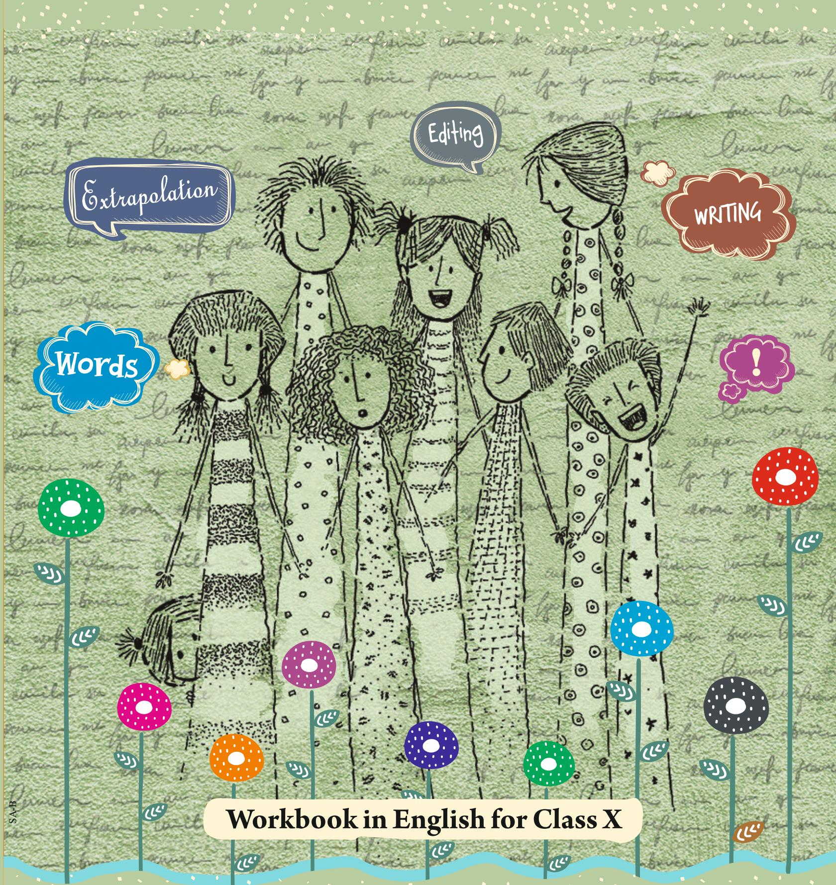
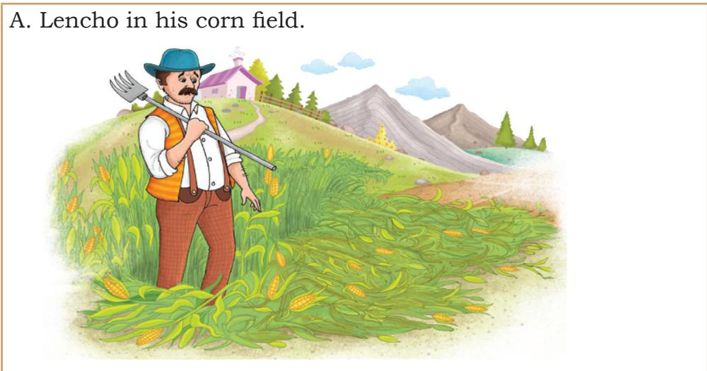
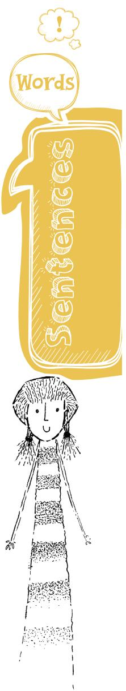
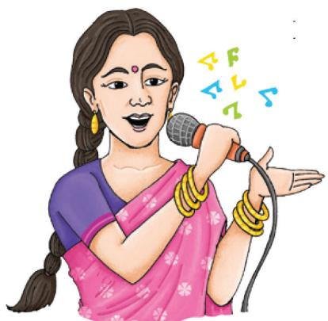
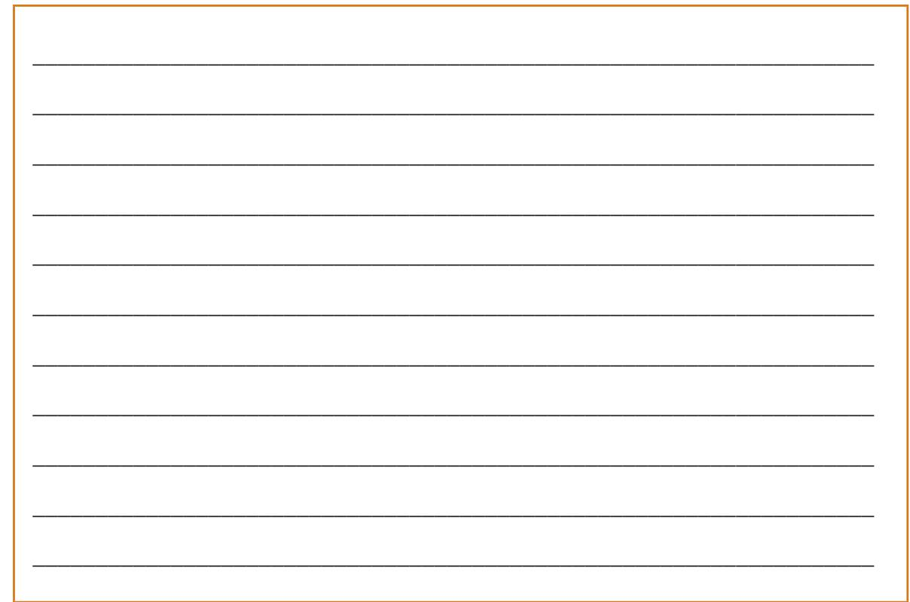
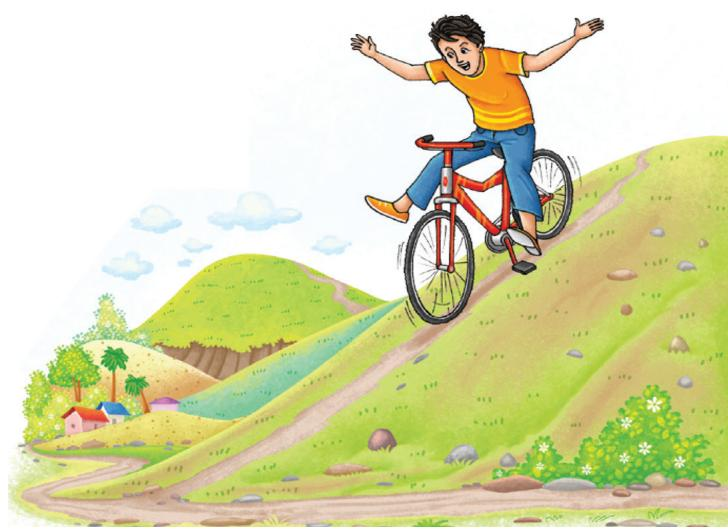
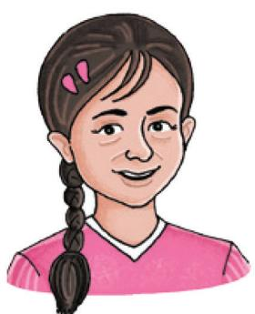
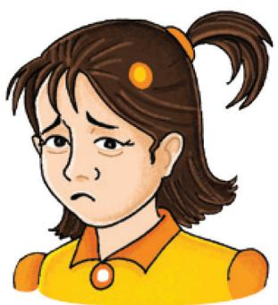
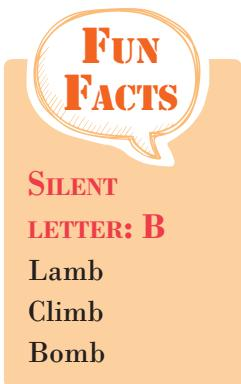

State Council of Educational Research & Training Andhra Pradesh

# Words and Expressions

2

# FUNDAMENTAL DUTIES

# Fundamental duties : It shall be the duty of every citizen of India-

(a) to abide by the Constitution and re spect its ideals and institutions , the National Flag and the National Anthem;   
(b) to cherish and follow the noble ideals which inspired our national struggle for freedom;   
(c) to uphold and protect the sovereignty, unity and integrity of India;   
(d) to defend the country and render national service when called upon to do so ;   
(e) to promote harmony and the spirit of common brotherhood amongst all the people of India transcending religious , linguistic and regional or sectional diversities ; to renounce practices derogatory to the dignity of women;   
(f) to value and preserve the rich heritage of our composite culture ;   
(g) to protect and improve the natural environment including forests , lakes , rivers and wild life, and to have compassion for living creatures ;   
(h) to develop the scientific temper, humanism and the spirit of inquiry and reform;   
(i) to safeguard public property and to abjure violence .   
(j ) to strive towards excellence in all spheres of individual and collective activity so that the nation constantly rises to higher levels of endeavour and achievement;   
(k) who is a parent or guardian to provide opportunities for education to his child or as the case may be ward between the age of six and fourteen years ;

- C onstitution of India,

P art IV A (Article 5 1 A)

# Right of Children to Free and Compulsory Education (RTE) Act 2009

The RTE Act provides for the right of children to free and Compulsory Education to every child in the age group of 6 – 1 4 years which came into force from 1 st April 20 1 0 in Andhra Pradesh.

# Important provisions of RTE Act

• Ensure availability of schools within the reach of the children.   
• Improve School infrastructure facilities .   
• Enroll children in the class appropriate to his / her age .   
• Children have a right to receive special training in order to be at par with other children.   
• Providing appropriate facilities for the education of children with special needs on par with other children.   
• No child shall be liable to pay any kind of fee or charges or expenses which may prevent him or her from pursuing and completing the elementary education. No test for admitting the children in schools .   
• No removal of name and repetition of the child in the same class   
• No child admitted in a school shall be held back in any class or expel from school till the completion of elementary education.   
• No child shall be subj ected to physical punishment or mental harassment.   
• Admission shall not be denied or delayed on the ground that the transfer and other certificates have not been provided on time   
Eligible candidates alone shall be appointed as teachers .   
• The teaching learning process and evaluation procedures shall promote achievement of appropriate competencies .   
• No board examinations shall be conducted to the children till the completion of elementary education.   
• Children can continue in the schools even after 1 4 years until completion of elementary education.   
• No discrimination and related practices towards children belonging to backward and marginalized communities   
• The curriculum and evaluation procedures must be in conformity with the values enshrined in the constitution and make the child free of fear and anxiety and help the child to express views freely. 商国

# Words and Expressions 2

# Workbook in English

# for Class X

1076

i  R NATIONAL COUNCIL OF EDUCATIONAL RESEARCH AND TRAINING

# First Edition

June 2019 Ashadha 1940

# Reprinted

December 2019 Agrahayana 1941

# Revised Edition

February 2023 Fhalguna 1944

# PD 500T BS

$^ { © }$ National Council of Educational Research and Training, 2019, 2023

Printed on 80 GSM paper with NCERT watermark

Published at the Publication Division by the Secretary, National Council of Educational Research and Training, Sri Aurobindo Marg, New Delhi 110 016 and printed at Dee Kay Printers, 5/34, Kirti Nagar, Industrial Area, New Delhi-110 015

# ALL RIGHTS RESERVED

 No part of this publication may be reproduced, stored in a retrieval system or transmitted, in any form or by any means, electronic, mechanical, photocopying, recording or otherwise without the prior permission of the publisher.   
 This book is sold subject to the condition that it shall not, by way of trade, be lent, re-sold, hired out or otherwise disposed of without the publisher’s consent, in any form of binding or cover other than that in which it is published.   
 The correct price of this publication is the price printed on this page. Any revised price indicated by a rubber stamp or by a sticker or by any other means is incorrect and should be unacceptable.

# OFFICES OF THE PUBLICATION

Division , NCERT

NCERT Campus

Sri Aurobindo Marg

New Delhi 110 016

Phone : 011-26562708

108, 100 Feet Road

Hosdakere Halli Extension

Banashankari III Stage

Phone : 080-26725740

Navjivan Trust Bu

P.O.Navjivan

Ahmedabad 380 014

Phone : 079-27541446

CWC Campus

Opp. Dhankal Bus Stop

Panihati

Kolkata 700 114

Phone : 033-25530454

CWC Complex

Maligaon

Guwahati 781 021

Phone : 0361-2674869

# Publication Team

Head, Publication : Anup Kumar Rajput Division

Chief Production Officer : Arun Chitkara

Chief Business Manager : Bibash Kumar Das

Chief Editor (In charge) : Bijnan Sutar

Production Assistant : Rajesh Pippal

Cover, Layout and Illustration

Blue Fish Designs

# Words and Expressions 2

# WORKBOOK IN ENGLISH FOR CLASS X

# Text Book Development Committee

Sri Praveen Prakash IAS

Principal Secretary to Government

Department of School Education, AP

Sri. S. Suresh Kumar IAS

Commissioner of School Education , AP

Sri. B. Srinivasa Rao IAS

State Project Director, Samagra Shiksha, AP

Dr. B. Pratap Reddy MA., B.Ed., Ph.D.

Director, SCERT, AP

Sri. K. Ravindranath Reddy MA., B.Ed.

Director, Government Textbook Press, AP

# Programme Co-ordinator

Dr. G. Kesava Reddy

MSc, MSc, MEd, MPhil, PhD

Prof. C&T, SCERT, AP

# Technical Co-ordinator

Dr. Ch.V.S. Ramesh Kumar

Faculty, SCERT-AP

# Foreword

Teaching and learning of language in school education should be based on the insight that language learning is a natural process which should be enhanced in school for academic and overall achievement of the learners. It is extremely important that learner-centric methodologies of language learning should be promoted for eliciting critical responses, and developing sensitivity to social issues.

The focus of language learning is on developing skills of language and communicative competence. Language learning progresses naturally with exposure to and use of language in meaningful situations. In this context, importance has been attributed in the National Curriculum Framework-2005, to methods of teaching which are process based. These give opportunities to learners for engaging with texts through various activities and exercises and equip them for self-assessment.

In multilingual India, English has been one of the languages which is being learnt in schools. It is therefore recommended that English be learnt along with the language of the learners since it leads to transference of skills from the child’s own language to the second language (English).

We, at the NCERT, make an endeavour to provide engaging, relevant, and authentic resources. This supplements and complements language acquisition and provides opportunities for learners to associate experiences with everyday life.

The Council had developed two books, First Flight (textbook) and Footprint without Feet (Supplementary Reader) for Class X based on the National Curriculum Framework-2005. The workbook, Words and Expressions 2 is a sequential continuation of these. It has been developed taking into account the feedback on these books and needs of learners and teachers.

The workbook has also taken into account the skills that are critical for overall development of the learners, such as the skills of collaboration, creativity and imagination, critical thinking and problem solving, communication and compassion.

We hope this workbook will serve as an effective instrument for learners and teachers for adding quality to the teaching and learning processes. We are indebted to the institutions and organisations which have generously permitted us to draw upon their resources and materials. All the publications of the Council are regularly revised on the basis of the feedback from students, parents, teachers, and teacher educators.

Hrushikesh Senapaty

Director

New Delhi

June 2019

National Council of Educational

Research and Training

# Rationalisation of Content in the Textbooks

In view of the COVID-19 pandemic, it is imperative to reduce content load on students. The National Education Policy 2020, also emphasises reducing the content load and providing opportunities for experiential learning with creative mindset. In this background, the NCERT has undertaken the exercise to rationalise the textbooks across all classes. Learning Outcomes already developed by the NCERT across classes have been taken into consideration in this exercise.

# Contents of the textbooks have been rationalised in view of the following:

• Content based on genres of literature in the textbooks and supplementary readers at different stages of school education   
• Content that is meant for achieving Learning Outcomes for developing language proficiency and is accessible at different stages   
• For reducing the curriculum load and examination stress in view of the prevailing condition of the Pandemic   
• Content, which is easily accessible to students without much interventions from teachers and can be learned by children through self-learning or peer-learning   
• Content, which is irrelevant in the present context

This present edition, is a reformatted version after carrying out the changes given above.

# About the Workbook

Words and Expressions 2 is a sequence to the textbook in English for Class X, First Flight. Like Words and Expressions 1, it is a self-study material. It lays emphasis on providing a variety of rich and comprehensible inputs. This gives learners exposure to the target language and enables them to further their skills in the English language. The passages and activities given here create opportunities for them to handle the English language for performing important language functions and help them develop critical thinking on contemporary concerns. The book is expected to help learners to read for meaning in context and also serve as a base for communication in the English language.

There are 11 units in this workbook. The chapters of the textbook and the units are to be taught in a coordinated manner. The units correspond to each lesson in the textbook. There are various tasks in each unit. ‘Let’s begin’ is followed by Comprehension passages, Vocabulary tasks, Grammar exercises, Editing, Listening, Speaking, and Writing activities. All units end with Project work reiterating the learning through elaborate activities. The sections have followed an integrated approach and focus on a particular skill of the English language.

The introductory section, ‘Let’s begin’ asks questions making the students think and discuss on the chapter they have read. They are asked to collect information, read various written texts and e-texts, watch, and listen to online resources from Internet services like YouTube. They can also refer to the materials given in the QR code of the textbook along with the reading aloud of the texts and recitation of the poems. They are required to work in groups of two or four, note down points, develop speech, debate, etc., and then to speak before the whole class. This follows an integrated process of reading with comprehension, reflection, writing, and expressing thoughts.

The themes of the unseen comprehension passages, span across the literary, cultural, and sociological realms—which appeal to and inspire the adolescents—are chosen based on the corresponding chapters in the textbook. Reading Comprehension has prose passages as well as poems. The familiarity of the context has been taken care of while selecting the passages. An attempt has been made to expose the learners to a variety of texts, comprehend the meaning of words in context, understand the theme, and answer factual and thoughtprovoking questions. Learners are also given opportunities to interpret poems, be acquainted with beautiful expressions, phrases, and understand the expressions of the images. Some questions have been given to infer meaning and other to inspire learners to think critically and bring out their deeper understanding of the text. Multiple choice questions are also given in the book for students to assess themselves.

The workbook is a self-study material for the students. They are encouraged to work in pairs or groups so that they support each other and learn from each other. However, if required, teachers may guide. A variety of tasks, exercises, and ‘Look up and understand’ are placed strategically to build vocabulary in the given context. The learners are encouraged to use the dictionary as often as required. The intention is to help them learn new words and their usages in different contexts. Further, ‘Proofreading marks’ have been given for students to learn the basics of proofreading and editing.

The written and spoken compositions are preceded by discussions in peer groups. The themes of the composition include contemporary issues like gender, environment, diversity, human values, animal rights, adolescent issues which are relevant to the age group, and appropriate in the contemporary time. This is to enable the learners to see the world, develop necessary skills, and face the challenges of the present as well as future.

Enough opportunities are given to the students to develop listening comprehension and to use the English language in real-life situations. It is reiterated that basic language skills are developed simultaneously, not in isolation, but in an integrated manner. So integrated listening and speaking activities are given in the book. Grammar activities are presented in everyday contexts and are given with keeping usage in mind, not the formal explication of grammatical concepts.

The fine distinction of the workbook is that it is directly addressed to the students. The language used is simple, so that there is less dependence on the teachers. The activities are simple and stress free, enabling the learners to complete these confidently. Self-learning is encouraged. The pair or group work will give students an opportunity to look at the work of their peers and make each of them feel both responsible as well as independent. Every learner has a unique learning style. The group work may help them understand their challenges, evaluate themselves vis-a-vis their peers, and find the best way to overcome them.

The project activities given at the end of each unit are expected to be engaging, across the entire curriculum and interdisciplinary. These help generate interest to explore, analyse, think critically, reflect, and then present thoughts orally or in writing.

‘Fun facts’ are given in the margins throughout the workbook, with the hope that the learner would have a lasting impression of the correct usage of the English language. Teachers must remember that ‘Fun facts’ are for joyful learning and non-evaluative.

It is hoped that this book will help students use the English language effectively and meaningfully for the purpose of communication which will make them proficient and perceptive users of the English language. They will find this workbook enjoyable and rewarding as it is learner-centered and activity based. Comments and suggestions on any aspect of the workbook are welcome. This would enable us to improve the next edition.

# Workbook Development Committee

# Members

Dolly Dhawan, PGT (English), G.D. Salwan Public School, Rajendra Nagar, New Delhi   
Keerthi Sahni, TGT (English), Sanskriti School, Chanakyapuri, New Delhi   
Kirti Kapur, Professor, Department of Curriculum Studies, NCERT, New Delhi   
Malathi Srinivasan, PGT (English), Army Public School, Delhi Cantt., New Delhi   
Mamta Saluja, Lecturer in English, Rajkiya Pratibha Vikas Vidyalaya, BT Block, Shalimar Bagh, Delhi   
Meenakshi Khar, Associate Professor, Department of Education in Languages, NCERT, New Delhi   
Meenu Gupta, Lecturer in English, Sarvodaya Kanya Vidyalaya, B L Block, Shalimarbag, Delhi   
Monal Dewle, Assistant Professor, Centre for English Language Education, Ambedkar University, Delhi   
Monishita Hajra Pande, Assistant Professor, Centre for English Language Education, Ambedkar University, Delhi   
R. Meganathan, Professor, Department of Education in Languages, NCERT, New Delhi   
Shobha Sharma, Principal, Kendriya Vidyalaya – 1, AFS Hindan, Ghaziabad   
Shveta Uppal, Chief Editor, National Council of Educational Research and Training, New Delhi   
Sonia Makheeja, Lecturer in English, Sarvodaya Kanya Vidyalaya, Rajouri Garden Extn, New Delhi

# Member Coordinator

Sandhya Rani Sahoo, Professor, Department of Education in Languages, NCERT, New Delhi

# Ac knowledgements

The National Council of Education Research and Training is thankful to Saroj Yadav, Professor and Chairperson, Dean, Academics, NCERT; A K Srivastava, Professor and Dean, Research, NCERT; Ranjana Arora, Professor and Head, Department of Curriculum Studies (DCS); Sandhya Singh, Professor and Head, Department of Education in Languages (DEL); Anjum Sibia, Professor and Head, Department of Educational Psychology & Foundations of Education (DEPFE); Dinesh Kumar, Professor, Department of Education in Science and Mathematics (DESM); Gouri Srivastava, Professor and Head, Department of Education in Social Sciences (DESS); Anita Julka, Professor, Department of Education of Groups with Special Needs (DEGSN); and Anup Rajput, Professor, Department of Elementary Education (DEE) for making valuable suggestions, providing feedback towards the improvement and finalisation of this workbook. Special thanks are due to the West Bengal Tourism Department and Madhya Pradesh Tourism Department for the information on The Sundarbans and Sanchi Stupa respectively.

Special thanks are also due to Devanshi Tyagi, Assistant Editor (Contractual), and Chanchal Chauhan, Proofreader (Contractual) for carefully editing the manuscript and making it interesting. Gratitude is expressed to the Publication Division, NCERT, for their support. NCERT gratefully acknowledges the contributions made by Rekha and Nitin Kumar Gupta, DTP Operators (Contractual), for patiently incorporating the corrections and doing a flawless layout.

The Council is grateful to the writers, photographers, and publishers who have accorded permission to reproduce the following materials in this workbook.

1. ‘Sardar Patel’s Call to Youth to build up Character and be Disciplined’, The Collected Works of Sardar Vallabhbhai Patel (1 January 1948-31 December 1948), Konark Publishers, Delhi.   
2. Excerpt from ‘The Diary of Lena Mukhina: A Girl’s Life in the Siege of Leningrad’, trans. Amanda Love Darragh, Macmillan Publishers Limited, London.   
3. ‘8th September 1941: Start of the Siege of Leningrad’, https:// www.youtube.com/watch?v=5n2ym0LHyRU   
4. Excerpt from Harriet Tubman: The Moses of Her People, Langston Hughes, Ginn and Company, Massachusetts.   
5. ‘Stephen Hawking, the TV Star’, Raja Sen, livemint, 14 March 2018.

6. Excerpt from The Moffats, Eleanor Estes, Harcourt Young Classics, New York.   
7. ‘The Galaxy Song’, Monty Python, (Song writers: John Du Prez and Eric Idle), Universal Music Publishing, London.   
8. Excerpt from ‘Speak Truth to Power’, Wangari Maathai, https:// www.greenbeltmovement.org/wangari-maathai/key-speechesand-articles/speak-truth-to-power   
9. Excerpt from ‘There will always be a seed for everyone’, Aditi Pinto, The Hindu, https://www.thehindu.com/society/therewill-always-be-a-seed-for-everyone/article18194781.ece   
10. Excerpt from ‘Down memory Lane with Parsis of New Delhi’, Shernaz Italia, The Wire, https://thewire.in/uncategorised/theparsis-of-new-delhi   
11. Excerpt from ‘What’s Brewing in Araku Valley?’ Diya Kohli, livemint, https://www.livemint.com/mint-lounge/features/ what-s-brewing-in-araku-valley-1550829797335.html   
12. Excerpt from ‘Can wetlands find a safe haven in our cities?’, Sutirtha Lahiri, livemint, https://www.livemint.com/ Leisure/6Juh1zr8tPpSS6Gql44GGL/Can-wetlands-find-a-safehaven-in-our-cities.html   
13. Excerpt from ‘Have you had your daily dose of Vitamin P?’, Sandip Roy, livemint, https://www.livemint.com/mint-lounge/features/ have-you-had-your-daily-dose-of-vitamin-p-1552630970050. html   
14. Excerpt from ‘A Jewel of the Andaman Sea’, Neeta Lal, livemint, https://www.livemint.com/mint-lounge/features /a-jewel-ofthe-andaman-sea-1552641881763.html   
15. ‘The Civet Cat– Baby Bhakat, a true story from Assam’, Rommel Shunmugam, Conservation photographer and author, Haryana.   
16. ‘Dharani playing with civet cat’, ‘Civet cat sleeping near two babies’, Rommel Shunmugam, Conservation photographer and author, Haryana.   
17. ‘It’s not easy having Elephants in your Backyard’, https:// www.wwf.org.uk/what-we-do/area-of-work/preventing-humanwildlife-conflict   
18. ‘Animal rights’, https://www.peta.org.uk/action/what-isanimal-rights/

19. Excerpt from ‘Pedaling through the Golden Years’, Vishav Driman, India Travel360 (AirAsia Inflight Magazine), Issue 21, New Delhi.   
20. Excerpt from The Transformed Mind, His Holiness the Dalai Lama, Hodder and Stoughton, London.   
21. Excerpt from ‘On Violence’, On Education, J Krishnamurti, Krishnamurti Foundation India, Chennai.   
22. ‘WP steaming out with a Special Train from Ballard Pier Mole Station’, Mukul Jain, Western Railway website, http://www. trainweb.org/railworld/Western%20Railway%20Historical%20 Pictures/WP%20at%20Ballard%20Pier.jpg   
23. ‘Appendix 5: Proofreading marks’, The Concise Oxford English Dictionary, Tenth Edition, ed. Judy Pearsall, Oxford University Press, 1999, New York.

For ‘Man vs Nature’ by Norman Littleford, we have been unable to find the address to write to for copyright. We will be happy to write for permission upon procuring the address.

Sincere efforts have been made to procure permission from all those individuals, agencies, and institutes from where any text, visual or reference has been used in this workbook. However, in case any credits have been missed out inadvertently, the Council regrets the same and will rectify it immediately on being informed.

# Contents

Foreword iii   
Rationalisation of Content in the Textbooks v   
About the Workbook vii   
Unit 1 A Letter to God 1   
Unit 2 N el son Ma ndela : Long Wal k to Freedom 17   
Unit 3 T w o Stories a bou t Fl ying 31   
Unit 4 From the Dia ry of Anne Fra nk 45   
Unit 5 Gl im pses of India 57   
Unit 6 Mijbil the Otter 73   
Unit 7 Ma dam Rides the Bu s 93   
Unit 8 T he Serm on a t Bena ra s 109   
Unit 9 T he Proposal 124   
Appendix Proofreading marks 140

Perfection is achieved, not when there is nothing more to add, but when there is nothing left to take away.

— Antoine de Saint-Exupéry

To write is human, to edit is divine.

— Stephen King

# UNIT

# A Letter to God

# Let’s Begin

1. You have read about Lencho in ‘A Letter to God’, First Flight, textbook in English for Class X. How has the story of Lencho moved you? What do you think about Lencho’s faith in God and his attitude towards the officials in the post office? Do you think he is right in asking God for support and then blaming the people at the post office? Discuss his actions with your friends. Why does he do so?

2. The summary of the story of Lencho is given below. The sequence of the story is jumbled up.

Read the story again and rearrange the jumbled sentences to make a coherent story.

<table><tr><td>Write the correct order in numbers in the column below</td><td>Jumbled sentences</td></tr><tr><td></td><td>But it rained heavily and hailstorm thrashed his corn field and all the corn was destroyed.</td></tr><tr><td></td><td>He wrote ‘To God’ on the envelope and posted it.</td></tr><tr><td></td><td>Lencho predicted it will rain and it did. He and his wife were happy.</td></tr><tr><td></td><td>Lencho felt desperate but believed that God would help him.</td></tr><tr><td></td><td>Their corn field was longing for water.</td></tr><tr><td></td><td>The postman and the postmaster laughed at Lencho&#x27;s letter but were surprised by the faith of the man.</td></tr></table>

1076CH01

<table><tr><td></td><td>He wrote a letter to God asking for a hundred pesos to sow his field again and to survive until the next crop came up.</td></tr><tr><td></td><td>After some days, Lencho went to the post office to receive the money as the postmaster watched him.</td></tr><tr><td></td><td>He immediately went to the counter and asked for a pen and paper, wrote a few lines and posted the letter.</td></tr><tr><td></td><td>Lencho, his wife, and their children lived in a lonely house in a valley.</td></tr><tr><td></td><td>When the postmaster opened the letter, it said “Oh! Thanks for sending the money. But I have received only seventy pesos. Next time you please send the money directly to me. The people at the post office are a bunch of crooks. They have taken the thirty pesos.”</td></tr><tr><td></td><td>He opened the letter and was happy to find the money. He counted and found it was only seventy pesos.</td></tr><tr><td></td><td>The postmaster collected about 70 pesos from his colleagues and sent it to Lencho.</td></tr></table>

Create a graphic description based on the given summary of ‘A Letter to God’.

B.   
C.   
D.

# Reading Compr ehension

# Text I

Given below is a story of the tailor who has been known for his skills in cheating and stealing. Read in groups of four or in pairs. You may discuss the events and incidences of the story with your friends and write them in a sequential manner.

# The Trader and the Tailor

# Look Up and Understand

beguiling cordiality hamper snipping wagered

There was a tailor who was known for beating others in the art of being light-fingered and thievery. A trader swore that even with a hundred attempts, the tailor would not be able to take a coil of thread from him without his knowledge.

The trader was told that many others, more intelligent than him, had been beaten by the tailor. They said he should not imagine himself so great, for his ego would only give him worse troubles in competition with the tailor. Still, the trader became more competitive and made a wager that the tailor would not be able to rob him of anything.

He wagered an Arab horse with those who taunted him. If the tailor failed to steal, then they would have to give him a horse instead. That night, the trader lay awake troubled by the situation and could not sleep a wink.

In the morning, he put a piece of satin cloth under his arm and went to the bazaar and entered the shop and saluted the cunning rogue warmly. The tailor sprang up from his seat and welcomed the trader, inquiring about his health with cordiality exceeding even that of the trader, planting in his heart great feelings of affection for him. When the trader heard these songs of sweetness from the tailor, he flung down the piece of silk saying, “Cut this into a coat for me and make it wide below my navel so as not to hamper my legs and tight about it to show off my figure.”

The tailor answered, “O! kindly man, I will do you a hundred services,” and accepted the order. He measured the satin and inspected the working surface and all the time chatted away to the trader in idle gossip, about other amirs and of bounties and gifts he had received from them, and about misers and their mean ways, and made the trader laugh with hysterics. During this beguiling talk, he was snipping away with his scissors rapidly, cutting as fast as his lips moved.

The trader was laughing, the tailor was cutting, the trader closed his eyes in joy, the tailor cut extra pieces, tucking them under his thighs, hidden away from all but God. From his delight at the tailor’s tales, the trader’s former boast went out of his mind. What satin? What boast? What wager? The trader was drunk on the jokes told by the tailor.

Then the tailor told such an incredible story that the trader fell over on his back with laughter. The tailor swiftly stitched a swatch of the satin to the hem of his underpants while the trader was paying no attention at all, greedily sucking with every guffaw at the jests the tailor told. The tailor continued to tell funnier and funnier tales and jokes until the trader was completely within his power.

With his eyes shut and his reason vanished, the bewildered and boastful trader was drunk with joy. And the tailor continued to cut, filching yet more of the beautiful cloth, with nothing to stop him now. And yet the trader begged for more.

You who becomes the slave of the jest, no story is more laughable than you yourself, think on this at the edge of your grave. How long will you listen to the lies of this world that leave your mind and spirit unhinged? The Universal Tailor will cut and stitch the hems of a hundred travellers, silly as children.

Eventually the tailor became bored with the whole story and told the trader that he better leave before another tale was told, “For if I tell another one, the coat will be too tight for you, and you will stop laughing and weep tears of blood.”

Rumi (Abridged)

Did you enjoy the story of ‘The Trader and the Tailor’? The story is summarised below. Read the story again with your friend and complete the paragraph using short sentences with the given hints.

Once there was a tailor who was known for (cheat and thievery). He could cheat anyone with his cunning way of deceiving people. A trader challenged that the tailor would not be able to cheat him. He (go) to the tailor with

# Look Up and Understand

filching incredible swatch unhinged

# Fu n Facts

# Using ‘Notice’

Thank you for noticing this notice.

Your noticing has been noted.

(satin). The tailor (welcome). The trader

(please) by the tailor’s praise. He told the tailor to make a coat for him. The tailor (praise) the trader (maximum). The trader _ (joy).

The tailor (recount) funny tales and the trader forgot_ (bet). The tailor started snipping _and

hide). Eyes of the trader (tears and joy) and yet the trader kept on asking for (stories). At last, the tailor told the trader that _ _ (tight) and (weep-blood).

# Vocabul ary

1. In this story you have come across a word “light-fingered” which means inclined to steal things. Some such words are given below. Use appropriate words and fill in the blanks.

light-headed, light year, light-hearted, light sleeper, light-duty

(a) The is a unit of distance used to measure distance in space.   
(b) The farmer bought a_ truck to transport their produce, as it uses less diesel.   
(c) We had a fairly discussion with our colleagues.   
(d) Rita felt dizzy and _ after skydiving.   
(e) He is a _, a slightest noise wakes him.

# Grammar

1. You have come across Relative Clauses in the lesson ‘A Letter to God’. Read about the relative clauses again. Complete the sentences given below in the table by adding the most suitable clause from the box and make it a relative clause. The first one has been done for you.

<table><tr><td>contains meaning of words
stitches clothes
tell lies
won the best actor award this year
hit a century
is faithful</td><td>need to fill in the application
is a crook
help themselves
won the Nobel prize
believe in hard work</td></tr></table>

(a) A tailor is a person who stitches clothes.   
(b) A dictionary is a book   
(c) The book is about a scientist   
(d) What is the name of the player   
(e) I don’t like people   
(f) What is the name of the actor   
(g) Students should meet the principal in her office.   
(h) Friends of the trader thought the tailor and can cheat anyone.   
(i) Lencho thought God would help him.   
(j) Those will succeed.   
(k) God helps those

# Fun Facts

Wound as Verb and Noun

The bandage was wound around the wound.

# Fun Facts

Proofreading marks

Editors have special symbols called proofreading marks to correct language.

Some are given he

# give space . put a full stop , insert comma $\big / \big <$ insert new word

See page nos 167-168 for more such symbols.

# Editing

1. Suppose Lencho gets a hundred pesos in his envelope. He writes a letter to God expressing his gratitude. However, he has missed a word in each line. Help him with those words so that his letter is complete.

Dear God!

Thank for Thank you for

(a) sending a hundred pesos help.   
(b) I am very for this kind gesture.   
(c) You were my only and your   
(d) help has my faith in you.   
(e) This money will help me until the crop   
(f) and I promise to hard in the future.

Sincerely yours,

Lencho

# Listening

1. Here is an interesting story. The story has been told in two ways. Story A has all the odd sentences (1,3,5,...) and story B has the even sentences (2,4,6,...). Working in pairs, one of you take up Story A and the other take up Story B. The person with Story A will read out the first sentence and the partner (person with story B) will write in the space provided. Then the person with Story B will read sentence two and the partner will write in the space for sentence two. Likewise complete the whole story. Once the story is completed, both of you will read out to each other to check whether you have listened carefully to your partner and written the complete story.

# Story A The Race

1. Every evening the animals of the Machlipatti used to sit under the banyan tree.

# Story B The Race

1.

2.   
3. He said, “Let’s run a race!” “Who will run a race with you?   
4.   
5. Choo-Choo, the rat, shouted, “No, he’s not the fastest runner.   
6.   
7. Everyone laughed at him.   
8.   
9. The starting point was the peepul tree and the finishing point was the neem tree.   
10.   
11. Kho-Kho and Choo-Choo started running.

2. One day Kho-Kho, the rabbit, was feeling bored.   
3.   
4. No one can run faster than you,” said Bhalu, the bear, eating a mango.   
5.   
6. I can run faster than him.”   
7.   
8. Then it was decided to have a race between Kho-Kho and Choo-Choo.   
9.   
10. Coocku, the cock, crowed to start the race.   
11.

12.   
13. “He must be far behind.”   
14.   
15. He shouted, “I’ve won the race! I’ve won the race!”   
16.

12. After running half the distance, Kho-Kho looked back but Choo-Choo was nowhere to be seen.   
13.   
14. When he was near the finishing point, Choo-Choo jumped over Kho-Kho’s shoulder and touched the neem tree first.   
15.   
16. Everyone cheered for Choo-Choo.

# Speaking

1. Lencho, the main character in the story, is a farmer. He supports his family through farming. The conflict in the story happens when a hailstorm strikes the field and destroys his farm. All the hard work, for nothing! The entire land is wrecked by catastrophe. There is no one who can help. Lencho’s complete faith in God is amazing during the calamity.

So, one type of conflict dominating in the story is man versus nature. Discuss with your partner the natural calamities that play havoc in the lives of people. Collect photographs and make a visual presentation to share in the class.

2. Try writing a small poem on the topic man versus nature. Read aloud the poem with the required stress and intonation. Given below is a poem written by Norman Littleford, which may help you think and compose.

# Man vs Nature

The heavens roared with thunder

as lightning filled the skies

was this God getting angry

or Nature’s big surprise.

Is Mother Nature telling us

the best way that she can

to stop the interference

and abuse she gets from man.

We marvel at her beauty

each time we look around

then dig up all her treasures

from their natural burial ground.

We forget that Nature gives us

all that keeps us living

we take it all and still want more

but never think of giving.

We build across the countryside

progressing every day

but Mother Nature can’t progress

for man is in the way.

Norman Littleford

# Writing

1. The tailor here is a cheat, but Lencho in the story, ‘A Letter to God’, is naive and simple. He has immense faith in God. How do you distinguish between Lencho and the tailor? What makes them different? Working in pairs, list the actions and qualities of Lencho and the tailor and draw their character sketches.

<table><tr><td>Action: What does the person do?</td><td>What quality it reveals?</td></tr><tr><td>Lencho lost all his crops.</td><td>He is helpless. Prays to God.</td></tr><tr><td>How does he manage the situation?</td><td>___________</td></tr><tr><td>Does he harm anyone by his action?</td><td>___________</td></tr><tr><td>How do others think of him?</td><td>___________</td></tr><tr><td>What is your judgement of him?</td><td>___________</td></tr><tr><td>He received 70 pesos and he thought 30 pesos had been stolen.</td><td>___________</td></tr></table>

Now, write the character sketch of Lencho and the tailor.

<table><tr><td>Lencho</td><td>The tailor</td></tr><tr><td></td><td></td></tr><tr><td></td><td></td></tr><tr><td></td><td></td></tr><tr><td></td><td></td></tr><tr><td></td><td></td></tr><tr><td></td><td></td></tr><tr><td></td><td></td></tr><tr><td></td><td></td></tr></table>

# 2. Writing a portrait or description of a person

Read the following description about two persons, Raavi and Mohini.

# Raavi

A portrait or a picture of a handsome young man in full sleeves shirt.

Raavi is an engineer in a manufacturing firm.

He likes to make, fix, and repair things.

He loves to watch television and goes to the movies thrice a month.

He is congenial and supportive.

He does not like to play, but goes for a morning walk everyday.

# Mohini

A portrait or a picture of a middle aged lady who is a singer.

She studied music and became a playback singer.

She likes to be with people and participates in social functions.

She loves music and reading books.

She is firm and a lady with a purpose.

She does not get time to exercise.

Now, write a description of any one of the above based on the details given. You may follow the process approach to writing. First, you read the given information in the box and make a list of describable (adjectives) points used for each person, in your own words. Secondly, take the help of these points to develop an outline in sentence form. Thirdly, use the outline and prepare the first draft of the description of the person and then edit the draft. Prepare the final copy after making all changes. The table

below gives you ideas on how the Process Approach is helpful for improving your writing.

<table><tr><td colspan="2">Writing: The Process Approach</td></tr><tr><td>The processes</td><td>What do you do?</td></tr><tr><td>Brainstorming</td><td>Note down as many ideas as you can about a given topic. Then arrange the ideas in a sequence.</td></tr><tr><td>Outlining</td><td>Create an outline of your writing—
  which ideas will go first, how will they be supported by evidence, will there be a picture, etc.</td></tr><tr><td>Drafting</td><td>Write the first draft; here the focus is on the content and not the form.</td></tr><tr><td>Revising</td><td>Revise the first draft, improve it. Add or delete ideas and improve the language.</td></tr><tr><td>Proofreading</td><td>Proofread the draft with the help of the teacher; here the focus is on the form and not the content.</td></tr><tr><td>Final draft</td><td>Write the final draft now.</td></tr></table>

Raavi/Mohini

Words and Expre ssions 2 – Class X

# Project

1. You may have come across some people in your neighbourhood who might have inspired you with their actions. Talk to them about—

their childhood, their education, job, their likes and dislikes   
their contribution to the enrichment of their village or town, job, country, etc.   
their interesting features and characteristics

Request for their pictures. Based on the collected information, write their portraits and present it to the class. You may read on ‘How to do project work?’ given below.

# How to do project work in the English language classroom?

In addition to the textbook activities, project work could be used as an effective strategy to promote collaborative ways of language learning where we work together in groups to do an activity. We collect information, ideas; observe the language being used; use language in real life situations; exchange views and debate on ideas; write the ideas into a report; edit our writing and produce the report in a suitable form. This helps in constructing ideas and analysing critical judgments of the peers to arrive at a decision or conclusion.

It would be of much benefit to learners, if projects planned are of an interdisciplinary nature.

# Designing and managing projects

There are many ways students can be initiated to carry out projects.

Read books, newspapers, listen to the radio, watch TV, consult websites and encyclopedia, talk to people, observe events and proceedings, interview people, record audio/ video, collect pictures and illustrations, interpret them, and report.   
Write field notes to remember and organise the data collected.

Bring your own ideas to the class and have a class discussion.   
Use language meaningfully and precisely. If the meaning of learning is ‘meaning making’, the purpose is achieved fully while doing projects.   
Learners should do the projects in group independently. They should not ask their parents to do these or buy readymade products available in the market.   
They may seek information or some help from parents or elders.

# Planning, writing the draft and editing

Having collected the required data, information and ideas, plan and organise the data and interpret them to write the draft. It could be posters, a script of a play (enact and direct a play), songs, essays, etc. Editing is an important part of writing the report. Students should be made aware of process approach involved in writing a good piece of work. Then present it to the whole class or to the school during the assembly or on special occasions (in case of play, songs, etc.).

# UNIT 2

# Nelson Man dela: Lon g Walk to Freedom

# Let’s Begin

1. You have read the story about Nelson Mandela in your textbook, First Flight, and the struggle of the people of South Africa. Mandela draws our attention to the meaning and importance of freedom and leading a life with freedom.

He states that freedom comes with responsibilities. Discuss with your peers, how freedom and responsibilities go hand in hand.

1076CH02

# Reading Compr ehension

# Text I

Given below is a speech by Sardar Patel, one of the prominent figures of India’s freedom struggle. This is one of the convocation speeches delivered by him. Read the speech and answer the questions that follow.

# Sardar Patel’s Call to Youth to build Character and be Disciplined

I must thank you for the affectionate and warm welcome which you have extended to me and for the love and regard which you

have shown me by conferring this honour to me. Gifts are of many kinds those achieved by one’s own endeavour are good and deserved, but no gift should be conferred on one whose worthiness has not been tested. By selecting me without assuring yourself of my fitness for the gift, you have laid me under a heavy debt and, by your injunctions that I should continue to prove worthy of it throughout my life, you have imposed on me a very difficult obligation. At present, I cannot say anything because I by your love and affection; and, therefore, with your and God’s grace, I pray that I may prove worthy of it. I fail, the blame for my failure will be shared by you

this occasion, I wish to place before you a few hts which occur to my mind as incidental to our won freedom. We have now won our freedom. But as I am doubtful, if I deserved the honour that have done me, you have also to think whether you done everything to deserve freedom that you have ined after such a bitter and sustained struggle.

here are people who think that having won freedom, e is nothing more to do about it. Freedom has come s through sacrifices. Those who made sacrifices d the fruit of their efforts and self-denials, but it is for who are now enjoying freedom to taste its fruit. After t World War, there is an all-round deterioration in standards. People have become self-centered. They gotten or ignored the wider interests of the country. ntial and noteworthy features of our struggle were: e, truth, and non-violence. The weapons of the

orld War were: violence, brute force, political and military moves, and counter moves. As a result of the churning of the ocean, the world has emitted poison. That poison is spreading all over and there is none to swallow it. The countries which

were free have managed to digest it somewhat, but we, who have just attained our freedom, it is hard to do the same. Therefore, those who think that having attained freedom they have attained everything have really attained nothing! The freedom that we have won is yet to be consolidated. The foundations of freedom have to be well and truly laid! This one-year old child has to be nursed and nourished, instructed and strengthened. It is for us to do it and we must do it.

In India today, there is no time for useless controversies and unnecessary debates and disputes. One can indulge in these pastimes when one has time and leisure. At present, we have to occupy ourselves with the all absorbing task of making the foundation of our freedom strong and unassailable. We have to reflect on our place in this broken and destructed world and what our duty and obligations are! If we fail to make the best use of our freedom to make it worthwhile and turn it to our advantage and advancements, future generations will heap curses on us. They will say that a spiritualist, a great soul gave us this precious boon, but we did not know how to retain it and lost it.

I should like to urge upon those who train citizens of tomorrow and to those citizens of tomorrow that we have yet to stand on our feet. We must concentrate on one thing alone, viz., how to make our country strong and united. We can make it strong when hearts are pure and when we fully appreciate our duty. Now that foreign rulers have gone, are we in a position to sustain the whole burden that has devolved on us? When we took over from them, the administrative fabric was in tatters. We have to mend and place it. This, in itself, is a heavy responsibility. It is for our universities to train young men to shoulder these responsibilities.

The great university of life is full of experiences, but to make full use of those experiences, all of us students, teachers and professors—have to be cautious and on guard.

The most essential requisite is character. If your character is lacking and you leave the precincts of the alma mater without your character fully developed, you will be wasting an opportunity of a lifetime.

You have to realise that India has to attain its rightful place in the comity of nations. The leadership of Asia would be hers if she conducts herself well and if her citizens make their fitting contribution to nation’s resurgence. Whatever trials and troubles we might have passed through, there is no denying the fact that we have a precious inheritance and the teachings we have received from the departed leaders are great assets for us.

India abounds in the resources of nature and manpower. They are awaiting full use. That task must devolve on young men and women. We ourselves were trained in the school of experience. We fought for freedom and we have attained that prize for you. It is now up to you to prove yourself worthy of the same. This you can do only if you work with single-minded devotion to the cause of the country. It is only then that you can deserve this freedom and be proud of it.

# Look Up and Understand

comity of nations communalism inheritance resurgence

The real danger of India lies in our disunity. That poison of communalism was spread in the past. You should draw a curtain over it. Only then could we equip ourselves for the freedom that has come to us. There are still people in the country whose loyalty to India has not settled down. They should and will leave India.

This is the occasion for mutual help and mutual cooperation. We must know what our duty is as true citizens. Your teacher has to impart that duty. Unless we learn to shoulder our responsibility in the true spirit of discipline and citizenship we cannot go ahead. We must strengthen our shoulders and our legs so that we can stand erect and bear the burden that has devolved on us. Then alone would we secure the real objective of freedom.

(Source: The Collected Works of Sardar Vallabhbhai Patel

Volume XIII [1 January 1948–31 December 1948],

Editor: P.N. Chopra, Konark Publishers Pvt. Ltd., New Delhi)

# Complete the sentences given below by choosing the most appropriate word or phrase.

# Q.1. The occasion of the speech of Sardar Patel here is

(a) an address to a public gathering   
(b) a convocation address at a university   
(c) a speech in Indian Parliament   
(d) a speech delivered to civil servants

# Q.2. Patel feels that future generations will heap curses on us if

(a) we fail to protect our freedom   
(b) we fail to protect the corrupt people in public life   
(c) we wage war against other nations   
(d) we understand the need for peace

# Q.3.	 The first and foremost thing Patel stressed to be done is .

(a) to make the country strong and united   
(b) to give employment to everyone   
(c) to fight a war against those who oppressed us   
(d) to make every citizen feel happy

Q.4. One major characteristic of university education, as Sardar Patel believes, is .

(a) character   
(b) duty   
(c) knowledge   
(d) power

Q.5. What did Patel not mean when he said, “You have to realise that India has to attain its rightful place in the comity of nations”? Tick the right answer.

(a) Friendly and cordial relationship with other nations   
(b) Group of nations which wage war against other   
(c) Community of people   
(d) Nations from a continent

Q.6. ‘India abounds in the resources of nature and manpower’ means

(a) India has a vibrant economy   
(b) India’s natural resources and population are a great resource   
(c) India’s lack of manpower   
(d) Indians are great resource for development

Q.7. What is the greatest danger for India as Patel believes in his speech?

(a) India has a vibrant economy.   
(b) India’s natural resources and population are a great resource.   
(c) India’s lack of manpower.   
(d) Indians are great resource for development.

Q.8. Complete the following statement based on your understanding of Patel’s speech.

The first and foremost duty of the young nation is

Idi om Break the ice: to end a conflict or commence a friendship

# Vocabul ary

1. Use the following words and phrases in your own sentences.

(a) Precincts   
(b) Comity of nations   
(c) Unassailable   
(d) Mutual cooperation

2. Sardar Patel called upon young students to understand the meaning of freedom and ways to sustain it. Here are two key words which he stressed upon—‘Freedom’ and ‘Responsibility’. Working in pairs, find words and phrases which convey the feeling of these words and write below.

<table><tr><td>Freedom</td><td>Responsibility</td></tr><tr><td></td><td></td></tr><tr><td></td><td></td></tr><tr><td></td><td></td></tr><tr><td></td><td></td></tr><tr><td></td><td></td></tr><tr><td></td><td></td></tr></table>

You may have written above at least seven to eight words for each key word. Using the words write at least five sentences describing ‘Freedom’ and ‘Responsibility’. One has been done for you.

Example: Freedom is not free.

# Grammar

# Use of Articles

1. You have come across the use of articles ‘a’, ‘an’, and ‘the’ in the lesson. The tasks in the textbook give you the idea that the use of ‘the’ with proper noun carries a special meaning. Read the following paragraph from the speech you have read above. The articles are missing in the paragraph. With the help of your partner, fill in the blanks.

weapons of world war were: violence, brute force, political and military moves, and counter moves. As _ result of churning of the ocean, world has emitted poison. That poison is spreading all over

# Fu n Facts

# Pronouns

When I was a kid, my English teacher looked my way and said, “Name two pronouns.”

I said, “Who, me?”

# Fu n Facts

# Comma

Comma can be used between words in a series.

I like to drink coffee, tea, orange juice, and milk.

and there is none to swallow it. countries which were free have managed to digest it somewhat, but we, who have just attained our freedom, it is hard to do same. Therefore, those who think that having attained freedom they have attained everything, have really attained nothing! freedom that we have won is yet to be consolidated.

2. Which article most frequently occurs in the passage? Why is it so? Can you replace it with some other article? Why/Why not? Discuss with your peers and make notes.

3. Fill in the blanks with suitable articles.

(a) boy and girl were shopping in a market. boy was from Kerala and girl was from Nagaland.   
(b) Can you turn off _ light?   
(c) He has taken _ taxi to _ station.   
(d) Is there police station nearby?   
(e) My sister works in bank.   
(f) He has been looking for job for the last seven years.   
(g) Would you like to eat _apple?   
(h) He goes to the theatre once _month.

(i) This morning I bought newspaper and magazine. newspaper is on my table and I forgot where I have placed magazine.

(j) We would like to have dinner at good restaurant.

# Editing

1. The following passage has an error in each line. Find the error and write the correct word or words against the line.

I don’t mean that some peoples are born clear headed

and is therefore natural writers, whereas others are naturally fuzzy and will never wrote well.

Thinking clearly was a conscious act that writers must forced on themselves, as if they were working

on any other project that requires logic: makes shopping list or doing an algebra problems.

Good writing do not come naturally, though most people seems to think it does.

Professional writer are constantly bearded by people who say they’d like to “trying a little

writing sometime”—meaned when they retire from their real profession.

# Listening

1. Your teacher or any one student will read out the text given below to the whole class. Listen carefully. Working in groups of four, note down in short the important points as you listen. Discuss in your group. Recreate and write the text you have listened to. You need not write the exact text, but the meaning should be nearest to the actual text read out to you. Your teacher will read out the text again for all the

# Fu n Facts

# Comma

Comma can be used before the conjunction in a compound sentence.

She likes to read poems, and she likes to read fiction.

groups so that you can check whether you have understood the text well.

# Text for listening

A few minutes ago, walking back from lunch, I started to cross the street when I heard the sound of a coin dropping. It wasn’t much but, as I turned my eyes caught the heads of several other people turning too. A woman had dropped what appeared to be a one rupee coin. The tinkling sound of a coin dropping on the pavement grabs attention. Whatever be the value of the coin no one can ignore the sound of it. It got me thinking about sounds again.

# Speaking

1. You have read the speeches of Nelson Mandela and Sardar Patel. You know their beliefs and ideas on freedom and responsibilities for a new born nation. Discuss with your partner and put down your ideas on what freedom means to you. Prepare an outline.

2. Prepare a speech for the morning assembly reflecting on the following questions.

(a) How do you feel today about the country’s freedom?   
(b) Are we free and independent?   
(c) Are we serious about our responsibilities as citizens?

# Writing

1. Make pairs. One of you takes the role of Nelson Mandela and the other becomes the interviewer.

(a) The interviewer prepares a questionnaire on Nelson Mandela—Mandela as a person and his contributions to the removal of Apartheid.   
(b) The interviewee responds to them. The interviewer’s task is to note down the answers also.   
(c) The interviewer, through the questions, tries to get an overview of Mandela’s life.

For interviewer   

<table><tr><td>S. No.</td><td>Questions to be framed</td></tr><tr><td>1</td><td></td></tr><tr><td>2</td><td></td></tr><tr><td>3</td><td></td></tr><tr><td>4</td><td></td></tr><tr><td>5</td><td></td></tr></table>

For interviewee   

<table><tr><td>S. No.</td><td>Answers by the Interviewee</td></tr><tr><td>1</td><td></td></tr><tr><td>2</td><td></td></tr><tr><td>3</td><td></td></tr><tr><td>4</td><td></td></tr><tr><td>5</td><td></td></tr></table>

2. Make groups of four and find out the background information on Nelson Mandela, Mahatma Gandhi, and Martin Luther King. All three of them fought against all odds and used non-violence to achieve their aim. Choose any two of the above stated leaders and do a comparative study of their principles and lives.

<table><tr><td>S. No.</td><td>Leader 1:</td><td>Leader 2:</td></tr><tr><td>1</td><td></td><td></td></tr><tr><td>2</td><td></td><td></td></tr><tr><td>3</td><td></td><td></td></tr><tr><td>4</td><td></td><td></td></tr><tr><td>5</td><td></td><td></td></tr><tr><td>6</td><td></td><td></td></tr><tr><td>7</td><td></td><td></td></tr><tr><td>8</td><td></td><td></td></tr><tr><td>9</td><td></td><td></td></tr><tr><td>10</td><td></td><td></td></tr></table>

# Project

1. You have learnt about the freedom struggles of many nations after the Second World War and how many leaders spearheaded freedom movements in their countries. Based on the learning from history and political science, write about any two leaders from different nations. The following are prompts that can help you:

(a) Their thoughts   
(b) Their uniqueness   
(c) Honesty and integrity   
(d) Confidence and leadership qualities   
(e) Inspirational speeches   
(f) Contributions to free their countries

(Hints: You may develop their profiles in chronological order. You may visit the library. Consult social science teachers in your school and elders in your neighbourhood.)

# UNIT 3

# Two St ories about Flying

# Let’s Begin

You have read two stories about flying. ‘His First Flight’ is about how a young bird learns to fly and ‘Black Aeroplane’ is a mystery.

1.	 Read the story, ‘His First Flight’ again. Working in groups of four, answer the following questions selecting the correct option.

# Q.1.	 The young seagull was afraid of flying because

(a)	 he felt his wings would not support him   
(b)	 other bird knew to fly very well   
(c)	 the sea was very large   
(d)	 his mother and father threatened him

# Q.2.	 Why did his family taunt him about his cowardice?

(a)	 He went with his sisters and brothers.   
(b)	 He was not listening to them.   
(c)	 He was not accepting their request to fly with them.   
(d)	 He was not liked by them at all.

# Q.3.	 How did the young seagull start flying?

(a)	 His mother showed him the fish and moved away from him to make him fly.   
(b)	 His brothers and sisters trained him to fly.   
(c)	 He was hungry and he moved to fly in search of food.   
(d)	 He did not learn to fly at all.

1076CH03

# Q.4.	 Which of the following statements is not true of the young seagull?

(a)	 He was lazy and did not want to fly.   
(b)	 He wanted to fly, but was afraid of flying.   
(c)	 His mother, father, brothers, and sisters helped him fly.   
(d)	 His hunger made him fly.

# Q.5.	 Say whether the following statements about the seagull are true or false.

(a)	 The young seagull liked to fly with his brothers and sisters.   
(b)	 The young seagull was hungry so he started to fly.   
(c)	 He was scared of flying first.   
(d)	 He flew on his own to get the food. 	 (

2.	 You have another story, ‘The Black Aeroplane’ in the lesson. Read the story again and develop at least five multiple choice questions based on the story. Work in pairs and ask your partner to answer them. The questions may be based on the events, persons, reasons and causes of the events, and results in the story.

<table><tr><td>Your questions</td></tr><tr><td>1.</td></tr><tr><td>2.</td></tr><tr><td>3.</td></tr></table>

4.

5.

# Reading Compr ehension

# Text I

Let’s now read the story of a bus conductor and his passengers with a dog. The story is written by A.G Gardiner.

# All about a Dog

It was a bitterly cold night, and even at the far end of the bus the east wind that raved along the street cut like a knife. The bus stopped and two women and a man got in together and filled the vacant places. The young woman was dressed in sealskin, and carried one of those little Pekinese dogs that women in sealskin like to carry in their laps. The conductor came in and took the fares. Then his eyes rested with old malice on the beady eyed toy dog. I saw trouble brewing. This was the opportunity for which he had been waiting and he intended to make the most of it. I had marked him as the type of what Mr. Wells has called the Resentful Employee, the man with a great vague grievance against everything and a particular grievance against passengers who came and sat in his seat while he shivered at the door.

“You must take that dog out,” he said with sour venom.

“I shall certainly do nothing of the kind. You can take my name and address,” said the woman, who had evidently expected the challenge and knew the reply.

“You must take the dog out— that’s my orders.”

“I won’t go on the top in such weather. It would kill me,” said the woman.

“Certainly not,” said her lady companion, “You’ve got a cough as it is.”

“It’s nonsense,” said her male companion.

# Look Up and Understand

bitterly embittered evidently malice

Look Up and Understand avalanche imperiously imperturbably indignant quarterdeck

The conductor pulled the bell and the bus stopped. “This bus doesn’t go until that dog is brought out.” And he stepped on to the pavement and waited. It was his moment of triumph. He had the law on his side and the whole bus full of angry people under the harrow. His embittered soul was having a real holiday.

The storm inside rose high “Shameful!” “He’s no better than a German.” “Why isn’t he in the army?” “Call the police. Let’s all report him.” “Let’s make him give us our fares back.” Everybody was on the side of the lady and the dog.

That little animal sat blinking at the dim lights in happy unconsciousness of the rumpus of which he was the cause. The conductor came to the door, “What’s your number?” said one, taking out a pocket-book with a gesture of terrible things. “There’s my number,” said the conductor imperturbably. “Give us our fares back.” “You can’t leave us here all night.” “No fares back,” said the conductor.

Two or three passengers got out and disappeared into the night. The conductor took another turn on the pavement, then went and had a talk with the driver. Another bus, the last on the road, sailed by indifferent to the shouts of the passengers to stop, “They stick by each other the villains,” was the comment.

Someone pulled the bell violently. That brought the driver round to the door, “Who’s conductor of this bus?” he said and paused for reply. “None coming,” he returned to his seat, and resumed beating his arms across his chest. There was no hope in that quarter. A policeman strolled up and looked in at the door. An avalanche of indignant protests and appeals burst on him. “Well, he’s got his rules, you know,” he said. “Give your name and address.” “That’s what he’s been offered, and he won’t take it.” “Oh,” said the policeman, and he went away and took his stand a few yards down the street, where he was joined by two more constables.

And still the little dog blinked at the lights, and the conductor walked to and fro on the pavement, like a captain on the quarterdeck in the hour of victory. A young woman, whose voice had risen high above the gale inside, descended on him with an air of threatening and slaughter. He was immovable as cold as the night, and as hard as the pavement. She passed on in a fury of impotence to the three policemen, who stood like a group of statuary on the street watching the drama. Then she came back,

imperiously beckoned to her ‘young man’ who had sat a silent witness of her rage, and vanished. Others followed. The bus was emptying. Even the dashing young fellow who had demanded the number and who had declared he would see this thing through if he sat there all night, had taken an opportunity to slip away.

Meanwhile the Pekinese party was passing through every stage as of resistance to abject surrender. “I’ll go on the top.” said the sealskin lady at last. “You mustn’t.” “I will.” “You’ll have pneumonia.”

“Let me take it.” (This from the man) “Certainly not.” She would die with her dog. When she had disappeared up the stairs, the conductor came back, pulled the bell, and the bus went on. He stood sourly triumphant while his conduct was savagely discussed in his face by the remnant of the party.

Then the engine struck work, and the conductor went to help the driver. It was a long job and presently the lady with the dog stole down the stairs and re-entered the bus. When the engine was put right, the conductor came back and pulled the bell. Then his eyes fell on the dog, and his hand went to the bell-rope again. The driver looked around, the conductor pointed to the dog, the bus stopped, and the struggle recommenced with all the original features — the conductor walking the pavement, the driver smacking his arms on the box, the little dog blinking at the lights, the sealskin lady declaring that she would not go on the top and finally going.

“I’ve got my rules,” said the conductor to me when I was the last passenger left behind. He had won his victory, but felt that he would like to justify himself to somebody. “Rules,” I said,“ are necessary things, but there are rules and rules. Some are hard and fast rules, like the rules of the road, which cannot be broken without danger to life and limb. But some are only rules for guidance, which you can apply or wink at, as common sense dictates, like that rule about the dogs. They are not a whip, put in your hand to scourge your passengers with, but an authority for an emergency. They are meant to be observed in the spirit, not in the letter, for the comfort and not the discomfort of the passengers. You have kept the rule and broken its spirit. You may mix your rules with a little goodwill and good temper.” He took it very well and when I got off the bus he said “Good night” quite amiably.

Now, complete the box narrating the story in the correct sequence.

# Vocabul ary

1.	 Making adverbs: bitterly, imperturbably, violently, and evidently are some words you have come across in the story. These are adverbs. A few words are given below. Make adverbs of these words and use them in sentences of your own. (Take care of the spelling when you convert these into adverbs.)

(a)	 Angry

(b)	 Vague   
(c)	 Indignant   
(d)	 Threatening   
(e)	 Hurry

# 2.	 Now, look at the word given below in italic.

He was immovable.

‘im’ is the prefix added to the word ‘movable’. The prefix ‘im’ made ‘immovable’ an antonym of ‘movable’. Now, make more words with the prefix im- which are antonyms.

# For, Since, During

She is going to Mumbai for three years.

I am working on the book since Thursday.

Can you meet me during tea time.

<table><tr><td>1. mobile—immobile</td><td>2.</td></tr><tr><td>3.</td><td>4.</td></tr><tr><td>5.</td><td>6.</td></tr><tr><td>7.</td><td>8.</td></tr></table>

# 3.	 In groups of five, create a word-web or collocation chart of words with prefixes ‘il’ and ‘in’ .

<table><tr><td>Example: logical—illogical</td><td>Example: secure—insecure</td></tr><tr><td>1.</td><td>1.</td></tr><tr><td>2.</td><td>2.</td></tr><tr><td>3.</td><td>3.</td></tr><tr><td>4.</td><td>4.</td></tr><tr><td>5.</td><td>5.</td></tr></table>

# Grammar

# A.	 Phrasal verbs

The sentence below is taken from the text you have read. The phrase in italic is a phrasal verb. A phrasal verb is a combination of words (a verb $^ +$ a preposition, for example check in or a verb $^ +$ an adverb, for example break down). When they are used together, they usually take on a different meaning to that of the original verb.

…Walk away from the old Dakota.

walk away is a phrasal verb which means to move away from.

Find out the meaning of the following phrasal verbs and use them appropriately in sentences.

(a) walk in   
(b) walk out   
(c)	 take away   
(d)	 take up   
(e)	 take in   
(f)	 take out   
(g)	 give away   
(h)	 give in   
(i)	 give up   
(j)	 put in

(k)	 put away   
(l)	 put out

# B. The Passive

Compare the two sentences given below:

Ramesh painted the walls.

The walls were painted by Ramesh.

The first sentence is in active form and the second sentence is in passive form. When the person doing the action (Ramesh) is the subject, we use the verb in the active voice. When the subject is what the action is directed at (the walls), we use the verb in the passive voice. In the first sentence, we talked about Ramesh but in the second sentence we talked about what happened to the walls.

In the passive sentence we use by+agent to add important information, that is by Ramesh. We can leave out by+agent if it does not provide any specific information.

Example:

All the students were given sweets yesterday.

My room is cleaned everyday in the morning.

A large number of films on wildlife conservation have been made. Use the words given below and frame sentences using the passive forms of the verbs.

Examples:

•	 Rice/cultivate/Gangetic valley and coastal region. (Simple Present) Rice is cultivated in Gangetic valley and coastal region.   
•	 The documents/sign/principal. (Present Perfect) The documents have been signed by the principal.   
(a)	 Taj Mahal/build/Shah Jahan. (Simple Past)   
(b)	 Malaria virus/transmit/female Anopheles mosquito. (Simple Present)   
(c)	 The case/solve/police and two persons arrest. (Present Perfect)

# Comma

Comma can be used to set off a dependent clause at the beginning of a sentence.

After working for an hour, he decided to rest for a while.

(d)	 Many houses/and lives/destroy/the volcanic eruption in Mt. Etna. (Simple Past)   
(e)	 The ultraviolet rays/prevent/the ozone layer/entering the earth’s surface. (Simple Present)   
(f)	 The field/convert/playground. (Present Perfect)

# C.	 Unscramble the following sentences to make meaningful ones:

(a)	 records/flying/many/who/American aviator/was an/ Amelia Earhart/set   
(b)	 the first/across/woman/solo/to fly/the Atlantic Ocean/ she/became   
(c)	 a flight/July 1937/the globe/Earhart/disappeared/ to circumnavigate/somewhere/over the/Pacific/in/ during   
(d)	 was never/found/and/she was/officially declared/ plane wreckage/lost/at sea/her   
(e)	 century/her/disappearance/remains/of the/one of the/greatest/unsolved mysteries/twentieth

1.   
2.   
3.   
4.   
5.

(Source: https://io9.gizmodo.com/the-weirdest-unsolved-mysteries -of-world-war-ii-5886698)

# Editing

1.	 Use capital letters, commas, and full stops to edit this paragraph.

In some parts of our country, there are frequent reports about Unidentified Flying Objects (UFOs) which people claimed to have seen flying in the sky and which are believed to be space ships carrying aliens from other planets some people have given evidences to support their observations they said that they have found mysterious objects in paddy fields. Some others, after seeing a film on space said that they had seen unusual objects flying in the sky. Public panicked there were arguments and discussions all over the country. Police were on red alert Many community centres were established people become more vigilant gradually the number of sightings reduced.

# Listening

1	.	 Do you like riddles? Riddles make us think and attempt to solve puzzles through various ways and means. Read this riddle out loud and find answers to it. You can also discuss with your friends. You will notice that we speak out what we think. This is known as Think-aloud protocol. As you solve the riddles, speak out all the ideas that come to your mind to solve it.

# Riddle 1

A farmer returns from the market, where he bought a goat, a cabbage and a wolf (what a crazy market). On the way home he must cross a river. His boat is small and won’t fit more

# Fu n Facts

# Comma

Comma can be used before and after quotation marks.

“He is happy,” the Principal said.

The principal said, “He is happy.”

than one of his purchases. He cannot leave the goat alone with the cabbage (because the goat would eat it), nor he can leave the goat alone with the wolf (because the goat would be eaten).

How can the farmer get everything on the other side in this river crossing puzzle?

# Riddle 2

Three humans, one big monkey, and two small monkeys are to cross a river:

(a)	 Only humans and the big monkey can row the boat.   
(b)	 At all times, the number of humans on either side of the river must be greater or equal to the number of monkeys on that side (or else the humans will be killed by the monkeys!).   
(c)	 The boat only has room for two (monkeys or humans).   
(d)	 Monkeys can jump out of the boat when it’s on the river bank.

How will they cross the river? Help them out.

# Writing

# Article Writing

1.	 ‘Rules are meant to be observed in spirit not only in letter’. Explain what you understand by this statement. Write an article in about 120–150 words on how the rules can be effectively implemented in the society and citizens can follow it in the true spirit. You may use any of the ideas given in the box. Follow the stages involved in the process approach to writing.

(a)	Use it in the context of gender (protection of women’s rights/dowry/female infanticide, etc.).   
(b)	In the context of environment (cutting of trees / poaching/pollution).   
(c)	Smoking in public/following traffic rules, etc. (add cartoons with fun facts, for example parking in front of no parking sign).   
(d)	In the context of value and self discipline.

2.	 You have read and experienced how the little seagull learnt to fly and then the story of the mysterious black aeroplane. You have also read the story, ‘All about a dog’. How were these experiences? You may have also experienced some such situations in your life: learning to ride on a bicycle, watching a cat or any other animal trying to jump over the wall, your own bitter experience in a difficult situation, etc. Think of such an experience and write down the points and develop the ideas into an outline. Write your experiences like a short story.

Story Writing

# Project

Go around your neighbourhood and talk to people, particularly elders, and collect riddles and puzzles in their languages.

•	 Ask them how and why such riddles could have emerged.   
•	 Collect at least 10–15 riddles and write them in an order with information.   
•	 Find out more about the riddle.   
•	 Present it to the class as a chart and oral presentation.

# UNIT 4

# From the Diary of Anne Frank

# Let’s Begin

The World Wars fought in the past stand testimony to the fact that fighting wars brings severe human suffering. The sufferers, including women and children are left behind with trauma and indelible impressions on their minds. You have read in the Class X English textbook the account of one such war in the diary of Anne Frank who captured the miseries of war in her diary. Discuss how you may relate to Anne Frank’s feelings of alienation and isolation.

# Reading Compr ehension

# Text I

The following excerpt is from the diary of Lena Mukhina, a teenage girl who had undergone the atrocities of Germans when they fortified the city of Leningrad. The siege of Leningrad is an important landmark in the history of Russia. The siege of Leningrad lasted from September 1941 to 1944. The city was cut off from the rest of Russia. The Germans continuously bombarded the city which resulted in death, destruction, and starvation of the people. However, the resolute Russians were warned in the beginning that the enemy was at the gate and it was a question of life and death. They fought bravely and failed the Germans in their evil designs.

Read the excerpt and answer the questions that follow.

# Foreword from The Diary of Lena Mukhina

No one could possibly have known that the city would remain in the grip of siege for 872 days and nights. But Leningrad’s citizens had begun to feel the breath of war as early as September. Daily

1076CH04

# Look Up and Understand

aftermath

apathy

appalling

inclement

severely

siege

  
Lena Mukhina

nd artillery bombardment of residential rhoods drove the city’s inhabitants into elters, several times a day, and for hours at People’s initial curiosity in the aftermath first bomb attacks soon gave way to fear then, in conditions of appalling hunger d cold, to apathy. Leningraders welcomed nclement weather for the reduced visibility it brought. They came to dread sunny days and moonlit nights, when the Germans would be sure to bomb their city. Cloud cover, however, offered no protection from artillery fire: in just over six months from the start of the siege there were only thirty-two days when shells did not explode on the city’s streets.

Hunger soon set in. Between September

and November 1941 the bread rations that had been announced in July were reduced five times, reaching their lowest point on 20 November—125 ‘blockade grams’ for children, dependents and white-collar workers and $2 5 0 \mathrm { g }$ for manual workers, technicians and engineers. Rations of meat, butter, sugar and other food items were severely reduced. The summer months and the beginning of autumn, when it was still possible to buy food without ration cards in ordinary shops and canteens were no more than a distant memory.

# Q.1. Infer the meanings of the following expressions. The first has been done for you as an example.

(a) to feel the breath of war: there were indications that war was going to start soon   
(b) appalling hunger and cold:   
(c) start of the siege:   
(d) blockade grams:

Q.2. List the words from the passage which are related to the war, for example ‘bombardment’.

# Q.3. Answer the following questions:

(a) Who were the captives as stated in the above passage?   
(b) Why did the people under siege welcome the bad weather conditions?   
(c) What were the fears in the mind of the people?   
(d) Have the people lost hope or reconciled to the existing situation?

# Q.4. Tick the correct answer

‘…when it was still possible to buy food without ration cards in ordinary shops and canteens were no more than a distant memory.’ It means:

(a) There was hope of getting ration soon.   
(b) Citizens under siege had to show their ration cards for buying food.   
(c) There were shops and canteen for buying food for the people under siege.   
(d) The possibility of buying the food without a ration card as in the past, was no more than a memory now.

# Reading Compr ehension

# Text II

There are many ways of recording the events, news, and personal experiences. Diary writing, logbook, daybook, journal, etc. are a few to name. The journal writing is about writing the everyday record of an event or writing about an event, activity or experience, etc.

The following is an excerpt from the beginning of A Journal of the Plague Year by Daniel Defoe.

# A Journal of the Plague Year

It was about the beginning of September, 1664, that I, among the rest of my neighbours, heard in ordinary discourse that the plague was returned again in Holland; for it had been very violent there, and particularly at Amsterdam and Rotterdam, in the year 1663, whither, they say, it was brought, some said from Italy, others from the Levant, among some goods which were brought home by their Turkey fleet; others said it was brought from Candia; others from Cyprus. It mattered not from whence it came; but all agreed it was come into Holland again.

We had no such thing as printed newspapers in those days to spread rumours and reports of things, and to improve them by the invention of men, as I have lived to see practiced since. But such things as these were gathered from the letters of merchants and others who corresponded abroad, and from them were handed about by word of mouth only; so that things did not spread instantly over the whole nation, as they do now.

But it seems that the Government had a true account of it, and several councils were held about ways to prevent its coming over; but all was kept very private. Hence, it was that this rumour died off again, and people began to forget it as a thing we were very little concerned in, and that we hoped was not true; till the latter end of November or the beginning of December 1664 when two men, said to be Frenchmen, died of the plague in Long Acre, or rather at the upper end of Drury Lane. The family they were in endeavoured to conceal it as much as possible, but as it had gotten some vent in the discourse of the neighbourhood, the Secretaries of State got knowledge of it; and concerning themselves to inquire about it, in order to be certain of the truth, two physicians and a surgeon were ordered to go to the house

and make inspection. This they did; and finding evident tokens of the sickness upon both the bodies that were dead, they gave their opinions publicly that they died of the plague. Whereupon, it was given in to the parish clerk, and he also returned them to the Hall; and it was printed in the weekly bill of mortality in the usual manner, thus — Plague 2. Parishes infected 1.

Q.1. The above passage is written in the English that was prevalent in the eighteenth century. Find some words and phrases from the text which seem different as compared to the English language usage at present. List them and find an appropriate substitute for each. Look at the example given below:

Example: whence—when

# Q.2. Answer the following questions:

(a) What is being talked about in the first paragraph of Daniel Defoe’s journal?   
(b) How was news about important events circulated during those days?

# Fu n Facts

# Idi om

A baker’s dozen: thirteen

Egg on one’s face: be

embarrassed, feel foolish

(c) Why did the rumour about the plague die off?

(d) How was the news about the plague confirmed?

# Q.3. Tick the correct answer.

‘… the weekly bill of mortality’ means:

(a) The weekly payment of dues   
(b) The weekly news about the deaths   
(c) The statement about the hospital expenditure issued every week   
(d) The list which was issued weekly, of persons who died due to plague

# Vocabul ary

1. Choose a word or expression that completes each of the following sentences. One has been done for you.

(a) I can’t tell you the plan because I don’t know about it . (him her it them)   
(b) One should learn to defend _against bullies. (herself itself himself oneself)   
(c) The girls were helping you were probably Rahul’s friends.

(which who that they)

(d) These dresses belong to you. I am sure they are (yours your yours’ theirs)   
(e) The fire caused serious _ to the group of houses.

(damage damages injuries injury)

(f) The board was plans for the tournament.

(concerned to concern about

concerned at concerned with)

# Grammar

# Idiomatic expressions

1. Refer to the lesson ‘From the diary of Anne Frank’ in your Class X textbook. There are some idiomatic expressions in the text. For example:

(a) Our entire class is quaking in its boots.   
Quake in (one’s) boot: to tremble with fear or nervousness   
(b) Until then we keep telling each other not to lose heart.   
Not to lose one’s heart: not to lose hope or not to feel demoralised

Now, look at the idiomatic expressions given below. Use a dictionary to find out the meanings. Make sentences using the expressions.

all’s fair in love and war

icing on the cake

call the shots

chalk and cheese

raining cats and dogs

breaking the ice

2. Fill in the blanks using the contracted forms of the verbs.

One has been done for you.

This is a beautiful flower. Is not it? Isn’t it?

(a) You should not eat so much. You _eat so much.   
(b) They have written the story. written the story.   
(c) Let us go watch a movie. go watch a movie.   
(d) He did not play tennis. He _play tennis.   
(e) I could not find my friend in the crowd.

I find my friend in the crowd.

(f) Here is your bag. _your bag.

(g) I would guide him. _ guide him.   
(h) They are not rich. They_ _ rich.

3. Fill in the blanks with the phrasal verbs given below. Change the tense of the verbs wherever required.

(breakdown,	 find out,	 look for,	 go out,	 check out)

Suhasini wanted to with her mother to the book shop. Her mother came back home very late. She said that her car on the way back. She had to _a mechanic. She _several apps for roadside assistance but then _ that her internet was not working.

# Editing

1. Read this quote from Max Müller. There are errors in the text. Find out the errors and write the correct word in the space provided

“If I was asked under what sky the human mind has most fully developed some for its choicest gifts,

has most deeply pondered on the greatest problems of life, and has find solutions of some of them which

well deserve the attention even of them who have studied Plato and Kant, I should pointed to India.

And if I were to ask me from what literature we who has been nurtured almost exclusively

on the thoughts of Greeks and Romans, and of the Semitic race, the Jewish, may draw the corrective which is most want in order to make our inner life more perfect,

more comprehensive, more universal, in fact most truly human a life...

again I should point to India.”

Max Müller

(Source: https://www.goodreads.com/quotes/1039434-if-i-

were-asked-under-what-sky-the-human-mind)

# Listening

1 . Listen to the following YouTube link on ‘The Siege of Leningrad’ and make notes in the first box. Then write a narrative account of it in the second box.

(Source: 8th September 1941: Start of ‘The Siege of Leningrad’ https://www.youtube.com/watch?v=5n2ym0LHyRU)

# Speaking

1. The following poem is taken from The Diary of Lena Mukhina.

(a) Ask your teacher to recite the poem. Listen to the poem attentively and identify the qualities mentioned.   
(b) Discuss these qualities with your partner.   
(c) Think of a person who has some of these qualities and talk about them to your partner. You can highlight the incidents and actions of the person that reflect these qualities.

# Fun Facts

# Comma

Comma can be used in the opening and closing of a letter.

Dear Rashmi, I would like to thank you.

Love, Rekha

Lena Mukhina’s Diary 22 May 1941–25 May 1942

‘Remember My Sad Story: Lena Mukhina’s Siege Diary’

Consider any day on which you do not discover anything new or learn anything useful a lost day!

Anyone can become strong, smart and steadfast. There is only one essential requirement–will power!

Will power can conquer anything.

A strong-willed person is persistent and determined.

People are not born brave, strong and smart.

These qualities must be acquired through perseverance and with determination, like the ability to read and write.

# Writing

1. You have read in the passage ‘A Journal of the Plague Year’ by Daniel Defoe about how the news of plague was reported in those times. What are the means of reporting today?

2. Write a report on any one of the following—conservation of environment, plantation of trees, waste disposal, water harvesting, and the cleanliness drive under Swachh Bharat Abhiyan carried out in your locality.

# Project

1. Work in groups of four. Find out about ‘The Bengal famine of 1943’. It was a major famine in the Bengal province in India during World War II. Collect information on the following points on The Bengal famine of 1943 for the project:

Unit 4 – From the Diary ofAnne Frank

(a) Affected area(s)   
(b) Reasons of famine   
(c) Relief measures   
(d) Pictures, films, etc.

Prepare a poster using pictures and highlighting the information you have collected. Give a title of your choice to the poster and display it in the class.

# Do you know

One of the three islands in the Juan Fernandez archipelago, 700 km off the Pacific coast of Chile was discovered in the 16th century. Alexander Selkirk, the Scottish sailor was marooned there for four years and four months. He related his experience to Daniel Defoe, who wrote his famous adventure book Robinson Crusoe based on the sailor’s experience, since then the island is known as Robinson Crusoe.

There is a seemingly unbelievable true story of the orphaned bear cub, which was found by Polish troops during World War II who travelled with them through Iraq, Syria, Palestine, Egypt, Italy and Scotland. During the war, Wojciech Narebski and his fellow Polish servicemen had to lift crates of heavy metal artillery. Fortunately for them, one of the soldiers had superhuman strength: Corporal Wojtek, a Syrian brown bear. When the bear saw that soldiers were struggling, he’d want to help... he’d come over, grab a crate and carry it to the truck. This can be heavy work, even for a bear. When Wojtek (bear) got tired, he would simply stack one crate on top of the other which also helped the soldiers because they didn’t have to lift the crate off the ground. Of course, Corporal Wojtek (bear) got a reward of honey and marmalade. That was his favourite!

You know, things can happen that you wouldn’t normally think are true. Collect some more stories under the title— ‘Sometimes truth is stranger than fiction.’

# Unit 5

# Glimpses of India

# Let’s Begin

In the ‘Glimpses of India’ (First Flight, Class X textbook, NCERT) you have read about interesting people and places. India is a place of diversity in terms of culture, language, food, traditions, etc. There are many stories unknown to us about the way of life of people. Work in groups of four and find out about the following in any five Indian states.

• Their regional cuisine   
• Dance form and music   
• Art form   
• Any other information

Mark these five places on a map and represent the information highlighting the interesting facts.

# Reading Compr ehension

# Text I

The following is an excerpt about the Parsi community in India and their food.

Read the passage and answer the questions.

“Aavoji, aavo, aavo! Welcome to Delhi! Let me show you my beautiful city.” The booming voice of Nowrosji Kapadia could be heard across the length and breadth of the platform. It was Nowrosji’s favourite pastime: a walk to the Old Delhi railway station to greet the Frontier Mail as it chugged into Delhi from Mumbai to Peshawar. With this refrain, an eager Nowrosji would cajole Parsi visitors off the train and take them home for a meal and often persuade some to stay overnight or for a few days. He

  
1076CH07

# Look Up and Understand

cajole dainty extensive overruled vouch

would use this opportunity to tell them about the advantages of shifting to Delhi. Though his wife Jer Bai would occasionally object to unknown visitors, she was always overruled. This was the beginning of the community of Parsis in Delhi....

...Writing about Parsis in the Delhi of old is not easy. There are memories of my grandparents and parents—a collective memory of generations past and people long gone, yet here in spirit.... During festive gatherings, the women went to town with the food; outside catering was unheard of. The poorer members of the community never knew who had paid for what. This tradition continued in the northern cities of Lucknow, Kanpur, and Allahabad well into the ‘70s. Sadly, that kind of life has almost gone forever.

Food preparations began two days in advance. Dar ni pori (rich pastry stuffed with sweetened lentils) and malido (halwa) were carried in big vatus (pots) and served with puris. Anyone who has made malido can vouch for the fact that you need strong biceps; it is an exhausting exercise. The first time I made it under my grandmother’s supervision was also the last. I could hardly move my arms for the next two days! Since then, I gained a healthy respect for my dainty grandmother.

The menu was extensive. Breakfast would start with either sev—brown vermicelli cooked in milk and served with fresh cream—or ravo, semolina pudding, Mithu dahi or sweetened curd made with full cream milk was an absolute must. This was followed by bafellaeeda, hard-boiled eggs, and kheemo kaleji, mutton mince with liver. For lunch, there was almost always smori dal chawal and macchi no patio—white boiled rice with yellow dal offset by a tart and tangy fish curry.

Teatime was special at our home. My grandmother made it a point to dress for tea; I was made to do the same. Once we were ready, out came the treats: Parsi biscuits—batasa, nankhatai and flaky khari; patrel, rolled, steamed arbi leaves stuffed with besan masala; kumas, rich Parsi cake; and my favourite, bhakra, sweet deep fried doughnuts. That tradition has stayed with me. I certainly don’t dress up, but I still need a snack with at least three cups of tea!...

(Source: ‘Down Memory Lane with the Parsis of New Delhi’

by Shernaz Italia, The Wire)

# Q.1. Infer the meaning of the following expressions

(a) Nowrosji would cajole Parsi visitors off the train.   
(b) Jer Bai would occasionally object to unknown visitors, she was always overruled.   
(c) ...outside catering was unheard of.   
(d) I gained a healthy respect for my dainty grandmother.

# Q.2. Answer the following questions.

(a) “Aavoji, aavo, aavo! Welcome to Delhi! Let me show you my beautiful city.” Who said this and why?   
(b) Why were Jer Bai’s arguments always overruled?   
(c) Why do you think outside catering was unheard of?   
(d) According to the writer what “kind of life has almost gone forever”?

(e) What has made the writer more respectful to her grandmother?

(f) What was special about the tea time in the writer’s home?

# Q.3. Tick the correct answer.

What is “an exhausting exercise”?

(a) Preparing for the festival. ( )   
(b) Travelling from Mumbai to Peshawar. ( )   
(c) Writing about Parsis in old Delhi. ( )   
(d) Cooking malido, the Parsi style halwa. ( )

  
Patara ni Machhi

  
Dhansak

  
Lagan Nu Custard

  
Ravo

Parsi Malido

  
Dar ni pori

Q.4. Make a list of Parsi delicacies as mentioned in the passage. A few are given above. You can add more to the list. Find the words for Mithu dahi in your language.

# Text II

You have read about Coorg, its rainforests, and coffee and tea from Assam in ‘Glimpses of India’ (First Flight, Class X textbook, NCERT). The following extract is about the cultivation of coffee in Araku valley in Andhra Pradesh. The story of Araku Valley traverses an unusual trajectory through Adivasi empowerment, hot-air balloons and some of the best coffee in the world.

Read the passage given below and answer the questions.

Located at about $1 { , } 2 0 0 \mathrm { m }$ above sea level, the valley, tucked away in the north-eastern corner of Andhra Pradesh, shares a border with Odisha. For guests and participants at the Araku Balloon Festival (ABF), held between 18-20 January every year, this is sightseeing like nothing else.

The drive to far-flung coffee estates takes us through the five northern mandals of Anantha giri, Dumbriguda, Hukumpeta, Munchingi Puttu and Araku valley. The name Araku for the coffee was chosen simply because it sounded poetic. The view from the ground level is as impressive as the one from above — the landscape changes from densely forested hills to sweeping valleys and terrace farms surrounding occasional village clusters. The journey of Araku Coffee from a livelihood initiative by the Naandi Foundation to a globally appreciated product has been in the making for over a decade. It is also intrinsically tied to the history of how coffee arrived in this valley. It was a British civil servant, N.S. Brodie, who introduced coffee to these hill tracts in 1898.

bio-dynamic entrepreneurs intrinsically mandals terroirs (ter’wa:) trajectory traverses tucked

# Look Up and Understand

Today, Araku coffee is a brand that works with 517 villages and 10,986 farmers, all of whom are estate owners and entrepreneurs with a stake in the business. The reason the coffee is of such high quality is that it follows the best practices of bio-dynamic farming by creating an interconnected and symbiotic ecosystem. The soil is enriched through composting and a variety of shade trees are planted, including cash-yielding fruit trees like mango and jackfruit. Terroirs are assessed and careful standard operating procedures are put in place from “sapling to savouring”, which ensures healthier plants and sweeter cherries and eventually a far superior coffee aroma and flavour.

(Source: ‘What’s Brewing in Araku Valley?’ by Diya Kohli, livemint, 23 February, 2019)

# Q.1. Infer the meaning of the following:

(a) traverses an unusual trajectory   
(b) The drive to far-flung coffee estates   
(c) densely forested hills   
(d) village clusters

# Q.2. Find words from the text which mean the following:

(a) in a place that is hidden (paragraph one)   
(b) distant or remote (paragraph two)   
(c) to improve the quality or flavour of something (paragraph four)   
(d) a smell specially a pleasant one (paragraph four)

# Q.3. Answer the following questions.

(a) What is unique about the Araku valley as stated in paragraph one?   
(b) Where is Araku valley?   
(c) Underline and write below the sentences, words, and expressions which indicate that Araku coffee has moved ahead of being the only means of livelihood.   
(d) State a historical fact about the coffee in the valley?   
(e) There are specific terms being used in the passage for the cultivation of coffee for example, terrace farms, biodynamic farming, etc. Find more such terms and their meanings.

# Q.4. The expression “sapling to savouring” in paragraph four means: (Tick the right answer)

(a) Coffee plants are taken care of from the stage of plantation till its beans are ready for an enjoyable cup of coffee.   
(b) Coffee saplings are very delicate hence a lot of care is being taken of them.

(c) The growth of coffee plants is dependent on shady trees.   
(d) Coffee plant can give a cup of enjoyable coffee.( )

# Fu n Facts

# Idi om

Butter someone up — to impress someone with flattery

# Vocabul ary

1. Match the sounds in Column A with the appropriate words from Column B.

Example: rustling of leaves

The meanings of some words are given below which will help you to find out the words.

# A

(a) shuffling   
(b) striking   
(c) puffing   
(d) clanking   
(e) sighing   
(f) rustling   
(g) banging   
(h) gurgling   
(i) howling

# B

of chains

of leaves

of feet

of a match

of the door

of the wind

of an engine

of hyenas

of water

# Grammar

1. You have read about -ing and -ed adjectives in the textbook, the First Flight, page number 97. Read it agan to understand how these adjectives are used. These are also the present participles (-ing forms) and past participles (-ed forms) of verbs and are used as adjectives. Read the following sentences to know this.

• Rita gave me a welcoming cup of coffee..   
• Her performance in the test was pleasing.   
• She appeared delighted with the gift.   
• The bored students became restless.

Now fill in the blanks of the sentences with past participle from one of the following words.

(infect, take, quote, use, watch, frighten, propose)

(a) People demonstrated against the changes   
(b) The loud cheer went up from the students   
(c) After the editor read the article, she checked all the examples   
(d) Rub the antiseptic cream in the _ area.   
(e) My wallet was among the things   
(f) Cyclone Fani was a experience.

2. Rewrite in the past tense the following excerpt from the ‘Glimpses of India’ (First Flight, Class X textbook) and check your answers with a partner.

Birds, bees, and butterflies are there to give you company. Macaques, Malabar squirrels, langurs, and slender loris keep a watchful eye from the tree canopy. I do, however, prefer to step aside for wild elephants. The climb to the Brahmagiri hills brings you into a panoramic view of the entire misty landscape of Coorg. A walk across the rope bridge leads to the sixty-four acre island of Nisargadhama. Running into Buddhist monks from India’s largest Tibetan settlement, at nearby Bylakuppe, is a bonus. The monks, in red, ochre, and yellow robes are amongst the many surprises that wait to be discovered by visitors searching for the heart and soul of India, right here in Coorg.

# Editing

1. Some words have been wrongly spelt in the paragraph given below. Correct the words and read the paragraph aloud.

# The Valley of Flowers

The journey to the Valley of Flowers begins about 16 km away from Joshimath, at Govindghat (1,770 m) on the Rishikesh-Badrinath heightway. The Valley of Flowers is covered with a rich varity of magnifiscent plants.

Over the past few years, thousand of visitors have ‘discovered’ this idyll amidst the mountain. However, they live like marks only by way of empty cans, waste-paper and cigarete butts. Trakking in the area has resulted in the trampling of these delikate plants by humans and ponies. As a result, the government of India was compeled to ban all mountainering, trekking, expeditions and livestock grasing in the area, with effect from February 20, 1983. This is to privent further damage to one of our nation’s unique repositories of natural beauty.

# Listening

Ask your classmate or teacher to read aloud the following passage from the text ‘Glimpses of India’ (First Flight, Class X textbook). Listen carefully, and note down the keywords, main ideas and interesting expressions in your notebook while listening.

During our childhood in Goa, the baker used to be our friend, companion and guide. He used to come at least twice a day. Once, when he set out in the morning on his selling round, and then again, when he returned after emptying his huge basket. The jingling thud of his bamboo woke us up from sleep and we ran to meet and greet him. Why was it so? Was it for the love of the loaf? Not at all. The loaves were bought by some Paskine or Bastine, the maid-servant of the house! What we longed for were those bread-bangles which we chose carefully. Sometimes it was sweet bread of a special kind.

The baker made his musical entry on the scene with the ‘jhang, jhang—sound of his specially made bamboo staff. One hand supported the basket on his head and the other banged the bamboo on the ground. He would greet the lady of the house with a “Good morning” and then place his basket on the vertical bamboo. We kids would be pushed aside with a mild rebuke and the loaves would be delivered to the servant. But we would not give up. We would climb a bench or the parapet and peep into the basket, somehow. I can still recall the typical fragrance of those loaves; loaves for the elders and the bangles for the children. Then we did not even care to brush our teeth or wash our mouths properly. And why should we? Who would take the trouble of plucking the mango leaf for the toothbrush? And why was it necessary at all? The tiger never brushed his teeth. Hot tea could wash and clean up everything so nicely, after all!

Now summarise the paragraph using your notes.

# Fu n Facts

Adverse — difficult Averse — strong feelings against

# Speaking

1. Excursions give opportunities to explore nature, places of historical interest, etc. Tourists are interested in meeting people, understanding their culture, and enjoying the variety in food. The Indian Railways have recently introduced glass Vistadome coach in train to provide a delightful travelling experience to the picturesque valley of Araku in Vishakhapatnam.

In groups of four, discuss and plan a budget trip to Araku valley. You may keep the following in mind while planning. Add more points to the following as per your requirement.

• Find out the location (look up the map) and accessibility to the places to be visited.   
• Calculate the cost of the stay.   
• Search for an economic and safe accommodation, perhaps a home stay.   
• Find out the modes of transport and booking.

Now, prepare an itinerary of your excursion to Araku valley and share with the class.

2. Try repeating some of these tongue twisters:

(a) Pre shrunk shirts   
(b) Six slim slick slender saplings   
(c) The sixth sheikh’s sixth sheep’s sick   
(d) Tie twine to three twigs   
(e) Double bubble gum bubbles double

# Writing

1. Infer the meaning of the following expressions in the passage on Parsi community. “Aavoji, aavo, aavo! Welcome to Delhi.”

• length and breadth   
• chugged into   
• vouch for   
• long gone   
• out came the treats

Now, write an account of a travel by train using these expressions.

Describe the journey by giving details of distance, booking of tickets, facilities available, and suggestions for improvement. You can add pictures of places, people, etc.

2. Write an advertisement for your favourite tea or coffee.

3. You have read about breads and bakers in Goa. (First Flight, Class X).

Traditional breads are famous in Kashmir as well. It is said that a Kashmiri’s day starts with a cup of piping hot nun chai (salty pink tea) and a crisp, freshly baked bread from the Kandur (the traditional baker). In Kashmir, the Kandur shop isn’t just a place where one goes to buy the morning and evening breads, it is a social hub. It is a place where you get to hear and participate in discussions that range from gossip to political discourses. The Kandur shop or Kandur waan as it is called in Kashmiri has variety of breads for different occasions that are baked in the Kandur’s oven.

# Read about some of the Kashmiri breads:

Tsot-Girda : is a medium sized round everyday bread that is a must on every breakfast table in Kashmir.

Lavasa : is a puffy level bread made from maida.

Tsochwor or Tilvor : is a bagel shaped, slightly hard bread with a sprinkling of sesame seeds on top. The baker prepares ‘tsochwor’ at noon time to be enjoyed with the afternoon tea.

Kulcha : These are crispy palm-sized breads sprinkled with poppy seeds. These are—mith (sweet) and namkeen (savoury). The bread is taken with some traditional Dodh Kehva (milk Kehva).

Sheermal : is another type of bread from Kashmir. It is mildly sweet.

Roath : The sweet bread with a cake like texture is baked in traditional tandoor and is topped with

dry fruits. However, this one bread is made for grand occasions like weddings, child birth or engagements and served with Kehva.

• Now, collect information about breads, parathas, rotis in different parts of the country.   
• You can talk to peers, teachers, parents, grandparents, community members and make use of internet.   
• Make an interesting collage using pictures and write a few sentences about each bread based on the information you have gathered.

# Project

1. The Frontier mail, the train mentioned in the passage on the Parsi community was the prestigious and luxurious train which was flagged off in 1928 from Bombay to Peshawar. It was the fastest train known for its punctuality. It covered the distance of 2,335 kms in record time of seventy two hours.

  
(Source: From the collection of pictures by Shri Mukul Jain, Western Railways, Indian Railway’s website)

The train used to depart from Ballard Pier Mall Station at Bombay harbour for passengers arriving from England by ship and for the collection of mail brought in from steamers from Europe. It was fashionable to travel by Frontier Mail in those days!

Our railways have undergone magical transformation since independence from electrification to high speed etc. Find more about Indian Railways and prepare a write up. You can add experiences of rail travel of the people.   
• Collect the pictures and information about vintage, royal and luxury trains in India.

# Unit 6

# Mijbil the Otter

# Let’s Begin

1. You have read the chapter ‘Mijbil the Otter’. Discuss with your partner the commitment the author had towards Mijbil, what arrangements he made for his pet. What good care did he take like getting fish, taking it for a walk or exercise, providing things, and space to play etc. Make a list and then share with other friends in the class.   
2. Find out which illustrations will go with your list.

1076CH08

3. Mijbil is an active animal who shows many emotions. Refer to the chapter and complete the following Table.

<table><tr><td>What Mijbil Does</td><td>How Mijbil feels</td></tr><tr><td>1. Plunges, rolls in water</td><td>1. Goes wild with joy.</td></tr><tr><td>2.</td><td>2.</td></tr><tr><td>3.</td><td>3.</td></tr><tr><td>4.</td><td>4.</td></tr><tr><td>5.</td><td>5.</td></tr><tr><td>6.</td><td>6.</td></tr></table>

# Look Up and Understand

arboreal inculcate nocturnal omnivorous rehabilitates

# Reading Compr ehension

# Text I

The following is a story of a baby Civet cat that fell from a tree and was raised by humans. It is a true story from Assam written by Rommel Shunmugam who is a conservation photographer. Through his photo stories, he seeks to inculcate in children a love for nature and wildlife.

Civet cats are found in most parts of India. They are also called toddy cats. They live on palm trees and love to drink the sweet sap, which is collected by toddy tappers to make wine! Dharini and his family rescues and rehabilitates wild animals. These are mostly babies or animals that cannot look after themselves.

# Baby Bhakat

Hi! My name is Bhakat. I am a baby Civet cat. I am three month old. Shhh! I am taking a nap with my brothers. Yes, I live in a family of humans. They treat me like their own Baby!

My home is a little thatched hut by a river in a small village in Assam. The hut has an earthen floor and mud-splattered walls. Its doors are always open. I come and go as I please! Mama takes care of all three of us! Her name is Anjali. She cooks, cleans and plays with me. I secretly think she loves me the most. She lets me be real naughty!

Mama is about to make brunch! She is making roti and vegetables. I don’t like vegetables, but I like fruits. I love meat. I am omnivorous. Mama always feeds me before anyone else! I love things dipped in milk. They are yummy!

The man of the house is Dharini. If not for him, I would not be alive today! My civet mother built a nest for me in a very tall coconut tree. One night I slipped and fell to the ground! When villagers

found me they took me to Dharini. Dharini loves

animals. I began to live in his home. I was very small. I could not walk. I ate and slept a lot!

Do you know why my eyes are so large? That’s because I am a nocturnal animal. I sleep in the day and am active in the night. My large eyes help me see better in the dark! I also have a very long tail! It helps me balance on tree-tops and branches. I mostly live on trees, though I do come down to the ground. Animals like me are called arboreal!

Inside Dharini’s house, I always snooze in the rafters. I like being high up; it reminds me of trees! One day I woke up to find a strange sight, Dharini’s house was filling with water! In the night, the river behind the house started overflowing its banks! Inside everything was helter-skelter. Things were piled on top of one another! The monsoon had arrived!

Dharini and Anjali carried us babies outside the house! There was water everywhere and it was very muddy! But the sun was out and it was not raining! I stayed high on the fence and made sure even my long tail did not get wet! Dharini went to pick snails.

Snails had climbed branches and walls to escape drowning in the flood! Every gardener knows that snails eat plants. By eating snails, I ensure that they do not overrun your garden. I maintain the balance of life in nature!

When it floods, you find fish everywhere! Dharini cast his net in the garden and began catching fishes. They are kept in a pan of water to keep them alive and fresh to eat!

Montu, my brother, tried to be naughty! He caught me and threatened to dip me in water! He got a scolding from Dharini. I hate to be in water! Back inside the house, it is time for me to play with Mama! I shall rest awhile and then be up again at night. Mama always leaves a midnight snack by the lantern!

Rommel Shunmugam

# Now read the following questions and tick the right answer.

# Q.1. Dharini—

(a) is the land owner

(b) loves animals

(c) is a gardener

(d) is father of Bhakat

# Q.2. Civet cats are also called

(a) Baby cats

(b) Night cats

(c) Toddy cats

(d) Snail cats

# Q.3. Baby Bhakat loves to eat

(a) roti

(b) vegetables

(c) fruits

(d) meat

# Q.4. Baby Bhakat hates to

(a) eat snails

(b) be in water

(c) play with Mama

(d) sleep in the rafter

# Q.5. The home for the Bhakat is

(a) a garden near a river   
(b) the roof of the little hut   
(c) a little hut by a river   
(d) the nest in a coconut tree

# Q.6. Tick the statement which is not true.

(a) Dharani and Anjali treat Bhakat as their own baby.   
(b) They keep the door closed to keep Bhakat safe.   
(c) Anjali plays with Bhakat and lets it be naughty.   
(d) Anjali feeds Bhakat before anyone else.

# Text II

Read the passage given below and answer the questions that follow.

It’s not easy having Elephants in your backyard.

Around the world, as communities expand, and natural wild places are reduced, people and wildlife are increasingly coming into conflict over living space and food.

It might be baboons in Namibia attacking young goats or elephants in Nepal eating crops or European bears and wolves killing livestock. The problem is universal, affects rich and poor, and is bad news for all concerned.

The impacts are often huge. People lose their crops and livestock (and therefore a source of income and food security), property, and sometimes their lives—even a severe injury caused by wildlife can result in a loss of livelihood. The animals, some of which are already threatened or even endangered, are sometimes killed in retaliation or to prevent future conflicts.

Human-wildlife conflict is happening more and more, affecting a lot of different species. The effects of climate change will probably make the problem worse.

# Look Up and Understand

coexistence conflict endangered livestock retaliation

# How we are tackling human-wildlife conflict

The solutions are often specific to the wildlife or area concerned, and are often creative and simple—for instance planting a barrier of crops that repel the animals (elephants and some other wildlife don’t like chilli, for example).

An important aspect of the work is that it benefits both the animals and local people and actively involves the communities concerned (in the case of chilli, it can be sold to increase income). It’s about finding solutions that lead to mutually beneficial coexistence.

The work has also often led to people being more enthusiastic and supportive of conservation, and has demonstrated that people can live alongside wildlife while developing sustainable livelihoods.

(Source: https://www.wwf.org.uk/what-we-do/area-of-work/ preventing-human-wildlife-conflict)

Q.1. What happens when communities expand?   
Q.2. What is the meaning of “impact” in the passage? How it is affecting people and their life?   
Q.3. What will make the human-wildlife conflict more intense?   
Q.4. The passage talks about one solution to tackle human-wildlife conflict. What is it?

# Q.5. These types of creative and simple solutions lead to— (Tick the statement(s) which is/are not true.)

(a) active community involvement.   
(b) generate income naturally.   
(c) mutually beneficial coexistence.   
(d) people live with wildlife happily.   
(e) be more enthusiastic and supportive of conservation   
(f) developing sustainable livelihood.

# Text II

Read the passage given below and answer the questions that follow.

# Animal rights

People who support animal rights recognise that all animals have an inherent worth, a value completely separate from their usefulness to humans. Every being with a will to live has the right to live free from exploitation and suffering.

All animals have the ability to suffer in the same way and to the same degree that humans do. They feel pain, pleasure, fear, frustration, loneliness, and familial love. Whenever we consider doing something that would interfere with their needs, we are morally obligated to take them into account.

People often ask if animal rights mean that animals should have the right to vote or drive a car. Of course, that would be silly because those aren’t rights that would benefit animals. But animals have the right not to suffer at the hands of humans and to live their lives free from suffering and exploitation because they have an interest in doing so. That is the difference between equal consideration and equal treatment.

Almost everyone cares about animals in some context, whether it’s a beloved family companion, an irresistibly cute kitten or a majestic wild animal seen in a documentary. After all, we each have some built-in capacity for empathy and compassion, as can

# Look Up and Understand

arbitrary compassion documentary empathy

be seen from the lengths that children often go to in order to help animals.

Logically and morally, there is no reason to differentiate in the way we treat the animals we share our homes with and those who are farmed for food. They are all individuals, with the same capacity to feel pain and fear. Animal rights help us to look past the arbitrary distinctions between different species, to rediscover our innate compassion, and to respect all animals equally.

Anyone who cares about animals can start putting these principles into practice every single day with the food they eat, the clothes they wear, and the products they buy. These choices are a form of non-violent protest that makes a real difference both by reducing the profits of corporations that harm or kill animals and by creating a growing market for cruelty-free food, fashion, services, and entertainment.

(Source: https://www.peta.org.uk/action)

Q.1. What do the people who support animal rights recognise?   
Q.2. As human beings, what are our moral obligations towards animals?   
Q.3. What is the right of animals as mentioned in paragraph three?   
Q.4. Why should we rediscover our empathy, compassion, and respect for animals?

Q.5. Anyone who cares about animals can start putting “these principles” into practice. What are “these principles”?

# Vocabul ary

1. The following words are from the text you have read. The synonyms for each word are given. Find the odd one out.

(a) serious, grave, ridiculous, stern, solemn   
(b) suitable, unfitting, appropriate, right, proper   
(c) hostile, unfriendly, averse, agreeable, unreceptive   
(d) peaceful, harmonious, quiet, serene, violent   
(e) appalling, atrocious, wonderful, awful, dreadful

2. Look at the two sentences given below. These are from the text. Look at the words in italics. These are used as verbs. They can be used as nouns as well.

(a) By then it had crossed my mind…   
(b) Camusfearna, ringed by water…

The noun forms of these two verbs are ‘cross’ and ‘ring’.

(a) I’ve put a cross on the map to show where the river Mahanadi is.   
(b) She put the ring back in the jewellery box.

A list of words is given below. Make sentences using these words as verb and noun.

(c) Book

# Fu n Facts

# Idi om

Cat got your tongue — asked to a person who is at a loss of words.

(d) Mail

(e) Cable

(f) Sack

(g) End

(h) Head

(i) Colour

(j) Lead

# Grammar

1. You have read about “noun modifiers” in the chapter ‘Mijbil the Otter’, page 112. These give more information about a noun, hence are called noun modifiers. These are adjectives or adjective phrases. Let us look at more of the adjective phrases and their usage.

Example: I went to a party. It was a Christmas party. The party was lovely.

I went to a lovely Christmas party.

Now, join the sentences given below and make a simple sentence with an adjective phrase.

(a) I bought a Maruti car. The colour is blue. It is sporty.

I bought _ car.

(b) He made a speech. The speech was short. The speech was interesting.

He made speech.

(c) Suresh went to a house. It was decorated beautifully.

Suresh went _house.

(d) She bought a dress. It is a designer one but frightfully expensive.

She bought _dress.

(e) The food was tasty. It was prepared quickly.

food was tasty.

2. Use the correct form of the word given in the bracket and fill in the blanks. One has been done for you.

His behaviour was disappointing. I expected him to be more polite. People present there were disappointed. (disappoint)

(a) The death of 40 jawans was . We were when we heard the news. (shock)   
(b) I met an person in the party. He was in tasting each and every dish kept in the food counter. (interest)   
(c) Ravi is not very to visit new places. He tells his friends no place is compared to his village in Ranikhet. (excite)   
(d) She got a new guest in her house. She was by his handling the pups. His voice was more when he was calling these pups near him. (amuse)   
(e) It is very humid in the Summers. I don’t like this weather. This weather is _. I am as I sweat a lot. Children are _as they can’t play outside. (disgust)

3. You have read about how to describe a repeated action in the past by using ‘would’ or ‘used to’. Go through the rules again and fill in the blanks with ‘would’ or ‘used to’ as appropriate.

(a) Every day she come home from work with a rose to give to her mother.   
(b) I _ lend him my books when he was preparing for his examination.   
(c) He _ _ visit his friend in the hospital every evening.   
(d) Each time I called him he come immediately.   
(e) During his hostel life, he _eat all kinds of food without grumbling.   
(f) When I was a child, I _believe that fire flies were small fire balls.

# Editing

1. Use capital letters, full-stops, commas, and inverted commas wherever necessary in the following paragraph.

the land of the Bisnois in rajasthan is known for conservation of wildlife. it is a living religion to the Bishnois. It is said This is probably only one religion in the world that is founded on the principles of conserving nature. It has followers over ten lakhs. For these many people protection of living beings is a way of life for the ishnois tree is sacred and their empathy and love extend to all living beings on earth. They protect the ecosystem that surrounds the village which is a safe haven for blackbucks chinkaras vultures great Indian bustards peacocks etc they protect them from poachers and provide them plenty vegetation they keep water in the stone vessels for the animals to drink from, and hang water filled pots from the branches for the birds.

2. Parts of sentences are given below. Rearrange the parts and write meaningful sentences in the space provided. Use appropriate punctuation marks.

(a) a town in iraq/ in large numbers/ otters are found/ in the marshes near Basra.   
(b) to the market/ we were fatigued/ having walked so far/ on account of   
(c) 40 paramilitary personnel/ the suicide car/ pulwana district killed/ bombing in   
(d) india’s first semi-high speed train,/ was flagged off with excitement/ the inaugural trip of/ Vande Bharat Express,

# Fu n Facts

Affluence having a great deal of money

Effluence- a substance that flows out of something.

(e) the eastern hemisphere/ the longer than all/ the nile is said to be/ other rivers in

# Listening

1 . Following is a story of Gangaram, a 130 years old crocodile, who died in a Chhattisgarh village. Listen to the story carefully and answer the questions that follow. You can listen to the recorded story or ask your teacher, sibling or friend to read the story aloud.

The incident took place in Bawamohatra, a village in Bemetra district of Chhattisgarh. The residents of Bawamohatra gathered near the community pond and started weeping after they saw that the crocodile had died. The villagers were emotionally attached to the reptile and were heartbroken after his death. About 500 people of the small village attended the last rites of their beloved crocodile, Gangaram. The over three-metre long crocodile was buried in Chhattisgarh’s Bawamohatra village after his last rites were performed by the villagers. A forest department official estimated that the crocodile was 130 years old. The crocodile was carried to its funeral on a tractor decorated with flowers and garlands. The villagers say Gangaram was friendly. Even the kids of

the village could swim around him. He had never harmed or attacked anyone. He was not a crocodile but a friend and a divine creature for them, who was worshipped in this village. Some say that he would even eat rice and dal which was served by the villagers and kids. He was very understanding and if he saw anyone swimming near him, he used to go to the other side of the pond. Villagers used to identify themselves with the crocodile as people used to call this village—Magarmachha vala gaaon, the Crocodile’s village. In fact, the villagers now wish to build a statue of Gangaram near the pond to remember their friend, who got the village a new name. It may be weird, but it could be an example of how humans and animals can coexist without harming each other.

1. Why did the residents gather near the village pond?   
2. Why were the villagers crying?   
3. Who was Gangaram?   
4. How big was he?   
5. How old was he?   
6. Give three reasons to justify Gangaram was friendly:   
(a) Children could   
(b) Gangaram never   
(c) Gangaram was very   
7. What was the new name given to the village and why?

8. What will the villagers do to remember their friend?

# Speaking

1. We all have seen hand puppets on YouTube or during story telling sessions. Try to make one hand puppet of an Otter. The situation is: Mijbil playing with water and spilling water every where. Write a few dialogues between Mijbil and Maxwell. Be the characters and exchange dialogues.

Maxwell : Oh! Mijbil, what have you done?

Mijbil : He, he_

Maxwell :

Mijbil

Maxwel :

Mijbil

2. You have read a story ‘The Bond of Love’ in the class IX textbook, Beehive. In this story, the author talks about a sloth bear that his wife kept as a pet. The sloth bear was sent to the Zoo when it became too big to be kept at home. Now, discuss in a group of four, the following points, list views, and then share in the class.

(a) Keeping any big wild animal, like the sloth bears, at home.   
(b) Keeping unusual pets for pleasure   
(c) Using tigers, lions, dancing bears in circus   
(d) Making the monkeys dance, cock fighting, bull fighting for amusement

# Your views

# Writing

1. Based on the above points, write a paragraph giving your points of view. You can highlight on the loss of natural habitat, cruelty, loss of freedom etc.

2. Read these quotations and write one paragraph in the context of ‘Animal Rights’.

(a) “The greatness of a nation and its moral progress can be judged by the way its animals are treated.”

– Mahatma Gandhi

(b) When it comes to pain, love, joy, loneliness and fear, a rat is a pig is a dog is a boy. Each one values his or her life and fights the knife.”

– PETA founder, Ingrid E. Newkirk

# Project

1. In a group of four, conduct research on the following question and write a report on the findings.

What animals can be exported or imported under law? (Customs seizures show a variety of animals from reptiles, lizards, leopards to pythons, venomous reptile. These are carried in tiny suitcases and smuggled.)

2. Make a team of four students. Imagine a unique animal or bird as a pet. Draw the animal and write the following information about it.

(a) Name of the pet and draw the animal on a chart paper.   
(b) My pet: (Make a table like the following and write its specifications)

<table><tr><td>has</td><td>can</td><td>is</td></tr><tr><td>For example: 
webbed feet, 
long legs. fat 
legs, etc. 
heavy body, 
very light 
weight, soft 
fur, feather, 
sense of 
smell, etc.</td><td>Swim, fly, run, 
grow tall, small 
size, 
hunt, carry 
weight, guard the 
house, etc. 
communicate, 
sing, speak, make 
variety of sounds 
to communicate, 
show affection, 
emotion, etc.</td><td>Warm-blooded, 
mammal, good 
swimmer, 
largest animal, 
smallest 
animal, good 
hunter, etc. 
sensitive, 
ferocious, short 
tempered, 
docile, smart, 
etc.</td></tr></table>

(c) What all do you have to do to keep the animal with you at home? (You can refer to the dos and don’ts given on page no. 102 of the textbook First Flight.)   
(d) Prepare a write up, share it in the class, and put it on the wall for the class to read.

# Notes

# Unit 7

# Madam rides the Bus

# Let’s Begin

1. In the story ‘Madam Rides the Bus’, Valli took a bus ride on the bus that she wanted to for last several months. She knew that she had to buy tickets for this. So she saved money suppressing all temptation to buy things like peppermints, toys, balloons, etc., and paid for the ticket.

•	 What all exciting things did she see from the bus?   
•	 Was the excitement the same on her return journey?

Discuss with your classmate and write a paragraph based on your discussion on the above mentioned questions.

1076CH09

2. Have you undertaken any journey by bicycle, boat, bus, train, or on an elephant back? Share your experience with your friends in the class.

In my opinion, there are very few ways to enjoy and appreciate the beauty of Uttarakhand and cycling is the most thrilling of them all. Sunlight filtering through the trees and a cool breeze gently caressing your faces as you ride, coupled with breathtaking views of sal forests spread like a green cover on the mountains and surrounding valleys, the experience of pedalling across the state is truly inexplicable. Of the many trails we navigated, there is one that occupies a special place in our hearts. It began from Ghanta Ghar, a popular tourist attraction in Dehradun, it took us through

some of the most picturesque locations of the state such as Kimadi, Hathi Paon, Mussoorie and Chaar Dukaan, right up to George Everest point. This $1 0 0 \mathrm { k m }$ ride (approximately) is also one of the few routes in Uttarakhand that encapsulates all the element that one expects while cycling here—steep slopes, sharp curves, endless hills, lush forests, and off-road experiences.

(Source: by Vishav Driman, India Travel360)

Q.1. What is the meaning of the expression “when our peers were slowing down, relaxing and watching sunsets from their front porch” and in what context has the author used this?   
Q.2.	 What made Vishav and her husband confident to venture into Uttarakhand on their bicycles?   
Q.3. What was the strong passion that prompted the retired couple to take up this adventurous journey?

Look Up and Understand

caressing daunting encapsulates inexplicable picturesque

Q.4. What, according to the author, is the most thrilling way to enjoy and appreciate Uttarakhand? Why does she say so?   
Q.5. Which trail occupies a special place in the couple’s heart?   
Q.6. What are the expectations of a cyclist from such an adventurous trip through the mountains? Did Vishav and Kamal Jeet get these experiences from the 100 km ride?

# Text II

Read the poem given below and answer the questions that follow.

# Going Down Hill on a Bicycle, A Boy’s Song

With lifted feet, hands still,

I am poised, and down the hill

Dart, with heedful mind;

The air goes by in a wind.

Swifter and yet more swift,

Till the heart with a mighty lift

Makes the lungs laugh, the throat cry:—

“O bird, see; see, bird, I fly.

“Is this, is this your joy?

O bird, then I, though a boy,

For a golden moment share

Your feathery life in air!”

Say, heart, is there aught like this

In a world that is full of bliss?

‘Tis more than skating, bound

Steel-shod to the level ground.

Speed slackens now, I float

Awhile in my airy boat;

Till, when the wheels scarce crawl,

My feet to the treadles fall.

Alas, that the longest hill

Must end in a vale; but still,

Who climbs with toil, wheresoe’er,

Shall find wings waiting there.

  
Henry Charles Beeching

Q.1. The poem describes the of going downhill on a bicycle.

(a) enjoyment   
(b) happiness   
(c) excitement   
(d) satisfaction

Q.2. Which line(s) depict the freedom like that of a bird that the poet enjoys?

Q.3. Which is the experience the boy is sharing with the bird? What is the golden moment he is referring to?   
Q.4. What is the meaning of ‘full of bliss’ here? Can the boy find this kind of bliss in the world where he lives?   
Q.5. There is a comparison in the third stanza. What is it?   
Q.6. What is the meaning of the last two lines of the poem? Does “toil” mean dedication, determination, and will power to climb the hill? What is the reward here?

# Vocabul ary

1. Find out the words from the text ‘Madam rides the Bus’ that match with the given meanings.

(a) inquisitive   
(b) intricate   
(c) mesmerizing   
(d) immense   
(e) hardly

# Grammar

1. Read the two sentences given below. The groups of words in italics are phrasal verbs.

This way she picked up various small details.

Valli said, “I am the one to get on.”

The verbs picked and get are combined with up and on respectively. Together they make phrasal verbs.

Now, complete each sentence using a verb from box A and a word from box B (by making a phrasal verb). Use the correct form of the verb wherever necessary.

<table><tr><td>A
break, drive, get, fill, wake, turn</td><td>B
out, down, off, on, in, up</td></tr></table>

(a) It was evening. She _ the light.   
(b) Do not Ramesh. He was studying late at night yesterday.   
(c) The school bus and had to be towed to the garage for repair.   
(d) They got in the car and   
(e) She hurt herself as she was of the car.   
(f) You have to the form yourself.

# Editing

1. Use capital letters and full stops wherever necessary and correct the spelling errors as well, in the following paragraph.

An exciting boat journey gliding crosswise the river from Godkhali jetty will take to a place of incredible mystic beauty of Nature.

The sundarbans a unesco World Heritage Site is located at the South eastern tip of the 24 Paraganas district about $1 1 0 \ \mathrm { k m }$

# Fu n Facts

Allusion — a reference

Illusion — a mirage, hallucination, or magic trick

from Kolkata it got its name from one of the mangrov plants known as Sundari (Heritiera Minor) Sundrbans are a part of the world’s largest delta, formed by the mighty rivers ganga, brahmaputra and meghna it is one of the most attractive and alluring places remaining on earth, a truly undiscovered paradise the Sundarbans is the largest singl block of tidal, halophytic mangrove forests in the world. It is the largest tiger reserv and National Park

apart from being a unique largest mangrove eco-system of the world, the sundarbns has the world’s largest deltaic mangroove forests and is also home to one of India’s most iconic wildlife species - the royal bengal Ttger. The Sundarbans also serves as a crusial protective barrier for the inhabitents in and around Kolkata against the floods that result from the cyclones which are a regular occurrence. The Sundarbans have also been enlisted amongst the finalists in the New 7 Wonders of Nature.

# Listening

1. Following is a passage on Mizoram and its people. When one visits this place, one is enchanted by its natural beauty and the vibrant culture of the state. Listen to the passage carefully and answer the questions that follow. You can listen to the recorded story or ask your teacher, sibling or friend to read the story aloud.

# Mizoram

Once a tourist remarked, “I visited the Eastern States this time—where the people talk in songs and they always dance.”

The eastern region of India is no doubt charmingly novel in many of its features. Mizoram, literally the land of Mizos is an expanse of blue-green hills. Mizoram is broken up lenghwise into five major mountain ranges gradually descending from the south to the north. The hills are rugged and their heights uneven. The name of the state Mizoram is made of two words. ‘Mi’ means human beings, ‘Zo’ means a hill. So, a ‘Mizo’ is a human dweller of a hill; Mizoram means the land of the hilldwellers. Aizawl is the capital town of the State built in tiers along the hill.

The Mizos have three main festivals—Mim Kut, Chapchar Kut and Pawl Kut. These festivals are associated with their agricultural activities during which they enjoy life by singing and dancing. The Mizos, blessed as they are with a beautiful environment and rich culture, are a vibrant and social people. They love to dance as much as they love to sing. They boast a number of folk and community dances handed down from one generation to the other through the ages. The dances are expressions of the gay, carefree spirit of the Mizos. It should be noted here that these dances are not intended for stage performance, rather they have been evolved for community involvement and participation.

English with a Purpose

A Textbook for Class XII (Core Course)

NCERT, 2003

1. The land of Mizo is a large open area of

The hills are _and

2. The state referred here is made of two names—

(a) ‘Mi’ means   
(b) ‘Zo’ means   
(c) and Mizoram means

3. Which activities are associated with Mizo festivals? How do Mizos enjoy these festivals?

Valli (commandingly): I have to

Here is

(Conductor stretched out his hand to help her up.)

Valli (smartly): I can

Conductor (jokingly): Oh, please

(The bus started to move forward with a roar. Valli stood up on the seat to see the outside world clearly.)

A voice (anxiously): Listen, child

Valli (haughtily): There is nobody

Conductor (smilingly): Oh, sir

Valli (angrily): I am

Conductor (mimicking her):

Valli (steadfastly): Because I

A voice (with concern): If you

Valli (irritably): I’m not

2. Two communicative tasks are given below. Practice with your partner.

# Communicative Task I

(Offering, accepting and refusing help)

# Role Play

Chaman : Hello Prem. You look tired. Is there anything I can do to help you?

Prem : Thank you very much. I think I can manage. I am preparing a chart on Children’s Rights.

Chaman : It’s a lot of work. Let me help you.

Prem : Thank you. But I’ve already collected all the necessary information.

Chaman : I can help you in illustrating some of the rights.

Prem : Oh, can you? That sounds wonderful.

Chaman : Could you tell me the themes to be illustrated?

Prem : Here you are. I’m really thankful to you.

Chaman : What about children’s duties?

Prem : Oh, yes. It’s a good suggestion. I’ll list their duties also.

Chaman : Thank you.

# Pair or Group Work

Write conversations like the one above imagining you are in the classroom. Use the clues given below.

•	 Excuse me...   
•	 Yes?   
•	 I wonder if you could lend me our dictionary. I’m doing my class work.   
•	 I’m sorry. I’m using it right now. May be later.   
•	 That’s okay. Thanks anyway.

Write similar conversations imagining you are in the following situations: in the kitchen; at the railway station; asking somebody to open the door; in a hospital; in the playground.

# Communicative Task II

(Asking for information, indirect questions and question tags)

# Role Play

Vineet : Could you get me some warm clothes from the cupboard, please?

Ashima : Are you feeling cold?

Vineet : It’s cold today, isn’t it?

Ashima	 :	 Yes, it is. I shall have to light the fire soon.

Vineet	 :	 Oh, you have coal-fires, do you?

Ashima : Yes. We don’t have a room heater. You have room heaters, don’t you?

Veneet	 :	 Yes. We do. But coal-fires are nice. They are more comforting than a radiator, aren’t they?

Ashima : Yes, but there is a lot more work than just switching on a heater. We keep talking about getting room heaters.

Vineet	 :	 I suppose coal-fires aren’t very convenient, are they?

Ashima : They certainly aren’t.

# Pair or Group work

Using the above piece as a model, ask for information, make requests and give your opinion regarding—the floods in Chennai, ‘Cyberabad’ (Hyderabad), a celebration in your school, a landslide during the Amarnath yatra, etc.

# Writing

1. In the text, seeing Valli travelling alone in the bus, some of the characters showed concerns.

An elderly woman asked, “Are you alone, dear?”

The Conductor questioned, “Won’t your mother be looking for you?”

The old woman continued asking, “Is it proper for such a young person to travel alone? Do you exactly know where you’re going in town? What’s the street? What’s the house number?”

Do you think that the concerns of the elderly lady and the conductor are apt and genuine? Will you say that it is applicable to young boys as well? Discuss in groups, make note and then arrange a debate competition. You can consider the following points for discussion or debate. Then write a paragraph considering these issues and give your opinion as well.

•	 Girls and boys of Valli’s age can travel alone in a bus or auto rickshaw, etc.   
•	 Freedom should be given to them to move around.   
•	 Safety of the young children is of utmost concern.   
•	 What type of education should be given to them?   
•	 This is a vulnerable age and children are innocent.

# Fu n Facts

# Idiom

Turn a blind eye — to ignore situations, facts, reality

2. You have read that on her return journey, Valli saw the young cow lying dead by the roadside. This young cow was running very fast in front of the bus and had given Valli unbound happiness when she was travelling to the town.

Now, write a paragraph on ‘Should the domestic animals be let loose to walk on the roads freely’ where the vehicles are plying? Who is responsible for the death of the young cow?

# Project

1. Read the quick tips for travelling by a bike given below.

When you travel by a bike, Vishav says that the frame and tyres of the bike should be according to the rider’s height. One should carry a hand pump, extra tubes, and a puncture kit for emergency situations. Right accessories such as sweat-resistant gloves, helmets, knee and elbow pads, and a pair of shoes is of utmost importance. It is also necessary to carry essentials like dry food, water, and Oral Rehydration Salts (ORS). A first-aid kit with pain killers, muscle relaxing balms, and band-aids are also advisable.

Now, prepare a list of things that you would like to suggest to people who want to travel by:

(a) a train   
(b) a bus   
(c) a boat   
(d) a motorbike   
(e) on foot (for example a trek)

2. A. Copies of some tickets are given here. Collect some more train tickets, bus tickets, flight tickets, platform tickets, entry tickets for the zoo, cinema hall, metro rail etc.

#

•	 Make a collage.   
•	 Study the information given in these tickets.   
•	 Draw a table to enter the information like PNR number, time of departure, time of arrival, confirmed ticket, waitlisted ticket, RAC status in train, seat number, food preferences, price of the ticket, number of passengers, etc.   
•	 How are these tickets different from each other?

B. Write a paragraph on ‘Why it is essential to travel with a ticket?

# Unit 8

# The Sermon at Benaras

# Let’s Begin

1. In the lesson ‘The Sermon at Benaras’ you were asked to find out the meaning of ‘sermon’. The meanings are given below but these are in different contexts:

• a talk on a religious or moral subject   
• a long or monotonous piece of admonition or caution or a warning, a lecture.

(a) Discuss with your classmates the context to which the present text belongs.   
(b) What could be the examples for the different context according to you?   
(c) When your parents or elders say something, you say, “Oh, not again!” When do you say so and why?

2. Read the poem given below in the context of ‘The Sermon at Benaras’. It was actually delivered as a part of a sermon in 1910 by the author, Canon Henry ScottHolland (1847—1918), a priest at St. Paul’s Cathedral, London. After reading the poem, discuss in groups of four and list the similarities and differences between ‘The Sermon at Benaras’ and ‘Death Is Nothing At All’. For example the theme, the situation, the philosophy of the two speakers etc.

# Death Is Nothing At All

Death is nothing at all.

It does not count.

I have only slipped away into the next room.

Nothing has happened.

1076CH10

# Look Up and Understand

familiar fondly negligible parting solemnity

Everything remains exactly as it was.

I am I, and you are you,

and the old life that we lived so fondly together is untouched, unchanged.

Whatever we were to each other, that we are still.

Call me by the old familiar name.

Speak of me in the easy way which you always used.

Put no difference into your tone.

Wear no forced air of solemnity or sorrow.

Laugh as we always laughed at the little jokes that we enjoyed together.

Play, smile, think of me, pray for me.

Let my name be ever the household word that it always was.

Let it be spoken without an effort, without the ghost of a shadow upon it.

Life means all that it ever meant.

It is the same as it ever was.

There is absolute and unbroken continuity.

What is this death but a negligible accident?

Why should I be out of mind because I am out of sight?

I am but waiting for you, for an interval,

somewhere very near,

just round the corner.

All is well.

Nothing is hurt; nothing is lost.

One brief moment and all will be as it was before.

How we shall laugh at the trouble of parting when we meet again!

Canon Henry Scott Holland

# Reading Compr ehension

# Text I

Read the passage given below and answer the questions that follow.

In the future, if we want a happier humanity, a happy world, we must tackle the root of the problem. Of course the economy and political power are also causes. But the ultimate cause lies within the human mind. Every human action, verbal or physical,

even minor actions, have some motivation. Proper motivation or proper development is an important factor. Thus, if intelligence is accompanied with human affection and compassion, what I call human feeling, then it is very useful.

If society’s moral values and standards of behaviour become negative, each of us will suffer. Therefore, the intentions of an individual are very much related to the interests of society. There is a definite correlation.

The educational system and family life are two very important areas. In the educational field, one has to take care not only of the brain, but also of one’s spiritual development. I say “spiritual development” not in a religious sense but simply in the sense of having a good and compassionate heart. If one has a compassionate heart, it automatically brings inner strength and allows for less fear and less doubt. Subsequently, one becomes happier and more open-minded, thus making more friends in society.

(Source: The Transformed Mind by His Holiness

the Dalai Lama)

Q.1. According to His Holiness the Dalai Lama, what should we do if we want a happier humanity?   
Q.2. Where does the ultimate cause of the problem lie?   
Q.3. “What I call human feeling, then ‘it’ is very useful.” What is ‘it’ referred to here?   
Q.4. Why does the Dalai Lama say that proper motivation is important?

# Look Up and Understand

humanity

motivation

correlation

spiritual

compassionate

Q.5. Why is there a requirement of correlation between the intention of an individual and the interest of society?

Q.6. What does His Holiness the Dalai Lama mean by “spiritual development”?

Q.7. A compassionate heart brings—

(a)   
(b)   
(c)

# Text II

Read the poem given below and answer the questions that follow.

Father Gilligan was overworked and extremely tired as he kept attending to the sick and dying among his parishioners. He was offering them spiritual comfort day and night. One night he fell asleep on a chair. God sent his angel down to help his most beloved servant of the people.

# The Ballad of Father Gilligan

# Look U and Understand

flock

grieve

parishioners

spake

The old priest Peter Gilligan

Was weary night and day,

For half his flock were in their beds,

Or under green sods lay.

Once while he nodded on a chair,

At the moth - hour of eve,

Another poor man sent for him,

And he began to grieve.

“I have no rest, nor joy, nor peace,

For people die and die;”

And after cried he, “God forgive!

My body spake, not I!”

And then, half-lying on the chair,

He knelt, prayed, fell asleep;

And the moth-hour went from the fields,

And stars began to peep.

They slowly into millions grew,

And leaves shook in the wind;

And God covered the world with shade,

And whispered to mankind.

Upon the time of sparrow chirp

When the moths came once more,

The old priest Peter Gilligan

Stood upright on the floor.

“Mavrone, Mavrone! The man has died,

While I slept on the chair,”

He roused his horse out of its sleep

And rode with little care.

He rode now as he never rode,

By rocky lane and fen;

The sick man’s wife opened the door:

“Father! You come again!”

“And is the poor man dead?” he cried.

“He died an hour ago.”

The old priest Peter Gilligan

In grief swayed to and fro.

“When you were gone he turned and died, As merry as a bird.”

The old priest Peter Gilligan

He knelt him at that word.

“He who hath made the night of stars

For souls who tire and bleed,

Sent one of His great angles down

To help me in my need.

# Look Up

# and

# Understand

peep

pity

roused

swayed

He who wrapped in purple robes,

With planets in His care,

Had pity on the least of things

Asleep upon a chair.”

W.B.Yeats

Q.1. Why did Father Gilligan cry “my body spake, not I”?

Q.2. “The moth-hour of eve”, “the moth hour went” and “the moths came once more” establish a link. They suggest—

(a) the movement of moths.   
(b) the passage of time.   
(c) the actions of Father Gilligan.

Q.3. Why did the poet say that the priest “rode with little care”? Does it mean that the old priest, Peter Gilligan, had no care for the safety of the horse and people on the way? What did he not care about?

Q.4. How did the priest feel when he heard that the sick man was dead? (Choose the correct option.)

(a) He was frustrated and amazed.   
(b) He was ashamed and annoyed.   
(c) He was full of grief and self-condemnation.

Q.5. Why did Father Gilligan kneel down when he heard the sick man’s wife say “When you were gone...”?

Q.6. How did God help when “the least of things” was in need?

# Vocabul ary

1. Antonyms for the words in the text ‘The Sermon at Benaras’ are given below. Find the words and fill in the blanks.

(a) unfit   
(b) joy   
(c) contentment   
(d) found   
(e) cheered   
(f) lively   
(g) calm

2. Use a dictionary to find out four words each having the meaning nearest to the ones given below.

Example:

wander stroll dawdle drift roam

(a) vow   
(b) preach   
(c) preserve   
(d) awaken   
(e) enlighten   
(f) reign

# Grammar

# Reported Speech

We use direct speech when we repeat someone’s words and indirect speech when we use our own words to report what someone else has said. We use an appropriate reporting verb, make pronominal (relating to pronouns) changes and change certain words denoting ‘nearness’ in the direct form to words suggesting ‘remoteness’ (in time and place) in the indirect form.

# Fu n Facts

# Silent letter: W

Wrap

Wrist

Wreck

# For example

(a) Riki said, “I’m hungry.”   
(b) Riki said that he was hungry.   
(c) Alexa said to Meena, “Have you visited your home town Puducherry?”   
(d) Alexa asked Meena if she had visited her home town Puducherry.

In the sentences ‘b’ and ‘d’ there are changes of person (I–he, Meena-you-she, your-her). The reporting verb ‘said’ has been changed to ‘asked’.

Some of the reporting verbs are: tell, ask, reply, warn, say, report, answer, explain, exclaim, mention, promise, suggest, order, etc. Example

(a) The doctor said to me, “Drink eight glasses of water to avoid acidity.”   
(b) The doctor told me to drink eight glasses of water to avoid acidity.   
(c) “Please don’t tell anybody about my illness”, Amita said to me.   
(d) Amita asked me not to tell anyone about her illness.

1. Read the passage (“Kisa Gotami had an only son, ... a child, husband, parent or friend.”) from the text, ‘The Sermon at Benaras’ (page 134). Rewrite the paragraphs changing the direct speech into reported speech in the space given below.

2. Read the story given below. Change the direct speech into reported speech and rewrite the story in the space provided. Use the reporting verbs given above whereever necessary. You can use any other reporting verb you find suitable.

It is said, “It is not how much we have, but how much we enjoy that makes happiness.”

Being happy does not require everything to be good but an eye to see good in everything. One day a crow saw a swan. “This swan is so white,” he thought, “and I am so black. This swan must be the happiest bird in the world.”

The swan replied, “I was feeling that I was the happiest bird around. But I think the parrot is the happiest bird as it has two colours.” The crow then approached the parrot. The parrot said, “I have only two colours, but the peacock has multiple colours.”

The crow then visited a peacock in the zoo. “Dear peacock,” the crow said, “you are so beautiful. Every day, thousands of people come to see you. You are the happiest bird on the planet.”

The peacock said, “I always thought that I was the most beautiful and happy bird on the planet. But I am entrapped in this zoo. I have realised that the crow is the only bird not kept in a cage, and could happily roam everywhere.”

# Editing

1. There are some omissions in the paragraph given below. Edit the paragraph, use suitable prepositions and words.

# The Wild Geese

One day, Prince Siddhartha was going the royal gardens on his way the river. A flock wild geese passed overhead. Devadatta, the Prince’s cousin, shot arrow into their midst one of the geese fell. It was wounded and fell just front of Siddhartha. His heart was filled compassion when he saw poor bird bleeding profusely. He lifted it and he drew the arrow very carefully from its body. He took the bird with him. Devadatta sent a messenger claim the bird. But Siddhartha

refused to give it. He said that belonged to him because he had saved its life. It did not belong to Devadutta who had tried to kill.

# Listening

1. Following is a narrative on Sanchi stupa. Listen to it carefully and answer the questions that follow. You can listen to the recorded narrative or ask your teacher, sibling or friend to read it aloud.

The fascinating and world famous Sanchi stupa is located on a hilltop in Sanchi town, Madhya Pradesh, India. It is one of the most important Buddhist monuments that portrays Buddhist art and sculpture. Starting from the third century BC through the twelfth century AD, it

attracts the attention of thousands of visitors round the year including national and foreign tourists, archaeologists, and historians among others.

This stupa is the oldest stone structure in India that was built during the Mauryan period. Originally commissioned in the third century BCE by Emperor Ashoka, this huge hemispherical dome consists of a central chamber. In this chamber, the relics of Lord Buddha are placed. The original construction work of this stupa was supervised by Ashoka. His wife, Devi, was the daughter of a merchant of nearby village, Vidisha. Sanchi was also her birthplace as well as the venue of her and Ashoka’s wedding. Later, four ornamental gateways or toranas facing four directions and a balustrade surrounding the stupa were added in the first century BCE. The Great stupa at Sanchi is one of the oldest stone structures in India and counted among the best conserved ancient stupas of Central India. It has been enlisted as an UNESCO World Heritage Site since 1989.

# Fu n Facts

# Tongue tw is ter

I saw Susie sitting in a shoe shine shop.

Where she sits she shines, and where she shines she sits.

The sculptures on the ornamental gateways or toranas consist of decorative illustrations of events encompassing the life of Lord Buddha. These events are explained in the Jataka tales. The tree used here symbolises Lord Buddha. The most striking features regarding the stupa is that Lord Buddha has been depicted symbolically by figures like thrones, wheels, and footprints among others.

(a) Which Buddhist monument is referred to here and what does it portray?

(b) Who are the people who visit this Stupa throughout the year?

(c) In which period the Stupa was built, and who commissioned it?

(d) Where is the central chamber in the Stupa? What is kept inside it?

(e) What structures were added to the huge hemisphere in first century BCE?

(f) The toranas are decorated with: (Tick the right answer

(a) stone ornaments ( )

(b) events of Lord Buddha’s life ( )

(c) Lord Buddha’s relics ( )

(d) symbolic depiction of Lord Buddha as throne, wheel, footprints, etc. ( )

# Speaking

It is important to know that everyone has some problem or other, and they grieve in unique ways. Your grief is different than those around you. You have experienced a loss or an intense sorrow, especially caused by someone’s death. This can also refer to the loss of physical or cognitive abilities or the loss of something that was routine in your life such as friendship, head boy or head girl, playing for school, etc.

Discuss with your friend and note down—

• what could be the possible reasons for someone’s grief or sorrow.   
• how can they overcome this.

Share your feelings and suggestions in the class.

# Writing

1. Write a paragraph on how you can help others who are in grief. You may consider the following points:

• grief is expressed through a variety of behaviours— observe these   
• reach out to others in their grief, but some people may not want to accept help; some will not share their grief— understand this   
• some others will want to talk about their thoughts and feelings—be a support to them, stand by them   
• let the grieving person know you care for them—be patient   
• focus on what you can do, like holding their hand, etc.—a solace or a consolation

2. Two poems are given in the textbook, First Flight, page 138–139, one by Kahlil Gibran, and the other by Rabindra Nath Tagore. Read the poems, discuss in groups of four on what these two poets want to say in their respective poems. Then write the summary of each poem and share it with your classmates.

# Project

• Work in groups of four.   
• Collect Jataka tales (at least six) concerning the previous births of Gautama Buddha in both human and animal form.   
• Read these and rewrite the stories in your own words. You can develop a comic strip too.   
• Make a collage of the stories.   
• Illustrate the stories and display the collage in your class.

# Unit 9

# The Prop osal

1076CH11

# Let’s Begin

1. Facial expressions are non-verbal communications. These expressions play an important role in a play. They are powerful communication tools. The human face is extremely expressive. It is able to convey countless emotions without saying a word. Expressions tell us the mood of the characters in the play. Some facial expressions are given below. The facial expressions are for happiness, sadness, anger, surprise, fear, and disgust. Look at the facial expressions and write which emotion do they express.

2. You have read ‘The Proposal’, a one act play. It is a farce. The play is set in only one location, the drawing room of Chubukov’s house. All three characters in the play are quarrelsome people and they quarrel over petty issues. Lomov and Natalya start with the issue like a piece of land that is situated at the border between the two neighbors’ properties. The discussion turns into a quarrel and the marriage proposal is forgotten. They shout at each other. They are again dragged into an argument over the superiority of each other’s dogs. So, they drag their ancestors in their foolish quarrel. They again abuse each other and call names.

Now, make groups of four and discuss the following points. While conducting the discussion, try to use the facial expressions given above.

•	 The marriage proposal is a mockery of romance and marriage in the upper class.   
•	 The pride in property, even the superiority of dogs, take priority over love and marriage.   
•	 The characters lack patience, stop listening to each other, and then contradict each other.   
•	 Do you think these quarrels will promise a happy life?   
•	 What qualities would you consider for a well-matched couple?   
•	 Do you think all of us should know how to manage our anger?

# Reading Compr ehension

# Text I

# How Can We Control Anger?

Do you get angry when your mother switches off the television? Do you get upset when you lose a game? Do you crib when your teacher does not pay attention to you? Most of us can have “yes” as an answer to one or more of these situations. Anger sometimes gets the better of us and leaves us to regret the consequences later. The question is ‘How can we control anger?’

Anger is a normal and healthy emotion only if we know how to respond to it. Uncontrolled anger can often harm us directly or

# Look Up and Understand

aggressive assertive consequences distress grudge uncontrolled

indirectly whether we realise or not. Before we learn to address the issue, let us revisit the concept of anger. Anger is nothing but absence of peace with oneself, people or situations around us. We express it either by being assertive or aggressive.

Let us all become the managers of our own anger. When angry, take a few moments to calm down (take five deep breaths, count up to ten, drink water, change your place) before responding. More often than not we do not have control over the situations that distress us. Getting physically active reduces stress. Funny dances, clapping, thumping your feet, a walk, making funny faces at the mirror, etc., go a long way in helping us let go of the anger or the frustration inside us. Once we have our feelings under control, go through all the aspects of the situation and try to see the same situation from different perspectives. If it is a problem try to equip yourself with a few solutions before entering the same situation. Avoid holding a grudge with people and learn when to seek help from others. Realising your own shortcomings can become one of the greatest strengths of character over the years to come.

We can never control circumstances, people or situations as they are constantly changing. The only thing we can control is our response. So we have to increase our capacity to tolerate, ability to understand, and learn to nurture love for others.

Q.1. What do you understand by the word ‘anger’?   
Q.2. List any four strategies to manage anger.   
Q.3. How can you develop strengths of character as given in the passage above?

# Q.4. Anger management helps you in (Tick the correct answer.)—

(a) remaining always happy   
(b) developing strength of character   
(c) remaining stress free   
(d) learning how to respond to the situation

# Q.5. What is under our control? How can we make it a positive one?

# Text II

# On Violence

There is a great deal of violence in the world. There is physical violence and also inward violence. Physical violence is to kill another, to hurt other people consciously, deliberately or without thought, to say cruel things, full of antagonism and hate and inwardly, inside the skin, to dislike people, to hate people, to criticise people. Inwardly, we are always quarrelling, battling, not only with others, but with ourselves. We want people to change, we want to force them to our way of thinking.

In the world, as we grow up, we see a great deal of violence, at all levels of human existence. The ultimate violence is war—the killing for ideas, for so-called religious principles, for nationalities, the killing to preserve a little piece of land. To do that, man will kill, destroy, maim, and also be killed himself. There is enormous violence in the world, the rich wanting to keep people poor, and the poor wanting to get rich and in the process hating the rich. And you, being caught in society, are also going to contribute to this.

There is violence between husband, wife, and children. There is violence, antagonism, hate, cruelty, ugly criticism, anger—all this is inherent in man, inherent in each human being. It is

# Look U and Understand

antagonism consciously deliberately inherent maim

# Look Up and Understand

aggressiveness

brutality

exploded

vaporised

inherent in you. And education is supposed to help you to go beyond all that, not merely to pass an examination and get a job. You have to be educated so that you become a really beautiful, healthy, sane, rational human being, not a brutal man with a very clever brain who can argue and defend his brutality. You are going to face all this violence as you grow up. You will forget all that you have heard here, and will be caught in the stream of society. You will become like the rest of the cruel, hard, bitter, angry, violent world, and you will not help to bring about a new society, a new world.

But a new world is necessary. A new culture is necessary. The old culture is dead, buried, burnt, exploded, and vaporised. You have to create a new culture. A new culture cannot be based on violence. The new culture depends on you because the older generation has built a society based on violence, based on aggressiveness and it is this that has caused all the confusion, all the misery. The older generations have produced this world and you have to change it. You cannot just sit back and say, “I will follow the rest of the people and seek success and position.” If you do, your children are going to suffer. You may have a good time, but your children are going to pay for it. So, you have to take all that into account, the outward cruelty of man to man in the name of god, in the name of religion, in the name of self-importance, in the name of the security of the family. You will have to consider the outward cruelty and violence, and the inward violence which you do not yet know.

(Source: ‘On Violence’, On Education by J. Krishnamurti)

# Q.1. What is the physical violence that J. Krishnamurti is talking about?

# Q.2. What is the violence that cannot be expressed?

Q.3. War, the ultimate violence, could be due to (Tick the correct options) —

(a) difference of ideas   
(b) religious principles   
(c) nationalities   
(d) the feeling to protect a little piece of land   
(e) all of the above   
(f) none of the above

Q.4. How has J. Krishnamurti given the feelings of the rich and the poor in the given paragraph?   
Q.5. What is the role of education in a human being’s life?   
Q.6. How, as a student, will you create a new world?

# Vocabul ary

1. Some verbs are given below. Write their nouns and adverb forms in the space provided.

<table><tr><td>VERB</td><td>NOUN</td><td>ADVERB</td></tr><tr><td>encourage</td><td></td><td></td></tr><tr><td>excite</td><td></td><td></td></tr><tr><td>trouble</td><td></td><td></td></tr><tr><td>beautify</td><td></td><td></td></tr><tr><td>tremble</td><td></td><td></td></tr></table>

# Grammar

# Reported speech

1. Some children are taken to a health clinic for a regular checkup. Rewrite the sentences they speak in reported speech. (Use complain, say, tell, ask, inquire, mention, etc., wherever necessary.)

Ashish : I feel sleepy all the time.

Neha : I get pain in my legs when I run.

Sonal :	 I’m fine.

Ritu : I had fever last week.

Akash : Why do I always cough?

Rehman	 :	 Should I walk everyday to keep myself fit?

Sumi : Oh, thank you, Doctor. Now I know the reason for my constant stomach-ache.

•	 Though ‘tell’ and ‘say’ almost mean the same, there are differences in the usage of the two words. ‘Tell’ is always followed by an indirect object but ‘say’ is not.

# Example

I told my sister that she was right.

Ashish said he worked hard to achieve success.

•	 We can use ‘ask’ with or without an indirect object.

# Example

My mother asked (me) if I was ready for the party.

Madhu asked (the tailor) whether her dresses were ready.

2.	 Use ‘said’, ‘told’ or ‘asked’ to fill in the blanks in the following sentences. One has been done for you.

Shilpi : Father, I want to go on a trip to Uttarkashi.

Shilpi told her father that she wanted to go on a trip to Uttarkashi.

Archana : It is very hot in Jaisalmer.

Archana said that it was very hot in Jaisalmer.

(a) The Scientist that dinosaurs lived 230 million years ago.   
(b) The teacher the students that she was going to conduct a new experiment.   
(c) Could you please _me where the new bookshop is located?   
(d) The student (the teacher) if it was possible is located?   
(e) It is requested that he should the truth.   
(f) Father (his son) whether he had paid his fees or not.

# Editing

# Jumbled Sentences

1. Join the parts of the sentences given below and write meaningful sentences.

(a) by giving ultimate/individual can transform everything/ expression to /the inner determination of an/the infinite potential of human being   
(b) down many a time/but keep rising/that you may go/the Sun teaches us   
(c) but how much love/much we give/we put into giving/it’s not how   
(d)	 fit for human habitation/would mould the world/the citizens of tomorrow/into a globe   
(e) you must hear/to be a great leader /and pains of people/ the unspoken joys

# Listening

1. You have read a play by Anton Chekov. Given below is a story by the same author. Listen and enjoy the recorded

story or someone may read it aloud to you. Then answer the questions that follow.

# Vanka

(Vanka Zhukov, a nine-year old boy, was made an assistant to Alyakhin, the Shoemaker. He didn’t go to bed on Christmas Eve. When everyone in the shop had gone to Church, he began to write on a crumpled sheet of paper. “Dear Grandfather Konstantin, he wrote”, I’m writing a letter to you. I wish you a Merry Christmas and all good things from the Lord God. I’ve no father and mother, and you are all I have left.”)

Vanka raised his eyes to the dark windowpane. In his imagination he saw his grandfather Konstantin standing there. His grandfather was a night watchman on the estate of a rich man. Konstantin was a small, thin and lively old man of sixty-five whose face was always crinkling with laughter. In the daytime the old man slept in the servant’s kitchen or cracked jokes with the cooks. At night, wrapped in a big sheepskin coat he made rounds of the estate, blowing his whistle at regular intervals. He was always followed by his dogs, Brownie and Eel. Eel was a particularly remarkable dog. He was extremely respectful and endearing and looked lovingly on friends and strangers alike; yet no one trusted him. He would creep behind someone and bite his leg or run off with a peasant’s chicken. Many a time Eel was beaten mercilessly, yet he always managed to survive.

At this very moment, Vanka thought, grandfather was probably standing by the gates, looking up at the bright red windows of the village church and cracking jokes with the servants.

“What about a pinch of snuff?” he would say, holding out his snuffbox to the women.

The women would take a pinch and sneeze and the old man would feel happy about it. “Fine for frozen noses, eh!” he’d say.

The dogs, too, were given snuff. Brownie would sneeze, shake her head and walk away looking hurt. Eel, too polite to sneeze, only wagged his tail.

Vanka looked through the window. The weather was glorious. The air was fresh. The night was very dark, but the roofs of the houses and trees were all covered with snow.

Stars twinkled in the sky and it appeared that they had been washed and placed there only for the holidays.

Vanka sighed, and went on writing: “Yesterday I was given a beating. That was because when I was rocking the baby in the cradle, I unfortunately fell asleep. Another day the mistress of the house asked me to clean the fish. I didn’t know how, so she rubbed the fish all over my face. My friends laughed at me. Then there’s nothing to eat. In the morning they give me bread, there is porridge for dinner and in the evening only bread again. The master and the mistress eat all the good things themselves. I sleep in the corridor and when the baby cries, I don’t get any sleep at all because I’ve to rock the cradle. Dear Grandfather, please take me away from here, take me to the village, it’s more than I can bear.” Vanka rubbed his eyes with his fists and sobbed.

“I’ll grind your snuff for you, he went on”, I’ll pray to God to keep you healthy and if I ever do anything wrong, you can beat me as you like. If you think there’s no place for me then I can clean boots or even work as a shepherd boy. Grandfather, it’s more than I can bear. I thought of running away to the village, but I don’t have any boots. If you’ll help me now, I’ll feed you when I grow up and when you die I’ll pray for your soul just like I do for my mother.

“Dear Grandfather, when they put up the Christmas tree at the big house, please take down a golden walnut for me and hide it in the green box. Ask the young mistress Olga, and say it is for Vanka.”

Vanka sighed and gazed in the direction of the window. He remembered it was grandfather who always went to the forest to cut down a Christmas tree for the rich people, taking Vanka with him. They had a wonderful time together, the snow falling, the trees crackling and hares springing across the trees,

When the tree had been chopped down, grandfather would drag it to the big house and they would start decorating it. The young mistress Olga, Vanka’s favourite, was the busiest of all. Vanka’s mother, when alive, had worked as Olga’s maid. Then Olga had given him all the sweets and played a lot with Vanka. But after his mother’s death, Vanka was sent to the kitchen to be with his grandfather and from there to Alyakhin, the shoemaker.

“Come to me, dear grandfather,” Vanka wrote on, “Please, take me away from here, have pity on me, a poor orphan. They are always beating me. I’m terribly hungry and so miserable that I’m always crying. Remember me to all my friends. I remain your grandson, Ivan Zhukov. Dear grandfather, please come soon.”

Vanka folded the sheet of paper and then put it in an envelope he had bought the previous day. He thought for a while, then wrote the address: To Grandfather in the Village. He added the words: Konstantin Makarich. He was happy that no one had disturbed him while he was writing his letter. He ran out to the street to post it. Vanka had been told by the clerks that letter were dropped in boxes from where they were carried all over the world on mail coaches drawn by horse and driven by drunken drivers, while the bells jingled. Vanka ran to the nearest mailbox and put his letter in it.

An hour later, lulled by sweetest hopes, he was fast asleep. He dreamed of a stove. His grandfather was sitting beside it, reading out his letter to the cooks. Eel, the dog, was walking round the stove, wagging his tail.

Anton Chekov

(a) Vanka went to bed early on Christmas Eve as   
(b) Why, of all people, did he write a letter to his grandfather?   
(c) How was his grandfather a very lovable person?   
(d) Vanka was beaten _ times.   
(e) Vanka was beaten because   
(f) What was Vanka prepared to do for grandfather if he was taken away from the shoemaker?

(g) He was sent to Alyakhin, the shoe-maker, to   
(h) Who does Vanka remember most at Christmas, next to his grandfather?   
(i) How did he address the letter?   
(j) Did he sleep well after posting the letter? What did he dream?

# Speaking

1. Enact the play in the class. Keep in mind— dialogue delivery— tone, voice modulation; non-verbal communications— facial expressions, gestures, movements, etc. Many things are communicated through these non-verbal tools.   
2. A communicative task is given below. Practice in pairs or groups.

# Task I

(Discussing, giving opinions, agreeing, and disagreeing)

# Role Play

Smita : Well! What do you think about violence on television?

Romila : If you ask me, there is too much violence on television. Children should not be exposed to it.

Smita : I don’t agree with you. Why do you say so?

Romila	 :	 It’s not wise to expose children to a lot of fighting, shooting, stabbing, and killing.

Smita	 :	 But children find it thrilling.

Romila : No, they don’t. On the contrary it brutalises them and makes them insensitive. They look upon violence and killing as common place incidents.

Smita : But the young people now-a-days are quite violent.

Romila	 :	 Precisely. It is the influence of television. Wouldn’t it be better if through television we give them the message of peace and togetherness.

# Pair or Group Work

Discuss with your friends the following topics—people going abroad for studies, building a dispensary in place of a playground, sports cannot be a profession, or any topic that is of interest to you and your friends.

# Writing

1. Letters in the olden times were carried by mail coaches driven by horses. How are they carried today? List the types of letters sent by different means of transport.

# Fu n Facts

# Idiom

Bury the

hatchet — to

stop conflict and make peace

2. You have listened to the story of Vanka. Try writing an e-mail to your grandfather describing your life. Have you ever felt as bad as Vanka did? What did you do to feel happy again?

3. a) You have read ‘A Letter to God’ in your textbook First Flight. Lencho wrote a letter to God expressing his desire. Did it reach God?

b) Do you think Vanka’s letter reached his grandfather? What is the correct way to address a letter?

c) Suppose Vanka and Lencho meet. Create an interesting dialogue between the two. What encouraged them to write letters to God and grandfather?.

Dialogue

Lencho : Hello! Vanka.

Vanka : Hello! How are you?

Lencho   
Vanka   
Lencho   
Vanka   
Lencho   
Vanka

# Project

1. Suppose you were asked to find a groom or a bride for a member of your family. What characteristics would you look for in them? Make a list.

<table><tr><td></td><td></td></tr></table>

You can also talk to them to know what they think their partner must possess.

# Appendix : Proofreading marks

Proofreading symbols generally in use have been strongly influenced by the British Standard’s Institution’s BS 5261 Part 2: 1976 and supplements. The most common are included here.

<table><tr><td>Instruction</td><td>Textual mark</td><td>Marginal mark</td></tr><tr><td>Correction is concluded</td><td>None</td><td>/</td></tr><tr><td>Insert in text the matter indicated in the margin</td><td>/</td><td>New matter followed by /</td></tr><tr><td>Insert additional matter identified by a letter in a diamond</td><td>/ Followed by, e.g. /</td><td>The relevant section of the copy should be supplied with the corresponding letter marked on it in a diamond, e.g. /</td></tr><tr><td>Delete</td><td>/ through character(s) or |——| through words to be deleted</td><td>/ or /</td></tr><tr><td>Close up and delete space between characters or words</td><td>linking characters</td><td>/</td></tr><tr><td>Delete and close up</td><td>/ through character or |——| through characters, e.g. character character</td><td>/ or /</td></tr><tr><td>Substitute character or substitute part of one or more word(s)</td><td>/ through character or |——| through word(s)</td><td>New character or new word(s) followed by /</td></tr><tr><td>Substitute or insert full point or decimal point</td><td>/ or / through character where required</td><td>/ or /</td></tr><tr><td>Substitute or insert colon</td><td>/ or / through character where required</td><td>/ or /</td></tr><tr><td>Substitute or insert semicolon</td><td>/ or / through character where required</td><td>; / or ; /</td></tr><tr><td>Substitute or insert comma</td><td>/ or / through character where required</td><td>, / or , or ;</td></tr><tr><td>Substitute or insert solidus (oblique)</td><td>/ or / through character where required</td><td>/</td></tr><tr><td>Substitute or insert character in superior (superscript) position</td><td>/ or / through character where required</td><td>/ or / under character e.g. / or /</td></tr><tr><td>Substitute or insert character in inferior (subscript) position</td><td>/ or / through character where required</td><td>/ or / over character e.g. /</td></tr><tr><td>Substitute or insert opening or closing parenthesis, square bracket, or curly brace</td><td>/ or / through character where required</td><td>(/ ) or / /, [ / ], or { / }</td></tr><tr><td>Substitute or insert hyphen</td><td>/ or / through character where required</td><td>/ or = or / /</td></tr><tr><td>Substitute or insert rule</td><td>/ or / through character, e.g. /em</td><td>Give the size of rule in marginal mark |em | 4mm |</td></tr><tr><td>Set in or change to bold type</td><td>~ under character(s) to be set or changed</td><td>bold or bf or ~</td></tr><tr><td>Set in or change to bold italic type</td><td>~ under character(s) to be set or changed</td><td>bold or bfital or LL</td></tr><tr><td>Set in or change to italic</td><td>~ under character(s) to be set or changed</td><td>ital or LL</td></tr><tr><td>Change italic to upright (roman) type</td><td>Encircle character(s) to be changed</td><td>rom or ↓</td></tr><tr><td>Set in or change to capital letters</td><td>~ under character(s) to be set or changed</td><td>cap or ≡</td></tr><tr><td>Change capital letters to lower-case letters</td><td>Encircle character(s) to be changed</td><td>lc or ≡</td></tr><tr><td>Spell out number or abbreviation</td><td>Encircle matter to be changed /38pp</td><td>sp</td></tr><tr><td>Set in or change to small capital letters</td><td>~ under character(s) to be set or changed</td><td>sc or sCap or =</td></tr><tr><td>Set in or change to capital letters for initial letters and small capital letters for the rest of the word(s)</td><td>~ under initial letters and ~ under rest of the word(s)</td><td>~ where space does not permit textual marks, encircle the affected area instead</td></tr></table>

Note:   

<table><tr><td>Instruction</td><td>Textual mark</td><td>Marginal mark</td></tr><tr><td>Change small capital letters to lower-case letters</td><td>Encircle character(s) to be changed</td><td>lc or ≠</td></tr><tr><td>Start new paragraph</td><td>~</td><td>NP or ~ or !</td></tr><tr><td>Run on (no new paragraph)</td><td>~</td><td>~ or ~</td></tr><tr><td>Transpose characters or words</td><td>~ between characters or words, numbered when necessary</td><td>trs or tr or ~</td></tr><tr><td>Transpose lines</td><td>~</td><td>trs or tr or ~</td></tr><tr><td>Invert type</td><td>Encircle character to be inverted</td><td>~</td></tr><tr><td>Transpose a number of lines</td><td>~ ③ ~ ② ~ ①</td><td>To be used when the sequence cannot be clearly indicated otherwise. Rules extend from the margin into the text, with each line to be transplanted numbered in the correct sequence</td></tr><tr><td>Centre</td><td>[ ] or [ enclosing matter to be centred ]</td><td></td></tr><tr><td>Insert space between characters</td><td>| between characters affected</td><td>~ or #</td></tr><tr><td>Insert space between words</td><td>| between words affected</td><td>~ or (more#)</td></tr><tr><td>Reduce space between characters</td><td>| between characters affected</td><td>~ or (less #)</td></tr><tr><td>Reduce space between words</td><td>| between words affected</td><td>~</td></tr><tr><td>Equalize space between characters or words</td><td>| between characters or words affected</td><td>~ or (eq #)</td></tr><tr><td>Close up to normal interlinear spacing</td><td>( each side of column linking lines )</td><td></td></tr><tr><td>Insert space between lines or paragraphs</td><td>~ or ~</td><td>The marginal mark extends between the lines of text. Give the size of the space to be inserted if necessary</td></tr><tr><td>Reduce space between lines or paragraphs</td><td>~ or ~</td><td>The marginal mark extends between the lines of text. Give the amount by which the space is to be reduced if necessary</td></tr><tr><td>Take over character(s), word(s), or line to next line, column, or page</td><td>~</td><td>The textual mark surrounds the matter to be taken over and extends into the margin</td></tr><tr><td>Take back character(s), word(s), or line to previous line, column, or page</td><td>~</td><td>The textual mark surrounds the matter to be taken back and extends into the margin</td></tr><tr><td>Insert or substitute em space, en space, or thin space</td><td>□ (em), □ (en), ‡ or ⌊(thin)</td><td>□ (em), □ (en), ‡ or ⌊(thin)</td></tr><tr><td>Indent</td><td>~</td><td>~</td></tr><tr><td>Cancel indent</td><td>~</td><td>~</td></tr><tr><td>Move matter specified distance to the right</td><td>enclosing matter to be moved to the right</td><td>~</td></tr><tr><td>Move matter specified distance to the left</td><td>enclosing matter to be the left</td><td>~</td></tr><tr><td>Correct vertical alignment</td><td>||</td><td>|| or align</td></tr><tr><td>Correct horizontal alignment</td><td>Single line above and below misaligned matter, e.g. misaligned</td><td>= or align</td></tr><tr><td>Correction made in error. Leave unchanged</td><td>under characters to remain</td><td>~ or (stet)</td></tr><tr><td>Remove extraneous mark(s) or replace damaged character(s)</td><td>Encircle mark(s) to be removed or character(s) to be changed</td><td>×</td></tr><tr><td>Wrong font. Replace by character(s) of correct font</td><td>Encircle character(s) to be changed</td><td>× or wf</td></tr><tr><td>Refer to appropriate authority anything of doubtful accuracy</td><td>Encircle word(s) affected</td><td>?</td></tr></table>

# Notes
