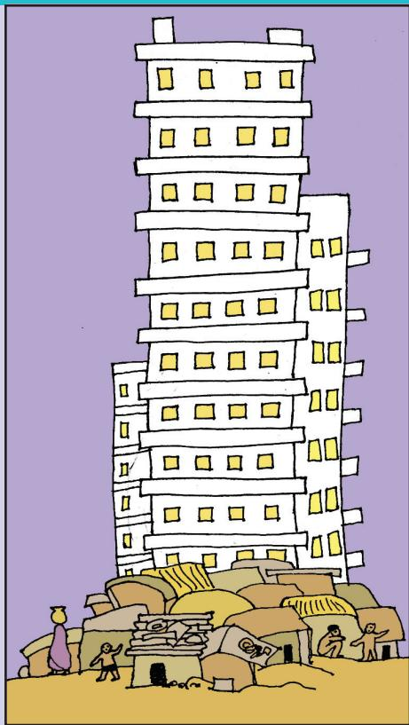
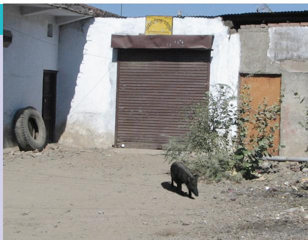
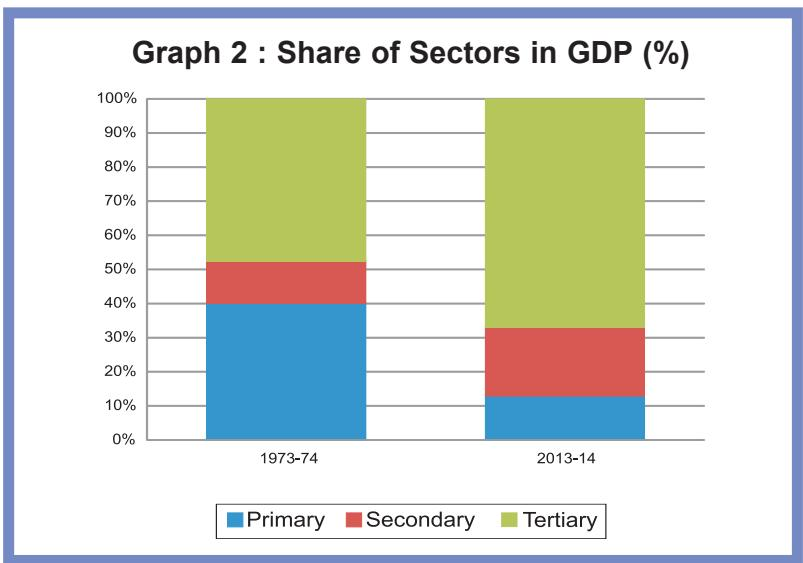
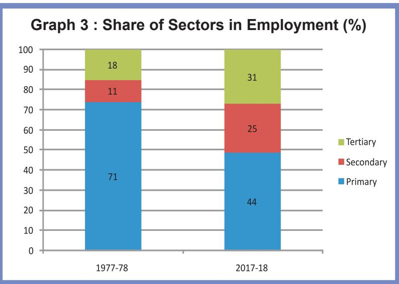
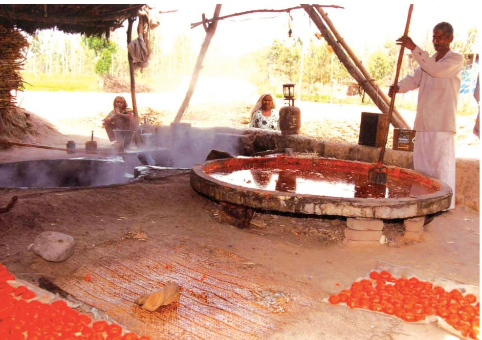
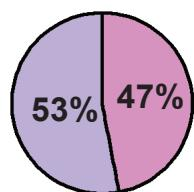
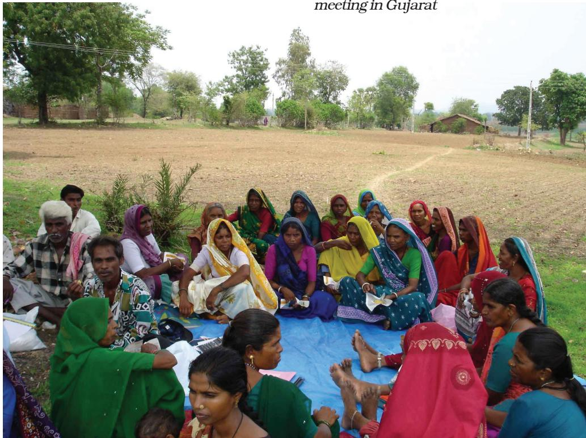
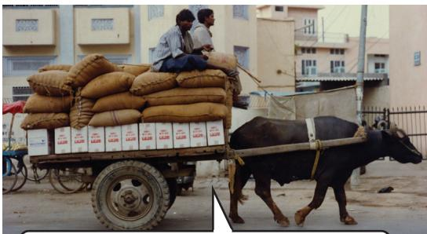
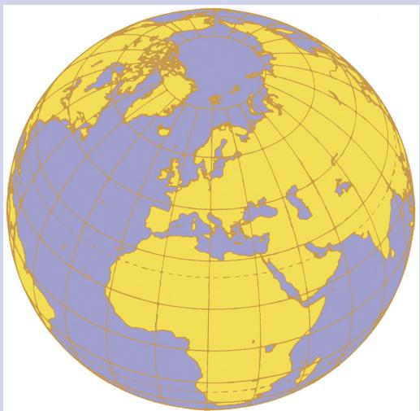
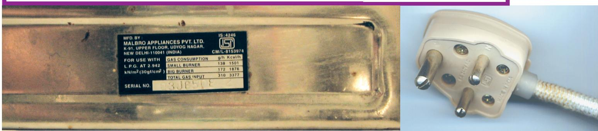

  
H

# CONSTITUTION OFINDIA

# Preamble

WE, THE PEOPLE OF INDIA, having solemnly resolved to constitute India into a SOVEREIGNSOCIALISTSECULARDEMOCRATICREPUBLIC

and to secure to all its citizens:

# JUSTICE

Social, economic and political;

# LIBERTY

of thought, expression, belief, faith and worship;

# EQUALITY

of status and of opportunity; and to promote among them all FRATERNITY

assuring the dignity of the individual and the unity and integrity of the Nation;

IN OUR CONSTITUENT ASSEMBLY this twenty-sixth day of November, 1949, do

HEREBY ADOPT,ENACT AND GIVE TOOURSELVESTHISCONSTITUTION

#

1.80x88x88间808c，g③③8qe，808c\，a08888&.8g085888&38088；  
2.084606y88x8092880888e820808085gg8B88008c   
3. 8480，880888 88008e808. 80008c.   
4.   
5. J080808e，808088888818e   
6. 8808，880&330899818α；  
7. 288&e8e88n8e.   
8. 8&gy，888g9g8），88988。8o8808088o8m8co  
9. 88008e，80888848；  
80，38888888888

(⑤&xε0 51 A)

6308 1428888808098208280883080882848088829.88 53⑤1,2010 8008 0%&0）08.

#

8c08028083088a8888858009.   
  
  
  
88o8ee88388o，a8x8s0880308.   
8eg8850m，89828o39080898.   
  
  
  
  
  
●8289c8，3@89e8088e88062088120983838ee5883888888x05808

# $\textcircled{9}$ Government of Andhra Pradesh, Amaravati

First Published 2024

# All rights reserved

No part of this publication may be reproduced, stored in a retrieval system, or transmitted, in any form or by any means without the prior permission in writing of the publisher, nor be otherwise circulated in any form of binding or cover other than that in which it is published and without a similar condition including this condition being imposed on the subsequent purchaser.

The copyright holder of this book is the Commissioner of School Education, Amaravati, Andhra Pradesh.

This book has been printed on 70 G.S.M. SS Maplitho Title Page 220 G.S.M. White Art Card

Free distribution by Samagra Shiksha, Government of Andhra Pradesh

Printed in India

at the A.P. Govt. Text Book Press

Amaravati

Andhra Pradesh

# FOREWORD

The National Curriculum Framework (NCF), 2005, recommends that children’s life at school must be linked to their life outside the school. This principle marks a departure from the legacy of bookish learning, which continues to shape our system, and causes a gap between the school, home and community. The syllabi and textbooks developed on the basis of NCF signify an attempt to implement this basic idea. They also attempt to discourage rote learning and the maintenance of sharp boundaries between different subject areas. We hope these measures will take us significantly further in the direction of a child-centered system of education outlined in the National Policy on Education (1986).

The success of this effort depends on the steps that school principals and teachers will take to encourage children to reflect on their own learning and to pursue imaginative activities and questions. We must recognise that, given space, time and freedom, children generate new knowledge by engaging with the information passed on to them by adults. Treating the prescribed textbook as the sole basis of examination is one of the key reasons why other resources and sites of learning are ignored. Inculcating creativity and initiative is possible if we perceive and treat children as participants in learning, not as receivers of a fixed body of knowledge.

These aims imply considerable change in school routines and mode of functioning. Flexibility in the daily time-table is as necessary as rigour in implementing the annual calendar so that the required number of teaching days are actually devoted to teaching. The methods used for teaching and evaluation will also determine how effective this textbook proves for making children’s life at school a happy experience, rather than a source of stress or boredom. Syllabus designers have tried to address the problem of curricular burden by restructuring and reorienting knowledge at different stages with greater consideration for child psychology and the time available for teaching. The textbook attempts to enhance this endeavour by giving higher priority and space to opportunities for contemplation and wondering, discussion in small groups, and activities requiring hands-on experience.

The National Council of Educational Research and Training (NCERT) appreciates the hard work done by the textbook development committee responsible for this book. We wish to thank the Chairperson of the advisory committee for textbooks in Social Sciences, at the secondary level, Professor Hari Vasudevan and the Chief Advisor for this book, Professor Tapas Majumdar for guiding the work of this committee. Several teachers contributed to the development of this textbook; we are grateful to their principals for making this possible. We are indebted to the institutions and organisations, which have generously permitted us to draw upon their resources, material and personnel. We are especially grateful to the members of the National Monitoring Committee, appointed by the Department of Secondary and Higher Education, Ministry of Human Resource Development under the Chairpersonship of Professor Mrinal Miri and Professor G.P. Deshpande, for their valuable time and contribution. As an organisation committed to systemic reform and continuous improvement in the quality of its products, NCERT welcomes comments and suggestions which will enable us to undertake further revision and refinement.

Director

New Delhi

20 November 2006

National Council of Educational

Research and Training

# TEXTBOOK DEVELOPMENT COMMITTEE

# CHAIRPERSON, ADVISORY COMMITTEE FOR SOCIAL SCIENCE TEXTBOOKS AT THE SECONDARY LEVEL

Hari Vasudevan, Professor, Department of History, University of Kolkata, Kolkata.

# CHIEF ADVISOR

Tapas Majumdar, Emeritus Professor, Jawaharlal Nehru University, New Delhi

# ADVISOR

Sathish K. Jain, Professor, Centre for Economic Studies and Planning, Jawaharlal Nehru University, New Delhi

# MEMBERS

Arvind Sardana, Eklavya, Institute for Educational Research and Innovative Action, Madhya Pradesh

Neeraja Rashmi, Reader, Curriculum Group, NCERT, New Delhi Neeraja Nautiyal, TGT (Social Science), Kendriya Vidyalaya, BEG Centre, Deccan College Road, Yeravada, Pune

Rajinder Choudhury, Reader, Department of Economics, Maharishi Dayanand University, Rohtak, Haryana

Rama Gopal, Professor, Department of Economics, Annamalai University, Annamalai Nagar, Tamil Nadu

Sukanya Bose, Eklavya Fellow, New Delhi Vijay Shankar, Samaj Pragati Sahyog, Bagli Block, Dewas District, Madhya Pradesh

# MEMBER-COORDINATOR

M.V. Srinivasan, Lecturer, DESSH, NCERT, New Delhi

# THE CONSTITUTION OF INDIA

# PREAMBLE

WE， THE PEOPLE OF INDIA， having solemnly resolved to constitute India into a 1[SOVEREIGN SOCIALIST SECULAR DEMOCRATIC REPUBLIC] and to secure to all its citizens :

JUSTICE， social， economic andpolitical;

LIBERTY of thought, expression, belief, faith and worship;

EQUALITY of status and of opportunity; and to promote among them all

FRATERNITY assuring the dignity of the individual and the ²[unity and integrity of the Nationl;

IN OUR CONSTITUENT ASSEMBLY this twenty-sixth day of November, 1949 do HEREBY ADOPT， ENACT AND GIVE TO OURSELVES THIS CONSTITUTION.

# CHAPTER I
# DEVELOPMENT

# NOTES FOR THE TEACHER
Development has many aspects. The purpose of this chapter is to enable students to understand this idea. They have to understand that people have different perspectives on development and there are ways by which we can arrive at common indicators for development. To do this, we have used situations that they can respond to in an intuitive manner; we have also presented analysis that is more complex and macro in nature.

How can countries or states be compared using some selected development indicators is another question that students would read about in this chapter. Economic development can be measured and income is the most common method for measuring development. However, the income method, though useful, has several weaknesses. Hence, we need newer ways of looking at development using indicators of quality of life and environmental sustainability.

It is necessary for you to expect the students to respond actively in the classroom and on a topic such as the above, there would be wide variation in opinion and possibility of debate. Allow students to argue their point of view. At the end of each section there are a few questions and activities. These serve two purposes: first, they recap the ideas discussed in the section and second, they enable better understanding of the themes

discussed by bringing the learners closer to their real-life situations.

There are certain terms used in this chapter that would require clarification — Per Capita Income, Literacy Rate, Infant Mortality Rate, Attendance Ratio, Life Expectancy, Gross Enrolment Ratio, and Human Development Index. Though data pertaining to these terms are provided, these would need further explanation. You may also need to clarify the concept of Purchasing Power Parity that is used to calculate per capita income in Table 1.6. It is necessary to keep in mind that these terms are used as an aid to the discussion and not something to be memorised.

# Sources for Information

The data for this chapter is taken from reports published by the Government of India (Economic Survey, Report of the National Family Health Survey and Handbook of Statistics on the Indian Economy), United Nations Development Programme (Human Development Report) and World Bank (World Development Indicators). Many of these reports are being published every year. It may be interesting to look up these reports if they are available in your school library. If not, you may log on to the websites of these institutions (www.budgetindia.nic.in, www.undp.org, www.worldbank.org). Data is also available from the Reserve Bank’s Handbook of Statistics on Indian Economy (available at www.rbi.org).

The idea of development or progress has always been with us. We have aspirations or desires about what we would like to do and how we would like to live. Similarly, we have ideas about what a country should be like. What are the essential things that we require? Can life be better for all? How should people live together? Can there be more equality? Development involves thinking about these questions and about the ways in which we can work towards achieving these goals. This is a complex task and in this chapter we shall make a beginning at understanding development. You will learn more about these issues in greater depth in higher classes. Also, you will find answers to many of these questions not just in economics but also in your course in history and political science. This is because the way we live today is influenced by the past. We can’t desire for change without being aware of this. In the same way, it is only through a democratic political process that these hopes and possibilities can be achieved in real life.

  
"Without me they cannot develop.. in this system Icannot develop!"

# WHAT DEVELOPMENT PROMISESDIFFERENT PEOPLE, DIFFERENT GOALS

L et us try to imagine what development or progress is likely to mean to different persons listed in Table 1.1. What are their aspirations? You will find that some columns are partially filled. Try to complete the table. You can also add any other category of persons.

YOU WANT A CAR? THE WAY OUR COUNTRY IS SET UP ALL YOU CAN HOPE FOR IS MAY BE TO ONE DAY OWN THE RICKSHAW YOU PULL!

TABLE 1.1 DEVELOPMENTAL GOALS OF DIFFERENTCATEGORIES OF PERSONS  

<table><tr><td rowspan="11"></td><td>Category of Person</td><td>Developmental Goals / Aspirations</td></tr><tr><td>Landless rural labourers</td><td>More days of work and better wages; local school is able to provide quality education for their children; there is no social discrimination and they too can become leaders in the village.</td></tr><tr><td>Prosperous farmers from Punjab</td><td>Assured a high family income through higher support prices for their crops and through hardworking and cheap labourers; they should be able to settle their children abroad.</td></tr><tr><td>Farmers who depend only on rain for growing crops</td><td></td></tr><tr><td>A rural woman from a land owning family</td><td></td></tr><tr><td>Urban unemployed youth</td><td></td></tr><tr><td>A boy from a rich urban family</td><td></td></tr><tr><td>A girl from a rich urban family</td><td>She gets as much freedom as her brother and is able to decide what she wants to do in life. She is able to pursue her studies abroad.</td></tr><tr><td>An adivasi from Narmada valley</td><td></td></tr><tr><td></td><td></td></tr><tr><td></td><td></td></tr></table>

Having filled Table 1.1, let us now examine it. Do all of these persons have the same notion of development or progress? Most likely not. Each one of them seeks different things.

They seek things that are most important for them, i.e., that which can fulfil their aspirations or desires. In fact, at times, two persons or groups of persons may seek things

which are conflicting. A girl expects as much freedom and opportunity as her brother, and that he also shares in the household work. Her brother may not like this. Similarly, to get more electricity, industrialists may want more dams. But this may submerge the land and disrupt the lives of people who are displaced – such as tribals. They might resent this and may prefer small check dams or tanks to irrigate their land.

So, two things are quite clear: one, different persons can have different developmental goals different and different developmental two, what may be development for one may not be development for the other It be

# INCOME AND OTHER GOALS

If you go over Table 1.1 again, you will notice one common thing: what people desire are regular work, better wages, and decent price for their crops or other products that they produce. In other words, they want more income.

Besides seeking more income, oneway or the other, people also seek things like equal treatment, freedom, security, and respect of others. They resent discrimination. All these are important goals. In fact, in some cases, these may be more important than

more income or more consumption because material goods are not all that you need to live.

Money, or material things that one can buy with it, is one factor on which our life depends. But the quality of our life also depends on non-material things mentioned above. If it is not obvious to you, then just think of the role of your friends in your life. You may desire their friendship. Similarly, there are many things that are not easily measured but they mean a lot to our lives. These are often ignored.

A demonstration meeting against raising the height of Sardar Sarovar Dam on Narmada River

However, it will be wrong to conclude that what cannot be measured is not important.

Consider another example. If you get a job in a far off place, before accepting it you would try to consider many factors, apart from income, such as facilities for your family, working atmosphere, or opportunity to learn. In another case, a job may give you less pay but may offer regular employment that enhances your sense of security. Another job, however, may offer high pay but no job security and also leave no time for your family. This will reduce your sense of security and freedom.

Similarly, for development, Similarly, development, people look at a mix of goals. It is people look at a mix of goals true that if women are engaged in paid work, their dignity in the household and society increases. However, it is also the case that if there is respect for women there would be more sharing of housework and a greater acceptance of women working outside. A safe and secure environment may allow more women to take up a variety of jobs or run a business.

Hence, the developmental goals that people have are not only about better income but also about other important things in life.

# LET’S WORK THESE OUT

1. Why do different persons have different notions of development? Which of the following explanations is more important and why?

(a) Because people are different.   
(b) Because life situations of persons are different.

2. Do the following two statements mean the same? Justify your answer.

(a) People have different developmental goals.   
(b) People have conflicting developmental goals.

3. Give some examples where factors other than income are important aspects of our lives.   
4. Explain some of the important ideas of the above section in your own words.

# NATIONAL DEVELOPMENT

If, as we have seen above, individuals seek different goals, then their notion of national development is also likely to be different. Discuss among yourselves on what India should do for development.

Most likely, you would find that different students in the class have given different answers to the above question. In fact, you might yourself think of many different answers and not be too sure of any of these. It is very important to keep in mind that

dif ferent persons could have different as well as conflicting notions of a country’s development.notions of a

However, can all the ideas be considered equally important? Or, if there are conflicts how does one decide? What would be a fair and just path for all? We also have to think whether there is a better way of doing things. Would the idea benefit a large number of people or only a small group? National development means thinking about these questions.

# LET’S WORK THESE OUT

# Discuss the following situations:

1. Look at the picture on the right. What should be the developmental goals for such an area?   
2. Read this newspaper report and answer the questions that follow:

A vessel dumped 50o tonnes of liguid toxic wastes into open-air dumps in a city and in the surrounding sea. This happened in a city called Abidjan in Ivory Coast，a country in Africa. The fumes from the highly toxic waste caused nausea, skin rashes, fainting, diarrhoea etc. After a month seven persons were dead, twenty in hospital and twenty six thousand treated for symptoms of poisoning.

A multinational company dealing in petroleum and metals had contracted a local company of the Ivory Coast to dispose the toxic waste from its ship.

(i) Who are the people who benefited and who did not?   
(ii) What should be the developmental goal for this country?

3. What can be some of the developmental goals for your village, town or locality?

# ACTIVITY 1

If even the idea of what constitutes development can be varied and ting, then certainly there can be ces about ways of developing. If

you know of any such controversy, try to find out rguments advanced by different You may do so by talking to nt persons or you may find it ewspapers and television.

# HOW TO COMPARE DIFFERENT COUNTRIES OR STATES?

You might ask if development can mean different things, how come some countries are generally called developed and others underdeveloped? Before we come to this, let us consider another question.

When we compare different things, they could have similarities as well as differences. Which aspects do we use to compare them? Let us look at students in the class itself. How do we compare different students? They differ in their height, health, talents and interests. The healthiest student may not be the most studious one. The most intelligent student may not be the friendliest one. So, how do we compare students? The criterion we may use depends on the purpose of comparison. We use different criterion to choose a sports team, a debate team, a music team or a team to organise a picnic. Still, if for some purpose, we have to choose the criterion for the all-round progress of children in the class, how shall we do it?

Usually we take one or more important characteristics ofimportant of persons and compare them based on these characteristics. on these characteristics. Ofon these characteristics. course, there can be differences about what are important characteristics that should form the basis of comparison: friendliness and spirit of cooperation, creativity or marks secured?

This is true of development too. For comparing countries, their income is considered to be one ofincome is be of the most important attributes.the important attributes. Countries with higher income are

more developed than others with less income. This is based on the understanding that more income means more of all things that human beings need. Whatever people like, and should have, they will be able to get with greater income. So, greater income itself is considered to be one important goal.

Now, what is the income of a country? Intuitively, the income of the country is the income of all the residents of the country. This gives us the total income of the country.

However, for comparison between countries, total income is not such an useful measure. Since, countries have different populations, comparing total income will not tell us what an average person is likely to earn. Are people in one country better off than others in a different country? Hence, we compare the average income which income is the total income of the country divided by its total population. The average income is also called per capita income.capita

In World Development Reports, brought out by the World Bank, this criterion is used in classifying countries. Countries with per capita income of US$ 49,300 per annum and above in 2019, are called high income or rich countries and those with per capita income of US$ 2500 or less are called low-income countries. India comes in the category of low middle income countries because its per capita income in 2019 was just $\mathrm { U S } \$ 8$ 6700 per annum. The rich countries, excluding countries of Middle East and certain other small countries, are generally called developed countries.

# Average Income Average Income

While ‘averages’ are useful for comparison, they also hide disparities

For example, let us consider two countries，A and B. For the sake of simplicity, we have assumed that they have only five citizens each. Based on data given in Table 1.2, calculate the average income for both the countries.

TABLE 1.2 COMPARISON OF TWO COUNTRIES   

<table><tr><td rowspan="2">Country</td><td colspan="6">Monthly incomes of citizens (in Rupees)</td></tr><tr><td>Ⅰ</td><td>Ⅱ</td><td>Ⅲ</td><td>Ⅳ</td><td>Ⅴ</td><td>Average</td></tr><tr><td>Country A</td><td>9500</td><td>10500</td><td>9800</td><td>10000</td><td>10200</td><td></td></tr><tr><td>Country B</td><td>500</td><td>500</td><td>500</td><td>500</td><td>48000</td><td></td></tr></table>

Will you be equally happy to live in both these countries? Are both equally developed? Perhaps some of us may like to live in country B if we are

assured of being its fifth citizen butif it isa lottery that decides our citizenship number then perhaps most of us will prefer to live in country A. Even though both the countries have identical average income， country A is preferred because it has more equitable distribution. In this country people are neither very rich nor extremely poor. On the other hand most citizens in country B are poor and one person is extremely rich. Hence, while average income is useful for comparison it does not tell us how this income is distributed among people.

  
COUNTRY WITH NO RICH AND NO POOR

  
COUNTRY WITH RICH AND POOR

# LET’S WORK THESE OUT

1. Give three examples where an average is used for comparing situations.   
2. Why do you think average income is an important criterion for development? Explain.   
3. Besides size of per capita income, what other property of income is important in comparing two or more societies?   
4. Suppose records show that the average income in a country has been increasing over a period of time. From this, can we conclude that all sections of the economy have become better? Illustrate your answer with an example.   
5. From the text, find out the per capita income level of about 10-15 low-income countries as per World Development Reports.   
6. Write a paragraph on your notion of what should India do, or achieve, to become a developed country.

WE MADE THE CHAIRS AND HE TOOK THEM.

# INCOME AND OTHER CRITERIA

When we looked at individual aspirations and goals, we found that people not only think of better income but also have goals such as security, respect for others, equal treatment, freedom, etc. in mind. Similarly, when we think of a nation or a region, we may, besides average income, think of other equally important attributes.

What could these attributes be? Let us examine this through an example. Table 1.3 gives the per capita income of Haryana, Kerala and Bihar. Actually, these figures are of Per Capita Net State Domestic Product at Current Prices for 2018–19. Let us ignore what this complicated term exactly means. Roughly, we can take it to be the per capita income of the state. We find that of the three, Haryana has the highest per capita

TABLE 1.3 PER CAPITA INCOME OF SELECT STATES   

<table><tr><td rowspan="4"></td><td>State</td><td>Per Capita Income for 2018–19 (in Rs)</td></tr><tr><td>Haryana</td><td>2,36,147</td></tr><tr><td>Kerala</td><td>2,04,105</td></tr><tr><td>Bihar</td><td>40,982</td></tr></table>

Source : Economic Survey 2020-21, PA 29.

income and Bihar is at the bottom. This means that, on an average, a person in Haryana earned Rs 2,36,147 in one year whereas, on an average, a person in Bihar earned only around Rs 40,982. So, if per capita income were to be used as the measure of development, Haryana will be considered the most developed and Bihar the least developed state of the three. Now, let us look at certain other data pertaining to these states given in Table 1.4.

TABLE 1.4 SOME COMPARATIVE DATA ON HARYANA, KERALA AND BIHAR   

<table><tr><td rowspan="2">State</td><td rowspan="2">Infant Mortality Rate per 1,000 live births (2018)</td><td>Literacy Rate %</td><td rowspan="2">Net Attendance Ratio (per 100 persons) secondary stage (age 14 and 15 years) 2017-18</td></tr><tr><td>2017-18</td></tr><tr><td>Haryana</td><td>30</td><td>82</td><td>61</td></tr><tr><td>Kerala</td><td>7</td><td>94</td><td>83</td></tr><tr><td>Bihar</td><td>32</td><td>62</td><td>43</td></tr></table>

Sources : Economic Survey 2020-21, PA 157, National Sample Survey Organisation (Report No. 585),National statistical office, Government of India.

# Explanation of some of the terms used in this table:

Infant Mortality Rate (or IMR) indicates the number of children that die before the age of one year asa proportion of looo live children born in that particular year.

Literacy Rate measures the proportion of literate population in the 7-and-above age group.

Net Attendance Ratio is the total number of children of age group 14 and 15 years attending school as a percentage of total number of children in the same age group.

What does this table show? The first column of the table shows that in Kerala, out of 1000 children born, 7 died before completing one year of age but in Haryana the proportion of children dying within one year of birth was 30, which is nearly three times more than that of Kerala. On the other hand, the per capita income of Haryana is more than that of Kerala as shown in Table 1.3. Just think of how dear you are to your parents, think of how every one is so happy when a child is born. Now, try to think of parents whose children die before they even celebrate their first birthday. How painful it must be to these parents? Next, note the year to which this data pertains. It is 2018. So we are not talking of old times; it is 70 years after independence when our metro cities are full of high rise buildings and shopping malls!

The problem does not end with Infant Mortality Rate. The last column of table 1.4 shows that about half of the children aged 14-15 in Bihar are not attending school beyond Class 8. This means that if you went to school in Bihar nearly half of your elementary class friends would be missing. Those who could have been in school are not there! If this had happened to you, you would not be able to read what you are reading now.

  
Most babies do not get basic healthcare

# PUBLIC FACILITIES

How is it that the average person in Haryana has more income than the average person in Kerala but lags behind in these crucial areas? The reason is — money in your pocket cannot buy all the goods and services that you may need to live well. So,well. income by itself is not a completely adequate indicator of material goods and services that citizens are able to use. For example, normally, your money cannot buy you a pollution-free environment or ensure that you get unadulterated medicines, unless you can afford to shift to a community that already has all these things. Money may also not be able to protect you from infectious diseases, unless the whole of your community takes preventive steps.

Actually for many of the important things in life the best way, also the cheapest way, is to provide these goods and services collectively. Just think – will it be cheaper to have collective security for the whole locality or for each house to have its own security staff? What if no one, other than you, in your village or locality is interested in studying? Would you be able to study? Not unless your parents could afford to send you to some private school elsewhere. So you are actually able to study because many other children also want to study and because many people believe that the government should open schools and provide other facilities so that all children have a chance to study. Even now, in many areas, children, particularly girls, are not able to go to high school because the government/society has not provided adequate facilities.

Kerala has a low Infant Mortality Rate because it has adequate provision of basic health and educational facilities. Similarly, in

some states, the Public Distribution System (PDS) functions well. Health and nutritional status of people of such states is certainly likely to be better.

# LET’S WORK THESE OUT

1. Look at data in Tables 1.3 and 1.4. Is Haryana ahead of Kerala in literacy rate etc., as it is in terms of per capita income?   
2. Think of other examples where collective provision of goods and services is cheaper than individual provision.   
3. Does availability of good health and educational facilities depend only on amount of money spent by the government on these facilities? What other factors could be relevant?   
4. In Tamil Nadu, 90 per cent of the people living in rural areas use a ration shop, whereas in West Bengal only 35 per cent of rural people do so. Where would people be better off and why?

# ACTIVITY 2

Study Table 1.5 carefully and fill in the blanks in the following paragraphs. For this, you may need to make calculations based on the table.

TABLE 1.5 EDUCATIONAL ACHIEVEMENT OF RURAL POPULATION OF UTTAR PRADESH   

<table><tr><td>Category</td><td>Male</td><td>Female</td></tr><tr><td>Literacy rate for rural population</td><td>76%</td><td>54%</td></tr><tr><td>Literacy rate for rural children in age group 10-14 years</td><td>90%</td><td>87%</td></tr><tr><td>Percentage of rural children aged 10-14 attending school</td><td>85%</td><td>82%</td></tr></table>

(a) The literacy rate for all age groups, including young and old, is for rural males and for rural females. However, it is not just that these many adults could not attend school but that there are who are currently not in school.   
(b) It is clear from the table that $\%$ of rural girls and $- \%$ of rural boys are not attending school. Therefore, illiteracy among children in the age group 10- 14 is as high as _% for rural females and $- \%$ for rural males.   
(c) This high level of illiteracy among age group, even after more than 70 years of our independence, is most disturbing. In many other states also we are nowhere near realisation of the constitutional goal of free and compulsory education for all children up to the age of 14, which was expected to be achieved by 1960.

# ACTIVITY 3

One way to find out if we are properly nourished is to calculate what nutrition scientists call Body Mass Index (BMI). This is easy to calculate. Let each student in the class find out his or her weight and height. Take the weight of each student in kilograms (kg). Then, take the height by drawing up a scale on the wall and measuring accurately with the head straight. Convert the height recorded in centimeters into meters. Divide the weight in kg by the square of the height. The number you get is called BMI. Then, look at the BMI-for-Age tables given on pages

90–91. A student’s BMI could be within the normal range or less than that (underweight) or more (obesity). For example, if a girl student is 14 years and 8 month old and the BMI is 15.2, then she is undernourished. Similarly, if the BMI of a boy aged 15 years and 6 months is 28, then he is overweight. Discuss the life situation, food and exercise habits of students, in general, without body shaming anyone.

# HUMAN DEVELOPMENT REPORT

Once it is realised that even though the level of income is important, yet it isan inadequate measure of the level of development, we begin to think of other criterion. There could be a long list ofsuch criterionbut thenit would not be so useful. What we need is a small number of the most important things. Health and education indicators, such as the ones we used in comparison of Kerala and Haryana, are among them. Over the past decade orso, healthand education indicators have come to be widely used along with income as a measure of development. For instance, Human Development Report published by UNDP compares countries based on the educational levels of the people, their health status and per capita income. It would be interesting to look at certain relevant data regarding India and its neighbours from Human Development Report 2020.

TABLE 1.6 SOME DATA REGARDING INDIA AND ITS NEIGHBOURS FOR 2019   

<table><tr><td>Country</td><td>Gross National Income (GNI) per capita (2011 PPP $)</td><td>Life Expectancy at birth</td><td>Mean Years of Schooling of People aged 25 and above</td><td>HDI Rank in the world (2018)</td></tr><tr><td>Sri Lanka</td><td>12,707</td><td>77</td><td>10.6</td><td>73</td></tr><tr><td>India</td><td>6,681</td><td>69.7</td><td>6.5</td><td>130</td></tr><tr><td>Myanmar</td><td>4,961</td><td>67.1</td><td>5.0</td><td>148</td></tr><tr><td>Pakistan</td><td>5,005</td><td>67.3</td><td>5.2</td><td>154</td></tr><tr><td>Nepal</td><td>3,457</td><td>70.8</td><td>5.0</td><td>143</td></tr><tr><td>Bangladesh</td><td>4,976</td><td>72.6</td><td>6.2</td><td>134</td></tr></table>

Source : Human Development Report, 2020, United Nations Development Programme, New York.

# NOTES

1. HDI stands for Human Development Index. HDI ranks in above table are out of 189 countries in all.   
2.Life Expectancy at birth denotes,as the name suggests,average expected length oflife ofa person at the time of birth.   
3.Per Capita Income is calculated in dollrs for all countries so that it can be compared. It is also done in a way so that every dollar would buy the same amount of goods and services in any country.

Isn’t it surprising that a small country in our neighbourhood, Sri Lanka, is much ahead of India in every respect and a big country like ours has such a low rank in the world? Table 1.6 also shows that though Nepal and Bangladesh have low per capita income than that of India, yet they are better than India in life expectancy.

Many improvements have been suggested in calculating HDI and

many new components have been added to the Human Development Report but, by pre-fixing Human to Development, it has made it very clear that what is important in development is what is happening to citizens of a country. It is people, their health, their well being, that is most important.

Do you think there are certain other aspects that should be considered in measuring human development?

# SUSTAINABILITY OF DEVELOPMENT

Suppose for the present that a particular country is quite developed. We would certainly like this level of development to go up further or at least be maintained for future generations. This is obviously desirable. However, since the second half of the twentieth century, a number of scientists have been warning that the present type, and levels, of development are not sustainable.

"We have not inherited the world from our forefathers - we have borrowed it from our children. 99

LETS UNDERSTAND WHYTHIS IS SO THROUGH THEFOLLOWING EXAMPLE:

# Example 1: Groundwater in India

"Recent evidence suggests that the groundwater is under serious threat of overuse in many parts of the country. About 3oo districts have reported a water level decline of over 4 metres during the past 2O years. Nearly one-third of the country is overusing their groundwater reserves. In another 25 years, 60 per cent of the country would be doing the same if the present way of using this resource continues. Groundwater overuse is particularly found in the agriculturally prosperous regions of Punjab and Western U.P, hard rock plateau areas of central and south India, some coastal areas and the rapidly growing urban settlements."

(a) Why groundwater is overused?   
(b) Can there be development without overuse?

Groundwater is an example of renewable resources. These resources are replenished by nature as in the case of crops and plants. However, even these resources may be overused. For example, in the case of groundwater, if we use more than what is being replenished by rain then we would be overusing this resource.

Non-renewable resources are those which will get exhausted after a few years of use. We have a fixed stock on earth which cannot be replenished. We do discover new resources that we did not know of earlier. New sources in this way add to the stock. However, over time, even this will get exhausted.

RUDE OIL THAT WE FOR EXAMPLE, EYTPACT EROM THE EARTH IS A NON-HOWEVER WE RENEWABLE RESOURCE. MAY FIND A SOURCE OF ( OIL L. THAT WE DID EXPLORATIONS NOT KNOW OF EARLIER. BEING UNDERTAKEN ALL THE1IME. ARE

# Example 2: Example 2: Exhaustion of Exhaustion of Natural Resources Natural Resources

Look at the following data for crude oil.

TABLE 1.7 CRUDE OIL RESERVES   

<table><tr><td>Region/Country</td><td>Reserves (2017) 
(Thousand Million Barrels)</td><td>Number of Years 
Reserves will last</td></tr><tr><td>Middle East</td><td>808</td><td>70</td></tr><tr><td>United States of America</td><td>50</td><td>10.5</td></tr><tr><td>World</td><td>1697</td><td>50.2</td></tr></table>

Source : BP Statistical Review of World Energy, June 2018, P.12.

The table gives an estimate of reserves of crude oil (columnl). More important, it also tells us for how many years the stock of crude oil will last if people continue to extract it at the present rate. The reserves would last only 5O years more. This is for the world as a whole. However, different countries face different situations. Countries like India depend on importing oil from abroad because they do not have enough stocks of their own. Ifprices of oil increase this becomes a burden for everyone. There are countries like USA which have low reserves and hence want to secure oil through military or economic power.

The question of sustainability of development raises many fundamentally new issues about the nature and process ofdevelopment.

(a) Is crudeoilessentialforthedevelopmentprocessinacoutry? Discuss.   
(b) India has to import crude oil. What problems do you anticipate forthe countrylookingat theabove situation?

Consequences of environmental degradation do not respect national or state boundaries; this issue is no longer region or nation specific. Our future is linked together. Sustainability of development is comparatively a new area of knowledge in which scientists, economists, philosophers and other

social scientists are working together.

In general, the question of development or progress is perennial. At all times as a member of society and as individuals we need to ask where we want to go, what we wish to become and what our goals are. So the debate on development continues.

# EXERCISES

1. Development of a country can generally be determined by

(i) its per capita income   
(ii) its average literacy level   
(iii) health status of its people   
(iv) all the above

2. Which of the following neighbouring countries has better performance in terms of human development than India?

(i) Bangladesh   
(ii) Sri Lanka   
(iii) Nepal   
(iv) Pakistan

3. Assume there are four families in a country. The average per capita income of these families is Rs 5000. If the income of three families is Rs 4000, Rs 7000 and Rs 3000 respectively, what is the income of the fourth family?

(i) Rs 7500   
(ii) Rs 3000   
(iii) Rs 2000   
(iv) Rs 6000

4. What is the main criterion used by the World Bank in classifying different countries? What are the limitations of this criterion, if any?   
5. In what respects is the criterion used by the UNDP for measuring development different from the one used by the World Bank?   
6. Why do we use averages? Are there any limitations to their use? Illustrate with your own examples related to development.   
7. Kerala, with lower per capita income has a better human development ranking than Haryana. Hence, per capita income is not a useful criterion at all and should not be used to compare states. Do you agree? Discuss.   
8. Find out the present sources of energy that are used by the people in India. What could be the other possibilities fifty years from now?   
9. Why is the issue of sustainability important for development?

10. “The Earth has enough resources to meet the needs of all but not enough to satisfy the greed of even one person”. How is this statement relevant to the disscusion of development? Discuss.   
11. List a few examples of environmental degradation that you may have observed around you.   
12. For each of the items given in Table 1.6, find out which country is at the top and which is at the bottom.   
13. The following table shows the proportion of adults (aged 15-49 years) whose BMI is below normal $\mathsf { B M I } < 1 8 . 5 \ \mathsf { k g } / \mathsf { m } ^ { 2 } ;$ ) in India. It is based on a survey of various states for the year 2015-16. Look at the table and answer the following questions.

<table><tr><td>State</td><td>Male (%)</td><td>Female (%)</td></tr><tr><td>Kerala</td><td>8.5</td><td>10</td></tr><tr><td>Kannataka</td><td>17</td><td>21</td></tr><tr><td>Madhya Pradesh</td><td>28</td><td>28</td></tr><tr><td>All States</td><td>20</td><td>23</td></tr></table>

Source: National Family Health Survey-4, 2015-16, http://rchiips.org

(i) Compare the nutritional level of people in Kerala and Madhya Pradesh.   
(ii) Can you guess why around one-fifth of people in the country are undernourished even though it is argued that there is enough food in the country? Describe in your own words.

# ADDITIONAL PROJECT / ACTIVITY

Invite three different speakers to talk to you about the development of your region. Ask them all the questions that come to your mind. Discuss these ideas in groups. Each group should prepare a wall chart, giving reasons about ideas that you agree or do not agree with.

# CHAPTER 2
# SECTORS OF THE INDIAN ECONOMY

## NOTES FOR THE TEACHER
An economy is best understood when we study its components or sectors. Sectoral classification can be done on the basis of several criteria. In this chapter, three types of classifications are discussed: primary/secondary/tertiary; organised/ unorganised; and public/private. You can create a discussion about these types by taking examples familiar to the students and relate them to their daily life. It is important to emphasise the changing roles of sectors. This can be highlighted further by drawing attention of the students to the rapid growth of service sector. While elaborating the ideas provided in the chapter, the students may need to be familiarised with a few fundamental concepts such as Gross Domestic Product, Employment etc. Since the students may find this difficult to understand, it is necessary to explain to them through examples. Several activities and exercises are suggested in the chapter to help the students understand how a person’s activity could be placed whether in the primary, secondary or tertiary, organised or unorganised, and public or private sector. You may encourage the students to talk to various working people around them (such as shop owners, casual workers, vegetable vendors, workshop mechanics, domestic workers etc.) to know more about how they live and work. Based on such information, the students can be encouraged to develop their own classification of economic activities.

Another important issue to be highlighted is about the problems caused by the changes in the roles of sectors. The chapter has taken the example of unemployment and what the government can do to solve it. The declining importance of agriculture and growing importance of

industry and services should be related to the experience of the children by taking more examples that they may observe in their day-to-day life. Information derived from the media could be used for this purpose. You may encourage the students to bring important cuttings and stories from newspapers, which could be prominently displayed in storyboards, and encourage the class to discuss these issues. While discussing the unorganised sector, the key issue of protecting the workers engaged in the sector should be highlighted. You may also encourage the students to visit persons and enterprises in the unorganised sector and get a first hand experience from real life situation.

## Sources for Information

The GDP data used in this chapter pertaining to Gross Domestic Product at Factor Cost by Industry of Origin at 2011–12 prices is taken from Real Time Handbook of Statistics on Indian Economy. It is a valuable source of GDP and other information relating to the Indian economy. For evaluation purposes, particularly to develop the analytical ability of learners, teachers can refer to this report through the Internet to get data for different years. Due to change in methodology, latest data is not used in the chapter.

The employment figures are based on data taken from the five-yearly surveys on employment and unemployment conducted by the National Sample Survey Organisation (NSSO) now known as National Statistical Office (NSO). NSO is an organisation under the Ministry of Statistics and Programme Implementation, Government of India. The website you can log onto is: http:/mospi.gov.in. Employment data is also available from other sources such as Census of India.

1070CH02

## SECTORS OF ECONOMIC ACTIVITIES

Let us look at these pictures. You will find that people are engaged in various economic activities. Some of these are activities producing goods. Some others are producing services. These activities are happening around us every minute even as we speak. How do we understand these activities? One way of doing this is to group them (classify them) using some important criterion. These groups are also called sectors.

We begin by looking at different kind of economic activities.

There are many activities that are undertaken by directly using natural resources. Take, for example, the cultivation of cotton. It takes place within a crop season. For the growth of the cotton plant, we depend mainly, but not entirely, not entirely, on natural factors like rainfall, sunshine and climate. The product of this activity, cotton, is a natural product. Similarly, in the case of an activity like dairy, we are dependent

on the biological process of the animals and availability of fodder etc. The product here, milk, also is a natural product. Similarly, minerals and ores are also natural products. When we produce a good by exploiting natural resources, it is an activity of the primary sector. Why sector primary? This is because it forms the base for all other products that we subsequently make. Since most of the natural products we get are from agriculture, dairy, fishing, forestry, this sector is also

called agriculture and related sector. sector

The secondary sector covers activities in which natural products are changed into other forms through ways of manufacturing that we associate with industrial activity. It is the next step after primary. The product is not produced by nature but has to be made and therefore some process of manufacturing is essential. This could be in a factory, a workshop or at home. For example, using cotton fibre from the plant, we

spin yarn and weave cloth. Using sugarcane as a raw material, we make sugar or gur. We convert earth into bricks and use bricks to make houses and buildings. Since this sector gradually became associated with the different kinds of industries that came up, it is also called as industrial sector.

After primary and secondary, there is a third category of activities that falls under tertiary sector tertiary sector and is different from the above two. These are activities that help in the development of the primary and secondary sectors. These activities, by themselves, do not produce a good but they are an aid or a support for the production process. For example, goods that are produced in the primary or secondary sector would need to be transported by trucks or trains and then sold in wholesale and retail shops. At times, it may be necessary to store these in godowns. We also may need to talk to others over telephone or send letters (communication) or borrow money from banks (banking) to help production and trade. Transport, storage, communication, banking, trade are some examples of tertiary activities. Since these activities generate services rather than goods, the tertiary sector is also called the service sector.service sector

Service sector also includes some essential services that may not directly help in the production of goods. For example, we require teachers, doctors, and those who provide personal services such as washermen, barbers, cobblers, lawyers, and people to do administrative and accounting works. In recent times, certain new services based on information technology such as internet cafe, ATM booths, call centres, software companies etc have become important.

Fsnomic activities. though,are grouped into three different categones, Econishly interdependent. Let us look at some examples.

TABLE 2.1 EXAMPLES OF ECONOMIC ACTIVITIES   

<table><tr><td>EXAMPLE</td><td>WHAT DOES THIS SHOW?</td></tr><tr><td>Imagine what would happen if farmers refuse to sell sugarcane to a particular sugar mill. The mill will have to shut down.</td><td>This is an example of the secondary or industrial sector being dependent on the primary.</td></tr><tr><td>Imagine what would happen to cotton cultivation if companies decide not to buy from the Indian market and import all cotton they need from other countries. Indian cotton cultivation will become less profitable and the farmers may even go bankrupt, if they cannot quickly switch to other crops. Cotton prices will fall.</td><td></td></tr><tr><td>Farmers buy many goods such as tractors, pumpsets, electricity, pesticides and fertilisers. Imagine what would happen if the price of fertilisers or pumpsets go up. Cost of cultivation of the farmers will rise and their profits will be reduced.</td><td></td></tr><tr><td>People working in industrial and service sectors need food. Imagine what would happen if there is a strike by transporters and lorries refuse to take vegetables, milk, etc. from rural areas. Food will become scarce in urban areas whereas farmers will be unable to sell their products.</td><td></td></tr></table>

## LET’S WORK THESE OUT

1. Complete the above table to show how sectors are dependent on each other.   
2. Explain the difference between primary, secondary and tertiary sectors using examples other than those mentioned in the text.   
3. Classify the following list of occupations under primary, secondary and tertiary sectors:

Tailor

• Workers in match factory

Basket weaver

• Moneylender

Flower cultivator

Gardener

• Milk vendor

• Potter

Fishermen

• Bee-keeper

Priest

Astronaut

Courier

• Call centre employee

4. Students in a school are often classified into primary and secondary or junior and senior. What is the criterion that is used? Do you think this is a useful classification? Discuss.

## COMPARING THE THREE SECTORS

The various production activities in the primary, secondary and tertiary sectors produce a very large number of goods and services. Also, the three sectors have a large number of people working in them to produce these goods and services. The next step, therefore, is to see how much goods and services are produced and how many people work in each sector. In an economy there could be one or more sectors which are dominant in terms of total production and employment, while other sectors are relatively small in size.

## How do we count the various goods and services and know the total production in each sector?

With so many thousands of goods and services produced, you might think this is an impossible task! Not only would the task be enormous, you might also wonder how we can add up cars and computers and nails and furniture. It won’t make sense!!!

You are right in thinking so. To get around this problem, economists suggest that the values of goods and services should be used rather than adding up the actual numbers. For example, if 10,000 kgs of wheat is sold at Rs 20 per kg, the value of wheat will be Rs 2,00,000. The value of 5000 coconuts at Rs 15 per coconut will be Rs 75,000. Similarly, the value of goods and services in the three sectors are calculated, and then added up.

Remember, there is one precaution one has to take. Not every good (or service) that is produced and sold needs to be counted. It makes sense only to include the final goods and services. services Take, for instance, a farmer who sells wheat to a flour mill for Rs 20 per kg. The mill grinds the wheat and sells the flour to a biscuit company for Rs 25 per kg. The biscuit company uses the flour and things such as sugar and oil to make four packets of biscuits. It sells biscuits in the market to the consumers for Rs 80 (Rs 20 per packet). Biscuits are the final goods, i.e., goods that reach the consumers.

Why are only ‘final goods and services’ counted? In contrast to final goods, goods such as wheat and the wheat flour in this example are intermediate goods. Intermediate goods are used up in producing final goods and services. The value of final goods already includes the already includes value of all the intermediate goods that are used in making the final good. Hence, the value of Rs 80 for the biscuits (final good) already includes the value of flour (Rs 25). Similarly, the value of all other intermediate goods would have been included. To count the value of the flour and wheat

separately is therefore not correct because then we would be counting the value of the same things a number of times. First as wheat, then as flour and finally as biscuits.

The value of final goods and services produced in each sector during a particular year provides the total production of the sector for that year. A nd the sum of . production in the three sectors gives what is called the Gross Domestic Product (GDP) of Product (GDP) a country. It is the value of all final goods and services produced within a country during a particular year. GDP shows how big the economy is.

In India, the mammoth task of measuring GDP is undertaken by a central government ministry. This Ministry, with the help of various government departments of all the Indian states and union territories, collects information relating to total volume of goods and services and their prices and then estimates the GDP.

## Historical Change in Sectors

Generally, it has been noted from the histories of many, now developed, countries that at initial stages of development, primary sector was the most important sector of economic activity.

As the methods of farming changed and agriculture sector began to prosper, it produced much more food than before. Many people could now take up other activities. There were increasing number of craftpersons and traders. Buying and selling activities increased many times. Besides, there were also transporters, administrators, army etc. However, at this stage, most of the goods produced were natural products from the primary sector and most people were also employed in this sector.

Over a long time (more than hundred years), and especially because new methods of manufacturing were introduced, factories came up and started expanding. Those people who had earlier worked on farms now began to work in factories in large numbers. They were forced to do so as you read in history chapters. People began to use many more goods that were produced in factories at cheap rates. Secondary sector gradually became the most important in total production and employment. Hence, over time, a shift had taken place. This means that the importance of the sectors had changed.

In the past 100 years, there has been a further shift from secondary to tertiary sector in developed countries. The service sector has become the most important in terms of total production. Most of the working people are also employed in the service sector. This is the general pattern observed in developed countries.

What is the total production and employment in the three sectors in India? Over the years have there been changes similar to the pattern observed for the developed countries? We shall see in the next section.

## LET’S WORK THESE OUT

1. What does the history of developed countries indicate about the shifts that have taken place between sectors?   
2. Correct and arrange the important aspects for calculating GDP from this Jumble.

To count goods and services we add the numbers that are produced. We count all those that were produced in the last five years. Since we shouldn’t leave out anything we add up all these goods and services.

3. Discuss with your teacher how you could calculate the total value of a good or service by using the method of value added at each stage.

## PRIMARY, SECONDARY AND TERTIARY SECTORS IN INDIA

Graph 1 shows the production of goods and services in the three sectors. This is shown for two years, 1973-74 and 2013-14. We have used the data for these two years because the data are comparable and authentic. You can see how the total production has grown over the forty years.

## LET’S WORK THESE OUT

Answer the following questions by looking at the graph:

1. Which was the largest producing sector in 1973-74?   
2. Which is the largest producing sector in 2013-14?   
3. Can you say which sector has grown the most over forty years?   
4. What was the GDP of India in 2013-14?

  
Graph 1 : GDP by Primary, Secondary and Tertiary Sectors

What does the comparison between 1973-74 and 2013-14 show? What conclusions can we draw from the comparison? Let's find out.

## Rising Importance of the Tertiary Sector in Production

Over the forty years between 1973-74 and 2013-14, while production in all the three sectors has increased, it has increased the most in the tertiary sector. As a result, in the year 2013-14, the tertiary sector has emerged as the largest producing sector in India replacing the primary sector.

Why is the tertiary sector becoming so important in India? There could be several reasons.

First, in any country several services such as hospitals, educational institutions, post and telegraph services, police stations, courts, village administrative offices, municipal corporations, defence, transport, banks, insurance companies, etc. are required. These can be considered as basic services. In a developing country the government has to take responsibility for the provision of these services.

Second, the development of agriculture and industry leads to the development of services such as

transport, trade, storage and the like, as we have already seen. Greater the development of the primary and secondary sectors, more would be the demand for such services.

Third, as income levels rise, certain sections of people start demanding many more services like eating out, tourism, shopping, private hospitals, private schools, professional training etc. You can see this change quite sharply in cities, especially in big cities.

Fourth, over the past decade or so, certain new services such as those based on information and communication technology have become important and essential. The production of these services has been rising rapidly. In Chapter 4, we shall see examples of these new services and the reasons for their expansion.

However, you must remember that not all of the service sector is growing equally well. Service sector in India employs many different kinds of people. At one end there are a limited number of services that employ highly skilled and educated workers. At the other end, there are a very large number of workers engaged in services such as small shopkeepers, repair persons, transport persons, etc. These people barely manage to earn a living and yet they perform these services because no alternative opportunities for work are available to them. Hence, only a part of this sector is growing in importance. You shall read more about this in the next section.

## Where are most of the people employed?

Graph 2 presents percentage share of the three sectors in GDP. Now you can directly see the changing importance of the sectors over the forty years.

A remarkable fact about India is that while there has been a change in the share of the three sectors in GDP, a similar shift has not taken place in employment. Graph 3 shows the share of employment in the three sectors in 1977-78 and 2017-18. The primary sector continues to be the largest employer even now.

Why didn’t a similar shift out of primary sector happen in case of employment? It is because not enough jobs were created in the secondary and tertiary sectors.

Even though industrial output or the production of goods went up by more than nine times during the period, employment in the industry went up by around three times. The same applies to the tertiary sector as well. While production in the service sector rose by 14 times, employment in the service sector rose around five times.

As a result, more than half of the workers in the country are working in the primary sector, mainly in agriculture, producing only about one sixth of the GDP. In contrast to this, the secondary and tertiary sectors produce the rest of the produce whereas they employ less about half the people. Does this mean that the workers in agriculture are not producing as much as they could?

What it means is that there are more people in agriculture than is necessary. So, even if you move a few people out, production will not be affected. In other words, workers in the agricultural sector are underemployed. underemployed

For instance, take the case of a small farmer, Laxmi, owning about two hectares of unirrigated land dependent only on rain and growing crops, like jowar and arhar. All five members of her family work in the plot throughout the year. Why? They have nowhere else to go for work. You will see that everyone is working, none remains idle, but in actual fact, their labour effort gets divided. Each one is doing some work but no one is fully employed. This is the situation of underemployment, where people are apparently working but all of them are made to work less

than their potential. This kind ofkind underemployment is hidden in contrast to someone who does not have a job and is clearly visible as unemployed. Hence, it is also called disguised unemployment. called disguised unemployment.

Now, supposing a landlord, Sukhram, comes and hires one or two members of the family to work on his land. Laxmi’s family is now able to earn some extra income through wages. Since you do not need five people to look after that small plot, two people moving out does not affect production on their farm. In the above example, two people may move to work in a factory. Once again the earnings of the family would increase and they would also continue to produce as much from their land.

There are lakhs of farmers like Laxmi in India. This means that even if we remove a lot of people from agricultural sector and provide them with proper work elsewhere, agricultural production will not suffer. The incomes of the people who take up other work would increase the total family income.

This underemployment can also happen in other sectors. For example there are thousands of casual workers in the service sector in urban areas who search for daily employment. They are employed as painters, plumbers, repair persons and others doing odd jobs. Many of them don’t find work everyday. Similarly, we see other people of the service sector on the street pushing a cart or selling something where they may spend the whole day but earn very little. little. They are doing this very little. work because they do not have better opportunities.

## LET’S WORK THESE OUT

1. Complete the table using the data given in Graphs 2 and 3 and answer the question that follows. Ignore if data are not available for some years.

TABLE 2.2 SHARE OF PRIMARY SECTOR IN GDP AND EMPLOYMENT   

<table><tr><td></td><td>1973-74</td><td>1977-78</td><td>2013-14</td><td>2017-18</td></tr><tr><td>Share in GDP</td><td></td><td></td><td></td><td></td></tr><tr><td>Share in employment</td><td></td><td></td><td></td><td></td></tr></table>

What are the changes that you observe in the primary sector over a span of forty years?

2. Choose the correct answer:

Underemployment occurs when people

(i) do not want to work   
(ii) are working in a lazy manner   
(iii) are working less than what they are capable of doing   
(iv) are not paid for their work

3. Compare and contrast the changes in India with the pattern that was observed for developed countries. What kind of changes between sectors were desired but did not happen in India?   
4. Why should we be worried about underemployment?

## How to Create More Employment?

From the above discussion, we can see that there continues to be considerable underemployment in agriculture. There are also people who are not employed at all. In what ways can one increase employment for people? Let us look at some of them.

Take the case of Laxmi with her two-hectare plot of unirrigated land. The government can spend some money or banks can provide a loan, to construct a well for her family to irrigate the land. Laxmi will then be able to irrigate her land and take a second crop, wheat, during the rabi season. Let us suppose that one hectare of wheat can provide employment to two people for 50 days (including sowing, watering, fertiliser

application and harvesting). So, two more members of the family can be employed in her own field. Now suppose a new dam is constructed and canals are dug to irrigate many such farms. This could lead to a lot of employment generation within the agricultural sector itself reducing the problem of underemployment.

Now, suppose Laxmi and other farmers produce much more than before. They would also need to sell some of this. For this they may be required to transport their products to a nearby town. If the government invests some money in transportation and storage of crops, or makes better rural roads so that mini-trucks reach everywhere several farmers like Laxmi, who now have access to water, can continue to grow and sell these crops. This activity can provide productive employment to not just farmers but also others such as those in services like transport or trade.

Laxmi’s need is not confined to water alone. To cultivate the land, she also needs seeds, fertilisers, agricultural equipment and pumpsets to draw water. Being a poor farmer, she cannot afford many of these. So,

she will have to borrow money from moneylenders and pay a high rate of interest. If the local bank gives her credit at a reasonable rate of interest, she will be able to buy all these in time and cultivate her land. This means that along with water, we also need to provide cheap agricultural credit to the farmers for farming to improve. We will look at some of these needs in Chapter 3, Money and Credit.

Another way by which we can tackle this problem is to identify, promote and locate industries and services in semi-rural areas where a large number of people may be employed. For instance, suppose many farmers decide to grow arhar and chickpea (pulse crops). Setting up a dal mill to procure and process these and sell in the cities is one such example. Opening a cold storage could give an opportunity for farmers to store their products like potatoes and onions and sell them when the price is good. In villages near forest areas, we can start honey collection centres where farmers can come and sell wild honey. It is also possible to set up industries that process vegetables and agricultural produce like potato, sweet potato, rice, wheat, tomato, fruits, which can be sold in outside markets. This will provide employment in industries located in semi-rural areas and not necessarily in large urban centres.

What groups of people do you 1thinkare unemployed or underemployed in your area? Can you think of some measures thatcould be taken up for them?

Do you know that in India about 60 per cent of the population belongs to the age group 5-29 years? Out of this, only about 51 per cent are attending educational institutions. The rest and particularly those aged less than 18 years may be at home

  
Gur Making in Haryana

or many of them may be working as child labourers. If these children are to attend schools, we will require more buildings, more teachers and other staff. A study conducted by the erstwhile Planning Commission (now known as NITI Aayog) estimates that nearly 20 lakh jobs can be created in the education sector alone. Similarly, if we are to improve the health situation, we need many more doctors, nurses, health workers etc. to work in rural areas. These are some ways by which jobs would be created and we would also be able to address the important aspects of development talked about in Chapter 1.

Every state or region has potential for increasing the income and employment for people in that area. It could be tourism, or regional craft industry, or new services like IT. Some of these would require proper planning and support from the government. For example, the same study by the Planning Commission says that if tourism as a sector is improved, every year we can give additional employment to more than 35 lakh people.

We must realise that some of the suggestions discussed above would take a long time to implement. For the short-term, we need some quick measures. Recognising this, the central government in India made a law implementing the Right to

Work in about 625 districts of India.Work It is called Mahatma Gandhi Gandhi National Rural Employment Guarantee Act 2005 (MGNREGA 2005). Under MGNREGA 2005, all2005 those who are able to, and are in need of, work in rural areas are guaranteed 100 days of employment in a year by the government. If the government fails in its duty to provide employment, it will give unemployment allowances to the people. The types of work that would in future help to increase the production from land will be given preference under the Act.

## LET’S WORK THESE OUT

1. Why do you think MGNREGA 2005 is referred to as ‘ Right to work’ ?   
2. Imagine that you are the village head. In that capacity suggest some activities that you think should be taken up under this Act that would also increase the income of people? Discuss.   
3. How would income and employment increase if farmers were provided with irrigation and marketing facilities?   
4. In what ways can employment be increased in urban areas?

## DIVISION OF SECTORS AS ORGANISED AND UNORGANISED

Let us examine another way of classifying activities in the economy. This looks at the way people are employed. What are their conditions of work? Are there any rules and regulations that are followed as regards their employment?

## Kanta

Kanta works in an office. She attends her office from 9.30 a.m. to 5.30 p.m. She gets her salary regularly at the end of every month. In addition to the salary, she also gets provident fund as per the rules laid down Svthe government. She also gets medical and other allowances. Kanta does not go to office on Sundays. This is a paid holiday. When she joined work, she was given an appointment letter stating all the terms and conditions of work.

## Kamal

Kamal is Kantas neighbour. He is. a daily wage labourer in a nearby grocery shop. ， He goes to the shop at 7:30 in the morning and works til 8:00 p.m. in the evening. He gets no other allowances apart from his wages. He is not paid for the days he does not work. He has therefore no leave or paid holidays. Nor was he given any formal letter saying that he has been employed in the shop. He can be asked to leave anytime by his employer.

Do vou see the differences in the conditions of work teeween Kanta and Kamal?

Kanta works in the organised organised sector. Organised sector covers those enterprises or places of work where the terms of employment are regular and therefore, people have assured work. They are registered by the government and have to follow its rules and regulations which are given in various laws such as the Factories Act, Minimum Wages Act, Payment of Gratuity Act, Shops and Establishments Act etc. It is called organised because it has some formal processes and

procedures. Some of these people may not be employed by anyone but may work on their own but they too have to register themselves with the government and follow the rules and regulations.

Workers in the organised sector enjoy security of employment. They are expected to work only a fixed number of hours. If they work more, they have to be paid overtime by the employer. They also get several other benefits from the employers. What are

these benefits? They get paid leave, payment during holidays, provident fund, gratuity etc. They are supposed to get medical benefits and, under the laws, the factory manager has to ensure facilities like drinking water and a safe working environment. When they retire, these workers get pensions as well.

In contrast, Kamal works in the unorganised sector. The unorganised sector sector is characterised by small and scattered units which are largely outside the control of the government. There are rules and regulations but these are not followed. Jobs here are low-paid and

often not regular. There is no provision for overtime, paid leave, holidays, leave due to sickness etc. Employment is not secure. People can be asked to leave without any reason. When there is less work, such as during some seasons, some people may be asked to leave. A lot also depends on the whims of the employer. This sector includes a large number of people who are employed on their own doing small jobs such as selling on the street or doing repair work. Similarly, farmers work on their own and hire labourers as and when they require.

## LET’S WORK THESE OUT

1. Look at the following examples. Which of these are unorganised sector activities?

(i) A teacher taking classes in a school   
(ii) A headload worker carrying a bag of cement on his back in a market   
(iii) A farmer irrigating her field   
(iv) A doctor in a hospital treating a patient   
(v) A daily wage labourer working under a contractor   
(vi) A factory worker going to work in a big factory   
(vii) A handloom weaver working in her house

2. Talk to someone who has a regular job in the organised sector and another who works in the unorganised sector. Compare and contrast their working conditions in all aspects.   
3. How would you distinguish between organised and unorganised sectors? Explain in your own words.   
4. The table below shows the estimated number of workers in India in the organised and unorganised sectors. Read the table carefully. Fill in the missing data and answer the questions that follow.

TABLE 2.3 WORKERS IN DIFFERENT SECTORS (IN MILLIONS)   

<table><tr><td rowspan="6"></td><td>Sector</td><td>Organised</td><td>Unorganised</td><td>Total</td></tr><tr><td>Primary</td><td>1</td><td></td><td>232</td></tr><tr><td>Secondary</td><td>41</td><td>74</td><td>115</td></tr><tr><td>Tertiary</td><td>40</td><td>88</td><td>128</td></tr><tr><td>Total</td><td>82</td><td></td><td></td></tr><tr><td>Total in Percentage</td><td></td><td></td><td>100%</td></tr></table>

· What is the percentage of people in the unorganised sector in agriculture?   
· Do you agree that agriculture is an unorganised sector activity? Why?   
If we look at the country as a whole, we find that % of the workers in India are in the unorganised sector. Organised sector employment is available to only about — —% of the workers in India.

## How to Protect Workers in the Unorganised Sector?

The organised sector offers jobs that are the most sought-after. But the employment opportunities in the organised sector have been expanding very slowly. It is also common to find many organised sector enterprises in the unorganised sector. They adopt such strategies to evade taxes and refuse to follow laws that protect labourers. As a result, a large number of workers are forced to enter the unorganised sector jobs, which pay a very low salary. They are often exploited and not paid a fair wage. Their earnings are low and not regular. These jobs are not secure and have no other benefits.

Since the 1990s, it is also common to see a large number of workers losing their jobs in the organised sector. These workers are forced to take up jobs in the unorganised sector with low earnings. Hence, besides the need for more work, there is also a need for protection and support of the workers in the unorganised sector.

Who are these vulnerable people who need protection? In the rural areas, the unorganised sector mostly comprises of landless agricultural labourers, small and marginal farmers, sharecroppers and artisans (such as weavers, blacksmiths, carpenters and goldsmiths). Nearly 80 per cent of rural households in India are in small and marginal farmer category. These farmers need to be supported through adequate facility for timely delivery of seeds, agricultural inputs, credit, storage facilities and marketing outlets.

In the urban areas, unorganised sector comprises mainly of workers in small-scale industry, casual workers in construction, trade and transport etc., and those who work as street vendors, head load workers, garment makers, rag pickers etc. Small-scale industry also needs government’s support for procuring raw material and marketing of output. The casual workers in both rural and urban areas need to be protected.

We also find that majority of workers from scheduled castes,

tribes and backward communities find themselves in the unorganised sector. Besides getting the irregular and low paid work, these workers also face social discrimination. Protection and support to the unorganised sector workers is thus necessary for both economic and social development.

When factories close down, many once regular workers are found selling goods or pushing a cart or doing some other odd job

## LET’S RECALL

With so many activities taking place around us, one needs to use the process of classification to think in a useful manner. The criterion for classification could be many depending on what we desire to find out. The process of classification helps to analyse a situation.

In dividing the economic activities into three sectors — primary, secondary, tertiary — the criterion used was the ‘nature of activity’. On the basis of this classification, we were able to analyse the pattern of total production and employment in India. Similarly, we divided the economic activities into organised and unorganised and used the classification to look at employment in the two sectors.

What was the most important conclusion that was derived from the classification exercises? What were the problems and solutions that were indicated? Can you summarise the information in the following table?

TABLE 2.4 CLASSIFYING ECONOMIC ACTIVITIES   

<table><tr><td>Sector</td><td>Criteria used</td><td>Most important conclusion</td><td>Problems indicated and how they can be tackled</td></tr><tr><td>Primary, 
Secondary, 
Tertiary</td><td>Nature 
of activity</td><td></td><td></td></tr><tr><td>Organised, 
Unorganised</td><td></td><td></td><td></td></tr></table>

## SECTORS IN TERMS OF OWNERSHIP: PUBLIC AND PRIVATE SECTORS

Another way of classifying economic activities into sectors could be on the basis of who owns assets and is responsible for the delivery of services. In the public sector public , the government owns most of the assets and provides all the services. In the private private sector, ownership of assets and delivery of services is in the hands of private individuals or companies. Railways or post office is an example of the public sector whereas companies like Tata Iron and Steel Company Limited (TISCO) or Reliance Industries Limited (RIL) are privately owned.

Activities in the private sector are guided by the motive to earn profits.

To get such services we have to pay money to these individuals and companies. The purpose of the public sector is not just to earn profits. Governments raise money through taxes and other ways to meet expenses on the services rendered by it. Modern day governments spend on a whole range of activities. What are these activities? Why do governments spend on such activities? Let’s find out.

There are several things needed by the society as a whole but which the private sector will not provide at a reasonable cost.at a reasonable cost. Why? Some ofat reasonable cost. these need spending large sums of money, which is beyond the capacity

of the private sector. Also, collecting money from thousands of people who use these facilities is not easy. Even if they do provide these things they would charge a high rate for their use. Examples are construction of roads, bridges, railways, harbours, generating electricity, providing irrigation through dams etc. Thus, governments have to undertake such heavy spending and ensure that these facilities are available for everyone.

There are some activities, which the government has to support. The the to support private sector may not continue their production or business unless government encourages it. For example, selling electricity at the cost of generation may push up the costs of production of goods in many industries. Many units, especially small-scale units, might have to shut down. Government here steps in by producing and supplying electricity at rates which these industries can afford. Government has to bear part of the cost.

Similarly, the Government in India buys wheat and rice from farmers at a ‘fair price’. This it stores in its godowns and sells at a lower price to consumers through ration shops. You have read about this in the chapter on Food Security in Class IX. The

government has to bear some of the cost. In this way, the government supports both farmers and consumers.

There are a large number of activities which are the primary responsibility of the government. The government must spend on these. on these. Providing health and education facilities for all is one example. We have discussed some of these issues in the first chapter. Running proper schools and providing quality education, particularly elementary education, is the duty of the government. India’s size of illiterate population is one of the largest in the world.

Similarly, we know that nearly half of India’s children are malnourished and a quarter of them are critically ill. We have read about Infant Mortality Rates. The infant mortality rate of Odisha (40) or Madhya Pradesh (48) is higher than some of the poorest regions of the world. Government also needs to pay attention to aspects of human development such as availability of safe drinking water, housing facilities for the poor and food and nutrition. It is also the duty of the government to take care of the poorest and most ignored regions of the country through increased spending in such areas.

## SUMMING UP

In this chapter we have looked at ways of classifying economic activities into some meaningful groups. One way of doing this is to examine whether the activity relates to the primary, secondary or tertiary sectors. The data for India, for the last thirty years, shows that while goods and services produced in the tertiary sector contribute the most to GDP, the employment remains in the primary sector. We have also seen

what all can be done for increasing employment opportunities in the country. Another classification is to consider whether people are working in organised or unorganised sectors. Most people are working in the unorganised sectors and protection is necessary for them. We also looked at the difference between private and public activities, and why it is important for public activities to focus on certain areas.

## EXERCISES

1. Fill in the blanks using the correct option given in the bracket:

(i) Employment in the service sector increased to the same extent as production. (has / has not)   
(ii) Workers in the sector do not produce goods. (tertiary / agricultural)   
(iii) Most of the workers in the sector enjoy job security. (organised / unorganised)   
(iv) A proportion of labourers in India are working in the unorganised sector. (large / small)   
(v) Cotton is a product and cloth is a product. [natural /manufactured]   
(vi) The activities in primary, secondary and tertiary sectors are_ [independent / interdependent]

2. Choose the most appropriate answer.

(a) The sectors are classified into public and private sector on the basis of:

(i) employment conditions   
(ii) the nature of economic activity   
(iii) ownership of enterprises   
(iv) number of workers employed in the enterprise

(b) Production of a commodity, mostly through the natural process, is an activity in sector.

(i) primary   
(ii) secondary   
(iii) tertiary   
(iv) information technology

(c) GDP is the total value of produced during a particular year.

(i) all goods and services   
(ii) all final goods and services   
(iii) all intermediate goods and services   
(iv) all intermediate and final goods and services

(d) In terms of GDP the share of tertiary sector in 2013-14 is between per cent.

(i) 20 to 30   
(ii) 30 to 40   
(iii) 50 to 60   
(iv) 60 to 70

3. Match the following:

## Problems faced by farming sector

1. Unirrigated land

## Some possible measures

(a) Setting up agro-based mills

2. Low prices for crops

(b) Cooperative marketing societies

3. Debt burden

(c) Procurement of food grains by government

4. No job in the off season

(d) Construction of canals by the government

5. Compelled to sell their grains to the local traders soon after harvest

(e) Banks to provide credit with low interest

4. Find the odd one out and say why.

(i) Tourist guide, dhobi, tailor, potter   
(ii) Teacher, doctor, vegetable vendor, lawyer   
(iii) Postman, cobbler, soldier, police constable   
(iv) MTNL, Indian Railways, Air India, Jet Airways, All India Radio

5. A research scholar looked at the working people in the city of Surat and found the following.

<table><tr><td>Place of work</td><td>Nature of employment</td><td>Percentage of working people</td></tr><tr><td>In offices and factories registered with the government</td><td>Organised</td><td>15</td></tr><tr><td>Own shops, office, clinics in marketplaces with formal license</td><td></td><td>15</td></tr><tr><td>People working on the street, construction workers, domestic workers</td><td></td><td>20</td></tr><tr><td>Working in small workshops usually not registered with the government</td><td></td><td></td></tr></table>

Complete the table. What is the percentage of workers in the unorganised sector in this city?

6. Do you think the classification of economic activities into primary, secondary and tertiary is useful? Explain how.   
7. For each of the sectors that we came across in this chapter why should one focus on employment and GDP? Could there be other issues which should be examined? Discuss.   
8. Make a long list of all kinds of work that you find adults around you doing for a living. In what way can you classify them? Explain your choice.   
9. How is the tertiary sector different from other sectors? Illustrate with a few examples.   
10. What do you understand by disguised unemployment? Explain with an example each from the urban and rural areas.   
11. Distinguish between open unemployment and disguised unemployment.   
12. “Tertiary sector is not playing any significant role in the development of Indian economy.” Do you agree? Give reasons in support of your answer.

13. Service sector in India employs two different kinds of people. Who are these?   
14. Workers are exploited in the unorganised sector. Do you agree with this view? Give reasons in support of your answer.   
15. How are the activities in the economy classified on the basis of employment conditions?   
16. Compare the employment conditions prevailing in the organised and unorganised sec   
17. Explain the objective of implementing the NREGA 2005.   
18. Using examples from your area compare and contrast that activities and functions of private and public sectors.   
19. Discuss and fill the following table giving one example each from your area.

<table><tr><td></td><td>Well managed organisation</td><td>Badly managed organisation</td></tr><tr><td>Public sector</td><td></td><td></td></tr><tr><td>Private Sector</td><td></td><td></td></tr></table>

20. Give a few examples of public sector activities and explain why the government has taken them up.   
21. Explain how public sector contributes to the economic development of a nation.   
22. The workers in the unorganised sector need protection on the following issues : wages, safety and health. Explain with examples.   
23. A study in Ahmedabad found that out of 15,00,000 workers in the city, 11,00,000 worked in the unorganised sector. The total income of the city in this year (1997-1998) was Rs 60,000 million. Out of this Rs 32,000 million was generated in the organised sector. Present this data as a table. What kind of ways should be thought of for generating more employment in the city?   
24. The following table gives the GDP in Rupees (Crores) by the three sectors:

<table><tr><td>Year</td><td>Primary</td><td>Secondary</td><td>Tertiary</td></tr><tr><td>2000</td><td>52,000</td><td>48,500</td><td>1,33,500</td></tr><tr><td>2013</td><td>8,00,500</td><td>10,74,000</td><td>38,68,000</td></tr></table>

(i) Calculate the share of the three sectors in GDP for 2000 and 2013.   
(ii) Show the data as a bar diagram similar to Graph 2 in the chapter.   
(iii) What conclusions can we draw from the bar graph?

# CHAPTER 3
# MONEY AND CREDIT

## NOTES FOR THE TEACHER
Money is a fascinating subject and full of curiosities. It is important to capture this element for the students. The history of money and how various forms were used at different times is an interesting story. At this stage the purpose is to allow students to realise the social situation in which these forms were used. Modern forms of money are linked to the banking system. This is the central idea of the first part of the chapter.

The present situation in India, where newer forms of money are slowly spreading with computerisation of the banking system, offers many opportunities to students to explore on their own. We need not get into a formal discussion of the ‘functions of money’ but let it come up as questions. There are certain areas that are not covered, such as ‘creation of money’ (money multiplier) or the backing of the modern system that may be discussed if you desire.

As you would see in the chapter, the stock of money consists of currency held by the public and the demand deposits that they hold with the banks. This is the money that people can use as they wish and the government has to ensure that the system works smoothy. What would happen when the government declares that some of the currency notes used by people would be made invalid and would be replaced by new currency? In India, during November 2016, currency notes in the denomination of Rs. 500 and Rs. 1,000 were declared invalid. People were asked to surrender these notes to the bank by a specific period and receive new Rs. 500, Rs. 2,000 or other currency notes. This is known as ‘demonetisation’. Since then, people were also encouraged to use their bank deposits rather than cash for transactions. Hence, digital transactions started by using bank-to-bank transfer through the internet or mobile phones, cheques, ATM cards, credit cards, and Point of Sale (POS) swipe machines at shops. This is promoted to reduce the requirement of cash for transactions and also control corruption. Students could be asked to debate on the process and the impact of demonetisation. They can be guided to make

a collage of the major areas where people use digital and cash transactions which are legitimate and legal. They can also discuss the transactions which are legal and why. It is also important to intimate students that different types of plastic cards are used in place of cash transactions but not all of them money per se.

Credit is a crucial element in economic life and it is, therefore, important to first understand this in a conceptual manner. What are the aspects that one looks at in any credit arrangement and how this affects people is the main focus of the second part of the chapter. The world around us offers a tremendous variety of such arrangements and it would be ideal to explain these aspects of credit from situations that are familiar to your students. The other crucial issue of credit is its availability to all, especially the poor, and on reasonable terms. We need to emphasise that this is a right of the people and without which a large section of them would be kept out of the development process. There are many innovative interventions, such as that of Grameen Bank, of which students may be made familiar with but it is important to realise that we don’t have answers to all questions. We need to find new ways and this is one of the social challenges that developing countries face.

## Sources for Information

The data on formal and informal sector credit used in this chapter is drawn from the survey on rural debt by the National Sample Survey Organisation (All India Debt and Investment Survey, $7 { O ^ { t h } }$ Round 2013, conducted by NSSO) now known as National Statistical Office (NSO) The information and data on Grameen Bank is taken from newspaper reports and websites. In order to get the details of bank-related statistics or a particular detail of a bank, you can log on to the websites of the Reserve Bank of India (www rbi org) and the concerned banks. Data on self-help groups is provided on the website of the National Bank for Agriculture and Rural Development (NABARD) (www.nabard.org).

## MONEY AS A MEDIUM OF EXCHANGE

The use of money spans a very large part of our everyday life. Look around you and you would easily be able to identify several transactions involving money in any single day. Can you make a list of these? In many of these transactions, goods are being bought and sold with the use of money. In some of these transactions, services are being exchanged with money. For some, there might not be any actual transfer of money taking place now but a promise to pay money later.

Have you ever wondered why transactions are made in money? The reason is simple. A

person holding money can easily exchange it for any commodity or service that he or she might want. Thus everyone prefers to receive payments in money and then exchange the money for things that they want. Take the case of a shoe manufacturer. He wants to sell shoes in the market and buy wheat. The shoe manufacturer will first exchange shoes that he has produced for money, and then exchange the money for wheat. Imagine how much more

difficult it would be if the shoe manufacturer had to directly exchange shoes for wheat without the use of money. He would have to look for a wheat growing farmer who not

I’LL GIVE YOU SHOES FOR YOUR WHEAT.

only wants to sell wheat but also wants to buy the shoes in exchange. That is, both par have to agree to

sell and buy each others commodities.

This is known as

## double coincidence

of wants.of wants. What wants. a person desires to sell is exactly what the other wishes to buy. In a barter

system where goods are directly exchanged without the use of money, double coincidence of wants is an essential feature.

In contrast, in an economy where money is in use, money by providing the crucial intermediate step eliminates the need for double coincidence of wants. It is no longer necessary for the shoe manufacturer to look for a farmer who will buy his shoes and at the same time sell him

  
I DON’T NEED SHOES. I NEED CLOTHES.

  
LWANTSHOES. BUTLDON'T HAVE WHEAT.

wheat. All he has to do is find a buye for his shoes. Once he has exchange his shoes for money, he can purchas wheat or any other commodity in th market. Since money acts as a intermediate in the exchange process it is called a medium of exchange. medium of exchange

## LET’S WORK THESE OUT

1. How does the use of money make it easier to exchange things?   
2. Can you think of some examples of goods / services being exchanged or wages being paid through barter?

  
Early punchmarked coins (may be 2500 years old)

  
Gupta bins

  
Tughlaq coin

  
Gold Mohar from Akbar's reign

  
Modern coin

We have seen that money is something that can act as a medium of exchange in transactions. Before the introduction of coins, a variety of objects was used as money. For example, since the very early ages, Indians used grains and cattle as money. Thereafter came the use of metallic coins — gold, silver, copper coins — a phase which continued well into the last century.

## Currency

Modern forms of money include currency — paper notes and coins. Unlike the things that were used as money earlier, modern currency is not made of precious metal such as gold, silver and copper. And unlike grain and cattle, they are neither of everyday use. The modern currency is without any use of its own.

Then, why is it accepted as a medium of exchange? It is accepted as a medium of exchange because the currency is authorised by the government of the country.

In India, the Reserve Bank of India issues currency notes on behalf of the central government. As per Indian law, no other individual or

organisation is allowed to issue currency. Moreover, the law legalises the use of rupee as a medium of payment that cannot be refused in settling transactions in India. No individual in India can legally refuse a payment made in rupees. Hence, the rupee is widely accepted as a medium of exchange.

## Deposits with Banks

The other form in which people hold money is as deposits with banks. At a point of time, people need only some currency for their day-to-day needs. For instance, workers who receive their salaries at the end of each month have extra cash at the beginning of the month. What do people do with this extra cash? They deposit it with the banks by opening a bank account in their name. Banks accept the deposits and also pay an amount as interest on the deposits. In this way people’s money is safe with the banks and it earns an amount as interest. People also have the provision to withdraw the money as and when they require. Since the deposits in the bank accounts can be withdrawn on demand, these deposits are called demand deposits.

Demand deposits offer another interesting facility. It is this facility which lends it the essential characteristics of money (that of a medium of exchange). You would have heard of payments being

LET USTRY AND UNDERSTAND HOW CHEQUE PAYMENTS ARE MADE AND REALISED WITH AN EXAMPLE.

made by cheques instead of cash. For payment through cheque, the payer who has an account with the bank, makes out a cheque for a specific amount. A cheque is a paper instructing the bank to pay a specific amount from the person’s account to the person in whose name the cheque has been issued.

## Cheque Payments Payments

A shoe manufacturer, M. Salim has to make a payment to the leather supplier and writes a cheque for a specific amount. This means that the shoe manufacturer instructs his bank to pay this amount to the leather supplier. The leather supplier takes this cheque, and deposits it in his own account in the bank. The money is transferred from one bank account to another bank account in a couple of days. The transaction is complete without anypayment of cash.

Thus we see that demand deposits share the essential features of money. The facility of cheques against demand deposits makes it possible to directly settle payments without the use of cash. Since demand deposits are accepted widely as a means of payment, along with currency, they constitute money in the modern economy.

You must remember the role that the banks play here. But for the banks, there would be no demand deposits and no payments by cheques against these deposits. The modern forms of money — currency and deposits — are closely linked to the working of the modern banking system.

## LET’S WORK THESE OUT

1. M. Salim wants to withdraw Rs 20,000 in cash for making payments. How would he write a cheque to withdraw money?   
2. Tick the correct answer. After the transaction between Salim and Prem,

(i) Salim’s balance in his bank account increases, and Prem’s balance increases.   
(ii) Salim’s balance in his bank account decreases and Prem’s balance increases.   
(iii) Salim’s balance in his bank account increases and Prem’s balance decreases.

3. Why are demand deposits considered as money?

## LOAN ACTIVITIES OF BANKS

Let us take the story of banks further. What do the banks do with the deposits which they accept from the public? There is an interesting mechanism at work here. Banks keep only a small proportion of their deposits as cash with themselves. For example, banks in India these days hold about 15 per cent of their deposits as cash. This is kept as provision to pay the depositors who might come to withdraw money from the bank on any given day. Since, on any particular day, only some of its many depositors come to withdraw cash, the bank is able to manage with this cash.

Banks use the major portion of the deposits to extend loans. There is a

huge demand for loans for various economic activities. We shall read more about this in the following sections. Banks make use of the deposits to meet the loan requirements of the people. In this way, banks mediate between those who have surplus funds (the depositors) and those who are in need of these funds (the borrowers). Banks charge a higher interest rate on loans than what they offer on deposits. The difference between what is charged from borrowers and what is paid to depositors is their main source of income.

What do you think would happen if all the depositors went to ask fortheir 'money atthesame etime?

## TWO DIFFERENT CREDIT SITUATIONS

A large number of transactions in our day-to-day activities involve credit in some form or the other. Credit (loan) refers to an agreement in which the lender supplies the borrower with money, goods or services in return for the promise of future payment. Let us see how credit works through the following two examples.

## (1) Festival Season

It is festival season two months from now and the shoe manufacturer, Salim, has received an order froma large traderin town for 3,0o0 pairs of shoes to be delivered in a month time. To complete production on time, Salim has to hire a few more workers for stitching and pasting work. He has to purchase the raw materials. To meet these expenses, Salim obtains loans from two sources. First, he asks the leather supplier to supply leather

now and promises to pay him later. Second, he obtains loan in cash from the large trader as advance payment for 1000 pairs of shoes with a promise to deliver the whole order by the end of the month.

At the end of the month, Salim is able to deliver the order,makea good profit,and repay the money that he had borrowed.

In this case, Salim obtains credit to meet the working capital needs of production. The credit helps him to meet the ongoing expenses of production, complete production on time, and thereby increase his earnings. Credit therefore plays a vital and positive role in this situation.vital role this

## (2) Swapna’s Problem

Swapna, a small farmer, grows groundr acres ofland. She takes a loan from th to meet the expenses of cultivation, h harvest would help repay the loan. Mid

the season the crop is hit by pests an fails. Though Swapna sprays her expensive pesticides,itmakes little diff is unable to repay the moneylender an grows over the year into a large amot year, Swapna takes a fresh loan for cul

It isa normal crop this year. But the ea are not enough to cover the old loan

She is caught in debt. She has to sell a part of the land to pay off the debt.

In rural areas, the main demand for credit is for crop production. Crop production involves considerable costs on seeds, fertilisers, pesticides, water, electricity, repair of equipment, etc. There is a minimum stretch of three to four months between the time when the farmers buy these inputs and when they sell the crop. Farmers usually take crop loans at the beginning of the season and repay the loan after harvest. Repayment of the loan is crucially dependent on the income from farming.

In Swapna’s case, the failure of the crop made loan repayment impossible. She had to sell part of the land to repay the loan. Credit, instead of helping Swapna improve her earnings, left her worse off. This is an example of what is commonly called debt-trap. Credit in this case pushes the borrower into a situation from which recovery is very painful. which recovery is

In one situation credit helps to increase earnings and therefore the person is better off than before. In another situation, because of the

## LET’S WORK THESE OUT

1. Fill the following table.

<table><tr><td></td><td>Salim</td><td>Swapna</td></tr><tr><td>Why did they need credit?</td><td></td><td></td></tr><tr><td>What was the risk?</td><td></td><td></td></tr><tr><td>What was the outcome?</td><td></td><td></td></tr></table>

2. Supposing Salim continues to get orders from traders. What would be his position after 6 years?   
3. What are the reasons that make Swapna’s situation so risky? Discuss factors – pesticides; role of moneylenders; climate.

crop failure, credit pushes the person into a debt trap. To repay her loan she has to sell a portion of her land. She is clearly much worse off than before. Whether credit would be useful or not, therefore, depends on the risks in the situation and whether there is some support, in case of loss.

## TERMS OF CREDIT

Every loan agreement specifies an interest rate which the borrower must pay to the lender along with the

repayment of the principal. In addition, lenders may demand collateral (security) against loans. Collateral is an asset that the borrower owns (such as land,borrower owns (such land, building, vehicle, livestocks,building, vehicle, deposits with banks) and uses this as a guarantee to a lender untilas guarantee to a lender the loan is repaid.the repaid. If the borrowerthe is fails to repay the loan, the lender has the right to sell the asset or collateral to obtain payment. Property such as land titles, deposits with banks, livestock are some common examples of collateral used for borrowing.

## A House Loan

Megha has taken a loan of Rs 5 lakhs from the bank to purchasea house. The annual interest rate on the loan is 12 per cent and the loan is to be repaid in 10 years in monthly instalments. Megha had to submit to the bank, documents showing her employment records and salary before the bank agreed to give her the loan. The bank retained as collateral the papers of the new house， which will be returned to Megha only when she repays the entire loan with interest.

Fill the following details of Megha’s housing loan.   

<table><tr><td>Loan amount (in Rupees)</td><td></td></tr><tr><td>Duration of loan</td><td></td></tr><tr><td>Documents required</td><td></td></tr><tr><td>Interest rate</td><td></td></tr><tr><td>Mode of repayment</td><td></td></tr><tr><td>Collateral</td><td></td></tr></table>

Interest rate, collateral and documentation requirement, and the mode of repayment together comprise what is called the terms of credit. Thecredit terms of credit vary substantially from one credit arrangement to another. They may vary depending on the nature of the lender and the borrower. The next section will provide examples of the varying terms of credit in different credit arrangements.

## LET’S WORK THESE OUT

1. Why do lenders ask for collateral while lending?   
2. Given that a large number of people in our country are poor, does it in any way affect their capacity to borrow?   
3. Fill in the blanks choosing the correct option from the brackets.

While taking a loan, borrowers look for easy terms of credit. This means (low/high) interest rate, _(easy/ tough) conditions for repayment, _(less/more) collateral and documentation requirements.

## Variety of Credit Arrangements Variety of Credit

Example of a Village

Rohit and Ranjan had finished reading about the terms of credit in class. They were eager to know the various credit arrangements that existed in their area: who were the people who provided credit? Who were the borrowers? What were the terms of credit? They decided to talk to some people in their village. Read what they record...

directly where most farmers and efields labourers gat efirstmeet tShyamal,amll are plantedwith Sonpur,asmall irigated potato dvillage. farmerin We W

Shyamal tells us that every season he needsS loans for cultivation on his 1.5 acres of land. Till a few years back, he would borrow money from the village moneylender at an interest rate of five per cent per month (60% per annum). For the last few years, Shyamal has been borrowing from an agricultural trader in the village at an interest rate of three per cent per month. At the beginning of the cropping season, the trader supplies the farm inputs on credit, which is to be repaid when the crops are ready for harvest.

Besides the interest charge on the loan, the trader also makes the farmers promise to sell the crop to him. This way the trader can ensure that the money is repaid promptly. Also, since the crop prices are low after the harvest, the trader is able to make a profit from buying the crop at a low price from the farmers and then selling it later when the price has risen.

next meet Arun who is supervising the work of one farm labourer. Arun has seven acres of land. He is one of the few persons in Sonpur to receive bank loan for cultivation. The interest rate on the loan is 8.5 per cent per annum, and can be repaid anytime in the next three years. Arun plans to repay the loan after harvest by selling a part of the crop. He then intends to store the rest of the potatoes in a cold storage and apply for a fresh loan from the bank against the cold storage receipt. The bank offers this facility to farmers who have taken crop loan from them.

Rama is working in a neighbourina field Sh worksasanagricultural labourer. There Sre Several months in the year when Rama hae no work, and needs credit to meet the daily expenses. Expenses on sudden ilneseeualiy functions inthe family are also met throuah loans. Rama has to depend on her emplovgr amedium landowner in Sonpur forpreder, The landowner charges an interest rate of 5 per cent per month. Rama repavs the money by working for the landowper Mene Ofthetime, Ramahastotakea fresh loon before the previous loan has been reroad, At present, she owes the landowaa. Rs 5,Ooo. Though the landowner dowsr't treat her well, she continues to work for him Since she can get loans from him whenin need. Ramatellsusthat the only sourer if credit for the landless people in Sonpurare the landowner-emplovers

## Loans from Cooperatives Loans from Cooperatives

Besides banks, the other major source ofcheap credit in rural areas are the cooperative societies (or cooperatives). Members of a cooperative pool their resources for cooperationin certainareas. There are several types of cooperatives possible such as farmers cooperatives,weavers cooperatives, industrial workers cooperatives, etc. Krishak Cooperative functions in a village not very far away from Sonpur. It has 23oo farmers as members. It accepts deposits from its members. With these depositsas collateral, the Cooperative has obtained a large loan from the bank. These fundsare used to provide loans to members. Once these loans are repaid, another round of lending can take place.

Krishak Cooperative provides loans for the purchase of agricultural implements, loans for cultivation and agricultural trade, fishery loans, loans for construction of houses and for a variety of other expenses.

## LET’S WORK THESE OUT

1. List the various sources of credit in Sonpur.

2. Underline the various uses of credit in Sonpur in the above passages.

3. Compare the terms of credit for the small farmer, the medium farmer and the landless agricultural worker in Sonpur.

4. Why will Arun have a higher income from cultivation compared to Shyamal?

5. Can everyone in Sonpur get credit at a cheap rate? Who are the people who can?

6. Tick the correct answer.

(i) Over the years, Rama’s debt

· will rise.   
· will remain constant.   
· will decline.

(ii) Arun is one of the few people in Sonpur to take a bank loan because

· other people in the village prefer to borrow from the moneylenders.   
· banks demand collateral which everyone cannot provide.   
· interest rate on bank loans is same as the interest rate charged by the traders.

7. Talk to some people to find out the credit arrangements that exist in your area. Record your conversation. Note the differences in the terms of credit across people.

## FORMAL SECTOR CREDIT IN INDIA

We have seen in the above examples that people obtain loans from various sources. The various types of loans can be conveniently grouped as formal sector loans sector loans andsector informal sector loans.informal sector loans

Among the former are loans from banks and cooperatives. The informal lenders include moneylenders, traders, employers, relatives and friends, etc. In Graph 1 you can see the various sources of credit to rural

households in India. Is more credit coming from the formal sector or the informal sector?

The Reserve Bank of India supervises the functioning of formal sources of loans. For instance, we have seen that the banks maintain a minimum cash balance out of the deposits they receive. The RBI monitors the banks in actually maintaining cash balance. Similarly,

  
Graph 1 : Sources of Credit per Rs 1000 of Rural Households in India in 2012

the RBI sees that the banks give loans not just to profit-making businesses and traders but also to small cultivators, small scale industries, to small borrowers etc. Periodically, banks have to submit information to the RBI on how much they are lending, to whom, at what interest rate, etc.

There is no organisation which supervises the credit activities of lenders in the informal sector They

choose. There is no one to stop them from using unfair means to get their money back.

Compared to the formal lenders, most of the informal lenders charge a much higher interest on loans. Thus, the cost to the borrower of informal loans is much higher.

Higher cost of borrowing means a larger part of the earnings of the borrowers is used to repay the loan. Hence, borrowers have less income left for themselves (as we saw for Shyamal in Sonpur). In certain cases, the high interest rate for borrowing can mean that the amount to be repaid is greater than the income of the borrower. This could lead to increasing debt (as we saw for Rama in Sonpur) and debt trap. Also, people who might wish to start an enterprise by borrowing may not do so because of the high cost of borrowing.

For these reasons, banks and cooperative societies need to lend

more. This would lead tohigher incomes and many people could then borrow cheaply for a variety of needs. They could grow crops, do business, set up smallscale industries etc. They could set up new industries or trade in goods. Cheap and affordable credit is crucial for the country’s development.

## Formal and Informal Credit: Who gets what?

Graph 2 shows the importance of formal and informal sources of credit for people in urban areas. The people are divided into four groups, from poor to rich, as shown in the figure. You can see that 85 per cent of the loans taken by poor households in the urban areas are from informal sources. Compare this with the rich urban households. What do you find? Only 10 per cent of their loans are from informal sources, while 90 per cent are from formal sources. A similar pattern is also found in rural areas. The rich households are availing cheap credit from formal lenders whereas the poor households have to pay a large amount for borrowing.

What does all this suggest? First, the formal sector still meets only about half of the total credit needs of the rural people. The remaining credit needs are met from informal sources.

  
Graph 2 : Of all the loans taken by urban housholds, what percentage was formal and what percentage was informal?   
poor   
housholds

  
households   
with few assets

  
well-off   
households

  
rich   
households

BLUE : Per cent of loans from the INFORMAL sector

PURPLE : Per cent of loans from the FORMAL sector

Most loans from informal lenders carry a very high interest rate and do little to increase the income of the borrowers. Thus, it is necessary that banks and cooperatives increase their lending particularly in the rural areas, so that the dependence on informal sources of credit reduces. of credit reduces.

Secondly, while formal sector loans need to expand, it is also necessary that everyone receives these loans. At these loans. present, it is the richer households who receive formal credit whereas the poor have to depend on the informal sources. It is important that the formal credit is distributed more equally so that the poor can benefit from the cheaper loans.

## LET’S WORK THESE OUT

1. What are the differences between formal and informal sources of credit?   
2. Why should credit at reasonable rates be available for all?   
3. Should there be a supervisor, such as the Reserve Bank of India, that looks into the loan activities of informal lenders? Why would its task be quite difficult?   
4. Why do you think that the share of formal sector credit is higher for the richer households compared to the poorer households?

Aworker stitchinga quilt

DO YOU THINK A BANK WILL GIVE ME A LOAN?

## SELF-HELP GROUPS FOR THE POOR

In the previous section we have seen that poor households are still dependent on informal sources of credit. Why is it so? Banks are not present everywhere in rural India. Even when they are present, getting a loan from a bank is much more difficult than taking a loan from informal sources. As we saw for Megha, bank loans require proper

documents and collateral. Absence of collateral is one of the major reasons which prevents the poor from getting bank loans. Informal lenders such as moneylenders, on the other hand, know the borrowers personally and hence are often willing to give a loan without collateral. The borrowers can, if necessary, approach the moneylenders even without repaying

their earlier loans. However, the moneylenders charge very high rates of interest, keep no records of the transactions and harass the poor borrowers.

In recent years, people have tried out some newer ways of providing loans to the poor. The idea is to organise rural poor, in particular women, into small Self Help Groups (SHGs) and pool (collect) their savings. A typical SHG has 15-20 members, usually belonging to one neighbourhood, who meet and save regularly. Saving per member varies from Rs 25 to Rs 100 or more, depending on the ability of the people to save. Members can take small loans from the group itself to meet their needs. The group charges interest on these loans but this is still less than what the moneylender charges. After a year or two, if the group is regular in savings, it becomes eligible for

availing loan from the bank. Loan is sanctioned in the name of the group and is meant to create selfemployment opportunities for the members. For instance, small loans are provided to the members for releasing mortgaged land, for meeting working capital needs (e.g. buying seeds, fertilisers, raw materials like bamboo and cloth), for housing materials, for acquiring assets like sewing machine, handlooms, cattle, etc.

Most of the important decisions regarding the savings and loan activities are taken by the group members. The group decides as regards the loans

to be granted — the purpose, amount, interest to be charged, repayment schedule etc. Also, it is the group which is responsible for the repayment of the loan. Any case of non-repayment of loan by any one member is followed up seriously by other members in the group. Because of this feature, banks are willing to lend to the poor women when organised in SHGs, even though they have no collateral as such.

Thus, the SHGs help borrowers overcome the problem of lack of collateral. They can get timely loans for a variety of purposes and at a reasonable interest rate. Moreover, SHGs are the building blocks of organisation of the rural poor. Not only does it help women to become financially self-reliant, the regular meetings of the group provide a platform to discuss and act on a variety of social issues such as health, nutrition, domestic violence, etc.

  
A women's self-help group

## Grameen Bank of Bangladesh

Grameen Bank of Bangladesh is one of the biggest success stories in reaching the poor to meet their credit needs at reasonable rates. Started in the 1970s as a small project, Grameen Bank in 2018 had over 9 million members in about 81,6oo villages spread across Bangladesh. Almost all of the borrowers are women and belong to poorest sections of the society. These borrowers have proved that not only are poor women reliable borrowers, but that they can start and run a variety of small income-generating activities successfully.

“If credit can be made available to the poor people on terms and conditions that are appropriate and reasonable these millions of small people with their millions of small pursuits can add up to create the biggest development wonder.”

Professor Muhammad Yunus, the founder ofGrameen Bank, and recipient of 2Oo6 Nobel Prize for Peace

## SUMMING UP

In this chapter we have looked at the modern forms of money and how they are linked with the banking system. On one side are the depositors who keep their money in the banks and on the other side are the borrowers who take loans from these banks. Economic activities require loans or credit. Credit, as we saw can have a positive impact, or in certain situations make the borrower worse off.

Credit is available from a variety of sources. These can be either formal sources or informal sources. Terms of

credit vary substantially between formal and informal lenders. At present, it is the richer households who receive credit from formal sources whereas the poor have to depend on the informal sources. It is essential that the total formal sector credit increases so that the dependence on the more expensive informal credit becomes less. Also, the poor should get a much greater share of formal loans from banks, cooperative societies etc. Both these steps are important for development.

## EXERCISES

1. In situations with high risks, credit might create further problems for the borrower. Explain.   
2. How does money solve the problem of double coincidence of wants? Explain with an example of your own.   
3. How do banks mediate between those who have surplus money and those who need money?   
4. Look at a 10 rupee note. What is written on top? Can you explain this statement?   
5. Why do we need to expand formal sources of credit in India?   
6. What is the basic idea behind the SHGs for the poor? Explain in your own words.   
7. What are the reasons why the banks might not be willing to lend to certain borrowers?

8. In what ways does the Reserve Bank of India supervise the functioning of banks? Why is this necessary?   
9. Analyse the role of credit for development.   
10. Manav needs a loan to set up a small business. On what basis will Manav decide whether to borrow from the bank or the moneylender? Discuss.   
11. In India, about 80 per cent of farmers are small farmers, who need credit for cultivation.

(a) Why might banks be unwilling to lend to small farmers?   
(b) What are the other sources from which the small farmers can borrow?   
(c) Explain with an example how the terms of credit can be unfavourable for the small farmer.   
(d) Suggest some ways by which small farmers can get cheap credit.

12. Fill in the blanks:

(i) Majority of the credit needs of the _households are met from informal sources.   
(ii) _costs of borrowing increase the debt-burden.   
(iii) issues currency notes on behalf of the Central Government.   
(iv) Banks charge a higher interest rate on loans than what they offer on   
(v) is an asset that the borrower owns and uses as a guarantee until the loan is repaid to the lender.

13. Choose the most appropriate answer.

(i) In a SHG most of the decisions regarding savings and loan activities are taken by (a) Bank.   
(b) Members.   
(c) Non-government organisation.

(ii) Formal sources of credit does not include

(a) Banks.   
(b) Cooperatives.   
(c) Employers.

### ADDITIONAL PROJECT / ACTIVITY

The following table shows people in a variety of occupations in urban areas. What are the purposes for which the following people might need loans? Fill in the column.

<table><tr><td>Occupations</td><td>Reason for needing a Loan</td></tr><tr><td>Construction worker</td><td></td></tr><tr><td>Graduate student who is computer literate</td><td></td></tr><tr><td>A person employed in government service</td><td></td></tr><tr><td>Migrant labourer in Delhi</td><td></td></tr><tr><td>Household maid</td><td></td></tr><tr><td>Small trader</td><td></td></tr><tr><td>Autorickshaw driver</td><td></td></tr><tr><td>A worker whose factory has closed down</td><td></td></tr></table>

Next, classify the people into two groups based on whom you think might get a bank loan and those who might not. What is the criterion that you have used for classification?

# CHAPTER 4
# GLOBALISATION AND THE INDIAN ECONOMY

## NOTES FOR THE TEACHER
Most regions of the world are getting increasingly interconnected. While this interconnectedness across countries has many dimensions cultural, political, social and economic — this chapter looks at globalisation in a more limited sense. It defines globalisation as the integration between countries through foreign trade and foreign investments by multinational corporations (MNCs). As you will notice, the more complex issues of portfolio investment have been left out.

If we look at the past thirty years or so, we find that MNCs have been a major force in the globalisation process connecting distant regions of the world. Why are the MNCs spreading their production to other countries and what are the ways in which they are doing so? The first part of the chapter discusses this. Rather than relying on quantitative estimates, the rapid rise and influence of the MNCs has been shown through a variety of examples, mainly drawn from the Indian context. Note that the examples are an aid to explain a more general point. While teaching, the emphasis should be on the ideas and examples are to be used as illustrations. You can also creatively use comprehension passages like the one given after Section II to test and reinforce new concepts.

Integration of production and integration of markets is a key idea behind understanding the process of globalisation and its impact. This has been dealt with at length in this chapter, highlighting the role of MNCs in the process. You have to ensure that the students grasp this idea with sufficient clarity, before moving on to the next topic.

Globalisation has been facilitated by several factors. Three of these have been highlighted: rapid improvements in technology, liberalisation

of trade and investment policies and, pressures from international organisations such as the WTO. Improvement in technology is a fascinating area for students and you may, with a few directions, encourage them to do their own explorations. While discussing liberalisation, you have to keep in mind that the students are unaware of what India was like in the pre-liberalisation era. A role-play could be conceived to compare and contrast the pre and post-liberalisation era. Similarly, international negotiations under WTO and the uneven balances in power are interesting subjects that can be covered in a discussion mode rather than as lectures.

The final section covers the impact of globalisation. To what extent has globalisation contributed to the development process? This section draws on the topics covered in Chapters 1 and 2 (for example, what is a fair development goal), which you can refer to. Also, examples and activities drawn from the local environment are a must while discussing this section. This might include contexts that have not been covered in the chapter, such as the impact of imports on local farmers, etc. Collective brainstorming sessions can be conducted to analyse such situations.

## Sources for Information

The call for a fairer globalisation has been given, among others, by the International Labour Organisation — www.ilo.org. Another interesting resource is the WTO website http://www.wto.org. It gives access to the variety of agreements that are being negotiated at the WTO. For company related information, most MNCs have their own websites. If you want to critically look at the MNCs, one recommended website is www.corporatewatch.org.uk.

# CHAPTER 4 GLOBALISATIONGLOBALISATIONGLOBALISATION AND THE INDIAN ECONOMYTHE INDIAN ECONOMY

As consumers in today’s world, some of us have a wide choice of goods and services before us. The latest models of digital cameras, mobile phones and televisions made by the leading manufacturers of the world are within our reach. Every season, new models of automobiles can be seen on Indian roads. Gone are the days when Ambassador and Fiat were the only cars on Indian roads. Today, Indians are buying cars produced by nearly all the top companies in the world. A similar explosion of brands can be seen for many other goods: from shirts to televisions to processed fruit juices.

Such wide-ranging choice of goods in our markets is a relatively recent phenomenon. You wouldn’t have found such a wide variety of goods in Indian markets even two decades back. In a matter of years, our markets have been transformed!been transformed!

How do we understand these rapid transformations? What are the factors that are bringing about these changes? And, how are these changes affecting the lives of the people? We shall dwell on these questions in this chapter.

# PRODUCTION ACROSS COUNTRIES

Until the middle of the twentieth century, production was largely organised within countries. What crossed the boundaries of these countries were raw material, food stuff and finished products. Colonies such as India exported raw materials and food stuff and imported finished goods. Trade was the main channel connecting distant countries. This was before large companies called

multinational corporations (MNCs) emerged on the scene. A MNC is a company that owns or controls production in more than one nation. MNCs set up offices and factories for production in regions where they can get cheap labour and other resources. This is done so that the cost of production is low and the MNCs can earn greater profits. Consider the following example.

## Spreading of Production by an MNC

A large MNC, producing industrial equipment, designs its products in research centres in the United States,and then has the components manufactured in China. These are then shipped to Mexico and Eastern Europe where the products areassembled and the finished products are sold all over the world. Meanwhile, the company's customer care is carried out through call centres located in India.

This is a call centre in Bengaluru, equipped with telecom facilities and access to the Internet to provide information and support tocustomers abroad.

In this example the MNC is not only selling its finished products globally, but more important, the goods and services are produced globally. As globally a result, production is organised in increasingly complex ways. The production process is divided into small parts and spread out across the globe. In the above example, China provides the advantage of being a cheap manufacturing location. Mexico and Eastern Europe are useful for their

closeness to the markets in the US and Europe. India has highly skilled engineers who can understand the technical aspects of production. It also has educated English speaking youth who can provide customer care services. And all this probably can mean 50-60 per cent cost-savings for the MNC! The advantage of spreading out production across the borders to the multinationals can be truly immense.

## LET’S WORK THIS OUT

Complete the following statement to show how the production process in the garment industry is spread across countries.

The brand tag says ‘Made in Thailand’ but they are not Thai products. We dissect the manufacturing process and look for the best solution at each step. We are doing it globally. In making garments, the company may, for example, get cotton fibre from Korea,

## INTERLINKING PRODUCTION ACROSS COUNTRIES

In general, MNCs set up production where it is close to the markets; where there is skilled and unskilled labour available at low costs; and where the availability of other factors of production is assured. In addition, MNCs might look for government policies that look after their interests. You will read more about the policies later in the chapter.

Having assured themselves of these conditions, MNCs set up factories and offices for production. The money that is spent to buy assets such as land, building, machines and other equipment is called investment.investment. Investment made by MNCs is called foreign investment. investment Any investment is made with the hope that these assets will earn profits.

At times, MNCs set up production jointly with some of the local companies of these countries. The benefit to the local company of such joint production is two-fold. First, MNCs can provide money for additional investments, like buying new machines for faster production. Second, MNCs might bring with them the latest technology for production.

  
WEWILLSHIFT THIS FACTORY TO ER COUNTRY. S BECOME SIVE HERE!

But the most common route for MNC investments is to buy up local companies and then to expand production. MNCs with huge wealth can quite easily do so. To take an example, Cargill Foods, a very large American MNC,has bought over smaller Indian companies such as Parakh Foods.Parakh Foods had built a large marketing network in various parts of India,where its brand was well-reputed.Also,Parakh Foods had four oil refineries,whose control has now shifted to Cargill. Cargill is now the largest producer of edible oil in India, with a capacity to make 5 million pouches daily!

In fact, many of the top MNCs have wealth exceeding the entire budgets of the developing country governments. With such enormous wealth, imagine the power and influence of these MNCs!

There’s another way in which MNCs control production. Large MNCs in developed countries place orders for production with small producers. Garments, footwear, sports items are examples of industries where production is carried out by a large number of small producers around the world.

  
Women at home in Ludhiana making footballs for large MNCs

  
Jeans produced in developing countries being sold in USA forRs 6500 ($145)

The products are supplied to the MNCs, which then sell these under their own brand names to the customers. These large MNCs have tremendous power to determine price, quality, delivery, and labour conditions for these distant producers.

Thus, we see that there are a variety of ways in which the MNCs are spreading their production and interacting with local producers in various countries across the globe. By setting up partnerships with local companies, by using the local companies for supplies, by closely competing with the local companies or buying them up, MNCs are exerting a strong influence on production at these distant locations. As a result, production in these widely dispersed locations is getting interlinked.interlinked.

## LET’S WORK THESE OUT

Ford Motors,an American company, is one of the world's largest automobile manufacturers with production spread over 26 countries of the world. Ford Motors came to India in 1995 and spent Rs. 1700 crore to set up a large plant near Chennai. This was done in collaboration with Mahindra and Mahindra, a major Indian manufacturer ofjeeps and trucks. By the year 2017, Ford Motors was selling 88,000 cars in the Indian markets, while another 1,81,000 cars were exported from India to South Africa, Mexico, Brazil and United States of America. The company wants to develop Ford India as a component supplying base for its other plants across the globe.

Read the passage on the left and answer the questions.

1. Would you say Ford Motors is a MNC? Why?   
2. What is foreign investment? How much did Ford Motors invest in India?   
3. By setting up their production plants in India, MNCs such as Ford Motors tap the advantage not only of the large markets that countries such as India provide, but also the lower costs of production. Explain the statement.   
4. Why do you think the company wants to develop India as a base for manufacturing car components for its global operations? Discuss the following factors:

(a) cost of labour and other resources in India   
(b) the presence of several local manufacturers who supply autoparts to Ford Motors   
(c) closeness to a large number of buyers in India and China

5. In what ways will the production of cars by Ford Motors in India lead to interlinking of production?   
6. In what ways is a MNC different from other companies?   
7. Nearly all major multinationals are American, Japanese or European, such as Nike, Coca-Cola, Pepsi, Honda, Nokia. Can you guess why?

## FOREIGN TRADE AND INTEGRATION OF MARKETS

For a long time foreign trade has been the main channel connecting countries. In history you would have read about the trade routes connecting India and South Asia to markets both in the East and West and the extensive trade that took place along these routes. Also, you would remember that it was trading interests which attracted various trading companies such as the East India Company to India. What then is the basic function of foreign trade?

To put it simply, foreign trade creates an opportunity for the producers to reach beyond the domestic markets, i.e., markets of their own countries. Producers can sell their produce not only in markets located within the country but can also compete in markets located in other countries of the world. Similarly, for the buyers, import of goods produced in another country is one way of expanding the choice of goods beyond what is domestically produced.

Let us see the effect of foreign trade tet ush the example of Chinese toys in the Indian markets.

## Chinese Toys in India

Chinese manufacturers learn of an opportunity to export toys to India, where toys are sold at a high price. They start exporting plastic toys to India. Buyers in India now have the option of choosing between Indian and the Chinese toys. Because of the cheaper prices and new designs, Chinese toys become more popular in the Indian markets. Within a year, 70 to 80 per cent of the toy shops have replaced Indian toys with Chinese toys. Toys are now cheaper in the Indian markets than earlier.

What is happening here? As a result of trade, Chinese toys come into the Indian markets. In the competition between Indian and Chinese toys, Chinese toys prove better. Indian buyers have a greater choice of toys and at lower prices. For the Chinese toy makers, this provides an opportunity to expand business. The opposite is true for Indian toy makers. They face losses, as their toysare selling much less.

In general, with the opening of trade, goods travel from one market to another. Choice of goods in the markets rises. Prices of similar goods in the two markets tend to become equal. And, producers in the two countries now closely compete against each other even though they are separated by thousands of miles! Foreign trade thus results in connecting the markets or integration of markets in different countries. countries.

Small traders of readymade garments facing stiff competition from both'the MNC brands and imports.

## LET’S WORK THESE OUT

1. What was the main channel connecting countries in the past? How is it different now?   
2. Distinguish between foreign trade and foreign investment.   
3. In recent years China has been importing steel from India. Explain how the import of steel by China will affect.   
(a) steel companies in China.   
(b) steel companies in India.   
(c) industries buying steel for production of other industrial goods in China.   
4. How will the import of steel from India into the Chinese markets lead to integration of markets for steel in the two countries? Explain.

## WHAT IS GLOBALISATION?

In the past two to three decades, more and more MNCs have been looking for locations around the world which would be cheap for their production. Foreign investment by MNCs in these countries has been rising. At the same time, foreign trade between countries has been rising rapidly. A large part of the foreign trade is also controlled by MNCs. For instance, the car manufacturing plant of Ford Motors in India not only produces cars for the Indian markets, it also exports cars to other developing countries and exports car components for its many factories around the world. Likewise, activities of most MNCs involve substantial trade in goods and also services.

The result of greater foreign investment and greater foreign trade has been greater integration of production and markets across countries. Globalisation is this process of rapid integration or interconnection between countries.countries. MNCs are playing a major role in the globalisation process. More and more goods and services,and services, investments and technology are moving between countries.countries. Most regions of the world are in closer

## LET’S WORK THESE OUT

1. What is the role of MNCs in the globalisation process?   
2. What are the various ways in which countries can be linked?   
3. Choose the correct option.

Globalisation, by connecting countries, shall result in

(a) lesser competition among producers.   
(b) greater competition among producers.   
(c) no change in competition among producers.

contact with each other than a few decades back.

Besides the movements of goods, services, investments and technology, there is one more way in which the countries can be connected. This is through the movement of people between countries. People usually move from one country to another in search of better income, better jobs or better education. In the past few decades, however, there has not been much increase in the movement of people between countries due to various restrictions.

  
...WE’VE SEEN GREAT IMPROVEMENTS IN TRANSPORTATION...

## FACTORS THAT HAVE ENABLED GLOBALISATION

## Technology

Rapid improvement in technology has been one major factor that has stimulated the globalisation process. For instance, the past fifty years have seen several improvements in transportation technology. This has made much faster delivery of goods across long distances possible at lower costs.

## Containers for transport of goods

Goods are placed in containers that can be loaded intact onto ships, railways,planes and trucks. Containers have led to huge reduction in port handling costs and increased the speed with which exports can reach markets. Similarly, the cost of air transport has fallen. This has enabled much greater volumes of goods being transported by airlines.

Even more remarkable have been the developments in information and communication technology. technology. In recent times, technology in the areas of telecommunications, computers, Internet has been changing rapidly. Telecommunication facilities (telegraph, telephone including mobile phones, fax) are used to contact one another around the world, to access information instantly, and to communicate from remote areas. This has been facilitated by satellite communication devices. As you would be aware, computers have now entered almost every field of activity. You might have also ventured into

the amazing world of internet, where you can obtain and share information on almost anything you want to know. Internet also allows us to send instant electronic mail (e-mail) and talk (voice-mail) across the world at

major role in technology Information (or IT in spreading scountries. Let us and short)has communication out tproduction splayeda ;see how. of services across

## Using IT in Globalisation

A news magazine published for London readers is to be designed and printed in Delhi. The text of the magazine is sent through Internet to the Delhi office. The designers in the Delhi office get orders on how to design the magazine from the office in London using telecommunication facilities. The designing is done on a computer. After printing, the magazines are sent by air to London. Even the payment of money for designing and printing from a bank in London to a bank in Delhi is done instantly through the Internet (e-banking)!

## LET’S WORK THESE OUT

1. In the above example, underline the words describing the use of technology in production.   
2. How is information technology connected with globalisation? Would globalisation have been possible without expansion of IT?

## Liberalisation of foreign trade and foreign investment policy

Let us return to the example of imports of Chinese toys in India. Suppose the Indian government puts a tax on import of toys. What would happen? Those who wish to import these toys would have to pay tax on this. Because of the tax, buyers will have to pay a higher price on imported toys. Chinese toys will no longer be as cheap in the Indian markets and imports from China will automatically reduce. Indian toy-makers will prosper.

Tax on imports is an example of trade barrier. It barrier is called a barrier because some restriction has been set up. Governments can use trade barriers to increase or decrease (regulate) foreign trade and to decide what kinds of goods and how much of each, should come into the country.

The Indian government, after Independence, had put barriers to foreign trade and foreign investment. This was considered necessary to protect the producers within the country from foreign competition. Industries were just coming up in the 1950s and 1960s, and competition from imports at that stage would not have allowed these industries to come up. Thus, India allowed imports of only essential items such as

machinery, fertilisers, petroleum etc. Note that all developed countries, during the early stages of development, have given protection to domestic producers through a variety of means.

Starting around 1991, some farreaching changes in policy were made in India. The government decided that the time had come for Indian producers to compete with producers around the globe. It felt that competition would improve the performance of producers within the country since they would have to improve their quality. This decision was supported by powerful international organisations.

Thus, barriers on foreign trade and foreign investment were removed to a large extent. This meant that goods could be imported and exported easily and also foreign companies could set up factories and offices here.

Removing barriers or restrictions set by the government is what is known as liberalisation.known liberalisation. With liberalisation of trade, businesses are allowed to make decisions freely about what they wish to import or export. The government imposes much less restrictions than before and is therefore said to be more liberal.

## LET’S WORK THESE OUT

1. What do you understand by liberalisation of foreign trade?   
2. Tax on imports is one type of trade barrier. The government could also place a limit on the number of goods that can be imported. This is known as quotas. Can you explain, using the example of Chinese toys, how quotas can be used as trade barriers? Do you think this should be used? Discuss.

## WORLD TRADE ORGANISATION

We have seen that the liberalisation of foreign trade and investment in India was supported by some very powerful international organisations. These organisations say that all barriers to foreign trade and investment are harmful. There should be no barriers. Trade between countries should be ‘free’. All countries in the world should liberalise their policies.

World Trade Organisation (WTO) is one such organisation whose aim is to liberalise international trade. Started at the initiative of the

developed countries, WTO establishes rules regarding international trade, and sees that these rules are obeyed. About 160 countries of the world are currently members of the WTO.

Though WTO is supposed to allow free trade for all, in practice, it is seen that the developed countries have unfairly retained trade barriers. On the other hand, WTO rules have forced the developing countries to remove trade barriers. An example of this is the current debate on trade in agricultural products.

## Debate on Trade Practices Debate on Trade Practices

You have seen in Chapter 2, that the agriculture sector provides the bulk of employment and a significant portion of the GDP in India. Compare this to a developed country such as the US with the share of agriculture in GDP at $1 \%$ and its share in total employment a tiny $0 . 5 \% !$ And yet

this very small percentage of people who are engaged in agriculture in the US receive massive sums of money from the US government for production and for exports to other countries. Due to this massive money that they receive, US farmers can sell the farm products at abnormally low prices. The surplus farm products are sold in other country markets at low prices, adversely affecting farmers in these countries.

Developing countries are, therefore,asking the developed country governments, “We have reduced trade barriers as per WTO rules. But you have ignored the rules ofWTO and have continued to pay your farmers vast sums of money. You have asked our governments to stop supporting our farmers, but you are doing so yourselves. Is this free and fair trade?"

A typical cotton farm in USA consists of thousands of acres owned by ahuge corporation that will sell cotton abroad at lowered prices.

## LET’S WORK THESE OUT

1. Fill in the blanks.

WTO was started at the initiative of _countries. The aim of the WTO is to WTO establishes rules regarding for all countries, and sees that In practice, trade between countries is not Developing countries like India have , whereas developed countries, in many cases, have continued to provide protection to their producers.

2. What do you think can be done so that trade between countries is more fair?   
3. In the above example, we saw that the US government gives massive sums of money to farmers for production. At times, governments also give support to promote production of certain types of goods, such as those which are environmentally friendly. Discuss whether these are fair or not.

## IMPACT OF GLOBALISATION IN INDIA

In the last twenty years, globalisation of the Indian economy has come a long way. What has been its effect on the lives of people? Let us look at some of the evidence.

Globalisation and greater competition among producers - both local and foreign producers - has been of advantage to consumers, particularly the well-off sections in the urban areas. There is greater choice before these consumers who now enjoy improved quality and lower prices for several products. As a result, these people today, enjoy much higher standards of living than was possible earlier.

Among producers and workers, the impact of globalisation has not been uniform.

Firstly, MNCs have increased theirMNCs investments in India over the past 20 years, which means investing in India has been beneficial for them. MNCs have been interested in industries such as cell phones, automobiles, electronics, soft drinks, fast food or services such as banking in urban areas. These products have a large number of well-off buyers. In these industries and services, new jobs have been created. Also, local companies supplying raw materials, etc. to these industries have prospered.

## Steps to Attract Foreign Investment Steps Attract Investment

In recent years, the central and state governments in India are taking special steps to attract foreign companies to invest in India. Industrial zones, called Special Economic Zones (SEZs), are being set up. SEZs are to have world class facilities: electricity, water, roads, transport, storage, recreational and educational facilities. Companies who set up production units in the SEZs do not have to pay taxes for an initial period of five years.

Government has also allowed flexibility in flexibility the labour laws to attract foreign investment. You have seen in Chapter 2 that the companies in the organised sector have to obey certain rules that aim to protect the workers’

rights. In the recent years, the government has allowed companies to ignore many of these. Instead of hiring workers on a regular basis, companies hire workers ‘flexibly’ for short periods when there is intense pressure of work. This is done to reduce the cost of labour for the company. However, still not satisfied, foreign companies are demanding more flexibility in labour laws.

Secondly, several of the top Indian companies companies have been able to benefit from the increased competition. They have invested in newer technology and production methods and raised their production standards. Some have gained from successful collaborations with foreign companies.

Moreover, globalisation has enabled some large Indian companies to emerge as multinationals themselves! Tata Motors (auto-mobiles), Infosys (IT), Ranbaxy (medicines), Asian Paints (paints), Sundaram Fasteners (nuts and bolts) are some Indian companies

which are spreading their operations worldwide.

Globalisation has also created new opportunities for companies providing services, particularly those involving IT. The Indian company producing a magazine for the London based company and call centres are some examples. Besides, a host of services such as data entry, account-ing, administrative tasks, engineering are now being done cheaply in countries such as India and are exported to the developed countries.

## LET’S WORK THESE OUT

1. How has competition benefited people in India?   
2. Should more Indian companies emerge as MNCs? How would it benefit the people in the country?   
3. Why do governments try to attract more foreign investment?   
4. In Chapter 1, we saw what may be development for one may be destructive for others. The setting of SEZs has been opposed by some people in India. Find out who are these people and why are they opposing it.

## Small producers: Compete or perish

For a large number of small producers and workers globalisation has posed major challenges.

## Rising Competition

Ravi did not expect that he would have to face a crisis in such a short period of his life as industrialist. Ravi took a loan from the bank to start his own company producing capacitors in 1992 in Hosur. an industrial town in Tamil Nadu, Capacitors are used in many electronic home appliances including tube lights. television etc. Within three years, he was able to expand production and had 20 workers working under him.

His struggle to run his company started when the government removed restrictions on imports of capacitors as per its agreement at WTO in 2001. His main clients, the television companies, used to buy different components

including capacitors in bulk for the manufacture of television sets. However. competition from the MNC brands forced the Indian television companies to move into assembling activities for MNCs. Even when some of them bought capacitors. they would prefer to import as the price of the imported item was half the price charged by people like Ravi.

Ravi now produces less than half the capacitors that he produced in the year 2000 and has only seven workers working for him. Many of Ravi's friends in the same business in Hyderabad and Chennai have closed their units.

Batteries, capacitors, plastics, toys, tyres, dairy products, and vegetable oil are some examples of industries where the small manufacturers have been hit hard due to competition. Several of the units have shut down rendering many workers jobless. The small industries in India employ the largest number of workers (20 million) in the country, next only to agriculture.

## LET’S WORK THESE OUT

1. What are the ways in which Ravi’s small production unit was affected by rising competition?   
2. Should producers such as Ravi stop production because their cost of production is higher compared to producers in other countries? What do you think?   
3. Recent studies point out that small producers in India need three things to compete better in the market (a) better roads, power, water, raw materials, marketing and information network (b) improvements and modernisation of technology (c) timely availability of credit at reasonable interest rates.

 Can you explain how these three things would help Indian producers?   
 Do you think MNCs will be interested in investing in these? Why?   
 Do you think the government has a role in making these facilities available? Why?   
 Can you think of any other step that the government could take? Discuss.

## Competition and Uncertain Employment

Globalisation and the pressure of competition have substantially changed the lives of workers. Faced with growing competition, most employers these days prefer to employ workers ‘flexibly’. This means that workers’ jobs are no longer secure.

Let us see how the workers in the garment export industry

Factory workers folding garments for export.Though globalisation has created opportunities for paid work for women,thecondition of employmentshows thatwomenaredeniedtheirfairshareofbenefits.

Large MNCs in the garment industry in Europe and America order their products from Indian exporters. These large MNCs with worldwide network look for the cheapest goods in order to maximise their profits. To get these large orders, Indian garment exporters try hard to cut their own costs. As cost of raw materials cannot be reduced, exporters try to cut labour costs. Where earlier a factory used to employ workers on a permanent basis, now they employ workers only on a temporary basis so that they do not have to pay workers for the whole year. Workers also have to put in very long working hours and work night shifts on a regular basis during the peak season. Wages are low and workers are forced to work overtime to make both ends meet.

While this competition among the garment exporters has allowed the MNCs to make large profits, workers are denied their fair share of benefits brought about by globalisation.

## A Garment Worker

35 year old Sushila has spent many vears as a worker in garment export industry of Delhi. She was employed as a ‘permanent worker' entitled to health insurance, provident fund, overtime at a double rate, when Sushila's factory closed in the late 1990s. After searching for a job for six months, she finally got a job 30 km.away from where she lives. Even after working in this factory for several years, she is a temporary worker and earns less than half of what she was earning earlier. Sushila leaves her house every morning, seven days a week at 7:30 a.m. and returns at 10 p.m. Aday off from work $1 0 p . m .$ means no wage. She has none of the benefits she used to get earlier. Factories closer to her home have widely fluctuating orders and therefore pay even less.

The conditions of work and the hardships of the workers described above have become common to many industrial units and services in India. Most workers, today, are employed in the unorganised sector. Moreover, increasingly conditions of work in the organised sector have come to resemble the unorganised sector. Workers in the organised sector such as Sushila no longer get the protection and benefits that they enjoyed earlier.

## LET’S WORK THESE OUT

1. In what ways has competition affected workers, Indian exporters and foreign MNCs in the garment industry?   
2. What can be done by each of the following so that the workers can get a fair share of benefits brought by globalisation?

(a) government   
(b) employers at the exporting factories   
(c) MNCs   
(d) workers.

3. One of the present debates in India is whether companies should have flexible policies for employment. Based on what you have read in the chapter, summarise the point of view of the employers and workers.

## THE STRUGGLE FOR A FAIR GLOBALISATION

The above evidence indicates that not everyone has benefited from globalisation. People with education, skill and wealth have made the best use of the new opportunities. On the other hand, there are many people who have not shared the benefits.

Since globalisation is now a reality, the question is how to make globalisation more ‘fair’? Fair globalisation would create opportunities for all, and also ensure that the benefits of globalisation are shared better.

The government can play a major role in making this possible. Its policies must protect the interests, not only of the rich and the powerful, but all the people in the country. You have read about some of the possible steps that the government can take. For instance, the government can

ensure that labour laws are properly implemented and the workers get their rights. It can support small producers to improve their performance till the time they become strong enough to compete. If necessary, the government can use trade and investment barriers. It can negotiate at the WTO for ‘fairer rules’. It can also align with other developing countries with similar interests to fight against the domination of developed countries in the WTO.

In the past few years, massive campaigns and representation by people’s organisations have influenced important decisions relating to trade and investments at the WTO. This has demonstrated that people also can play an important role in the struggle for fair globalisation.

  
A demonstration against WTO in Hong Kong, 2005

## SUMMING UP

In this chapter, we looked at the present phase of globalisation. Globalisation is the process of rapid integration of countries. This is happening through greater foreign trade and foreign investment. MNCs are playing a major role in the globalisation process. More and more MNCs are looking for locations around the world that are cheap for their production. As a result, production is being organised in complex ways.

Technology, particularly IT, has played a big role in organising production across countries. In addition, liberalisation of trade and

investment has facilitated globalisation by removing barriers to trade and investment. At the inter-national level, WTO has put pressure on developing coun-tries to liberalise trade and investment.

While globalisation has benefited well-off consumers and also producers with skill, education and wealth, many small producers and workers have suffered as a result of the rising competition. Fair globalisation would create opportunities for all, and also ensure that the benefits of globalisation are shared better.

## EXERCISES

1 What do you understand by globalisation? Explain in your own words.   
2. What were the reasons for putting barriers to foreign trade and foreign investment by the Indian government? Why did it wish to remove these barriers?   
3. How would flexibility in labour laws help companies?   
4. What are the various ways in which MNCs set up, control or produce in other countries?   
5. Why do developed countries want developing countries to liberalise their trade and investment? What do you think should the developing countries demand in return?   
6. “The impact of globalisation has not been uniform.” Explain this statement.   
7. How has liberalisation of trade and investment policies helped the globalisation process?   
8. How does foreign trade lead to integration of markets across countries? Explain with an example other than those given here.   
9. Globalisation will continue in the future. Can you imagine what the world would be like twenty years from now? Give reasons for your answer.   
10.Supposing you find two people arguing: One is saying globalisation has hurt our country’s development. The other is telling, globalisation is helping India develop. How would you respond to these arguments?   
11. Fill in the blanks.

Indian buyers have a greater choice of goods than they did two decades back. This is closely associated with the process of _. Markets in India are selling goods produced in many other countries. This means there is increasing with other countries. Moreover, the rising number of brands that we see in the markets might be produced by MNCs in India. MNCs are investing in India because . While consumers have more choices in the market, the effect of rising and _has meant greater among the producers.

12.Match the following.

(i) MNCs buy at cheap rates from small producers

(a) Automobiles

(ii) Quotas and taxes on imports are used to regulate trade

(b) Garments, footwear, sports

(iii) Indian companies who have invested abroad

(c) Call centres

(iv) IT has helped in spreading of production of services

(d) Tata Motors, Infosys, Ranbaxy

(v) Several MNCs have invested in setting up factories in India for production

(e) Trade barriers

13.Choose the most appropriate option.

(i) The past two decades of globalisation has seen rapid movements in

(a) goods, services and people between countries.   
(b) goods, services and investments between countries.   
(c) goods, investments and people between countries.

(ii) The most common route for investments by MNCs in countries around the world is to

(a) set up new factories.   
(b) buy existing local companies.   
(c) form partnerships with local companies.

(iii) Globalisation has led to improvement in living conditions

(a) of all the people   
(b) of people in the developed countries   
(c) of workers in the developing countries   
(d) none of the above

### ADDITIONAL ACTIVITY / PROJECT

I. Take some branded products that we use everyday (soaps, toothpaste, garments, electronic goods, etc.). Check which of these are produced by MNCs.   
II. Take any Indian industry or service of your choice. Collect information and photographs from newspapers, magazine clippings, books, television, internet, interviews with people on the following aspects of the industry.

(i) Various producers/companies in the industry   
(ii) Is the product exported to other countries?   
(iii) Are there MNCs among the producers?   
(iv) Competition in the industry   
(v) Conditions of work in the industry   
(vi) Has there been any major change in the industry in the past 15 years?   
(vii) Problems that people in the industry face.

# CHAPTER 5
# CONSUMER RIGHTS

## NOTES FOR THE TEACHER

This chapter proposes to discuss the issue of consumer rights within the context of the ways markets operate in our country. There are many aspects of unequal situations in a market and poor enforcement of rules and regulations. Hence, there is a need to sensitise learners and encourage them to participate in the consumer movement. This chapter provides case histories how some consumers were exploited in real life situation and how legal institutions helped consumers in getting compensated and in upholding their rights. The case histories would enable the students to link these narratives to their life experiences. We have to enable students to understand that the awareness of being a well-informed consumer arose out of consumer movement and active participation of people through their struggles over a long period. This chapter also provides details of a few organisations helping consumers in different ways. Finally, it ends with some critical issues of the consumer movement in India.

## Aspects of Teaching / Sources of Aspects Sources Information

This chapter has questions, case studies and activities. It would be preferred that students discuss these in groups orally. Some of these could be answered in writing individually.

While carrying out each activity you could start with a brainstorming session about the activity. Similarly, there are many opportunities for roleplay in this chapter and this could be a useful way to share their experiences and understand the issues at a deeper level. Making

posters collectively is another way to think about these issues. This lesson contains activities, which require visits — visit to consumer protection councils, consumer organisations, District/State/National level Consumer Disputes Redressal Commissions, retail shops, marketplaces, etc. Organise the visits to maximise learners’ experience. Have a discussion with them about the purpose of the visit, things they need to do beforehand and things that need to be collected and the task (report/ project / article, etc.) they would carry out after the visit. As part of this chapter, the learners may do letter-writing and speaking activities. We may have to be sensitive to the language aspect of exercises.

This chapter contains material collected from authenticated websites, books, newspapers and magazines. For example, https://consumer affairs.nic.in is a website of Central Government Ministry of Consumer Affairs, Food & Public Distribution. Another website www. cutsinternational.org is the website of a consumer organisation working in India for 40 years. It publishes a variety of material to create consumer awareness in India. They need to be shared among learners so that they can also collect material as part of their activities. For example, case histories were taken from newspaper clippings and consumers who fought in Consumer Disputes Redressal Commissions. Let learners collect and read such material from different sources: consumer protection councils, Consumer Disputes Redressal Commissions and internet.

1070CH05

## CONSUMER RIGHTS

The collage you see below contains some news clippings of Consumer Disputes Redressal Commission verdicts. Why did the people go to these organisations in these cases? These verdicts came about because some people persisted and struggled to get justice. In what ways were they denied justice? More importantly,

what are the ways in which they can exercise their rights as consumers to get a fair deal from the sellers when they felt they had been denied a just treatment?

vuluv-

## Consumer panel cracks wn on cell spammers

## DU teacher gets Rs 45,000 for flawed phone bill

## Rahul Chhabra | TNN

New Delhi: A Delhi University teacherwho dragged atelecom firm to court has been awarded a compensation of Rs 45,000 over a disputed bill of Rs 400. Jayashree Pillaiehoteaches in Miranda House-refused to get bullied by Tata Teleser

The forum has now asked Pillai to pay only Rs 400 to the company and held:"Tata Teleservices will pay Rs 40.0oo to the complainant for causing mental agony and harassment. It will pay Rs 5,0oo towards cost of litigation."

Thecompany's reluctance to come to court following Pillai's complaint drowtheforum's.criticism."The

## Insurance firm to pay 7,000 for theft

## TIMES NEWS NETWORK

lew Delhi: Non-payment of stolencellphone's insurance laim has landedan insurance rm in trouble.A consumer ourthas orderedittopay Rs 000 toacomplainant from alkajias relief.

Rajbir Singh's handset algedly went missing from omebuttheinsuranco.com.

any refused to hon aim.Thecompanys e handset was not st om him,the loss mount to theft under y's clause as"use of asapre-requisite fo Now,aconsumer c me to his rescue cted the National Ins

ompanyt mfordef nd harass Southd um presa id men arand ts veat

cent judgment and said:"The commission held that the phrase cannot take away the benefit of insurance from the consumer."

"In view of the judgment, we hold the insurance company guilty of deficiency in service in repudiating the claim of the complainant, proclaimed the forum.

Singh had boughta mobile

shown its typical :letowardsa customer ayiour in response to iledbefore the forum. :vto.thecomplaint in

Pillai-who Miranda House jiversity get bullied by ervices agents, ded her over edbill.A court pulled up any for forcing ners to enter reral and biased

## Bank fined Rs 15K for sloppy service

New Delhi: A public sector bank,which credited Rs 437to theaccount of a customer who dnosited achequeforRs4,371, Awitha

Shradha Nand Park,the forum said: "It is shocking to find that (officials of) a public under taking bank instead of realising their mistake.. denied (it) -rder to save the skin of negrto savetneskiaor neg-

## Chhabra |tnn

Now those teleservice providers ou the unnerving S will and in jail tcheck the menace

ry 13,2006, har

## Rohini society to compensate harried owner

## Rahul Chabbra I INN

Delhi: Manoj Gupta's warming ceremonta't w flat in Rohini had tt ncluded abruptlyad to e in the ceiling. wals ors played spoil sart dream house turned ightmare. complaints of noora ship were ignored hy Modern Co-operative using Society inatice he was forced to unpairs at his owo un-

Gupta's complaints of poor constructior were ignored by the society. A consumee court has upheld his complaint of deficiency in service and directed the society to pay Rs 20,000 compensation.

agreed toths

omplaintsto the State orSMSfromtelemar-

rs informing them

sms,hard copy of billis

nks'telemarketing agents

ters giving details of vices as the contract... payment of the bills intof hill containingd all the calls made byth mer,so as to allow th umertoraise any object

umer c 0

## Insurance firm made for denying medical

## TIMES NEWS NETWORK

New Delhi: A consumer court has come down heavily on an insurance company for refusing to hear the medical expenditure of a 11-year-old girl's knee surgery.

While reiecting the girl's insurance claim.the compa nv alleged her ailment was not disclosed at the time of taking the policv.

  
repudiate the same,"said the president of north district

## THE CONSUMER IN THE MARKETPLACE

We participate in the market both as producers and consumers. As producers of goods and services we could be working in any of the sectors discussed earlier such as agriculture, industry, or services. Consumers participate in the market when they purchase goods and services that they need. These are the final goods that people as consumers use.

In the preceding chapters we discussed the need for rules and regulations or steps that would promote development. These could be for the protection of workers in the unorganised sector or to protect people from high interest rates charged by moneylenders in the informal sector. Similarly, rules and regulations are also required for protecting the environment.

For example, moneylenders in the informal sector that you read about in Chapter 3 adopt various tricks to bind the borrower: they could make the producer sell the produce to them at a low rate in return for a timely loan; they could force a small farmer like Swapna to sell her land to pay back the loan. Similarly, many people who work in the unorganised sector have to work at a low wage and accept conditions that are not fair and are also often harmful to their health. To prevent such exploitation, we have talked of rules and regulations for their protection. There are organisations that have struggled for long to ensure that these rules are 11

Likewise, rules and regulations are required for the protection of the consumers in the marketplace. Individual consumers often find themselves in a weak position. Whenever there is a complaint regarding a good or service that had been bought, the seller tries to shift all the responsibility on to the buyer. Their position usually is – “If you didn’t like what you bought, please go elsewhere”. As if the seller has no responsibility once a sale is completed! The consumer movement, as we shall discuss later, is an effort to change this situation.

Exploitation in the marketplace happens in various ways. For example, sometimes traders indulge in unfair trade practices such as when shopkeepers weigh less than what they should or when traders add charges that were not mentioned before, or when adulterated/defective goods are sold.

Markets do not work in a fair manner when producers are few and powerful whereas consumers purchase in small amounts and are scattered. This happens especially when large companies are producing these goods. These companies with huge wealth, power and reach can manipulate the market in various ways. At times false information is passed on through the media, and other sources to attract consumers. For example, a company for years sold powder milk for babies all over

the world as the most scientific product claiming this to be better than mother’s milk. It took years of struggle before the company was forced to accept that it had been making false claims. Similarly, a long battle had to be fought with court cases to make cigarettemanufacturing companies accept that their product could cause cancer. Hence, there is a need for rules and regulations to ensure protection for consumers.

EVERYONE KNOWS TOBACCO KILLS PEOPLE, BUT WHO CAN SAY THAT TOBACCO COMPANIES SHOULD NOT BE FREE TO SELL TOBACCO?

## LET’S WORK THESE OUT

1. What are the various ways by which people may be exploited in the market?   
2. Think of one example from your experience where you thought that there was some ‘cheating’ in the market. Discuss in the classroom.   
3. What do you think should be the role of government to protect consumers?

## CONSUMER MOVEMENT

The consumer movement arose out of dissatisfaction of the consumers as many unfair practices were being indulged in by the sellers. There was no legal system available to consumers to protect them from exploitation in the marketplace. For a long time, when a consumer was not happy with a particular brand product or shop, he or she generally avoided buying that brand product, or would stop purchasing from that shop. It was presumed that it was the responsibility of consumers to be careful while buying a commodity or service. It took many years for organisations in India, and around the world, to create awareness amongst people. This has also shifted the responsibility of ensuring

quality of goods and services on the sellers.

In India, the consumer movement as a ‘social force’ originated with the necessity of protecting and promoting the interests of consumers against unethical and unfair trade practices. Rampant food shortages, hoarding, black marketing, adulteration of food and edible oil gave birth to the consumer movement in an organised form in the 1960s. Till the 1970s, consumer organisations were largely engaged in writing articles and holding exhibitions. They formed consumer groups to look into the malpractices in ration shops and overcrowding in the road passenger transport. More recently, India witnessed an upsurge in the number of consumer groups.

## Consumers International

In 1985 United Nations adopted the UN Guidelines for Consumer Protection. This was a tool for nations to adopt measures to protect consumers and for consumer advocacy groups to press their governments to do so. At the international level, this has become the foundation for consumer movement. Today, Consumers International has become an umbrella body to over 200 member organisations from over 100 countries.

Because of all these efforts, the movement succeeded in bringing pressure on business firms as well as government to correct business conduct which may be unfair and against the interests of consumers at large. A major step taken in 1986 by the Indian government was the enactment of the Consumer Protection Act 1986, popularly known as COPRA. You will learn more about COPRA later.

## LET’S WORK THESE OUT

1. What could have been the steps taken by consumer groups?   
2. There may be rules and regulations but they are often not followed. Why? Discuss.

## SAFETY IS EVERYONE’S RIGHT

## Reji’s Suffering

Reji Mathew, a healthy boy studying in Class IX, was admitted in a private clinic in Kerala for removal of tonsils. An ENT surgeon performed the tonsillectomy operation under general anaesthesia. As a result of improper anaesthesia Reji showed symptoms of some brain abnormalities because ofwhich he was crippled for life.

His father filed a complaint in the State Consumer Disputes Redressal Commission claiming compensation of Rs 5,0o,000 for medical negligence and deficiency, in service. The State Commission, saying that the evidence was not sufficient, dismissed it. Reji's father appealed again in the National Consumer Disputes Redressal

Commission located in New Delhi. The National Commission after looking into the complaint, held the hospital responsible for medical negligence and directed it to pay the compensation.

Reji’s suffering shows how a hospital, due to negligence by the doctors and staff in giving anaesthesia, crippled a student for life. While using many goods and services, we as consumers, have the right to be protected against the marketing of goods and delivery of services that are hazardous to life and property. Producers need to strictly follow the required safety rules and regulations. There are many goods and services that we purchase that require special attention to safety. For example, pressure cookers have a safety valve which, if it is defective, can cause a serious accident. The manufacturers of the safety valve have to ensure high quality. You also need public or government action to see that this quality is maintained. However, we do find bad quality products in the market because the supervision of these rules is weak and the consumer movement is also not strong enough.

## LET’S WORK THESE OUT

1. For the following (you can add to the list) products/services discuss what safety rules should be observed by the producer?   
(a) LPG cylinder (b) cinema theatre (c) circus (d) medicines (e) edible oil (f) marriage pandal (g) a high-rise building.   
2. Find out any case of accident or negligence from people around you, where you think that the responsibility lay with the producer. Discuss.

## Information about goods and services

When you buy any commodity, you will find certain details given on the packing. These details are about ingredients used, price, batch number, date of manufacture, expiry date and the address of the manufacturer. When we buy medicines, on the packets, you might find ‘directions for proper use’ and information relating to side effects and risks associated with usage of that medicine. When you buy garments, you will find information on ‘instructions for washing’.

Why is it that rules have been made so that the manufacturer displays this information? It is because consumers have the right to be informed aboutinformed the particulars of goods and services that they purchase. Consumers can then complain and ask for compensation or replacement if the product proves to be defective in any manner. For example, if we buy a

product and find it defective well within the expiry period, we can ask for a replacement. If the expiry period was not printed, the manufacturer would blame the shopkeeper and will not accept the responsibility. If people sell medicines that have expired severe action can be taken against them. Similarly, one can protest and complain if someone sells a good at more than the printed price on the packet. This is indicated by ‘MRP’ — maximum retail price. In fact consumers can bargain with the seller to sell at less than the MRP.

In recent times, the right to information has been expanded to cover various services provided by the Government. In October 2005, the Government of India enacted a law, popularly known as RTI (Right to Information) Act, which ensures its citizens all the information about the functions of government departments. The effect of the RTI Act can be understood from the following case.

## Waiting... Waiting...

Amritha, an engineering graduate after submitting all the certificates and attending the interview for a job in a government department, did not receive any news of the result. The officials also refused to comply with her queries. She therefore filed an application using the RTI Act saying that it was her right to know the result in a reasonable time so that she could plan her future. She was not only informed about the reasons for delay in the declaration of results but also got her call letter for appointment as she performed well in the interview.

## LET’S WORK THESE OUT

1. When we buy commodities we find that the price charged is sometimes higher or lower than the Maximum Retail Price printed on the pack. Discuss the possible reasons. Should consumer groups do something about this?   
2. Pick up a few packaged goods that you want to buy and examine the information given. In what ways are they useful? Is there some information that you think should be given on those packaged goods but is not? Discuss.   
3. People make complaints about the lack of civic amenities such as bad roads or poor water and health facilities but no one listens. Now the RTI Act gives you the power to question. Do you agree? Discuss.

## When choice is denied

Abirami, a student of Ansari Nagar, joined a two-year course at a local coaching institute for professional courses in New Delhi. At the time of joining the course, she paid the fees Rs 61,020 as lumpsum for the entire course of two years. However, she decided to opt

out of the course at the end of one year as she found that the quality of teaching was not up to the mark. When she asked for a refund of the fee for one year, it was denied to her.

When she filed the case in the District Consumer Disputes Redressal Commission, the Commission directed the Institute to refund Rs 28,000 saying that she had the right to choose. The

## A Refund

Institute again appealed in the State Consumer Com-mission. The State Commission upheld the District Commission's direction and further fined the institute Rs 25,000 for a frivolous appeal. It also directed the institute to pay

Rs 7ooo as compensation and litigation cost.

The State Commission also restrained all the educational and professional institutions in the state fromcharging fees from students for the entire duration of the course in advance and that too at one go. Any violation of this order may invite penalties and imprisonment, the commission said.

What do we understand from this incident? Any consumer who receives a service in whatever capacity, regardless of age, gender and nature of service, has the right to choose whether to continue to receive the service.

Suppose you want to buy toothpaste, and the shop owner says that she can sell the toothpaste only

if you buy a toothbrush. If you are not interested in buying the brush, your right to choice is denied. Similarly, sometimes gas supply dealers insist that you have to buy the stove from them when you take a new connection. In this way many a times you are forced to buy things that you may not wish to and you are left with no choice.

## LET’S WORK THIS OUT

The following are some of the catchy advertisements of products that we purchase from the market. Which of the following offers would really benefit consumers? Discuss.

 15 gm more in every 500 gm pack.   
 Subscribe for a newspaper with a gift at the end of a year.   
 Scratch and win gifts worth Rs 10 lakhs.   
 A milk chocolate inside a 500 gram glucose box.   
 Win a gold coin inside a pack.   
 Buy shoes worth Rs 2000 and get one pair of shoes worth Rs 500 free.

## Where should consumers go to get justice?

Read again the cases of Reji Mathew and Abirami given earlier in the chapter.

These are some examples in which consumers are denied their rights. Such instances occur quite often in our country. Where should these consumers go to get justice?

Consumers have the right to seek redressalredressal redressal against unfair trade practices and exploitation. If any damage is done to a consumer, she has the right to get compensation depending on the degree of damage. There is a need to provide an easy and effective public system by which this can be done.

The consumer can file a complaint before the appropriate consumer forum on his/her own with or without the services of lawyers. You might be interested in knowing how an aggrieved person gets his or her compensation. Let us take the case of Prakash. He had sent a money-order to his village for his daughter’s marriage. The money did not reach his daughter at the time when she needed it nor did it reach months later. Prakash filed a case in a district level Consumer Disputes Redressal Commission in New Delhi. All the steps he undertook are illustrated here. These days consumer as an individual or as a group (called class action suit) file a complaint both Physically or through internet and conduct the case through video conferencing.

  
2. PRAKASH COMES TO KNOW THAT THE MONEY HAS NOT REACHED HIS DAUGHTER

## 3. PRAKASH ENQUIRES ABOUT THE MONEY ORDER IN THE POST OFFICE

## MONEY ORDER,POSTALORDER,REGISTRATION,uPCLE

  
5. PRAKASH GOES TO THE LOCAL CONSUMER PROTECTION COUNCIL FOR ADVICE

  
THE POST OFFICE DOES NOT RESPOND TO THE QUERY SATISFACTORILY   
6. PRAKASH GOES TO A CONSUMER DISPUTES REDRESSAL COMMISSION TO FILE A CASE. HE FILLS A REGISTRATION FORM. THE COMMISSION SENDS NOTICETOTHE OTHERPARTY

  
HEHIMSELFPLEADS THE CASE IN THE COMMISSION OFFICE

  
THE COMMISSION OFFICE JUDGE VERIFIES THE DOCUMENTS AND HEARSTHE ARGUMENTS OE BOTH THE AGGRIEVED PARTY AND THE OTHER PARTY

  
9. THE JUDGE ANNOUNCES COMMISSION VERDICT.

The consumer movement in India has led to the formation of various organisations, locally known as consumer forums or consumer protection councils. They guide consumers on how to file cases in the Consumer Disputes Redressal Commissions. On many occasions, they also represent individual consumers in these commissions. These voluntary organisations also receive financial support from the government for creating awareness among people.

If you are living in a residential colony, you might have noticed boards of Residents’ Welfare Associations. If there is any unfair trade practice meted out to their members, they take up the case on their behalf.

Under COPRA, a three-tier quasijudicial machinery at the district, state

and national levels was set up for redressal of consumer disputes. The district-level authority called District Consumer Disputes Redressal Commission deals with the cases involving claims up to Rs 1 crore, the state-level Consumer Disputes Redressal Commissions called State Commission between Rs 1 crore and Rs 10 crore and the national-level commission — National Commission — deals with cases involving claims exceeding Rs 10 crore. If a case is dismissed in district-level commission, a consumer can also appeal in the state and then in national-level commissions.

Thus, the Act has enabled us as consumers to have the right to represent in represent the Consumer Disputes Redressal Commissions.

## LET’S WORK THIS OUT

Arrange the following in the correct order.

(a) Arita files a case in the District Consumer Disputes Redressal Commission.   
(b) She engages a professional person.   
(c) She realises that the dealer has given her defective material.   
(d) She starts attending the commission proceedings.   
(e) She goes and complains to the dealer and the Branch office, to no effect.   
(f) She is asked to produce the bill and warranty before the commission.   
(g) She purchases a wall clock from a retail outlet.   
(h) Within a few months, the dealer was ordered by the commission to replace her old wall clock with a brand new one at no extra cost.

## LEARNING TO BECOME WELL-INFORMED CONSUMERS

When we as consumers become conscious of our rights, while purchasing various goods and services, we will be able to discriminate and make informed choices. This

calls for acquiring the knowledge and skill to become a well-informed consumer. How do we become conscious of our rights? Look at the posters on the right and in the previous page. What do you think?

The enactment of COPRA has led to the setting up of separate Departments of Consumer Affairs in central and state governments. The posters that you have seen are one example through which government spread information about legal process which people can use. You might also be seeing such advertisements on television channels.

“Acustomeris the mostimportant visitoron our premises.Heis notdependant onus.We are dependant on him.He is not an outsider on our business.He is partof it.We are notdoing himafavour by serving him.Heis doingusafavour by giving usanopportunityto do so."

-Mahatma Gandhi

Ministry of Consumer Affairs,Food and Public Distribution s KrishiBhawanNewDelhi-110001 Logon to Website:www.fcamin.nic.in

## ISI and Agma

While buying many commodities, on the cover, you might have seen a logo with the letters ISI,Agmark, Hallmark or $+ F$ These logos and certification help consumers get assured of quality while purchasing the goods and services. The organisations that monitor and issue these certificates allow producers to use their logos provided they follow certain quality standards.

Though these organisations develop quality standards for many products,it is not compulsory for all the producers to follow standards.However, for some products that affect the health and safety of consumers or of products of mass consumption like LPG cylinders，food colours and additives, cement, packaged drinking water, it is mandatory on the part of the producers to get certified by these organisations.

## LET’S WORK THESE OUT

1. Look at the posters and cartoons in this chapter. Think of any particular commodity and the aspects that need to be looked at as a consumer. Design a poster for this.   
2. Find out the nearest Consumer Disputes Redressal Commission for your area.   
3. What is the difference between consumer protection council and Consumer Disputes Redressal Commission?   
4. The Consumer Protection Act 1986 ensures the following as rights which every consumer in India should possess

(i) Right to choice.

(iv) Right to representation.

(ii) Right to information.

(v) Right to safety.

(iii) Right to redressal.

(vi) Right to consumer education.

Categorise the following cases under different heads and mark against each in brackets.

(a) Lata got an electric shock from a newly purchased iron. She complained to the shopkeeper immediately. (   
(b) John is dissatisfied with the services provided by MTNL/BSNL/TATA INDICOM for the past few months. He files a case in the District Level Consumer Commission. (   
(c) Your friend has been sold a medicine that has crossed the expiry date and you are advising her to lodge a complaint ( ).   
(d) Iqbal makes it a point to scan through all the particulars given on the pack of any item that he buys. (   
(e) You are not satisfied with the services of the cable operator catering to your locality but you are unable to switch over to anybody else. (   
(f) You realise that you have received a defective camera from a dealer. You are complaining to the head office persistently (

5. If the standardisation ensures the quality of a commodity, why are many goods available in the market without ISI or Agmark certification?   
6. Find out the details of who provides Hallmark and ISO certification.

## TAKING THE CONSUMER MOVEMENT FORWARD

India has been observing 24 December as the National Consumers’ Day. It was on this day that the Indian Parliament enacted the Consumer Protection Act in 1986. India is one of the countries that have exclusive authority for consumer redressal.

The consumer movement in India has made some progress in terms of numbers of organised groups and

their activities. There are today more than 2000 consumer groups in the country of which only about 50-60 are well organised and recognised for their work.

However, the consumer redressal process is becoming cumbersome, expensive and time consuming. Many a time, consumers are required to engage lawyers. These cases require

time for filing and attending the commission proceedings etc. In most purchases cash memos are not issued hence evidence is not easy to gather. Moreover most purchases in the market are small retail sales. The COPRA was amended in the year 2019 to further strengthen consumers in India. Buying through internet is now included. If there is any service deficiency or defective product, service provider or manufacturer is also held responsible and would be penalized or even imprisoned. Settlement of disputes with the help of a neutral intermediary outside the Consumer Disputes Redressal Commission, called mediator, is now

encouraged at all the three tiers Consumer Commissions. After more than 30 years of the enactment of COPRA, consumer awareness in India is spreading but slowly. Besides this the enforcement of laws that protect workers, especially in the unorganised sectors is weak. Similarly, rules and regulations for working of markets are often not followed.

Nevertheless, there is scope for consumers to realise their role and importance. It is often said that consumer movements can be effective only with the consumers’ active involvement. It requires a voluntary effort and struggle involving the participation of one and all.

## EXERCISES

1. Why are rules and regulations required in the marketplace? Illustrate with a few examples.   
2. What factors gave birth to the consumer movement in India? Trace its evolution.   
3. Explain the need for consumer consciousness by giving two examples.   
4. Mention a few factors which cause exploitation of consumers.   
5. What is the rationale behind the enactment of Consumer Protection Act 1986?   
6. Describe some of your duties as consumers if you visit a shopping complex in your locality.   
7. Suppose you buy a bottle of honey and a biscuit packet. Which logo or mark you will have to look for and why?   
8. What legal measures were taken by the government to empower the consumers in India?   
9. Mention some of the rights of consumers and write a few sentences on each.

10. By what means can the consumers express their solidarity?   
11. Critically examine the progress of consumer movement in India.   
12. Match the following.

(i) Availing details of ingredients of a product

(a) Right to safety

(ii) Agmark

(b) Dealing with consumer cases

(iii) Accident due to faulty engine in a scooter

(c) Certification of edible oil and cereals

(iv) District Consumer Commission

(d) Agency that develop standards for goods and services

(v) Food fortification

(e) Right to information

(vi) Consumers International

(f) Global level institution of consumer welfare organisations

(vii) Bureau of Indian Standards

(g) Addition of key nutrients to staple foods

13. Say True or False.

(i) COPRA applies only to goods.   
(ii) India is one of the many countries in the world which has exclusive authorities established for consumer disputes redressal.   
(iii) When a consumer feels that he has been exploited, he must file a case in the District Consumer Commission.   
(iv) It is worthwhile to move to consumer commissions only if the damages incurred are of high value.   
(v) Hallmark is the certification maintained for standardisation of jewellry.   
(vi) The consumer redressal process is very simple and quick.   
(vii) A consumer has the right to get compensation depending on the degree of the damage.

## ADDITIONAL PROJECTS / ACTIVITIES

1. Your school organises a consumer awareness week. As the Secretary of the Consumer Awareness Forum, draft a poster covering all the consumer rights. You may use the clues and ideas given in the poster on page 84 and 85. This activity can be done with the help of your English teacher.   
2. Mrs. Krishna bought a colour television (CTV) against six months warranty. The CTV stopped working after three months. When she complained to the dealer / shop where it was purchased, they sent an engineer to set it right. The CTV continues to give trouble and Mrs Krishna no longer gets any reply to the complaint she made to the dealer / shop. She decides to write to the Consumer Commission in her area. Write a letter on her behalf. You may discuss with your partner / group members before you write it.   
3. Establish a consumer club in your school. Organise mock consumer awareness workshops like monitoring bookshops, canteen, and shops in your school area.   
4. Prepare posters with catchy slogans like:

– An alert consumer is a safe consumer   
– Buyers, Beware   
Consumers be cautious   
Be aware of your rights   
– As consumers, assert your right   
– Arise, awake and stop not till (Complete it)

5. Interview 4-5 persons in your neighbourhood and collect varied experiences regarding how they have been victims of such exploitation and their responses.   
6. Conduct a survey in your locality by supplying the following questionnaire to get an idea as to how alert they are as consumers.

<table><tr><td>For each question, tick one.</td><td>Always</td><td>Sometimes</td><td>Never</td></tr><tr><td></td><td>A</td><td>B</td><td>C</td></tr><tr><td>1. When you buy some item, do you insist on a bill?</td><td>□</td><td>□</td><td>□</td></tr><tr><td>2. Do you keep the bill carefully?</td><td>□</td><td>□</td><td>□</td></tr><tr><td>3. If you realise that you have been tricked by the shop-keeper, have you bothered to complain to him or her?</td><td>□</td><td>□</td><td>□</td></tr><tr><td>4. Have you been able to convince him or her that you&#x27;ve been cheated?</td><td>□</td><td>□</td><td>□</td></tr><tr><td>5. Do you simply grumble to yourself reconciling that it is your fate that you are often being victimised so and it is nothing new?</td><td>□</td><td>□</td><td>□</td></tr><tr><td>6. Do you look for ISI mark, expiry date etc.?</td><td>□</td><td>□</td><td>□</td></tr><tr><td>7. If the expiry date mentioned is just a month or so away, do you insist on a fresh packet?</td><td>□</td><td>□</td><td>□</td></tr><tr><td>8. Do you weigh the new gas cylinder/old newspapers yourself before buying/selling?</td><td>□</td><td>□</td><td>□</td></tr><tr><td>9. Do you raise an objection if a vegetable seller uses stones in place of the exact weight?</td><td>□</td><td>□</td><td>□</td></tr><tr><td>10. Do excessively bright coloured vegetables arouse your suspicion?</td><td>□</td><td>□</td><td>□</td></tr><tr><td>11. Are you brand-conscious?</td><td>□</td><td>□</td><td>□</td></tr><tr><td>12. Do you associate high price with good quality (to reassure yourself that after all you have not paid a higher price just like that)?</td><td>□</td><td>□</td><td>□</td></tr><tr><td>13. Do you unhesitatingly respond to catchy offers?</td><td>□</td><td>□</td><td>□</td></tr><tr><td>14. Do you compare the price paid by you with those of others?</td><td>□</td><td>□</td><td>□</td></tr><tr><td>15. Do you strongly believe that your shopkeeper never cheats a regular customer like you?</td><td>□</td><td>□</td><td>□</td></tr><tr><td>16. Do you favour ‘home delivery’ of provision items without any doubt regarding weight etc.?</td><td>□</td><td>□</td><td>□</td></tr><tr><td>17. Do you insist on ‘paying by meter’ when you travel by auto?</td><td>□</td><td>□</td><td>□</td></tr><tr><td colspan="4">Note
(i) You are extremely aware as a consumer if your answers for Qns. 5, 12, 13, 15 and 16 are (C) and for the rest (A).
(ii) If your answers are (A) for Qns. 5, 12, 13, 15 and 16 and the rest (C), then you have to wake up as consumer.
(iii) If your answer is (B) for all the questions – you are somewhat aware.</td></tr></table>

Appendix 1: Body Mass Index for Adolescent Girls (Age 14-18)   

<table><tr><td>Years</td><td>Month</td><td>Malnourished (underweight)</td><td>Normal</td><td>Malnourished (obesity)</td></tr><tr><td>14</td><td>0</td><td>Less than 15.4</td><td>15.4 to 27.3</td><td>More than 27.3</td></tr><tr><td>14</td><td>1</td><td>Less than 15.5</td><td>15.5 to 27.4</td><td>More than 27.4</td></tr><tr><td>14</td><td>2</td><td>Less than 15.5</td><td>15.5 to 27.5</td><td>More than 27.5</td></tr><tr><td>14</td><td>3</td><td>Less than 15.6</td><td>15.6 to 27.6</td><td>More than 27.6</td></tr><tr><td>14</td><td>4</td><td>Less than 15.6</td><td>15.6 to 27.7</td><td>More than 26.3</td></tr><tr><td>14</td><td>5</td><td>Less than 15.6</td><td>15.6 to 27.7</td><td>More than 27.7</td></tr><tr><td>14</td><td>6</td><td>Less than 15.7</td><td>15.7 to 27.8</td><td>More than 27.8</td></tr><tr><td>14</td><td>7</td><td>Less than 15.7</td><td>15.7 to 27.9</td><td>More than 27.9</td></tr><tr><td>14</td><td>8</td><td>Less than 15.7</td><td>15.7 to 28.0</td><td>More than 28.0</td></tr><tr><td>14</td><td>9</td><td>Less than 15.8</td><td>15.8 to 28.0</td><td>More than 28.0</td></tr><tr><td>14</td><td>10</td><td>Less than 15.8</td><td>15.8 to 28.1</td><td>More than 28.1</td></tr><tr><td>14</td><td>11</td><td>Less than 15.8</td><td>15.8 to 28.2</td><td>More than 28.2</td></tr><tr><td>15</td><td>0</td><td>Less than 15.9</td><td>15.9 to 28.2</td><td>More than 28.2</td></tr><tr><td>15</td><td>1</td><td>Less than 15.9</td><td>15.9 to 28.3</td><td>More than 28.3</td></tr><tr><td>15</td><td>2</td><td>Less than 15.9</td><td>15.9 to 28.4</td><td>More than 28.4</td></tr><tr><td>15</td><td>3</td><td>Less than 16.0</td><td>16.0 to 28.4</td><td>More than 28.4</td></tr><tr><td>15</td><td>4</td><td>Less than 16.0</td><td>16.0 to 28.5</td><td>More than 28.5</td></tr><tr><td>15</td><td>5</td><td>Less than 16.0</td><td>16.0 to 28.6</td><td>More than 28.5</td></tr><tr><td>15</td><td>6</td><td>Less than 16.0</td><td>16.0 to 28.6</td><td>More than 28.6</td></tr><tr><td>15</td><td>7</td><td>Less than 16.1</td><td>16.1 to 28.7</td><td>More than 28.6</td></tr><tr><td>15</td><td>8</td><td>Less than 16.1</td><td>16.1 to 28.7</td><td>More than 28.7</td></tr><tr><td>15</td><td>9</td><td>Less than 16.1</td><td>16.1 to 28.7</td><td>More than 28.7</td></tr><tr><td>15</td><td>10</td><td>Less than 16.1</td><td>16.1 to 28.8</td><td>More than 28.8</td></tr><tr><td>15</td><td>11</td><td>Less than 16.2</td><td>16.2 to 28.8</td><td>More than 28.8</td></tr><tr><td>16</td><td>0</td><td>Less than 16.2</td><td>16.2 to 28.9</td><td>More than 28.9</td></tr><tr><td>16</td><td>1</td><td>Less than 16.2</td><td>16.2 to 28.9</td><td>More than 28.9</td></tr><tr><td>16</td><td>2</td><td>Less than 16.2</td><td>16.2 to 29.0</td><td>More than 29.0</td></tr><tr><td>16</td><td>3</td><td>Less than 16.2</td><td>16.2 to 29.0</td><td>More than 29.0</td></tr><tr><td>16</td><td>4</td><td>Less than 16.2</td><td>16.2 to 29.0</td><td>More than 29.0</td></tr><tr><td>16</td><td>5</td><td>Less than 16.3</td><td>16.3 to 29.1</td><td>More than 29.1</td></tr><tr><td>16</td><td>6</td><td>Less than 16.3</td><td>16.3 to 29.1</td><td>More than 29.1</td></tr><tr><td>16</td><td>7</td><td>Less than 16.3</td><td>16.3 to 29.1</td><td>More than 29.1</td></tr><tr><td>16</td><td>8</td><td>Less than 16.3</td><td>16.3 to 29.2</td><td>More than 29.2</td></tr><tr><td>16</td><td>9</td><td>Less than 16.3</td><td>16.3 to 29.2</td><td>More than 29.2</td></tr><tr><td>16</td><td>10</td><td>Less than 16.3</td><td>16.3 to 29.2</td><td>More than 29.2</td></tr><tr><td>16</td><td>11</td><td>Less than 16.3</td><td>16.3 to 29.3</td><td>More than 29.3</td></tr><tr><td>17</td><td>0</td><td>Less than 16.4</td><td>16.3 to 29.3</td><td>More than 29.3</td></tr><tr><td>17</td><td>1</td><td>Less than 16.4</td><td>16.3 to 29.3</td><td>More than 29.3</td></tr><tr><td>17</td><td>2</td><td>Less than 16.4</td><td>16.3 to 29.3</td><td>More than 29.3</td></tr><tr><td>17</td><td>3</td><td>Less than 16.4</td><td>16.4 to 29.4</td><td>More than 29.4</td></tr><tr><td>17</td><td>4</td><td>Less than 16.4</td><td>16.4 to 29.4</td><td>More than 29.4</td></tr><tr><td>17</td><td>5</td><td>Less than 16.4</td><td>16.4 to 29.4</td><td>More than 29.4</td></tr><tr><td>17</td><td>6</td><td>Less than 16.4</td><td>16.4 to 29.4</td><td>More than 29.4</td></tr><tr><td>17</td><td>7</td><td>Less than 16.4</td><td>16.4 to 29.4</td><td>More than 29.4</td></tr><tr><td>17</td><td>8</td><td>Less than 16.4</td><td>16.4 to 29.4</td><td>More than 29.5</td></tr><tr><td>17</td><td>9</td><td>Less than 16.4</td><td>16.4 to 29.4</td><td>More than 29.5</td></tr><tr><td>17</td><td>10</td><td>Less than 16.4</td><td>16.4 to 29.4</td><td>More than 29.5</td></tr><tr><td>17</td><td>11</td><td>Less than 16.4</td><td>16.4 to 29.4</td><td>More than 29.5</td></tr><tr><td>18</td><td>0</td><td>Less than 16.4</td><td>16.4 to 29.4</td><td>More than 29.5</td></tr></table>

## SUGGESTED READINGS

## Books

Abijit Vinayak Banerjee, Roland Benabou and Dilip Mookherjee (eds.), Understanding Poverty, Oxford University Press, New York, 2006.   
Amit Bhaduri and Deepak Nayyar, Intelligent Person’s Guide to Liberalisation, Penguin Books, New Delhi, 1996.   
Amit Bhaduri, Development with Dignity: The Case for Full Employment, National Book Trust, New Delhi, 2005.   
Amit Bhaduri, Macroeconomics: The Dynamics of Commodity Production, Macmillan, London, 1986.   
Bimal Jalan (ed.), Indian Economy, Penguin Books, New Delhi, 2002.   
CUTS, Is it Really Safe, Consumer Unity Trust Society, Jaipur, 2004.   
CUTS, State of the Indian Consumer: Analyses of the Implementation of the United Nations Guidelines for Consumer Protection,1985 in India, Consumer Unity Trust Society, Jaipur, 2001.   
Indrani Mazumdar, Women andGlobalisation: The ImpactonWomenWorkers in the Formal and Informal Sectors in India, Stree, Delhi, 2007.   
Jagdish Bhagwati In Defence of Globalisation, Oxford University Press, Delhi, 2004. ,   
Jan Breman and Parthiv Shah, Working in the mill no more, Oxford University Press, Delhi, 2005.   
Jan Breman, Footloose Labour: Working in India’s Informal Economy, Cambridge University Press, Cambridge, 1996.   
Jean Dreze and Amartya Sen, India: Development and Participation, Oxford University Press, Delhi, Third Impression, 2007.   
John K.Galbraith, Money: WhenceitCame WhenceitWent, Indian Book Company, New Delhi, 1975.   
Joseph Stiglitz, Globalisation and its Discontents, Penguin Books India, , New Delhi, 2003.   
National Consumer Disputes Redressal Commission, LandmarkJudgments on Consumer Protection, Universal Law Publishing Co., Delhi, 2005.   
Tirthankar Roy, The Economic History of India, 1857- 1947, Oxford University Press, Delhi, Second Edition, 2006.

## Government Publications

Economic Survey, Ministry of Finance, Government of India.   
Key Results of Employment-Unemployment Rounds, National Sample Survey Organisation, Ministry of Statistics and Programme Implementation, Govt of India, New Delhi.   
National Human Development Report, Planning Commission, Government of India, New Delhi.   
National Family Health Survey 4 (2015-16), Ministry of Health and Family Welfare, New Delhi and InternationalInstitute ofPopulation Studies Mumbai.

## Other Reports

Handbook of Statistics on Indian Economy, Reserve Bank of India, Mumbai. Human Development Report, United Nations Development Programme, New York. World Development Indicators, The World Bank, Washington.

# Suggested Pedagogical Processes

# Learning Outcomes

# The learners may be provided with opportunities individually or in groups and encouraged to—

collect different soil samples from the surroundings; recognise them with the help of their colour, texture, and composition; relate them with the geographical areas of India shown on the map; study the process of formation of these soils.   
locate them on different types of maps of India such as, political, physical and outline map, wall map, and atlas; list and label places or areas where different agricultural crops, minerals, etc., are produced.   
use tactile maps for students with visual impairments.   
find the meaning of resources, subsistence agriculture, plantation, etc., from any dictionary of Geography.   
read different sources and discover the course of the Indian national movement till India’s independence.   
get familiarised with the concepts of nation and nationalism.   
acquaint with the writings and ideals of different social, political groups and individuals.   
collect the details of social groups which joined the Non-Cooperation Movement of 1921.   
draw a timeline on significant events of India’s national movement.   
collect the details of major languages of India and the number of persons who speak those languages from the latest reports of Census of India and discuss.   
read the Indian Constitution and discuss various parts in it.

# The learner—

recognises and retrieves facts, figures, and narrate, processes, for example,

identifies different types of soil, minerals, renewable and non-renewable energy resources, etc.   
locates areas or regions known for production of coal, iron ore, petroleum, rice, wheat, tea, coffee, rubber, and cotton textile on the map of India.   
defines important terms in Geography such as, resource, renewable and non-renewable resources, subsistence agriculture, plantation, shifting agriculture, environmental protection, and environmental sustainability.   
defines basic Economic terms associated with economic development such as, human capital, sustainable development, gross domestic product, gross value added, per capita income, human development index, multinational company, foreign trade, liberalisation and foreign investment.   
ƒ	lists different forms of money and sources of credit, rights of consumers.   
recalls names, places, dates, and people associated with some important historical events and developments such as the French Revolution, nationalism, industrialisation, globalisation, and urbanisation.   
defines terms and concepts such as, nationalism, colonialism, orientalism, democracy, satyagraha, and liberty.   
defines important terms such as, federalism, diversity, religion, and political party.

collect the economic details of states and countries. For example, based on the human development index, they can classify a few countries. They can also group or categorise countries on the basis of Gross Domestic Product (states on the basis of state domestic product), life expectancy, and infant mortality rates, etc.   
collect the details of economic activities, jobs, and occupations in their neighbourhood and group them using a few criteria, for example, organised and unorganised, formal and informal, primary-secondary-tertiary, etc.   
collect data on sources of credit from their neighbourhood—from where people borrow and group them into formal and informal.   
overlay thematic layers of maps on School Bhuvan NCERT portal, for example, distribution of rice in India and overlay layers of soils, annual rainfall, relief features and swipe these layers to establish cause and effect relationship.   
classify different types of industries based on raw materials, locate them on the map and relate them with pollution in nearby areas.   
find out about the changes in print technology in the last 100 years. Discuss the changes, why they have taken place and their consequences.   
read various provisions of the Indian Constitution as causes, and the resulting political scenario as its effects. For example, the independent status of the judiciary effected in smooth functioning of federalism.   
discuss (a) why a large section of India’s population depend on primary sector; (b) what contributed to rapid increase in service sector output.   
conduct a survey among neighbourhood, households and collect the reasons for their dependence on formal or informal sources of credit.

explains cause and effect relationship between phenomena, events, and their occurrence, for example,

ƒ	explains factors responsible for production of different crops in India.   
ƒ	explains industries and their impact on environment.   
explains the cause and effect between different historical events and developments such as, the impact of print culture on the growth of nationalism in India.   
examines the impact of technology on food availability.   
assesses the impact of the global transfer of disease in the pre-modern world in different regions of the world, for example, in the colonisation of America.   
analyses the impact of overuse of natural resources such as, ground water and crude oil.   
analyses the change in sectoral composition of gross domestic product.   
analyses the consequences of dependence on different sources of credit.

answer questions like: What do they see in these pictures? What information do they get from these labels? Why are images of gods and goddesses or important figures shown in these labels? Did British and Indian industrialists use these figures for the same purpose? What are the similarities or differences between these two labels?

study and discuss different perspectives on diversification of print and printing techniques; visit to a printing press to understand the changes in printing technology.   
critically examine the implementation of government schemes based on learners or their family’s experiences such as, Mid-day meal scheme, loan waiver schemes for farmers; scholarships through cash transfer to students; schemes to provide liquid petroleum gas to low income families: life insurance scheme for low income families/scheme of financial support for house construction, MUDRA, etc. They may be guided to supplement with data/news clippings as evidences.   
overlay maps showing distribution of resources for example, minerals, and industries on the map of India and relate it with physical features of India and climate by overlaying the layers on School Bhuvan NCERT portal and analyse the maps.   
elaborate relationship between different thematic maps using atlas.   
locate places, people, regions (affected by various treaties such as, Treaty of Versailles, economic activities, etc).   
find and draw interconnections among various regions and the difference in nomenclatures of places used for various regions and places during this period and present day, i.e., learner

y	interprets, for example,

ƒ maps   
texts   
ƒ	symbols   
ƒ	cartoons   
ƒ	photographs   
ƒ	posters   
ƒ	newspaper clippings   
ƒ	climatic regions   
ƒ	changes in maps brought out by various treaties in Europe   
ƒ	sea and land links of the trade from India to West Asia, South East Asia and other parts of the world

find out the linkages among various subjects through examples and do group projects on some topics; for example, group project on ‘Globalisation’. Teachers may raise questions like, is it a new phenomenon or does it have a long history? When did this process start and why? What are the impacts of globalisation on primary, secondary and tertiary activities? Does it lead to inequality in the world? What is the importance of global institutions? Do these institutions play a major role in globalisation? How do they influence the developed countries? What do you mean by global economy? Is economic globalisation a new phenomenon? Are environmental issues global problems or local problems? How can globalisation potentially contribute to better environment?   
study the rate and features of economic growth in democracies and those under dictatorship.   
examine time series data on GDP and other economic aspects since 1950s.   
debate on (a) How India’s freedom struggle was related to India’s economy? (b) Why India did not go for privatisation of manufacturing activities after 1947? (c) Why have developed nations started to depend on countries such as, India for leather and textile goods more now? (d) Why multinational corporations from developed nations set up their production and assembly units in developing countries and not in their own countries and what are its impacts on employment in their own countries?   
discuss on why manufacturing sector multinational companies (Gurugram in Haryana) and service sector multinational companies (Bengaluru in Karnataka) are located at specific places—the relevance of geographic factors.

ƒ	shows the linkages between economic development and democracy.

show industrial regions on map and relate it with infrastructural development of that region. Why are industries located nearby rivers, railways, highways, raw material producing areas, market, etc.?   
show water scarcity in visuals such as, snow covered areas of Kashmir, dry regions of Gujarat and flood prone areas of West Bengal; learners may be asked to investigate reasons of water scarcity of each region located in different climatic areas and prepare a report or chart.   
answer questions like ‘Why did various classes and groups of Indians participate in the Civil Disobedience Movement?’ or ‘How did the Indian National Congress respond to the Partition of Bengal and why? and point out to them the need to look for supplementary literature on issues, events, and personalities in which they may express an interest to know more.   
participate in teacher-guided debates on the advantages and drawbacks of democracy.   
choose one example from economics related with developmental issues and collect economic information and come out with solutions, for example, (a) employment (is India generating employment opportunities sufficiently?) (b) GDP (why only service sector is able to increase its share much more than other sectors?), (c) financial issues (how to improve credit access to low income families?).   
challenge assumptions and be motivated to come out with creative solutions to specific social, economic or political issues in their area, region or state.

demonstrates inquisitiveness, enquiry, for example, pose questions related to the—

concentration of industries in certain areas.   
ƒ	scarcity of potable water.   
ƒ	role of women in the nationalist struggles of different countries.   
ƒ	various aspects of financial literacy.   
ƒ	working of democracy from local to national levels.

collect problems related to agriculture in one’s own area and come out with remedial measures.   
imagine a conversation between a British industrialist and an Indian industrialist, who is being persuaded to set up a new industry. Learners in such a role play answer questions, such as, (a) what reasons would the British industrialist give to persuade the Indian industrialist? and (b) what opportunities and benefits the Indian industrialist is looking for?   
conduct extra-curricular activities, daily chores in the school, sports, cultural programmes by students to help decision making and develop problem solving skills.   
describe their goals in life and how they are going to achieve them.   
review sources of credit and their impact. They can be encouraged to discuss various solutions for easy access to credit with low interest rates.   
come out with new ways of generating employment or creating new jobs.   
submit group projects suggesting the steps to be followed in their daily life promoting sustainable development practices.   
discuss the work done by peer or differently abled persons and the need to cooperate with each other.   
provide illustrative, examples, of conflicts on several issues, such as, river water/dam/land, industry/ forestland and forest dwellers, etc., through textbooks, newspapers, etc. They may be guided to debate these issues in groups and come out with creative solutions.   
read stories of real life experiences of individuals and communities of the

# illustrates decision making/problem solving skills, for example,

comes out with solutions to issues in one’s own area such as,: (a) problems related to agriculture and transport, (b) generate employment opportunities, improve access to credit for low income families and (c) assesses how certain developments in colonial India were useful for both colonisers as well as nationalists in different fields such as, literature, transportation and industries.

# shows sensitivity and appreciation skills, for example,

ƒ	empathises with differently abled and other marginalised sections of the society, such as, forest dwellers, refugees and unorganised sector workers   
ƒ	appreciates political diversity   
ƒ	appreciates cultural diversity   
ƒ	appreciates religious diversity   
ƒ	recognises social diversity   
ƒ	empathises with the people who were affected by displacement, extremism

Use audio visual materials like films and videos to explain abstract concepts; for example, discrimination, stereotyping, etc.   
Develop embossed timeline for memorising; for example, different historical periods.   
Organise group work involving debates, quizzes, map reading activities, etc.   
Organise excursions, trips and visits to historical places (educational tour).   
Involve students in exploring the environment using other senses like smell and touch.   
y	Give a brief overview at the beginning of each lesson.   
y	Provide photocopies of the relevant key information from the lesson.   
y	Highlight or underline the key points and words.   
Use visual or graphic organisers like timelines (especially for explaining chronology of events), flow charts, posters, etc.   
Organise group work involving activities like cut and paste, and make use of pictorial displays, models, pictures, posters, flash cards or any visual items to illustrate the facts and concepts.   
y	Plan occasions with real life experiences.   
y	Use films or documentaries and videos.   
Use magazines, scrapbooks and newspapers, etc., to help learners understand the textual material.   
y	Draw links with what has been taught earlier.   
y	Make use of multisensory inputs.   
y	All examples given with pictures in the textbook can be narrated (using flash cards, if required).   
While teaching the chapters, use graphic organisers, timelines and tables as this will make the task simpler.   
y	Maps should be enlarged and colour coded.   
The text, along with pictures, can be enlarged, made into picture cards and presented sequentially as a story. Sequencing makes it easier to connect information.   
Asking relevant questions frequently to check how much the learner has learnt as it helps in assimilating information.   
Teach and evaluate in different ways, for example, through dramatisation, field trips, real life examples, project work, etc.   
y	Highlight all the important phrases and information.   
y	Pictures may be labelled and captioned.

# FUNDAMENTAL DUTIES

# Fundamental duties: It shall be the duty of every citizen of India-

(a) to abide by the Constitution and respect its ideals and institutions, the National Flag and the National Anthem;   
(b) to cherish and follow the noble ideals which inspired our national struggle for freedom;   
(c) to uphold and protect the sovereignty, unity and integrity of India;   
(d) to defend the country and render national service when called upon to do so;   
(e) to promote harmony and the spirit of common brotherhood amongst all the people of India transcending religious, linguistic and regional or sectional diversities; to renounce practices derogatory to the dignity of women;   
(f) to value and preserve the rich heritage of our composite culture;   
(g) to protect and improve the natural environment including forests, lakes, rivers and wild life, and to have compassion for living creatures;   
(h) to develop the scientific temper, humanism and the spirit of inquiry and reform;   
(i) to safeguard public property and to abjure violence.   
(j) to strive towards excellence in all spheres of individual and collective activity so that the nation constantly rises to higher levels of endeavour and achievement;   
(k) who is a parent or guardian, to provide opportunities for education to his child or, as the case may be ward between the age of six and fourteen years;

# Right of Children to Free and Compulsory Education (RTE) Act, 2009

The RTE Act provides for the right of children to free and Compulsory Education to every child in the age group of 6 – 14 years which came into force from 1st April 2010 in Andhra Pradesh.

# Important provisions of RTE Act

• Ensure availability of schools within the reach of the children. •Improve School infrastructure facilities.   
• Enroll children in the class appropriate to his / her age.   
• Children have a right to receive special training in order to be at par with other children.   
• Providing appropriate facilities for the education of children with special needs on par with other children.   
• No child shall be liable to pay any kind of fee or charges or expenses which may prevent him or her from pursuing and completing the elementary education. No test for admitting the children in schools.   
• No removal of name and repetition of the child in the same class.   
• No child admitted in a school shall be held back in any class or expel from school till the completion of elementary education. • No child shall be subjected to physical punishment or mental harassment.   
• Admission shall not be denied or delayed on the ground that the transfer and other certificates have not been provided on time. • Eligible candidates alone shall be appointed as teachers.   
• The teaching learning process and evaluation procedures shall promote achievement of appropriate competencies.   
• No board examinations shall be conducted to the children till the completion of elementary education.   
• Children can continue in the schools even after 14 years until completion of elementary education.   
• No discrimination and related practices towards children belonging to backward and marginalized communities.   
• The curriculum and evaluation procedures must be in conformity with the values enshrined in the constitution and make the child free of fear and anxiety and help the child to express views freely.