# Chapter 1
# RESOURCES AND PEVELOPMENT

Can you identify and name the various items used in making life comfortable in our villages and towns. List the items and name the material used in their making.

Everything available in our environment which can be used to satisfy our needs, provided, it is technologically accessible, economically feasible and culturally acceptable can be termed as ‘Resource’.

  
Fig.1.1: Interdependent relationship between nature, technology and institutions

The process of transformation of things available in our environment involves an interactive relationship between nature, technology and institutions. Human beings interact with nature through technology and create institutions to accelerate their economic development.

Do you think that resources are free gifts of nature as is assumed by many? They are not. Resources are a function of human activities. Human beings themselves are essential components of resources. They transform material available in our environment into resources and use them. These resources can be classified in the following ways –

(a) On the basis of origin – biotic and abiotic   
(b) On the basis of exhaustibility – renewable and non-renewable   
(c) On the basis of ownership – individual, community, national and international   
(d) On the basis of status of development – potential, developed stock and reserves.

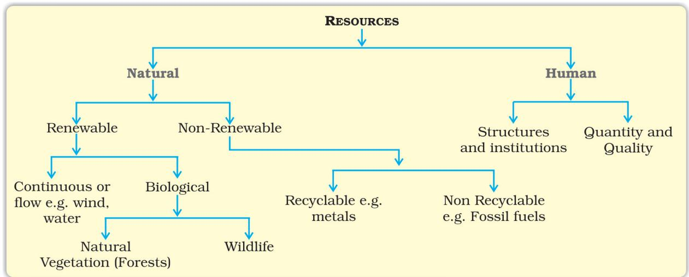  
Fig. 1.2: Classification of resources

Prepare a list of stock and reserve, resources that you are familiar with from your local area.

## DEVELOPMENT OF RESOURCES

Resources are vital for human survival as well as for maintaining the quality of life. It was believed that resources are free gifts of nature. As a result, human beings used them indiscriminately and this has led to the following major problems.

• Depletion of resources for satisfying the greed of a few individuals.   
• Accumulation of resources in few hands, which, in turn, divided the society into two segments i.e. haves and have nots or rich and poor.   
• Indiscriminate exploitation of resources has led to global ecological crises such as, global warming, ozone layer depletion, environmental pollution and land degradation.

## 

1. Imagine, if the oil supply gets exhausted one day, how would this affect our life style?   
2. Plan a survey in your colony/village to investigate people’s attitude towards recycling of the domestic/agricultural wastes. Ask questions about :

(a) What do they think about resources they use?   
(b) What is their opinion about the wastes, and its utilisation?   
(c) Collage your results.

An equitable distribution of resources has become essential for a sustained quality of life and global peace. If the present trend of resource depletion by a few individuals and countries continues, the future of our planet is in danger.

Therefore, resource planning is essential for sustainable existence of all forms of life. Sustainable existence is a component of sustainable development. sus

## Sustainable development

Sustainable economic development means ‘development should take place without damaging the environment, and development in the present should not compromise with the needs of the future generations.’

## Rio de Janeiro Earth Summit, 1992

In June 1992, more than 100 heads of states met in Rio de Janeiro in Brazil, for the first International Earth Summit. The Summit was convened for addressing urgent problems of environmental protection and socioeconomic development at the global level. The assembled leaders signed the Declaration on Global Climatic Change and Biological Diversity. The Rio Convention endorsed the global Forest Principles and adopted Agenda 21 for achieving Sustainable Development in the 21st century.

## Agenda 21

It is the declaration signed by world leaders in 1992 at the United Nations Conference on Environment and Development (UNCED), which took place at Rio de Janeiro, Brazil. It aims at achieving global sustainable development. It is an agenda to combat environmental damage, poverty, disease through global co-operation on common interests, mutual needs and shared responsibilities. One major objective of the Agenda 21 is that every local government should draw its own local Agenda 21.

## RESOURCE PLANNING

Planning is the widely accepted strategy for judicious use of resources. It has importance in a country like India, which has enormous diversity in the availability of resources. There are regions which are rich in certain types of resources but are deficient in some other

resources. There are some regions which can be considered self sufficient in terms of the availability of resources and there are some regions which have acute shortage of some vital resources. For example, the states of Jharkhand, Chhattisgarh and Madhya Pradesh are rich in minerals and coal deposits. Arunachal Pradesh has abundance of water resources but lacks in infrastructural development. The state of Rajasthan is very well endowed with solar and wind energy but lacks in water resources. The cold desert of Ladakh is relatively isolated from the rest of the country. It has very rich cultural heritage but it is deficient in water, infrastructure and some vital minerals. This calls for balanced resource planning at the national, state, regional and local levels.

## 

Prepare a list of resources found in your state and also identify the resources that are important but deficit in your state.

## Resource Planning in India

Resource planning is a complex process which involves : (i) identification and inventory of resources across the regions of the country. This involves surveying, mapping and qualitative and quantitative estimation and measurement of the resources. (ii) Evolving a planning structure endowed with appropriate technology, skill and institutional set up for implementing resource development plans. (iii) Matching the resource development plans with overall national development plans.

India has made concerted efforts for achieving the goals of resource planning right from the First Five Year Plan launched after Independence.

The availability of resources is a necessary condition for the development of any region, but mere availability of resources in the abs ence of corresponding changes in

## Find out

What resources are being developed in your surroundings by the community/village panchayats/ward level communities with the help of community participation?

technology and institutions may hinder development. There are many regions in our country that are rich in resources but these are included in economically backward regions. On the contrary there are some regions which have a poor resource base but they are economically developed.

Can you name some resource rich but economically backward regions and some resource poor but economically developed regions? Give reasons for such a situation.

The history of colonisation reveals that rich resources in colonies were the main attractions for the foreign invaders. It was primarily the higher level of technological development of the colonising countries that helped them to exploit resources of other regions and establish their supremacy over the colonies. Therefore, resources can contribute to development only when they are accompanied by appropriate technological development and institutional changes. India has experienced all this in different phases of colonisation. Therefore, in India, development, in general, and resource development in particular does not only involve the availability of resources, but also the technology, quality of human resources and the historical experiences of the people.

Conservation of Resources: Resources are vital for any developmental activity. But irrational consumption and over-utilisation of resources may lead to socio-economic and environmental problems. To overcome these problems, resource conservation at various levels is important. This had been the main concern of the leaders and thinkers in the past. For example, Gandhiji was very apt in voicing his concern about resource conservation in these words: “There is enough

for everybody’s need and not for any body’s greed.” He placed the greedy and selfish individuals and exploitative nature of modern technology as the root cause for resource depletion at the global level. He was against mass production and wanted to replace it with the production by the masses.

At the international level, the Club of Rome advocated resource conservation for the first time in a more systematic way in 1968. Subsequently, in 1974, Gandhian philosophy was once again presented by Schumacher in his book Small is Beautiful. The seminal contribution with respect to resource conservation at the global level was made by the Brundtland Commission Report, 1987. This report introduced the concept of ‘Sustainable Development’ and advocated it as a means for resource conservation, which was subsequently published in a book entitled Our Common Future. Another significant contribution was made at the Earth Summit at Rio de Janeiro, Brazil in 1992.

## LAND RESOURCES

We live on land, we perform our economic activities on land and we use it in different ways. Thus, land is a natural resource of utmost importance. It supports natural vegetation, wild life, human life, economic activities, transport and communication systems. However, land is an asset of a finite magnitude, therefore, it is important to use the

  
Fig 1.3: India : Land under important Relief Features

CONTEMPORARY INDIA – II

available land for various purposes with careful planning.

India has land under a variety of relief features, namely; mountains, plateaus, plains and islands. About 43 per cent of the land area is plain, which provides facilities for agriculture and industry. Mountains account for 30 per cent of the total surface area of the country and ensure perennial flow of some rivers, provide facilities for tourism and ecological aspects. About 27 per cent of the area of the country is the plateau region. It possesses rich reserves of minerals, fossil fuels and forests.

## LAND UTILISATION

Land resources are used for the following purposes:

1. Forests

2. Land not available for cultivation

(a) Barren and waste land   
(b) Land put to non-agricultural uses, e.g. buildings, roads, factories, etc.

3. Other uncultivated land (excluding fallow land)

(a) Permanent pastures and grazing land,   
(b) Land under miscellaneous tree crops groves (not included in net sown area),   
(c) Cultruable waste land (left uncultivated for more than 5 agricultural years).

4. Fallow lands

(a) Current fallow-(left without cultivation for one or less than one agricultural year),   
(b) Other than current fallow-(left uncultivated for the past 1 to 5 agricultural years).

5. Net sown area the physical extent of land on which crops are sown harvested is known as net sown area.

Area sown more than once in an agricultural year plus net sown area is known as gross cropped area.

## LAND USE PATTERN IN INDIA

The use of land is determined both by physical factors such as topography, climate, soil types as well as human factors such as population density, technological capability and culture and traditions etc.

RESOURCES AND DEVELOPMENT

Reporting Area: 10o Per cent   
  
Forest   
Barren and unculturable waste land   
Area under non-agricultural uses   
Permanent pasture and grazing land   
Area under misc. tree crops and groves

Fig. 1.4   
  
Culturable waste land   
Fallow other than current fallow   
Current fallow   
Net sown area

Source : Directorate of Economics and Statistics, Ministry of Agriculture, 2017

Total geographical area of India is 3.28 million sq km. Land use data, however, is available only for 93 per cent of the total geographical area because the land use reporting for most of the north-east states except Assam has not been done fully. Moreover, some areas of Jammu and Kashmir occupied by Pakistan and China have also not been surveyed.

## 

Try to do a comparison between the two pie charts (Fig. 1.4 ) given for land use and find out why the net sown area and the land under forests have changed from 1960-61 to 2014-15 very marginally.

The land under permanent pasture has also decreased. How are we able to feed our huge cattle population on this pasture land and what are the consequences of it? Most of the other than the current fallow lands are either of poor quality or the cost of cultivation

of such land is very high. Hence, these lands are cultivated once or twice in about two to three years and if these are included in the net sown area then the percentage of NSA in India comes to about 54 per cent of the total reporting area.

The pattern of net sown area varies greatly from one state to another. It is over 80 per cent of the total area in Punjab and Haryana and less than 10 per cent in Arunachal Pradesh, Mizoram, Manipur and Andaman Nicobar Islands.

Find out reasons for the low proportion of net sown area in these states.

Forest area in the country is far lower than the desired 33 per cent of geographical area, as it was outlined in the National Forest Policy (1952). It was considered essential for maintenance of the ecological balance. The livelihood of millions of people who live on the

RESOURCES AND DEVELOPMENT

fringes of these forests depends upon it. A part of the land is termed as waste land and land put to other non-agricultural uses. Waste land includes rocky, arid and desert areas and land put to other non-agricultural uses includes settlements, roads, railways, industry etc. Continuous use of land over a long period of time without taking appropriate measures to conserve and manage it, has resulted in land degradation. This, in turn, has serious repercussions on society and the environment.

## LAND DEGRADATION AND CONSERVATION MEASURES

We have shared our land with the past generations and will have to do so with the future generations too. Ninety-five per cent of our basic needs for food, shelter and clothing are obtained from land. Human activities have not only brought about degradation of land but have also aggravated the pace of natural forces to cause damage to land.

Some human activities such as deforestation, over grazing, mining and quarrying too have contributed significantly in land degradation.

Mining sites are abandoned after excavation work is complete leaving deep scars and traces of over-burdening. In states like Jharkhand, Chhattisgarh, Madhya Pradesh and Odisha deforestation due to mining have caused severe land degradation. In states like Gujarat, Rajasthan, Madhya Pradesh and Maharashtra overgrazing is one of the main reasons for land degradation. In the states of Punjab, Haryana, western Uttar Pradesh, over irrigation is responsible for land degradation due to water logging leading to increase in salinity and alkalinity in the soil. The mineral processing like grinding of limestone for cement industry and calcite and soapstone for ceramic industry generate huge quantity of dust in the atmosphere. It retards the process of infiltration of water into the soil after it settles down on the land. In recent years, industrial effluents as waste have become a major source of land and water bec pol pollution in many parts of the country.

There are many ways to solve the problems of land degradation. Afforestation and proper management of grazing can help to some extent. Planting of shelter belts of plants, control on over grazing, stabilisation of sand dunes by growing thorny bushes are some of the methods to check land degradation in arid areas. Proper management of waste lands, control of mining activities, proper discharge and disposal of industrial effluents and wastes after treatment can reduce land and water degradation in industrial and suburban areas.

## SOIL AS A RESOURCE

Soil is the most important renewable natural resource. It is the medium of plant growth and supports different types of living organisms on the earth. The soil is a living system. It takes millions of years to form soil upto a few cm in depth. Relief, parent rock or bed rock, climate, vegetation and other forms of life and time are important factors in the formation of soil. Various forces of nature such as change in temperature, actions of running water, wind and glaciers, activities of decomposers etc. contribute to the formation of soil. Chemical and organic changes which take place in the soil are equally

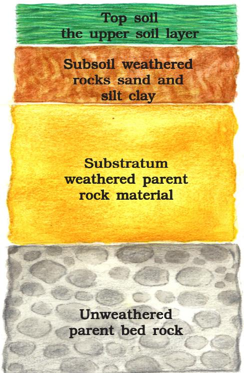  
Fig. 1.5: Soil Profile   
RESOURCES AND DEVELOPMENT

important. Soil also consists of organic (humus) and inorganic materials (Fig. 1.5).

On the basis of the factors responsible for soil formation, colour, thickness, texture, age, chemical and physical properties, the soils of India are classified in different types.

## Classification of Soils

India has varied relief features, landforms, climatic realms and vegetation types. These have contributed in the development of various types of soils.

## Alluvial Soils

This is the most widely spread and important soil. In fact, the entire northern plains are made of alluvial soil. These have been deposited by three important Himalayan river systems– the Indus, the Ganga and the Brahmaputra. These soils also extend in Rajasthan and Gujarat through a narrow corridor. Alluvial soil is also found in the eastern coastal plains particularly in the deltas of the Mahanadi, the Godavari, the Krishna and the Kaveri rivers.

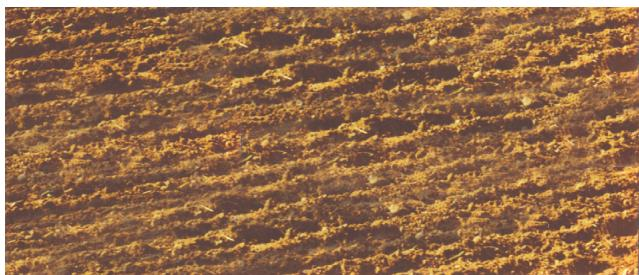  
Fig. 1.6: Alluvial Soil

The alluvial soil consists of various proportions of sand, silt and clay. As we move inlands towards the river valleys, soil particles appear some what bigger in size. In the upper reaches of the river valley i.e. near the place of the break of slope, the soils are coarse. Such soils are more common in piedmont plains such as Duars, Chos and Terai.

Apart from the size of their grains or components, soils are also described on the basis of their age. According to their age alluvial soils can be classified as old alluvial (Bangar) Bangar and new alluvial (Khadar). Khadar The bangar soilbangar has higher concentration of kanker nodules than the Khadar.Khadar. It Khadar. has more fine particles and is more fertile than the bangar. bangar

Alluvial soils as a whole are very fertile. Mostly these soils contain adequate proportion of potash, phosphoric acid and lime which are ideal for the growth of sugarcane, paddy, wheat and other cereal and pulse crops. Due to its high fertility, regions of alluvial soils are intensively cultivated and densely populated. Soils in the drier areas are more alkaline and can be productive after proper treatment and irrigation.

## Black Soil

These soils are black in colour and are also known as regur soils. Black soil is ideal for growing cotton and is also known as black cotton soil. It is believed that climatic condition along with the parent rock material are the important factors for the formation of black soil. This type of soil is typical of the Deccan trap (Basalt) region spread over northwest Deccan plateau and is made up of lava flows. They cover the plateaus of Maharashtra, Saurashtra, Malwa, Madhya Pradesh and Chhattisgarh and extend in the south east direction along the Godavari and the Krishna valleys.

The black soils are made up of extremely fine i.e. clayey material. They are well-known for their capacity to hold moisture. In addition,

  
Fig. 1.7: Black Soil

they are rich in soil nutrients, such as calcium carbonate, magnesium, potash and lime. These soils are generally poor in phosphoric contents. They develop deep cracks during hot weather, which helps in the proper aeration of the soil.

  
India: Major Soil Types

These soils are sticky when wet and difficult to work on unless tilled immediately after the first shower or during the pre-monsoon period.

## Red and Yellow Soils

Red soil develops on crystalline igneous rocks in areas of low rainfall in the eastern and southern parts of the Deccan plateau. Yelllow and red soils are also found in parts of Odisha, Chhattisgarh, southern parts of the middle Ganga plain and along the piedmont zone of the Western Ghats. These soils develop a reddish colour due to diffusion of iron in crystalline and metamorphic rocks. It looks yellow when it occurs in a hydrated form.

## Laterite Soil

Laterite has been derived from the Latin word ‘later’ which means brick. The laterite soil develops under tropical and subtropical climate with alternate wet and dry season. This soil is the result of intense leaching due to heavy rain. Lateritic soils are mostly deep to very deep, acidic $\mathrm { ( p H } { < } 6 . 0 \mathrm { ) }$ , generally deficient in plant nutrients and occur mostly in southern states, Western Ghats region of Maharashtra, Odisha, some parts of West Bengal and North-east regions. Where these soils support deciduous and evergreen forests, it is humus rich, but under sparse vegetation and in semi-arid environment, it is generally humus poor. They are prone to erosion and degradation due to their position on the landscape. After adopting appropriate soil

  
Fig. 1.8: Laterite Soil

conservation techniques particularly in the hilly areas of Karnataka, Kerala and Tamil Nadu, this soil is very useful for growing tea and coffee. Red laterite soils in Tamil Nadu, Andhra Pradesh and Kerala are more suitable for crops like cashew nut.

## Arid Soils

Arid soils range from red to brown in colour. They are generally sandy in texture and saline in nature. In some areas the salt content is very high and common salt is obtained by evaporating the water. Due to the dry climate, high temperature, evaporation is faster and the soil lacks humus and moisture. The lower horizons of the soil are occupied by Kankar because of the increasing calcium content downwards. The Kankar layer formations in the bottom horizons restrict the infiltration of water. After proper irrigation these soils become cultivable as has been in the case of western Rajasthan.

## Forest Soils

These soils are found in the hilly and mountainous areas where sufficient rain forests are available. The soils texture varies according to the mountain environment

  
Fig. 1.9: Arid Soil

where they are formed. They are loamy and silty in valley sides and coarse grained in the upper slopes. In the snow covered areas of Himalayas, these soils experience denudation and are acidic with low humus content. The soils found in the lower parts of the valleys particularly on the river terraces and alluvial fans are fertile.

## Soil Erosion and Soil Conservation

The denudation of the soil cover and subsequent washing down is described as soil erosion. The processes of soil formation and erosion, go on simultaneously and generally there is a balance between the two. Sometimes, this balance is disturbed due to human activities like deforestation, over-grazing, construction and mining etc., while natural forces like wind, glacier and water lead to soil erosion. The running water cuts through the clayey soils and makes deep channels as gullies. The land becomes unfit for cultivation and is known as bad land. In the Chambal basin such lands are called ravines. Sometimes water flows as a sheet over large areas down a slope. In such cases the top soil is washed away. This is known as sheet erosion. Wind blows loose soil off flat or sloping land known as wind erosion. Soil erosion is also caused due to defective methods of farming. Ploughing in a wrong way i.e. up and down the slope form

  
Fig. 1.10: Soil Erosion

  
Fig. 1.11: Gully Erosion

channels for the quick flow of water leading to soil erosion.

Ploughing along the contour lines can decelerate the flow of water down the slopes. This is called contour ploughing. Steps can be cut out on the slopes making terraces. Terrace cultivation restricts erosion. Western and central Himalayas have well developed terrace farming. Large fields can be divided into strips. Strips of grass are left to grow between the crops. This breaks up the force of the wind. This method is known as strip cropping. Planting lines of trees to create shelter also works in a similar way. Rows of such trees are called shelter belts. These shelter belts have contributed significantly to the stabilisation of sand dunes and in stabilising the desert in western India.

1 . Multiple choice questions.

(i) Which one of the following is the main cause of land degradation in Punjab?

(a) Intensive cultivation

(c) Over irrigation

(b) Deforestation

(d) Overgrazing

(ii) In which one of the following states is terrace cultivation practised?

(a) Punjab

(c) Haryana

(b) Plains of Uttar Pradesh

(d) Uttarakhand

(iii) In which of the following states black soil is predominantly found?

(a) Uttar Pradesh

(c) Rajasthan

(b) Maharashtra

(d) Jharkhand

2 . Answer the following questions in about 30 words.

(i) Name three states having black soil and the crop which is mainly grown in it.

(ii) What type of soil is found in the river deltas of the eastern coast? Give three main features of this type of soil.

(iii) What steps can be taken to control soil erosion in the hilly areas?

3. Answer the following questions in about 120 words.

(i) Explain land use pattern in India and why has the land under forest not increased much since 1960-61?

(ii) How have technical and economic development led to more consumption of resources?

### PROJECT/ACTIVITY

1 . Make a project showing consumption and conservation of resources in your locality.   
2 . Have a discussion in the class– how to conserve various resources used in your school.   
3 . Imagine if oil supplies get exhausted, how will this affect our life style?

4 . Solve the puzzle by following your search horizontally and vertically to find the hidden answers.

(i) Natural endowments in the form of land, water, vegetation and minerals.   
(ii) A type of non-renewable resource.   
(iii) Soil with high water retaining capacity.   
(iv) Intensively leached soils of the monsoon climate.   
(v) Plantation of trees on a large scale to check soil erosion.   
(vi) The Great Plains of India are made up of these soils.

<table><tr><td>S</td><td>F</td><td>G</td><td>S</td><td>F</td><td>O</td><td>B</td><td>R</td><td>O</td><td>M</td><td>S</td><td>U</td><td>A</td><td>P</td><td>J</td></tr><tr><td>Q</td><td>G</td><td>A</td><td>F</td><td>F</td><td>O</td><td>R</td><td>E</td><td>S</td><td>T</td><td>A</td><td>T</td><td>I</td><td>O</td><td>N</td></tr><tr><td>P</td><td>N</td><td>R</td><td>E</td><td>C</td><td>P</td><td>R</td><td>S</td><td>L</td><td>D</td><td>M</td><td>I</td><td>L</td><td>N</td><td>F</td></tr><tr><td>S</td><td>N</td><td>A</td><td>T</td><td>Q</td><td>X</td><td>U</td><td>O</td><td>V</td><td>A</td><td>I</td><td>O</td><td>L</td><td>A</td><td>L</td></tr><tr><td>O</td><td>D</td><td>E</td><td>I</td><td>D</td><td>R</td><td>J</td><td>U</td><td>J</td><td>L</td><td>D</td><td>B</td><td>N</td><td>B</td><td>D</td></tr><tr><td>T</td><td>G</td><td>H</td><td>M</td><td>I</td><td>N</td><td>E</td><td>R</td><td>A</td><td>L</td><td>S</td><td>A</td><td>X</td><td>M</td><td>W</td></tr><tr><td>B</td><td>V</td><td>J</td><td>K</td><td>M</td><td>E</td><td>D</td><td>C</td><td>R</td><td>U</td><td>P</td><td>F</td><td>M</td><td>H</td><td>R</td></tr><tr><td>L</td><td>A</td><td>T</td><td>E</td><td>R</td><td>I</td><td>T</td><td>E</td><td>M</td><td>V</td><td>A</td><td>Z</td><td>T</td><td>V</td><td>L</td></tr><tr><td>A</td><td>B</td><td>Z</td><td>O</td><td>E</td><td>N</td><td>M</td><td>F</td><td>T</td><td>I</td><td>S</td><td>D</td><td>L</td><td>R</td><td>C</td></tr><tr><td>C</td><td>G</td><td>N</td><td>N</td><td>S</td><td>Z</td><td>I</td><td>O</td><td>P</td><td>A</td><td>X</td><td>T</td><td>Y</td><td>J</td><td>H</td></tr><tr><td>K</td><td>J</td><td>G</td><td>K</td><td>D</td><td>T</td><td>D</td><td>C</td><td>S</td><td>L</td><td>S</td><td>E</td><td>G</td><td>E</td><td>W</td></tr></table>

# Chapter 2
# FOREST AND WILPLIFE RESOURCE

Narak! My Lord, you are the creator of music in the world of Lepchas

Oh Narak! My Lord, let me dedicate myself to you

Let me gather your music from the springs, the rivers, the mountains, the forests, the insects and the animals

Let me gather your music from the sweet breeze and offer it to you

Source: Lepcha folk song from northern part of West Bengal

We share this planet with millions of other living beings, starting from micro-organisms and bacteria, lichens to banyan trees, elephants and blue whales. This entire habitat that we live in has immense biodiversity. We humans along with all living organisms form a complex web of ecological system in which we are only a part and very much dependent on this system for our own existence. For example, the plants, animals and micro-organisms re-create the quality of the air we breathe, the water we drink and the soil that produces our food without which we cannot survive. Forests play a key role in the ecological system as these are also the primary producers on which all other living beings depend.

Biodiversity or Biological Diversity is immensely rich in wildlife and cultivated species, diverse in form and function but closely integrated in a system through multiple network of interdependencies.

## Flora and Fauna in Iauna in India

If you look around, you will be able to find that there are some animals and plants which are unique in your area. In fact, India is one of the world’s richest countries in terms of its vast array of biological diversity. This is possibly twice or thrice the number yet to be discovered. You have already studied in detail about the extent and variety of forest and wildlife resources in India. You may have realised the importance of these resources in our daily life. These diverse flora and fauna are so well integrated in our daily life that we take these for granted. But, lately, they are under great stress mainy due to insensitivity to our environment.

## 

Find out stories prevalent in your region which are about the harmonious relationship between human beings and nature.

## Conservation of Forest and Wildlife in India

Conservation in the background of rapid decline in wildlife population and forestry has become essential. But why do we need to conserve our forests and wildlife? Conservation preserves the ecological diversity and our life support systems – water, air and soil. It also preserves the genetic diversity of plants and animals for better growth of species and breeding. For example, in agriculture, we are still dependent on traditional crop varieties. Fisheries too are heavily dependent on the maintenance of aquatic biodiversity.

In the 1960s and 1970s, conservationists demanded a national wildlife protection

  
Tribal girls using bamboo saplings in a nursery at Mukhali near Silent Valley

  
Leaf litter collection by women folk

  
Tribal women selling minor forest produce   
Fig. 2.1

programme. The Indian Wildlife (Protection) Act was implemented in 1972, with various provisions for protecting habitats. An all-India list of protected species was also published. The thrust of the programme was towards protecting the remaining population of certain endangered species by banning hunting, giving legal protection to their habitats, and restricting trade in wildlife. Subsequently, central and many state governments established national parks and wildlife sanctuaries about which you have already studied. The central government also announced several projects for protecting specific animals, which were gravely threatened, including the tiger, the onehorned rhinoceros, the Kashmir stag or hangul, three types of crocodiles - fresh water crocodile, saltwater crocodile and the Gharial, the Asiatic lion, and others. Most recently, the Indian elephant, black buck (chinkara), the great Indian bustard (godawan) and the snow leopard, etc. have been given full or partial legal protection against hunting and trade throughout India.

## Project Tiger

Tiger is one of the key wildlife species in the faunal web. In 1973, the authorities realised that the tiger population had dwindled to 1,827 from an estimated 55,000 at the turn of the century. The major threats to tiger population are numerous, such as poaching for trade, shrinking habitat, depletion of prey base species, growing human population, etc. The trade of tiger skins and the use of their bones in traditional medicines, especially in the Asian countries left the tiger population on the verge of extinction. Since India and Nepal provide habitat to about two-thirds of the surviving tiger population in the world, these two nations became prime targets for poaching and illegal trading.

“Project Tiger”, one of the wellpublicised wildlife campaigns in the world, was launched in 1973. Tiger conservation has been viewed not only as an effort to save an endangered species, but with

  
FIg. 2.2: Rhino and deer in Kaziranga National Park

equal importance as a means of preserving biotypes of sizeable magnitude. Corbett National Park in Uttarakhand, Sunderbans National Park in West Bengal, Bandhavgarh National Park in Madhya Pradesh, Sariska Wildlife Sanctuary in Rajasthan, Manas Tiger Reserve in Assam and Periyar Tiger Reserve in Kerala are some of the tiger reserves of India.

The conservation projects are now focusing on biodiversity rather than on a few of its components. There is now a more intensive search for different conservation measures. Increasingly, even insects are beginning to find a place in conservation planning. In the notification under Wildlife Act of 1980 and 1986, several hundred butterflies, moths, beetles, and one dragonfly have been added to the list of protected species. In 1991, for the first time plants were also added to the list, starting with six species.

## 

Collect more information on the wildlife sanctuaries and national parks of India and cite their locations on the map of India.

## Types and Distribution of Forest and Wildlife Resources

Even if we want to conserve our vast forest and wildlife resources, it is rather difficult to manage, control and regulate them. In India,

much of its forest and wildlife resources are either owned or managed by the government through the Forest Department or other government departments. These are classified under the following categories.

(i) Reserved Forests:Reserved Forests: More than half of the total forest land has been declared reserved forests. reserved forests Reserved forests are regarded as the most valuable as far as the conservation of forest and wildlife resources are concerned.   
(ii) ProtectedForests:Protected Almost one-third of the total forest area is protected forest, as declared by the Forest Department. This forest land are protected from any further depletion.   
(iii) Unclassed Forests:Forests: These are other forests and wastelands belonging to both government and private individuals and communities.

Reserved and protected forests are also referred to as permanent forest estates maintained for the purpose of producing timber and other forest produce, and for protective reasons. Madhya Pradesh has the largest area under permanent forests, constituting 75 per cent of its total forest area. Jammu and Kashmir, Andhra Pradesh, Uttarakhand, Kerala, Tamil Nadu, West Bengal, and Maharashtra have large percentages of reserved forests of its total forest area whereas Bihar, Haryana, Punjab, Himachal Pradesh, Odisha and Rajasthan have a bulk of it under protected forests. All North-

## Gharial on the brink

The gharial population has been at its lowest since the 1970s.What went wrong and what can we do?

ROMULUSWHITAKER

and JANAKI LENIN

ISPY tendrilsof mist rise delicately fromthewater surface, tingedgoldbythedawn.Your breath hangsas little cloudsof vapour as you gaze upon the Girwa River onacold wintermorning.Atrio ofhollow clapping sounds from the other side of the river,half a kilometre away tells vou that an adult male gharialisadvertisinghispresence.Itisthe height of the breeding season.The place seems trapped ina time inearly history when man was still clad in animal skins.It is onlyas the sun rises higherand burns themist offthe water that theworld comes into focus with appallingclarity.Thefive-km stretch of the Girwa River in Katerniaghat WildlifeSanctuaryisoneof theonly threewild breeding sites left in the world for the most unique of all the

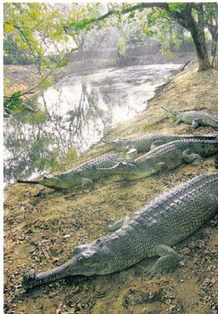  
CRITICALLY ENDANGERED:Captive gharial at theMadras

hatched by FAO consultant Bob Bustard.When they reached a metre in length.thev were released in the wild.

ability tosupportlargernumbersofthe animal. During the dry summer months, the

Dhruva Basu compile of the last 10 years drastic decline ing

By Nidhi Sharma/TNN New Delhi: It is official now The recent bird deaths renorted in Okhia sanctuarywerebecause of polluted Yamuna water and contaminated fish and not be camieatofbirdfu．otThe aildlifedeparrdents.of UP and Delhi have sent reports torespectivegovernments sayingthat moresuch deaths cannot be ruled out deattsecannotberuledrout this sanctuary is cleaned Fifty-three migratory birdswere found dead in Okhla birdsanctureii er this month.Later UP authorities had arrested three fishermen and claimed that theyrhadaddedpoisonto． watertokillfish.Thesepoisnned fiehwererennrtedly

  
Bird deaths blamed on dirty Yamuna Delhi Govt ReportPoints To Toxic Elements in Stagnant Water

Can you find out the reasons for the above mentioned problems?

eastern states and parts of Gujarat have a very high percentage of their forests as unclassed forests managed by local communities.

## Community and Conservation

Conservation strategies are not new in our country. We often ignore that in India, forests are also home to some of the traditional communities. In some areas of India, local communities are struggling to conserve these habitats along with government officials, recognising that only this will secure their own long-term livelihood. In Sariska Tiger Reserve, Rajasthan, villagers have fought against mining by citing the Wildlife Protection Act. In many areas, villagers themselves are protecting habitats and explicitly rejecting government involvement. The inhabitants of five villages in the Alwar district of Rajasthan have declared 1,200 hectares of forest as the Bhairodev

Dakav ‘Sonchuri’, declaring their own set of rules and regulations which do not allow hunting, and are protecting the wildlife against any outside encroachments.

The famous Chipko movement in theChipko Himalayas has not only successfully resisted deforestation in several areas but has also shown that community afforestation with indigenous species can be enormously successful. Attempts to revive the traditional conservation methods or developing new methods of ecological farming are now widespread. Farmers and citizen’s groups like the Beej Bachao Andolan Andolan in Tehri and Navdanya Navdanya have shown that adequate levels of diversified crop production without the use of synthetic chemicals are possible and economically viable.

In India joint forest management (JFM) programme furnishes a good example for involving local communities in the

## Sacred groves - a wealth of diverse and rare species

Nature worship is an age old tribal belief based on the premise that all creations of nature have to be protected. Such beliefs have preserved several virgin forests in pristine form called Sacred Groves (the forests of God and Goddesses). These patches of forest or parts of large forests have been left untouched by the local people and any interference with them is banned.

Certain societies revere a particular tree which they have preserved from time immemorial. The Mundas and the Santhal of Chota Nagpur region worship mahua (Bassia latifolia) and kadamba (Anthocaphalus cadamba) trees, and the tribals of Odisha and Bihar worship the tamarind (Tamarindus indica) and mango (Mangifera indica) trees during weddings. To many of us, peepal and banyan trees are considered sacred.

Indian society comprises several cultures, each with its own set of traditional methods of conserving nature and its creations. Sacred qualities are often ascribed to springs, mountain peaks, plants and animals which are closely protected. You will find troops of macaques and langurs around many temples. They are fed daily and treated as a part of temple devotees. In and around Bishnoi villages in Rajasthan, herds of blackbuck, (chinkara), nilgai and peacocks can be seen as an integral part of the community and nobody harms them.

management and restoration of degraded forests. The programme has been in formal existence since 1988 when the state of Odisha passed the first resolution for joint forest management. JFM depends on the formation of local (village) institutions that undertake protection activities mostly on degraded forest land managed by the forest department. In return, the members of these communities are entitled to intermediary benefits like non-timber forest produces and share in the timber harvested by ‘successful protection’.

The clear lesson from the dynamics of both environmental destruction and reconstruction in India is that local communities everywhere have to be involved in some kind of natural resource management. But there is still a long way to go before local communities are at the centre-stage in decision-making. Accept only those economic or developmental activities, that are people centric, environment-friendly and economically rewarding.

### Activity

Write a short essay on any practices which you may have observed and practised in your everyday lives that conserve and protect the environment around you.

“The tree is a peculiar organism of unlimited kindness and benevolence and makes no demand for its sustenance, and extends generously the products of its life activity. It affords protection to all beings, offering shade even to the axemen who destroy it”.

Gautama Buddha (487 B.C.)

1 . Multiple choice questions

(i) Which of the following conservation strategies do not directly involve community participation?

(a) Joint forest management

(c) Chipko Movement

(b) Beej Bachao Andolan

(d) Demarcation of Wildlife sanctuaries

2 . Match the following.

Reserved forests

Protected forests

Unclassed forests

other forests and wastelands belonging to both government and private individuals and communities

forests are regarded as most valuable as far as the conservation of forest and wildlife resources

forest lands are protected from any further depletion

3 . Answer the following questions in about 30 words.

(i) What is biodiversity? Why is biodiversity important for human lives?   
(ii) How have human activities affected the depletion of flora and fauna? Explain.

4 . Answer the following questions in about 120 words.

(i) Describe how communities have conserved and protected forests and wildlife in India?   
(ii) Write a note on good practices towards conserving forest and wildlife.

# chapter 3
# WATER RESOURCES

Hey Pinky, did you see those awesome T.V. reports on floods in Assam?My God! What havoc they have created it has destroyed and swept away everything in its path.

Yes, Chintu, I did. Isn't it strange that water can give life and take life as well. What would we do without water? Weneed water to drink,cookour food, wash our clothes and wash ourselvesas well.My father was telling me that in his factory they need a lot of water fora number of things. Did you know that they even need water for cooling the machines?

In fact, the factory runs on the power supplied by the hydle power plant. Now, I can understand why through the ages we humans have chosen to live near water courses along the rivers and other water sources like springs,lakes,ponds and oases.

You already know that three-fourth of the earth’s surface is covered with water, but only a small proportion of it accounts for freshwater that can be put to use. This freshwater is mainly obtained from surface run off and ground water that is continually being renewed and recharged through the hydrological cycle. All water moves within the hydrological cycle ensuring that water is a renewable resource.

You might wonder that if three-fourth of the world is covered with water and water is a renewable resource, then how is it that countries and regions around the globe suffer from water scarcity? Why is it predicted that by 2025, nearly two billion people will live in absolute water scarcity?

## WATER SCARCITY AND THE NEED FOR WATER CONSERVATION AND MANAGEMENT

Given the abundance and renewability of water, it is difficult to imagine that we may suffer from water scarcity. The moment we speak of water shortages, we immediately associate it with regions having low rainfall or those that are drought prone. We instantaneously visualise the deserts of Rajasthan and women balancing many ‘matkas’ (earthen pots) used for collecting and storing water and travelling long distances to get water. True, the availability of water resources varies over space and time, mainly due to the variations in seasonal and annual precipitation, but water scarcity in most cases

is caused by over-exploitation, excessive use and unequal access to water among different social groups.

Where is then water scarcity likely to occur? As you have read in the hydrological cycle, freshwater can be obtained directly from precipitation, surface run off and groundwater.

Is it possible that an area or region may have ample water resources but is still facing water scarcity? Many of our cities are such examples. Thus, water scarcity may be an outcome of large and growing population and

consequent greater demands for water, and unequal access to it. A large population requires more water not only for domestic use but also to produce more food. Hence, to facilitate higher food-grain production, water resources are being over-exploited to expand irrigated areas for dry-season agriculture. Irrigated agriculture is the largest consumer of water. Now it is needed to revolutionise the agriculture through developing drought resistant crops and dry farming techniques. You may have seen in many television advertisements that most farmers have their

  
Water, Water Everywhere, Not a Drop to Drink: After a heavy downpour, a boy collects drinking water in Kolkata. Life in the city and its adjacent districts was paralysed as incessant overnight rain, meaning a record 180 mm, flooded vast area and disruted traffic.

  
A Kashmiri earthquake survivor carries water in t he snow in a devastated village.

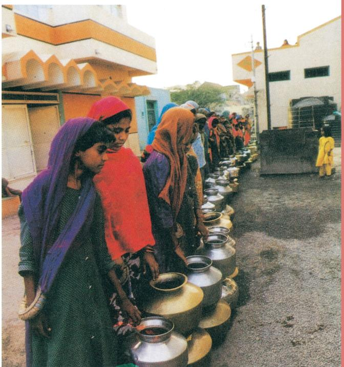  
Fig. 3.1: Water Scarcity

own wells and tube-wells in their farms for irrigation to increase their produce. But have you ever wondered what this could result in? That it may lead to falling groundwater levels, adversely affecting water availability and food security of the people.

Post-independent India witnessed intensive industrialisation and urbanisation, creating vast opportunities for us. Today, large industrial houses are as commonplace as the industrial units of many MNCs (Multinational Corporations). The ever-increasing number of industries has made matters worse by exerting pressure on existing freshwater resources. Industries, apart from being heavy users of water, also require power to run them. Much of this energy comes from hydroelectric power. Today, in India hydroeclectric power contributes approximately 22 per cent of the total electricity produced. Moreover, multiplying urban centres with large and dense populations and urban lifestyles have not only added to water and energy requirements but have further aggravated the problem. If you look into the housing societies or colonies in the cities, you would find that most of these have their own groundwater pumping devices to meet their water needs. Not surprisingly, we find that fragile water resources are being over-exploited and have caused their depletion in several of these cities.

So far we have focused on the quantitative aspects of water scarcity. Now, let us consider another situation where water is sufficiently available to meet the needs of the people, but, the area still suffers from water scarcity. This scarcity may be due to bad quality of water. Lately, there has been a growing concern that even if there is ample water to meet the needs of the people, much of it may be polluted by domestic and industrial wastes, chemicals, pesticides and fertilisers used in agriculture, thus, making it hazardous for human use. Government of India has accorded highest priority to improve the quality of life and enhance ease of living of people especially those living in rual areas by announcing the Jal Jeevan Mission (JJM). The Goal of JJM is to enable every rural household get assured supply of potable piped water at a service level of 55 litres per capita per day regularly on

long-term basis by ensuring functionality of the tap water connections. (Source: Economic Survey 2020–21, p.357)

India’s rivers, especially the smaller ones, have all turned into toxic streams. And even the big ones like the Ganga and Yamuna are far from being pure. The assault on India’s rivers – from population growth, agricultural modernisation, urbanisation and industrialisation – is enormous and growing by the day….. This entire life stands threatened.

Source: The Citizens'Fifth Report, CSE, 1999.

You may have already realised that the need of the hour is to conserve and manage our water resources, to safeguard ourselves from health hazards, to ensure food security, continuation of our livelihoods and productive activities and also to prevent degradation of our natural ecosystems. Over exploitation and mismanagement of water resources will impoverish this resource and cause ecological crisis that may have profound impact on our lives.

## 

From your everyday experiences, write a short proposal on how you can conserve water.

## MULTI-PURPOSE RIVER PROJECTS AND INTEGRATED WATER RESOURCES MANAGEMENT

But, how do we conserve and manage water? Archaeological and historical records show that from ancient times we have been constructing sophisticated hydraulic structures like dams built of stone rubble, reservoirs or lakes, embankments and canals for irrigation. Not surprisingly, we have continued this tradition in modern India by building dams in most of our river basins.

## Hydraulic Structures in Ancient India

• In the first century B.C., Sringaverapura near Allahabad had sophisticated water harvesting system channelling the flood water of the river Ganga.   
During the time of Chandragupta Maurya, dams, lakes and irrigation systems were extensively built.

• Evidences of sophisticated irrigation works have also been found in Kalinga, (Odisha), Nagarjunakonda (Andhra Pradesh), Bennur (Karnataka), Kolhapur (Maharashtra), etc.   
• In the 11th Century, Bhopal Lake, one of the largest artificial lakes of its time was built.   
• In the 14th Century, the tank in Hauz Khas, Delhi was constructed by Iltutmish for supplying water to Siri Fort area.

Source: Dying Wisdom, CSE, 1997.

  
Fig. 3.2: Hirakud Dam

What are dams and how do they help us in conserving and managing water? Dams were traditionally built to impound rivers and rainwater that could be used later to irrigate agricultural fields. Today, dams are built not just for irrigation but for electricity generation, water supply for domestic and industrial uses, flood control, recreation, inland navigation and fish breeding. Hence, dams are now referred to as multi-purpose projects where the many uses of the impounded water are integrated with one another. For example, in the Sutluj-Beas river basin, the Bhakra – Nangal project water is being used both for hydel power production and irrigation. Similarly, the Hirakud project in the Mahanadi basin integrates conservation of water with flood control.

Multi-purpose projects, launched after Independence with their integrated water resources management approach, were thought of as the vehicle that would lead the nation to development and progress, overcoming the

A dam is a barrier across flowing water that obstructs, directs or retards the flow, often creating a reservoir, lake or impoundment. “Dam” refers to the reservoir rather than the structure. Most dams have a section called a spillway or weir over which or through which it is intended that water will flow either intermittently or continuously. Dams are classified according to structure, intended purpose or height. Based on structure and the materials used, dams are classified as timber dams, embankment dams or masonry dams, with several subtypes. According to the height, dams can be categorised as large dams and major dams or alternatively as low dams, medium height dams and high dams.

handicap of its colonial past. Jawaharlal Nehru proudly proclaimed the dams as the ‘temples of modern India’; the reason being that it would integrate development of agriculture and the village economy with rapid industrialisation and growth of the urban economy.

## 

Find out more about any one traditional method of building dams and irrigation works.

We have sown the crops in Asar

We will bring Bhadu in Bhadra

Floods have swollen the Damodar

The sailing boats cannot sail

Oh! Damodar, we fall at your feet

Reduce the floods a little

Bhadu will come a year later

Let the boats sail on your surface

(This popular Bhadu song in the Damodar valley region narrates the troubles faced by people owing to the flooding of Damodar river known as the river of sorrow.)

In recent years, multi-purpose projects and large dams have come under great scrutiny and opposition for a variety of reasons. Regulating and damming of rivers affect their natural flow causing poor sediment flow and excessive sedimentation at the bottom of the reservoir, resulting in rockier stream

beds and poorer habitats for the rivers’ aquatic life. Dams also fragment rivers making it difficult for aquatic fauna to migrate, especially for spawning. The reservoirs that are created on the floodplains also submerge the existing vegetation and soil leading to its decomposition over a period of time.

Multi-purpose projects and large dams have also been the cause of many new environmental movements like the ‘Narmada Bachao Andolan’ and the ‘Tehri Dam Andolan’ etc. Resistance to these projects has primarily been due to the large-scale displacement of local communities. Local people often had to give up their land, livelihood and their meagre access and control over resources for the greater good of the nation. So, if the local people are not benefiting from such projects then who is benefited? Perhaps, the landowners and large farmers, industrialists and few urban centres. Take the case of the landless in a village – does he really gain from such a project?

Narmada Bachao Andolan or Save Narmada Movement is a Non Governmental Organisation (NGO) that mobilised tribal people, farmers, environmentalists and human rights activists against the Sardar Sarovar Dam being built across the Narmada river in Gujarat. It originally focused on the environmental issues related to trees that would be submerged under the dam water. Recently it has re-focused the aim to enable poor citizens, especially the oustees (displaced people) to get full rehabilitation facilities from the government.

People felt that their suffering would not be in vain… accepted the trauma of displacement believing in the promise of irrigated fields and plentiful harvests. So, often the survivors of Rihand told us that they accepted their sufferings as sacrifice for the sake of their nation. But now, after thirty bitter years of being adrift, their livelihood having even being more precarious, they keep asking: “Are we the only ones chosen to make sacrifices for the nation?”

Source: S. Sharma, quoted in In the Belly of the River. Tribal conflicts over development in Narmada valley, A.Baviskar, 1995.

## Do you know?

Sardar Sarovar Dam has been built over the Narmada River in Gujarat. This is one of the largest water resource projects of India covering four states—Maharashtra, Madhya Pradesh, Gujarat and Rajasthan. The Sardar Sarovar project would meet the requirement of water in drought-prone and desert areas of Gujarat (9,490 villages and 173 towns) and Rajasthan (124 villages).

Source: Source: http://www.sardarsarovardam.org/

Irrigation has also changed the cropping pattern of many regions with farmers shifting to water intensive and commercial crops. This has great ecological consequences like salinisation of the soil. At the same time, it has transformed the social landscape i.e. increasing the social gap between the richer landowners and the landless poor. As we can see, the dams did create conflicts between people wanting different uses and benefits from the same water resources. In Gujarat, the Sabarmati-basin farmers were agitated and almost caused a riot over the higher priority given to water supply in urban areas, particularly during droughts. Inter-state water disputes are also becoming common with regard to sharing the costs and benefits of the multi-purpose project.

## Do you know?

Do you know that the Krishna-Godavari dispute is due to the objections raised by Karnataka and Andhra Pradesh governments? It is regarding the diversion of more water at Koyna by the Maharashtra government for a multipurpose project. This would reduce downstream flow in their states with adverse consequences for agriculture and industry.

## 

Make a list of inter-state water disputes.

  
India: Major Rivers and Dams

Most of the objections to the projects arose due to their failure to achieve the purposes for which they were built. Ironically, the dams that were constructed to control floods have triggered floods due to sedimentation in the reservoir. Moreover, the big dams have mostly been unsuccessful in controlling floods at the time of excessive rainfall. You may have seen or read how the release of water from dams during heavy rains aggravated the flood situation in Maharashtra and Gujarat in 2006 The floods have not only devastated life and property but also caused extensive soil erosion. Sedimentation also meant that the flood plains were deprived of silt, a natural fertiliser, further adding on to the problem of land degradation. It was also observed that the multi-purpose projects induced earthquakes, caused waterborne diseases and pests and pollution resulting from excessive use of water.

## RAINWATER HARVESTING

Many thought that given the disadvantages and rising resistance against the multi-purpose projects, water harvesting system was a viable alternative, both socio-economically and environmentally. In ancient India, along with the sophisticated hydraulic structures, there existed an extraordinary tradition of waterharvesting system. People had in-depth knowledge of rainfall regimes and soil types and developed wide ranging techniques to harvest rainwater, groundwater, river water and flood water in keeping with the local ecological conditions and their water needs. In hill and mountainous regions, people built diversion channels like the ‘guls’ or ‘kuls’ of the Western Himalayas for agriculture. ‘Rooftop rainwater harvesting’ was commonly practised to store drinking water, particularly in Rajasthan. In the flood plains of Bengal, people developed inundation channels to irrigate their

## FLOODS

## Basic Safety Precautions To Be Taken :

Listento radio/TVfor the latest weather bulletinsand flood warnings.Passon the information to others.   
Makea family emergency kit which should include;a portable radio/transistor, torch,spare batteries,a first aid boxalong with essential medicines,ORS,dry food items,drinkingwater，matchboxes,candlesand otheressential items.   
Keep hurricane lamp,ropes,rubber tubes,umbrella and bamboo stick in your house.These could be useful.   
·Keepyourcashjeweleryables,mportantdocumentsetc.inep   
If there isa flood,move alongwith your family members and cattle to safe areas like reliefcamps,evacuationcentres,elevated groundswhereyoucantakeshelter.   
·Turn offpower and gas connections before leaving your house.

## During floods

·Don't enter into flood waters; it could be dangerous.   
·Don't allow children to play in or near flood waters.   
·Stay away from sewerage line,gutters,drains,culverts etc.   
·Be careful of snakes; snakebites are common during floods.   
·Stay away from electric poles and falen power-lines to avoid electrocution.   
·Don't use wet electrical appiances-getthem checked before use.   
·Eatfreshlycookedanddry food.Alwayskeep your foodcovered.   
·Use boiled and filtered drinking water.   
·Keep alldrains, gutters near your house clean.   
Stagnation of water can breed vector/water-borne diseases .In case of sickness, seek medical assistance.   
·Use bleaching powder and lime to disinfect the surroundings.

  
Lift-off:An IAF helicopterrescuesa woman and her child fromthe DongargaonilageofMaharashtra’sHingolidistrict．nall． 11 choprged intorite Redatdrepcrteonet

  
UP, UP & AWAY : An IAF helicopter rescues a worker who was trappec UPhPowterAnt icopterrescues woerho

## Heavy rain drowns Kolkata DurgaPuja Preparations Go Awry As Met Predicts Downpour For Next 2 Days

TIMESNEWS NTWORS Kolkata:With two days of incessan rain-andmoreforecastforthenext este halt on Friday The city has so far ecod218.44nfalL Threepeoplediedofelectrocution inthe southernfringesof thecity and throeofafomilywerekilledingwal toreedeamrtherelleastit colepeNthatagsdistie and nearly 70.o0 houses were dam ged.Bengalis woke up on Friday aged.Bengaliswoke up on Friday auspicioasccasionobservedseven ays prior to the start of Durga Puia bymnsevenasrains lashedthecity see pore Body Guard Lines,Amherst Stret,Chetndno ters inmany anesAlinoreBodveuand Lines，choesbd ilyetartere ofKolkataPolicnr oded.t fodeltetoetwo o nyingigident compefitggpletetaeoo． ivrtopeteldin hoth Eastern and South-EasternRail wan'sSealdahnndHowrabteivisions withtrackssumergednderwoterin

  
ELFbusscineggdtrini

many plaoes Six trinsincdineJmwantourExpress Puri Exoessanda muTawiExpressand Howrah-PurinnathExpress,ranbehindschedule rieeielltee 11trains,icdgoes,dohAli MumbcexpesEUadCireie

were lareely affected,Howeser there wasnochangeinRaidhaniExpress schedule.Whilesurfacetransport was ightere Power blackouts ocrurredal Bhowanipore,Dum Dum，Thakur pukur，Behala,New Alipor,Gree PakurBehala Ne poreGee somthawestKolkataTheposhSalt Lake，too，od to the IT-hubatSeetorVhadatouet tieredingthrotghwaterlogged streets，Anxietywaswritlargeover streets,Anxiety was writlarge over Kotaepdinot o patehed studio roos to wash clay off WlsEeed colour has been washed offmany idols,”idrtistBbuPl．

ossadartotabuentouse etyolste artistsarealroadyfcingostandtime artistsarealreadyfacingcostandtime side soon,dlivery scheduleswillo hywire."said Prodyut Pal.an idol mased.Teeriesmoesoonsinoarst asadampener for thecityresidents erstinto ping.Cityesttesop ertaxisand busesplvingontheroad

Collect information about flood prone areas of the country

fields. In arid and semi-arid regions, agricultural fields were converted into rain fed storage structures that allowed the water to stand and moisten the soil like the ‘khadins’ in Jaisalmer and ‘Johads’ in other parts of Rajasthan.

  
(a) Recharge through Hand Pump

  
(b) Recharge through Abandoned Dugwell

• Rooftop rainwater is collected using a PVC pipe   
• Filtered using sand and bricks   
• Underground pipe takes water to sump for immediate usage   
• Excess water from the sump is taken to the well   
• Water from the well recharges the underground   
• Take water from the well (later)

Fig 3.3: Rooftop Rainwater Harvesting

## Are you

## a water harvester?

This monsoon, join us in counting the raindrops

  
Fig. 3.4

In the semi-arid and arid regions of Rajasthan, particularly in Bikaner, Phalodi and Barmer, almost all the houses traditionally had underground tanks or tankas for storing drinking water. The tanks could be as large as a big room; one household in Phalodi had a tank that was 6.1 metres deep, 4.27 metres long and 2.44 metres wide. The tankas were part of the welldeveloped rooftop rainwater harvesting system and were built inside the main house or the courtyard. They were connected to the sloping roofs of the houses through a pipe. Rain falling on the rooftops would travel down the pipe and was stored in these underground ‘tankas’. The first spell of rain was usually not collected as this would clean the roofs and the pipes. The rainwater from the subsequent showers was then collected.

The rainwater can be stored in the tankas till the next rainfall making it an extremely reliable source of drinking water when all other sources are dried up, particularly in the summers. Rainwater, or

  
A kul leads to a circular village tank, as the above in the Kaza village, from which water is released as and when required.   
Fig 3.5: Traditional method of rainwater harvesting

palar panipani, as commonly referred to in these parts, is considered the purest form of natural water. Many houses constructed underground rooms adjoining the ‘tanka’ to beat the summer heat as it would keep the room cool.

## Interesting Fact

Rooftop rainwater harvesting is the most common practice in Shillong, Meghalaya. It is interesting because Cherapunjee and Mawsynram situated at a distance of 55 km. from Shillong receive the highest rainfall in the world, yet the state capital Shillong faces acute shortage of water. Nearly every household in the city has a rooftop rainwater harvesting structure. Nearly 15-25 per cent of the total water requirement of the household comes from rooftop water harvesting.

## 

Find out other rainwater harvesting systems existing in and around your locality.

Today, in western Rajasthan, sadly the practice of rooftop rainwater harvesting is on the decline as plenty of water is available due to the perennial Indira Gandhi Canal, though some houses still maintain the tankas since they do not like the taste of tap water. Fortunately, in

many parts of rural and urban India, rooftop rainwater harvesting is being successfully adapted to store and conserve water. In Gendathur, a remote backward village in Mysuru, Karnataka, villagers have installed, in their household’s rooftop, rainwater harvesting system to meet their water needs. Nearly 200 households have installed this system and the village has earned the rare distinction of being rich in rainwater. See Fig. 3.6 for a better understanding of the rooftop rainwater harvesting system which is adapted here. Gendathur receives an annual precipitation of $1 , 0 0 0 \mathrm { m m }$ , and with 80 per cent of collection efficiency and of about 10 fillings, every house can collect and use about 50,000 litres of water annually. From the 200 houses, the net amount of rainwater harvested annually amounts to 1,00,000 litres.

  
Fig. 3.6

Rooftop harvesting was common across the towns and villages of the Thar. Rainwater that falls on the sloping roofs of houses is taken through a pipe into an underground tanka (circular holes in the ground). built in the main house or in the courtyard. The picture above shows water being taken from a neighbour’s roof through a long pipe. Here the neighbour’s rooftop has been used for collection of rainwater. The picture shows a hole through which rainwater flows down into an underground tanka.

## Interesting Fact

Tamil Nadu is the first state in India which has made rooftop rainwater harvesting structure compulsory to all the houses across the state. There are legal provisions to punish the defaulters.

## BAMBOO DRIP IRRIGATION SYSTEM

In Meghalaya, a 200-year-old system of tapping stream and spring water by using bamboo pipes, is prevalent. About 18-20 litres of water enters the bamboo pipe system, gets transported over hundreds of metres, and finally reduces to 20-80 drops per minute at the site of the plant.

  
Picture 1: Bamboo pipes are used to divert perennial springs on the hilltops to the lower reaches by gravity.

  
Picture 4: If the pipes pass a road, they are taken high above the land.

  
Picture 2 and 3: The channel sections, made of bamboo, divert water to the plant site where it is distributed into branches, again made and laid out with different forms of bamboo pipes. The flow of water into the pipes is controlled by manipulating the pipe positions.

  
Fig 3.7

## Picture 5 and 6

Reduced channel sections and diversion units are used at the last stage of waterapplication. The last channel section enables water to be dropped near the roots of the plant.

## 

1. Collect information on how industries are polluting our water resources.   
2. Enact with your classmates a scene of water dispute in your locality.

1. Multiple choice questions.

(i) Based on the information given below classify each of the situations as ‘suffering from water scarcity’ or ‘not suffering from water scarcity’.

(a) Region with high annual rainfall.   
(b) Region having high annual rainfall and large population.   
(c) Region having high annual rainfall but water is highly polluted.   
(d) Region having low rainfall and low population.

(ii) Which one of the following statements is not an argument in favour of multipurpose river projects?

(a) Multi-purpose projects bring water to those areas which suffer from water scarcity.   
(b) Multi-purpose projects by regulating water flow helps to control floods.   
(c) Multi-purpose projects lead to large scale displacements and loss of livelihood.   
(d) Multi-purpose projects generate electricity for our industries and our homes.

(iii) Here are some false statements. Identify the mistakes and rewrite them correctly.

(a) Multiplying urban centres with large and dense populations and urban lifestyles have helped in proper utilisation of water resources.   
(b) Regulating and damming of rivers does not affect the river’s natural flow and its sediment flow.   
(c) In Gujarat, the Sabarmati basin farmers were not agitated when higher priority was given to water supply in urban areas, particularly during droughts.   
(d) Today in Rajasthan, the practice of rooftop rainwater water harvesting has gained popularity despite high water availability due to the Indira Gandhi Canal.

2 . Answer the following questions in about 30 words.

(i) Explain how water becomes a renewable resource.   
(ii) What is water scarcity and what are its main causes?   
(iii) Compare the advantages and disadvantages of multi-purpose river projects.

3 . Answer the following questions in about 120 words.

(i) Discuss how rainwater harvesting in semi-arid regions of Rajasthan is carried out.   
(ii) Describe how modern adaptations of traditional rainwater harvesting methods are being carried out to conserve and store water.

# Chapter 4
# AGRICULTURE

India is an agriculturally important country. Two-thirds of its population is engaged in agricultural activities. Agriculture is a primary activity, which produces most of the food that we consume. Besides food grains, it also produces raw material for various industries.

Can you name some industries based on agricultural raw material?

Moreover, some agricultural products like tea, coffee, spices, etc. are also exported.

## TYPES OF FARMING

Agriculture is an age-old economic activity in our country. Over these years, cultivation methods have changed significantly depending upon the characteristics of physical environment, technological know-how and socio-cultural practices. Farming varies from subsistence to commercial type. At present, in different parts of India, the following farming systems are practised.

## Primitive Subsistence Farming

This type of farming is still practised in few pockets of India. Primitive subsistence agriculture is practised on small patches of land with the help of primitive tools like hoe, dao and digging sticks, and family/community labour. This type of farming depends upon monsoon, natural fertility of the soil and suitability of other environmental conditions to the crops grown.

It is a ‘slash and burn’ agriculture. Farmers clear a patch of land and produce cereals and other food crops to sustain their family. When the soil fertility decreases, the farmers shift and clear a fresh patch of land for cultivation. This type of shifting allows Nature to replenish the fertility of the soil

through natural processes; land productivity in this type of agriculture is low as the farmer does not use fertilisers or other modern inputs. It is known by different names in different parts of the country.

Can you name some such types of farmings?

It is jhummingin north-eastern states like Assam, Meghalaya, Mizoram and Nagaland; Pamlou in Manipur, Dipa in Bastar district of Chhattishgarh, and in Andaman and Nicobar Islands.

Jhumming: The ‘slash and burn’ agriculture is known as ‘Milpa’ in Mexico and Central America, ‘Conuco’ in Venzuela, ‘Roca’ in Brazil, ‘Masole’ in Central Africa, ‘Ladang’ in Indonesia, ‘Ray’ in Vietnam.

In India, this primitive form of cultivation is called ‘Bewar’ or ‘Dahiya’ in Madhya Pradesh, ‘Podu’ or ‘Penda’ in Andhra Pradesh, ‘Pama Dabi’ or ‘Koman’ or Bringa’ in Odisha, ‘Kumari’ in Western Ghats, ‘Valre’ or ‘Waltre’ in South-eastern Rajasthan, ‘Khil’ in the Himalayan belt, ‘Kuruwa’ in Jharkhand, and ‘Jhumming’ in the North-eastern region.

  
Fig. 4.1

Rinjha lived with her family in a small village at the outskirts of Diphu in Assam. She enjoys watching her family members clearing, slashing and burning a patch of land for cultivation. She often helps them in irrigating the fields with water running through a bamboo canal from the nearby spring. She loves the surroundings and wants to stay here as long as she can, but this little girl has no idea about the declining fertility of the soil and her family’s search for fresh a patch of land in the next season.

Can you name the type of farming Rinjha's family is engaged in?

Can you enlist some crops which are grown in such farming?

Intensive Subsistence Farming

This type of farming is practised in areas of high population pressure on land. It is labourintensive farming, where high doses of biochemical inputs and irrigation are used for obtaining higher production.

Can you name some of the states of India where such farming is practised?

Though the ‘right of inheritance’ leading to the division of land among successive generations has rendered land-holding size uneconomical, the farmers continue to take maximum output from the limited land in the absence of alternative source of livelihood. Thus, there is enormous pressure on agricultural land.

Commercial Farming

The main characteristic of this type of farming is the use of higher doses of modern inputs, e.g. high yielding variety (HYV) seeds, chemical fertilisers, insecticides and pesticides in order to obtain higher productivity. The degree of commercialisation of agriculture varies from one region to another. For example, rice is a commercial crop in Haryana and Punjab, but in Odisha, it is a subsistence crop.

Can you give some more examples of crops which may be commercial in one region and may provide subsistence in another region?

Plantation is also a type of commercial farming. In this type of farming, a single crop is grown on a large area. The plantation has an interface of agriculture and industry. Plantations cover large tracts of land, using capital intensive inputs, with the help of migrant labourers. All the produce is used as raw material in respective industries.

In India, tea, coffee, rubber, sugarcane, banana, etc., are important plantation crops. Tea in Assam and North Bengal coffee in Karnataka are some of the important plantation crops grown in these states. Since the production is mainly for market, a welldeveloped network of transport and communication connecting the plantation areas, processing industries and markets plays an important role in the development of plantations.

  
Fig. 4.2: Banana plantation in Southern part of India

  
Fig. 4.3: Bamboo plantation in North-east

## CROPPING PATTERN

You have studied the physical diversities and plurality of cultures in India. These are also reflected in agricultural practices and cropping patterns in the country. Various types of food and fibre crops, vegetables and fruits, spices and condiments, etc. constitute some of the important crops grown in the country. India has three cropping seasons — rabi, kharif and zaid.

Rabi crops are sown in winter from October to December and harvested in summer from April to June. Some of the important rabi crops are wheat, barley, peas, gram and mustard. Though, these crops are grown in large parts of India, states from the north and northwestern parts such as Punjab, Haryana, Himachal Pradesh, Jammu and Kashmir, Uttarakhand and Uttar Pradesh are important for the production of wheat and other rabi crops. Availability of precipitation during winter months due to the western temperate cyclones helps in the success of these crops. However, the success of the green revolution in Punjab, Haryana, western Uttar Pradesh and parts of Rajasthan has also been an important factor in the growth of the abovementioned rabi crops.

Kharif crops are grown with the onset of monsoon in different parts of the country and these are harvested in September-October. Important crops grown during this season are paddy, maize, jowar, bajra, tur (arhar), moong, urad, cotton, jute, groundnut and soyabean. Some of the most important rice-growing regions are Assam, West Bengal, coastal regions of Odisha, Andhra Pradesh, Telangana, Tamil Nadu, Kerala and Maharashtra, particularly the (Konkan coast) along with Uttar Pradesh and Bihar. Recently, paddy has also become an important crop of Punjab and Haryana. In states like Assam, West Bengal and Odisha, three crops of paddy are grown in a year. These are Aus, Amanand Boro.

In between the rabi and the kharif seasons, there is a short season during the summer months known as the Zaid season. Some of the crops produced during ‘zaid’ are watermelon, muskmelon, cucumber,

vegetables and fodder crops. Sugarcane takes almost a year to grow.

## Major Crops

A variety of food and non food crops are grown in different parts of the country depending upon the variations in soil, climate and cultivation practices. Major crops grown in India are rice, wheat, millets, pulses, tea, coffee, sugarcane, oil seeds, cotton and jute, etc.

Rice: It is the staple food crop of a majority of the people in India. Our country is the second largest producer of rice in the world after China. It is a kharif crop which requires high temperature, (above $2 5 ^ { \circ } \mathrm { C } )$ and high humidity with annual rainfall above $1 0 0 \mathrm { c m } .$ . In the areas of less rainfall, it grows with the help of irrigation.

Rice is grown in the plains of north and north-eastern India, coastal areas and the deltaic regions. Development of dense network

  
Flg. 4.4 (a): Rice Cultivation

  
Fig. 4.4 (b): Rice is ready to be harvested in the field

  
India: Distribution of Rice

of canal irrigation and tubewells have made it possible to grow rice in areas of less rainfall such as Punjab, Haryana and western Uttar Pradesh and parts of Rajasthan.

Wheat: This is the second most important cereal crop. It is the main food crop, in north and north-western part of the country. This rabi crop requires a cool growing season and a bright sunshine at the time of ripening. It requires 50 to 75 cm of annual rainfall evenlydistributed over the growing season. There are two important wheat-growing zones in the country – the Ganga-Satluj plains in the northwest and black soil region of the Deccan. The major wheat-producing states are Punjab, Haryana, Uttar Pradesh, Madhya Pradesh, Bihar and Rajasthan.

Millets: Jowar, bajra and ragi are the important millets grown in India. Though,

  
Fig. 4.5: Wheat Cultivation

these are known as coarse grains, they have very high nutritional value. For example, ragi is very rich in iron, calcium, other micro nutrients and roughage. Jowar is the third most important food crop with respect to area and production. It is a rain-fed crop mostly grown in the moist areas which hardly needs irrigation. Major Jowar producing States are Maharashtra, Karnataka, Andhra Pradesh and Madhya Pradesh.

Bajra grows well on sandy soils and shallow black soil. Major Bajra producing States are

  
Fig. 4.6: Bajra Cultivation

Rajasthan, Uttar Pradesh, Maharashtra, Gujarat and Haryana. Ragi is a crop of dry regions and grows well on red, black, sandy, loamy and shallow black soils. Major ragi producing states are: Karnataka, Tamil Nadu, Himachal Pradesh, Uttarakhand, Sikkim, Jharkhand and Arunachal Pradesh.

Maize: It is a crop which is used both as food and fodder. It is a kharif crop which requires temperature between $2 1 ^ { \circ } \mathrm { C }$ to $2 7 ^ { \circ } \mathrm { C }$ and grows well in old alluvial soil. In some states like Bihar maize is grown in rabi season also. Use of modern inputs such as HYV seeds, fertilisers and irrigation have contributed to the increasing production of maize. Major maizeproducing states are Karnataka, Madhya Pradesh, Uttar Pradesh, Bihar, Andhra Pradesh and Telangana.

Pulses: India is the largest producer as well as the consumer of pulses in the world.

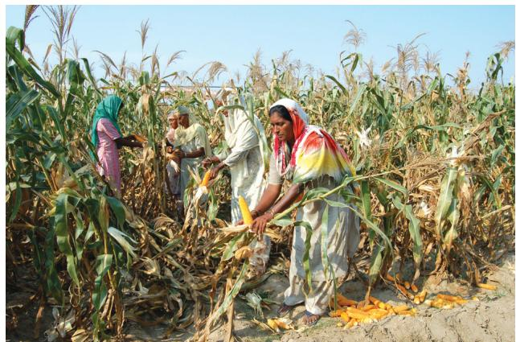  
Fig. 4.7: Maize Cultivation

  
India: Distribution of Wheat

These are the major source of protein in a vegetarian diet. Major pulses that are grown in India are tur (arhar), urad, moong, masur, peas and gram. Can you distinguish which of these pulses are grown in the kharif season and which are grown in the rabi season? Pulses need less moisture and survive even in dry conditions. Being leguminous crops, all these crops except arhar help in restoring soil fertility by fixing nitrogen from the air. Therefore, these are mostly grown in rotation with other crops. Major pulse producing states in India are Madhya Pradesh, Rajasthan, Maharashtra, Uttar Pradesh and Karnataka.

## Food Crops other than Grains

Sugarcane: It is a tropical as well as a subtropical crop. It grows well in hot and humid climate with a temperature of $2 1 ^ { \circ } \mathrm { C }$ to $2 7 ^ { \circ } \mathrm { C }$ and an annual rainfall between 75cm. and $1 0 0 \mathrm { c m }$ . Irrigation is required in the regions of low rainfall. It can be grown on a variety of soils and needs manual labour from sowing to harvesting. India is the second largest producer of sugarcane only after

  
Fig. 4.8: Sugarcane Cultivation

Brazil. It is the main source of sugar, gur (jaggary), khandsari and molasses. The major sugarcane-producing states are Uttar Pradesh, Maharashtra, Karnataka, Tamil Nadu, Andhra Pradesh, Telangana, Bihar, Punjab and Haryana.

Oil Seeds: In 2018 India was the second largest producer of groundnut in the world after China. In rapeseed production India was third largest producer in the world after Canada and China in 2018. Different oil seeds are grown covering approximately 12 per cent of the total cropped area of the country. Main oil-seeds produced in India are groundnut, mustard, coconut, sesamum (til), soyabean, castor seeds, cotton seeds, linseed and sunflower. Most of these are edible and used as cooking mediums. However, some of these are also used as raw material in the production of soap, cosmetics and ointments.

Groundnut is a kharif crop and accounts for about half of the major oilseeds produced in the country. Gujarat was the largest producer of groundnut followed by Rajasthan and Tamil Nadu in 2019–20. Linseed and mustard are rabi crops. Sesamum is a kharif crop in north and rabi crop in south India. Castor seed is grown both as rabi and kharif crop.

Tea: Tea cultivation is an example of plantation agriculture. It is also an important beverage crop introduced in India initially by the British. Today, most of the tea plantations are owned by Indians. The tea plant grows well in tropical and sub-tropical climates endowed with deep and fertile well-drained soil, rich in humus and organic matter. Tea bushes require warm and moist frost-free climate all through the year. Frequent showers evenly distributed over the year ensure

  
Fig. 4.9: Groundnut, sunflower and mustard are ready to be harvested in the field

continuous growth of tender leaves. Tea is a l a b o u r - i n t e n s i v e industry. It requires abundant, cheap and skilled labour. Tea is processed within the tea garden to restore its freshness. Major teaproducing states are Assam, hills of Darjeeling and Jalpaiguri districts,

West Bengal, Tamil Nadu and Kerala. Apart from these, Himachal Pradesh, Uttarakhand, Meghalaya, Andhra Pradesh and Tripura are also tea-producing states in the country. In 2018 India was the second largest producer of tea after China.

Coffee: Indian coffee is known in the world for its good quality. The Arabica variety initially brought from Yemen is produced in the country. This variety is in great demand all over the world. Initially its cultivation was introduced on the Baba Budan Hills and even today its cultivation is confined to the Nilgiri in Karnataka, Kerala and Tamil Nadu.

  
Fig. 4.10: Tea Cultivation

  
Fig. 4.11: Tea-leaves Harvesting

Horticulture Crops: In 2018, India was the second largest producer of fruits and vegetables in the world after China. India is a producer of tropical as well as temperate fruits. Mangoes of Maharashtra, Andhra Pradesh, Telangana, Uttar Pradesh and West Bengal, oranges of Nagpur and Cherrapunjee (Meghalaya), bananas of Kerala, Mizoram, Maharashtra and Tamil Nadu, lichi and guava of Uttar Pradesh and Bihar, pineapples of Meghalaya, grapes of Andhra Pradesh, Telangana and Maharashtra, apples, pears, apricots and walnuts of Jammu and Kashmir and Himachal Pradesh are in great demand the world over.

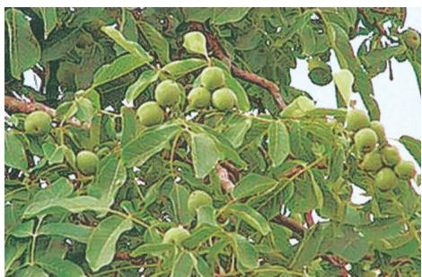

  
Fig. 4.12: ·Apricots, apple and pomegranate

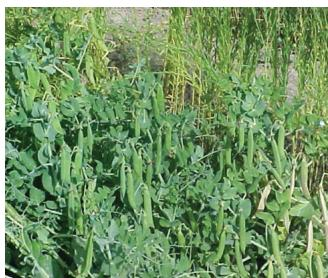

  
Fig. 4.13: Cultivation of vegetables - peas, cauliflower, tomato and brinjal

Source: Pocket book of agricultural statistics,2020,Govt.ofIndia.Directorate ofEconomics and Statistics.

India is an important producer of pea, cauliflower, onion, cabbage, tomato, brinjal and potato.

## Non-Food Crops

Rubber: It is an equatorial crop,but under special conditions, it is also grown in tropical and sub-tropical areas. It requires moist and humid climate with rainfall of more than 200 cm. and temperature above $2 5 \mathrm { { ^ \circ C } }$ .

Rubber is an important industrial raw material. It is mainly grown in Kerala, Tamil Nadu, Karnataka and Andaman and Nicobar islands and Garo hills of Meghalaya.

## 

List the items which are made of rubber and are used by us.

Fibre Crops: Cotton, jute, hemp and natural silk are the four major fibre crops grown in India. The first three are derived from the crops grown in the soil, the latter is obtained from cocoons of the silkworms fed on green leaves specially mulberry. Rearing of silk worms for the production of silk fibre is known as sericulture.

Cotton: India is believed to be the original home of the cotton plant. Cotton is one of the main raw materials for cotton textile industry. In 2017, India was second largest producer of cotton after China. Cotton grows well in drier parts of the black cotton soil of the Deccan plateau. It requires high temperature, light rainfall or irrigation, 210 frost-free days and bright sun-shine for its growth. It is a kharif crop and requires 6 to 8 months to mature. Major cotton-producing states are– Maharashtra, Gujarat, Madhya Pradesh,

  
Fig. 4. 14: Cotton Cultivation

Karnataka, Andhra Pradesh, Telangana, Tamil Nadu, Punjab, Haryana and Uttar Pradesh.

Jute: It is known as the golden fibre.Jute grows well on well-drained fertile soils in the flood plains where soils are renewed every year. High temperature is required during the time of growth. West Bengal, Bihar, Assam, Odisha and Meghalaya are the major jute producing states. It is used in making gunny bags, mats, ropes, yarn, carpets and other artefacts. Due to its high cost, it is losing market to synthetic fibres and packing materials, particularly the nylon.

## Technological and Institutional Reforms

It was mentioned in the previous pages that agriculture has been practised in India for thousands of years. Sustained uses of land without compatible techno-institutional changes have hindered the pace of agricultural development. Inspite of development of sources of irrigation most of the farmers in large parts of the country still depend upon monsoon and natural fertility in order to carry on their agriculture. For a growing population, this poses a serious challenge. Agriculture which provides livelihood for more than 60 per cent of its population, needs some serious technical and institutional reforms. Thus, collectivisation, consolidation of holdings, cooperation and abolition of zamindari, etc. were given priority to bring about institutional reforms in the country after Independence. ‘Land reform’ was the main focus of our First Five Year Plan. The right of inheritance had already lead to fragmentation of land holdings necessitating consolidation of holdings.

The laws of land reforms were enacted but the implementation was lacking or lukewarm. The Government of India embarked upon introducing agricultural reforms to improve Indian agriculture in the 1960s and 1970s. The Green Revolution based on the use of package technology and the White Revolution (Operation Flood) were some of the strategies initiated to improve the lot of Indian agriculture. But, this too led to the concentration of development in few selected areas. Therefore, in the 1980s and 1990s, a comprehensive land development programme was initiated, which included both institutional and technical

  
Fig. 4.15: Modern technological equipments used in agriculture

reforms. Provision for crop insurance against drought, flood, cyclone, fire and disease, establishment of Grameen banks, cooperative societies and banks for providing loan facilities to the farmers at lower rates of interest were some important steps in this direction.

Kissan Credit Card (KCC), Personal Accident Insurance Scheme (PAIS) are some other schemes introduced by the Government of India for the benefit of the farmers. Moreover, special weather bulletins and agricultural programmes for farmers were introduced on the radio and television. The government also announces minimum support price, remunerative and procurement prices for important crops to check the exploitation of farmers by speculators and middlemen.

## 

Collect information about agriculture, horticulture, agricultural schemes, etc. from Farmers’ Portal website https://farmer. gov.in/FarmerHome.aspx. Discuss about the benefits of the information available on the portal.

## Bhoodan – Gramdan

Mahatma Gandhi declared Vinoba Bhave as his spiritual heir. He also participated in

Satyagraha as one of the foremost satyagrahis. He was one of the votaries of Gandhi’s concept of gram swarajya. After Gandhiji’s martyrdom, Vinoba Bhave undertook padyatra to spread Gandhiji’s message covered almost the entire country. Once, when he was delivering a lecture at Pochampalli in Andhra Pradesh, some poor landless villagers demanded some land for their economic well-being. Vinoba Bhave could not promise it to them immediately but assured them to talk to the Government of India regarding provision of land for them if they undertook cooperative farming.

Suddenly, Shri Ram Chandra Reddy stood up and offered 80 acres of land to be distributed among 80 land-less villagers. This act was known as ‘Bhoodan’. Later he travelled and introduced his ideas widely all over India. Some zamindars, owners of many villages offered to distribute some villages among the landless. It was known as Gramdan. However, many land-owners chose to provide some part of their land to the poor farmers due to the fear of land ceiling act. This Bhoodan-Gramdan movement initiated by Vinoba Bhave is also known as the Blood-less Revolution.

1 . Multiple choice questions.

(i) Which one of the following describes a system of agriculture where a single crop is grown on a large area?

(a) Shifting Agriculture   
(b) Plantation Agriculture   
(c) Horticulture   
(d) Intensive Agriculture

(ii) Which one of the following is a rabi crop?

(a) Rice   
(b) Gram   
(c) Millets   
(d) Cotton

(iii) Which one of the following is a leguminous crop?

(a) Pulses   
(b) Jawar   
(c) Millets   
(d) Sesamum

2 . Answer the following questions in 30 words.

(i) Name one important beverage crop and specify the geographical conditions required for its growth.   
(ii) Name one staple crop of India and the regions where it is produced.   
(iii) Enlist the various institutional reform programmes introduced by the government in the interest of farmers.

3. Answer the following questions in about 120 words.

(i) Suggest the initiative taken by the government to ensure the increase in agricultural production.   
(ii) Describe the geographical conditions required for the growth of rice.

## PROJECT WORK

1 . Group discussion on the necessity of literacy among farmers.   
2 . On an outline map of India show wheat producing areas.

### ACTIVITY

Solve the puzzle by following your search horizontally and vertically to find the hidden answers.

<table><tr><td>A</td><td>Z</td><td>M</td><td>X</td><td>N</td><td>C</td><td>B</td><td>V</td><td>N</td><td>X</td><td>A</td><td>H</td><td>D</td><td>Q</td></tr><tr><td>S</td><td>D</td><td>E</td><td>W</td><td>S</td><td>R</td><td>J</td><td>D</td><td>Q</td><td>J</td><td>Z</td><td>V</td><td>R</td><td>E</td></tr><tr><td>D</td><td>K</td><td>H</td><td>A</td><td>R</td><td>I</td><td>F</td><td>G</td><td>W</td><td>F</td><td>M</td><td>R</td><td>F</td><td>W</td></tr><tr><td>F</td><td>N</td><td>L</td><td>R</td><td>G</td><td>C</td><td>H</td><td>H</td><td>R</td><td>S</td><td>B</td><td>S</td><td>V</td><td>T</td></tr><tr><td>G</td><td>B</td><td>C</td><td>W</td><td>H</td><td>E</td><td>A</td><td>T</td><td>Y</td><td>A</td><td>C</td><td>H</td><td>B</td><td>R</td></tr><tr><td>H</td><td>R</td><td>T</td><td>K</td><td>A</td><td>S</td><td>S</td><td>E</td><td>P</td><td>H</td><td>X</td><td>A</td><td>N</td><td>W</td></tr><tr><td>J</td><td>I</td><td>E</td><td>S</td><td>J</td><td>O</td><td>W</td><td>A</td><td>R</td><td>J</td><td>Z</td><td>H</td><td>D</td><td>T</td></tr><tr><td>K</td><td>C</td><td>L</td><td>A</td><td>E</td><td>G</td><td>A</td><td>C</td><td>O</td><td>F</td><td>F</td><td>E</td><td>E</td><td>Y</td></tr><tr><td>L</td><td>T</td><td>E</td><td>F</td><td>Y</td><td>M</td><td>T</td><td>A</td><td>T</td><td>S</td><td>S</td><td>R</td><td>G</td><td>I</td></tr><tr><td>P</td><td>D</td><td>E</td><td>J</td><td>O</td><td>U</td><td>Y</td><td>V</td><td>E</td><td>J</td><td>G</td><td>F</td><td>A</td><td>U</td></tr><tr><td>O</td><td>U</td><td>M</td><td>H</td><td>Q</td><td>S</td><td>U</td><td>D</td><td>I</td><td>T</td><td>S</td><td>W</td><td>S</td><td>P</td></tr><tr><td>U</td><td>O</td><td>A</td><td>C</td><td>O</td><td>T</td><td>T</td><td>O</td><td>N</td><td>E</td><td>A</td><td>H</td><td>F</td><td>O</td></tr><tr><td>Y</td><td>O</td><td>L</td><td>F</td><td>L</td><td>U</td><td>S</td><td>R</td><td>Q</td><td>Q</td><td>D</td><td>T</td><td>W</td><td>I</td></tr><tr><td>T</td><td>M</td><td>U</td><td>A</td><td>H</td><td>R</td><td>G</td><td>Y</td><td>K</td><td>T</td><td>R</td><td>A</td><td>B</td><td>F</td></tr><tr><td>E</td><td>A</td><td>K</td><td>D</td><td>G</td><td>D</td><td>Q</td><td>H</td><td>S</td><td>U</td><td>O</td><td>I</td><td>W</td><td>H</td></tr><tr><td>W</td><td>Q</td><td>Z</td><td>C</td><td>X</td><td>V</td><td>B</td><td>N</td><td>M</td><td>K</td><td>J</td><td>A</td><td>S</td><td>L</td></tr></table>

1 . The two staple food crops of India.   
2 . This is the summer cropping season of India.   
3 . Pulses like arhar, moong, gram, urad contain…   
4 . It is a coarse grain.   
5 . The two important beverages in India are…   
6 . One of the four major fibers grown on black soils.

# Chapter 5
# MINERALS AND ENERGY RESOURCES

Haban comes to Guwahati with his father from a remote village.

He sees people getting into strange house like objects which move along the road. He also sees a “kitchen” dragging a number of house along with it. He is amazed and asked his father “Why don’t our houses move like the one we saw in Guwahati, Ba?”

Ba replies, “These are not houses, they are buses and trains. Unlike our houses these are not made of bricks and stones, metal like iron and alluminium are used in making these. They do not move on their own. They are driven by an engine which needs energy to work.”

We use different things in our daily life made from metal. Can you list a number of items used in your house made of metals. Where do these metals come from?

You have studied that the earth’s crust is made up of different minerals embedded in the rocks. Various metals are extracted from these minerals after proper refinement.

Minerals are an indispensable part of our lives. Almost everything we use, from a tiny pin to a towering building or a big ship, all are made from minerals. The railway lines and the tarmac (paving) of the roads, our implements and machinery too are made from minerals. Cars, buses, trains, aeroplanes are manufactured from minerals and run on power resources derived from the earth. Even the food that we eat contains minerals. In all stages of development, human beings have used minerals for their livelihood, decoration, festivities, religious and ceremonial rites.

## A bright smile from toothpaste and minerals

Toothpaste cleans your teeth. Abrasive minerals like silica, limestone, aluminium oxide and various phosphate minerals do the cleaning. Fluoride which is used to reduce cavities, comes from a mineral fluorite. Most toothpaste are made white with titanium oxide, which comes from minerals called rutile, ilmenite and anatase. The sparkle in some toothpastes comes from mica. The toothbrush and tube containing the paste are made of plastics from petroleum. Find out where these minerals are found?

Dig a little deeper and find out how many minerals are used to make a light bulb?

## All living things need minerals

Life processes cannot occur without minerals. Although our mineral intake represents only about 0.3 per cent of our total intake of nutrients, they are so potent and so important that without them we would not be able to utilise the other 99.7 per cent of foodstuffs.

Dig a little deeper and collect “Nutritional Facts” printed on food labels.

## What is a mineral?

Geologists define mineral as a “homogenous, natura lly occurring substance with a definable internal structure.” Minerals are found in varied forms in nature, ranging from the hardest diamond to the softest talc. Why are they so varied?

You have already learnt about rocks. Rocks are combinations of homogenous substances called minerals. Some rocks, for instance limestone, consist of a single mineral only, but majority of the rock consist of several minerals in varying proportions. Although, over 2000 minerals have been identified, only a few are abundantly found in most of the rocks.

A particular mineral that will be formed from a certain combination of elements depends upon the physical and chemical conditions under which the material forms. This, in turn, results in a wide range of colours, hardness, crystal forms, lustre and density that a particular mineral possesses. Geologists use these properties to classify the minerals.

## Study of Minerals by Geographers and Geologists

Geographers study minerals as part of the earth’s crust for a better understanding of landforms. The distribution of mineral resources and associated economic activities are of interest to geographers. A geologist, however, is interested in the formation of minerals, their age and physical and chemical composition.

However, for general and commercial purposes minerals can be classified as under.

## MODE OF OCCURRENCE OF MINERALS

## Where are these minerals found?

Minerals are usually found in “ores”. The term ore is used to describe an accumulation of any mineral mixed with other elements. The mineral content of the ore must be in

sufficient concentration to make its extraction commercially viable. The type of formation or structure in which they are found determines the relative ease with which mineral ores may be mined. This also determines the cost of extraction. It is, therefore, important for us to understand the main types of formations in which minerals occur.

Minerals generally occur in these forms:

(i) In igneous and metamorphic rocks minerals may occur in the cracks, crevices, faults or joints. The smaller occurrences are called veins and the larger are called lodes. In most cases, they are formed when minerals in liquid/ molten and gaseous forms are forced upward through cavities towards the earth’s surface. They cool and solidify as they rise. Major metallic minerals like tin, copper, zinc and lead etc. are obtained from veins and lodes.   
(ii) In sedimentary rocks a number of minerals occur in beds or layers. They have been formed as a result of deposition, accumulation and concentration in horizontal strata. Coal and some forms of iron ore have been concentrated as a result of long periods under great heat and pressure. Another group of sedimentary minerals include gypsum, potash salt and sodium salt. These are formed as a result of evaporation especially in arid regions.   
(iii) Another mode of formation involves the decomposition of surface rocks, and the removal of soluble constituents, leaving a residual mass of weathered materialmaterial containing ores. Bauxite is formed this way.

  
CLASSIFICATION OF MINERALS   
Fig. 5.1

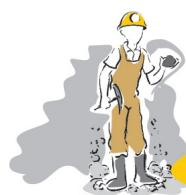

(iv)Certain minerals may occur as alluvial alluvial deposits in s deposits ands of valley floors and the base of hills. These deposits are called ‘placer deposits’ and generally contain minerals, which are not corroded by water. Gold, silver, tin and platinum are most important among such minerals.   
(v) The ocean waters contain vast quantities (v) of minerals, but most of these are too widely diffused to be of economic significance. However, common salt, magnesium and bromine are largely derived from ocean waters. The ocean beds, too, are rich in manganese nodules.

## Interesting Fact

Rat-Hole Mining. Do you know that most of the minerals in India are nationalised and their extraction is possible only after obtaining due permission from the government? But in most of the tribal areas of the north-east India, minerals are owned by individuals or communities. In Meghalaya, there are large deposits of coal, iron ore, limestone and dolomite etc. Coal mining in Jowai and Cherapunjee is done by family member in the form of a long narrow tunnel, known as ‘Rat hole’ mining. The National Green Tribunal has declared such activities illegal and recommended that these should be stopped forthwith.

## Dig a little deeper: What is the difference between an open pit mine, a quarry and an underground mine with shafts?

India is fortunate to have fairly rich and varied mineral resources. However, these are unevenly distributed. Broadly speaking, peninsular rocks contain most of the reserves of coal, metallic minerals, mica and many other non-metallic minerals. Sedimentary rocks on the western and eastern flanks of the peninsula, in Gujarat and Assam have most of the petroleum deposits. Rajasthan with the rock systems of the peninsula, has reserves of many

non-ferrous minerals. The vast alluvial plains of north India are almost devoid of economic minerals. These variations exist largely because of the differences in the geological structure, processes and time involved in the formation of minerals.

Let us now study the distribution of a few major minerals in India. Always remember that the concentration of mineral in the ore, the ease of extraction and closeness to the market play an important role in affecting the economic viability of a reserve. Thus, to meet the demand, a choice has to be made between a number of possible options. When this is done a mineral ‘deposit’ or ‘reserve’ turns into a mine.

## Ferrous Minerals

Ferrous minerals account for about threefourths of the total value of the production of metallic minerals. They provide a strong base for the development of metallurgical industries. India exports substantial quantities of ferrous minerals after meeting her internal demands.

## Iron Ore

Iron ore is the basic mineral and the backbone of industrial development. India is endowed with fairly abundant resources of iron ore. India is rich in good quality iron ores. Magnetite is the finest iron ore with a very high content of iron up to 70 per cent. It has excellent magnetic qualities, especially valuable in the electrical industry. Hematite ore is the most important industrial iron ore in terms of the quantity used, but has a slightly lower iron content than magnetite. (50-60 per cent). In 2018–19 almost entire production of iron ore $( 9 7 \% )$ accrued from Odisha, Chhattisgarh, Karnataka and Jharkhand. The remaining production $( 3 \% )$ was from other states.

## Do you know?

Kudre in Kannada means horse. The highest peak in the western ghats of Karnataka resembles the face of a horse. The Bailadila hills look like the hump of an ox, and hence its name.

  
Fig. 5.2: Iron ore mine

The major iron ore belts in India are:

Odisha-Jharkhand belt: In Odisha high grade hematite ore is found in Badampahar mines in the Mayurbhanj and Kendujhar districts. In the adjoining Singbhum district of Jharkhand haematite iron ore is mined in Gua and Noamundi.   
Durg-Bastar-Chandrapur belt lies in Chhattisgarh and Maharashtra. Very high grade hematites are found in the famous Bailadila range of hills in the Bastar district of Chhattisgarh. The range of hills comprise of 14 deposits of super high grade hematite iron ore. It has the best physical properties needed for steel making. Iron ore from these mines is exported to Japan and South Korea via Vishakhapatnam port.   
. Ballari-Chitradurga-Chikkamagaluru-Tumakuru belt in Karnataka has large reserves of iron ore. The Kudremukh mines located in the Western Ghats of Karnataka are a 100 per cent export unit. Kudremukh deposits are known to be one of the largest in the world. The ore is transported as slurry through a pipeline to a port near Mangaluru.   
. Maharashtra-Goa belt includes the state of Goa and Ratnagiri district of Maharashtra.

Though, the ores are not of very high quality, yet they are efficiently exploited. Iron ore is exported through Marmagao port.

## Manganese

Manganese is mainly used in the manufacturing of steel and ferro-manganese alloy. Nearly $1 0 \mathrm { k g }$ of manganese is required to manufacture one tonne of steel. It is also used in manufacturing bleaching powder, insecticides and paints.

  
Fig. 5.3: Production of Manganese showing state-wise share in per cent, 2018-19

Dig a little deeper: Superimpose the maps showing distribution of iron ore, manganese, coal and iron and steel industry. Do you see any correlation. Why?

## Non-Ferrous Minerals

India’s reserves and production of nonferrous minerals is not very satisfactory. However, these minerals, which include copper, bauxite, lead, zinc and gold play a vital role in a number of metallurgical, engineering and electrical industries. Let us study the distribution of copper and bauxite.

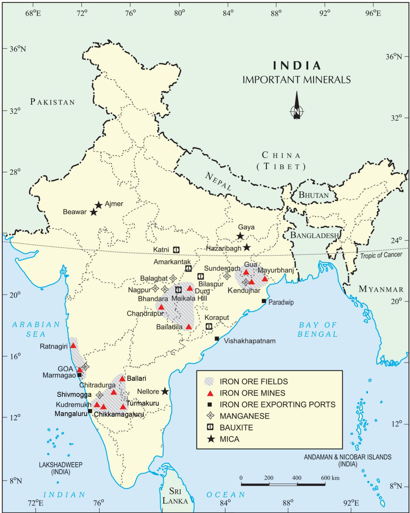  
India: Distribution of Iron Ore, Manganese, Bauxite and Mica

## Copper

India is critically deficient in the reserve and production of copper. Being malleable, ductile and a good conductor, copper is mainly used in electrical cables, electronics and chemical

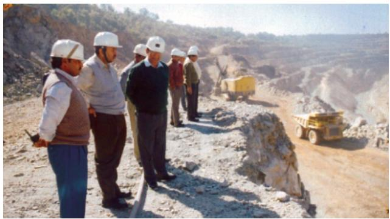  
Fig. 5.4: Copper mines at Malanjkhand

industries. The Balaghat mines in Madhya Pradesh, Khetri mines in Rajasthan and Singhbhum district of Jharkhand are leading producers of copper.

  
Fig. 5.5: Production of Bauxite showing state-wise share in per cent, 2018-19

in the Amarkantak plateau, Maikal hills and the plateau region of Bilaspur-Katni.

Odisha was the largest bauxite producing state in India in 2016-17. Panchpatmali

## Bauxite

Though, several ores contain aluminium, it is from bauxite, a clay-like substance that alumina and later aluminium is obtained. Bauxite deposits are formed by the decomposition of a wide variety of rocks rich i n aluminium silicates.

Aluminium is an important metal because it combines the strength of metals such as iron, with extreme lightness and also with good conductivity and great malleability.

  
Fig.5.6: Bauxite Mine

India’s bauxite deposits are mainly found

deposits in Koraput district are the most important bauxite deposits in the state.

## Interesting Fact

After the discovery of aluminium Emperor Napoleon III wore buttons and hooks on his clothes made of aluminium and served food to his more illustrious guests in aluminium utensils and the less honourable ones were served in gold and silver utensils. Thirty years after this incident aluminium bowls were most common with the beggars in Paris.

Dig a little deeper: Locate the mines of Bauxite on the physical map of India.

## Non-Metallic Minerals

Mica is a mineral made up of a series of plates or leaves. It splits easily into thin sheets. These sheets can be so thin that a thousand can be layered into a mica sheet of a few centimeters high. Mica can be clear, black, green, red yellow or brown. Due to its excellent di-electric strength, low power loss factor, insulating properties and resistance to high voltage, mica is one of the most indispensable minerals used in electric and electronic industries.

Mica deposits are found in the northern edge of the Chota Nagpur plateau. Koderma Gaya – Hazaribagh belt of Jharkhand is the leading producer.

In Rajasthan, the major mica producing area is around Ajmer. Nellore mica belt of Andhra Pradesh is also an important producer in the country.

## Rock Minerals

Limestone is found in association with rocks composed of calcium carbonates or calcium and magnesium carbonates. It is found in sedimentary rocks of most geological formations. Limestone is the basic raw material for the cement industry and

  
Fig. 5.7: Production of Limestone showing state-wise share in per cent, 2018-19

## Hazards of Mining

Have you ever wondered about the efforts the miners make in making life comfortable for you? What are the impacts of mining on the health of the miners and the environment?

The dust and noxious fumes inhaled by miners make them vulnerable to pulmonary diseases. The risk of collapsing mine roofs, inundation and fires in coalmines are a constant threat to miners.

The water sources in the region get contaminated due to mining. Dumping of waste and slurry leads to degradation of land, soil, and increase in stream and river pollution.

  
Fig. 5.8: Air pollution due to generation of dust in mining areas

## Jharia to be shifted

  
COAL FIRE CATASTROPHE

## Law Kumar Mishra I TNN

Dhanbad: The government hasdecided torelocateanen tire township-Jharia-because of the uncontrollable spread ofunderground fires that have been burning for years in the coal belt.

“The Centre has already sanctioned Rs 14 crore for the first phase of shifting." Claimingit tobeoneof the world's maior evacuation drives,Sorensaid the shifting would be done in three phasesin five vears and healsnas-

1990.According to the Rana panel,the cost of shifting people will beatRs20.000 crore. TheRanapanel had also said, TItisprofitabetsitpople fromJharia,since coal worth Rs60,000 crore is lying unutilised heneath the.Iharia

## Coal unit fined Rs 300 cr in damages

## Dhananjay Mahapatra | TNN

New Delhi: The Supreme Court has asked India's largest coal producingcompany-South Eastern Coalfields Ltd-to pay within a month Rs 300 crore as compensation forusing forest land in Chhattisgarh.This is in additiontoRs50crorealready paid by the PSU,which isa sub sidiary ofCoal IndiaLtd,tocon tinue its operationsinthe state.

SeCLwielhaoetiptyRs100 crore withinaweek and the rest withinamonth,the forestBench comprisingCJIYKSabharwal andJusticesArijitPasayatand SHKapadisAirectedonFridny Thecourt,initsearlierjudg ment.had said that all companieswereliabletopay Penal Compensatory Afforestation costand amountofNetPresent Value to continue operationsin forestland alreadyallottedto them by the states.

Appearing for the PSU,so licitorgeneralGEVahanvatiargued that the company had one of the best records forprotectionof environment and had wonawardsat thenationaland state level.He said the Rs50 crorealready deposited by the companywascompensation enough forittobeallowedcoal miningoperations.Appearing for theministry of environment and frests cniinsel AnN Ran

## ‘Over 50% of coal-belt mines unsafe'

## Law Kumar Mishra |TNN

Dhanbad: Three days after one of the worst miningdisasters in decades left 54 people dead,the chief of the company which owns these mines,said no less than half the mines in the area did not meet the basic safety standards.

Bharat Coking Coal Ltd (BCCL) chairmanPartho SBhattacharya,however,said onSaturdaythecompany shouldn'tbe blamed foroperatingunsafemines because workersand tradeunions had blocked movesto shut these for fear of losingjobs. He said only one out of 41 mines was operatedscientificallyandof therest,themany were functioningagainst theadvice of the DirectorateGeneralofMinesSafety.Hedescribed safety standards in 24minesaspoor. Bhattacharyasaidworkerswereaware that theywould have to seekvoluntary retirementif unsafe mineswere shut.

BharatCokingCoalmanagement onSaturdayalso handed overemploymentletters to the immediate people nominatedby families of victims.Ironically,thesepeople, most likely,would go to work in mines deemed unsafe by the company

BCCL'sauditof the safety status of mines,gradedsecondandthirddegrees,

  
WAIT AND WATcH: A crowd watches the ongoing rescue operation outside the BharatCoking Coal Ltd mineat Bhatdih in Jharkhand onThursday

## ‘Safety standards were not in place'

## Law Kumar Mishra |NN

Dhanbad: Union coal minister Shibu Soren on Thursdayannounced anex gratia of Rs 3 lakh tothe families of themine tragedy victims.Soren said: “Dependents of the victims will be provided employment by the BharatCokingCoalfromtody A probe by the director general ofminessafety and the labour commissionerwill also beinitiated."

Soren also held discussions with Bharat Coking Coal officialsand promised medical helptothe foursurvivors.

tained,even though the director general of mine safety carries out surveys of the safety norms,an expert said.

Some agitating miners alleged that“there is no emergency measures inside the mine.We go deep-between 400 feetand1,500ft-into the mineswith onlyan oxygen mask."The tragedy points to the lack of security measures byBharat Coking Coal despite previous instances of disasters due tomethane leak.

At least 48 people were killed in explosions in Jeetpur mine, 43in Sudamdeeh and 30 in

essential for smelting iron ore in the blast furnace.

Dig a little deeper: Study the maps to explain why Chota Nagpur is a storehouse of minerals.

Stricter safety regulations and implementation of environmental laws are essential to prevent mining from becoming a “killer industry”.

CONSERVATION OF MINERALS

We all appreciate the strong dependence of

industry and agriculture upon mineral deposits and the substances manufactured from them. The total volume of workable mineral deposits is an insignificant fraction i.e. one per cent of the earth’s crust. We are rapidly consuming mineral resources that required millions of years to be created and concentrated. The geological processes of mineral formation are so slow that the rates of replenishment are infinitely small in comparison to the present rates of consumption. Mineral resources are, therefore, finite and non-renewable. Rich

mineral deposits are our country’s extremely valuable but short-lived possessions. Continued extraction of ores leads to increasing costs as mineral extraction comes from greater depths along with decrease in quality.

A concerted effort has to be made in order to use our mineral resources in a planned and sustainable manner. Improved technologies need to be constantly evolved to allow use of low grade ores at low costs. Recycling of metals, using scrap metals and other substitutes are steps in conserving our mineral resources for the future.

## Dig a little deeper: Make a list of items where substitutes are being used instead of minerals. Where are these substitutes obtained from?

## Energy Resources

Energy is required for all activities. It is needed to cook, to provide light and heat, to propel vehicles and to drive machinery in industries.

Energy can be generated from fuel minerals like coal, petroleum, natural gas, uranium and from electricity. Energy resources can be classified as conventional and nonconventional sources. Conventional sources include: firewood, cattle dung cake, coal, petroleum, natural gas and electricity (both hydel and thermal). Non-conventional sources include solar, wind, tidal, geothermal, biogas and atomic energy. Firewood and cattle dung cake are most common in rural India. According to one estimate more than 70 per cent energy requirement in rural households is met by these two ; continuation of these is increasingly becoming difficult due to decreasing forest area. Moreover, using dung cake too is being discouraged because it consumes most valuable manure which could be used in agriculture.

## Conventional Sources of Energy

Coal: In India, coal is the most abundantly available fossil fuel. It provides a substantial part of the nation’s energy needs. It is used for power generation, to supply energy to industry as well as for domestic needs. India is highly

  
Fig. 5.9 (a): A view from inside of a coal mine

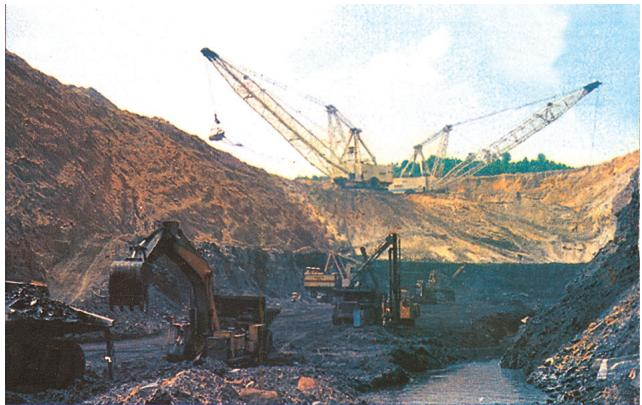  
Fig. 5.9 (b): A view from outside of a coal mine

dependent on coal for meeting its commercial energy requirements.

As you are already aware that coal is formed due the compression of plant material over millions of years. Coal, therefore, is found in a variety of forms depending on the degrees of compression and the depth and time of burial. Decaying plants in swamps produce peat. Which has a low carbon and high moisture contents and low heating capacity. Lignite is a low grade brown coal, which is soft with high moisture content. The principal lignite reserves are in Neyveli in Tamil Nadu and are used for generation of electricity. Coal that has been buried deep and subjected to increased temperatures is bituminous coal.bituminous It is the most popular coal in commercial use. Metallurgical coal is high grade bituminous coal which has a special value for smelting iron in blast furnaces. Anthracite is the highest quality hard coal.

  
India: Distribution of Coal, Oil and Natural Gas

In India coal occurs in rock series of two main geological ages, namely Gondwana, a little over 200 million years in age and in tertiary deposits which are only about 55 million years old. The major resources of Gondwana coal, which are metallurgical coal, are located in Damodar valley (West Bengal-Jharkhand). Jharia, Raniganj, Bokaro are important coalfields. The Godavari, Mahanadi, Son and Wardha valleys also contain coal deposits.

Tertiary coals occur in the north eastern states of Meghalaya, Assam, Arunachal Pradesh and Nagaland.

Remember coal is a bulky material, which loses weight on use as it is reduced to ash. Hence, heavy industries and thermal power stations are located on or near the coalfields.

## Petroleum

Petroleum or mineral oil is the next major energy source in India after coal. It provides fuel for heat and lighting, lubricants for machinery and raw materials for a number of manufacturing industries. Petroleum refineries act as a “nodal industry” for synthetic textile, fertiliser and numerous chemical industries.

Most of the petroleum occurrences in India are associated with anticlines and fault traps in the rock formations of the tertiary age. In regions of folding, anticlines or domes, it occurs where oil is trapped in the crest of the upfold. The oil bearing layer is a porous limestone or sandstone through which oil may flow. The oil is prevented from rising or sinking by intervening non-porous layers.

Petroleum is also found in fault traps between porous and non-porous rocks. Gas, being lighter usually occurs above the oil.

Mumbai High, Gujarat and Assam are major petroleum production areas in India. From the map locate the 3 major off shore fields of western India. Ankeleshwar is the most important field of Gujarat. Assam is the oldest oil producing state of India. Digboi, Naharkatiya and Moran-Hugrijan are the important oil fields in the state.

## Natural Gas

Natural Gas is found with petroleum deposits and is released when crude oil is brought to

the surface. It can be used as a domestic and industrial fuel. It is used as fuel in power sector to generate electricity, for heating purpose in industries, as raw material in chemical, petrochemical and fertilizer industries, as transport fuel and as cooking fuel. With the expansion of gas infrastructure and local city gas distribution (COD) networks, natural gas is also emerging as a preferred transport fuel (CNG) and cooking fuel (PNG) at homes. India’s major gas reserves are found in the Mumbai High and allied fields along the west coast which are supplemented by finds in the Cambay basin. Along the East Coast, new reserves of natural gas have been discovered in the Krishna-Godavari basin.

The first 1,700 km long Hazira-Vijaipur-Jagdishpur (HVJ) cross country gas pipeline, constructed by GAIL (India), linked Mumbai High and Bassein gas fields with various fertilizer, power and industrial complexes in western and northen India. This artery provided impetus to Indian gas market development. Overall, India’s gas infrastructure has expanded over ten times from $1 { , } 7 0 0 \ \mathrm { k m }$ to 18,500 km of cross-country pipelines and is expected to soon reach over 34, 000 km as Gas Grid by linking all gas sources and consuming markets across the country including North Eastern states.

## Electricity

Electricity has such a wide range of applications in today’s world that, its percapita

## 

Name some river valley projects and write the names of the dams built on these rivers.

consumption is considered as an index of development. Electricity is generated mainly in two ways: by running water which drives hydro turbines to generate hydro electricity; and by burning other fuels such as coal, petroleum and natural gas to drive turbines to produce thermal power Once generated the electricity is exactly the same.

  
India: Distribution of Nuclear and Thermal Power Plants

Hydro electricity is generated by fast flowing water, which is a renewable resource. India has a number of multi-purpose projects like the Bhakra Nangal, Damodar Valley corporation, the Kopili Hydel Project etc. producing hydroelectric power.

Thermal electricity is generated by using coal, petroleum and natural gas. The thermal power stations use non-renewable fossil fuels for generating electricity.

Collect information about thermal/hydel power plants located in your state. Show them on the map of India.

## Non-Conventional Sources of Energy

The growing consumption of energy has resulted in the country becoming increasingly dependent on fossil fuels such as coal, oil and gas. Rising prices of oil and gas and their potential shortages have raised uncertainties about the security of energy supply in future, which in turn has serious repercussions on the growth of the national economy. Moreover, increasing use of fossil fuels also causes serious environmental problems. Hence, there is a pressing need to use renewable energy sources like solar energy, wind, tide, biomass and energy from waste material. These are called non-conventional energy sources.

India is blessed with an abundance of sunlight, water, wind and biomass. It has the largest programmes for the development of these renewable energy resources.

## Nuclear or Atomic Energy

It is obtained by altering the structure of atoms. When such an alteration is made, much energy is released in the form of heat and this is used to generate electric power. Uranium and Thorium, which are available in Jharkhand and the Aravalli ranges of Rajasthan are used for generating atomic or nuclear power. The Monazite sands of Kerala is also rich in Thorium.

Locate the 6 nuclear power stations and find out the state in which they are located.

## Solar Energy

India is a tropical country. It has enormous

  
Fig. 5.1o: Solar operated electronic milk testing equipment

## 

Collect information about newly established solar power plants in India.

possibilities of tapping solar energy. Photovoltaic technology converts sunlight directly into electricity. Solar energy is fast becoming popular in rural and remote areas. Some big solar power plants are being established in different parts of India which will minimise the dependence of rural households on firewood and dung cakes, which in turn will contribute to environmental conservation and

  
Fig. 5.11: Wind mills - Nagarcoil

adequate supply of manure in agriculture.

## Wind power

India has great potential of wind power. The largest wind farm cluster is located in Tamil Nadu from Nagarcoil to Madurai. Apart from these, Andhra Pradesh, Karnataka, Gujarat, Kerala, Maharashtra and Lakshadweep have important wind farms. Nagarcoil and Jaisalmer are well known for effective use of wind energy in the country.

## Biogas

Shrubs, farm waste, animal and human waste are used to produce biogas for domestic consumption in rural areas. Decomposition of

  
Fig. 5.12: Biogas Plant

organic matter yields gas, which has higher thermal efficiency in comparison to kerosene, dung cake and charcoal. Biogas plants are set up at municipal, cooperative and individual levels. The plants using cattle dung are known as ‘Gobar gas plants’ in rural India. These provide twin benefits to the farmer in the form of energy and improved quality of manure. Biogas is by far the most efficient use of cattle dung. It improves the quality of manure and also prevents the loss of trees and manure due to burning of fuel wood and cow dung cakes.

## Tidal Energy

Oceanic tides can be used to generate electricity. Floodgate dams are built across inlets. During high tide water flows into the inlet and gets trapped when the gate is closed. After the tide falls outside the flood gate, the water retained by the floodgate flows back to the sea via a pipe that carries it through a power-generating turbine.

In India the Gulf of Khambhat, the Gulf of Kuchchh in Gujarat on the western coast and Gangetic delta in Sunderban regions of West Bengal provide ideal conditions for utilising tidal energy.

## Geo Thermal Energy

Geo thermal energy refers to the heat and electricity produced by using the heat from the interior of the Earth. Geothermal energy exists because, the Earth grows progressively hotter with increasing depth. Where the geothermal gradient is high, high temperatures are found at shallow depths. Groundwater in such areas absorbs heat from the rocks and becomes hot. It is so hot that when it rises to the earth’s surface, it turns into steam. This steam is used to drive turbines and generate electricity.

There are several hundred hot springs in India, which could be used to generate electricity. Two experimental projects have been set up in India to harness geothermal energy. One is located in the Parvati valley near Manikarn in Himachal Pradesh and the other is located in the Puga Valley, Ladakh.

## Conservation of Energy Resources

Energy is a basic requirement for economic development. Every sector of the national economy – agriculture, industry, transport, commercial and domestic – needs inputs of energy. The economic development plans implemented since Independence necessarily required increasing amounts of energy to remain operational. As a result, consumption of energy in all forms has been steadily rising all over the country.

In this background, there is an urgent need to develop a sustainable path of energy development. Promotion of energy conservation and increased use of renewable energy sources are the twin planks of sustainable energy.

India is presently one of the least energy efficient countries in the world. We have to adopt a cautious approach for the judicious use of our limited energy resources. For example, as concerned citizens we can do our bit by using public transport systems instead of individual vehicles; switching off electricity when not in use, using power-saving devices and using non-conventional sources of energy. After all, “energy saved is energy produced”.

1. Multiple choice questions.

(i) Which one of the following minerals is formed by decomposition of rocks, leaving a residual mass of weathered material?

(a) coal

(b) bauxite

(c) gold

(d) zinc

(ii) Koderma, in Jharkhand is the leading producer of which one of the following minerals?

(a) bauxite

(b) mica

(c) iron ore

(d) copper

(iii) Minerals are deposited and accumulated in the stratas of which of the following rocks?

(a) sedimentary rocks

(c) igneous rocks

(b) metamorphic rocks

(d) none of the above

(iv) Which one of the following minerals is contained in the Monazite sand?

(a) oil

(b) uranium

(c) thorium

(d) coal

2. Answer the following questions in about 30 words.

(i) Distinguish between the following in not more than 30 words.

(a) ferrous and non-ferrous minerals   
(b) conventional and non-conventional sources of energy

(ii) What is a mineral?   
(iii) How are minerals formed in igneous and metamorphic rocks?   
(iv) Why do we need to conserve mineral resources ?

3. Answer the following questions in about 120 words.

(i) Describe the distribution of coal in India.   
(ii) Why do you think that solar energy has a bright future in India?

### ACTIVITY

Fill the name of the correct mineral in the crossword below:

## ACROSS

1. A ferrous mineral (9)   
2. Raw material for cement industry (9)   
3. Finest iron ore with magnetic properties (9)   
4. Highest quality hard coal (10)   
5. Aluminium is obtained from this ore (7)   
6. Khetri mines are famous for this mineral (6)   
7. Formed due to evaporation (6)

## DOWN

1. Found in placer deposit (4)   
2. Iron ore mined in Bailadila (8)   
3. Indispensable for electrical industry (4)   
4. Geological Age of coal found in north east India (8)   
5. Formed in veins and lodes (3)

# Chapter 6
# MANUFACTURING INDUSTRIES

On the occassion of Diwali, Harish went to a market with his parents. They purchased shoes and clothes for him. His mother purchased utensils, sugar, tea and diyas (earthen lamps). Harish observed that the shops in the market were flooded with items for sale. He wondered how so many items could be made in such large quantities. His father explained that shoes, clothes, sugar etc. are manufactured by machines in large industries, some utensils are manufactured in small industries, while items like diyas are made by individual artisans in household industry.

Do you have some ideas about these industries?

Production of goods in large quantities after processing from raw materials to more valuable products is called manufacturing. Do you know that paper is manufactured from wood, sugar from sugarcane, iron and steel from iron ore and aluminium from bauxite? Do you also know that some types of clothes are manufactured from yarn which itself is an industrial product?

People employed in the secondary activities manufacture the primary materials into finished goods. The workers employed in steel factories, car, breweries, textile industries, bakeries etc. fall into this category. Some people are employed in providing services. In this chapter, we are mainly concerned with manufacturing industries which fall in the secondary sector.

The economic strength of a country is measured by the development of manufacturing industries.

## IMPORTANCE OF MANUFACTURING

Manufacturing sector is considered the backbone of development in general and economic development in particular mainly because–

Manufacturing industries not only help in modernising agriculture, which forms the backbone of our economy, they also reduce the heavy dependence of people on agricultural income by providing them jobs in secondary and tertiary sectors.   
• Industrial development is a precondition for eradication of unemployment and poverty from our country. This was the main philosophy behind public sector industries and joint sector ventures in India. It was also aimed at bringing down regional disparities by establishing industries in tribal and backward areas.   
• Export of manufactured goods expands trade and commerce, and brings in much needed foreign exchange.   
• Countries that transform their raw materials into a wide variety of finished goods of higher value are prosperous. India’s prosperity lies in increasing and diversifying its manufacturing industries as quickly as possible.

Agriculture and industry are not exclusive of each other. They move hand in hand. For instance, the agro-industries in India have given a major boost to agriculture by raising its productivity. They depend on the latter for raw materials and sell their products such as irrigation pumps, fertilisers, insecticides, pesticides, plastic and PVC pipes, machines and tools, etc. to the farmers. Thus, development and competitiveness of

manufacturing industry has not only assisted agriculturists in increasing their production but also made the production processes very efficient.

In the present day world of globalisation, our industry needs to be more efficient and competitive. Self-sufficiency alone is not enough. Our manufactured goods must be a t p a r i n q u a l i t y w i t h t h o s e i n t h e international market. Only then, will we be able to compete in the international market.

## Classification of Industries

List the various manufactured products you use in your daily life such as – transistors, electric bulbs, vegetable oil, cement, glassware, petrol, matches, scooters, automobiles, medicines and so on. If we classify the various industries based on a particular criterion then we would be able to understand their manufacturing better. Industries may be classified as follows:

On the basis of source of raw materials used:

• Agro based: cotton, woollen, jute, silk textile, rubber and sugar, tea, coffee, edible oil.   
• Mineral based: iron and steel, cement, aluminium, machine tools, petrochemicals.

According to their main role:

• Basic or key industries are those which supply their products as raw materials to manufacture other goods e.g. iron and steel and copper smelting, aluminum smelting.   
• Consumer industries that produce goods for direct use by consumers – sugar, toothpaste, paper, sewing machines, fans etc.

On the basis of capital investment:

• A small scale industry is defined with reference to the maximum investment

allowed on the assets of a unit. This limit has changed over a period of time. At present the maximum investment allowed is rupees one crore.

On the basis of ownership:

• Public sector, owned and operated by government agencies – BHEL, SAIL etc.   
• Private sector industries owned and operated by individuals or a group of individuals –TISCO, Bajaj Auto Ltd., Dabur Industries.   
• Joint sector industries which are jointly run by the state and individuals or a group of individuals. Oil India Ltd. (OIL) is jointly owned by public and private sector.   
Cooperative sector industries are owned and operated by the producers or suppliers of raw materials, workers or both. They pool in the resources and share the profits or losses proportionately. Such examples are the sugar industry in Maharashtra, the coir industry in Kerala.

Based on the bulk and weight of raw material and finished goods:

• Heavy industries such as iron and steel   
• Light industries that use light raw materials and produce light goods such as electrical goods industries.

## 

Classify the following into two groups on the basis of bulk and weight of raw material and finished goods.

(i) Oil

(vi) Sewing Machines

(ii) Knitting needles

(vii) Shipbuilding

(iii) Brassware

(viii) Electric Bulbs

(iv) Fuse wires

(ix) Paint brushes

(v) Watches

(x) Automobiles

## Agro-based Industries

Cotton, jute, silk, woollen textiles, sugar and edible oil, etc. industries are based on agricultural raw materials.

  
Flg. 6.1: Value addition in the textile industry

Textile Industry: The textile industry occupies unique position in the Indian economy, because it contributes significantly to industrial production, employment generation and foreign exchange earnings. It is the only industry in the country, which is self-reliant and complete in the value chain i.e., from raw material to the highest value added products.

Cotton Textiles: In ancient India, cotton textiles were produced with hand spinning and handloom weaving techniques. After the $1 8 ^ { \mathrm { t h } }$ century, power-looms came into use. Our traditional industries suffered a setback during the colonial period because they could not compete with the mill-made cloth from England.

• The first successful textile mill was established in Mumbai in 1854.   
• The two world wars were fought in Europe, India was a British colony. There was a demand for cloth in U.K. hence, they gave a boost to the development of the cotton textile industry.

In the early years, the cotton textile industry was concentrated in the cotton growing belt of Maharashtra and Gujarat. Availability of raw cotton, market, transport including accessible port facilities, labour, moist climate, etc. contributed towards its localisation. This industry has close links with agriculture and provides a living to farmers, cotton boll pluckers and workers engaged in ginning, spinning, weaving,

dyeing, designing, packaging, tailoring and sewing. The industry by creating demands supports many other industries, such as, chemicals and dyes, packaging materials and engineering works.

While spinning continues to be centralised in Maharashtra, Gujarat and Tamil Nadu, weaving is highly decentralised to provide scope for incorporating traditional skills and designs of weaving in cotton, silk, zari, embroidery, etc. India has world class production in spinning, but weaving supplies low quality of fabric as it cannot use much of the high quality yarn produced in the country. Weaving is done by handloom, powerloom and in mills.

The handspun khadi provides large scale employment to weavers in their homes as a cottage industry.

Why did Mahatma Gandhi lay emphasis on spinning yarn and weaving khadi?

Why is it important for our country to keep the mill sector loomage lower than power loom and handloom?

## Jute Textiles

India is the largest producer of raw jute and jute goods and stands at second place as an exporter after Bangladesh. Most of the mills are located in West Bengal, mainly along the banks of the Hugli river, in a narrow belt.

The first jute mill was set up near Kolkata in 1855 at Rishra. After Partition in 1947, the jute mills remained in India but three-fourth of the jute producing area went to Bangladesh (erstwhile East Pakistan).

  
India: Distribution of cotton, woollen and silk industries

Factors responsible for their location in the Hugli basin are: proximity of the jute producing areas, inexpensive water transport, supported by a good network of railways, roadways and waterways to facilitate movement of raw material to the mills, abundant water for processing raw jute, cheap labour from West Bengal and adjoining states of Bihar, Odisha and Uttar Pradesh. Kolkata as a large urban centre provides banking, insurance and port facilities for export of jute goods.

## Sugar Industry

India stands second as a world producer of sugar but occupies the first place in the production of gur and khandsari. The raw material used in this industry is bulky, and in haulage its sucrose content reduces. The mills are located in Uttar Pradesh, Bihar, Maharashtra, Karnataka, Tamil Nadu, Andhra Pradesh, Gujarat, Punjab, Haryana and Madhya Pradesh. Sixty per cent mills are in Uttar Pradesh and Bihar. This industry is seasonal in nature so, it is ideally suited to the cooperative sector. Can you explain why this is so?

In recent years, there is a tendency for the mills to shift and concentrate in the southern and western states, especially in Maharashtra, This is because the cane produced here has a higher sucrose content. The cooler climate also ensures a longer crushing season. Moreover, the cooperatives are more successful in these states.

## Mineral-based Industries

Industries that use minerals and metals as raw materials are called mineral-based industries. Can you name some industries that would fall in this category?

## Iron and Steel Industry

The iron and steel industry is the basic industry since all the other industries — heavy, medium and light, depend on it for their machinery. Steel is needed to manufacture a variety of engineering goods, construction material, defence, medical, telephonic, scientific equipment and a variety of consumer goods.

## 

Make a list of all such goods made of steel that you can think of.

Production and consumption of steel is often regarded as the index of a country’s development. Iron and steel is a heavy industry because all the raw materials as well as finished goods are heavy and bulky entailing heavy transportation costs. Iron ore, coking coal and lime stone are required in the ratio of approximately $4 : 2 : 1$ . Some quantities of manganese, are also required to harden the steel. Where should the steel plants be ideally located? Remember that the finished products also need an efficient transport network for their distribution to the markets and consumers.

  
Processes of Manufacture of SteelProcesses of of Steel

  
India: Iron and Steel Plants

Chhotanagpur plateau region has the maximum concentration of iron and steel industries. It is largely, because of the relative advantages this region has for the development of this industry. These include, low cost of iron ore, high grade raw materials in proximity, cheap labour and vast growth potential in the home market.

## Aluminium Smelting

Aluminium smelting is the second most important metallurgical industry in India. It is light, resistant to corrosion, a good conductor of heat, malleable and becomes strong when it is mixed with other metals. It is used to manufacture aircraft, utensils and wires. It has gained popularity as a substitute of steel, copper, zinc and lead in a number of industries.

  
Fig. 6.3: Strip coasting mill at smelter of NALCO

Aluminium smelting plants in the country are located in Odisha, West Bengal, Kerala, Uttar Pradesh, Chhattisgarh, Maharashtra and Tamil Nadu.

Bauxite, the raw material used in the smelters is a very bulky, dark reddish coloured rock. The flow chart given below shows the process of manufacturing aluminium. Regular supply of electricity and an assured source of raw material at minimum cost are the two prime factors for location of the industry.

## Chemical Industries

The Chemical industry in India is fast growing and diversifying. It comprises both large and small scale manufacturing units. Rapid growth has been recorded in both inorganic and organic sectors. Inorganic chemicals include sulphuric acid (used to manufacture fertilizers, synthetic fibres, plastics, adhesives, paints, dyes stuffs), nitric acid, alkalies, soda ash (used to make glass, soaps and detergents, paper) and caustic soda. These industries are widely spread over the country.

## Why do you think it is so?

Organic chemicals include petrochemicals, which are used for manufacturing of synthetic fibers, synthetic rubber, plastics, dye-stuffs, drugs and pharmaceuticals. Organic chemical

4 to 6 tonnes of bauxite   2 tonnes of alumina 1 tonne of aluminium

  
FIg. 6.4   
Process of Manufacturing in Aluminium Industry   
Fig. 6.5

plants are located near oil refineries or petrochemical plants.

The chemical industry is its own largest consumer. Basic chemicals undergo processing to further produce other chemicals that are used for industrial application, agriculture or directly for consumer markets. Make a list of the products you are aware of.

## Fertilizer Industry

The fertilizer industry is centred around the production of nitrogenous fertilizers (mainly urea), phosphatic fertilizers and ammonium phosphate (DAP) and complex fertilizers which have a combination of nitrogen (N), phosphate (P), and potash (K). The third, i.e. potash is entirely imported as the country does not have any reserves of commercially usable potash or potassium compounds in any form.

After the Green Revolution the industry expanded to several other parts of the country. Gujarat, Tamil Nadu, Uttar Pradesh, Punjab and Kerala contribute towards half of the fertilizer production. Other significant producers are Andhra Pradesh, Odisha, Rajasthan, Bihar, Maharashtra, Assam, West Bengal, Goa, Delhi, Madhya Pradesh and Karnataka.

## Cement Industry

Cement is essential for construction activity such as building houses, factories, bridges, roads, airports, dams and for other commercial establishments. This industry requires bulky and heavy raw materials like limestone, silica and gypsum. Coal and electric power are needed apart from rail transportation.

## 

Where would it be economically viable to set up the cement manufacturing units?

The industry has strategically located plants in Gujarat that have suitable access to the market in the Gulf countries.

## 

Find out where the plants are located in other States of India. Find their names.

## Automobile Industry

Automobiles provide vehicle for quick transport of good services and passengers. Trucks, buses, cars, motor cycles, scooters, three-wheelers and multi-utility vehicles are manufactured in India at various centres. After the liberalisation, the coming in of new and contemporary models stimulated the demand for vehicles in the market, which led to the healthy growth of the industry including passenger cars, two and three-wheelers. The industry is located around Delhi, Gurugram, Mumbai, Pune, Chennai, Kolkata, Lucknow, Indore, Hyderabad, Jamshedpur and Bengaluru.

## Information Technology and Electronics Industry

The electronics industry covers a wide range of products from transistor sets to television, telephones, cellular telecom, telephone exchange, radars, computers and many other equipments required by the telecommunication industry. Bengaluru has emerged as the electronic capital of India. Other important centres for electronic goods are Mumbai, Delhi, Hyderabad, Pune, Chennai, Kolkata, Lucknow and Coimbatore. The major industry concentration is at Bengaluru, Noida, Mumbai, Chennai, Hyderabad and Pune. A major impact of this industry has been on employment generation. The continuing growth in the hardware and software is the key to the success of IT industry in India.

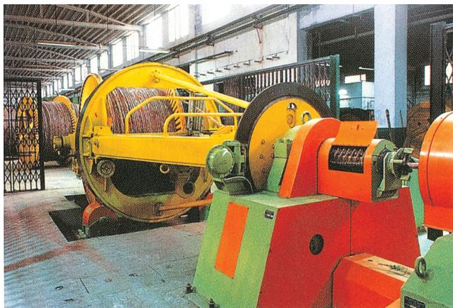  
Fig. 6.6: Cable manufacturing facilities at HCL, Rupnarainpur (West Bengal)

Industrial Pollution and EnvironmentalIndustrial Degradation

Although industries contribute significantly to India’s economic growth and development, the increase in pollution of land, water, air, noise and resulting degradation of environment that they have caused, cannot be overlooked. Industries are responsible for four types of pollution: (a) Air (b) Water (c) Land (d) Noise. The polluting industries also include thermal power plants.

Air pollution is caused by the presence of high proportion of undesirable gases, such as sulphur dioxide and carbon monoxide. Airborne particulate materials contain both solid and liquid particles like dust, sprays mist and smoke. Smoke is emitted by chemical and paper factories, brick kilns, refineries and smelting plants, and burning of fossil fuels in big and small factories that ignore pollution norms. Toxic gas leaks can be very hazardous with long-term effects. Are you aware of the Bhopal Gas tragedy that occurred? Air pollution adversely affects human health, animals, plants, buildings and the atmosphere as a whole.

Water pollution is caused by organic and inorganic industrial wastes and affluents discharged into rivers. The main culprits in this regard are paper, pulp, chemical, textile and dyeing, petroleum refineries, tanneries and electroplating industries that let out dyes, detergents, acids, salts and heavy metals like lead and mercury pesticides, fertilisers, synthetic chemicals with carbon, plastics and rubber, etc. into the water bodies. Fly ash, phospo- gypsum and iron and steel slags are the major solid wastes in India.

Thermal pollution of water occurs when hot water from factories and thermal plants is drained into rivers and ponds before cooling. What would be the effect on aquatic life?

Wastes from nuclear power plants, nuclear and weapon production facilities cause cancers, birth defects and miscarriages. Soil iand and water pollution are closely related.

Dumping of wastes specially glass, harmful chemicals, industrial effluents, packaging, salts and garbage renders the soil useless. Rain water percolates to the soil carrying the pollutants to the ground and the ground water also gets contaminated.

Noise pollution not only results in irritation and anger, it can also cause hearing impairment, increased heart rate and blood pressure among other physiological effects. Unwanted sound is an irritant and a source of stress. Industrial and construction activities, machinery, factory equipment, generators, saws and pneumatic and electric drills also make a lot of noise.

## Control of Environmental Degradation

Every litre of waste water discharged by our industry pollutes eight times the quantity of freshwater. How can the industrial pollution of fresh water be reduced? Some suggestions are-

(i) minimising use water for processing by reusing and recycling it in two or more successive stages   
(ii) harvesting of rainwater to meet water requirements   
(iii) treating hot water and effluents before releasing them in rivers and ponds. Treatment of industrial effluents can be done in three phases   
(a) Primary treatment by mechanical means. This involves screening, grinding, flocculation and sedimentation.   
(b) Secondary treatment by biological process   
(c) Tertiary treatment by biological, chemical and physical processes. This involves recycling of wastewater.

Overdrawing of ground water reserves by industry where there is a threat to ground water resources also needs to be regulated legally. Particulate matter in the air can be reduced by fitting smoke stacks to factories with electrostatic precipitators, fabric filters, scrubbers and inertial separators. Smoke can be reduced by using oil or gas instead

  
India: Some Software Technology Parks

of coal in factories. Machinery and equipment can be used and generators should be fitted with silencers. Almost all machinery can be redesigned to increase energy efficiency and reduce noise. Noise absorbing material may be used apart from personal use of earplugs and earphones.

The challenge of sustainable development requires integration of economic development with environmental concerns.

  
Fig. 6.7: Sewage Treatment plant under Yamuna actionplanatFaridabad

## NTPC shows the way

NTPC is a major power providing corporation in India. It has ISO certification for EMS (Environment Management System) 14001. The corporation has a proactive approach for preserving the natural environment and resources like water, oil and gas and fuels in places where it is setting up power plants. This has been possible through-

(a) Optimum utilisation of equipment adopting latest techniques and upgrading existing equipment.   
(b) Minimising waste generation by maximising ash utilisation.   
(c) Providing green belts for nurturing ecological balance and addressing the question of special purpose vehicles for afforestation.   
(d) Reducing environmental pollution through ash pond management, ash water recycling system and liquid waste management.   
(e) Ecological monitoring, reviews and online database management for all its power stations.

  
Fig. 6.8: Ramagundam plant

## EXERCISES EXERCISES EXERCISES EXERCISES EXERCISES

1 . Multiple choice questions.

(i) Which one of the following industries uses bauxite as a raw material?

(a) Aluminium Smelting

(b) Cement

(c) Paper

(d) Steel

(ii) Which one of the following industries manufactures telephones, computer, etc.

(a) Steel

(c) Aluminium Smelting

(b) Electronic

(d) Information Technology

2 . Answer the following briefly in not more than 30 words.

(i) What is manufacturing?   
(ii) What are basic industries? Give an example.

3 . Write the answers of the following questions in 120 words.

(i) How do industries pollute the environment?   
(ii) Discuss the steps to be taken to minimise environmental degradation by industry?

### ACTIVITY

Give one word for each of the following with regard to industry. The number of letters in each word are hinted in brackets.

(i) Used to drive machinery

(5) P...

(ii) People who work in a factory

(6) W...

(iii) Where the product is sold

(6) M...

(iv) A person who sells goods

(8) R..

(v) Thing produced

(7) P...

(vi) To make or produce

(11) M..

(vii) Land, Water and Air degraded

(9) P...

## PROJECT WORK

Select one agro-based and one mineral-based industry in your area.

(i) What are the raw materials they use?   
(ii) What are the other inputs in the process of manufacturing that involve transportation cost?   
(iii) Are these factories following environmental norms?

### ACTIVITY

Solve the puzzle by following your search horizontally and vertically to find the hidden answers.

1 . Textiles, sugar, vegetable oil and plantation industries deriving raw materials from agriculture are called…   
2 . The basic raw material for sugar industry.   
3 . This fibre is also known as the ‘Golden Fibre’.   
4 . Iron-ore, coking coal, and limestone are the chief raw materials of this industry.   
5 . A public sector steel plant located in Chhattisgarh.   
6 . Railway diesel engines are manufactured in Uttar Pradesh at this place.

<table><tr><td>G</td><td>G</td><td>G</td><td>P</td><td>V</td><td>A</td><td>R</td><td>A</td><td>N</td><td>A</td><td>S</td><td>I</td></tr><tr><td>U</td><td>O</td><td>J</td><td>I</td><td>P</td><td>G</td><td>X</td><td>K</td><td>M</td><td>Q</td><td>W</td><td>V</td></tr><tr><td>K</td><td>S</td><td>U</td><td>G</td><td>A</td><td>R</td><td>C</td><td>A</td><td>N</td><td>E</td><td>E</td><td>N</td></tr><tr><td>O</td><td>T</td><td>T</td><td>O</td><td>N</td><td>O</td><td>Z</td><td>V</td><td>O</td><td>P</td><td>T</td><td>R</td></tr><tr><td>A</td><td>U</td><td>E</td><td>L</td><td>U</td><td>B</td><td>H</td><td>I</td><td>L</td><td>A</td><td>I</td><td>U</td></tr><tr><td>T</td><td>K</td><td>O</td><td>C</td><td>R</td><td>A</td><td>Q</td><td>N</td><td>T</td><td>R</td><td>L</td><td>N</td></tr><tr><td>E</td><td>I</td><td>R</td><td>O</td><td>N</td><td>S</td><td>T</td><td>E</td><td>E</td><td>L</td><td>S</td><td>J</td></tr><tr><td>E</td><td>N</td><td>A</td><td>N</td><td>O</td><td>E</td><td>P</td><td>I</td><td>T</td><td>L</td><td>R</td><td>Y</td></tr><tr><td>G</td><td>A</td><td>N</td><td>U</td><td>J</td><td>D</td><td>R</td><td>A</td><td>G</td><td>D</td><td>T</td><td>A</td></tr><tr><td>N</td><td>T</td><td>A</td><td>R</td><td>P</td><td>O</td><td>A</td><td>P</td><td>U</td><td>E</td><td>P</td><td>Y</td></tr><tr><td>A</td><td>S</td><td>N</td><td>A</td><td>E</td><td>N</td><td>J</td><td>D</td><td>I</td><td>Y</td><td>S</td><td>K</td></tr><tr><td>S</td><td>M</td><td>H</td><td>V</td><td>L</td><td>I</td><td>A</td><td>J</td><td>H</td><td>S</td><td>K</td><td>G</td></tr></table>

# chapter 7
# LIFELINES OF NATIONAL ECONOMY

We use different materials and services in our daily life. Some of these are available in our immediate surroundings, while other requirements are met by bringing things from other places. Goods and services do not move from supply locales to demand locales on their own. The movement of these goods and services from their supply locations to demand locations necessitates the need for transport. Some people are engaged in facilitating these movements. These are known to be traders who make the products come to the consumers by transportation. Thus, the pace of development of a country depends upon the production of goods and services as well as their movement over space. Therefore, efficient means of transport are prerequisites for fast development.

Movement of these goods and services can be over three important domains of our earth i.e. land, water and air. Based on these, transport can also be classified into land, water and air transport.

the help of equally developed communication system. Therefore, transport, communication and trade are complementary to each other.

Today, India is well-linked with the rest of the world despite its vast size, diversity and linguistic and socio-cultural plurality. Railways, airways, waterways, newspapers, radio, television, cinema and internet, etc. have been contributing to its socio-economic progress in many ways. The trades from local to international levels have added to the vitality of its economy. It has enriched our life and added substantially to growing amenities and facilities for the comforts of life.

In this chapter, you will see how modern means of transport and communication serve as lifelines of our nation and its modern economy. It is thus, evident that a dense and efficient network of transport and communication is a prerequisite for local, national and global trade of today.

  
Fig. 7.1

For a long time, trade and transport were restricted to a limited space. With the development in science and technology, the area of influence of trade and transport expanded far and wide. Today, the world has been converted into a large village with the help ofe of efficient and fast moving transport. Tran sport has been able to achieve this with

## TRANSPORT

## Roadways

India has second largest road networks in the world, aggregating to about 62.16 lakh km (2020–21). In India, roadways have preceded railways. They still have an edge over railways in view of the ease with which they can be built

and maintained. The growing importance of road transport vis-à-vis rail transport is rooted in the following reasons; (a) construction cost of roads is much lower than that of railway lines, (b) roads can traverse comparatively more dissected and undulating topography, (c) roads can negotiate higher gradients of slopes and as such can traverse mountains such as the Himalayas, (d) road transport is economical in transportation of few persons and relatively smaller amount of goods over short distances, (e) it also provides doorto-door service, thus the cost of loading and unloading is much lower, (f) road transport is also used as a feeder to other modes of transport such as they provide a link between railway stations, air and sea ports.

In India, roads are classified in the following six classes according to their capacity. Look at the map of the National Highways and find out about the significant role played by these roads.

Golden Quadrilateral Super Highways: Golden Quadrilateral Super The government has launched a major road development project linking Delhi-Kolkata-Chennai-Mumbai and Delhi by six-lane Super Highways. The North-South corridors linking Srinagar (Jammu & Kashmir) and Kanniyakumari (Tamil Nadu), and East-West Corridor connecting Silchar (Assam) and Porbander (Gujarat) are part of this project. The major objective of these Super Highways is to reduce the time and distance between the mega cities of India. These highway projects are being implemented by the National Highway Authority of India (NHAI).   
National Highways: National  National Highways link extreme parts of the country. These are the primary road systems. A number of major National Highways run in North-South and East-West directions.   
State Highways: Roads linking a state capital with different district headquarters are known as State Highways.

  
Fig.7.2: Ahmedabad- Vadodara Expressway

## 

Collect information of National Highway numbers (old and new) from the website morth.nic.in/national-highway-details. The historical Sher-Shah Suri Marg between Delhi and Amritsar is known by which National Highway ?

District Roads:Roads: These roads connect the district headquarters with other places of the district.   
Other Roads:Other Roads: Rural roads, which link rural areas and villages with towns, are classified under this category. These roads received special impetus under the Pradhan Mantri Grameen Sadak Yojana. Under this scheme special provisions are made so that every village in the country is linked to a major town in the country by an all season motorable road.   
Border Roads:Border Apart from these, Border Roads Organisation a Government of India undertaking constructs and maintains roads in the bordering areas of the country. This organisation was established in 1960 for the development of the roads of strategic importance in the northern and north-eastern border areas. These roads have improved accessibility in areas of difficult terrain and have helped in the economic development of these area.

LIFELINES OF NATIONAL ECONOMY

  
India: National Highways

## Do you Know?

The World’s longest Highway tunnel-Atal Tunnel (9.02 Km) has been built by Border Road Organisation. This tunnel connects Manali to Lahul-Spiti valley throughout the year. Earlier the valley was cut off for about 6 months each year owing to heavy snowfall. The tunnel is buit with ultra-modern specifications in the Pir Panjal range of Himalayas at an altitude of 3000 metres from the Mean Sea Level (MSL).

Source: Source: Source: http://www.bro.gov.in/pagefimg. asp?imid=144,And PIBdelhi03October2020

  
Fig. 7.3: Hilly Tracts

  
FIg. 7.4: Trafic on north-eastern border road (Arunachal Pradesh)

Roads can also be classified on the basis of the type of material used for their construction such as metalled and unmetalled roads. Metalled roads may be made of cement, concrete or even bitumen of coal, therefore,

and narrow. However, in recent years fast development of road network has taken place in different parts of the country

## Railways

Railways are the principal mode of transportation for freight and passengers in India. Railways also make it possible for people to conduct multifarious activities like business, sightseeing, pilgrimage along with transportation of goods over longer distances. Apart from an important means of transport the Indian Railways have been a great integrating force for more than 150 years. Railways in India bind the economic life of the country as well as accelerate the development of the industry and agriculture.

The Indian Railways is the largest public sector undertaking in the country. The first train steamed off from Mumbai to Thane in 1853, covering a distance of 34 km.

The Indian Railway is now reorganised into 16 zones.

## 

Find out the current Railway zones and their headquarters. Also locate the headquarters of Railway zones on the map of India.

The distribution pattern of the Railway network in the country has been largely influenced by physiographic, economic and administrative factors. The northern plains with their vast level land, high population density and rich agricultural resources provided the most favourable condition for their growth. However, a large number of rivers requiring construction of bridges across their wide beds posed some obstacles. In the hilly terrains of the peninsular region, railway tracts are laid through low hills, gaps or tunnels. The Himalayan mountainous regions too are unfavourable for the construction of railway lines due to high relief, sparse population and lack of economic opportunities. Likewise, it was difficult to lay railway lines on

Table 7.1: India: Railway Track   
The Indian Railway network runs on multiple gauge operations extending over 67,956 km.   

<table><tr><td>Gauge in metres</td><td>Route (Km)</td></tr><tr><td>Broad Gauge (1.676)</td><td>63950</td></tr><tr><td>Metre Gauge (1.000)</td><td>2,402</td></tr><tr><td>Narrow Gauge (0.762 and 0.610)</td><td>1,604</td></tr><tr><td>Total</td><td>67,956</td></tr></table>

Source: Railway Yearbook 2019–20, Ministry of Railways, Government of India.   
Website: www.indianrailways.gov.in

the sandy plain of western Rajasthan, swamps of Gujarat, forested tracks of Madhya Pradesh, Chhattisgarh, Odisha and Jharkhand. The contiguous stretch of Sahyadri could be crossed only through gaps or passes (Ghats). In recent times, the development of the Konkan railway along the west coast has facilitated the movement of passengers and goods in this most important economic region of India. It has also faced a number of problem such as sinking of track in some stretches and landslides.

Today, the railways have become more important in our national economy than all other means of transport put together. However, rail transport suffers from certain problems as well. Many passengers travel without tickets. Thefts and damaging of railway property has not yet stopped completely. People stop the trains, pull the chain unnecessarily and this causes heavy damage to the railway. Think over it, how we can help our railway in running as per the scheduled time?

## Pipelines

Pipeline transport network is a new arrival on the transportation map of India. In the past, these were used to transport water to cities and industries. Now, these are used for transporting crude oil, petroleum products and natural gas from oil and natural gas fields to refineries, fertilizer factories and big thermal power plants. Solids can also be transported through a pipeline when converted into slurry. The far inland locations of refineries like Barauni, Mathura, Panipat and gas based fertilizer plants could be thought of only because of pipelines. Initial cost of laying pipelines is high but

subsequent running costs are minimal. It rules out trans-shipment losses or delays.

There are three important networks of pipeline transportation in the country.

From oil field in upper Assam to Kanpur (Uttar Pradesh), via Guwahati, Barauni and Allahabad. It has branches from Barauni to Haldia, via Rajbandh, Rajbandh to Maurigram and Guwahati to Siliguri.   
From Salaya in Gujarat to Jalandhar in Punjab, via Viramgam, Mathura, Delhi and Sonipat. It has branches to connect Koyali (near Vadodara, Gujarat) Chakshu and other places.   
The first $1 { , } 7 0 0 \ \mathrm { k m }$ long Hazira-Vijaipur-Jagdishpur (HVJ) cross country gas pipeline, linked Mumbai High and Bassein gas fields with various ferilizer, power and industrial complexes in western and northern India. Overall, India’s gas pipeline infrastructure has expanded from $1 { , } 7 0 0 \mathrm { k m }$ to 18,500 km of cross-country pipelines.

## Waterways

Since the ancient period, India was one of the seafaring countries. Its seamen sailed far and near, thus, carrying and spreading Indian commerce and culture. Waterways are the cheapest means of transport. They are most suitable for carrying heavy and bulky goods. It is a fuel-efficient and environment friendly mode of transport. India has inland navigation waterways of 14,500 km in length. Out of these only 5685 km are navigable by mechanised vessels. The following waterways have been declared as the National Waterways by the Government.

LIFELINES OF NATIONAL ECONOMY

  
Flg. 7.5: Inland waterways widely used in north-eastern states

• The Ganga river between Allahabad and Haldia (1620 km)-N.W. No.1   
• The Brahmaputra river between Sadiya and Dhubri (891 km)-N.W. No.2   
The West-Coast Canal in Kerala (Kottapurma-Kollam, Udyogamandal and Champakkara canals-205 km) – N.W. No.3   
Specified stretches of Godavari and Krishna rivers along with Kakinada Puducherry stretch of canals (1078 km) – N.W. No.4   
Specified stretches of river Brahmani along with Matai river, delta channels of Mahanadi and Brahmani rivers and East Coast Canal (588 km) – N.W. No.5

There are some other inland water ways on which substantial transportation takes place. These are Mandavi, Zuari and Cumberjua, Sunderbans, Barak and backwaters of Kerala.

Apart from these, India’s trade with foreign countries is carried from the ports located along the coast. 95 per cent of the country’s trade volume (68 per cent in terms of value) is moved by sea.

## Major Sea Ports

With a long coastline of $7 { , } 5 1 6 { . } 6 \mathrm { k m }$ , India is dotted with 12 major and 200 notified nonmajors (minor/intermediate) ports. These major ports handle 95 per cent of India’s foreign trade.

Kandla in Kuchchh was the first port developed soon after Independence to ease the volume of trade on the Mumbai port, in the wake of loss of Karachi port to Pakistan after the Partition. Kandla also known as the Deendayal Port, is a tidal port. It caters to the

convenient handling of exports and imports of highly productive granary and industrial belt stretching across UT of Jammu and Kashmir, and the states of Himachal Pradesh, Punjab, Haryana, Rajasthan and Gujarat.

  
Fig. 7.6: Trucks being driven into the vessel at Mumbai port

Mumbai is the biggest port with a spacious natural and well-sheltered harbour. The Jawaharlal Nehru port was planned with a view to decongest the Mumbai port and serve as a hub port for this region. Marmagao port (Goa) is the premier iron ore exporting port of the country. This port accounts for about fifty per cent of India’s iron ore export. New Mangalore port, located in Karnataka caters to the export of iron ore concentrates from Kudremukh mines. Kochchi is the extreme south-western port, located at the entrance of a lagoon with a natural harbour.

  
Fig. 7.7: Tanker discharging crude oil at New Mangalore port

Moving along the east coast, you would see the extreme south-eastern port of Tuticorin, in Tamil Nadu. This port has a natural harbour and rich hinterland. Thus, it has a flourishing trade handling of a large variety of cargoes to

even our neighbouring countries like Sri Lanka, Maldives, etc. and the coastal regions of India. Chennai is one of the oldest artificial ports of the country. It is ranked next to Mumbai in terms of the volume of trade and cargo. Vishakhapatnam is the deepest landlocked and well-protected port. This port was, originally, conceived as an outlet for iron ore exports. Paradwip port located in Odisha, specialises in the export of iron ore. Kolkata is an inland riverine port. This port serves a very large and rich hinterland of Ganga-Brahmaputra basin. Being a tidal port, it requires constant dredging of Hoogly. Haldia port was developed as a subsidiary port, in order to relieve growing pressure on the Kolkata port.

  
Fig. 7.8: Handling of oversize cargo at Tuticorin port

## Airways

The air travel, today, is the fastest, most comfortable and prestigious mode of transport. It can cover very difficult

  
Why is air travel preferred in the north-eastern states?   
FIg. 7.9

terrains like high mountains, dreary deserts, dense forests and also long oceanic stretches with great ease. Think of the north-eastern part of the country, marked with the presence of big rivers, dissected relief, dense forests and frequent floods and international frontiers, etc. in the absence of air transport. Air travel has made access easier.

Pawanhans Helicopters Ltd. provides helicopter services to Oil and Natural Gas Corporation in its off-shore operations, to inaccessible areas and difficult terrains like the north-eastern states and the interior parts of Jammu and Kashmir, Himachal Pradesh and Uttarakhand.

Air travel is not within the reach of the common people. It is only in the northeastern states that special provisions are made to extend the services to the common people.

## Communication

Ever since humans appeared on the earth, they have used different means of communication. But, the pace of change, has been rapid in modern times. Long distance communication is far easier without physical movement of the communicator or receiver. Personal communication and mass communication including television, radio, press, films, etc. are the major means of communication in the country. The Indian postal network is the largest in the world. It handles parcels as well as personal written communications. Cards and envelopes are considered first-class mail and are airlifted between stations covering both land and air. The second-class mail includes book packets, registered newspapers and periodicals. They are carried by surface mail, covering land and water transport. To facilitate quick delivery of mails in large towns and cities, six mail channels have been introduced recently. They are called Rajdhani Channel, Metro Channel, Green Channel, Business Channel, Bulk Mail Channel and Periodical Channel.

  
India: Major Ports and Some International Airports

## Do you know?

Digital India is an umbrella programme to prepare India for a knowledge based transformation. The focus of Digital India Programme is on being transformative to realise – IT (Indian Talent) $+ \mathrm { I T }$ (Information Technology) $\left| = \mathrm { I T } \right|$ (India Tomorrow) and is on making technology central to enabling change.

  
Fig.7.10 : Emergency call box on NH-8

India has one of the largest telecom networks in Asia. Excluding urban places more than two-thirds of the villages in India have already been covered with Subscriber Trunk Dialling (STD) telephone facility. In order to strengthen the flow of information from the grassroot to the higher level, the government has made special provision to extend twentyfour hours STD facility to every village in the country. There is a uniform rate of STD facilities all over India. It has been made possible by integrating the development in space technology with communication technology.

Mass communication provides entertainment and creates awareness among people about various national programmes and policies. It includes radio, television, newspapers, magazines, books and films. All India Radio (Akashwani) broadcasts a variety of programmes in national, regional and local languages for various categories of people, spread over different parts of the country. Doo rdarshan, the national television channel

of India, is one of the largest terrestrial networks in the world. It broadcasts a variety of programmes from entertainment, educational to sports, etc. for people of different age groups.

India publishes a large number of newspapers and periodicals annually. They are of different types depending upon their periodicity. Newspapers are published in about 100 languages and dialects. Did you know that the largest number of newspapers published in the country are in Hindi, followed by English and Urdu? India is the largest producer of feature films in the world. It produces short films; video feature films and video short films. The Central Board of Film Certification is the authority to certify both Indian and foreign films.

## International Trade

The exchange of goods among people, states and countries is referred to as trade. The market is the place where such exchanges take place. Trade between two countries is called international trade. It may take place through sea, air or land routes. While local trade is carried in cities, towns and villages, state level trade is carried between two or more states. Advancement of international trade of a country is an index to its economic prosperity. It is, therefore, considered the economic barometer for a country.

As the resources are space bound, no country can survive without international trade. Export and import are the components of trade. The balance of trade of a country is the difference between its export and import. When the value of export exceeds the value of imports, it is called a favourable balance of trade. On the contrary, if the value of imports exceeds the value of exports, it is termed as unfavourable balance of trade.

India has trade relations with all the major trading blocks and all geographical regions of the world. The commodities exported from India to other countries include gems and jewellery, chemicals and related products, agriculture and allied products, etc.

The commodities imported to India include petroleum crude and products, gems and jewellery, chemicals and related products, base metals, electronic items, machinery, agriculture and allied products. India has emerged as a software giant at the international level and it is earning large foreign exchange through the export of information technology.

## Tourism as a Trade

Tourism in India has grown substantially over the last three decades.

More than 15 million people are directly engaged in the tourism industry. Tourism also promotes national integration, provides support to local handicrafts and cultural pursuits. It also helps in the development of international understanding about our culture and heritage. Foreign tourists visit India for heritage tourism, eco tourism, adventure

tourism, cultural tourism, medical tourism and business tourism.

There is a vast potential for development of tourism in all parts of the country. Efforts are being made to promote different types of tourism for this upcoming industry.

## 

On the map of India show important tourist places of your State/UT and its connectivity with other parts of the country by railways/ roadways/airways.

Discuss in the class:

• What type of tourism may be developed in your state/UT and why?   
• Which areas in your state/UT you find more attractive for development of tourism and why?   
• How tourism may be helpful for the economic development of a region adopting sustainable development approach?

## 

SR3T

20

市市市市

  
Ecotourism along the mangrove forests in Goa

## India ranked world's 4th best holiday haven

TIMESNEWSNETWORK

New Delhi: India seems to havemadeitsmark onthe worldtravelmap.Overseas holidayersand travellers have put India in the big league,ranking itas the fourthmostattractiveand satisfyingholidaydestinationintheworld.It stands aheadofseveraldeveloped and traditional hot spots likeUS,France,Singapore, Thailandand South Africa.

Accordingto the 2006 ndeNastReaders'Tray-

Prepare a project on the heritage tourism in India.

1 . Multiple choice questions.

(i) Which two of the following extreme locations are connected by the eastwest corridor?

(a) Mumbai and Nagpur   
(c) Mumbai and Kolkata   
(b) Silchar and Porbandar   
(d) Nagpur and Siligudi

(ii) Which mode of transportation reduces trans-shipment losses and delays?

(a) Railways   
(c) Pipeline   
(b) Roadways   
(d) Waterways

(iii) Which one of the following states is not connected with the H.V.J. pipeline?

(a) Madhya Pradesh   
(c) Gujarat   
(b) Maharashtra   
(d) Uttar Pradesh

(iv) Which one of the following ports is the deepest land-locked and wellprotected port along the east coast?

(a) Chennai   
(c) Tuticorin   
(b) Paradwip   
(d) Vishakhapatnam

(v) Which one of the following is the most important modes of transportation in India?

(a) Pipeline   
(c) Roadways   
(b) Railways   
(d) Airways

(vi) Which one of the following terms is used to describe trade between two or more countries?

(a) Internal trade   
(c) External trade   
(b) International trade   
(d) Local trade

2 . Answer the following questions in about 30 words.

(i) State any three merits of roadways.   
(ii) Where and why is rail transport the most convenient means of transportation?   
(iii) What is the significance of the border roads?   
(iv) What is meant by trade? What is the difference between international and local trade?

3 . Answer the following questions in about 120 words.

(i) Why are the means of transportation and communication called the lifelines of a nation and its economy?   
(ii) Write a note on the changing nature of the international trade in the last fifteen years.

## QUIZ DRIVE

1 . Northern terminal of the North-south corridor.   
2 . The name of National Highway No.2.   
3 . The headquarter of the southern railway zone.   
4 . The rail gauge with a track width of $1 . 6 7 6 \mathrm { ~ m ~ }$ .   
5 . The southern terminal of the National Highway No.7.   
6 . A Riverine Port.   
7 . Busiest railway junction in Northern India.

### ACTIVITY

Start your search vertically, horizontally or diagonally and reach various destinations across the country!

<table><tr><td>S</td><td>H</td><td>E</td><td>R</td><td>S</td><td>H</td><td>A</td><td>H</td><td>S</td><td>U</td><td>R</td><td>I</td><td>M</td><td>A</td><td>R</td><td>G</td></tr><tr><td>A</td><td>R</td><td>T</td><td>P</td><td>R</td><td>N</td><td>X</td><td>E</td><td>L</td><td>A</td><td>T</td><td>A</td><td>D</td><td>L</td><td>A</td><td>Y</td></tr><tr><td>J</td><td>M</td><td>M</td><td>X</td><td>I</td><td>P</td><td>O</td><td>R</td><td>A</td><td>Y</td><td>M</td><td>P</td><td>G</td><td>H</td><td>T</td><td>X</td></tr><tr><td>Y</td><td>C</td><td>H</td><td>E</td><td>N</td><td>N</td><td>N</td><td>A</td><td>I</td><td>I</td><td>K</td><td>M</td><td>C</td><td>A</td><td>I</td><td>M</td></tr><tr><td>O</td><td>D</td><td>C</td><td>D</td><td>A</td><td>L</td><td>M</td><td>C</td><td>S</td><td>O</td><td>T</td><td>P</td><td>O</td><td>R</td><td>C</td><td>P</td></tr><tr><td>A</td><td>P</td><td>T</td><td>R</td><td>G</td><td>S</td><td>K</td><td>J</td><td>M</td><td>J</td><td>L</td><td>E</td><td>A</td><td>N</td><td>E</td><td>R</td></tr><tr><td>R</td><td>A</td><td>E</td><td>T</td><td>A</td><td>J</td><td>P</td><td>O</td><td>R</td><td>M</td><td>W</td><td>M</td><td>A</td><td>S</td><td>X</td><td>O</td></tr><tr><td>I</td><td>L</td><td>S</td><td>B</td><td>R</td><td>O</td><td>A</td><td>D</td><td>G</td><td>A</td><td>U</td><td>G</td><td>E</td><td>L</td><td>O</td><td>T</td></tr><tr><td>A</td><td>S</td><td>N</td><td>L</td><td>C</td><td>M</td><td>E</td><td>C</td><td>U</td><td>K</td><td>Z</td><td>M</td><td>A</td><td>A</td><td>J</td><td>E</td></tr><tr><td>L</td><td>M</td><td>U</td><td>G</td><td>H</td><td>A</td><td>L</td><td>S</td><td>A</td><td>R</td><td>A</td><td>I</td><td>B</td><td>S</td><td>N</td><td>A</td></tr><tr><td>G</td><td>O</td><td>E</td><td>T</td><td>V</td><td>R</td><td>A</td><td>Y</td><td>F</td><td>T</td><td>O</td><td>R</td><td>E</td><td>A</td><td>J</td><td>M</td></tr><tr><td>K</td><td>Q</td><td>A</td><td>I</td><td>P</td><td>M</td><td>N</td><td>Y</td><td>R</td><td>Y</td><td>A</td><td>Y</td><td>H</td><td>L</td><td>I</td><td>N</td></tr><tr><td>Q</td><td>K</td><td>O</td><td>L</td><td>K</td><td>A</td><td>T</td><td>A</td><td>E</td><td>U</td><td>I</td><td>T</td><td>W</td><td>B</td><td>E</td><td>A</td></tr><tr><td>N</td><td>I</td><td>T</td><td>N</td><td>K</td><td>D</td><td>E</td><td>M</td><td>O</td><td>U</td><td>R</td><td>P</td><td>N</td><td>P</td><td>J</td><td>D</td></tr></table>

## Appendix-I

## Websites you can see

Bombay Natural History Society: http://www.bnhs.org/

Birding in India and South Asia: http://www.birding.in/

Website of Project Tiger: http://projecttiger.nic.in/

Nature Conservation Foundation: http://www.ncf-india.org/

Wildlife Conservation Society of India: http://www.wildlife.in/

Wildlife Trust of India: http://www.wildlifetrustofindia.org/

Kalpavriksh Environment Action Group: http://www.kalpavriksh.org/

Down to Earth Magazine: http://www.downtoearth.org.in/

Centre for Environment Education, India: http://www.ceeindia.org/cee/index.html

World Steel Association : http://www.worldsteel.org

## Glossary

Anticline: A Anticline: fold in sedimentary strata that resembles an arch.

Gross Domestic Product: It is a monetary measure of the value of goods and services : produced within a natural economy at a given period of time. Normally it is one year.

Gross Value Added (GVA): The GVA is estimated from GDP by adding subsidies on A): production and substracting indirect taxes.

Geologist: A Geologist: scientist who studies the composition, structure and history of the earth.

Geothermal Gradient: The radient: gradual increase in temperature with depth in the crust. The average is $3 0 ^ { \circ } \mathrm { C }$ per kilometer in the upper crust.

Humus: Dead Humus: and decayed organic matter adds to the fertility of the top soil.

Igneous Rocks: Rocks which Rocks: have solidified from molten magma.

Manganese Nodules: A odules: type of sediment scattered on the ocean floor, consisting mainly of manganese and iron, and usually containing small amounts of copper, nickel and cobalt.

Metamorphic Rocks: Rocks: Rocks which were originally igneous or sedimentary, but have changed in character and appearance.

Oil Trap: A Trap: geological structure that allows for significant amounts of oil and gas to accumulate.

Rock: A Rock: consolidated mixture of minerals

Sedimentary Rocks: Rocks ocks: which have been deposited as beds and layers of sediments.

# Suggested Pedagogical Processes

# Learning Outcomes

# The learners may be provided with opportunities individually or in groups and encouraged to—

collect different soil samples from the surroundings; recognise them with the help of their colour, texture, and composition; relate them with the geographical areas of India shown on the map; study the process of formation of these soils.   
locate them on different types of maps of India such as, political, physical and outline map, wall map, and atlas; list and label places or areas where different agricultural crops, minerals, etc., are produced.   
use tactile maps for students with visual impairments.   
find the meaning of resources, subsistence agriculture, plantation, etc., from any dictionary of Geography.   
read different sources and discover the course of the Indian national movement till India’s independence.   
get familiarised with the concepts of nation and nationalism.   
acquaint with the writings and ideals of different social, political groups and individuals.   
collect the details of social groups which joined the Non-Cooperation Movement of 1921.   
draw a timeline on significant events of India’s national movement.   
collect the details of major languages of India and the number of persons who speak those languages from the latest reports of Census of India and discuss.   
read the Indian Constitution and discuss various parts in it.

# The learner—

recognises and retrieves facts, figures, and narrate, processes, for example,

identifies different types of soil, minerals, renewable and non-renewable energy resources, etc.   
ƒ	locates areas or regions known for production of coal, iron ore, petroleum, rice, wheat, tea, coffee, rubber, and cotton textile on the map of India.   
defines important terms in Geography such as, resource, renewable and non-renewable resources, subsistence agriculture, plantation, shifting agriculture, environmental protection, and environmental sustainability.   
defines basic Economic terms associated with economic development such as, human capital, sustainable development, gross domestic product, gross value added, per capita income, human development index, multinational company, foreign trade, liberalisation and foreign investment.   
ƒ	lists different forms of money and sources of credit, rights of consumers.   
recalls names, places, dates, and people associated with some important historical events and developments such as the French Revolution, nationalism, industrialisation, globalisation, and urbanisation.   
ƒ	defines terms and concepts such as, nationalism, colonialism, orientalism, democracy, satyagraha, and liberty.   
defines important terms such as, federalism, diversity, religion, and political party.

collect the economic details of states and countries. For example, based on the human development index, they can classify a few countries. They can also group or categorise countries on the basis of Gross Domestic Product (states on the basis of state domestic product), life expectancy, and infant mortality rates, etc.   
collect the details of economic activities, jobs, and occupations in their neighbourhood and group them using a few criteria, for example, organised and unorganised, formal and informal, primary-secondary-tertiary, etc.   
collect data on sources of credit from their neighbourhood—from where people borrow and group them into formal and informal.   
overlay thematic layers of maps on School Bhuvan NCERT portal, for example, distribution of rice in India and overlay layers of soils, annual rainfall, relief features and swipe these layers to establish cause and effect relationship.   
classify different types of industries based on raw materials, locate them on the map and relate them with pollution in nearby areas.   
find out about the changes in print technology in the last 100 years. Discuss the changes, why they have taken place and their consequences.   
read various provisions of the Indian Constitution as causes, and the resulting political scenario as its effects. For example, the independent status of the judiciary effected in smooth functioning of federalism.   
discuss (a) why a large section of India’s population depend on primary sector; (b) what contributed to rapid increase in service sector output.   
conduct a survey among neighbourhood, households and collect the reasons for their dependence on formal or informal sources of credit.

explains cause and effect relationship between phenomena, events, and their occurrence, for example,

ƒ	explains factors responsible for production of different crops in India.   
ƒ	explains industries and their impact on environment.   
explains the cause and effect between different historical events and developments such as, the impact of print culture on the growth of nationalism in India.   
examines the impact of technology on food availability.   
assesses the impact of the global transfer of disease in the pre-modern world in different regions of the world, for example, in the colonisation of America.   
analyses the impact of overuse of natural resources such as, ground water and crude oil.   
analyses the change in sectoral composition of gross domestic product.   
analyses the consequences of dependence on different sources of credit.

answer questions like: What do they see in these pictures? What information do they get from these labels? Why are images of gods and goddesses or important figures shown in these labels? Did British and Indian industrialists use these figures for the same purpose? What are the similarities or differences between these two labels?

study and discuss different perspectives on diversification of print and printing techniques; visit to a printing press to understand the changes in printing technology.   
critically examine the implementation of government schemes based on learners or their family’s experiences such as, Mid-day meal scheme, loan waiver schemes for farmers; scholarships through cash transfer to students; schemes to provide liquid petroleum gas to low income families: life insurance scheme for low income families/scheme of financial support for house construction, MUDRA, etc. They may be guided to supplement with data/news clippings as evidences.   
overlay maps showing distribution of resources for example, minerals, and industries on the map of India and relate it with physical features of India and climate by overlaying the layers on School Bhuvan NCERT portal and analyse the maps.   
elaborate relationship between different thematic maps using atlas.   
locate places, people, regions (affected by various treaties such as, Treaty of Versailles, economic activities, etc).   
find and draw interconnections among various regions and the difference in nomenclatures of places used for various regions and places during this period and present day, i.e., learner

y	interprets, for example,

ƒ maps   
texts   
ƒ	symbols   
ƒ	cartoons   
ƒ	photographs   
ƒ	posters   
ƒ	newspaper clippings   
ƒ	climatic regions   
ƒ	changes in maps brought out by various treaties in Europe   
ƒ	sea and land links of the trade from India to West Asia, South East Asia and other parts of the world

find out the linkages among various subjects through examples and do group projects on some topics; for example, group project on ‘Globalisation’. Teachers may raise questions like, is it a new phenomenon or does it have a long history? When did this process start and why? What are the impacts of globalisation on primary, secondary and tertiary activities? Does it lead to inequality in the world? What is the importance of global institutions? Do these institutions play a major role in globalisation? How do they influence the developed countries? What do you mean by global economy? Is economic globalisation a new phenomenon? Are environmental issues global problems or local problems? How can globalisation potentially contribute to better environment?   
study the rate and features of economic growth in democracies and those under dictatorship.   
examine time series data on GDP and other economic aspects since 1950s.   
debate on (a) How India’s freedom struggle was related to India’s economy? (b) Why India did not go for privatisation of manufacturing activities after 1947? (c) Why have developed nations started to depend on countries such as, India for leather and textile goods more now? (d) Why multinational corporations from developed nations set up their production and assembly units in developing countries and not in their own countries and what are its impacts on employment in their own countries?   
discuss on why manufacturing sector multinational companies (Gurugram in Haryana) and service sector multinational companies (Bengaluru in Karnataka) are located at specific places—the relevance of geographic factors.

ƒ	shows the linkages between economic development and democracy.

show industrial regions on map and relate it with infrastructural development of that region. Why are industries located nearby rivers, railways, highways, raw material producing areas, market, etc.?   
show water scarcity in visuals such as, snow covered areas of Kashmir, dry regions of Gujarat and flood prone areas of West Bengal; learners may be asked to investigate reasons of water scarcity of each region located in different climatic areas and prepare a report or chart.   
answer questions like ‘Why did various classes and groups of Indians participate in the Civil Disobedience Movement?’ or ‘How did the Indian National Congress respond to the Partition of Bengal and why? and point out to them the need to look for supplementary literature on issues, events, and personalities in which they may express an interest to know more.   
participate in teacher-guided debates on the advantages and drawbacks of democracy.   
choose one example from economics related with developmental issues and collect economic information and come out with solutions, for example, (a) employment (is India generating employment opportunities sufficiently?) (b) GDP (why only service sector is able to increase its share much more than other sectors?), (c) financial issues (how to improve credit access to low income families?).   
challenge assumptions and be motivated to come out with creative solutions to specific social, economic or political issues in their area, region or state.

demonstrates inquisitiveness, enquiry, for example, pose questions related to the—

concentration of industries in certain areas.   
ƒ	scarcity of potable water.   
ƒ	role of women in the nationalist struggles of different countries.   
ƒ	various aspects of financial literacy.   
ƒ	working of democracy from local to national levels.

collect problems related to agriculture in one’s own area and come out with remedial measures.   
imagine a conversation between a British industrialist and an Indian industrialist, who is being persuaded to set up a new industry. Learners in such a role play answer questions, such as, (a) what reasons would the British industrialist give to persuade the Indian industrialist? and (b) what opportunities and benefits the Indian industrialist is looking for?   
conduct extra-curricular activities, daily chores in the school, sports, cultural programmes by students to help decision making and develop problem solving skills.   
describe their goals in life and how they are going to achieve them.   
review sources of credit and their impact. They can be encouraged to discuss various solutions for easy access to credit with low interest rates.   
come out with new ways of generating employment or creating new jobs.   
submit group projects suggesting the steps to be followed in their daily life promoting sustainable development practices.   
discuss the work done by peer or differently abled persons and the need to cooperate with each other.   
provide illustrative, examples, of conflicts on several issues, such as, river water/dam/land, industry/ forestland and forest dwellers, etc., through textbooks, newspapers, etc. They may be guided to debate these issues in groups and come out with creative solutions.   
read stories of real life experiences of individuals and communities of the

# illustrates decision making/problem solving skills, for example,

comes out with solutions to issues in one’s own area such as,: (a) problems related to agriculture and transport, (b) generate employment opportunities, improve access to credit for low income families and (c) assesses how certain developments in colonial India were useful for both colonisers as well as nationalists in different fields such as, literature, transportation and industries.

# shows sensitivity and appreciation skills, for example,

ƒ	empathises with differently abled and other marginalised sections of the society, such as, forest dwellers, refugees and unorganised sector workers   
ƒ	appreciates political diversity   
ƒ	appreciates cultural diversity   
ƒ	appreciates religious diversity   
ƒ	recognises social diversity   
ƒ	empathises with the people who were affected by displacement, extremism

Use audio visual materials like films and videos to explain abstract concepts; for example, discrimination, stereotyping, etc.   
Develop embossed timeline for memorising; for example, different historical periods.   
Organise group work involving debates, quizzes, map reading activities, etc.   
Organise excursions, trips and visits to historical places (educational tour).   
Involve students in exploring the environment using other senses like smell and touch.   
y	Give a brief overview at the beginning of each lesson.   
y	Provide photocopies of the relevant key information from the lesson.   
y	Highlight or underline the key points and words.   
Use visual or graphic organisers like timelines (especially for explaining chronology of events), flow charts, posters, etc.   
Organise group work involving activities like cut and paste, and make use of pictorial displays, models, pictures, posters, flash cards or any visual items to illustrate the facts and concepts.   
y	Plan occasions with real life experiences.   
y	Use films or documentaries and videos.   
Use magazines, scrapbooks and newspapers, etc., to help learners understand the textual material.   
y	Draw links with what has been taught earlier.   
y	Make use of multisensory inputs.   
y	All examples given with pictures in the textbook can be narrated (using flash cards, if required).   
While teaching the chapters, use graphic organisers, timelines and tables as this will make the task simpler.   
y	Maps should be enlarged and colour coded.   
The text, along with pictures, can be enlarged, made into picture cards and presented sequentially as a story. Sequencing makes it easier to connect information.   
Asking relevant questions frequently to check how much the learner has learnt as it helps in assimilating information.   
Teach and evaluate in different ways, for example, through dramatisation, field trips, real life examples, project work, etc.   
y	Highlight all the important phrases and information.   
y	Pictures may be labelled and captioned.