# Chapter 1
# Power-sharing

1072CH01

## Overview

With this chapter, we resume the tour of democracy that we started last year. We noted last year that in a democracy all power does not rest with any one organ of the government. An intelligent sharing of power among legislature, executive and judiciary is very important to the design of a democracy. In this and the next two chapters, we carry this idea of power-sharing forward. We start with two stories from Belgium and Sri Lanka. Both these stories are about how democracies handle demands for power-sharing. The stories yield some general conclusions about the need for power-sharing in democracy. This allows us to discuss various forms of power-sharing that will be taken up in the following two chapters.

Chapter I

I have a simple equation in mind. Sharing power $=$ dividing power $=$ weakening the country. Why do we start by talking of this?

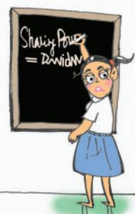

Ethnic: A social division based on shared culture. People belonging to the same ethnic group believe in their common descent because of similarities of physical type or of culture or both. They need not always have the same religion or nationality.

## Belgium and Sri Lanka

Belgium is a small country in Europe, smaller in area than the state of Haryana. It has borders with France, the Netherlands, Germany and Luxembourg. It has a population of a little over one crore, about half the population of Haryana. The ETHNIC composition of this small country is very complex. Of the country’s total population, 59 per cent lives in the Flemish region and speaks Dutch language. Another 40 per cent people live in the Wallonia region and speak French. Remaining one per cent of the Belgians speak German. In the capital city Brussels, 80 per cent people speak French while 20 per cent are Dutch-speaking.

The minority French-speaking community was relatively rich and powerful. This was resented by the Dutch-speaking community who got the benefi t of economic development and education much later. This led to

tensions between the Dutch-speaking and French-speaking communities during the 1950s and 1960s. The tension between the two communities was more acute in Brussels. Brussels presented a special problem: the Dutch-speaking people constituted a majority in the country, but a minority in the capital.

Let us compare this to the situation in another country. Sri Lanka is an island nation, just a few kilometres off the southern coast of Tamil Nadu. It has about two crore people, about the same as in Haryana. Like other nations in the South Asia region, Sri Lanka has a diverse population. The major social groups are the Sinhala-speakers (74 per cent) and the Tamil-speakers (18 per cent). Among Tamils there are two subgroups. Tamil natives of the country are called ‘Sri Lankan Tamils’ (13 per cent). The rest, whose forefathers came from India as plantation workers during

Look at the maps of Belgium and Sri Lanka. In which region, do you fi nd concentration of different communities?

For more details, visit https://www.belgium.be/en

colonial period, are called ‘Indian Tamils’. As you can see from the map, Sri Lankan Tamils are concentrated in the north and east of the country. Most of the Sinhala-speaking people are Buddhists, while most of the Tamils are Hindus or Muslims. There are about 7 per cent Christians, who are both Tamil and Sinhala.

Just imagine what could happen in situations like this. In Belgium, the Dutch community could take advantage of its numeric majority and force its will on the French and German-

speaking population. This would push the confl ict among communities further. This could lead to a very messy partition of the country; both the sides would claim control over Brussels. In Sri Lanka, the Sinhala community enjoyed an even bigger majority and could impose its will on the entire country. Now, let us look at what happened in both these countries.

## Majoritarianism in Sri Lanka

Sri Lanka emerged as an independent country in 1948. The leaders of the Sinhala community sought to secure dominance over government by virtue of their majority. As a result, the democratically elected government adopted a series of M AJORITARIAN measures to establish Sinhala supremacy.

In 1956, an Act was passed to recognise Sinhala as the only offi cial language, thus disregarding Tamil. The governments followed preferential policies that favoured Sinhala applicants for university positions and government jobs. A new constitution stipulated that the state shall protect and foster Buddhism.

All these government measures, coming one after the other, gradually increased the feeling of alienation among the Sri Lankan Tamils. They felt that none of the major political parties led by the Buddhist Sinhala leaders was sensitive to their language and culture. They felt that the constitution

and government policies denied them equal political rights, discriminated against them in getting jobs and other opportunities and ignored their interests. As a result, the relations

Majoritarianism: A belief that the majority community should be able to rule a country in whichever way it wants, by disregarding the wishes and needs of the minority.

What’s wrong if the majority community rules? If Sinhalas don’t rule in Sri Lanka, where else will they rule?

between the Sinhala and Tamil communities strained over time.

The Sri Lankan Tamils launched parties and struggles for the recognition of Tamil as an offi cial language, for regional autonomy and equality of opportunity in securing education and jobs. But their demand for more autonomy to provinces populated by the Tamils was repeatedly denied. By 1980s, several political organisations were formed demanding an independent Tamil Eelam (state) in northern and eastern parts of Sri Lanka.

The distrust between the two

communities turned into widespread confl ict. It soon turned into a CIVIL WAR. As a result thousands of people of both the communities have been killed. Many families were forced to leave the country as refugees and many more lost their livelihoods. You have read (Chapter 1 of Economics textbook, Class X) about Sri Lanka’s excellent record of economic development, education and health. But the civil war has caused a terrible setback to the social, cultural and economic life of the country. It ended in 2009.

Civil war: A violent confl ict between opposing groups within a country that becomes so intense that it appears like a war.

## Accommodation in Belgium

The Belgian leaders took a different path. They recognised the existence of regional differences and cultural diversities. Between 1970 and 1993, they amended their constitution four times so as to work out an arrangement that would enable everyone to live together within the same country. The arrangement they worked out is different from any other country and is very innovative. Here are some of the elements of the Belgian model:

 Constitution prescribes that the number of Dutch and Frenchspeaking ministers shall be equal in the central government. Some special laws require the support of majority of members from each linguistic

group. Thus, no single community can make decisions unilaterally.

Many powers of the Central Government have been given to State Governments of the two regions of the country. The State Governments are not subordinate to the Central Government.   
Brussels has a separate government in which both the communities have equal representation. The Frenchspeaking people accepted equal representation in Brussels because the Dutch-speaking community has

The photograph here is of a street address in Belgium. You will notice that place names and directions in two languages – French and Dutch.

What kind of a solution is this? I am glad our Constitution does not say which minister will come from which community.

accepted equal representation in the Central Government.

$\bullet$ Apart from the Central and the State Government, there is a third kind of government. This ‘community government’ is elected by people belonging to one language community – Dutch, French and German-speaking – no matter where they live. This government has the power regarding cultural, educational and language-related issues.

You might fi nd the Belgian model very complicated. It indeed is very complicated, even for people living in Belgium. But these arrangements have worked well so far. They helped to avoid civic strife between the two major communities and a possible division of the country on linguistic lines. When many countries of

  
European Parliament in Brussels, Belgium

Europe came together to form the European Union, Brussels was chosen as its headquarters.

So you are saying that sharing of power makes us more powerful. Sounds odd! Let me think.

Read any newspaper for one week and make clippings of news related to ongoing confl icts or wars. A group of fi ve students could pool their clippings together and do the owing:

Classify these confl icts by their location (your state, India, outside India).   
 Find out the cause of each of these confl icts. How many of these are related to power sharing disputes?   
 Which of these confl icts could be resolved by working out power sharing arrangements?

What do we learn from these two stories of Belgium and Sri Lanka? Both are democracies. Yet, they dealt with the question of power sharing differently. In Belgium, the leaders have realised that the unity of the country is possible only by respecting the feelings and interests of different communities

and regions. Such a realisation resulted in mutually acceptable arrangements for sharing power. Sri Lanka shows us a contrasting example. It shows us that if a majority community wants to force its dominance over others and refuses to share power, it can undermine the unity of the country.

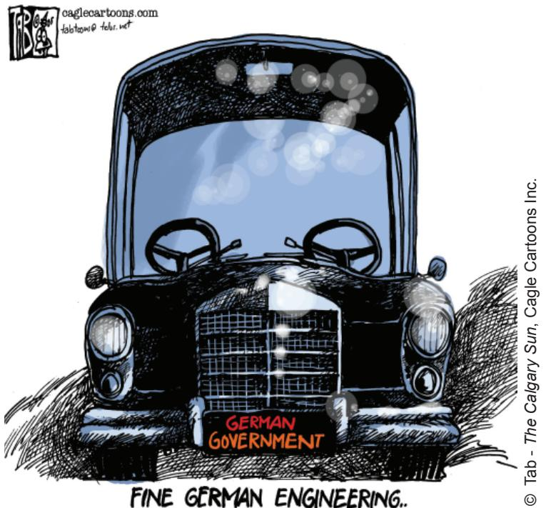

The cartoon at the left refers to the problems of running the Germany’s grand coalition government that includes the two major parties of the country, namely the Christian Democratic Union and the Social Democratic Party. The two parties are historically rivals to each other. They had to form a coalition government because neither of them got clear majority of seats on their own in the 2005 elections. They take divergent positions on several policy matters, but still jointly run the government. For details about the German Parliament, visit https://www.bundestag.de/en

Tyranny of the majority is not just oppressive for the minority; it often brings ruin to the majority as well.

There is a second, deeper reason why power sharing is g ood for democracies. Power sharing is the very spirit of democracy. A democratic rule involves sharing power with those affected by its exercise, and who have to live with its effects. People have a right to be consulted on how they are to be governed. A legitimate government is one where citizens, through participation, acquire a stake in the system.

Let us call the fi rst set of reasons PRUDENTIAL and the second moral. While prudential reasons stress that power sharing will bring out better outcomes, moral reasons emphasise the very act of power sharing as valuable.

Prudential: Based on prudence, or on careful calculation of gains and losses. Prudential decisions are usually contrasted with decisions based purely on moral considerations.

e Annette studies in a Dutch medium school in the northern region of Belgium. Many French-speaking students in her school want the medium of instruction to be French. Selvi studies in a school in the northern region of Sri Lanka. All the students in her school are Tamil-speaking and they want the medium of instruction to be Tamil.

If the parents of Annette and Selvi were to approach respective governments to realise the desire of the child who is more likely to succeed? And why?

## Khalil’s dilemma

As usual, Vikram was driving the motorbike under a vow of silence and Vetal was the pillion rider. As usual, Vetal started telling Vikram a story to keep him awake while driving. This time the story went as follows:

“In the city of Beirut, there lived a man called Khalil. His parents came from diff erent communities. His father was an Orthodox Christian and mother a Sunni Muslim. This was not so uncommon in this modern, cosmopolitan city. People from various communities that lived in Lebanon came to live in its capital, Beirut. They lived together, intermingled, yet fought a bitter civil war among themselves. One of Khalil’s uncles was killed in that war.

At the end of this civil war, Lebanon’s leaders came together and agreed to some basic rules for power sharing among diff erent communities. As per these rules, the country’s President must belong to the Maronite sect of Catholic Christians. The Prime Minister must be from the Sunni Muslim community. The post of Deputy Prime Minister is fi xed for Orthodox Christian sect and that of the Speaker for Shi’a Muslims. Under this pact, the Christians agreed not to seek French protection and the Muslims agreed not to seek unifi cation with the neighbouring state of Syria.When the Christians and Muslims came to this agreement, they were nearly equal in population. Both sides have continued to respect this agreement though now the Muslims are in clear majority.

Khalil does not like this system one bit. He is a popular man with political ambition. But under the present system, the top position is out of his reach. He does not practise either his father’s or his mother’s religion and does not wish to be known by either. He cannot understand why Lebanon can’t be like any other ‘normal’ democracy. “Just hold an election, allow everyone to contest and whoever wins maximum votes becomes the president, no matter which community he comes from. Why can’t we do that, like in other democracies of the world?” he asks. His elders, who have seen the bloodshed of the civil war, tell him that the present system is the best guarantee for peace…”

The story was not fi nished, but they had reached the TV tower where they stopped every day. Vetal wrapped up quickly and posed his customary question to Vikram: “If

you had the power to rewrite the rules in Lebanon, what would you do? Would you adopt the ‘regular’ rules followed everywhere, as Khalil suggests? Or stick to the old rules? Or do something else?” Vetal did not forget to remind Vikram of their basic pact: “If you have an answer in mind and yet do not speak up, your mobike will freeze, and so will you!”

Can you help poor Vikram in answering Vet

## Forms of power-sharing

The idea of power-sharing has emerged in opposition to the notions of undivided political power. For a long time, it was believed that all power of a government must reside in one person or group of persons located at one place. It was felt that if the power to decide is dispersed, it would not be possible to take quick decisions and to enforce them. But these notions have changed with the emergence of democracy. One basic principle of democracy is that people are the source of all political power. In a democracy, people rule themselves through institutions of self-government. In a good democratic government, due respect is given to diverse groups and views that exist in a society. Everyone has a voice in the shaping of public policies. Therefore, it follows that in a democracy, political

## Reigning the Reins

  
In 2005, some new laws were made in Russia giving more powers to its president. During the same time, the US president visited Russia. What, according to this cartoon, is the relationship between democracy and concentration of power? Can you think of some other examples to illustrate the point being made here?

power should be distributed among as many citizens as possible.

In modern democracies, power sharing arrangements can take many forms. Let us look at some of the most common arrangements that we have or will come across.

1 Power is shared among different organs of government, such as the legislature, executive and judiciary. Let us call this horizontal distribution of power because it allows different organs of government placed at the same level to exercise different powers. Such a separation ensures that none of the organs can exercise unlimited power. Each organ checks the others. This results in a balance of power among various institutions. Last year, we studied that in a democracy, even though ministers and government officials exercise power, they are responsible to the Parliament or State Assemblies. Similarly, although judges are appointed by the executive, they can check the functioning of executive or laws made by the legislatures. This arrangement is called a system of checks and balances.

2 Power can be shared among governments at different levels – a general government for the entire country and governments at the provincial or regional level. Such a general government for the entire country is usually called federal government. In India, we refer to it as the Central or Union Government. The governments at the provincial or regional level are called by different names in different countries.

I n I n d i a , w e c a l l t h e m S t a t e Governments. This system is not followed in all countries. There are many countries where there are no provincial or state governments. But in those countries like ours, where there are different levels of government, the constitution clearly lays down the powers of different levels of government. This is what they did in Belgium, but was refused in Sri Lanka. This is called federal division of power. The same principle can be extended to levels of government lower than the State government, such as the municipality and panchayat. Let us call division of powers involving higher and lower levels of government vertical division of power. We shall study these at some length in the next chapter.

3 Power may also be shared among different social groups, such as the religious and linguistic groups. ‘Community government’ in Belgium is a good example of this arrangement. In some countries, there are constitutional and legal arrangements, whereby socially weaker sections and women are represented in the legislatures and administration. Last year, we studied the system of ‘reserved constituencies’ in assemblies and the parliament of our country. This type of arrangement is meant to give space in the government and administration to diverse social

groups, who otherwise, would feel alienated from the government. This method is used to give minority communities a fair share in power. In Unit II, we shall look at various ways of accommodating social diversities.

4 Power sharing arrangements can also be seen in the way political parties, pressure groups and movements control or infl uence those in power. In a democracy, the citizens must have freedom to choose among various contenders for power. In contemporary democracies, this takes the form of competition among different parties. Such competition ensures that power does not remain in one hand. In the long run, power is shared among different political parties that represent different ideologies and social groups. Sometimes this kind of sharing can be direct, when two or more parties form an alliance to contest elections. If their alliance is elected, they form a coalition government and thus share power. In a democracy, we fi nd interest groups, such as those of traders, businessmen, industrialists, farmers and industrial workers. They also will have a share in governmental power, either through participation in governmental committees or bringing infl uence on the decision-making process. In Unit III, we shall study the working of political parties.

In my school, the class monitor changes every month. Is that what you call a power sharing arrangement?

Here are some examples of power sharing. Which of the four types of power sharing do these represent? Who is sharing power with whom?

 The Bombay High Court ordered the Maharashtra State Government to immediately take action and improve living conditions for the 2,000-odd children at seven children’s homes in Mumbai.   
 The government of Ontario state in Canada has agreed to a land claim settlement with the aboriginal community. The Minister responsible for Native Aff airs announced that the government will work with aboriginal people in a spirit of mutual respect and cooperation.   
 Russia’s two infl uential political parties, the Union of Right Forces and the Liberal Yabloko Movement, agreed to unite their organisations into a strong rightwing coalition. They propose to have a common list of candidates in the next parliamentary elections.   
 The fi nance ministers of various states in Nigeria got together and demanded that the federal government declare its sources of income. They also wanted to know the formula by which the revenue is distributed to various State Governments.

## Exercises

1. What are the diff erent forms of power sharing in modern democracies? Give an example of each of these.   
2. State one prudential reason and one moral reason for power sharing with an example from the Indian context.   
3. After reading this chapter, three students drew diff erent conclusions. Which of these do you agree with and why? Give your reasons in about 50 words.

Thomman - Power sharing is necessary only in societies which have religious, linguistic or ethnic divisions.

Mathayi – Power sharing is suitable only for big countries that have regional divisions.

Ouseph – Every society needs some form of power sharing even if it is small or does not have social divisions.

4. The Mayor of Merchtem, a town near Brussels in Belgium, has defended a ban on speaking French in the town’s schools. He said that the ban would help all non-Dutch speakers integrate in this Flemish town. Do you think that this measure is in keeping with the spirit of Belgium’s power sharing arrangements? Give your reasons in about 50 words.

5. Read the following passage and pick out any one of the prudential reasons for power sharing off ered in this.

“We need to give more power to the panchayats to realise the dream of Mahatma Gandhi and the hopes of the makers of our Constitution. Panchayati Raj establishes true democracy. It restores power to the only place where power belongs in a democracy – in the hands of the people. Giving power to Panchayats is also a way to reduce corruption and increase administrative effi ciency. When people participate in the planning and implementation of developmental schemes, they would naturally exercise greater control over these schemes. This would eliminate the corrupt middlemen. Thus, Panchayati Raj will strengthen the foundations of our democracy.”

6. Diff erent arguments are usually put forth in favour of and against power sharing. Identify those which are in favour of power sharing and select the answer using the codes given below? Power sharing:

A. reduces confl ict among diff erent communities   
B. decreases the possibility of arbitrariness   
C. delays decision making process   
D. accommodates diversities   
E. increases instability and divisiveness   
F. promotes people’s participation in government   
G. undermines the unity of a country

<table><tr><td>(a)</td><td>A</td><td>B</td><td>D</td><td>F</td></tr><tr><td>(b)</td><td>A</td><td>C</td><td>E</td><td>F</td></tr><tr><td>(c)</td><td>A</td><td>B</td><td>D</td><td>G</td></tr><tr><td>(d)</td><td>B</td><td>C</td><td>D</td><td>G</td></tr></table>

7. Consider the following statements about power sharing arrangements in Belgium and Sri Lanka.

A. In Belgium, the Dutch-speaking majority people tried to impose their domination on the minority French-speaking community.   
B. In Sri Lanka, the policies of the government sought to ensure the dominance of the Sinhala-speaking majority.   
C. The Tamils in Sri Lanka demanded a federal arrangement of power sharing to protect their culture, language and equality of opportunity in education and jobs.   
D. The transformation of Belgium from unitary government to a federal one prevented a possible division of the country on linguistic lines.

Which of the statements given above are correct?

(a) A, B, C and D (b) A, B and D (c) C and D (d) B, C and D

8. Match List I (forms of power sharing) with List II (forms of government) and select the correct answer using the codes given below in the lists:

<table><tr><td></td><td>List I</td><td>List II</td></tr><tr><td>1.</td><td>Power shared among different organs of government</td><td>A. Community government</td></tr><tr><td>2.</td><td>Power shared among governments at different levels</td><td>B. Separation of powers</td></tr><tr><td>3.</td><td>Power shared by different social groups</td><td>C. Coalition government</td></tr><tr><td>4.</td><td>Power shared by two or more political parties</td><td>D. Federal government</td></tr></table>

<table><tr><td></td><td>1</td><td>2</td><td>3</td><td>4</td></tr><tr><td>(a)</td><td>D</td><td>A</td><td>B</td><td>C</td></tr><tr><td>(b)</td><td>B</td><td>C</td><td>D</td><td>A</td></tr><tr><td>(c)</td><td>B</td><td>D</td><td>A</td><td>C</td></tr><tr><td>(d)</td><td>C</td><td>D</td><td>A</td><td>B</td></tr></table>

9. Consider the following two statements on power sharing and select the answer using the codes given below:

A. Power sharing is good for democracy.   
B. It helps to reduce the possibility of confl ict between social groups.

Which of these statements are true and false?

<table><tr><td>(a) A is true but B is false</td></tr><tr><td>(b) Both A and B are true</td></tr><tr><td>(c) Both A and B are false</td></tr><tr><td>(d) A is false but B is true</td></tr></table>

# Chapter 2
# Federalism

1072CH02

## Overview

In the previous chapter, we noted that vertical division of power among different levels of government is one of the major forms of power-sharing in modern democracies. In this chapter, we focus on this form of powersharing. It is most commonly referred to as federalism. We begin by describing federalism in general terms. The rest of the chapter tries to understand the theory and practice of federalism in India. A discussion of the federal constitutional provisions is followed by an analysis of the policies and politics that has strengthened federalism in practice. Towards the end of the chapter, we turn to the local government, a new and third tier of Indian federalism.

I am confused. What do we call the Indian government? Is it Union, Federal or Central?

## What is federalism?

Let us get back to the contrast between Belgium and Sri Lanka that we saw in the last chapter. You would recall that one of the key changes made in the Constitution of Belgium was to reduce the power of the Central Government and to give these powers to the regional governments. Regional governments existed in Belgium even earlier. They had their roles and powers. But all these powers were given to these governments and could be withdrawn by the Central Government. The change that took place in 1993 was that the regional governments were given constitutional powers that were no longer dependent on the central government. Thus, Belgium shifted from a unitary to a federal form of government. Sri Lanka continues

to be, for all practical purposes, a unitary system where the national government has all the powers. Tamil leaders want Sri Lanka to become a federal system.

Federalism is a system of government in which the power is divided between a central authority and various constituent units of the country. Usually, a federation has two levels of government. One is the government for the entire country that is usually responsible for a few subjects of common national interest. The others are governments at the level of provinces or states that look after much of the dayto-day administering of their state. Both these levels of governments enjoy their power independent of the other.

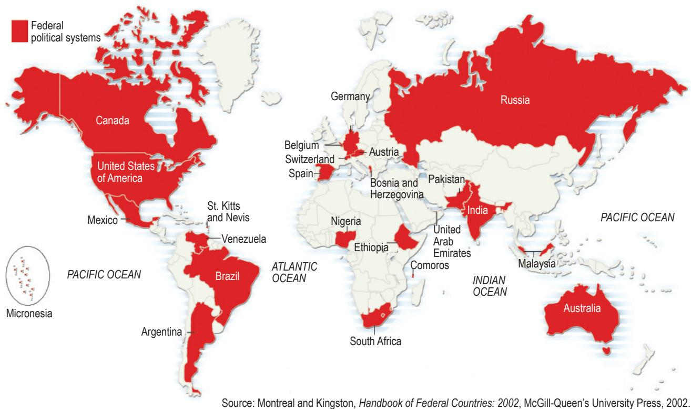  
Though only 25 of the world’s 193 countries have federal political systems, their citizens make up 40 per cent of the world’s population. Most of the large countries of the world are federations. Can you notice an exception to this rule in this map?

In this sense, federations are contrasted with unitary governments. Under the unitary system, either there is only one level of government or the sub-units are subordinate to the central government. The central government can pass on orders to the provincial or the local government. But in a federal system, the central government cannot order the state government to do something. State government has powers of its own for which it is not answerable to the central government. Both these governments are separately answerable to the people.

Let us look at some of the key features of federalism :

1 There are two or more levels (or tiers) of government.   
2 Different tiers of government govern the same citizens, but each tier has its own JURISDICTION in specifi c matters of legislation, taxation and administration.   
3 The jurisdictions of the respective levels or tiers of government are specifi ed in the constitution. So the existence and authority of each tier of government is constitutionally guaranteed.   
4 The fundamental provisions of the constitution cannot be unilaterally changed by one level of government. Such changes require the consent of both the levels of government.   
5 Courts have the power to interpret the constitution and the powers of different levels of government. The highest court acts as an umpire if disputes arise between different levels of government in the exercise of their respective powers.   
6 Sources of revenue for each level of government are clearly specifi ed to ensure its fi nancial autonomy.

7 The federal system thus has dual objectives: to safeguard and promote unity of the country, while at the same time accommodate regional diversity. Therefore, two aspects are crucial for the institutions and practice of federalism. Governments at different levels should agree to some rules of power-sharing. They should also trust that each would abide by its part of the agreement. An ideal federal system has both aspects : mutual trust and agreement to live together.

The exact balance of power between the central and the state government varies from one federation to another. This balance depends mainly on the historical context in which the federation was formed. There are two kinds of routes through which federations have been formed. The fi rst route involves independent States coming together on their own to form a bigger unit, so that by pooling sovereignty and retaining identity, they can increase their security. This type of ‘coming together’ federations include the USA, Switzerland and Australia. In this fi rst category of federations, all the constituent States usually have equal power and are strong vis-à-vis the federal government.

The second route is where a large country decides to divide its power between the constituent States and the national government. India, Spain and Belgium are examples of this kind of ‘holding together’ federations. In this second category, the Central Government tends to be more powerful vis-à-vis the States. Very often different constituent units of the federation have unequal powers. Some units are granted special powers.

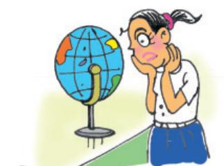

If federalism works only in big countries, why did Belgium adopt it?

## GlO ssary

Jurisdiction: The area over which someone has legal authority. The area may be defi ned in terms of geographical boundaries or in terms of certain kinds of subjects.

Some Nepalese citizens were discussing the proposals on the adoption of federalism in their new constitution. This is what some of them said:

Khag Raj: I don’t like federalism. It would lead to reservation of seats ent caste groups as in India.

Sarita: Ours in not a very big country. We don’t need federalism.

Babu Lal: I am hopeful that the Terai areas will get more autonomy if they get their own state government.

Ram Ganesh: I like federalism because it will mean that powers that were earlier enjoyed by the king will now be exercised by our elected representatives.

If you were participating in this conversation, what would be your response to each of these? Which of these refl ect a wrong understanding of what federalism is?

What makes India a federal country?

## What makes India a federal country?

We have earlier seen how small countries like Belgium and Sri Lanka face so many problems of managing diversity. What about a vast country like India, with so many languages, religions and regions? What are the power sharing arrangements in our country?

Let us begin with the Constitution. India had emerged as an independent nation after a painful and bloody partition. Soon after Independence, several princely states became a part of the country. The Constitution declared India as a Union of States. Although it did not use the word federation, the Indian Union is based on the principles of federalism.

Let us go back to the seven features of federalism mentioned above. We can see that all these features apply to the provisions of the Indian Constitution. The Constitution originally provided for a two-tier system of government, the Union Government or what we call the Central Government, representing the Union of India and the State governments. Later, a third tier of federalism was added

in the form of Panchayats and Municipalities. As in any federation, these different tiers enjoy separate jurisdiction. The Constitution clearly provided a three-fold distribution of legislative powers between the Union Government and the State Governments. Thus, it contains three lists:

Union List includes subjects of national importance, such as defence of the country, foreign affairs, banking, communications and currency. They are included in this list because we need a uniform policy on these matters throughout the country. The Union Government alone can make laws relating to the subjects mentioned in the Union List.   
State List contains subjects of State and local importance, such as police, trade, commerce, agriculture and irrigation. The State Governments alone can make laws relating to the subjects mentioned in the State List.   
 Concurrent List includes subjects of common interest to both the Union Government as well as the State Governments, such as

Isn’t that strange? Did our constitution makers not know about federalism? Or did they wish to avoid talking about it?

education, forest, trade unions, marriage, adoption and succession. Both the Union as well as the State Governments can make laws on the subjects mentioned in this list. If their laws conflict with each other, the law made by the Union Government will prevail.

What about subjects that do not fall in any of the three lists? Or subjects like computer software that came up after the constitution was made? According to our constitution, the Union Government has the power to legislate on these ‘residuary’ subjects.

We noted above that most federations that are formed by ‘holding together’ do not give equal power to its constituent units. Thus, all States in the Indian Union do not have identical powers. Some States enjoy a special status. States such as Assam, Nagaland, Arunachal Pradesh and Mizoram enjoy special powers under certain provisions of the Constitution of India (Article 371) due to their peculiar social and historical circumstances. These special powers are especially enjoyed in relation to the protection of land rights of indigenous peoples, their culture and also preferential employment in government services. Indians who are not permanent residents of this State cannot buy land or house here. Similar special provisions exist for some other States of India as well.

There are some units of the Indian Union which enjoy very little power. These are areas which are too small to become an independent State but which could not be merged with any of the existing States. These areas, like Chandigarh, or Lakshadweep or the capital city of Delhi, are called Union Territories. These territories do not have the powers of a State. The Central Government has special powers in running these areas.

This sharing of power between the Union Government and the State Governments is basic to the structure of the Constitution. It is not easy to make changes to this power sharing arrangement. The Parliament cannot on its own change this arrangement. Any change to it has to be first passed by both the Houses of Parliament with at least two-thirds majority. Then it has to be ratified by the legislatures of at least half of the total States.

The judiciary plays an important role in overseeing the implementation of constitutional provisions and procedures. In case of any dispute about the division of powers, the High Courts and the Supreme Court make a decision. The Union and State Governments have the power to raise resources by levying taxes in order to carry on the government and the responsibilities assigned to each of them.

If agriculture and commerce are state subjects, why do we have ministers of agriculture and commerce in the Union cabinet?

Listen to one national and one regional news bulletin broadcast by All India Radio daily for one week. Make a list of news items related to government policies or decisions by classifying these into the following categories:

News items that relate only to the Central Government,   
News items that relate only to your or any other State Government,   
 News items about the relationship between the Central and State Governments.

 Pokharan, the place where India conducted its nuclear tests, lies in Rajasthan. Suppose the Government of Rajasthan was opposed to the Central Government’s nuclear policy, could it prevent the nt of India from conducting the nuclear tests?

 Suppose the Government of Sikkim plans to introduce new textbooks in its schools. But the Union Government does not like the style and content of the new textbooks. In that case, does the state government need to take permission from the Union Government before these textbooks can be launched?   
 Suppose the Chief Ministers of Andhra Pradesh, Chhattisgarh and Orissa have diff erent policies on how their state police should respond to the naxalites. Can the Prime Minister of India intervene and pass an order that all the Chief Ministers will have to obey?

## How is federalism practised?

Constitutional provisions are necessary for the success of federalism but these are not suffi cient. If the federal experiment has succeeded in India, it is not merely because of the clearly laid out constitutional provisions. The real success of federalism in India can be attributed to the nature of democratic politics in our country. This ensured that the spirit of federalism, respect for diversity and desire for living together became shared ideals in our country. Let us look at some of the major ways in which this happened.

## Linguistic States

The creation of linguistic States was the fi rst and a major test for democratic politics in our country.

If you look at the political map of India when it began its journey as a democracy in 1947 and that of 2019, you will be surprised by the extent of the changes. Many old States have vanished and many new States have been created. Areas, boundaries and names of the States have been changed.

In 1947, the boundaries of several old States of India were changed in order to create new States. This was done to ensure that people who spoke the same language lived in the same State. Some States were created not on the basis of language but to recognise differences based on culture, ethnicity or geography. These include States like Nagaland, Uttarakhand and Jharkhand.

 Has your village / town / city remained under the same State since Independence? If not, what was the name of the earlier State?   
 Can you identify names of three States in 1947 that have been changed later?   
 Identify any three States which have been carved out of bigger States.

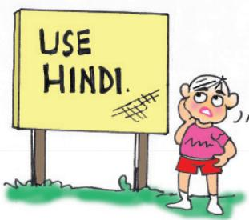

Why Hindi? Why not Bangla or Telugu?

Coalition government: A government formed by the coming together of at least two political parties. Usually partners in a coalition form a political alliance and adopt a common programme.

When the demand for the formation of States on the basis of language was raised, some national leaders feared that it would lead to the disintegration of the country. The Central Government resisted linguistic States for some time. But the experience has shown that the formation of linguistic States has actually made the country more united. It has also made administration easier.

## Language policy

A second test for Indian federation is the language policy. Our Constitution did not give the status of national language to any one language. Hindi was identifi ed as the offi cial language. But Hindi is the mother tongue of only about 40 per cent of Indians. Therefore, there were many safeguards to protect other languages. Besides Hindi, there are 21 other languages recognised as Scheduled Languages by the Constitution. A candidate in an examination conducted for the Central Government positions may opt to take the examination in any of these languages. States too have their own offi cial languages. Much of the government work takes place in the offi cial language of the concerned State.

Unlike Sri Lanka, the leaders of our country adopted a very cautious attitude in spreading the use of Hindi. According to the Constitution, the use of English for offi cial purposes was to stop in 1965. However, many non-Hindi speaking States demanded that the use of English continue. In Tamil Nadu, this movement took a violent form. The Central Government responded by agreeing to continue the use of English along with Hindi for offi cial purposes. Many critics

think that this solution favoured the English-speaking elite. Promotion of Hindi continues to be the offi cial policy of the Government of India. Promotion does not mean that the Central Government can impose Hindi on States where people speak a different language. The fl exibility shown by Indian political leaders helped our country avoid the kind of situation that Sri Lanka fi nds itself in.

## Centre-State relations

Restructuring the Centre-State relations is one more way in which federalism has been strengthened in practice. How the constitutional arrangements for sharing power work in reality depends to a large extent on how the ruling parties and leaders follow these arrangements. For a long time, the same party ruled both at the Centre and in most of the States. This meant that the State Governments did not exercise their rights as autonomous federal units. As and when the ruling party at the State level was different, the parties that ruled at the Centre tried to undermine the power of the States. In those days, the Central Government would often misuse the Constitution to dismiss the State Governments that were controlled by rival parties. This undermined the spirit of federalism.

All this changed signifi cantly after 1990. This period saw the rise of regional political parties in many States of the country. This was also the beginning of the era of COALITION GOVERNM ENTS at the Centre. Since no single party got a clear majority in the Lok Sabha, the major national parties had to enter into an alliance with many parties including several regional parties to form a government at the Centre.

## The States Plead for More Powers

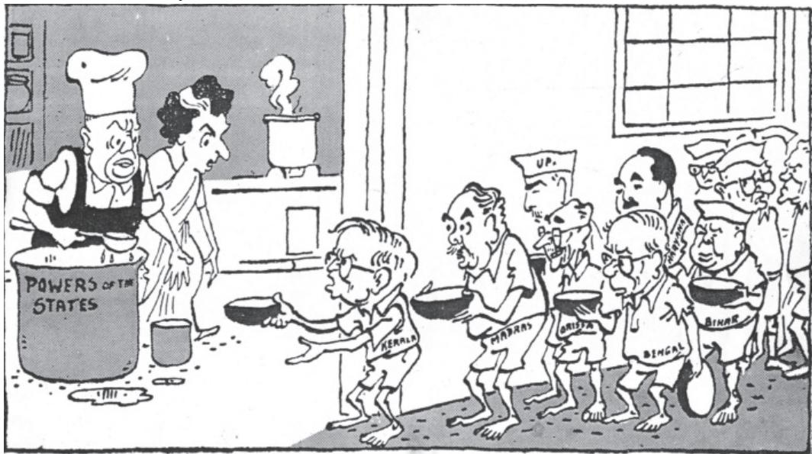  
© Kutty - Laughing with Kutty

## Perils of Running a Coalition Government

  
Here are two cartoons showing the relationship between Centre and States. Should the State go to the Centre with a begging bowl? How can the leader of a coalition keep the partners of government satisfi ed?   
© Ajith Ninan - India Today Book of Cartoons

Are you suggesting that regionalism is good for our democracy? Are you serious?

This led to a new culture of power sharing and respect for the autonomy of State Governments. This trend was supported by a major judgement of the Supreme Court that made it diffi cult for the

Central Government to dismiss state governments in an arbitrary manner. Thus, federal power sharing is more effective today than it was in the early years after the Constitution came into force.

## Linguistic diversity of India

How many languages do we have in India? The answer depends on how one counts it. The latest information that we have is from the Census of India held in 2011. This census recorded more than 1300 distinct languages which people mentioned as their mother tongues. These languages were grouped together under some major languages. For example, languages like Bhojpuri, Magadhi, Bundelkhandi, Chhattisgarhi, Rajasthani and many others were grouped together under ‘Hindi’. Even after this grouping, the Census found 121 major languages. Of these, 22 languages are now included in the Eighth Schedule of the Indian Constitution and are therefore called ‘Scheduled Languages’. Others are called ‘non-Scheduled Languages’. In terms of languages, India is perhaps the most diverse country in the world.

A look at the enclosed table makes it clear that no one language is the mother tongue of the majority of our population. The largest language, Hindi, is the mother tongue of only about 44 per cent Indians. If we add to that all those who knew Hindi as their second or third language, the total number was still less than 50 per cent in 2011. As for English, only 0.02 per cent Indians recorded it as their mother tongue. Another 11 per cent knew it as a second or third language.

Read this table carefully, but you need not memorise it. Just do the following:

 Make a bar or pie chart on the basis of this information.   
Prepare a map of linguistic diversity of India by shading the region where each o f these languages is spoken on the map of India.   
Find out about any three languages that are spoken in India but are not included in this table.

Scheduled Languages of India   

<table><tr><td>Language</td><td>Proportion of speakers (%)</td></tr><tr><td>Assamese</td><td>1.26</td></tr><tr><td>Bengali</td><td>8.03</td></tr><tr><td>Bodo</td><td>0.12</td></tr><tr><td>Dogri</td><td>0.21</td></tr><tr><td>Gujarati</td><td>4.58</td></tr><tr><td>Hindi</td><td>43.63</td></tr><tr><td>Kannada</td><td>3.61</td></tr><tr><td>Kashmiri</td><td>0.56</td></tr><tr><td>Konkani</td><td>0.19</td></tr><tr><td>Maithili</td><td>1.12</td></tr><tr><td>Malayalam</td><td>2.88</td></tr><tr><td>Manipuri</td><td>0.15</td></tr><tr><td>Marathi</td><td>6.86</td></tr><tr><td>Nepali</td><td>0.24</td></tr><tr><td>Odia</td><td>3.10</td></tr><tr><td>Punjabi</td><td>2.74</td></tr><tr><td>Sanskrit</td><td>N</td></tr><tr><td>Santali</td><td>0.61</td></tr><tr><td>Sindhi</td><td>0.23</td></tr><tr><td>Tamil</td><td>5.70</td></tr><tr><td>Telugu</td><td>6.70</td></tr><tr><td>Urdu</td><td>4.19</td></tr></table>

N — Stands for negligible.

Source: http://www.censusindia.gov.in

Read the following excerpts from an article by noted historian, Ramachandra Guha, that appeared in the Times of India on November 1, 2006:

“The report of the States Reorganisation Commission (SRC), was implemented exactly 50 years ago, on November 1, 1956. This, in its own time and own way, has also transformed the political and institutional life of the nation. ... Gandhi and other leaders promised their followers that when freedom came, the new nation would be based on a new set of provinces, these based on the principle of language. However, when India was finally freed in 1947, it was also divided...

Partition was the consequence of a primordial attachment to one's faith; how many more partitions would that other primordial loyalty,language, leadto?Soranthethinkingof Nehru,Patel and Rajaji.

Far from undermining Indian unity, linguistic states have helped strengthen it. It has proved to be perfectly consistent to be Kannadiga and Indian, Bengali and Indian, Tamil and Indian, Gujarati and Indian. To be sure, these states based on language sometimes quarrel with one another.

While these disputes are not pretty,they could in fact have been far worse.

It is the formation of linguistic states that has allowed India to escape what might have been a worse fate still. If the sentiments of the native speakers of Telugu,Marathi, et. al. had been disregarded, what we might have here was: 'One language: l4 or 15 nations'."

Take the example of your own state or any other state that was aff ected by linguistic reorganisation. Write a short note for or against the argument given by the author here on the basis of that example.

## Decentralisation in India

So, we are like a three-tier coach in a train! I always prefer the lower berth!

We noted above that federal governments have two or more tiers of governments. We have so far discussed the two-tiers of government in our country. But a vast country like India cannot b e r u n o n l y t h r o u g h t h e s e two-tiers. States in India are as large as independent countries of Europe. In terms of population, Uttar Pradesh is bigger than Russia, Maharashtra is about as big as Germany. Many of these States are internally very diverse. There is thus a need for power sharing within these States. Federal power sharing in India needs another tier of government, below that of the State governments. This is the rationale for decentralisation of power. Thus, resulted a thirdtier of government, called local government.

When power is taken away from Central and State governments and given to local government, it is called decentralisation. The basic idea behind decentralisation is that there are a large number of problems and issues which are best settled at the local level. People have better knowledge of problems in their localities. They also have better ideas on where to spend money and how to manage things more effi ciently. Besides, at the local level it is possible for the people to directly participate in decision making. This helps to inculcate a habit of democratic participation. Local government is the best way to realise one important principle of democracy, namely local self-government.

The need for decentralisation was recognised in our Constitution. Since then, there have been several attempts to decentralise

power to the level of villages and towns. Panchayats in villages and municipalities in urban areas were set up in all the States. But these were directly under the control of state governments. Elections to these local governments were not held regularly. Local governments did not have any powers or resources of their own. Thus, there was very little decentralisation in effective terms.

A major step towards decentralisation was taken in 1992. The Constitution was amended to make the third-tier of democracy more powerful and effective.

Now it is constitutionally mandatory to hold regular elections to local government bodies.   
Seats are reserved in the elected bodies and the executive heads of these institutions for the Scheduled Castes, Scheduled Tribes and Other Backward Classes.   
At least one-third of all positions are reserved for women.   
An independent institution called the State Election Commission has been created in each State to conduct panchayat and municipal elections.   
The State governments are required to share some powers and revenue with local government bodies. The nature of sharing varies from State to State.

Rural local government is popularly known by the name panchayati raj. Each village, or a group of villages in some States, has a gram panchayat. This is a council consisting of several ward members, often called panch, and a president or sarpanch. They are directly

elected by all the adult population living in that ward or village. It is the decision-making body for the entire village. The panchayat works under the overall supervision of the gram sabha. All the voters in the village are its members. It has to meet at least twice or thrice in a year to approve the annual budget of the gram panchayat and to review the performance of the gram panchayat.

The local government structure goes right up to the district level. A few gram panchayats are grouped together to form what is usually called a panchayat samiti or block or mandal. The members of this representative body are elected by all the panchyat members in that area. All the panchayat samitis or mandals in a district together constitute

the zilla (district) parishad. Most members of the zilla parishad are elected. Members of the Lok Sabha and MLAs of that district and some other offi cials of other district level bodies are also its members. Zilla parishad chairperson is the political head of the zilla parishad.

Similarly, local government bodies exist for urban areas as well. Municipalities are set up in towns. Big cities are constituted into municipal corporations. Both municipalities and municipal c o r p o r a t i o n s a r e c o n t r o l l e d by elected bodies consisting of people’s representatives. Municipal chairperson is the political head of the municipality. In a municipal corporation, such an offi cer is called the mayor.

Prime Minister runs the country.

Chief Minister runs the state.

Logically, then, the chairperson of Zilla Parishad should run the district.

Why does the

D.M. or Collector administer the district?

  
What do these newspaper clippings have to say about efforts of decentralisation in India?

### An experiment in Brazil

A city called Porto Alegre in Brazil has carried out an extraordinary experiment in combining decentralisation with participative democracy. The city has set up a parallel organisation operating alongside the municipal council, enabling local inhabitants to take real decisions for their city. The nearly 13 lakh people in this city get to participate in making the budget for their own city. The city is divided into many sectors or what we call wards. Each sector has a meeting, like that of the gram sabha, in which anyone living in that area can participate. There are some meetings to discuss issues that aff ect the entire city. Any citizen of the city can participate in those meetings. The budget of the city is discussed in these meetings. The proposals are put to the municipality that takes a fi nal decision about it.

About 20,000 people participate in this decision making exercise every year. This method has ensured that the money cannot be spent only for the benefi t of the colonies where rich people live. Buses now run to the poor colonies and builders cannot evict slum-dwellers without resettling them.

In our own country, a similar experiment has taken place in some areas in Kerala. Ordinary people have participated in making a plan for the development of their locality.

T h i s n e w s y s t e m o f l o c a l government is the largest experiment in democracy conducted anywhere in the world. There are now about 36 lakh elected representatives in the panchayats and municipalities etc., all over the country. This number is bigger than the population of many countries in the world. Constitutional status for local government has helped to deepen democracy in our country. It has also

increased women’s representation and voice in our democracy. At the same time, there are many difficulties. While elections are held regularly and enthusiastically, gram sabhas are not held regularly. Most state governments have not transferred signifi cant powers to the local governments. Nor have they given adequate resources. We are thus still a long way from realising the ideal of self-government.

Find out about the local government in the village or town you live in.

If you live in a village, fi nd out the names of the following: your panch or ward member, your sarpanch, your panchayat samiti, the chairperson of your zilla parishad. Also fi nd out when did the last meeting of the gram sabha take place and how many people took part in that.

If you live in urban areas, fi nd out the name of your municipal councillor, and the municipal chairperson or mayor. Also fi nd out about the budget of your municipal corporation, municipality and the major items on which money was spent.

1. Locate the following States on a blank outline political map of India: Manipur, Sikkim, Chhattisgarh and Goa.   
2. Identify and shade three federal countries (other than India) on a blank outline political map of the world.   
3. Point out one feature in the practice of federalism in India that is similar to and one feature that is diff erent from that of Belgium.   
4. What is the main diff erence between a federal form of government and a unitary one? Explain with an example.   
5. State any two diff erences between the local government before and after the Constitutional amendment in 1992.   
6. Fill in the blanks:

Since the United States is a type of federation, all the constituent States have equal powers and States are _vis-à-vis the federal government. But India is a type of federation and some States have more power than others. In India, the government has more powers.

7. Here are three reactions to the language policy followed in India. Give an argument and an example to support any of these positions.

Sangeeta: The policy of accommodation has strengthened national unity.

Arman: Language-based States have divided us by making everyone conscious of their language.

Harish: This policy has only helped to consolidate the dominance of English over all other languages.

8. The distinguishing feature of a federal government is:

(a) National government gives some powers to the provincial governments.   
(b) Power is distributed among the legislature, executive and judiciary.   
(c) Elected offi cials exercise supreme power in the government.   
(d) Governmental power is divided between diff erent levels of government.

9. A few subjects in various Lists of the Indian Constitution are given here. Group them under the Union, State and Concurrent Lists as provided in the table below.

A. Defence; B. Police; C. Agriculture; D. Education;   
E. Banking; F. Forests; G. Communications; H. Trade; I. Marriages

<table><tr><td>Union List</td><td></td></tr><tr><td>State List</td><td></td></tr><tr><td>Concurrent List</td><td></td></tr></table>

## Exercises

10. Examine the following pairs that give the level of government in India and the powers of the government at that level to make laws on the subjects mentioned against each. Which of the following pairs is not correctly matched?

<table><tr><td>(a) State government</td><td>State List</td></tr><tr><td>(b) Central government</td><td>Union List</td></tr><tr><td>(c) Central and State governments</td><td>Concurrent List</td></tr><tr><td>(d) Local governments</td><td>Residuary powers</td></tr></table>

11. Match List I with List II and select the correct answer using the codes given below the lists:

<table><tr><td>List I</td><td>List II</td></tr><tr><td>1. Union of India</td><td>A. Prime Minister</td></tr><tr><td>2. State</td><td>B. Sarpanch</td></tr><tr><td>3. Municipal Corporation</td><td>C. Governor</td></tr><tr><td>4. Gram Panchayat</td><td>D. Mayor</td></tr></table>

<table><tr><td></td><td>1</td><td>2</td><td>3</td><td>4</td></tr><tr><td>(a)</td><td>D</td><td>A</td><td>B</td><td>C</td></tr><tr><td>(b)</td><td>B</td><td>C</td><td>D</td><td>A</td></tr><tr><td>(c)</td><td>A</td><td>C</td><td>D</td><td>B</td></tr><tr><td>(d)</td><td>C</td><td>D</td><td>A</td><td>B</td></tr></table>

12. Consider the following two statements.

A. In a federation, the powers of the federal and provincial governments are clearly demarcated.   
B. India is a federation because the powers of the Union and State Governments are specifi ed in the Constitution and they have exclusive jurisdiction on their respective subjects.   
C. Sri Lanka is a federation because the country is divided into provinces.   
D. India is no longer a federation because some powers of the States have been devolved to the local government bodies.

Which of the statements given above are correct?

(a) A, B and C (b) A, C and D (c) A and B only (d) B and C only

# Chapter 3
# Gender, Religion and Caste

1072CH03

## Overview

The existence of social diversity does not threaten democracy. Political expression of social differences is possible and sometimes quite desirable in a democratic system. In this chapter we apply these ideas to the practice of democracy in India. We look at three kinds of social differences that can take the form of social divisions and inequalities. These are social differences based on gender, religion and caste. In each case we look at the nature of this division in India and how it gets expressed in politics. We also ask whether different expressions based on these differences are healthy or otherwise in a democracy.

## Gender and politics

© Zuban

  
A poster from Bengal affi rming women’s strength.

## GlO ssary

Sexual division of labour:

A system in which all work inside the home is either done by the women of the family, or organised by them through the domestic helpers.

Let us begin with gender division. This is a form of hierarchical social division seen everywhere, but is rarely recognised in the study of politics. The gender division tends to be understood as natural and unchangeable. However, it is not based on biology but on social expectations and stereotypes.

Why are we discussing things like household work in this textbook on Political Science? Is this politics?

Why not? If politics is about power, then surely male dominance in the household should be considered political.

## Public/private division

Boys and girls are brought up to believe that the main responsibility of women is housework and bringing up children. This is refl ected in a SEXUAL DIVISION OF LAB OUR in most families: women do all work inside the home such as cooking, cleaning, washing clothes, tailoring, looking after children, etc., and men do all the work outside the home. It is not that men cannot do housework; they simply think that it is for women to attend to these things. When these jobs are paid for, men are ready to take up these works. Most tailors or cooks in hotels are men. Similarly, it is not that women do not work outside their home. In villages, women fetch water, collect fuel and work in the fi elds. In urban areas, poor women work as domestic helper in middle class homes, while middle class women work in offi ces. In fact, the majority of women do some sort of paid work in addition to domestic labour. But their work is not valued and does not get recognition.

The result of this division of labour is that although women constitute half of the humanity, their role in public life, especially politics, is minimal in most societies. Earlier, only men were allowed to participate in public affairs, vote and contest for public offices. Gradually the gender issue was raised in politics. Women in different parts of the world organised and agitated for equal rights. There were agitations in different countries for the extension of voting rights to women.

T h e s e a g i t a t i o n s d e m a n d e d enhancing the political and legal status of women and improving their educational and career opportunities. More radical women’s movements aimed at equality in personal and family life as well. These movements are called FEM INIST movements.

Political expression of gender division and political mobilisation

on this question helped to improve women’s role in public life. We now fi nd women working as scientists, d o c t o r s , e n g i n e e r s , l a w y e r s , managers and college and university teachers which were earlier not considered suitable for women. In some parts of the world, for example in Scandinavian countries, such as Sweden, Norway and Finland, the

## PERCEPTIONS OF IDEAL WOMAN

  
TOTHE TY SERIAL MAKERS   
THE

  
TO THE FASHION INDUSTRY

  
TO THE SOCIETy   
IDEAL

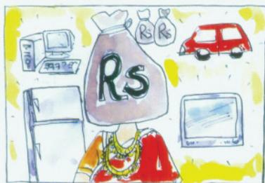  
HE

TO THE PROSPECTIVE IN-LAWS

  
TO THE EMPLOYER AND MALE EMPLOYEES   
A EMPLOYEE

  
Sws.Ju/.

Discuss all these perceptions of an ideal woman that prevail in our society. Do you agree with any of these? If not, what is your image of an ideal woman?

## Glo ssary

Feminist: A woman or a man who believes in equal rights and opportunities for women and men.

## GlO ssary

Patriarchy: Literally, rule by father, this concept is used to refer to a system that values men more and gives them power over women.

participation of women in public life is very high.

In our country, women still lag much behind men despite some improvement since Independence. Ours is still a male-dominated, P ATRIARCHAL society. Women face

disadvantage, discrimination and oppression in various ways:

 The literacy rate among women is only 54 per cent compared with 76 per cent among men. Similarly, a smaller proportion of girl students go for higher studies. When we

## Let'sdoit

A ‘time use survey’ was conducted in six states of our country. It shows that an average woman works every day for a little over seven and half hours while an average man works for six and a half hours. Yet the work done by men is more visible because most of their work leads to generation of income. Women also do a lot of direct income generating work, but the bulk of their work is household related. This work remains unpaid and invisible.

Daily time use (hours: minutes)   

<table><tr><td>Activities</td><td>Men</td><td>Women</td></tr><tr><td>Income generating work</td><td>6:00</td><td>2:40</td></tr><tr><td>Household and related work</td><td>0:30</td><td>5:00</td></tr><tr><td>Talking, Gossip</td><td>1:25</td><td>1:20</td></tr><tr><td>No work/ Leisure</td><td>3:40</td><td>3:50</td></tr><tr><td>Sleep, self-care, reading etc.</td><td>12:25</td><td>11:10</td></tr></table>

Source: Government of India, Time Use Survey, 1998-99.

You can conduct a similar time use survey in your own household. Observe all the adult male and female members of your family for one week. Every day note down the number of hours each of them spends on the following activities: income generating activity (working at the offi ce or shop or factory or fi eld, etc.), household related activity (cooking, cleaning, washing, fetching water, looking after children or elders, etc.), reading and recreation, talking/gossiping, self-care, taking rest or sleeping. If necessary make new categories. Add up the time taken on each activity for a week and calculate the daily average for each activity for each member. Do women work more in your family as well?

look at school results, girls perform as well as boys, if not better in some places. But they drop out because parents prefer to spend their resources for their boys’ education rather than spending equally on their sons and daughters.

 No wonder the proportion of women among the highly paid and valued jobs, is still very small. On an average, an Indian woman works one hour more than an average man every day. Yet much of her work is not paid and therefore, often not valued.

 The Equal Remuneration Act, 1976 provides that equal wages should be paid to equal work. However in almost all areas of work, from sports and cinema, to factories and fi elds, women are paid less than men, even when both do exactly the same work.   
 In many parts of India, parents prefer to have sons and fi nd ways to have the girl child aborted before she is born. Such sex-selective abortion led to a decline in child sex ratio (number of girl children per thousand boys) in the country to merely 919. As the map shows, this

Mummy always says to outsiders: $\ " \mathrm { I }$ don’t work. I am a housewife.” But I see her working non-stop all the time. If what she does is not work, what else is work?

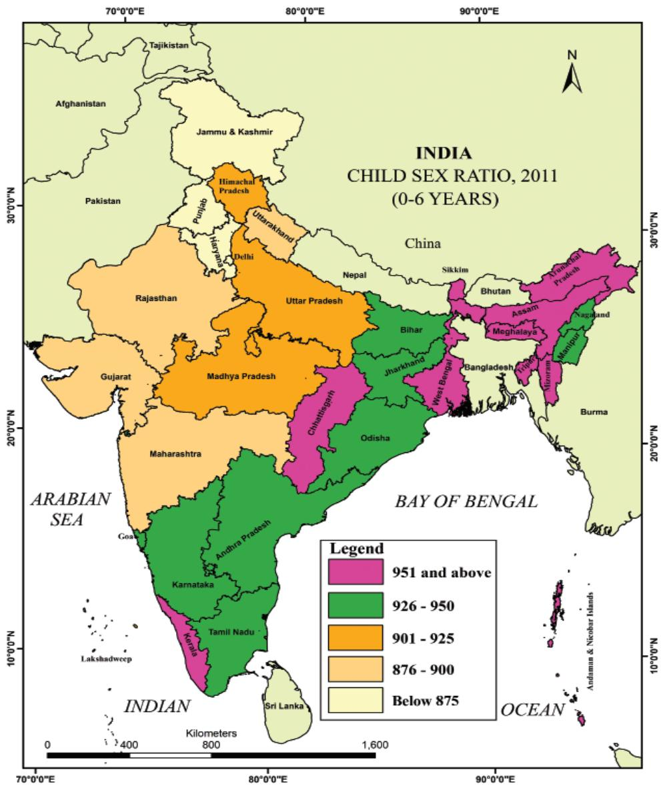

Can you identify your State on this map? What is the child sex ratio in it? How is it different from others with a different colour?

Identify the States which have child sex ratio below 900.

Compare this map with the poster on the next page. How do the two of them tell us about the same issue?

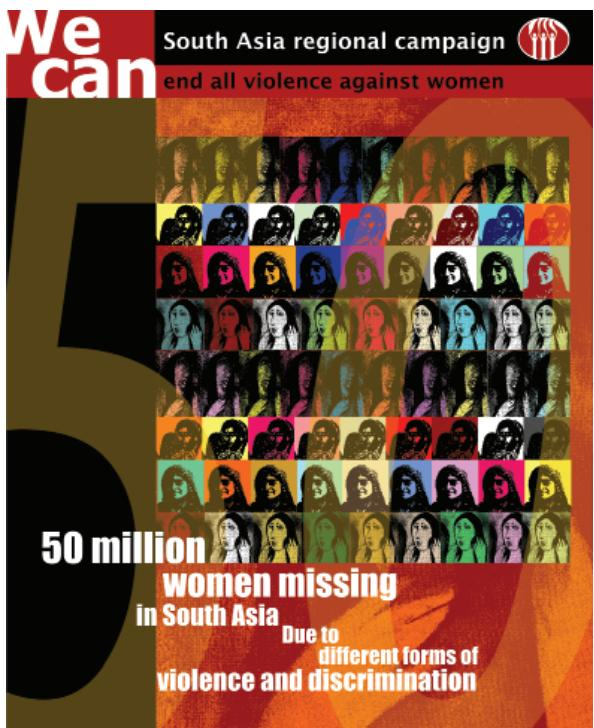  
© Oxfam GB

ratio has fallen below 850 or even 800 in some States.

There are reports of various kinds of harassment, exploitation and violence against women. Urban areas have become particularly unsafe for women. They are not safe

even within their own home from beating, harassment and other forms of domestic violence.

## Women’s political representation

All this is well known. Yet issues related to women’s well being or otherwise are not given adequate attention. This has led many feminists and women’s movements to the conclusion that unless women control power, their problems will not get adequate attention. One way to ensure this is to have more women as elected representatives.

In India, the proportion of women in legislature has been very low. For example, the percentage of elected women members in Lok Sabha has touched 14.36 per cent of its total strength for the fi rst time in 2019. Their share in the state assemblies is less than 5 per cent. In this respect, India is among the

Could you think of some reasons why women’s representation is so low in India? Do you think Americas and Europe have achieved a satisfactory level of women’s representation?

Women in national parliaments in different regions of the world $( \mathrm { i n \% } )$   
  
Note: Figures are for the per cent of women in the directly elected houses of parliament as on 1 October 2018. Source: http://archive.ipu.org/wmn-e/world.htm

bottom group of nations in the world (see the graph below). India is behind the averages for several developing countries of Africa and Latin America. In the government, cabinets are largely all-male even when a woman becomes the Chief Minister or the Prime Minister.

One way to solve this problem is to make it legally binding to have a fair proportion of women in the elected bodies. This is what the Panchayati Raj has done in India. One-third of seats in local government bodies – in panchayats and municipalities – are now reserved for women. Now there are more than 10 lakh elected women representatives in rural and urban local bodies.

Women’s organisations and activists have been demanding a similar reservation of at least one-third of seats in the Lok Sabha and State Assemblies for women. A bill with this proposal has been pending before the Parliament for more than a decade. But there is no consensus over this among all the political parties. The bill has not been passed.

Gender division is an example that some form of social division needs to be expressed in politics. This also shows that disadvantaged groups do benefit when social divisions become a political issue. Do you think that women could have made the gains we noted above if their unequal treatment was not raised in the political domain?

If casteism and communalism are bad, what makes feminism a good thing? Why don’t we oppose all those who divide the society on any lines – caste, religion or gender?

This cartoon offers an understanding of why the Women’s Reservation Bill has not been passed in the Parliament. Do you agree with this reading?

## Religion, communalism and politics

Let us now turn to a very different kind of social division, the division based on religious differences. This division is not as universal as gender, but religious diversity is fairly widespread in the world today. Many countries including India have in their population, followers of different religions. As we noticed in the case of Northern Ireland, even when most of the people belong to the same religion, there can be serious differences about the way people practice that religion. Unlike gender differences, the religious differences are often expressed in the fi eld of politics.

## Consider the following:

 Gandhiji used to say that religion can never be separated from politics. What he meant by religion was not any particular religion like Hinduism or Islam but moral values that inform all religions. He believed that politics must be guided by ethics drawn from religion.   
Human rights groups in our country have argued that most of the victims of communal riots in our country are people from religious minorities. They have demanded that the government take special steps to protect religious minorities.   
 Women’s movement has argued that FAM ILY LAW S of all religions discriminate against women. So they have demanded that government should change these laws to make them more equitable.

All these instances involve a relationship between religion and politics. But they do not seem very wrong or dangerous. Ideas, ideals and values drawn from different religions can and perhaps should play a role in politics. People should be able to express in politics their needs, interests and demands as a member of a religious community. Those who hold political power should sometimes be able to regulate the practice of religion so as to prevent discrimination and oppression. These political acts are not wrong as long as they treat every religion equally.

## Communalism

The problem begins when religion is seen as the basis of the nation. The example of Northern Ireland in Chapter 3 shows the dangers of such an approach to nationalism. The problem becomes more acute when religion is expressed in politics in exclusive and partisan terms, when one religion and its followers are pitted against another. This happens when beliefs of one religion are presented as superior to those of other religions, when the demands of one religious group are formed in opposition to another and when state power is used to establish domination of one religious group over the rest. This manner of using religion in politics is communal politics.

Communal politics is based on the idea that religion is the principal basis of social community. Communalism involves thinking

I am not religious.

Why should I bother about communalism and secularism?

along the following lines. The followers of a particular religion must belong to one community. Their fundamental interests are the same. Any difference that they may have is irrelevant or trivial for community life. It also follows that people who follow different religions cannot belong to the same social community. If the followers of different religions have some commonalities these are superfi cial and immaterial, their interests are bound to be different and involve a conflict. In its extreme form, communalism leads to the belief that people belonging to different religions cannot live as equal citizens within one nation. Either, one of them has to dominate the rest or they have to form different nations.

This belief is fundamentally flawed. People of one religion do not have the same interests and aspirations in every context. Everyone has several other roles, positions and identities. There are many voices inside every community. All these voices have a right to be heard. Therefore any attempt to bring all followers of one religion together in context other than religion is bound to suppress many voices within that community.

Communalism can take various forms in politics:

 The most common expression of communalism is in everyday beliefs. These routinely involve religious prejudices, stereotypes of religious communities and belief in the superiority of one’s religion over other religions. This is so common

that we often fail to notice it, even when we believe in it.

 A communal mind often leads to a quest for political dominance of one’s own religious community. For those belonging to majority community, this takes the form of majoritarian dominance. For those belonging to the minority community, it can take the form of a desire to form a separate political unit.

 P o l i t i c a l m o b i l i s a t i o n o n religious lines is another frequent form of communalism. This involves the use of sacred symbols, religious leaders, emotional appeal and plain fear in order to bring the followers of one religion together in the political arena. In electoral politics, this often involves special appeal to the interests or emotions of voters of one religion in preference to others.

Sometimes communalism takes its most ugly form of communal violence, riots and massacre. India and Pakistan suffered some of the worst communal riots at the time of the Partition. The post-Independence period has also seen large scale communal violence.

## Secular state

Communalism was and continues to be one of the major challenges to democracy in our country. The makers of our Constitution were aware of this challenge. That is why, they chose the model of a secular state. This choice was refl ected in several constitutional provisions that we studied last year:

 There is no offi cial religion for the Indian state. Unlike the status of Buddhism in Sri Lanka, that of Islam

I often crack jokes about people from one religion. Does that make me communal?

Family laws: Those laws that deal with family related matters such as marriage, divorce, adoption, inheritance, etc. In our country, different family laws apply to followers of different religions.

in Pakistan and that of Christianity in England, our Constitution does not give a special status to any religion.

 The Constitution provides to all individuals and communities freedom to profess, practice and propagate any religion, or not to follow any.   
 The Constitution prohibits discrimination on grounds of religion.   
 At the same time, the Constitution allows the state to intervene in the matters of religion in order to ensure equality within religious communities. For example, it bans untouchability.

U n d e r s t o o d i n t h i s s e n s e , secularism is not just an ideology of some parties or persons. This idea constitutes one of the foundations of our country. Communalism should not be seen as a threat to some people in India. It threatens the very idea of India. That is why communalism needs to be combated. A secular Constitution like ours is necessary but not sufficient to combat communalism. Communal prejudices and propaganda need to be countered in everyday life and religion- based mobilisation needs to be countered in the arena of politics.

## Caste and politics

We have seen two instances of the expression of social divisions in the arena of politics, one largely positive and the other largely negative. Let us turn to our fi nal case, that of caste and politics, that has both positive and the negative aspects.

## Caste inequalities

Unlike gender and religion, caste division is special to India. All societies have some kind of social inequality and some form of division of labour. In most societies, occupations are passed on from one generation to another. Caste system is an extreme form of this. What makes it different from other societies is that in this system, hereditary occupational division was sanctioned by rituals. Members of the same caste group were supposed to form a social community that practiced the same or similar occupation, married within the caste group and did not eat with members from other caste groups.

Caste system was based on exclusion of and discrimination against the ‘outcaste’ groups. They were subjected to the inhuman practice of untouchability about which you have studied in Class IX. That is why political leaders and social reformers like Jotiba Phule, Gandhiji, B.R. Ambedkar and Periyar Ramaswami Naicker advocated and worked to establish a society in which caste inequalities are absent.

Partly due to their efforts and partly due to other socio-economic changes, castes and caste system in modern India have undergone great changes. With economic d e v e l o p m e n t , l a r g e s c a l e URB ANISATION, growth of literacy and education, OCCUP ATIONAL M OB ILITY and the weakening of the position of landlords in the villages, the old notions of CASTE HIERARCHY are breaking down. Now, most of the

## Social and Religious Diversity of India

The Census of India records the religion of each and every Indian after every ten years. The person who fi lls the Census form visits every household and records the religion of each member of that household exactly the way each person describes it. If someone says she has ‘no religion’ or that he is an ‘atheist’, this is exactly how it is recorded. Thus we have reliable information on the proportion of diff erent religious communities in the country and how it has changed over the years. The pie chart below presents the population proportion of six major religious communities in the country. Since Independence, the total population of each community has increased substantially but their proportion in the country’s population has not changed much. In percentage terms, the population of the Hindus, Jains and Christians has declined marginally since 1961. The proportion of Muslim, Sikh and Buddhist population has increased slightly. There is a common but mistaken impression that the proportion of the Muslims in the country’s population is going to overtake other religious communities. Expert estimates done for the Prime Minister’s High Level Committee (popularly known as Sachar Committee) show that the proportion of the Muslims is expected to go up a little, by about 3 to 4 per cent, in the next 50 years. It proves that in overall terms, the population balance of diff erent religious communities is not likely to change in a big way.

The same is true of the major caste groups. The Census of India counts two social groups: the Scheduled Castes and the Scheduled Tribes. Both these broad groups include hundreds of castes or tribes whose names are listed in an offi cial Schedule. Hence the prefi x ‘Scheduled’ in their name. The Scheduled Castes, commonly known as Dalits, include those that were previously regarded as ‘outcaste’ in the Hindu social order and were subjected to exclusion and untouchability. The Scheduled Tribes, often referred to as Adivasis, include those communities that led a secluded life usually in hills and forests and did not interact much with the rest of society. In 2011, the Scheduled

Castes were 16.6 per cent and the Scheduled Tribes were 8.6 per cent of the country’s population.

The Census does not yet count the Other Backward Classes, the group we discussed in Class IX. Hence there are some differences about their proportion in the country’s population. The National Sample Survey of 2004–05 estimates their population to be around 41 per cent. Thus the SC, ST and the OBC together account for about two-thirds of the country’s population and about three-fourths of the Hindu population.

Population of different religious communities in India, 2011   
  
Source: Census of India, 2011

I don’t care what my caste is. Why are we discussing all this in the textbook? Are we not promoting casteism by talking about caste?

Now you don’t like it! Didn’t you tell me that wherever there is domination, we should discuss it in Political Science? Will caste disappear if we keep mum about it?

## ssary

Urbanisation: Shift of population from rural areas to urban areas.

Occupational mobility: Shift from one occupation to another, usually when a new generation takes up occupations other than those practiced by their ancestors. Caste hierarchy: A ladder-like formation in which all the caste groups are placed from the ‘highest’ to the ‘lowest’ castes.

times, in urban areas it does not matter much who is walking along next to us on a street or eating at the next table in a restaurant. The Constitution of India prohibited any caste-based discrimination and laid the foundations of policies to reverse the injustices of the caste system. If a person who lived a century ago were to return to India, she would be greatly surprised at the change that has come about in the country.

Yet caste has not disappeared from contemporary India. Some of the older aspects of caste have persisted. Even now most people marry within their own caste or tribe. Untouchability has not ended completely, despite constitutional prohibition. Effects of centuries of advantages and disadvantages continue to be felt today. The caste groups that had access to education under the old system have done very well in acquiring modern education as well. Those groups that did not have access to education or were prohibited from acquiring it have

naturally lagged behind. That is why there is a disproportionately large presence of ‘upper caste’ among the urban middle classes in our country. Caste continues to be closely linked to economic status. (See Plus Box on Page 41.)

## Caste in politics

As in the case of communalism, casteism is rooted in the belief that caste is the sole basis of social community. According to this way of thinking, people belonging to the same caste belong to a natural social community and have the same interests which they do not share with anyone from another caste. As we saw in the case of communalism, such a belief is not borne out by our experience. Caste is one aspect of our experience but it is not the only relevant or the most important aspect.

Caste can take various forms in politics:

 When parties choose candidates in elections, they keep in mind the caste composition of the electorate and nominate candidates from different castes so as to muster necessary support to win elections. When governments are formed, political parties usually take care that representatives of different castes and tribes fi nd a place in it.

 Political parties and candidates in elections make appeals to caste sentiment to muster support. Some political parties are known to favour some castes and are seen as their representatives.

Universal adult franchise and the principle of one-person-one-vote

## Caste inequality today

Caste is an important source of economic inequality because it regulates access to resources of various kinds. For example, in the past, the so-called ‘untouchable’ castes were denied the right to own land, while only the so-called ‘twice born’ castes had the right to education. Although this kind of explicit and formalised inequality based on caste is now outlawed, the eff ects of centuries of accumulated advantages and disadvantages continue to be felt. Moreover, new kinds of inequalities have also developed.

The relationship between caste and economic status has certainly changed a lot. Today, it is possible to fi nd very rich and very poor people in every caste, whether ‘low’ or ‘high’. This was not true even twenty or thirty years ago – it was very rare indeed to fi nd rich people among the ‘lowest’ castes. However, as this evidence from the National Sample Survey shows, caste continues to be very strongly linked to economic status in many important ways:

The average economic status (measured by criteria like monthly consumption expenditure) of caste groups still follows the old hierarchy – the ‘upper’ castes are best off , the Dalits and Adivasis are worst off , and the backward classes are in between.   
Although every caste has some poor members, the proportion living n extreme poverty (below the offi cial ‘poverty line’) is much higher for the lowest castes and much lower for the upper castes, with the backward classes once again in between.   
Although every caste has some members who are rich, the upper castes are heavily over-represented among the rich while the lower castes are severely under-represented.

Percentage of population living below the poverty line, 1999– —2000   

<table><tr><td>Caste and Community groups</td><td>Rural</td><td></td><td>Urban</td></tr><tr><td>Scheduled Tribes</td><td>45.8</td><td></td><td>35.6</td></tr><tr><td>Scheduled Castes</td><td>35.9</td><td></td><td>38.3</td></tr><tr><td>Other Backward Classes</td><td>27.0</td><td></td><td>29.5</td></tr><tr><td>Muslim Upper Castes</td><td>26.8</td><td></td><td>34.2</td></tr><tr><td>Hindu Upper Castes</td><td>11.7</td><td></td><td>9.9</td></tr><tr><td>Christian Upper Castes</td><td>9.6</td><td></td><td>5.4</td></tr><tr><td>Sikh Upper Castes</td><td>0.0</td><td></td><td>4.9</td></tr><tr><td>Other Upper Castes</td><td>16.0</td><td></td><td>2.7</td></tr><tr><td>All Groups</td><td>27.0</td><td></td><td>23.4</td></tr></table>

Note: ‘Upper Caste’ here means those who are not from SC, ST, or OBC. Below the poverty line means those who spent $\yen 327$ or less per person per month in rural and $\yen 454$ or less per person per month in urban areas.

Source: National Sample Survey Organisation (NSSO), Government of India, 55th Round, 1999–2000

© Ajith Ninan - India Today Book of Cartoons   
  
Do you think that political leaders are right to treat people belonging to a caste as ‘vote banks’?

the voters from that caste vote for that party.

 Many political parties may put up candidates from the same caste (if that caste is believed to dominate the electorate in a particular constituency). Some voters have more than one candidate from their caste while many voters have no candidate from their caste.   
 The ruling party and the sitting MP or MLA frequently lose elections in our country. That could not have happened if all castes and communities were frozen in their political preferences.

Clearly, while caste matters in electoral politics, so do many other factors. The voters have strong attachment to political parties which is often stronger than their attachment to their caste or community. People within the same caste or community have different interests depending on their economic condition. Rich and poor or men and women from the same caste often vote very differently. People’s assessment of the performance of the government and the popularity rating of the leaders matter and are often decisive in elections.

## Politics in caste

We have so far looked at what caste does to politics. But it does not mean that there is only a one-way relation between caste and politics. Politics too infl uences the caste system and caste identities by bringing them into the political arena. Thus, it is not politics that gets caste-ridden, it

is the caste that gets politicised. This takes several forms:

 Each caste group tries to become bigger by incorporating within it neighbouring castes or sub-castes which were earlier excluded from it.   
 Various caste groups are required to enter into a coalition with other castes or communities and thus enter into a dialogue and negotiation.   
 New kinds of caste groups have come up in the political arena like ‘backward’ and ‘forward’ caste groups.

Thus, caste plays different kinds of roles in politics. In some situations, expression of caste differences in politics gives many disadvantaged communities the space to demand their share of power. In this sense, caste politics has helped people from Dalits and OBC castes to gain better access to decision making. Several political and non-political organisations have been demanding and agitating for an end to discrimination against particular castes, for more dignity and more access to land, resources and opportunities.

At the same time, exclusive attention to caste can produce negative results as well. As in the case of religion, politics based on caste identity alone is not very healthy in a democracy. It can divert attention from other pressing issues like poverty, development and corruption. In some cases, caste division leads to tensions, confl ict and even violence.

1. Mention diff erent aspects of life in which women are discriminated or disadvantaged in India.   
2. State diff erent forms of communal politics with one example each.   
3. State how caste inequalities are still continuing in India.   
4. State two reasons to say that caste alone cannot determine election results in India.   
5. What is the status of women’s representation in India’s legislative bodies?   
6. Mention any two constitutional provisions that make India a secular state.   
7. When we speak of gender divisions, we usually refer to:

(a) Biological diff erence between men and women   
(b) Unequal roles assigned by the society to men and women   
(c) Unequal child sex ratio   
(d) Absence of voting rights for women in democracies

8. In India seats are reserved for women in

(a) Lok Sabha   
(b) State legislative assemblies   
(c) Cabinets   
(d) Panchayati Raj bodies

9. Consider the following statements on the meaning of communal politics. Communal politics is based on the belief that:

A. One religion is superior to that of others.   
B. People belonging to diff erent religions can live together happily as equal citizens.   
C. Followers of a particular religion constitute one community.   
D. State power cannot be used to establish the domination of one religious group over others.

Which of the statements are correct?

(a) A, B, C, and D (b) A, B, and D (c) A and C (d) B and D

10. Which among the following statements about India’s Constitution is wrong? It

(a) prohibits discrimination on grounds of religion.   
(b) gives offi cial status to one religion.   
(c) provides to all individuals freedom to profess any religion.   
(d) ensures equality of citizens within religious communities.

11. Social divisions based on are peculiar to India.

12. Match List I with List II and select the correct answer using the codes given below the Lists:

<table><tr><td></td><td>List I</td><td>List II</td></tr><tr><td>1.</td><td>A person who believes in equal rights and opportunities for women and men</td><td>A. Communalist</td></tr><tr><td>2.</td><td>A person who says that religion is the principal basis of community</td><td>B. Feminist</td></tr><tr><td>3.</td><td>A person who thinks that caste is the principal basis of community</td><td>C. Secularist</td></tr><tr><td>4.</td><td>A person who does not discriminate others on the basis of religious beliefs</td><td>D. Castiest</td></tr></table>

<table><tr><td></td><td>1</td><td>2</td><td>3</td><td>4</td></tr><tr><td>(a)</td><td>B</td><td>C</td><td>A</td><td>D</td></tr><tr><td>(b)</td><td>B</td><td>A</td><td>D</td><td>C</td></tr><tr><td>(c)</td><td>D</td><td>C</td><td>A</td><td>B</td></tr><tr><td>(d)</td><td>C</td><td>A</td><td>B</td><td>D</td></tr></table>

# Chapter 4
# Political Parties

1072CH04

## Overview

In this tour of democracy, we have come across political parties several times. In Class IX, we noticed the role of political parties in the rise of democracies, in the formation of constitutional designs, in electoral politics and in the making and working of governments. In this textbook, we have glanced at political parties as vehicles of federal sharing of political power and as negotiators of social divisions in the arena of democratic politics. Before concluding this tour, let us take a close look at the nature and working of political parties, especially in our country. We begin by asking two common questions: Why do we need parties? How many parties are good for a democracy? In the light of these, we introduce the national and regional political parties in today’s India and then look at what is wrong with political parties and what can be done about it.

## Why do we need political parties?

Political parties are easily one of the most visible institutions in a democracy. For most ordinary citizens, democracy is equal to political parties. If you travel to remote parts of our country and speak to the less educated citizens, you could come across people who may not know anything about our Constitution or about the nature of our government. But chances are that they would know something about our political parties. At the same time, this visibility does not mean popularity. Most people tend

  
(1)

to be very critical of political parties. They tend to blame parties for all that is wrong with our democracy and our political life. Parties have become identifi ed with social and political divisions.

Therefore, it is natural to ask – do we need political parties at all? About hundred years ago, there were few countries of the world that had any political party. Now there are few that do not have parties. Why did political parties become so omnipresent in democracies all over the world? Let us fi rst answer what political parties are and what they do, before we say why we need them.

## Meaning

A political party is a group of people who come together to contest elections and hold power in the government. They agree on some policies and programmes for the society with a view to promote the collective good. Since there can be different views on what is good for

So, you agree with me. Parties are partial, partisan and lead to partitions. Parties do nothing but divide people. That is their real function!

  
(2)

  
(3)

Election Commission has offi cially banned wall writing by parties during election times. Most political parties argue that was the cheapest way for their campaign. These election times used to create amazing graffi ti on the walls. Here are some examples from Tamil Nadu.

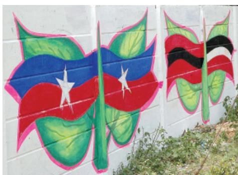  
(4)

## GlO ssary

Partisan: A person

who is strongly

committed to a

party, group or

faction. Partisanship

is marked by a

tendency to take a

ide and inability

to take a balanced

view on an issue.

all, parties try to persuade people why their policies are better than others. They seek to implement these policies by winning popular support through elections.

Thus, parties refl ect fundamental political divisions in a society. Parties are about a part of the society and thus, involve P ARTISANSHIP . Thus, a party is known by which part it stands for, which policies it supports and whose interests it upholds. A political party has three components:

 the leaders,   
 the active members and   
 the followers

## Functions

What does a political party do? Basically, political parties fi ll political offi ces and exercise political power. Parties do so by performing a series of functions:

Parties contest elections. In most democracies, elections are fought

mainly among the candidates put up by political parties. Parties select their candidates in different ways. In some countries, such as the USA, members and supporters of a party choose its candidates. Now more and more countries are following this method. In other countries like India, top party leaders choose candidates for contesting elections.

2 Parties put forward different policies and programmes and the voters choose from them. Each of us may have different opinions and views on what policies are suitable for the society. But no government can handle such a large variety of views. In a democracy, a large number of similar opinions have to be grouped together to provide a direction in which policies can be formulated by the governments. This is what the parties do. A party reduces a vast multitude of opinions into a few basic positions which it

supports. A government is expected to base its policies on the line taken by the RULING P ARTY.

3 Parties play a decisive role in making laws for a country. Formally, laws are debated and passed in the legislature. But since most of the members belong to a party, they go by the direction of the party leadership, irrespective of their personal opinions.   
4 Parties form and run governments. As we noted last year, the big policy decisions are taken by political executive that comes from the political parties. Parties recruit leaders, train them and then make them ministers to run the government in the way they want.   
5 Those parties that lose in the elections play the role of opposition to the parties in power, by voicing different views and criticising government for its failures or wrong policies. Opposition parties also mobilise opposition to the government.   
6 Parties shape public opinion. They raise and highlight issues. Parties have lakhs of members and activists spread all over the country. Many of the pressure groups are the extensions of political parties among different sections of society. Parties sometimes also launch movements for the resolution of problems faced by people. Often opinions in the society crystallise on the lines parties take.   
7 Parties provide people access to government machinery and welfare schemes implemented by governments. For an ordinary citizen it is easy to approach a local party leader than a government offi cer.

That is why, they feel close to parties even when they do not fully trust them. Parties have to be responsive to people’s needs and demands. Otherwise people can reject those parties in the next elections.

## Necessity

This list of functions in a sense answers the question asked above: we need political parties because they perform all these functions. But we still need to ask why modern democracies cannot exist without political parties. We can understand the necessity of political parties by imagining a situation without parties. Every candidate in the elections will be independent. So no one will be able to make any promises to the people about any major policy changes. The government may be formed, but its utility will remain ever uncertain. Elected representatives will be accountable to their constituency for what they do in the locality. But no one will be responsible for how the country will be run.

We can also think about it by looking at the non-party based elections to the panchayat in many states. Although, the parties do not contest formally, it is generally noticed that the village gets split into more than one faction, each of which puts up a ‘panel’ of its candidates. This is exactly what the party does. That is the reason we fi nd political parties in almost all countries of the world, whether these countries are big or small, old or new, developed or developing.

The rise of political parties is directly linked to the emergence of representative democracies.

Okay, granted that we can’t live without political parties. But tell me on what grounds do people support a political party?

Ruling Party: Political party that runs government.

As we have seen, large societies need representative democracy. As societies became large and complex, they also needed some agency to gather different views on various issues and to present these to the government. They needed some ways, to bring various representatives together so that a

responsible government could be formed. They needed a mechanism to support or restrain the government, make policies, justify or oppose them. Political parties fulfi ll these needs that every representative government has. We can say that parties are a necessary condition for a democracy.

Categorise these photographs by the functions of political parties they illustrate. Find one photograph or news clipping from your own area for each of the functions listed above.

1: Activists of BJP Mahila Morcha demonstrate against hike in prices of onions and LPG in Visakhapatnam.   
2: Minister distributes ` One lakh cheque to the families of hooch victims at their houses.   
3: Activists of CPI (M), CPI, OGP and JD (S) take out a rally in Bhubaneswar to protest against POSCO, the Korean steel company for being permitted by the State Government to export iron ore from Orissa to feed steel plants in China and Korea.

## How many parties should we have?

In a democracy any group of citizens is free to form a political party. In this formal sense, there are a large number of political parties in each country. More than 750 parties are registered with the Election Commission of India. But not all these parties are serious contenders in the elections. Usually only a handful of parties are effectively in

the race to win elections and form the government. So the question is: how many major or effective parties are good for a democracy?

In some countries, only one party is allowed to control and run the government. These are called one-party systems. In Class IX, we noted that in China, only the Communist Party is allowed to

rule. Although, legally speaking, people are free to form political parties, it does not happen because the electoral system does not permit free competition for power. We cannot consider one-party system as a good option because this is not a democratic option. Any democratic system must allow at least two parties to compete in elections and provide a fair chance for the competing parties to come to power.

In some countries, power usually changes between two main parties. Several other parties may exist, contest elections and win a few seats in the national legislatures. But only the two main parties have a serious chance of winning majority of seats to form government. Such a party system is called two-party system. The United States of America and the United Kingdom are examples of two-party system.

If several parties compete for power, and more than two parties have a reasonable chance of coming to power either on their own strength or in alliance with others, we call it a multiparty system. Thus in India, we have a multiparty system. In this system, the government is formed by various parties coming together in a

coalition. When several parties in a multi-party system join hands for the purpose of contesting elections and winning power, it is called an alliance or a front. For example, in India there were three such major alliances in 2004 parliamentary elections– the National Democratic Alliance, the United Progressive Alliance and the Left Front. The multiparty system often appears very messy and leads to political instability. At the same time, this system allows a variety of interests and opinions to enjoy political representation.

So, which of these is better? Perhaps the best answer to this very common question is that this is not a very good question. Party system is not something any country can choose. It evolves over a long time, depending on the nature of society, its social and regional divisions, its history of politics and its system of elections. These cannot be changed very quickly. Each country develops a party system that is conditioned by its special circumstances. For example, if India has evolved a multiparty system, it is because the social and geographical diversity in such a large country is not easily absorbed by two or even three parties. No system is ideal for all countries and all situations.

Let us apply what we have learnt about party systems to the various states within India. Here are three major types of party systems that exist at the State level. Can you fi nd the names of at least two States for each of these types?

 Two-party system   
 Multiparty system with two alliances   
 Multiparty system

## Popular participation political parties

It is often said that political parties are facing a crisis because they are very unpopular and the citizens are indiff erent to political parties. The available evidence shows that this belief is

only partly true for India. The evidence, based on a series of large sample surveys conducted over several decades, shows that:

 Political parties do not enjoy much trust among the people in South Asia. The proportion of those who say their trust in political parties is ‘not much’ or ‘not at all’ is more than those who have ‘some’ or ‘great’ trust.   
 The same is true of most other democracies as well. Poli tical parties are one of the least trusted institutions all over the world.   
 Yet the level of participation in the activities of political parties was fairly high. The proportion of those who said they were members of some political party was higher in India than many advanced countries like Canada, Japan, Spain and South Korea.   
 Over the last three decades, the proportion of those who

report to be members of political parties in India has gone up steadily.

 The proportion of those who say they feel ‘close to a political party’ has also gone up in India in this period.

  
Despite fluctuations, partyidentification has gone up in India   
Party membership has risen in India

Those who say they are member ofapolitical party

  
Party membership is higher in South Asia than the rest of the Globe

Those who say they are member of apolitical party

  
Source: SDSA Team, State of Democracy in South Asia, Delhi: Oxford University Press, 2007

  
© Tab - The Calgary Sun, Cagle Cartoons Inc.   
Does the cartoon refl ect the data graphics shown on the previous page?

## National parties

Democracies that follow a federal system all over the world tend to have two kinds of political parties: parties that are present in only one of the federal units and parties that are present in several or all units of the federation. This is the case in India as well. There are some country-wide parties, which are called ‘national parties’. These parties have their units in various states. But by and large, all these units follow the same policies, programmes and strategy that is decided at the national level.

Every party in the country has to register with the Election Commission. While the Commission treats all parties equally, it offers some special facilities to large and established parties. These parties are given a unique symbol – only the offi cial candidates of that party can use that election symbol. Parties that get this privilege and some other

special facilities are ‘recognised’ by the Election Commission for this purpose. That is why these parties are called, ‘recognised political parties’. The Election Commission has laid down detailed criteria of the proportion of votes and seats that a party must get in order to be a recognised party. A party that secures at least six per cent of the total votes in an election to the Legislative Assembly of a State and wins at least two seats is recognised as a State party. A party that secures at least six per cent of the total votes in Lok Sabha elections or Assembly elections in four States and wins at least four seats in the Lok Sabha is recognised as a national party.

According to this classifi cation, there were seven recognised national parties in the country in 2019. Let us learn something about each of these parties.

For more details about registration and recognition of political parties by the Election Commission of India, visit https:// eci.gov.in

A l l I n d i a T r i n a m o o l Congress (AITC): Launched on 1 January 1998 under the leadership of Mamata

Banerjee. Recognised as a national party in 2016. The party’s symbol is flowers and grass. Committed to secularism and federalism. Has been in power in West Bengal since 2011. Also has a presence in Arunachal Pradesh, Manipur and Tripura. In the General Elections held in 2019, it got 4.07 per cent votes and won 22 seats, making it the fourth largest party in the Lok Sabha.

Bahujan Samaj Party (BSP): Formed in 1984 under the leadership of Kanshi Ram. Seeks

to represent and secure power for the bahujan samaj which includes the dalits, adivasis, OBCs and religious minorities. Draws inspiration from the ideas and teachings of Sahu Maharaj, Mahatma Phule, Periyar Ramaswami Naicker and Babasaheb Ambedkar. Stands for the cause of securing the interests and welfare of the dalits and oppressed people. It has its main base in the state of Uttar Pradesh and substantial presence in neighbouring states like Madhya Pradesh, Chhattisgarh, Uttarakhand, Delhi and Punjab. Formed government in Uttar Pradesh several times by taking the support of different parties at different times. In the Lok Sabha elections held in 2019, it polled about 3.63 per cent votes and secured 10 seats in the Lok Sabha.

Bharatiya Janata Party (BJP): Founded in 1980 by reviving the erstwhile Bharatiya Jana Sangh,

formed by Syama Prasad Mukherjee in 1951. Wants to build a strong and modern India by drawing inspiration from India’s ancient culture and values; and Deendayal Upadhyaya’s ideas

of integral humanism and Antyodaya. Cultural nationalism (or ‘Hindutva’) is an important element in its conception of Indian nationhood and politics. Wants full territorial and political integration of Jammu and Kashmir with India, a uniform civil code for all people living in the country irrespective of religion, and ban on religious conversions. Its support base increased substantially in the 1990s. Earlier limited to north and west and to urban areas, the party expanded its support in the south, east, the northeast and to rural areas. Came to power in 1998 as the leader of the National Democratic Alliance (NDA) including several regional parties. Emerged as the largest party with 303 members in the 2019 Lok Sabha elections. Currently leads the ruling NDA government at the Centre.

Communist Party of India (CPI): Formed in 1925. Believes in M a r x i s m - L e n i n i s m ,

secularism and democracy. Opposed to the forces of secessionism and communalism. Accepts parliamentary democracy as a means of promoting the interests of the working class, farmers and the poor. Became weak after the split in the party in 1964 that led to the formation of the CPI(M). Signifi cant presence in the states of Kerala, West Bengal, Punjab, Andhra Pradesh and Tamil Nadu. Its support base had gradually declined over the years. It secured less than 1 per cent votes and 2 seats in the 2019 Lok Sabha elections. Advocates the coming together of all left parties to build a strong left front.

Communist Party of India - Marxist (CPI-M): Founded in 1964. Believes in Marxism-Leninism.

Supports socialism, secularism and democracy and opposes imperialism

and communalism. Accepts democratic elections as a useful and helpful means for securing the objective of socioeconomic justice in India. Enjoys strong support in West Bengal, Kerala and Tripura, especially among the poor, factory workers, farmers, agricultural labourers and the intelligentsia. Critical of the new economic policies that allow free fl ow of foreign capital and goods into the country. Was in power in West Bengal without a break for 34 years. In the 2019 Lok Sabha elections, it won about 1.75 per cent of votes and 3 seats.

Indian National Congress (INC): Popularly known as the Congress Party. One of the oldest parties of the world. Founded in 1885 and

has experienced many splits. Played a dominant role in Indian politics at the national and state level for several decades after India’s Independence. Under the leadership of Jawaharlal Nehru, the party sought to build a modern secular democratic republic in India. Ruling party at the centre till 1977 and then from 1980 to 1989. After 1989, its support declined, but it

continues to be present throughout the country, cutting across social divisions. A centrist party (neither rightist nor leftist) in its ideological orientation, the party espouses secularism and welfare of weaker sections and minorities. The INC supports new economic reforms but with a human face. Leader of the United Progressive Alliance (UPA) government from 2004 to 2019. In the 2019 Lok Sabha election, it won $1 9 . 5 \%$ votes and 52 seats.

Nationalist Congress Party

(NCP): Formed in 1999 f o l l o w i n g a s p l i t i n t h e Congress party. Espouses

democracy, Gandhian secularism, equity, social justice and federalism. Wants that high offi ces in government be confi ned to natural born citizens of the country. A major party in Maharashtra and has a significant presence in Meghalaya, Manipur and Assam. A coalition partner in the state of Maharashtra in alliance with the Congress. Since 2004, a member of the United Progressive Alliance. In 2019 Lok Sabha election, it won $1 . 4 \%$ votes and 5 seats.

## State parties

Other than these seven parties, most of the major parties of the country are classifi ed by the Election Commission as ‘State parties’. These are commonly referred to as regional parties. Yet these parties need not be regional in their ideology or outlook. Some of these parties are all India parties that happen to have succeeded only in some states. Parties like the Samajwadi Party and Rashtriya Janata Dal have national level political organisation with units in several states. Some of these parties like Biju Janata Dal, Sikkim Democratic Front, Mizo National Front and Telangana Rashtra Samithi are conscious about their State identity.

Over the last three decades, the number and strength of these parties has expanded. This made the Parliament of India politically more and more diverse. No one national party is able to secure on its own a majority in the Lok Sabha, until 2014. As a result, the national parties are compelled to form alliances with State parties. Since 1996, nearly every one of the State parties has got an opportunity to be a part of one or the other national level coalition government. This has contributed to the strengthening of federalism and democracy in our country. (See the map on the next page for details of these parties).

## Challenges to political parties

We have seen how crucial political parties are for the working of democracy. Since parties are the most visible face of democracy, it is natural that people blame parties for whatever is wrong with the working of democracy. All over the world, people express strong dissatisfaction with the failure of political parties to perform their functions well. This is the case in our country too. Popular dissatisfaction and criticism has focussed on four problem areas

Berlusconi Puppet Theatre

in the working of political parties. Political parties need to face and overcome these challenges in order to remain effective instruments of democracy.

The first challenge is lack of internal democracy within parties. All over the world there is a tendency in political parties towards the concentration of power in one or few leaders at the top. Parties do not keep membership registers, do not hold organisational meetings, and do not conduct internal elections regularly. Ordinary members of not get sufficient n what happens inside

the party. They do not have the means or the connections needed to infl uence the decisions. As a result, the leaders a s s u m e g r e a t e r p o w e r t o m a k e decisions in the name of the party. Since one or few l e a d e r s e x e r c i s e paramount power in the party, those who disagree with the leadership fi nd

sconi was the Prime ter of Italy. He is also f the top businessmen ly. He is the leader of orza Italia founded in His company owns TV nels, the most important shing company, a foot lub (AC Milan) and a This cartoon was made g the last elections.

it diffi cult to continue in the party. More than loyalty to party principles and policies, personal loyalty to the leader becomes more important.

The second challenge of dynastic succession is related to the first one. Since most political parties do not practice open and transparent procedures for their functioning, there are very few ways for an ordinary worker to rise to the top in a party. Those who happen to be the leaders are in a position of unfair advantage to favour people close to them or even their family members. In many parties, the top positions are always controlled by members of one family. This is unfair to other members of that party. This is also bad for democracy, since people who do not have adequate experience or popular support come to occupy positions of power. This tendency is present in some measure all over the world, including in some of the older democracies.

The third challenge is about the growing role of money and muscle power in parties, especially during elections. Since parties are focussed only on winning elections, they tend to use short-cuts to win elections. They tend to nominate those candidates who have or can raise lots of money. Rich people and companies who give funds to the parties tend to have infl uence on the policies and decisions of the party. In some cases, parties support criminals who can win elections. Democrats all over the world are worried about the increasing role of rich people and big companies in democratic politics.

The fourth challenge is that very often parties do not seem to offer a meaningful choice to the voters. In order to offer meaningful choice, parties must be signifi cantly different. In recent years, there has been a decline in the ideological differences among parties in most parts of the world. For example, the difference between the Labour Party and the Conservative Party in Britain is very little. They agree on more fundamental aspects but differ only in details on how policies are to be framed and implemented. In our country too, the differences among all the major parties on the economic policies have reduced. Those who want really different policies have no option available to them. Sometimes people cannot even elect very different leaders either, because the same set of leaders keep shifting from one party to another.

This cartoon was drawn during the Presidency of George Bush of the Republican Party in the USA. The party’s symbol is elephant. The cartoon seems to suggest that the Corporate America controls all major institutions of the country.

  
Youalready have somuch money.Why do you wantto contestthe elections?   
© Manjul - DNA

Does this suggest that in democracies people contest elections only to make money?

But isn’t it true that there are politicians committed to the well-being of the people?

Can you identify which of the challenges described in this section are being highlighted in these cartoons (on pages 57 to 59)? What are the ways to curb the misuse of money and muscle power in politics?

## How can parties be reformed?

In order to face these challenges, political parties need to be reformed. The question is: Are political parties willing to reform? If they are willing, what has prevented them from reforming so far? If they are not willing, is it possible to force them to reform? Citizens all over the world face this question. This is not a simple question to answer. In a democracy, the fi nal decision is made by leaders who represent political parties. People can replace them, but only by another set of party

leaders. If all of them do not wish to reform, how can anyone force them to change?

Let us look at some of the recent efforts and suggestions in our country to reform political parties and its leaders:

 The Constitution was amended to prevent elected MLAs and MPs from changing parties. This was done because many elected representatives were indulging in DEFECTION in order to become ministers or for cash rewards. Now the law says that if

## Glo ssary

Defection: Changing party allegiance from the party on which a person got elected (to a legislative body) to a different party.

  
Do you agree that this form of reforming political parties will be acceptable to them?

any MLA or MP changes parties, he or she will lose the seat in the legislature. This new law has helped bring defection down. At the same time, this has made any dissent even more diffi cult. MPs and MLAs have to accept whatever the party leaders decide.

 The Supreme Court passed an order to reduce the influence of money and criminals. Now, it is mandatory for every candidate who contests elections to fi le an AFFIDAVIT giving details of his property and criminal cases pending against him. The new system has made a lot of information available to the public. But there is no system to check if the information given by the candidates is true. As yet we do not know if it has led to decline in the infl uence of the rich and the criminals.

 The Election Commission passed an order making it necessary for political parties to hold their organisational elections and fi le their income tax returns. The parties have started doing so but sometimes it

is mere formality. It is not clear if this step has led to greater internal democracy in political parties.

Besides these, many suggestions are often made to reform political parties:

 A law should be made to regulate the internal affairs of political parties. It should be made compulsory for political parties to maintain a register of its members, to follow its own constitution, to have an independent authority, to act as a judge in case of party disputes, to hold open elections to the highest posts.

 It should be made mandatory for political parties to give a minimum number of tickets, about one-third, to women candidates. Similarly, there should be a quota for women in the decision making bodies of the party.

 There should be state funding of elections. The government should give parties money to support their election expenses. This support could be given in kind: petrol, paper, telephone, etc. Or it could be given in cash on the basis of the votes secured by the party in the last election.

These suggestions have not yet been accepted by political parties. If and when these are accepted these could lead to some improvement. But we must be very careful about legal solutions to political problems. Over-regulation of political parties can be counter-productive. This would force all parties to fi nd ways to cheat the law. Besides, political parties will not agree to pass a law that they do not like.

There are two other ways in which political parties can be reformed. One, people can put

pressure on political parties. This can be done through petitions, publicity and agitations. Ordinary citizens, pressure groups and movements and the media can play an important role in this. If political parties feel that they would lose public support by not taking up reforms, they would become more serious about reforms. Two, political parties can improve if

those who want this, join political parties. The quality of democracy depends on the degree of public participation. It is diffi cult to reform politics if ordinary citizens do not take part in it and simply criticise it from the outside. The problem of bad politics can be solved by more and better politics. We shall return to this theme in the fi nal chapter.

1. State the various functions political parties perform in a democracy.   
2. What are the various challenges faced by political parties?   
3. Suggest some reforms to strengthen parties so that they perform their functions well?   
4. What is a political party?   
5. What are the characteristics of a political party?   
6. A group of people who come together to contest elections and hold power in the government is called a   
7. Match List I (organisations and struggles) with List II and select the correct answer using the codes given below the lists:

<table><tr><td></td><td>List I</td><td>List II</td></tr><tr><td>1.</td><td>Congress Party</td><td>A. National Democratic Alliance</td></tr><tr><td>2.</td><td>Bharatiya Janata Party</td><td>B. State party</td></tr><tr><td>3.</td><td>Communist Party of India (Marxist)</td><td>C. United Progressive Alliance</td></tr><tr><td>4.</td><td>Telugu Desam Party</td><td>D. Left Front</td></tr></table>

<table><tr><td></td><td>1</td><td>2</td><td>3</td><td>4</td></tr><tr><td>(a)</td><td>C</td><td>A</td><td>B</td><td>D</td></tr><tr><td>(b)</td><td>C</td><td>D</td><td>A</td><td>B</td></tr><tr><td>(c)</td><td>C</td><td>A</td><td>D</td><td>B</td></tr><tr><td>(d)</td><td>D</td><td>C</td><td>A</td><td>B</td></tr></table>

8. Who among the following is the founder of the Bahujan Samaj Party?

A. Kanshi Ram   
B. Sahu Maharaj   
C. B.R. Ambedkar   
D. Jotiba Phule

9. What is the guiding philosophy of the Bharatiya Janata Party?

A. Bahujan Samaj   
B. Revolutionary democracy   
C. Integral humanism   
D. Modernity

10. Consider the following statements on parties.

A. Political parties do not enjoy much trust among the people.   
B. Parties are often rocked by scandals involving top party leaders.   
C. Parties are not necessary to run governments.

Which of the statements given above are correct?

(a) A, B, and C (b) A and B (c) B and C (d) A and C

11. Read the following passage and answer the questions given below:

Muhammad Yunus is a famous economist of Bangladesh. He received several international honours for his eff orts to promote economic and social development for the benefi t of the poor. He and the Grameen Bank that he started jointly, received the Nobel Peace Prize for the year 2006. In February 2007, he decided to launch a political party and contest in the parliamentary elections. His objective was to foster proper leadership, good governance and build a new Bangladesh. He felt that only a political party diff erent from the traditional ones would bring about new political culture. His party would be democratic from the grassroots level.

The launching of the new party, called Nagarik Shakti (Citizens’ Power), has caused a stir among the Bangladeshis. While many welcomed his decision, some did not like it. “Now I think Bangladesh will have a chance to choose between good and bad and eventually have a good government,” said Shahedul Islam, a government offi cial. “That government, we hope, would not only keep itself away from corruption but also make fi ghting corruption and black money a top priority.”

But leaders of traditional political parties who dominated the country’s politics for decades were apprehensive. “There was no debate (over him) winning the Nobel, but politics is diff erent – very challenging and often controversial,” said a senior leader of the Bangladesh Nationalist Party. Some others were highly critical. They asked why he was rushing into politics. “Is he being planted in politics by mentors from outside the country,” asked one political observer.

Do you think Yunus made a right decision to fl oat a new political party?

Do you agree with the statements and fears expressed by various people? How do you want this new party organised to make it diff erent from other parties? If you were the one to begin this political party, how would you defend it?

# Chapter 5
# Outcomes of Democracy

1072CH05

## Overview

As we begin to wind up our tour of democracy, it is time to move beyond our discussion of specifi c themes and ask a general set of questions: What does democracy do? Or, what outcomes can we reasonably expect of democracy? Also, does democracy fulfi l these expectations in real life? We begin by thinking about how to assess the outcomes of democracy. After some clarity on how to think on this subject, we proceed to look at the expected and actual outcomes of democracy in various respects: quality of government, economic well-being, inequality, social differences and confl ict and fi nally freedom and dignity.

Did we reach these conclusions in Madam Lyngdoh’s class? I loved that class because students were not being dictated any conclusions.

## How do we assess democracy’s outcomes?

Do you remember how students in Madam Lyngdoh’s class argued about democracy? This was in Chapter 2 of Class IX textbook. It emerged from that conversation that democracy is a better form of government when compared with dictatorship or any other alternative. We felt that democracy was better because it:

 Promotes equality among citizens;   
 Enhances the dignity of the individual;   
Improves the quality of decision-making;   
Provides a method to resolve confl icts; and   
 Allows room to correct mistakes.

Are these expectations realised under democracies? When we talk to people around us, most of them support democracy against other alternatives, such as rule by a monarch or military or religious leaders. But not so many of them would be satisfied with the democracy in practice. So we face a dilemma: democracy is seen to be good in

© RK Laxman - Brushing up the years   
  
Is democracy all about coping with multiple pressures and accommodating diverse demands?

principle, but felt to be not so good in its practice. This dilemma invites us to think hard about the outcomes of democracy. Do we prefer democracy only for moral reasons? Or are there some prudential reasons to support democracy too?

Over a hundred countries of the world today claim and practice some kind of democratic politics: they have formal constitutions, they hold elections, they have parties and they guarantee rights of citizens. While these features are common to most of them, these democracies are very much different from each other in terms of their social situations, their economic achievements and their cultures. Clearly, what may be achieved or not achieved under each of these democracies will be very different. But is there something that we can expect from every democracy, just because it is democracy?

Our interest in and fascination for democracy often pushes us into taking a position that democracy can address all socio-economic and political problems. If some of our expectations are not met, we start blaming the idea of democracy. Or, we start doubting if we are living in a democracy. The fi rst step towards thinking carefully about the outcomes of democracy is to recognise that democracy is just a form of government. It can only create conditions for achieving something. The citizens have to take advantage of those conditions and achieve those goals. Let us examine some of the things we can reasonably expect from democracy and examine the record of democracy.

## Accountable, responsive and legitimate government

There are some things that democracy must provide. In a democracy, we are most concerned with ensuring that people will have the right to choose their rulers and people will have control over the rulers. Whenever possible and necessary, citizens should be able to participate in decision making, that affects them all. Therefore, the most basic outcome of democracy should be that it produces a government that is accountable to the citizens, and responsive to the needs and expectations of the citizens.

Before we go into this question, we face another common question: Is the democratic government effi cient? Is it effective? Some people think that democracy produces less effective government. It is, of course, true that non-democratic rulers do not have to bother about deliberation in assemblies or worry about majorities and public opinion. So, they can be very quick and efficient in decision making and implementation. Democracy is based on the idea of deliberation and negotiation. So, some delay is bound to take place. Does that make democratic government ineffi cient?

Let us think in terms of costs. Imagine a government that may take decisions very fast. But it may take decisions that are not accepted by the people and may therefore face problems. In contrast, the democratic government will take more time to follow procedures before arriving at a decision. But because it has followed procedures, its decisions may be both more acceptable to the people and more effective. So, the cost of time that democracy pays is perhaps worth it.

Now look at the other side – democracy ensures that decision making will be based on norms and procedures. So, a citizen who wants to know if a decision was taken through the correct procedures can fi nd this out. She has the right and the means to examine the process of decision making. This is known as transparency. This factor is often missing from a non-democratic government. Therefore, when we are trying to fi nd out the outcomes of democracy, it is right to expect democracy to produce a government that follows procedures and is accountable to the people. We can also expect that the democratic government develops mechanisms for citizens to hold the government accountable and mechanisms for citizens to take part in decision making whenever they think fi t.

If you wanted to measure democracies on the basis of this expected outcome, you would look for the following practices and institutions: regular, free and fair elections; open public debate on

Can you think of what and how the government knows about you and your family (for example ration cards and voter identity cards)? What are the sources of information for you about the government?

So, the best outcome of democracy is that it is a democracy! That is what we have discovered after all this mental gymnastics?

major policies and legislations; and citizens’ right to information about the government and its functioning. The actual performance of democracies shows a mixed record on this. Democracies have had greater success in setting up regular and free elections and in setting up conditions for open public debate. But most democracies fall short of elections that provide a fair chance to everyone and in subjecting every decision to public debate. Democratic governments do not have a very good record when it comes to sharing information with citizens. All one can say in favour of democratic regimes is that they are much better than any n o n - d e m o c r a t i c r e g i m e i n these respects.

In substantive terms, it may be reasonable to expect from democracy a government that is attentive to the needs and demands of the people and is largely free of corruption. The record of democracies is not impressive on these two counts. Democracies often frustrate the needs of the people and often ignore

the demands of a majority of its population. The routine tales of corruption are enough to convince us that democracy is not free of this evil. At the same time, there is nothing to show that non-democracies are less corrupt or more sensitive to the people.

There is one respect in which democratic government is certainly better than its alternatives: democratic government is legitimate government. It may be slow, less efficient, not always very responsive or clean. But a democratic government is people’s own government. That is why, there is an overwhelming support for the idea of democracy all over the world. As the accompanying evidence from South Asia shows, the support exists in countries with democratic regimes as well as countries without democratic regimes. People wish to be ruled by representatives elected by them. They also believe that democracy is suitable for their country. Democracy’s ability to generate its own support is itself an outcome that cannot be ignored.

Democracy is preferred over dictatorship everywhere except Pakistan   
  
Those who agree with one of the statements

Bangladesh India Nepal Pakistan Sri Lanka   

<table><tr><td>Democracy is preferable</td><td>69</td><td>70</td><td>62</td><td>37</td><td>71</td></tr><tr><td>Sometimes dictatorship is better</td><td>6</td><td>9</td><td>10</td><td>14</td><td>11</td></tr><tr><td>Doesn&#x27;t matter to me</td><td>25</td><td>21</td><td>28</td><td>49</td><td>18</td></tr></table>

  
Very few doubt the suitability of democracy for their own country How suitable is democracy for your country?

Overwhelming support for democracy Those who agree with the rule of leaders elected by the people   
  
Source: SDSA Team, State of Democracy in South Asia, Delhi: Oxford University Press, 2007

## Economic growth and development

If democracies are expected to produce good governments, then is it not fair to expect that they would also produce development? Evidence shows that in practice, many democracies did not fulfi l this expectation.

If you consider all democracies and all dictatorships for the fifty years between 1950 and 2000, dictatorships have slightly higher rate of economic growth. The inability of democracy to achieve higher economic development worries us. But this alone cannot be reason to reject democracy. As you have already studied in economics, economic development depends on several factors: country’s population

size, global situation, cooperation from other countries, economic priorities adopted by the country, etc. However, the difference in the rates of economic development between less developed countries with dictatorships and democracies is negligible. Overall, we cannot say that democracy is a guarantee of economic development. But we can expect democracy not to lag behind dictatorships in this respect.

When we fi nd such signifi cant difference in the rates of economic growth between countries under dictatorship and democracy, it is better to prefer democracy as it has several other positive outcomes.

Cartoon on this page and next three pages tell us about the disparities between the rich and poor. Should the gains of economic growth be evenly distributed? How can the poor get a voice for a better share in a nation? What can

## Economic outcomes democracyof

Arguments about democracy tend to be very passionate. This is how it should be, for democracy appeals to some of our deep values. These debates cannot be resolved in a simple manner. But some debates about democracy can and should be resolved by referring to some facts and fi gures. The debate about the economic outcomes of democracy is one such debate. Over the years, many students of democracy have gathered careful evidence to see what the relationship of democracy with economic growth and economic inequalities is. The tables and the cartoon here present some of the evidences:

Poor Kids   
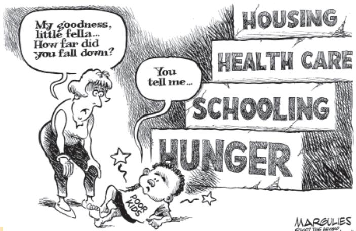  
© Jimmy Margulies - Cagle Cartoons Inc.

 Table 1 shows that on an average dictatorial regimes have had a slightly better record of economic growth. But when we compare their record only in poor countries, there is virtually no diff erence.   
 Table 2 shows that within democracies there can be very high degree of inequalities. In democratic countries like South Africa and Brazil, the top 20 per cent people take away more than 60 per cent of the national income, leaving less than 3 per cent for the bottom 20 per cent population. Countries like Denmark and Hungary are much better in this respect.   
. You can see in the cartoon, there is often inequality of opportunities available to the poorer sections.

What would be your verdict on democracy if you had to base it purely on economic performance of democratic regimes in terms of growth and equal distribution?

Table 1   
Rates of economic growth for different countries, 1950 – 2000   

<table><tr><td>Type of regimes and countries</td><td>Growth Rate</td></tr><tr><td>All democratic regimes</td><td>3.95</td></tr><tr><td>All dictatorial regimes</td><td>4.42</td></tr><tr><td>Poor countries under dictatorship</td><td>4.34</td></tr><tr><td>Poor countries under democracy</td><td>4.28</td></tr></table>

Source: A Przeworski, M E Alvarez, J A Cheibub and F Limongi, Democracy and Development: Political Institutions and Well-Being in the World, 1950 -1990. Cambridge, Cambridge University Press, 2000.

Table 2   
Inequality of income in selected countries   

<table><tr><td rowspan="2">Name of the Countries</td><td colspan="2">% share of national income</td></tr><tr><td>Top 20 %</td><td>Bottom 20 %</td></tr><tr><td>South Africa</td><td>64.8</td><td>2.9</td></tr><tr><td>Brazil</td><td>63.0</td><td>2.6</td></tr><tr><td>Russia</td><td>53.7</td><td>4.4</td></tr><tr><td>USA</td><td>50.0</td><td>4.0</td></tr><tr><td>United Kingdom</td><td>45.0</td><td>6.0</td></tr><tr><td>Denmark</td><td>34.5</td><td>9.6</td></tr><tr><td>Hungary</td><td>34.4</td><td>10.0</td></tr></table>

## Reduction of inequality and poverty

Perhaps more than development, it is reasonable to expect democracies to reduce economic disparities. Even when a country achieves economic growth, will wealth be distributed in such a way that all citizens of the country will have a share and lead a better life? Is economic growth in democracies accompanied by increased inequalities among the people? Or do democracies lead to a just distribution of goods and opportunities?

  
Voice of the Poor

Democracies are based on political equality. All individuals have equal weight in electing representatives. Parallel to the process of bringing individuals into the political arena on an equal footing, we fi nd growing economic inequalities. A small number of ultra-rich enjoy a highly disproportionate share of wealth and incomes. Not only that, their share in the total income of the country has been increasing. Those at the bottom of the society have very little to depend upon. Their incomes have clining. Sometimes they fi nd ult to meet their basic needs uch as food, clothing, house, on and health.

ctual life, democracies do ear to be very successful in g economic inequalities. In Economics textbook, you eady studied about poverty in

. The poor constitute a large

portion of our voters and no arty will like to lose their

votes. Yet democratically elected governments do not appear to be as keen to address the question of poverty as you would expect them to. The situation is much worse in some other countries. In Bangladesh, more than half of its population lives in poverty. People in several poor countries are now dependent on the rich countries even for food supplies.

Democracy is a rule of the majority. The poor are in majority. So democracy must be a rule of the poor. How can this not be the case?

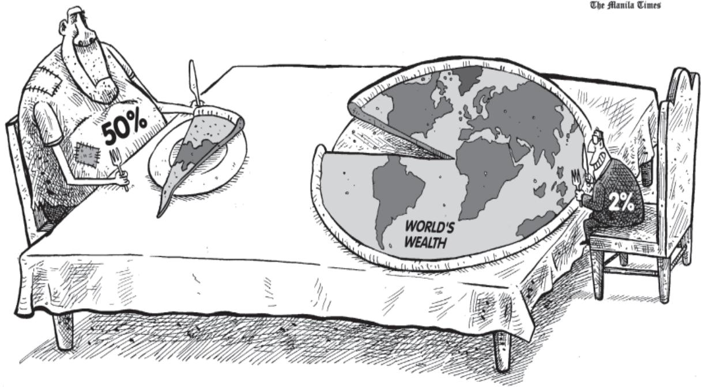

## Accommodation of social diversity

Do democracies lead to peaceful and harmonious life among citizens? It will be a fair expectation that democracy should produce a harmonious social life. We have seen in the earlier chapters how democracies accommodate various social divisions. We saw in the fi rst chapter how Belgium has successfully negotiated differences among ethnic populations. Democracies usually develop a procedure to conduct their competition. This reduces the possibility of these tensions becoming explosive or violent.

No society can fully and permanently resolve confl icts among different groups. But we can certainly learn to respect these differences and we can also evolve mechanisms to negotiate the differences. Democracy is best suited to produce this outcome. Non-democratic regimes

often turn a blind eye to or suppress internal social differences. Ability to handle social differences, divisions and confl icts is thus a defi nite plus point of democratic regimes. But the example of Sri Lanka reminds us that a democracy must fulfi l two conditions in order to achieve this outcome:

It is necessary to understand that democracy is not simply rule by majority opinion. The majority always needs to work with the minority so that governments function to represent the general view. Majority and minority opinions are not permanent.   
 It is also necessary that rule by majority does not become rule by majority community in terms of religion or race or linguistic group, etc. Rule by majority means that in case of every decision or in case of

All you are saying is that democracy ensures that people do not break each other’s head. This is not harmony. Should we be happy about it?

every election, different persons and groups may and can form a majority. Democracy remains democracy only as long as every citizen has a chance of being in majority at some point

of time. If someone is barred from being in majority on the basis of birth, then the democratic rule ceases to be accommodative for that person or group.

  
The two images depict two different kinds of effects democratic politics can have on social divisions. Take one example for each image and write a paragraph each on the outcome of democratic politics in both situations.

## Dignity and freedom of the citizens

Democracy stands much superior to any other form of government in promoting dignity and freedom of the individual. Every individual wants to receive respect from fellow beings. Often confl icts arise among individuals because some feel that they are not treated with due respect. The passion for respect and freedom are the basis of democracy. Democracies throughout the world have recognised this, at least in principle. This has been achieved

in various degrees in various democracies. For societies which have been built for long on the basis of subordination and domination, it is not a simple matter to recognise that all individuals are equal.

Take the case of dignity of women. Most societies across the world were historically male dominated societies. Long struggles by women have created some sensitivity today that respect to and equal treatment of women are

I am anxious about my board exams. But democracy has so many exams. And millions of examiners!

necessary ingredients of a democratic society. That does not mean that women are actually always treated with respect. But once the principle is recognised, it becomes easier for women to wage a struggle against what is now unacceptable legally and morally. In a non-democratic set up, this unacceptability would not have legal basis because the principle of individual freedom and dignity would not have the legal and moral force there. The same is true of caste inequalities. Democracy in India has strengthened the claims of the disadvantaged and discriminated castes for equal status and equal opportunity. There are instances still of caste-based inequalities and atrocities, but these lack the moral and legal foundations. Perhaps, it is the recognition that makes ordinary citizens value their democratic rights.

Expectations from democracy also function as the criteria for judging any democratic country.

What is most distinctive about democracy is that its examination never gets over. As democracy passes one test, it produces another test. As people get some benefi ts of democracy, they ask for more and want to make democracy even better. That is why, when we ask people about the way democracy functions, they will always come up with more expectations, and many complaints. The fact that people are complaining is itself a testimony to the success of democracy: it shows that people have developed awareness and the ability to expect and to look critically at power holders and the high and the mighty. A public expression of dissatisfaction with democracy shows the success of the democratic project: it transforms people from the status of a subject into that of a citizen. Most individuals today believe that their vote makes a difference to the way the government is run and to their own self-interest.

  
Rosa Parks Still Inspires

Belief in the effi cacy of vote is placed above the calculus of utility   
  
The above cartoon and graph illustrate a point made in this section (Dignity and freedom of the citizens). Underline the sentences from this section which connect to the cartoon or graph.

Those who say that their vote makes a difference...

1. How does democracy produce an accountable, responsive and legitimate government?   
2. What are the conditions under which democracies accommodate social diversities?   
3. Give arguments to support or oppose the following assertions:

 Industrialised countries can aff ord democracy but the poor need dictatorship to become rich.   
 Democracy can’t reduce inequality of incomes between diff erent citizens.   
 Government in poor countries should spend less on poverty reduction, health, education and spend more on industries and infrastructure.   
 In democracy all citizens have one vote, which means that there is absence of any domination and confl ict.

4. Identify the challenges to democracy in the following descriptions. Also suggest policy/institutional mechanism to deepen democracy in the given situations:

 Following a High Court directive, a temple in Orissa that had separate entry doors for dalits and non-dalits allowed entry for all from the same door.   
 A large number of farmers are committing suicide in diff erent states of India.   
 Following an allegation of killing of three civilians in Gandwara in a fake encounter by Jammu and Kashmir police, an enquiry has been ordered.

5. In the context of democracies, which of the following ideas is correct– democracies have successfully eliminated:

A. confl icts among people   
B. economic inequalities among people   
C. diff erences of opinion about how marginalised sections are to be treated   
D. the idea of political inequality

6. In the context of assessing democracy, which among the following is the odd one out. Democracies need to ensure:

A. free and fair elections   
B. dignity of the individual   
C. majority rule   
D. equal treatment before law

7. Studies on political and social inequalities in democracy show that:

A. democracy and development go together.   
B. inequalities exist in democracies.   
C. inequalities do not exist under dictatorship.   
D. dictatorship is better than democracy.

## 8. Read the passage below:

Nannu is a daily wage earner. He lives in Welcome Mazdoor Colony, a slum habitation in East Delhi. He lost his ration card and applied for a duplicate one in January 2004. He made several rounds to the local Food and Civil Supplies offi ce for the next three months. But the clerks and offi cials would not even look at him, leave alone do his job or bother to tell him the status of his application. Ultimately, he fi led an application under the Right to Information Act asking for the daily progress made on his application, names of the offi cials, who were supposed to act on his application and what action would be taken against these offi cials for their inaction. Within a week of fi ling application under the Right to Information Act, he was visited by an inspector from the Food Department, who informed him that the card had been made and he could collect it from the offi ce. When Nannu went to collect his card next day, he was given a very warm treatment by the Food and Supply Offi cer (FSO), who is the head of a Circle. The FSO off ered him tea and requested him to withdraw his application under the Right to Information, since his work had already been done.

What does Nannu’s example show? What impact did Nannu’s action have on offi cials? Ask your parents their experiences when they approach government offi cials to attend to their problems.

# Suggested Pedagogical Processes

# Learning Outcomes

# The learners may be provided with opportunities individually or in groups and encouraged to—

collect different soil samples from the surroundings; recognise them with the help of their colour, texture, and composition; relate them with the geographical areas of India shown on the map; study the process of formation of these soils.   
locate them on different types of maps of India such as, political, physical and outline map, wall map, and atlas; list and label places or areas where different agricultural crops, minerals, etc., are produced.   
use tactile maps for students with visual impairments.   
find the meaning of resources, subsistence agriculture, plantation, etc., from any dictionary of Geography.   
read different sources and discover the course of the Indian national movement till India’s independence.   
get familiarised with the concepts of nation and nationalism.   
acquaint with the writings and ideals of different social, political groups and individuals.   
collect the details of social groups which joined the Non-Cooperation Movement of 1921.   
draw a timeline on significant events of India’s national movement.   
collect the details of major languages of India and the number of persons who speak those languages from the latest reports of Census of India and discuss.   
read the Indian Constitution and discuss various parts in it.

# The learner—

recognises and retrieves facts, figures, and narrate, processes, for example,

identifies different types of soil, minerals, renewable and non-renewable energy resources, etc.   
locates areas or regions known for production of coal, iron ore, petroleum, rice, wheat, tea, coffee, rubber, and cotton textile on the map of India.   
defines important terms in Geography such as, resource, renewable and non-renewable resources, subsistence agriculture, plantation, shifting agriculture, environmental protection, and environmental sustainability.   
defines basic Economic terms associated with economic development such as, human capital, sustainable development, gross domestic product, gross value added, per capita income, human development index, multinational company, foreign trade, liberalisation and foreign investment.   
ƒ	lists different forms of money and sources of credit, rights of consumers.   
recalls names, places, dates, and people associated with some important historical events and developments such as the French Revolution, nationalism, industrialisation, globalisation, and urbanisation.   
defines terms and concepts such as, nationalism, colonialism, orientalism, democracy, satyagraha, and liberty.   
defines important terms such as, federalism, diversity, religion, and political party.

collect the economic details of states and countries. For example, based on the human development index, they can classify a few countries. They can also group or categorise countries on the basis of Gross Domestic Product (states on the basis of state domestic product), life expectancy, and infant mortality rates, etc.   
collect the details of economic activities, jobs, and occupations in their neighbourhood and group them using a few criteria, for example, organised and unorganised, formal and informal, primary-secondary-tertiary, etc.   
collect data on sources of credit from their neighbourhood—from where people borrow and group them into formal and informal.   
overlay thematic layers of maps on School Bhuvan NCERT portal, for example, distribution of rice in India and overlay layers of soils, annual rainfall, relief features and swipe these layers to establish cause and effect relationship.   
classify different types of industries based on raw materials, locate them on the map and relate them with pollution in nearby areas.   
find out about the changes in print technology in the last 100 years. Discuss the changes, why they have taken place and their consequences.   
read various provisions of the Indian Constitution as causes, and the resulting political scenario as its effects. For example, the independent status of the judiciary effected in smooth functioning of federalism.   
discuss (a) why a large section of India’s population depend on primary sector; (b) what contributed to rapid increase in service sector output.   
conduct a survey among neighbourhood, households and collect the reasons for their dependence on formal or informal sources of credit.

explains cause and effect relationship between phenomena, events, and their occurrence, for example,

ƒ	explains factors responsible for production of different crops in India.   
ƒ	explains industries and their impact on environment.   
explains the cause and effect between different historical events and developments such as, the impact of print culture on the growth of nationalism in India.   
examines the impact of technology on food availability.   
assesses the impact of the global transfer of disease in the pre-modern world in different regions of the world, for example, in the colonisation of America.   
analyses the impact of overuse of natural resources such as, ground water and crude oil.   
analyses the change in sectoral composition of gross domestic product.   
analyses the consequences of dependence on different sources of credit.

answer questions like: What do they see in these pictures? What information do they get from these labels? Why are images of gods and goddesses or important figures shown in these labels? Did British and Indian industrialists use these figures for the same purpose? What are the similarities or differences between these two labels?

study and discuss different perspectives on diversification of print and printing techniques; visit to a printing press to understand the changes in printing technology.   
critically examine the implementation of government schemes based on learners or their family’s experiences such as, Mid-day meal scheme, loan waiver schemes for farmers; scholarships through cash transfer to students; schemes to provide liquid petroleum gas to low income families: life insurance scheme for low income families/scheme of financial support for house construction, MUDRA, etc. They may be guided to supplement with data/news clippings as evidences.   
overlay maps showing distribution of resources for example, minerals, and industries on the map of India and relate it with physical features of India and climate by overlaying the layers on School Bhuvan NCERT portal and analyse the maps.   
elaborate relationship between different thematic maps using atlas.   
locate places, people, regions (affected by various treaties such as, Treaty of Versailles, economic activities, etc).   
find and draw interconnections among various regions and the difference in nomenclatures of places used for various regions and places during this period and present day, i.e., learner

y	interprets, for example,

ƒ maps   
texts   
ƒ	symbols   
ƒ	cartoons   
ƒ	photographs   
ƒ	posters   
ƒ	newspaper clippings   
ƒ	climatic regions   
ƒ	changes in maps brought out by various treaties in Europe   
ƒ	sea and land links of the trade from India to West Asia, South East Asia and other parts of the world

find out the linkages among various subjects through examples and do group projects on some topics; for example, group project on ‘Globalisation’. Teachers may raise questions like, is it a new phenomenon or does it have a long history? When did this process start and why? What are the impacts of globalisation on primary, secondary and tertiary activities? Does it lead to inequality in the world? What is the importance of global institutions? Do these institutions play a major role in globalisation? How do they influence the developed countries? What do you mean by global economy? Is economic globalisation a new phenomenon? Are environmental issues global problems or local problems? How can globalisation potentially contribute to better environment?   
study the rate and features of economic growth in democracies and those under dictatorship.   
examine time series data on GDP and other economic aspects since 1950s.   
debate on (a) How India’s freedom struggle was related to India’s economy? (b) Why India did not go for privatisation of manufacturing activities after 1947? (c) Why have developed nations started to depend on countries such as, India for leather and textile goods more now? (d) Why multinational corporations from developed nations set up their production and assembly units in developing countries and not in their own countries and what are its impacts on employment in their own countries?   
discuss on why manufacturing sector multinational companies (Gurugram in Haryana) and service sector multinational companies (Bengaluru in Karnataka) are located at specific places—the relevance of geographic factors.

ƒ	shows the linkages between economic development and democracy.

show industrial regions on map and relate it with infrastructural development of that region. Why are industries located nearby rivers, railways, highways, raw material producing areas, market, etc.?   
show water scarcity in visuals such as, snow covered areas of Kashmir, dry regions of Gujarat and flood prone areas of West Bengal; learners may be asked to investigate reasons of water scarcity of each region located in different climatic areas and prepare a report or chart.   
answer questions like ‘Why did various classes and groups of Indians participate in the Civil Disobedience Movement?’ or ‘How did the Indian National Congress respond to the Partition of Bengal and why? and point out to them the need to look for supplementary literature on issues, events, and personalities in which they may express an interest to know more.   
participate in teacher-guided debates on the advantages and drawbacks of democracy.   
choose one example from economics related with developmental issues and collect economic information and come out with solutions, for example, (a) employment (is India generating employment opportunities sufficiently?) (b) GDP (why only service sector is able to increase its share much more than other sectors?), (c) financial issues (how to improve credit access to low income families?).   
challenge assumptions and be motivated to come out with creative solutions to specific social, economic or political issues in their area, region or state.

demonstrates inquisitiveness, enquiry, for example, pose questions related to the—

concentration of industries in certain areas.   
ƒ	scarcity of potable water.   
ƒ	role of women in the nationalist struggles of different countries.   
ƒ	various aspects of financial literacy.   
ƒ	working of democracy from local to national levels.

collect problems related to agriculture in one’s own area and come out with remedial measures.   
imagine a conversation between a British industrialist and an Indian industrialist, who is being persuaded to set up a new industry. Learners in such a role play answer questions, such as, (a) what reasons would the British industrialist give to persuade the Indian industrialist? and (b) what opportunities and benefits the Indian industrialist is looking for?   
conduct extra-curricular activities, daily chores in the school, sports, cultural programmes by students to help decision making and develop problem solving skills.   
describe their goals in life and how they are going to achieve them.   
review sources of credit and their impact. They can be encouraged to discuss various solutions for easy access to credit with low interest rates.   
come out with new ways of generating employment or creating new jobs.   
submit group projects suggesting the steps to be followed in their daily life promoting sustainable development practices.   
discuss the work done by peer or differently abled persons and the need to cooperate with each other.   
provide illustrative, examples, of conflicts on several issues, such as, river water/dam/land, industry/ forestland and forest dwellers, etc., through textbooks, newspapers, etc. They may be guided to debate these issues in groups and come out with creative solutions.   
read stories of real life experiences of individuals and communities of the

# illustrates decision making/problem solving skills, for example,

comes out with solutions to issues in one’s own area such as,: (a) problems related to agriculture and transport, (b) generate employment opportunities, improve access to credit for low income families and (c) assesses how certain developments in colonial India were useful for both colonisers as well as nationalists in different fields such as, literature, transportation and industries.

# shows sensitivity and appreciation skills, for example,

ƒ	empathises with differently abled and other marginalised sections of the society, such as, forest dwellers, refugees and unorganised sector workers   
ƒ	appreciates political diversity   
ƒ	appreciates cultural diversity   
ƒ	appreciates religious diversity   
ƒ	recognises social diversity   
ƒ	empathises with the people who were affected by displacement, extremism

Use audio visual materials like films and videos to explain abstract concepts; for example, discrimination, stereotyping, etc.   
Develop embossed timeline for memorising; for example, different historical periods.   
Organise group work involving debates, quizzes, map reading activities, etc.   
Organise excursions, trips and visits to historical places (educational tour).   
Involve students in exploring the environment using other senses like smell and touch.   
y	Give a brief overview at the beginning of each lesson.   
y	Provide photocopies of the relevant key information from the lesson.   
y	Highlight or underline the key points and words.   
Use visual or graphic organisers like timelines (especially for explaining chronology of events), flow charts, posters, etc.   
Organise group work involving activities like cut and paste, and make use of pictorial displays, models, pictures, posters, flash cards or any visual items to illustrate the facts and concepts.   
y	Plan occasions with real life experiences.   
y	Use films or documentaries and videos.   
Use magazines, scrapbooks and newspapers, etc., to help learners understand the textual material.   
y	Draw links with what has been taught earlier.   
y	Make use of multisensory inputs.   
y	All examples given with pictures in the textbook can be narrated (using flash cards, if required).   
While teaching the chapters, use graphic organisers, timelines and tables as this will make the task simpler.   
y	Maps should be enlarged and colour coded.   
The text, along with pictures, can be enlarged, made into picture cards and presented sequentially as a story. Sequencing makes it easier to connect information.   
Asking relevant questions frequently to check how much the learner has learnt as it helps in assimilating information.   
Teach and evaluate in different ways, for example, through dramatisation, field trips, real life examples, project work, etc.   
y	Highlight all the important phrases and information.   
y	Pictures may be labelled and captioned.